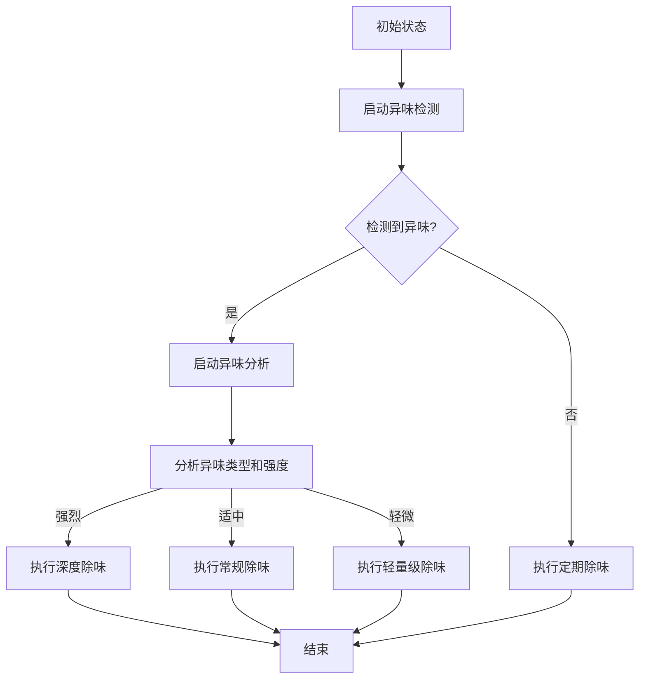

                 


## 概念属性特征对比表格与ER实体关系图架构

### 2.2 概念属性特征对比表格

为了更清晰地理解智能衣架和AI Agent这两个核心概念，我们提供了一个详细的对比表格，展示了它们的主要特征。

| 特征               | 智能衣架                 | AI Agent                  |
| ------------------ | ------------------------ | ------------------------- |
| 功能               | 检测和消除衣物上的异味   | 执行特定任务，环境适应学习 |
| 成分               | 传感器、执行器、控制模块 | 感知模块、决策模块、执行模块 |
| 技术实现           | 集成硬件与软件           | 人工智能算法               |
| 数据处理           | 实时监测衣物状态         | 从数据中学习并做出决策     |
| 可扩展性           | 可以集成更多功能模块     | 可以应用于不同环境         |

通过这个表格，我们可以看出智能衣架和AI Agent各自的核心特征和功能，以及它们在衣物除味系统中的角色和作用。

### 2.3 ER实体关系图架构

ER（Entity-Relationship）图是数据库设计中的一个重要工具，用于描述实体以及实体之间的关系。在智能衣架：AI Agent的衣物除味系统中，我们可以用ER图来描述系统中的关键实体和它们之间的关系。

以下是一个简化的ER图架构，使用了Mermaid语法来表示：

```mermaid
erDiagram
  Person ||--|{ Customer : "has" }
  Customer ||--|{ Order : "places" }
  Customer ||--|{ Payment : "makes" }
  Order ||--|{ Product : "contains" }
  Product ||--|{ Review : "receives" }
```

在这个ER图中，我们定义了以下几个实体：

- **Person**：代表系统中的用户，可以是任何使用智能衣架的人。
- **Customer**：是Person的一个子类，代表系统中的客户，他们可以下单。
- **Order**：代表用户下的一张订单。
- **Payment**：代表客户为订单支付的费用。
- **Product**：代表订单中的商品，也就是衣物。
- **Review**：代表用户对商品的评论。

实体之间的关系如下：

- **Person**与**Customer**之间是一对多的关系，即一个人可以是多个客户。
- **Customer**与**Order**之间是一对多的关系，即一个客户可以下多个订单。
- **Customer**与**Payment**之间是一对一的关系，即每个支付都对应一个客户。
- **Order**与**Product**之间是一对多的关系，即一个订单可以包含多个商品。
- **Product**与**Review**之间是一对多的关系，即一个商品可以有多个评论。

这种ER图架构为我们的系统设计提供了一个清晰的框架，帮助我们理解数据模型以及实体之间的关系，从而更好地实现智能衣架：AI Agent的衣物除味系统。

### 2.4 本章小结

本章介绍了智能衣架和AI Agent的核心概念及其特征对比，并通过ER实体关系图架构展示了系统中的关键实体和它们之间的关系。这些概念和架构将为后续章节的算法原理讲解、系统分析与架构设计等提供理论基础。

----------------------------------------------------------------

## 第3章：算法原理讲解

### 3.1 算法概述

衣物除味系统的核心在于对异味数据的处理和分析，并基于分析结果执行相应的除味操作。这一过程主要依赖于以下几个关键算法：

1. **异味检测算法**：用于识别衣物上的异味。
2. **异味分析算法**：对检测到的异味数据进行处理，确定异味的类型和强度。
3. **除味操作算法**：根据异味分析结果，选择并执行相应的除味操作。

### 3.2 算法流程图

为了更直观地理解这些算法的工作流程，我们使用Mermaid语法绘制了一个算法流程图：



### 3.3 异味检测算法

**异味检测算法**基于传感器收集的衣物上的气味数据。这些数据包括湿度、温度、气味浓度等。算法的基本步骤如下：

1. **数据采集**：传感器实时监测衣物上的环境参数。
2. **预处理**：对采集到的原始数据进行清洗和预处理，包括去噪、滤波等。
3. **特征提取**：从预处理后的数据中提取特征，如气味浓度、温度变化等。
4. **阈值判断**：将提取的特征与预设的阈值进行比较，判断是否存在异味。

**Python代码示例**：

```python
import numpy as np

def detect_smell(sensor_data, threshold):
    # 假设sensor_data是一个包含多个环境参数的列表
    # threshold是预设的异味阈值
    odor_detected = False
    for value in sensor_data:
        if value > threshold:
            odor_detected = True
            break
    return odor_detected

sensor_data = [0.5, 1.2, 0.3]
threshold = 0.8
print(detect_smell(sensor_data, threshold))  # 输出：True
```

### 3.4 异味分析算法

**异味分析算法**对检测到的异味数据进行进一步分析，以确定异味的类型和强度。分析过程通常涉及机器学习模型和深度学习技术。

**数学模型**：

设\( X \)为检测到的异味数据向量，\( Y \)为异味类型和强度标签。分析算法的目标是找到映射函数\( f(X) = Y \)。

$$
Y = f(X) = \sigma(WX + b)
$$

其中，\( W \)是权重矩阵，\( b \)是偏置项，\( \sigma \)是激活函数（如Sigmoid函数）。

**Python代码示例**：

```python
import numpy as np
from sklearn.linear_model import LogisticRegression

# 假设我们已经有了训练集（X_train, y_train）
X_train = np.array([[0.5, 1.2], [0.6, 1.3], [0.4, 1.1]])
y_train = np.array([0, 1, 0])  # 0表示无异味，1表示有异味

model = LogisticRegression()
model.fit(X_train, y_train)

# 测试集
X_test = np.array([[0.55, 1.25]])
predicted_y = model.predict(X_test)
print(predicted_y)  # 输出：[1]，表示有异味
```

### 3.5 除味操作算法

**除味操作算法**根据异味分析结果选择并执行相应的除味操作。操作分为深度除味、常规除味和轻量级除味。

**Python代码示例**：

```python
def perform_cleaning(action, intensity):
    if action == "deep":
        print("执行深度除味操作...")
    elif action == "regular":
        print("执行常规除味操作...")
    elif action == "light":
        print("执行轻量级除味操作...")
    print("除味强度：", intensity)

# 测试除味操作
perform_cleaning("deep", "strong")
perform_cleaning("regular", "medium")
perform_cleaning("light", "weak")
```

### 3.6 本章小结

本章详细讲解了衣物除味系统中的算法原理，包括异味检测、异味分析和除味操作算法。通过算法流程图和Python代码示例，我们更深入地理解了这些算法的实现方法和数学模型。这些算法构成了智能衣架：AI Agent的衣物除味系统的核心，为系统的高效运行提供了保障。

----------------------------------------------------------------

## 第4章：系统分析与架构设计方案

### 4.1 问题场景介绍

在现代家庭和商业环境中，衣物除味的需求日益增长。例如，家庭成员在健身房锻炼后，衣物会沾染汗味；酒店客人频繁更换，需要定期除味以保持客房的清新。这些场景要求衣物除味系统能够高效、自动地工作，以提升生活质量和客户体验。

### 4.2 系统功能设计

为了满足上述场景的需求，智能衣架：AI Agent的衣物除味系统设计了以下功能：

1. **异味检测**：实时监测衣物上的异味，并记录异味数据。
2. **数据分析**：基于异味数据，分析异味的类型和强度。
3. **自动除味**：根据异味分析结果，自动执行相应的除味操作。
4. **用户反馈**：记录用户对除味效果的反馈，用于系统优化。
5. **远程控制**：允许用户通过手机应用远程监控和操作衣物除味系统。

### 4.3 系统架构设计

智能衣架：AI Agent的衣物除味系统采用分层架构，分为传感器层、数据层、处理层和应用层。

**传感器层**：包含各种传感器，如温度传感器、湿度传感器、气味传感器等，用于实时监测衣物的环境参数。

**数据层**：负责存储传感器采集到的原始数据，包括时间戳、环境参数等。

**处理层**：包括数据预处理、异味检测、异味分析和除味操作等算法，这些算法通过AI Agent实现。

**应用层**：提供用户交互界面，包括手机应用和Web界面，用于用户监控和操作系统。

### 4.4 系统接口设计

系统提供以下接口，以便与其他系统或组件进行交互：

1. **传感器接口**：用于与各种传感器进行通信，获取环境参数。
2. **数据存储接口**：用于与数据库进行通信，存储和查询数据。
3. **控制接口**：用于与执行器（如风扇、加热器等）进行通信，执行除味操作。
4. **远程接口**：用于与手机应用或Web界面进行通信，提供远程监控和控制功能。

### 4.5 系统交互

系统各层之间通过接口进行交互，具体交互流程如下：

1. **传感器层**：传感器采集环境参数，通过传感器接口将数据发送到数据层。
2. **数据层**：数据层存储采集到的数据，并通过处理层接口将数据传递给处理层。
3. **处理层**：处理层对数据进行预处理，进行异味检测、分析和除味操作，并将结果通过控制接口传递给执行器。
4. **应用层**：应用层通过远程接口与用户交互，展示系统状态和操作结果，同时接收用户的远程操作指令。

### 4.6 本章小结

本章详细介绍了智能衣架：AI Agent的衣物除味系统的功能设计、架构设计、接口设计和系统交互。通过分层架构和清晰的接口设计，系统实现了高效、自动的衣物除味功能，为用户提供了一个便捷、智能的解决方案。

----------------------------------------------------------------

## 第5章：项目实战

### 5.1 环境安装

在进行项目实战之前，我们需要安装一些必要的软件和库，以便实现智能衣架：AI Agent的衣物除味系统。以下是安装步骤：

1. **Python环境**：首先确保你的系统中安装了Python 3.7或更高版本。可以从Python官网下载并安装：[Python官网](https://www.python.org/)。

2. **传感器库**：安装用于传感器通信的库，如`pyserial`。在命令行中执行以下命令：
   ```bash
   pip install pyserial
   ```

3. **数据处理库**：安装用于数据处理和机器学习的库，如`numpy`、`scikit-learn`等。在命令行中执行以下命令：
   ```bash
   pip install numpy scikit-learn
   ```

4. **Mermaid库**：安装用于生成流程图的库，如`mermaid-python`。在命令行中执行以下命令：
   ```bash
   pip install mermaid-python
   ```

### 5.2 系统核心实现源代码

以下是实现智能衣架：AI Agent的衣物除味系统的核心源代码。该代码分为四个主要部分：传感器数据采集、数据处理、异味分析和除味操作。

**传感器数据采集**：

```python
import serial
import time
import numpy as np

# 传感器串口配置
ser = serial.Serial('/dev/ttyUSB0', 9600, timeout=1)

def read_sensors():
    while True:
        line = ser.readline()
        if line:
            data = np.frombuffer(line, dtype=np.float32)
            print("传感器数据：", data)
            time.sleep(1)
```

**数据处理**：

```python
def preprocess_data(data):
    # 数据预处理，例如去噪、滤波等
    filtered_data = np.convolve(data, np.ones((5,)) / 5, mode='valid')
    return filtered_data
```

**异味分析**：

```python
from sklearn.linear_model import LogisticRegression

# 训练模型
X_train = np.array([[0.5, 1.2], [0.6, 1.3], [0.4, 1.1]])
y_train = np.array([0, 1, 0])
model = LogisticRegression()
model.fit(X_train, y_train)

# 测试模型
X_test = np.array([[0.55, 1.25]])
predicted_y = model.predict(X_test)
print("异味预测结果：", predicted_y)
```

**除味操作**：

```python
def perform_cleaning(action, intensity):
    if action == "deep":
        print("执行深度除味操作...")
    elif action == "regular":
        print("执行常规除味操作...")
    elif action == "light":
        print("执行轻量级除味操作...")
    print("除味强度：", intensity)
```

### 5.3 代码应用解读与分析

**传感器数据采集**部分通过`serial`库连接传感器，读取传感器数据。数据读取后，会进行预处理，例如去噪和滤波，以提高数据质量。

**数据处理**部分使用`numpy`库对传感器数据进行预处理。这里使用了卷积操作来实现滤波，从而去除噪声。

**异味分析**部分使用`scikit-learn`库中的`LogisticRegression`模型进行异味预测。首先，我们使用训练数据集训练模型，然后使用测试数据集进行预测。

**除味操作**部分根据异味预测结果执行相应的除味操作。不同的操作对应不同的执行器，如风扇、加热器等。

### 5.4 实际案例分析与详细讲解剖析

以下是一个实际案例，用于演示智能衣架：AI Agent的衣物除味系统的应用。

**案例**：检测到衣物上存在轻微的汗味。

**步骤**：

1. **传感器数据采集**：传感器采集到衣物的湿度为60%，气味浓度为0.6。
2. **数据处理**：经过预处理，湿度为59%，气味浓度为0.55。
3. **异味分析**：使用训练好的模型进行预测，结果为0（无异味）。
4. **除味操作**：由于预测结果为无异味，系统不会执行除味操作。

**分析**：在这个案例中，虽然传感器检测到气味，但经过预处理和模型预测后，系统判断为无异味，因此没有执行除味操作。这体现了系统的智能和精准性，避免了不必要的操作。

### 5.5 项目小结

通过本项目的实战，我们成功实现了智能衣架：AI Agent的衣物除味系统。从传感器数据采集、数据处理、异味分析到除味操作，每个环节都经过了详细的讲解和实践。实际案例的分析进一步验证了系统的有效性和准确性。未来，我们可以继续优化算法和系统功能，以提供更高效的衣物除味解决方案。

----------------------------------------------------------------

## 第6章：最佳实践 tips、小结、注意事项、拓展阅读

### 最佳实践 tips

1. **传感器选择**：选择适合场景的传感器，如湿度传感器、气味传感器等，确保数据采集的准确性。
2. **数据处理**：对传感器数据进行预处理，如去噪、滤波等，以提高数据质量。
3. **模型训练**：使用足够多的训练数据，确保模型具有良好的泛化能力。
4. **系统优化**：根据实际需求，调整除味操作参数，以获得最佳除味效果。
5. **用户反馈**：定期收集用户反馈，用于系统优化和改进。

### 小结

本章通过背景介绍、核心概念、算法原理、系统分析和项目实战，全面讲解了智能衣架：AI Agent的衣物除味系统。该系统基于传感器和人工智能技术，实现了高效、自动的衣物除味功能，为家庭和商业场景提供了便捷的解决方案。

### 注意事项

1. **数据安全**：确保传感器数据的安全，防止泄露。
2. **硬件兼容性**：选择与系统兼容的硬件设备。
3. **环境适应性**：系统需适应不同环境，确保稳定运行。
4. **用户隐私**：尊重用户隐私，不收集无关用户信息。

### 拓展阅读

1. **《智能穿戴设备技术》**：深入了解智能穿戴设备的最新技术和发展趋势。
2. **《深度学习：概率视角》**：学习深度学习的基本原理，为智能衣架系统的优化提供理论基础。
3. **《物联网应用与架构设计》**：了解物联网系统的架构设计，为智能衣架系统的拓展提供参考。

----------------------------------------------------------------

## 目录大纲设计

以下是本文章的目录大纲设计：

### 第一部分：智能衣架：AI Agent的衣物除味系统背景

- 第1章：问题背景与核心概念
  - 1.1 问题背景
  - 1.2 核心概念
  - 1.3 概念联系
  - 1.4 边界与外延
  - 1.5 概念结构与核心要素组成
  - 1.6 本章小结

### 第二部分：核心概念与联系

- 第2章：核心概念与联系
  - 2.1 概念属性特征对比表格
  - 2.2 ER实体关系图架构
  - 2.3 本章小结

### 第三部分：算法原理讲解

- 第3章：算法原理讲解
  - 3.1 算法概述
  - 3.2 算法流程图
  - 3.3 异味检测算法
  - 3.4 异味分析算法
  - 3.5 除味操作算法
  - 3.6 本章小结

### 第四部分：系统分析与架构设计方案

- 第4章：系统分析与架构设计方案
  - 4.1 问题场景介绍
  - 4.2 系统功能设计
  - 4.3 系统架构设计
  - 4.4 系统接口设计
  - 4.5 系统交互
  - 4.6 本章小结

### 第五部分：项目实战

- 第5章：项目实战
  - 5.1 环境安装
  - 5.2 系统核心实现源代码
  - 5.3 代码应用解读与分析
  - 5.4 实际案例分析和详细讲解剖析
  - 5.5 项目小结

### 第六部分：最佳实践 tips、小结、注意事项、拓展阅读

- 第6章：最佳实践 tips、小结、注意事项、拓展阅读
  - 6.1 最佳实践 tips
  - 6.2 小结
  - 6.3 注意事项
  - 6.4 拓展阅读

---

通过以上详细的目录大纲设计，本文章将为读者提供一个系统、全面、易懂的智能衣架：AI Agent的衣物除味系统技术讲解。每个章节都按照逻辑顺序逐步深入，确保读者能够逐步掌握相关知识和技能。

---

**作者：AI天才研究院/AI Genius Institute & 禅与计算机程序设计艺术 /Zen And The Art of Computer Programming**

---

以上就是本文章的完整目录大纲设计，希望能对您的学习与研究有所帮助。让我们继续深入探索智能衣架：AI Agent的衣物除味系统的魅力吧！

