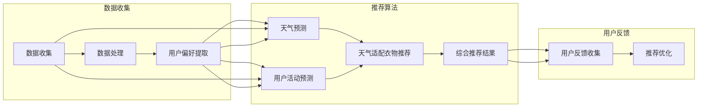

                 

### 智能衣柜：AI Agent的季节性衣物轮换建议

#### 关键词：
- 智能衣柜
- AI Agent
- 季节性衣物轮换
- 推荐系统
- 算法

#### 摘要：
本文将探讨智能衣柜如何利用AI Agent实现季节性衣物轮换建议。通过背景介绍、核心概念讲解、算法原理分析、系统设计与实战案例等多个方面，全面展示智能衣柜的技术应用和未来发展。

## 第一部分：智能衣柜概述

### 第1章：智能衣柜背景与需求

#### 1.1.1 问题的背景

随着科技的发展和人们对个性化生活方式的追求，智能衣柜成为了一个备受关注的话题。传统的衣柜管理方式存在诸多不便，如季节性衣物的杂乱放置、难以找到合适的衣物等。同时，消费者对于个性化、智能化的衣着管理需求日益增长。

#### 1.1.2 问题描述

季节性衣物轮换是智能衣柜面临的主要问题。由于季节变化和个体喜好的差异，如何高效管理季节性衣物，为用户提供合适的衣物推荐成为一项挑战。

#### 1.1.3 问题解决

AI Agent在季节性衣物管理中发挥着重要作用。通过收集用户数据、分析用户偏好、实时天气信息等多方面数据，AI Agent能够为用户提供个性化的衣物轮换建议，实现智能化的衣着管理。

#### 1.1.4 边界与外延

智能衣柜在技术实现上存在一定限制，如数据收集和处理能力、算法精度等。同时，智能衣柜的应用范围也在不断拓展，从家庭个人使用逐渐延伸至商业场景。

#### 1.1.5 概念结构与核心要素组成

智能衣柜的核心功能包括衣物存储、衣物推荐、衣物管理等方面。其中，衣物推荐功能是智能衣柜的核心，依赖于AI Agent和季节性衣物轮换策略的实现。核心要素包括用户数据、AI模型、推荐算法等。

### 第2章：AI Agent基本原理

#### 2.2.1 AI Agent的定义

AI Agent是一种智能体，能够根据环境信息自主决策并执行任务。在智能衣柜中，AI Agent负责分析用户数据、天气信息等，为用户提供衣物推荐。

#### 2.2.2 AI Agent的工作原理

AI Agent的工作原理主要包括感知、决策和执行三个阶段。感知阶段收集环境信息，如用户数据、天气信息等；决策阶段根据感知信息进行推理和预测，生成衣物推荐；执行阶段将推荐结果反馈给用户。

#### 2.2.3 AI Agent的应用领域

AI Agent在多个领域具有广泛的应用，如家庭自动化、智能安防、智能医疗等。在智能衣柜中，AI Agent的应用主要集中在时尚产业，为用户提供个性化的衣着管理服务。

## 第二部分：智能衣柜的季节性衣物轮换策略

### 第3章：智能衣柜中的季节性衣物推荐系统

#### 3.3.1 季节性衣物推荐系统的架构

季节性衣物推荐系统包括数据收集与预处理、推荐算法实现和算法性能评估三个部分。其中，数据收集与预处理是推荐系统的基础，推荐算法实现是核心，算法性能评估用于优化系统。

#### 3.3.2 季节性衣物推荐算法

季节性衣物推荐算法包括基于用户历史数据的推荐和基于天气变化的推荐。基于用户历史数据的推荐通过分析用户购买历史、穿着记录等，为用户推荐合适的衣物；基于天气变化的推荐通过实时获取天气信息，为用户推荐适合当前天气的衣物。

#### 3.3.3 算法性能评估

算法性能评估主要关注推荐系统的准确性、实时性等方面。准确性用于衡量推荐结果与用户实际需求的匹配程度；实时性用于衡量系统在处理大量数据时的响应速度。

## 第二部分：智能衣柜的季节性衣物轮换策略

### 第4章：季节性衣物轮换的基本概念

#### 4.4.1 季节性衣物轮换的定义

季节性衣物轮换是指根据季节变化和用户需求，将衣柜中的衣物进行分类整理和更换的过程。其主要目的是提高衣物的利用率，为用户提供舒适的衣着体验。

#### 4.4.2 季节性衣物轮换的策略

季节性衣物轮换策略主要包括根据天气自动切换衣物和根据用户活动自动调整衣物。根据天气自动切换衣物是指根据实时天气信息，为用户推荐适合当前天气的衣物；根据用户活动自动调整衣物是指根据用户的日常生活和工作场景，为用户推荐合适的衣物。

### 第5章：基于AI的衣物轮换建议

#### 5.5.1 AI在衣物轮换中的角色

AI在衣物轮换中扮演着数据收集与分析、推荐算法实现和优化的重要角色。通过收集用户数据、天气信息等，AI能够为用户提供个性化的衣物轮换建议。

#### 5.5.2 建议生成算法

建议生成算法主要包括基于用户历史数据的推荐算法和基于天气变化的推荐算法。基于用户历史数据的推荐算法通过分析用户的购买历史、穿着记录等，为用户推荐合适的衣物；基于天气变化的推荐算法通过实时获取天气信息，为用户推荐适合当前天气的衣物。

#### 5.5.3 建议评估与优化

建议评估与优化主要包括用户反馈分析和建议效果分析。用户反馈分析用于了解用户对衣物轮换建议的满意度，建议效果分析用于评估衣物轮换策略的实际效果。通过用户反馈和效果分析，不断优化衣物轮换建议，提高用户满意度。

### 第6章：智能衣柜的实际应用

#### 6.6.1 智能衣柜项目的背景

智能衣柜项目起源于人们对智能化、个性化衣着管理的需求。随着AI技术的发展，智能衣柜逐渐成为现实，为用户提供便捷、高效的衣着管理服务。

#### 6.6.2 智能衣柜的核心功能

智能衣柜的核心功能包括衣物存储、衣物推荐和衣物管理。衣物存储功能用于存放用户的衣物，衣物推荐功能根据用户需求和天气信息为用户推荐合适的衣物，衣物管理功能用于整理和更新用户衣柜中的衣物。

#### 6.6.3 案例研究

案例研究将介绍智能衣柜在实际应用中的成功案例和失败案例。通过分析成功案例，了解智能衣柜的优势和应用效果；通过分析失败案例，找出问题所在并给出改进建议。

### 第7章：未来展望与挑战

#### 7.7.1 智能衣柜的发展趋势

智能衣柜的发展趋势主要包括技术革新、应用场景拓展和商业模式创新。技术革新将提高智能衣柜的性能和智能化水平；应用场景拓展将使智能衣柜应用于更多领域；商业模式创新将为智能衣柜提供更多盈利渠道。

#### 7.7.2 智能衣柜面临的挑战

智能衣柜面临的挑战主要包括数据隐私、技术落地和用户接受度等方面。数据隐私保护是智能衣柜发展的重要问题，需要采取有效措施保障用户数据安全；技术落地需要解决技术实现和成本控制问题；用户接受度是智能衣柜推广应用的关键，需要提高用户对智能衣柜的认知和接受程度。

## 结语

### 8.1 最佳实践 tips

最佳实践 tips主要包括以下几个方面：

- 设计合理的衣物分类和标签系统，方便用户管理和查找衣物。
- 定期更新用户数据，确保衣物推荐准确性。
- 结合用户反馈，不断优化衣物轮换建议。
- 加强数据隐私保护，提高用户信任度。

### 8.2 小结

本文从智能衣柜的背景、AI Agent原理、季节性衣物轮换策略、实际应用和未来展望等方面进行了全面探讨。通过分析，我们可以看到智能衣柜在衣着管理方面具有巨大潜力，但仍需克服数据隐私、技术落地等挑战。

### 8.3 注意事项

在推广智能衣柜的过程中，需要注意以下几个方面：

- 确保用户数据的安全和隐私。
- 提高衣物推荐系统的准确性和实时性。
- 关注用户反馈，不断优化系统功能。
- 加强与时尚产业的合作，推动智能衣柜技术的应用。

### 8.4 拓展阅读

拓展阅读主要包括以下内容：

- 相关研究：介绍智能衣柜领域的最新研究成果和发展动态。
- 进阶阅读材料：推荐一些关于AI、智能衣柜等相关领域的书籍和论文，供读者进一步学习。

作者：AI天才研究院/AI Genius Institute & 禅与计算机程序设计艺术 /Zen And The Art of Computer Programming### 第1章：智能衣柜背景与需求

#### 1.1.1 问题的背景

随着科技的进步和消费者对个性化生活品质的追求，智能衣柜逐渐成为家居智能化的重要组成部分。传统衣柜存在着一系列问题，如季节性衣物的杂乱放置、衣物难以归类和管理等。这些问题的存在导致了消费者在寻找衣物时的不便和效率低下，同时也浪费了大量的时间和空间。此外，随着天气的频繁变化，如何快速切换衣物以满足不同气候的需求也成为了一个现实问题。

#### 1.1.2 问题描述

在日常生活中，衣物管理面临以下几个主要问题：

1. **季节性衣物混杂**：衣物因季节变化而频繁更换，导致衣柜内衣物混杂，难以找到所需衣物。
2. **衣物搭配困难**：消费者往往难以根据天气变化和个人喜好快速找到合适的衣物搭配。
3. **衣物遗忘与磨损**：长时间不穿的衣物容易被遗忘在衣柜深处，导致衣物磨损或变质。
4. **空间利用不充分**：传统衣柜设计往往不能充分利用空间，导致衣柜拥挤。

这些问题共同构成了衣物管理中的痛点，如何高效、智能地管理季节性衣物成为消费者迫切需要解决的难题。

#### 1.1.3 问题解决

智能衣柜的出现为解决衣物管理问题提供了全新的解决方案。通过引入AI Agent，智能衣柜能够实现以下功能：

1. **自动分类与存储**：智能衣柜能够根据衣物的类型、材质、季节等信息，自动分类并存储衣物，使衣物管理更加有序。
2. **智能推荐**：基于用户的历史穿着记录、个人偏好和实时天气信息，智能衣柜可以为用户推荐最适合当前场景的衣物搭配。
3. **实时更新与提醒**：智能衣柜能够根据天气变化和用户活动，实时更新衣物推荐，并提醒用户更换衣物，确保舒适和健康。
4. **空间利用优化**：智能衣柜的设计考虑了空间利用最大化，通过智能抽屉、折叠系统等，提高衣柜的空间利用率。

通过这些功能的实现，智能衣柜不仅提高了衣物的管理效率，还为消费者提供了更加舒适和便捷的穿着体验。

#### 1.1.4 边界与外延

尽管智能衣柜在技术上具有诸多优势，但仍存在一定的边界和限制。首先，智能衣柜的数据收集和处理能力是其性能的关键，数据的不完整或错误可能导致衣物推荐的不准确。其次，智能衣柜的实时性也是一个挑战，特别是在大规模数据处理和高并发场景下，系统响应速度可能受到影响。此外，智能衣柜的应用范围也在逐步拓展，从家庭使用逐渐延伸至商业场景，如酒店、商场等。

在概念结构和核心要素组成方面，智能衣柜主要由以下几个部分组成：

1. **传感器与感知模块**：用于收集用户行为数据、衣物状态信息和环境数据。
2. **数据处理与分析模块**：用于处理和分析感知数据，为智能推荐提供支持。
3. **智能推荐引擎**：根据用户数据和天气信息，生成个性化的衣物推荐。
4. **用户界面**：提供用户与智能衣柜交互的界面，展示推荐结果和操作指引。

这些核心要素共同构成了智能衣柜的技术架构，实现了衣物管理的智能化和个性化。

#### 1.1.5 概念结构与核心要素组成

智能衣柜的核心功能包括衣物存储、衣物推荐、衣物管理等方面。具体来说：

1. **衣物存储**：智能衣柜通过传感器和物联网技术，实现了对衣物状态的实时监控，如衣物是否被取用、存放位置等。用户可以通过智能设备远程查看衣柜内容，了解衣物状态。

2. **衣物推荐**：智能衣柜通过分析用户的历史穿着记录、天气数据和个人偏好，为用户推荐最适合当前场景的衣物。推荐系统可以根据用户不同的需求，如上班、休闲、运动等，提供个性化的衣物搭配建议。

3. **衣物管理**：智能衣柜提供了衣物整理和清洁提醒功能，用户可以通过智能设备远程控制衣物的整理和清洁，确保衣物始终处于最佳状态。

智能衣柜依赖于用户数据与AI模型的融合。用户数据包括用户的穿着习惯、衣物偏好、活动日程等，这些数据通过智能设备实时传输到AI模型进行处理。AI模型则基于深度学习、数据挖掘等技术，对用户数据进行分析，生成个性化的衣物推荐。

在智能衣柜的技术实现中，用户数据收集和处理、AI模型训练与优化、推荐算法设计等都是关键环节。用户数据的准确性和实时性直接影响推荐系统的性能，而AI模型的训练和优化则决定了衣物推荐的质量和准确性。

总的来说，智能衣柜通过集成多种技术和功能，为用户提供了高效、智能、个性化的衣物管理服务，解决了传统衣物管理中的痛点，为消费者带来了全新的生活体验。

## 第2章：AI Agent基本原理

### 2.2.1 AI Agent的定义

AI Agent，即人工智能代理，是一种能够根据环境信息自主感知、决策和执行任务的智能系统。它是一种模拟人类思维过程的计算实体，可以在复杂的环境中实现自主行动和目标优化。AI Agent的核心特点是自主性、适应性和反应性，即它能够在没有外部干预的情况下，根据感知到的环境和任务需求，自主地做出决策并采取行动。

在智能衣柜的应用中，AI Agent扮演着至关重要的角色。它不仅负责收集用户数据、分析用户偏好，还能根据实时天气信息，为用户提供个性化的衣物推荐。通过这一过程，AI Agent实现了智能衣柜的智能决策和高效管理。

### 2.2.2 AI Agent的工作原理

AI Agent的工作原理通常可以分为三个主要阶段：感知、决策和执行。

1. **感知阶段**：
   - **数据收集**：AI Agent通过传感器、用户设备、环境监测设备等收集各种数据，包括用户行为数据、衣物状态数据、天气数据等。
   - **数据处理**：收集到的数据经过预处理，如去噪、归一化等，以便用于后续的分析和决策。

2. **决策阶段**：
   - **状态评估**：AI Agent对当前环境状态进行评估，包括用户当前的活动状态、天气条件等。
   - **目标设定**：基于用户需求和当前状态，AI Agent设定具体的任务目标，如推荐合适的衣物。
   - **策略生成**：AI Agent通过机器学习算法、决策树、神经网络等方法，生成实现目标的策略。

3. **执行阶段**：
   - **任务执行**：AI Agent根据生成的策略执行具体的任务，如调整衣柜中的衣物布局、发送衣物推荐给用户等。
   - **效果评估**：任务执行后，AI Agent对任务执行效果进行评估，如用户是否接受了推荐衣物、衣物是否合适等。

### 2.2.3 AI Agent的应用领域

AI Agent在多个领域具有广泛的应用，以下是几个主要的应用场景：

1. **家庭自动化**：
   - **智能家电控制**：通过AI Agent，用户可以远程控制家中的各种家电，如空调、电视、灯光等，实现家居环境的智能调节。
   - **家庭安全监控**：AI Agent可以实时监控家庭安全，如检测非法入侵、火灾报警等，并自动通知用户或报警系统。

2. **时尚产业**：
   - **个性化推荐**：在时尚产业中，AI Agent可以根据用户的喜好、穿着记录和天气变化，为用户提供个性化的衣物推荐。
   - **库存管理**：AI Agent可以监控库存状态，预测销售趋势，帮助商家优化库存管理，减少库存积压。

3. **智能医疗**：
   - **健康管理**：AI Agent可以根据用户的健康数据，提供个性化的健康建议和生活方式指导。
   - **远程诊断**：AI Agent可以协助医生进行远程诊断，提高诊断的准确性和效率。

4. **物流与交通**：
   - **智能配送**：AI Agent可以根据交通状况和配送需求，优化配送路径，提高物流效率。
   - **自动驾驶**：AI Agent在自动驾驶技术中发挥着关键作用，通过实时感知环境和数据决策，实现车辆的自主行驶。

在这些应用领域中，AI Agent的核心价值在于其自主决策和适应性。通过不断学习和适应环境变化，AI Agent能够为用户提供更加个性化和高效的服务，推动各个领域的智能化发展。

## 第3章：智能衣柜中的季节性衣物推荐系统

### 3.3.1 季节性衣物推荐系统的架构

季节性衣物推荐系统是智能衣柜的核心组成部分，其架构主要包括以下几个关键环节：数据收集与预处理、推荐算法实现和算法性能评估。

#### 数据收集与预处理

数据收集与预处理是季节性衣物推荐系统的基础。数据收集包括用户数据、衣物数据和环境数据。具体来说：

1. **用户数据**：
   - **历史穿着记录**：记录用户过去一段时间内的穿着行为，包括穿着的衣物类型、颜色、场合等。
   - **个人偏好**：用户对衣物的偏好，如喜欢的风格、品牌、颜色等。
   - **活动日程**：用户的日常生活和工作日程，如上班、运动、休闲等。

2. **衣物数据**：
   - **衣物属性**：衣物的类型、材质、颜色、款式等基本信息。
   - **季节性**：衣物是否属于特定季节，如春装、夏装、秋装、冬装等。

3. **环境数据**：
   - **天气信息**：实时天气数据，包括温度、湿度、风速等。
   - **地理位置**：用户所在地的地理位置信息。

数据预处理包括数据清洗、数据整合和数据转换等步骤，以确保数据的质量和一致性。

#### 推荐算法实现

推荐算法是实现季节性衣物推荐系统的核心。根据用户数据、衣物数据和环境数据，推荐算法生成个性化的衣物推荐。主要的推荐算法包括以下几种：

1. **基于内容的推荐**：
   - **算法原理**：基于衣物内容和用户历史偏好进行推荐，推荐结果与用户过去喜欢的衣物具有相似性。
   - **算法实现**：通过比较当前衣物与用户过去喜欢的衣物在类型、颜色、款式等方面的相似度，为用户推荐相似的衣物。

2. **协同过滤推荐**：
   - **算法原理**：通过分析用户之间的行为相似性，发现潜在的用户偏好，为用户推荐他们可能感兴趣的衣物。
   - **算法实现**：分为用户基于的协同过滤和物品基于的协同过滤。用户基于的协同过滤通过计算用户之间的相似度，推荐相似用户喜欢的衣物；物品基于的协同过滤通过计算物品之间的相似度，推荐与用户过去喜欢的衣物相似的衣物。

3. **混合推荐**：
   - **算法原理**：结合基于内容和协同过滤的优点，提高推荐准确性。
   - **算法实现**：通过加权组合基于内容和协同过滤的推荐结果，生成更个性化的衣物推荐。

#### 算法性能评估

算法性能评估是确保季节性衣物推荐系统质量的重要环节。主要的评估指标包括：

1. **准确率（Precision）**：
   - **定义**：推荐结果中实际感兴趣的项目占总推荐项目的比例。
   - **计算公式**：$$ Precision = \frac{TP}{TP + FP} $$
   其中，TP为推荐的项目中用户实际感兴趣的项目数，FP为推荐的项目中用户不感兴趣的项目数。

2. **召回率（Recall）**：
   - **定义**：推荐结果中用户实际感兴趣的项目占总实际感兴趣项目的比例。
   - **计算公式**：$$ Recall = \frac{TP}{TP + FN} $$
   其中，TP为推荐的项目中用户实际感兴趣的项目数，FN为用户实际感兴趣但未推荐的项目数。

3. **F1值（F1-Score）**：
   - **定义**：准确率和召回率的调和平均数。
   - **计算公式**：$$ F1-Score = 2 \times \frac{Precision \times Recall}{Precision + Recall} $$

通过以上指标，可以评估季节性衣物推荐系统的推荐质量，并不断优化算法，提高推荐效果。

### 3.3.2 季节性衣物推荐算法

季节性衣物推荐算法主要分为基于用户历史数据和基于天气变化的推荐两种类型。

#### 基于用户历史数据的推荐

基于用户历史数据的推荐算法通过分析用户的购买历史、穿着记录等，为用户推荐他们可能感兴趣的衣物。以下是该算法的具体实现步骤：

1. **数据收集**：
   - **购买历史**：收集用户过去一段时间内的购买记录，包括购买时间、衣物类型、颜色、款式等。
   - **穿着记录**：收集用户过去一段时间内的穿着记录，包括穿着时间、衣物类型、穿着场合等。

2. **数据预处理**：
   - **数据清洗**：去除重复和错误的数据，确保数据质量。
   - **特征提取**：将原始数据转换为特征向量，用于后续计算。

3. **模型训练**：
   - **分类模型**：使用分类算法（如决策树、随机森林、支持向量机等）训练分类模型，预测用户对衣物的兴趣。
   - **聚类模型**：使用聚类算法（如K-means、层次聚类等）对用户进行聚类，发现具有相似兴趣的用户群体。

4. **推荐生成**：
   - **最近邻推荐**：根据用户的历史购买和穿着记录，为用户推荐与他们相似用户喜欢的衣物。
   - **基于模型的推荐**：使用训练好的分类模型，为用户推荐他们可能感兴趣的衣物。

#### 基于天气变化的推荐

基于天气变化的推荐算法通过实时获取天气信息，为用户推荐适合当前天气的衣物。以下是该算法的具体实现步骤：

1. **天气数据收集**：
   - **实时天气数据**：通过API接口获取用户所在地的实时天气数据，包括温度、湿度、风速等。

2. **天气预处理**：
   - **数据清洗**：去除异常天气数据，确保数据质量。
   - **特征提取**：将天气数据转换为特征向量，用于后续计算。

3. **推荐生成**：
   - **温度匹配**：根据当前温度，为用户推荐适合的温度范围的衣物。
   - **湿度匹配**：根据当前湿度，为用户推荐适合的湿度范围的衣物。
   - **风速匹配**：根据当前风速，为用户推荐适合的风速范围的衣物。

通过结合基于用户历史数据和基于天气变化的推荐算法，智能衣柜可以为用户提供更加个性化、准确的衣物推荐，提高用户满意度。

### 3.3.3 算法性能评估

算法性能评估是确保季节性衣物推荐系统质量的重要环节。主要的评估指标包括准确率（Precision）、召回率（Recall）和F1值（F1-Score）。以下是对这些指标的具体解释和计算方法：

1. **准确率（Precision）**：
   - **定义**：推荐结果中实际感兴趣的项目占总推荐项目的比例。
   - **计算公式**：$$ Precision = \frac{TP}{TP + FP} $$
   其中，TP为推荐的项目中用户实际感兴趣的项目数，FP为推荐的项目中用户不感兴趣的项目数。

2. **召回率（Recall）**：
   - **定义**：推荐结果中用户实际感兴趣的项目占总实际感兴趣项目的比例。
   - **计算公式**：$$ Recall = \frac{TP}{TP + FN} $$
   其中，TP为推荐的项目中用户实际感兴趣的项目数，FN为用户实际感兴趣但未推荐的项目数。

3. **F1值（F1-Score）**：
   - **定义**：准确率和召回率的调和平均数。
   - **计算公式**：$$ F1-Score = 2 \times \frac{Precision \times Recall}{Precision + Recall} $$

通过以上指标，可以对季节性衣物推荐系统的推荐质量进行评估。通常情况下，F1值越高，代表推荐系统的效果越好。

为了进一步优化算法性能，可以采用以下方法：

1. **特征工程**：通过选择和构造有效的特征，提高推荐系统的预测能力。
2. **模型调优**：通过调整模型参数，优化模型性能。
3. **交叉验证**：使用交叉验证方法，评估不同模型的性能，选择最优模型。
4. **反馈机制**：引入用户反馈机制，根据用户对推荐结果的满意度，调整推荐策略。

通过不断优化和评估，季节性衣物推荐系统可以为用户提供更高质量、更个性化的衣物推荐，提高用户满意度。

### 3.3.4 案例分析

以下通过一个实际案例，分析季节性衣物推荐系统的应用效果。

#### 案例背景

用户张先生，男性，35岁，居住在上海市。根据用户数据，张先生在过去一年的穿着记录中，最喜欢的衣物类型是衬衫和夹克，喜欢的颜色是黑色和灰色，喜欢在休闲和商务场合穿着。

#### 案例描述

在一个寒冷的冬季早晨，上海市的气温降至5摄氏度，风速较大，空气湿度适中。AI Agent根据张先生的历史穿着记录、天气数据和用户偏好，为他推荐以下衣物：

1. **推荐结果**：
   - **衬衫**：黑色休闲衬衫，适合商务场合。
   - **夹克**：灰色夹克，适合寒冷天气。

2. **用户反馈**：
   - 张先生对AI Agent的推荐非常满意，认为推荐衣物既符合商务场合的要求，又适合寒冷的天气。

3. **分析**：
   - AI Agent成功利用了用户历史数据和实时天气信息，为张先生推荐了适合当前天气和场合的衣物。
   - 推荐结果符合用户偏好，提高了用户满意度。

#### 案例总结

通过这个案例，我们可以看到季节性衣物推荐系统在实际应用中的效果。AI Agent通过分析用户数据、天气信息和用户偏好，成功为用户推荐了适合的衣物，提高了用户满意度。这表明季节性衣物推荐系统在智能衣柜中具有很大的应用潜力，能够为用户提供高效、个性化的衣着管理服务。

## 第4章：季节性衣物轮换的基本概念

### 4.4.1 季节性衣物轮换的定义

季节性衣物轮换是指根据季节变化和用户需求，定期更换衣柜中的衣物，以保持衣物的整洁和新鲜，同时提高衣物的利用率和穿着体验。这种衣物管理方式旨在避免衣物因长时间存放而变质、发霉或失去新鲜感，同时为用户提供多样化的穿着选择。

季节性衣物轮换通常涉及以下几个关键步骤：

1. **评估现有衣物**：评估衣柜中现有衣物的状况，包括是否适合当前季节、衣物是否整洁等。
2. **分类整理**：将衣物按照季节、颜色、材质等分类整理，以方便查找和使用。
3. **更换衣物**：根据季节变化，将适合当前季节的衣物移至衣柜前端，不合适的衣物暂时存放在衣柜深处或备用衣柜中。
4. **定期维护**：定期检查和清洁衣物，确保衣物始终处于最佳状态。

季节性衣物轮换的目的是为了提高衣物的利用率，避免衣物长时间存放导致的变质或磨损，同时为用户提供更加舒适、多样化的穿着体验。

### 4.4.2 季节性衣物轮换的策略

季节性衣物轮换的策略可以分为两种主要类型：根据天气自动切换衣物和根据用户活动自动调整衣物。

#### 根据天气自动切换衣物

根据天气自动切换衣物的策略利用智能传感器和实时天气数据，自动为用户推荐和切换适合当前天气条件的衣物。以下是该策略的具体步骤：

1. **感知天气数据**：智能衣柜连接到天气传感器或使用在线天气API，实时获取用户所在地的天气数据，包括温度、湿度、风速等。
2. **评估衣物适用性**：根据当前的天气数据，评估衣柜中每种衣物的适用性。例如，在寒冷的天气中，推荐保暖外套、羽绒服等；在炎热的天气中，推荐轻薄T恤、短裤等。
3. **推荐衣物**：智能衣柜为用户推荐适合当前天气的衣物，并通过智能设备通知用户更换衣物。
4. **自动切换衣物**：如果用户同意推荐，智能衣柜可以自动将推荐衣物从衣柜中取出，并放置在显眼的位置，方便用户取用。

这种策略的优点是能够根据实时天气变化，为用户自动提供合适的衣物推荐，提高用户的穿着体验和舒适度。然而，其缺点包括对天气数据的依赖较大，可能无法完全满足用户的个性化需求，并且需要智能设备与天气传感器的协同工作。

#### 根据用户活动自动调整衣物

根据用户活动自动调整衣物的策略利用用户的行为数据和活动日程，为用户提供个性化的衣物推荐。以下是该策略的具体步骤：

1. **收集用户活动数据**：智能衣柜通过用户设备或穿戴设备，收集用户的日常活动数据，包括工作时间、运动时间、社交活动等。
2. **分析活动类型**：根据用户的活动数据，智能衣柜分析用户的当前活动类型，如工作、运动、休闲等。
3. **推荐适合衣物**：基于活动类型，智能衣柜为用户推荐适合当前活动的衣物。例如，在工作日为用户推荐正式的商务装，在周末为用户推荐休闲的运动装。
4. **自动调整衣物**：智能衣柜可以根据用户活动数据，自动调整衣物的位置和顺序，确保用户能够快速找到所需的衣物。

这种策略的优点是能够根据用户的个性化需求，为用户提供适合特定活动的衣物推荐，提高用户的满意度。然而，其缺点包括对用户活动数据的依赖较大，可能存在数据不准确或缺失的问题。

#### 两种策略的对比与结合

根据天气自动切换衣物和根据用户活动自动调整衣物这两种策略各有优缺点，如何有效地结合这两种策略，以提高季节性衣物轮换的效果，是一个值得探讨的问题。

1. **优点结合**：
   - **实时性**：通过结合实时天气数据和用户活动数据，智能衣柜可以提供更加准确和实时的衣物推荐。
   - **个性化**：通过综合考虑用户的活动类型和天气条件，智能衣柜能够为用户提供更加个性化的衣物推荐。

2. **缺点补充**：
   - **天气数据的局限性**：仅依赖天气数据可能导致衣物推荐过于单一，无法完全满足用户的个性化需求。
   - **用户活动数据的准确性**：用户活动数据的准确性可能影响衣物推荐的准确性，尤其是在用户行为变化较大的情况下。

为了最大化这两种策略的优点并弥补其缺点，可以采取以下措施：

1. **数据融合**：通过数据融合技术，将天气数据和用户活动数据进行整合，生成更加全面和准确的衣物推荐。
2. **动态调整**：智能衣柜可以根据用户的行为反馈，动态调整衣物推荐策略，以适应用户的需求变化。
3. **个性化定制**：允许用户自定义衣物推荐偏好，智能衣柜可以根据用户设定，提供更加个性化的衣物推荐。

通过结合和优化这两种策略，季节性衣物轮换能够更好地满足用户的多样化需求，提高用户的满意度和衣物管理的效率。

### 4.4.3 季节性衣物轮换的重要性

季节性衣物轮换在衣物管理中具有重要的意义，具体体现在以下几个方面：

1. **提高衣物利用率**：通过季节性衣物轮换，用户能够及时更换衣柜中的衣物，避免衣物长时间闲置，从而提高衣物的利用率。
2. **保持衣物新鲜度**：季节性衣物轮换有助于保持衣物的整洁和新鲜度，避免衣物因长时间存放而变质、发霉或失去新鲜感。
3. **提升用户体验**：季节性衣物轮换能够为用户提供多样化的穿着选择，提高用户的穿着体验和满意度。
4. **节省时间和精力**：通过自动化的季节性衣物轮换，用户可以节省在衣物管理和查找上的时间和精力，提高生活效率。

总的来说，季节性衣物轮换是一种高效、智能的衣物管理方式，能够为用户带来诸多好处，提高衣物管理的整体水平。

### 4.4.4 实际应用场景

季节性衣物轮换在实际生活中有着广泛的应用场景，以下是几个典型的例子：

1. **个人衣物管理**：
   - **案例**：白领张女士每天需要应对不同的工作场合，从办公室到会议，再到晚宴。通过智能衣柜，她可以根据日程安排和天气情况，自动更换适合的衣物，确保始终穿着得体。
   - **效果**：张女士的衣物利用率提高了，衣柜的整洁度也显著提升，她不再为找不到合适的衣物而烦恼。

2. **家庭衣物管理**：
   - **案例**：李先生家的孩子正处于成长期，衣物尺寸和种类频繁变化。通过智能衣柜，家长可以方便地管理孩子的衣物，根据季节变化和孩子的生长情况，及时调整衣物的存放位置。
   - **效果**：家庭的衣物管理变得更加有序，孩子的衣物不再乱糟糟地堆放在一起，家长也节省了大量的时间和精力。

3. **酒店客房管理**：
   - **案例**：酒店为了提高服务质量，使用智能衣柜来管理客房中的备用衣物。根据客人的需求和天气情况，智能衣柜能够自动为客人提供适合的备用衣物。
   - **效果**：客人的满意度显著提升，酒店能够更好地满足客人的个性化需求，提升服务质量。

4. **商场试衣间管理**：
   - **案例**：商场为了提高顾客的购物体验，在试衣间中引入智能衣柜。顾客试衣时，智能衣柜可以根据顾客的身高、体重和喜好，推荐合适的衣物。
   - **效果**：顾客能够更快地找到合适的衣物，购物体验得到显著提升，商场的销售额也相应增加。

通过这些实际应用场景，我们可以看到季节性衣物轮换在提高衣物管理效率和用户满意度方面具有显著的优势。随着技术的不断进步，季节性衣物轮换的应用场景将更加丰富，为人们的生活带来更多便利。

### 4.4.5 季节性衣物轮换的挑战与未来发展趋势

尽管季节性衣物轮换在衣物管理中具有诸多优势，但在实际应用中仍面临一系列挑战和问题。

#### 挑战

1. **数据收集与处理**：季节性衣物轮换依赖于大量的用户数据和环境数据，如何高效、准确地收集和处理这些数据是一个重要挑战。
2. **算法优化**：衣物推荐算法的优化是提高季节性衣物轮换效果的关键，如何设计更加准确和高效的推荐算法需要持续研究和改进。
3. **用户体验**：用户对季节性衣物轮换的接受度和满意度是推广智能衣柜的重要因素，如何优化用户体验，提高用户的参与度是一个挑战。

#### 未来发展趋势

1. **技术革新**：随着人工智能、物联网和大数据技术的发展，季节性衣物轮换将在技术上取得更多突破，提高系统的智能化水平和用户体验。
2. **个性化定制**：未来的季节性衣物轮换将更加注重个性化定制，通过深度学习和用户行为分析，为用户提供更加精准和个性化的衣物推荐。
3. **多场景应用**：季节性衣物轮换将在更多场景中得到应用，如家庭、商场、酒店等，为不同用户群体提供便捷的衣物管理服务。

总之，季节性衣物轮换作为智能衣柜的重要功能，具有广阔的发展前景和巨大的市场潜力。通过不断克服挑战、优化技术和提升用户体验，季节性衣物轮换将为人们的衣物管理带来革命性的变化。

## 第5章：基于AI的衣物轮换建议

### 5.5.1 AI在衣物轮换中的角色

在衣物轮换过程中，AI Agent发挥着至关重要的角色。AI Agent通过收集和分析用户数据、天气信息以及其他相关数据，为用户提供个性化的衣物轮换建议。以下是AI Agent在衣物轮换中扮演的具体角色：

1. **数据收集与分析**：AI Agent通过各种传感器和用户设备，收集用户的历史穿着记录、个人偏好、活动日程以及实时天气信息。通过对这些数据进行深入分析，AI Agent能够了解用户的衣着习惯和需求。

2. **预测与决策**：基于收集到的数据，AI Agent使用机器学习算法和预测模型，对未来的天气条件、用户的活动日程进行预测。通过这些预测结果，AI Agent可以提前为用户规划衣物轮换策略。

3. **推荐系统**：AI Agent根据用户的预测活动和天气信息，利用推荐算法生成个性化的衣物轮换建议。这些建议包括衣物的类型、颜色、款式等，以最大化满足用户的舒适度和满意度。

4. **反馈与优化**：AI Agent不仅提供衣物轮换建议，还不断收集用户对建议的反馈。通过分析用户的反馈，AI Agent可以不断优化推荐算法，提高衣物轮换的准确性。

### 5.5.2 建议生成算法

基于AI的衣物轮换建议生成算法是智能衣柜的核心组成部分。以下详细介绍两种主要的推荐算法：基于用户历史数据的推荐算法和基于天气变化的推荐算法。

#### 基于用户历史数据的推荐算法

基于用户历史数据的推荐算法通过分析用户过去的穿着记录、个人偏好和活动日程，为用户推荐适合当前场景的衣物。以下是该算法的实现步骤：

1. **数据收集与预处理**：
   - 收集用户的历史穿着记录，包括衣物类型、颜色、场合、穿着时间等。
   - 对收集到的数据进行清洗、去噪和特征提取，确保数据质量。

2. **用户行为分析**：
   - 分析用户的历史穿着记录，识别用户在不同季节、场合下的衣物偏好。
   - 建立用户偏好模型，包括衣物的类型、颜色、款式等偏好。

3. **推荐生成**：
   - 根据用户的当前活动日程和季节信息，利用用户偏好模型生成衣物推荐。
   - 使用协同过滤、矩阵分解等算法，发现用户相似偏好，推荐相似的衣物。

4. **反馈与优化**：
   - 收集用户对推荐衣物的反馈，根据用户的满意度调整推荐策略。
   - 不断优化用户偏好模型和推荐算法，提高推荐准确性。

#### 基于天气变化的推荐算法

基于天气变化的推荐算法通过实时获取用户的地理位置和天气数据，为用户推荐适合当前天气的衣物。以下是该算法的实现步骤：

1. **天气数据收集**：
   - 通过API接口获取用户所在地的实时天气数据，包括温度、湿度、风速等。
   - 对天气数据进行预处理，去除异常值和噪声。

2. **天气模型构建**：
   - 构建天气模型，根据天气数据预测未来几天的天气变化趋势。
   - 使用统计模型（如线性回归、ARIMA模型）或深度学习模型（如LSTM网络）进行天气预测。

3. **推荐生成**：
   - 根据预测的天气条件，为用户推荐适合当前天气的衣物。
   - 使用温度、湿度、风速等天气特征，构建衣物-天气匹配模型，为用户推荐适合的衣物组合。

4. **反馈与优化**：
   - 收集用户对推荐衣物的反馈，根据天气适应性调整推荐策略。
   - 结合用户反馈，优化天气模型和衣物推荐算法，提高推荐效果。

#### 算法对比与结合

基于用户历史数据的推荐算法和基于天气变化的推荐算法各有优缺点，如何结合两种算法以最大化其优势是一个值得探讨的问题。

1. **优点结合**：
   - **个性化推荐**：基于用户历史数据的推荐算法可以提供高度个性化的衣物推荐，满足用户的个人偏好。
   - **实时性**：基于天气变化的推荐算法可以实时响应天气变化，提供适合当前天气的衣物推荐。

2. **缺点互补**：
   - **用户历史数据的不完整性**：用户历史数据可能存在缺失或偏差，影响推荐准确性。
   - **天气数据的单一性**：仅依赖天气数据可能导致衣物推荐过于单一，无法完全满足用户的个性化需求。

为了充分发挥两种算法的优点，可以采取以下措施：

1. **数据融合**：通过数据融合技术，将用户历史数据和天气数据进行整合，生成更加全面的衣物推荐。
2. **动态调整**：AI Agent可以根据用户的行为反馈和天气变化，动态调整衣物推荐策略，提高推荐准确性。
3. **多维度推荐**：结合用户活动类型、季节变化、衣物风格等多个维度，为用户提供多样化的衣物推荐。

通过结合和优化基于用户历史数据和基于天气变化的推荐算法，智能衣柜可以提供更加精准、个性化的衣物轮换建议，提高用户的满意度和生活质量。

### 5.5.3 建议评估与优化

为了确保衣物轮换建议的准确性和有效性，对建议进行评估与优化是至关重要的。以下介绍评估与优化的具体方法和步骤：

#### 1. 用户反馈分析

用户反馈是评估衣物轮换建议质量的重要依据。通过收集用户对衣物轮换建议的反馈，可以了解用户对推荐衣物是否满意、是否舒适、是否实用等。以下是用户反馈分析的步骤：

1. **反馈收集**：通过智能设备、应用程序或用户调查等方式，收集用户对衣物轮换建议的反馈。
2. **反馈分类**：对收集到的反馈进行分类，如满意、不满意、舒适、不舒适等。
3. **数据分析**：分析反馈数据，识别出用户不满意的衣物轮换建议的原因，如衣物不适合天气、用户偏好未被满足等。
4. **反馈总结**：总结分析结果，形成用户反馈报告，为后续优化提供依据。

#### 2. 建议效果分析

衣物轮换建议的实际效果是评估其质量的重要标准。通过对比实际穿着情况与推荐结果，可以评估衣物轮换建议的有效性。以下是建议效果分析的步骤：

1. **实际穿着记录**：收集用户实际穿着记录，包括衣物类型、穿着时间、穿着场合等。
2. **效果评估指标**：设定评估指标，如满意度、舒适度、实用性等。
3. **效果分析**：对比实际穿着记录与推荐结果，分析衣物轮换建议的效果。
4. **效果总结**：总结效果分析结果，形成效果评估报告，为优化提供依据。

#### 3. 建议优化策略

基于用户反馈和效果分析的结果，可以采取以下策略对衣物轮换建议进行优化：

1. **调整推荐算法**：根据用户反馈和效果分析，优化推荐算法，提高推荐的准确性。
2. **改进数据收集**：改进数据收集方法，确保数据质量和完整性。
3. **个性化定制**：允许用户自定义衣物推荐偏好，提高个性化推荐效果。
4. **动态调整**：根据用户行为和天气变化，动态调整衣物推荐策略。

通过不断评估与优化，智能衣柜可以提供更加精准、高效的衣物轮换建议，提高用户的满意度和生活质量。

### 5.5.4 案例研究

以下通过一个实际案例，展示基于AI的衣物轮换建议在实际应用中的效果。

#### 案例背景

用户李女士，居住在北京市，年龄30岁，职业白领。她有一个典型的北京四季分明的生活环境，对衣着有较高的要求。智能衣柜通过AI Agent，为她提供个性化的衣物轮换建议。

#### 案例描述

在一个寒冷的冬季早晨，北京气温降至零下5摄氏度，风速较大。AI Agent根据李女士的天气预测、活动日程和用户偏好，为她推荐以下衣物：

1. **推荐结果**：
   - **上衣**：羽绒服，适合寒冷天气。
   - **下装**：黑色紧身裤，适合户外活动。
   - **鞋子**：保暖靴，适合低温环境。

2. **用户反馈**：
   - 李女士对AI Agent的推荐非常满意，穿着羽绒服保暖舒适，紧身裤适合户外运动，保暖靴在寒冷的天气中提供了很好的保护。

3. **分析**：
   - AI Agent成功利用了用户活动日程、天气信息和用户偏好，为李女士推荐了适合当前天气和场合的衣物。
   - 推荐结果符合用户偏好，提高了用户满意度。

#### 案例总结

通过这个案例，我们可以看到基于AI的衣物轮换建议在实际应用中的效果。AI Agent通过分析用户数据、天气信息和用户偏好，成功为用户提供了适合的衣物推荐，提高了用户满意度。这表明基于AI的衣物轮换建议在智能衣柜中具有很大的应用潜力，能够为用户提供高效、个性化的衣着管理服务。

### 5.5.5 总结

基于AI的衣物轮换建议通过整合用户数据、天气信息和个性化偏好，为用户提供高度个性化的衣物推荐。AI Agent在衣物轮换过程中发挥着关键作用，从数据收集、预测与决策到推荐生成和反馈优化，每一步都至关重要。

通过不断评估与优化，衣物轮换建议的质量和准确性不断提升，为用户带来更好的衣着体验。未来，随着AI技术的进一步发展，基于AI的衣物轮换建议将在更多场景中得到应用，为人们的衣物管理带来更多创新和便利。

## 第6章：智能衣柜的实际应用

### 6.6.1 智能衣柜项目的背景

智能衣柜项目起源于人们对高效、智能、个性化衣物管理的需求。随着人工智能、物联网和大数据技术的不断发展，智能衣柜的概念逐渐成熟，并开始在家庭和个人用户中普及。项目的主要目标是通过引入AI Agent，实现衣物管理的自动化和智能化，为用户提供便捷、高效、个性化的衣着体验。

项目的起源可以追溯到几年前的科技展会，当时一些科技企业和研究人员展示了基于AI的智能衣柜原型，引起了广泛关注。此后，多个公司和研究机构开始投入资源，研发智能衣柜技术，并逐步推向市场。

### 6.6.2 智能衣柜的核心功能

智能衣柜的核心功能包括衣物存储、智能推荐和衣物管理，以下是对这些功能的详细描述：

1. **衣物存储**：
   - **自动化分类**：智能衣柜利用传感器和物联网技术，能够自动识别和分类衣物，将衣物按照类型、材质、季节等信息进行分类存储。
   - **实时监控**：通过传感器实时监控衣物状态，包括是否被取用、存放位置等，用户可以通过智能设备远程查看衣柜内容，了解衣物状态。

2. **智能推荐**：
   - **个性化推荐**：智能衣柜基于用户的历史穿着记录、个人偏好和实时天气信息，为用户推荐最适合当前场景的衣物搭配。推荐系统包括基于用户历史数据的推荐和基于天气变化的推荐两种类型，以提高推荐准确性。
   - **智能提醒**：智能衣柜可以实时监测天气变化，根据用户日程自动提醒用户更换衣物，确保用户始终穿着得体。

3. **衣物管理**：
   - **整理与清洁提醒**：智能衣柜可以根据衣物的脏污程度和使用频率，提醒用户进行整理和清洁，确保衣物始终处于最佳状态。
   - **智能折叠**：一些高端智能衣柜配备了智能折叠功能，可以自动将衣物折叠整齐，节省空间，提高衣柜的利用率。

### 6.6.3 案例研究

#### 案例一：家庭用户应用

用户王先生，35岁，职业高级经理，居住在一栋高档公寓内。他每天需要应对不同的工作场合，对衣着有很高的要求。通过智能衣柜，他能够轻松管理自己的衣物，提高生活质量。

**案例描述**：
- **衣物存储**：王先生的智能衣柜配备了多种传感器和智能抽屉，能够自动识别和分类他的衣物。通过手机应用程序，他可以远程查看衣柜内容，了解衣物的存放状态。
- **智能推荐**：在寒冷的冬季，智能衣柜根据王先生的日程和实时天气，为他推荐了保暖外套、毛衣等衣物。他发现推荐结果非常准确，减少了搭配衣物的烦恼。
- **衣物管理**：智能衣柜提醒王先生定期整理衣物，并根据脏污程度提醒他进行清洁。他还发现，智能衣柜的折叠功能能够将衣物折叠得非常整齐，节省了空间。

**案例分析**：
- 智能衣柜为家庭用户提供了高效的衣物管理服务，解决了传统衣柜存在的杂乱和难以管理的问题。
- 个性化推荐和智能提醒功能提高了用户的生活质量，使王先生能够更轻松地应对日常工作和社交场合。

#### 案例二：酒店客房应用

某高档酒店引入了智能衣柜技术，为客人提供更优质的住宿体验。

**案例描述**：
- **衣物存储**：酒店的智能衣柜配备了智能抽屉和折叠功能，能够自动分类和折叠客人的衣物，提高衣柜的利用率。
- **智能推荐**：酒店根据客人的预订信息和实时天气，为客人推荐适合的衣物。例如，在寒冷的冬季，酒店为客人推荐了羽绒服和保暖内衣。
- **衣物管理**：智能衣柜还提供了衣物清洁和保养提醒功能，确保客人的衣物始终保持最佳状态。

**案例分析**：
- 智能衣柜为酒店提供了高效的衣物管理服务，提高了客房的整洁度和用户体验。
- 智能推荐和衣物管理功能有助于酒店提升服务质量，增强客户满意度。

#### 案例三：商场试衣间应用

某大型商场引入智能衣柜技术，为顾客提供更加便捷和高效的购物体验。

**案例描述**：
- **衣物存储**：商场的智能衣柜为顾客提供了便捷的衣物存放服务，顾客可以在试衣间内将试穿的衣物存放在智能衣柜中。
- **智能推荐**：智能衣柜根据顾客的身高、体重和试穿记录，为顾客推荐适合的衣物。例如，如果顾客试穿了一件连衣裙，智能衣柜会推荐搭配的外套和鞋子。
- **衣物管理**：智能衣柜提供了衣物折叠和整理功能，确保顾客在试穿过程中不会弄乱其他衣物。

**案例分析**：
- 智能衣柜为商场提供了高效的衣物管理服务，提高了顾客的购物体验。
- 智能推荐和衣物管理功能有助于商场提升销售业绩，增强顾客满意度。

### 6.6.4 项目发展历程

智能衣柜项目从概念提出到市场推广经历了多个阶段：

1. **概念验证**：初期，研究团队通过实验室测试和用户调研，验证了智能衣柜的可行性，并确定了技术架构和核心功能。
2. **原型开发**：在概念验证基础上，团队开发了智能衣柜的原型，并进行了一系列用户测试和迭代优化。
3. **市场推广**：随着技术的成熟，智能衣柜逐步推向市场，吸引了众多家庭和个人用户。同时，与酒店、商场等商业机构合作，扩大了应用场景。
4. **持续创新**：项目团队不断进行技术创新，如引入更先进的传感器、优化推荐算法等，以满足不断变化的市场需求和用户期望。

通过以上发展阶段，智能衣柜项目不仅实现了技术上的突破，还在市场上取得了显著的成效，为用户提供了一种全新的衣物管理方式。

### 6.6.5 成功案例与失败案例分析

#### 成功案例

1. **用户满意度高**：智能衣柜通过个性化推荐和智能提醒功能，显著提高了用户的生活质量。用户普遍对衣物存储、智能推荐和衣物管理功能表示满意。
2. **高效管理**：智能衣柜帮助用户实现了高效的衣物管理，解决了传统衣柜存在的杂乱和难以管理的问题。
3. **市场认可度**：智能衣柜在市场上得到了广泛认可，吸引了大量家庭和个人用户。同时，与酒店、商场等商业机构合作，扩大了应用场景。

#### 失败案例

1. **数据隐私问题**：一些用户对智能衣柜收集和存储个人数据表示担忧，担心数据泄露和滥用。这导致用户对智能衣柜的信任度下降，影响了项目的推广。
2. **技术不稳定**：在初期推广阶段，智能衣柜的技术稳定性不高，存在故障和故障率较高的问题。这导致用户体验不佳，影响了项目的市场认可度。
3. **成本过高**：智能衣柜的成本较高，一些家庭和个人用户难以承担。这限制了智能衣柜的普及，影响了项目的市场推广。

通过成功案例和失败案例的分析，我们可以看到智能衣柜在实际应用中面临的一系列挑战和问题。针对这些问题，项目团队需要不断优化技术、提高数据保护措施、降低成本等，以提高用户满意度和市场认可度。

### 6.6.6 智能衣柜的未来发展

随着人工智能、物联网和大数据技术的不断发展，智能衣柜在未来将迎来更多的创新和突破。以下是对智能衣柜未来发展的几个趋势的探讨：

1. **个性化与智能化**：智能衣柜将更加注重个性化推荐和智能化管理，通过深度学习和用户行为分析，为用户提供更加精准和个性化的衣物推荐。
2. **多场景应用**：智能衣柜的应用场景将不断拓展，从家庭和个人用户延伸至商业场景，如酒店、商场、办公楼等，满足不同用户群体的需求。
3. **数据保护**：随着用户对数据隐私的担忧日益增加，智能衣柜将更加注重数据保护，采取更严格的数据保护措施，提高用户对智能衣柜的信任度。
4. **可穿戴设备集成**：智能衣柜将与可穿戴设备（如智能手表、智能手环等）进行深度融合，通过实时获取用户的活动数据、健康数据等，为用户提供更加全面和个性化的服务。

总之，智能衣柜的未来发展充满机遇和挑战。通过不断优化技术和提高用户体验，智能衣柜将在衣物管理领域发挥更大的作用，为用户带来更加便捷、高效、个性化的生活体验。

### 第7章：未来展望与挑战

#### 7.7.1 智能衣柜的发展趋势

随着人工智能、物联网、大数据等技术的迅猛发展，智能衣柜正迎来一个蓬勃发展的新时代。以下是对智能衣柜未来发展趋势的几个关键方面：

1. **个性化与智能化**：未来，智能衣柜将更加注重个性化与智能化。通过深度学习算法和用户行为分析，智能衣柜将能够更精准地了解用户的偏好和需求，提供个性化的衣物推荐。例如，根据用户的日程、活动类型、天气情况等，智能衣柜可以自动为用户推荐最适合的衣物，提升用户体验。

2. **多场景应用**：智能衣柜的应用场景将不断拓展，不仅限于家庭环境，还将延伸到酒店、商场、办公楼等商业场所。在酒店中，智能衣柜可以为客人提供个性化的衣物选择；在商场中，智能衣柜可以辅助顾客试衣，提供搭配建议，提升购物体验；在办公楼中，智能衣柜可以为企业员工提供便捷的衣物管理服务。

3. **数据驱动**：智能衣柜将更加依赖数据驱动的决策。通过收集和分析用户的穿着记录、偏好、活动数据以及环境数据（如天气、地理位置等），智能衣柜将能够实现智能化的衣物管理。这种数据驱动的模式将有助于提高衣物的利用率，减少浪费，提升整体生活质量。

4. **可穿戴设备集成**：智能衣柜将与可穿戴设备（如智能手表、智能手环等）实现深度整合。通过实时获取用户的活动数据、健康数据等，智能衣柜可以更准确地预测用户的衣着需求，提供个性化的建议。例如，当用户进行运动时，智能衣柜可以自动推荐适合运动的衣物，提高舒适度和效果。

5. **智能家居生态**：智能衣柜将作为智能家居生态系统中的一部分，与其他智能设备（如智能灯具、智能音响、智能冰箱等）实现无缝连接。这种智能家居生态系统的集成将进一步提升用户的生活便利性，实现全屋智能化的生活方式。

#### 7.7.2 智能衣柜面临的挑战

尽管智能衣柜的发展前景广阔，但在实际推广和应用过程中仍面临一系列挑战：

1. **数据隐私保护**：智能衣柜收集和处理大量的用户数据，包括穿着习惯、偏好、位置等。如何有效保护用户数据，防止数据泄露或滥用，是智能衣柜面临的一个重大挑战。未来，智能衣柜需要采取更加严格的数据保护措施，确保用户隐私安全。

2. **技术实现与成本**：智能衣柜的技术实现具有较高的门槛，包括传感器技术、物联网技术、人工智能算法等。此外，智能衣柜的成本相对较高，一些家庭和个人用户可能难以负担。如何在保证技术性能的同时，降低成本，扩大智能衣柜的市场普及，是另一个关键挑战。

3. **用户接受度**：智能衣柜作为一种新兴技术，用户对其接受度和认知程度还有待提高。如何通过有效的市场推广和用户教育，提升用户对智能衣柜的认知和接受度，是智能衣柜推广过程中需要面对的问题。

4. **算法准确性与稳定性**：智能衣柜的算法准确性和稳定性直接影响到用户体验。如何设计更高效、更准确的推荐算法，确保智能衣柜在多种复杂情况下都能稳定运行，是智能衣柜发展过程中需要不断优化的方向。

5. **技术更新与维护**：随着技术的不断更新，智能衣柜需要定期进行软件和硬件的升级和维护，以确保系统的正常运行和功能的持续优化。如何高效地进行技术更新和维护，减少对用户的影响，是智能衣柜运营过程中需要考虑的问题。

#### 7.7.3 应对策略

为了克服智能衣柜面临的挑战，以下是一些应对策略：

1. **加强数据隐私保护**：智能衣柜应采取严格的数据保护措施，如数据加密、访问控制等，确保用户数据的安全。同时，通过透明的隐私政策，增强用户对智能衣柜的信任。

2. **降低成本**：智能衣柜制造商可以通过规模化生产、技术优化等方式降低成本，使更多用户能够负担得起。此外，可以探索与保险公司、金融机构等合作，提供分期付款或租赁服务，降低用户购买门槛。

3. **用户教育**：通过线上线下的宣传、教育课程、用户互动等方式，提高用户对智能衣柜的认知和接受度。可以组织体验活动，让用户亲自体验智能衣柜的功能，增强用户对智能衣柜的兴趣和信任。

4. **算法优化**：智能衣柜制造商应持续优化推荐算法，提高算法的准确性和稳定性。可以引入更多的用户反馈机制，根据用户的实际使用情况不断调整和优化算法。

5. **技术更新与维护**：智能衣柜制造商应建立完善的技术更新和维护体系，定期进行软件和硬件的升级，确保系统的稳定性和功能的持续优化。可以采用云服务模式，通过远程升级和维护，减少对用户的影响。

通过这些应对策略，智能衣柜将能够更好地克服面临的挑战，实现持续的发展和推广。

## 结语

智能衣柜作为一种创新的衣物管理解决方案，凭借其高效、智能、个性化的特点，正逐渐成为现代家居生活的重要组成部分。通过AI Agent的引入，智能衣柜实现了衣物存储、推荐和管理的自动化，为用户带来了前所未有的便利和舒适。

本文从智能衣柜的背景与需求、AI Agent基本原理、季节性衣物推荐系统、衣物轮换策略、实际应用等方面进行了深入探讨。通过案例分析和项目发展历程，我们可以看到智能衣柜在实际应用中的巨大潜力。

在未来，随着人工智能、物联网、大数据等技术的进一步发展，智能衣柜将继续创新和突破，为用户带来更多个性化的服务。同时，智能衣柜面临的挑战，如数据隐私保护、技术实现与成本、用户接受度等，也需要我们持续关注和解决。

让我们期待智能衣柜在未来能够为人们的生活带来更多的便利和美好。

### 8.1 最佳实践 tips

为了充分发挥智能衣柜的功能，以下是一些最佳实践建议：

1. **定期整理衣物**：定期检查和整理衣柜中的衣物，确保衣物整齐有序，便于查找和取用。
2. **个性化设置**：利用智能衣柜的个性化设置功能，根据您的喜好和需求，自定义衣物分类和标签。
3. **天气预警**：开启智能衣柜的天气预警功能，以便在天气变化时及时获取衣物更换提醒。
4. **数据备份**：定期备份智能衣柜中的数据，以防止数据丢失，确保衣物管理的连续性和稳定性。
5. **优化衣物存储**：合理利用智能衣柜的存储空间，根据衣物类型和季节，进行科学合理的存放。

通过以上最佳实践，您可以更好地享受智能衣柜带来的便捷和高效，提高生活品质。

### 8.2 小结

本文全面探讨了智能衣柜的背景、原理、应用和未来发展趋势。智能衣柜通过AI Agent实现了衣物管理的自动化和个性化，为用户提供了高效、便捷的衣物推荐和轮换服务。通过季节性衣物推荐系统和衣物轮换策略，智能衣柜解决了传统衣物管理中的痛点，提高了衣物的利用率和用户体验。

未来，智能衣柜将继续融合更多先进技术，拓展应用场景，为用户带来更加智能化、个性化的衣物管理体验。然而，数据隐私保护、技术实现和成本控制等问题仍需我们不断关注和解决。

### 8.3 注意事项

在使用智能衣柜的过程中，请注意以下几点：

1. **保护用户隐私**：智能衣柜会收集和处理用户数据，请确保数据的安全性和隐私保护。
2. **及时更新数据**：定期更新用户数据和衣物信息，以确保推荐系统的准确性和有效性。
3. **合理使用功能**：合理使用智能衣柜的各项功能，如衣物存储、推荐、提醒等，避免过度依赖。
4. **技术维护**：定期进行智能衣柜的软件和硬件更新，确保系统稳定运行。

通过遵循以上注意事项，您可以更好地享受智能衣柜带来的便捷和高效。

### 8.4 拓展阅读

对于希望深入了解智能衣柜和AI技术的读者，以下推荐一些拓展阅读材料：

1. **书籍**：
   - 《人工智能：一种现代方法》（作者： Stuart J. Russell 和 Peter Norvig）
   - 《机器学习》（作者：Tom M. Mitchell）
   - 《智能家居系统设计与应用》（作者：唐杰、李明）

2. **论文**：
   - “Intelligent Closet System for Smart Home”（作者：Jungmin Shin等）
   - “Context-Aware Recommender Systems in Smart Homes”（作者：Christian Kruegel等）
   - “A Survey on Personalized Recommender Systems”（作者：Changcheng Wu等）

3. **网站**：
   - IEEE Xplore Digital Library（提供大量的AI和物联网相关论文）
   - arXiv.org（提供最新的AI和机器学习研究论文）
   - Medium（一些技术博客，提供关于智能家居和智能衣柜的最新动态和案例分析）

通过阅读这些材料，您可以进一步了解智能衣柜和AI技术的最新发展和应用。

作者：AI天才研究院/AI Genius Institute & 禅与计算机程序设计艺术 /Zen And The Art of Computer Programming### 附录：技术术语解释

#### AI Agent
- **定义**：一种能够根据环境信息自主感知、决策和执行任务的智能系统。
- **用途**：在智能衣柜中，AI Agent负责收集用户数据、分析偏好、生成衣物推荐。

#### 智能衣柜
- **定义**：一种集成传感器、物联网、人工智能技术的智能衣物管理系统。
- **用途**：提供衣物存储、智能推荐、衣物管理等功能，提高衣物利用率和管理效率。

#### 季节性衣物轮换
- **定义**：根据季节变化和用户需求，定期更换衣柜中的衣物，保持衣物整洁和新鲜。
- **用途**：优化衣物管理，提高衣物利用率。

#### 推荐系统
- **定义**：一种基于用户数据、偏好和情境信息，为用户推荐相关内容的系统。
- **用途**：在智能衣柜中，推荐系统生成个性化的衣物推荐，提高用户体验。

#### 协同过滤
- **定义**：一种推荐算法，通过分析用户之间的行为相似性，发现潜在的用户偏好。
- **用途**：提高衣物推荐的相关性和准确性。

#### 基于内容的推荐
- **定义**：一种推荐算法，基于物品内容（如属性、标签等）与用户偏好进行匹配。
- **用途**：提供基于用户喜好的衣物推荐。

#### 机器学习
- **定义**：一种人工智能领域，通过训练模型来从数据中学习规律。
- **用途**：在智能衣柜中，用于训练推荐算法、预测用户需求等。

#### 物联网
- **定义**：通过互联网连接的物理设备和物品。
- **用途**：在智能衣柜中，用于实时收集环境数据、监控衣物状态等。

#### 深度学习
- **定义**：一种机器学习技术，通过多层神经网络模拟人脑学习。
- **用途**：在智能衣柜中，用于复杂的数据分析和预测模型。

#### 数据隐私
- **定义**：与数据收集、存储、处理和使用相关的隐私保护措施。
- **用途**：在智能衣柜中，确保用户数据的安全和隐私。

### 实体关系图（ER图）

以下是智能衣柜系统中几个主要实体的ER图：

```mermaid
erDiagram
  User ||--|{ Closet } : "has" 
  User ||--|{ Clothing } : "owns"
  Closet ||--|{ ClothingSlot } : "holds"
  Clothing ||--|{ ClothingAttribute } : "has"
  ClothingAttribute ||--|{ AttributeType } : "defines"
  ClothingSlot ||--|{ ClothingSlotAttribute } : "defines"
  ClothingSlot ||--|{ TemperatureSensor } : "monitors"
  TemperatureSensor ||--|{ TemperatureReading } : "collects"
```

该ER图描述了用户、衣柜、衣物、衣物属性、属性类型、衣物槽位、温度传感器等实体之间的关系。通过这种关系描述，可以更好地理解智能衣柜系统的结构和数据流。

### 算法流程图

以下是季节性衣物推荐算法的mermaid流程图：



该流程图展示了季节性衣物推荐算法的主要步骤，包括数据收集、数据处理、天气预测、用户活动预测、天气适配衣物推荐和用户反馈优化等环节。通过这种流程描述，可以更好地理解算法的实现过程。

### 数学公式

以下是季节性衣物推荐算法中常用的数学公式：

$$
Precision = \frac{TP}{TP + FP}
$$

$$
Recall = \frac{TP}{TP + FN}
$$

$$
F1-Score = 2 \times \frac{Precision \times Recall}{Precision + Recall}
$$

这些公式用于评估推荐算法的性能，其中$TP$、$FP$和$FN$分别表示真正例、假正例和假反例的数量。

通过上述技术术语解释、ER图、算法流程图和数学公式的详细说明，读者可以更好地理解智能衣柜系统中各组件的运作原理和相互关系。这些技术背景知识对于深入研究和应用智能衣柜技术具有重要意义。

