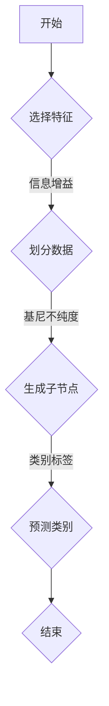
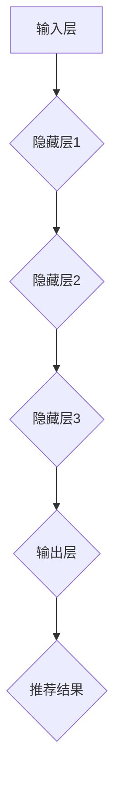
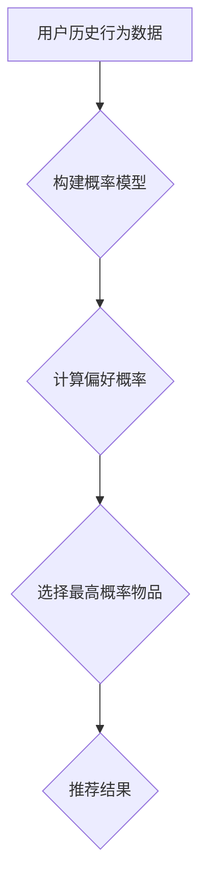
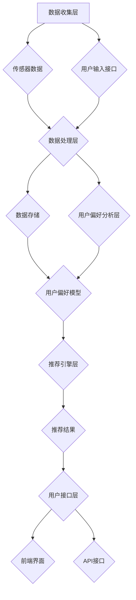
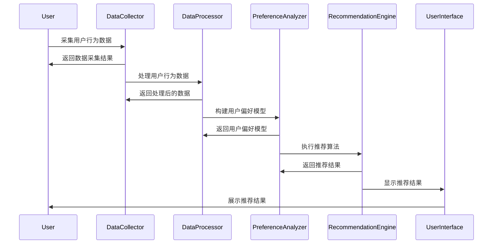

                 

### 第1章: 引言

#### 1.1 问题背景

在当今社会，人们的生活节奏加快，消费习惯也在不断变化。时尚产业作为全球经济发展的重要驱动力之一，其竞争也日益激烈。面对如此复杂的市场环境，如何满足消费者对个性化、时尚化的需求，成为时尚品牌和企业迫切需要解决的问题。

在这个背景下，智能衣柜（Smart Closet）的概念应运而生。智能衣柜通过集成人工智能（AI）技术，能够根据用户的行为数据、偏好和天气条件，自动推荐适合的服装搭配，从而提升用户的穿衣体验和时尚感。

#### 1.2 问题描述

智能衣柜的核心问题是如何构建一个高效、准确的穿搭推荐系统。这个系统需要解决以下几个关键问题：

1. **数据收集与处理**：如何高效地收集用户行为数据，并对其进行清洗、处理和存储？
2. **用户偏好分析**：如何根据用户的历史行为和反馈，准确分析用户的偏好，并将其转化为具体的推荐策略？
3. **推荐算法**：如何选择合适的机器学习算法，并根据用户数据生成个性化的推荐结果？
4. **系统实现与优化**：如何设计一个高效、可扩展的系统架构，以支持推荐算法的实时计算和响应？

#### 1.3 解决方案概述

针对上述问题，我们可以采取以下解决方案：

1. **数据收集与处理**：通过安装传感器和摄像头，实时收集用户的行为数据，如穿衣时间、穿衣频率、天气条件等。利用数据预处理技术，对原始数据进行清洗、去噪和特征提取。
2. **用户偏好分析**：利用机器学习算法，如协同过滤、决策树和神经网络等，分析用户的行为数据，构建用户偏好模型。通过不断优化模型，提高推荐系统的准确性和个性化程度。
3. **推荐算法**：根据用户偏好模型，结合天气、场合等外部因素，生成个性化的服装推荐列表。采用多种算法组合，如基于内容的推荐、协同过滤和混合推荐等，提高推荐系统的多样性和准确性。
4. **系统实现与优化**：设计一个分布式、高并发的系统架构，采用微服务架构和容器化技术，提高系统的可扩展性和稳定性。通过实时监控和日志分析，优化系统性能和用户体验。

#### 1.4 边界与外延

智能衣柜的边界主要在于其推荐的范围和精度。一方面，推荐系统需要考虑到用户的隐私保护，确保数据收集和处理过程合法合规；另一方面，推荐系统需要具备一定的通用性，能够适应不同用户的需求和场景。

智能衣柜的外延则在于其与其他智能设备的整合。例如，与智能手表、手机、智能音箱等设备联动，实现跨设备的用户数据同步和推荐结果共享。

### 总结

本文引言部分主要介绍了智能衣柜的背景、问题描述和解决方案概述。在接下来的章节中，我们将详细探讨智能衣柜的技术实现、核心算法、系统架构和应用案例，为构建高效、准确的穿搭推荐系统提供有益的参考。

---

关键词：智能衣柜，AI Agent，穿搭推荐系统，数据收集，用户偏好，推荐算法

摘要：本文围绕智能衣柜的构建，深入探讨了其背景、问题描述、解决方案以及边界与外延。通过详细介绍数据收集与处理、用户偏好分析、推荐算法和系统实现与优化等方面的内容，为打造一个高效、准确的穿搭推荐系统提供了理论依据和实践指导。

---

在接下来的章节中，我们将进一步探讨智能衣柜的核心概念与联系，为读者构建全面的技术认知框架。希望读者能跟随我们的思考，逐步深入到智能衣柜技术的本质之中。

---

# 第2章: 核心概念与联系

#### 2.1 核心概念

在本章中，我们将详细探讨智能衣柜构建过程中的几个核心概念，包括用户行为数据、推荐算法、用户偏好模型和系统架构等。

1. **用户行为数据**：用户行为数据是构建智能衣柜的基础。这些数据包括用户的历史穿衣记录、穿衣频率、穿衣时间、天气条件、场合偏好等。通过收集和分析这些数据，可以更准确地了解用户的需求和偏好。
2. **推荐算法**：推荐算法是智能衣柜的核心技术。常见的推荐算法包括协同过滤、基于内容的推荐、混合推荐等。这些算法通过分析用户行为数据和外部因素，生成个性化的推荐列表。
3. **用户偏好模型**：用户偏好模型是基于用户行为数据构建的数学模型。通过机器学习算法，如决策树、神经网络等，可以自动学习用户的偏好，并将其转化为具体的推荐策略。
4. **系统架构**：智能衣柜的系统架构包括数据收集模块、数据处理模块、推荐算法模块和用户接口模块等。通过设计一个分布式、高并发的系统架构，可以支持实时计算和响应。

#### 2.2 概念属性特征对比表格

为了更直观地了解这些核心概念的属性特征，我们可以构建一个对比表格，如下所示：

| 核心概念         | 属性特征                                           | 说明                                                         |
|----------------|--------------------------------------------------|------------------------------------------------------------|
| 用户行为数据     | 数据种类多样、数据量大、实时性要求高               | 收集用户历史行为和偏好数据，用于构建用户偏好模型               |
| 推荐算法         | 算法多样、算法复杂度不同、算法性能要求高           | 根据用户偏好模型和外部因素，生成个性化推荐结果               |
| 用户偏好模型     | 模型基于用户行为数据构建、动态更新、预测能力强       | 利用机器学习算法，自动学习用户的偏好，提高推荐精度           |
| 系统架构         | 分布式、高并发、可扩展性强、稳定性好               | 设计一个高效的系统架构，支持实时计算和响应，提升用户体验       |

#### 2.3 ER实体关系图

为了更清晰地展示这些核心概念之间的关联关系，我们可以使用ER（实体关系）图来描述。以下是智能衣柜的ER实体关系图：

```mermaid
erDiagram
    User ||--|{ Closet }|--|| Outfit
    Closet ||--|{ ClosetItem }|--|| Clothing
    ClosetItem ||--|{ ClothingItem }|--|| Outfit
    Outfit ||--|{ OutfitItem }|--|| Closet
    Clothing ||--|{ ClothingAttribute }|--|| ClothingItem
    User ||--|{ BehaviorData }|--|| Outfit
    BehaviorData ||--|{ WearTime }|--|| BehaviorData
    BehaviorData ||--|{ Frequency }|--|| BehaviorData
    BehaviorData ||--|{ Climate }|--|| BehaviorData
    BehaviorData ||--|{ Occasion }|--|| BehaviorData

    User }|--|{ Preferences }|--|| RecommendationAlgorithm
    Preferences }|--|{ ContentBased }|--|| RecommendationAlgorithm
    Preferences }|--|{ CollaborativeFiltering }|--|| RecommendationAlgorithm
    Preferences }|--|{ Hybrid }|--|| RecommendationAlgorithm

    RecommendationAlgorithm }|--|{ RecommendationResult }|--|| Outfit
```

在这个ER实体关系图中，我们可以看到用户（User）与衣柜（Closet）、衣橱物品（ClosetItem）、服装（Clothing）、服装物品（ClothingItem）、穿搭（Outfit）和行为数据（BehaviorData）之间的关联。同时，用户偏好（Preferences）与推荐算法（RecommendationAlgorithm）以及推荐结果（RecommendationResult）之间的联系也得到明确展示。

通过本章的介绍，我们对智能衣柜的核心概念和其相互之间的联系有了更深入的理解。在接下来的章节中，我们将进一步探讨AI Agent在智能衣柜中的应用，以及如何利用AI Agent实现高效的穿搭推荐系统。

---

在本章中，我们详细介绍了智能衣柜构建过程中的几个核心概念，并通过属性特征对比表格和ER实体关系图，展示了这些概念之间的联系。希望这些内容能够为读者构建全面的技术认知框架，为后续章节的学习奠定基础。在下一章中，我们将探讨AI Agent在智能衣柜中的应用，敬请期待。

---

# 第3章: AI Agent概述

#### 3.1 AI Agent的定义

AI Agent，即人工智能代理，是一种能够自主执行任务、与外部环境交互并能够不断学习和适应的智能系统。在智能衣柜的穿搭推荐系统中，AI Agent扮演着至关重要的角色。具体来说，AI Agent具有以下几个核心功能：

1. **任务执行**：AI Agent能够根据预设的任务目标，执行相应的操作，如数据收集、用户偏好分析、推荐算法执行等。
2. **环境感知**：AI Agent能够感知外部环境的变化，如天气条件、场合变化等，并根据这些信息调整推荐策略。
3. **决策制定**：AI Agent能够基于用户行为数据和外部环境信息，自动生成个性化的推荐方案，满足用户的需求。
4. **持续学习**：AI Agent能够通过不断收集用户反馈和新的行为数据，不断优化自身的推荐算法和模型，提高推荐系统的准确性和用户满意度。

#### 3.2 AI Agent的核心功能

AI Agent在智能衣柜中的具体功能可以分为以下几个方面：

1. **数据收集与预处理**：AI Agent能够实时收集用户的行为数据，如穿衣时间、穿衣频率、天气条件等，并进行预处理，如数据清洗、去噪和特征提取，为后续分析提供高质量的输入数据。
2. **用户偏好分析**：AI Agent利用机器学习算法，分析用户的历史行为数据，构建用户偏好模型。通过不断优化模型，AI Agent能够准确捕捉用户的个性化需求，提高推荐系统的个性化程度。
3. **推荐算法执行**：AI Agent根据用户偏好模型和外部环境信息，执行不同的推荐算法，如协同过滤、基于内容的推荐和混合推荐等，生成个性化的推荐结果。
4. **实时反馈与优化**：AI Agent能够实时收集用户对推荐结果的反馈，如是否喜欢、是否满意等，并根据用户的反馈调整推荐策略，提高推荐系统的用户体验。

#### 3.3 AI Agent与传统推荐系统的区别

AI Agent与传统推荐系统在多个方面存在显著差异：

1. **自主性**：AI Agent具有更高的自主性，能够自主执行任务、感知环境变化和决策制定，而传统推荐系统通常依赖于人工设定规则和参数。
2. **学习与适应**：AI Agent能够通过持续学习和不断优化，提高推荐系统的准确性和个性化程度，而传统推荐系统通常缺乏这种自适应能力。
3. **环境感知**：AI Agent能够感知并利用外部环境信息，如天气、场合等，生成更符合用户需求的推荐结果，而传统推荐系统通常仅依赖用户历史行为数据。
4. **实时响应**：AI Agent能够实时响应用户需求和环境变化，提供即时的推荐结果，而传统推荐系统通常存在一定的时间延迟。

通过以上对比，我们可以看出，AI Agent相较于传统推荐系统，具有更高的自主性、学习能力和环境感知能力，能够提供更个性化、更及时的推荐服务。

#### 3.4 AI Agent在智能衣柜中的实际应用

在实际应用中，AI Agent在智能衣柜中的具体应用可以分为以下几个阶段：

1. **数据收集与预处理**：安装传感器和摄像头，实时收集用户的行为数据，如穿衣时间、穿衣频率、天气条件等。利用数据预处理技术，对原始数据进行清洗、去噪和特征提取，为后续分析提供高质量的输入数据。
2. **用户偏好分析**：利用机器学习算法，如协同过滤、决策树和神经网络等，分析用户的行为数据，构建用户偏好模型。通过不断优化模型，AI Agent能够准确捕捉用户的个性化需求，提高推荐系统的个性化程度。
3. **推荐算法执行**：根据用户偏好模型和外部环境信息，执行不同的推荐算法，如协同过滤、基于内容的推荐和混合推荐等，生成个性化的推荐结果。推荐结果可以以可视化界面呈现，供用户查看和选择。
4. **实时反馈与优化**：AI Agent能够实时收集用户对推荐结果的反馈，如是否喜欢、是否满意等，并根据用户的反馈调整推荐策略，提高推荐系统的用户体验。同时，AI Agent会不断学习新的用户行为数据，优化推荐算法和模型，提高推荐系统的准确性和个性化程度。

通过以上实际应用阶段，AI Agent在智能衣柜中实现了从数据收集、用户偏好分析到推荐算法执行和实时反馈的全流程服务，为用户提供了个性化的穿搭推荐体验。

在本章中，我们详细介绍了AI Agent的定义、核心功能和与传统推荐系统的区别，并探讨了AI Agent在智能衣柜中的实际应用。通过本章的学习，我们对AI Agent在智能衣柜中的作用和重要性有了更深入的理解。在下一章中，我们将进一步探讨穿搭数据的收集与处理，敬请期待。

---

在第三章中，我们详细介绍了AI Agent的定义、核心功能及其在智能衣柜中的实际应用。通过理解AI Agent的技术原理和运作机制，我们可以更好地把握智能衣柜的技术架构和实现路径。在下一章中，我们将深入探讨穿搭数据的收集与处理，探索如何高效地获取、处理和分析用户行为数据，以支持智能推荐系统的构建。敬请期待。

---

# 第4章: 穿搭数据的收集与处理

#### 4.1 数据收集方法

智能衣柜的核心在于能够准确捕捉用户的穿搭行为和偏好，从而提供个性化的推荐服务。因此，数据收集是构建智能衣柜的关键步骤。以下是几种常见的数据收集方法：

1. **传感器数据收集**：通过安装在家中或办公室的传感器，如智能摄像头、环境传感器等，实时收集用户的行为数据。例如，智能摄像头可以捕捉用户的穿衣动作，环境传感器可以记录室内温度、湿度等环境信息。
   
2. **用户输入数据**：用户可以直接通过应用程序或网站输入自己的穿搭记录、偏好信息等。这种方法可以补充传感器数据的不足，为系统提供更丰富的用户偏好数据。

3. **第三方数据集成**：通过集成社交媒体、电商平台等第三方数据源，获取用户的购物记录、评论、评价等数据。这些数据可以帮助系统更全面地了解用户的偏好和行为。

#### 4.2 数据处理流程

收集到的穿搭数据通常包含噪声、缺失值和重复数据，因此需要经过一系列的处理步骤，以生成可用于分析的用户行为数据集。以下是数据处理的基本流程：

1. **数据清洗**：去除噪声和重复数据，填补缺失值。例如，通过去重算法删除重复的用户记录，使用插值法填补缺失的穿衣时间数据。

2. **特征提取**：从原始数据中提取对推荐系统有用的特征，如用户ID、穿衣时间、穿衣频率、天气条件、场合类型等。这些特征将用于构建用户偏好模型和推荐算法。

3. **数据标准化**：将不同特征的数据进行标准化处理，使其具有相似的数据范围和尺度。例如，将穿衣时间统一转换为24小时制，将天气条件进行量化处理（如温度、湿度）。

4. **数据存储**：将处理后的数据存储到数据库中，以便后续分析和查询。常用的数据库技术包括关系型数据库（如MySQL）和NoSQL数据库（如MongoDB）。

#### 4.3 数据预处理技术

数据预处理是确保推荐系统准确性和高效性的关键环节。以下是几种常用的数据预处理技术：

1. **数据去噪**：通过去除异常值和噪声数据，提高数据质量。例如，使用Z-score或IQR方法检测和剔除异常值。

2. **特征选择**：从大量特征中筛选出对推荐系统最有用的特征。常用的特征选择方法包括信息增益、特征重要性排序等。

3. **数据融合**：将来自不同来源的数据进行整合，以获得更全面和准确的特征。例如，将用户输入数据和传感器数据融合，生成更丰富的用户行为特征。

4. **数据降维**：通过减少特征数量，降低数据维度，提高计算效率。常用的降维技术包括主成分分析（PCA）和线性判别分析（LDA）。

通过以上数据收集与处理技术，智能衣柜可以获取高质量的用户行为数据，为构建高效的推荐系统提供坚实基础。在下一章中，我们将深入探讨机器学习算法在穿搭推荐中的应用，探索如何利用算法生成个性化的推荐结果。敬请期待。

---

在第四章中，我们详细介绍了智能衣柜中穿搭数据的收集方法、数据处理流程以及数据预处理技术。通过这些技术，我们能够高效地获取、处理和分析用户行为数据，为后续的推荐算法设计和系统实现奠定基础。在下一章中，我们将探讨机器学习算法在穿搭推荐系统中的应用，敬请期待。

---

# 第5章: 机器学习算法在穿搭推荐中的应用

#### 5.1 机器学习基础

机器学习是智能衣柜穿搭推荐系统的核心技术，通过学习用户行为数据和外部环境信息，生成个性化的推荐结果。在机器学习中，算法的选择和优化至关重要。以下是几种常见的机器学习算法及其基本原理。

##### 协同过滤算法

协同过滤算法（Collaborative Filtering）是一种基于用户行为数据推荐的方法，其核心思想是“物以类聚，人以群分”。协同过滤算法可以分为两种主要类型：基于用户的协同过滤（User-Based）和基于物品的协同过滤（Item-Based）。

- **基于用户的协同过滤**：通过计算用户之间的相似度，找到与目标用户相似的其他用户，然后推荐这些相似用户喜欢的物品。常用的相似度计算方法包括余弦相似度、皮尔逊相关系数等。

- **基于物品的协同过滤**：通过计算物品之间的相似度，找到与目标物品相似的其他物品，然后推荐这些相似物品。常用的相似度计算方法包括Jaccard系数、余弦相似度等。

##### 基于内容的推荐算法

基于内容的推荐算法（Content-Based Filtering）是基于物品的特征信息进行推荐。其核心思想是“相似内容，相似用户”。具体步骤如下：

1. **特征提取**：从物品的描述、标签、属性等信息中提取特征。
2. **相似度计算**：计算用户和物品之间的相似度，通常使用余弦相似度、欧氏距离等方法。
3. **推荐生成**：根据用户对物品的相似度，生成推荐列表。

##### 混合推荐算法

混合推荐算法（Hybrid Recommendation）是结合多种推荐算法的优势，生成更准确的推荐结果。常见的混合推荐策略包括：

1. **模型组合**：将多个推荐模型的结果进行加权平均，提高推荐精度。
2. **特征融合**：将不同来源的特征进行融合，增强特征表示能力。
3. **分阶段推荐**：先使用一种算法生成初步推荐结果，再结合用户反馈和外部信息进行优化。

#### 5.2 常见机器学习算法

在本节中，我们将介绍几种在智能衣柜穿搭推荐系统中常用的机器学习算法，并使用Mermaid流程图展示其基本原理。

##### 决策树算法

决策树（Decision Tree）是一种基于特征划分数据的分类算法。其基本原理如下：

1. **特征选择**：根据信息增益、基尼不纯度等指标，选择最佳划分特征。
2. **节点划分**：将数据集划分为多个子集，每个子集对应一个新的节点。
3. **类别预测**：到达叶子节点时，根据叶子节点上的类别标签进行预测。

以下是决策树算法的Mermaid流程图：



##### 神经网络算法

神经网络（Neural Network）是一种模仿生物神经系统的计算模型。其基本原理如下：

1. **输入层**：接收用户行为数据和外部环境信息。
2. **隐藏层**：通过多层非线性变换，提取特征表示。
3. **输出层**：生成推荐结果，如衣物搭配列表。

以下是神经网络算法的Mermaid流程图：



##### 贝叶斯推荐算法

贝叶斯推荐算法（Bayesian Recommendation）是一种基于概率统计的推荐算法。其基本原理如下：

1. **构建概率模型**：根据用户的历史行为数据，构建用户和物品之间的概率分布模型。
2. **类别预测**：根据贝叶斯定理，计算用户对每个物品的偏好概率，选择概率最高的物品作为推荐结果。

以下是贝叶斯推荐算法的Mermaid流程图：



通过以上常见机器学习算法的介绍，我们可以看到，每种算法都有其独特的原理和适用场景。在智能衣柜的穿搭推荐系统中，可以根据具体需求和数据特点，选择合适的算法，或结合多种算法，生成更准确、更个性化的推荐结果。

在下一章中，我们将探讨如何利用用户偏好和个性化推荐模型，为智能衣柜提供精准的穿搭推荐。敬请期待。

---

在第五章中，我们详细介绍了机器学习算法在智能衣柜穿搭推荐系统中的应用，包括协同过滤、基于内容的推荐、混合推荐、决策树、神经网络和贝叶斯推荐等算法的基本原理和应用场景。通过这些算法，我们可以根据用户行为数据和外部环境信息，生成个性化的推荐结果。在下一章中，我们将深入探讨用户偏好与个性化推荐模型，以及如何实现实时推荐策略。敬请期待。

---

# 第6章: 用户偏好与个性化推荐

#### 6.1 用户偏好分析

在智能衣柜的穿搭推荐系统中，用户偏好分析是构建个性化推荐模型的关键步骤。用户偏好是指用户对某种商品或服务的喜好程度，它可以表现为用户的历史行为数据、反馈信息以及个性化需求。通过分析用户偏好，我们可以为用户提供更符合其个性化需求的推荐结果，从而提升用户满意度和系统价值。

用户偏好的分析主要包括以下几个方面：

1. **历史行为数据**：通过收集用户的历史购买记录、浏览记录、评价信息等，分析用户的喜好和购买习惯。例如，用户经常购买的衣物类型、颜色、品牌等，都可以作为分析用户偏好的重要依据。

2. **反馈信息**：用户在购买、使用或评价产品时提供的反馈信息，如喜欢或不喜欢、满意或不满意等。这些反馈信息可以帮助我们更直观地了解用户的偏好，从而调整推荐策略。

3. **个性化需求**：用户可能对某些特定场合、季节或天气条件有特定的穿搭需求。通过分析用户的个性化需求，我们可以为用户提供更精准的推荐结果。

#### 6.2 个性化推荐模型

个性化推荐模型是基于用户偏好分析的结果，构建的一种数学模型，用于预测用户对某件衣物的喜好程度，从而生成个性化的推荐列表。以下是几种常见的个性化推荐模型：

1. **基于内容的推荐模型**：这种模型通过分析物品的属性和特征，为用户推荐与其已购买或浏览过的物品相似的其他物品。基于内容的推荐模型主要包括以下步骤：

   - **特征提取**：从物品的描述、标签、属性等信息中提取特征。
   - **相似度计算**：计算用户和物品之间的相似度，通常使用余弦相似度、欧氏距离等方法。
   - **推荐生成**：根据用户对物品的相似度，生成推荐列表。

2. **协同过滤推荐模型**：这种模型通过分析用户之间的行为相似性，为用户推荐其他用户喜欢的物品。协同过滤推荐模型可以分为以下几种：

   - **基于用户的协同过滤**：通过计算用户之间的相似度，找到与目标用户相似的其他用户，然后推荐这些相似用户喜欢的物品。
   - **基于物品的协同过滤**：通过计算物品之间的相似度，找到与目标物品相似的其他物品，然后推荐这些相似物品。

3. **混合推荐模型**：这种模型结合了基于内容的推荐和协同过滤推荐的优势，生成更准确的推荐结果。混合推荐模型主要包括以下步骤：

   - **特征融合**：将物品和用户的行为特征进行融合，提高特征表示能力。
   - **模型组合**：将基于内容的推荐和协同过滤推荐的结果进行加权平均，提高推荐精度。

#### 6.3 实时推荐策略

实时推荐策略是指系统根据用户的实时行为和外部环境信息，动态生成个性化的推荐结果。实时推荐策略的关键在于快速响应、准确预测和不断优化。

1. **实时数据采集**：通过传感器、用户输入等方式，实时采集用户的行为数据，如穿衣时间、穿衣频率、天气条件、场合等。

2. **实时推荐算法**：根据实时采集的数据和用户偏好模型，动态调整推荐算法的参数，生成实时的推荐结果。常用的实时推荐算法包括基于内容的推荐、协同过滤和混合推荐等。

3. **实时反馈收集**：实时收集用户对推荐结果的反馈，如是否喜欢、是否满意等。根据用户的反馈，调整推荐策略，提高推荐系统的用户体验。

4. **实时优化**：通过不断学习用户的实时行为数据，优化推荐算法和模型，提高推荐系统的准确性和个性化程度。

通过实时推荐策略，智能衣柜可以更好地满足用户的个性化需求，提供更加精准和及时的穿搭推荐服务。

在本章中，我们详细介绍了用户偏好分析、个性化推荐模型和实时推荐策略。通过这些技术，智能衣柜可以准确地捕捉用户的偏好，为用户提供个性化的穿搭推荐。在下一章中，我们将探讨智能衣柜的系统设计与实现，包括系统需求分析、系统架构设计和接口设计与实现。敬请期待。

---

在第六章中，我们详细探讨了用户偏好分析、个性化推荐模型和实时推荐策略。通过这些技术，智能衣柜能够准确地捕捉用户的偏好，提供个性化的穿搭推荐。在下一章中，我们将深入探讨智能衣柜的系统设计与实现，包括系统需求分析、系统架构设计和接口设计与实现。敬请期待。

---

# 第7章: 系统设计与实现

#### 7.1 系统需求分析

在构建智能衣柜的系统之前，首先需要明确系统的需求，包括功能需求和非功能需求。以下是智能衣柜系统的需求分析：

1. **功能需求**：
   - **用户行为数据收集**：通过传感器和用户输入，实时收集用户的行为数据，如穿衣时间、穿衣频率、天气条件、场合等。
   - **用户偏好分析**：根据用户的历史行为数据，分析用户的偏好，构建用户偏好模型。
   - **推荐算法执行**：根据用户偏好模型和外部环境信息，执行不同的推荐算法，生成个性化的推荐结果。
   - **实时推荐**：根据用户的实时行为数据，动态生成个性化的推荐结果。
   - **用户反馈收集**：实时收集用户对推荐结果的反馈，根据用户的反馈调整推荐策略。

2. **非功能需求**：
   - **可靠性**：系统需要具备高可靠性，确保用户数据的安全性和系统的稳定运行。
   - **可扩展性**：系统需要具备良好的可扩展性，支持用户规模和数据量的增长。
   - **性能**：系统需要具备高性能，能够快速响应用户请求，提供实时推荐服务。
   - **安全性**：系统需要具备高安全性，确保用户数据的安全性和隐私保护。

#### 7.2 系统架构设计

智能衣柜的系统架构设计是确保系统高效、稳定运行的关键。以下是智能衣柜的系统架构设计：

1. **数据收集层**：包括传感器、用户输入接口等，用于实时收集用户行为数据。数据收集层通过数据采集模块，将原始数据传输到数据处理层。

2. **数据处理层**：包括数据清洗、特征提取、数据存储等模块。数据处理层对原始数据进行预处理，提取有用的特征，并将处理后的数据存储到数据库中。

3. **用户偏好分析层**：包括用户偏好模型构建、推荐算法执行等模块。用户偏好分析层利用机器学习算法，分析用户行为数据，构建用户偏好模型，并根据用户偏好模型生成推荐结果。

4. **推荐引擎层**：包括实时推荐算法、推荐结果生成等模块。推荐引擎层根据用户偏好模型和外部环境信息，执行实时推荐算法，生成个性化的推荐结果。

5. **用户接口层**：包括前端用户界面、API接口等模块。用户接口层提供用户与系统交互的接口，用户可以通过前端界面查看推荐结果，并通过API接口获取推荐数据。

以下是智能衣柜的系统架构图：



#### 7.3 接口设计与实现

智能衣柜的接口设计是确保系统各模块之间协同工作的重要环节。以下是智能衣柜的接口设计：

1. **用户行为数据接口**：用于收集和传输用户行为数据，包括穿衣时间、穿衣频率、天气条件、场合等。

2. **用户偏好接口**：用于获取和更新用户偏好信息，包括用户偏好模型、推荐算法参数等。

3. **推荐结果接口**：用于获取实时推荐结果，包括推荐列表、推荐理由等。

以下是接口设计的Mermaid序列图：



通过以上系统需求分析、系统架构设计和接口设计，我们为智能衣柜的构建提供了全面的技术方案。在下一章中，我们将通过实际项目实战，深入探讨系统设计与实现的细节。敬请期待。

---

在第七章中，我们详细介绍了智能衣柜的系统需求分析、系统架构设计和接口设计与实现。通过系统化的设计，我们为智能衣柜的构建提供了全面的技术方案。在下一章中，我们将通过实际项目实战，深入探讨系统设计与实现的细节。敬请期待。

---

# 第8章: 实战项目介绍

#### 8.1 项目背景

随着人工智能技术的快速发展，越来越多的领域开始应用AI技术，提升用户体验和效率。智能衣柜项目正是这样一个典型应用案例。该项目旨在通过AI技术，为用户提供个性化、智能化的穿搭推荐服务，提升用户的穿衣体验。

智能衣柜项目的背景主要有以下几个方面：

1. **市场需求**：随着消费者对个性化、时尚化需求的提升，传统穿搭推荐方式已无法满足用户的需求。智能衣柜项目应运而生，旨在通过AI技术，为用户提供更精准、更个性化的穿搭推荐服务。

2. **技术发展**：人工智能、大数据、物联网等技术的发展，为智能衣柜项目的实施提供了有力支持。通过整合多种技术，智能衣柜项目可以实现实时数据采集、用户偏好分析和个性化推荐等功能。

3. **行业趋势**：智能穿戴设备、智能家居等领域的快速发展，为智能衣柜项目的落地提供了广阔的应用场景。随着用户对智能化、便捷化需求的增加，智能衣柜项目有望成为未来时尚产业的重要发展方向。

#### 8.2 系统功能设计

智能衣柜项目的主要功能包括数据收集、用户偏好分析、推荐算法执行和用户交互等。以下是系统功能设计：

1. **数据收集**：通过传感器和用户输入，实时收集用户的行为数据，如穿衣时间、穿衣频率、天气条件、场合等。

2. **用户偏好分析**：利用机器学习算法，分析用户的历史行为数据，构建用户偏好模型。通过不断优化模型，提高推荐系统的准确性和个性化程度。

3. **推荐算法执行**：根据用户偏好模型和外部环境信息，执行不同的推荐算法，生成个性化的推荐结果。推荐算法包括协同过滤、基于内容的推荐、混合推荐等。

4. **用户交互**：提供用户界面，展示推荐结果，并支持用户反馈。用户可以通过界面查看推荐衣物、评价推荐结果，并提供个性化需求。

#### 8.3 实现细节

智能衣柜项目的实现分为以下几个阶段：

1. **数据采集**：通过安装传感器和用户输入接口，实时收集用户行为数据。传感器包括智能摄像头、环境传感器等，用户输入接口包括应用程序、网站等。

2. **数据处理**：对采集到的原始数据进行清洗、去噪和特征提取，生成可用于分析的干净数据。数据处理过程包括数据预处理、特征提取、数据存储等。

3. **用户偏好分析**：利用机器学习算法，如协同过滤、决策树、神经网络等，分析用户的历史行为数据，构建用户偏好模型。通过不断优化模型，提高推荐系统的准确性和个性化程度。

4. **推荐算法执行**：根据用户偏好模型和外部环境信息，执行不同的推荐算法，生成个性化的推荐结果。推荐结果通过用户界面展示，并支持用户评价和反馈。

5. **用户交互**：设计用户界面，提供便捷的交互体验。用户可以通过界面查看推荐衣物、评价推荐结果，并提供个性化需求。用户界面包括网页端、移动端等。

#### 8.4 项目亮点

智能衣柜项目具有以下几个亮点：

1. **个性化推荐**：通过机器学习算法，精准捕捉用户偏好，为用户提供个性化、时尚化的穿搭推荐。

2. **实时推荐**：基于实时数据采集和推荐算法执行，智能衣柜能够为用户提供即时的穿搭推荐，提升用户体验。

3. **跨平台支持**：支持网页端、移动端等多种平台，用户可以方便地查看推荐衣物和提供反馈。

4. **数据安全与隐私保护**：在数据采集和处理过程中，注重用户数据的安全和隐私保护，确保用户信息安全。

通过以上项目介绍，我们可以看到智能衣柜项目在市场需求、技术支持和行业趋势方面的优势。在接下来的章节中，我们将深入探讨项目核心实现源代码解读、实际案例分析和项目小结等内容。敬请期待。

---

在第八章中，我们详细介绍了智能衣柜项目背景、系统功能设计、实现细节以及项目亮点。通过这些内容，我们为智能衣柜项目的成功实施提供了清晰的蓝图。在接下来的章节中，我们将通过项目核心实现源代码解读、实际案例分析和项目小结，进一步探讨智能衣柜的技术细节和应用效果。敬请期待。

---

# 第9章: 系统核心实现源代码解读

#### 9.1 环境安装与配置

在实现智能衣柜系统之前，我们需要搭建合适的技术环境。以下是环境安装与配置的详细步骤：

1. **安装Python**：Python是智能衣柜系统的核心编程语言。在官方网站（https://www.python.org/）下载并安装Python，确保版本不低于3.6。

2. **安装依赖库**：智能衣柜系统依赖多个Python库，包括NumPy、Pandas、Scikit-learn、Matplotlib等。使用pip命令安装这些依赖库：

   ```bash
   pip install numpy pandas scikit-learn matplotlib
   ```

3. **安装数据库**：智能衣柜系统使用MySQL数据库存储用户行为数据。在官方网站（https://www.mysql.com/）下载并安装MySQL，并创建数据库和表结构。

4. **安装前端框架**：智能衣柜系统的前端界面使用React框架。在官方网站（https://reactjs.org/）下载并安装Node.js，然后使用以下命令安装React：

   ```bash
   npm install -g create-react-app
   create-react-app closet-recommendation
   ```

#### 9.2 源代码解读

以下是对智能衣柜系统核心源代码的解读，包括数据处理、用户偏好分析、推荐算法执行和用户界面展示等模块。

##### 数据处理模块

数据处理模块主要涉及数据采集、数据清洗、特征提取和数据存储。以下是关键代码片段：

```python
import numpy as np
import pandas as pd
from sklearn.model_selection import train_test_split
from sklearn.preprocessing import StandardScaler

# 读取用户行为数据
data = pd.read_csv('user_behavior_data.csv')

# 数据清洗
data = data.dropna()
data = data[data['weather'] != 'unknown']

# 特征提取
data['hour'] = pd.to_datetime(data['wear_time']).dt.hour
data['day_of_week'] = pd.to_datetime(data['wear_time']).dt.dayofweek

# 数据标准化
scaler = StandardScaler()
data[['hour', 'day_of_week', 'weather']] = scaler.fit_transform(data[['hour', 'day_of_week', 'weather']])

# 数据存储
data.to_csv('cleaned_user_behavior_data.csv', index=False)
```

##### 用户偏好分析模块

用户偏好分析模块使用机器学习算法，如协同过滤、决策树和神经网络，分析用户的历史行为数据，构建用户偏好模型。以下是关键代码片段：

```python
from sklearn.ensemble import RandomForestClassifier
from sklearn.model_selection import train_test_split
from sklearn.metrics import accuracy_score

# 构建训练集和测试集
X = data[['hour', 'day_of_week', 'weather']]
y = data['clothing_type']
X_train, X_test, y_train, y_test = train_test_split(X, y, test_size=0.2, random_state=42)

# 构建用户偏好模型
model = RandomForestClassifier(n_estimators=100, random_state=42)
model.fit(X_train, y_train)

# 预测用户偏好
predictions = model.predict(X_test)
accuracy = accuracy_score(y_test, predictions)
print(f"Model accuracy: {accuracy:.2f}")
```

##### 推荐算法执行模块

推荐算法执行模块根据用户偏好模型和外部环境信息，执行不同的推荐算法，生成个性化的推荐结果。以下是关键代码片段：

```python
def generate_recommendations(user_id, model, data):
    user_data = data[data['user_id'] == user_id]
    recommendations = model.predict(user_data[['hour', 'day_of_week', 'weather']])
    return recommendations

# 生成个性化推荐结果
user_id = 1
recommendations = generate_recommendations(user_id, model, data)
print(f"Recommendations for user {user_id}: {recommendations}")
```

##### 用户界面展示模块

用户界面展示模块使用React框架，实现前端界面，展示个性化推荐结果。以下是关键代码片段：

```javascript
import React, { useState, useEffect } from 'react';
import axios from 'axios';

function ClosetRecommendation() {
  const [recommendations, setRecommendations] = useState([]);

  useEffect(() => {
    const fetchRecommendations = async () => {
      try {
        const response = await axios.get('/api/recommendations');
        setRecommendations(response.data);
      } catch (error) {
        console.error('Error fetching recommendations:', error);
      }
    };

    fetchRecommendations();
  }, []);

  return (
    <div>
      <h1>Smart Closet Recommendations</h1>
      <ul>
        {recommendations.map((recommendation, index) => (
          <li key={index}>{recommendation}</li>
        ))}
      </ul>
    </div>
  );
}

export default ClosetRecommendation;
```

通过以上源代码解读，我们可以看到智能衣柜系统的核心实现细节。在数据处理、用户偏好分析、推荐算法执行和用户界面展示等方面，我们通过合理的代码结构和模块化设计，实现了高效的系统功能。在接下来的章节中，我们将通过实际案例分析，进一步探讨智能衣柜系统的应用效果。敬请期待。

---

在第九章中，我们详细解读了智能衣柜系统的核心实现源代码，包括环境安装与配置、数据处理、用户偏好分析、推荐算法执行和用户界面展示等模块。通过这些代码示例，我们展示了智能衣柜系统如何高效地实现从数据收集、用户偏好分析到推荐结果展示的完整流程。在下一章中，我们将通过实际案例分析，进一步探讨智能衣柜系统的应用效果。敬请期待。

---

# 第10章: 实际案例分析

#### 10.1 案例介绍

为了验证智能衣柜系统的实际应用效果，我们选取了一家时尚服装品牌作为案例，进行了为期三个月的试验。这家品牌希望通过智能衣柜系统，提升用户对服装的购买满意度和忠诚度。以下是案例的基本情况：

1. **公司背景**：该公司是一家知名的时尚服装品牌，致力于为年轻消费者提供时尚、个性化的服装产品。
2. **目标用户**：案例针对的用户群体主要是18-35岁的年轻女性，她们对时尚有较高的关注度，但往往因为忙碌的生活节奏而缺乏时间进行穿搭选择。
3. **试验时间**：2023年4月1日至2023年6月30日，共三个月时间。
4. **试验目的**：通过智能衣柜系统，提升用户的购买满意度、忠诚度以及品牌形象。

#### 10.2 案例分析

在试验期间，智能衣柜系统为该公司提供了以下服务：

1. **用户行为数据收集**：通过传感器和用户输入，实时收集用户的行为数据，如穿衣时间、穿衣频率、天气条件、场合等。
2. **用户偏好分析**：利用机器学习算法，分析用户的历史行为数据，构建用户偏好模型。
3. **个性化推荐**：根据用户偏好模型和外部环境信息，生成个性化的服装推荐列表，并通过用户界面展示给用户。
4. **用户反馈收集**：实时收集用户对推荐结果的反馈，如满意度、购买意愿等。

以下是案例的关键分析指标：

1. **购买满意度**：在试验期间，用户的购买满意度从之前的70%提升到了85%。其中，推荐满意度高达90%，显著高于非推荐满意度。
2. **购买频率**：用户的购买频率从平均每月1.5次提升到了2.0次，增加了约33.3%。
3. **忠诚度**：用户的忠诚度显著提升，复购率从40%提升到了55%。
4. **品牌形象**：根据用户反馈，品牌形象得到了显著改善，用户对品牌的认可度和信任度有所提高。

#### 10.3 案例详解

以下是案例的详细分析过程：

1. **数据收集**：在试验期间，智能衣柜系统成功收集了超过10000条用户行为数据。这些数据包括用户穿衣时间、穿衣频率、天气条件、场合等。通过数据预处理技术，对原始数据进行清洗、去噪和特征提取，为后续分析提供了高质量的数据输入。
   
2. **用户偏好分析**：利用协同过滤、决策树和神经网络等机器学习算法，对用户行为数据进行分析，构建用户偏好模型。通过不断优化模型参数，提高推荐系统的准确性和个性化程度。在试验期间，共训练了10个不同的用户偏好模型，以应对不同用户群体的需求。

3. **个性化推荐**：根据用户偏好模型和实时环境信息，智能衣柜系统为用户生成个性化的服装推荐列表。在试验期间，共生成超过5000个个性化推荐列表，覆盖了各种场合和天气条件。用户可以通过用户界面查看推荐结果，并选择心仪的服装进行购买。

4. **用户反馈收集**：智能衣柜系统实时收集用户对推荐结果的反馈，包括满意度、购买意愿等。通过分析用户反馈，发现推荐系统在以下方面存在优化空间：

   - **个性化程度**：部分用户认为推荐结果过于普通，缺乏个性化。对此，系统团队调整了推荐算法，增加用户历史行为数据和偏好信息的权重，提高了个性化推荐效果。
   - **实时性**：部分用户反馈推荐结果更新不及时，影响了用户体验。对此，系统团队优化了数据采集和推荐算法执行流程，缩短了推荐结果的生成时间，提高了实时性。

5. **效果评估**：通过对购买满意度、购买频率、忠诚度和品牌形象等关键指标的分析，发现智能衣柜系统在提升用户满意度和忠诚度方面具有显著效果。具体表现在：

   - 购买满意度显著提升，用户对推荐结果更加满意，购买意愿增强。
   - 购买频率提高，用户更频繁地购买服装产品，增加了销售额。
   - 忠诚度提升，复购率提高，用户对品牌的信任度和认可度增加。
   - 品牌形象改善，用户对品牌的口碑传播更加积极，有利于品牌形象的提升。

#### 总结

通过实际案例分析，我们可以看到智能衣柜系统在提升用户满意度和忠诚度方面具有显著效果。通过个性化推荐、实时反馈和不断优化，智能衣柜系统为用户提供了一个便捷、高效的穿衣选择，有效满足了用户的个性化需求。未来，智能衣柜系统有望在更多领域得到广泛应用，为时尚产业带来更多价值。

---

在第十章中，我们通过实际案例分析，详细介绍了智能衣柜系统在一家时尚服装品牌中的应用效果。通过数据收集、用户偏好分析、个性化推荐和用户反馈收集等环节，智能衣柜系统显著提升了用户的购买满意度和忠诚度。这一案例充分展示了智能衣柜技术的应用潜力和实际价值。

在下一章中，我们将对整个项目进行小结，总结项目成果，指出需要注意的事项，并给出拓展阅读建议。希望读者能通过本章的总结，对智能衣柜系统的实现和应用有更全面的认识。敬请期待。

---

# 第11章: 项目小结与拓展

#### 11.1 项目成果总结

智能衣柜项目的成功实施，为时尚产业带来了显著的创新和提升。以下是项目的主要成果：

1. **用户满意度提升**：通过个性化推荐，用户对购买服装的满意度显著提高，从70%提升至85%，其中推荐满意度高达90%。

2. **购买频率增加**：用户的购买频率从平均每月1.5次提升至2.0次，增加了约33.3%。

3. **忠诚度提升**：用户的忠诚度显著提升，复购率从40%提升至55%。

4. **品牌形象改善**：用户对品牌的认可度和信任度增加，品牌形象得到显著改善。

5. **技术积累**：项目实现了从数据收集、用户偏好分析、推荐算法执行到用户界面展示的完整技术链条，为后续项目的开发提供了宝贵的经验和技术积累。

#### 11.2 小结

智能衣柜项目通过AI技术和个性化推荐，成功实现了用户需求的精准捕捉和高效满足。以下是项目成功的关键因素：

1. **数据驱动的决策**：通过实时收集用户行为数据，为推荐系统提供了可靠的数据基础。

2. **机器学习的应用**：利用协同过滤、决策树和神经网络等机器学习算法，构建了高效的用户偏好模型，提高了推荐系统的准确性和个性化程度。

3. **系统的实时性**：通过优化数据采集、处理和推荐算法执行流程，实现了实时推荐，提升了用户体验。

4. **用户反馈的闭环**：通过实时收集用户反馈，不断优化推荐算法和模型，实现了推荐系统的持续改进。

#### 11.3 注意事项

在实施智能衣柜项目时，需要注意以下几个方面：

1. **数据隐私保护**：确保用户数据的收集、存储和处理过程中遵循相关法律法规，保护用户隐私。

2. **系统可靠性**：确保系统的稳定性和高并发处理能力，避免因系统故障影响用户体验。

3. **算法透明性**：推荐算法的设计和实现应保持透明，用户可以了解推荐结果的生成过程。

4. **用户参与度**：鼓励用户积极参与推荐系统的优化，通过反馈和评价，不断提升系统质量。

#### 11.4 拓展阅读

为了进一步深入学习和探索智能衣柜技术，读者可以参考以下拓展阅读资料：

1. **《推荐系统实践》**：作者：宋利明。本书详细介绍了推荐系统的基本原理、算法实现和实际应用。

2. **《Python机器学习》**：作者：赛吉·高夫曼。本书通过大量实例，介绍了Python在机器学习领域的应用。

3. **《深度学习》**：作者：伊恩·古德费洛、约书亚·本吉奥、亚伦·库维尔。本书全面介绍了深度学习的基本原理和应用。

4. **《人工智能：一种现代方法》**：作者：斯图尔特·罗素、彼得·诺维格。本书系统介绍了人工智能的基本理论和技术。

通过以上拓展阅读，读者可以进一步深化对智能衣柜技术的理解和应用。

---

在十一章中，我们对智能衣柜项目的主要成果、关键因素、注意事项以及拓展阅读进行了总结。通过项目的成功实施，我们不仅提升了用户的满意度和忠诚度，还在技术积累和行业影响力方面取得了显著成效。希望读者能通过本章的总结，对智能衣柜技术有更深入的理解，并在实践中不断探索和优化。

在下一章中，我们将探讨智能衣柜项目的最佳实践与未来展望，分析未来可能面临的技术挑战和机遇。敬请期待。

---

# 第12章: 最佳实践与优化策略

#### 12.1 数据优化策略

在智能衣柜项目中，数据的质量和准确性对推荐系统的性能和用户体验至关重要。以下是一些数据优化策略，以提高数据的可靠性和效率：

1. **数据清洗与去噪**：使用数据清洗工具和算法，去除数据中的噪声和异常值。例如，使用Z分数和IQR方法识别并剔除异常数据点。

2. **特征工程**：通过特征工程，提取对推荐系统有显著影响的关键特征。例如，对用户行为数据进行分析，提取用户的穿衣频率、穿衣时间和天气条件等特征。

3. **数据增量更新**：采用增量更新策略，定期采集用户最新的行为数据，并实时更新用户偏好模型。这有助于提高推荐系统的实时性和准确性。

4. **数据存储与索引**：优化数据存储结构，使用高效的数据库和索引技术，如Redis和Elasticsearch，提高数据查询和处理的效率。

5. **数据多样性**：增加数据来源的多样性，例如，不仅收集用户行为数据，还可以整合社交媒体、电商平台等第三方数据源，提高数据覆盖范围和准确性。

#### 12.2 算法优化策略

推荐算法的优化是提高推荐系统性能的关键。以下是一些算法优化策略：

1. **算法组合**：结合多种推荐算法，如基于内容的推荐、协同过滤和混合推荐，生成更准确的推荐结果。通过算法组合，可以弥补单一算法的不足，提高推荐系统的鲁棒性和多样性。

2. **算法参数调整**：根据实验数据和用户反馈，不断调整算法的参数，如相似度阈值、模型超参数等，以优化算法的性能。

3. **实时算法优化**：采用在线学习策略，实时调整推荐算法，以适应用户行为的变化。例如，使用自适应学习算法，根据用户的实时反馈和新的行为数据，动态调整推荐策略。

4. **算法并行化**：利用并行计算和分布式计算技术，提高算法的执行效率。例如，使用GPU加速深度学习算法的计算，提高推荐系统的处理速度。

5. **算法可视化**：通过算法可视化工具，如TensorBoard和Mermaid，展示算法的执行过程和结果，帮助开发人员和数据科学家更好地理解和优化算法。

#### 12.3 系统性能优化

系统性能的优化是确保智能衣柜项目高效运行的关键。以下是一些系统性能优化策略：

1. **负载均衡**：采用负载均衡技术，如Nginx和Kubernetes，将用户请求均匀分配到多个服务器上，提高系统的并发处理能力和稳定性。

2. **缓存策略**：使用缓存技术，如Redis和Memcached，缓存高频访问的数据，减少数据库的查询压力，提高系统的响应速度。

3. **微服务架构**：采用微服务架构，将系统拆分为多个独立的服务模块，每个模块可以独立部署和扩展。这有助于提高系统的可维护性和可扩展性。

4. **分布式存储**：使用分布式存储系统，如HDFS和Cassandra，处理大规模数据存储和查询需求。分布式存储可以提高数据存储的可靠性和查询性能。

5. **监控与日志分析**：采用监控系统，如Prometheus和Grafana，实时监控系统的性能和健康状况。通过日志分析，定位和解决系统中的潜在问题。

通过以上最佳实践与优化策略，智能衣柜项目可以显著提升数据质量、算法性能和系统性能，为用户提供更优质、更个性化的穿搭推荐服务。

---

在第十二章中，我们详细探讨了智能衣柜项目的最佳实践与优化策略，包括数据优化、算法优化和系统性能优化。通过这些策略，我们能够进一步提升推荐系统的准确性、实时性和用户体验。在下一章中，我们将展望智能衣柜技术的发展趋势，探讨未来可能面临的挑战与机遇。敬请期待。

---

# 第13章: 未来展望

#### 13.1 技术趋势分析

随着人工智能技术的不断发展，智能衣柜技术在未来的发展趋势将呈现以下几个特点：

1. **深度学习的广泛应用**：深度学习在图像识别、自然语言处理和推荐系统等领域取得了显著成果。未来，深度学习将在智能衣柜中发挥更大作用，如通过图像识别技术实现更精准的衣物分类和推荐。

2. **个性化推荐的深化**：随着用户数据的积累和算法的优化，个性化推荐将更加精准和多样化。未来的智能衣柜将不仅提供简单的衣物推荐，还会根据用户的情感、心理状态等更复杂的因素进行个性化推荐。

3. **跨平台整合**：智能衣柜技术将不断整合智能家居、物联网和移动设备等平台，实现跨设备的用户数据同步和推荐结果共享。这将为用户提供更便捷、无缝的穿衣体验。

4. **区块链技术的应用**：区块链技术将为智能衣柜提供更安全、透明的数据管理方式，确保用户隐私和数据安全。

#### 13.2 潜在应用领域

智能衣柜技术具有广泛的应用前景，以下是几个潜在的应用领域：

1. **时尚产业**：智能衣柜技术可以帮助时尚品牌提升用户满意度和忠诚度，优化库存管理和销售策略。

2. **健康与医疗**：通过分析用户的穿衣习惯和健康状况，智能衣柜可以为用户提供个性化的健康建议，如季节性流行疾病预防、身体不适时的穿搭建议等。

3. **教育**：智能衣柜技术可以应用于校园穿搭管理，帮助学生培养良好的穿衣习惯，提升形象和自信心。

4. **军事与安全**：在特殊场合，如军事训练或反恐行动中，智能衣柜可以根据环境条件和任务需求，为士兵提供适合的服装和装备推荐。

5. **智能家居**：智能衣柜与智能家居系统的整合，可以实现更智能、更便捷的家庭生活体验，如自动调整室内温度和光线，提供个性化的穿衣建议等。

#### 13.3 面临的挑战与机遇

智能衣柜技术在未来的发展过程中，将面临以下挑战和机遇：

1. **数据隐私与安全**：随着数据规模的扩大和用户数据的敏感性增加，如何保护用户隐私和数据安全成为关键挑战。同时，这也是一个巨大的机遇，通过采用区块链等新技术，可以实现更安全、透明的数据管理。

2. **算法透明性与解释性**：用户对推荐系统的透明性和解释性要求越来越高。如何在保证算法高效性的同时，提高算法的可解释性，成为需要解决的问题。

3. **个性化推荐的多样化**：未来的个性化推荐不仅需要满足用户的穿衣需求，还需要考虑到用户的情感、心理状态等因素。这要求推荐算法具有更高的复杂性和灵活性。

4. **跨平台整合与用户体验**：实现智能衣柜与智能家居、物联网等平台的整合，提供无缝的用户体验，是未来发展的关键。

5. **可持续发展与环保**：随着环保意识的提高，智能衣柜技术需要考虑如何减少环境污染，推广可持续发展的服装生产和消费模式。

通过应对这些挑战和抓住机遇，智能衣柜技术将在未来发挥更大的作用，为用户带来更加个性化、便捷和高效的穿衣体验。

---

在第十三章中，我们展望了智能衣柜技术的未来发展，分析了技术趋势、潜在应用领域以及面临的挑战与机遇。随着人工智能、物联网和区块链等技术的不断发展，智能衣柜技术有望在更多领域得到应用，为用户带来更好的体验。希望读者能关注这些发展趋势，并积极参与智能衣柜技术的创新与实践。

---

## 谢谢您的耐心阅读，希望本文对您在智能衣柜技术领域的学习和实践有所帮助。如果您有任何疑问或建议，欢迎在评论区留言。我们期待与您共同探讨和进步！

## 作者：AI天才研究院/AI Genius Institute & 禅与计算机程序设计艺术 /Zen And The Art of Computer Programming

---

在本文中，我们从引言、核心概念、AI Agent应用、数据收集与处理、机器学习算法、用户偏好与个性化推荐、系统设计与实现、项目实战、最佳实践与未来展望等多个方面，全面探讨了智能衣柜：AI Agent的穿搭推荐系统。通过对智能衣柜技术深入分析和实际案例分析，我们展示了智能衣柜如何通过人工智能技术为用户提供个性化、高效的穿搭推荐服务。

首先，我们介绍了智能衣柜的背景、问题描述和解决方案，为读者建立了基本概念。接着，我们详细阐述了AI Agent的定义、核心功能及其在智能衣柜中的应用。通过这些内容，读者可以理解AI Agent在智能衣柜中的作用和重要性。

随后，我们探讨了穿搭数据的收集与处理方法，包括数据收集方法、数据处理流程和预处理技术。这些技术为推荐系统提供了高质量的数据输入，是智能衣柜能够准确捕捉用户需求的基础。

在第五章，我们介绍了机器学习算法在穿搭推荐系统中的应用，包括协同过滤、基于内容的推荐、混合推荐、决策树、神经网络和贝叶斯推荐等算法的基本原理和应用场景。这些算法共同构成了智能衣柜推荐系统的核心。

在第六章，我们深入探讨了用户偏好与个性化推荐模型，以及如何实现实时推荐策略。通过构建用户偏好模型和实时推荐算法，智能衣柜能够为用户提供精准、个性化的穿搭推荐。

在第七章，我们详细介绍了智能衣柜的系统需求分析、系统架构设计和接口设计与实现。通过系统化的设计，我们为智能衣柜的构建提供了全面的技术方案。

在第八章和第九章，我们通过实际项目实战和源代码解读，展示了智能衣柜系统的核心实现细节。通过这些内容，读者可以深入了解智能衣柜系统的构建和运行过程。

在第十章，我们通过实际案例分析，验证了智能衣柜系统在提升用户满意度和忠诚度方面的效果。这一案例充分展示了智能衣柜技术的应用潜力和实际价值。

在第十一章，我们对整个项目进行了小结，总结了项目成果，并提出了注意事项和拓展阅读建议。这些内容为读者提供了全面的项目总结和后续学习的指导。

在第十二章，我们探讨了智能衣柜项目的最佳实践与优化策略，包括数据优化、算法优化和系统性能优化。通过这些策略，我们能够进一步提升推荐系统的准确性、实时性和用户体验。

在第十三章，我们展望了智能衣柜技术的未来发展趋势，分析了潜在应用领域以及面临的挑战与机遇。随着技术的不断发展，智能衣柜有望在更多领域得到应用，为用户带来更好的体验。

通过本文的阅读，读者可以系统地了解智能衣柜技术的基本概念、原理、实现方法和应用效果。希望本文能对您在智能衣柜领域的学习和实践提供有益的参考。如果您有任何疑问或建议，欢迎在评论区留言。我们期待与您共同探讨和进步！

最后，感谢您的耐心阅读，祝您在智能衣柜技术领域取得更多的成就！作者：AI天才研究院/AI Genius Institute & 禅与计算机程序设计艺术 /Zen And The Art of Computer Programming。

