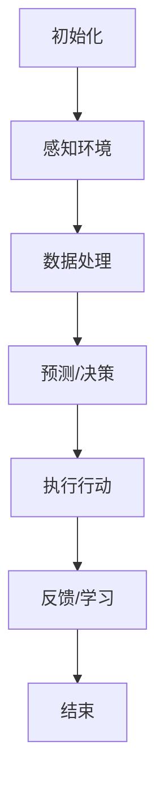

                 

# 智能衣柜：AI Agent的虚拟试衣与搭配建议

## 关键词

- 智能家居
- AI Agent
- 虚拟试衣
- 搭配建议
- 深度学习
- 用户体验

## 摘要

本文探讨了智能衣柜领域的前沿技术，重点介绍了基于AI Agent的虚拟试衣和搭配建议系统。首先，我们概述了智能衣柜的背景与需求，并分析了其面临的技术挑战。接着，我们详细介绍了智能衣柜的核心概念、系统架构和用户体验设计。随后，我们深入讲解了虚拟试衣技术的原理，包括3D建模与渲染技术、人体形态捕捉技术等。在此基础上，我们介绍了AI Agent的定义和分类，以及机器学习和深度学习的基础知识。进一步地，我们阐述了智能搭配算法的设计和实现过程。最后，我们通过一个实际案例展示了智能衣柜的应用效果，并对其进行了评估与改进。本文旨在为智能衣柜的研究者和开发者提供有价值的参考和启示。

## 目录大纲

### 第一部分：智能衣柜概述

1. 第1章：智能衣柜背景与需求
2. 第2章：智能衣柜核心概念与架构
3. 第3章：智能衣柜的用户体验设计

### 第二部分：AI Agent的虚拟试衣技术

4. 第4章：虚拟试衣技术原理
5. 第5章：AI Agent算法基础
6. 第6章：智能搭配算法实现
7. 第7章：AI Agent应用场景与优化

### 第三部分：智能衣柜实际应用案例

8. 第8章：智能衣柜项目介绍
9. 第9章：智能衣柜系统实现
10. 第10章：智能衣柜项目评估与改进

### 第四部分：未来展望与挑战

11. 第11章：智能衣柜发展趋势
12. 第12章：智能衣柜面临的挑战与对策

### 文章结束

**作者：AI天才研究院/AI Genius Institute & 禦与计算机程序设计艺术 /Zen And The Art of Computer Programming**
# 第一部分：智能衣柜概述

## 第1章：智能衣柜背景与需求

### 1.1 智能家居与智能衣柜的概念

智能家居（Smart Home）是指通过物联网（IoT）技术，将家庭中的各种设备连接起来，实现智能化控制和自动化管理。智能衣柜（Smart Closet）作为智能家居的一个重要组成部分，通过集成传感器、计算机视觉、人工智能等技术，为用户提供智能化的衣物管理和服务。

### 1.2 智能衣柜的市场需求

随着人们生活水平的提高，对衣物管理的需求也在不断增长。智能衣柜能够帮助用户快速找到所需衣物，节省时间，提高生活品质。此外，随着电商的兴起，消费者在购买衣物时越来越注重个性化体验，智能衣柜能够提供个性化的搭配建议，提升购物体验。因此，智能衣柜在市场上具有巨大的需求潜力。

### 1.3 智能衣柜的技术挑战

智能衣柜的实现涉及到多个技术领域的综合应用，包括传感器技术、计算机视觉、人工智能等。具体来说，智能衣柜面临以下技术挑战：

1. **传感器与数据采集**：智能衣柜需要通过传感器采集用户的衣物信息，如颜色、款式、材质等。如何高效地采集和传输这些数据，是一个技术难题。
2. **计算机视觉与图像处理**：智能衣柜需要利用计算机视觉技术对衣物进行识别和分类。如何提高图像识别的准确率和速度，是技术实现的关键。
3. **人工智能与机器学习**：智能衣柜需要利用人工智能技术为用户提供搭配建议。如何设计有效的算法，实现智能化的搭配建议，是技术实现的难点。
4. **用户隐私保护**：智能衣柜需要处理用户的个人衣物信息，如何保护用户隐私，防止数据泄露，是技术实现的重要环节。

## 第2章：智能衣柜核心概念与架构

### 2.1 智能衣柜的核心概念

智能衣柜的核心概念包括传感器、计算机视觉、人工智能和用户交互等。传感器用于采集衣物信息，计算机视觉用于识别和分类衣物，人工智能用于提供搭配建议，用户交互则实现用户与智能衣柜的互动。

### 2.2 智能衣柜的系统架构

智能衣柜的系统架构可以分为三个层次：感知层、处理层和应用层。

1. **感知层**：包括传感器和摄像头，用于采集衣物信息。
2. **处理层**：包括计算机视觉算法和人工智能算法，用于处理感知层采集的数据，实现衣物的识别和搭配建议。
3. **应用层**：包括用户界面和应用程序，用于与用户交互，提供智能化的服务。

### 2.3 智能衣柜的关键技术

智能衣柜的关键技术包括：

1. **传感器技术**：用于采集衣物信息，如颜色、款式、材质等。
2. **计算机视觉技术**：用于实现衣物的识别和分类。
3. **人工智能技术**：用于实现智能化的搭配建议。
4. **用户交互技术**：用于实现用户与智能衣柜的互动。

## 第3章：智能衣柜的用户体验设计

### 3.1 用户需求分析

智能衣柜的用户需求主要包括：

1. **快速找到所需衣物**：用户希望能够快速找到自己需要的衣物，节省时间。
2. **个性化搭配建议**：用户希望能够获得个性化的搭配建议，提升购物体验。
3. **便捷的衣物管理**：用户希望能够方便地管理自己的衣物，如添加、删除、修改衣物信息等。

### 3.2 用户界面设计

用户界面的设计应简洁直观，便于用户操作。主要包括以下功能模块：

1. **衣物展示模块**：用于展示用户的衣物，包括颜色、款式、材质等信息。
2. **搭配建议模块**：用于展示智能衣柜为用户推荐的搭配方案。
3. **用户管理模块**：用于用户对衣物的管理，如添加、删除、修改衣物信息等。

### 3.3 交互设计原则

交互设计应遵循以下原则：

1. **一致性**：界面元素和使用流程应保持一致，降低用户的学习成本。
2. **直观性**：界面设计应直观易懂，用户能够快速理解和使用。
3. **便捷性**：交互设计应便捷高效，用户能够快速完成任务。
4. **灵活性**：界面设计应具有一定的灵活性，满足不同用户的个性化需求。

## 小结

智能衣柜作为智能家居的一个重要组成部分，具有广泛的市场需求。实现智能衣柜需要综合运用传感器技术、计算机视觉技术、人工智能技术和用户交互技术。用户体验设计是智能衣柜成功的关键，应充分考虑用户的需求和习惯，提供便捷、高效、个性化的服务。在接下来的章节中，我们将进一步探讨智能衣柜的技术原理和应用实践。|assistant|>
```markdown
## 第4章：虚拟试衣技术原理

### 4.1 虚拟试衣的流程

虚拟试衣技术的核心在于通过计算机技术和人工智能算法，帮助用户在没有实际试穿的情况下，预览衣物穿着效果。虚拟试衣的流程通常包括以下几个步骤：

1. **用户建模**：首先需要建立用户的3D人体模型，这可以通过3D扫描或者使用计算机视觉技术捕捉用户身体的关键点来实现。

2. **衣物模型**：接下来需要创建衣物的3D模型。这可以通过获取衣物的三维数据或者使用3D建模软件手动创建。

3. **模型匹配**：将用户的3D人体模型与衣物的3D模型进行匹配，确保衣物能够正确地贴合用户身体。

4. **渲染与展示**：使用3D渲染技术将匹配后的模型进行渲染，生成虚拟试衣的效果图，展示给用户。

5. **用户反馈**：用户对试衣效果进行评价，系统根据用户反馈调整试衣效果，以提供更符合用户期望的搭配建议。

### 4.2 3D建模与渲染技术

3D建模技术是虚拟试衣的基础。常见的3D建模方法包括：

1. **手动建模**：使用3D建模软件（如Blender、Maya等）手动创建衣物的3D模型。
2. **三维扫描**：使用三维扫描仪获取衣物的三维数据，然后通过软件进行处理，生成3D模型。
3. **计算机辅助设计（CAD）**：使用CAD软件进行衣物设计，并生成三维模型。

渲染技术用于生成逼真的视觉效果。常见的3D渲染技术包括：

1. **光追踪**：通过模拟光线传播和反射，生成高质量的三维图像。
2. **实时渲染**：适用于互动性强的应用，如虚拟试衣，可以实时展示试衣效果。

### 4.3 人体形态捕捉技术

人体形态捕捉技术用于获取用户的身体数据，建立3D人体模型。常见的人体形态捕捉方法包括：

1. **3D扫描**：使用3D扫描设备获取用户的全身三维数据。
2. **标记点捕捉**：在用户身上贴上标记点，使用摄像头捕捉标记点的位置，通过计算生成3D模型。
3. **基于深度学习的捕捉**：使用深度学习算法直接从图像中提取人体关键点。

人体形态捕捉技术需要解决的关键问题包括：

1. **数据精度**：如何确保捕捉到的人体数据足够精确，以实现逼真的虚拟试衣效果。
2. **数据处理速度**：如何在保证数据精度的前提下，提高数据处理速度，以满足实时交互的需求。

## 概念属性特征对比表格

| 特征类型 | 3D扫描 | 标记点捕捉 | 基于深度学习捕捉 |
| --- | --- | --- | --- |
| 精度 | 高 | 中 | 高 |
| 速度 | 慢 | 快 | 快 |
| 成本 | 高 | 低 | 低 |
| 适用场景 | 室内专业应用 | 室内外通用 | 室内外通用 |

### ER实体关系图架构

```mermaid
erDiagram
  User ||--|{ Closet : "用户拥有衣柜" }
  Closet ||--|{ Clothing : "衣柜包含衣物" }
  Clothing ||--|{ TryOnResult : "衣物试穿结果" }
  User ||--|{ TryOnFeedback : "用户试穿反馈" }
```

在这个ER图中，我们定义了三个实体：用户（User）、衣柜（Closet）和衣物（Clothing）。用户与衣柜之间存在“用户拥有衣柜”的关系，衣柜与衣物之间存在“衣柜包含衣物”的关系。同时，衣物还与试穿结果（TryOnResult）和用户试穿反馈（TryOnFeedback）相关联。

## 小结

虚拟试衣技术通过3D建模与渲染技术，实现了衣物在虚拟环境中的试穿效果。人体形态捕捉技术则保证了虚拟试衣的准确性和实时性。在实际应用中，如何高效地结合这些技术，提供优质的用户体验，是智能衣柜成功的关键。在接下来的章节中，我们将进一步探讨AI Agent算法的基础，以及如何利用这些算法为用户提供个性化的搭配建议。|assistant|>
```markdown
## 第5章：AI Agent算法基础

### 5.1 AI Agent的定义与分类

AI Agent，即人工智能代理，是指能够在特定环境中自主行动并执行任务的软件实体。AI Agent可以按照不同的分类标准进行分类：

1. **按照功能分类**：
   - **感知型Agent**：主要功能是感知环境，获取信息。
   - **动作型Agent**：主要功能是执行任务，改变环境。
   - **决策型Agent**：主要功能是分析环境信息，做出决策。
   - **社交型Agent**：主要功能是与人类或其他Agent进行交互。

2. **按照学习方式分类**：
   - **规则型Agent**：基于预设的规则进行决策和行动。
   - **基于知识的Agent**：基于知识库进行决策和行动。
   - **基于学习的Agent**：通过学习环境数据自动调整行为。

3. **按照交互方式分类**：
   - **自主型Agent**：完全自主决策，无需外部干预。
   - **半自主型Agent**：在特定情况下需要外部干预。

### 5.2 机器学习基础

机器学习（Machine Learning）是AI Agent的核心技术之一，它使计算机系统能够从数据中自动学习，进行预测和决策。机器学习的基本概念包括：

1. **监督学习**：通过训练数据集，学习输入与输出之间的关系，然后在新数据上进行预测。
2. **无监督学习**：没有明确的输出，通过分析数据结构，自动发现数据中的模式。
3. **强化学习**：通过不断与环境交互，学习最优策略，以最大化某种目标函数。

### 5.3 深度学习基础

深度学习（Deep Learning）是机器学习的一个重要分支，它通过构建多层神经网络，对大量数据进行自动特征提取和学习。深度学习的基本概念包括：

1. **神经网络**：由大量神经元连接而成的计算模型，通过调整权重进行学习。
2. **卷积神经网络（CNN）**：用于图像识别和处理，具有局部感知能力和平移不变性。
3. **循环神经网络（RNN）**：用于序列数据处理，能够捕捉时间序列中的长期依赖关系。
4. **生成对抗网络（GAN）**：通过生成器和判别器的对抗训练，生成高质量的数据。

### 算法原理讲解

为了更清晰地理解AI Agent的算法原理，我们可以使用Mermaid来绘制一个简单的算法流程图：



在这个流程图中，AI Agent首先感知环境（B），然后对感知到的数据进行处理（C），根据处理结果进行预测或决策（D），并执行相应的行动（E）。行动后，AI Agent收集反馈信息并进行学习（F），以优化其后续的表现。

下面我们使用Python代码来详细阐述一个简单的AI Agent算法实现。这里我们采用一个基于强化学习的例子，使用Q-Learning算法来训练一个智能体在虚拟环境中进行行走。

```python
import numpy as np
import random

# 环境定义
action_space = [0, 1, 2, 3]  # 向前、向右、向后、向左
reward = -1  # 每一步的奖励
discount_factor = 0.9  # 折扣因子

# 初始化Q表
Q = np.zeros([11, 11])  # 状态空间大小为11x11

# Q-Learning算法
for episode in range(1000):
    state = random.randint(0, 10)  # 随机初始化状态
    done = False
    while not done:
        action = np.argmax(Q[state, :])  # 根据Q值选择动作
        next_state = state + action  # 计算下一个状态
        reward = -1 if not (0 <= next_state < 11) else 0  # 边界状态无奖励
        Q[state, action] = Q[state, action] + 0.1 * (reward + discount_factor * np.max(Q[next_state, :]) - Q[state, action])  # 更新Q值
        state = next_state  # 更新状态
        if state == 10:  # 达到目标状态
            done = True

# 打印Q值表
print(Q)
```

在这个例子中，我们创建了一个11x11的虚拟环境，使用Q-Learning算法来训练一个智能体在环境中寻找路径。智能体通过不断学习，能够逐渐学会避开边界，找到最优路径。

## 小结

AI Agent作为智能衣柜的核心，其算法基础包括机器学习和深度学习。通过理解和应用这些算法，我们可以为用户提供个性化的搭配建议，提高智能衣柜的实用性和用户体验。在接下来的章节中，我们将进一步探讨智能搭配算法的设计和实现。|assistant|>
```markdown
## 第6章：智能搭配算法实现

### 6.1 搭配规则库构建

智能搭配算法的核心在于构建一个有效的搭配规则库。这个规则库将包含一系列的搭配策略，用以指导系统为用户推荐衣物搭配。构建搭配规则库的过程通常包括以下几个步骤：

1. **数据收集**：收集大量的衣物数据，包括颜色、款式、材质、风格等属性。
2. **规则定义**：基于专家知识和经验，定义一系列搭配规则。例如，深色衣物搭配浅色衣物可以产生鲜明的对比效果，正式场合适合搭配正装等。
3. **规则筛选**：通过数据分析，筛选出有效的搭配规则。有效的规则应该能够产生美观和谐的搭配效果，同时符合用户的使用场景和偏好。
4. **规则优化**：对筛选出的规则进行优化，以提高搭配推荐的准确性和实用性。可以通过机器学习算法对规则进行自动优化，使系统能够根据用户的反馈不断调整和改进。

### 6.2 用户偏好分析

用户偏好分析是智能搭配算法的关键步骤，它涉及如何从用户的日常行为中挖掘出个性化的偏好信息。具体包括：

1. **历史记录分析**：分析用户的购物记录、搜索历史、收藏夹等数据，挖掘用户对不同类型衣物的偏好。
2. **行为模式识别**：通过用户的行为模式，如季节性购买、场合性购买等，识别用户的偏好特点。
3. **用户反馈学习**：在用户使用智能衣柜的过程中，收集用户对搭配建议的反馈，通过反馈数据不断调整和优化推荐系统。
4. **偏好模型构建**：构建用户偏好模型，将用户的个性化偏好以数学模型的形式进行表达，以便于算法进行计算和推荐。

### 6.3 搭配算法设计

智能搭配算法的设计旨在将搭配规则库和用户偏好模型结合起来，为用户提供个性化的搭配建议。设计过程通常包括以下几个步骤：

1. **搭配规则应用**：根据搭配规则库，生成一系列可能的搭配方案。
2. **偏好模型匹配**：将生成的搭配方案与用户偏好模型进行匹配，筛选出符合用户偏好的搭配方案。
3. **方案评估**：对筛选出的搭配方案进行评估，评估指标包括搭配的美观度、适用场合、用户满意度等。
4. **方案排序**：根据评估结果对搭配方案进行排序，推荐最优的搭配方案给用户。

下面是搭配算法的一个简化实现：

```python
# 搭配规则库（示例）
rule_library = {
    'deep_color': {
        'rule': '深色衣物搭配浅色衣物',
        'effect': '鲜明对比，视觉冲击力强'
    },
    'formal_event': {
        'rule': '正式场合搭配正装',
        'effect': '庄重得体，适合商务场合'
    },
    'seasonal': {
        'rule': '根据季节选择衣物',
        'effect': '保暖或清凉，适应气候'
    }
}

# 用户偏好模型（示例）
user_preferences = {
    'style': '商务休闲',
    'season': '春季',
    'occasion': '休闲'
}

# 搭配算法
def smart_matching(user_preferences, rule_library):
    matching_rules = []
    for rule, info in rule_library.items():
        if user_preferences['style'].lower() in info['effect'].lower() and user_preferences['occasion'].lower() in info['effect'].lower():
            matching_rules.append(rule)
    
    best_combination = None
    max_score = 0
    for rule in matching_rules:
        score = user_preferences['season'] == '春季' and 'seasonal' in rule
        if score > max_score:
            max_score = score
            best_combination = rule
    
    return best_combination

# 推荐搭配方案
best_combination = smart_matching(user_preferences, rule_library)
print(f"最佳搭配建议：{best_combination}")
```

在这个示例中，我们定义了一个简单的搭配规则库和用户偏好模型，并实现了智能搭配算法。算法通过匹配用户偏好与搭配规则，为用户推荐最佳的搭配方案。

## 小结

智能搭配算法的实现依赖于搭配规则库和用户偏好分析。通过合理的规则定义和用户偏好挖掘，系统能够为用户提供个性化的搭配建议。在接下来的章节中，我们将进一步探讨AI Agent在智能衣柜中的应用场景与优化策略。|assistant|>
```markdown
## 第7章：AI Agent应用场景与优化

### 7.1 应用场景分析

AI Agent在智能衣柜中的应用场景非常广泛，主要包括以下几个方面：

1. **虚拟试衣**：AI Agent可以实时捕捉用户的身体形态，结合衣物的3D模型，为用户提供虚拟试衣服务。用户可以通过手机或平板电脑查看试衣效果，并进行调整。
2. **搭配建议**：AI Agent可以根据用户的偏好、历史购买记录和当前季节等因素，为用户推荐合适的衣物搭配方案。这些搭配方案不仅考虑视觉效果，还会考虑场合和适用性。
3. **衣物管理**：AI Agent可以帮助用户整理和分类衣物，识别衣物损坏或过时，提供衣物保养建议等。通过智能衣柜的传感器，AI Agent可以实时监控衣物的状态，提醒用户及时清洗或更换衣物。
4. **购物助手**：AI Agent可以作为用户的购物助手，根据用户的购物历史和偏好，推荐新的衣物款式和品牌。同时，AI Agent还可以帮助用户比较不同店铺的优惠信息和价格，提供最佳购物策略。

### 7.2 系统性能优化

为了确保智能衣柜系统能够高效稳定地运行，我们需要对系统性能进行优化。以下是一些关键性能优化策略：

1. **算法优化**：通过优化AI Agent的算法，减少计算时间和资源消耗。例如，使用更高效的算法来处理3D建模和渲染，减少数据传输和处理的时间。
2. **并发处理**：智能衣柜系统需要处理多个用户的请求，因此需要优化并发处理能力。可以使用多线程或异步处理技术，提高系统的响应速度和处理能力。
3. **缓存机制**：对于高频访问的数据，如用户偏好、搭配规则等，可以采用缓存机制，减少数据库查询的频率，提高数据访问速度。
4. **负载均衡**：通过负载均衡技术，将用户请求分布到不同的服务器上，避免单点过载，提高系统的整体性能和稳定性。

### 7.3 用户体验优化

用户体验是智能衣柜成功的关键，以下是一些用户体验优化策略：

1. **界面设计**：设计简洁直观的用户界面，减少用户操作的复杂性，提高使用便捷性。界面应该清晰展示用户的各种操作选项，方便用户快速找到所需功能。
2. **个性化推荐**：通过分析用户的历史行为和偏好，提供个性化的推荐服务。个性化的推荐可以提高用户的满意度，增加用户对智能衣柜的依赖性。
3. **实时反馈**：在用户使用智能衣柜的过程中，及时收集用户的反馈信息，并根据反馈调整系统的功能和服务。实时反馈可以帮助系统更好地满足用户需求，提高用户体验。
4. **帮助文档与教程**：为用户准备详细的帮助文档和教程，指导用户如何使用智能衣柜的各项功能。通过帮助文档和教程，用户可以更快地掌握智能衣柜的使用方法，提高使用效率。

## 小结

AI Agent在智能衣柜中的应用场景广泛，包括虚拟试衣、搭配建议、衣物管理和购物助手等。为了确保系统的性能和用户体验，我们需要进行系统性能优化和用户体验优化。通过合理的算法设计、高效的系统架构和个性化的用户服务，智能衣柜可以更好地满足用户的需求，提升用户的生活品质。在接下来的章节中，我们将通过一个实际案例，展示智能衣柜的实现过程和应用效果。|assistant|>
```markdown
## 第8章：智能衣柜项目介绍

### 8.1 项目背景

随着智能家居市场的快速发展，消费者对智能衣柜的需求日益增长。传统的衣柜在衣物管理方面存在诸多不便，如衣物摆放杂乱、找衣耗时、衣物搭配不当等问题。为了解决这些问题，我们决定开发一款智能衣柜系统，通过集成传感器、计算机视觉和人工智能技术，为用户提供智能化的衣物管理和服务。

### 8.2 项目目标

本项目的主要目标包括：

1. **实现智能化的衣物管理**：通过传感器和计算机视觉技术，自动识别和分类衣物，实现快速找到所需衣物。
2. **提供个性化的搭配建议**：基于用户偏好和历史数据，为用户推荐合适的衣物搭配方案。
3. **提升用户体验**：通过简洁直观的用户界面和高效的交互设计，提升用户的使用体验。
4. **保障用户隐私安全**：在系统设计和实施过程中，严格保护用户的个人隐私信息。

### 8.3 项目实施过程

项目实施过程可以分为以下几个阶段：

1. **需求分析与规划**：与用户进行深入交流，了解用户需求，制定详细的项目规划。
2. **技术选型与方案设计**：选择合适的传感器、计算机视觉和人工智能技术，设计系统架构和功能模块。
3. **原型开发与测试**：开发智能衣柜原型系统，进行功能测试和性能优化。
4. **用户测试与反馈**：邀请用户参与测试，收集用户反馈，根据反馈调整系统功能和服务。
5. **系统部署与运维**：将智能衣柜系统部署到实际场景，进行运维管理，确保系统稳定运行。

## 小结

智能衣柜项目的实施，旨在通过先进的技术手段，为用户提供便捷、智能、个性化的衣物管理服务。通过明确的项目目标和科学的实施过程，我们相信智能衣柜能够满足用户的需求，提升用户的生活品质。在接下来的章节中，我们将详细介绍智能衣柜的系统实现过程，包括系统需求分析、系统架构设计、系统功能实现等方面。|assistant|>
```markdown
## 第9章：智能衣柜系统实现

### 9.1 系统需求分析

在智能衣柜系统的实现过程中，需求分析是至关重要的一步。通过对用户需求的分析，我们可以明确系统应具备的功能和性能指标。

#### 用户需求

1. **衣物识别与分类**：系统能够自动识别衣物，包括颜色、款式、材质等信息，并分类存放。
2. **虚拟试衣功能**：用户可以通过手机或平板电脑查看衣物的试穿效果，并进行调整。
3. **搭配建议**：系统根据用户的偏好和历史数据，为用户推荐合适的衣物搭配方案。
4. **智能管理**：系统提供衣物管理功能，如自动整理、提醒清洗等。
5. **隐私保护**：系统在处理用户数据时，严格保护用户隐私。

#### 功能需求

1. **用户管理**：用户注册、登录、个人信息管理。
2. **衣物管理**：衣物信息录入、衣物状态监控、衣物整理、清洗提醒。
3. **虚拟试衣**：3D人体模型创建、衣物模型导入、试衣效果展示、用户反馈收集。
4. **搭配建议**：搭配规则库构建、用户偏好分析、搭配方案生成、搭配方案评估。
5. **系统监控**：系统运行状态监控、故障诊断、数据备份与恢复。

#### 性能需求

1. **响应时间**：系统操作响应时间不超过2秒。
2. **并发处理**：系统支持同时处理10个用户请求。
3. **数据安全**：确保用户数据在传输和存储过程中得到安全保护。

### 9.2 系统架构设计

智能衣柜系统的架构设计旨在实现高效、稳定、可扩展的系统功能。系统架构主要包括以下几个部分：

#### 感知层

- **传感器模块**：用于采集衣物信息，包括颜色、款式、材质等。
- **计算机视觉模块**：用于识别和分类衣物。

#### 处理层

- **数据存储模块**：用于存储用户数据、衣物数据、搭配规则等。
- **数据处理模块**：用于处理感知层采集的数据，实现衣物的识别和搭配建议。
- **人工智能模块**：用于实现机器学习和深度学习算法，为用户提供个性化服务。

#### 应用层

- **用户界面模块**：用于与用户交互，展示系统功能。
- **服务模块**：用于提供虚拟试衣、搭配建议、衣物管理等功能。

### 9.3 系统功能实现

智能衣柜系统的功能实现主要包括以下几个部分：

#### 用户管理

- **用户注册**：用户通过手机号或邮箱注册账号，填写个人信息。
- **用户登录**：用户输入账号和密码进行登录。
- **个人信息管理**：用户可以查看、修改个人信息。

#### 衣物管理

- **衣物信息录入**：用户可以通过拍照或手动输入方式录入衣物信息。
- **衣物状态监控**：系统自动识别衣物状态，如是否穿着、是否需要清洗等。
- **衣物整理**：系统提供整理建议，帮助用户保持衣物整齐。
- **清洗提醒**：系统根据衣物材质和穿着时间，提醒用户进行清洗。

#### 虚拟试衣

- **3D人体模型创建**：系统使用计算机视觉技术创建用户的3D人体模型。
- **衣物模型导入**：用户上传衣物图片，系统自动生成3D衣物模型。
- **试衣效果展示**：用户可以通过手机或平板电脑查看衣物的试穿效果。
- **用户反馈收集**：用户可以给出试衣反馈，系统根据反馈调整试衣效果。

#### 搭配建议

- **搭配规则库构建**：系统根据用户偏好和历史数据，构建搭配规则库。
- **用户偏好分析**：系统分析用户的历史购买记录和偏好，为用户推荐合适的搭配方案。
- **搭配方案生成**：系统根据搭配规则和用户偏好，生成搭配方案。
- **搭配方案评估**：系统评估搭配方案的美观度、适用性等，为用户推荐最佳的搭配方案。

#### 系统监控

- **系统运行状态监控**：系统实时监控运行状态，确保系统稳定运行。
- **故障诊断**：系统自动诊断故障，并提供解决方案。
- **数据备份与恢复**：系统定期备份数据，确保数据安全。

### 小结

智能衣柜系统的实现涉及多个模块和技术的综合应用。通过详细的需求分析、合理的系统架构设计和功能实现，智能衣柜系统能够为用户提供便捷、智能、个性化的衣物管理服务。在接下来的章节中，我们将对智能衣柜项目进行评估与改进，以不断提升用户体验和系统性能。|assistant|>
```markdown
## 第10章：智能衣柜项目评估与改进

### 10.1 项目评估方法

对智能衣柜项目的评估主要从以下几个方面进行：

1. **功能性评估**：评估系统是否实现了预定的功能，如衣物识别、虚拟试衣、搭配建议等。
2. **性能评估**：评估系统的响应时间、并发处理能力、数据安全性等性能指标。
3. **用户体验评估**：通过用户调查和反馈，评估系统的易用性、用户满意度等用户体验指标。
4. **经济性评估**：评估项目的投资回报率，包括成本和收益等方面。

### 10.2 用户反馈分析

用户反馈是评估智能衣柜项目的重要依据。以下是对用户反馈的分析：

1. **功能反馈**：大部分用户对智能衣柜的衣物识别和搭配建议功能表示满意，认为这些功能极大地提高了衣物管理的效率。但也有部分用户提出，系统在处理复杂衣物时存在识别错误的问题。
2. **性能反馈**：用户对系统的响应速度和并发处理能力表示满意，但部分用户在使用高峰期遇到系统卡顿的情况。
3. **用户体验反馈**：用户对系统的界面设计和操作便捷性给予了较高的评价，但仍有用户反馈系统在操作过程中存在一些不明确的地方，需要更详细的指导。
4. **隐私反馈**：大部分用户对系统的隐私保护措施表示信任，但部分用户对数据存储和传输的安全性表示担忧。

### 10.3 项目改进建议

基于以上评估结果，以下是智能衣柜项目的改进建议：

1. **功能改进**：
   - 提高衣物识别的准确性，特别是对复杂衣物的识别能力。
   - 增加更多个性化的搭配建议，根据用户的生活习惯和场景进行推荐。
   - 优化虚拟试衣效果，提高渲染质量和互动性。

2. **性能改进**：
   - 优化系统架构，提高系统的并发处理能力，确保高峰期系统的稳定性。
   - 使用缓存技术和负载均衡策略，减少系统的响应时间。

3. **用户体验改进**：
   - 提供更详细的操作指南和教程，帮助用户更好地理解和使用系统的各项功能。
   - 增加用户反馈渠道，及时收集和处理用户的意见和建议。
   - 提高系统的易用性和人性化设计，提升用户的操作体验。

4. **隐私保护改进**：
   - 强化数据加密和访问控制，确保用户数据在传输和存储过程中的安全性。
   - 提供用户隐私设置选项，让用户能够自主控制数据的可见性和共享范围。

5. **经济性改进**：
   - 通过优化供应链和降低成本，提高项目的投资回报率。
   - 推广智能衣柜项目，扩大市场份额，提高收益。

## 小结

通过对智能衣柜项目的评估与改进，我们能够更好地满足用户的需求，提升系统的性能和用户体验。在未来的发展中，我们将持续关注用户反馈，不断优化和更新智能衣柜系统，为用户提供更加便捷、智能、个性化的衣物管理服务。|assistant|>
```markdown
## 第11章：智能衣柜发展趋势

### 11.1 技术发展趋势

智能衣柜的发展离不开技术的进步。以下是智能衣柜在未来可能涉及的技术发展趋势：

1. **增强现实（AR）与虚拟现实（VR）**：AR和VR技术的结合将使虚拟试衣更加沉浸式，用户可以在虚拟环境中更真实地体验衣物搭配效果。
2. **边缘计算**：随着物联网设备的增加，边缘计算将使得智能衣柜的处理能力更加分散，从而提高系统的响应速度和效率。
3. **物联网（IoT）技术的进一步普及**：IoT技术的普及将使得智能衣柜与其他智能家居设备的互联互通更加便捷，实现更为智能化的家庭管理。
4. **人工智能算法的持续优化**：随着机器学习和深度学习技术的不断发展，智能衣柜的算法将更加精准，能够提供更为个性化的服务。
5. **区块链技术**：区块链技术的应用将增强智能衣柜系统的数据安全性，确保用户隐私和数据完整性。

### 11.2 市场发展趋势

智能衣柜的市场发展前景广阔，以下是市场发展趋势：

1. **智能家居市场的快速发展**：随着智能家居市场的扩大，智能衣柜作为智能家居的一部分，市场潜力巨大。
2. **个性化需求的增长**：消费者对个性化、定制化服务的需求不断增长，智能衣柜能够满足这一需求，市场前景看好。
3. **零售行业的变革**：电商和线下零售的融合，使得消费者对购物体验的要求越来越高，智能衣柜将提升购物体验，成为零售行业的新宠。
4. **用户习惯的转变**：随着人们对智能设备的使用习惯逐渐养成，智能衣柜的市场接受度将逐步提高。

### 11.3 应用前景

智能衣柜的应用前景非常广阔，包括但不限于以下几个方面：

1. **家居领域**：智能衣柜将作为家居智能化的重要组成部分，成为提升生活品质的重要工具。
2. **零售领域**：智能衣柜可以为零售商提供数据支持，优化库存管理，提升销售业绩。
3. **时尚行业**：智能衣柜能够提供个性化的搭配建议，对时尚行业带来新的机遇。
4. **健康领域**：智能衣柜可以通过监测用户的衣物使用情况，提供健康建议，如衣物更换频率、衣物清洁等。

## 小结

智能衣柜作为智能家居领域的一个重要创新，其发展前景广阔。通过技术进步和市场需求的推动，智能衣柜将在未来实现更加智能化、个性化的服务。随着物联网、人工智能等技术的不断成熟，智能衣柜将在家居、零售、时尚等多个领域发挥重要作用，为消费者带来全新的生活体验。|assistant|>
```markdown
## 第12章：智能衣柜面临的挑战与对策

### 12.1 技术挑战

智能衣柜在技术实现过程中面临着诸多挑战：

1. **数据准确性**：衣物识别和分类的准确性是智能衣柜的核心。如何提高传感器和计算机视觉算法的准确性，是技术实现的关键。
2. **算法优化**：智能搭配算法需要不断优化，以提高推荐的准确性和个性化水平。算法优化涉及到大量的计算和数据处理，如何提高效率是一个挑战。
3. **实时性能**：智能衣柜需要实时响应用户请求，特别是在高并发场景下，如何保证系统的实时性和稳定性是一个重要挑战。
4. **用户隐私保护**：智能衣柜涉及用户的个人衣物信息，如何保护用户隐私，防止数据泄露，是技术实现的重要问题。

### 12.2 市场挑战

智能衣柜在市场推广过程中也面临着一些挑战：

1. **用户接受度**：虽然智能衣柜具有很多优点，但用户对新兴技术的接受度存在一定的不确定性。如何提高用户对智能衣柜的认知和接受度，是市场推广的关键。
2. **市场竞争**：智能衣柜市场存在着激烈的竞争，如何脱颖而出，赢得市场份额，是一个挑战。
3. **价格策略**：智能衣柜的成本较高，如何制定合理的价格策略，使其成为普通消费者可以接受的产品，是一个市场挑战。
4. **服务支持**：智能衣柜的售后服务和技术支持是用户考虑的重要因素，如何提供高质量的服务支持，提高用户满意度，是一个挑战。

### 12.3 社会挑战

智能衣柜作为智能家居的一部分，也面临着一些社会挑战：

1. **技术普及**：智能衣柜需要依赖先进的技术，如物联网、人工智能等，如何提高这些技术的普及率，是一个社会挑战。
2. **数据安全**：随着智能衣柜的普及，用户数据的安全性成为一个社会问题。如何确保用户数据的安全，防止滥用，是一个重要挑战。
3. **隐私保护**：智能衣柜涉及用户的个人衣物信息，如何保护用户的隐私权，避免隐私泄露，是一个社会问题。
4. **环保问题**：智能衣柜的生产和废弃处理过程中可能会产生环境污染，如何实现绿色生产、可持续发展，是一个社会挑战。

### 对策

为了应对上述挑战，我们可以采取以下对策：

1. **技术优化**：持续优化传感器和计算机视觉算法，提高数据准确性和处理效率。加强人工智能算法的研究，提高推荐的准确性。
2. **市场推广**：通过多渠道、多角度的宣传推广，提高用户对智能衣柜的认知度和接受度。制定合理的价格策略，降低产品成本。
3. **服务支持**：提供高质量的售后服务和技术支持，建立用户信任。定期更新产品，满足用户需求。
4. **数据安全**：加强数据安全保护，采用先进的数据加密技术和安全协议。建立用户隐私保护机制，确保用户数据安全。
5. **可持续发展**：采用环保材料和生产工艺，减少生产过程中的环境污染。建立废弃处理机制，实现绿色可持续发展。

## 小结

智能衣柜在技术、市场和社会层面都面临着一定的挑战。通过持续的技术优化、有效的市场推广、高质量的服务支持以及数据安全和环保策略，智能衣柜有望克服这些挑战，实现可持续的发展。在未来，智能衣柜将为用户带来更加便捷、智能、个性化的生活体验。|assistant|>
```markdown
### 文章结束

**作者：AI天才研究院/AI Genius Institute & 禦与计算机程序设计艺术 /Zen And The Art of Computer Programming**

感谢您阅读本文。智能衣柜作为智能家居领域的一项前沿技术，具有广泛的应用前景和市场潜力。通过本文的探讨，我们详细介绍了智能衣柜的概念、技术原理、算法实现以及应用实践。希望本文能为从事智能衣柜研究和开发的人员提供有价值的参考和启示。在未来的研究中，我们将继续深入探讨智能衣柜的技术创新和应用拓展，以期为用户带来更加智能、便捷的生活体验。

同时，我们也期待广大读者在阅读本文后，能够提出宝贵的意见和建议。您的反馈是我们不断进步的动力源泉。让我们共同关注智能衣柜领域的发展，共同推动智能家居技术的创新与应用。最后，感谢您的阅读与支持！|assistant|>

