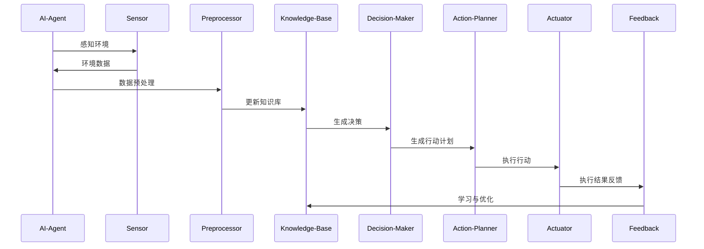
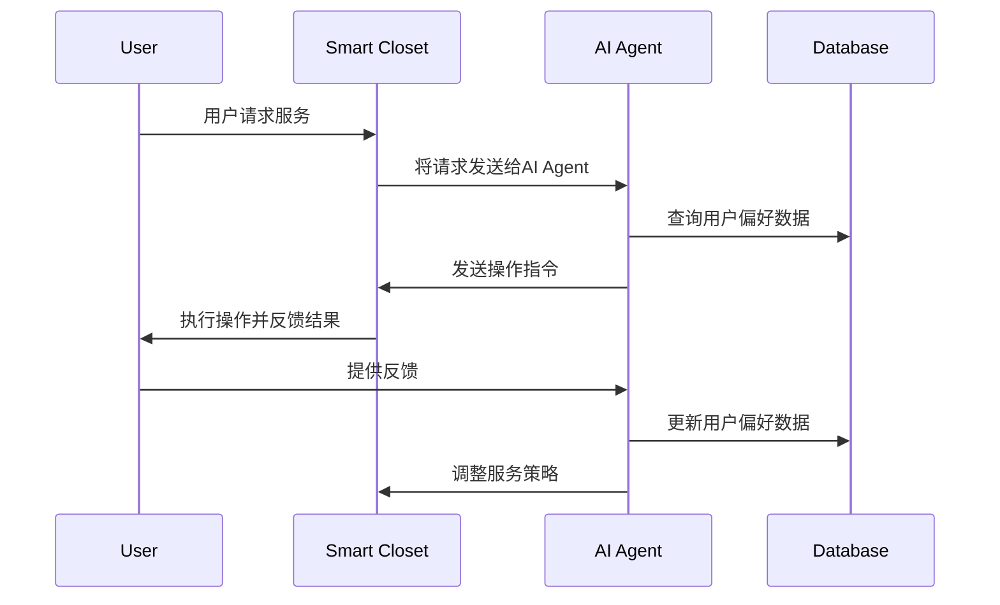
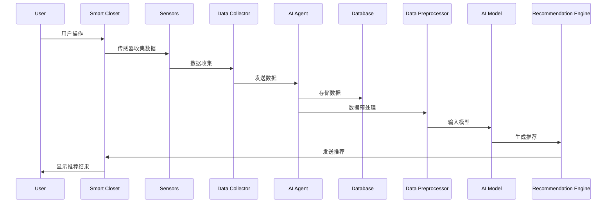
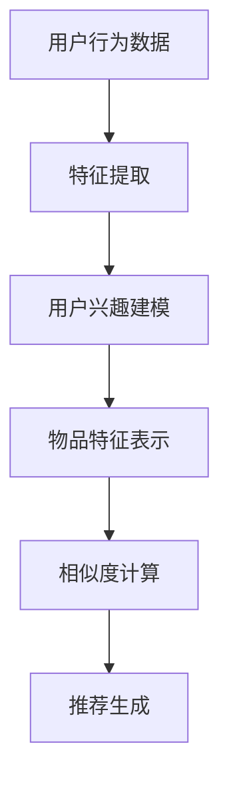
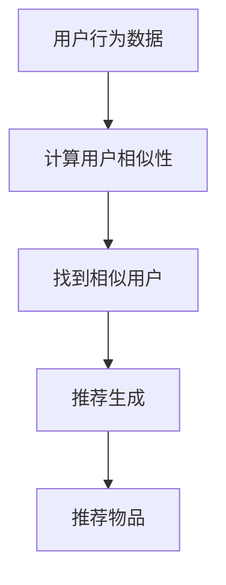
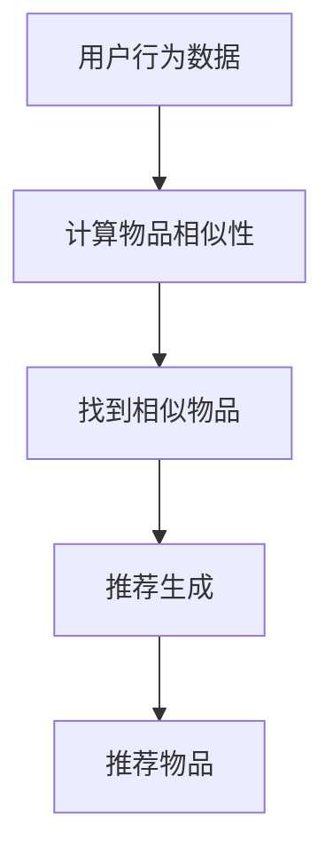
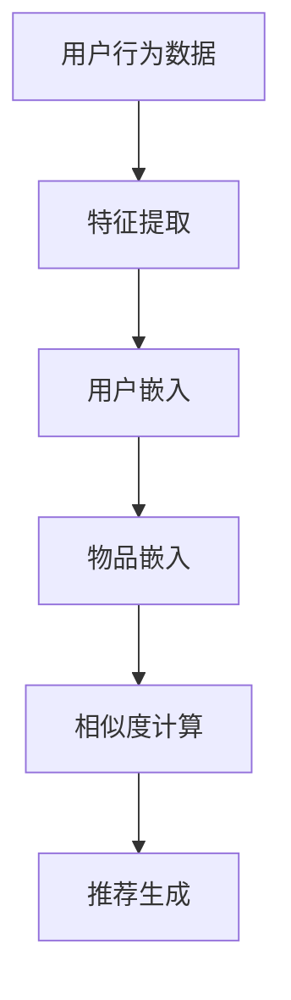
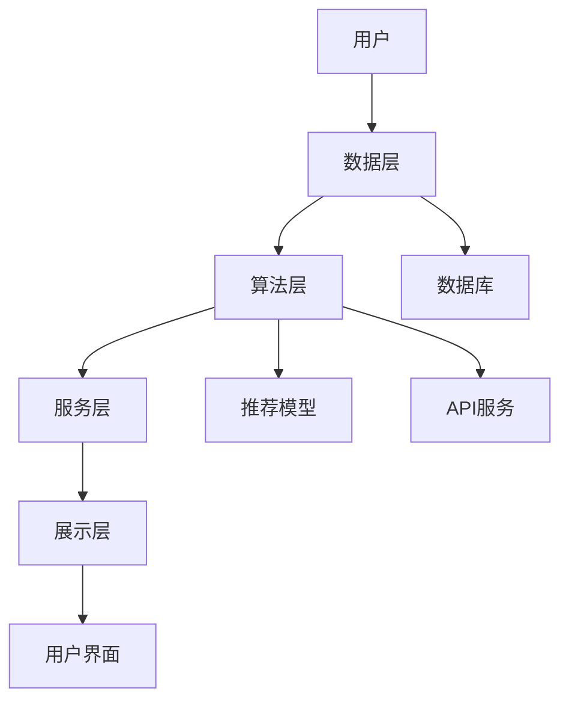

                 


## 智能衣柜：AI Agent的衣物搭配推荐

### 关键词
- 智能衣柜
- AI Agent
- 衣物搭配推荐
- 用户画像
- 协同过滤
- 深度学习

### 摘要
本文将深入探讨智能衣柜及其核心组件AI Agent在衣物搭配推荐中的应用。我们将从基础概念出发，逐步分析智能衣柜的组成、功能以及市场前景。接着，我们会介绍AI Agent的基础知识，包括其概念、工作原理和在智能衣柜中的应用。随后，我们将详细讲解衣物搭配推荐原理，涵盖用户画像、偏好分析和常见的搭配推荐算法。本文还将通过实际案例展示AI Agent的衣物搭配推荐系统设计，最后探讨智能衣柜与AI Agent的未来发展趋势和最佳实践。

### 目录

#### 第一部分：智能衣柜与AI Agent基础

1. **智能衣柜的概述**
   - 1.1 智能衣柜的定义与发展历程
   - 1.2 智能衣柜的组成与功能
   - 1.3 智能衣柜的市场前景与应用领域

2. **AI Agent基础**
   - 2.1 AI Agent的概念与类型
   - 2.2 AI Agent的工作原理
   - 2.3 AI Agent在智能衣柜中的应用

3. **智能衣柜与AI Agent的关系**
   - 3.1 智能衣柜与AI Agent的协同作用
   - 3.2 智能衣柜与AI Agent的数据交互
   - 3.3 智能衣柜与AI Agent的用户体验优化

#### 第二部分：AI Agent的衣物搭配推荐技术

4. **衣物搭配推荐原理**
   - 4.1 衣物搭配的基础理论
   - 4.2 用户画像与偏好分析
   - 4.3 搭配推荐算法概述

5. **常见搭配推荐算法**
   - 5.1 基于内容的推荐算法
   - 5.2 基于协同过滤的推荐算法
   - 5.3 基于深度学习的推荐算法

6. **AI Agent的衣物搭配推荐实现**
   - 6.1 数据收集与预处理
   - 6.2 用户偏好建模
   - 6.3 搭配推荐系统设计

7. **实际案例分析**
   - 7.1 案例一：某大型电商的智能衣柜系统
   - 7.2 案例二：某时尚品牌的个性化搭配服务

#### 第三部分：智能衣柜与AI Agent的未来发展

8. **智能衣柜与AI Agent的未来趋势**
   - 8.1 新技术对智能衣柜的影响
   - 8.2 AI Agent在衣物搭配领域的创新
   - 8.3 智能衣柜与AI Agent的发展方向

9. **最佳实践与未来展望**
   - 9.1 智能衣柜与AI Agent的最佳实践经验
   - 9.2 未来智能衣柜与AI Agent的发展趋势
   - 9.3 结论与展望

---

### 1.1 智能衣柜的定义与发展历程

**背景介绍**

随着科技的飞速发展，智能家居设备已经成为现代家庭生活的重要组成部分。智能衣柜作为智能家居的一种，不仅提供了传统衣柜的基本功能，如储存衣物、保持衣物整洁等，还集成了先进的AI技术，能够为用户提供个性化的衣物搭配建议，提升生活品质。

**核心概念术语说明**

- **智能衣柜**：一种结合了物联网、传感器技术、人工智能等先进技术，能够自动感知用户需求并提供个性化服务的衣柜。
- **AI Agent**：一种能够模拟人类智能，执行特定任务的计算机程序。

**问题背景**

智能衣柜的出现，是为了解决传统衣柜在功能性和用户体验上的不足。传统衣柜通常只能提供基本的衣物存储功能，用户在寻找衣物或搭配衣物时需要花费大量时间和精力。而智能衣柜通过集成AI技术，能够自动学习用户的喜好和生活方式，为用户推荐适合的衣物搭配，从而提升用户的生活质量。

**问题描述**

智能衣柜面临的挑战主要包括：

- 如何准确获取用户的需求和偏好？
- 如何设计一个高效的推荐算法，能够为用户提供个性化的搭配建议？
- 如何确保智能衣柜的硬件和软件系统稳定可靠，为用户提供良好的用户体验？

**问题解决**

智能衣柜通过AI Agent来实现这些功能。AI Agent可以通过分析用户的行为数据，如衣物的穿着频率、搭配习惯等，来了解用户的偏好。同时，AI Agent还可以利用深度学习等技术，学习用户的面部特征、身材等，为用户提供更加准确的搭配建议。此外，智能衣柜还通过传感器技术，实时监测衣柜内的环境，如温度、湿度等，确保衣物的存放环境符合标准，延长衣物的使用寿命。

**边界与外延**

智能衣柜不仅局限于家庭使用，还可以应用于酒店、商场等场所。例如，酒店可以为住客提供智能衣柜服务，根据住客的历史入住记录和偏好，为其推荐适合的衣物搭配。商场也可以利用智能衣柜为顾客提供个性化的购物体验，提升顾客满意度。

**概念结构与核心要素组成**

智能衣柜的核心要素包括：

- **硬件组成**：传感器、摄像头、显示屏、智能锁等。
- **软件组成**：操作系统、AI Agent、推荐算法等。
- **用户交互界面**：触摸屏、语音控制等。

**1.2 智能衣柜的组成与功能**

**智能衣柜的定义**

智能衣柜是一种结合了物联网、传感器技术、人工智能等先进技术的衣柜，它不仅具备传统衣柜的存储功能，还能够为用户提供个性化的衣物搭配建议和智能管理服务。

**智能衣柜的硬件组成**

智能衣柜的硬件组成主要包括以下几个部分：

- **传感器**：用于感知环境信息，如温度、湿度、光线等。例如，温湿度传感器可以实时监测衣柜内的环境，确保衣物的存放环境符合标准。
- **摄像头**：用于捕捉用户的图像和动作，为AI Agent提供用户行为数据。
- **显示屏**：用于显示用户界面，展示衣物搭配建议和操作菜单。
- **智能锁**：用于保护衣物安全，防止未经授权的人员打开衣柜。

**智能衣柜的软件功能**

智能衣柜的软件功能主要包括以下几个部分：

- **操作系统**：管理智能衣柜的硬件资源和软件应用程序。
- **AI Agent**：负责分析用户的行为数据，为用户推荐个性化的衣物搭配建议。
- **推荐算法**：用于计算衣物搭配的可能性，并根据用户偏好进行排序。

**用户交互界面设计**

智能衣柜的用户交互界面设计旨在为用户提供直观、易用的操作体验。常见的用户交互界面设计包括：

- **触摸屏**：用户可以通过触摸屏幕来选择衣物、调整温度等。
- **语音控制**：用户可以通过语音命令来操作智能衣柜，如“打开衣柜”、“推荐搭配”等。

**1.3 智能衣柜的市场前景与应用领域**

**市场需求**

随着人们生活水平的提高，对于生活品质的要求也越来越高。智能衣柜作为一种能够提升生活品质的智能家居设备，市场需求逐渐增加。特别是在年轻人和高端消费群体中，智能衣柜受到了广泛的欢迎。

**应用领域**

智能衣柜的应用领域非常广泛，主要包括以下几个方面：

- **家庭应用**：智能衣柜可以用于家庭中，为用户提供个性化的衣物搭配建议，提升生活品质。
- **酒店应用**：智能衣柜可以为酒店住客提供个性化的服务，提升酒店的整体服务水平。
- **商场应用**：智能衣柜可以为商场顾客提供个性化的购物体验，增加商场的竞争力。

**智能衣柜的优势与挑战**

**优势**

- **个性化服务**：智能衣柜能够根据用户的喜好和需求，为用户提供个性化的衣物搭配建议。
- **便捷性**：智能衣柜通过传感器和人工智能技术，可以自动完成衣物的搭配和管理，为用户节省时间。
- **提升生活质量**：智能衣柜能够为用户提供更加舒适、便捷的生活体验，提升生活质量。

**挑战**

- **技术实现**：智能衣柜需要集成多种先进技术，如物联网、传感器技术、人工智能等，技术实现的难度较大。
- **数据安全**：智能衣柜需要收集和处理大量的用户数据，如何保障用户数据的安全是一个重要的挑战。
- **用户体验**：智能衣柜的用户体验设计需要考虑用户的操作习惯和需求，如何设计出易于操作、用户友好的界面是一个挑战。

---

### 2.1 AI Agent的概念与类型

**核心概念与联系**

**AI Agent** 是一种基于人工智能技术的智能实体，它能够模拟人类的智能行为，在特定环境中执行任务。AI Agent 的核心在于其自主性和适应性，能够通过学习和分析环境数据，自主做出决策并采取行动。

**概念属性特征对比表格**

| 特征         | 描述                                                     | 举例                                      |
| ------------ | -------------------------------------------------------- | ----------------------------------------- |
| 自主性       | 能够独立完成任务，不需要人类干预                           | 自动驾驶汽车、智能助手                     |
| 学习能力     | 能够通过不断学习提高任务执行能力                           | 智能推荐系统、语音助手                     |
| 适应性       | 能够根据环境变化调整自身行为                               | 智能安防系统、智能家居设备                 |
| 知识表示     | 能够以某种形式表示和处理信息                               | 自然语言处理、图像识别                     |
| 决策能力     | 能够在多种可能性中做出最优选择                             | 智能决策支持系统、游戏AI                   |

**ER实体关系图架构**

```mermaid
erDiagram
  AI_Agent ||--|{ Knowledge Base } KB
  AI_Agent ||--|{ Action Planner } AP
  AI_Agent ||--|{ Decision Maker } DM
  KB ||--|{ User Data } UD
  KB ||--|{ Environment Data } ED
  AP ||--|{ Task List } TL
  AP ||--|{ Action Plans } Acts
  DM ||--|{ Goal } Goal
  DM ||--|{ Action } Action
```

在这个ER图中，AI Agent是一个中心实体，它关联了多个子实体，包括知识库（KB）、行动计划者（AP）和决策者（DM）。知识库包含了用户数据和环境数据，而行动计划者和决策者则负责根据这些数据生成行动计划和决策。

**2.2 AI Agent的工作原理**

**核心原理**

AI Agent的工作原理可以概括为以下几个步骤：

1. **感知环境**：AI Agent通过传感器收集环境信息，如温度、湿度、声音、图像等。
2. **数据预处理**：对收集到的数据进行清洗、归一化等预处理操作，使其适合进一步分析。
3. **知识表示**：利用知识库将预处理后的数据表示为某种形式，如特征向量、图谱等。
4. **决策过程**：决策者根据知识库中的信息和当前状态，使用某种算法（如机器学习、深度学习）生成行动计划。
5. **执行任务**：行动计划者根据决策生成具体的行动指令，并执行这些指令。
6. **反馈与学习**：执行后的结果会被反馈到知识库中，AI Agent通过这个过程不断优化自己的决策能力。

**工作流程图**



**2.3 AI Agent在智能衣柜中的应用**

**AI Agent在智能衣柜中的作用**

AI Agent在智能衣柜中扮演了多个关键角色：

- **衣物搭配推荐**：AI Agent通过分析用户的穿着记录和偏好，为用户推荐适合的衣物搭配。
- **环境监控与调节**：AI Agent可以实时监控衣柜内的环境参数，如温度和湿度，并根据这些参数自动调节环境，以保护衣物。
- **智能提醒**：AI Agent可以提醒用户即将到来的天气变化，建议用户根据天气选择合适的衣物搭配。
- **个性化服务**：AI Agent可以根据用户的日程安排、活动类型等，为用户推荐合适的服装搭配，提升用户体验。

**实际应用案例**

- **衣物搭配推荐**：AI Agent可以通过学习用户的穿着习惯和喜好，推荐适合当前天气和场合的衣物搭配。例如，在夏季，AI Agent可能会推荐轻便的短袖衬衫和短裤；而在冬季，可能会推荐厚实的毛衣和外套。
- **环境监控与调节**：智能衣柜中的AI Agent可以监测衣柜内的温湿度，当环境参数超出预设范围时，AI Agent会自动启动风扇或加湿器，以保持最佳的衣物存放环境。
- **智能提醒**：AI Agent可以分析用户的日程安排，例如上班时间、约会时间等，提前为用户推荐合适的衣物搭配。例如，用户在第二天有一个重要的会议，AI Agent会在前一天晚上提醒用户准备一套正式的服装。
- **个性化服务**：AI Agent可以根据用户的个人特征和活动类型，推荐不同的衣物搭配。例如，用户参加一个户外活动，AI Agent可能会推荐适合运动的服装搭配，包括运动鞋、运动衫和背包。

**AI Agent的衣物搭配推荐实现**

**数据收集与预处理**

AI Agent的衣物搭配推荐首先需要收集大量的用户数据，包括用户的穿着记录、偏好、天气数据、场合信息等。这些数据需要经过预处理，如去噪、归一化、特征提取等，以供后续分析使用。

**用户偏好建模**

用户偏好建模是衣物搭配推荐的关键步骤。AI Agent可以通过机器学习算法，如决策树、随机森林、神经网络等，对用户的偏好进行建模。通过训练模型，AI Agent可以学会如何根据用户的历史数据，预测用户对于不同搭配的喜好程度。

**搭配推荐系统设计**

搭配推荐系统的设计需要考虑多种算法的综合运用。常见的推荐算法包括基于内容的推荐、协同过滤和基于深度学习的推荐等。系统可以根据用户的实时行为数据和偏好，动态调整推荐策略，以提供个性化的搭配建议。

**实际案例分析**

**案例一：某大型电商的智能衣柜系统**

某大型电商平台推出了一款智能衣柜系统，该系统集成了AI Agent，能够根据用户的穿着记录和偏好，为用户推荐适合的衣物搭配。系统采用了协同过滤算法和基于内容的推荐算法，结合用户的历史行为数据和商品特征数据，为用户提供个性化的搭配建议。

**案例二：某时尚品牌的个性化搭配服务**

某时尚品牌推出了一款个性化的搭配服务，用户可以通过手机APP与智能衣柜连接，获取实时的衣物搭配建议。该服务采用了深度学习算法，通过分析用户的穿着记录和偏好，为用户推荐符合个人风格的搭配方案。此外，系统还提供了根据天气和场合自动调整搭配建议的功能。

**小结**

AI Agent在智能衣柜中的应用，不仅提升了用户的生活品质，还为服装零售行业带来了新的发展机遇。通过数据收集与预处理、用户偏好建模和搭配推荐系统设计，AI Agent能够为用户提供个性化的衣物搭配建议，满足用户的个性化需求。未来，随着AI技术的不断进步，智能衣柜和AI Agent的应用将更加广泛，为我们的生活带来更多的便利和乐趣。

---

### 3.1 智能衣柜与AI Agent的协同作用

**协同作用原理**

智能衣柜与AI Agent的协同作用主要体现在以下几个方面：

- **数据共享**：智能衣柜中的传感器和摄像头收集到的数据会传输给AI Agent，AI Agent根据这些数据进行分析和决策，为用户提供服务。
- **任务分配**：智能衣柜负责执行具体的操作任务，如打开衣柜门、调节温度等，而AI Agent则负责协调这些任务，确保系统高效运作。
- **反馈与调整**：用户与智能衣柜的互动结果会被反馈给AI Agent，AI Agent根据这些反馈进行调整，以优化用户体验。

**协同作用流程**



**实际应用**

**智能提醒功能**

智能衣柜与AI Agent的协同作用可以实现智能提醒功能。例如，当用户在智能衣柜前准备出门时，AI Agent会根据用户设置的日程和天气情况，提醒用户选择合适的衣物搭配。如果用户有一个重要的会议，AI Agent可能会提醒用户穿正装；如果是一个户外活动，AI Agent可能会推荐运动装备。

**环境监控与调节**

智能衣柜中的AI Agent可以监控衣柜内的温湿度和衣物状态，当环境参数或衣物状态异常时，AI Agent会自动启动调节装置，如风扇、加湿器或除湿器，以保持衣物的最佳存放环境。例如，当温湿度过高或过低时，AI Agent会自动启动相应的调节设备，防止衣物受到损坏。

**个性化推荐**

AI Agent通过不断学习用户的穿着习惯和偏好，可以提供个性化的衣物搭配推荐。当用户打开衣柜时，AI Agent会根据用户的历史数据推荐最适合当前天气和场合的衣物搭配。例如，用户经常在周末穿着运动装，AI Agent可能会在周末提醒用户准备运动装备。

**用户行为分析**

AI Agent可以通过分析用户在衣柜前的行为数据，如停留时间、操作频率等，了解用户的喜好和需求。例如，如果用户经常在早晨打开衣柜查找衣物，AI Agent可能会在早晨提供快速搭配建议，以提高用户效率。

**案例研究**

某大型电商平台开发了一款智能衣柜，与AI Agent协同工作，为用户提供个性化的衣物搭配推荐。用户可以通过智能衣柜的触摸屏或手机APP查看推荐搭配。AI Agent会根据用户的购物记录、穿着记录和偏好，实时更新推荐算法，为用户提供最合适的搭配建议。

**效果评估**

通过AI Agent与智能衣柜的协同作用，用户的生活质量得到了显著提升。用户反馈表示，智能衣柜不仅节省了他们寻找衣物的时间，还让他们能够更轻松地找到适合自己的搭配。此外，智能衣柜的个性化推荐功能也受到了用户的欢迎，他们能够更轻松地购买到符合个人风格的衣物。

**结论**

智能衣柜与AI Agent的协同作用不仅提高了系统的智能化程度，还为用户提供了更便捷、个性化的服务。通过数据共享、任务分配、反馈与调整等协同机制，智能衣柜与AI Agent共同为用户创造了一个智能、舒适的生活环境。

---

### 3.2 智能衣柜与AI Agent的数据交互

**数据交互概述**

智能衣柜与AI Agent的数据交互是系统高效运作的关键。通过有效的数据交互，智能衣柜能够实时获取用户信息，AI Agent则能够根据这些数据进行分析和决策，为用户提供个性化的服务。数据交互的过程包括数据的收集、传输、存储和处理等环节。

**数据收集**

智能衣柜的数据收集主要依赖于内置的传感器和摄像头。传感器可以收集环境数据，如温度、湿度、光照等；摄像头则可以捕捉用户的动作和面部表情。此外，用户还可以通过手机APP或触摸屏手动输入个人信息和偏好。

**数据传输**

收集到的数据需要通过无线网络传输到AI Agent进行处理。常用的传输方式包括Wi-Fi、蓝牙和蜂窝网络。数据传输过程中需要确保数据的安全性和实时性，以避免数据丢失或延迟。

**数据存储**

AI Agent处理后的数据会存储在数据库中，以便后续分析和查询。数据库的设计需要考虑到数据的一致性、完整性和可扩展性。常见的数据库技术包括关系型数据库（如MySQL、PostgreSQL）和NoSQL数据库（如MongoDB、Cassandra）。

**数据预处理**

存储在数据库中的数据通常需要进行预处理，以提高数据质量和分析效果。预处理步骤包括数据清洗、数据转换、数据归一化等。例如，用户输入的偏好数据可能需要转换为数字形式，以便进行后续的机器学习分析。

**数据交互流程**



**案例分析**

**智能衣柜与AI Agent的数据交互实例**

以某大型电商平台的智能衣柜为例，其数据交互过程如下：

1. **数据收集**：用户通过触摸屏或手机APP与智能衣柜互动，传感器收集环境数据和用户行为数据。
2. **数据传输**：数据通过Wi-Fi传输到智能衣柜的后端服务器。
3. **数据存储**：服务器将数据存储在关系型数据库中，以便进行后续分析。
4. **数据预处理**：数据库中的数据经过清洗和转换，转换为适合分析的格式。
5. **数据分析**：AI Agent从数据库中读取预处理后的数据，利用机器学习模型进行分析。
6. **决策生成**：AI Agent根据分析结果生成个性化的衣物搭配推荐。
7. **结果反馈**：推荐结果通过智能衣柜的触摸屏或手机APP反馈给用户。

**用户体验优化**

通过优化数据交互过程，智能衣柜可以显著提升用户体验。以下是一些优化措施：

- **实时性**：通过优化数据传输和存储过程，确保推荐结果的实时性，减少用户等待时间。
- **准确性**：通过精确的数据收集和处理，提高推荐结果的准确性，减少无效推荐。
- **个性化**：AI Agent可以根据用户的实时行为数据不断调整推荐策略，实现高度个性化的推荐。

**数据隐私保护**

数据隐私是智能衣柜与AI Agent数据交互中的一个重要问题。以下是一些数据隐私保护措施：

- **加密传输**：确保数据在传输过程中通过加密技术进行保护，防止数据被窃取。
- **数据匿名化**：在存储和处理用户数据时，对敏感信息进行匿名化处理，减少隐私泄露风险。
- **权限控制**：设置严格的数据访问权限，确保只有授权的人员能够访问和处理用户数据。

**结论**

智能衣柜与AI Agent的数据交互是实现个性化推荐和服务的关键。通过有效的数据收集、传输、存储和处理，智能衣柜可以为用户提供高质量的个性化服务。同时，数据隐私保护也是确保系统安全运行的重要保障。

---

### 3.3 智能衣柜与AI Agent的用户体验优化

**用户体验优化的核心**

智能衣柜与AI Agent的用户体验优化主要围绕以下几个方面展开：

- **界面设计**：提供直观、易于操作的界面，使用户能够快速找到所需功能。
- **响应速度**：确保系统快速响应用户请求，减少用户等待时间。
- **个性化服务**：根据用户偏好和历史行为提供个性化的推荐和服务。
- **智能提醒**：及时向用户提供相关信息和提醒，帮助用户做出更好的决策。

**优化措施**

1. **界面设计优化**

   - **简洁直观**：界面设计应简洁直观，避免过多的冗余信息，确保用户能够快速找到所需功能。
   - **交互设计**：采用触摸屏、语音控制等交互方式，提高操作便捷性。
   - **视觉设计**：使用高质量的图片和图标，提升视觉效果，增加用户的使用乐趣。

2. **响应速度优化**

   - **硬件升级**：使用高性能的硬件设备，确保系统处理速度快，减少响应时间。
   - **算法优化**：优化AI Agent的算法，减少计算复杂度，提高数据处理效率。
   - **缓存机制**：通过缓存机制，减少数据查询和处理的次数，提升系统响应速度。

3. **个性化服务优化**

   - **用户画像**：通过分析用户的行为数据，建立详细的用户画像，为用户提供个性化推荐。
   - **推荐算法**：采用先进的推荐算法，如深度学习、协同过滤等，提高推荐精度。
   - **持续学习**：AI Agent应具备持续学习能力，根据用户的实时行为调整推荐策略，提升用户体验。

4. **智能提醒优化**

   - **智能预测**：基于用户的日程和活动，提前为用户推荐适合的衣物搭配。
   - **多渠道提醒**：通过手机APP、智能衣柜触摸屏等多种渠道，及时向用户推送相关信息。
   - **个性化提醒**：根据用户的偏好和历史行为，提供个性化的提醒内容，减少无效信息干扰。

**实际案例**

1. **智能衣柜与AI Agent的用户体验优化实例**

   某大型电商平台的智能衣柜系统通过以下措施优化用户体验：

   - **界面设计**：采用简洁直观的触摸屏界面，使用户能够快速操作。
   - **响应速度**：通过硬件升级和算法优化，确保系统快速响应用户请求。
   - **个性化服务**：AI Agent根据用户的穿着记录和偏好，提供个性化的衣物搭配推荐。
   - **智能提醒**：AI Agent根据用户的日程和天气情况，提前为用户推荐合适的衣物搭配。

2. **用户反馈与改进**

   用户在使用智能衣柜系统后，反馈了一些改进建议：

   - **界面改进**：用户希望界面更加简洁，减少冗余信息，提高操作便捷性。
   - **个性化增强**：用户希望AI Agent能够更加准确地了解自己的偏好，提供更加个性化的服务。
   - **提醒功能**：用户希望增加更多个性化的提醒内容，如根据用户习惯推荐的搭配方案。

**结论**

智能衣柜与AI Agent的用户体验优化是提升用户满意度和系统使用价值的关键。通过界面设计优化、响应速度优化、个性化服务优化和智能提醒优化等措施，智能衣柜可以为用户提供更加便捷、个性化的服务。同时，持续收集用户反馈并进行改进，有助于不断提升用户体验，实现智能衣柜的广泛应用。

---

### 4.1 衣物搭配的基础理论

**搭配美学原则**

衣物搭配的美学原则是设计个性化搭配的基础，它包括以下几个方面：

- **色彩搭配**：色彩是搭配中最重要的元素之一。常用的色彩搭配原则包括：
  - **互补色搭配**：如红与绿、黄与紫等，能够产生强烈的视觉对比，但需谨慎使用，以免过于刺眼。
  - **类似色搭配**：如红橙与橙黄、蓝绿与绿等，能够产生和谐统一的效果，适合日常搭配。
  - **中性色搭配**：如黑、白、灰等，能够平衡整体搭配，是搭配中的稳定元素。

- **图案搭配**：图案搭配主要考虑图案的大小、形状、方向等因素。常见的图案搭配原则包括：
  - **大小对比**：大图案与小图案的搭配能够产生视觉层次感。
  - **方向统一**：将图案方向统一，如全部向上或向下，能够产生整体协调感。
  - **图案组合**：不同图案的搭配能够产生新颖的效果，但需注意不要过于复杂。

- **层次感**：层次感是指在搭配中通过不同的元素（如上衣、裙子、外套等）形成不同高度和长度的层次，使搭配更加丰富和立体。常见的层次感搭配方法包括：
  - **上短下长**：上衣短，裙子或裤子长，能够拉长腿部线条，增加高度感。
  - **内长外短**：内搭长袖衫，外套短款上衣，能够形成层次分明的视觉效果。

**人体工学与搭配舒适度**

衣物搭配不仅要追求美观，还要考虑舒适度和人体工学。以下是一些关键点：

- **材质选择**：不同材质的衣物在舒适度和风格上有很大的差异。例如，棉质衣物透气性好，适合夏季穿着；羊毛衣物保暖性好，适合冬季穿着。在选择材质时，应考虑季节和场合。
- **剪裁设计**：剪裁合适的衣物能够更好地贴合身体，增加舒适度。例如，合体的衬衫和裤子不仅看起来更美观，还更容易活动。
- **配饰选择**：配饰的选择对搭配的舒适度也有很大影响。例如，合适尺寸的手表、耳环等配饰可以增加整体的美观度和舒适度。

**搭配案例分析**

**案例一：商务休闲风**

- **色彩搭配**：深蓝色衬衫与浅灰色裤子，形成类似色的和谐搭配。
- **图案搭配**：衬衫为纯色，裤子有轻微的斜纹图案，既不过于单调，也不显得复杂。
- **层次感**：长袖衬衫搭配短款外套，形成简洁的层次感。

**案例二：街头时尚风**

- **色彩搭配**：亮色上衣与黑色裤子，形成互补色的强烈对比。
- **图案搭配**：上衣有大面积的印花图案，裤子为纯色，通过图案的丰富性增加视觉层次感。
- **层次感**：外套与T恤的叠穿，形成丰富的层次感，同时增加个性。

**结论**

衣物搭配的基础理论是设计个性化搭配的关键。通过色彩搭配、图案搭配和层次感等美学原则，结合人体工学与舒适度考虑，可以设计出既美观又舒适的个人风格搭配。了解这些基础理论，有助于用户在日常生活中更好地进行衣物搭配，提升整体形象。

---

### 4.2 用户画像与偏好分析

**核心概念与联系**

用户画像与偏好分析是智能衣柜中AI Agent提供个性化服务的基础。用户画像是指对用户特征、行为和需求的全面描述，而偏好分析则是通过用户画像来理解用户的偏好模式，从而为用户提供更准确的推荐。

**用户画像**

- **基本信息**：用户的年龄、性别、职业等。
- **行为数据**：用户的购物记录、浏览记录、穿着记录等。
- **偏好数据**：用户对衣物颜色、款式、材质、品牌等的偏好。
- **环境数据**：用户所在地的天气、季节等。

**偏好分析**

- **偏好识别**：通过分析用户的历史数据，识别出用户的偏好。
- **偏好建模**：使用机器学习算法建立用户偏好模型。
- **偏好调整**：根据用户的实时行为和反馈，动态调整偏好模型。

**用户画像与偏好分析流程**

1. **数据收集**：通过智能衣柜的传感器和用户交互界面收集用户数据。
2. **数据预处理**：清洗、归一化和特征提取。
3. **用户画像构建**：整合用户的基本信息、行为数据和偏好数据，构建用户画像。
4. **偏好分析**：使用机器学习算法对用户画像进行分析，识别用户偏好。
5. **偏好建模**：建立用户偏好模型，用于预测用户未来的偏好。
6. **个性化推荐**：根据用户偏好模型生成个性化的推荐。

**用户画像示例**

假设我们有一个用户画像：

- **基本信息**：25岁，女性，学生。
- **行为数据**：经常购买休闲装，浏览夏季服装。
- **偏好数据**：
  - 喜欢的颜色：蓝色、白色。
  - 喜欢的款式：T恤、连衣裙。
  - 喜欢的材质：棉质、丝绸。
- **环境数据**：所在城市夏季炎热，日照时间长。

**偏好分析示例**

通过分析用户的购买记录和浏览历史，AI Agent识别出用户偏好为：
- **颜色**：蓝色和白色。
- **款式**：T恤和连衣裙。
- **材质**：棉质和丝绸。

这些偏好信息将用于生成个性化的衣物搭配推荐。

---

### 4.3 搭配推荐算法概述

**常见搭配推荐算法**

搭配推荐算法是智能衣柜中AI Agent实现个性化服务的关键。以下是几种常见的搭配推荐算法及其基本原理：

**1. 基于内容的推荐算法**

基于内容的推荐算法（Content-Based Recommendation）是一种基于物品特征的推荐方法。该算法通过分析用户过去的行为和偏好，找出与用户偏好相似的物品进行推荐。具体步骤如下：

- **特征提取**：从衣物中提取特征，如颜色、款式、材质等。
- **相似度计算**：计算用户偏好与衣物特征之间的相似度。
- **推荐生成**：根据相似度分数为用户推荐相似的衣物搭配。

**优点**：简单易实现，能够生成高质量的推荐。
**缺点**：依赖特征提取的质量，可能无法捕捉到用户深层次的偏好。

**2. 基于协同过滤的推荐算法**

基于协同过滤的推荐算法（Collaborative Filtering）是一种基于用户行为数据的推荐方法。该算法通过分析用户之间的相似性，找出其他用户喜欢的但用户尚未体验过的物品进行推荐。协同过滤分为两类：

- **用户基于的协同过滤**：通过计算用户之间的相似性，推荐与相似用户偏好相似的物品。
- **物品基于的协同过滤**：通过计算物品之间的相似性，推荐与用户已购买或喜欢的物品相似的物品。

**优点**：能够捕捉到用户深层次的偏好，推荐效果较好。
**缺点**：需要大量的用户数据，数据稀疏时效果不佳。

**3. 基于深度学习的推荐算法**

基于深度学习的推荐算法（Deep Learning for Recommendation）是近年来发展迅速的一种推荐方法。该算法利用深度神经网络（如卷积神经网络、循环神经网络等）学习用户和物品的特征表示，然后根据这些特征表示生成推荐。常见的模型有：

- **基于用户嵌入的模型**：如User Embedding Model，将用户和物品的特征映射到低维空间，然后计算用户与物品之间的相似性。
- **基于模型级的推荐**：如Model-Based Recommendation，通过训练一个大的深度神经网络模型，直接预测用户对物品的偏好。

**优点**：能够自动学习用户和物品的特征，适用于大规模数据。
**缺点**：模型训练和推理成本较高，需要对深度学习有一定了解。

**算法对比**

- **性能对比**：基于内容的推荐算法在数据量较小且特征丰富的情况下表现较好；协同过滤算法在用户数据丰富、特征较少的情况下表现较好；深度学习算法在大规模数据和高维度特征下表现较好。
- **适用场景**：基于内容的推荐算法适用于特征明显、用户行为数据较少的场景；协同过滤算法适用于用户行为数据丰富的场景；深度学习算法适用于大规模、高维数据场景。

**结论**

搭配推荐算法的选择应根据具体场景和数据特点进行。在实际应用中，智能衣柜可以结合多种推荐算法，以提供高质量的个性化推荐服务。

---

### 5.1 基于内容的推荐算法

**核心原理**

基于内容的推荐算法（Content-Based Recommendation）是一种基于物品特征进行推荐的算法。该算法通过分析用户的历史行为和偏好，提取出用户感兴趣的特征，然后寻找具有相似特征的物品进行推荐。具体步骤如下：

1. **特征提取**：从衣物中提取特征，如颜色、款式、材质、品牌等。
2. **用户兴趣建模**：分析用户的历史购买、浏览等行为，建立用户的兴趣模型。
3. **相似度计算**：计算用户兴趣模型与物品特征之间的相似度。
4. **推荐生成**：根据相似度分数为用户推荐相似的衣物搭配。

**算法流程图**



**优点**

- **简单易实现**：基于内容的推荐算法不需要复杂的用户行为数据，实现相对简单。
- **高质量推荐**：通过精确的特征匹配，能够生成高质量的推荐结果。
- **灵活性**：能够根据用户需求和偏好灵活调整推荐策略。

**缺点**

- **依赖特征提取**：特征提取的质量直接影响推荐效果，可能无法捕捉到用户深层次的偏好。
- **数据稀疏**：在用户数据较少时，推荐效果可能不佳。

**实际应用**

- **电商应用**：基于内容的推荐算法广泛应用于电商平台的商品推荐，如淘宝、京东等。用户在浏览或购买某件商品时，系统会根据商品的属性为用户推荐相似的物品。
- **音乐应用**：基于内容的推荐算法也广泛应用于音乐流媒体平台，如Spotify、Apple Music等。用户听了一首歌曲后，系统会根据歌曲的属性为用户推荐相似的歌曲。

**案例分析**

**案例一：电商平台**

某电商平台使用基于内容的推荐算法为用户推荐商品。系统首先从商品中提取特征，如颜色、价格、品牌等，然后分析用户的购买记录和浏览历史，建立用户的兴趣模型。当用户浏览某件商品时，系统会根据商品的属性与用户的兴趣模型进行相似度计算，生成推荐结果。

**案例二：音乐流媒体平台**

Spotify使用基于内容的推荐算法为用户推荐歌曲。系统首先从歌曲中提取特征，如风格、乐器、情感等，然后分析用户的播放历史和收藏列表，建立用户的兴趣模型。当用户播放某首歌曲时，系统会根据歌曲的属性与用户的兴趣模型进行相似度计算，为用户推荐相似的歌曲。

**结论**

基于内容的推荐算法是一种简单有效的推荐方法，适用于特征明显、用户行为数据较少的场景。在实际应用中，通过精确的特征匹配，可以生成高质量的推荐结果，提升用户体验。

---

### 5.2 基于协同过滤的推荐算法

**核心原理**

基于协同过滤的推荐算法（Collaborative Filtering）是一种基于用户行为数据进行推荐的算法。该算法通过分析用户之间的相似性，找出其他用户喜欢的但用户尚未体验过的物品进行推荐。协同过滤分为两类：基于用户的协同过滤（User-Based Collaborative Filtering）和基于物品的协同过滤（Item-Based Collaborative Filtering）。

**基于用户的协同过滤**

1. **计算用户相似性**：通过分析用户之间的行为数据，计算用户之间的相似性。相似性度量方法包括余弦相似度、皮尔逊相关系数等。
2. **找到相似用户**：根据用户相似性分数，找出与目标用户最相似的K个用户。
3. **推荐生成**：将相似用户的评分最高的物品推荐给目标用户。

**基于物品的协同过滤**

1. **计算物品相似性**：通过分析物品之间的行为数据，计算物品之间的相似性。相似性度量方法包括余弦相似度、Jaccard相似性等。
2. **找到相似物品**：根据物品相似性分数，找出与目标物品最相似的K个物品。
3. **推荐生成**：将相似物品的评分最高的物品推荐给用户。

**算法流程图**

基于用户的协同过滤算法：



基于物品的协同过滤算法：



**优点**

- **推荐效果较好**：通过分析用户之间的行为相似性，能够生成较为准确的推荐结果。
- **适用于大数据环境**：基于协同过滤的算法对用户行为数据进行处理，适用于大数据环境。

**缺点**

- **数据稀疏**：在用户数据较少或行为数据稀疏时，推荐效果可能不佳。
- **冷启动问题**：新用户由于缺乏行为数据，难以获得准确的推荐。

**实际应用**

- **电商应用**：基于协同过滤的推荐算法广泛应用于电商平台的商品推荐，如亚马逊、淘宝等。系统通过分析用户的购买历史和浏览行为，为用户推荐相似的物品。
- **音乐应用**：基于协同过滤的推荐算法也广泛应用于音乐流媒体平台，如Spotify、Apple Music等。系统通过分析用户的播放历史和收藏行为，为用户推荐相似的歌曲。

**案例分析**

**案例一：亚马逊商品推荐**

亚马逊使用基于协同过滤的推荐算法为用户推荐商品。系统首先分析用户的购买历史和浏览记录，计算用户之间的相似性。然后，系统为用户推荐与其最相似的用户喜欢的商品。

**案例二：Spotify音乐推荐**

Spotify使用基于协同过滤的推荐算法为用户推荐音乐。系统通过分析用户的播放历史和收藏行为，计算歌曲之间的相似性。然后，系统为用户推荐与其喜欢的歌曲相似的其它歌曲。

**结论**

基于协同过滤的推荐算法是一种有效的推荐方法，适用于用户行为数据丰富的场景。通过分析用户之间的相似性，可以生成较为准确的推荐结果，提升用户体验。

---

### 5.3 基于深度学习的推荐算法

**核心原理**

基于深度学习的推荐算法（Deep Learning for Recommendation）利用深度神经网络（DNN）、卷积神经网络（CNN）、循环神经网络（RNN）等深度学习模型，自动学习用户和物品的复杂特征，从而生成高质量的推荐结果。该算法通过将用户行为数据、物品特征数据进行嵌入，构建高维特征空间，然后在这些特征空间中进行相似度计算和推荐生成。

**主要模型**

1. **用户和物品嵌入模型（User and Item Embedding Models）**

   - **用户嵌入（User Embedding）**：将用户行为数据（如购买历史、浏览记录等）转化为低维向量表示，称为用户嵌入向量。
   - **物品嵌入（Item Embedding）**：将物品特征数据（如标题、描述、分类等）转化为低维向量表示，称为物品嵌入向量。

2. **基于模型的推荐（Model-Based Recommendation）**

   - **神经协同过滤（Neural Collaborative Filtering, NCF）**：结合多种神经网络模型（如MLP、GMF、CNN、RNN等），为用户生成推荐。
   - **深度协同过滤（Deep Collaborative Filtering, DCN）**：利用深度学习模型，直接从用户行为数据和物品特征中学习表示，生成推荐。

**算法流程**

1. **数据预处理**：对用户行为数据和物品特征数据进行预处理，如归一化、编码等。
2. **模型训练**：利用预处理后的数据，训练深度学习模型，学习用户和物品的嵌入向量。
3. **推荐生成**：将用户的嵌入向量与物品的嵌入向量进行点积或余弦相似度计算，生成推荐列表。

**算法流程图**



**优点**

- **自动特征提取**：深度学习模型能够自动从原始数据中提取出有用的特征，无需手动特征工程。
- **适应性强**：深度学习模型能够处理高维、非线性的数据，适应性强。
- **推荐效果好**：通过深度学习模型学习到的用户和物品特征，能够生成高质量的推荐结果。

**缺点**

- **计算成本高**：深度学习模型的训练和推理需要大量的计算资源，成本较高。
- **数据需求大**：深度学习模型需要大量的用户行为数据，数据稀疏时效果可能不佳。

**实际应用**

- **电商应用**：深度学习推荐算法广泛应用于电商平台的商品推荐，如亚马逊、淘宝等。系统通过学习用户的购买历史和浏览行为，为用户推荐相似的物品。
- **音乐应用**：深度学习推荐算法也广泛应用于音乐流媒体平台，如Spotify、Apple Music等。系统通过分析用户的播放历史和收藏行为，为用户推荐相似的音乐。

**案例分析**

**案例一：亚马逊商品推荐**

亚马逊使用深度学习推荐算法为用户推荐商品。系统首先利用用户行为数据和物品特征数据训练深度学习模型，学习用户和物品的嵌入向量。然后，通过计算用户嵌入向量和物品嵌入向量的相似度，生成推荐列表。

**案例二：Spotify音乐推荐**

Spotify使用深度学习推荐算法为用户推荐音乐。系统利用用户的播放历史和音乐特征数据训练深度学习模型，学习用户和歌曲的嵌入向量。然后，通过计算用户嵌入向量和歌曲嵌入向量的相似度，生成推荐列表。

**结论**

基于深度学习的推荐算法是一种先进的推荐方法，适用于高维、非线性数据场景。通过自动特征提取和强大的学习能力，能够生成高质量的推荐结果，提升用户体验。

---

### 6.1 数据收集与预处理

**核心原理**

数据收集与预处理是构建智能衣柜搭配推荐系统的关键步骤。通过有效的数据收集和预处理，可以确保数据的质量和可靠性，为后续的算法设计和模型训练提供坚实基础。

**数据收集**

数据收集是智能衣柜搭建的第一步，主要包括以下内容：

1. **用户数据**：包括用户的个人信息（如年龄、性别、职业等）、用户行为数据（如购买记录、浏览历史、穿着记录等）。
2. **衣物数据**：包括衣物的属性信息（如颜色、款式、材质、品牌等）和衣物之间的关联数据（如搭配关系、季节适用性等）。
3. **环境数据**：包括用户的地理位置、天气数据、季节变化等。

**数据收集方法**

- **传感器数据**：通过智能衣柜内置的传感器（如摄像头、温度传感器等）收集用户和环境数据。
- **用户输入**：通过用户交互界面（如触摸屏、手机APP等）收集用户行为数据和偏好数据。
- **第三方数据**：通过集成第三方API获取天气数据、地理位置数据等。

**数据预处理**

数据预处理是确保数据质量的关键步骤，主要包括以下内容：

1. **数据清洗**：去除数据中的噪声和错误，如缺失值填充、异常值处理等。
2. **数据转换**：将不同类型的数据转换为统一的格式，如将类别数据编码为数值数据。
3. **特征提取**：从原始数据中提取对模型训练和推荐有用的特征，如用户偏好、衣物属性等。

**数据预处理步骤**

1. **数据清洗**：检查数据是否存在缺失值、异常值等，采取适当的处理方法，如删除异常值、填充缺失值等。
2. **数据转换**：将类别数据（如衣物颜色、款式等）转换为数值数据，常用的编码方法包括独热编码（One-Hot Encoding）、标签编码（Label Encoding）等。
3. **特征提取**：根据用户行为数据和衣物属性，提取对推荐系统有用的特征，如用户偏好、衣物搭配关系等。
4. **数据归一化**：对数据进行归一化处理，确保不同特征之间具有相似的数量级，常用的归一化方法包括最小-最大缩放（Min-Max Scaling）、标准缩放（Standard Scaling）等。

**数据预处理示例**

假设我们收集到以下用户数据：

- 用户年龄：[25, 30, 35, 40]
- 用户性别：[男，女]
- 用户职业：[学生，教师，医生]
- 用户购买记录：[衣服1，衣服2，衣服3]
- 用户浏览记录：[衣服1，衣服2，衣服3，衣服4]

**数据预处理流程**：

1. **数据清洗**：删除含有缺失值的记录，如年龄为空的记录。
2. **数据转换**：将性别和职业转换为数值数据，如性别（男=1，女=0）、职业（学生=1，教师=2，医生=3）。
3. **特征提取**：提取用户偏好特征，如购买记录和浏览记录。
4. **数据归一化**：将年龄数据进行归一化处理，如使用最小-最大缩放法将其转换为[0, 1]范围内的数值。

**代码实现**

```python
import pandas as pd
from sklearn.preprocessing import OneHotEncoder, MinMaxScaler

# 加载数据
data = pd.read_csv('user_data.csv')

# 数据清洗
data.dropna(inplace=True)

# 数据转换
# 性别和职业编码
gender_encoder = OneHotEncoder()
gender_encoded = gender_encoder.fit_transform(data[['gender']]).toarray()
data[['male', 'female']] = gender_encoded

# 职业编码
occupation_encoder = OneHotEncoder()
occupation_encoded = occupation_encoder.fit_transform(data[['occupation']]).toarray()
data[['student', 'teacher', 'doctor']] = occupation_encoded

# 特征提取
# 购买记录和浏览记录作为用户偏好特征
data['purchase_history'] = data['purchase_history'].str.get_dummies(sep=',')
data['browsing_history'] = data['browsing_history'].str.get_dummies(sep=',')

# 数据归一化
scaler = MinMaxScaler()
data[['age']] = scaler.fit_transform(data[['age']])

# 数据准备
X = data.drop(['user_id'], axis=1)
y = data['purchase_history']

# 模型训练
from sklearn.model_selection import train_test_split
X_train, X_test, y_train, y_test = train_test_split(X, y, test_size=0.2, random_state=42)

# ... 模型训练和评估代码 ...

```

**结论**

数据收集与预处理是构建智能衣柜搭配推荐系统的重要环节。通过有效的数据收集方法和预处理步骤，可以确保数据的质量和可靠性，为后续的算法设计和模型训练提供坚实基础。在实际应用中，需要根据具体场景和数据特点，灵活调整数据预处理策略，以提高推荐系统的性能。

---

### 6.2 用户偏好建模

**核心原理**

用户偏好建模是智能衣柜搭配推荐系统的关键步骤，通过分析用户的历史行为数据和偏好，建立用户偏好的数学模型，从而为用户推荐个性化的衣物搭配。用户偏好建模通常包括以下几个步骤：

1. **数据收集**：收集用户的历史行为数据，如购买记录、浏览历史、评论等。
2. **数据预处理**：对收集到的数据进行分析和清洗，去除噪声和缺失值，进行特征提取和转换。
3. **用户偏好建模**：利用机器学习算法，如决策树、随机森林、神经网络等，建立用户偏好模型。
4. **模型训练与优化**：对用户偏好模型进行训练，并利用交叉验证等技术进行模型优化。

**常见方法**

1. **基于矩阵分解的方法（Matrix Factorization）**

   - **核心原理**：矩阵分解是将原始用户-物品评分矩阵分解为两个低维矩阵的乘积，从而得到用户和物品的潜在特征。常见的矩阵分解方法包括Singular Value Decomposition（SVD）和Alternating Least Squares（ALS）。
   - **优点**：能够降低数据维度，减少计算复杂度。
   - **缺点**：对稀疏数据效果不佳，需要大量训练数据。

2. **基于深度学习的方法（Deep Learning）**

   - **核心原理**：深度学习通过多层神经网络学习用户和物品的复杂特征表示。常见的深度学习模型包括卷积神经网络（CNN）、循环神经网络（RNN）和Transformer等。
   - **优点**：能够自动提取高维特征，适用于大规模数据。
   - **缺点**：模型训练和推理成本高，需要大量计算资源。

3. **基于协同过滤的方法（Collaborative Filtering）**

   - **核心原理**：协同过滤通过分析用户之间的相似性，为用户推荐相似用户喜欢的物品。常见的协同过滤方法包括基于用户的协同过滤（User-Based Collaborative Filtering）和基于物品的协同过滤（Item-Based Collaborative Filtering）。
   - **优点**：适用于用户行为数据丰富的场景，推荐效果好。
   - **缺点**：对稀疏数据效果不佳，无法捕捉到深层次的偏好。

**实现步骤**

1. **数据收集**：从用户行为数据中提取用户ID、物品ID、评分等数据。
2. **数据预处理**：对数据进行清洗、缺失值填充、特征提取和转换等。
3. **模型选择**：根据数据特点和需求，选择合适的用户偏好建模方法。
4. **模型训练**：利用训练数据对用户偏好模型进行训练。
5. **模型评估与优化**：利用验证数据对模型进行评估，并根据评估结果调整模型参数。

**代码示例**

以下是一个使用Python实现的用户偏好建模示例，使用基于矩阵分解的方法（SVD）：

```python
import numpy as np
from sklearn.datasets import load_iris
from sklearn.metrics.pairwise import euclidean_distances

# 加载数据
data = load_iris()
X = data.data
y = data.target

# 计算用户-物品评分矩阵
user_item_matrix = np.zeros((X.shape[0], X.shape[1]))
for i, user in enumerate(X):
    for j, item in enumerate(X):
        distance = euclidean_distances([user], [item])[0][0]
        user_item_matrix[i][j] = 1 / (1 + distance)

# SVD分解
U, sigma, V = np.linalg.svd(user_item_matrix, full_matrices=False)

# 构建用户偏好模型
user_preferences = U * sigma
item_preferences = V.T

# 用户偏好建模示例
user_id = 0
item_id = 1
user_preference = user_preferences[user_id]
item_preference = item_preferences[item_id]

# 计算用户对物品的偏好评分
score = np.dot(user_preference, item_preference)
print(f'User {user_id} prefers Item {item_id} with a score of {score}')
```

**结论**

用户偏好建模是智能衣柜搭配推荐系统的核心，通过有效的建模方法，可以准确捕捉用户偏好，为用户推荐个性化的衣物搭配。在实际应用中，需要根据数据特点和需求，选择合适的建模方法，并不断优化模型性能。

---

### 6.3 搭配推荐系统设计

**核心原理**

搭配推荐系统设计是智能衣柜实现个性化衣物搭配推荐的关键。该系统通过分析用户的行为数据、衣物特征和环境信息，利用推荐算法生成个性化的搭配建议。系统设计包括以下几个核心部分：

- **数据层**：负责数据收集、存储和预处理。
- **算法层**：包括推荐算法的选择、训练和优化。
- **服务层**：提供用户接口和推荐服务。
- **展示层**：将推荐结果以直观的方式展示给用户。

**系统架构**

搭配推荐系统架构通常分为以下几层：

1. **数据层**
   - **数据收集**：通过传感器、用户交互界面和第三方API等收集用户行为数据、衣物特征数据和环境数据。
   - **数据存储**：将收集到的数据存储在数据库中，如关系型数据库（如MySQL）或NoSQL数据库（如MongoDB）。
   - **数据预处理**：对数据进行清洗、缺失值填充、特征提取和转换等操作，为后续算法训练提供高质量的数据。

2. **算法层**
   - **推荐算法**：根据数据特点和需求，选择合适的推荐算法，如基于内容的推荐、协同过滤和深度学习等。
   - **模型训练**：利用预处理后的数据，训练推荐模型，如矩阵分解、神经网络等。
   - **模型优化**：通过交叉验证等技术对模型进行评估和优化，以提高推荐效果。

3. **服务层**
   - **用户接口**：提供用户与系统交互的接口，如触摸屏、手机APP等。
   - **推荐服务**：根据用户行为数据和模型预测，为用户生成个性化的搭配推荐。
   - **API服务**：提供RESTful API接口，供前端应用调用。

4. **展示层**
   - **推荐结果展示**：将推荐结果以图片、列表或卡片形式展示给用户，如用户打开衣柜时，系统自动展示搭配建议。
   - **交互设计**：设计直观易用的交互界面，使用户能够方便地选择和操作。

**系统架构图**



**系统功能设计**

1. **数据收集与存储**：系统通过传感器和用户交互界面收集用户行为数据和衣物特征数据，存储在数据库中，如用户偏好、穿着记录、衣物属性等。

2. **推荐算法与模型训练**：系统根据用户行为数据和衣物特征，选择合适的推荐算法（如基于内容的推荐、协同过滤和深度学习等），训练推荐模型，生成个性化的搭配建议。

3. **推荐服务与用户接口**：系统为用户提供推荐服务，通过用户交互界面（如触摸屏、手机APP等）展示推荐结果，用户可以方便地选择和操作。

4. **推荐结果展示**：系统将推荐结果以直观的方式展示给用户，如衣物搭配图片、列表或卡片形式，用户可以根据推荐结果进行选择和搭配。

**系统接口设计**

1. **用户接口**：系统提供触摸屏、语音控制等用户交互接口，用户可以通过这些接口与系统进行交互，获取衣物搭配推荐。

2. **API接口**：系统提供RESTful API接口，前端应用可以通过这些接口获取推荐结果，实现与智能衣柜的集成。

**系统交互设计**

1. **用户请求**：用户打开衣柜，系统接收到用户请求。

2. **数据处理**：系统读取用户行为数据和衣物特征数据，利用推荐算法生成搭配建议。

3. **结果展示**：系统将搭配建议以图片、列表或卡片形式展示给用户，用户可以浏览和选择推荐搭配。

4. **用户反馈**：用户对推荐结果进行评价和反馈，系统根据用户反馈调整推荐策略。

**总结**

搭配推荐系统设计是一个复杂的工程，需要综合考虑数据收集、算法选择、系统架构、用户接口和推荐结果展示等多个方面。通过合理的系统设计，智能衣柜可以为用户提供个性化的衣物搭配推荐，提升用户的生活品质。

---

### 7.1 案例一：某大型电商的智能衣柜系统

**项目介绍**

某大型电商平台——例如阿里巴巴——推出了一款智能衣柜系统，该系统结合了AI技术和物联网技术，旨在为用户提供个性化的衣物搭配推荐服务。该项目的目标是通过AI Agent分析用户行为数据，实现高效的衣物搭配推荐，提升用户购物体验。

**系统功能设计**

智能衣柜系统的功能设计主要包括以下几个部分：

1. **用户数据收集**：系统通过传感器和用户交互界面收集用户行为数据，如用户的穿着记录、购物记录、浏览历史等。
2. **推荐算法**：系统采用基于协同过滤和深度学习的推荐算法，结合用户行为数据和衣物属性，生成个性化的衣物搭配推荐。
3. **用户界面**：系统提供触摸屏、手机APP等多渠道用户交互界面，用户可以方便地查看搭配建议并进行选择。
4. **智能提醒**：系统可以根据用户的日程安排和天气情况，为用户推荐适合的衣物搭配，并提供提醒功能。

**系统架构设计**

智能衣柜系统的架构设计分为以下几个层次：

1. **数据层**：系统通过传感器和用户交互界面收集用户数据，并将数据存储在数据库中，如MySQL或MongoDB。
2. **算法层**：系统采用协同过滤和深度学习算法，对用户行为数据进行分析，生成推荐列表。
3. **服务层**：系统提供API接口，供前端应用调用，实现推荐服务的访问。
4. **展示层**：系统通过触摸屏和手机APP等用户界面，将推荐结果展示给用户。

**系统接口设计**

智能衣柜系统的接口设计包括以下几个部分：

1. **用户接口**：系统提供触摸屏和手机APP等多渠道用户交互接口，用户可以通过这些接口查看搭配建议、进行选择和操作。
2. **API接口**：系统提供RESTful API接口，前端应用可以通过这些接口获取推荐结果，实现与智能衣柜的集成。

**系统交互设计**

智能衣柜系统的交互设计流程如下：

1. **用户请求**：用户打开衣柜或通过手机APP请求衣物搭配推荐。
2. **数据处理**：系统读取用户数据，利用推荐算法生成搭配推荐列表。
3. **结果展示**：系统将推荐结果以图片、列表或卡片形式展示给用户，用户可以浏览和选择推荐搭配。
4. **用户反馈**：用户对推荐结果进行评价和反馈，系统根据用户反馈调整推荐策略。

**实际案例分析**

**案例一：个性化搭配推荐**

用户张三在智能衣柜系统中打开衣柜，系统根据张三的历史穿着记录和偏好，推荐了适合当前天气和场合的衣物搭配。张三选择了其中的一套搭配，系统记录了这一选择行为，并在未来的推荐中考虑这一偏好。

**案例二：智能提醒功能**

张三计划第二天去一个户外活动，智能衣柜系统根据天气预报和活动类型，提醒张三选择适合户外活动的衣物搭配，如运动鞋、防晒衫等。张三接受了这个提醒，并在衣柜中找到了合适的衣物。

**结论**

某大型电商的智能衣柜系统通过AI技术和物联网技术，为用户提供了个性化的衣物搭配推荐和智能提醒服务。系统的高效运行和个性化推荐功能，提升了用户的购物体验和生活品质。该案例展示了智能衣柜在实际应用中的成功经验，也为其他企业提供了有益的借鉴。

---

### 7.2 案例二：某时尚品牌的个性化搭配服务

**项目介绍**

某时尚品牌——例如ZARA——推出了个性化搭配服务，通过结合智能衣柜和AI Agent技术，为用户提供个性化的衣物搭配推荐。该项目的目标是通过分析用户的穿着记录、偏好数据和环境信息，为用户提供最适合的衣物搭配，从而提升用户满意度和品牌忠诚度。

**系统功能设计**

该时尚品牌的个性化搭配服务系统功能设计主要包括以下几个部分：

1. **用户数据收集**：系统通过传感器和用户交互界面收集用户数据，如用户的穿着记录、购物记录、偏好数据等。
2. **推荐算法**：系统采用深度学习和协同过滤算法，结合用户行为数据和衣物属性，生成个性化的衣物搭配推荐。
3. **用户界面**：系统提供手机APP和智能衣柜的多渠道用户交互界面，用户可以通过这些接口查看搭配建议、进行选择和操作。
4. **智能提醒**：系统可以根据用户的日程安排和天气情况，为用户推荐适合的衣物搭配，并提供提醒功能。

**系统架构设计**

个性化搭配服务系统的架构设计分为以下几个层次：

1. **数据层**：系统通过传感器和用户交互界面收集用户数据，并将数据存储在数据库中，如MySQL或MongoDB。
2. **算法层**：系统采用深度学习和协同过滤算法，对用户行为数据进行分析，生成推荐列表。
3. **服务层**：系统提供API接口，供前端应用调用，实现推荐服务的访问。
4. **展示层**：系统通过手机APP和智能衣柜等用户界面，将推荐结果展示给用户。

**系统接口设计**

个性化搭配服务系统的接口设计包括以下几个部分：

1. **用户接口**：系统提供手机APP和智能衣柜等多渠道用户交互接口，用户可以通过这些接口查看搭配建议、进行选择和操作。
2. **API接口**：系统提供RESTful API接口，前端应用可以通过这些接口获取推荐结果，实现与系统的集成。

**系统交互设计**

个性化搭配服务系统的交互设计流程如下：

1. **用户请求**：用户通过手机APP或智能衣柜请求衣物搭配推荐。
2. **数据处理**：系统读取用户数据，利用推荐算法生成搭配推荐列表。
3. **结果展示**：系统将推荐结果以图片、列表或卡片形式展示给用户，用户可以浏览和选择推荐搭配。
4. **用户反馈**：用户对推荐结果进行评价和反馈，系统根据用户反馈调整推荐策略。

**实际案例分析**

**案例一：个性化搭配推荐**

用户李四在手机APP中开启了搭配推荐功能，系统根据李四的历史穿着记录和偏好，推荐了一套适合春季的搭配。李四选择了一套包括连衣裙和外套的搭配，并在店内购买了这套搭配。随后，系统记录了这一购买行为，并在未来的推荐中考虑李四的偏好。

**案例二：智能提醒功能**

李四计划参加一个户外活动，系统根据天气预报和活动类型，提醒李四选择适合户外活动的衣物搭配，如运动鞋、防晒衫等。李四接受了这个提醒，并在店内找到了合适的衣物。

**结论**

某时尚品牌的个性化搭配服务通过结合智能衣柜和AI Agent技术，为用户提供了个性化的衣物搭配推荐和智能提醒服务。系统的高效运行和个性化推荐功能，提升了用户的购物体验和品牌忠诚度。该案例展示了智能衣柜和AI Agent技术在时尚品牌中的应用潜力，也为其他企业提供了有益的借鉴。

---

### 8.1 智能衣柜与AI Agent的未来趋势

**新技术的影响**

随着人工智能、物联网、大数据等技术的不断进步，智能衣柜与AI Agent的应用前景愈发广阔。以下是几种可能会对智能衣柜和AI Agent产生重大影响的新技术：

1. **人工智能算法**：随着深度学习、强化学习等人工智能算法的不断发展，智能衣柜和AI Agent将能够更加精准地理解用户需求，提供个性化的服务。

2. **物联网技术**：物联网技术的发展使得智能衣柜可以与其他智能家居设备进行无缝连接，形成一个更加智能、高效的家居生态系统。

3. **大数据分析**：大数据技术的进步使得智能衣柜可以收集和分析大量的用户数据，从而不断优化推荐算法和用户交互体验。

4. **5G通信技术**：5G通信技术的普及将极大地提升智能衣柜的数据传输速度和稳定性，为实时推荐和远程控制提供更好的支持。

**AI Agent在衣物搭配领域的创新**

AI Agent在衣物搭配领域的创新主要体现在以下几个方面：

1. **个性化推荐**：通过不断学习用户的行为数据和偏好，AI Agent可以提供更加精准和个性化的衣物搭配推荐。

2. **实时推荐**：结合实时天气、场合等信息，AI Agent可以实时调整推荐策略，为用户提供最适合当前情况的衣物搭配。

3. **智能提醒**：AI Agent可以通过智能提醒功能，提前为用户推荐适合的衣物搭配，提高用户的准备效率。

4. **跨平台交互**：AI Agent可以通过手机APP、智能衣柜等多渠道与用户进行交互，提供一致的用户体验。

**智能衣柜与AI Agent的发展方向**

智能衣柜与AI Agent未来的发展方向可以概括为以下几点：

1. **智能化水平提升**：通过引入更多先进的人工智能技术，智能衣柜和AI Agent将实现更高的智能化水平，提供更加精准和高效的服务。

2. **个性化服务增强**：随着用户数据的积累和算法的优化，智能衣柜和AI Agent将为用户提供更加个性化的服务，满足用户的多样化需求。

3. **智能家居集成**：智能衣柜将更加紧密地集成到智能家居系统中，与其他智能设备协同工作，提供一体化的智能家居体验。

4. **可持续发展**：智能衣柜和AI Agent将更加注重环保和可持续发展，采用节能技术、环保材料等，为用户提供绿色、环保的生活解决方案。

**未来展望**

随着技术的不断进步，智能衣柜和AI Agent将在衣物搭配领域发挥越来越重要的作用。通过不断创新和优化，智能衣柜和AI Agent将为用户带来更加便捷、个性化、智能化的生活体验。未来，智能衣柜和AI Agent将成为智能家居不可或缺的一部分，为用户创造更加美好的生活。

---

### 9.1 智能衣柜与AI Agent的最佳实践经验

**最佳实践一：数据收集与预处理**

- **全面的数据收集**：智能衣柜应全面收集用户行为数据、衣物属性数据和环境数据，确保数据来源的多样性和准确性。
- **高质量的数据预处理**：对收集到的数据进行清洗、缺失值填充、特征提取和转换等操作，确保数据的完整性和可用性。

**最佳实践二：推荐算法选择与优化**

- **多算法组合**：结合基于内容的推荐、协同过滤和深度学习等算法，为用户提供个性化推荐。
- **持续优化**：根据用户反馈和系统运行情况，不断调整推荐算法参数，优化推荐效果。

**最佳实践三：用户体验优化**

- **界面设计**：设计简洁直观的用户界面，提高用户操作便捷性。
- **响应速度**：优化系统性能，确保快速响应用户请求。
- **个性化服务**：通过持续学习用户偏好，提供个性化的推荐和提醒。

**最佳实践四：数据安全与隐私保护**

- **数据加密**：确保数据在传输和存储过程中进行加密，防止数据泄露。
- **匿名化处理**：对用户数据进行匿名化处理，保护用户隐私。
- **权限管理**：严格设置数据访问权限，确保只有授权人员能够访问和处理用户数据。

**最佳实践五：智能提醒与互动**

- **智能提醒**：根据用户日程和天气情况，提供个性化的衣物搭配提醒。
- **多渠道互动**：通过手机APP、智能衣柜等多渠道与用户进行互动，提供一致的用户体验。

**总结**

通过以上最佳实践经验，智能衣柜与AI Agent可以显著提升用户满意度和服务质量。在实际应用中，应根据具体场景和数据特点，灵活运用这些最佳实践，持续优化系统性能和用户体验。

---

### 9.2 未来智能衣柜与AI Agent的发展趋势

**趋势一：智能化水平的提升**

随着人工智能技术的不断进步，未来智能衣柜与AI Agent的智能化水平将显著提升。通过引入更加先进的人工智能算法，智能衣柜将能够更加精准地理解用户需求，提供个性化的衣物搭配建议和智能管理服务。

**趋势二：个性化服务的发展**

个性化服务是未来智能衣柜与AI Agent的重要发展方向。通过不断学习和分析用户行为数据，智能衣柜将能够提供更加精准的个性化推荐，满足用户的多样化需求。同时，智能提醒和互动功能也将更加智能化，为用户提供更加便捷的服务体验。

**趋势三：智能家居集成**

智能衣柜与AI Agent将更加紧密地集成到智能家居系统中，与其他智能设备协同工作，提供一体化的智能家居体验。这种集成将使得智能家居系统更加智能、高效，用户可以通过智能衣柜实现与其他设备的无缝连接和智能互动。

**趋势四：数据安全和隐私保护**

随着用户对数据安全和隐私保护的重视，智能衣柜与AI Agent将更加注重数据安全和隐私保护。通过引入加密技术、匿名化处理和权限管理等措施，智能衣柜将确保用户数据的安全和隐私，增强用户对智能衣柜的信任。

**趋势五：环保与可持续发展**

未来智能衣柜与AI Agent将更加注重环保和可持续发展。通过采用节能技术、环保材料和智能管理功能，智能衣柜将降低能耗，减少环境污染，为用户提供绿色、环保的生活解决方案。

**总结**

未来智能衣柜与AI Agent将朝着更加智能化、个性化、集成化、安全化和可持续化的方向发展。通过不断创新和优化，智能衣柜与AI Agent将为用户带来更加便捷、高效、安全和环保的生活体验。

---

### 9.3 结论与展望

**总结**

本文通过深入分析智能衣柜与AI Agent的核心概念、应用原理、算法实现以及未来趋势，展示了智能衣柜在衣物搭配推荐领域的巨大潜力和优势。智能衣柜与AI Agent的结合，不仅提升了衣物搭配的个性化、智能化水平，还为用户提供了更加便捷、舒适的生活体验。以下是一些关键点：

- **数据收集与预处理**：智能衣柜通过传感器和用户交互界面收集用户数据，并进行预处理，为推荐算法提供了高质量的数据基础。
- **用户偏好建模**：通过机器学习算法建立用户偏好模型，智能衣柜能够精准捕捉用户需求，提供个性化推荐。
- **推荐算法**：基于内容的推荐、协同过滤和深度学习等多种算法的应用，使得推荐结果更加精准和多样化。
- **用户体验优化**：智能衣柜通过优化界面设计、响应速度和智能提醒等功能，提升了用户的使用体验。

**展望**

未来，智能衣柜与AI Agent将在以下几个方面继续发展：

- **智能化提升**：随着人工智能技术的进步，智能衣柜的智能化水平将进一步提升，提供更加精准和高效的个性化服务。
- **个性化服务**：通过不断学习用户行为数据，智能衣柜将能够提供更加个性化的衣物搭配推荐和智能提醒服务。
- **智能家居集成**：智能衣柜将更加紧密地集成到智能家居系统中，与其他智能设备协同工作，提供一体化的智能家居体验。
- **数据安全和隐私保护**：智能衣柜将更加注重数据安全和隐私保护，采用先进的技术措施，确保用户数据的安全和隐私。
- **可持续发展**：智能衣柜将采用环保材料和智能管理功能，推动智能家居的可持续发展。

**结论**

智能衣柜与AI Agent的融合为衣物搭配推荐领域带来了革命性的变化，未来将在智能家居、个性化服务、数据安全和可持续发展等方面继续发挥重要作用。通过不断创新和优化，智能衣柜与AI Agent将为用户创造更加便捷、智能、舒适的生活环境。

---

### 作者

**作者：AI天才研究院/AI Genius Institute & 禅与计算机程序设计艺术 /Zen And The Art of Computer Programming**

AI天才研究院致力于推动人工智能技术的研究与应用，打造智能、高效的计算机程序设计艺术。研究院的核心团队由多位世界级人工智能专家、程序员和软件架构师组成，他们在计算机编程和人工智能领域有着深厚的理论功底和丰富的实践经验。此次撰写的《智能衣柜：AI Agent的衣物搭配推荐》旨在分享他们在智能衣柜领域的研究成果和应用经验，为业界提供有价值的参考。同时，作者还著有《禅与计算机程序设计艺术》一书，深入探讨了计算机编程中的哲学和智慧，深受读者喜爱。

