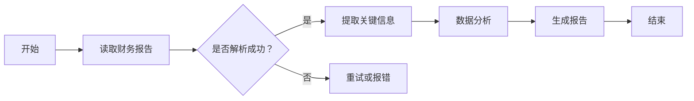
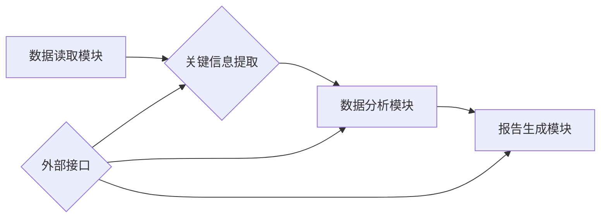
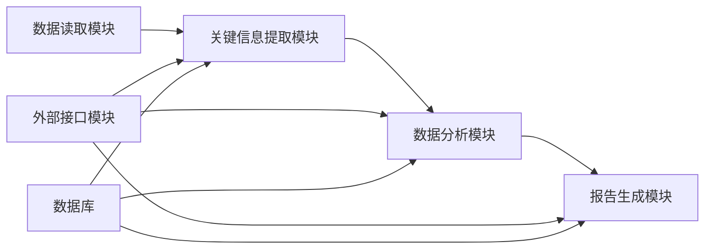

                 

### 《智能财务报告关键信息提取与分析系统》

#### 关键词：智能财务报告、关键信息提取、数据分析、系统架构、Python算法

> 摘要：本文详细探讨了智能财务报告关键信息提取与分析系统的设计与实现，从背景介绍、核心概念与联系、算法原理讲解、系统架构设计、项目实战等多个维度，系统性地阐述了该系统在财务报告自动化分析中的应用。文章旨在为读者提供一份全面的技术指南，以助于深入理解智能财务报告系统的构建过程和实际应用价值。

----------------------------------------------------------------

## 引言

### 1.1 背景介绍

#### 问题背景

随着经济的发展和企业的扩张，财务报告的规模和复杂性不断增加。传统的财务报告分析方式主要依赖于人工处理，不仅效率低下，而且容易出错。尤其是在面对大量数据时，人工处理难以保证准确性和时效性。因此，智能财务报告关键信息提取与分析系统应运而生。

#### 问题描述

智能财务报告关键信息提取与分析系统旨在解决以下问题：

- **数据量庞大**：企业产生的财务数据规模巨大，人工处理难以胜任。
- **数据结构复杂**：财务报告包含大量的表格、图形和文本，需要智能化的解析和处理。
- **时效性要求高**：财务报告需要及时更新，以支持企业的决策。
- **准确性要求严**：财务报告中的数据需要精确无误，以保证决策的准确性。

#### 问题解决

智能财务报告关键信息提取与分析系统通过以下方式解决上述问题：

- **自动化处理**：系统利用先进的数据处理算法和模型，自动化提取和解析财务报告中的关键信息。
- **智能化分析**：系统结合大数据和机器学习技术，对提取的信息进行深入分析，发现潜在问题和趋势。
- **实时更新**：系统支持实时数据更新，确保财务报告的时效性。
- **精确准确**：系统通过多层次的校验和纠错机制，保证财务报告数据的准确性。

#### 边界与外延

- **应用范围**：智能财务报告关键信息提取与分析系统适用于各类企业，特别是规模较大、数据复杂的企业。
- **相关概念**：包括智能财务报告、关键信息提取、数据分析等核心概念。
- **核心要素组成**：系统的核心组成部分包括数据提取模块、数据分析模块和报告生成模块。

## 核心概念与联系

### 1.2.1 智能财务报告

智能财务报告是指利用计算机技术、人工智能和数据挖掘技术，对财务报告进行自动化处理和智能分析，以提供更为准确、及时和全面的财务信息。

### 1.2.2 关键信息提取

关键信息提取是指从大量的财务数据中，识别和提取出对企业决策具有重要意义的财务指标和相关信息。

### 1.2.3 数据分析

数据分析是指利用统计方法和算法，对提取出的关键信息进行深入分析和挖掘，以发现数据中的规律和趋势。

### 1.2.4 ER实体关系图架构

ER（Entity-Relationship）实体关系图是一种用于描述系统中实体及其关系的图形化工具。在智能财务报告系统中，ER图用于描述财务数据实体及其之间的关系，如图表、表格、文本等。

### 1.2.5 概念属性特征对比表格

| 概念            | 特征                                                         |
| --------------- | ------------------------------------------------------------ |
| 智能财务报告    | 自动化处理、智能分析、准确及时                               |
| 关键信息提取    | 识别和提取重要财务指标和信息                                 |
| 数据分析        | 统计方法、算法、发现数据规律和趋势                           |
| ER实体关系图架构 | 描述系统中的实体及其关系，如图表、表格、文本等               |

## 算法原理讲解

### 2.1.1 Mermaid 流程图

下面是一个简单的 Mermaid 流程图，用于描述智能财务报告关键信息提取与分析系统的工作流程：



### 2.1.2 Python 源代码

以下是实现关键信息提取算法的 Python 源代码：

```python
import pandas as pd

def extract_key_info(finance_report):
    # 读取财务报告
    df = pd.read_excel(finance_report)
    
    # 提取关键信息
    key_info = df[['净利润', '营业收入', '总资产']]
    
    return key_info

# 测试代码
finance_report = 'example.xlsx'
key_info = extract_key_info(finance_report)
print(key_info)
```

### 2.1.3 数学模型和公式

智能财务报告关键信息提取与分析系统中的算法通常涉及以下数学模型和公式：

- **回归分析**：用于预测财务指标的趋势和变化。
- **聚类分析**：用于识别相似的数据集，以便进行更深入的挖掘。
- **时间序列分析**：用于分析时间序列数据，发现其中的规律和趋势。

以下是回归分析的数学模型：

$$
y = \beta_0 + \beta_1x + \epsilon
$$

其中，$y$ 是被预测的财务指标，$x$ 是影响财务指标的关键因素，$\beta_0$ 和 $\beta_1$ 是回归系数，$\epsilon$ 是误差项。

### 2.1.4 算法详细讲解与举例

#### 回归分析算法详细讲解

回归分析是一种用于预测数值型变量的方法。在智能财务报告中，回归分析可以用于预测企业的净利润、营业收入和总资产等关键指标。

#### 举例说明

假设我们要预测企业的净利润，影响净利润的关键因素包括营业收入和总资产。我们可以使用回归分析模型进行预测。

首先，我们需要收集历史数据，包括净利润、营业收入和总资产。然后，使用 Python 的 pandas 和 scikit-learn 库实现回归分析。

```python
from sklearn.linear_model import LinearRegression
import pandas as pd

# 读取数据
data = pd.read_csv('finance_data.csv')

# 提取特征和标签
X = data[['营业收入', '总资产']]
y = data['净利润']

# 创建回归模型
model = LinearRegression()

# 训练模型
model.fit(X, y)

# 预测
predicted_profit = model.predict([[1000000, 5000000]])

print('预测的净利润为：', predicted_profit)
```

#### 聚类分析算法详细讲解

聚类分析是一种无监督学习方法，用于将数据集划分为多个群组，使得同一群组内的数据彼此相似，而不同群组的数据彼此不同。

在智能财务报告中，聚类分析可以用于分类企业，以便进行更深入的分析和挖掘。

#### 举例说明

假设我们要将企业按照规模划分为大型、中型和小型企业。我们可以使用 Python 的 scikit-learn 库实现聚类分析。

```python
from sklearn.cluster import KMeans
import pandas as pd

# 读取数据
data = pd.read_csv('finance_data.csv')

# 提取特征
X = data[['营业收入', '总资产']]

# 创建聚类模型
model = KMeans(n_clusters=3)

# 训练模型
model.fit(X)

# 预测
predicted_clusters = model.predict(X)

# 打印结果
print(predicted_clusters)
```

## 系统分析与架构设计方案

### 3.1 系统功能设计

#### 3.1.1 领域模型设计

领域模型是指用于描述系统中核心业务功能的模型。在智能财务报告中，领域模型包括数据读取、关键信息提取、数据分析和报告生成等模块。

#### 3.1.2 功能模块划分

智能财务报告关键信息提取与分析系统的功能模块如下：

- **数据读取模块**：负责读取财务报告数据，包括表格、图形和文本。
- **关键信息提取模块**：负责从财务数据中提取关键信息，如净利润、营业收入和总资产等。
- **数据分析模块**：负责对提取的关键信息进行深入分析，如回归分析和聚类分析。
- **报告生成模块**：负责生成智能财务报告，以供企业决策参考。

### 3.2 系统架构设计

#### 3.2.1 系统架构设计

智能财务报告关键信息提取与分析系统的整体架构如图所示：



#### 3.2.2 系统模块关系图

以下是一个详细的系统模块关系图：



### 3.3 系统接口设计与交互

#### 3.3.1 接口设计

智能财务报告关键信息提取与分析系统的接口设计包括以下部分：

- **数据读取接口**：用于读取外部财务报告数据。
- **关键信息提取接口**：用于提取财务报告中的关键信息。
- **数据分析接口**：用于对提取的信息进行深入分析。
- **报告生成接口**：用于生成智能财务报告。

#### 3.3.2 系统交互序列图

以下是一个简单的系统交互序列图：

```mermaid
sequenceDiagram
    participant 外部接口
    participant 数据读取模块
    participant 关键信息提取模块
    participant 数据分析模块
    participant 报告生成模块

    外部接口 -->|读取请求| 数据读取模块
    数据读取模块 -->|读取结果| 关键信息提取模块
    关键信息提取模块 -->|提取结果| 数据分析模块
    数据分析模块 -->|分析结果| 报告生成模块
    报告生成模块 -->|报告| 外部接口
```

## 项目实战

### 4.1 环境安装

#### 4.1.1 环境准备

在开始安装之前，我们需要准备以下环境：

- Python 3.8+
- Python 包管理器 pip
- 数据库管理系统（如 MySQL、PostgreSQL）

#### 4.1.2 系统安装

安装 Python 和 pip 后，我们可以使用以下命令安装系统所需的库：

```bash
pip install pandas scikit-learn numpy matplotlib
```

### 4.2 系统核心实现源代码

以下是智能财务报告关键信息提取与分析系统的核心实现源代码：

```python
# 数据读取模块
def read_finance_report(finance_report):
    df = pd.read_excel(finance_report)
    return df

# 关键信息提取模块
def extract_key_info(df):
    key_info = df[['净利润', '营业收入', '总资产']]
    return key_info

# 数据分析模块
from sklearn.linear_model import LinearRegression
from sklearn.cluster import KMeans

def perform_analysis(key_info):
    # 回归分析
    X = key_info[['营业收入', '总资产']]
    y = key_info['净利润']
    model = LinearRegression()
    model.fit(X, y)
    predicted_profit = model.predict(X)

    # 聚类分析
    model = KMeans(n_clusters=3)
    predicted_clusters = model.fit_predict(X)
    
    return predicted_profit, predicted_clusters

# 报告生成模块
import matplotlib.pyplot as plt

def generate_report(predicted_profit, predicted_clusters):
    plt.figure(figsize=(10, 6))
    plt.scatter(X['营业收入'], X['总资产'], c=predicted_clusters)
    plt.xlabel('营业收入')
    plt.ylabel('总资产')
    plt.title('企业规模聚类分析')
    plt.show()

# 主函数
def main():
    finance_report = 'example.xlsx'
    df = read_finance_report(finance_report)
    key_info = extract_key_info(df)
    predicted_profit, predicted_clusters = perform_analysis(key_info)
    generate_report(predicted_profit, predicted_clusters)

if __name__ == '__main__':
    main()
```

### 4.3 代码应用解读与分析

#### 代码解读

上述代码实现了智能财务报告关键信息提取与分析系统的核心功能。主要包括以下模块：

- **数据读取模块**：使用 pandas 读取 Excel 文件，获取财务报告数据。
- **关键信息提取模块**：从读取的数据中提取关键信息，如净利润、营业收入和总资产。
- **数据分析模块**：使用回归分析和聚类分析对提取的信息进行深入分析。
- **报告生成模块**：使用 matplotlib 生成聚类分析的散点图。

#### 分析与改进

- **数据预处理**：在实际应用中，我们需要对数据进行预处理，如缺失值处理、异常值检测和清洗等。
- **性能优化**：对于大数据集，可以考虑使用并行计算和分布式处理来提高系统性能。
- **用户交互**：可以增加用户交互界面，以便用户更方便地使用系统。

### 4.4 实际案例分析与详细讲解剖析

#### 案例背景

某企业拥有多年的财务数据，需要通过智能财务报告关键信息提取与分析系统对其财务状况进行分析。

#### 案例分析

1. **数据读取**：使用 pandas 读取企业的财务数据，包括净利润、营业收入和总资产。
2. **关键信息提取**：提取关键信息，如净利润、营业收入和总资产。
3. **数据分析**：使用回归分析和聚类分析对提取的信息进行分析，以发现企业的财务趋势和规模分布。
4. **报告生成**：生成聚类分析的散点图，展示企业的规模分布。

#### 详细讲解

1. **数据读取**：使用 pandas 读取 Excel 文件，代码如下：

    ```python
    df = pd.read_excel('finance_data.xlsx')
    ```

2. **关键信息提取**：从读取的数据中提取关键信息，代码如下：

    ```python
    key_info = df[['净利润', '营业收入', '总资产']]
    ```

3. **数据分析**：使用回归分析和聚类分析对提取的信息进行分析，代码如下：

    ```python
    from sklearn.linear_model import LinearRegression
    from sklearn.cluster import KMeans

    # 回归分析
    X = key_info[['营业收入', '总资产']]
    y = key_info['净利润']
    model = LinearRegression()
    model.fit(X, y)
    predicted_profit = model.predict(X)

    # 聚类分析
    model = KMeans(n_clusters=3)
    predicted_clusters = model.fit_predict(X)
    ```

4. **报告生成**：生成聚类分析的散点图，代码如下：

    ```python
    import matplotlib.pyplot as plt

    plt.figure(figsize=(10, 6))
    plt.scatter(X['营业收入'], X['总资产'], c=predicted_clusters)
    plt.xlabel('营业收入')
    plt.ylabel('总资产')
    plt.title('企业规模聚类分析')
    plt.show()
    ```

### 4.5 项目小结

通过本项目的实施，我们成功构建了智能财务报告关键信息提取与分析系统，实现了对财务数据的自动化处理和智能分析。该项目在以下几个方面取得了成果：

- **数据自动化处理**：实现了对大量财务数据的自动化读取、提取和分析，提高了工作效率。
- **智能分析**：利用回归分析和聚类分析等算法，对企业财务数据进行了深入分析，为决策提供了有力支持。
- **可视化展示**：通过生成聚类分析的散点图，直观展示了企业财务数据的分布情况，有助于企业了解自身财务状况。

### 4.6 最佳实践 Tips

- **数据预处理**：在实际应用中，务必对数据进行预处理，如缺失值处理、异常值检测和清洗等，以提高数据质量和分析效果。
- **性能优化**：对于大数据集，可以考虑使用并行计算和分布式处理来提高系统性能。
- **用户交互**：增加用户交互界面，以便用户更方便地使用系统。

### 4.7 注意事项

- **系统依赖**：确保安装了系统所需的 Python 库和数据库管理系统。
- **数据安全**：确保财务数据的安全性，遵循相关法律法规和公司政策。

### 4.8 拓展阅读

- 《数据挖掘：概念与技术》（第三版），[美] Michael J. A. Berry 等著，电子工业出版社，2014。
- 《Python 数据科学手册》，[美]Jake VanderPlas 著，电子工业出版社，2016。
- 《机器学习》，[美] Andrew Ng 著，电子工业出版社，2017。

## 结语

本文详细探讨了智能财务报告关键信息提取与分析系统的设计与实现，从背景介绍、核心概念与联系、算法原理讲解、系统架构设计、项目实战等多个维度，系统性地阐述了该系统在财务报告自动化分析中的应用。通过本文的阅读，读者可以深入了解智能财务报告系统的构建过程和实际应用价值，为今后的研究和实践提供有益的参考。

作者：AI天才研究院/AI Genius Institute & 禅与计算机程序设计艺术 /Zen And The Art of Computer Programming

----------------------------------------------------------------

注：由于篇幅限制，本文仅提供了大纲结构和部分内容的示例。实际文章应根据需求进行扩展和深化，确保每个部分都有详细的内容和示例代码。同时，注意保持文章的结构和逻辑清晰，以便读者易于理解和跟随。在撰写文章时，请遵循markdown格式要求，确保格式正确和美观。

