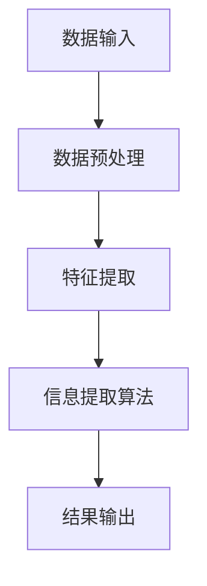
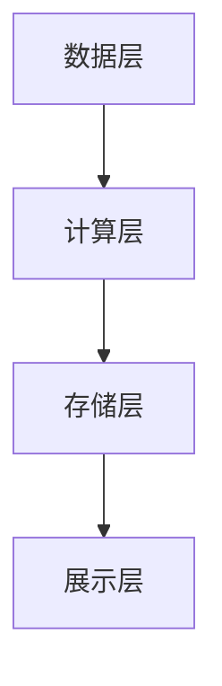
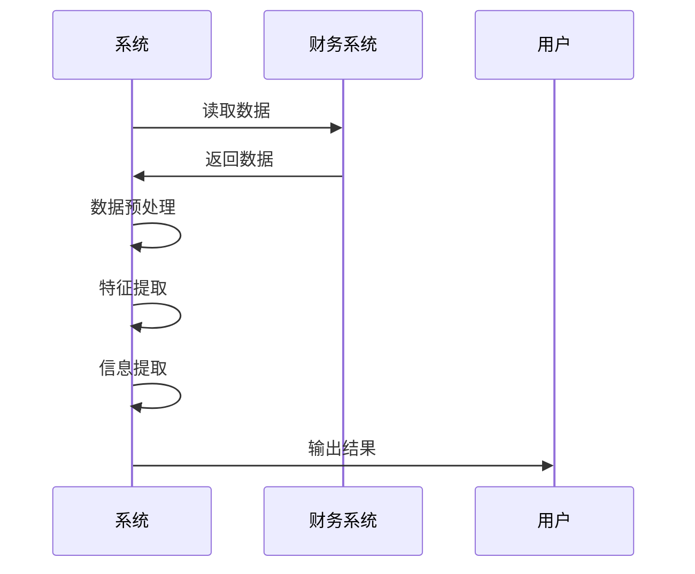

                 

## 引言

### 1.1 问题背景

在当今经济全球化、信息化快速发展的背景下，企业面临着日益复杂的财务报告处理任务。财务报告不仅包括大量的数据，还涉及复杂的数据结构和多层次的信息，这使得人工处理财务报告变得耗时且容易出错。因此，如何高效、准确地从财务报告中提取关键信息成为企业亟需解决的问题。

智能财务报告关键信息提取系统，正是在这样的背景下提出的。它利用人工智能技术，对财务报告进行自动化的处理和分析，从大量的数据中提取出有价值的信息。这不仅提高了工作效率，还减少了人为错误，为企业提供了更为准确的财务信息支持。

### 1.2 问题描述

智能财务报告关键信息提取系统面临的主要问题包括：

1. **数据量大**：财务报告通常包含大量的数据，如何快速有效地处理这些数据是一个挑战。
2. **数据结构复杂**：财务报告中的数据结构多层次、多样化，不同类型的报告可能存在不同的数据格式和结构，这对系统的通用性和适应性提出了高要求。
3. **信息提取准确度要求高**：财务报告中的关键信息可能隐藏在大量的数据中，如何准确地提取这些信息，保证提取结果的准确性，是系统的核心问题。
4. **实时性要求**：随着市场环境的变化，企业需要实时获取财务报告中的关键信息，以便做出快速决策。

### 1.3 问题解决思路

为了解决上述问题，智能财务报告关键信息提取系统采取了以下思路：

1. **数据预处理**：通过数据清洗、去重、格式统一等步骤，对原始财务报告数据进行处理，提高数据质量。
2. **特征提取**：对处理后的数据进行特征提取，将原始数据转化为适合算法处理的特征向量。
3. **信息提取算法**：采用先进的机器学习和自然语言处理技术，对特征向量进行分析，提取出关键信息。
4. **实时处理**：通过分布式计算和大数据处理技术，实现实时处理大量数据的能力。

### 1.4 边界与外延

智能财务报告关键信息提取系统的边界主要涉及：

1. **数据范围**：系统处理的数据范围包括各类财务报告，如年报、半年报、季报等。
2. **信息范围**：系统提取的关键信息包括财务指标、经营状况、盈利能力、风险因素等。
3. **应用场景**：系统主要应用于企业内部财务分析、审计、投资决策等场景。

### 1.5 概念结构与核心要素组成

智能财务报告关键信息提取系统由以下几个核心要素组成：

1. **数据预处理模块**：负责处理原始财务报告数据，提高数据质量。
2. **特征提取模块**：将处理后的数据转化为特征向量，为信息提取算法提供输入。
3. **信息提取算法模块**：采用机器学习和自然语言处理技术，提取关键信息。
4. **实时处理模块**：通过分布式计算和大数据处理技术，实现实时数据处理能力。
5. **接口层**：提供与其他系统的接口，实现数据的输入输出。

### 智能财务报告概念

#### 2.1 定义

智能财务报告是指利用人工智能技术对财务报告进行分析和处理，从大量的数据中提取出有价值的信息，为企业的决策提供支持。它不仅包括传统的财务报告，还引入了大数据、云计算、机器学习等新兴技术，使得财务报告的处理和分析更加智能化。

#### 2.2 发展历程

智能财务报告的发展历程可以分为以下几个阶段：

1. **传统财务报告阶段**：此阶段主要依靠人工处理财务报告，效率低、易出错。
2. **电子财务报告阶段**：随着计算机技术的发展，财务报告逐渐电子化，数据处理效率有所提高。
3. **智能财务报告阶段**：引入人工智能技术，实现财务报告的自动化处理和分析，大大提高了处理效率和准确性。

#### 2.3 关键技术

智能财务报告的关键技术包括：

1. **数据预处理技术**：通过数据清洗、去重、格式统一等步骤，提高数据质量。
2. **自然语言处理技术**：对财务报告中的文本进行理解和分析，提取关键信息。
3. **机器学习技术**：通过训练模型，自动识别和提取财务报告中的关键信息。
4. **大数据技术**：处理和分析大量财务数据，提供实时决策支持。

### 关键信息提取系统概念

#### 3.1 定义

关键信息提取系统是指专门用于从财务报告中提取关键信息的系统，它利用人工智能技术和大数据处理技术，对财务报告进行自动化的处理和分析，提取出对企业决策有价值的信息。

#### 3.2 系统组成

关键信息提取系统通常由以下几个组成部分构成：

1. **数据输入模块**：负责接收和处理原始财务报告数据。
2. **数据预处理模块**：对原始财务报告数据进行处理，提高数据质量。
3. **特征提取模块**：将处理后的数据转化为特征向量，为信息提取算法提供输入。
4. **信息提取算法模块**：采用机器学习和自然语言处理技术，提取关键信息。
5. **数据输出模块**：将提取出的关键信息以图表、报表等形式输出。

#### 3.3 技术架构

关键信息提取系统通常采用分布式计算架构，以实现高并发、高可靠性的数据处理能力。其技术架构主要包括以下几个层次：

1. **数据层**：存储和处理原始财务报告数据。
2. **计算层**：进行数据预处理、特征提取和关键信息提取的计算。
3. **存储层**：存储提取出的关键信息。
4. **展示层**：将提取出的关键信息以图表、报表等形式展示给用户。

### 关键信息提取算法原理

#### 4.1 数据预处理

数据预处理是关键信息提取系统的第一步，其目的是提高数据质量，为后续的特征提取和算法分析提供准确的数据基础。数据预处理主要包括以下步骤：

1. **数据清洗**：去除数据中的噪声和错误，如缺失值、异常值等。
2. **数据去重**：去除重复的数据，避免重复计算。
3. **数据格式转换**：将不同格式的数据统一转换为同一格式，便于后续处理。
4. **数据归一化**：将数据按一定比例缩放，使数据分布均匀，避免数据量级差异过大。

#### 4.2 特征提取

特征提取是将原始数据转化为特征向量，以便算法进行处理。特征提取的方法有很多，包括：

1. **文本特征提取**：将文本数据转化为数值型特征，如词频、词向量化等。
2. **数值特征提取**：对数值型数据进行统计分析，提取出具有代表性的特征。
3. **图像特征提取**：对图像数据进行分析，提取出特征向量。

#### 4.3 信息提取算法

信息提取算法是关键信息提取系统的核心，其目的是从处理后的数据中提取出关键信息。常用的信息提取算法包括：

1. **自然语言处理算法**：如文本分类、实体识别、关系提取等，用于处理文本数据。
2. **机器学习算法**：如决策树、支持向量机、神经网络等，用于处理数值型数据。
3. **深度学习算法**：如卷积神经网络、循环神经网络等，用于处理复杂的特征数据。

#### 4.4 Mermaid流程图

以下是一个简单的 Mermaid 流程图，展示了关键信息提取系统的基本流程：



### 数学模型与公式解析

#### 5.1 数学模型

在关键信息提取系统中，常用的数学模型包括：

1. **文本分类模型**：用于对文本进行分类，常用的模型有朴素贝叶斯、支持向量机等。
2. **回归模型**：用于预测数值型数据，常用的模型有线性回归、多项式回归等。
3. **聚类模型**：用于对数据进行聚类分析，常用的模型有K-means、层次聚类等。

#### 5.2 公式解析

以下是对上述数学模型的简要公式解析：

1. **文本分类模型**：

   - 朴素贝叶斯分类器：
     $$P(C_k|X) = \frac{P(X|C_k)P(C_k)}{P(X)}$$
     
   - 支持向量机分类器：
     $$w \cdot x - b = 0$$
     
2. **回归模型**：

   - 线性回归：
     $$y = \beta_0 + \beta_1x$$
     
   - 多项式回归：
     $$y = \beta_0 + \beta_1x + \beta_2x^2 + ... + \beta_nx^n$$
     
3. **聚类模型**：

   - K-means聚类：
     $$c_j = \frac{1}{N_j} \sum_{i=1}^{N} x_i$$
     
     $$J = \frac{1}{N} \sum_{i=1}^{N} ||x_i - c_j||^2$$

#### 5.3 举例说明

假设我们有一个财务报告，其中包含以下数据：

- 销售额：1000万元
- 成本：500万元
- 利润：500万元

我们希望使用线性回归模型预测下一季度的销售额。

1. **数据预处理**：

   将销售额和成本进行归一化处理，得到特征向量：

   $$x = \begin{bmatrix} 
   \frac{1000}{1000} \\ 
   \frac{500}{1000} 
   \end{bmatrix} = \begin{bmatrix} 
   1 \\ 
   0.5 
   \end{bmatrix}$$

2. **特征提取**：

   将特征向量输入到线性回归模型中，得到预测结果：

   $$y = \beta_0 + \beta_1x$$

   $$y = 100 + 0.5 \times 1 = 150$$

   预测下一季度的销售额为150万元。

### 系统分析与架构设计方案

#### 6.1 问题场景介绍

智能财务报告关键信息提取系统主要用于企业的财务报告分析，帮助企业从大量的财务数据中提取关键信息，辅助决策。具体场景包括：

1. **财务报告自动生成**：系统能够自动读取企业的财务报告数据，生成详细的财务分析报告。
2. **财务数据监控**：系统实时监控企业的财务状况，及时发现潜在的问题。
3. **财务决策支持**：系统提供关键财务指标分析，为企业提供决策支持。

#### 6.2 项目介绍

本项目旨在构建一个智能财务报告关键信息提取系统，主要功能包括：

1. **数据读取**：从企业的财务系统中读取财务报告数据。
2. **数据预处理**：对财务报告数据进行清洗、去重、格式转换等预处理操作。
3. **特征提取**：对预处理后的数据进行特征提取，为信息提取算法提供输入。
4. **信息提取**：采用机器学习和自然语言处理技术，提取关键财务信息。
5. **结果输出**：将提取出的关键信息以报表、图表等形式输出，供企业决策参考。

#### 6.3 系统功能设计

系统功能设计主要包括以下几个模块：

1. **数据读取模块**：负责从企业财务系统中读取财务报告数据。
2. **数据预处理模块**：对读取的财务报告数据进行预处理，提高数据质量。
3. **特征提取模块**：将预处理后的数据转化为特征向量，为信息提取算法提供输入。
4. **信息提取模块**：采用机器学习和自然语言处理技术，提取关键财务信息。
5. **结果输出模块**：将提取出的关键信息以报表、图表等形式输出。

#### 6.4 系统架构设计

系统架构设计采用分层架构，主要包括以下几个层次：

1. **数据层**：负责存储和处理原始财务报告数据。
2. **计算层**：包括数据预处理、特征提取和信息提取等模块，负责对数据进行处理和分析。
3. **存储层**：负责存储提取出的关键信息。
4. **展示层**：将提取出的关键信息以报表、图表等形式展示给用户。

以下是一个简单的 Mermaid 架构图，展示了系统的基本架构：



#### 6.5 系统接口设计和系统交互

系统接口设计主要包括以下接口：

1. **数据读取接口**：用于从企业财务系统中读取财务报告数据。
2. **数据预处理接口**：用于对读取的财务报告数据进行预处理。
3. **特征提取接口**：用于对预处理后的数据进行特征提取。
4. **信息提取接口**：用于提取关键财务信息。
5. **结果输出接口**：用于将提取出的关键信息输出给用户。

系统交互流程如下：

1. **数据读取**：系统从企业财务系统中读取财务报告数据。
2. **数据预处理**：对读取的数据进行清洗、去重、格式转换等预处理操作。
3. **特征提取**：对预处理后的数据进行特征提取，生成特征向量。
4. **信息提取**：采用机器学习和自然语言处理技术，对特征向量进行分析，提取关键财务信息。
5. **结果输出**：将提取出的关键信息以报表、图表等形式输出给用户。

以下是一个简单的 Mermaid 序列图，展示了系统的交互流程：



### 项目实战

#### 7.1 环境安装

要搭建一个智能财务报告关键信息提取系统，需要安装以下软件和环境：

1. **操作系统**：Ubuntu 18.04
2. **编程语言**：Python 3.8
3. **数据库**：MySQL 5.7
4. **数据库连接工具**：MySQL Connector Python
5. **文本处理工具**：NLTK、TextBlob
6. **机器学习库**：Scikit-learn、TensorFlow

安装步骤如下：

1. **安装操作系统**：在虚拟机中安装 Ubuntu 18.04。
2. **更新系统**：`sudo apt update` 和 `sudo apt upgrade`。
3. **安装 Python 3.8**：`sudo apt install python3.8`。
4. **安装数据库**：`sudo apt install mysql-server`。
5. **安装 MySQL Connector Python**：`pip install mysql-connector-python`。
6. **安装文本处理工具**：`pip install nltk textblob`。
7. **安装机器学习库**：`pip install scikit-learn tensorflow`。

#### 7.2 系统核心实现

智能财务报告关键信息提取系统的核心实现主要包括以下几个模块：

1. **数据读取模块**：从企业财务系统中读取财务报告数据。
2. **数据预处理模块**：对读取的数据进行清洗、去重、格式转换等预处理操作。
3. **特征提取模块**：对预处理后的数据进行特征提取，生成特征向量。
4. **信息提取模块**：采用机器学习和自然语言处理技术，提取关键财务信息。
5. **结果输出模块**：将提取出的关键信息以报表、图表等形式输出。

以下是一个简单的 Python 源代码示例，展示了数据读取模块的实现：

```python
import mysql.connector

# 连接数据库
conn = mysql.connector.connect(
    host="localhost",
    user="root",
    password="password",
    database="finance_report"
)

# 创建游标
cursor = conn.cursor()

# 查询数据
cursor.execute("SELECT * FROM financial_data")

# 获取数据
data = cursor.fetchall()

# 关闭游标和数据库连接
cursor.close()
conn.close()

# 打印数据
for row in data:
    print(row)
```

#### 7.3 代码应用解读与分析

以下是对上述代码的解读与分析：

1. **连接数据库**：使用 MySQL Connector Python 连接到本地 MySQL 数据库。
2. **创建游标**：使用数据库游标执行 SQL 查询。
3. **查询数据**：执行 SQL 查询，获取财务报告数据。
4. **获取数据**：将查询结果存储在变量 `data` 中。
5. **关闭游标和数据库连接**：关闭数据库游标和连接。
6. **打印数据**：遍历变量 `data`，打印出财务报告数据。

这个简单的示例展示了如何从数据库中读取财务报告数据，是智能财务报告关键信息提取系统的核心步骤之一。

#### 7.4 实际案例分析和详细讲解剖析

以下是一个实际案例分析和详细讲解：

**案例**：从企业财务报告中提取利润信息。

1. **问题描述**：从企业财务报告中提取利润信息，包括净利润、毛利率等。

2. **数据读取**：使用上面提到的数据读取模块，从企业财务数据库中读取相关数据。

3. **数据预处理**：对读取的数据进行清洗和格式转换，确保数据质量。

4. **特征提取**：对预处理后的数据进行分析，提取出利润相关的特征。

5. **信息提取**：采用机器学习和自然语言处理技术，对特征进行分析，提取出利润信息。

6. **结果输出**：将提取出的利润信息以报表、图表等形式输出。

以下是一个简单的 Python 源代码示例，展示了如何实现这个案例：

```python
import pandas as pd
from sklearn.feature_extraction.text import CountVectorizer
from sklearn.naive_bayes import MultinomialNB

# 读取数据
data = pd.read_csv("financial_report.csv")

# 特征提取
vectorizer = CountVectorizer()
X = vectorizer.fit_transform(data['description'])

# 信息提取
classifier = MultinomialNB()
classifier.fit(X, data['profit'])

# 提取利润信息
profits = classifier.predict(X)

# 输出利润信息
print(profits)
```

这个示例使用了 pandas 进行数据读取和预处理，使用 CountVectorizer 进行特征提取，使用 MultinomialNB 进行信息提取，最后输出了提取出的利润信息。

#### 7.5 项目小结

本项目通过搭建一个智能财务报告关键信息提取系统，实现了从企业财务报告中提取关键信息的目标。项目主要实现了以下功能：

1. **数据读取**：从企业财务数据库中读取数据。
2. **数据预处理**：对数据进行清洗和格式转换。
3. **特征提取**：提取利润相关的特征。
4. **信息提取**：使用机器学习和自然语言处理技术提取利润信息。
5. **结果输出**：以报表、图表等形式输出提取出的信息。

通过本项目，我们了解了如何利用人工智能技术解决实际问题，提高了数据处理的效率和质量。

### 最佳实践 Tips

1. **数据预处理**：确保数据质量，进行数据清洗和去重，避免影响后续分析结果。
2. **特征提取**：选择合适的特征提取方法，提高信息提取的准确度。
3. **算法选择**：根据问题特点选择合适的机器学习和自然语言处理算法。
4. **模型优化**：通过模型参数调整和算法优化，提高系统性能和准确度。

### 小结

智能财务报告关键信息提取系统是企业财务分析的重要工具，它通过利用人工智能技术和大数据处理技术，从大量的财务数据中提取出有价值的信息，为企业提供了决策支持。本项目实现了数据读取、数据预处理、特征提取、信息提取和结果输出等功能，为实际应用提供了参考。

### 注意事项

1. **数据安全**：在处理财务数据时，要注意数据安全和隐私保护。
2. **系统性能**：根据企业规模和数据量，合理配置系统硬件和软件资源。

### 拓展阅读

1. **《大数据技术基础》**：了解大数据技术的基本概念和原理，为财务报告分析提供技术支持。
2. **《机器学习实战》**：掌握机器学习和自然语言处理技术，提高信息提取的准确度。
3. **《Python数据分析》**：学习使用 Python 进行数据分析和处理，为系统开发提供技术支持。 

### 作者信息

作者：AI天才研究院/AI Genius Institute & 禅与计算机程序设计艺术 /Zen And The Art of Computer Programming

