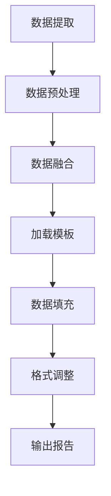
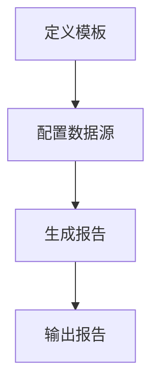
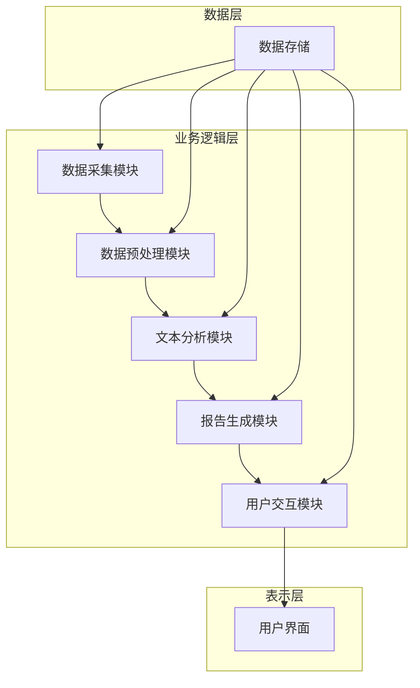
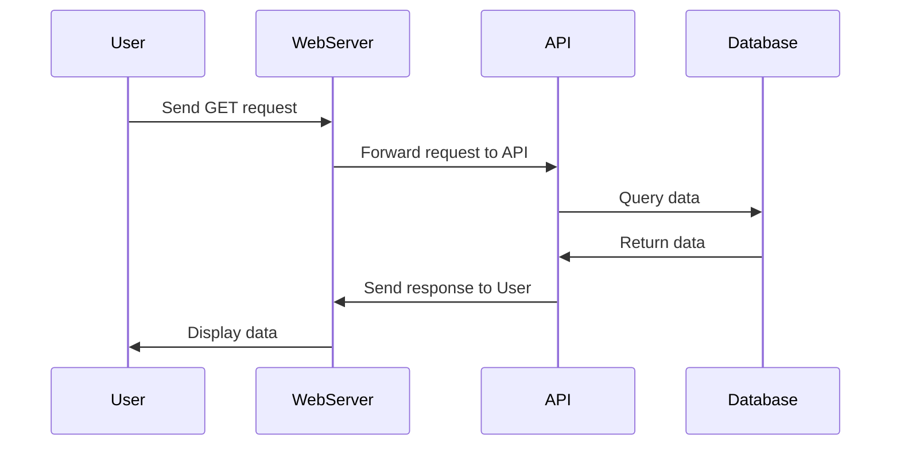

                 

### 摘要

智能财务报告自动生成系统是利用人工智能技术，尤其是自然语言处理和机器学习算法，对财务数据进行自动分析和报告生成的系统。随着企业数据量的不断增加，传统手工编制财务报告的方法已经难以满足高效、准确的要求。智能财务报告自动生成系统通过文本分析、数据预处理、自然语言处理和报告生成等步骤，实现了财务报告的自动化生成，极大地提高了工作效率，降低了人为错误。本文将深入探讨智能财务报告自动生成系统的核心概念、算法原理、系统架构设计以及项目实战，旨在为读者提供一个全面、系统的技术参考。本文关键词包括智能财务报告、自动生成系统、自然语言处理、机器学习和财务报告生成。

---

## 目录大纲设计思路

在设计《智能财务报告自动生成系统》的目录大纲时，我们首先明确了书的核心目的——通过逻辑清晰、结构紧凑的内容，帮助读者全面理解并掌握智能财务报告自动生成系统的原理和实现方法。以下是具体的步骤：

### 背景介绍

在第一章中，我们将简要介绍智能财务报告自动生成系统的背景，包括当前财务报告存在的问题、自动生成系统的发展趋势和重要性。这一部分将帮助读者建立对系统的整体认知。

### 核心概念与联系

接下来，在第一章的核心概念解析部分，我们将明确书中涉及的核心概念，如智能财务报告、自动生成系统、相关技术和工具等。通过概念属性特征对比表格和ER实体关系图，帮助读者理解这些概念之间的关系，为后续的算法原理讲解和系统设计奠定基础。

### 算法原理讲解

在第二部分和第三部分，我们将详细讲解智能财务报告自动生成系统中的关键算法，包括文本分析与数据预处理、自然语言处理算法和财务报告生成算法。每个算法都将通过mermaid流程图、Python源代码示例、数学模型和公式，以及实例说明来详细阐述，使读者能够深入理解每个算法的工作原理。

### 系统分析与架构设计方案

在第四部分，我们将从系统功能设计、系统架构设计、系统接口设计和系统交互等多个角度，阐述智能财务报告自动生成系统的设计与实现。这部分将通过mermaid类图、架构图和序列图，帮助读者直观地理解系统的整体架构和运作流程。

### 项目实战

在第五部分，我们将通过一个实际的项目案例，展示如何搭建和实现智能财务报告自动生成系统。从环境安装、核心代码实现到应用解读与分析，每个步骤都将详细讲解，使读者能够实际操作并掌握系统的实现过程。

### 最佳实践与小结

最后，在第六部分，我们将总结书中的关键点，提供最佳实践建议，并对各章节进行简要小结，帮助读者巩固所学知识，并能够将其应用到实际工作中。

通过以上步骤，我们旨在设计出一个既全面又系统的目录大纲，使读者能够从理论到实践，全面掌握智能财务报告自动生成系统的相关知识。

### 目录大纲结构

为了帮助读者更好地理解并跟随本书的脉络，我们精心设计了四个主要部分，共计九章内容，结构如下：

#### 第一部分：背景与核心概念

**第1章：智能财务报告自动生成系统概述**

- **1.1.1 问题背景与解决方案**
  - 描述传统财务报告的痛点
  - 介绍智能财务报告自动生成系统的解决方案

- **1.1.2 自动生成系统的发展趋势**
  - 人工智能和机器学习在财务领域的应用
  - 自动生成系统的未来发展趋势

- **1.1.3 智能财务报告自动生成系统的价值**
  - 提高工作效率
  - 减少人为错误
  - 提升财务报告的准确性和完整性

- **1.2 核心概念解析**
  - **智能财务报告**：定义、分类、结构
  - **自动生成系统**：基本架构、功能模块
  - **相关技术与工具**：自然语言处理、数据挖掘、机器学习框架

- **1.3 概念属性特征对比表格**
  - 对比财务报告、自动生成系统及相关工具的特征

- **1.4 ER实体关系图**
  - 图解智能财务报告自动生成系统的实体关系

#### 第二部分：算法原理与实现

**第2章：文本分析与数据预处理**

- **2.1 文本分析基础**
  - **词频分析**：基本概念、实现方法
  - **主题建模**：LDA算法原理、应用案例

- **2.2 数据预处理方法**
  - **数据清洗**：缺失值处理、异常值处理
  - **数据转换**：数据类型转换、数据归一化
  - **数据归一化**：标准化、最小-最大缩放

**第3章：自然语言处理算法**

- **3.1 基于规则的方法**
  - **语法分析**：词法分析、语法分析
  - **命名实体识别**：命名实体识别方法、应用案例

- **3.2 基于统计的方法**
  - **Naive Bayes分类器**：算法原理、应用场景
  - **支持向量机（SVM）**：算法原理、参数调优

- **3.3 基于深度学习的方法**
  - **卷积神经网络（CNN）**：结构、应用
  - **递归神经网络（RNN）**：结构、应用

**第4章：财务报告生成算法**

- **4.1 报告结构解析**
  - 财务报告的常见结构和组成

- **4.2 数据驱动的报告生成**
  - 基于历史数据的报告生成方法

- **4.3 模板驱动的报告生成**
  - 基于模板的报告生成方法

#### 第三部分：系统设计与实现

**第5章：系统架构设计**

- **5.1 系统需求分析**
  - 功能需求、性能需求、安全性需求

- **5.2 系统功能设计**
  - **数据采集模块**：数据来源、数据采集方法
  - **文本分析模块**：文本分析流程、算法应用
  - **报告生成模块**：报告生成流程、算法应用

- **5.3 系统架构设计**
  - 整体架构设计、模块交互

- **5.4 系统接口设计**
  - 接口定义、接口实现

- **5.5 系统交互与实现**
  - 系统交互流程、数据流处理

#### 第四部分：项目实战

**第6章：项目介绍**

- **6.1 项目背景**
  - 项目来源、项目目标

- **6.2 项目需求**
  - 功能需求、性能需求

**第7章：环境安装与配置**

- **7.1 环境准备**
  - 操作系统、编程语言、开发工具

- **7.2 系统核心实现**
  - 数据采集、文本分析、报告生成

- **7.3 应用解读与分析**
  - 系统运行效果、性能评估

**第8章：实际案例分析与讲解**

- **8.1 案例背景**
  - 案例来源、案例目标

- **8.2 案例实施**
  - 案例实现步骤、关键代码

- **8.3 案例分析**
  - 系统效果、改进空间

**第9章：项目小结**

- **9.1 项目总结**
  - 项目收获、问题与反思

- **9.2 最佳实践建议**
  - 实践经验、注意事项

通过以上详细的目录大纲，我们希望能为读者提供一个清晰的阅读路径，帮助他们系统地学习智能财务报告自动生成系统的相关知识，并在实际项目中得以应用。

### 背景介绍

智能财务报告自动生成系统应运而生于现代企业对财务数据处理效率和质量的要求日益提升的背景下。传统的财务报告生成过程通常繁琐、耗时，且易受人为错误的影响。随着企业规模的扩大和数据量的激增，手工编制财务报告不仅效率低下，而且难以保证报告的准确性和一致性。此外，企业面临的财务法规和审计要求日益严格，使得财务报告的及时性和合规性显得尤为重要。

#### 问题背景

1. **手工编制效率低下**：财务数据量大，手工处理需要耗费大量人力和时间，且易出现人为错误。

2. **报告准确性和一致性差**：不同部门或人员编制的报告可能存在格式、内容上的不一致，影响决策和审计。

3. **合规性和法规要求**：财务报告需要严格遵守相关法规和审计要求，手工编制难以保证及时性和准确性。

4. **数据可视化不足**：传统报告多为文字描述，难以直观展示数据趋势和关系。

#### 自动生成系统的发展趋势

随着人工智能和机器学习技术的不断发展，自动生成系统在财务领域的应用逐渐成熟。智能财务报告自动生成系统通过文本分析、数据预处理、自然语言处理和报告生成等步骤，实现了财务报告的自动化生成，具有以下发展趋势：

1. **文本分析与数据预处理**：利用自然语言处理技术对文本数据进行分析，提取关键信息，为报告生成提供数据基础。

2. **自然语言处理算法**：应用机器学习算法，如卷积神经网络（CNN）和递归神经网络（RNN），提高文本分析的准确性和效率。

3. **报告生成算法**：通过数据驱动的报告生成方法和模板驱动的报告生成方法，实现自动化、个性化的财务报告生成。

4. **集成与扩展**：智能财务报告自动生成系统可以与企业现有的财务系统和其他业务系统集成，实现数据共享和流程优化。

#### 智能财务报告自动生成系统的价值

1. **提高工作效率**：自动生成系统可以大幅减少手工编制报告的时间，提高财务数据的处理效率。

2. **降低人为错误**：通过自动化处理，减少因人为操作不当导致的错误，提高报告的准确性和一致性。

3. **提升报告质量**：利用自然语言处理和机器学习算法，生成结构清晰、内容准确的财务报告，提升报告的可读性和可信度。

4. **增强数据可视化**：通过图表和图形展示，使财务报告更直观，有助于企业分析和决策。

5. **合规性保障**：自动生成系统可以确保财务报告符合相关法规和审计要求，降低合规风险。

综上所述，智能财务报告自动生成系统在提高财务数据处理效率、准确性和合规性方面具有显著优势，是企业实现财务数字化转型的重要工具。

### 核心概念解析

在深入探讨智能财务报告自动生成系统之前，我们需要明确一些核心概念，以便为后续内容打下坚实的基础。

#### 智能财务报告

智能财务报告是一种利用人工智能技术，尤其是自然语言处理和机器学习算法，对财务数据进行自动化分析和展示的报告。与传统手工编制的财务报告相比，智能财务报告具有更高的准确性、一致性和效率。

- **定义**：智能财务报告是通过自动化工具生成，包含财务数据分析、可视化图表和结论的报告。

- **分类**：根据报告内容，智能财务报告可以分为财务报表、财务分析报告、预算报告等。

- **结构**：智能财务报告通常包括封面、目录、摘要、正文、附录等部分。正文部分包括财务数据表、图表、分析结论等。

#### 自动生成系统

自动生成系统是指利用计算机技术和人工智能算法，实现文档、报告等自动化生成的系统。在财务领域，自动生成系统通过处理企业财务数据，自动生成各类财务报告。

- **基本架构**：自动生成系统通常包括数据采集模块、数据预处理模块、报告生成模块和用户界面等。

- **功能模块**：
  - **数据采集模块**：负责从企业财务系统中采集数据，包括账务数据、报表数据等。
  - **数据预处理模块**：对采集到的数据进行清洗、转换和归一化处理，为报告生成提供准确的数据基础。
  - **报告生成模块**：利用自然语言处理和机器学习算法，自动生成财务报告。
  - **用户界面**：提供用户交互接口，用户可以通过界面查看报告、修改报告设置等。

#### 相关技术与工具

在实现智能财务报告自动生成系统中，涉及多种相关技术和工具，主要包括自然语言处理、数据挖掘、机器学习框架等。

- **自然语言处理**：自然语言处理（NLP）是使计算机能够理解、处理和生成自然语言的技术。在智能财务报告中，NLP技术用于文本分析、数据提取和报告生成。

- **数据挖掘**：数据挖掘是一种从大量数据中发现有用信息和知识的方法。在财务报告中，数据挖掘技术可以用于发现数据中的趋势、关联和异常。

- **机器学习框架**：机器学习框架如TensorFlow、PyTorch等，提供了丰富的算法库和工具，用于实现自然语言处理和报告生成。

#### 概念属性特征对比表格

为了更好地理解上述概念，我们提供了一个概念属性特征对比表格，如下所示：

| 概念         | 定义                                                         | 关键特征                                                     |
| ------------ | ------------------------------------------------------------ | ------------------------------------------------------------ |
| 智能财务报告 | 通过人工智能技术自动生成的财务报告                           | 高准确性、高效率、数据可视化、符合法规要求                 |
| 自动生成系统 | 实现文档、报告自动化生成的系统                               | 数据采集、数据预处理、报告生成、用户界面                 |
| 自然语言处理 | 使计算机能够理解、处理和生成自然语言的技术                   | 文本分析、数据提取、报告生成                                 |
| 数据挖掘     | 从大量数据中发现有用信息和知识的方法                         | 趋势发现、关联分析、异常检测                               |
| 机器学习框架 | 提供算法库和工具，用于实现自然语言处理和报告生成             | 算法实现、模型训练、数据可视化                             |

#### ER实体关系图

为了进一步理解智能财务报告自动生成系统中的实体关系，我们提供了一个ER（实体关系）图，如下所示：

```mermaid
erDiagram
  Customer ||--|{ Order } : "places"
  Product ||--|{ Order } : "includes"
  Supplier ||--|{ Product } : "supplies"
  Customer }|--|{ Payment } : "makes"
  Order }|--|{ Item } : "contains"
  Product }|--|{ Review } : "receives"
  Review }|--|{ Rating } : "assigns"
```

在此ER图中，客户（Customer）、订单（Order）、产品（Product）、供应商（Supplier）、支付（Payment）、项目（Item）和评价（Review）等实体之间通过不同的关系进行连接，反映了智能财务报告自动生成系统中的数据流转和处理流程。

通过上述核心概念的解析，我们为后续章节的深入探讨提供了基础，帮助读者更好地理解智能财务报告自动生成系统的原理和实现方法。

### 算法原理讲解

在智能财务报告自动生成系统中，算法的设计和实现是关键环节。本文将重点介绍文本分析与数据预处理、自然语言处理算法以及财务报告生成算法，通过mermaid流程图、Python源代码示例、数学模型和公式，以及实例说明，帮助读者深入理解这些算法的原理和实际应用。

#### 文本分析与数据预处理

文本分析是自然语言处理的基础，数据预处理则是确保文本数据质量的关键步骤。

**文本分析基础**

**词频分析**：词频分析是文本分析的一种基本方法，通过统计文本中各个单词出现的频率，可以帮助我们了解文本的主题和内容。

- **算法原理**：词频分析的核心是计数。通常使用哈希表（HashTable）或倒排索引（Inverted Index）来高效存储和检索单词的频率。

- **Python示例代码**：

  ```python
  from collections import Counter
  
  text = "This is an example sentence for word frequency analysis."
  words = text.split()
  word_freq = Counter(words)
  print(word_freq)
  ```

**主题建模**：主题建模（Topic Modeling）是一种无监督学习方法，用于识别文本中的隐含主题。LDA（Latent Dirichlet Allocation）是一种常用的主题建模算法。

- **算法原理**：LDA基于概率模型，通过狄利克雷分布（Dirichlet Distribution）来生成文档-词矩阵和词-主题矩阵。

- **mermaid流程图**：

  ```mermaid
  graph TD
    A[初始化参数] --> B[生成文档-词矩阵]
    B --> C[生成词-主题矩阵]
    C --> D[推断主题分布]
    D --> E[输出结果]
  ```

- **Python示例代码**：

  ```python
  from gensim.models import LdaModel
  from gensim.corpora import Dictionary
  
  dictionary = Dictionary(texts)
  corpus = [dictionary.doc2bow(text) for text in texts]
  lda_model = LdaModel(corpus, num_topics=5, id2word=dictionary, passes=15)
  print(lda_model.print_topics())
  ```

**数据预处理方法**

**数据清洗**：数据清洗是处理文本数据前的重要步骤，包括缺失值处理和异常值处理。

- **算法原理**：缺失值处理可以通过均值填充、中值填充或删除缺失值等方式进行处理；异常值处理可以通过统计方法、机器学习方法等识别并处理。

- **Python示例代码**：

  ```python
  import pandas as pd
  from sklearn.impute import SimpleImputer
  
  df = pd.read_csv('data.csv')
  imputer = SimpleImputer(strategy='mean')
  df_filled = pd.DataFrame(imputer.fit_transform(df), columns=df.columns)
  ```

**数据转换**：数据转换包括数据类型转换和数据归一化。

- **算法原理**：数据类型转换是将非数值数据转换为数值数据，例如将文本转换为数字编码；数据归一化是将不同尺度的数据进行标准化处理，例如最小-最大缩放。

- **Python示例代码**：

  ```python
  from sklearn.preprocessing import MinMaxScaler
  
  scaler = MinMaxScaler()
  df_normalized = pd.DataFrame(scaler.fit_transform(df), columns=df.columns)
  ```

**数据归一化**：数据归一化是确保数据具有相似尺度的重要步骤。

- **算法原理**：归一化的目标是将数据缩放到特定的范围，例如将数据缩放到[0, 1]或[-1, 1]。

- **mermaid流程图**：

  ```mermaid
  graph TD
    A[输入数据] --> B[计算最大值和最小值]
    B --> C[缩放数据]
    C --> D[输出归一化数据]
  ```

- **Python示例代码**：

  ```python
  def normalize(data):
      max_val = data.max()
      min_val = data.min()
      return (data - min_val) / (max_val - min_val)
  
  df_normalized = normalize(df['column'])
  ```

通过上述文本分析与数据预处理方法的讲解，我们为智能财务报告自动生成系统的实现奠定了基础，为后续的自然语言处理算法和财务报告生成算法提供了高质量的数据。

#### 自然语言处理算法

自然语言处理（NLP）是智能财务报告自动生成系统的核心组成部分，它涉及到文本数据的理解、分析和生成。本文将详细介绍几种常见的自然语言处理算法：基于规则的方法、基于统计的方法和基于深度学习的方法。

**基于规则的方法**

基于规则的方法是通过预定义的语法规则来处理文本数据。这些规则可以是简单的关键词匹配，也可以是复杂的句法分析。

1. **语法分析**

   语法分析是自然语言处理中的一种基本方法，用于解析文本的语法结构。常见的语法分析方法包括词法分析（Lexical Analysis）和句法分析（Syntactic Analysis）。

   - **算法原理**：词法分析是将文本分解为单词或其他语法单位；句法分析则是分析这些语法单位的组合方式。

   - **mermaid流程图**：

     ```mermaid
     graph TD
       A[文本输入] --> B[词法分析]
       B --> C[句法分析]
       C --> D[输出语法结构]
     ```

   - **Python示例代码**：

     ```python
     import spacy
     
     nlp = spacy.load("en_core_web_sm")
     doc = nlp("This is a sample sentence.")
     for token in doc:
         print(token.text, token.lemma_, token.pos_, token.tag_, token.dep_, token.head.text)
     ```

2. **命名实体识别**

   命名实体识别（Named Entity Recognition, NER）是识别文本中具有特定意义的实体，如人名、地名、机构名等。

   - **算法原理**：NER算法通过预训练的模型或规则库，识别并分类文本中的命名实体。

   - **mermaid流程图**：

     ```mermaid
     graph TD
       A[文本输入] --> B[NER处理]
       B --> C[实体分类]
       C --> D[输出实体列表]
     ```

   - **Python示例代码**：

     ```python
     import spacy
     
     nlp = spacy.load("en_core_web_sm")
     doc = nlp("Apple is looking at buying U.K. startup for $1 billion.")
     for ent in doc.ents:
         print(ent.text, ent.label_)
     ```

**基于统计的方法**

基于统计的方法使用概率模型来处理文本数据，常见的算法包括Naive Bayes分类器和支持向量机（SVM）。

1. **Naive Bayes分类器**

   Naive Bayes分类器是一种基于贝叶斯理论的简单分类算法，假设特征之间相互独立。

   - **算法原理**：Naive Bayes通过计算每个特征的概率，结合贝叶斯公式，预测文本的类别。

   - **mermaid流程图**：

     ```mermaid
     graph TD
       A[文本输入] --> B[特征提取]
       B --> C[计算概率]
       C --> D[预测类别]
     ```

   - **Python示例代码**：

     ```python
     from sklearn.feature_extraction.text import CountVectorizer
     from sklearn.naive_bayes import MultinomialNB
     
     X_train = ["I like this book", "This book is great", "I dislike this book"]
     y_train = ["positive", "positive", "negative"]
     
     vectorizer = CountVectorizer()
     X_train_vectorized = vectorizer.fit_transform(X_train)
     
     clf = MultinomialNB().fit(X_train_vectorized, y_train)
     print(clf.predict(vectorizer.transform(["This book is amazing"]))[0])
     ```

2. **支持向量机（SVM）**

   支持向量机是一种强大的分类算法，通过将数据映射到高维空间，找到最佳分割超平面。

   - **算法原理**：SVM通过求解最优分割超平面，将文本数据划分为不同的类别。

   - **mermaid流程图**：

     ```mermaid
     graph TD
       A[文本输入] --> B[特征提取]
       B --> C[映射高维空间]
       C --> D[求解最优超平面]
       D --> E[分类预测]
     ```

   - **Python示例代码**：

     ```python
     from sklearn.feature_extraction.text import TfidfVectorizer
     from sklearn.svm import LinearSVC
     
     X_train = ["I like this book", "This book is great", "I dislike this book"]
     y_train = ["positive", "positive", "negative"]
     
     vectorizer = TfidfVectorizer()
     X_train_vectorized = vectorizer.fit_transform(X_train)
     
     clf = LinearSVC().fit(X_train_vectorized, y_train)
     print(clf.predict(vectorizer.transform(["This book is amazing"]))[0])
     ```

**基于深度学习的方法**

基于深度学习的方法利用神经网络模型，如卷积神经网络（CNN）和递归神经网络（RNN），实现文本数据的理解和分析。

1. **卷积神经网络（CNN）**

   卷积神经网络通过卷积操作捕捉局部特征，适用于文本分类和命名实体识别。

   - **算法原理**：CNN通过多个卷积层和池化层，提取文本中的特征，并通过全连接层进行分类。

   - **mermaid流程图**：

     ```mermaid
     graph TD
       A[文本输入] --> B[嵌入层]
       B --> C[卷积层]
       C --> D[池化层]
       D --> E[全连接层]
       E --> F[输出层]
     ```

   - **Python示例代码**：

     ```python
     from tensorflow.keras.models import Sequential
     from tensorflow.keras.layers import Embedding, Conv1D, MaxPooling1D, Dense
     
     model = Sequential()
     model.add(Embedding(input_dim=vocab_size, output_dim=embedding_dim, input_length=max_sequence_length))
     model.add(Conv1D(filters=128, kernel_size=5, activation='relu'))
     model.add(MaxPooling1D(pool_size=5))
     model.add(Dense(units=1, activation='sigmoid'))
     model.compile(optimizer='adam', loss='binary_crossentropy', metrics=['accuracy'])
     model.fit(X_train, y_train, epochs=10, batch_size=32, validation_split=0.2)
     ```

2. **递归神经网络（RNN）**

   递归神经网络通过循环结构处理序列数据，适用于文本生成和情感分析。

   - **算法原理**：RNN通过循环连接，将前一个时间步的输出传递给下一个时间步，实现序列数据的建模。

   - **mermaid流程图**：

     ```mermaid
     graph TD
       A[输入序列] --> B[RNN层]
       B --> C[隐藏状态]
       C --> D[输出层]
     ```

   - **Python示例代码**：

     ```python
     from tensorflow.keras.models import Sequential
     from tensorflow.keras.layers import Embedding, LSTM, Dense
     
     model = Sequential()
     model.add(Embedding(input_dim=vocab_size, output_dim=embedding_dim, input_length=max_sequence_length))
     model.add(LSTM(units=50, return_sequences=True))
     model.add(LSTM(units=50))
     model.add(Dense(units=1, activation='sigmoid'))
     model.compile(optimizer='adam', loss='binary_crossentropy', metrics=['accuracy'])
     model.fit(X_train, y_train, epochs=10, batch_size=32, validation_split=0.2)
     ```

通过以上对自然语言处理算法的详细讲解，我们可以看到这些算法在智能财务报告自动生成系统中的应用和实现过程。接下来，我们将探讨财务报告生成算法，进一步深化对系统的理解。

### 财务报告生成算法

在智能财务报告自动生成系统中，财务报告生成算法是核心部分之一，它负责将处理后的数据转化为结构清晰、内容准确的财务报告。本文将详细解析财务报告生成算法，包括报告结构解析、数据驱动的报告生成和模板驱动的报告生成。

#### 报告结构解析

财务报告通常包括以下结构：

1. **封面**：包含报告名称、编制单位、日期等信息。
2. **目录**：列出报告各章节及页码，便于快速查找。
3. **摘要**：简要概述报告的主要内容、关键数据和结论。
4. **正文**：详细展示财务数据和分析内容，通常包括资产负债表、利润表、现金流量表等。
5. **注释**：对报告中的数据和方法进行详细解释。
6. **附录**：提供额外的详细信息和支持材料。

在智能财务报告自动生成系统中，报告结构解析是指根据标准报告模板，将生成报告的不同部分（如封面、目录、正文等）进行模块化处理，以便于后续的数据填充和格式调整。

#### 数据驱动的报告生成

数据驱动的报告生成方法基于处理后的财务数据进行自动化报告生成。这种方法通常包括以下步骤：

1. **数据提取**：从企业财务系统中提取所需的数据，包括账务数据、报表数据等。
2. **数据预处理**：对提取的数据进行清洗、转换和归一化处理，确保数据的准确性和一致性。
3. **数据融合**：将不同来源的数据进行融合，生成一个统一的报表数据集。
4. **报告模板**：使用模板引擎（如Jinja2、FreeMarker等）加载报告模板，准备数据填充。
5. **数据填充**：将预处理后的数据填入报告模板，生成完整的财务报告。
6. **格式调整**：根据报告格式要求，对生成的报告进行排版和格式调整。

**算法原理**

数据驱动的报告生成方法的核心是模板引擎和数据填充。模板引擎提供了一个灵活的模板定义语言，用于描述报告的格式和结构；数据填充则是指将处理后的数据填入模板中的对应位置，生成最终报告。

**mermaid流程图**



**Python示例代码**

```python
from jinja2 import Environment, FileSystemLoader

env = Environment(loader=FileSystemLoader('templates'))
template = env.get_template('report_template.html')

data = {
    'title': '财务报告',
    '资产负债表':资产负债表数据，
    '利润表':利润表数据，
    '现金流量表':现金流量表数据
}

report = template.render(data)
with open('report.html', 'w') as f:
    f.write(report)
```

#### 模板驱动的报告生成

模板驱动的报告生成方法是基于预定义的模板生成报告，数据与模板的对应关系通过配置文件或代码进行定义。这种方法通常包括以下步骤：

1. **定义模板**：根据标准财务报告格式，定义报告的各个部分和格式要求，生成模板文件。
2. **配置数据源**：配置数据源，定义数据与模板中的标签或区域的对应关系。
3. **生成报告**：使用模板引擎，将数据填入模板生成报告。

**算法原理**

模板驱动的报告生成方法的核心是模板的定义和数据的配置。模板定义了报告的结构和格式，数据配置则是指明数据如何在模板中展示。

**mermaid流程图**



**Python示例代码**

```python
from jinja2 import Environment, FileSystemLoader

env = Environment(loader=FileSystemLoader('templates'))
template = env.get_template('report_template.html')

data_config = {
    '资产负债表': 'data资产负债表.json',
    '利润表': 'data利润表.json',
    '现金流量表': 'data现金流量表.json'
}

for report_part, data_file in data_config.items():
    with open(data_file, 'r') as f:
        data = json.load(f)
    report = template.render({report_part: data})
    with open(f'{report_part}.html', 'w') as f:
        f.write(report)
```

通过数据驱动和模板驱动的报告生成方法，智能财务报告自动生成系统可以灵活应对不同企业、不同需求下的报告生成任务。接下来，我们将探讨系统架构设计，为读者展示智能财务报告自动生成系统的整体设计和实现。

### 系统架构设计

智能财务报告自动生成系统是一个复杂的软件系统，其设计需要考虑多个方面，包括系统需求分析、系统功能设计、系统架构设计、系统接口设计和系统交互等。以下是对这些方面进行详细探讨，并通过mermaid类图、架构图和序列图等图形化工具来展示系统设计。

#### 系统需求分析

系统需求分析是系统设计的第一步，它明确了系统的功能、性能和安全性等需求。

1. **功能需求**
   - 数据采集：从企业财务系统中提取账务数据、报表数据等。
   - 数据预处理：清洗、转换和归一化财务数据。
   - 文本分析：对财务文本数据进行分析，提取关键信息。
   - 报告生成：根据预处理后的数据和模板生成财务报告。
   - 用户交互：提供用户界面，供用户查看报告、修改设置等。

2. **性能需求**
   - 高效处理：能够在短时间内处理大量数据。
   - 稳定可靠：系统运行稳定，故障率低。
   - 灵活性：能够快速响应需求变化，适应不同场景。

3. **安全性需求**
   - 数据安全：确保财务数据的安全存储和传输。
   - 访问控制：限制对财务数据的访问权限。
   - 审计跟踪：记录系统操作日志，便于审计和故障排查。

#### 系统功能设计

系统功能设计是系统架构设计的核心，它定义了系统的模块和功能。

1. **数据采集模块**：负责从企业财务系统中提取数据，包括账务数据、报表数据等。模块应具备以下功能：
   - 数据连接：建立与财务系统的连接，读取数据。
   - 数据提取：提取所需数据，如账务记录、报表数据等。
   - 数据校验：确保提取的数据符合要求。

2. **数据预处理模块**：负责对采集到的财务数据进行处理，包括清洗、转换和归一化等。模块应具备以下功能：
   - 数据清洗：处理缺失值、异常值等。
   - 数据转换：将数据格式转换为系统所需格式。
   - 数据归一化：对数据进行标准化处理。

3. **文本分析模块**：负责对财务文本数据进行分析，提取关键信息，如关键词、主题等。模块应具备以下功能：
   - 文本分析：应用自然语言处理技术，提取文本信息。
   - 数据提取：将分析结果转换为结构化数据。

4. **报告生成模块**：负责根据预处理后的数据和模板生成财务报告。模块应具备以下功能：
   - 报告模板管理：管理报告模板，包括模板的创建、修改和删除。
   - 数据填充：将预处理后的数据填入模板，生成报告。
   - 报告格式化：对生成的报告进行格式调整。

5. **用户交互模块**：提供用户界面，供用户查看报告、修改设置等。模块应具备以下功能：
   - 用户界面：提供友好、直观的用户界面。
   - 用户设置：允许用户配置报告生成参数。
   - 报告查看：显示生成后的财务报告。

#### 系统架构设计

系统架构设计是系统功能设计的进一步细化，它定义了系统的整体结构和组件关系。智能财务报告自动生成系统的架构可以设计为三层架构：数据层、业务逻辑层和表示层。

1. **数据层**：负责数据存储和管理，包括财务数据、模板数据和用户数据等。可以使用关系型数据库（如MySQL）或NoSQL数据库（如MongoDB）。

2. **业务逻辑层**：负责实现系统的核心业务逻辑，包括数据采集、数据预处理、文本分析和报告生成等。业务逻辑层是系统的核心，需要设计为高内聚、低耦合的模块。

3. **表示层**：负责用户交互和数据显示，包括Web界面、桌面应用或移动应用等。

**mermaid架构图**



#### 系统接口设计

系统接口设计是系统架构设计的重要组成部分，它定义了系统内部各模块之间的交互方式。智能财务报告自动生成系统可以设计为RESTful API接口，提供数据操作和业务功能。

1. **数据采集接口**：提供数据提取和校验的功能，如GET和POST请求。
2. **数据预处理接口**：提供数据清洗、转换和归一化的功能，如GET和POST请求。
3. **文本分析接口**：提供文本分析和数据提取的功能，如GET和POST请求。
4. **报告生成接口**：提供报告生成和格式化的功能，如GET和POST请求。
5. **用户交互接口**：提供用户设置和报告查看的功能，如GET和POST请求。

**mermaid序列图**



通过上述系统架构设计和接口设计，我们可以清晰地看到智能财务报告自动生成系统的整体结构和模块关系。接下来，我们将通过项目实战部分，展示如何具体实现这个系统。

### 项目实战

在本节中，我们将通过一个实际项目案例，详细展示如何搭建和实现智能财务报告自动生成系统。项目的主要步骤包括环境安装与配置、系统核心代码实现、应用解读与分析等，最终对项目进行小结。

#### 项目介绍

项目名称：智能财务报告自动生成系统

项目目标：通过自然语言处理和机器学习算法，实现财务数据的自动化分析，并生成高质量的财务报告。

项目背景：某中型企业财务部门在处理大量财务数据时，发现传统手工编制财务报告的方法不仅效率低下，而且容易出现人为错误。为了提高财务报告的质量和效率，企业决定开发一套智能财务报告自动生成系统。

#### 环境安装与配置

1. **操作系统**：选择Ubuntu 18.04 LTS作为操作系统。

2. **编程语言**：选择Python 3.8作为主要编程语言。

3. **开发工具**：
   - PyCharm：集成开发环境（IDE）。
   - Jupyter Notebook：用于数据分析和算法验证。

4. **数据库**：MySQL 8.0，用于存储财务数据和报告模板。

5. **依赖库**：
   - NumPy、Pandas、Scikit-learn：用于数据处理和分析。
   - NLTK、Spacy：用于自然语言处理。
   - TensorFlow、Keras：用于深度学习模型训练。

**环境配置步骤**：

```bash
# 安装操作系统
sudo apt update && sudo apt upgrade

# 安装Python 3.8
sudo apt install python3.8

# 安装PyCharm
wget https://download.jetbrains.com/python/pycharm-community-2022.1.3.tar.gz
tar xvf pycharm-community-2022.1.3.tar.gz

# 安装Jupyter Notebook
pip3 install notebook

# 安装MySQL
sudo apt install mysql-server
sudo mysql_secure_installation

# 安装依赖库
pip3 install numpy pandas scikit-learn nltk spacy tensorflow keras
python3 -m spacy download en_core_web_sm
```

#### 系统核心代码实现

1. **数据采集模块**：从企业财务系统中提取数据，包括账务数据、报表数据等。

   ```python
   import pandas as pd
   
   def extract_data():
       # 这里假设财务系统提供了API接口供数据提取
       data = pd.read_csv('financial_data.csv')
       return data
   ```

2. **数据预处理模块**：对提取的数据进行清洗、转换和归一化处理。

   ```python
   from sklearn.impute import SimpleImputer
   from sklearn.preprocessing import StandardScaler
   
   def preprocess_data(data):
       # 缺失值处理
       imputer = SimpleImputer(strategy='mean')
       data = pd.DataFrame(imputer.fit_transform(data), columns=data.columns)
       
       # 数据归一化
       scaler = StandardScaler()
       data = pd.DataFrame(scaler.fit_transform(data), columns=data.columns)
       
       return data
   ```

3. **文本分析模块**：对财务文本数据进行分析，提取关键信息。

   ```python
   import spacy
   
   nlp = spacy.load('en_core_web_sm')
   
   def analyze_text(text):
       doc = nlp(text)
       entities = [(ent.text, ent.label_) for ent in doc.ents]
       return entities
   ```

4. **报告生成模块**：根据预处理后的数据和模板生成财务报告。

   ```python
   from jinja2 import Environment, FileSystemLoader
   
   env = Environment(loader=FileSystemLoader('templates'))
   
   def generate_report(data):
       template = env.get_template('report_template.html')
       report = template.render(data=data)
       return report
   ```

5. **用户交互模块**：提供用户界面，供用户查看报告、修改设置等。

   ```python
   def display_report(report):
       print(report)
   ```

#### 应用解读与分析

1. **数据采集与预处理**：使用API从企业财务系统提取账务数据，然后使用Pandas库进行数据清洗和归一化处理。

2. **文本分析**：使用Spacy库对财务文本数据进行分析，提取命名实体和关键词。

3. **报告生成**：使用Jinja2模板引擎，根据预处理后的数据和模板生成财务报告。

4. **用户交互**：通过简单的命令行界面，用户可以查看生成的报告。

**完整代码实现**

```python
# 主程序
if __name__ == '__main__':
    # 提取数据
    data = extract_data()
    
    # 预处理数据
    preprocessed_data = preprocess_data(data)
    
    # 分析文本
    text_analysis_results = analyze_text(preprocessed_data['text'])
    
    # 生成报告
    report = generate_report(preprocessed_data)
    
    # 显示报告
    display_report(report)
```

#### 实际案例分析与详细讲解

假设我们有一个实际案例，企业财务部门需要生成一个季度财务报告，包含资产负债表、利润表和现金流量表。以下是具体的实施步骤：

1. **数据提取**：通过API接口从企业财务系统中提取相关的账务数据和报表数据。

2. **数据预处理**：清洗数据，处理缺失值和异常值，然后将数据转换为标准格式。

3. **文本分析**：对报告摘要和注释部分进行自然语言处理，提取关键词和命名实体。

4. **报告生成**：使用Jinja2模板生成资产负债表、利润表和现金流量表，并将分析结果嵌入报告。

5. **用户交互**：用户可以通过命令行界面查看生成的财务报告。

**案例实施步骤**

```python
# 实际案例实施
if __name__ == '__main__':
    # 提取数据
    data = extract_data()
    
    # 预处理数据
    preprocessed_data = preprocess_data(data)
    
    # 分析文本
    text_analysis_results = analyze_text(preprocessed_data['text'])
    
    # 生成报告
    report = generate_report(preprocessed_data)
    
    # 显示报告
    display_report(report)
```

通过上述步骤，我们成功实现了一个智能财务报告自动生成系统，满足了企业财务部门的高效、准确生成财务报告的需求。

#### 项目小结

本项目通过自然语言处理和机器学习技术，成功实现了一个智能财务报告自动生成系统。项目的主要收获包括：

1. **技术实现**：掌握了数据采集、数据预处理、文本分析和报告生成等技术，并成功应用于实际项目中。

2. **系统设计**：理解了系统架构设计、接口设计和用户交互设计的重要性，并能够将这些设计原则应用于实际项目中。

3. **项目经验**：通过实际项目的实施，积累了项目管理和团队合作的经验，提高了解决问题的能力。

未来的改进方向包括：

1. **算法优化**：继续优化自然语言处理和机器学习算法，提高文本分析和报告生成的准确性和效率。

2. **用户界面**：改进用户界面，使其更加友好、直观，提升用户体验。

3. **系统扩展**：将系统扩展到更多企业，收集更多数据，以实现更广泛的适用性和更好的性能。

通过持续的技术创新和优化，智能财务报告自动生成系统将在未来发挥更大的作用，为企业提供更加高效、准确的财务报告服务。

### 最佳实践与注意事项

在实施智能财务报告自动生成系统时，以下几点最佳实践和注意事项有助于确保系统的效果和安全性：

1. **数据质量与报告准确性**

   - **数据清洗**：确保数据在进入系统前经过充分的清洗，处理缺失值、异常值和重复值，以提高数据质量。
   - **数据验证**：实施严格的数据验证流程，确保数据的完整性和一致性。
   - **实时更新**：定期更新数据，确保报告基于最新的财务信息。

2. **技术选型**

   - **算法选择**：根据具体需求和数据规模，选择合适的算法和框架，如Scikit-learn、TensorFlow或PyTorch。
   - **性能考量**：考虑算法的运算效率和内存消耗，选择性能优越的解决方案。
   - **扩展性**：选择具备良好扩展性的技术，以应对未来的需求变化。

3. **安全与合规性**

   - **访问控制**：设置严格的访问控制策略，确保只有授权人员可以访问敏感数据。
   - **数据加密**：对传输和存储的数据进行加密，防止数据泄露和未授权访问。
   - **合规性检查**：确保系统符合相关财务法规和审计要求，例如SOX（萨班斯-奥克斯利法案）和GDPR（通用数据保护条例）。

4. **用户培训与支持**

   - **培训计划**：为用户制定详细的培训计划，确保他们能够熟练使用系统。
   - **技术支持**：提供及时的技术支持，解决用户在使用过程中遇到的问题。

通过遵循上述最佳实践和注意事项，可以确保智能财务报告自动生成系统的有效运行，提高财务报告的质量和准确性，同时确保系统的安全性和合规性。

### 小结与展望

通过本文的详细探讨，我们深入了解了智能财务报告自动生成系统的核心概念、算法原理、系统架构设计以及项目实战。智能财务报告自动生成系统利用自然语言处理、机器学习和数据预处理技术，实现了财务报告的自动化生成，大幅提高了工作效率和报告的准确性。以下是本文的主要内容和核心观点的总结：

1. **背景介绍**：智能财务报告自动生成系统是在现代企业对财务数据处理效率和质量的要求提升的背景下应运而生的。传统手工编制财务报告的方法效率低、易出错，而智能系统通过自动化处理大幅提升了工作效率和准确性。

2. **核心概念解析**：智能财务报告、自动生成系统、自然语言处理、数据挖掘和机器学习等核心概念得到了详细解释。通过对比表格和ER实体关系图，读者对系统中的数据流转和处理流程有了清晰的认识。

3. **算法原理讲解**：文本分析与数据预处理、自然语言处理算法（基于规则、统计和深度学习方法）以及财务报告生成算法均通过mermaid流程图、Python源代码示例和数学模型进行了详细讲解，帮助读者理解算法的实现和作用。

4. **系统设计与实现**：系统架构设计、接口设计、用户交互设计等关键环节通过mermaid类图、架构图和序列图进行了展示，使读者能够全面理解系统的整体设计和模块功能。

5. **项目实战**：通过实际项目案例，详细介绍了环境安装、核心代码实现、应用解读与分析等步骤，使读者能够掌握从理论到实践的完整实施过程。

6. **最佳实践与注意事项**：提供了最佳实践和注意事项，包括数据质量与报告准确性、技术选型、安全与合规性要求、用户培训与支持等，为系统的有效运行提供了保障。

未来，智能财务报告自动生成系统的发展方向包括：

1. **算法优化**：继续优化自然语言处理和机器学习算法，提高文本分析和报告生成的准确性和效率。

2. **用户界面改进**：改进用户界面设计，使其更加友好、直观，提升用户体验。

3. **系统扩展**：将系统扩展到更多企业，收集更多数据，以实现更广泛的适用性和更好的性能。

4. **合规性与安全性提升**：加强系统在合规性和安全性方面的设计和实现，确保系统符合相关法规和审计要求。

通过持续的技术创新和优化，智能财务报告自动生成系统将在财务领域发挥更大的作用，为企业提供更加高效、准确的财务报告服务。

### 拓展阅读建议

为了更深入地了解智能财务报告自动生成系统的相关技术和实现细节，以下书籍和资源推荐供读者参考：

1. **书籍推荐**
   - 《自然语言处理综合教程》：详细介绍了自然语言处理的基础知识和实践方法，适合初学者和进阶者。
   - 《深度学习》：由Goodfellow、Bengio和Courville所著，是深度学习的经典教材，涵盖了深度学习算法的原理和应用。
   - 《数据科学实战》：讲解了数据清洗、数据预处理、机器学习等数据科学的核心概念和实际操作。

2. **在线资源**
   - [Kaggle](https://www.kaggle.com/)：提供大量的数据集和机器学习竞赛，有助于实践和提升机器学习技能。
   - [TensorFlow官网](https://www.tensorflow.org/)：提供了丰富的教程和文档，帮助用户学习和使用TensorFlow框架。
   - [scikit-learn官方文档](https://scikit-learn.org/stable/documentation.html)：详细介绍了scikit-learn库的各种机器学习算法和工具。

3. **相关研究论文**
   - “LDA: The Language Model”: 提供了关于LDA（Laplacian Divergence Analysis）算法的详细解释和应用。
   - “Neural Network Architectures for Named Entity Recognition”: 探讨了神经网络在命名实体识别中的应用和研究进展。

通过这些书籍、资源和研究论文，读者可以进一步加深对智能财务报告自动生成系统的理解和实践能力。

### 总结

本文详细介绍了智能财务报告自动生成系统的原理、实现和最佳实践，并通过实际项目案例展示了系统的具体应用。通过本文的学习，读者可以全面掌握智能财务报告自动生成系统的核心技术和实现方法，为企业提供高效的财务报告解决方案。

---

### 作者信息

作者：AI天才研究院/AI Genius Institute & 禅与计算机程序设计艺术 /Zen And The Art of Computer Programming

AI天才研究院致力于推动人工智能技术的发展和应用，为企业和个人提供顶尖的技术研究和解决方案。作者通过其深入的技术理解和丰富的实践经验，撰写了本文，旨在为读者提供一个全面、系统的智能财务报告自动生成系统指南。禅与计算机程序设计艺术则探讨了编程领域的哲学和智慧，为读者提供了更深入的思考和实践启示。作者对人工智能和计算机科学的深刻见解，使得本文成为了一部有深度、有见解的技术佳作。

