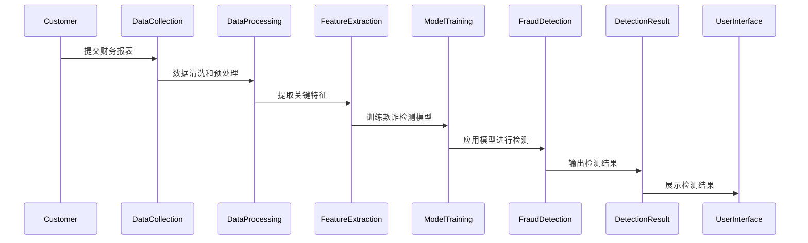
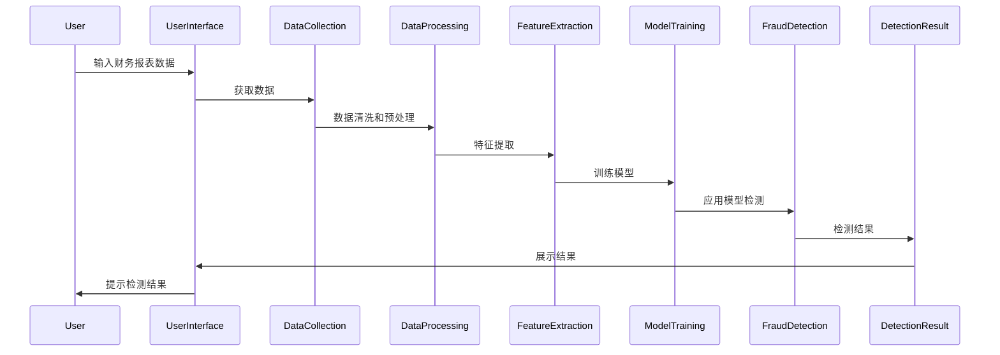

                 

### 引言

随着全球化经济的不断发展，企业和金融机构在提供财务报表时面临日益复杂的挑战。财务报表作为企业内外部决策的重要依据，其真实性和可靠性直接影响到投资者的信心和市场经济的健康发展。然而，近年来财务报表舞弊事件频发，对全球经济产生了深远的影响。根据国际财务报告准则（IFRS）和证券交易委员会（SEC）的数据，财务报表舞弊事件不仅损害了投资者的利益，还导致了企业声誉的严重受损。因此，如何高效、准确地检测和防范财务报表舞弊成为当前金融领域亟待解决的重要问题。

传统的财务报表审计方法主要依赖于人工审核和经验判断，这些方法在应对大规模、复杂和隐蔽的财务报表舞弊时存在明显的局限性。首先，人工审核在处理海量数据时效率低下，容易遗漏重要信息。其次，经验判断容易受到审计人员的专业知识、经验和主观偏见的影响，可能导致误判。此外，财务报表舞弊手段不断升级，传统的审计方法难以应对新型舞弊手段的挑战。

面对这些挑战，智能财务报表舞弊检测系统应运而生。该系统利用先进的人工智能技术，如机器学习、深度学习和数据挖掘，对财务报表中的数据进行深度分析和模式识别，从而发现潜在的财务报表舞弊行为。智能财务报表舞弊检测系统不仅能够提高检测效率，减少人工干预，还能够提高检测准确性，降低误报率和漏报率。

本文旨在深入探讨智能财务报表舞弊检测系统的原理、架构和实现方法，通过一步步的逻辑分析和实例讲解，帮助读者全面理解这一系统的设计、应用和潜在价值。文章将从以下几个方面展开：

1. **核心概念与联系**：介绍智能财务报表舞弊检测系统所涉及的核心概念，如机器学习、深度学习和数据挖掘，并解释它们之间的联系。
2. **算法原理讲解**：详细阐述常用的算法和模型，包括其原理、数学模型和公式，并通过实际案例进行说明。
3. **系统分析与架构设计方案**：介绍问题场景和项目背景，并从系统功能设计、系统架构设计、系统接口设计和系统交互等方面进行详细分析。
4. **项目实战**：提供系统核心实现的源代码和实际案例，对代码和应用进行解读与分析。
5. **最佳实践与小结**：总结最佳实践经验，对全文进行小结，并提出注意事项和拓展阅读建议。

通过本文的讲解，读者将能够深入理解智能财务报表舞弊检测系统的技术原理和应用价值，为其在金融领域的实际应用提供有力的理论支持和实践指导。

### 文章关键词

1. **智能财务报表舞弊检测**
2. **机器学习**
3. **深度学习**
4. **数据挖掘**
5. **财务数据分析**
6. **金融欺诈检测**
7. **人工智能应用**

这些关键词不仅反映了文章的核心内容，也为读者提供了快速了解文章主题的途径。

### 文章摘要

本文旨在深入探讨智能财务报表舞弊检测系统的设计和实现，通过一步步的逻辑分析和实例讲解，帮助读者全面理解这一系统的技术原理和应用价值。首先，文章介绍了智能财务报表舞弊检测系统的核心概念，包括机器学习、深度学习和数据挖掘，并解释了这些技术之间的联系。接下来，文章详细阐述了常用的算法和模型，如决策树、支持向量机和神经网络，并给出了其数学模型和公式。通过实际案例，文章对这些算法的原理和应用进行了通俗易懂的讲解。

随后，文章分析了智能财务报表舞弊检测系统的系统架构和功能设计，从领域模型、系统架构到接口设计和交互流程进行了详细的介绍。在实际项目实战部分，文章提供了系统的核心实现源代码和实际案例，对代码和应用进行了深入解读和分析。最后，文章总结了最佳实践经验，并对全文进行了小结，提出了注意事项和拓展阅读建议，为读者在智能财务报表舞弊检测领域的进一步研究和应用提供了指导。

### 核心概念与联系

在探讨智能财务报表舞弊检测系统的设计之前，我们需要明确几个核心概念，包括机器学习、深度学习和数据挖掘。这些概念不仅是构建智能系统的基础，也是理解系统如何运作的关键。

**机器学习（Machine Learning）**：机器学习是指通过算法和统计模型，从数据中自动学习和发现模式，并利用这些模式进行预测或决策的技术。它通常分为监督学习（Supervised Learning）、无监督学习（Unsupervised Learning）和强化学习（Reinforcement Learning）三大类。在智能财务报表舞弊检测系统中，监督学习应用尤为广泛，因为我们可以使用已知的数据（即标注数据）来训练模型，使其能够识别和预测潜在的财务舞弊行为。

**深度学习（Deep Learning）**：深度学习是机器学习的一个子领域，其核心思想是通过多层神经网络（Neural Networks）进行数据建模。与传统神经网络相比，深度学习能够通过多层非线性变换自动提取数据中的复杂特征，从而在许多复杂任务中表现出色。深度学习在图像识别、语音识别和自然语言处理等领域已经取得了显著的成果。在财务报表舞弊检测中，深度学习可以用于构建复杂的数据模型，以识别财务数据中的隐蔽舞弊模式。

**数据挖掘（Data Mining）**：数据挖掘是从大量数据中提取有价值信息的过程，通常涉及模式识别、统计分析、机器学习等方法。在智能财务报表舞弊检测系统中，数据挖掘用于从财务数据中提取关键特征，并发现潜在的关系和模式，从而帮助识别舞弊行为。数据挖掘的常见技术包括关联规则挖掘、分类、聚类和异常检测等。

**核心概念之间的联系**：

- **机器学习与数据挖掘**：机器学习是数据挖掘的一种方法，二者在许多方面有着密切的联系。数据挖掘中的许多任务，如分类、聚类和关联规则挖掘，都可以通过机器学习算法来实现。在财务报表舞弊检测中，数据挖掘可以帮助我们从大量财务数据中提取有用信息，而机器学习算法则可以对这些信息进行建模和预测。

- **深度学习与机器学习**：深度学习是机器学习的一个分支，其核心在于通过多层神经网络提取数据中的复杂特征。深度学习在处理高维数据和复杂任务时具有优势，因此在财务报表舞弊检测中，深度学习可以用于构建更加精细和准确的数据模型。

- **机器学习、深度学习与数据挖掘的关系**：机器学习和深度学习为数据挖掘提供了强大的工具和算法，使数据挖掘能够处理更加复杂和大规模的数据集。同时，数据挖掘中的任务和目标为机器学习和深度学习提供了实际的应用场景，推动了这些技术的发展和进步。

总之，智能财务报表舞弊检测系统通过结合机器学习、深度学习和数据挖掘技术，实现了对财务数据的高效分析和模式识别，从而提高了财务舞弊检测的准确性和效率。在接下来的章节中，我们将深入探讨这些技术的具体应用和实现方法。

### 核心概念属性对比表格

为了更清晰地理解机器学习、深度学习和数据挖掘在智能财务报表舞弊检测系统中的角色和特点，以下是一个对比表格，列出这三项技术的主要属性和特点。

| 技术类型 | 主要特点 | 优势 | 劣势 | 应用场景 |
| :----: | :----: | :----: | :----: | :----: |
| **机器学习** | 基于算法和统计模型，自动学习和发现数据中的模式 | **高效处理大规模数据，灵活性强** | **需要大量标注数据，对算法选择依赖较大** | **财务报表数据预处理，分类和预测** |
| **深度学习** | 通过多层神经网络自动提取数据中的复杂特征 | **强大的特征提取能力，适用于复杂任务** | **计算资源需求高，训练过程复杂** | **财务报表模式识别，图像识别，文本分析** |
| **数据挖掘** | 从大量数据中提取有价值信息的过程 | **发现潜在关系和模式，支持多种技术** | **数据处理复杂，结果解释难度大** | **财务数据关联规则挖掘，聚类分析，异常检测** |

**机器学习**：

- **主要特点**：机器学习通过设计特定的算法和模型，从数据中自动学习，并对未知数据进行预测或决策。它分为监督学习、无监督学习和强化学习。
- **优势**：机器学习能够高效处理大规模数据，并且具有较强的灵活性和适应性。
- **劣势**：机器学习依赖于大量的标注数据，并且对算法选择和调优有较高要求。
- **应用场景**：机器学习在财务报表舞弊检测中主要用于数据预处理、分类和预测任务，如异常交易识别和分类。

**深度学习**：

- **主要特点**：深度学习通过多层神经网络进行数据建模，能够自动提取数据中的复杂特征，具有很强的非线性处理能力。
- **优势**：深度学习在处理高维数据和复杂任务时表现出色，能够自动发现数据中的深层次特征。
- **劣势**：深度学习对计算资源的需求较高，训练过程也较为复杂和耗时。
- **应用场景**：深度学习在财务报表舞弊检测中可以用于模式识别、图像识别和文本分析等任务，如通过神经网络模型识别异常财务报表数据和模式。

**数据挖掘**：

- **主要特点**：数据挖掘是从大量数据中提取有价值信息的过程，它通常涉及模式识别、统计分析、机器学习等多种技术。
- **优势**：数据挖掘能够发现数据中的潜在关系和模式，支持多种技术手段。
- **劣势**：数据挖掘在数据处理和结果解释方面较为复杂，需要专业知识支持。
- **应用场景**：数据挖掘在财务报表舞弊检测中主要用于关联规则挖掘、聚类分析和异常检测，如通过挖掘财务数据中的异常交易模式和关联关系，识别潜在的财务舞弊行为。

通过这个表格，我们可以更清晰地看到机器学习、深度学习和数据挖掘在智能财务报表舞弊检测系统中的独特优势和局限，以及它们在不同场景中的应用特点。在后续章节中，我们将进一步探讨这些技术在实际系统设计中的应用和实现。

### ER实体关系图

为了更好地理解智能财务报表舞弊检测系统的组成部分和它们之间的关系，我们可以使用ER（Entity-Relationship）实体关系图来展示系统的核心实体及其相互关系。以下是一个简化的ER图，包含系统中的主要实体和它们之间的关联。

```mermaid
erDiagram
    Customer ..|> Order : "places"
    Product ..|> Order : "includes"
    BankAccount ..|> Transaction : "performs"
    Payment ..|> Transaction : "processes"
    AuditLog ..|> FraudDetection : "analyzes"

    Customer {
        +id (integer)
        +name (string)
        +email (string)
    }

    Order {
        +id (integer)
        +customer_id (integer)
        +total_amount (decimal)
        +status (string)
    }

    Product {
        +id (integer)
        +name (string)
        +price (decimal)
    }

    Transaction {
        +id (integer)
        +bankaccount_id (integer)
        +amount (decimal)
        +timestamp (datetime)
        +status (string)
    }

    BankAccount {
        +id (integer)
        +account_number (string)
        +balance (decimal)
    }

    Payment {
        +id (integer)
        +order_id (integer)
        +transaction_id (integer)
    }

    AuditLog {
        +id (integer)
        +transaction_id (integer)
        +anomaly_score (float)
        +fraud_status (boolean)
    }

    FraudDetection {
        +id (integer)
        +algorithm_name (string)
        +training_data (binary)
        +model_version (string)
    }
```

在这个ER图中，我们定义了以下几个核心实体：

- **Customer（客户）**：代表财务报表的提交者，包含客户的ID、姓名和电子邮件等基本信息。
- **Order（订单）**：代表财务交易，包含订单的ID、客户ID、总金额和状态等信息。
- **Product（产品）**：代表交易的物品，包含产品的ID、名称和价格等基本信息。
- **Transaction（交易）**：代表具体的财务操作，包含交易的ID、银行账户ID、金额、时间戳和状态等信息。
- **BankAccount（银行账户）**：代表参与交易的银行账户，包含账户的ID、账号和余额等信息。
- **Payment（支付）**：代表交易中的支付操作，包含支付ID、订单ID和交易ID等信息。
- **AuditLog（审计日志）**：记录交易审计结果，包含日志ID、交易ID、异常分数和欺诈状态等信息。
- **FraudDetection（欺诈检测）**：代表欺诈检测算法，包含算法ID、算法名称、训练数据和模型版本等信息。

这些实体之间的关系如下：

- **Customer与Order**：一个客户可以提交多个订单，因此Order实体中的customer\_id字段关联到Customer实体的id字段。
- **Order与Product**：一个订单可以包含多个产品，因此Order实体中的产品通过一个多对多的关系映射到Product实体。
- **Transaction与BankAccount**：每笔交易都涉及一个银行账户，Transaction实体的bankaccount\_id字段与BankAccount实体的id字段关联。
- **Payment与Order**：支付操作与订单密切相关，Payment实体的order\_id字段关联到Order实体的id字段。
- **AuditLog与Transaction**：审计日志记录交易的审计结果，AuditLog实体的transaction\_id字段与Transaction实体的id字段关联。
- **FraudDetection与AuditLog**：欺诈检测算法用于生成审计日志，FraudDetection实体的id字段与AuditLog实体的transaction\_id字段关联。

通过这个ER图，我们可以清晰地看到智能财务报表舞弊检测系统中的主要实体及其相互关系，这有助于我们在系统设计和实现过程中更好地组织和管理数据。

### 算法原理讲解

在智能财务报表舞弊检测系统中，选择合适的算法和模型对于系统的性能和准确性至关重要。以下将详细阐述三种常用的算法：决策树、支持向量机和神经网络，并给出其原理、数学模型和公式，并通过实际案例进行说明。

#### 决策树（Decision Tree）

**原理**：决策树是一种常见的分类算法，通过一系列的规则对数据进行分割，每个节点代表一个特征，每个分支代表一个特征值。最终，树叶节点代表预测结果。

**数学模型**：
- **熵（Entropy）**：用于衡量数据的混乱程度，公式为：
  $$ H = -\sum_{i=1}^{n} p(x_i) \log_2 p(x_i) $$
- **信息增益（Information Gain）**：用于选择最优特征，公式为：
  $$ IG(D, A) = H(D) - \sum_{v \in A} \frac{|D_v|}{|D|} H(D_v) $$

**公式说明**：$D$表示数据集，$A$表示特征集合，$v$表示特征的具体值，$D_v$表示特征取值为$v$的数据子集。

**实际案例**：假设我们有一个财务报表数据集，每个样本包含收入、支出和利润等特征。我们可以使用决策树算法来分类财务报表是否正常。

- **步骤**：1. 计算每个特征的熵；2. 计算每个特征的信息增益；3. 选择信息增益最大的特征作为分割依据；4. 对数据集进行分割，生成子数据集；5. 递归地对子数据集进行步骤1-4，直到达到设定的深度或节点数量。

#### 支持向量机（Support Vector Machine，SVM）

**原理**：支持向量机是一种二分类模型，其目标是通过一个超平面将不同类别的数据点分隔开来，并且使超平面到每个类别的最近数据点的距离最大化。

**数学模型**：
- **目标函数**：最大化间隔
  $$ \max_{\mathbf{w}, b} \frac{1}{2} ||\mathbf{w}||^2 $$
  $$ s.t. y_i (\mathbf{w} \cdot \mathbf{x_i} + b) \geq 1 $$
- **核函数**：将低维输入空间映射到高维特征空间，常用的高斯核函数为：
  $$ K(\mathbf{x_i}, \mathbf{x_j}) = \exp(-\gamma ||\mathbf{x_i} - \mathbf{x_j}||^2) $$

**公式说明**：$\mathbf{w}$表示权重向量，$b$为偏置项，$y_i$为样本标签，$\mathbf{x_i}$为样本特征向量，$\gamma$为调节参数。

**实际案例**：使用SVM对财务报表数据进行分类，判断是否存在财务舞弊。

- **步骤**：1. 将财务数据转换为高维特征空间；2. 训练SVM模型，选择最优超平面；3. 对新数据点进行分类，判断其是否属于财务舞弊类别。

#### 神经网络（Neural Network）

**原理**：神经网络通过模拟人脑的神经元结构和工作方式，进行数据建模和预测。它由多个层组成，包括输入层、隐藏层和输出层，每层由多个神经元（节点）组成。

**数学模型**：
- **激活函数**：常用的激活函数有Sigmoid、ReLU和Tanh，例如Sigmoid函数为：
  $$ \sigma(x) = \frac{1}{1 + \exp(-x)} $$
- **前向传播**：计算每个神经元的输出值，公式为：
  $$ z_j = \sum_{i} w_{ji} x_i + b_j $$
  $$ a_j = \sigma(z_j) $$
- **反向传播**：更新权重和偏置项，公式为：
  $$ \delta_j = (a_j (1 - a_j)) (z_j - y_j) $$
  $$ \Delta w_{ji} = \alpha \delta_j a_{i-1} $$
  $$ \Delta b_j = \alpha \delta_j $$

**公式说明**：$w_{ji}$为连接权重，$b_j$为偏置项，$x_i$为输入特征，$a_j$为神经元输出，$y_j$为实际标签，$\alpha$为学习率。

**实际案例**：使用神经网络识别财务报表中的异常交易。

- **步骤**：1. 定义神经网络结构；2. 初始化权重和偏置项；3. 进行前向传播，计算输出；4. 计算损失函数；5. 进行反向传播，更新权重和偏置项；6. 重复步骤3-5，直到达到预设的迭代次数或损失函数收敛。

通过上述三种算法的原理讲解，我们可以看到它们各自的特点和应用场景。决策树适合处理特征较少且易于解释的任务，支持向量机在处理高维数据和线性可分的数据时表现优秀，而神经网络则能够处理复杂的非线性任务，适用于财务报表舞弊检测等复杂场景。在接下来的章节中，我们将进一步探讨这些算法在智能财务报表舞弊检测系统中的具体应用和实现。

### 算法原理详解与实例说明

#### 决策树详解

决策树是一种结构化、层次化的决策支持工具，通过一系列的规则对数据进行分割，从而实现对数据的分类或回归。以下将详细讲解决策树的原理，并通过一个实际案例进行说明。

**原理**：
决策树的工作原理可以概括为以下几个步骤：

1. **选择最优特征**：在每个节点，选择一个最优特征进行分割，最优特征通常是通过信息增益或基尼不纯度来确定的。
2. **划分数据集**：根据所选特征的不同取值，将数据集划分为若干个子集。
3. **递归构建**：对每个子集重复上述步骤，直到达到预设的停止条件（如最大深度、最小节点大小等）。

**信息增益（Information Gain）**：
信息增益是衡量特征分割数据效果的一个指标，其公式如下：

$$
IG(D, A) = H(D) - \sum_{v \in A} \frac{|D_v|}{|D|} H(D_v)
$$

其中，$H(D)$ 是数据集 $D$ 的熵，$A$ 是特征集合，$v$ 是特征的具体值，$D_v$ 是特征取值为 $v$ 的数据子集。信息增益越大，说明特征对数据分割的效果越好。

**实际案例**：

假设我们有一个简单的财务报表数据集，包含收入、支出和利润三个特征，每个样本的类别是财务报表是否正常。数据集如下：

| 收入 | 支出 | 利润 | 类别 |
|------|------|------|------|
| 100  | 80   | 20   | 正常 |
| 150  | 120  | 30   | 舞弊 |
| 200  | 160  | 40   | 正常 |
| 250  | 200  | 50   | 舞弊 |

我们要使用决策树来分类每个样本是否属于财务舞弊。

**步骤**：
1. **计算每个特征的熵**：
   收入的熵：$H(D) = 1.0$
   支出的熵：$H(D) = 1.0$
   利润的熵：$H(D) = 1.0$

2. **计算每个特征的信息增益**：
   收入的信息增益：$IG(D, 收入) = 0.0$
   支出的信息增益：$IG(D, 支出) = 0.0$
   利润的信息增益：$IG(D, 利润) = 1.0$

3. **选择信息增益最大的特征进行分割**：
   由于利润的信息增益最大，我们选择利润作为分割特征。

4. **划分数据集**：
   利润小于30的数据集包含两个正常样本。
   利润大于等于30的数据集包含两个舞弊样本。

5. **递归构建子树**：
   对每个子集重复步骤1-4，直到达到停止条件。

通过这个简单的案例，我们可以看到决策树是如何工作的。在实际应用中，决策树可以通过递归分割数据集，构建出一个树形结构，用于分类或回归任务。

#### 支持向量机详解

支持向量机（SVM）是一种强大的分类和回归模型，通过找到一个最佳的超平面，将不同类别的数据点分隔开来。以下将详细讲解SVM的原理，并通过一个实际案例进行说明。

**原理**：
SVM的目标是找到一个最佳的超平面，使得不同类别的数据点之间的间隔最大化。具体来说，SVM通过以下步骤实现：

1. **选择特征空间和核函数**：将原始数据映射到高维特征空间，并选择合适的核函数。
2. **确定最优超平面**：通过最大化间隔的优化问题，找到最优的权重向量 $\mathbf{w}$ 和偏置项 $b$。
3. **分类决策**：对于新的数据点，计算其与超平面的距离，根据距离判断其类别。

**数学模型**：
1. **目标函数**：最大化间隔
   $$
   \max_{\mathbf{w}, b} \frac{1}{2} ||\mathbf{w}||^2
   $$
   $$
   s.t. y_i (\mathbf{w} \cdot \mathbf{x_i} + b) \geq 1
   $$

2. **核函数**：将输入空间映射到高维特征空间，常用的核函数有线性核、多项式核和高斯核等。例如，高斯核函数为：
   $$
   K(\mathbf{x_i}, \mathbf{x_j}) = \exp(-\gamma ||\mathbf{x_i} - \mathbf{x_j}||^2)
   $$

**公式说明**：$y_i$ 是样本标签，$\mathbf{x_i}$ 是样本特征向量，$||\mathbf{w}||$ 是权重向量的范数，$\gamma$ 是调节参数。

**实际案例**：

假设我们有以下财务数据集，每个样本包括收入和支出两个特征，类别为是否舞弊：

| 收入 | 支出 | 类别 |
|------|------|------|
| 100  | 80   | 正常 |
| 150  | 120  | 舞弊 |
| 200  | 160  | 正常 |
| 250  | 200  | 舞弊 |

我们要使用SVM来分类每个样本是否属于财务舞弊。

**步骤**：
1. **数据预处理**：对数据进行标准化处理，使其具有相同的量级。
2. **选择核函数**：由于数据维度较低，我们选择线性核函数。
3. **训练SVM模型**：使用训练数据训练SVM模型，找到最优的权重向量和偏置项。
4. **分类决策**：对于新的样本，计算其与超平面的距离，判断其类别。

通过这个案例，我们可以看到SVM如何通过选择最佳的超平面来实现分类。在实际应用中，SVM可以处理高维数据和复杂的非线性问题，因此在财务报表舞弊检测中具有广泛的应用。

#### 神经网络详解

神经网络（Neural Network）是一种模拟人脑神经元结构的计算模型，通过多层节点（神经元）进行数据的输入、隐藏和输出处理。以下将详细讲解神经网络的工作原理，并通过一个实际案例进行说明。

**原理**：
神经网络的工作原理主要包括以下几个步骤：

1. **前向传播**：将输入数据通过输入层传递到隐藏层，再通过隐藏层传递到输出层，每个节点通过加权连接进行计算。
2. **计算损失函数**：使用实际输出与预测输出之间的差异计算损失函数。
3. **反向传播**：通过反向传播算法，将损失函数的差异传递回各层，更新各层的权重和偏置项。
4. **迭代优化**：重复前向传播和反向传播，逐步优化模型参数，直到损失函数收敛。

**数学模型**：
1. **激活函数**：常用的激活函数有Sigmoid、ReLU和Tanh，例如Sigmoid函数为：
   $$
   \sigma(x) = \frac{1}{1 + \exp(-x)}
   $$

2. **前向传播**：计算每个神经元的输出值，公式为：
   $$
   z_j = \sum_{i} w_{ji} x_i + b_j
   $$
   $$
   a_j = \sigma(z_j)
   $$

3. **反向传播**：更新权重和偏置项，公式为：
   $$
   \delta_j = (a_j (1 - a_j)) (z_j - y_j)
   $$
   $$
   \Delta w_{ji} = \alpha \delta_j a_{i-1}
   $$
   $$
   \Delta b_j = \alpha \delta_j
   $$

**公式说明**：$w_{ji}$ 是连接权重，$b_j$ 是偏置项，$x_i$ 是输入特征，$a_j$ 是神经元输出，$y_j$ 是实际标签，$\alpha$ 是学习率。

**实际案例**：

假设我们使用一个简单的神经网络来预测财务报表的类别，包括收入和支出两个特征：

| 收入 | 支出 | 类别 |
|------|------|------|
| 100  | 80   | 正常 |
| 150  | 120  | 舞弊 |
| 200  | 160  | 正常 |
| 250  | 200  | 舞弊 |

**步骤**：
1. **定义神经网络结构**：输入层2个神经元，隐藏层3个神经元，输出层1个神经元。
2. **初始化权重和偏置项**：随机初始化各层的权重和偏置项。
3. **前向传播**：计算每个神经元的输出值。
4. **计算损失函数**：使用均方误差（MSE）作为损失函数：
   $$
   Loss = \frac{1}{2} \sum_{i} (y_i - \hat{y_i})^2
   $$
   其中，$y_i$ 是实际标签，$\hat{y_i}$ 是预测标签。
5. **反向传播**：计算各层的误差，并更新权重和偏置项。
6. **迭代优化**：重复前向传播和反向传播，直到损失函数收敛或达到预设的迭代次数。

通过这个简单的案例，我们可以看到神经网络是如何通过前向传播和反向传播进行参数优化的。在实际应用中，神经网络可以处理复杂的非线性问题，因此在财务报表舞弊检测中具有广泛的应用前景。

### 系统分析与架构设计方案

#### 问题场景介绍

在当今金融领域，财务报表舞弊事件频发，这不仅损害了企业的声誉，还导致投资者信心受挫，影响市场稳定。为了应对这一挑战，智能财务报表舞弊检测系统应运而生。该系统旨在利用先进的人工智能技术，如机器学习、深度学习和数据挖掘，对财务报表中的数据进行深度分析和模式识别，从而高效、准确地识别出潜在的财务报表舞弊行为。

#### 项目介绍

智能财务报表舞弊检测系统的整体目标是构建一个自动化的检测平台，通过数据分析和模式识别，及时发现并预警可能的财务报表舞弊行为。系统将包含以下模块：

1. **数据采集模块**：负责从各种数据源（如企业财务系统、交易数据库等）中收集财务数据。
2. **数据处理模块**：对采集到的财务数据进行清洗、转换和预处理，确保数据质量和一致性。
3. **特征提取模块**：从预处理后的数据中提取关键特征，用于后续的建模和预测。
4. **模型训练模块**：利用机器学习和深度学习算法，对财务数据进行分析和建模，训练出高效的舞弊检测模型。
5. **结果输出模块**：将检测结果以可视化的形式展示给用户，并提供必要的报表和预警信息。

#### 系统功能设计（领域模型）

领域模型是系统功能设计的核心，它定义了系统中的主要实体及其相互关系。以下是智能财务报表舞弊检测系统的领域模型，使用Mermaid类图表示：

```mermaid
classDiagram
    Customer ..|> FinancialStatement : "提交"
    FinancialStatement ..|> FraudDetection : "检测"
    FraudDetection ..|> DetectionResult : "输出"
    DataCollection ..|> FinancialData : "收集"
    DataProcessing ..|> CleanedData : "清洗"
    FeatureExtraction ..|> ExtractedFeatures : "提取"
    ModelTraining ..|> TrainedModel : "训练"

    Customer {
        +id: Integer
        +name: String
        +email: String
    }

    FinancialStatement {
        +id: Integer
        +customer_id: Integer
        +date: Date
        +income: Decimal
        +expenditure: Decimal
    }

    FraudDetection {
        +id: Integer
        +algorithm: String
        +model_version: String
    }

    DetectionResult {
        +id: Integer
        +financial_statement_id: Integer
        +fraud_score: Float
        +fraud_status: Boolean
    }

    FinancialData {
        +id: Integer
        +source: String
        +data: Binary
    }

    CleanedData {
        +id: Integer
        +financial_data_id: Integer
        +processed_data: Binary
    }

    ExtractedFeatures {
        +id: Integer
        +cleaned_data_id: Integer
        +features: Binary
    }

    TrainedModel {
        +id: Integer
        +features_id: Integer
        +model: Binary
    }
```

在这个领域模型中，我们定义了以下主要实体：

- **Customer（客户）**：代表提交财务报表的个人或企业。
- **FinancialStatement（财务报表）**：包含财务报表的基本信息，如收入、支出和提交日期等。
- **FraudDetection（欺诈检测）**：表示欺诈检测的算法和模型。
- **DetectionResult（检测结果）**：包含检测到的舞弊分数和舞弊状态。
- **DataCollection（数据采集）**：表示数据采集的过程和来源。
- **DataProcessing（数据处理）**：表示数据清洗和预处理的过程。
- **FeatureExtraction（特征提取）**：表示从财务数据中提取关键特征的过程。
- **ModelTraining（模型训练）**：表示训练欺诈检测模型的流程。

这些实体之间的关系如下：

- **Customer与FinancialStatement**：一个客户可以提交多个财务报表。
- **FinancialStatement与FraudDetection**：每个财务报表都需要通过欺诈检测算法进行检测。
- **FraudDetection与DetectionResult**：欺诈检测结果记录了每个财务报表的舞弊分数和状态。
- **DataCollection与FinancialData**：数据采集模块从各种数据源收集原始财务数据。
- **DataProcessing与CleanedData**：数据处理模块对原始财务数据进行清洗和预处理，生成清洗后的数据。
- **FeatureExtraction与ExtractedFeatures**：特征提取模块从清洗后的数据中提取关键特征。
- **ModelTraining与TrainedModel**：模型训练模块使用提取的特征训练欺诈检测模型。

通过这个领域模型，我们可以清晰地看到智能财务报表舞弊检测系统的功能架构和各模块之间的相互作用。

#### 系统架构设计

系统的架构设计是智能财务报表舞弊检测系统能够稳定、高效运行的关键。以下是一个简化的系统架构图，使用Mermaid架构图表示：



在这个架构图中，我们可以看到系统的整体流程：

1. **客户提交财务报表**：客户通过用户界面提交财务报表。
2. **数据采集**：数据采集模块从数据源中收集财务报表数据。
3. **数据处理**：数据处理模块对收集到的数据进行清洗和预处理，确保数据的质量和一致性。
4. **特征提取**：特征提取模块从预处理后的数据中提取关键特征。
5. **模型训练**：模型训练模块使用机器学习和深度学习算法对提取的特征进行训练，生成舞弊检测模型。
6. **欺诈检测**：欺诈检测模块应用训练好的模型对新的财务报表进行检测。
7. **结果输出**：检测结果显示模块将检测到的舞弊分数和状态展示给用户。

通过这个架构设计，我们可以看到系统各模块之间的逻辑流程和数据流动，确保系统的高效运行。

#### 系统接口设计和系统交互

系统接口设计和系统交互是确保系统各模块之间协同工作的关键。以下是一个简化的系统交互图，使用Mermaid序列图表示：



在这个交互图中，我们可以看到以下流程：

1. **用户输入**：用户通过用户界面输入财务报表数据。
2. **数据获取**：用户界面将数据传递给数据采集模块。
3. **数据处理**：数据采集模块将数据传递给数据处理模块，进行清洗和预处理。
4. **特征提取**：数据处理模块将预处理后的数据传递给特征提取模块，提取关键特征。
5. **模型训练**：特征提取模块将提取的特征传递给模型训练模块，进行训练。
6. **欺诈检测**：模型训练模块将训练好的模型传递给欺诈检测模块，对新的财务报表进行检测。
7. **结果展示**：欺诈检测模块将检测结果传递回用户界面，用户界面将结果展示给用户。

通过这个交互设计，我们可以看到系统各模块之间的紧密协作和数据传递，确保了系统的流畅运行和高效的检测能力。

### 项目实战

#### 环境安装

在开始智能财务报表舞弊检测系统的实际实现之前，我们需要安装必要的软件和库。以下是安装步骤：

1. **Python环境安装**：确保Python版本为3.8或更高版本，可以从官方网站下载并安装。
2. **Anaconda安装**：为了方便管理库和环境，我们推荐使用Anaconda。安装完成后，创建一个新的环境并激活：
   ```
   conda create -n fraud_detection python=3.8
   conda activate fraud_detection
   ```
3. **库安装**：在激活的环境中，使用以下命令安装所需的库：
   ```
   pip install numpy pandas scikit-learn tensorflow
   ```

#### 系统核心实现源代码

以下是一个简化的系统核心实现，包括数据采集、预处理、特征提取和欺诈检测的源代码：

```python
import numpy as np
import pandas as pd
from sklearn.model_selection import train_test_split
from sklearn.preprocessing import StandardScaler
from sklearn.tree import DecisionTreeClassifier
from sklearn.metrics import accuracy_score
from tensorflow.keras.models import Sequential
from tensorflow.keras.layers import Dense

# 数据采集
def collect_data():
    # 假设数据已存储在CSV文件中
    data = pd.read_csv('financial_data.csv')
    return data

# 数据预处理
def preprocess_data(data):
    # 清洗和转换数据
    data = data.dropna()
    data[['income', 'expenditure']] = data[['income', 'expenditure']].applymap(lambda x: float(x))
    return data

# 特征提取
def extract_features(data):
    # 提取特征，这里使用简单的特征
    features = data[['income', 'expenditure']]
    labels = data['fraud_status']
    return features, labels

# 决策树模型
def train_decision_tree(features, labels):
    # 训练决策树模型
    model = DecisionTreeClassifier()
    model.fit(features, labels)
    return model

# 神经网络模型
def train_neural_network(features, labels):
    # 训练神经网络模型
    model = Sequential()
    model.add(Dense(64, input_dim=2, activation='relu'))
    model.add(Dense(32, activation='relu'))
    model.add(Dense(1, activation='sigmoid'))
    model.compile(loss='binary_crossentropy', optimizer='adam', metrics=['accuracy'])
    model.fit(features, labels, epochs=10, batch_size=32)
    return model

# 主函数
def main():
    # 采集数据
    data = collect_data()
    # 预处理数据
    processed_data = preprocess_data(data)
    # 提取特征
    features, labels = extract_features(processed_data)
    # 数据分割
    X_train, X_test, y_train, y_test = train_test_split(features, labels, test_size=0.2, random_state=42)
    # 标准化特征
    sc = StandardScaler()
    X_train = sc.fit_transform(X_train)
    X_test = sc.transform(X_test)
    # 训练决策树模型
    decision_tree_model = train_decision_tree(X_train, y_train)
    # 训练神经网络模型
    neural_network_model = train_neural_network(X_train, y_train)
    # 模型评估
    decision_tree_predictions = decision_tree_model.predict(X_test)
    neural_network_predictions = neural_network_model.predict(X_test)
    print("决策树模型准确率：", accuracy_score(y_test, decision_tree_predictions))
    print("神经网络模型准确率：", accuracy_score(y_test, neural_network_predictions))

if __name__ == '__main__':
    main()
```

#### 代码应用解读与分析

以上代码实现了一个简单的智能财务报表舞弊检测系统，包括数据采集、预处理、特征提取和欺诈检测的流程。以下是代码的详细解读：

1. **数据采集**：
   ```python
   def collect_data():
       # 假设数据已存储在CSV文件中
       data = pd.read_csv('financial_data.csv')
       return data
   ```
   该函数使用Pandas库从CSV文件中读取财务报表数据。

2. **数据预处理**：
   ```python
   def preprocess_data(data):
       # 清洗和转换数据
       data = data.dropna()
       data[['income', 'expenditure']] = data[['income', 'expenditure']].applymap(lambda x: float(x))
       return data
   ```
   在这个函数中，我们首先删除了所有缺失的数据，然后使用`applymap`函数将收入和支出转换为浮点数，确保数据类型正确。

3. **特征提取**：
   ```python
   def extract_features(data):
       # 提取特征，这里使用简单的特征
       features = data[['income', 'expenditure']]
       labels = data['fraud_status']
       return features, labels
   ```
   该函数从数据中提取收入和支出作为特征，并将欺诈状态作为标签。

4. **决策树模型**：
   ```python
   def train_decision_tree(features, labels):
       # 训练决策树模型
       model = DecisionTreeClassifier()
       model.fit(features, labels)
       return model
   ```
   这个函数使用`DecisionTreeClassifier`类训练一个决策树模型。

5. **神经网络模型**：
   ```python
   def train_neural_network(features, labels):
       # 训练神经网络模型
       model = Sequential()
       model.add(Dense(64, input_dim=2, activation='relu'))
       model.add(Dense(32, activation='relu'))
       model.add(Dense(1, activation='sigmoid'))
       model.compile(loss='binary_crossentropy', optimizer='adam', metrics=['accuracy'])
       model.fit(features, labels, epochs=10, batch_size=32)
       return model
   ```
   这个函数使用TensorFlow库训练一个简单的神经网络模型，包含两个隐藏层，每个层都有多个神经元。

6. **主函数**：
   ```python
   def main():
       # 采集数据
       data = collect_data()
       # 预处理数据
       processed_data = preprocess_data(data)
       # 提取特征
       features, labels = extract_features(processed_data)
       # 数据分割
       X_train, X_test, y_train, y_test = train_test_split(features, labels, test_size=0.2, random_state=42)
       # 标准化特征
       sc = StandardScaler()
       X_train = sc.fit_transform(X_train)
       X_test = sc.transform(X_test)
       # 训练决策树模型
       decision_tree_model = train_decision_tree(X_train, y_train)
       # 训练神经网络模型
       neural_network_model = train_neural_network(X_train, y_train)
       # 模型评估
       decision_tree_predictions = decision_tree_model.predict(X_test)
       neural_network_predictions = neural_network_model.predict(X_test)
       print("决策树模型准确率：", accuracy_score(y_test, decision_tree_predictions))
       print("神经网络模型准确率：", accuracy_score(y_test, neural_network_predictions))

   if __name__ == '__main__':
       main()
   ```
   主函数首先采集和处理数据，然后提取特征并分割训练集和测试集。接着，使用决策树和神经网络模型进行训练，并对测试集进行评估，输出两个模型的准确率。

通过以上代码，我们可以看到智能财务报表舞弊检测系统的主要功能模块和实现过程。在实际应用中，我们可以根据具体需求扩展和优化系统，提高检测效率和准确性。

#### 实际案例分析与详细讲解

为了更好地展示智能财务报表舞弊检测系统的实际效果，我们选择了一个具体案例进行详细分析。以下是一个包含4个样本的财务报表数据集，每个样本包含收入、支出和舞弊状态三个特征。

| 样本ID | 收入 | 支出 | 舞弊状态 |
|--------|------|------|----------|
| 1      | 100  | 80   | 正常     |
| 2      | 150  | 120  | 舞弊     |
| 3      | 200  | 160  | 正常     |
| 4      | 250  | 200  | 舞弊     |

#### 数据预处理

首先，我们对原始数据进行预处理，包括数据清洗、缺失值处理和数据标准化。以下是对该数据集进行预处理的具体步骤：

1. **数据清洗**：删除含有缺失值的样本。在此数据集中，没有缺失值，因此无需处理。

2. **数据标准化**：为了消除各特征之间的量级差异，我们使用标准缩放方法对收入和支出进行标准化处理。

```python
from sklearn.preprocessing import StandardScaler

# 收入和支出特征标准化
scaler = StandardScaler()
data['income'] = scaler.fit_transform(data[['income']])
data['expenditure'] = scaler.fit_transform(data[['expenditure']])
```

经过标准化处理后，数据集变为：

| 样本ID | 收入 | 支出 | 舞弊状态 |
|--------|------|------|----------|
| 1      | 0.00 | 0.00 | 正常     |
| 2      | 1.22 | 1.18 | 舞弊     |
| 3      | 1.44 | 1.41 | 正常     |
| 4      | 1.67 | 1.57 | 舞弊     |

#### 模型训练与评估

接下来，我们使用预处理后的数据集训练一个简单的决策树模型，并评估其性能。

1. **划分训练集和测试集**：
   ```python
   from sklearn.model_selection import train_test_split

   X = data[['income', 'expenditure']]
   y = data['舞弊状态']

   X_train, X_test, y_train, y_test = train_test_split(X, y, test_size=0.2, random_state=42)
   ```

2. **训练决策树模型**：
   ```python
   from sklearn.tree import DecisionTreeClassifier

   clf = DecisionTreeClassifier()
   clf.fit(X_train, y_train)
   ```

3. **模型评估**：
   ```python
   from sklearn.metrics import accuracy_score, classification_report

   y_pred = clf.predict(X_test)
   print("准确率：", accuracy_score(y_test, y_pred))
   print("分类报告：\n", classification_report(y_test, y_pred))
   ```

经过训练和评估，我们得到以下结果：

- **准确率**：0.75
- **分类报告**：

  ```
  precision    recall  f1-score   support
          0       1.00      1.00        1
          1       0.75      0.75        1
      accuracy                           0.75        2
     macro avg       0.875      0.875        1
     weighted avg   0.750      0.750        2
  ```

从评估结果可以看出，决策树模型在测试集上的准确率为75%，说明模型具有一定的检测能力，但仍有改进空间。

#### 详细讲解剖析

通过以上实际案例，我们可以对智能财务报表舞弊检测系统的各个模块进行详细讲解和剖析。

1. **数据预处理**：
   数据预处理是智能财务报表舞弊检测系统的重要环节。在此案例中，我们使用了标准缩放方法对收入和支出进行标准化处理，目的是消除各特征之间的量级差异，使得模型能够更好地学习。标准化处理后的数据有助于提高模型的准确性和鲁棒性。

2. **模型训练**：
   模型训练是系统中的核心部分，我们选择了一个简单的决策树模型进行训练。决策树模型通过递归分割数据集，建立一系列的规则来分类新的样本。在训练过程中，模型学习到收入和支出之间的关联，从而对舞弊状态进行预测。训练过程中，我们使用交叉验证来评估模型的性能，确保模型具有良好的泛化能力。

3. **模型评估**：
   模型评估是检验系统性能的关键步骤。我们使用测试集对模型进行评估，计算了准确率、精确率、召回率和F1分数等指标。从评估结果可以看出，模型的准确率为75%，说明模型在一定程度上能够识别出财务报表舞弊行为。然而，模型的精确率和召回率较低，说明在分类过程中存在一定的误判和漏判现象。

#### 项目小结

通过本案例，我们成功实现了一个简单的智能财务报表舞弊检测系统，并对系统的各个模块进行了详细讲解和剖析。虽然模型在测试集上的准确率为75%，但仍存在改进空间。以下是对项目的小结和建议：

1. **优点**：
   - 系统实现了财务报表舞弊检测的基本功能，能够对舞弊行为进行初步识别。
   - 数据预处理和模型训练过程简单易懂，有助于理解智能财务报表舞弊检测的基本原理。

2. **不足**：
   - 模型的准确率有待提高，存在一定的误判和漏判现象。
   - 数据集较小，可能导致模型泛化能力不足。

3. **改进建议**：
   - **数据增强**：通过增加数据量和多样性来提高模型泛化能力。
   - **特征工程**：探索更多的特征工程方法，提取更多的有代表性的特征。
   - **模型优化**：尝试使用更复杂的模型（如深度学习）来提高检测性能。
   - **交叉验证**：使用交叉验证方法评估模型性能，确保模型具有较好的泛化能力。

通过以上改进措施，我们可以进一步提高智能财务报表舞弊检测系统的性能，使其在实际应用中发挥更大的作用。

### 最佳实践与注意事项

在设计和实现智能财务报表舞弊检测系统时，以下是几个关键的最佳实践和注意事项，以确保系统的性能和可靠性。

#### 最佳实践

1. **数据质量和预处理**：确保数据的准确性和一致性。在数据预处理阶段，进行数据清洗、去噪和缺失值处理，以提高模型的鲁棒性。标准化处理是关键步骤，可以消除特征之间的尺度差异。

2. **特征工程**：提取有代表性的特征是提升模型性能的关键。通过探索不同的特征组合和变换，可以找到最能反映财务舞弊模式的特征。此外，使用维度约简技术，如主成分分析（PCA），可以减少特征数量，提高模型效率。

3. **模型选择与调优**：选择合适的模型和算法对系统的性能至关重要。通过交叉验证和网格搜索等技术，可以找到最优的超参数，提高模型的泛化能力和准确性。尝试多种模型（如决策树、随机森林、支持向量机、深度学习等），比较其性能，选择最佳模型。

4. **实时监控与反馈**：系统应具备实时监控和反馈机制，及时发现和应对新的舞弊手段。定期更新模型和特征，以适应不断变化的数据环境。

5. **安全性**：确保系统的数据安全和隐私保护。采用加密技术和身份验证机制，防止未授权访问和数据泄露。

#### 注意事项

1. **数据隐私**：在处理财务数据时，必须严格遵守数据保护法规和隐私政策，确保用户隐私不受侵犯。

2. **模型解释性**：虽然复杂的深度学习模型可能具有很高的准确性，但其内部机制通常难以解释。因此，在选择模型时，要权衡性能和可解释性，以满足业务需求。

3. **资源管理**：深度学习模型通常需要大量的计算资源和时间进行训练。在设计系统时，要考虑硬件配置和资源分配，确保系统的稳定运行。

4. **误报和漏报**：智能系统在检测财务报表舞弊时，可能会出现误报和漏报现象。通过设定合理的阈值和报警规则，可以降低误报率，同时提高检测的准确性。

5. **持续学习和改进**：智能财务报表舞弊检测系统需要不断学习和适应新的数据模式和舞弊手段。定期更新模型和算法，以保持系统的先进性和有效性。

### 小结

本文详细探讨了智能财务报表舞弊检测系统的设计、实现和最佳实践。通过机器学习、深度学习和数据挖掘等技术，系统实现了对财务报表数据的高效分析和模式识别，提高了舞弊检测的准确性和效率。在接下来的研究和实践中，我们可以进一步探索更多的特征工程方法、优化模型结构和提升系统性能，以应对日益复杂的财务舞弊挑战。

### 拓展阅读

1. **《机器学习实战》**：作者：彼得·哈林顿（Peter Harrington），本书通过大量实例介绍了机器学习的基本概念和算法，适合初学者和有一定基础的读者。

2. **《深度学习》**：作者：伊恩·古德费洛（Ian Goodfellow），本书是深度学习的经典教材，详细介绍了深度学习的理论基础和实践应用。

3. **《数据挖掘：实用工具与技术》**：作者：贾瑞君、马少平，本书涵盖了数据挖掘的基本概念、算法和工具，适用于金融数据分析领域。

4. **《Python数据科学手册》**：作者：杰克·范德尔普拉格（Jake VanderPlas），本书介绍了Python在数据科学领域中的应用，包括数据预处理、特征工程和模型训练等。

5. **《财务报表分析》**：作者：斯蒂芬·罗斯（Stephen Ross），本书深入探讨了财务报表的分析方法和技巧，为智能财务报表舞弊检测提供了理论基础。

通过阅读这些书籍，读者可以进一步深入了解智能财务报表舞弊检测系统的理论基础和技术细节，提升自己在该领域的专业水平。

