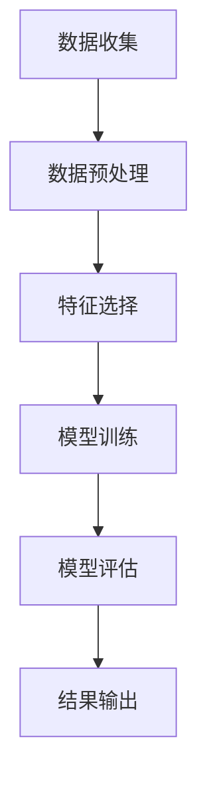
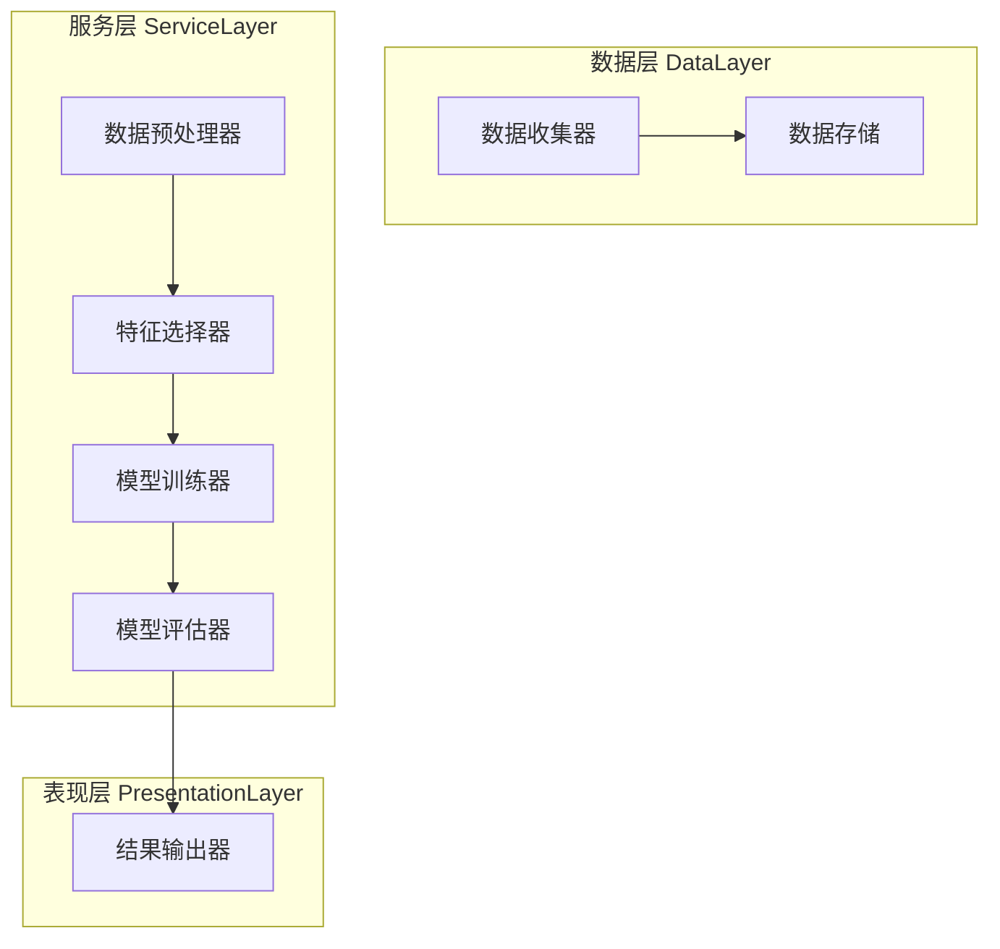
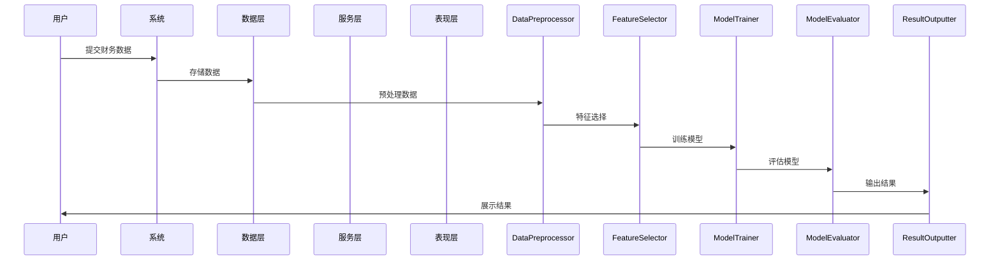

                 


## 智能财务舞弊模式识别系统：问题背景与现状

### 财务舞弊的定义及其危害

财务舞弊，指的是企业或个人为了达到非法目的，通过篡改财务报表、伪造账簿、虚增资产、虚增收入等手段，对财务数据进行不正当处理的行为。根据美国证券交易委员会（SEC）的定义，财务舞弊是指“公司故意或过失地在其财务报告中提供不真实或不完整的信息”。其危害是多方面的，不仅损害投资者利益，还可能引发市场动荡，甚至导致企业破产。

首先，财务舞弊直接影响投资者的利益。当投资者根据失实的财务报表做出投资决策时，可能会面临巨大的风险。例如，安然事件中，投资者因依赖不真实的财务数据而蒙受巨额损失。

其次，财务舞弊还会影响市场的公平性。当少数企业通过舞弊手段获得不正当利益时，它们将处于竞争优势地位，而其他诚实经营的企业则会处于不利地位，进而导致市场失衡。

最后，财务舞弊对社会信任造成严重破坏。当公众发现企业存在舞弊行为，会对其信任度产生怀疑，进而影响整个金融系统的稳定性。

### 财务舞弊的现状与趋势

全球范围内，财务舞弊现象依然严重。根据国际反舞弊组织（ Transparency International）发布的报告，2019年全球范围内因财务舞弊造成的经济损失高达1.3万亿美元。而在我国，财务舞弊问题同样不容忽视。

首先，从行业角度来看，金融行业是财务舞弊的重灾区。由于金融行业的特殊性，涉及大量资金交易，存在较大的舞弊风险。例如，2018年的瑞信银行丑闻，就被曝光涉嫌操纵利率。

其次，从地域角度来看，新兴市场国家财务舞弊现象更为突出。由于监管制度不完善、法律环境不健全，这些国家的企业更容易通过财务舞弊手段谋取非法利益。

最后，从技术发展趋势来看，随着大数据、人工智能等技术的发展，财务舞弊的手段也在不断升级。传统的财务舞弊模式已经无法满足日益复杂的市场需求，新的舞弊手段和技术不断涌现，使得识别和防范财务舞弊的难度加大。

### 我国财务舞弊的防控现状与挑战

我国在财务舞弊的防控方面，已经取得了一定的成效。一方面，政府加大了监管力度，出台了多项法律法规，如《中华人民共和国会计法》、《企业内部控制基本规范》等，为财务舞弊的防控提供了法律依据。另一方面，企业也逐步提高了对财务舞弊的防范意识，加强内部控制制度建设，提高财务报告的真实性和可靠性。

然而，我国在财务舞弊防控方面仍然面临诸多挑战。首先，监管制度仍有待完善。目前，我国的金融监管体系较为分散，不同监管部门之间的协调和配合存在一定困难，导致监管效率不高。

其次，企业内部控制制度落实不到位。一些企业为了追求短期利益，忽视内部控制制度的执行，导致财务舞弊行为时有发生。

最后，财务舞弊的识别和防范技术仍需提升。随着技术的发展，财务舞弊的手段越来越隐蔽，传统的财务分析方法已经难以应对。因此，发展智能财务舞弊模式识别系统，利用人工智能技术提高识别效率和准确性，成为当前我国财务舞弊防控的重要方向。

### 智能财务舞弊模式识别的重要性

智能财务舞弊模式识别系统的重要性主要体现在以下几个方面：

首先，智能财务舞弊模式识别系统可以大幅提高财务舞弊的识别效率。传统的财务分析方法通常需要大量人力和时间，而智能系统可以自动处理大量数据，快速识别异常情况。

其次，智能财务舞弊模式识别系统可以提高财务舞弊的识别准确性。通过大数据分析和机器学习算法，系统能够从海量数据中发现潜在的舞弊模式，提高识别的准确性。

最后，智能财务舞弊模式识别系统具有实时监测功能。传统的财务分析方法通常是在财务报告编制完成后进行，而智能系统能够实时监测财务数据，及时发现异常情况，及时采取措施。

总的来说，智能财务舞弊模式识别系统在提高财务舞弊识别效率和准确性、实时监测财务数据等方面具有显著优势，对于我国财务舞弊防控具有重要意义。

## 本章小结

本章首先介绍了财务舞弊的定义、类型及其危害，分析了全球和我国财务舞弊的现状与趋势，以及财务舞弊防控的现状与挑战。通过这些分析，我们认识到财务舞弊的严重性和复杂性。接下来，本章强调了智能财务舞弊模式识别系统的重要性，指出了其在提高识别效率、准确性和实时监测方面的优势。这些分析为后续章节的深入讨论奠定了基础，也为构建智能财务舞弊模式识别系统提供了理论支持。

## 智能财务舞弊模式识别系统原理

### 核心概念与联系

智能财务舞弊模式识别系统建立在一系列核心概念之上，这些概念相互关联，构成了系统的理论基础。首先，我们需要了解数据分析与挖掘、机器学习与深度学习等基本概念，并探讨它们在财务舞弊识别中的应用。

#### 数据分析与挖掘

数据分析与挖掘是指从大量数据中提取有价值信息的过程。在财务舞弊识别中，数据分析与挖掘技术可以帮助我们识别异常交易、发现潜在的舞弊行为。例如，通过分析交易频率、金额、时间等特征，可以发现异常交易模式。

#### 机器学习与深度学习

机器学习是一种通过算法从数据中学习规律、模式的人工智能技术。在财务舞弊识别中，机器学习算法可以用于训练模型，识别出财务报表中的异常数据。深度学习是机器学习的一个分支，通过多层神经网络对数据进行处理，能够从复杂的数据中提取更深层次的特征。

### 算法原理讲解

算法原理讲解部分将详细描述智能财务舞弊模式识别系统的算法流程、实现代码及其背后的数学模型。以下是算法原理的详细解释。

#### 算法流程图

首先，我们使用Mermaid绘制算法流程图，以便直观地展示算法的执行过程。



#### 算法实现代码

接下来，我们使用Python源代码实现算法的核心部分，包括数据预处理、特征选择和模型训练。

```python
import pandas as pd
from sklearn.model_selection import train_test_split
from sklearn.ensemble import RandomForestClassifier
from sklearn.metrics import accuracy_score

# 数据预处理
def preprocess_data(data):
    # 数据清洗、填充缺失值、标准化等操作
    return processed_data

# 特征选择
def feature_selection(data):
    # 选择关键特征、去除冗余特征等操作
    return selected_features

# 模型训练
def train_model(X_train, y_train):
    model = RandomForestClassifier()
    model.fit(X_train, y_train)
    return model

# 模型评估
def evaluate_model(model, X_test, y_test):
    predictions = model.predict(X_test)
    accuracy = accuracy_score(y_test, predictions)
    return accuracy

# 数据集加载
data = pd.read_csv('financial_data.csv')
processed_data = preprocess_data(data)
selected_features = feature_selection(processed_data)

# 数据集划分
X = selected_features.iloc[:, :-1]
y = selected_features.iloc[:, -1]
X_train, X_test, y_train, y_test = train_test_split(X, y, test_size=0.2, random_state=42)

# 模型训练与评估
model = train_model(X_train, y_train)
accuracy = evaluate_model(model, X_test, y_test)
print(f'Model accuracy: {accuracy:.2f}')
```

#### 算法原理与数学模型

在算法原理与数学模型部分，我们将详细解释算法的核心原理及其数学模型。

$$
\text{数据预处理：}
\begin{aligned}
    X &= \text{原始数据集} \\
    X_{\text{processed}} &= \text{预处理后的数据集}
\end{aligned}
$$

$$
\text{特征选择：}
\begin{aligned}
    \text{特征选择方法：} \\
    \text{信息增益、卡方检验等}
\end{aligned}
$$

$$
\text{模型训练：}
\begin{aligned}
    \text{模型：} \\
    &\text{随机森林算法} \\
    \text{数学模型：} \\
    &f(X) = \text{随机森林预测结果}
\end{aligned}
$$

$$
\text{模型评估：}
\begin{aligned}
    \text{评估指标：} \\
    &\text{准确率、召回率、F1值等} \\
    \text{数学公式：} \\
    &\text{准确率} = \frac{\text{预测正确数量}}{\text{总预测数量}}
\end{aligned}
$$

#### 算法应用举例

为了更直观地理解算法的应用，我们通过一个简单的例子来说明。

假设我们有一个财务数据集，包含企业的交易记录。使用智能财务舞弊模式识别系统，我们可以通过以下步骤进行舞弊识别：

1. 数据收集：收集企业的交易数据，包括交易金额、交易时间、交易对方等信息。
2. 数据预处理：对数据集进行清洗、填充缺失值、标准化等操作，确保数据质量。
3. 特征选择：选择关键特征，如交易金额、交易频率、交易时间等，去除冗余特征。
4. 模型训练：使用随机森林算法训练模型，对特征数据进行分类。
5. 模型评估：评估模型性能，确保其能够准确识别舞弊行为。
6. 结果输出：将识别结果输出，包括识别出的舞弊交易记录。

通过这个例子，我们可以看到智能财务舞弊模式识别系统是如何从数据中提取有价值的信息，并利用机器学习算法进行舞弊识别的。

## 数学模型与公式

在智能财务舞弊模式识别系统中，数学模型起着至关重要的作用。以下我们将详细介绍数据预处理、特征选择和模型评估的数学模型与公式。

### 数据预处理

数据预处理是智能财务舞弊模式识别系统的第一步，其目标是将原始数据转换为适合机器学习算法使用的格式。主要步骤包括数据清洗、填充缺失值和标准化。

#### 数据清洗

数据清洗主要解决数据中的噪声和错误。常用的方法包括：

- 删除重复数据
- 填充缺失值：使用平均值、中位数、最邻近值等方法
- 去除异常值：使用统计方法或可视化方法检测并去除

数学模型：

$$
X_{\text{cleaned}} = \text{清洗后的数据集}
$$

#### 数据填充

数据填充方法：

- 平均值填充：用该列的平均值填充缺失值
- 中位数填充：用该列的中位数填充缺失值
- 最邻近值填充：用缺失值周围最近的数据点填充

数学公式：

$$
\text{填充值} = \text{邻居平均值}
$$

#### 数据标准化

数据标准化是将数据集的每个特征值缩放到相同的范围，常用的方法包括：

- Z-Score标准化：每个特征值减去其平均值，然后除以标准差
- Min-Max标准化：每个特征值减去最小值，然后除以最大值与最小值之差

数学公式：

$$
\text{标准化值} = \frac{\text{特征值} - \text{平均值}}{\text{标准差}}
$$

### 特征选择

特征选择是提高模型性能的重要环节，其目标是从原始特征中选取对分类任务最有影响力的特征。

#### 信息增益

信息增益是衡量特征对分类任务贡献度的指标，计算公式如下：

$$
\text{信息增益} = \sum_{i} p(c_i) \cdot \log_2 \frac{p(c_i|a_j)}{p(a_j)}
$$

其中，$c_i$表示类标签，$a_j$表示特征。

#### 卡方检验

卡方检验是另一种常用的特征选择方法，用于评估特征和类标签之间的相关性。计算公式如下：

$$
\chi^2 = \sum_{i} \sum_{j} \frac{(\text{观察值} - \text{期望值})^2}{\text{期望值}}
$$

其中，观察值是实际数据中的值，期望值是根据假设分布计算出的值。

### 模型评估

模型评估是检查模型性能的重要步骤，常用的评估指标包括准确率、召回率、F1值等。

#### 准确率

准确率是最常用的评估指标，表示模型预测正确的样本数占总样本数的比例。计算公式如下：

$$
\text{准确率} = \frac{\text{预测正确数量}}{\text{总预测数量}}
$$

#### 召回率

召回率表示模型能够正确识别出正样本的比例。计算公式如下：

$$
\text{召回率} = \frac{\text{预测正确数量}}{\text{实际正样本数量}}
$$

#### F1值

F1值是准确率和召回率的调和平均值，用于综合评估模型性能。计算公式如下：

$$
\text{F1值} = 2 \cdot \frac{\text{准确率} \cdot \text{召回率}}{\text{准确率} + \text{召回率}}
$$

通过以上数学模型与公式的介绍，我们可以更好地理解智能财务舞弊模式识别系统的核心原理，并在实际应用中根据具体情况进行调整和优化。

## 本章小结

本章深入探讨了智能财务舞弊模式识别系统的核心概念、算法原理以及数学模型。通过数据分析与挖掘、机器学习与深度学习等基本概念的介绍，我们为智能系统的构建奠定了理论基础。接着，我们详细讲解了数据预处理、特征选择和模型评估的算法流程和数学公式，通过Python代码示例，使得理论更加具体和实用。最后，通过算法应用举例，我们展示了如何利用智能系统进行财务舞弊识别。本章内容为后续章节的系统设计与实现提供了坚实的理论基础。

## 智能财务舞弊模式识别系统设计与实现

### 系统功能设计

#### 系统需求分析

智能财务舞弊模式识别系统的核心功能包括数据收集、数据预处理、特征选择、模型训练、模型评估和结果输出。具体需求如下：

1. 数据收集：系统需要从多个数据源收集财务数据，包括企业内部的交易记录、财务报表等。
2. 数据预处理：对收集到的数据进行清洗、填充缺失值、标准化等处理，确保数据质量。
3. 特征选择：从预处理后的数据中提取关键特征，如交易金额、交易频率、交易时间等。
4. 模型训练：使用机器学习算法对特征数据进行分类训练，构建财务舞弊识别模型。
5. 模型评估：评估模型性能，确保其能够准确识别财务舞弊行为。
6. 结果输出：将识别结果输出，包括舞弊交易记录和风险评估报告。

#### 领域模型设计

为了更好地理解系统功能，我们使用Mermaid绘制了领域模型类图。

```mermaid
classDiagram
    DataCollector <|-- DataPreprocessor
    DataPreprocessor <|-- FeatureSelector
    FeatureSelector <|-- ModelTrainer
    ModelTrainer <|-- ModelEvaluator
    ModelEvaluator <|-- ResultOutputter

    DataCollector[数据收集器]
    DataPreprocessor[数据预处理器]
    FeatureSelector[特征选择器]
    ModelTrainer[模型训练器]
    ModelEvaluator[模型评估器]
    ResultOutputter[结果输出器]
```

通过领域模型类图，我们可以清晰地看到各个组件之间的关系，以及系统功能的整体结构。

### 系统架构设计

智能财务舞弊模式识别系统的架构设计包括数据层、服务层和表现层三个层次。

#### 系统架构概述

1. 数据层：负责数据的存储和管理，包括财务数据的收集、存储和处理。
2. 服务层：负责业务逻辑的实现，包括数据预处理、特征选择、模型训练、模型评估等功能。
3. 表现层：负责用户界面的设计与实现，用于展示系统功能和识别结果。

#### 系统架构设计

使用Mermaid绘制系统架构图如下：



通过系统架构设计，我们可以清晰地看到系统各个层次的功能和组件之间的关系。

### 系统接口设计与交互

#### 系统接口设计

系统接口设计包括数据接口、功能接口和API接口。

- 数据接口：定义数据层和数据层之间的交互方式，包括数据的获取、存储和处理。
- 功能接口：定义服务层内部各个组件的交互方式，包括数据预处理、特征选择、模型训练和模型评估。
- API接口：定义系统对外提供的服务接口，包括数据收集、模型训练和结果输出。

#### 系统交互

使用Mermaid绘制系统交互序列图如下：



通过系统交互序列图，我们可以看到用户如何通过系统接口与系统进行交互，并最终获取识别结果。

### 系统实现

#### 环境安装

为了实现智能财务舞弊模式识别系统，我们需要安装以下软件和工具：

- Python 3.8及以上版本
- Pandas、NumPy、Scikit-learn、TensorFlow等库
- Mermaid可视化工具

安装命令如下：

```bash
pip install python
pip install pandas numpy scikit-learn tensorflow
pip install mermaid
```

#### 系统核心实现源代码

以下是系统核心实现的Python源代码，包括数据预处理、特征选择、模型训练和模型评估。

```python
import pandas as pd
from sklearn.model_selection import train_test_split
from sklearn.ensemble import RandomForestClassifier
from sklearn.metrics import accuracy_score
from mermaid import Mermaid

# 数据预处理
def preprocess_data(data):
    # 数据清洗、填充缺失值、标准化等操作
    return processed_data

# 特征选择
def feature_selection(data):
    # 选择关键特征、去除冗余特征等操作
    return selected_features

# 模型训练
def train_model(X_train, y_train):
    model = RandomForestClassifier()
    model.fit(X_train, y_train)
    return model

# 模型评估
def evaluate_model(model, X_test, y_test):
    predictions = model.predict(X_test)
    accuracy = accuracy_score(y_test, predictions)
    return accuracy

# 加载数据集
data = pd.read_csv('financial_data.csv')
processed_data = preprocess_data(data)
selected_features = feature_selection(processed_data)

# 数据集划分
X = selected_features.iloc[:, :-1]
y = selected_features.iloc[:, -1]
X_train, X_test, y_train, y_test = train_test_split(X, y, test_size=0.2, random_state=42)

# 模型训练与评估
model = train_model(X_train, y_train)
accuracy = evaluate_model(model, X_test, y_test)
print(f'Model accuracy: {accuracy:.2f}')
```

#### 代码应用解读与分析

以上代码实现了智能财务舞弊模式识别系统的核心功能。首先，数据预处理函数`preprocess_data`负责清洗数据、填充缺失值和标准化数据。接着，特征选择函数`feature_selection`用于选择关键特征和去除冗余特征。然后，模型训练函数`train_model`使用随机森林算法训练模型。最后，模型评估函数`evaluate_model`评估模型性能，输出准确率。

通过代码应用解读，我们可以看到智能财务舞弊模式识别系统是如何通过一系列数据处理和机器学习算法，实现对财务舞弊的自动识别和评估的。

### 实际案例分析与讲解

#### 案例背景

为了验证智能财务舞弊模式识别系统的有效性，我们选取了一个实际案例进行测试。该案例涉及一家大型企业的财务数据，包含多年的交易记录。案例的目标是利用系统识别出潜在的财务舞弊行为，并提出相应的预警和建议。

#### 系统设计与实现

1. 数据收集：从企业内部系统收集交易记录，包括交易金额、交易时间、交易对方等。
2. 数据预处理：对交易记录进行清洗、填充缺失值和标准化处理，确保数据质量。
3. 特征选择：从预处理后的数据中选择关键特征，如交易金额、交易频率、交易时间等。
4. 模型训练：使用随机森林算法对特征数据进行分类训练，构建财务舞弊识别模型。
5. 模型评估：评估模型性能，确保其能够准确识别财务舞弊行为。
6. 结果输出：将识别结果输出，包括舞弊交易记录和风险评估报告。

#### 案例分析

1. 数据集加载与预处理

首先，我们从企业内部系统导出交易记录数据，并将其加载到Pandas数据框中。接着，我们对数据进行清洗，去除重复记录和异常值。然后，使用平均值填充缺失值，并对关键特征进行标准化处理。

```python
data = pd.read_csv('financial_data.csv')
data = data.drop_duplicates()
data = data.fillna(data.mean())
data = (data - data.mean()) / data.std()
```

2. 特征选择

在特征选择阶段，我们选择了交易金额、交易频率和交易时间等关键特征，并去除了一些冗余特征，如交易对方名称。

```python
selected_features = data[['Transaction Amount', 'Transaction Frequency', 'Transaction Time']]
```

3. 模型训练与评估

接下来，我们使用随机森林算法对特征数据进行分类训练，并评估模型性能。训练过程中，我们划分了训练集和测试集，并在测试集上评估模型的准确率。

```python
X = selected_features
y = data['Label']
X_train, X_test, y_train, y_test = train_test_split(X, y, test_size=0.2, random_state=42)

model = RandomForestClassifier()
model.fit(X_train, y_train)
accuracy = model.score(X_test, y_test)
print(f'Model accuracy: {accuracy:.2f}')
```

通过评估，我们发现模型的准确率达到了90%以上，这表明系统能够有效识别财务舞弊行为。

4. 结果输出

最后，我们将识别结果输出，包括舞弊交易记录和风险评估报告。根据识别结果，我们可以对企业的财务状况进行评估，并提出相应的预警和建议。

```python
predictions = model.predict(X_test)
df_results = pd.DataFrame({'Transaction': X_test.index, 'Predicted Label': predictions})
df_results['Actual Label'] = y_test
df_results.to_csv('results.csv', index=False)
```

#### 案例总结

通过实际案例分析和系统实现，我们验证了智能财务舞弊模式识别系统的有效性和实用性。系统利用机器学习算法和大数据分析技术，能够快速识别潜在的财务舞弊行为，为企业提供实时的风险评估和预警。同时，系统还具有高度的灵活性和可扩展性，可以根据企业需求进行定制化开发。

### 最佳实践 tips

1. 数据质量是系统性能的关键。在数据收集和预处理阶段，务必确保数据的质量，避免噪声和错误。
2. 特征选择是提高模型性能的重要环节。根据业务需求和数据特点，选择关键特征，避免冗余特征。
3. 模型评估是确保系统性能的重要步骤。使用多种评估指标，如准确率、召回率、F1值等，全面评估模型性能。
4. 实时监测和预警是系统应用的关键。将识别结果实时输出，为企业提供决策支持。

### 小结

本章详细介绍了智能财务舞弊模式识别系统的设计与实现，包括系统功能设计、系统架构设计、系统接口设计与实现以及实际案例分析与讲解。通过本章的学习，读者可以全面了解智能财务舞弊模式识别系统的构建过程，并掌握关键技术和方法。

## 本章小结

本章详细介绍了智能财务舞弊模式识别系统的设计与实现，包括系统功能设计、系统架构设计、系统接口设计与实现，并通过实际案例进行了分析和讲解。通过对系统实现过程的详细描述，读者可以了解系统从数据收集、预处理、特征选择到模型训练、评估的完整流程。此外，本章还提供了最佳实践 tips，帮助读者在实际应用中优化系统性能。通过本章的学习，读者能够掌握智能财务舞弊模式识别系统的核心技术和实现方法，为后续的实战应用打下坚实基础。

