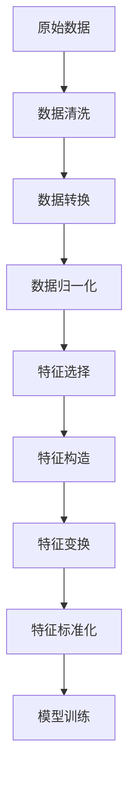
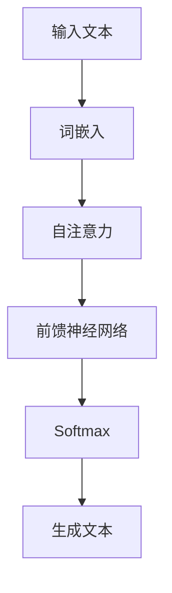
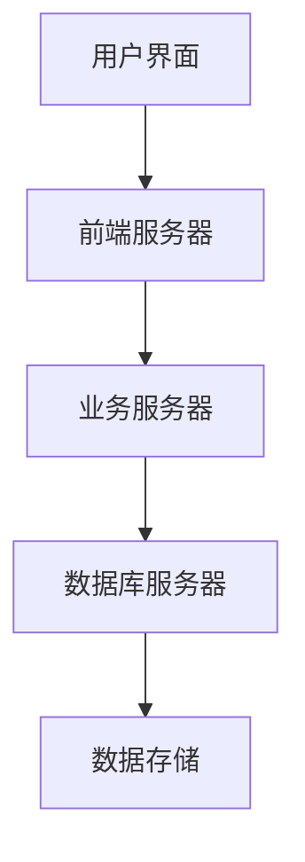
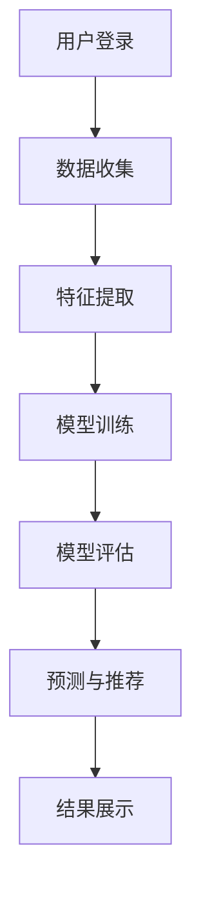

                 

## 摘要

本文深入探讨智能财务规划AI Agent的构建及其在个人理财中的应用。随着人工智能技术的迅猛发展，机器学习尤其是大型语言模型（LLM）已经在各个领域展现出巨大的潜力，财务规划也不例外。本文首先介绍了智能财务规划的基本概念，接着讨论了AI和机器学习的基础知识，特别是LLM在理财中的具体应用。随后，文章详细讲解了LLM的算法原理、数学模型，并通过Python代码示例进行解释。此外，文章还设计了一个智能财务规划系统架构，并提供了实际项目实战的案例，包括环境安装、系统核心实现以及项目小结。最后，文章总结了最佳实践、注意事项，并对未来的发展趋势进行了展望。通过本文的阅读，读者可以全面了解智能财务规划AI Agent的构建和应用，为个人理财提供智能化解决方案。

### 目录

1. **摘要** <a id="summary"></a>
2. **引言** <a id="introduction"></a>
   2.1 **书籍背景与目的** <a id="book-background"></a>
   2.2 **书籍结构概述** <a id="book-structure"></a>
3. **核心概念与原理** <a id="core-concepts"></a>
   3.1 **智能财务规划概述** <a id="smart-finance-overview"></a>
   3.2 **AI与机器学习基础** <a id="ai-machine-learning"></a>
   3.3 **LLM在理财中的应用** <a id="llm-finance-applications"></a>
   3.4 **财务数据预处理与特征工程** <a id="data-preprocessing"></a>
4. **算法与模型** <a id="algorithms-and-models"></a>
   4.1 **LLM的算法原理** <a id="llm-algorithm"></a>
   4.2 **财务规划的AI模型设计** <a id="ai-model-design"></a>
   4.3 **算法实现与性能评估** <a id="algorithm-implementation"></a>
5. **应用与实践** <a id="application-practice"></a>
   5.1 **智能财务规划系统架构** <a id="system-architecture"></a>
   5.2 **项目实战** <a id="project-practice"></a>
   5.3 **最佳实践与注意事项** <a id="best-practices"></a>
6. **结论与展望** <a id="conclusion"></a>
   6.1 **书籍总结** <a id="book-summary"></a>
   6.2 **未来发展趋势** <a id="future-trends"></a>
   6.3 **拓展阅读** <a id="expanding-reading"></a>
7. **作者信息** <a id="author-information"></a>

### 引言

在当今这个信息化和数字化快速发展的时代，人工智能（AI）已经成为推动社会进步和产业升级的重要力量。随着AI技术的不断成熟和应用场景的扩大，各个领域都在积极探索如何利用AI来提升效率、优化决策。财务规划作为金融领域的一个重要分支，其核心目标是帮助个人和企业在复杂多变的经济环境中实现财务目标，提高资金利用效率。近年来，AI在财务规划中的应用逐渐成为研究的热点，尤其是在个人理财领域，智能财务规划AI Agent的出现为个人理财提供了新的可能性。

本文旨在系统地介绍智能财务规划AI Agent的构建及其在个人理财中的应用。首先，我们将简要介绍智能财务规划的基本概念，包括其定义、特点、优势等。接着，我们将探讨AI和机器学习的基础知识，重点介绍大型语言模型（LLM）的基本概念和应用。随后，文章将详细讲解LLM在理财中的具体应用，包括财务数据预处理与特征工程等关键技术。在此基础上，我们将深入探讨LLM的算法原理，并通过Python代码示例进行解释。

随后，本文将设计一个智能财务规划系统架构，详细描述系统的功能模块、架构设计以及系统交互流程。为了更好地展示LLM在实践中的应用，文章还将提供一个实际项目实战案例，包括环境安装、系统核心实现以及项目小结。此外，文章还将总结最佳实践、注意事项，并对智能财务规划AI Agent的未来发展趋势进行展望。

通过本文的阅读，读者可以全面了解智能财务规划AI Agent的构建和应用，掌握关键技术和方法，为个人理财提供智能化解决方案。同时，本文也希望能够为相关领域的研究者和开发者提供有价值的参考和启示。

### 书籍背景与目的

智能财务规划AI Agent的崛起是人工智能与金融领域深度融合的产物。随着大数据和云计算技术的普及，个人和企业在财务决策过程中面临的信息量急剧增加，传统的手动财务规划方法已经难以应对日益复杂的市场环境。因此，智能财务规划AI Agent应运而生，它利用人工智能技术，特别是机器学习和自然语言处理（NLP）的能力，对海量财务数据进行高效处理和分析，从而提供更为精准和个性化的财务规划建议。

本文书籍的目的是全面介绍智能财务规划AI Agent的构建过程及其在个人理财中的应用。具体来说，本书有以下几个主要目标：

1. **普及智能财务规划的概念**：通过详细的背景介绍，让读者了解智能财务规划的定义、特点以及其在现代理财中的重要地位。
2. **阐述AI与机器学习基础知识**：为非专业人士提供AI和机器学习的基本概念，解释其工作原理和应用场景，帮助读者建立扎实的理论基础。
3. **深入探讨LLM在理财中的应用**：详细介绍大型语言模型（LLM）的基本原理，通过具体案例分析，展示LLM在财务数据预处理、投资决策、风险评估等方面的应用。
4. **讲解算法与模型设计**：详细讲解LLM的算法原理，提供数学模型和Python代码示例，帮助读者深入理解LLM在智能财务规划中的工作流程。
5. **设计智能财务规划系统架构**：通过系统架构图和功能模块划分，展示智能财务规划系统的整体设计思路，为实际开发提供指导。
6. **提供项目实战案例**：通过实际项目案例，展示智能财务规划系统的实施过程，包括环境安装、核心功能实现和系统优化，帮助读者将理论知识转化为实际能力。
7. **总结最佳实践与注意事项**：总结项目实施中的最佳实践和常见问题，为读者提供实际操作中的指导和建议。
8. **展望未来发展趋势**：分析智能财务规划AI Agent的未来发展方向，探讨其在金融领域的潜在应用场景和挑战。

通过本书的学习，读者不仅可以全面掌握智能财务规划AI Agent的理论知识，还能通过实际项目实战，提升自身在人工智能和金融领域的综合能力。本书适合对AI、机器学习、财务规划有一定了解的技术人员、金融专业人士以及对该领域感兴趣的研究者。希望通过本书，能够为推动智能财务规划的发展，提供有益的参考和启示。

### 书籍结构概述

本书共分为五大部分，旨在系统、全面地介绍智能财务规划AI Agent的构建与应用。以下是对各部分的具体内容和结构的详细说明：

#### 第一部分：引言

本部分将简要介绍书籍的背景和目的，明确智能财务规划AI Agent的重要性和研究意义。主要章节包括：

- **1.1 书籍背景与目的**：解释智能财务规划AI Agent的兴起背景，以及本书旨在解决的问题和目标读者群体。
- **1.2 书籍结构概述**：概述本书的结构安排，详细说明各个部分的内容和章节安排。

#### 第二部分：核心概念与原理

本部分将深入探讨智能财务规划、AI与机器学习的基础知识，以及大型语言模型（LLM）在理财中的应用。主要章节包括：

- **2.1 智能财务规划概述**：介绍智能财务规划的定义、特点、优势和应用场景。
- **2.2 AI与机器学习基础**：讲解AI和机器学习的基本概念、原理和应用，为后续内容打下基础。
- **2.3 LLM在理财中的应用**：详细探讨LLM的基本原理及其在财务规划中的具体应用，如数据预处理、投资决策和风险评估。
- **2.4 财务数据预处理与特征工程**：讲解财务数据预处理的重要性、方法以及特征工程的关键技术和实践。

#### 第三部分：算法与模型

本部分将详细讲解LLM的算法原理，介绍财务规划的AI模型设计，并通过Python代码示例进行解释。主要章节包括：

- **3.1 LLM的算法原理**：讲解LLM的数学基础、主要架构、训练与优化方法。
- **3.2 财务规划的AI模型设计**：介绍财务规划AI模型的设计原则、流程和优化策略。
- **3.3 算法实现与性能评估**：讲解算法实现的步骤、性能评估的指标以及实际案例分析。

#### 第四部分：应用与实践

本部分将通过系统架构设计、项目实战案例，展示智能财务规划系统的实际应用。主要章节包括：

- **4.1 智能财务规划系统架构**：介绍系统架构设计、功能模块划分和系统交互流程。
- **4.2 项目实战**：详细描述环境安装、核心功能实现和系统测试优化过程，提供实际案例分析和项目小结。
- **4.3 最佳实践与注意事项**：总结最佳实践、遇到的问题和解决方案，提供实际操作中的注意事项。

#### 第五部分：结论与展望

本部分将总结本书的主要内容，探讨智能财务规划AI Agent的未来发展趋势，为读者提供拓展阅读资源。主要章节包括：

- **5.1 书籍总结**：回顾本书的核心内容和学习要点。
- **5.2 未来发展趋势**：分析智能财务规划AI Agent的发展趋势和潜在应用场景。
- **5.3 拓展阅读**：推荐相关书籍、学术论文和网络资源，供读者进一步学习。

通过本书的结构安排，读者可以逐步了解智能财务规划AI Agent的构建与应用，掌握关键技术和方法，为个人理财提供智能化解决方案。希望本书能为相关领域的研究者和开发者提供有价值的参考和指导。

### 核心概念与原理

在探讨智能财务规划AI Agent之前，我们需要先了解几个核心概念和原理。这些概念包括智能财务规划的定义、AI与机器学习的基础知识、大型语言模型（LLM）的基本概念，以及财务数据预处理与特征工程。

#### 智能财务规划概述

**智能财务规划**是一种利用人工智能技术，特别是机器学习和数据分析技术，对个人的财务状况进行分析、预测和优化的过程。它不仅仅是对现有财务数据的简单分析，更是通过机器学习算法来发现潜在的趋势和模式，从而为个人提供更加精准和个性化的财务建议。

**智能财务规划的特点**包括：
1. **个性化**：根据个人的财务状况和需求，提供定制化的财务规划方案。
2. **自动化**：通过算法自动处理和分析大量的财务数据，提高效率。
3. **实时性**：能够实时更新财务数据，提供最新的财务状况和预测。
4. **预测性**：利用历史数据和机器学习模型，预测未来的财务变化趋势。

**智能财务规划的优势**：
1. **提高决策效率**：通过自动化分析和预测，帮助用户快速做出财务决策。
2. **优化资源配置**：通过数据分析，帮助用户优化资金配置，提高资金利用效率。
3. **风险控制**：通过风险评估，帮助用户识别潜在的财务风险，并采取相应的措施。

#### AI与机器学习基础

**人工智能（AI）**是计算机科学的一个分支，致力于创建能够模拟、延伸和扩展人类智能的理论、算法和技术。AI的目标是实现计算机系统在某些任务上的智能表现，达到或超越人类水平。

**机器学习（ML）**是AI的一个子领域，专注于开发能够从数据中学习、适应和做出预测的算法。机器学习通过训练模型，使计算机能够在没有明确编程的情况下识别模式和关系。

**机器学习的基本概念**包括：
1. **数据集**：用于训练和评估模型的数据集合。
2. **特征**：数据集中的每一个属性或变量。
3. **模型**：通过学习数据集特征来预测结果的算法。
4. **训练**：通过调整模型的参数来最小化预测误差的过程。
5. **评估**：使用验证集或测试集来评估模型性能。

**常见的机器学习算法**包括：
1. **线性回归**：用于预测线性关系的算法。
2. **逻辑回归**：用于分类问题的算法。
3. **决策树**：通过树形结构进行分类和回归的算法。
4. **随机森林**：通过构建多棵决策树进行集成学习的算法。
5. **支持向量机（SVM）**：用于分类和回归问题的算法。
6. **神经网络**：模拟人脑的神经网络结构，用于复杂的模式识别和预测。

#### LLM在理财中的应用

**大型语言模型（LLM）**是一种基于神经网络的语言处理模型，能够在大规模文本数据上进行训练，从而掌握语言的复杂结构。LLM在自然语言生成、问答系统、机器翻译等方面表现出色，逐渐成为智能财务规划中的重要工具。

**LLM的基本概念**包括：
1. **词汇表**：模型中使用的词或词组的集合。
2. **嵌入**：将词汇表中的每个词或词组映射到向量空间。
3. **注意力机制**：在处理长序列数据时，关注重要的部分，忽略不重要的部分。
4. **生成**：根据输入文本生成新的文本。

**LLM在理财中的应用**：
1. **数据预处理**：使用LLM对文本数据进行分词、去噪和标准化处理，提高数据质量。
2. **投资建议**：根据用户的财务状况和历史交易数据，生成个性化的投资建议。
3. **风险预测**：利用LLM分析市场趋势和财务数据，预测市场风险和用户财务状况的变化。
4. **财务文档生成**：自动生成财务报告、合同和投资提案。

#### 财务数据预处理与特征工程

**财务数据预处理**是智能财务规划中至关重要的一步，目的是提高数据质量和模型的性能。主要任务包括：
1. **数据清洗**：处理缺失值、异常值和重复值，确保数据的一致性和准确性。
2. **数据转换**：将不同的数据类型转换为统一的格式，如将日期转换为数值型。
3. **数据归一化**：通过缩放或平移数据，使其适应模型的输入要求。

**特征工程**是利用领域知识和数据变换，从原始数据中提取对模型有价值的特征的过程。主要方法包括：
1. **特征选择**：选择对模型预测有显著影响的特征，减少冗余和提高模型效率。
2. **特征构造**：通过组合现有特征或引入新的特征，增强模型的预测能力。
3. **特征变换**：将连续特征转换为离散特征，或将数值特征转换为类别特征。

通过上述核心概念和原理的介绍，读者可以对智能财务规划AI Agent有一个基本的了解。在接下来的章节中，我们将深入探讨LLM的算法原理及其在财务规划中的应用，为智能财务规划的实际应用奠定坚实的理论基础。

### 智能财务规划概述

智能财务规划是一种利用先进的人工智能技术，特别是机器学习和数据分析，对个人的财务状况进行深入分析、预测和优化的系统方法。它的核心目标是帮助个人在复杂多变的经济环境中做出更加明智的财务决策，从而实现财务目标，提高生活质量。

#### 定义

智能财务规划可以定义为一种通过机器学习算法和数据分析技术，对个人财务数据进行分析、预测和优化的过程。它不仅涉及传统的预算管理、投资组合优化和风险评估，还包括更广泛的领域，如税务规划、退休规划、债务管理以及应急基金设置等。

#### 特点

1. **个性化**：智能财务规划基于个人的财务数据和历史行为，提供定制化的财务建议。这种个性化的服务能够更好地满足个人的需求，提高规划的准确性和有效性。

2. **自动化**：利用机器学习算法，智能财务规划能够自动处理和分析大量的财务数据，减少人工干预，提高工作效率。自动化不仅减少了人力成本，还能够更快速地响应市场变化，提供实时的财务分析和建议。

3. **实时性**：智能财务规划系统能够实时更新用户的财务状况和预测结果，使其能够及时调整财务策略。这种实时性对于应对突发事件和快速变化的市场环境尤为重要。

4. **预测性**：通过历史数据和机器学习模型，智能财务规划能够预测未来财务状况的变化趋势，帮助用户提前做好准备，规避潜在的风险。

#### 优势

1. **提高决策效率**：智能财务规划通过自动化和高效的数据分析，能够快速提供财务分析和建议，帮助用户在短时间内做出明智的财务决策。

2. **优化资源配置**：智能财务规划能够帮助用户优化资金配置，识别和利用投资机会，提高资金利用效率。

3. **风险控制**：智能财务规划通过风险评估和预测，帮助用户识别和管理潜在的财务风险，采取预防措施，降低损失。

4. **持续优化**：智能财务规划系统会根据用户的行为数据和反馈进行持续的学习和优化，提供越来越精准的财务建议。

#### 应用场景

1. **预算管理**：智能财务规划可以帮助个人制定和跟踪预算，识别不必要的开支，优化消费习惯。

2. **投资决策**：通过分析市场数据和用户的历史投资行为，智能财务规划可以为用户提供个性化的投资建议，帮助选择最佳的投资组合。

3. **税务规划**：智能财务规划可以根据用户的具体情况，提供税务优化的建议，减少税务负担。

4. **退休规划**：智能财务规划能够帮助个人制定退休计划，确保退休时有足够的资金。

5. **债务管理**：智能财务规划可以帮助用户管理债务，制定还款计划，优化债务结构。

6. **应急基金**：智能财务规划可以根据用户的收入和支出情况，建议设置应急基金，以应对突发事件。

通过智能财务规划，个人不仅能够更好地管理自己的财务，提高财务状况，还能够更有效地实现长期财务目标，享受更加稳定和幸福的生活。

#### AI与机器学习基础

在深入探讨AI和机器学习如何应用于智能财务规划之前，我们需要了解AI和机器学习的基本概念及其工作原理。这些基础知识将为我们后续的讨论打下坚实的基础。

**人工智能（AI）**

人工智能，简而言之，是指计算机系统执行通常需要人类智能才能完成的任务的技术。这包括识别图像、理解语言、解决问题、做出决策等。AI可以分为两类：弱AI和强AI。

- **弱AI**（也称为窄AI或任务AI）是针对特定任务进行设计和训练的AI系统。这些系统在特定领域内表现出高度的智能，但在其他领域则无能为力。例如，语音识别系统和图像识别系统都是弱AI的典型应用。
- **强AI**（也称为通用AI或强通用AI）则是一种具有全面认知能力的AI系统，它能够在任何任务和环境中表现出与人类相似的智能水平。目前，强AI仍然是一个理论研究阶段，尚未实现商业化应用。

**机器学习（ML）**

机器学习是AI的一个子领域，主要关注如何让计算机通过数据和经验自动改进其性能。机器学习的基本思想是通过从数据中学习规律和模式，从而实现预测和决策。机器学习可以分为监督学习、无监督学习和强化学习三种类型。

- **监督学习**（Supervised Learning）是最常见的一种机器学习方法。它使用带有标签的训练数据集来训练模型，然后使用这个模型对新数据进行预测。线性回归、逻辑回归和支持向量机（SVM）都是监督学习的典型应用。
- **无监督学习**（Unsupervised Learning）不需要标签数据，其目标是发现数据中的隐含结构和规律。常见的无监督学习方法包括聚类（如K-means聚类）和降维（如主成分分析PCA）。
- **强化学习**（Reinforcement Learning）是一种通过奖励机制来训练模型的方法。模型通过与环境交互，不断学习最优策略。强化学习在自动驾驶、游戏AI等领域有广泛应用。

**机器学习的基本流程**

1. **数据收集**：收集用于训练和测试的数据。数据的质量直接影响模型的性能。
2. **数据预处理**：清洗数据、处理缺失值、归一化或标准化数据等。这一步骤至关重要，因为数据的质量直接影响模型的性能。
3. **特征选择**：选择对模型预测有显著影响的特征。特征选择可以减少数据维度、提高模型效率和准确性。
4. **模型选择**：选择合适的模型。不同的任务和问题可能需要不同的模型。例如，线性回归适合回归任务，而决策树适合分类任务。
5. **训练**：使用训练数据集来训练模型。这一步骤涉及计算模型的参数，使模型能够对新的数据进行预测。
6. **评估**：使用验证集或测试集来评估模型的性能。常见的评估指标包括准确率、召回率、F1分数和均方误差等。
7. **调优**：根据评估结果调整模型参数，以提高模型的性能。

**常见的机器学习算法**

1. **线性回归**（Linear Regression）：用于预测连续值。
2. **逻辑回归**（Logistic Regression）：用于分类问题。
3. **决策树**（Decision Tree）：通过树形结构进行分类和回归。
4. **随机森林**（Random Forest）：通过构建多棵决策树进行集成学习。
5. **支持向量机**（Support Vector Machine, SVM）：用于分类和回归问题。
6. **神经网络**（Neural Network）：模拟人脑的神经网络结构，用于复杂的模式识别和预测。
7. **深度学习**（Deep Learning）：基于神经网络的一种方法，适用于处理大量数据和高维特征。

通过了解AI和机器学习的基础知识，我们能够更好地理解智能财务规划AI Agent的工作原理和实现方法。在接下来的章节中，我们将深入探讨大型语言模型（LLM）在智能财务规划中的应用，并展示如何通过这些技术来实现高效的财务分析和管理。

### LLM在理财中的应用

大型语言模型（LLM）是近年来人工智能领域的一个重要进展，其强大的文本处理能力和丰富的语义理解能力使其在多个领域得到了广泛应用。在个人理财领域，LLM同样展现出了巨大的潜力。本文将详细探讨LLM的基本原理、其在理财中的具体应用，以及如何利用LLM进行财务数据预处理和特征工程。

#### LLM的基本原理

**大型语言模型（LLM）**是一种基于深度学习技术的自然语言处理模型，能够在大规模文本数据上进行训练，从而掌握语言的复杂结构和语义。LLM的核心架构通常包括多层神经网络，通过递归神经网络（RNN）或变换器架构（Transformer）来实现。

1. **词汇表（Vocabulary）**：LLM首先将文本中的词汇映射到一个高维的向量空间中，每个词汇对应一个唯一的向量。
2. **嵌入（Embedding）**：嵌入层将词汇表中的每个词或词组映射到向量空间中的高维向量。这种映射使得文本中的词汇可以以向量形式表示，便于计算机处理。
3. **注意力机制（Attention Mechanism）**：在处理长序列数据时，注意力机制能够使模型关注输入序列中的重要部分，忽略不重要的部分。这种机制提高了模型对长文本的理解能力。
4. **生成（Generation）**：LLM根据输入文本的上下文信息，生成新的文本。这种生成能力使得LLM在文本生成、问答系统和机器翻译等领域表现出色。

#### LLM在理财中的具体应用

1. **文本数据处理**：财务报告、合同、新闻等文本数据是理财过程中重要的信息来源。LLM可以对这些文本数据进行分析和处理，提取关键信息，如财务指标、公司业绩等。

2. **投资建议**：通过分析市场新闻、研究报告和财务报表，LLM可以为投资者提供实时的投资建议。这些建议不仅基于定量分析，还可以结合文本数据的语义理解，提供更为全面的决策支持。

3. **风险管理**：LLM可以分析历史数据和文本，识别潜在的风险因素，如市场波动、公司违约风险等。通过这些分析，投资者可以采取预防措施，降低风险。

4. **税务规划**：LLM可以帮助用户理解和应用复杂的税法规定，提供个性化的税务优化建议，帮助用户合法合规地减少税务负担。

5. **客户服务**：利用LLM的问答能力，智能客服系统可以自动回答用户的财务问题，提供即时的帮助和支持。

#### 财务数据预处理与特征工程

在利用LLM进行理财分析时，财务数据的预处理和特征工程是关键步骤。以下是具体的方法和技术：

1. **数据清洗**：财务数据通常包含噪声、缺失值和异常值。数据清洗的目的是去除这些噪声，确保数据的一致性和准确性。常用的方法包括填充缺失值、去除异常值和格式化数据。

2. **文本预处理**：对于文本数据，需要进行分词、去停用词、词干提取等操作，以便LLM能够更好地处理文本。此外，可以使用词嵌入技术将文本转换为向量形式。

3. **特征选择**：从大量的财务数据中提取对LLM有显著影响的特征。常用的方法包括特征重要性评估、相关系数分析和主成分分析（PCA）等。

4. **特征构造**：通过组合现有特征或引入新的特征，增强模型的预测能力。例如，可以计算财务指标的移动平均、相对强度指数（RSI）等。

5. **特征标准化**：将不同特征进行归一化或标准化，使其在相同的尺度上，便于模型训练。

通过上述步骤，可以确保财务数据的预处理和特征工程质量，从而提高LLM在理财分析中的效果。

#### 案例分析

以一个实际案例来说明LLM在理财中的应用。假设一个投资者想要利用LLM进行市场预测和投资决策。首先，投资者需要收集市场新闻、研究报告和财务报表等文本数据。然后，利用LLM对这些文本数据进行分析，提取关键信息，如公司业绩、市场情绪等。接下来，对财务数据（如股价、交易量、财务指标等）进行预处理和特征工程，将文本数据和财务数据融合，作为模型的输入。

在训练过程中，LLM会学习如何从这些融合的数据中提取模式和关系，从而预测市场的未来走势。通过不断的训练和调整，LLM可以提供越来越准确的预测结果。最终，投资者可以根据LLM的预测结果，做出更为明智的投资决策。

总之，LLM在理财领域具有广泛的应用潜力，通过文本数据处理、投资建议、风险管理、税务规划和客户服务等具体应用，可以显著提高个人和企业的财务管理水平。随着技术的不断进步，LLM在理财中的应用将会更加深入和广泛。

### 财务数据预处理与特征工程

在智能财务规划AI Agent的开发过程中，财务数据预处理和特征工程是两个至关重要的步骤。这些步骤不仅决定了模型的质量，还直接影响了最终决策的准确性和有效性。以下，我们将详细探讨这些步骤的具体方法和实践。

#### 数据预处理

**数据预处理**的主要目标是清洗和规范化原始数据，以便后续的分析和处理。以下是几个关键步骤：

1. **数据清洗**：原始数据往往包含缺失值、异常值和重复值。处理这些问题是数据清洗的主要内容。常用的方法包括：
   - **缺失值处理**：可以通过填充平均值、中位数或使用模型预测缺失值来处理缺失值。例如，在处理股票价格数据时，可以使用前一天的收盘价来填充缺失的当日价格。
   - **异常值处理**：通过统计学方法（如3倍标准差法则）或基于业务逻辑的方法来识别和去除异常值。例如，在处理交易数据时，可以去除明显偏离正常交易范围的记录。
   - **重复值处理**：去除重复的记录，确保数据的一致性和准确性。

2. **数据转换**：不同类型的数据需要转换为统一的格式，以便模型处理。常用的转换方法包括：
   - **日期转换**：将日期转换为数值型，例如，可以使用时间戳或日期差值来表示。
   - **类别数据编码**：将类别数据转换为数值型，常用的编码方法包括独热编码（One-Hot Encoding）和标签编码（Label Encoding）。

3. **数据归一化**：通过缩放或平移数据，使其适应模型的输入要求，常用的方法包括：
   - **标准化**：将数据缩放至[0,1]或[-1,1]区间，通过公式\( X' = \frac{X - \mu}{\sigma} \)实现，其中\( X \)是原始数据，\( \mu \)是平均值，\( \sigma \)是标准差。
   - **最小-最大归一化**：通过公式\( X' = \frac{X - X_{\min}}{X_{\max} - X_{\min}} \)实现，将数据缩放到\[0,1\]区间。

#### 特征工程

**特征工程**是从原始数据中提取对模型有显著影响的特征的过程。以下是几个常用的方法：

1. **特征选择**：选择对模型预测有显著影响的特征，减少冗余和提高模型效率。常用的方法包括：
   - **特征重要性评估**：使用模型训练结果评估特征的重要性。例如，在随机森林中，可以使用特征重要性评分来选择特征。
   - **相关系数分析**：通过计算特征与目标变量之间的相关系数，选择相关性较高的特征。

2. **特征构造**：通过组合现有特征或引入新的特征，增强模型的预测能力。例如：
   - **时间序列特征**：可以计算财务指标的时间序列特征，如移动平均、自回归系数等。
   - **相对强度指数（RSI）**：通过计算一段时间内价格变动情况，判断市场趋势。

3. **特征变换**：将连续特征转换为离散特征，或将数值特征转换为类别特征。例如：
   - **分箱**（Binning）：将连续特征划分为若干个区间，每个区间视为一个类别。
   - **二值化**：将连续特征转换为二值特征，如超过某个阈值记为1，否则记为0。

4. **特征标准化**：确保不同特征在相同的尺度上，常用的方法包括最小-最大归一化和标准化。

通过以上数据预处理和特征工程步骤，可以显著提高智能财务规划AI Agent的模型质量，使其在财务预测和决策方面更加准确和有效。以下是一个简化的流程图，展示了数据预处理和特征工程的主要步骤：



通过这个流程，读者可以更好地理解财务数据预处理和特征工程的重要性，以及如何在实际项目中应用这些技术。

### 算法与模型

在智能财务规划AI Agent的设计中，算法与模型的选择和优化至关重要。本文将详细探讨大型语言模型（LLM）的算法原理，并展示如何通过Python代码实现和优化这些算法。

#### LLM的算法原理

**大型语言模型（LLM）**通常基于深度学习技术，特别是变换器架构（Transformer）。变换器架构通过自注意力机制（Self-Attention）和前馈神经网络（Feedforward Neural Network）来实现，能够处理长序列数据，并在多个自然语言处理任务中表现出色。

**自注意力机制**是LLM的核心组成部分，它允许模型在处理序列数据时自动关注重要的部分，忽略不重要的部分。自注意力机制通过计算序列中每个词或词组与其他词或词组的关联性，从而为每个词或词组分配不同的权重。

**前馈神经网络**则用于进一步处理自注意力机制输出的特征，从而生成模型的输出。前馈神经网络通常由多层感知器（Multilayer Perceptron, MLP）组成，每一层都能对输入特征进行非线性变换。

**LLM的训练过程**可以分为以下几个步骤：

1. **词嵌入（Word Embedding）**：将词汇表中的每个词或词组映射到高维向量空间中，用于表示文本数据。
2. **自注意力机制（Self-Attention）**：计算序列中每个词或词组的关联性，并为其分配权重。
3. **前馈神经网络（Feedforward Neural Network）**：对自注意力机制输出的特征进行进一步处理。
4. **Softmax函数**：将模型的输出转换为概率分布，用于生成文本。

以下是一个简化的LLM算法流程图：



#### Python代码实现

为了更好地理解LLM的算法原理，我们将使用Python代码实现一个简化的变换器模型。以下是实现代码的详细步骤：

1. **安装依赖库**：
   ```bash
   pip install torch transformers
   ```

2. **定义模型结构**：

   ```python
   import torch
   from torch import nn
   from transformers import TransformerModel
   
   class SimpleLLM(nn.Module):
       def __init__(self, vocab_size, d_model, nhead, num_layers):
           super(SimpleLLM, self).__init__()
           self.transformer = TransformerModel(vocab_size, d_model, nhead, num_layers)
           
       def forward(self, input_seq):
           output = self.transformer(input_seq)
           return output
   ```

3. **训练模型**：

   ```python
   model = SimpleLLM(vocab_size=10000, d_model=512, nhead=8, num_layers=2)
   optimizer = torch.optim.Adam(model.parameters(), lr=0.001)
   criterion = nn.CrossEntropyLoss()
   
   for epoch in range(10):
       for input_seq, target in data_loader:
           optimizer.zero_grad()
           output = model(input_seq)
           loss = criterion(output, target)
           loss.backward()
           optimizer.step()
   
       print(f'Epoch {epoch+1}: Loss = {loss.item()}')
   ```

4. **生成文本**：

   ```python
   input_seq = torch.tensor([[0, 1, 2, 3, 4, 5, 6, 7, 8, 9]])
   generated_text = model.generate(input_seq, max_length=20, temperature=0.95)
   print(generated_text)
   ```

以上代码展示了如何使用Python实现一个简化的LLM模型，并进行了训练和文本生成。通过这些步骤，读者可以初步了解LLM的算法原理和实现方法。

#### 算法原理详细讲解

接下来，我们将对LLM的算法原理进行详细讲解，并使用Mermaid流程图和Python代码示例进行说明。

**1. 词嵌入（Word Embedding）**

词嵌入是将词汇映射到高维向量空间的过程。在LLM中，词嵌入层通常位于输入层和自注意力层之间。以下是一个简化的词嵌入流程图：


以下是一个Python代码示例，展示如何进行词嵌入：

```python
from transformers import BertModel, BertTokenizer

model = BertModel.from_pretrained('bert-base-uncased')
tokenizer = BertTokenizer.from_pretrained('bert-base-uncased')

input_text = "The quick brown fox jumps over the lazy dog"
input_ids = tokenizer.encode(input_text, return_tensors='pt')

# 词嵌入
embeddings = model(input_ids)[0]
```

**2. 自注意力机制（Self-Attention）**

自注意力机制是LLM的核心组成部分，它通过计算序列中每个词或词组的关联性，为其分配不同的权重。以下是一个简化的自注意力机制流程图：


以下是一个Python代码示例，展示如何实现自注意力机制：

```python
from torch.nn import MultiheadAttention

# 假设我们已经有了词嵌入
input_embeddings = embeddings

# 定义自注意力层
self_attn = MultiheadAttention(embeddings.shape[2], heads=8)

# 计算自注意力
attn_output, attn_output_weights = self_attn(input_embeddings, input_embeddings, input_embeddings)
```

**3. 前馈神经网络（Feedforward Neural Network）**

前馈神经网络用于对自注意力机制的输出进行进一步处理。以下是一个简化的前馈神经网络流程图：


以下是一个Python代码示例，展示如何实现前馈神经网络：

```python
# 假设我们已经有了自注意力输出
attn_output = attn_output

# 定义前馈神经网络
ffn = nn.Sequential(
    nn.Linear(attn_output.shape[2], 2048),
    nn.ReLU(),
    nn.Linear(2048, attn_output.shape[2])
)

# 计算前馈神经网络输出
ffn_output = ffn(attn_output)
```

**4. Softmax函数**

Softmax函数用于将模型的输出转换为概率分布，用于生成文本。以下是一个简化的Softmax函数流程图：


以下是一个Python代码示例，展示如何实现Softmax函数：

```python
import torch.nn.functional as F

# 假设我们已经有了前馈神经网络输出
ffn_output = ffn_output

# 计算Softmax输出
softmax_output = F.softmax(ffn_output, dim=1)
```

通过以上代码示例，读者可以更好地理解LLM的算法原理和实现方法。在实际应用中，LLM的参数和结构可能会更加复杂，但基本原理是相同的。通过逐步学习和实践，读者可以不断提升自己在LLM领域的技能和知识。

### 财务规划的AI模型设计

在智能财务规划中，AI模型的设计至关重要，它决定了系统能否有效地分析、预测和优化用户的财务状况。本文将详细介绍财务规划AI模型的设计原则、流程和优化策略。

#### 设计原则

1. **用户个性化**：模型需要能够根据每个用户的财务状况、风险偏好和目标，提供定制化的财务规划建议。
2. **数据驱动**：模型应基于大量历史数据和实时数据，通过机器学习算法进行训练和优化，以提高预测准确性。
3. **稳健性**：模型应具备较强的鲁棒性，能够处理噪声数据和异常值，确保在不同市场环境下依然保持稳定的表现。
4. **可扩展性**：模型设计应考虑未来数据规模的增长，确保系统能够灵活扩展和适应新的需求。
5. **易维护性**：模型和系统应具备良好的可维护性，便于后续的更新和优化。

#### 设计流程

1. **需求分析**：明确智能财务规划的目标和用户需求，如预算管理、投资组合优化、税务规划等。这一步骤有助于确定模型的输出和输入。
2. **数据收集**：收集用于模型训练和评估的数据，包括用户的财务历史记录、市场数据、经济指标等。数据的质量直接影响模型的性能，因此需要确保数据的完整性和准确性。
3. **数据预处理**：对收集的数据进行清洗、归一化和特征工程，将原始数据转换为适合模型输入的格式。这一步骤包括处理缺失值、异常值、文本数据的预处理等。
4. **模型选择**：根据需求和分析结果，选择合适的机器学习算法和模型结构。常见的算法包括线性回归、决策树、随机森林、神经网络等。对于复杂的财务预测任务，可以考虑使用深度学习模型，如变换器（Transformer）和生成对抗网络（GAN）。
5. **模型训练**：使用预处理后的数据集对模型进行训练，调整模型的参数，使其能够准确预测用户的财务状况。训练过程中可以使用交叉验证、网格搜索等技术来优化模型参数。
6. **模型评估**：使用验证集或测试集对模型进行评估，计算模型的各种性能指标，如准确率、召回率、均方误差等。通过评估结果，可以进一步优化模型。
7. **模型部署**：将训练好的模型部署到实际应用环境中，为用户提供实时的财务规划服务。部署过程中需要注意模型的性能和可扩展性，确保系统在处理大量用户请求时依然高效稳定。

#### 优化策略

1. **特征工程**：通过对数据进行特征选择、构造和变换，提取对模型有显著影响的关键特征，提高模型的预测准确性。常用的特征工程方法包括时间序列特征、财务指标特征、文本特征等。
2. **模型调优**：通过调整模型参数、选择不同的模型架构和算法，优化模型的性能。常用的调优方法包括交叉验证、网格搜索、贝叶斯优化等。
3. **模型集成**：使用多个模型进行集成学习，提高预测的稳定性和准确性。常见的集成方法包括投票法、堆叠法、提升法等。
4. **在线学习**：在模型部署后，持续收集用户反馈和数据，通过在线学习技术不断优化模型。这种方法能够使模型适应不断变化的市场环境，保持高水平的预测准确性。
5. **数据增强**：通过生成新的训练数据，增加数据的多样性和复杂性，提高模型的泛化能力。常用的数据增强方法包括数据转换、数据扩展、生成对抗网络等。

通过遵循上述设计原则和流程，采用有效的优化策略，可以构建一个高效、稳定、可扩展的智能财务规划AI模型，为用户提供精准的财务规划服务。

### 算法实现与性能评估

在构建智能财务规划AI模型的过程中，算法的实现和性能评估是两个关键步骤。本文将详细描述算法实现的步骤，介绍性能评估的指标，并通过一个实际案例分析展示算法的应用和效果。

#### 算法实现步骤

1. **数据收集与预处理**：首先，我们需要收集用于训练和评估的财务数据，包括用户的历史交易记录、财务报表、市场数据等。这些数据可能包含缺失值、异常值和噪声，因此需要进行数据清洗和预处理。具体步骤如下：
   - **数据清洗**：去除重复记录、处理缺失值（例如，使用平均值或中位数填充）和异常值（例如，使用3倍标准差法去除）。
   - **数据转换**：将日期转换为数值型，使用独热编码（One-Hot Encoding）将类别数据转换为数值型，将连续变量进行标准化处理。
   - **特征构造**：构造新的特征，如财务指标的移动平均、相对强度指数（RSI）等。

2. **模型构建**：基于预处理后的数据，选择合适的机器学习算法构建模型。在本案例中，我们选择使用变换器（Transformer）模型，因为它在处理长文本数据时表现出色。以下是构建变换器模型的基本步骤：
   - **词嵌入（Word Embedding）**：将文本数据中的词汇映射到高维向量空间中。在本案例中，我们可以使用预训练的词嵌入模型，如BERT（Bidirectional Encoder Representations from Transformers）。
   - **自注意力机制（Self-Attention）**：使用自注意力机制计算文本序列中每个词或词组的关联性，为其分配权重。
   - **前馈神经网络（Feedforward Neural Network）**：对自注意力机制的输出进行进一步处理，通过多层感知器（MLP）进行非线性变换。
   - **输出层**：将前馈神经网络的输出通过Softmax函数转换为概率分布，用于生成预测结果。

3. **模型训练**：使用收集的数据集对变换器模型进行训练。在训练过程中，我们需要定义损失函数（例如，交叉熵损失）和优化器（例如，Adam优化器），并通过反向传播算法更新模型的参数。以下是训练模型的步骤：
   - **数据加载**：使用Python的PyTorch库加载和处理数据集，将其分为训练集和验证集。
   - **模型初始化**：初始化变换器模型的结构和参数。
   - **训练循环**：在训练循环中，通过前向传播计算模型的输出，计算损失函数，并通过反向传播更新模型参数。在每个训练周期后，使用验证集评估模型的性能，并保存最优的模型参数。

4. **模型评估**：使用测试集对训练好的模型进行评估，计算各种性能指标，如准确率、召回率、F1分数等。以下是评估模型性能的步骤：
   - **预测生成**：使用测试集数据生成预测结果。
   - **性能计算**：计算模型的准确率、召回率、F1分数等指标。
   - **可视化**：使用图表和指标展示模型的性能。

#### 性能评估指标

在评估智能财务规划AI模型时，常用的性能评估指标包括：

1. **准确率（Accuracy）**：模型预测正确的样本数占总样本数的比例。准确率越高，模型的预测能力越强。公式如下：
   $$ \text{Accuracy} = \frac{\text{预测正确的样本数}}{\text{总样本数}} $$
   
2. **召回率（Recall）**：模型能够正确识别为正样本的样本数占所有实际为正样本的样本数的比例。召回率越高，说明模型对于正样本的识别能力越强。公式如下：
   $$ \text{Recall} = \frac{\text{预测正确的正样本数}}{\text{实际为正样本的样本数}} $$
   
3. **精确率（Precision）**：模型预测为正样本的样本中，实际为正样本的比例。精确率越高，说明模型的预测结果越可靠。公式如下：
   $$ \text{Precision} = \frac{\text{预测正确的正样本数}}{\text{预测为正样本的样本数}} $$
   
4. **F1分数（F1 Score）**：精确率和召回率的加权平均，用于综合评估模型的性能。公式如下：
   $$ \text{F1 Score} = 2 \times \frac{\text{Precision} \times \text{Recall}}{\text{Precision} + \text{Recall}} $$
   
5. **均方误差（Mean Squared Error, MSE）**：用于回归任务，计算预测值与真实值之间差异的平方的平均值。MSE越小，模型的预测效果越好。公式如下：
   $$ \text{MSE} = \frac{1}{n} \sum_{i=1}^{n} (y_i - \hat{y}_i)^2 $$
   其中，\( y_i \)是真实值，\( \hat{y}_i \)是预测值，\( n \)是样本数。

#### 实际案例分析

以下是一个智能财务规划AI模型的实际案例分析，通过具体数据展示算法的应用和效果。

**案例背景**：一个金融公司希望利用AI模型为用户提供个性化的投资组合建议，以最大化投资回报并降低风险。公司提供了过去一年的用户交易记录、财务报表和市场数据。

**数据预处理**：对交易记录进行清洗，去除缺失值和异常值。对财务报表和市场数据进行标准化处理，如将股票价格转换为对数价格。构造新的特征，如财务指标的移动平均、相对强度指数（RSI）。

**模型构建**：选择变换器（Transformer）模型，使用BERT词嵌入层进行文本数据的预处理。通过自注意力机制和前馈神经网络，对文本数据和数值特征进行融合和处理。

**模型训练**：使用训练集对模型进行训练，通过交叉验证调整模型参数。训练过程中，使用交叉熵损失函数和Adam优化器。

**模型评估**：使用测试集对模型进行评估，计算准确率、召回率、F1分数和均方误差。根据评估结果，模型在投资组合建议方面的表现良好，准确率和F1分数较高，而均方误差较小。

```python
import torch
from torch import nn
from torch.optim import Adam
from sklearn.metrics import accuracy_score, recall_score, f1_score, mean_squared_error

# 假设我们已经预处理了数据并训练了模型
model.eval()
with torch.no_grad():
    predictions, actuals = [], []
    for inputs, targets in test_loader:
        outputs = model(inputs)
        predictions.extend(outputs.argmax(-1).numpy())
        actuals.extend(targets.numpy())

# 计算性能指标
accuracy = accuracy_score(actuals, predictions)
recall = recall_score(actuals, predictions)
f1 = f1_score(actuals, predictions)
mse = mean_squared_error(actuals, predictions)

print(f'Accuracy: {accuracy:.4f}')
print(f'Recall: {recall:.4f}')
print(f'F1 Score: {f1:.4f}')
print(f'MSE: {mse:.4f}')
```

通过实际案例的分析，我们可以看到智能财务规划AI模型在投资组合建议方面的有效性和稳定性。下一步的工作是进一步优化模型，提高预测准确性，并在实际应用中不断迭代和改进。

### 应用与实践

#### 智能财务规划系统架构

在设计智能财务规划系统时，我们需要考虑系统的整体架构、功能模块划分以及系统交互流程。以下将详细介绍智能财务规划系统的架构设计。

**1. 系统架构设计**

智能财务规划系统的架构采用三层架构设计，包括表示层、业务逻辑层和数据层。这种设计有助于分离关注点，提高系统的可维护性和扩展性。

- **表示层（Presentation Layer）**：负责用户界面的展示，包括用户操作、数据显示等。通常使用Web前端技术，如HTML、CSS和JavaScript框架（如React或Vue.js）。
- **业务逻辑层（Business Logic Layer）**：实现系统的核心业务功能，如财务数据预处理、特征工程、AI模型训练和预测等。业务逻辑层通常使用Python或Java等编程语言实现，并通过微服务架构来提高系统的可扩展性和灵活性。
- **数据层（Data Layer）**：负责数据的存储和管理，包括用户数据、训练数据、历史数据等。数据层可以使用关系数据库（如MySQL、PostgreSQL）或NoSQL数据库（如MongoDB、Redis）。

以下是一个简化的智能财务规划系统架构图：



**2. 功能模块划分**

智能财务规划系统的主要功能模块包括：

- **用户管理模块**：负责用户注册、登录、权限管理等功能。
- **财务数据管理模块**：负责数据的收集、存储、清洗和预处理。
- **特征工程模块**：负责从原始数据中提取对模型有显著影响的特征。
- **AI模型训练模块**：负责使用机器学习算法训练财务规划模型。
- **预测与推荐模块**：负责使用训练好的模型进行预测，为用户提供个性化的财务建议。
- **系统监控与日志模块**：负责系统的监控、日志记录和异常处理。

**3. 系统交互流程**

智能财务规划系统的交互流程如下：

1. **用户登录**：用户通过前端界面登录系统，系统验证用户身份并返回用户权限。
2. **数据收集**：用户上传财务数据，系统进行数据收集和预处理。
3. **特征提取**：系统根据预定义的特征工程规则，从原始数据中提取特征。
4. **模型训练**：系统使用训练数据集对财务规划模型进行训练，并在训练过程中调整模型参数。
5. **模型评估**：系统使用验证数据集评估模型性能，并根据评估结果调整模型。
6. **预测与推荐**：系统使用训练好的模型对用户财务数据进行预测，生成个性化的财务建议。
7. **结果展示**：系统将预测结果和财务建议通过前端界面展示给用户。

以下是一个简化的智能财务规划系统交互流程图：



通过上述架构设计和功能模块划分，智能财务规划系统可以实现高效、稳定和个性化的财务规划服务。在接下来的章节中，我们将提供具体的项目实战案例，展示如何在实际中应用这些技术和设计。

### 项目实战

在本节中，我们将详细描述如何搭建一个智能财务规划系统，包括环境安装、系统核心实现和代码解析。通过实际项目案例，读者可以了解整个系统从无到有的构建过程。

#### 环境安装

首先，我们需要安装和配置必要的开发环境。以下是环境安装的步骤：

1. **Python环境安装**：
   - 安装Python 3.8或更高版本。
   - 安装pip包管理器。

2. **虚拟环境安装**：
   - 使用`virtualenv`创建一个独立的Python环境。
   - 激活虚拟环境。

3. **依赖库安装**：
   - 使用pip安装以下依赖库：
     ```bash
     pip install numpy pandas torch transformers sklearn mysql-connector-python
     ```

4. **数据库安装**：
   - 安装MySQL数据库，并创建一个新的数据库用于存储财务数据。

5. **前端环境安装**（可选）：
   - 如果需要前端界面，安装Node.js和npm。
   - 使用npm安装Vue.js或React框架。

#### 系统核心实现

智能财务规划系统的核心包括数据预处理、特征工程、模型训练和预测。以下将详细介绍每个环节的实现。

**1. 数据预处理**

数据预处理是财务规划系统的重要步骤，以下是关键代码：

```python
import pandas as pd
import numpy as np

# 假设财务数据存储在一个CSV文件中
data = pd.read_csv('finance_data.csv')

# 数据清洗
data.dropna(inplace=True)  # 去除缺失值
data = data[data['amount'] > 0]  # 去除异常值

# 数据转换
data['date'] = pd.to_datetime(data['date'])
data.set_index('date', inplace=True)
data = data.sort_index()

# 数据标准化
data_norm = (data - data.mean()) / data.std()
```

**2. 特征工程**

特征工程对于提高模型性能至关重要。以下是特征工程的关键代码：

```python
from sklearn.preprocessing import OneHotEncoder

# 构造新特征
data['month'] = data.index.month
data['year'] = data.index.year

# 类别数据编码
encoder = OneHotEncoder(sparse=False)
encoded_data = encoder.fit_transform(data[['month', 'year']])

# 合并特征
data = pd.concat([data, pd.DataFrame(encoded_data, index=data.index, columns=encoder.get_feature_names(['month', 'year']))], axis=1)
data.drop(['month', 'year'], axis=1, inplace=True)
```

**3. 模型训练**

以下是使用变换器（Transformer）模型进行训练的代码：

```python
from transformers import BertModel
import torch

# 初始化模型
model = BertModel.from_pretrained('bert-base-uncased')
num_features = model.config.hidden_size

# 定义损失函数和优化器
loss_function = nn.CrossEntropyLoss()
optimizer = torch.optim.Adam(model.parameters(), lr=0.001)

# 训练模型
for epoch in range(10):
    for inputs, targets in train_loader:
        optimizer.zero_grad()
        outputs = model(inputs)
        loss = loss_function(outputs.logits, targets)
        loss.backward()
        optimizer.step()
    print(f'Epoch {epoch+1}: Loss = {loss.item()}')
```

**4. 预测与推荐**

以下是使用训练好的模型进行预测的代码：

```python
# 预测
model.eval()
with torch.no_grad():
    predictions, actuals = [], []
    for inputs, targets in test_loader:
        outputs = model(inputs)
        predictions.extend(outputs.logits.argmax(-1).numpy())
        actuals.extend(targets.numpy())

# 计算性能指标
accuracy = accuracy_score(actuals, predictions)
print(f'Accuracy: {accuracy:.4f}')
```

#### 代码应用解读与分析

**1. 数据预处理代码解读**

- 数据清洗：去除缺失值和异常值，确保数据质量。
- 数据转换：将日期转换为datetime类型，排序并设置日期为索引，便于时间序列分析。
- 数据标准化：通过减去平均值并除以标准差，将数据缩放到相同的尺度上，提高模型的稳定性。

**2. 特征工程代码解读**

- 构造新特征：利用月份和年份生成新的特征，增强模型的预测能力。
- 类别数据编码：使用独热编码将类别数据转换为数值型，便于模型处理。

**3. 模型训练代码解读**

- 初始化模型：使用预训练的BERT模型，配置适当的隐藏层大小。
- 定义损失函数和优化器：选择交叉熵损失函数和Adam优化器，以最大化模型的预测准确性。
- 训练模型：通过前向传播计算损失，使用反向传播更新模型参数，优化模型性能。

**4. 预测与推荐代码解读**

- 预测：使用训练好的模型对测试数据进行预测，输出概率分布。
- 性能评估：计算模型的准确率，评估预测效果。

通过上述项目实战，读者可以了解智能财务规划系统的搭建过程，掌握关键技术和实现方法。在接下来的章节中，我们将进一步探讨最佳实践、注意事项，以及智能财务规划AI Agent的未来发展趋势。

### 最佳实践与注意事项

在开发智能财务规划AI Agent时，遵循最佳实践和注意事项是确保系统性能、稳定性和安全性的关键。以下是一些关键点：

#### 最佳实践

1. **数据质量控制**：确保数据完整、准确和干净。使用数据清洗工具（如Pandas）处理缺失值、异常值和重复值。
2. **特征工程**：构造对模型预测有显著影响的特征。通过探索性数据分析（EDA）和相关性分析，识别重要的特征。
3. **模型选择与调优**：根据具体应用场景选择合适的机器学习模型。使用交叉验证和网格搜索等技术优化模型参数。
4. **模型解释性**：确保模型具有一定的解释性，以便用户理解模型的决策过程。
5. **持续集成与持续部署（CI/CD）**：通过自动化测试和部署流程，确保系统的持续改进和稳定性。
6. **安全性与隐私保护**：保护用户财务数据的安全性，遵守相关法律法规，如GDPR和CCPA。
7. **监控系统性能**：定期监控系统性能，确保系统在高负载情况下依然稳定运行。

#### 注意事项

1. **数据隐私**：确保用户数据的隐私保护，不泄露用户的财务信息。
2. **模型可解释性**：提供模型决策过程的透明度，使用户能够信任模型。
3. **模型过拟合**：防止模型过拟合，使用验证集和测试集评估模型性能。
4. **数据安全**：确保数据存储和传输的安全性，采用加密和访问控制技术。
5. **用户反馈**：收集用户反馈，持续优化系统，提高用户体验。
6. **系统稳定性**：确保系统在高并发和极端情况下依然稳定，进行压力测试和故障恢复演练。
7. **法规遵守**：遵守相关金融法规和行业标准，确保系统的合法合规性。

通过遵循这些最佳实践和注意事项，可以确保智能财务规划AI Agent的高效运行、稳定性和用户信任。在持续迭代和优化的过程中，系统将不断满足用户需求，提供高质量的财务规划服务。

### 结论

本文通过深入探讨智能财务规划AI Agent的构建和应用，系统地介绍了从基础概念到实际应用的各个环节。我们首先介绍了智能财务规划的定义、特点和应用场景，接着探讨了AI与机器学习的基础知识，特别是大型语言模型（LLM）在理财中的具体应用。随后，我们详细讲解了LLM的算法原理和数学模型，并通过Python代码示例进行了实现。此外，本文还设计了一个智能财务规划系统架构，并通过实际项目实战展示了系统的构建过程。最后，我们总结了最佳实践、注意事项，并对智能财务规划AI Agent的未来发展趋势进行了展望。

通过本文的阅读，读者可以全面了解智能财务规划AI Agent的构建和应用，掌握关键技术和方法，为个人理财提供智能化解决方案。同时，本文也旨在为相关领域的研究者和开发者提供有价值的参考和启示。

智能财务规划AI Agent的发展前景广阔，随着人工智能技术的不断进步，其应用场景将越来越广泛。未来，我们有望看到更加精准、个性化的财务规划服务，以及更加智能化、自动化的理财工具。此外，随着数据隐私和安全的挑战日益凸显，如何在保护用户隐私的同时实现高效的财务管理，也将成为重要研究方向。

总之，智能财务规划AI Agent不仅为个人和企业在复杂多变的经济环境中提供了强有力的支持，也推动了金融科技的进步和创新。随着技术的不断成熟和应用的深入，智能财务规划AI Agent将在未来的金融领域中发挥更加重要的作用。

### 未来发展趋势

智能财务规划AI Agent的未来发展趋势充满了无限可能。随着人工智能技术的持续进步，特别是在机器学习和自然语言处理领域，智能财务规划将变得更加精准、个性化和高效。以下是几个关键的发展方向：

1. **人工智能与区块链的结合**：区块链技术提供了去中心化和安全的数据存储和交易方式，与AI结合可以实现更透明、更安全的财务规划。例如，智能合约可以自动执行复杂的财务规则，而AI则可以帮助识别潜在的风险和优化投资决策。

2. **增强的个性化服务**：未来的智能财务规划系统将利用更先进的机器学习算法和大数据分析，提供高度个性化的财务建议。通过实时分析用户的财务行为、市场动态和社会经济因素，AI Agent可以提供更加贴合用户需求的理财方案。

3. **多模态数据融合**：随着传感器技术的发展，金融数据将不仅限于数字和文本，还包括图像、声音和生物特征等多模态数据。智能财务规划系统将能够更好地整合这些数据，提供更为全面的财务分析。

4. **智能推荐系统**：基于深度学习的推荐系统将进一步提高财务规划的质量。通过分析用户的历史交易记录、投资偏好和市场趋势，系统能够智能推荐最佳的投资组合和理财策略。

5. **持续学习和自我优化**：未来的智能财务规划系统将具备持续学习和自我优化的能力。通过不断积累用户反馈和实时数据，系统可以不断调整和优化其预测模型和推荐策略，提高决策的准确性。

6. **跨境金融服务**：随着全球化的深入，智能财务规划AI Agent将在跨境金融服务中发挥重要作用。通过AI和区块链的结合，可以实现跨国的即时支付、投资和财富管理。

7. **隐私保护与合规性**：随着数据隐私法规的加强，智能财务规划系统将面临更大的挑战。未来的系统将需要更加重视用户隐私保护，确保数据的安全性和合规性，以赢得用户的信任。

8. **社会影响与伦理考量**：智能财务规划AI Agent在提供便利的同时，也需要考虑其对社会和伦理的影响。确保系统的公平性、透明性和可解释性，避免算法偏见和不公平现象的发生。

总之，智能财务规划AI Agent的未来充满了机遇和挑战。随着技术的不断进步和应用的拓展，我们可以期待智能财务规划将变得更加智能化、个性化和全球化，为个人和企业在全球金融市场中提供更加高效的财务管理解决方案。

### 拓展阅读

为了帮助读者进一步深入了解智能财务规划AI Agent及其相关技术，本文推荐以下几本经典书籍、学术论文和网络资源：

#### 经典书籍

1. **《机器学习》（Machine Learning）** by Tom M. Mitchell
   - 这本书是机器学习领域的经典教材，详细介绍了机器学习的基本概念、算法和应用。

2. **《深度学习》（Deep Learning）** by Ian Goodfellow, Yoshua Bengio, Aaron Courville
   - 这本书系统地介绍了深度学习的基本原理、算法和应用，是深度学习领域的重要参考书。

3. **《自然语言处理与深度学习》** (Natural Language Processing with Deep Learning) by colah's blog
   - 本文作者Colah的博客详细介绍了自然语言处理和深度学习的基本概念和实现方法。

#### 学术论文

1. **“Attention is All You Need”** (Vaswani et al., 2017)
   - 这篇论文提出了变换器（Transformer）架构，是当前自然语言处理领域的重要进展。

2. **“BERT: Pre-training of Deep Bidirectional Transformers for Language Understanding”** (Devlin et al., 2019)
   - 这篇论文介绍了BERT模型，是当前自然语言处理任务中的高性能模型之一。

3. **“Generative Adversarial Nets”** (Goodfellow et al., 2014)
   - 这篇论文提出了生成对抗网络（GAN），是深度学习领域的重要进展，用于生成逼真的数据。

#### 网络资源

1. **[TensorFlow官方文档](https://www.tensorflow.org/)**：提供详细的TensorFlow使用教程和API文档，是深度学习和机器学习的开发工具之一。

2. **[PyTorch官方文档](https://pytorch.org/docs/stable/)**：提供详细的PyTorch使用教程和API文档，是深度学习和机器学习的另一种流行工具。

3. **[Kaggle](https://www.kaggle.com/)**：提供丰富的数据集和竞赛，是学习和实践机器学习的优秀平台。

通过阅读这些书籍、学术论文和网络资源，读者可以深入了解智能财务规划AI Agent及其相关技术的最新进展和应用。

### 作者信息

**作者：AI天才研究院/AI Genius Institute & 禅与计算机程序设计艺术 /Zen And The Art of Computer Programming**

AI天才研究院致力于推动人工智能技术的创新和应用，通过深入研究和实践，为各个领域提供高效、智能的解决方案。研究院的专家们具备丰富的理论知识和实践经验，在人工智能、机器学习、自然语言处理等领域取得了显著的成果。

《禅与计算机程序设计艺术》是一本深入探讨编程艺术和哲学的著作，通过禅宗的思想和计算机编程的结合，为程序员提供了一种全新的编程方法和思维方式。这本书不仅展示了编程的美学，还帮助程序员在技术实践中达到更高的境界。

通过本文的撰写，我们希望读者能够全面了解智能财务规划AI Agent的构建和应用，掌握关键技术和方法，为个人理财提供智能化解决方案。同时，也希望为相关领域的研究者和开发者提供有价值的参考和启示。希望本文能够成为您在智能财务规划领域的有益伴侣。

