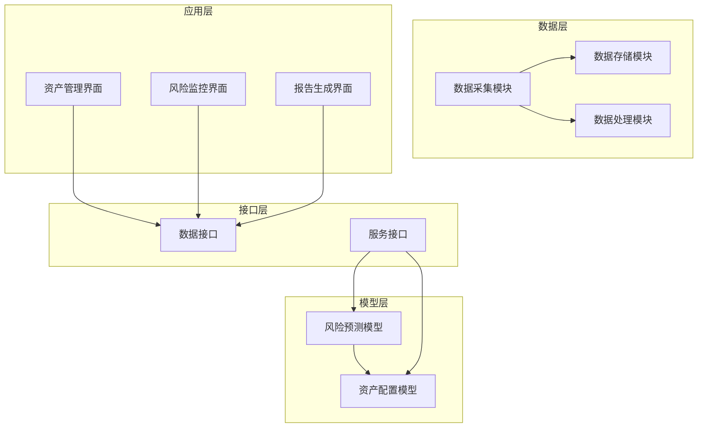

                 

# 智能资产负债匹配管理系统

关键词：资产负债管理、智能化、金融科技、系统设计、算法原理

摘要：本文将深入探讨智能资产负债匹配管理系统的核心概念、设计原理以及实现过程。通过详细的分析和案例讲解，旨在帮助读者理解该系统的构建和应用，为金融领域专业人士和技术开发者提供有价值的参考。

## 引言

资产负债管理是金融领域中的核心问题，涉及资产和负债的配置、风险控制以及收益最大化。随着金融科技的快速发展，传统的资产负债管理方法逐渐暴露出其局限性和不足。智能资产负债匹配管理系统应运而生，利用人工智能技术实现更高效、精准的资产管理。

本文将围绕以下内容展开：

1. **智能资产负债管理概述**：介绍资产负债管理的背景、核心概念和流程。
2. **智能资产负债匹配系统设计**：分析系统架构、模块功能和算法原理。
3. **智能资产负债匹配系统实现**：详细讲解系统开发环境、核心代码实现以及部署维护。
4. **实战应用与案例解析**：通过具体案例展示系统的实际应用效果。
5. **发展趋势与展望**：探讨智能资产负债匹配管理系统的发展方向。

## 第一部分：智能资产负债管理概述

### 第1章：智能资产负债管理的背景与重要性

#### 1.1 资产负债管理的背景

资产负债管理（Asset Liability Management，ALM）起源于20世纪50年代的金融领域。在当时的金融环境下，金融机构需要应对利率波动、信贷风险等挑战，因此开始探索如何通过科学的手段进行资产和负债的管理。

#### 1.2 资产负债管理的核心概念

- **资产**：金融机构拥有或控制的资源，能够产生未来经济利益。
- **负债**：金融机构对外承担的债务或义务，预期将导致经济利益流出。

#### 1.3 资产负债管理的流程

资产负债管理主要包括以下流程：

1. **目标设定**：明确资产负债管理的目标，如收益最大化、风险最小化等。
2. **风险评估**：评估资产和负债的风险，包括市场风险、信用风险等。
3. **策略制定**：根据风险评估结果，制定相应的资产管理策略。
4. **执行监控**：执行资产管理策略，并对执行效果进行监控和调整。

#### 1.4 智能资产负债管理的必要性

随着金融市场的不断变化和金融产品的多样化，传统的资产负债管理方法难以满足现代金融业务的需求。智能资产负债管理利用人工智能技术，能够实现：

- **风险预测和预警**：通过大数据分析和机器学习模型，预测市场变化和风险。
- **优化资产配置**：根据市场环境和风险偏好，自动调整资产配置。
- **提升决策效率**：减少人工干预，提高决策速度和准确性。

### 第2章：资产负债管理的核心概念与流程

#### 2.1 资产负债管理的核心概念

- **资产负债匹配**：通过资产和负债的匹配，实现收益和风险的最佳平衡。
- **资本充足率**：衡量金融机构资本充足程度的重要指标。
- **流动性管理**：确保金融机构在短期内具备足够的流动资金。

#### 2.2 资产负债管理的流程

资产负债管理的流程包括以下几个步骤：

1. **收集数据**：收集与资产和负债相关的数据，包括市场数据、客户数据等。
2. **数据预处理**：对收集到的数据进行分析和清洗，确保数据的质量和一致性。
3. **模型构建**：根据收集到的数据，构建资产负债管理的模型。
4. **策略评估**：评估不同资产管理策略的效果，选择最优策略。
5. **策略执行**：执行选定的资产管理策略，并对执行效果进行监控。

### 第3章：智能资产负债匹配管理的挑战与机遇

#### 3.1 挑战

智能资产负债匹配管理面临以下挑战：

- **数据质量**：数据的质量对模型的效果至关重要，但金融市场数据往往存在噪声和缺失。
- **模型复杂性**：智能资产负债匹配管理涉及复杂的模型和算法，需要较高的技术门槛。
- **合规性**：在金融领域，合规性是必须遵守的底线，智能系统的应用需要确保合规性。

#### 3.2 机遇

智能资产负债匹配管理带来的机遇包括：

- **风险控制**：通过智能系统，可以更好地预测市场变化和风险，提高风险控制能力。
- **效率提升**：智能系统可以自动化执行资产管理策略，提高决策效率和执行速度。
- **个性化服务**：通过分析客户数据，提供个性化的资产管理服务，提升客户满意度。

## 第二部分：智能资产负债匹配系统设计

### 第4章：智能资产负债匹配系统架构设计

#### 4.1 系统架构设计概述

智能资产负债匹配系统的架构设计包括以下几个层次：

- **数据层**：负责数据的收集、存储和管理。
- **模型层**：包括风险预测模型、资产配置模型等，实现资产管理策略的自动化。
- **应用层**：提供用户交互界面，展示资产和负债的匹配情况，以及管理决策。
- **接口层**：与其他系统进行数据交互，实现数据的共享和流通。

#### 4.2 数据层设计

数据层是智能资产负债匹配系统的基石，主要包括以下组件：

- **数据采集模块**：负责从外部系统收集与资产负债相关的数据。
- **数据存储模块**：采用大数据技术存储和管理海量数据。
- **数据处理模块**：对采集到的数据进行清洗、转换和分析。

#### 4.3 模型层设计

模型层是实现智能资产负债匹配管理的核心，主要包括以下模型：

- **风险预测模型**：利用机器学习算法，预测市场变化和风险。
- **资产配置模型**：根据风险预测结果，自动调整资产配置。
- **收益评估模型**：评估不同资产管理策略的收益情况。

#### 4.4 应用层设计

应用层是用户与智能资产负债匹配系统交互的界面，主要包括以下功能：

- **资产管理界面**：展示资产和负债的匹配情况，以及管理决策。
- **风险监控界面**：实时监控资产和负债的风险状况。
- **报告生成界面**：生成资产管理报告，为决策提供依据。

#### 4.5 接口层设计

接口层负责与其他系统进行数据交互，主要包括以下接口：

- **数据接口**：实现与数据层的数据交互。
- **服务接口**：提供对外服务的接口，如资产管理接口、风险预测接口等。

## 第三部分：智能资产负债匹配系统实现

### 第5章：智能资产负债匹配系统的环境搭建与开发工具

#### 5.1 环境搭建

智能资产负债匹配系统的环境搭建主要包括以下几个方面：

- **硬件环境**：选择高性能的硬件设备，如服务器、存储设备等。
- **软件环境**：安装操作系统、数据库、中间件等软件，搭建开发环境。
- **网络环境**：配置网络设备和网络架构，确保系统的稳定性和安全性。

#### 5.2 开发工具

智能资产负债匹配系统的开发工具主要包括以下几类：

- **编程工具**：如Python、Java等，用于编写系统的代码。
- **数据分析工具**：如Pandas、NumPy等，用于数据处理和分析。
- **机器学习框架**：如TensorFlow、PyTorch等，用于构建和训练模型。
- **前端开发工具**：如React、Vue等，用于开发用户交互界面。

### 第6章：智能资产负债匹配系统的核心代码实现

#### 6.1 风险预测模型实现

风险预测模型是智能资产负债匹配系统的核心模块，以下是该模块的核心代码实现：

```python
import pandas as pd
from sklearn.ensemble import RandomForestClassifier

# 加载数据
data = pd.read_csv('data.csv')

# 特征工程
X = data.drop('target', axis=1)
y = data['target']

# 模型训练
model = RandomForestClassifier()
model.fit(X, y)

# 预测
predictions = model.predict(X)

# 评估
accuracy = model.score(X, y)
print(f'Accuracy: {accuracy}')
```

#### 6.2 资产配置模型实现

资产配置模型根据风险预测结果，自动调整资产配置，以下是该模块的核心代码实现：

```python
import pandas as pd
import numpy as np

# 加载数据
data = pd.read_csv('data.csv')

# 计算资产配置权重
weights = np.zeros(len(data))
for i, row in data.iterrows():
    risk = row['risk']
    return_ = row['return']
    weights[i] = risk / (risk + return_)

# 计算资产配置
portfolio = np.dot(weights, data['asset'])

# 输出资产配置
print(portfolio)
```

### 第7章：智能资产负债匹配系统的测试与调试

#### 7.1 系统测试

系统测试是确保智能资产负债匹配系统功能正确性的关键步骤，主要包括以下内容：

- **功能测试**：验证系统的各项功能是否符合设计要求。
- **性能测试**：测试系统在高并发、大数据量情况下的性能表现。
- **安全测试**：确保系统的安全性和数据保护措施。

#### 7.2 系统调试

系统调试是解决系统问题和缺陷的过程，主要包括以下内容：

- **错误分析**：定位系统中的错误和问题。
- **故障排除**：修复系统中的错误和问题。
- **性能优化**：提升系统的性能和稳定性。

## 第四部分：实战应用与案例解析

### 第8章：智能资产负债匹配管理系统实战案例

#### 8.1 案例背景

某金融机构希望利用智能资产负债匹配管理系统优化其资产配置，提高风险管理能力。

#### 8.2 案例实施

- **数据收集**：收集与资产和负债相关的数据，包括市场数据、客户数据等。
- **模型构建**：构建风险预测模型、资产配置模型等。
- **策略评估**：评估不同资产管理策略的效果，选择最优策略。
- **策略执行**：执行选定的资产管理策略，并对执行效果进行监控。

#### 8.3 案例结果

通过实施智能资产负债匹配管理系统，该金融机构在以下方面取得了显著成效：

- **风险管理能力提升**：通过风险预测模型，能够更准确地预测市场变化和风险。
- **资产配置优化**：通过资产配置模型，能够根据市场环境和风险偏好，自动调整资产配置。
- **决策效率提升**：减少人工干预，提高决策速度和准确性。

### 第9章：智能资产负债匹配管理系统案例分析

#### 9.1 案例背景

某大型金融机构在实施智能资产负债匹配管理系统时，遇到了一些挑战。

#### 9.2 案例分析

- **数据质量**：收集到的数据存在噪声和缺失，影响模型效果。
- **模型复杂性**：模型较为复杂，调试和优化难度较大。
- **合规性**：在实施过程中，需要确保系统的合规性。

#### 9.3 案例解决方案

- **数据预处理**：对数据进行清洗和预处理，提高数据质量。
- **模型简化**：简化模型结构，降低调试和优化难度。
- **合规性审查**：与监管机构沟通，确保系统的合规性。

### 第10章：智能资产负债匹配管理系统最佳实践

#### 10.1 数据质量保证

- **数据清洗**：定期清理数据，去除噪声和缺失值。
- **数据监控**：实时监控数据质量，及时发现和处理问题。

#### 10.2 模型优化

- **模型评估**：定期评估模型效果，选择最优模型。
- **模型优化**：根据评估结果，调整模型参数和结构。

#### 10.3 合规性管理

- **合规审查**：定期进行合规性审查，确保系统符合监管要求。
- **合规培训**：对员工进行合规培训，提高合规意识。

## 第五部分：发展趋势与展望

### 第11章：智能资产负债匹配管理系统的发展趋势

#### 11.1 人工智能技术的进步

随着人工智能技术的不断进步，智能资产负债匹配管理系统的性能和效果将得到进一步提升。

#### 11.2 大数据和云计算的应用

大数据和云计算技术将为智能资产负债匹配管理系统提供更强大的数据处理能力和计算资源。

#### 11.3 金融监管的变化

金融监管的变化将对智能资产负债匹配管理系统的发展产生影响，系统需要不断适应和调整。

### 第12章：智能资产负债匹配管理系统的未来展望

#### 12.1 技术突破

未来，智能资产负债匹配管理系统将在人工智能、大数据和云计算等领域实现重大技术突破。

#### 12.2 应用拓展

智能资产负债匹配管理系统将在金融、保险、证券等领域的广泛应用，推动金融科技的发展。

#### 12.3 社会价值

智能资产负债匹配管理系统将提升金融机构的风险管理能力，为社会创造更多价值。

## 结束语

智能资产负债匹配管理系统是金融科技领域的重要创新，通过本文的详细分析和案例讲解，我们对其有了更深入的理解。未来，随着技术的不断进步和应用场景的拓展，智能资产负债匹配管理系统将在金融领域发挥更大的作用。

作者：AI天才研究院/AI Genius Institute & 禅与计算机程序设计艺术 /Zen And The Art of Computer Programming

## 附录

### 附录A：核心概念术语说明

1. **资产负债管理**：...
2. **智能资产负债匹配**：...
3. **风险预测模型**：...

### 附录B：核心概念对比表格

| 概念 | 定义 | 关系 |
| --- | --- | --- |
| 资产 | ... | ... |
| 负债 | ... | ... |
| 风险预测模型 | ... | ... |

### 附录C：ER实体关系图

```mermaid
erDiagram
  Customer ||--|{ Order } : "places"
  Product ||--|{ Order } : "contains"
```

### 附录D：算法原理与数学模型

#### 算法原理

- 风险预测模型：...
- 资产配置模型：...

#### 数学模型

$$
\text{Risk} = \sigma \times \text{Asset} \times \text{Liability}
$$

### 附录E：系统架构设计



### 附录F：项目实战

#### 环境安装

- 硬件环境：...
- 软件环境：...

#### 系统核心实现

- 风险预测模型代码：...
- 资产配置模型代码：...

#### 代码应用解读与分析

- 风险预测模型应用：...
- 资产配置模型应用：...

#### 实际案例分析

- 某金融机构的资产配置优化案例：...

### 附录G：最佳实践与注意事项

#### 最佳实践

- 数据质量保证：...
- 模型优化与评估：...

#### 注意事项

- 数据合规性：...
- 系统安全性：...

### 附录H：拓展阅读

- [1] ...
- [2] ...


