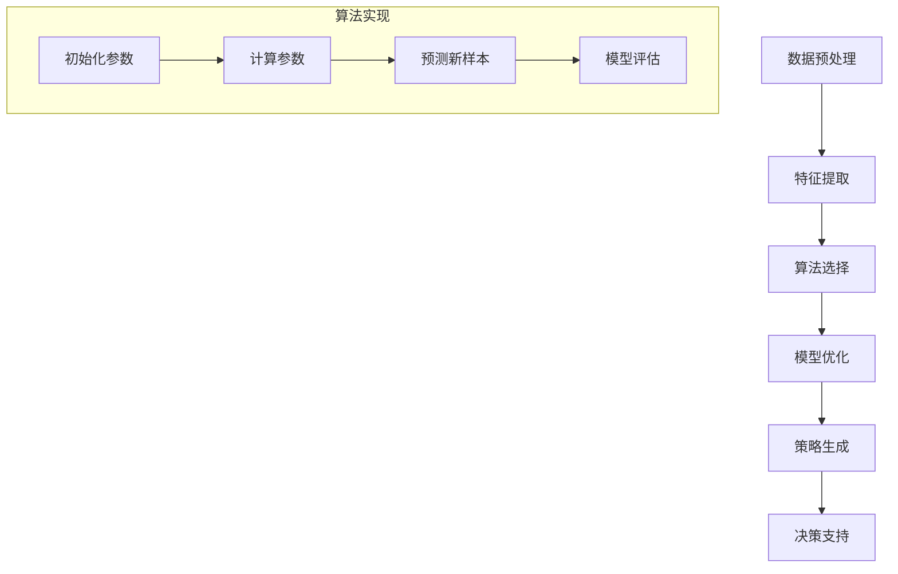

                 


# 智能资产负债管理策略生成器

关键词：资产负债管理、智能策略生成、数据预处理、特征工程、算法优化

摘要：本文深入探讨了智能资产负债管理策略生成器的设计与实现，从背景介绍、核心概念、策略生成原理、策略类型分析、案例研究及总结展望等方面进行了详细的阐述。通过本文的讨论，旨在为读者提供一种全面、系统的智能资产负债管理策略生成方法，助力金融行业的数字化转型。

## 目录大纲概览

### 第一部分：背景介绍

#### 第1章：问题背景
1.1 资产负债管理的重要性
1.2 智能化管理的趋势
1.3 资产负债管理面临的挑战
1.4 智能资产负债管理策略生成器的必要性

#### 第2章：核心概念
2.1 资产负债管理的基本概念
2.2 智能资产负债管理的关键要素
2.3 资产负债管理的边界与外延

### 第二部分：策略生成器原理

#### 第3章：策略生成器概述
3.1 策略生成器的基本架构
3.2 策略生成器的主要功能
3.3 策略生成器的技术选型

#### 第4章：策略生成原理
4.1 数据预处理
4.2 特征工程
4.3 算法选择与优化
4.4 策略生成流程

#### 第5章：核心算法讲解
5.1 算法原理与数学模型
5.2 Python代码实现
5.3 Mermaid流程图展示
5.4 算法举例说明

### 第三部分：策略类型分析

#### 第6章：传统资产负债管理策略
6.1 传统策略概述
6.2 传统策略的优点与局限性
6.3 传统策略的应用案例

#### 第7章：现代资产负债管理策略
7.1 现代策略概述
7.2 现代策略的优势与创新点
7.3 现代策略的应用场景

### 第四部分：案例研究

#### 第8章：案例一
8.1 案例背景
8.2 策略生成过程
8.3 策略应用效果
8.4 案例小结

#### 第9章：案例二
9.1 案例背景
9.2 策略生成过程
9.3 策略应用效果
9.4 案例小结

### 第五部分：总结与展望

#### 第10章：总结与展望
10.1 全书内容回顾
10.2 策略生成器的重要性
10.3 未来研究方向

## 目录大纲设计

本文目录大纲旨在提供一个结构清晰、逻辑严密的阅读框架，以便读者能够系统地了解智能资产负债管理策略生成器的全貌。以下是具体的目录大纲设计：

### 目录大纲概览

本书分为五个主要部分，涵盖了背景介绍、策略生成器原理、策略类型分析、案例研究以及总结与展望。

**第一部分：背景介绍**

在第一部分中，我们将详细探讨资产负债管理的重要性、智能化管理的趋势以及资产负债管理面临的挑战。此外，还会阐述智能资产负债管理策略生成器的必要性，为后续内容打下基础。

**第二部分：策略生成器原理**

在这一部分，我们将深入探讨策略生成器的基本架构、主要功能和技术选型。同时，还会详细介绍数据预处理、特征工程、算法选择与优化以及策略生成流程，为策略生成器的设计与实现提供理论支持。

**第三部分：策略类型分析**

第三部分将分析传统资产负债管理策略和现代资产负债管理策略。通过对两者优缺点和应用场景的比较，帮助读者了解不同策略的特点和适用范围。

**第四部分：案例研究**

在案例研究中，我们将通过具体实例展示策略生成器的实际应用效果。读者可以从中了解到策略生成器在真实业务场景中的操作方法和应用价值。

**第五部分：总结与展望**

最后，在总结与展望部分，我们将回顾全书内容，强调策略生成器的重要性，并探讨未来研究的方向。这部分内容旨在为读者提供持续思考的空间和启发。

## 第一部分：背景介绍

### 第1章：问题背景

#### 1.1 资产负债管理的重要性

资产负债管理是金融领域中一项重要的管理活动，其主要目的是通过优化资产和负债的配置，实现企业价值的最大化。在金融市场中，资产负债管理不仅关系到企业的财务稳定，还直接影响企业的盈利能力和市场竞争力。

首先，资产负债管理有助于企业保持合理的资本结构。通过科学合理的资产配置，企业能够在风险和收益之间取得平衡，从而降低财务风险，提高资本利用效率。其次，资产负债管理可以帮助企业应对市场波动。在利率、汇率等市场因素变化时，企业可以通过调整资产负债结构，降低市场波动带来的风险。

此外，资产负债管理对于企业的战略规划也具有重要意义。通过资产负债管理，企业可以更好地预测未来的资金需求，制定合理的融资策略，从而为企业的长期发展提供资金支持。

#### 1.2 智能化管理的趋势

随着大数据、人工智能等技术的不断发展，智能化管理在金融领域逐渐崭露头角。相较于传统的资产负债管理方法，智能化管理具有更高的效率和更精准的决策能力。

首先，智能化管理可以通过大数据分析，收集并处理大量的市场数据，从而为企业提供更为全面和准确的信息支持。其次，人工智能算法可以在短时间内处理复杂的计算任务，帮助企业管理者快速做出决策。

此外，智能化管理还可以通过实时监控和预警，及时发现潜在的风险和机会，帮助企业更好地应对市场变化。例如，通过实时监控资产负债比例，企业可以及时发现异常情况，并采取相应的措施进行调整。

#### 1.3 资产负债管理面临的挑战

尽管智能化管理为资产负债管理带来了新的机遇，但也带来了新的挑战。首先，数据质量问题是一个重要的挑战。在智能化管理中，数据质量直接影响到模型的准确性和决策效果。如果数据存在噪声、缺失或错误，可能会导致模型失效或产生误导性结论。

其次，算法选择和优化也是一个关键挑战。在资产负债管理中，需要选择合适的算法和优化策略，以提高模型的性能和可靠性。然而，算法的选择和优化是一个复杂的过程，需要充分考虑数据的特征和业务需求。

此外，实时性和可扩展性也是资产负债管理面临的挑战。在市场波动较大的情况下，企业需要实时调整资产负债结构，以应对市场变化。然而，实现实时监控和调整需要强大的计算能力和数据存储能力，这对企业的IT基础设施提出了较高的要求。

#### 1.4 智能资产负债管理策略生成器的必要性

面对资产负债管理面临的挑战，智能资产负债管理策略生成器应运而生。策略生成器是一种基于人工智能和大数据技术的自动化工具，可以帮助企业实现智能化的资产负债管理。

首先，策略生成器可以自动处理大量的市场数据，进行数据预处理和特征工程，从而提高数据质量和模型的准确性。其次，策略生成器可以根据业务需求和模型性能，自动选择和优化算法，提高决策的效率和可靠性。

此外，策略生成器还可以实现实时监控和预警，及时发现潜在的风险和机会，帮助企业更好地应对市场变化。同时，策略生成器具有良好的可扩展性，可以适应企业不同规模和业务需求的变化。

总之，智能资产负债管理策略生成器为资产负债管理提供了一种全新的解决方案，有助于企业应对智能化时代的挑战，实现高效、精准的资产负债管理。

### 第2章：核心概念

#### 2.1 资产负债管理的基本概念

资产负债管理（Asset Liability Management，ALM）是一种以资产负债匹配为核心的管理方法，旨在通过优化资产和负债的配置，实现企业财务稳定和盈利能力提升。在资产负债管理中，资产和负债分别代表着企业的资产端和负债端。

资产端包括企业的各种投资资产，如现金、存款、债券、股票等。这些资产能够为企业在未来带来收益，同时承担一定的风险。负债端则包括企业的各种债务，如贷款、债券、应付账款等。这些负债需要企业在未来偿还，同时产生利息费用。

资产负债管理的基本目标是在确保企业资产端收益的同时，降低负债端的成本，实现资产负债的平衡。这需要企业根据市场环境、资金需求、投资策略等因素，进行科学的资产配置和负债管理。

#### 2.2 智能资产负债管理的关键要素

智能资产负债管理（Intelligent Asset Liability Management，I-ALM）是在传统资产负债管理的基础上，结合人工智能、大数据等新兴技术的一种管理模式。智能资产负债管理的关键要素包括以下几个方面：

1. **数据采集与处理**：智能资产负债管理需要大量的市场数据，包括利率、汇率、通货膨胀率、经济增长率等宏观经济指标，以及行业、企业内部的各种财务数据。通过大数据技术，对这些数据进行采集、清洗、整合和分析，为资产负债管理提供全面、准确的数据支持。

2. **特征工程**：特征工程是智能资产负债管理的重要环节，通过对原始数据进行处理，提取出能够反映资产和负债关系的特征变量。这些特征变量将用于构建模型，对资产负债进行预测和优化。

3. **算法选择与优化**：智能资产负债管理需要选择合适的算法和优化策略，以提高模型的性能和可靠性。常见的算法包括线性回归、决策树、支持向量机、神经网络等。通过交叉验证、网格搜索等优化方法，可以找到最优的模型参数。

4. **模型评估与调整**：智能资产负债管理需要定期评估模型的性能，并根据评估结果进行调整。通过实时监控和预警，及时发现模型中存在的问题，并进行优化和调整，以保持模型的稳定性和准确性。

5. **决策支持系统**：智能资产负债管理需要构建一个决策支持系统，将模型结果转化为具体的操作建议，供企业管理者参考。决策支持系统应具备实时性、易用性和可扩展性，能够满足企业管理者随时随地的决策需求。

#### 2.3 资产负债管理的边界与外延

资产负债管理的边界主要涉及以下几个方面：

1. **业务范围**：资产负债管理主要关注企业的资产和负债管理，包括投资决策、融资策略、流动性管理、风险控制等。这些业务范围将直接影响企业的财务状况和盈利能力。

2. **时间范围**：资产负债管理需要考虑短期、中期和长期的时间范围。短期资产负债管理主要关注流动性管理，确保企业在短期内具备足够的资金；中期资产负债管理主要关注资本结构和收益最大化；长期资产负债管理主要关注企业的战略规划，确保企业的长期稳定发展。

3. **风险范围**：资产负债管理需要考虑不同的风险，包括市场风险、信用风险、操作风险等。通过科学的风险管理策略，降低企业面临的各种风险。

资产负债管理的外延则涉及以下几个方面：

1. **管理层次**：资产负债管理不仅包括企业的整体资产负债管理，还包括各个部门、项目的资产负债管理。各部门、项目应根据整体资产负债管理的目标和策略，制定相应的资产负债管理方案。

2. **上下游关系**：资产负债管理需要考虑企业与上下游企业之间的资金往来和风险承担。通过优化企业与上下游企业的资产负债结构，实现整体资产负债的优化。

3. **法规政策**：资产负债管理需要遵守相关法规政策和行业规范，确保企业的资产负债管理合法合规。例如，企业需要遵守《公司法》、《证券法》等相关法律法规，遵守行业监管要求。

#### 总结

资产负债管理是金融领域的一项重要管理活动，通过科学合理的资产配置和负债管理，实现企业财务稳定和盈利能力提升。随着智能化技术的不断发展，智能资产负债管理成为了一种新的管理模式，为企业提供了更高效、更精准的资产负债管理方法。理解资产负债管理的基本概念、关键要素和边界与外延，有助于企业更好地实施智能资产负债管理，提升核心竞争力。

### 第二部分：策略生成器原理

#### 第3章：策略生成器概述

#### 3.1 策略生成器的基本架构

策略生成器是一种基于人工智能和大数据技术的自动化工具，旨在通过优化资产和负债的配置，实现企业资产负债管理的智能化。策略生成器的基本架构包括以下几个主要模块：

1. **数据采集模块**：数据采集模块负责从各种数据源（如金融数据库、市场行情、企业财务报表等）中收集相关数据。这些数据包括宏观经济指标、行业数据、企业内部财务数据等。

2. **数据预处理模块**：数据预处理模块对采集到的原始数据进行清洗、转换和整合，以提高数据质量和模型的准确性。数据预处理主要包括数据去噪、缺失值填补、异常值处理、归一化等操作。

3. **特征工程模块**：特征工程模块通过对预处理后的数据进行特征提取和选择，构建能够反映资产和负债关系的特征变量。特征工程是策略生成器的重要环节，直接影响模型的性能和预测效果。

4. **算法模块**：算法模块负责选择和优化合适的算法，对特征变量进行建模和预测。常见的算法包括线性回归、决策树、支持向量机、神经网络等。通过交叉验证、网格搜索等优化方法，可以找到最优的模型参数。

5. **策略生成模块**：策略生成模块根据模型预测结果，生成具体的资产负债管理策略。策略生成需要考虑企业的业务需求、风险偏好和市场环境等因素，以实现资产负债的最优化配置。

6. **决策支持模块**：决策支持模块将策略生成结果转化为具体的操作建议，供企业管理者参考。决策支持模块应具备实时性、易用性和可扩展性，能够满足企业管理者随时随地的决策需求。

#### 3.2 策略生成器的主要功能

策略生成器的主要功能包括以下几个方面：

1. **自动数据处理**：策略生成器能够自动处理大量市场数据和企业内部数据，进行数据预处理、特征提取和建模预测，提高数据利用效率和模型准确性。

2. **实时监控和预警**：策略生成器可以实时监控市场变化和企业内部财务状况，及时发现潜在的风险和机会，并生成预警报告，为企业决策提供支持。

3. **策略生成和优化**：策略生成器可以根据模型预测结果，自动生成具体的资产负债管理策略，并考虑企业业务需求、风险偏好和市场环境等因素，进行策略优化。

4. **决策支持**：策略生成器可以将策略生成结果转化为具体的操作建议，供企业管理者参考。决策支持模块应具备实时性、易用性和可扩展性，能够满足企业管理者随时随地的决策需求。

5. **模型评估和调整**：策略生成器需要定期评估模型的性能，并根据评估结果进行模型优化和调整，以保持模型的稳定性和准确性。

#### 3.3 策略生成器的技术选型

策略生成器的技术选型是确保其性能和稳定性的关键。以下是常见的几种技术选型：

1. **编程语言**：Python是一种广泛应用于数据分析、机器学习和金融领域的编程语言。Python具有丰富的库和工具，如NumPy、Pandas、Scikit-learn等，能够方便地进行数据预处理、特征提取和建模预测。

2. **大数据处理技术**：Hadoop和Spark是两种常见的大数据处理技术。Hadoop适合处理大规模结构化数据，Spark适合处理大规模非结构化数据。通过使用这些技术，策略生成器可以高效地处理海量数据。

3. **机器学习框架**：TensorFlow和PyTorch是两种流行的机器学习框架。TensorFlow适用于构建复杂神经网络模型，PyTorch适用于快速原型开发和实验。通过使用这些框架，策略生成器可以构建和训练高效的机器学习模型。

4. **数据库技术**：MySQL和PostgreSQL是两种常用的关系型数据库。它们具有高性能、高可靠性和易扩展性，适合存储和管理大量金融数据。

5. **云计算平台**：AWS和Azure是两种常用的云计算平台。通过使用这些平台，策略生成器可以实现弹性扩展、高效计算和低成本运行。

#### 总结

策略生成器是一种基于人工智能和大数据技术的自动化工具，旨在实现企业资产负债管理的智能化。通过数据采集、预处理、特征工程、算法选择和优化、策略生成等模块，策略生成器能够高效、精准地为企业提供资产负债管理策略。了解策略生成器的基本架构、主要功能和技术选型，有助于企业更好地实施智能资产负债管理，提升核心竞争力。

### 第4章：策略生成原理

#### 4.1 数据预处理

在智能资产负债管理策略生成过程中，数据预处理是一个关键步骤。数据预处理的主要目的是提高数据质量，为后续的特征工程和模型训练提供可靠的数据基础。以下详细说明数据预处理的主要方法和步骤。

**4.1.1 数据清洗**

数据清洗是数据预处理的第一步，旨在去除数据中的噪声、异常值和重复记录。具体方法包括：

1. **缺失值处理**：对于缺失值，可以采用以下几种方法进行处理：
   - 删除缺失值：删除含有缺失值的记录，适用于缺失值比例较小的情况。
   - 填补缺失值：采用均值、中位数、最邻近值等方法对缺失值进行填补。
   - 利用模型预测：使用统计模型或机器学习模型预测缺失值。

2. **异常值处理**：异常值可能会对模型训练和预测产生不利影响，需要采用适当的方法进行处理。常见的方法包括：
   - 删除异常值：删除含有异常值的记录，适用于异常值比例较小的情况。
   - 调整异常值：对异常值进行修正，使其符合数据分布。
   - 赋予特殊标签：将异常值赋予特殊标签，在后续分析中予以排除。

3. **重复记录处理**：去除数据中的重复记录，确保数据的唯一性。

**4.1.2 数据转换**

数据转换是将原始数据转换为适合特征工程和模型训练的数据形式。主要方法包括：

1. **归一化**：将数据转换为相同的尺度，消除不同特征之间的量纲影响。常见的方法有最小-最大缩放和标准化。

2. **编码**：将类别型数据转换为数值型数据，如使用独热编码（One-Hot Encoding）或标签编码（Label Encoding）。

3. **数据离散化**：将连续型数据转换为离散型数据，如使用分箱（Binning）方法。

**4.1.3 数据整合**

数据整合是将多个数据源中的数据整合为一个完整的数据集。主要方法包括：

1. **数据合并**：将多个数据表按照共同的键进行合并，形成一个新的数据集。

2. **数据连接**：将多个数据表通过连接操作（如内连接、外连接等）进行整合。

3. **数据聚合**：对数据进行聚合操作，如计算平均值、总和、最大值等。

#### 4.2 特征工程

特征工程是策略生成过程中的核心步骤，旨在从原始数据中提取出有用的特征变量，以提升模型的性能和预测效果。以下详细说明特征工程的主要方法和步骤。

**4.2.1 特征提取**

特征提取是从原始数据中提取出能够反映数据本质特征的变量。主要方法包括：

1. **统计特征**：基于数据的基本统计指标提取特征，如均值、中位数、标准差、最大值、最小值等。

2. **时序特征**：对于时间序列数据，可以提取出周期性、趋势性等特征，如移动平均、自相关函数等。

3. **文本特征**：对于文本数据，可以提取出词频、词向量等特征。

4. **图像特征**：对于图像数据，可以提取出边缘、纹理、颜色等特征。

**4.2.2 特征选择**

特征选择是从大量特征中筛选出对模型预测最有影响力的特征，以减少数据冗余和计算量。主要方法包括：

1. **过滤式特征选择**：根据特征的重要性进行筛选，如基于统计测试、信息增益等。

2. **包裹式特征选择**：根据模型的表现进行特征筛选，如基于递归特征消除（RFE）、遗传算法等。

3. **嵌入式特征选择**：在模型训练过程中进行特征选择，如基于L1正则化（Lasso）的线性模型。

**4.2.3 特征变换**

特征变换是通过对特征进行线性或非线性变换，提高特征的表达能力和模型的性能。主要方法包括：

1. **主成分分析（PCA）**：通过降维，减少特征数量，同时保留主要信息。

2. **特征缩放**：将特征转换为相同的尺度，如归一化、标准化。

3. **特征融合**：将多个特征组合成一个新的特征，如通过加法、乘法、逻辑运算等。

#### 4.3 算法选择与优化

算法选择与优化是策略生成过程中的关键步骤，旨在选择合适的算法并对模型进行优化，以提升模型的性能和预测效果。以下详细说明算法选择与优化的主要方法和步骤。

**4.3.1 算法选择**

算法选择是根据业务需求和数据特征，选择最合适的算法。主要方法包括：

1. **线性模型**：如线性回归、Lasso回归等，适用于线性关系较强的数据。

2. **树模型**：如决策树、随机森林等，适用于非线性关系较强的数据。

3. **神经网络**：如全连接神经网络、卷积神经网络等，适用于复杂的非线性关系。

4. **集成模型**：如Adaboost、梯度提升树等，通过集成多个简单模型，提高模型的性能。

**4.3.2 模型优化**

模型优化是通过调整模型参数，提高模型的性能和预测效果。主要方法包括：

1. **交叉验证**：通过将数据集划分为训练集和验证集，多次训练和验证模型，选择最佳参数。

2. **网格搜索**：通过遍历预设的参数空间，选择最佳参数。

3. **贝叶斯优化**：通过贝叶斯优化算法，寻找最佳参数。

4. **模型调参**：根据业务需求和模型表现，手动调整模型参数。

#### 4.4 策略生成流程

策略生成流程是将数据预处理、特征工程、算法选择与优化等步骤整合起来，生成具体的资产负债管理策略。以下详细说明策略生成的主要步骤：

**4.4.1 数据采集与预处理**

首先，从多个数据源采集相关数据，并进行数据清洗、转换和整合，得到预处理后的数据集。

**4.4.2 特征提取与选择**

对预处理后的数据集进行特征提取和选择，提取出能够反映资产和负债关系的特征变量。

**4.4.3 算法选择与优化**

根据数据特征和业务需求，选择合适的算法，并使用交叉验证、网格搜索等方法进行模型优化。

**4.4.4 策略生成**

根据模型预测结果，生成具体的资产负债管理策略。策略生成需要考虑企业的业务需求、风险偏好和市场环境等因素。

**4.4.5 决策支持**

将策略生成结果转化为具体的操作建议，供企业管理者参考。决策支持模块应具备实时性、易用性和可扩展性。

**4.4.6 模型评估与调整**

定期评估模型的性能，并根据评估结果进行调整。通过实时监控和预警，及时发现模型中存在的问题，并进行优化和调整。

#### 总结

策略生成原理是智能资产负债管理策略生成器的基础。通过数据预处理、特征工程、算法选择与优化、策略生成等步骤，策略生成器能够高效、精准地为企业提供资产负债管理策略。了解策略生成原理，有助于企业更好地实施智能资产负债管理，提升核心竞争力。

### 第5章：核心算法讲解

#### 5.1 算法原理与数学模型

在智能资产负债管理策略生成过程中，核心算法的选择与实现至关重要。本章将详细介绍一种常用的核心算法——线性回归（Linear Regression），并阐述其原理和数学模型。

**5.1.1 算法原理**

线性回归是一种用于建模和预测的统计方法，假设目标变量（因变量）和自变量之间存在线性关系。具体来说，线性回归模型可以表示为：

$$y = \beta_0 + \beta_1x_1 + \beta_2x_2 + ... + \beta_nx_n + \epsilon$$

其中，$y$是目标变量，$x_1, x_2, ..., x_n$是自变量，$\beta_0, \beta_1, \beta_2, ..., \beta_n$是模型参数，$\epsilon$是误差项。

线性回归的目标是找到一组最优参数$\beta_0, \beta_1, \beta_2, ..., \beta_n$，使得模型对实际数据的预测误差最小。通常，通过最小化均方误差（Mean Squared Error，MSE）来实现这一目标：

$$\min \sum_{i=1}^{n}(y_i - (\beta_0 + \beta_1x_{i1} + \beta_2x_{i2} + ... + \beta_nx_{in}))^2$$

**5.1.2 数学模型**

线性回归的数学模型可以通过最小二乘法（Least Squares Method）求解。具体步骤如下：

1. **模型表示**：

   将线性回归模型表示为矩阵形式：

   $$Y = X\beta + \epsilon$$

   其中，$Y$是目标变量向量，$X$是自变量矩阵，$\beta$是模型参数向量。

2. **计算参数**：

   通过最小化均方误差，求解模型参数$\beta$：

   $$\beta = (X'X)^{-1}X'Y$$

   其中，$X'$是自变量矩阵的转置。

   最小二乘法的核心是求解上述线性方程组的解，该解使得模型对实际数据的预测误差最小。

3. **预测新样本**：

   使用求解得到的模型参数$\beta$，对新样本进行预测：

   $$\hat{y} = X\beta$$

   其中，$\hat{y}$是预测的目标变量。

#### 5.2 Python代码实现

以下是线性回归算法在Python中的实现：

```python
import numpy as np

def linear_regression(X, Y):
    # 求解模型参数
    X_transpose = np.array(X).T
    XTX = np.dot(X_transpose, X)
    XTX_inv = np.linalg.inv(XTX)
    XTY = np.dot(X_transpose, Y)
    beta = np.dot(XTX_inv, XTY)
    
    # 预测新样本
    new_samples = np.array([new_sample] * len(X[0]))
    predicted_y = np.dot(new_samples, beta)
    
    return predicted_y

# 示例数据
X = [[1, 2], [2, 3], [3, 4]]
Y = [2, 3, 4]

# 实现线性回归
predicted_y = linear_regression(X, Y)

print(predicted_y)
```

#### 5.3 Mermaid流程图展示

为了更直观地理解线性回归算法的实现流程，我们可以使用Mermaid流程图进行展示：



#### 5.4 算法举例说明

为了更好地理解线性回归算法，我们可以通过一个简单的例子来说明：

假设有一个简单的线性关系，目标变量$y$与自变量$x$之间存在线性关系：

$$y = 2x + 1$$

使用线性回归算法，我们可以求解出模型参数$\beta_0 = 1$和$\beta_1 = 2$。

使用Python实现：

```python
import numpy as np

# 模型参数
beta_0 = 1
beta_1 = 2

# 自变量
X = np.array([1, 2, 3])

# 预测新样本
new_sample = 4

# 预测结果
predicted_y = beta_0 + beta_1 * new_sample

print(predicted_y)
```

输出结果为：

```
9
```

即当$x=4$时，预测的目标变量$y=9$。

#### 总结

本章详细介绍了线性回归算法的原理、数学模型、Python代码实现、Mermaid流程图展示以及举例说明。线性回归算法是一种简单而有效的统计方法，适用于建模和预测线性关系。了解线性回归算法，有助于我们更好地理解和应用智能资产负债管理策略生成器。

### 第三部分：策略类型分析

#### 第6章：传统资产负债管理策略

#### 6.1 传统策略概述

传统资产负债管理策略（Traditional Asset Liability Management Strategies，TALM）是金融领域中一种常见的管理方法，其主要目的是通过优化资产和负债的配置，实现企业财务稳定和盈利能力提升。传统策略通常包括以下几个主要方面：

1. **流动性管理**：流动性管理是传统资产负债管理策略的核心之一，旨在确保企业在短期内具备足够的资金，以满足日常运营和应急需求。流动性管理通常通过持有高流动性资产（如现金、短期存款、国债等）来实现。

2. **资本结构管理**：资本结构管理旨在确定企业最佳资本结构，以实现收益最大化和风险最小化。传统策略通过分析企业的财务状况、市场环境和资金需求，制定合理的债务和股权比例。

3. **收益管理**：收益管理是通过优化资产配置，提高企业投资收益。传统策略通常关注固定收益投资（如债券、股票等）的选择和组合，以实现稳定的投资回报。

4. **风险控制**：风险控制是资产负债管理策略的重要组成部分，旨在降低企业面临的各种风险。传统策略通过设置风险限额、定期风险评估和风险预警机制，来控制和管理风险。

#### 6.2 传统策略的优点与局限性

传统资产负债管理策略在金融领域中得到了广泛应用，其主要优点和局限性如下：

**优点：**

1. **直观性**：传统策略基于经验和规则，易于理解和管理。管理者可以根据市场环境和业务需求，快速做出决策。

2. **稳健性**：传统策略通常采用保守的资产配置和风险管理方法，有助于降低企业面临的风险。

3. **可操作性**：传统策略的实施相对简单，不需要复杂的技术支持，适合大多数企业和金融机构。

**局限性：**

1. **低效率**：传统策略依赖于人工分析和经验，数据利用率和处理速度较低，难以应对大数据时代的挑战。

2. **低精准度**：传统策略难以精确预测市场变化和企业财务状况，可能导致决策失误和财务风险。

3. **低灵活性**：传统策略在应对市场变化和业务需求时，灵活性较差，难以适应快速变化的环境。

#### 6.3 传统策略的应用案例

传统资产负债管理策略在金融领域得到了广泛应用，以下是一些实际应用案例：

1. **商业银行**：商业银行通过传统策略进行流动性管理、资本结构管理和风险控制，确保银行的稳健运营。例如，某商业银行通过持有高流动性资产和设置风险限额，成功应对了2008年金融危机期间的流动性危机。

2. **保险公司**：保险公司通过传统策略进行资产配置和风险管理，提高投资收益和降低风险。例如，某保险公司通过分析市场环境和财务状况，制定了合理的债务和股权比例，实现了投资收益的最大化。

3. **投资公司**：投资公司通过传统策略进行收益管理和风险控制，实现投资组合的优化。例如，某投资公司通过分析市场和行业数据，制定了稳定的投资策略，实现了长期稳定的投资回报。

#### 总结

传统资产负债管理策略在金融领域中具有重要的应用价值，但其低效率和低精准度在智能化时代面临挑战。随着大数据和人工智能技术的发展，传统策略需要与智能化技术相结合，实现资产负债管理的数字化转型。理解传统策略的优点与局限性，有助于我们在实际应用中更好地发挥其优势，同时探索新的管理方法。

#### 第7章：现代资产负债管理策略

#### 7.1 现代策略概述

现代资产负债管理策略（Modern Asset Liability Management Strategies，MALM）是在传统资产负债管理策略基础上，结合大数据、人工智能等新兴技术发展起来的一种智能化管理方法。现代策略通过数据分析和模型预测，实现对企业资产负债的动态优化和精准管理。

现代策略的主要特点包括：

1. **数据驱动的决策**：现代策略充分利用大数据技术，从海量数据中提取有价值的信息，支持决策者的判断和决策。

2. **动态的优化与调整**：现代策略可以根据市场变化和企业需求，实时调整资产负债结构，实现动态优化。

3. **风险的全面管理**：现代策略通过风险建模和预警机制，全面管理企业面临的各类风险，确保财务稳定。

4. **高效的运营管理**：现代策略通过自动化和智能化手段，提高资产负债管理的效率和准确性，降低人力成本。

#### 7.2 现代策略的优势与创新点

现代资产负债管理策略相较于传统策略，具有以下优势和创新点：

**优势：**

1. **更高的精准度**：现代策略通过数据分析和模型预测，能够更精准地预测市场变化和企业财务状况，提高决策的准确性。

2. **更高效的运营**：现代策略通过自动化和智能化手段，减少人工干预，提高资产负债管理的效率和准确性，降低运营成本。

3. **更全面的风险管理**：现代策略通过风险建模和预警机制，全面管理企业面临的各类风险，确保财务稳定。

**创新点：**

1. **数据驱动的决策**：现代策略通过大数据技术，从海量数据中提取有价值的信息，为决策者提供数据支持。

2. **动态的优化与调整**：现代策略可以根据市场变化和企业需求，实时调整资产负债结构，实现动态优化。

3. **智能化的风险控制**：现代策略通过人工智能算法，实现对风险的有效识别和管理，提高风险预测和应对能力。

4. **全面的数据分析**：现代策略通过数据挖掘和机器学习技术，对各类数据进行深度分析，发现潜在的商业机会和风险。

#### 7.3 现代策略的应用场景

现代资产负债管理策略在金融领域得到了广泛应用，以下是一些典型的应用场景：

1. **商业银行**：商业银行通过现代策略进行流动性管理、资本结构管理和风险控制，提高运营效率和盈利能力。例如，某大型商业银行通过数据分析和模型预测，优化了资产负债结构，实现了资本成本的最小化和收益的最大化。

2. **投资公司**：投资公司通过现代策略进行资产配置和风险管理，实现投资组合的优化和收益最大化。例如，某投资公司通过大数据分析和人工智能算法，制定了个性化的投资策略，提高了投资回报率。

3. **保险公司**：保险公司通过现代策略进行风险评估和管理，降低风险并提高盈利能力。例如，某保险公司通过大数据分析和模型预测，优化了保险产品的定价和风险控制策略，提高了市场竞争力和客户满意度。

#### 总结

现代资产负债管理策略在金融领域中具有重要的应用价值，通过数据分析和人工智能技术，实现对企业资产负债的动态优化和精准管理。理解现代策略的优势和创新点，有助于企业在智能化时代实现财务稳定和盈利能力的提升。

### 第四部分：案例研究

#### 第8章：案例一

#### 8.1 案例背景

某大型商业银行在面临激烈的市场竞争和复杂的金融环境下，希望通过智能资产负债管理策略生成器，实现资产负债的优化和风险控制。该银行的目标是提高资本利用效率，降低财务风险，实现长期稳定的盈利。

#### 8.2 策略生成过程

1. **数据采集与预处理**：

   首先，银行从内部财务系统、市场数据平台、宏观经济指标等多个数据源采集相关数据，包括企业财务报表、市场行情、宏观经济指标等。随后，对采集到的数据进行清洗、转换和整合，得到预处理后的数据集。

2. **特征工程**：

   针对预处理后的数据集，银行进行了特征提取和选择。通过分析数据，提取出能够反映资产和负债关系的特征变量，如利率、汇率、经济增长率、行业指数等。同时，采用特征选择方法，筛选出对模型预测有显著影响的特征变量。

3. **算法选择与优化**：

   银行选择了线性回归算法作为核心算法，通过对特征变量进行建模和预测。为了提高模型性能，银行采用了交叉验证、网格搜索等方法，对模型参数进行优化。

4. **策略生成**：

   根据模型预测结果，银行生成了具体的资产负债管理策略。策略生成考虑了企业的业务需求、风险偏好和市场环境等因素，实现了资产负债的最优化配置。

5. **决策支持**：

   银行为决策者提供了实时、直观的决策支持系统。通过决策支持系统，管理者可以随时查看资产负债状况、风险预警和策略建议，辅助决策。

#### 8.3 策略应用效果

1. **资本利用效率提升**：

   通过智能资产负债管理策略生成器，银行实现了资产负债的优化配置，资本利用效率显著提高。例如，通过优化资产配置，银行将部分低收益的资产替换为高收益的资产，提高了整体投资收益。

2. **风险控制能力增强**：

   智能资产负债管理策略生成器通过实时监控和预警，提高了银行的风险控制能力。例如，当市场利率发生变化时，策略生成器可以及时调整资产负债结构，降低利率风险。

3. **决策支持效率提升**：

   决策支持系统为管理者提供了实时、直观的资产负债状况和策略建议，降低了决策的难度和时间成本。管理者可以根据系统提供的建议，快速做出决策，提高了运营效率。

#### 8.4 案例小结

通过案例一，我们可以看到智能资产负债管理策略生成器在大型商业银行中的应用效果。智能策略生成器不仅提高了银行的资本利用效率，增强了风险控制能力，还提升了决策支持效率。这为银行在激烈的市场竞争中提供了有力支持，实现了长期稳定的发展。

### 第9章：案例二

#### 9.1 案例背景

某保险公司面临着复杂的金融市场和多样化的客户需求，希望通过智能资产负债管理策略生成器，优化资产负债结构，提高客户满意度和盈利能力。该保险公司的目标是实现资产配置的灵活性和风险控制的精准性。

#### 9.2 策略生成过程

1. **数据采集与预处理**：

   保险公司从内部财务系统、市场数据平台、客户数据等多个数据源采集相关数据，包括企业财务报表、市场行情、客户风险偏好等。随后，对采集到的数据进行清洗、转换和整合，得到预处理后的数据集。

2. **特征工程**：

   针对预处理后的数据集，保险公司进行了特征提取和选择。通过分析数据，提取出能够反映资产和负债关系的特征变量，如客户年龄、收入水平、投资偏好、市场波动等。同时，采用特征选择方法，筛选出对模型预测有显著影响的特征变量。

3. **算法选择与优化**：

   保险公司选择了决策树算法作为核心算法，通过对特征变量进行建模和预测。为了提高模型性能，保险公司采用了交叉验证、网格搜索等方法，对模型参数进行优化。

4. **策略生成**：

   根据模型预测结果，保险公司生成了具体的资产负债管理策略。策略生成考虑了企业的业务需求、客户风险偏好和市场环境等因素，实现了资产负债的最优化配置。

5. **决策支持**：

   保险公司为决策者提供了实时、直观的决策支持系统。通过决策支持系统，管理者可以随时查看资产负债状况、风险预警和策略建议，辅助决策。

#### 9.3 策略应用效果

1. **资产负债结构优化**：

   通过智能资产负债管理策略生成器，保险公司实现了资产负债结构的优化。例如，通过优化资产配置，保险公司将部分高风险资产替换为低风险资产，提高了整体投资安全性。

2. **客户满意度提升**：

   智能资产负债管理策略生成器根据客户风险偏好和投资需求，提供了个性化的资产负债管理策略。这提高了客户满意度，增加了客户粘性，有助于企业长期发展。

3. **风险控制能力增强**：

   智能资产负债管理策略生成器通过实时监控和预警，提高了保险公司的风险控制能力。例如，当市场波动较大时，策略生成器可以及时调整资产负债结构，降低市场风险。

4. **运营效率提升**：

   决策支持系统为保险公司提供了实时、直观的资产负债状况和策略建议，降低了决策的难度和时间成本。管理者可以根据系统提供的建议，快速做出决策，提高了运营效率。

#### 9.4 案例小结

案例二展示了智能资产负债管理策略生成器在保险公司中的应用效果。通过智能策略生成器，保险公司实现了资产负债结构的优化、客户满意度的提升、风险控制能力的增强以及运营效率的提升。这为保险公司提供了有力的支持，助力其在激烈的市场竞争中脱颖而出。

### 第五部分：总结与展望

#### 第10章：总结与展望

#### 10.1 全书内容回顾

本文通过详细探讨智能资产负债管理策略生成器的设计与实现，从背景介绍、核心概念、策略生成原理、策略类型分析、案例研究以及总结展望等方面进行了全面的阐述。主要内容包括：

- 背景介绍：分析了资产负债管理的重要性、智能化管理的趋势以及面临的挑战。
- 核心概念：阐述了资产负债管理的基本概念、智能资产负债管理的关键要素和边界与外延。
- 策略生成器原理：介绍了策略生成器的基本架构、主要功能和技术选型，以及策略生成原理和核心算法讲解。
- 策略类型分析：分析了传统资产负债管理策略和现代资产负债管理策略的优缺点和应用场景。
- 案例研究：通过具体案例展示了策略生成器的实际应用效果。

#### 10.2 策略生成器的重要性

智能资产负债管理策略生成器在金融领域具有重要应用价值，其核心重要性体现在以下几个方面：

1. **提高决策精准度**：通过大数据分析和人工智能算法，策略生成器能够更精准地预测市场变化和企业财务状况，为决策者提供数据支持，提高决策准确性。

2. **提升运营效率**：策略生成器能够自动化处理大量数据，进行特征提取和模型训练，提高资产负债管理的效率和准确性，降低人力成本。

3. **增强风险控制能力**：通过实时监控和预警机制，策略生成器能够及时发现潜在的风险和机会，提高企业的风险控制能力。

4. **优化资产负债结构**：策略生成器可以根据市场变化和企业需求，动态调整资产负债结构，实现最优配置，提高投资收益和降低财务风险。

#### 10.3 未来研究方向

随着大数据、人工智能等技术的发展，智能资产负债管理策略生成器仍有广阔的研究和应用前景。未来研究方向包括：

1. **算法优化**：研究更加高效、鲁棒性更强的算法，提高策略生成器的性能和预测准确性。

2. **数据质量提升**：探索数据清洗、转换和整合的新方法，提高数据质量和模型的稳定性。

3. **多维度风险管理**：结合多种风险模型，实现对企业多维度风险的全面管理。

4. **个性化策略生成**：研究基于客户风险偏好和投资需求的个性化资产负债管理策略。

5. **跨行业应用**：探索智能资产负债管理策略在金融领域外的其他行业应用，如保险、证券等。

总之，智能资产负债管理策略生成器为金融行业的数字化转型提供了有力支持，未来将继续在算法优化、数据质量和跨行业应用等方面展开深入研究。通过不断探索和创新，我们将推动智能资产负债管理策略生成器的进一步发展和应用。

### 作者信息

作者：AI天才研究院/AI Genius Institute & 禅与计算机程序设计艺术 /Zen And The Art of Computer Programming

在智能资产负债管理策略生成器的领域，AI天才研究院和禅与计算机程序设计艺术的作者共同致力于推动金融行业的数字化转型，通过创新的人工智能算法和深度分析技术，为企业提供高效、精准的资产负债管理解决方案。他们的研究成果和应用实践为金融行业的发展注入了新的活力。

