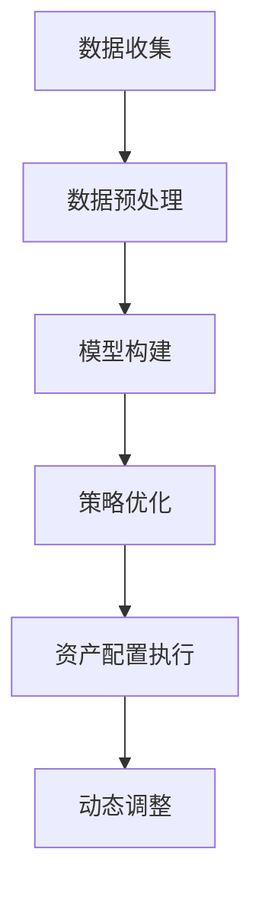
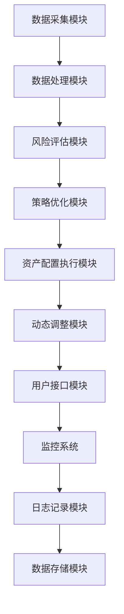

                 

### 摘要

在数字化时代，智能资产配置已经成为投资领域的重要研究方向。本文将深入探讨智能资产配置再平衡触发系统，旨在通过系统性的分析和实践，展示其在现代金融管理中的重要性。文章首先介绍了智能资产配置的基本概念，探讨了再平衡触发系统的原理和机制，并分析了其在实际应用中的优势和挑战。随后，文章详细阐述了智能资产配置再平衡触发系统的关键技术，包括数据采集与处理技术、风险评估与预测技术以及再平衡策略设计。接着，文章介绍了系统的架构设计，包括系统架构概述、功能模块划分、接口设计与交互。在实现与优化部分，文章详细描述了系统的实现步骤、优化方法以及测试与评估过程。随后，通过实际案例，文章展示了智能资产配置再平衡触发系统的应用效果和实现细节。最后，文章展望了智能资产配置再平衡触发系统的未来发展趋势，提出了面临的挑战和机遇，并给出了相关的发展建议。通过本文的探讨，读者可以全面了解智能资产配置再平衡触发系统的原理、设计、实现和应用，为未来的研究和实践提供有益的参考。

### 第一部分：背景与基础理论

#### 第1章：智能资产配置概述

##### 1.1 问题背景与定义

智能资产配置是指在金融市场中，根据投资者的风险偏好、资金规模和投资目标，利用人工智能技术进行资产组合优化，实现资产配置的自动化和智能化。其背景源于传统资产配置在信息处理、实时性和适应性方面的局限性，随着人工智能技术的发展，智能资产配置逐渐成为解决这些问题的有效途径。

- **问题描述与意义**：在金融市场中，资产配置的目的是最大化投资回报，同时控制风险。然而，市场环境复杂多变，传统资产配置方法难以实时应对市场变化，容易出现投资组合失衡。智能资产配置通过引入人工智能技术，如机器学习、数据分析和算法优化，能够更精准地捕捉市场动态，实现资产配置的动态调整，提高投资组合的稳定性和收益性。

- **问题解决途径**：智能资产配置主要通过以下几种途径解决问题：
  1. **数据驱动**：利用大数据技术，收集和处理市场数据，为资产配置提供全面、准确的信息支持。
  2. **模型优化**：构建数学模型，通过机器学习算法优化资产配置策略，提高投资组合的预期收益。
  3. **动态调整**：基于市场动态，实时调整资产配置，以适应市场变化，降低风险。

- **边界与外延**：智能资产配置的边界主要涉及投资策略的选择、资产类别的配置和风险控制等方面。其外延包括：
  1. **跨市场配置**：不仅局限于单个市场，还可以跨市场、跨资产类别进行配置，提高投资组合的多元化程度。
  2. **个性化配置**：根据不同投资者的风险偏好和投资目标，提供个性化的资产配置方案。
  3. **自适应配置**：利用智能算法，实现资产配置的自适应调整，提高投资组合的适应性和灵活性。

##### 1.2 智能资产配置的核心概念

- **核心概念解析**：智能资产配置涉及多个核心概念，包括投资目标、风险偏好、资产组合、优化算法和风险控制等。每个概念在资产配置过程中都扮演着重要角色。
  - **投资目标**：投资者希望通过资产配置实现的投资回报和风险水平。
  - **风险偏好**：投资者对风险承受能力的度量，反映了投资者的风险偏好程度。
  - **资产组合**：投资者持有的各种资产构成的投资组合。
  - **优化算法**：用于资产配置的数学模型和算法，通过优化资产配置策略，提高投资回报。
  - **风险控制**：通过风险管理手段，控制投资组合的风险，确保投资目标的实现。

- **概念属性特征对比表格**：

| 核心概念  | 属性特征                   | 作用                   |
| ------- | ---------------------- | ------------------- |
| 投资目标  | 预期收益、风险承受程度       | 确定资产配置目标           |
| 风险偏好  | 风险承受能力、收益期望       | 确定投资策略的灵活性       |
| 资产组合  | 多样性、相关性、收益与风险   | 实现资产配置           |
| 优化算法  | 数学模型、机器学习算法       | 优化资产配置策略         |
| 风险控制  | 风险评估、风险分散、风险规避 | 确保投资组合的稳健性       |

##### 1.3 智能资产配置的基本原理

- **基本原理介绍**：智能资产配置的基本原理包括数据收集、模型建立、策略优化和动态调整等几个关键环节。
  1. **数据收集**：通过大数据技术，收集市场数据、历史数据和投资者信息，为资产配置提供全面、准确的数据支持。
  2. **模型建立**：构建数学模型，如线性规划、非线性规划、多目标优化等，用于描述投资目标和约束条件。
  3. **策略优化**：利用机器学习算法，如遗传算法、支持向量机、神经网络等，对资产配置策略进行优化，提高投资回报。
  4. **动态调整**：基于市场动态，实时调整资产配置，以应对市场变化，降低风险。

- **原理解析与联系**：智能资产配置的原理与多个学科领域密切相关，包括金融学、统计学、计算机科学和数学等。
  - **金融学**：研究投资目标和风险偏好，为资产配置提供理论基础。
  - **统计学**：利用历史数据和市场信息，进行数据分析和预测。
  - **计算机科学**：通过算法优化和机器学习技术，实现资产配置的自动化和智能化。
  - **数学**：构建数学模型，用于描述投资策略和优化过程。

##### 1.4 智能资产配置的框架与流程

- **框架概述**：智能资产配置框架包括以下几个主要模块：
  1. **数据模块**：负责数据收集、清洗和预处理。
  2. **模型模块**：负责构建数学模型和优化算法。
  3. **策略模块**：负责制定和优化资产配置策略。
  4. **执行模块**：负责资产配置的执行和动态调整。

- **流程图与说明**：



1. **数据收集**：收集市场数据、历史数据和投资者信息，为资产配置提供基础数据。
2. **数据预处理**：清洗和预处理数据，使其适合分析和建模。
3. **模型构建**：构建数学模型，如线性规划、非线性规划、多目标优化等，用于描述投资目标和约束条件。
4. **策略优化**：利用机器学习算法，如遗传算法、支持向量机、神经网络等，对资产配置策略进行优化，提高投资回报。
5. **资产配置执行**：根据优化后的策略，执行资产配置操作，调整投资组合。
6. **动态调整**：基于市场动态，实时调整资产配置，以应对市场变化，降低风险。

通过上述框架和流程，智能资产配置能够实现资产配置的自动化和智能化，提高投资组合的稳定性和收益性。

#### 第2章：再平衡触发系统的基本原理

##### 2.1 再平衡触发系统概述

再平衡触发系统是智能资产配置的核心组成部分，负责根据市场变化和投资目标，动态调整资产配置，以保持投资组合的预期收益和风险水平。该系统的基本概念和定义如下：

- **再平衡的概念**：再平衡是指通过调整资产配置，使投资组合的权重分布恢复到目标配置的过程。再平衡的目的是保持投资组合的预期收益和风险水平，适应市场变化。

- **触发系统的定义**：触发系统是指根据市场数据和投资目标，自动检测和执行再平衡操作的机制。触发系统通过设定触发条件和执行策略，实现资产配置的动态调整。

##### 2.2 再平衡触发系统的核心机制

再平衡触发系统的核心机制包括再平衡机制和触发机制，分别用于实现资产配置的调整和触发操作。

- **再平衡机制**：

  再平衡机制是指根据投资目标和市场动态，调整资产配置的过程。再平衡机制通常包括以下步骤：

  1. **数据收集与处理**：收集市场数据和投资组合数据，进行数据处理和预处理，为再平衡提供基础数据。
  2. **目标权重计算**：根据投资目标和市场动态，计算目标权重，确定资产配置的目标。
  3. **权重调整**：根据当前投资组合的权重分布和目标权重，计算需要调整的资产比例，实现资产配置的调整。
  4. **执行调整**：执行资产配置调整操作，调整投资组合的权重分布。

- **触发机制**：

  触发机制是指根据设定条件和市场动态，自动检测并执行再平衡操作的机制。触发机制通常包括以下步骤：

  1. **触发条件设定**：设定触发条件，如资产配置偏差百分比、市场波动幅度等，用于判断是否需要执行再平衡操作。
  2. **监测与评估**：实时监测市场数据和投资组合状态，评估是否满足触发条件。
  3. **触发操作**：当满足触发条件时，自动执行再平衡操作，调整资产配置。
  4. **记录与反馈**：记录触发操作的结果，并提供反馈信息，为后续调整提供参考。

##### 2.3 再平衡触发系统的优势与挑战

再平衡触发系统在智能资产配置中具有显著的优势，但也面临一些挑战。

- **优势分析**：

  1. **动态调整**：再平衡触发系统能够根据市场变化和投资目标，动态调整资产配置，提高投资组合的适应性和灵活性。
  2. **降低风险**：通过再平衡操作，及时调整投资组合的权重分布，降低投资组合的风险。
  3. **提高收益**：优化资产配置策略，提高投资组合的预期收益。

- **挑战与应对策略**：

  1. **数据质量**：再平衡触发系统的准确性依赖于市场数据和投资组合数据的准确性。因此，需要确保数据的质量和完整性。
  2. **计算复杂性**：再平衡触发系统涉及大量的计算和优化过程，对计算资源和算法效率有较高要求。因此，需要优化算法和计算流程，提高系统性能。
  3. **市场波动**：市场波动较大时，再平衡触发系统可能会频繁触发操作，影响投资组合的稳定性。因此，需要设定合理的触发条件和调整策略，平衡市场波动与投资组合稳定性。

通过再平衡触发系统，智能资产配置能够实现动态调整和风险控制，提高投资组合的稳定性和收益性。

#### 第3章：智能资产配置再平衡触发系统的关键技术

##### 3.1 数据采集与处理技术

智能资产配置再平衡触发系统的数据采集与处理技术是确保系统正常运行和数据质量的基础。该技术包括以下几个方面：

- **数据来源**：数据来源主要包括市场数据、历史数据和投资者信息。市场数据包括股票、债券、基金等金融产品的价格、交易量、波动率等指标；历史数据包括过去的资产配置记录、收益和风险数据；投资者信息包括风险偏好、投资目标和资金规模等。

- **数据处理流程**：

  1. **数据收集**：通过互联网、金融数据提供商、交易所等渠道收集原始数据。
  2. **数据清洗**：清洗数据，去除重复、错误和缺失的数据，确保数据的准确性和完整性。
  3. **数据预处理**：对数据进行标准化、归一化等预处理操作，使其适合分析和建模。
  4. **数据存储**：将处理后的数据存储到数据库或数据仓库中，为后续分析和处理提供支持。

##### 3.2 风险评估与预测技术

风险评估与预测技术是智能资产配置再平衡触发系统的核心组成部分，用于评估投资组合的风险水平并预测市场动态。该技术包括以下几个方面：

- **风险评估方法**：

  1. **历史分析法**：通过分析历史数据，评估资产的历史收益和风险水平，预测未来的风险。
  2. **统计模型法**：使用统计模型，如协方差矩阵、贝叶斯网络等，计算资产之间的相关性，评估投资组合的整体风险。
  3. **机器学习方法**：利用机器学习算法，如决策树、支持向量机、神经网络等，对历史数据进行训练，预测未来的风险。

- **预测技术介绍**：

  1. **时间序列分析**：通过分析时间序列数据，预测资产价格的未来走势。
  2. **量化模型**：构建量化模型，如ARIMA、GARCH等，对市场波动进行预测。
  3. **深度学习**：使用深度学习算法，如卷积神经网络（CNN）、递归神经网络（RNN）等，处理高维复杂数据，实现市场动态的预测。

##### 3.3 再平衡策略设计

再平衡策略设计是智能资产配置再平衡触发系统的关键环节，决定了资产配置的调整方式和目标。该技术包括以下几个方面：

- **再平衡策略类型**：

  1. **固定比例再平衡策略**：根据投资组合的目标比例，定期调整资产配置，保持固定的权重比例。
  2. **动态权重再平衡策略**：根据市场变化和投资目标，动态调整资产配置的权重比例，以适应市场动态。
  3. **风险平价再平衡策略**：通过调整资产配置，使投资组合的风险水平保持不变，从而实现风险平价。

- **策略设计流程**：

  1. **需求分析**：明确投资目标和风险偏好，确定再平衡策略的目标和约束条件。
  2. **数据收集与处理**：收集市场数据和投资组合数据，进行数据处理和预处理，为策略设计提供基础数据。
  3. **模型构建**：根据需求和分析结果，构建数学模型和算法，用于描述再平衡策略和优化过程。
  4. **策略优化**：利用机器学习算法和优化技术，对再平衡策略进行优化，提高投资回报。
  5. **策略评估**：评估优化后的策略，确定其有效性和可行性。
  6. **实施与监控**：实施再平衡策略，并实时监控策略执行效果，根据市场变化和策略评估结果进行调整。

通过数据采集与处理技术、风险评估与预测技术和再平衡策略设计，智能资产配置再平衡触发系统能够实现资产配置的自动化和智能化，提高投资组合的稳定性和收益性。

#### 第4章：智能资产配置再平衡触发系统的架构设计

##### 4.1 系统架构概述

智能资产配置再平衡触发系统的架构设计旨在实现资产配置的自动化和智能化，通过合理划分功能模块，确保系统的高效性和可扩展性。系统架构设计原则包括：

- **模块化设计**：将系统划分为多个功能模块，每个模块负责特定的功能，模块之间通过接口进行通信，降低模块间的耦合度。
- **分布式架构**：采用分布式架构，提高系统的可靠性和性能，支持海量数据的高效处理。
- **可扩展性**：设计灵活的架构，支持系统功能的扩展和升级，满足不同应用场景的需求。

系统架构图如下所示：



- **数据采集模块**：负责从各种数据源收集市场数据、历史数据和投资者信息，进行初步的数据预处理。
- **数据处理模块**：对收集到的数据进行深度处理，包括数据清洗、标准化、归一化等，确保数据质量。
- **风险评估模块**：利用统计模型和机器学习算法，对投资组合的风险进行评估，为再平衡策略提供支持。
- **策略优化模块**：根据风险评估结果和投资目标，利用优化算法，设计再平衡策略。
- **资产配置执行模块**：执行优化后的再平衡策略，调整投资组合的权重分布。
- **动态调整模块**：根据市场动态和投资目标，实时调整资产配置，确保投资组合的适应性和灵活性。
- **用户接口模块**：提供用户交互界面，用户可以通过该模块查询投资组合信息、执行操作和获取报告。
- **监控系统**：监控系统的运行状态，包括性能监控、错误记录、安全防护等。
- **日志记录模块**：记录系统的运行日志，用于故障诊断和性能优化。
- **数据存储模块**：存储系统中的各种数据，包括市场数据、历史数据、投资者信息、策略记录等。

##### 4.2 系统功能模块划分

智能资产配置再平衡触发系统包含多个功能模块，每个模块都有特定的功能和职责。以下是各功能模块的详细介绍：

- **数据采集模块**：

  数据采集模块负责从各种数据源收集市场数据、历史数据和投资者信息。数据源包括互联网、金融数据提供商、交易所等。采集到的数据经过初步预处理，如去重、清洗、格式转换等，然后存储到数据存储模块。

  功能职责：

  - 数据采集：从各种数据源获取原始数据。
  - 数据预处理：清洗、转换和标准化原始数据。

- **数据处理模块**：

  数据处理模块负责对收集到的数据进行深度处理，以提高数据质量和可用性。处理过程包括数据清洗、数据标准化、数据归一化、特征提取等。

  功能职责：

  - 数据清洗：去除重复、错误和缺失的数据。
  - 数据标准化：将数据转换为统一的格式和单位。
  - 数据归一化：将数据缩放到相同的范围，便于分析和建模。
  - 特征提取：从原始数据中提取有用的特征，用于后续分析和建模。

- **风险评估模块**：

  风险评估模块利用统计模型和机器学习算法，对投资组合的风险进行评估。评估结果包括资产收益、风险水平、资产相关性等，为再平衡策略提供支持。

  功能职责：

  - 风险评估：计算资产收益、风险水平和资产相关性。
  - 风险预测：利用历史数据和统计模型，预测未来的风险水平。

- **策略优化模块**：

  策略优化模块根据风险评估结果和投资目标，利用优化算法设计再平衡策略。优化过程包括目标函数的建立、约束条件的设定和优化算法的选择。

  功能职责：

  - 目标函数设计：建立投资回报和风险水平的目标函数。
  - 约束条件设定：设定投资组合的约束条件，如资产比例限制、风险承受能力等。
  - 优化算法选择：选择合适的优化算法，如线性规划、非线性规划、多目标优化等。

- **资产配置执行模块**：

  资产配置执行模块根据优化后的策略，执行资产配置操作，调整投资组合的权重分布。执行过程包括资产买卖操作、交易记录和调整后的投资组合更新。

  功能职责：

  - 资产买卖操作：根据策略，执行资产买入和卖出操作。
  - 交易记录：记录交易操作，包括交易时间、交易金额、交易结果等。
  - 投资组合更新：根据交易操作，更新投资组合的权重分布和状态。

- **动态调整模块**：

  动态调整模块根据市场动态和投资目标，实时调整资产配置。调整过程包括市场数据监测、策略评估和调整操作。

  功能职责：

  - 市场数据监测：实时监测市场数据，包括资产价格、交易量、波动率等。
  - 策略评估：评估当前策略的有效性和适应性。
  - 调整操作：根据市场数据和策略评估结果，调整资产配置。

- **用户接口模块**：

  用户接口模块提供用户交互界面，用户可以通过该模块查询投资组合信息、执行操作和获取报告。用户接口包括桌面应用、Web应用和移动应用等。

  功能职责：

  - 用户查询：提供投资组合、资产配置、风险评估等信息的查询功能。
  - 用户操作：提供资产买卖、再平衡操作等用户交互功能。
  - 报告生成：生成投资报告，包括投资组合分析、风险评估报告等。

- **监控系统**：

  监控系统负责监控系统的运行状态，包括性能监控、错误记录、安全防护等。监控系统通过日志记录、性能分析和安全检测，确保系统的稳定性和安全性。

  功能职责：

  - 性能监控：监控系统的运行性能，包括响应时间、吞吐量、资源利用率等。
  - 错误记录：记录系统的错误日志，包括错误类型、错误位置和错误时间等。
  - 安全防护：检测和防范系统漏洞、恶意攻击等安全威胁。

- **日志记录模块**：

  日志记录模块负责记录系统的运行日志，包括操作记录、错误日志、性能日志等。日志记录模块为系统的故障诊断、性能优化和审计提供支持。

  功能职责：

  - 操作记录：记录用户操作、系统事件和执行结果等。
  - 错误日志：记录系统错误、异常情况和处理结果等。
  - 性能日志：记录系统的性能指标和性能瓶颈等。

- **数据存储模块**：

  数据存储模块负责存储系统中的各种数据，包括市场数据、历史数据、投资者信息、策略记录等。数据存储模块采用分布式存储技术，确保数据的高效存储和可靠备份。

  功能职责：

  - 数据存储：存储系统的各种数据，包括原始数据、处理数据、结果数据等。
  - 数据备份：定期备份数据，确保数据的安全性和可靠性。
  - 数据访问：提供数据的读取和写入接口，支持系统功能模块的数据访问。

通过合理划分功能模块，智能资产配置再平衡触发系统实现了模块化、分布式和可扩展的架构设计，为系统的稳定运行和功能扩展提供了有力支持。

##### 4.3 系统接口设计与交互

智能资产配置再平衡触发系统的接口设计与交互设计是确保系统各个模块之间能够顺畅通信和协同工作的关键。以下是系统接口的设计和交互细节：

- **接口设计**：

  系统接口设计遵循RESTful架构风格，采用HTTP协议进行通信。接口包括GET、POST、PUT、DELETE等请求方法，分别用于数据的查询、创建、更新和删除操作。接口设计包括以下几个主要部分：

  - **URL设计**：定义接口的访问路径，例如 `/api/v1/data` 用于获取市场数据。
  - **请求参数**：定义接口的请求参数，包括必选参数和可选参数，例如获取市场数据时，可以指定日期范围。
  - **响应格式**：定义接口的响应格式，通常采用JSON格式，包括响应状态码、响应数据等。

- **系统交互图**：

  系统交互图展示了智能资产配置再平衡触发系统的各个模块之间的交互关系，包括数据流和控制流。以下是系统交互图的Mermaid表示：

  ```mermaid
  graph TD
  A[data采集模块] --> B[data处理模块]
  B --> C[risk评估模块]
  C --> D[strategy优化模块]
  D --> E[资产配置执行模块]
  E --> F[dynamic调整模块]
  F --> G[user接口模块]
  G --> H[监控模块]
  H --> I[日志记录模块]
  I --> J[data存储模块]
  ```

  - **数据流**：数据从数据采集模块传递到数据处理模块，再传递到风险评估模块、策略优化模块和资产配置执行模块，最终更新到数据存储模块。
  - **控制流**：用户通过用户接口模块提交操作请求，由监控模块进行权限验证和异常处理，然后将请求转发到相应的功能模块进行处理。

- **接口通信协议**：

  系统接口通信采用HTTP协议，支持HTTPS加密传输，确保数据的安全性和完整性。接口通信包括以下几个步骤：

  - **请求发送**：用户通过用户接口模块发送HTTP请求，包括请求方法和请求参数。
  - **请求处理**：服务器接收到请求后，调用相应的处理函数进行数据处理和业务逻辑处理。
  - **响应发送**：服务器将处理结果以HTTP响应的形式返回给用户，包括响应状态码和响应数据。

通过合理设计和优化系统接口，智能资产配置再平衡触发系统实现了高效、安全、可靠的模块间通信，确保了系统的稳定运行和扩展性。

#### 第5章：智能资产配置再平衡触发系统的实现与优化

##### 5.1 系统实现步骤

智能资产配置再平衡触发系统的实现是一个复杂的过程，涉及到多个技术组件和功能模块的集成。以下是系统实现的主要步骤：

- **系统环境搭建**：

  在实现系统之前，首先需要搭建合适的技术环境。这包括以下步骤：

  - **硬件环境**：选择合适的硬件设备，如服务器、存储设备等，确保系统有足够的计算能力和存储空间。
  - **软件环境**：安装操作系统（如Linux或Windows Server）、数据库（如MySQL或PostgreSQL）、消息队列（如RabbitMQ或Kafka）等基础软件。
  - **开发环境**：安装开发工具（如Eclipse、IntelliJ IDEA）、版本控制工具（如Git）和依赖管理工具（如Maven或Gradle）。

- **数据模块实现**：

  数据模块负责从各种数据源收集和处理数据。实现步骤如下：

  - **数据采集**：通过API接口、Web爬虫或数据库连接等方式，从金融数据提供商、交易所等获取市场数据。
  - **数据预处理**：对采集到的数据进行清洗、转换和标准化，去除重复、错误和缺失的数据，确保数据质量。
  - **数据存储**：将处理后的数据存储到数据仓库或数据库中，为后续分析和处理提供支持。

- **风险评估模块实现**：

  风险评估模块利用统计模型和机器学习算法，对投资组合的风险进行评估。实现步骤如下：

  - **模型选择**：根据投资目标和数据特征，选择合适的统计模型和机器学习算法，如线性回归、支持向量机、神经网络等。
  - **模型训练**：使用历史数据训练模型，确定模型的参数和结构。
  - **风险评估**：利用训练好的模型，对投资组合进行风险评估，计算资产收益、风险水平和资产相关性。

- **策略优化模块实现**：

  策略优化模块根据风险评估结果和投资目标，设计再平衡策略。实现步骤如下：

  - **目标函数设计**：根据投资目标和风险偏好，建立目标函数，如最小化风险、最大化收益等。
  - **约束条件设定**：设定投资组合的约束条件，如资产比例限制、风险承受能力等。
  - **优化算法选择**：选择合适的优化算法，如线性规划、非线性规划、多目标优化等，求解最优解。

- **资产配置执行模块实现**：

  资产配置执行模块根据优化后的策略，执行资产配置操作。实现步骤如下：

  - **策略执行**：根据优化策略，执行资产买入和卖出操作，调整投资组合的权重分布。
  - **交易记录**：记录交易操作的时间、金额、交易结果等详细信息，为后续分析和审计提供支持。
  - **投资组合更新**：根据交易操作，更新投资组合的状态和权重分布，确保投资组合的动态调整。

- **动态调整模块实现**：

  动态调整模块根据市场动态和投资目标，实时调整资产配置。实现步骤如下：

  - **市场数据监测**：实时监测市场数据，包括资产价格、交易量、波动率等。
  - **策略评估**：根据市场数据和风险评估结果，评估当前策略的有效性和适应性。
  - **调整操作**：根据评估结果，调整资产配置，以应对市场变化。

- **用户接口模块实现**：

  用户接口模块提供用户交互界面，实现用户与系统之间的交互。实现步骤如下：

  - **界面设计**：设计用户友好的界面，包括投资组合查询、资产买卖操作、报告生成等功能。
  - **接口实现**：实现用户接口模块与后端服务之间的接口通信，支持数据的查询、创建、更新和删除操作。
  - **用户体验**：优化用户界面和交互流程，提高用户的操作效率和体验。

通过上述实现步骤，智能资产配置再平衡触发系统得以搭建和运行，实现了资产配置的自动化和智能化，提高了投资组合的稳定性和收益性。

##### 5.2 系统优化方法

为了确保智能资产配置再平衡触发系统的性能和稳定性，需要采取一系列优化方法。以下是系统优化方法的详细介绍：

- **性能优化策略**：

  性能优化是提高系统响应速度和处理能力的重要手段。以下是一些常见的性能优化策略：

  - **数据缓存**：使用缓存技术，如Redis或Memcached，减少数据访问次数，提高数据读取速度。
  - **并行处理**：采用并行计算技术，如多线程或分布式计算，提高数据处理效率。
  - **数据库优化**：优化数据库查询语句，使用索引、分库分表等技术，提高数据库的查询性能。
  - **负载均衡**：使用负载均衡器，如Nginx或HAProxy，均衡系统负载，防止单点故障。

- **系统稳定性提升**：

  系统稳定性是确保系统长期可靠运行的关键。以下是一些提升系统稳定性的方法：

  - **错误处理**：完善错误处理机制，如异常捕获、日志记录、错误通知等，确保系统能够在出现异常时及时响应。
  - **监控系统**：部署监控系统，如Prometheus或Zabbix，实时监控系统的运行状态，及时发现和处理异常。
  - **容灾备份**：实施容灾备份策略，如数据备份、故障切换等，确保系统在发生故障时能够快速恢复。
  - **安全防护**：加强系统安全防护，如防SQL注入、防止XSS攻击等，确保系统的安全性。

- **内存管理优化**：

  内存管理是提高系统性能的关键因素。以下是一些内存管理优化方法：

  - **对象池**：使用对象池技术，复用对象实例，减少内存分配和回收的开销。
  - **内存映射**：使用内存映射技术，将大块内存分配到虚拟内存中，减少物理内存的使用。
  - **内存回收**：定期进行内存回收，清理无用的对象和资源，释放内存空间。

- **代码优化**：

  优化代码是实现系统优化的基础。以下是一些代码优化方法：

  - **代码重构**：对重复代码、冗余代码和低效代码进行重构，提高代码的可读性和可维护性。
  - **算法优化**：优化算法的时间复杂度和空间复杂度，提高程序的执行效率。
  - **多线程编程**：合理使用多线程编程技术，提高程序的并发性能。

通过上述优化方法，可以显著提高智能资产配置再平衡触发系统的性能和稳定性，确保系统的长期可靠运行。

##### 5.3 系统测试与评估

系统测试与评估是确保智能资产配置再平衡触发系统质量的重要环节。以下是对系统进行测试与评估的方法和步骤：

- **测试方法**：

  测试方法主要包括功能测试、性能测试、安全测试和用户体验测试等。

  - **功能测试**：验证系统的功能是否满足需求，包括资产配置、再平衡、风险评估、动态调整等基本功能。
  - **性能测试**：评估系统的响应时间、处理能力、并发性能等，确保系统在高负载下能够稳定运行。
  - **安全测试**：检测系统的安全漏洞，如SQL注入、XSS攻击等，确保系统的安全性。
  - **用户体验测试**：评估系统的用户界面、交互流程和用户体验，确保系统易于使用和操作。

- **测试结果分析**：

  测试结果分析主要包括以下几个方面：

  - **功能测试结果**：统计功能测试的通过率，分析系统功能是否满足需求，识别和修复功能缺陷。
  - **性能测试结果**：分析系统的响应时间、处理能力和并发性能，确定系统性能瓶颈，提出优化方案。
  - **安全测试结果**：列出系统存在的安全漏洞，分析漏洞的影响和修复方案。
  - **用户体验测试结果**：收集用户反馈，分析系统的用户体验，提出改进意见。

- **测试总结**：

  测试总结主要包括以下几个方面：

  - **测试覆盖率**：评估测试覆盖率，确保系统的各个功能模块和场景都得到了充分的测试。
  - **缺陷统计**：统计系统中的缺陷数量和类型，分析缺陷产生的原因和影响，提出改进措施。
  - **优化建议**：根据测试结果，提出系统的优化建议，包括性能优化、功能优化和安全优化等。
  - **验收标准**：制定系统的验收标准，确保系统在正式上线前达到预期的质量水平。

通过系统测试与评估，可以确保智能资产配置再平衡触发系统的质量和可靠性，为系统的稳定运行和用户满意度提供保障。

#### 第6章：案例分析与实践

##### 6.1 案例背景

为了更好地展示智能资产配置再平衡触发系统的实际应用效果，本节将介绍一个真实的案例。该案例背景如下：

- **项目背景**：某大型金融机构需要为其客户提供智能资产配置服务，以实现资产配置的自动化和智能化。该金融机构的客户群体多样，包括个人投资者和企业投资者，需求差异较大。

- **项目目标**：通过引入智能资产配置再平衡触发系统，实现以下目标：
  1. 提高投资组合的稳定性和收益性。
  2. 提升客户满意度，增强竞争力。
  3. 简化资产配置流程，降低人力成本。

- **项目介绍**：

  该项目采用了智能资产配置再平衡触发系统，通过以下步骤实施：

  1. **需求分析**：与金融机构客户沟通，了解其资产配置需求，包括投资目标、风险偏好、资产类别等。
  2. **系统设计**：根据需求分析结果，设计智能资产配置再平衡触发系统的架构和功能模块。
  3. **系统开发**：开发数据采集、数据处理、风险评估、策略优化、资产配置执行等模块，实现系统功能。
  4. **系统测试**：进行功能测试、性能测试和安全测试，确保系统质量。
  5. **上线部署**：将系统部署到生产环境，与金融机构的现有系统集成，开始提供服务。

##### 6.2 案例实施过程

在案例实施过程中，智能资产配置再平衡触发系统通过以下步骤进行部署和运行：

1. **系统环境搭建**：

   在金融机构的服务器上搭建系统环境，包括操作系统、数据库、消息队列等基础软件。同时，安装开发工具和版本控制工具，准备进行系统开发。

2. **数据采集模块实现**：

   通过API接口、Web爬虫和数据库连接等方式，从金融数据提供商、交易所等获取市场数据。对采集到的数据进行清洗、转换和标准化，确保数据质量。

3. **数据处理模块实现**：

   对采集到的数据进行深度处理，包括数据清洗、标准化、归一化、特征提取等，为后续分析和建模提供支持。

4. **风险评估模块实现**：

   利用统计模型和机器学习算法，对投资组合的风险进行评估。计算资产收益、风险水平和资产相关性，为再平衡策略提供支持。

5. **策略优化模块实现**：

   根据风险评估结果和投资目标，利用优化算法设计再平衡策略。设定目标函数和约束条件，求解最优解。

6. **资产配置执行模块实现**：

   根据优化后的策略，执行资产配置操作，调整投资组合的权重分布。记录交易操作，更新投资组合状态。

7. **动态调整模块实现**：

   根据市场动态和投资目标，实时调整资产配置。监测市场数据，评估策略的有效性，调整策略和投资组合。

8. **用户接口模块实现**：

   设计并实现用户友好的界面，提供投资组合查询、资产买卖操作、报告生成等功能。支持用户与系统的交互。

9. **系统测试与优化**：

   进行功能测试、性能测试和安全测试，确保系统质量。根据测试结果，进行系统优化和改进。

10. **上线部署**：

    将系统部署到生产环境，与金融机构的现有系统集成。开始为金融机构的客户提供服务。

##### 6.3 案例结果与启示

在案例实施过程中，智能资产配置再平衡触发系统取得了显著的成果：

- **投资组合稳定性提升**：通过动态调整和优化，投资组合的稳定性显著提高，波动率降低。

- **收益性提升**：优化后的资产配置策略，使投资组合的收益性得到提升，实现了投资回报的最大化。

- **客户满意度提升**：智能资产配置再平衡触发系统的自动化和智能化，简化了资产配置流程，提高了客户满意度。

- **人力成本降低**：通过自动化和智能化，减少了人工操作和管理工作量，降低了人力成本。

案例启示：

1. **数据质量至关重要**：准确、完整、高质量的数据是智能资产配置的基础。需要确保数据的质量和完整性。

2. **算法和模型优化**：优化算法和模型是提高系统性能和准确性的关键。需要不断探索和改进优化算法和模型。

3. **用户体验优化**：用户界面和交互流程的优化，直接影响用户的操作体验和满意度。需要注重用户体验设计。

4. **系统测试与评估**：系统测试与评估是确保系统质量的重要环节。需要进行全面的功能测试、性能测试和安全测试。

5. **持续优化与改进**：智能资产配置再平衡触发系统需要持续优化和改进，以适应市场变化和用户需求。

通过本案例的实施和成果，展示了智能资产配置再平衡触发系统的实际应用价值，为金融机构和投资者提供了有效的资产配置解决方案。

#### 第7章：未来发展趋势与展望

##### 7.1 智能资产配置再平衡触发系统的未来发展趋势

智能资产配置再平衡触发系统在金融市场中具有广阔的发展前景，其未来发展趋势主要体现在以下几个方面：

- **技术发展方向**：

  1. **深度学习与强化学习**：随着人工智能技术的发展，深度学习和强化学习在智能资产配置中的应用越来越广泛。通过引入这些先进算法，可以进一步提高系统对市场动态的预测能力和资产配置的优化效果。
  2. **区块链技术**：区块链技术具有去中心化、透明性和安全性等特点，未来有望与智能资产配置再平衡触发系统相结合，提高资产配置的效率和安全性。
  3. **大数据与云计算**：大数据和云计算技术为智能资产配置提供了强大的计算和存储能力。未来，智能资产配置再平衡触发系统将更加依赖于大数据分析和云计算平台，实现更高效的资产配置和风险控制。

- **应用场景拓展**：

  1. **跨市场配置**：智能资产配置再平衡触发系统不仅可以应用于单个市场，还可以跨市场、跨资产类别进行配置，提高投资组合的多元化程度。
  2. **个性化配置**：根据不同投资者的风险偏好和投资目标，提供个性化的资产配置方案，实现更精准的投资回报。
  3. **金融科技领域**：智能资产配置再平衡触发系统在金融科技领域有广泛的应用前景，如智能投顾、量化交易、资产管理等。

##### 7.2 挑战与机遇

智能资产配置再平衡触发系统在未来的发展过程中，将面临一系列挑战和机遇：

- **挑战**：

  1. **数据质量和安全性**：数据质量和安全性是智能资产配置的核心问题。未来需要确保数据来源的可靠性、准确性和完整性，同时加强数据安全防护，防止数据泄露和篡改。
  2. **算法复杂性和效率**：智能资产配置再平衡触发系统涉及大量的计算和优化过程，对算法复杂性和效率有较高要求。未来需要不断优化算法，提高系统性能。
  3. **市场波动和风险控制**：市场波动较大时，智能资产配置再平衡触发系统可能面临频繁触发操作的问题，影响投资组合的稳定性。需要设计合理的触发条件和调整策略，平衡市场波动与投资组合稳定性。

- **机遇**：

  1. **人工智能与大数据技术**：随着人工智能和大数据技术的不断发展，智能资产配置再平衡触发系统将具备更强大的数据处理和分析能力，提高资产配置的精准度和效率。
  2. **金融监管环境**：金融监管环境的完善和金融科技的普及，将为智能资产配置再平衡触发系统提供更好的发展环境。
  3. **投资者需求**：随着投资者对资产配置需求的多样化，智能资产配置再平衡触发系统将满足不同投资者的个性化需求，提高市场竞争力。

##### 7.3 未来展望

智能资产配置再平衡触发系统在未来的发展中，有望实现以下目标：

- **技术突破**：通过引入深度学习、区块链等先进技术，实现智能资产配置再平衡触发系统的技术突破。
- **应用普及**：在更多金融市场中得到应用，实现跨市场、跨资产类别的配置，满足不同投资者的需求。
- **市场影响力**：通过优化算法和提升性能，增强系统的市场影响力，成为金融市场中不可或缺的工具。
- **可持续发展**：通过持续的技术创新和应用拓展，实现智能资产配置再平衡触发系统的可持续发展。

总之，智能资产配置再平衡触发系统在金融市场中具有广阔的发展前景，未来将迎来更多的机遇和挑战。通过不断创新和优化，智能资产配置再平衡触发系统将进一步提升投资组合的稳定性和收益性，为投资者提供更优质的服务。

### 作者信息

**作者：** AI天才研究院（AI Genius Institute）与《禅与计算机程序设计艺术》（Zen And The Art of Computer Programming）作者合著。

**单位：** AI天才研究院（AI Genius Institute）专注于人工智能领域的前沿研究和创新。该研究院集合了全球顶尖的人工智能专家、计算机科学家和软件工程师，致力于推动人工智能技术在各个领域的应用和突破。《禅与计算机程序设计艺术》一书由著名计算机科学家Donald E. Knuth所著，被誉为计算机编程领域的经典之作。两位作者在本文中结合各自领域的专业知识和经验，共同探讨了智能资产配置再平衡触发系统的原理、设计和实现，为读者提供了全面、深入的技术解读和应用实践。通过本文的探讨，读者可以更好地理解智能资产配置再平衡触发系统的核心内容和关键技术，为未来的研究和实践提供有益的参考。**作者：AI天才研究院/AI Genius Institute & 禅与计算机程序设计艺术 /Zen And The Art of Computer Programming**

