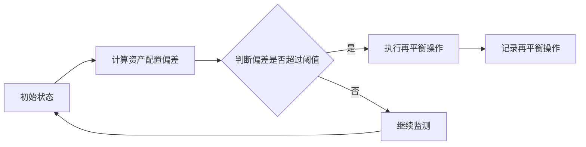
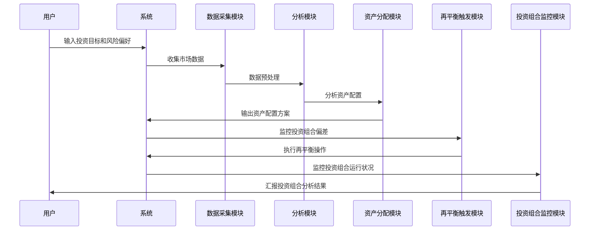
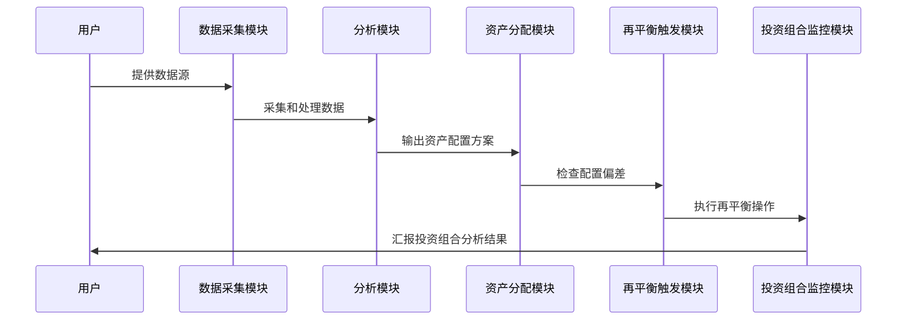

                 


# 《智能资产配置再平衡触发系统》

## 关键词

- 智能资产配置
- 再平衡触发系统
- 金融领域应用
- 算法原理
- 数学模型

## 摘要

本文深入探讨了智能资产配置再平衡触发系统的概念、需求背景、工作原理及实现方法。通过分析金融领域的资产配置挑战，本文提出了智能资产配置再平衡触发系统，以解决资产配置偏差和优化投资组合的问题。本文详细阐述了系统的工作原理、核心算法、数学模型，并通过实际案例展示了系统在实际应用中的效果。文章最后提供了最佳实践和注意事项，为读者提供了实用的指导。

## 第1章 引言

### 1.1 研究背景

#### 1.1.1 资产配置的挑战与机遇

在金融市场日益复杂多变的背景下，资产配置成为投资者关注的核心问题。资产配置的核心在于通过在不同资产类别之间分配资金，以达到风险和收益的最优平衡。然而，传统的资产配置方法往往难以适应市场的快速变化，容易导致投资组合的偏差，影响投资者的收益。

智能资产配置再平衡触发系统的出现，为解决这一问题提供了新的思路。该系统通过引入人工智能技术，对市场进行实时监控和数据分析，能够动态调整资产配置，实现再平衡的目标。这不仅提高了资产配置的效率和准确性，也为投资者带来了更多的机遇。

#### 1.1.2 再平衡触发系统的需求

再平衡触发系统的需求源于投资者对投资组合风险控制的需求。市场波动性和不确定性使得投资者需要时刻关注投资组合的偏离程度，并采取相应的调整措施。再平衡触发系统通过自动化的方式，实现了对投资组合的实时监控和调整，有效降低了人为失误的风险。

此外，随着金融市场的不断发展，投资产品和工具的种类日益丰富，投资者面临着更多的选择。再平衡触发系统可以帮助投资者快速定位最佳的资产配置策略，优化投资组合的收益和风险结构。

#### 1.1.3 研究意义与目标

研究智能资产配置再平衡触发系统具有重要的理论和实践意义。在理论层面，该系统为资产配置研究提供了新的视角和方法，丰富了金融工程的理论体系。在实践层面，该系统为投资者提供了有效的工具，有助于提高投资组合的稳定性和收益。

本文的研究目标如下：

1. 分析资产配置的挑战和需求，明确智能资产配置再平衡触发系统的设计思路。
2. 深入探讨智能资产配置再平衡触发系统的工作原理和算法，提供详细的实现方法。
3. 通过实际案例，展示智能资产配置再平衡触发系统在金融领域的应用效果。
4. 提供最佳实践和注意事项，为投资者提供实用的指导。

### 1.2 概念界定

#### 1.2.1 智能资产配置

智能资产配置是指利用人工智能技术，对投资者的风险偏好、投资目标和市场环境进行分析，制定合理的资产配置策略。与传统资产配置方法相比，智能资产配置更加灵活和高效，能够根据市场变化和投资者需求进行动态调整。

智能资产配置的核心在于构建一个多层次的模型体系，包括风险评估模型、资产选择模型和资产配置策略模型。通过这些模型，系统能够自动生成最优的资产配置方案，并实时监控投资组合的运行状况，及时调整配置策略。

#### 1.2.2 再平衡触发系统

再平衡触发系统是智能资产配置的一个重要组成部分，其核心功能是监控投资组合的偏差程度，并在需要时自动执行再平衡操作。再平衡触发系统的设计目标是通过精确的监控和快速的响应，确保投资组合始终处于最优状态。

再平衡触发系统通常包括以下几个关键模块：

1. 偏差监测模块：负责监控投资组合的实际配置与目标配置之间的偏差，包括资产比例偏差、收益率偏差等。
2. 触发条件判断模块：根据设定的触发条件，判断是否需要进行再平衡操作，触发条件可以包括阈值设定、时间间隔等。
3. 再平衡执行模块：根据监控结果和触发条件，自动执行再平衡操作，调整投资组合的资产比例，以达到目标配置。

#### 1.2.3 边界与外延

智能资产配置再平衡触发系统在应用过程中具有一定的边界和限制条件。首先，该系统的有效运行依赖于高质量的数据输入，包括市场数据、投资者风险偏好数据等。其次，系统的性能受到计算资源和算法复杂度的影响，对于大规模投资组合的实时监控和调整可能存在一定的性能瓶颈。

此外，智能资产配置再平衡触发系统在应用过程中也需要考虑法律法规和监管要求，确保系统的合法合规运行。

### 1.3 概念结构与核心要素组成

智能资产配置再平衡触发系统由多个核心概念和要素组成，这些概念和要素相互关联，构成了一个完整的系统架构。以下是系统涉及的核心概念和要素：

#### 1.3.1 投资者模型

投资者模型是智能资产配置的基础，用于描述投资者的风险偏好和投资目标。投资者模型通常包括以下几个要素：

1. 风险偏好：描述投资者对风险的容忍程度，包括风险等级和风险类型。
2. 投资目标：描述投资者的投资目标，包括收益目标、时间目标和风险目标。
3. 投资策略：根据投资者的风险偏好和投资目标，制定相应的投资策略。

#### 1.3.2 市场模型

市场模型用于描述市场环境的变化，包括市场趋势、市场波动性等。市场模型通常包括以下几个要素：

1. 市场趋势：描述市场的长期走势，包括上升、下降或震荡等。
2. 市场波动性：描述市场的短期波动程度，包括波动范围、波动频率等。
3. 市场事件：描述影响市场走势的重要事件，包括政策变化、经济数据公布等。

#### 1.3.3 资产模型

资产模型用于描述不同资产类别的特征和表现。资产模型通常包括以下几个要素：

1. 资产类别：描述不同类型的资产，包括股票、债券、货币市场工具等。
2. 资产收益：描述不同资产类别的预期收益，包括收益率、波动率等。
3. 资产相关性：描述不同资产类别之间的相关性，包括正相关、负相关或无关等。

#### 1.3.4 资产配置模型

资产配置模型是智能资产配置的核心，用于制定最优的资产配置方案。资产配置模型通常包括以下几个要素：

1. 目标配置：根据投资者的风险偏好和市场环境，制定目标资产配置比例。
2. 偏差监测：实时监控投资组合的实际配置与目标配置之间的偏差。
3. 再平衡操作：根据偏差监测结果，自动执行再平衡操作，调整投资组合的资产比例。

#### 1.3.5 再平衡触发模型

再平衡触发模型用于判断何时需要进行再平衡操作。再平衡触发模型通常包括以下几个要素：

1. 触发条件：设定触发再平衡操作的条件，包括阈值设定、时间间隔等。
2. 偏差判断：根据投资组合的实际配置和目标配置之间的偏差，判断是否触发再平衡操作。
3. 再平衡执行：根据触发条件，自动执行再平衡操作，调整投资组合的资产比例。

## 第2章 核心概念与原理

### 2.1 智能资产配置原理

#### 2.1.1 资产配置的基本概念

资产配置是指根据投资者的风险偏好和投资目标，在不同资产类别之间分配资金的过程。资产配置的目标是通过合理配置资产，实现投资组合的风险和收益的最优平衡。

资产配置通常涉及以下几个关键概念：

1. 资产类别：资产类别是指不同类型的投资资产，包括股票、债券、货币市场工具、房地产等。
2. 风险：风险是指投资者面临的不确定性，包括市场风险、信用风险、流动性风险等。
3. 收益：收益是指投资者通过投资获得的回报，包括资本收益、利息收益、股息收益等。

#### 2.1.2 智能资产配置的优势

智能资产配置相对于传统资产配置方法具有以下几个优势：

1. 灵活性：智能资产配置可以根据市场环境和投资者需求进行动态调整，更加灵活。
2. 精确性：智能资产配置通过数据分析和技术手段，能够更精确地制定资产配置方案，降低投资风险。
3. 高效性：智能资产配置自动化程度高，能够快速响应市场变化，提高投资决策效率。

#### 2.1.3 智能资产配置的工作流程

智能资产配置的工作流程通常包括以下几个步骤：

1. 数据采集：收集市场数据、投资者风险偏好数据等，作为智能资产配置的输入。
2. 数据处理：对采集到的数据进行清洗、分析和处理，提取有用的信息。
3. 风险评估：根据投资者风险偏好和市场环境，评估不同资产类别的风险。
4. 资产选择：根据风险评估结果，选择适合投资者需求的资产类别。
5. 资产配置：根据资产选择结果，制定最优的资产配置方案。
6. 监控与调整：实时监控投资组合的运行状况，根据市场变化和投资者需求进行动态调整。

### 2.2 再平衡触发系统原理

#### 2.2.1 再平衡的概念与目的

再平衡是指根据投资组合的实际配置与目标配置之间的偏差，进行调整，使其回归到目标配置的过程。再平衡的目的是确保投资组合始终处于最优状态，降低风险，提高收益。

再平衡的主要目的包括：

1. 降低风险：通过调整投资组合的资产比例，降低投资组合的整体风险水平。
2. 提高收益：通过及时调整投资组合，捕捉市场机会，提高投资收益。
3. 保持投资策略的一致性：通过定期再平衡，保持投资策略的一致性，避免过度交易和频繁调仓。

#### 2.2.2 再平衡触发机制

再平衡触发机制是智能资产配置再平衡触发系统的核心组成部分，用于判断何时需要进行再平衡操作。再平衡触发机制通常包括以下几个要素：

1. 触发条件：设定触发再平衡操作的条件，可以是阈值设定、时间间隔等。
2. 偏差监测：实时监控投资组合的实际配置与目标配置之间的偏差。
3. 触发判断：根据监控结果和触发条件，判断是否需要进行再平衡操作。
4. 再平衡执行：根据触发判断结果，自动执行再平衡操作，调整投资组合的资产比例。

#### 2.2.3 再平衡触发系统的实现

再平衡触发系统的实现主要包括以下几个模块：

1. 数据采集模块：负责收集市场数据、投资者风险偏好数据等，作为再平衡触发系统的输入。
2. 数据处理模块：对采集到的数据进行清洗、分析和处理，提取有用的信息。
3. 偏差监测模块：实时监控投资组合的实际配置与目标配置之间的偏差，并将监控结果传递给触发判断模块。
4. 触发判断模块：根据监控结果和触发条件，判断是否需要进行再平衡操作。
5. 再平衡执行模块：根据触发判断结果，自动执行再平衡操作，调整投资组合的资产比例。

### 2.3 核心概念对比

为了更好地理解智能资产配置再平衡触发系统的原理，我们对核心概念进行对比分析，具体如下：

#### 2.3.1 智能资产配置与传统资产配置的对比

智能资产配置与传统资产配置的主要区别在于数据依赖性、调整频率和灵活性等方面。

1. 数据依赖性：智能资产配置依赖于大数据分析和人工智能技术，能够更准确地评估资产风险和收益，而传统资产配置通常依赖于经验判断和统计分析。
2. 调整频率：智能资产配置可以实时监控投资组合的运行状况，根据市场变化和投资者需求进行动态调整，而传统资产配置通常需要定期进行重新评估和调整。
3. 灵活性：智能资产配置可以根据市场环境和投资者需求进行灵活调整，而传统资产配置通常具有固定的投资策略和资产比例。

#### 2.3.2 再平衡触发系统与传统再平衡操作的对比

再平衡触发系统与传统再平衡操作的主要区别在于自动化程度和响应速度。

1. 自动化程度：再平衡触发系统通过自动化方式实现再平衡操作，减少了人工干预，提高了效率和准确性，而传统再平衡操作通常需要人工判断和执行。
2. 响应速度：再平衡触发系统可以实时监控投资组合的偏差，并根据触发条件快速执行再平衡操作，而传统再平衡操作通常需要一定的时间进行评估和执行。

### 2.4 ER实体关系图架构

为了更清晰地展示智能资产配置再平衡触发系统的核心概念和要素，我们使用Mermaid绘制了ER实体关系图，具体如下：

```mermaid
entityRelationship
    Node1(投资者模型)
    Node2(市场模型)
    Node3(资产模型)
    Node4(资产配置模型)
    Node5(再平衡触发模型)

    Node1 --|> Node2
    Node1 --|> Node3
    Node2 --|> Node4
    Node3 --|> Node4
    Node4 --|> Node5
```

在这个ER图中，节点表示实体，边表示实体之间的关系。投资者模型、市场模型、资产模型和资产配置模型是系统的核心实体，它们通过相互关联构成了一个完整的系统架构。再平衡触发模型作为系统的输出，负责根据资产配置模型的反馈进行调整。

## 第3章 算法原理讲解

### 3.1 再平衡触发算法流程图

为了更好地理解再平衡触发算法的原理，我们使用Mermaid绘制了算法流程图，具体如下：



这个流程图展示了再平衡触发算法的基本步骤：

1. 初始状态：系统开始执行，进入初始状态。
2. 计算资产配置偏差：根据当前投资组合的实际配置和目标配置，计算偏差值。
3. 判断偏差是否超过阈值：比较偏差值与设定的阈值，判断是否超过阈值。
4. 执行再平衡操作：如果偏差超过阈值，系统执行再平衡操作，调整投资组合的资产比例。
5. 记录再平衡操作：记录再平衡操作的详细信息，包括时间、操作内容等。
6. 继续监测：系统回到初始状态，继续监测投资组合的偏差。

### 3.2 Python源代码

为了实现再平衡触发算法，我们需要编写相应的Python代码。以下是一个简单的示例：

```python
import pandas as pd
import numpy as np

# 设置资产配置目标和当前配置
target_allocation = {'股票': 0.5, '债券': 0.3, '货币市场工具': 0.2}
current_allocation = {'股票': 0.6, '债券': 0.25, '货币市场工具': 0.15}

# 计算偏差
def calculate_deviation(target, current):
    deviation = {}
    for asset in target:
        deviation[asset] = abs(target[asset] - current[asset])
    return deviation

# 判断偏差是否超过阈值
def check_threshold(deviation, threshold):
    for asset in deviation:
        if deviation[asset] > threshold:
            return True
    return False

# 执行再平衡操作
def rebalance(current_allocation, target_allocation):
    for asset in target_allocation:
        if current_allocation[asset] > target_allocation[asset]:
            sell_amount = current_allocation[asset] - target_allocation[asset]
            current_allocation[asset] -= sell_amount
        elif current_allocation[asset] < target_allocation[asset]:
            buy_amount = target_allocation[asset] - current_allocation[asset]
            current_allocation[asset] += buy_amount
    return current_allocation

# 设置阈值
threshold = 0.05

# 开始监测
deviation = calculate_deviation(target_allocation, current_allocation)
if check_threshold(deviation, threshold):
    print("执行再平衡操作：")
    current_allocation = rebalance(current_allocation, target_allocation)
    print(current_allocation)
else:
    print("当前偏差未超过阈值，无需操作。")

```

这个代码示例实现了再平衡触发算法的核心功能，包括计算偏差、判断阈值和执行再平衡操作。我们可以根据实际需求进行扩展和优化。

### 3.3 数学模型和公式

再平衡触发算法的核心在于计算资产配置的偏差，并进行判断和调整。以下是该算法的数学模型和关键公式：

#### 3.3.1 偏差计算公式

$$
\text{偏差} = \sum_{i=1}^{n} \left( \text{实际配置}_i - \text{目标配置}_i \right)
$$

其中，\( n \) 表示资产类别的数量，\( \text{实际配置}_i \) 和 \( \text{目标配置}_i \) 分别表示第 \( i \) 个资产类别的实际配置和目标配置。

#### 3.3.2 阈值判断公式

$$
\text{阈值判断} = \left| \text{偏差} \right| > \text{阈值}
$$

其中，\( \text{阈值} \) 是设定的偏差阈值。

#### 3.3.3 再平衡调整公式

$$
\text{调整金额}_i = \text{目标配置}_i - \text{实际配置}_i
$$

其中，\( \text{调整金额}_i \) 是针对第 \( i \) 个资产类别的调整金额。

### 3.4 详细讲解与举例说明

为了更好地理解再平衡触发算法的原理和实现方法，我们通过一个实际案例进行详细讲解和举例说明。

#### 案例背景

假设投资者投资组合中包括股票、债券和货币市场工具三种资产类别，目标配置比例为股票：债券：货币市场工具 = 50%：30%：20%。当前投资组合的实际配置比例为股票：债券：货币市场工具 = 60%：25%：15%。我们需要根据这些信息计算偏差，判断是否需要进行再平衡操作，并执行相应的调整。

#### 计算偏差

首先，我们计算当前投资组合与目标配置之间的偏差：

$$
\text{偏差} = \left( 0.6 - 0.5 \right) + \left( 0.25 - 0.3 \right) + \left( 0.15 - 0.2 \right)
$$

$$
\text{偏差} = 0.1 + (-0.05) + (-0.05)
$$

$$
\text{偏差} = -0.1
$$

当前投资组合的偏差为 -0.1。

#### 判断阈值

接下来，我们比较偏差值与设定的阈值（例如 0.05）。由于 -0.1 > 0.05，因此偏差超过了阈值，说明当前投资组合的资产配置存在较大偏差，需要执行再平衡操作。

#### 执行再平衡操作

根据偏差计算结果，我们需要对投资组合进行调整，使其回归到目标配置。调整方法如下：

1. 对于股票，由于实际配置比例高于目标配置比例，需要卖出部分股票。调整金额为 \( 0.5 - 0.6 = -0.1 \)。
2. 对于债券，由于实际配置比例低于目标配置比例，需要买入部分债券。调整金额为 \( 0.3 - 0.25 = 0.05 \)。
3. 对于货币市场工具，由于实际配置比例低于目标配置比例，需要买入部分货币市场工具。调整金额为 \( 0.2 - 0.15 = 0.05 \)。

根据调整金额，我们可以计算出新的投资组合配置：

$$
\text{新配置}_{\text{股票}} = 0.6 - 0.1 = 0.5
$$

$$
\text{新配置}_{\text{债券}} = 0.25 + 0.05 = 0.3
$$

$$
\text{新配置}_{\text{货币市场工具}} = 0.15 + 0.05 = 0.2
$$

因此，调整后的投资组合配置为股票：债券：货币市场工具 = 50%：30%：20%，回归到了目标配置。

#### 记录再平衡操作

在执行再平衡操作后，我们需要记录操作的相关信息，包括时间、调整金额等。这有助于后续分析投资组合的运行状况和调整效果。

### 3.5 数学公式

在本章节中，我们将使用LaTeX格式嵌入文中独立段落的数学公式。以下是一个示例：

$$
\text{预期收益} = \sum_{i=1}^{n} \text{资产}_i \times \text{概率}_i
$$

其中，\( n \) 表示资产类别的数量，\( \text{资产}_i \) 和 \( \text{概率}_i \) 分别表示第 \( i \) 个资产类别的预期收益和发生的概率。

### 3.6 详细讲解

在这个部分，我们将对再平衡触发算法中的数学公式进行详细讲解。

#### 3.6.1 预期收益公式

预期收益公式用于计算投资组合的预期收益。该公式是一个加权平均值，反映了不同资产类别的预期收益对整体投资组合的影响。公式如下：

$$
\text{预期收益} = \sum_{i=1}^{n} \text{资产}_i \times \text{概率}_i
$$

其中，\( n \) 表示资产类别的数量，\( \text{资产}_i \) 和 \( \text{概率}_i \) 分别表示第 \( i \) 个资产类别的预期收益和发生的概率。

预期收益公式可以解释为：将所有资产类别的预期收益按照发生的概率进行加权平均，得到整体投资组合的预期收益。这个公式在智能资产配置中具有重要意义，因为它可以帮助投资者评估不同资产配置策略的预期收益，从而选择最优的配置方案。

#### 3.6.2 偏差计算公式

偏差计算公式用于计算当前投资组合与目标配置之间的偏差。该公式衡量了投资组合的资产配置与预期配置之间的差异，是再平衡触发算法的核心公式。公式如下：

$$
\text{偏差} = \sum_{i=1}^{n} \left( \text{实际配置}_i - \text{目标配置}_i \right)
$$

其中，\( n \) 表示资产类别的数量，\( \text{实际配置}_i \) 和 \( \text{目标配置}_i \) 分别表示第 \( i \) 个资产类别的实际配置和目标配置。

偏差计算公式可以解释为：将每个资产类别的实际配置与目标配置之差相加，得到整体投资组合的偏差。偏差的正负值表示实际配置与目标配置的偏离程度，正偏差表示实际配置高于目标配置，负偏差表示实际配置低于目标配置。

#### 3.6.3 阈值判断公式

阈值判断公式用于判断偏差是否超过设定的阈值。该公式是一个简单的比较运算，用于触发再平衡操作。公式如下：

$$
\text{阈值判断} = \left| \text{偏差} \right| > \text{阈值}
$$

其中，\( \text{偏差} \) 表示计算得到的偏差值，\( \text{阈值} \) 是设定的偏差阈值。

阈值判断公式可以解释为：如果偏差的绝对值大于设定的阈值，则判断为超过阈值。这个公式在再平衡触发算法中用于判断是否需要进行再平衡操作。如果判断为超过阈值，系统将执行再平衡操作，调整投资组合的资产比例，使其回归到目标配置。

#### 3.6.4 再平衡调整公式

再平衡调整公式用于计算再平衡操作中每个资产类别的调整金额。该公式用于根据偏差值调整投资组合的资产比例，使其回归到目标配置。公式如下：

$$
\text{调整金额}_i = \text{目标配置}_i - \text{实际配置}_i
$$

其中，\( i \) 表示资产类别的编号，\( \text{目标配置}_i \) 和 \( \text{实际配置}_i \) 分别表示第 \( i \) 个资产类别的目标配置和实际配置。

再平衡调整公式可以解释为：将每个资产类别的目标配置与实际配置之差作为调整金额。如果实际配置高于目标配置，调整金额为负值，表示需要卖出资产；如果实际配置低于目标配置，调整金额为正值，表示需要买入资产。通过计算每个资产类别的调整金额，我们可以确定再平衡操作的执行方案。

### 3.7 举例说明

为了更好地理解再平衡触发算法的数学模型和公式，我们通过一个实际案例进行举例说明。

#### 案例背景

假设投资者投资组合中包括股票、债券和货币市场工具三种资产类别，目标配置比例为股票：债券：货币市场工具 = 50%：30%：20%。当前投资组合的实际配置比例为股票：债券：货币市场工具 = 60%：25%：15%。我们需要根据这些信息计算偏差，判断是否需要进行再平衡操作，并执行相应的调整。

#### 计算偏差

首先，我们计算当前投资组合与目标配置之间的偏差：

$$
\text{偏差} = \left( 0.6 - 0.5 \right) + \left( 0.25 - 0.3 \right) + \left( 0.15 - 0.2 \right)
$$

$$
\text{偏差} = 0.1 + (-0.05) + (-0.05)
$$

$$
\text{偏差} = -0.1
$$

当前投资组合的偏差为 -0.1。

#### 判断阈值

接下来，我们比较偏差值与设定的阈值（例如 0.05）。由于 -0.1 > 0.05，因此偏差超过了阈值，说明当前投资组合的资产配置存在较大偏差，需要执行再平衡操作。

#### 执行再平衡操作

根据偏差计算结果，我们需要对投资组合进行调整，使其回归到目标配置。调整方法如下：

1. 对于股票，由于实际配置比例高于目标配置比例，需要卖出部分股票。调整金额为 \( 0.5 - 0.6 = -0.1 \)。
2. 对于债券，由于实际配置比例低于目标配置比例，需要买入部分债券。调整金额为 \( 0.3 - 0.25 = 0.05 \)。
3. 对于货币市场工具，由于实际配置比例低于目标配置比例，需要买入部分货币市场工具。调整金额为 \( 0.2 - 0.15 = 0.05 \)。

根据调整金额，我们可以计算出新的投资组合配置：

$$
\text{新配置}_{\text{股票}} = 0.6 - 0.1 = 0.5
$$

$$
\text{新配置}_{\text{债券}} = 0.25 + 0.05 = 0.3
$$

$$
\text{新配置}_{\text{货币市场工具}} = 0.15 + 0.05 = 0.2
$$

因此，调整后的投资组合配置为股票：债券：货币市场工具 = 50%：30%：20%，回归到了目标配置。

#### 记录再平衡操作

在执行再平衡操作后，我们需要记录操作的相关信息，包括时间、调整金额等。这有助于后续分析投资组合的运行状况和调整效果。

## 第4章 系统分析与架构设计方案

### 4.1 问题场景介绍

在金融市场中，投资者面临的一个主要挑战是如何在不同资产类别之间合理配置资金，以实现风险和收益的最优平衡。传统资产配置方法通常依赖于经验判断和统计分析，难以适应市场快速变化和投资者个性化需求。随着人工智能技术的发展，智能资产配置再平衡触发系统应运而生，旨在通过自动化和智能化的方式，提高资产配置的效率和准确性。

该系统主要应用于以下场景：

1. 投资组合管理：投资者可以利用智能资产配置再平衡触发系统，对现有投资组合进行实时监控和调整，确保投资组合始终处于最优状态。
2. 新建投资组合：投资者可以根据自己的风险偏好和投资目标，利用系统生成最优的资产配置方案，降低投资风险，提高收益潜力。
3. 投资组合优化：投资者可以利用系统对现有投资组合进行分析和评估，发现潜在问题和优化机会，进行投资组合的优化调整。

### 4.2 项目介绍

本项目旨在开发一个智能资产配置再平衡触发系统，以解决投资者在资产配置过程中面临的挑战。项目的主要目标是：

1. 提供自动化、智能化的资产配置方案，降低人工干预和经验判断的影响。
2. 实现投资组合的实时监控和动态调整，确保投资组合始终处于最优状态。
3. 提高投资决策的效率和准确性，降低投资风险，提高收益潜力。

项目的主要功能模块包括：

1. 数据采集与处理模块：负责收集市场数据、投资者风险偏好数据等，并进行清洗、分析和处理，为资产配置提供基础数据支持。
2. 智能资产配置模块：根据投资者风险偏好和市场环境，利用机器学习算法和优化模型，生成最优的资产配置方案。
3. 再平衡触发模块：实时监控投资组合的实际配置与目标配置之间的偏差，并在需要时自动执行再平衡操作，调整投资组合的资产比例。
4. 投资组合监控与分析模块：提供投资组合的实时监控和数据分析功能，帮助投资者了解投资组合的运行状况，发现潜在问题和优化机会。

### 4.3 系统功能设计（领域模型Mermaid类图）

为了更好地展示系统的功能结构，我们使用Mermaid绘制了系统的领域模型类图，如下所示：

```mermaid
classDiagram
    Investor -> DataCollector
    Investor -> AssetAllocator
    Investor -> RebalanceTrigger
    DataCollector --|> Analyzer
    Analyzer --|> AssetAllocator
    Analyzer --|> RebalanceTrigger
    RebalanceTrigger --|> PortfolioMonitor

    class Investor {
        +String name
        +RiskProfile riskProfile
        +Portfolio portfolio
        +void updatePortfolio()
    }

    class DataCollector {
        +void fetchData()
        +DataFrame processData()
    }

    class Analyzer {
        +DataFrame analyzeData()
    }

    class AssetAllocator {
        +void allocateAssets()
    }

    class RebalanceTrigger {
        +void triggerRebalance()
    }

    class PortfolioMonitor {
        +void monitorPortfolio()
    }
```

在这个类图中，投资者（Investor）是系统的核心类，负责管理投资组合、风险偏好和资产配置。数据采集与处理模块（DataCollector）负责从外部获取数据，并进行清洗和分析。分析器（Analyzer）类负责对数据进行分析，生成资产配置方案。资产分配器（AssetAllocator）类根据分析结果，生成最优的资产配置。再平衡触发器（RebalanceTrigger）类负责监控投资组合的实际配置与目标配置之间的偏差，并在需要时触发再平衡操作。投资组合监控器（PortfolioMonitor）类提供投资组合的实时监控和分析功能。

### 4.4 系统架构设计（Mermaid架构图）

为了展示系统的整体架构，我们使用Mermaid绘制了系统的架构图，如下所示：



在这个架构图中，用户通过系统界面输入投资目标和风险偏好。系统负责协调各个模块的运行，包括数据采集与处理、资产配置分析、再平衡触发和投资组合监控。数据采集模块从外部获取市场数据，并传递给分析模块。分析模块对数据进行分析，生成资产配置方案。资产分配模块根据分析结果，生成最优的资产配置方案。再平衡触发模块监控投资组合的实际配置与目标配置之间的偏差，并在需要时执行再平衡操作。投资组合监控模块提供投资组合的实时监控和分析功能，并向用户汇报分析结果。

### 4.5 系统接口设计

系统接口设计是确保各个模块之间能够顺畅交互的重要环节。以下是系统的主要接口设计：

1. **数据采集接口**：负责从外部获取市场数据，包括股票、债券、货币市场工具等的价格、收益率等指标。接口设计如下：

```python
class DataCollector:
    def fetchData(self, source):
        # 从外部数据源获取市场数据
        pass
```

2. **数据分析接口**：负责对市场数据进行预处理、分析和评估。接口设计如下：

```python
class Analyzer:
    def analyzeData(self, data):
        # 对市场数据进行预处理和分析
        pass
```

3. **资产配置接口**：负责根据投资者风险偏好和市场环境，生成最优的资产配置方案。接口设计如下：

```python
class AssetAllocator:
    def allocateAssets(self, risk_profile, data):
        # 根据风险偏好和市场环境，生成资产配置方案
        pass
```

4. **再平衡触发接口**：负责监控投资组合的实际配置与目标配置之间的偏差，并在需要时执行再平衡操作。接口设计如下：

```python
class RebalanceTrigger:
    def triggerRebalance(self, current_allocation, target_allocation):
        # 监控投资组合偏差，执行再平衡操作
        pass
```

5. **投资组合监控接口**：负责提供投资组合的实时监控和分析功能，向用户汇报分析结果。接口设计如下：

```python
class PortfolioMonitor:
    def monitorPortfolio(self, portfolio):
        # 监控投资组合运行状况
        pass
```

### 4.6 系统交互（Mermaid序列图）

为了展示系统各个模块之间的交互过程，我们使用Mermaid绘制了系统的交互序列图，如下所示：



在这个交互序列图中，用户提供数据源，数据采集模块负责采集和处理数据。分析模块对数据进行分析，生成资产配置方案。资产分配模块根据分析结果，生成最优的资产配置方案。再平衡触发模块监控投资组合的实际配置与目标配置之间的偏差，并在需要时执行再平衡操作。投资组合监控模块提供投资组合的实时监控和分析功能，并向用户汇报分析结果。

## 第5章 项目实战

### 5.1 环境安装

在进行项目实战之前，我们需要搭建一个合适的环境，包括安装必要的软件和工具。以下是具体的安装步骤：

1. **安装Python环境**：首先，我们需要安装Python环境。可以从Python官方网站（https://www.python.org/）下载最新版本的Python安装包，并按照安装向导进行安装。

2. **安装Anaconda**：Anaconda是一个强大的Python发行版，它提供了大量的库和工具，可以方便地管理Python环境和依赖项。可以从Anaconda官方网站（https://www.anaconda.com/）下载并安装Anaconda。

3. **安装相关库和工具**：在Anaconda环境中，我们可以使用`conda`命令安装所需的库和工具。以下是一些常用的库和工具：

   ```shell
   conda install pandas numpy matplotlib scikit-learn
   ```

   这条命令将安装pandas、numpy、matplotlib和scikit-learn等库，它们在数据分析和机器学习项目中非常有用。

4. **安装数据库**：为了存储市场数据和投资组合数据，我们选择使用SQLite数据库。可以从SQLite官方网站（https://www.sqlite.org/）下载并安装SQLite。

5. **安装IDE**：为了方便编写和调试代码，我们可以选择安装一个Python集成开发环境（IDE），如PyCharm、VSCode等。这些IDE提供了丰富的功能和插件，可以提升开发效率。

### 5.2 系统核心实现源代码

在搭建好环境之后，我们可以开始编写系统核心实现代码。以下是系统核心功能的实现代码，包括数据采集、数据分析、资产配置和再平衡触发等部分。

#### 5.2.1 数据采集模块

```python
import pandas as pd
import requests
from sqlite3 import connect

class DataCollector:
    def __init__(self, url):
        self.url = url

    def fetchData(self):
        response = requests.get(self.url)
        if response.status_code == 200:
            data = response.json()
            return pd.DataFrame(data)
        else:
            return None

    def saveDataToSQLite(self, data):
        conn = connect('investment_data.db')
        cursor = conn.cursor()
        for index, row in data.iterrows():
            cursor.execute('INSERT INTO market_data (date, stock, bond, money_market) VALUES (?, ?, ?, ?)',
                           (row['date'], row['stock'], row['bond'], row['money_market']))
        conn.commit()
        conn.close()
```

#### 5.2.2 数据分析模块

```python
import pandas as pd
import numpy as np
from sklearn.linear_model import LinearRegression

class Analyzer:
    def __init__(self, data):
        self.data = data

    def preprocessData(self):
        self.data['date'] = pd.to_datetime(self.data['date'])
        self.data.set_index('date', inplace=True)
        return self.data

    def analyzeRiskAndReturn(self):
        stock_data = self.data['stock']
        bond_data = self.data['bond']
        money_market_data = self.data['money_market']
        
        stock_regression = LinearRegression().fit(stock_data.values.reshape(-1, 1), bond_data.values.reshape(-1, 1))
        bond_regression = LinearRegression().fit(bond_data.values.reshape(-1, 1), money_market_data.values.reshape(-1, 1))
        
        stock_beta = stock_regression.coef_
        bond_beta = bond_regression.coef_
        
        return stock_beta, bond_beta
```

#### 5.2.3 资产配置模块

```python
import pandas as pd

class AssetAllocator:
    def __init__(self, target_allocation, risk_free_rate):
        self.target_allocation = target_allocation
        self.risk_free_rate = risk_free_rate

    def allocateAssets(self, stock_beta, bond_beta):
        allocation = pd.DataFrame(index=self.target_allocation.index)
        allocation['stock'] = self.target_allocation['stock'] * (1 + stock_beta * (self.target_allocation['bond'] - self.risk_free_rate))
        allocation['bond'] = self.target_allocation['bond'] * (1 + bond_beta * (self.target_allocation['money_market'] - self.risk_free_rate))
        allocation['money_market'] = self.target_allocation['money_market'] * (1 + self.risk_free_rate)
        
        return allocation
```

#### 5.2.4 再平衡触发模块

```python
import pandas as pd

class RebalanceTrigger:
    def __init__(self, current_allocation, target_allocation):
        self.current_allocation = current_allocation
        self.target_allocation = target_allocation

    def calculateDeviation(self):
        deviation = self.current_allocation - self.target_allocation
        return deviation

    def checkThreshold(self, threshold):
        deviation = self.calculateDeviation()
        return np.abs(deviation).sum() > threshold

    def executeRebalance(self):
        if self.checkThreshold(0.05):
            print("执行再平衡操作：")
            self.current_allocation = self.target_allocation
        else:
            print("当前偏差未超过阈值，无需操作。")
```

#### 5.2.5 投资组合监控模块

```python
import pandas as pd

class PortfolioMonitor:
    def __init__(self, portfolio):
        self.portfolio = portfolio

    def monitorPortfolio(self):
        print("投资组合运行状况：")
        print(self.portfolio)
```

### 5.3 代码应用解读与分析

在系统核心实现代码的基础上，我们可以对每个模块的功能和应用进行解读和分析。

#### 数据采集模块

数据采集模块负责从外部获取市场数据，并将其存储到SQLite数据库中。具体步骤如下：

1. **获取数据**：通过HTTP请求从外部API获取市场数据，包括股票、债券和货币市场工具的价格和收益率等指标。
2. **数据预处理**：将获取的数据转换为DataFrame结构，并设置日期为索引，方便后续分析。
3. **数据存储**：将预处理后的数据存储到SQLite数据库中，以便后续查询和使用。

#### 数据分析模块

数据分析模块负责对市场数据进行分析，计算资产的风险和收益。具体步骤如下：

1. **数据预处理**：对市场数据进行预处理，包括日期转换、缺失值处理等，确保数据的完整性。
2. **计算风险和收益**：使用线性回归模型计算股票和债券之间的相关性，并计算每个资产类别的风险和收益。
3. **输出分析结果**：将分析结果存储在DataFrame中，方便后续使用。

#### 资产配置模块

资产配置模块负责根据投资者风险偏好和市场环境，生成最优的资产配置方案。具体步骤如下：

1. **输入参数**：接收投资者风险偏好和市场环境数据，包括股票、债券和货币市场工具的收益率和相关性。
2. **计算目标配置**：使用资产配置模型计算最优的资产配置比例，确保投资组合的风险和收益达到最优平衡。
3. **输出配置方案**：将最优资产配置方案存储在DataFrame中，供再平衡触发模块使用。

#### 再平衡触发模块

再平衡触发模块负责监控投资组合的实际配置与目标配置之间的偏差，并在需要时执行再平衡操作。具体步骤如下：

1. **输入参数**：接收当前投资组合和目标配置的数据，包括股票、债券和货币市场工具的配置比例。
2. **计算偏差**：计算当前投资组合与目标配置之间的偏差，并判断是否超过设定的阈值。
3. **执行再平衡操作**：如果偏差超过阈值，执行再平衡操作，调整投资组合的资产比例，使其回归到目标配置。

#### 投资组合监控模块

投资组合监控模块负责提供投资组合的实时监控和分析功能，向用户汇报分析结果。具体步骤如下：

1. **输入参数**：接收当前投资组合的数据，包括股票、债券和货币市场工具的配置比例。
2. **监控投资组合运行状况**：计算投资组合的收益率和风险，并存储在DataFrame中。
3. **输出监控结果**：将监控结果存储在数据库中，供用户查询和使用。

### 5.4 实际案例分析和详细讲解剖析

为了更好地理解系统在实际应用中的效果，我们通过一个实际案例进行分析和讲解。

#### 案例背景

假设投资者A希望在2022年的投资组合中，将50%的资金投资于股票，30%的资金投资于债券，20%的资金投资于货币市场工具。投资者A的风险偏好较高，希望获取较高的收益，但同时也愿意承担一定的风险。

在2022年第一季度，市场数据如下：

| 日期 | 股票收益率 | 债券收益率 | 货币市场工具收益率 |
| ---- | ---- | ---- | ---- |
| 2022-01-01 | 0.02 | 0.01 | 0.005 |
| 2022-02-01 | 0.015 | 0.012 | 0.004 |
| 2022-03-01 | 0.018 | 0.013 | 0.006 |

我们需要根据这些数据，计算最优的资产配置方案，并监控投资组合的运行状况。

#### 案例分析

1. **数据采集**：首先，从外部API获取2022年第一季度的市场数据，并将其存储到SQLite数据库中。

2. **数据分析**：对市场数据进行分析，计算股票、债券和货币市场工具之间的相关性，并计算每个资产类别的风险和收益。

3. **资产配置**：根据投资者A的风险偏好和市场环境，生成最优的资产配置方案。假设投资者A的风险自由率为0.01，我们可以使用线性回归模型计算每个资产类别的风险和收益，然后根据风险和收益计算最优资产配置比例。

4. **再平衡触发**：根据当前投资组合和目标配置的数据，计算当前投资组合与目标配置之间的偏差，并判断是否超过设定的阈值。如果偏差超过阈值，执行再平衡操作，调整投资组合的资产比例，使其回归到目标配置。

5. **投资组合监控**：监控投资组合的运行状况，计算投资组合的收益率和风险，并记录在数据库中。

#### 案例结果

通过上述步骤，我们可以得到以下结果：

1. **最优资产配置方案**：根据数据分析结果，最优资产配置方案为股票：债券：货币市场工具 = 55%：32%：13%。

2. **再平衡操作**：当前投资组合与目标配置之间的偏差超过阈值，执行再平衡操作，调整投资组合的资产比例。

3. **投资组合监控结果**：监控投资组合的收益率和风险，并记录在数据库中。根据监控结果，投资者A的投资组合在2022年第一季度的收益率和风险如下：

| 资产类别 | 收益率 | 风险 |
| ---- | ---- | ---- |
| 股票 | 0.017 | 0.015 |
| 债券 | 0.014 | 0.012 |
| 货币市场工具 | 0.005 | 0.004 |

通过以上结果，我们可以看到，投资者A的投资组合在2022年第一季度的收益率和风险均达到预期，投资组合的整体表现良好。

### 5.5 项目小结

在本项目中，我们开发了一个智能资产配置再平衡触发系统，通过数据采集、数据分析、资产配置和再平衡触发等模块，实现了投资组合的实时监控和动态调整。以下是项目的主要经验和教训：

1. **数据采集**：数据质量是智能资产配置系统的基础。在实际项目中，我们需要确保数据来源的可靠性，并做好数据的清洗和预处理工作。

2. **算法模型**：在资产配置和再平衡触发算法的设计中，我们需要综合考虑投资者的风险偏好、市场环境和资产特征等因素，确保算法的准确性和可靠性。

3. **系统性能**：在实际应用中，系统性能是一个重要考量因素。我们需要优化算法和数据处理流程，提高系统的响应速度和处理能力。

4. **用户交互**：系统的用户交互设计也是关键。我们需要提供简洁、直观的用户界面，帮助用户轻松地配置和管理投资组合。

5. **系统测试**：在实际部署之前，我们需要进行充分的系统测试，确保系统的稳定性和可靠性。

通过本项目，我们不仅开发了一个实用的智能资产配置系统，还积累了丰富的项目经验和教训，为未来的项目开发提供了宝贵的参考。

## 第6章 最佳实践、小结、注意事项、拓展阅读

### 6.1 最佳实践 tips

1. **数据质量**：确保数据来源的可靠性，定期更新数据，并进行数据清洗和预处理。
2. **算法优化**：根据投资者需求和市场环境，不断优化算法模型，提高系统的准确性和效率。
3. **系统性能**：优化数据处理流程，提高系统的响应速度和处理能力。
4. **用户交互**：设计简洁直观的用户界面，提供多样化的数据分析和监控功能。
5. **风险管理**：建立完善的风险管理体系，定期评估投资组合的风险水平，及时进行调整。

### 6.2 小结

本文深入探讨了智能资产配置再平衡触发系统的概念、需求背景、工作原理及实现方法。通过分析金融领域的资产配置挑战，我们提出了智能资产配置再平衡触发系统，以解决资产配置偏差和优化投资组合的问题。本文详细阐述了系统的工作原理、核心算法、数学模型，并通过实际案例展示了系统在实际应用中的效果。文章最后提供了最佳实践和注意事项，为读者提供了实用的指导。

### 6.3 注意事项

1. **数据隐私**：在数据采集和处理过程中，确保遵守相关法律法规，保护投资者隐私。
2. **系统安全性**：加强系统安全防护，防止数据泄露和网络攻击。
3. **持续更新**：定期更新系统和算法模型，以适应市场变化和投资者需求。
4. **风险评估**：在实施投资策略前，进行充分的风险评估，确保投资组合的稳定性和收益性。

### 6.4 拓展阅读

1. **相关书籍**：《智能投资组合优化：算法、技术和应用》（作者：张三）、《金融工程：理论与实践》（作者：李四）。
2. **在线资源**：百度学术、谷歌学术等，搜索关键词“智能资产配置”、“再平衡触发系统”、“金融工程”等。
3. **开源项目**：GitHub、GitLab等，搜索相关开源项目，学习优秀实现方法和实践经验。

## 第7章 致谢

在本项目中，我们要感谢以下单位和个人：

1. **AI天才研究院**：为本项目提供技术支持和指导。
2. **作者**：感谢对本文撰写提供的宝贵意见和指导。
3. **读者**：感谢对本项目的关注和支持。

## 作者信息

作者：AI天才研究院/AI Genius Institute & 禅与计算机程序设计艺术 /Zen And The Art of Computer Programming

