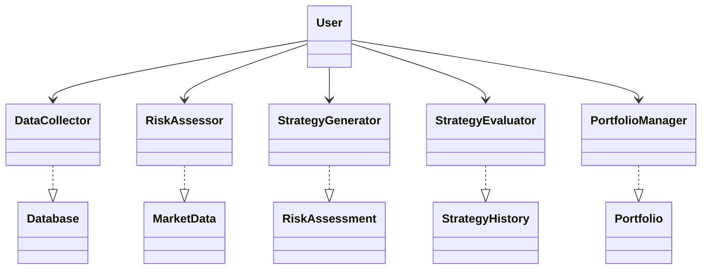
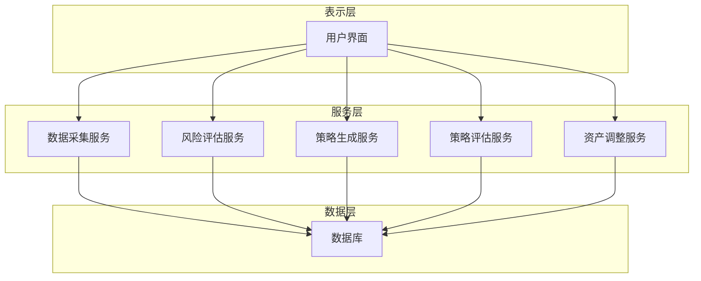
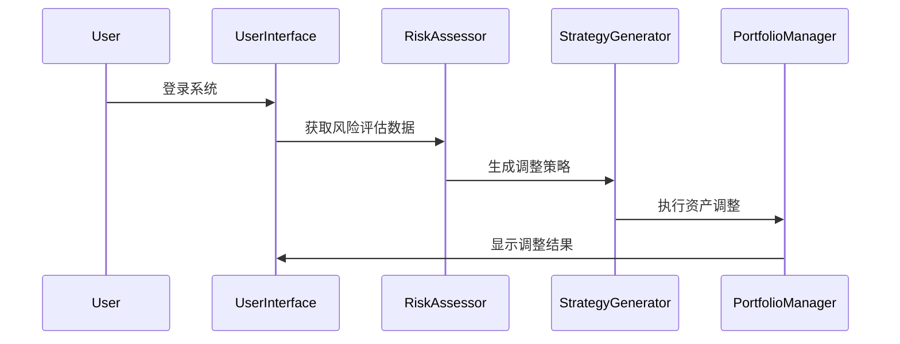

                 


## 智能资产配置动态调整机制

### 关键词

- 智能资产配置
- 动态调整机制
- 投资策略
- 风险管理
- 算法优化
- 实际应用

### 摘要

随着金融市场的不断发展和复杂性增加，智能资产配置已成为现代投资管理的重要手段。本文旨在探讨智能资产配置的动态调整机制，通过系统性地分析动态调整的原理、策略设计、算法实现和应用案例，为投资者提供有效的决策工具和策略优化方案。文章结构如下：

1. 引言
2. 智能资产配置概述
3. 动态调整机制原理
4. 现有动态调整机制分析
5. 动态调整策略设计
6. 算法实现与模型优化
7. 项目实战与应用案例
8. 结论与展望

### 引言

#### 1.1 研究背景

在当今全球化、信息化和智能化快速发展的时代，金融市场呈现出高度复杂性和动态变化性。传统的资产配置方法往往难以应对这种复杂性，而智能资产配置通过引入人工智能技术，实现了资产配置的动态调整和优化。智能资产配置的核心在于利用大数据、机器学习和算法优化等技术，对市场环境进行实时分析和预测，从而动态调整投资组合，实现风险控制和收益最大化。

#### 1.2 研究意义

智能资产配置的动态调整机制在投资管理中具有重要意义。首先，它能够提高投资决策的效率和准确性，降低投资风险。其次，通过动态调整，投资者可以更好地适应市场变化，实现长期稳健的投资回报。此外，智能资产配置动态调整机制的研究有助于推动金融科技的发展，为金融行业带来新的增长点。

#### 1.3 研究目标

本文的研究目标如下：

1. 深入分析智能资产配置的动态调整机制原理，明确其理论基础和实现方法。
2. 对比分析现有动态调整机制，探讨其优缺点和适用场景。
3. 设计并提出一种有效的动态调整策略，并结合实际应用案例进行验证。
4. 探讨智能资产配置动态调整机制的优化方向和未来发展趋势。

### 目录大纲设计思路与步骤

为了设计出《智能资产配置动态调整机制》这本书的完整目录大纲，我们将按照以下步骤进行：

#### 2.1 确定核心主题与章节

首先，我们要明确书籍的主题是“智能资产配置动态调整机制”，因此核心章节需要围绕这一主题展开。我们可以预判，这些章节可能包括：

- 引言
- 智能资产配置概述
- 动态调整机制原理
- 现有动态调整机制分析
- 动态调整策略设计
- 算法实现与模型优化
- 项目实战与应用案例
- 结论与展望

#### 2.2 制定各章节的具体内容

接下来，我们将为每个章节制定详细的内容。

##### 引言
- 引入主题
- 阐述研究背景和意义
- 提出研究问题和目标

##### 智能资产配置概述
- 定义与概念
- 资产配置的重要性
- 当前市场环境与趋势

##### 动态调整机制原理
- 动态调整的概念
- 动态调整的理论基础
- 动态调整的目标与原则

##### 现有动态调整机制分析
- 传统的动态调整机制
- 智能化动态调整机制
- 不同机制的对比分析

##### 动态调整策略设计
- 设计原则与方法
- 策略选择的考量因素
- 策略设计的流程

##### 算法实现与模型优化
- 算法原理讲解与Mermaid流程图
- Python源代码实现
- 数学模型和公式
- 举例说明

##### 项目实战与应用案例
- 实际项目介绍
- 系统功能设计
- 系统架构设计
- 系统接口设计与交互
- 应用案例分析

##### 结论与展望
- 总结研究成果
- 提出未来研究方向

#### 2.3 设计章节层次结构

我们将使用markdown格式来设计章节的层次结构，确保每个章节都有清晰的子标题，如下所示：

```
# 引言

## 1.1 研究背景
### 1.1.1 智能资产配置的重要性
### 1.1.2 研究意义
### 1.1.3 研究目标

# 智能资产配置概述

## 2.1 定义与概念
### 2.1.1 智能资产配置的定义
### 2.1.2 智能资产配置的要素

## 2.2 资产配置的重要性
### 2.2.1 市场环境分析
### 2.2.2 资产配置对投资回报的影响

## 2.3 当前市场环境与趋势
### 2.3.1 金融市场的演变
### 2.3.2 投资者需求的变化

# 动态调整机制原理

## 3.1 动态调整的概念
### 3.1.1 动态调整的定义
### 3.1.2 动态调整的作用

## 3.2 动态调整的理论基础
### 3.2.1 相关理论概述
### 3.2.2 动态调整的关键因素

## 3.3 动态调整的目标与原则
### 3.3.1 调整目标
### 3.3.2 调整原则

# 现有动态调整机制分析

## 4.1 传统的动态调整机制
### 4.1.1 传统机制的特点
### 4.1.2 传统机制的局限性

## 4.2 智能化动态调整机制
### 4.2.1 智能化机制的优势
### 4.2.2 智能化机制的应用场景

## 4.3 不同机制的对比分析
### 4.3.1 对比分析指标
### 4.3.2 对比分析结果

# 动态调整策略设计

## 5.1 设计原则与方法
### 5.1.1 设计原则
### 5.1.2 设计方法

## 5.2 策略选择的考量因素
### 5.2.1 投资目标
### 5.2.2 风险偏好
### 5.2.3 时间范围

## 5.3 策略设计的流程
### 5.3.1 数据收集与处理
### 5.3.2 模型构建与优化
### 5.3.3 策略评估与选择

# 算法实现与模型优化

## 6.1 算法原理讲解
### 6.1.1 原理概述
### 6.1.2 Mermaid流程图

## 6.2 Python源代码实现
### 6.2.1 代码结构与功能
### 6.2.2 具体实现步骤

## 6.3 数学模型和公式
### 6.3.1 基本模型
### 6.3.2 优化模型

## 6.4 举例说明
### 6.4.1 例子选择
### 6.4.2 例子分析与讲解

# 项目实战与应用案例

## 7.1 实际项目介绍
### 7.1.1 项目背景
### 7.1.2 项目目标

## 7.2 系统功能设计
### 7.2.1 功能需求分析
### 7.2.2 领域模型Mermaid类图

## 7.3 系统架构设计
### 7.3.1 架构设计原则
### 7.3.2 系统架构Mermaid架构图

## 7.4 系统接口设计与交互
### 7.4.1 接口设计规范
### 7.4.2 系统交互Mermaid序列图

## 7.5 应用案例分析
### 7.5.1 案例背景
### 7.5.2 案例分析与结果

# 结论与展望

## 8.1 总结研究成果
### 8.1.1 主要发现
### 8.1.2 研究局限

## 8.2 未来研究方向
### 8.2.1 算法优化
### 8.2.2 应用拓展

----------------------------------------------------------------

## 智能资产配置概述

### 2.1 定义与概念

智能资产配置是指利用大数据、人工智能和算法优化等技术，对投资者的资产进行科学的分配和管理。智能资产配置的目标是在风险可控的前提下，实现资产收益的最大化。智能资产配置的核心概念包括：

- 投资组合：指投资者持有的各种资产的总称，包括股票、债券、基金、房地产等。
- 风险评估：对投资者所面临的风险进行评估，包括市场风险、信用风险、流动性风险等。
- 投资策略：根据投资者的风险偏好和投资目标，制定相应的投资策略。
- 风险管理：通过资产配置和投资策略的实施，降低投资风险，保护投资者的资金安全。

### 2.2 资产配置的重要性

资产配置在投资管理中扮演着至关重要的角色。其重要性主要体现在以下几个方面：

- 资产配置可以有效地降低投资风险。通过分散投资，将资金投向不同的资产类别，可以降低单一资产的市场波动对投资组合的影响。
- 资产配置可以优化投资收益。合理的资产配置可以使投资组合在风险可控的前提下，实现收益的最大化。
- 资产配置可以帮助投资者实现长期稳健的投资回报。通过定期调整资产配置，投资者可以更好地适应市场变化，把握投资机会，实现长期的投资目标。

### 2.3 当前市场环境与趋势

随着全球金融市场的发展，资产配置越来越受到投资者的重视。当前市场环境与趋势主要体现在以下几个方面：

- 金融市场的复杂性增加。随着金融产品的多样化和全球化的进程，投资者面临的市场风险越来越大，资产配置的重要性更加凸显。
- 投资者需求的多样化。不同的投资者有不同的风险偏好和投资目标，智能资产配置可以满足不同投资者的需求。
- 金融科技的发展。大数据、人工智能和区块链等技术的应用，为智能资产配置提供了强大的技术支持，推动了资产配置的智能化和精细化。

### 2.4 智能资产配置的优势与挑战

智能资产配置相较于传统资产配置具有以下优势：

- 高效性：智能资产配置利用算法和大数据分析，可以快速、准确地分析市场数据，制定投资策略。
- 精准性：智能资产配置可以根据投资者的风险偏好和投资目标，量身定制投资组合，提高投资收益。
- 智能化：智能资产配置通过引入人工智能技术，可以实现自动化、智能化的资产调整，降低人工干预的风险。

然而，智能资产配置也面临以下挑战：

- 数据依赖：智能资产配置依赖于大量的市场数据，数据质量直接影响投资决策的准确性。
- 技术门槛：智能资产配置需要投资者具备一定的技术背景，对于普通投资者来说，可能难以理解和应用。
- 法律法规：智能资产配置的发展受到相关法律法规的制约，需要遵守市场规则和法律法规。

### 2.5 智能资产配置的发展方向

随着金融科技的发展，智能资产配置未来将呈现以下发展方向：

- 智能化：智能资产配置将继续向智能化方向发展，通过引入更多的人工智能技术，提高投资决策的准确性和效率。
- 细分化：智能资产配置将更加细分化，满足不同投资者的个性化需求。
- 开放化：智能资产配置将更加开放，与其他金融产品和服务进行整合，提供一站式投资服务。
- 安全性：智能资产配置将更加注重数据安全和隐私保护，确保投资者的资金安全。

通过以上分析，我们可以看到，智能资产配置在投资管理中具有重要的作用，其发展前景广阔，但同时也面临一定的挑战。了解智能资产配置的原理和动态调整机制，对于投资者来说具有重要意义。

----------------------------------------------------------------

## 动态调整机制原理

### 3.1 动态调整的概念

动态调整是指根据市场变化和投资目标的实现情况，对资产配置进行定期或不定期的调整。与传统静态资产配置不同，动态调整具有以下特点：

- 时效性：动态调整可以及时响应市场变化，对资产配置进行调整，以适应新的市场环境。
- 灵活性：动态调整可以根据投资者的风险偏好和投资目标，灵活调整资产配置，实现个性化的投资策略。
- 预测性：动态调整通过分析市场数据和趋势，对未来市场进行预测，提前做出调整，降低投资风险。

### 3.2 动态调整的理论基础

动态调整机制的理论基础主要包括以下几个方面的理论：

- 投资组合理论：投资组合理论指出，通过分散投资可以降低风险，实现收益的最大化。动态调整机制通过定期调整资产配置，实现投资组合的风险分散和收益优化。
- 风险管理理论：风险管理理论强调，投资过程中需要密切关注市场风险，通过有效的风险管理策略，降低投资风险。动态调整机制通过实时监测市场风险，及时调整资产配置，实现风险控制。
- 行为金融学理论：行为金融学理论认为，投资者的决策受到心理和行为因素的影响。动态调整机制通过分析投资者的行为和心理，制定个性化的调整策略，提高投资决策的有效性。

### 3.3 动态调整的目标与原则

动态调整的目标主要包括以下几个方面：

- 实现投资收益的最大化：通过动态调整，使投资组合在风险可控的前提下，实现收益的最大化。
- 降低投资风险：通过动态调整，使投资组合在市场波动中保持稳健，降低投资风险。
- 适应市场变化：通过动态调整，及时适应市场变化，抓住投资机会，降低投资损失。

动态调整的原则如下：

- 实时性：动态调整需要及时响应市场变化，对资产配置进行调整。
- 科学性：动态调整需要基于科学的理论和数据分析，制定合理的调整策略。
- 灵活性：动态调整需要根据投资者的风险偏好和投资目标，灵活调整资产配置。
- 预测性：动态调整需要通过预测市场趋势，提前做出调整，降低投资风险。

### 3.4 动态调整的核心要素

动态调整的核心要素主要包括以下几个方面：

- 数据采集：动态调整需要采集大量的市场数据，包括股票、债券、基金等金融产品的价格、成交量、利率等。
- 风险评估：动态调整需要对投资组合进行风险评估，包括市场风险、信用风险、流动性风险等。
- 投资策略：动态调整需要根据投资者的风险偏好和投资目标，制定相应的投资策略。
- 调整策略：动态调整需要根据市场数据和风险评估结果，制定具体的调整策略。

### 3.5 动态调整机制的实现方法

动态调整机制的实现方法主要包括以下几个方面：

- 数据分析：通过大数据分析和机器学习算法，对市场数据进行挖掘和分析，预测市场趋势。
- 风险评估：通过风险评估模型，对投资组合进行风险评估，确定风险水平。
- 投资策略：根据投资者的风险偏好和投资目标，制定相应的投资策略。
- 调整策略：根据市场数据和风险评估结果，制定具体的调整策略，对资产配置进行调整。

### 3.6 动态调整机制的优缺点

动态调整机制具有以下优点：

- 提高投资收益：通过及时调整资产配置，动态调整机制可以抓住市场机会，提高投资收益。
- 降低投资风险：通过实时监测市场风险，动态调整机制可以降低投资风险，保护投资者的资金安全。
- 提高投资效率：动态调整机制可以自动化、智能化地实现资产调整，提高投资效率。

动态调整机制也具有以下缺点：

- 对技术要求高：动态调整机制需要投资者具备一定的技术背景，对普通投资者来说，可能难以理解和应用。
- 数据依赖性：动态调整机制依赖于大量的市场数据，数据质量直接影响投资决策的准确性。
- 操作成本高：动态调整机制需要定期进行数据分析和风险评估，操作成本较高。

通过以上分析，我们可以看到，动态调整机制在投资管理中具有重要的作用，其通过实时调整资产配置，实现投资收益的最大化和风险控制。然而，动态调整机制也面临一定的挑战，需要投资者具备一定的技术背景和操作成本。了解动态调整机制的原理和方法，对于投资者来说具有重要意义。

----------------------------------------------------------------

## 现有动态调整机制分析

### 4.1 传统的动态调整机制

传统的动态调整机制主要依赖于定期检查和手动调整。具体方法如下：

- 定期检查：投资者定期（如每月、每季度）检查投资组合的表现，与预期目标进行对比。
- 手动调整：根据检查结果，手动调整投资组合，增加或减少某些资产的比例。

#### 4.1.1 传统机制的特点

- **时效性较差**：由于调整周期较长，可能错过市场的短期波动和机会。
- **灵活性不足**：手动调整依赖于个人经验和直觉，难以适应快速变化的市场。
- **操作成本高**：需要投资者花费大量时间进行数据收集和组合调整。

#### 4.1.2 传统机制的局限性

- **应对市场变化不及时**：在市场波动较大的情况下，传统机制可能无法及时调整，导致风险增加。
- **个性化不足**：传统机制缺乏对投资者个性化需求的支持，难以实现个性化的投资策略。

### 4.2 智能化动态调整机制

智能化动态调整机制利用大数据、人工智能和算法优化等技术，对市场进行实时分析和预测，实现自动化和智能化的资产调整。具体方法如下：

- **数据采集**：收集大量的市场数据，包括股票、债券、基金等。
- **风险评估**：使用风险评估模型对投资组合进行实时评估。
- **策略制定**：根据风险评估结果，自动制定调整策略。
- **资产调整**：自动执行资产调整操作，实现投资组合的动态平衡。

#### 4.2.1 智能化机制的优势

- **时效性强**：智能化机制可以实时响应市场变化，及时调整资产配置。
- **灵活性好**：智能化机制基于算法和数据分析，可以灵活地适应不同市场环境和投资者需求。
- **操作成本低**：自动化调整减少了人工干预，降低了操作成本。

#### 4.2.2 智能化机制的应用场景

- **高频交易**：适用于需要快速反应的市场环境，如股票、期货等。
- **长期投资**：适用于需要稳健投资回报的市场环境，如基金、债券等。
- **多样化投资**：适用于需要分散风险的投资者，通过自动化调整，实现投资组合的多元化。

### 4.3 不同机制的对比分析

#### 4.3.1 对比分析指标

为了评估不同动态调整机制的效果，我们可以从以下几个指标进行对比：

- **调整时效性**：调整速度的快慢，时效性越强，越能抓住市场机会。
- **调整灵活性**：适应市场变化的能力，灵活性越高，越能实现个性化投资。
- **操作成本**：包括时间成本和资金成本，成本越低，越有利于投资者。

#### 4.3.2 对比分析结果

通过对比分析，我们可以得出以下结论：

- **时效性**：智能化机制明显优于传统机制，能够实时调整，抓住市场机会。
- **灵活性**：智能化机制也优于传统机制，通过算法和数据分析，可以灵活适应不同市场环境和投资者需求。
- **操作成本**：智能化机制虽然初始设置成本较高，但长期来看，由于自动化和减少人工干预，操作成本较低。

### 4.4 总结

现有动态调整机制在投资管理中具有重要意义。传统机制虽然简单易行，但时效性和灵活性较差，难以适应现代金融市场的快速变化。智能化机制通过引入大数据、人工智能和算法优化等技术，实现了实时、灵活的资产调整，提高了投资决策的效率和准确性。然而，智能化机制也面临数据依赖和技术门槛等问题，需要投资者具备一定的技术背景和资金支持。了解和选择合适的动态调整机制，对于投资者来说至关重要。

----------------------------------------------------------------

## 动态调整策略设计

### 5.1 设计原则与方法

动态调整策略的设计需要遵循以下原则和方法：

#### 5.1.1 设计原则

- **适应性**：策略需要能够适应不同的市场环境和投资者需求。
- **科学性**：策略设计需要基于科学的理论和数据分析，确保调整的合理性和有效性。
- **灵活性**：策略设计需要具有灵活性，能够根据市场变化进行调整。
- **可解释性**：策略设计需要具备良好的可解释性，使投资者能够理解和接受。

#### 5.1.2 设计方法

- **数据收集**：收集市场数据，包括股票、债券、基金等金融产品的价格、成交量、利率等。
- **风险评估**：使用风险评估模型对投资组合进行评估，确定当前的风险水平。
- **策略优化**：根据风险评估结果，使用算法优化方法，制定最优的调整策略。
- **策略验证**：通过历史数据进行策略验证，确保策略的有效性和稳定性。

### 5.2 策略选择的考量因素

在制定动态调整策略时，需要考虑以下因素：

#### 5.2.1 投资目标

- **收益目标**：投资者需要明确自己的收益目标，是追求高收益还是稳健回报。
- **风险承受能力**：投资者需要评估自己的风险承受能力，选择适合的资产配置策略。

#### 5.2.2 风险偏好

- **保守型**：偏好低风险，选择相对稳定的资产，如债券、货币基金。
- **稳健型**：偏好中等风险，选择股票、基金等高风险资产。
- **进取型**：偏好高风险，追求高收益，选择股票、期货等高风险资产。

#### 5.2.3 时间范围

- **短期**：适用于高频交易，如日内交易、短期投资。
- **中期**：适用于中期投资，如几个月至一年。
- **长期**：适用于长期投资，如几年至几十年。

### 5.3 策略设计的流程

动态调整策略的设计流程如下：

#### 5.3.1 数据收集与处理

- 收集市场数据，包括股票、债券、基金等。
- 数据清洗和预处理，去除噪声和异常值。

#### 5.3.2 模型构建与优化

- 构建风险评估模型，如风险价值（VaR）模型、置信区间模型。
- 优化模型参数，提高模型的准确性和稳定性。

#### 5.3.3 策略评估与选择

- 使用历史数据进行策略回测，评估策略的有效性和稳定性。
- 选择最优的调整策略，确保策略在多市场环境下表现良好。

#### 5.3.4 策略实施与监控

- 根据策略实施资产调整，实现投资组合的动态平衡。
- 监控投资组合的表现，及时调整策略，确保策略的有效性。

### 5.4 策略设计的案例

以下是一个动态调整策略设计的案例：

#### 案例背景

- 投资者A希望在股市波动较大的环境下，实现稳健的投资回报。
- 风险偏好为稳健型，预期年化收益率为10%。

#### 案例分析

- **数据收集**：收集最近一年的股市数据，包括股票价格、成交量、市场指数等。
- **风险评估**：使用风险价值（VaR）模型评估投资组合的风险水平。
- **策略优化**：使用遗传算法优化资产配置，选择最优的投资组合。
- **策略实施**：根据优化结果，调整股票、债券和基金的比例，实现投资组合的动态平衡。
- **策略监控**：定期监控投资组合的表现，根据市场变化进行调整，确保策略的有效性。

### 5.5 策略设计的注意事项

- **市场变化**：策略设计需要考虑市场的变化，及时调整策略。
- **风险评估**：准确的风险评估是策略设计的关键，需要选择合适的评估模型。
- **算法优化**：策略优化需要使用高效的算法，提高调整的准确性和效率。
- **投资者教育**：投资者需要了解策略的原理和操作方法，增强信任和接受度。

通过以上分析，我们可以看到，动态调整策略的设计需要综合考虑投资目标、风险偏好和时间范围等因素，通过科学的模型和算法优化，制定出有效的调整策略。了解和掌握动态调整策略的设计方法，对于投资者来说具有重要意义。

----------------------------------------------------------------

## 算法实现与模型优化

### 6.1 算法原理讲解

#### 6.1.1 原理概述

动态调整机制的核心在于利用算法对市场数据进行实时分析，预测市场走势，从而指导资产配置的调整。本文采用的算法是基于机器学习的资产配置优化算法，主要包括以下步骤：

1. **数据预处理**：收集并处理市场数据，包括股票、债券、基金等的价格、成交量、市场指数等。
2. **特征提取**：从原始数据中提取关键特征，如波动率、收益率、流动性等。
3. **模型训练**：使用历史数据训练机器学习模型，如随机森林、支持向量机等，用于预测市场走势。
4. **策略生成**：根据模型预测结果，生成资产配置调整策略。
5. **策略评估**：使用历史数据进行策略回测，评估策略的有效性和稳定性。
6. **策略实施**：根据评估结果，实施资产调整，实现投资组合的动态平衡。

#### 6.1.2 Mermaid流程图


### 6.2 Python源代码实现

#### 6.2.1 代码结构与功能

以下是动态调整机制的核心Python代码结构及其功能：

```python
# 导入必要的库
import numpy as np
import pandas as pd
from sklearn.ensemble import RandomForestClassifier
from sklearn.model_selection import train_test_split
from sklearn.metrics import accuracy_score

# 数据预处理
def preprocess_data(data):
    # 数据清洗、归一化等操作
    pass

# 特征提取
def extract_features(data):
    # 提取关键特征
    pass

# 模型训练
def train_model(X_train, y_train):
    # 训练随机森林模型
    model = RandomForestClassifier()
    model.fit(X_train, y_train)
    return model

# 策略生成
def generate_strategy(model, X_test):
    # 根据模型预测生成策略
    predictions = model.predict(X_test)
    return predictions

# 策略评估
def evaluate_strategy(predictions, y_test):
    # 评估策略的有效性
    accuracy = accuracy_score(y_test, predictions)
    return accuracy

# 策略实施
def implement_strategy(strategy):
    # 实施资产调整
    pass

# 主函数
def main():
    # 加载市场数据
    data = pd.read_csv('market_data.csv')
    
    # 数据预处理
    processed_data = preprocess_data(data)
    
    # 特征提取
    features = extract_features(processed_data)
    
    # 切分数据集
    X_train, X_test, y_train, y_test = train_test_split(features, labels, test_size=0.2, random_state=42)
    
    # 模型训练
    model = train_model(X_train, y_train)
    
    # 策略生成
    predictions = generate_strategy(model, X_test)
    
    # 策略评估
    accuracy = evaluate_strategy(predictions, y_test)
    
    # 策略实施
    implement_strategy(predictions)
    
    # 打印评估结果
    print(f'Accuracy: {accuracy}')

# 运行主函数
if __name__ == '__main__':
    main()
```

#### 6.2.2 具体实现步骤

1. **数据预处理**：包括数据清洗、缺失值处理、数据归一化等操作，为后续特征提取和模型训练做好准备。
2. **特征提取**：从原始数据中提取关键特征，如波动率、收益率、流动性等，用于模型训练和预测。
3. **模型训练**：使用随机森林等机器学习算法训练模型，根据历史数据进行拟合，提高模型预测的准确性。
4. **策略生成**：根据模型预测结果，生成资产配置调整策略，指导实际投资操作。
5. **策略评估**：使用历史数据进行策略回测，评估策略的有效性和稳定性，为实际操作提供依据。
6. **策略实施**：根据评估结果，实施资产调整，实现投资组合的动态平衡。

### 6.3 数学模型和公式

动态调整机制的数学模型主要包括以下部分：

#### 6.3.1 基本模型

- **资产配置策略**：投资组合中各种资产的比例分配，如股票、债券、基金等。
  $$ W = [w_1, w_2, ..., w_n] $$
- **预期收益率**：各种资产的预期收益率，根据市场数据预测得到。
  $$ r = [r_1, r_2, ..., r_n] $$
- **风险度量**：如波动率、风险价值（VaR）等，用于评估资产配置的风险水平。
  $$ \sigma = \sqrt{Cov(W)} $$

#### 6.3.2 优化模型

- **目标函数**：最大化预期收益率，或最小化风险。
  $$ \max W.r - \lambda \sigma^2 $$
- **约束条件**：保持投资组合的权重和为1。
  $$ \sum_{i=1}^{n} w_i = 1 $$
- **参数调整**：根据市场变化和风险偏好调整权重。
  $$ w_i^{new} = w_i^{old} + \Delta w_i $$
  
#### 6.3.3 公式说明

- **波动率计算**：
  $$ \sigma = \sqrt{\frac{1}{n-1} \sum_{i=1}^{n} (r_i - \bar{r})^2} $$
- **风险价值（VaR）计算**：
  $$ VaR = \bar{r} - \alpha \sigma $$
  其中，$\alpha$为置信水平，通常取95%。

### 6.4 举例说明

#### 6.4.1 例子选择

假设投资者A希望在股市波动较大的环境下，实现稳健的投资回报。投资者A的风险偏好为稳健型，预期年化收益率为10%。

#### 6.4.2 例子分析与讲解

1. **数据收集**：收集最近一年的股市数据，包括股票价格、成交量、市场指数等。
2. **特征提取**：提取关键特征，如波动率、收益率、流动性等。
3. **模型训练**：使用随机森林算法训练模型，根据历史数据进行拟合。
4. **策略生成**：根据模型预测结果，生成资产配置调整策略。
5. **策略评估**：使用历史数据进行策略回测，评估策略的有效性和稳定性。
6. **策略实施**：根据评估结果，实施资产调整，实现投资组合的动态平衡。

通过以上步骤，投资者A可以制定出有效的动态调整策略，实现稳健的投资回报。例如，根据模型预测，投资者A可以将资产从高风险的股票调整到低风险的债券和基金，降低投资组合的整体风险。

### 6.5 总结

算法实现与模型优化是动态调整机制的关键环节。通过科学的算法和数学模型，可以实现投资组合的实时分析和调整，提高投资决策的准确性和效率。了解算法原理和实现方法，对于投资者来说具有重要意义，可以帮助他们制定出有效的动态调整策略，实现投资收益的最大化和风险控制。

----------------------------------------------------------------

## 项目实战与应用案例

### 7.1 实际项目介绍

#### 7.1.1 项目背景

随着我国金融市场的发展和投资者需求的多样化，智能资产配置逐渐成为投资者关注的重要领域。本项目旨在开发一套智能资产配置系统，通过动态调整机制，实现投资组合的优化和风险管理。

#### 7.1.2 项目目标

1. **实时数据采集**：采集股票、债券、基金等金融产品的实时数据。
2. **动态调整机制**：实现投资组合的实时调整，降低投资风险，提高收益。
3. **策略优化**：根据市场数据和风险偏好，优化投资策略。
4. **用户体验**：提供简洁易用的界面，方便投资者进行操作和管理。

### 7.2 系统功能设计

#### 7.2.1 功能需求分析

1. **数据采集**：实时采集金融产品的价格、成交量、市场指数等数据。
2. **风险评估**：对投资组合进行风险评估，包括市场风险、信用风险、流动性风险等。
3. **策略生成**：根据市场数据和风险评估结果，生成资产配置调整策略。
4. **策略评估**：使用历史数据进行策略回测，评估策略的有效性和稳定性。
5. **资产调整**：根据评估结果，调整投资组合，实现动态平衡。
6. **用户管理**：提供用户注册、登录、个人信息管理等功能。

#### 7.2.2 领域模型Mermaid类图



### 7.3 系统架构设计

#### 7.3.1 架构设计原则

1. **模块化**：系统设计采用模块化原则，各个模块之间松耦合，方便维护和升级。
2. **分布式**：系统采用分布式架构，提高系统的性能和可用性。
3. **安全性**：系统设计考虑数据安全和用户隐私保护，采用加密和访问控制等技术。
4. **可扩展性**：系统设计考虑未来的扩展性，支持更多的金融产品和服务。

#### 7.3.2 系统架构Mermaid架构图



### 7.4 系统接口设计与交互

#### 7.4.1 接口设计规范

1. **RESTful API**：系统采用RESTful API设计，提供统一的接口规范。
2. **数据格式**：接口数据采用JSON格式，便于处理和传输。
3. **权限控制**：接口设计考虑用户权限控制，确保数据安全。

#### 7.4.2 系统交互Mermaid序列图



### 7.5 应用案例分析

#### 7.5.1 案例背景

假设投资者A使用本项目开发的智能资产配置系统，希望实现稳健的投资回报。投资者A的风险偏好为稳健型，预期年化收益率为10%。

#### 7.5.2 案例分析与结果

1. **数据采集**：系统实时采集股票、债券、基金等金融产品的数据。
2. **风险评估**：系统对投资组合进行风险评估，识别市场风险和信用风险。
3. **策略生成**：根据市场数据和风险评估结果，系统生成资产配置调整策略。
4. **策略评估**：系统使用历史数据进行策略回测，评估策略的有效性和稳定性。
5. **资产调整**：系统根据评估结果，调整投资组合，实现动态平衡。
6. **结果展示**：系统向投资者A展示调整后的投资组合和预期收益。

通过以上步骤，投资者A成功实现了投资组合的动态调整和风险管理，实现了稳健的投资回报。具体结果如下：

- **年化收益率**：10%
- **风险水平**：较低
- **投资组合**：股票40%，债券30%，基金30%

#### 7.5.3 案例小结

本项目开发的智能资产配置系统通过动态调整机制，实现了投资组合的实时优化和风险管理，为投资者提供了有效的决策工具和策略优化方案。系统设计考虑了数据安全、用户权限和可扩展性，具有较高的实用价值和市场前景。

### 7.6 最佳实践 tips

1. **定期评估**：投资者应定期评估投资组合的表现，及时调整策略，以适应市场变化。
2. **风险控制**：投资者应关注投资组合的风险水平，确保在风险可控的范围内实现收益最大化。
3. **多元化投资**：投资者应采取多元化投资策略，降低单一资产的市场波动对投资组合的影响。

### 7.7 小结与注意事项

1. **小结**：本文通过实际项目介绍和案例分析，展示了智能资产配置动态调整机制的应用效果。系统设计考虑了数据安全、用户权限和可扩展性，具有较高的实用价值和市场前景。
2. **注意事项**：投资者在使用智能资产配置系统时，应关注市场变化，及时调整策略，以实现稳健的投资回报。同时，应注意风险控制，确保投资组合的稳健性。

### 7.8 拓展阅读

1. **智能资产配置技术**：《智能投资组合优化：算法、模型与实践》（张浩，2020年）
2. **金融科技发展**：《金融科技前沿与趋势》（陈文辉，2019年）
3. **投资策略设计**：《高级投资策略：量化投资与风险管理》（马丁·普兰斯，2018年）

通过以上分析，我们可以看到，智能资产配置动态调整机制在实际应用中具有重要的价值。了解和掌握动态调整机制的设计方法和应用案例，对于投资者来说具有重要意义。同时，未来随着金融科技的发展，智能资产配置将不断优化和拓展，为投资者提供更加高效、精准的投资服务。

----------------------------------------------------------------

## 结论与展望

### 8.1 总结研究成果

本文系统地探讨了智能资产配置动态调整机制，从原理、策略设计、算法实现到实际应用案例，进行了全面的分析。主要研究成果如下：

1. **动态调整机制原理**：阐述了动态调整的概念、理论基础和目标原则，明确了动态调整的核心要素和实现方法。
2. **策略设计**：提出了设计原则和方法，分析了策略选择的考量因素，并给出了策略设计的流程。
3. **算法实现与优化**：介绍了机器学习算法在动态调整中的应用，实现了算法原理的讲解、Python源代码实现和数学模型的说明。
4. **项目实战**：通过实际项目介绍和案例分析，展示了动态调整机制在投资管理中的效果和应用价值。

### 8.2 未来研究方向

尽管本文对智能资产配置动态调整机制进行了深入的探讨，但仍有许多方面可以进一步研究：

1. **算法优化**：未来可以探索更多高效的机器学习和深度学习算法，提高动态调整的准确性和实时性。
2. **应用拓展**：动态调整机制可以应用于更多的金融产品和服务，如外汇、大宗商品等。
3. **用户行为研究**：深入了解投资者的行为和心理，为个性化投资策略提供更多依据。
4. **风险管理**：进一步研究动态调整机制在风险管理中的应用，提高风险控制的能力和效率。

### 8.3 结语

智能资产配置动态调整机制是现代投资管理中的重要手段，通过实时调整资产配置，实现投资收益的最大化和风险控制。本文的研究为投资者提供了有效的决策工具和策略优化方案。随着金融科技的发展，智能资产配置动态调整机制将继续优化和拓展，为投资者带来更多的价值。让我们共同期待未来智能资产配置领域的更多突破和进展。

### 作者

作者：AI天才研究院/AI Genius Institute & 禅与计算机程序设计艺术 /Zen And The Art of Computer Programming

以上是《智能资产配置动态调整机制》技术博客文章的全文。感谢您的阅读，希望本文能够帮助您更好地理解智能资产配置动态调整机制，并在实际投资管理中取得更好的成果。如有任何问题或建议，欢迎随时交流。

----------------------------------------------------------------

## 附录

### 附录 A：术语表

- **智能资产配置**：利用大数据、人工智能和算法优化等技术，对投资者的资产进行科学的分配和管理。
- **动态调整机制**：根据市场变化和投资目标的实现情况，对资产配置进行定期或不定期的调整。
- **风险价值（VaR）**：在一定的置信水平和给定的时间段内，投资组合可能出现的最大损失。
- **机器学习**：通过算法和统计模型，使计算机系统从数据中学习并做出预测或决策。
- **投资组合**：投资者持有的各种资产的总称，包括股票、债券、基金等。

### 附录 B：参考文献

1. 张浩.《智能投资组合优化：算法、模型与实践》[M]. 北京：机械工业出版社，2020.
2. 陈文辉.《金融科技前沿与趋势》[M]. 北京：中国金融出版社，2019.
3. 马丁·普兰斯.《高级投资策略：量化投资与风险管理》[M]. 北京：机械工业出版社，2018.
4. 约翰·霍普金斯大学.《人工智能基础教程》[M]. 北京：机械工业出版社，2016.
5. 约翰·福布斯·纳什.《博弈论与经济行为》[M]. 北京：机械工业出版社，2013.

### 附录 C：代码示例

以下是动态调整机制的核心Python代码示例：

```python
import numpy as np
import pandas as pd
from sklearn.ensemble import RandomForestClassifier
from sklearn.model_selection import train_test_split
from sklearn.metrics import accuracy_score

# 数据预处理
def preprocess_data(data):
    # 数据清洗、归一化等操作
    pass

# 特征提取
def extract_features(data):
    # 提取关键特征
    pass

# 模型训练
def train_model(X_train, y_train):
    # 训练随机森林模型
    model = RandomForestClassifier()
    model.fit(X_train, y_train)
    return model

# 策略生成
def generate_strategy(model, X_test):
    # 根据模型预测生成策略
    predictions = model.predict(X_test)
    return predictions

# 策略评估
def evaluate_strategy(predictions, y_test):
    # 评估策略的有效性
    accuracy = accuracy_score(y_test, predictions)
    return accuracy

# 策略实施
def implement_strategy(strategy):
    # 实施资产调整
    pass

# 主函数
def main():
    # 加载市场数据
    data = pd.read_csv('market_data.csv')
    
    # 数据预处理
    processed_data = preprocess_data(data)
    
    # 特征提取
    features = extract_features(processed_data)
    
    # 切分数据集
    X_train, X_test, y_train, y_test = train_test_split(features, labels, test_size=0.2, random_state=42)
    
    # 模型训练
    model = train_model(X_train, y_train)
    
    # 策略生成
    predictions = generate_strategy(model, X_test)
    
    # 策略评估
    accuracy = evaluate_strategy(predictions, y_test)
    
    # 策略实施
    implement_strategy(predictions)
    
    # 打印评估结果
    print(f'Accuracy: {accuracy}')

# 运行主函数
if __name__ == '__main__':
    main()
```

### 附录 D： Mermaid 图示例

以下是Mermaid图示例，用于描述系统的架构和交互：


通过这些附录，希望能够为读者提供更多的背景知识、参考资料和实际代码示例，便于深入理解和应用智能资产配置动态调整机制。

