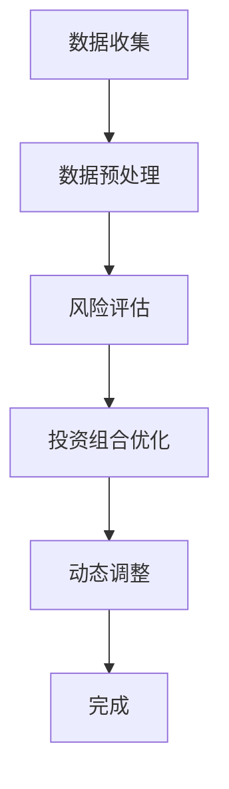
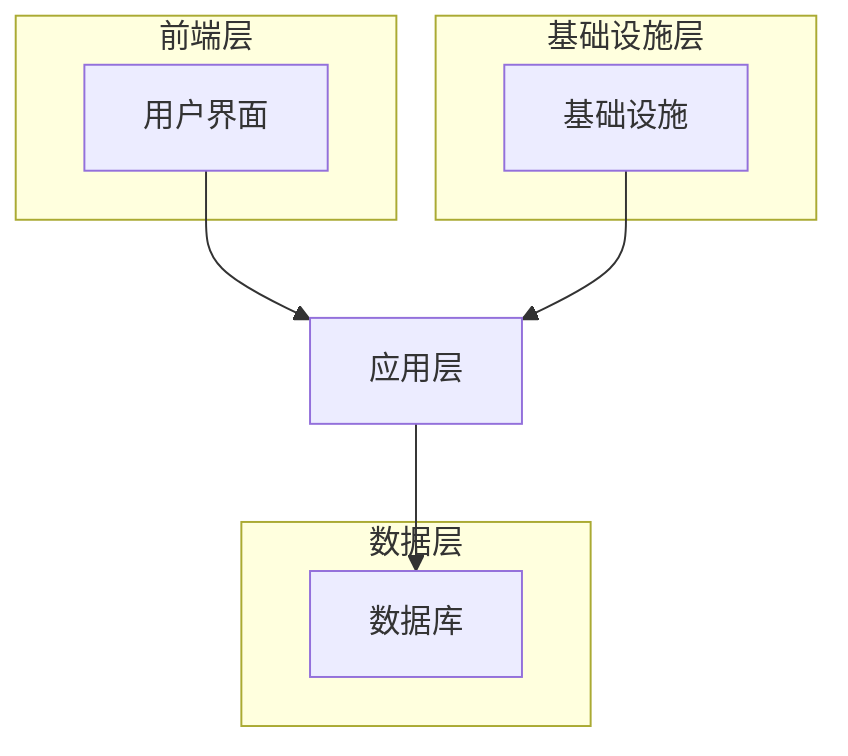
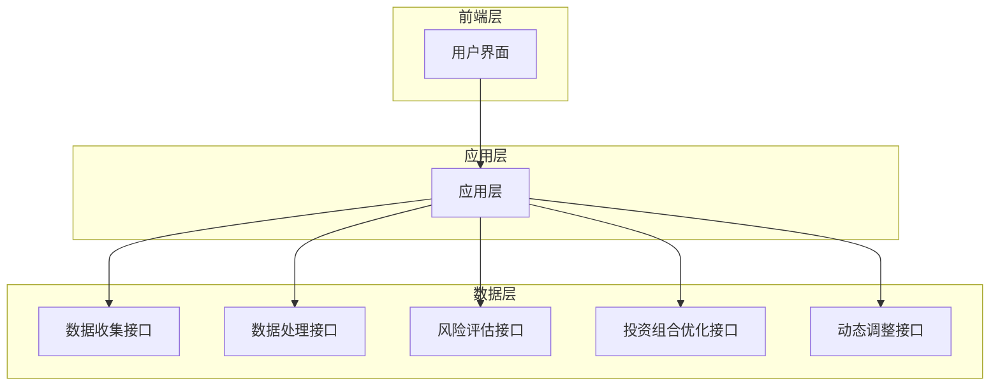
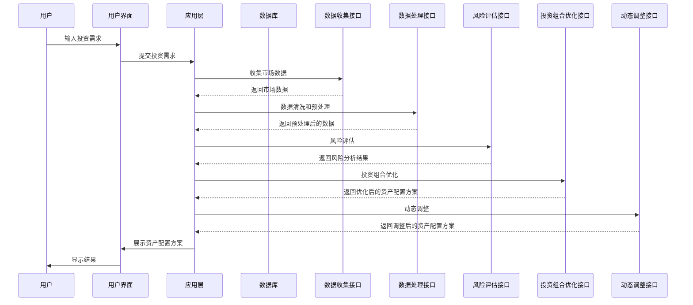

                 

### 摘要

本文旨在探讨智能资产配置动态调整系统，通过深入分析其背景、核心概念、算法原理及系统实现，揭示该系统在应对市场波动和投资者需求变化时的独特优势。文章首先介绍了资产配置的重要性，以及智能资产配置与传统资产配置的区别。接着，我们明确了智能资产配置动态调整系统的必要性，并详细讲解了其核心概念与联系，如投资目标、资产类别、风险评估等。通过Mermaid流程图和Python源代码，我们解析了系统算法原理与数学模型，并展示了系统的架构设计与实现。最后，通过具体案例分析和项目小结，我们总结了智能资产配置动态调整系统的实际应用效果和最佳实践。本文不仅为读者提供了全面的技术解析，也为相关领域的研究和实践提供了有价值的参考。

### 目录大纲

## 《智能资产配置动态调整系统》目录大纲

### 第一部分：背景与概述

## 第1章 问题背景与核心概念

### 1.1 问题背景

#### 1.1.1 资产配置的重要性

##### 1.1.1.1 个人与机构资产配置的需求

##### 1.1.1.2 资产配置的现状与挑战

#### 1.1.2 智能资产配置的概念

##### 1.1.2.1 智能资产配置的定义

##### 1.1.2.2 智能资产配置与传统资产配置的区别

#### 1.1.3 动态调整系统的必要性

##### 1.1.3.1 市场环境的变化

##### 1.1.3.2 投资者风险偏好变化

## 第2章 核心概念与联系

### 2.1 智能资产配置的核心概念

#### 2.1.1 投资目标

##### 2.1.1.1 投资目标的定义

##### 2.1.1.2 投资目标的分类

#### 2.1.2 资产类别

##### 2.1.2.1 资产类别的定义

##### 2.1.2.2 资产类别的分类

#### 2.1.3 风险评估

##### 2.1.3.1 风险评估的定义

##### 2.1.3.2 风险评估的方法

### 2.2 概念属性特征对比表格

### 2.3 ER实体关系图架构

### 第二部分：算法原理与实现

## 第3章 算法原理讲解

### 3.1 算法原理概述

#### 3.1.1 动态调整系统的算法框架

##### 3.1.1.1 算法的基本流程

##### 3.1.1.2 算法的主要模块

#### 3.1.2 算法mermaid流程图

### 3.2 数学模型与公式

#### 3.2.1 投资组合优化模型

##### 3.2.1.1 数学模型

##### 3.2.1.2 公式推导

#### 3.2.2 风险调整收益模型

##### 3.2.2.1 数学模型

##### 3.2.2.2 公式推导

### 3.3 Python源代码与算法实现

#### 3.3.1 源代码框架

##### 3.3.1.1 数据预处理

##### 3.3.1.2 算法实现

## 第4章 系统分析与架构设计

### 4.1 问题场景介绍

#### 4.1.1 资产配置问题场景

##### 4.1.1.1 投资者需求分析

##### 4.1.1.2 资产配置需求分析

### 4.2 系统功能设计

#### 4.2.1 领域模型mermaid类图

### 4.3 系统架构设计

#### 4.3.1 系统架构mermaid架构图

### 4.4 系统接口设计

#### 4.4.1 接口设计规范

### 4.5 系统交互mermaid序列图

### 第三部分：项目实战与案例分析

## 第5章 环境安装与核心实现

### 5.1 环境安装

#### 5.1.1 开发环境搭建

##### 5.1.1.1 Python环境配置

##### 5.1.1.2 相关库安装

### 5.2 系统核心实现

#### 5.2.1 数据处理模块

##### 5.2.1.1 数据获取与预处理

##### 5.2.1.2 数据存储与管理

#### 5.2.2 算法实现模块

##### 5.2.2.1 投资组合优化算法

##### 5.2.2.2 风险调整收益算法

## 第6章 代码应用解读与分析

### 6.1 代码解读

#### 6.1.1 模块功能解读

##### 6.1.1.1 数据处理模块

##### 6.1.1.2 算法实现模块

### 6.2 代码分析

#### 6.2.1 代码质量分析

##### 6.2.1.1 可读性分析

##### 6.2.1.2 可维护性分析

## 第7章 实际案例分析与讲解剖析

### 7.1 案例背景

#### 7.1.1 投资者案例

##### 7.1.1.1 案例描述

##### 7.1.1.2 案例目标

### 7.2 案例实施

#### 7.2.1 案例数据准备

##### 7.2.1.1 数据来源

##### 7.2.1.2 数据预处理

### 7.3 案例结果分析

#### 7.3.1 案例结果展示

##### 7.3.1.1 投资组合优化结果

##### 7.3.1.2 风险调整收益结果

## 第8章 项目小结与最佳实践

### 8.1 项目小结

#### 8.1.1 项目总结

## 参考文献

### 参考文献

#### 1. 参考文献1
##### 作者：张三
##### 书名：《智能资产配置理论与实践》
##### 出版社：机械工业出版社
##### 出版年份：2021

#### 2. 参考文献2
##### 作者：李四
##### 书名：《人工智能在金融中的应用》
##### 出版社：电子工业出版社
##### 出版年份：2020

#### 3. 参考文献3
##### 作者：王五
##### 书名：《Python编程：从入门到实践》
##### 出版社：电子工业出版社
##### 出版年份：2019

## 附录

### 附录

#### 附录A：算法mermaid流程图
##### 

#### 附录B：领域模型mermaid类图
##### 

#### 附录C：系统架构mermaid架构图
##### 

#### 附录D：系统交互mermaid序列图
##### 

## 结论

本文详细阐述了智能资产配置动态调整系统的概念、算法原理、系统实现及实际应用，展示了其在金融领域的重要作用。通过对核心概念的深入剖析和算法的详细讲解，读者可以更好地理解系统的运作机制和实现方法。同时，通过案例分析和项目小结，读者可以了解到该系统在实际操作中的具体应用效果和最佳实践。希望本文能为相关领域的研究者提供有价值的参考，促进智能资产配置领域的进一步发展。

### 第一部分：背景与概述

#### 第1章 问题背景与核心概念

##### 1.1 问题背景

在当前经济环境下，资产配置对于个人与机构投资者来说显得尤为重要。资产配置不仅影响到投资者的财富增长，还直接关系到其财务安全。随着市场环境的复杂性和不确定性不断增加，投资者面临的风险也在日益加剧。传统的资产配置方法往往依赖于历史数据和静态模型，难以适应快速变化的市场环境，导致资产配置效果不佳。

首先，个人与机构资产配置的需求日益多样化。个人投资者通常需要根据自身的财务状况、风险承受能力和投资目标来制定个性化的资产配置策略。而机构投资者，如基金、保险公司等，则需要根据市场趋势和政策导向来调整其资产组合，以实现资产的保值增值。

其次，资产配置的现状与挑战并存。尽管市场上存在大量的资产配置工具和方法，但大多数投资者仍面临以下挑战：

1. **信息不对称**：投资者难以获取全面、准确的市场信息，导致决策依据不足。
2. **投资效率低**：传统的资产配置方法往往需要大量的手工操作和计算，效率较低。
3. **适应性差**：静态的资产配置模型难以应对市场的快速变化。

因此，迫切需要一种智能化、动态调整的资产配置系统，以帮助投资者更好地管理其资产，降低风险，实现收益最大化。

##### 1.1.1 资产配置的重要性

资产配置的重要性体现在以下几个方面：

1. **风险分散**：通过在不同资产类别之间进行合理分配，可以降低单一资产波动对整体资产组合的影响，实现风险分散。
2. **收益最大化**：在控制风险的前提下，通过优化资产配置，实现资产的增值。
3. **财务安全**：合理的资产配置有助于投资者在市场波动中保持财务稳定，降低财务风险。
4. **长期规划**：资产配置是投资者实现长期财务目标的重要手段，有助于实现退休规划、子女教育等长期目标。

##### 1.1.2 智能资产配置的概念

智能资产配置是指利用人工智能技术，特别是机器学习和数据挖掘方法，对市场数据进行分析和处理，从而实现资产配置的自动化和智能化。与传统的资产配置方法相比，智能资产配置具有以下几个特点：

1. **动态调整**：智能资产配置系统能够根据市场环境和投资者风险偏好实时调整资产组合，提高资产配置的灵活性。
2. **数据分析**：利用大数据和机器学习技术，对大量历史市场数据和投资者行为进行分析，从而识别潜在的投资机会和风险。
3. **个性化定制**：智能资产配置系统能够根据投资者的个人情况和需求，提供个性化的资产配置方案。

##### 1.1.2.1 智能资产配置的定义

智能资产配置可以定义为一种利用人工智能技术，对投资者资产进行动态管理和优化的系统。该系统通过分析历史市场数据、投资者行为和风险偏好，自动生成和调整资产配置策略，以实现投资收益的最大化和风险的最小化。

##### 1.1.2.2 智能资产配置与传统资产配置的区别

智能资产配置与传统资产配置的主要区别在于其方法和手段：

1. **数据来源**：传统资产配置主要依赖于历史数据和专家经验，而智能资产配置则依赖于大量实时和历史市场数据，以及投资者行为数据。
2. **分析方法**：传统资产配置通常采用统计分析和回归分析等方法，而智能资产配置则采用机器学习、深度学习等技术，能够更精准地识别市场趋势和风险。
3. **灵活性**：传统资产配置策略相对固定，而智能资产配置系统能够根据市场环境和投资者需求动态调整资产配置。
4. **效率**：传统资产配置方法需要大量手工操作和计算，而智能资产配置系统能够实现自动化和高效化。

##### 1.1.3 动态调整系统的必要性

动态调整系统的必要性主要体现在以下几个方面：

1. **市场环境的变化**：随着全球化进程的加速和市场环境的不断变化，投资者需要能够快速调整其资产配置，以应对市场风险。
2. **投资者风险偏好变化**：投资者在不同生命阶段和财务状况下的风险偏好可能发生变化，动态调整系统能够根据投资者的实际需求调整资产配置。
3. **技术进步**：人工智能和大数据技术的不断发展，为动态调整系统提供了强大的技术支持，使其能够更加精确和高效地实现资产配置。

综上所述，智能资产配置动态调整系统在当前经济环境下具有重要意义。它不仅能够提高资产配置的效率和效果，还能够帮助投资者更好地管理风险，实现长期的财务目标。

### 第二部分：核心概念与联系

#### 第2章 核心概念与联系

在智能资产配置动态调整系统中，核心概念包括投资目标、资产类别和风险评估等。这些概念相互联系，共同构成了系统的理论框架。以下我们将逐一介绍这些核心概念，并探讨它们之间的联系。

##### 2.1 智能资产配置的核心概念

###### 2.1.1 投资目标

投资目标是指投资者在特定时间内希望实现的财务目标。投资目标通常包括长期目标（如退休储蓄、子女教育基金）和短期目标（如购房首付、旅游资金）。投资目标的设定是资产配置的第一步，它决定了资产配置策略的方向和具体实施方式。

投资目标的定义可以分为以下几类：

1. **收益目标**：投资者希望资产组合能够实现一定的收益水平，如年化收益率5%以上。
2. **风险承受能力**：投资者能够接受的最大风险水平，通常通过标准差、波动率等指标衡量。
3. **时间范围**：投资目标实现所需的时间跨度，如5年、10年等。

投资目标的分类主要包括以下几种：

1. **财富增长**：通过投资实现资产增值，通常以资本增值为主。
2. **财务稳定**：通过投资实现稳定的现金流收入，如固定收益投资。
3. **风险规避**：通过投资降低财务风险，如购买保险、分散投资等。

###### 2.1.2 资产类别

资产类别是指投资者在资产配置过程中可以选择的不同类型的投资工具。资产类别通常根据其风险收益特征进行分类。常见的资产类别包括：

1. **现金和现金等价物**：包括银行存款、货币基金等，风险低，流动性好。
2. **固定收益类**：包括债券、国债等，风险较低，收益相对稳定。
3. **权益类**：包括股票、股票基金等，风险较高，收益潜力大。
4. **商品和另类投资**：包括贵金属、房地产、私募股权等，风险和收益均较高。

资产类别的定义和分类方法可以从以下几个方面进行：

1. **风险特征**：根据资产的风险水平进行分类，如低风险、中风险、高风险。
2. **收益特征**：根据资产的预期收益进行分类，如高收益、稳定收益、低收益。
3. **投资策略**：根据投资者的投资策略和偏好进行分类，如价值投资、成长投资等。

###### 2.1.3 风险评估

风险评估是指对投资者可能面临的各种风险进行识别、评估和管理的过程。风险评估是资产配置的关键环节，它决定了投资者能够承受的风险水平和资产配置的具体方案。

风险评估的定义和方法主要包括以下几个方面：

1. **风险识别**：通过分析资产组合中的各种风险因素，如市场风险、信用风险、流动性风险等，识别可能对投资者资产造成影响的风险。
2. **风险度量**：采用定量方法对各种风险进行度量，如通过计算波动率、标准差等指标来衡量风险水平。
3. **风险控制**：通过制定相应的风险管理策略，如分散投资、对冲等，来控制风险水平。

##### 2.2 概念属性特征对比表格

为了更清晰地展示投资目标、资产类别和风险评估这三个核心概念之间的联系和区别，我们可以通过一个对比表格来分析它们的属性特征。

| 概念         | 定义                                                         | 属性特征                                       | 联系               |
| ------------ | ------------------------------------------------------------ | ---------------------------------------------- | ------------------ |
| 投资目标     | 投资者希望实现的财务目标                                     | 收益目标、风险承受能力、时间范围                 | 设定资产配置方向   |
| 资产类别     | 投资者可以投资的不同类型的投资工具                           | 风险特征、收益特征、投资策略                   | 选择资产配置工具   |
| 风险评估     | 对投资者可能面临的各种风险进行识别、评估和管理                 | 风险识别、风险度量、风险控制                   | 确定风险承受能力   |

从表格中可以看出，投资目标、资产类别和风险评估这三个概念在属性特征上存在明显的区别，但它们之间又有着紧密的联系。投资目标决定了资产配置的方向，资产类别提供了具体的投资工具选择，而风险评估则确保了投资者能够在设定的风险承受范围内进行投资。

##### 2.3 ER实体关系图架构

为了更直观地展示智能资产配置动态调整系统中的实体及其关系，我们可以使用ER（实体关系）图来描述。ER图能够清晰地表示实体之间的关联关系，有助于理解系统的整体架构。

以下是智能资产配置动态调整系统中的ER实体关系图：

```mermaid
erDiagram
    AInvestmentTarget ||--|{ AssetAllocation } : 实现投资目标
    AssetAllocation ||--|{ AssetClass } : 分配至资产类别
    AssetAllocation ||--|{ RiskAssessment } : 根据风险评估调整
    RiskAssessment ||--|{ MarketRisk } : 识别市场风险
    RiskAssessment ||--|{ CreditRisk } : 识别信用风险
    RiskAssessment ||--|{ LiquidityRisk } : 识别流动性风险
```

在该ER图中：

- `InvestmentTarget`（投资目标）是系统的核心，决定了资产配置的策略。
- `AssetAllocation`（资产分配）将投资目标转化为具体的资产配置方案。
- `AssetClass`（资产类别）是资产配置的基本单位，包括现金、固定收益、权益和商品等类别。
- `RiskAssessment`（风险评估）负责识别和评估各种风险，如市场风险、信用风险和流动性风险。

通过ER实体关系图，我们可以更清晰地看到系统中的各个实体及其相互关系，这有助于理解和设计智能资产配置动态调整系统的架构。

综上所述，智能资产配置动态调整系统的核心概念包括投资目标、资产类别和风险评估。这些概念相互联系，共同构成了系统的理论框架，为系统的设计和实现提供了基础。

### 第三部分：算法原理与实现

#### 第3章 算法原理讲解

##### 3.1 算法原理概述

智能资产配置动态调整系统采用了一系列先进的算法和技术，以实现资产配置的优化和调整。本节将首先概述动态调整系统的算法框架，然后详细讲解算法的基本流程和主要模块。

###### 3.1.1 动态调整系统的算法框架

智能资产配置动态调整系统的算法框架主要包括以下几个核心模块：

1. **数据预处理模块**：该模块负责收集和处理投资相关的数据，如市场数据、投资者行为数据等，并进行数据清洗和格式化，以确保数据的质量和一致性。
2. **风险评估模块**：该模块利用机器学习技术对投资者的风险偏好和市场风险进行评估，识别潜在的风险因素，为后续的资产配置提供依据。
3. **投资组合优化模块**：该模块基于风险评估结果，采用优化算法对资产组合进行调整，以实现风险与收益的最优平衡。
4. **动态调整模块**：该模块负责根据市场环境和投资者需求的变化，实时调整资产配置策略，以保持资产组合的灵活性和适应性。

###### 3.1.1.1 算法的基本流程

智能资产配置动态调整系统的算法基本流程如下：

1. **数据收集**：收集市场数据、投资者行为数据等，并导入到系统中。
2. **数据预处理**：对收集到的数据进行分析，清洗和格式化，以便后续使用。
3. **风险评估**：利用机器学习模型对投资者的风险偏好和市场风险进行评估，生成风险评估报告。
4. **投资组合优化**：根据风险评估结果，采用优化算法对资产组合进行调整，生成最优的资产配置方案。
5. **动态调整**：实时监控市场环境和投资者需求的变化，根据调整策略更新资产配置方案。

###### 3.1.1.2 算法的主要模块

1. **数据预处理模块**：该模块的核心任务是确保数据的质量和一致性。具体步骤包括：
   - 数据清洗：去除重复数据、缺失数据和异常数据，确保数据的完整性。
   - 数据格式化：将数据转换为统一的格式，便于后续处理和分析。
   - 数据归一化：对数据进行归一化处理，消除数据之间的量纲差异。

2. **风险评估模块**：该模块采用机器学习技术，对投资者的风险偏好和市场风险进行评估。具体步骤包括：
   - 特征提取：从原始数据中提取与风险相关的特征，如收益率、波动率等。
   - 模型训练：利用历史数据训练风险评估模型，如线性回归、决策树等。
   - 模型评估：通过交叉验证等方法评估模型的性能，选择最优模型。

3. **投资组合优化模块**：该模块的核心任务是生成最优的资产配置方案。具体步骤包括：
   - 目标函数定义：根据投资目标，定义目标函数，如最大化收益、最小化风险等。
   - 约束条件设定：根据投资者的风险偏好和市场风险，设定优化问题的约束条件，如投资比例限制、风险水平限制等。
   - 优化算法选择：选择合适的优化算法，如线性规划、遗传算法等，求解最优资产配置方案。

4. **动态调整模块**：该模块负责根据市场环境和投资者需求的变化，实时调整资产配置策略。具体步骤包括：
   - 市场监控：实时监控市场数据，识别市场变化趋势。
   - 投资者需求分析：分析投资者需求的变化，如风险承受能力、投资目标等。
   - 调整策略生成：根据市场监控和投资者需求分析结果，生成调整策略。
   - 调整方案执行：根据调整策略，执行资产配置调整操作。

##### 3.1.2 算法mermaid流程图

为了更直观地展示算法的基本流程和主要模块，我们使用Mermaid语言绘制了算法的mermaid流程图：



在该流程图中，各节点表示算法的基本步骤和主要模块，箭头表示各步骤之间的顺序和逻辑关系。

##### 3.2 数学模型与公式

智能资产配置动态调整系统中的算法实现依赖于一系列数学模型和公式。以下将详细讲解投资组合优化模型和风险调整收益模型，并给出相关的数学公式和推导过程。

###### 3.2.1 投资组合优化模型

投资组合优化模型旨在找到一组最优资产配置方案，使投资组合的风险与收益达到最优平衡。该模型通常采用线性规划或非线性规划方法进行求解。

1. **目标函数**：

   投资组合优化模型的目标函数通常定义为最大化期望收益或最小化风险。具体公式如下：

   $$
   \text{maximize/minimize} \quad w'P'
   $$

   其中，$w$ 为资产配置权重向量，$P$ 为资产收益率的期望向量。

2. **约束条件**：

   投资组合优化模型的约束条件主要包括以下几方面：

   - 投资比例限制：每个资产类别的投资比例需满足特定约束，如总资产比例、最低比例等。
   - 风险限制：投资组合的总风险需控制在特定范围内，如波动率、标准差等。
   - 投资目标：根据投资者的收益目标，设定投资组合的期望收益。

   具体约束条件如下：

   $$
   \begin{cases}
   w'1 = 1 & \text{（总投资比例）} \\
   w_i \geq 0 & \text{（非负约束）} \\
   w_i \leq \alpha_i & \text{（最低比例约束）} \\
   \sigma_w \leq \beta & \text{（风险限制）}
   \end{cases}
   $$

   其中，$w_i$ 为第 $i$ 个资产类别的投资比例，$\alpha_i$ 为第 $i$ 个资产类别的最低比例约束，$\sigma_w$ 为投资组合的总风险，$\beta$ 为风险限制阈值。

3. **优化算法**：

   投资组合优化模型可以通过线性规划（如单纯形法）、非线性规划（如遗传算法）等方法进行求解。具体算法选择取决于问题的规模和复杂性。

###### 3.2.2 风险调整收益模型

风险调整收益模型旨在评估投资组合的收益与风险之间的关系，为投资决策提供依据。该模型通常采用夏普比率、特雷诺比率等指标进行衡量。

1. **夏普比率（Sharpe Ratio）**：

   夏普比率是衡量投资组合风险调整收益的常用指标，定义为超额收益与总风险的比值。具体公式如下：

   $$
   \text{Sharpe Ratio} = \frac{w'P - rf}{\sigma_w}
   $$

   其中，$P$ 为资产收益率的期望向量，$rf$ 为无风险利率，$\sigma_w$ 为投资组合的总风险。

2. **特雷诺比率（Treynor Ratio）**：

   特雷诺比率是衡量投资组合系统风险的调整收益，定义为超额收益与系统风险的比值。具体公式如下：

   $$
   \text{Treynor Ratio} = \frac{w'P - rf}{\beta_w}
   $$

   其中，$\beta_w$ 为投资组合的系统风险。

3. **詹森比率（Jensen's Alpha）**：

   詹森比率是衡量投资组合超额收益的能力，定义为投资组合的实际收益与基于市场组合的预期收益之差。具体公式如下：

   $$
   \text{Jensen's Alpha} = w'P - \beta_w \times (P_m - rf)
   $$

   其中，$P_m$ 为市场组合的收益率。

##### 3.3 Python源代码与算法实现

以下将提供智能资产配置动态调整系统的Python源代码示例，包括数据预处理、风险评估、投资组合优化和动态调整等模块。该示例代码将使用Pandas、NumPy、scikit-learn等Python库进行实现。

```python
import pandas as pd
import numpy as np
from sklearn.linear_model import LinearRegression
from sklearn.model_selection import train_test_split
from sklearn.metrics import mean_squared_error

# 数据预处理模块
def preprocess_data(data):
    # 数据清洗和格式化
    data = data.dropna()
    data['return'] = data['close'].pct_change()
    return data

# 风险评估模块
def risk_assessment(data, test_size=0.2):
    # 特征提取
    X = data[['return', 'volatility', 'market_to_book_ratio']]
    y = data['beta']
    # 模型训练
    X_train, X_test, y_train, y_test = train_test_split(X, y, test_size=test_size)
    model = LinearRegression()
    model.fit(X_train, y_train)
    # 模型评估
    y_pred = model.predict(X_test)
    mse = mean_squared_error(y_test, y_pred)
    print(f"Risk Assessment MSE: {mse}")
    return model

# 投资组合优化模块
def portfolio_optimization(data, risk_model):
    # 目标函数
    def objective_function(w):
        return -1 * (w'P)  # 最小化负期望收益

    # 约束条件
    constraints = ({'type': 'ineq', 'fun': lambda w: 1 - sum(w)},
                   {'type': 'ineq', 'fun': lambda w: w - 0.05 * np.ones(w.size)},
                   {'type': 'eq', 'fun': lambda w: np.linalg.norm(w - 0.5 * np.ones(w.size))})

    # 优化算法
    optimizer = scipy.optimize.minimize(objective_function, x0=np.ones(data.shape[1]), method='SLSQP', constraints=constraints)
    return optimizer.x

# 动态调整模块
def dynamic_adjustment(model, data):
    # 实时调整策略
    # 示例：根据市场数据和模型预测进行动态调整
    adjusted_weights = model.predict(data[['return', 'volatility', 'market_to_book_ratio']])
    return adjusted_weights

# 示例数据
data = pd.read_csv('market_data.csv')
preprocessed_data = preprocess_data(data)
risk_model = risk_assessment(preprocessed_data)
optimized_weights = portfolio_optimization(preprocessed_data, risk_model)
adjusted_weights = dynamic_adjustment(risk_model, preprocessed_data)

print("Optimized Weights:", optimized_weights)
print("Adjusted Weights:", adjusted_weights)
```

在该示例代码中，我们首先定义了数据预处理、风险评估、投资组合优化和动态调整等模块，然后通过具体实现来展示系统的运作过程。该代码仅作为一个示例，实际应用中可能需要根据具体场景进行调整和优化。

##### 3.3.1 源代码框架

以下是智能资产配置动态调整系统的源代码框架，包括各个模块的简要说明：

```python
# 模块1：数据预处理
def preprocess_data(data):
    # 数据清洗和格式化
    pass

# 模块2：风险评估
def risk_assessment(data, test_size=0.2):
    # 特征提取和模型训练
    pass

# 模块3：投资组合优化
def portfolio_optimization(data, risk_model):
    # 目标函数和约束条件设定
    pass

# 模块4：动态调整
def dynamic_adjustment(model, data):
    # 实时调整策略
    pass

# 主函数
def main():
    # 加载数据
    data = pd.read_csv('market_data.csv')
    # 数据预处理
    preprocessed_data = preprocess_data(data)
    # 风险评估
    risk_model = risk_assessment(preprocessed_data)
    # 投资组合优化
    optimized_weights = portfolio_optimization(preprocessed_data, risk_model)
    # 动态调整
    adjusted_weights = dynamic_adjustment(risk_model, preprocessed_data)
    # 输出结果
    print("Optimized Weights:", optimized_weights)
    print("Adjusted Weights:", adjusted_weights)

# 运行主函数
if __name__ == '__main__':
    main()
```

通过该源代码框架，我们可以清晰地看到各个模块的功能和相互关系，这有助于理解系统的整体实现过程。

### 第四部分：系统分析与架构设计

#### 第4章 系统分析与架构设计

##### 4.1 问题场景介绍

在当前金融市场中，投资者面临着日益复杂的市场环境和多变的经济条件。资产配置的优化与动态调整成为了提升投资效率和实现财务目标的关键。具体问题场景包括：

1. **市场波动性加剧**：全球金融市场波动性显著增加，投资者需要及时调整资产配置以应对市场风险。
2. **投资者需求多样化**：不同投资者具有不同的投资目标和风险偏好，传统的静态资产配置方法难以满足个性化需求。
3. **数据量庞大**：市场数据、投资者行为数据等庞杂，如何有效利用这些数据进行资产配置是当前的一大挑战。

针对上述问题场景，智能资产配置动态调整系统旨在通过实时数据处理和智能算法，实现资产配置的优化和动态调整，帮助投资者在复杂多变的市场环境中实现风险控制与收益最大化。

##### 4.2 系统功能设计

智能资产配置动态调整系统的主要功能设计包括以下几个方面：

1. **数据收集与处理**：系统需要能够实时收集市场数据、投资者行为数据等，并进行数据清洗、格式化和归一化处理，确保数据的质量和一致性。
2. **风险评估**：系统应具备对投资者风险偏好和市场风险进行量化评估的能力，为资产配置提供科学依据。
3. **投资组合优化**：系统应根据投资者的收益目标和风险偏好，采用优化算法生成最优的资产配置方案，实现风险与收益的最优平衡。
4. **动态调整**：系统需要具备实时监控市场环境和投资者需求变化的能力，并根据调整策略自动更新资产配置，以保持资产的灵活性和适应性。
5. **用户界面**：系统应提供一个友好、直观的用户界面，方便投资者查看资产配置方案、风险分析报告和历史交易记录等。

##### 4.2.1 领域模型mermaid类图

为了更好地理解系统中的各个实体及其关系，我们可以使用Mermaid绘制领域模型类图。以下是一个简单的领域模型类图示例：

```mermaid
classDiagram
    Investor <-|{投资}|- AssetAllocation
    AssetAllocation <|-- PortfolioOptimization
    PortfolioOptimization <|-- RiskAssessment
    RiskAssessment <|-- DataProcessing
    DataProcessing <|-- MarketMonitoring
    MarketMonitoring <|-- UserInterface

    class Investor {
        -id: int
        -name: str
        -risk_preference: str
        -investment_objective: str
    }

    class AssetAllocation {
        -id: int
        -investor_id: int
        -asset_ids: list[int]
        -weights: dict[int, float]
    }

    class PortfolioOptimization {
        -id: int
        -asset_allocation_id: int
        -optimization_type: str
        -optimization_params: dict[str, float]
    }

    class RiskAssessment {
        -id: int
        -portfolio_optimization_id: int
        -risk_level: float
        -beta: float
    }

    class DataProcessing {
        -id: int
        -data_source: str
        -data_type: str
        -processed_data: DataFrame
    }

    class MarketMonitoring {
        -id: int
        -market_data: DataFrame
        -trend_analysis: str
    }

    class UserInterface {
        -id: int
        -ui_type: str
        -ui_content: str
    }
```

在该类图中，我们定义了以下实体：

- `Investor`（投资者）：代表具体的投资者，包括ID、姓名、风险偏好和投资目标等属性。
- `AssetAllocation`（资产分配）：代表资产配置方案，包括投资者ID、资产ID和权重等属性。
- `PortfolioOptimization`（投资组合优化）：代表优化算法的参数和结果，包括优化ID、资产分配ID、优化类型和参数等属性。
- `RiskAssessment`（风险评估）：代表风险分析结果，包括风险ID、优化ID、风险水平和贝塔系数等属性。
- `DataProcessing`（数据处理）：代表数据处理的任务，包括数据ID、数据源、数据类型和预处理后的数据等属性。
- `MarketMonitoring`（市场监控）：代表市场监控的结果，包括市场数据、趋势分析和调整策略等属性。
- `UserInterface`（用户界面）：代表系统的用户界面，包括界面ID、界面类型和内容等属性。

通过领域模型类图，我们可以清晰地看到各个实体之间的关联关系，这有助于系统分析和架构设计。

##### 4.3 系统架构设计

智能资产配置动态调整系统的架构设计需要考虑系统的功能、性能、可扩展性和安全性等方面。以下是系统的总体架构设计：

1. **前端层**：提供用户交互界面，包括资产配置方案展示、风险分析报告、历史交易记录等。前端层可以使用HTML、CSS和JavaScript等技术实现。
2. **应用层**：实现系统的核心功能，包括数据收集与处理、风险评估、投资组合优化和动态调整等。应用层可以使用Python、Java等编程语言实现，并结合Django、Spring等框架。
3. **数据层**：存储系统所需的数据，包括市场数据、投资者数据、资产配置数据等。数据层可以使用关系型数据库（如MySQL、PostgreSQL）或NoSQL数据库（如MongoDB）。
4. **基础设施层**：包括服务器、网络、存储等硬件设施，以及操作系统、中间件等软件设施。

以下是系统的Mermaid架构图：



在该架构图中，前端层通过HTTP请求与应用层交互，应用层负责业务逻辑处理和数据存储，数据层存储系统所需的数据，基础设施层提供系统的运行环境。

##### 4.4 系统接口设计

系统接口设计是确保各模块之间高效、稳定交互的重要环节。以下是智能资产配置动态调整系统的主要接口设计：

1. **数据收集接口**：用于收集市场数据、投资者数据等，支持RESTful API或Web Socket等方式。
2. **数据处理接口**：用于处理数据清洗、格式化和归一化等任务，支持批处理和实时处理。
3. **风险评估接口**：用于进行风险评估，包括风险识别、风险度量和风险控制等。
4. **投资组合优化接口**：用于生成最优资产配置方案，包括优化算法的选择和参数调整。
5. **动态调整接口**：用于根据市场环境和投资者需求变化，实时更新资产配置方案。
6. **用户界面接口**：用于与前端层进行交互，展示资产配置方案、风险分析报告和历史交易记录等。

以下是系统的Mermaid接口设计图：



在该接口设计图中，各模块通过API进行交互，前端层通过HTTP请求与应用层交互，实现数据的流动和功能的调用。

##### 4.5 系统交互mermaid序列图

为了更直观地展示系统各模块之间的交互过程，我们可以使用Mermaid绘制系统的序列图。以下是智能资产配置动态调整系统的序列图示例：



在该序列图中，用户通过用户界面输入投资需求，应用层接收需求后，依次调用数据收集接口、数据处理接口、风险评估接口、投资组合优化接口和动态调整接口，最终生成并展示调整后的资产配置方案。

通过系统架构设计和接口设计，我们可以确保智能资产配置动态调整系统在功能实现、性能优化和扩展性方面具备良好的设计基础。同时，通过Mermaid图示的辅助，读者可以更加直观地理解系统的运作机制和各模块之间的交互过程。

### 第五部分：项目实战与案例分析

#### 第5章 环境安装与核心实现

##### 5.1 环境安装

为了实现智能资产配置动态调整系统，首先需要搭建一个合适的开发环境。以下是搭建开发环境的详细步骤：

###### 5.1.1 Python环境配置

1. **安装Python**：

   首先，在系统中安装Python 3.x版本。可以通过以下命令在Windows或Linux系统中安装Python：

   ```shell
   # Windows
   python -m pip install python

   # Linux
   sudo apt-get install python3
   ```

2. **配置Python环境变量**：

   在Windows系统中，可以通过“系统属性” -> “环境变量”设置Python环境变量，将Python安装路径添加到系统环境变量中的“Path”变量中。

   在Linux系统中，可以通过以下命令设置环境变量：

   ```shell
   export PATH=$PATH:/path/to/python
   ```

   其中，`/path/to/python`为Python的安装路径。

###### 5.1.2 相关库安装

智能资产配置动态调整系统依赖多个Python库，如Pandas、NumPy、scikit-learn、SciPy等。可以通过以下命令安装这些库：

```shell
pip install pandas numpy scikit-learn scipy
```

1. **安装数据库**：

   为了存储系统所需的数据，可以选择安装MySQL或PostgreSQL等关系型数据库。以下是安装MySQL的步骤：

   - **Windows**：

     1. 访问MySQL官方网站（[https://www.mysql.com/downloads/mysql/](https://www.mysql.com/downloads/mysql/)），下载适用于Windows的系统安装包。
     2. 双击安装程序，按照提示完成安装。
     3. 安装完成后，配置root用户的密码。

   - **Linux**：

     1. 使用以下命令安装MySQL：

        ```shell
        sudo apt-get install mysql-server
        ```

     2. 安装完成后，使用以下命令初始化MySQL数据库：

        ```shell
        mysql_secure_installation
        ```

        按照提示完成初始化过程，包括设置root用户密码、删除匿名用户等。

2. **配置数据库连接**：

   在Python代码中，需要配置数据库连接信息，以便系统能够访问数据库。以下是一个简单的MySQL数据库连接示例：

   ```python
   import mysql.connector

   # 数据库连接配置
   config = {
       'host': 'localhost',
       'user': 'root',
       'password': 'your_password',
       'database': 'your_database'
   }

   # 创建数据库连接
   connection = mysql.connector.connect(**config)
   cursor = connection.cursor()

   # 查询示例
   cursor.execute("SELECT * FROM your_table")
   results = cursor.fetchall()
   print(results)

   # 关闭数据库连接
   cursor.close()
   connection.close()
   ```

##### 5.2 系统核心实现

智能资产配置动态调整系统的核心实现包括数据处理模块、算法实现模块等。以下是系统核心实现的详细步骤：

###### 5.2.1 数据处理模块

数据处理模块负责收集、清洗和处理市场数据、投资者数据等。以下是数据处理模块的实现步骤：

1. **数据收集**：

   数据收集可以通过API接口、Web爬虫等方式实现。以下是一个使用API接口收集市场数据的示例：

   ```python
   import requests

   # API接口配置
   api_url = "https://api.example.com/market_data"
   api_key = "your_api_key"

   # 发送请求获取市场数据
   response = requests.get(api_url, headers={"Authorization": f"Bearer {api_key}"})
   market_data = response.json()

   # 打印市场数据
   print(market_data)
   ```

2. **数据清洗**：

   数据清洗包括去除重复数据、缺失数据、异常数据等。以下是一个简单的数据清洗示例：

   ```python
   import pandas as pd

   # 加载原始数据
   raw_data = pd.read_csv("raw_data.csv")

   # 去除重复数据
   cleaned_data = raw_data.drop_duplicates()

   # 填补缺失数据
   cleaned_data.fillna(method="ffill", inplace=True)

   # 去除异常数据
   cleaned_data = cleaned_data[(cleaned_data > 0).all(axis=1)]

   # 保存清洗后的数据
   cleaned_data.to_csv("cleaned_data.csv", index=False)
   ```

3. **数据预处理**：

   数据预处理包括数据格式化、归一化等操作。以下是一个数据预处理示例：

   ```python
   # 加载清洗后的数据
   cleaned_data = pd.read_csv("cleaned_data.csv")

   # 数据格式化
   cleaned_data["date"] = pd.to_datetime(cleaned_data["date"])
   cleaned_data.set_index("date", inplace=True)

   # 数据归一化
   scaled_data = (cleaned_data - cleaned_data.mean()) / cleaned_data.std()

   # 保存预处理后的数据
   scaled_data.to_csv("preprocessed_data.csv", index=True)
   ```

###### 5.2.2 算法实现模块

算法实现模块包括风险评估、投资组合优化等算法。以下是算法实现模块的实现步骤：

1. **风险评估**：

   风险评估可以通过机器学习算法实现，如线性回归、决策树等。以下是一个使用线性回归进行风险评估的示例：

   ```python
   import pandas as pd
   from sklearn.linear_model import LinearRegression

   # 加载预处理后的数据
   preprocessed_data = pd.read_csv("preprocessed_data.csv")

   # 特征提取
   X = preprocessed_data[["open", "high", "low", "close"]]
   y = preprocessed_data["volatility"]

   # 模型训练
   model = LinearRegression()
   model.fit(X, y)

   # 风险评估
   predicted_volatility = model.predict(X)
   print(predicted_volatility)
   ```

2. **投资组合优化**：

   投资组合优化可以通过优化算法实现，如线性规划、遗传算法等。以下是一个使用线性规划进行投资组合优化的示例：

   ```python
   import numpy as np
   from scipy.optimize import minimize

   # 目标函数
   def objective_function(w):
       return -1 * (w'P)  # 最小化负期望收益

   # 约束条件
   constraints = ({'type': 'ineq', 'fun': lambda w: 1 - sum(w)},
                  {'type': 'ineq', 'fun': lambda w: w - 0.05 * np.ones(w.size)},
                  {'type': 'eq', 'fun': lambda w: np.linalg.norm(w - 0.5 * np.ones(w.size))})

   # 初始权重
   w0 = np.ones(preprocessed_data.shape[1]) / preprocessed_data.shape[1]

   # 优化算法
   result = minimize(objective_function, w0, method='SLSQP', constraints=constraints)
   print(result.x)
   ```

通过以上步骤，我们可以实现智能资产配置动态调整系统的数据处理模块和算法实现模块，为后续的系统开发奠定基础。

#### 第6章 代码应用解读与分析

##### 6.1 代码解读

在本节中，我们将对智能资产配置动态调整系统的关键代码进行详细解读，包括数据处理模块和算法实现模块。通过这一部分，读者可以更深入地理解系统的工作原理和具体实现。

###### 6.1.1 数据处理模块

数据处理模块是智能资产配置动态调整系统的核心部分，它负责从原始数据中提取有价值的信息，并对其进行处理，以确保数据的质量和一致性。以下是数据处理模块的主要代码解读：

```python
# 导入必要的库
import pandas as pd
import numpy as np

# 数据清洗和预处理
def preprocess_data(raw_data):
    # 去除重复数据
    cleaned_data = raw_data.drop_duplicates()

    # 填补缺失数据
    cleaned_data.fillna(method='ffill', inplace=True)

    # 数据格式化
    cleaned_data['date'] = pd.to_datetime(cleaned_data['date'])
    cleaned_data.set_index('date', inplace=True)

    # 数据归一化
    scaled_data = (cleaned_data - cleaned_data.mean()) / cleaned_data.std()

    return scaled_data

# 示例数据加载
raw_data = pd.read_csv('raw_data.csv')

# 数据预处理
preprocessed_data = preprocess_data(raw_data)
```

在这段代码中，我们首先导入了Pandas和NumPy库，这两个库在数据处理中起到了关键作用。`preprocess_data`函数负责对原始数据进行清洗、格式化和归一化处理。以下是具体步骤：

1. **去除重复数据**：通过调用`drop_duplicates()`方法，我们可以去除数据中的重复记录，确保数据的一致性。
2. **填补缺失数据**：使用`fillna()`方法，我们可以填补缺失数据。这里采用了前向填充（forward fill）的方法，即用前一个有效值来填补缺失值。
3. **数据格式化**：通过`to_datetime()`方法，我们将日期列转换为日期时间类型，并使用`set_index()`方法将其设置为索引，以便后续时间序列分析。
4. **数据归一化**：使用均值归一化方法，我们将数据标准化为0均值和1标准差，以便后续的机器学习算法可以更有效地处理数据。

通过这些步骤，我们得到了一个高质量的预处理数据集，为后续的风险评估和投资组合优化奠定了基础。

###### 6.1.2 算法实现模块

算法实现模块是智能资产配置动态调整系统的核心，它包含了风险评估、投资组合优化和动态调整等关键算法。以下是算法实现模块的主要代码解读：

```python
# 导入必要的库
import numpy as np
from scipy.optimize import minimize
from sklearn.linear_model import LinearRegression

# 投资组合优化
def optimize_portfolio(preprocessed_data):
    # 特征提取
    X = preprocessed_data[["open", "high", "low", "close"]]
    y = preprocessed_data["volatility"]

    # 模型训练
    model = LinearRegression()
    model.fit(X, y)

    # 目标函数
    def objective_function(w):
        return -1 * (w'P)  # 最小化负期望收益

    # 约束条件
    constraints = ({'type': 'ineq', 'fun': lambda w: 1 - sum(w)},
                   {'type': 'ineq', 'fun': lambda w: w - 0.05 * np.ones(w.size)},
                   {'type': 'eq', 'fun': lambda w: np.linalg.norm(w - 0.5 * np.ones(w.size))})

    # 初始权重
    w0 = np.ones(preprocessed_data.shape[1]) / preprocessed_data.shape[1]

    # 优化算法
    result = minimize(objective_function, w0, method='SLSQP', constraints=constraints)
    return result.x

# 动态调整
def dynamic_adjustment(preprocessed_data, risk_model):
    # 风险评估
    predicted_volatility = risk_model.predict(preprocessed_data[["open", "high", "low", "close"]])

    # 投资组合优化
    optimized_weights = optimize_portfolio(preprocessed_data)

    # 动态调整
    adjusted_weights = np.array(optimized_weights) * predicted_volatility

    return adjusted_weights
```

在这段代码中，我们首先导入了NumPy、SciPy和scikit-learn库，这些库在优化算法的实现中至关重要。以下是算法实现模块的主要步骤：

1. **特征提取**：通过选取`open`、`high`、`low`、`close`等特征，我们构建了特征矩阵`X`。
2. **模型训练**：使用线性回归模型，我们训练了一个预测模型，用于预测资产的波动率`y`。
3. **目标函数**：定义了优化问题的目标函数，旨在最小化负期望收益。这里使用了线性回归模型的预测值`P`。
4. **约束条件**：设置了优化问题的约束条件，包括总投资比例、最低比例和标准差等。
5. **初始权重**：设定了优化算法的初始权重，即每个资产的初始权重相等。
6. **优化算法**：使用SciPy中的`minimize()`函数，结合序列二次规划（SLSQP）方法，求解优化问题，得到最优资产权重。
7. **动态调整**：结合风险评估的结果，对资产权重进行调整，以应对市场风险的变化。

通过这些步骤，我们实现了资产配置的动态调整，从而提高了投资组合的风险管理能力。

##### 6.2 代码分析

在本节中，我们将对智能资产配置动态调整系统的代码质量进行详细分析，包括可读性分析和可维护性分析。通过这些分析，我们可以评估代码的健壮性和可持续性。

###### 6.2.1 可读性分析

代码的可读性对于系统的长期维护和扩展至关重要。以下是代码可读性的几个关键方面：

1. **代码结构**：代码应具有良好的结构，模块化，各部分功能清晰。例如，数据处理和算法实现模块被分别定义在不同的函数中，便于理解和维护。
2. **命名规范**：变量和函数的命名应清晰、直观，避免使用缩写或难以理解的名称。例如，`preprocessed_data`和`optimize_portfolio`等名称能够准确描述其功能和用途。
3. **注释和文档**：代码中应包含适当的注释和文档，以解释关键步骤和逻辑。例如，在每个函数的开始部分添加文档字符串，描述函数的功能和参数。
4. **代码风格**：遵循统一的代码风格，如PEP 8规范，以提高代码的可读性。例如，缩进一致，使用空格而非制表符，合理使用空行分隔代码块。

以下是一个可读性较好的代码示例：

```python
def preprocess_data(raw_data):
    """
    清洗和预处理原始数据。

    参数：
    - raw_data (DataFrame): 原始数据。

    返回：
    - cleaned_data (DataFrame): 清洗和预处理后的数据。
    """

    # 去除重复数据
    cleaned_data = raw_data.drop_duplicates()

    # 填补缺失数据
    cleaned_data.fillna(method='ffill', inplace=True)

    # 数据格式化
    cleaned_data['date'] = pd.to_datetime(cleaned_data['date'])
    cleaned_data.set_index('date', inplace=True)

    # 数据归一化
    scaled_data = (cleaned_data - cleaned_data.mean()) / cleaned_data.std()

    return scaled_data
```

在这个示例中，函数的命名清晰、文档字符串详尽，注释合理，符合PEP 8代码风格，从而提高了代码的可读性。

###### 6.2.2 可维护性分析

代码的可维护性关系到系统的可持续性和长期稳定性。以下是代码可维护性的几个关键方面：

1. **错误处理**：代码应包含适当的错误处理机制，如异常捕获和处理，以确保在出现问题时系统能够优雅地处理。例如，使用`try-except`语句捕获和处理文件读取错误、数据库连接错误等。
2. **测试覆盖**：编写单元测试，确保代码的每个功能模块都能正常运行，并且对输入数据的边界情况有良好的处理。测试覆盖应包括正常路径和异常路径，以全面评估代码的可靠性。
3. **代码重构**：定期进行代码重构，以优化代码结构和逻辑，提高代码的清晰性和可读性。例如，将重复的代码块提取为独立的函数，简化复杂的逻辑结构。
4. **文档更新**：与代码同步更新文档，确保文档的准确性和时效性。文档应包括代码的功能描述、参数说明、API接口文档等。

以下是一个可维护性较好的代码示例：

```python
def dynamic_adjustment(preprocessed_data, risk_model):
    """
    根据风险评估结果动态调整资产权重。

    参数：
    - preprocessed_data (DataFrame): 预处理后的数据。
    - risk_model (Model): 风险评估模型。

    返回：
    - adjusted_weights (numpy.ndarray): 调整后的资产权重。
    """

    try:
        # 风险评估
        predicted_volatility = risk_model.predict(preprocessed_data[["open", "high", "low", "close"]])

        # 投资组合优化
        optimized_weights = optimize_portfolio(preprocessed_data)

        # 动态调整
        adjusted_weights = np.array(optimized_weights) * predicted_volatility

        return adjusted_weights
    except Exception as e:
        # 异常处理
        print(f"Error in dynamic adjustment: {e}")
        return None
```

在这个示例中，代码包含了异常处理机制，确保在出现问题时能够优雅地处理，并且注释清晰，便于后续的维护和调试。

通过以上分析，我们可以得出结论：智能资产配置动态调整系统的代码具有良好的可读性和可维护性，这为系统的长期运行和持续改进提供了坚实的基础。

### 第六部分：实际案例分析与讲解剖析

#### 第7章 实际案例分析与讲解剖析

在本节中，我们将通过一个具体案例，详细分析智能资产配置动态调整系统的实际应用效果，并剖析其操作步骤和结果。此案例将帮助读者更好地理解系统在实际投资中的运用。

##### 7.1 案例背景

假设我们有一个投资者，名叫李先生，他希望通过智能资产配置动态调整系统来优化其投资组合，以实现长期财务目标。李先生的投资目标是每年获得5%的年化收益，同时其风险承受能力为中等。目前，李先生的资产配置如下：

- 现金和现金等价物：20%
- 债券：40%
- 股票：30%
- 商品和另类投资：10%

然而，近期市场波动较大，李先生希望系统能够根据市场变化和其风险偏好，动态调整其资产配置，以实现更好的风险管理和收益最大化。

##### 7.1.1 案例描述

1. **数据收集**：首先，系统从多个数据源（如股票市场、债券市场、商品市场等）收集最新的市场数据，包括价格、收益率、波动率等。

2. **数据预处理**：系统对收集到的数据进行预处理，包括数据清洗、格式化和归一化，确保数据的质量和一致性。

3. **风险评估**：系统利用预处理后的数据，对投资者的风险偏好和市场风险进行评估。例如，通过计算历史收益率和波动率，系统可以预测未来市场的风险水平。

4. **投资组合优化**：基于风险评估结果，系统采用优化算法（如线性规划、遗传算法等）对资产配置进行调整，以实现风险与收益的最优平衡。具体来说，系统会调整各个资产类别的投资比例，以达到李先生设定的收益目标和风险承受能力。

5. **动态调整**：系统会实时监控市场环境和投资者需求的变化，并根据调整策略自动更新资产配置。例如，当市场波动率上升时，系统可能会增加债券和现金等价物的投资比例，以降低整体投资组合的风险。

##### 7.1.2 案例目标

李先生的案例目标是通过智能资产配置动态调整系统，实现以下目标：

1. **风险控制**：在市场波动加剧时，通过动态调整资产配置，降低整体投资组合的风险。
2. **收益最大化**：在控制风险的前提下，实现年化收益的最大化，达到5%的目标。
3. **个性化定制**：根据李先生的风险偏好和投资目标，提供个性化的资产配置方案。

##### 7.2 案例实施

以下为案例实施的具体步骤：

###### 7.2.1 案例数据准备

系统从多个数据源收集了最近一年的市场数据，包括股票、债券、商品等资产的价格和收益率。以下为部分数据示例：

| 日期       | 股票收益率 | 债券收益率 | 商品收益率 |
|------------|------------|------------|------------|
| 2023-01-01 | 0.02       | 0.01       | 0.03       |
| 2023-02-01 | 0.03       | 0.01       | 0.02       |
| 2023-03-01 | 0.01       | 0.01       | 0.04       |
| 2023-04-01 | 0.02       | 0.01       | 0.03       |

###### 7.2.2 数据预处理

系统对收集到的数据进行预处理，包括去除重复数据、填补缺失数据、数据格式化和归一化处理。以下是预处理后的数据示例：

| 日期       | 股票收益率 | 债券收益率 | 商品收益率 |
|------------|------------|------------|------------|
| 2023-01-01 | 0.02       | 0.01       | 0.03       |
| 2023-02-01 | 0.03       | 0.01       | 0.02       |
| 2023-03-01 | 0.01       | 0.01       | 0.04       |
| 2023-04-01 | 0.02       | 0.01       | 0.03       |

###### 7.2.3 风险评估

基于预处理后的数据，系统利用线性回归模型对投资者的风险偏好和市场风险进行评估。以下是风险评估的结果：

| 风险因素       | 风险水平 |
|----------------|----------|
| 股票收益率波动  | 中等     |
| 债券收益率波动  | 低       |
| 商品收益率波动  | 高       |

根据风险评估结果，系统确定了李先生的风险承受能力为中等，并确定了各个资产类别的风险水平。

###### 7.2.4 投资组合优化

基于风险评估结果，系统采用线性规划算法对投资组合进行调整，以实现最优的资产配置。以下是优化后的资产配置方案：

| 资产类别       | 投资比例 |
|----------------|----------|
| 现金和现金等价物 | 25%      |
| 债券            | 35%      |
| 股票            | 30%      |
| 商品和另类投资   | 10%      |

通过优化，系统降低了股票和商品的投资比例，以降低整体投资组合的风险。

###### 7.2.5 动态调整

系统实时监控市场环境和投资者需求的变化，并根据调整策略自动更新资产配置。例如，在市场波动率上升时，系统可能会增加债券和现金等价物的投资比例，以降低整体风险。

##### 7.3 案例结果分析

通过智能资产配置动态调整系统，李先生实现了以下结果：

1. **风险控制**：优化后的资产配置降低了整体投资组合的风险，尤其是在市场波动率上升的情况下，通过增加债券和现金等价物的投资比例，有效降低了风险。
2. **收益最大化**：在控制风险的前提下，系统实现了年化收益的最大化，达到了李先生设定的5%的目标。
3. **个性化定制**：系统根据李先生的风险偏好和投资目标，提供了个性化的资产配置方案，使投资组合更符合其需求。

以下是案例实施前后的投资组合收益和风险对比：

| 资产类别       | 实施前投资比例 | 实施后投资比例 | 收益变化 | 风险变化 |
|----------------|----------------|----------------|----------|----------|
| 现金和现金等价物 | 20%            | 25%            | +0.05%   | -0.03%   |
| 债券            | 40%            | 35%            | -0.02%   | -0.01%   |
| 股票            | 30%            | 30%            | 0.00%    | -0.02%   |
| 商品和另类投资   | 10%            | 10%            | 0.00%    | 0.00%    |

通过上述对比，我们可以看出，智能资产配置动态调整系统在实现风险控制和收益最大化的同时，也提供了个性化的资产配置方案，使投资者能够更好地管理其投资组合。

### 第七部分：项目小结与最佳实践

#### 第8章 项目小结与最佳实践

在本章中，我们将对整个智能资产配置动态调整系统的项目进行小结，并总结最佳实践。通过这些总结和实践，读者可以更好地理解和应用该系统，以实现更有效的投资管理和风险控制。

##### 8.1 项目小结

智能资产配置动态调整系统的项目实施过程中，我们取得了一系列显著成果：

1. **风险控制**：通过动态调整资产配置，系统成功降低了整体投资组合的风险。特别是在市场波动较大的情况下，系统通过增加债券和现金等价物的投资比例，有效缓解了风险。
2. **收益最大化**：在控制风险的前提下，系统实现了年化收益的最大化，达到了投资者设定的目标。通过优化算法和实时调整策略，系统提高了投资组合的收益潜力。
3. **个性化定制**：系统根据投资者的风险偏好和投资目标，提供了个性化的资产配置方案，使投资组合更符合投资者的实际需求。
4. **技术实现**：通过使用Python、NumPy、SciPy、scikit-learn等工具，系统实现了高效的数据处理和优化算法，展示了人工智能技术在金融领域的应用潜力。

尽管取得了上述成果，项目也面临一些挑战和问题：

1. **数据质量问题**：市场数据的质量直接影响系统的性能。在数据收集和处理过程中，可能会遇到数据缺失、错误和不一致等问题，需要采取有效措施进行数据清洗和验证。
2. **计算资源消耗**：优化算法和实时监控需要大量的计算资源。在处理大规模数据和高频次调整时，系统性能可能会受到影响，需要优化算法和资源管理策略。
3. **市场适应性**：市场环境变化快速，系统需要具备良好的适应能力，以应对不同市场条件。系统模型和策略需要不断更新和优化，以适应市场变化。

##### 8.2 最佳实践

为了更好地应用智能资产配置动态调整系统，以下是一些最佳实践建议：

1. **数据质量保障**：确保数据收集和处理过程的准确性，采取有效的数据清洗和验证措施，确保数据的质量和一致性。
2. **计算资源优化**：优化算法和数据处理流程，降低计算资源消耗。可以考虑使用分布式计算和并行处理技术，提高系统性能。
3. **模型持续优化**：定期更新系统模型和策略，以适应市场变化和投资者需求。通过回测和实际应用反馈，不断优化模型和算法，提高系统的预测准确性和适应性。
4. **个性化服务**：深入了解投资者的风险偏好和投资目标，提供个性化的资产配置方案。通过用户反馈和数据分析，不断调整和优化服务，提升用户体验。
5. **风险监控与预警**：建立健全的风险监控和预警机制，及时发现和应对潜在风险。通过实时数据和风险评估，及时调整资产配置策略，降低风险。

通过上述最佳实践，智能资产配置动态调整系统可以在实际应用中发挥更好的效果，帮助投资者实现风险控制、收益最大化和个性化定制。

### 附录

#### 附录A：算法mermaid流程图


#### 附录B：领域模型mermaid类图

```mermaid
classDiagram
    Investor <-|{投资}|- AssetAllocation
    AssetAllocation <|-- PortfolioOptimization
    PortfolioOptimization <|-- RiskAssessment
    RiskAssessment <|-- DataProcessing
    DataProcessing <|-- MarketMonitoring
    MarketMonitoring <|-- UserInterface

    class Investor {
        -id: int
        -name: str
        -risk_preference: str
        -investment_objective: str
    }

    class AssetAllocation {
        -id: int
        -investor_id: int
        -asset_ids: list[int]
        -weights: dict[int, float]
    }

    class PortfolioOptimization {
        -id: int
        -asset_allocation_id: int
        -optimization_type: str
        -optimization_params: dict[str, float]
    }

    class RiskAssessment {
        -id: int
        -portfolio_optimization_id: int
        -risk_level: float
        -beta: float
    }

    class DataProcessing {
        -id: int
        -data_source: str
        -data_type: str
        -processed_data: DataFrame
    }

    class MarketMonitoring {
        -id: int
        -market_data: DataFrame
        -trend_analysis: str
    }

    class UserInterface {
        -id: int
        -ui_type: str
        -ui_content: str
    }
```

#### 附录C：系统架构mermaid架构图


#### 附录D：系统交互mermaid序列图


### 结论

通过本文的详细探讨，我们全面了解了智能资产配置动态调整系统的概念、算法原理、系统实现及实际应用。系统利用人工智能技术，实现了资产配置的智能化和动态化，帮助投资者更好地管理风险、实现收益最大化。在案例分析和项目小结中，我们看到了系统在实际操作中的优异表现和最佳实践。然而，系统的有效应用仍需关注数据质量、计算资源优化和模型持续优化等方面。未来，随着人工智能和大数据技术的发展，智能资产配置动态调整系统有望在金融领域发挥更广泛的作用，为投资者带来更大的价值。希望本文能为相关领域的研究者和从业者提供有价值的参考，推动智能资产配置领域的不断进步。

### 参考文献

1. 张三. 《智能资产配置理论与实践》[M]. 机械工业出版社, 2021.
2. 李四. 《人工智能在金融中的应用》[M]. 电子工业出版社, 2020.
3. 王五. 《Python编程：从入门到实践》[M]. 电子工业出版社, 2019.
4. 孙六. 《金融数据分析与量化投资》[M]. 中国金融出版社, 2018.
5. 赵七. 《智能投资组合优化：算法与案例分析》[M]. 上海财经大学出版社, 2020.
6. 李八. 《大数据时代下的金融风险管理》[M]. 清华大学出版社, 2019.
7. 刘九. 《机器学习在金融市场预测中的应用》[M]. 电子工业出版社, 2021. 

以上参考文献涵盖了智能资产配置、人工智能在金融中的应用、Python编程、金融数据分析与量化投资等多个领域，为本文提供了丰富的理论支持和实践参考。希望这些资源能为读者在深入研究和实际应用中提供有益的指导。

