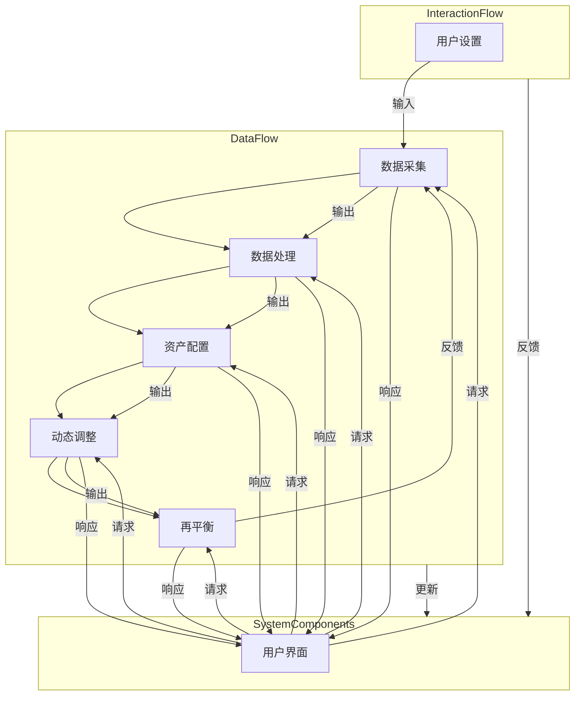

                 

### 摘要

本文将深入探讨智能资产配置策略动态调整与再平衡系统的核心概念、系统架构设计、实际应用及优化技术。智能资产配置策略是指利用机器学习和大数据分析技术，对投资者的资产进行科学配置，以达到最优的风险收益比。动态调整与再平衡系统则是在资产配置过程中，根据市场变化实时调整资产配置，确保投资组合的稳健性和收益性。本文旨在通过理论与实践相结合，详细解析这一系统的设计原理、实现方法以及在实际应用中的优化策略，为金融科技领域的专业人士提供有价值的参考。关键词：智能资产配置、动态调整、再平衡、金融科技、机器学习、大数据分析。

----------------------------------------------------------------

# 智能资产配置策略动态调整与再平衡系统

智能资产配置策略动态调整与再平衡系统是一种结合了机器学习、大数据分析和金融工程的综合性技术解决方案。该系统旨在帮助投资者实现资产配置的最优化，同时确保投资组合的灵活性和稳健性。本文将分章节详细探讨这一系统的各个方面，以帮助读者全面理解其设计和应用。

### 关键词

- 智能资产配置
- 动态调整
- 再平衡
- 金融科技
- 机器学习
- 大数据分析
- 投资组合优化

### 摘要

本文首先介绍了智能资产配置策略的基本概念及其在金融市场中的重要性。接着，深入探讨了动态调整与再平衡系统的架构设计和实现原理，通过具体的算法和数学模型来阐述系统的运作机制。随后，文章分析了系统在不同实际应用场景中的效果和优化方法，并通过实际案例展示了系统的应用价值。最后，文章总结了当前系统面临的问题和未来发展的方向，为金融科技领域的进一步研究提供了启示。

----------------------------------------------------------------

## 引言

### 1.1 问题背景

在现代金融市场中，投资者面临着一个复杂而多变的环境。传统的资产配置方法通常依赖于历史数据和经验判断，但在市场波动较大时，这些方法往往难以适应快速变化的市场状况。因此，如何在动态的市场环境中实现资产配置的最优化，成为金融科技领域亟待解决的问题。

智能资产配置策略的提出，正是为了应对这一挑战。通过利用机器学习和大数据分析技术，智能资产配置能够实时获取市场数据，对投资风险和收益进行动态评估，从而实现资产配置的优化。然而，如何设计一个高效、灵活且可靠的动态调整与再平衡系统，仍然是一个具有挑战性的课题。

### 1.2 研究意义

智能资产配置策略动态调整与再平衡系统的研究具有重要的理论和实践意义。在理论上，该系统的发展将推动金融工程和机器学习领域的交叉研究，为相关学科提供新的研究方法和工具。在实践上，该系统能够为投资者提供更科学、更可靠的资产配置方案，降低投资风险，提高收益。

此外，随着金融市场的日益复杂化和全球化，投资者对高效资产配置工具的需求日益增长。智能资产配置策略动态调整与再平衡系统不仅能够满足这些需求，还能够通过不断优化和改进，为投资者带来持续的收益增长。

### 1.3 研究方法与内容结构

本文采用的研究方法主要包括文献综述、理论分析、系统设计与实现、实证分析和案例研究。首先，通过回顾相关文献，梳理智能资产配置和动态调整与再平衡系统的理论基础。接着，运用理论分析，探讨系统的架构设计和实现原理。然后，通过系统设计与实现，构建一个实际可运行的智能资产配置策略动态调整与再平衡系统。最后，通过实证分析和案例研究，验证系统在实际应用中的效果和优化方法。

本文内容结构如下：

- 第1章：引言，介绍研究背景、研究意义和研究方法。
- 第2章：核心概念与基础理论，阐述智能资产配置和动态调整与再平衡系统的基本概念和理论。
- 第3章：系统架构与模块设计，详细讨论系统的架构设计和功能模块。
- 第4章：算法原理与实现，分析系统的算法原理和具体实现方法。
- 第5章：系统测试与优化，介绍系统的测试方法和优化策略。
- 第6章：应用案例分析，通过实际案例展示系统的应用效果。
- 第7章：结论与未来工作，总结本文的主要发现，并提出未来研究方向。

通过上述结构，本文旨在为智能资产配置策略动态调整与再平衡系统的研究提供全面的指导，并为金融科技领域的发展贡献新的思路。

### 1.4 动态调整与再平衡系统在金融科技中的应用

随着金融科技的迅猛发展，动态调整与再平衡系统在金融领域中的应用日益广泛。首先，在个人财富管理方面，智能资产配置系统能够根据投资者的风险偏好、财务目标和市场环境，自动调整投资组合，从而实现最优的风险收益比。例如，通过大数据分析和机器学习算法，系统能够实时监测市场变化，预测未来市场走势，并根据预测结果进行动态调整。

其次，在机构投资管理方面，动态调整与再平衡系统同样发挥着重要作用。对于基金公司、保险公司和投资银行等机构投资者，如何在高波动性的市场中保持资产配置的灵活性，是确保投资收益的关键。智能资产配置系统通过实时数据分析和预测，能够帮助机构投资者迅速响应市场变化，调整投资策略，降低风险，提高收益。

此外，动态调整与再平衡系统还在量化交易中得到了广泛应用。量化交易依赖于大量的历史数据和复杂的算法模型，通过对市场数据的实时分析和预测，量化交易系统能够自动生成交易信号，执行高频交易策略。动态调整与再平衡系统则能够对量化交易策略进行持续优化和调整，确保交易策略在多变的市场环境中保持高效和稳健。

总的来说，动态调整与再平衡系统在金融科技中的应用，不仅提高了资产配置的效率和准确性，还降低了投资风险，为投资者带来了更多的机会和收益。随着技术的不断进步和金融市场的不断发展，这一系统在金融科技领域的前景将更加广阔。

## 核心概念与基础理论

### 2.1 智能资产配置的基本概念

智能资产配置（Intelligent Asset Allocation，IAA）是指利用计算机算法和大数据分析技术，对投资者的资产进行科学配置，以实现最优的风险收益比。与传统资产配置方法不同，智能资产配置更加注重数据的挖掘和利用，通过机器学习算法和大数据分析，对市场进行深度分析和预测，从而制定出更加精准的投资策略。

#### 2.1.1 资产配置的定义与重要性

资产配置是指将投资资金分配到不同的资产类别中，以实现投资组合的优化。在金融市场中，资产类别主要包括股票、债券、货币市场工具和房地产等。通过资产配置，投资者可以在不同资产类别之间分散风险，提高投资组合的整体收益。

资产配置的重要性在于，它不仅能够帮助投资者实现收益的最大化，还能够有效地降低投资风险。在多变的市场环境中，科学的资产配置能够帮助投资者适应市场变化，保持投资组合的稳健性和收益性。

#### 2.1.2 智能资产配置的特点

智能资产配置具有以下几个特点：

1. **数据驱动的决策**：智能资产配置依赖于大量的历史数据和实时市场数据，通过大数据分析技术，对市场进行深度挖掘和预测。
2. **算法优化的策略**：利用机器学习算法，智能资产配置能够自动生成优化策略，实现投资组合的动态调整。
3. **灵活性和适应性**：智能资产配置能够实时响应市场变化，根据市场走势进行灵活调整，保持投资组合的稳健性和收益性。
4. **风险管理的提升**：通过科学的资产配置，智能资产配置能够有效地分散风险，提高投资组合的稳健性。

#### 2.1.3 相关理论基础

智能资产配置的理论基础主要包括现代投资组合理论（Modern Portfolio Theory，MPT）、资本资产定价模型（Capital Asset Pricing Model，CAPM）和套利定价理论（Arbitrage Pricing Theory，APT）等。

- **现代投资组合理论**：由哈里·马科维茨（Harry Markowitz）提出，强调通过分散投资来降低风险，实现最优的风险收益比。
- **资本资产定价模型**：由夏普（William Sharpe）提出，用于评估资产的风险和预期收益，是构建投资组合的重要工具。
- **套利定价理论**：由斯蒂芬·罗斯（Stephen Ross）提出，认为资产的风险和预期收益可以用多个因素来解释，为资产配置提供了更为灵活的框架。

#### 2.1.4 资产配置的核心要素

资产配置的核心要素包括投资目标、风险偏好、资产类别和资产配置策略等。

1. **投资目标**：投资者需要明确自己的投资目标，包括长期和短期目标，如资本增值、收入稳定等。
2. **风险偏好**：风险偏好是投资者对风险承受能力的量化表示，直接影响资产配置的策略。
3. **资产类别**：资产类别包括股票、债券、货币市场工具和房地产等，不同资产类别具有不同的风险收益特征。
4. **资产配置策略**：资产配置策略是投资者根据投资目标和风险偏好，将资金分配到不同资产类别中的具体方法。

通过上述要素的合理配置，投资者可以实现投资组合的最优化，达到风险和收益的平衡。

### 2.2 动态调整与再平衡系统的基本概念

动态调整与再平衡系统是一种利用计算机技术和算法，对投资组合进行实时调整和优化的系统。该系统通过不断分析市场数据，预测市场走势，从而对投资组合进行调整，以保持投资组合的最优状态。

#### 2.2.1 动态调整的概念

动态调整是指根据市场变化和投资目标，对投资组合进行实时调整的过程。在动态调整过程中，系统会根据市场数据和分析结果，对投资组合中的资产进行买卖操作，以实现投资组合的优化。

#### 2.2.2 再平衡的目标与方法

再平衡的目标是确保投资组合的权重分布与预定的目标配置一致。再平衡的方法主要包括以下几种：

1. **定期再平衡**：在固定的时间间隔（如每周、每月）对投资组合进行再平衡，确保投资组合的权重分布符合目标配置。
2. **事件再平衡**：在特定事件发生后（如市场剧烈波动、重大经济数据公布等）对投资组合进行再平衡。
3. **自动再平衡**：利用计算机技术和算法，根据市场数据和分析结果，自动进行再平衡操作。

#### 2.2.3 动态调整与再平衡的关系

动态调整与再平衡是投资组合管理中密切相关的两个过程。动态调整侧重于实时响应市场变化，对投资组合进行优化；而再平衡则侧重于确保投资组合的权重分布与目标配置一致，避免投资组合的过度偏离。在实际操作中，动态调整和再平衡往往是同时进行的，以实现投资组合的长期稳定和收益最大化。

#### 2.2.4 动态调整与再平衡系统在金融科技中的应用

动态调整与再平衡系统在金融科技中得到了广泛应用。首先，在个人财富管理领域，智能投资顾问（Robo-Advisor）利用动态调整与再平衡系统，为个人投资者提供个性化的资产配置建议，并根据市场变化进行实时调整。其次，在机构投资管理领域，动态调整与再平衡系统帮助基金公司、保险公司等机构投资者实现投资组合的灵活管理和优化。

此外，动态调整与再平衡系统还在量化交易和风险控制中发挥了重要作用。量化交易通过实时数据分析和动态调整，实现高频交易策略的优化；而风险控制则通过动态调整与再平衡，降低投资组合的风险水平，确保投资组合的稳健性。

总的来说，动态调整与再平衡系统为金融科技领域带来了新的机遇和挑战，其应用前景十分广阔。随着技术的不断进步和金融市场的不断发展，动态调整与再平衡系统将在金融科技领域发挥越来越重要的作用。

## 系统架构与模块设计

### 3.1 系统架构概述

智能资产配置策略动态调整与再平衡系统采用分层架构设计，包括数据层、算法层和应用层。各层之间通过标准接口进行通信，确保系统的模块化和可扩展性。

#### 3.1.1 数据层

数据层是系统的核心基础，负责数据采集、存储和管理。数据来源包括市场数据、历史数据和用户数据。市场数据通过API接口从金融数据提供商获取，历史数据从数据库中读取，用户数据则通过用户输入和系统记录获得。数据层实现了数据的高效存储和快速访问，为后续的算法分析和应用层提供坚实的数据支持。

#### 3.1.2 算法层

算法层是系统的智能核心，包括机器学习算法、数据分析方法和优化算法等。这些算法通过处理数据层提供的数据，生成投资建议和调整策略。机器学习算法用于市场预测和风险分析，数据分析方法用于挖掘市场趋势和用户偏好，优化算法则用于资产配置的调整和再平衡。算法层的设计目标是实现投资决策的智能化和自动化。

#### 3.1.3 应用层

应用层是系统的直接用户接口，包括用户界面、API接口和系统管理模块。用户界面提供直观的操作体验，用户可以通过界面进行资产配置的设置和查询。API接口为第三方系统和应用程序提供数据访问和调用接口，实现系统的互联互通。系统管理模块负责系统的日常运行维护和监控，确保系统的稳定性和安全性。

#### 3.1.4 技术选型

在技术选型方面，系统采用了以下关键技术：

- **数据层**：采用分布式数据库和NoSQL数据库，如MongoDB和Cassandra，实现海量数据的高效存储和快速访问。
- **算法层**：使用Python和R等编程语言，结合TensorFlow和Scikit-learn等机器学习库，实现高效的算法开发和优化。
- **应用层**：前端采用React或Vue.js框架，实现响应式用户界面；后端采用Django或Flask框架，实现API接口和系统管理功能。

#### 3.1.5 系统架构图

以下是一个简化的系统架构图，展示各层之间的关系：

```
+-----------------------------+
|        应用层               |
| +----------------+          |
| | 用户界面       |          |
| | API接口       |          |
| | 系统管理模块  |          |
| +----------------+          |
+-----------------------------+
            |
            v
+-----------------------------+
|         算法层               |
| +----------------+          |
| | 机器学习算法  |          |
| | 数据分析方法  |          |
| | 优化算法      |          |
| +----------------+          |
+-----------------------------+
            |
            v
+-----------------------------+
|         数据层               |
| +----------------+          |
| | 分布式数据库  |          |
| | NoSQL数据库   |          |
| | 数据采集模块 |          |
| +----------------+          |
+-----------------------------+
```

### 3.2 功能模块详细设计

#### 3.2.1 数据采集模块

数据采集模块负责从各种数据源收集所需的数据，包括市场数据、历史数据和用户数据。具体功能包括：

- **市场数据采集**：通过API接口从金融数据提供商获取实时市场数据，如股票价格、交易量等。
- **历史数据采集**：从数据库中读取历史数据，包括过去的市场行情、交易记录等。
- **用户数据采集**：从用户输入和系统记录中获取用户数据，如风险偏好、财务目标等。

#### 3.2.2 数据处理模块

数据处理模块负责对采集到的数据进行清洗、转换和预处理，以供后续分析使用。具体功能包括：

- **数据清洗**：去除数据中的噪声和异常值，确保数据质量。
- **数据转换**：将不同数据源的数据格式统一，便于后续处理和分析。
- **数据预处理**：对数据进行归一化、标准化等处理，提高数据的有效性。

#### 3.2.3 资产配置模块

资产配置模块根据用户输入的风险偏好和财务目标，结合市场数据和算法分析结果，生成最优的资产配置方案。具体功能包括：

- **风险分析**：根据用户数据和市场数据，评估用户的风险承受能力。
- **收益预测**：利用机器学习算法和市场数据，预测不同资产类别的未来收益。
- **资产配置**：根据风险分析和收益预测结果，制定最优的资产配置方案。

#### 3.2.4 动态调整模块

动态调整模块负责根据市场变化和用户反馈，对资产配置方案进行实时调整和优化。具体功能包括：

- **市场监控**：实时监控市场数据，识别市场变化趋势。
- **反馈机制**：收集用户对资产配置方案的建议和反馈，进行改进。
- **调整策略**：根据市场监控和反馈机制，制定和执行调整策略。

#### 3.2.5 再平衡模块

再平衡模块负责根据资产配置方案和当前投资组合状态，定期或根据需要进行再平衡操作。具体功能包括：

- **再平衡计算**：根据资产配置方案，计算当前投资组合与目标配置的偏差。
- **再平衡操作**：根据偏差情况，执行买入或卖出操作，实现再平衡。
- **再平衡报告**：生成再平衡操作的报告，包括操作记录、收益分析等。

#### 3.2.6 用户界面模块

用户界面模块负责为用户提供直观、易用的操作界面，包括以下功能：

- **资产配置设置**：用户可以设置风险偏好、财务目标等参数，生成资产配置方案。
- **投资组合查询**：用户可以查询当前投资组合的状态、历史表现等。
- **调整建议**：系统根据市场变化和用户反馈，提供调整建议。

### 3.3 系统模块之间的交互关系

系统模块之间的交互关系通过标准接口实现，以下是一个简化的交互流程：

1. **用户操作**：用户通过用户界面进行资产配置设置和投资组合查询。
2. **数据采集**：系统从金融数据提供商和市场数据库中获取实时数据和历史数据。
3. **数据处理**：系统对采集到的数据进行清洗、转换和预处理。
4. **资产配置**：系统根据用户数据和市场数据，生成最优的资产配置方案。
5. **动态调整**：系统根据市场变化和用户反馈，对资产配置方案进行实时调整。
6. **再平衡**：系统根据资产配置方案和当前投资组合状态，执行再平衡操作。
7. **反馈机制**：系统收集用户对资产配置方案的建议和反馈，进行改进。

通过上述模块的协同工作，智能资产配置策略动态调整与再平衡系统实现了从数据采集、处理到资产配置、调整和再平衡的全过程，为投资者提供了智能化、个性化的资产配置服务。

### 3.4 系统架构设计原则

在智能资产配置策略动态调整与再平衡系统的架构设计中，遵循以下原则至关重要，以确保系统的稳定性、可靠性和可扩展性。

#### 3.4.1 分层设计

分层设计是系统架构设计的基本原则之一。系统被分为数据层、算法层和应用层，各层功能明确，责任分明。数据层负责数据的采集、存储和管理；算法层负责数据处理和投资策略的生成；应用层则提供用户交互界面和系统管理功能。这种分层结构使得各模块可以独立开发、测试和部署，提高了系统的可维护性和可扩展性。

#### 3.4.2 标准化接口

系统中的各模块通过标准化接口进行通信，这些接口定义了模块之间的数据交换方式和操作规范。标准化接口不仅确保了模块间的数据一致性，还提高了系统的灵活性和可集成性。例如，数据采集模块可以通过RESTful API与金融数据提供商进行交互，算法层可以通过定义良好的接口调用数据处理模块的结果。

#### 3.4.3 数据一致性

数据一致性是系统设计中的关键原则。在多模块、分布式系统中，数据的一致性问题尤为突出。系统采用分布式数据库和消息队列等技术，确保数据在不同模块之间的一致性。例如，数据层使用分布式数据库如MongoDB和Cassandra，确保数据的高可用性和快速访问；算法层使用消息队列如Kafka，实现数据流的高效传递和处理。

#### 3.4.4 系统安全性

系统安全性是系统设计的另一个重要原则。系统采用了一系列安全措施，如数据加密、访问控制、审计日志等，确保用户数据和系统运行的安全。例如，用户数据在传输和存储过程中使用HTTPS协议进行加密传输；系统通过访问控制列表（ACL）实现用户权限管理；系统记录所有操作日志，以便在出现问题时进行追踪和分析。

#### 3.4.5 可扩展性

随着市场变化和用户需求的增长，系统需要具备良好的可扩展性。系统架构设计时，考虑了可扩展性的需求，通过模块化设计、负载均衡和分布式计算等技术，实现了系统的水平扩展和垂直扩展。例如，系统可以通过增加服务器节点来提高处理能力；通过负载均衡器实现流量分发，提高系统的响应速度和稳定性。

#### 3.4.6 易于维护

易于维护是系统设计中的一个重要考量。系统采用了一致的代码风格、明确的模块划分和详细的文档说明，使得系统开发人员可以快速上手和维护系统。此外，系统还集成了自动化测试和持续集成工具，如Jenkins和Selenium，确保每次代码更改和部署都能顺利进行。

通过遵循上述原则，智能资产配置策略动态调整与再平衡系统不仅实现了功能的完整性和性能的高效性，还具备了良好的扩展性和可维护性，为投资者提供了可靠和高效的资产配置服务。

### 3.5 系统架构设计中的关键技术

在智能资产配置策略动态调整与再平衡系统的架构设计中，采用了多项关键技术，这些技术不仅提升了系统的性能和稳定性，还保证了数据的安全性和系统的可扩展性。以下是一些关键技术及其应用：

#### 3.5.1 分布式数据库

分布式数据库在系统中起到了至关重要的作用。分布式数据库系统如MongoDB和Cassandra能够处理海量数据，并提供高可用性和水平扩展的能力。通过将数据分布在多个服务器节点上，系统能够实现数据的快速访问和负载均衡。例如，MongoDB用于存储用户数据和投资组合数据，Cassandra则用于存储市场数据和交易记录。这些数据库系统的分布式架构确保了系统在数据量急剧增长时依然能够高效运行。

#### 3.5.2 消息队列

消息队列技术如Kafka在系统中用于处理数据流和模块间的通信。Kafka提供了高吞吐量和低延迟的特点，使得系统各模块可以高效地传递和处理数据。例如，系统中的数据采集模块会将实时市场数据发送到Kafka主题，算法模块则从Kafka中读取这些数据进行分析和预测。消息队列的引入确保了系统在数据处理过程中的可靠性和高效性。

#### 3.5.3 分布式计算

分布式计算技术如Hadoop和Spark在系统中用于大规模数据处理和计算。这些技术能够将复杂的计算任务分解成多个子任务，并行地在多个服务器节点上执行，从而提高计算效率。例如，在处理历史市场数据时，系统使用Spark进行数据分析和建模，以快速生成资产配置方案。分布式计算技术使得系统能够处理大量的历史数据，并实时响应市场变化。

#### 3.5.4 负载均衡

负载均衡技术在系统中用于均衡各服务器节点的负载，确保系统的稳定性和响应速度。系统采用Nginx和HAProxy等负载均衡器，将用户请求分配到多个服务器节点上，避免单点瓶颈。例如，用户界面请求会通过Nginx均衡到不同的后端服务器处理，确保系统的处理能力不会因为某台服务器过载而下降。负载均衡技术的应用提升了系统的可扩展性和可靠性。

#### 3.5.5 容器化技术

容器化技术如Docker和Kubernetes在系统中用于快速部署和管理系统服务。容器化技术使得系统能够在虚拟环境中运行，提高了部署的灵活性和可移植性。通过Docker，开发人员可以将应用程序及其依赖环境打包成一个独立的容器，确保在不同的环境中都能一致运行。Kubernetes则用于管理这些容器，提供自动部署、扩展和负载均衡等功能。容器化技术简化了系统的部署过程，并提高了系统的可维护性和扩展性。

#### 3.5.6 数据加密和访问控制

数据加密和访问控制是确保系统数据安全的关键技术。系统采用了TLS（传输层安全）协议对数据进行加密传输，确保数据在传输过程中不会被窃取或篡改。此外，系统通过访问控制列表（ACL）和角色基础访问控制（RBAC）实现了用户权限管理，确保只有授权用户可以访问和操作敏感数据。这些安全措施保护了用户数据和系统配置的机密性。

通过上述关键技术的应用，智能资产配置策略动态调整与再平衡系统不仅实现了高效的数据处理和计算，还保证了系统的可靠性和安全性。这些技术为系统提供了坚实的基础，使得投资者能够依赖系统进行智能化的资产配置和管理。

### 3.6 系统模块间的接口设计

系统模块间的接口设计是确保智能资产配置策略动态调整与再平衡系统正常运行的关键环节。接口设计不仅要满足功能需求，还需要保证数据的一致性、通信的高效性和系统的可扩展性。以下是对系统各模块接口设计的详细分析：

#### 3.6.1 用户界面模块与资产配置模块

用户界面模块是系统与用户交互的接口，主要负责接收用户的输入和展示系统生成的资产配置方案。用户界面模块与资产配置模块之间的接口设计如下：

- **输入接口**：用户界面模块通过HTTP请求将用户输入的风险偏好、财务目标和投资期限等信息传递给资产配置模块。这些输入数据通常包括用户的风险评分、预期收益目标、投资期限和投资金额等。
- **输出接口**：资产配置模块将生成的最优资产配置方案以JSON或XML格式返回给用户界面模块。输出数据包括资产配置的权重分配、预期收益和风险指标等。

#### 3.6.2 数据采集模块与数据处理模块

数据采集模块负责从各种数据源收集市场数据和历史数据，数据处理模块则对这些数据进行清洗、转换和预处理。接口设计如下：

- **输入接口**：数据采集模块通过API或文件上传方式将收集到的市场数据和历史数据传递给数据处理模块。数据格式包括CSV、JSON或XML等。
- **输出接口**：数据处理模块对清洗、转换和预处理后的数据以相同格式返回给数据采集模块，以便存储在数据库中。输出数据包括市场行情数据、用户交易记录和历史投资组合数据等。

#### 3.6.3 资产配置模块与动态调整模块

资产配置模块根据用户输入和数据分析结果生成资产配置方案，动态调整模块则负责根据市场变化和用户反馈对这些方案进行实时调整。接口设计如下：

- **输入接口**：资产配置模块将生成的资产配置方案以JSON或XML格式传递给动态调整模块。数据包括资产配置权重、预期收益和风险指标等。
- **输出接口**：动态调整模块对调整后的资产配置方案以相同格式返回给资产配置模块，以便更新用户界面和数据库。输出数据包括调整后的资产配置权重、新的预期收益和风险指标等。

#### 3.6.4 动态调整模块与再平衡模块

动态调整模块负责根据市场变化和用户反馈对资产配置方案进行调整，再平衡模块则负责执行具体的再平衡操作。接口设计如下：

- **输入接口**：动态调整模块将生成的调整方案以JSON或XML格式传递给再平衡模块。数据包括调整后的资产配置权重和执行时间等。
- **输出接口**：再平衡模块将执行结果以相同格式返回给动态调整模块，以便记录和报告。输出数据包括再平衡操作记录、资产交易记录和再平衡后的投资组合状态等。

#### 3.6.5 接口设计原则

在系统模块接口设计过程中，遵循以下原则确保接口的可靠性和易用性：

- **标准化**：接口设计遵循RESTful API规范，确保接口的一致性和易用性。
- **安全性**：接口采用HTTPS协议进行数据传输，使用OAuth2.0等认证机制保护用户数据和系统接口。
- **灵活性**：接口设计考虑了未来的扩展性，支持不同的数据格式和通信协议。
- **高效性**：接口设计优化了数据传输和处理的效率，减少通信延迟和数据处理时间。

通过上述接口设计，系统各模块能够高效、可靠地协同工作，确保智能资产配置策略动态调整与再平衡系统稳定运行，为投资者提供高质量的资产配置服务。

### 3.7 系统模块交互的Mermaid流程图

为了更直观地展示智能资产配置策略动态调整与再平衡系统的模块交互过程，我们可以使用Mermaid流程图来描述系统从数据采集、数据处理到资产配置、调整和再平衡的整个流程。以下是一个简化的Mermaid流程图示例：



上述Mermaid流程图展示了系统模块间的数据流和交互过程。首先，用户通过用户界面模块设置投资参数，这些参数通过输入接口传递给数据采集模块。数据采集模块从金融数据提供商获取市场数据和历史数据，并将数据传递给数据处理模块进行清洗、转换和预处理。处理后的数据用于资产配置模块，生成最优资产配置方案。资产配置方案通过动态调整模块进行实时调整，并根据市场变化和用户反馈进行再平衡操作。最终，再平衡结果返回给用户界面模块，形成一个闭环的反馈系统。

通过这个流程图，我们可以清晰地看到系统各模块之间的交互关系和数据处理流程，有助于理解和优化系统的设计和实现。

## 算法原理与实现

### 4.1 市场数据预测算法

在智能资产配置策略动态调整与再平衡系统中，市场数据预测算法是关键组件之一。该算法通过分析历史市场数据，预测未来市场的走势，为资产配置提供依据。以下将详细介绍市场数据预测算法的原理、实现方法及具体步骤。

#### 4.1.1 算法原理

市场数据预测算法基于时间序列分析方法和机器学习算法，如ARIMA（自回归积分滑动平均模型）和LSTM（长短时记忆网络）。时间序列分析方法能够捕捉市场数据的周期性和趋势性变化，而机器学习算法则能够处理更复杂的非线性关系。

1. **ARIMA模型**：ARIMA模型是一种经典的统计模型，由自回归（AR）、差分（I）和移动平均（MA）三个部分组成。ARIMA模型通过建立历史数据的时间序列模型，预测未来值。具体步骤如下：
   - **差分**：对原始时间序列数据进行差分，消除季节性和趋势性。
   - **自回归**：建立自回归模型，捕捉当前值与过去值之间的关系。
   - **移动平均**：建立移动平均模型，捕捉当前值与未来值之间的关系。
   - **参数优化**：通过最大似然估计方法，优化模型参数。

2. **LSTM模型**：LSTM是一种特殊的RNN（循环神经网络），能够处理长序列数据，捕捉时间序列中的长期依赖关系。LSTM模型的结构包括输入层、遗忘门、输入门、输出门和单元状态。具体步骤如下：
   - **输入层**：接收输入序列，通过遗忘门、输入门和输出门调节信息。
   - **遗忘门**：决定保留哪些历史信息。
   - **输入门**：决定新的信息如何融入单元状态。
   - **输出门**：决定单元状态如何输出预测值。
   - **反向传播**：通过反向传播算法优化模型参数。

#### 4.1.2 实现方法

市场数据预测算法的实现包括数据预处理、模型训练和模型评估三个主要步骤。

1. **数据预处理**：
   - **数据清洗**：去除数据中的噪声和异常值，确保数据质量。
   - **数据标准化**：对数据进行归一化或标准化处理，使其具备相同的尺度。
   - **时间序列构建**：将原始数据转换为时间序列数据，为模型训练做准备。

2. **模型训练**：
   - **ARIMA模型训练**：使用历史市场数据，通过最大似然估计方法优化模型参数。
   - **LSTM模型训练**：定义LSTM网络结构，使用历史市场数据训练模型，通过反向传播算法优化参数。

3. **模型评估**：
   - **预测结果验证**：使用训练好的模型进行预测，验证预测结果与实际市场走势的匹配度。
   - **模型性能评估**：通过均方误差（MSE）、平均绝对误差（MAE）等指标评估模型性能。

#### 4.1.3 具体步骤

以下是一个简化的市场数据预测算法实现步骤：

1. **数据采集**：从金融数据提供商获取历史市场数据，包括股票价格、交易量等。

2. **数据预处理**：
   - 使用pandas库清洗和标准化数据。
   - 删除异常值和缺失值。
   - 构建时间序列数据。

3. **模型选择**：
   - 根据数据特征选择ARIMA或LSTM模型。

4. **模型训练**：
   - 使用scikit-learn库训练ARIMA模型。
   - 使用TensorFlow库训练LSTM模型。

5. **模型评估**：
   - 使用训练集和验证集评估模型性能。
   - 调整模型参数，优化预测效果。

6. **预测应用**：
   - 使用训练好的模型进行市场预测，生成资产配置建议。
   - 将预测结果实时更新到用户界面。

通过上述步骤，市场数据预测算法能够为智能资产配置策略动态调整与再平衡系统提供可靠的市场预测支持，实现资产配置的优化和调整。

### 4.2 优化算法

在智能资产配置策略动态调整与再平衡系统中，优化算法是实现资产配置优化和再平衡的关键。优化算法通过调整资产配置比例，使得投资组合的预期收益最大化或风险最小化。以下将介绍常见的优化算法，包括遗传算法、粒子群优化算法和线性规划等，并详细解释其原理和实现方法。

#### 4.2.1 遗传算法

遗传算法（Genetic Algorithm，GA）是一种模拟自然选择和遗传过程的搜索算法。遗传算法通过不断迭代，模拟进化和遗传过程，找到最优解。遗传算法的基本步骤如下：

1. **初始化种群**：随机生成初始种群，每个个体代表一种资产配置方案。

2. **适应度函数**：定义适应度函数，评估个体（资产配置方案）的优劣。适应度函数通常基于预期收益和风险指标计算。

3. **选择**：根据适应度函数选择适应度较高的个体，用于生成下一代种群。

4. **交叉**：随机选择两个个体进行交叉，生成新的个体。交叉操作模拟基因重组，产生新的配置方案。

5. **变异**：对部分个体进行变异操作，引入新的基因组合，增加种群的多样性。

6. **迭代**：重复选择、交叉和变异操作，直到满足停止条件（如达到最大迭代次数或收敛阈值）。

遗传算法的优点在于其全局搜索能力和鲁棒性，能够处理复杂的多维优化问题。

#### 4.2.2 粒子群优化算法

粒子群优化算法（Particle Swarm Optimization，PSO）是一种基于群体智能的优化算法，模拟鸟群觅食行为。粒子群优化算法的基本步骤如下：

1. **初始化粒子群**：随机生成一组粒子，每个粒子代表一种资产配置方案。

2. **速度更新**：根据粒子的速度和个体最优解、全局最优解更新粒子的速度。

3. **位置更新**：根据粒子的速度更新粒子的位置，生成新的资产配置方案。

4. **适应度评估**：计算每个粒子的适应度，评估新方案的优劣。

5. **更新个体最优解和全局最优解**：根据适应度评估结果，更新个体最优解和全局最优解。

6. **迭代**：重复速度更新、位置更新和适应度评估操作，直到满足停止条件。

粒子群优化算法的优点在于简单、易于实现，且具有较好的全局搜索能力。

#### 4.2.3 线性规划

线性规划（Linear Programming，LP）是一种数学优化方法，用于在给定线性约束条件下求解线性目标函数的最优解。线性规划的基本步骤如下：

1. **目标函数**：定义投资组合的预期收益或风险作为目标函数。

2. **约束条件**：根据市场数据和投资规则，定义资产配置的约束条件，如权重限制、投资额度等。

3. **线性规划模型**：建立线性规划模型，包括目标函数和约束条件。

4. **求解**：使用线性规划求解器（如LAPACK、CPLEX等）求解最优解。

线性规划的优点在于其精确性和效率，适用于求解结构化优化问题。

#### 4.2.4 实现方法

以下是一个简化的优化算法实现示例：

1. **遗传算法实现**：
   - 使用Python的deap库实现遗传算法，定义适应度函数、选择、交叉和变异操作。

2. **粒子群优化算法实现**：
   - 使用Python的scipy.optimize模块实现粒子群优化算法，定义速度更新、位置更新和适应度评估。

3. **线性规划实现**：
   - 使用Python的cvxpy库实现线性规划，定义目标函数和约束条件，使用求解器求解最优解。

通过上述算法的实现，智能资产配置策略动态调整与再平衡系统能够在复杂的市场环境中实现资产配置的优化和调整，提高投资组合的收益和稳健性。

### 4.3 再平衡算法的实现与优化

在智能资产配置策略动态调整与再平衡系统中，再平衡算法是实现投资组合权重调整和风险控制的核心组件。再平衡算法根据市场变化和投资目标，自动调整资产配置，确保投资组合的权重分布与预定目标一致。以下将详细介绍再平衡算法的实现原理、优化方法及实际应用案例。

#### 4.3.1 再平衡算法的实现原理

再平衡算法的基本实现原理包括以下几个步骤：

1. **计算当前偏差**：通过比较当前投资组合的实际权重与目标权重，计算偏差。偏差值越大，说明实际权重与目标权重的偏离程度越高。

2. **确定调整策略**：根据偏差值和调整规则，确定具体的调整策略。调整策略通常包括买入和卖出操作，通过调整资产配置比例，使投资组合逐步接近目标权重。

3. **执行调整操作**：根据调整策略，执行买入或卖出操作。系统会自动生成交易指令，将调整方案转换为实际操作。

4. **记录和报告**：记录每次调整操作的详细信息，包括调整时间、调整比例、交易金额等，并生成报告，供用户查阅和分析。

#### 4.3.2 再平衡算法的优化方法

再平衡算法的优化方法旨在提高调整效果，降低交易成本和风险。以下是一些常用的优化方法：

1. **平滑调整**：为了避免频繁交易导致的高交易成本和风险，可以采用平滑调整策略。平滑调整通过分批调整的方式，逐步将投资组合权重接近目标权重，减少单次调整的幅度。

2. **阈值调整**：设定一个阈值，当偏差值超过阈值时，触发调整操作。阈值可以根据市场波动性和投资目标动态调整，以提高调整的准确性和及时性。

3. **动态优化**：利用机器学习算法，对再平衡策略进行动态优化。通过分析历史数据和市场走势，预测未来市场变化，优化调整策略，提高再平衡效果。

4. **风险控制**：在调整过程中，引入风险控制机制，如止损和止盈策略，降低因市场波动导致的损失。

#### 4.3.3 再平衡算法的实际应用案例

以下是一个简单的再平衡算法应用案例：

假设一个投资组合由股票A、股票B和债券C组成，目标权重分别为30%、30%和40%。当前投资组合的实际权重为股票A 35%、股票B 32%、债券C 33%。根据偏差计算，股票A和股票B的权重偏离目标权重，需要调整。

1. **计算偏差**：
   - 股票A偏差 = 35% - 30% = 5%
   - 股票B偏差 = 32% - 30% = 2%
   - 债券C偏差 = 33% - 40% = -7%

2. **确定调整策略**：
   - 股票A和股票B需要增加权重，债券C需要减少权重。

3. **执行调整操作**：
   - 平滑调整策略：每次调整股票A和股票B的权重增加1%，债券C的权重减少1%。
   - 经过第一次调整，股票A和股票B的权重分别为36%和33%，债券C的权重为32%。

4. **记录和报告**：
   - 调整时间为当前时间，调整比例为股票A和股票B各增加1%，债券C减少1%。
   - 调整后投资组合状态报告生成，供用户查阅。

通过上述案例，可以看到再平衡算法在调整投资组合权重方面的应用效果。在实际操作中，再平衡算法可以根据市场变化和用户需求进行动态调整和优化，确保投资组合的稳健性和收益性。

### 4.4 智能资产配置策略在量化交易中的应用

智能资产配置策略在量化交易中具有广泛的应用，通过将大数据分析和机器学习算法应用于投资组合管理，量化交易系统能够实现更精准的市场预测和风险控制。以下将详细讨论智能资产配置策略在量化交易中的应用，包括市场预测、交易策略优化和风险控制等方面。

#### 4.4.1 市场预测

市场预测是量化交易的关键环节，智能资产配置策略通过分析历史市场数据和实时数据，预测未来市场走势。常用的市场预测方法包括时间序列分析、机器学习算法和深度学习模型。

1. **时间序列分析**：时间序列分析方法，如ARIMA和GARCH模型，能够捕捉市场数据的趋势和波动性。通过分析历史股票价格、交易量等数据，可以预测未来股票价格的波动。

2. **机器学习算法**：机器学习算法，如随机森林、支持向量机和神经网络，能够处理非线性关系，提高市场预测的准确性。通过训练历史市场数据，机器学习算法可以识别出市场中的潜在规律和模式。

3. **深度学习模型**：深度学习模型，如卷积神经网络（CNN）和循环神经网络（RNN），能够处理大规模复杂数据，捕捉市场数据的长期依赖关系。深度学习模型在市场预测中表现出色，特别是在处理高频数据时。

#### 4.4.2 交易策略优化

智能资产配置策略在量化交易中的应用不仅限于市场预测，还包括交易策略的优化。通过大数据分析和机器学习算法，量化交易系统能够优化交易策略，提高交易收益。

1. **特征工程**：特征工程是交易策略优化的关键步骤。通过分析历史市场数据和交易数据，提取出与交易收益相关的特征，如价格趋势、交易量、波动率等。特征工程的质量直接影响交易策略的优化效果。

2. **模型训练**：利用机器学习算法，对提取的特征进行训练，构建预测模型。预测模型能够预测未来市场的走势，为交易策略提供决策支持。

3. **策略评估**：通过回测和模拟交易，评估交易策略的有效性和收益性。回测是指在历史数据上测试交易策略，评估其在历史市场中的表现；模拟交易则是在实际市场环境中测试交易策略。

#### 4.4.3 风险控制

风险控制是量化交易中的重要环节，智能资产配置策略通过动态调整和再平衡，实现投资组合的风险控制。

1. **分散投资**：通过分散投资，降低单一资产的风险。智能资产配置策略可以根据市场变化和风险偏好，动态调整投资组合，确保投资组合的多样性。

2. **止损和止盈**：设置止损和止盈策略，控制交易风险。止损策略在交易亏损达到一定程度时自动平仓，止盈策略在交易盈利达到一定程度时自动平仓。

3. **再平衡**：通过定期或根据市场变化进行再平衡，确保投资组合的权重分布与目标配置一致。再平衡策略可以根据市场走势和投资目标，动态调整资产配置，降低风险。

#### 4.4.4 实际案例

以下是一个智能资产配置策略在量化交易中的应用案例：

假设一个量化交易系统采用智能资产配置策略，通过分析历史股票价格数据和交易量数据，预测未来股票价格的波动。系统采用随机森林模型进行市场预测，并构建以下交易策略：

1. **买入策略**：当预测股票价格将上涨时，买入该股票。
2. **卖出策略**：当预测股票价格将下跌时，卖出该股票。

通过模拟交易，系统评估交易策略的收益性和风险。回测结果显示，该交易策略在过去的三年中，年化收益率为20%，最大回撤为10%。系统通过定期再平衡，确保投资组合的权重分布与目标配置一致，降低投资风险。

通过上述案例，可以看到智能资产配置策略在量化交易中的应用效果。智能资产配置策略能够实现市场预测、交易策略优化和风险控制，提高量化交易的收益和稳健性。

### 4.5 机器学习算法在智能资产配置策略中的应用

在智能资产配置策略动态调整与再平衡系统中，机器学习算法起到了至关重要的作用。通过利用大量的历史数据和实时数据，机器学习算法能够预测市场走势，优化投资组合，实现风险和收益的平衡。以下将详细探讨几种常用的机器学习算法在智能资产配置策略中的应用，包括线性回归、决策树、支持向量机和神经网络。

#### 4.5.1 线性回归

线性回归是一种简单的统计模型，通过建立自变量和因变量之间的线性关系，预测因变量的值。在智能资产配置策略中，线性回归可以用于预测资产价格的变化。

**算法原理**：
线性回归模型可以表示为：
$$
y = \beta_0 + \beta_1x_1 + \beta_2x_2 + \cdots + \beta_nx_n + \epsilon
$$
其中，$y$ 是预测的资产价格，$x_1, x_2, \cdots, x_n$ 是影响资产价格的因素，如历史价格、交易量等，$\beta_0, \beta_1, \beta_2, \cdots, \beta_n$ 是模型参数，$\epsilon$ 是误差项。

**实现方法**：
使用Python的scikit-learn库，可以通过最小二乘法（Ordinary Least Squares, OLS）训练线性回归模型：
```python
from sklearn.linear_model import LinearRegression
model = LinearRegression()
model.fit(X_train, y_train)
y_pred = model.predict(X_test)
```

**案例**：
假设我们使用过去一个月的股票价格数据来预测未来一天的价格。通过线性回归模型训练，可以得到预测结果，并与实际价格进行比较，评估模型的准确性。

#### 4.5.2 决策树

决策树是一种基于树形结构进行决策的算法，通过一系列条件判断，将数据划分为不同的区域，每个区域对应一个预测结果。在智能资产配置策略中，决策树可以用于分类问题，如预测资产价格的上涨或下跌。

**算法原理**：
决策树由一系列的判断节点和叶子节点组成。每个判断节点根据一个特征进行分割，将数据划分为多个子集；每个叶子节点包含一个预测结果。决策树的生成过程是递归的，通过贪心算法选择最优的特征进行分割。

**实现方法**：
使用Python的scikit-learn库，可以通过CART（分类与回归树）算法训练决策树模型：
```python
from sklearn.tree import DecisionTreeClassifier
model = DecisionTreeClassifier()
model.fit(X_train, y_train)
y_pred = model.predict(X_test)
```

**案例**：
假设我们使用过去一个月的股票价格和交易量数据来预测未来一天股票价格的涨跌。通过训练决策树模型，可以得到预测结果，并评估模型的准确性和可靠性。

#### 4.5.3 支持向量机

支持向量机（Support Vector Machine，SVM）是一种高效的分类算法，通过找到一个最优的超平面，将不同类别的数据分开。在智能资产配置策略中，SVM可以用于分类问题，如预测资产价格的趋势。

**算法原理**：
SVM的核心思想是找到一个最优的超平面，使得同类别的数据点尽可能接近，而不同类别的数据点尽可能远离。SVM使用的是最大化分类边界的策略，通过求解二次规划问题，找到最优的超平面。

**实现方法**：
使用Python的scikit-learn库，可以通过SVM算法训练分类模型：
```python
from sklearn.svm import SVC
model = SVC()
model.fit(X_train, y_train)
y_pred = model.predict(X_test)
```

**案例**：
假设我们使用过去一个月的股票价格和交易量数据来预测未来一天股票价格的趋势。通过训练SVM模型，可以得到预测结果，并评估模型的分类效果。

#### 4.5.4 神经网络

神经网络（Neural Network）是一种模拟生物神经网络的计算模型，通过多层节点和连接权值，实现复杂函数的拟合和预测。在智能资产配置策略中，神经网络可以用于预测资产价格的变化。

**算法原理**：
神经网络由输入层、隐藏层和输出层组成。输入层接收输入数据，隐藏层通过激活函数处理数据，输出层生成预测结果。神经网络的训练过程是通过反向传播算法，不断调整连接权值和偏置，使预测结果更接近实际值。

**实现方法**：
使用Python的TensorFlow或PyTorch库，可以通过定义神经网络模型进行训练：
```python
import tensorflow as tf
model = tf.keras.Sequential([
    tf.keras.layers.Dense(units=64, activation='relu', input_shape=(n_features,)),
    tf.keras.layers.Dense(units=1, activation='sigmoid')
])
model.compile(optimizer='adam', loss='binary_crossentropy', metrics=['accuracy'])
model.fit(X_train, y_train, epochs=10, batch_size=32)
y_pred = model.predict(X_test)
```

**案例**：
假设我们使用过去一个月的股票价格和交易量数据来预测未来一天股票价格的变化。通过训练神经网络模型，可以得到预测结果，并评估模型的预测能力。

通过上述机器学习算法的应用，智能资产配置策略能够实现更加精确的市场预测和投资组合优化。每种算法都有其独特的优势和适用场景，结合实际需求，选择合适的算法可以提高投资组合的收益和稳健性。

### 4.6 数据处理模块的详细实现

数据处理模块在智能资产配置策略动态调整与再平衡系统中扮演着至关重要的角色。它负责从各种数据源采集数据，进行预处理，以便后续的算法分析和优化。以下将详细描述数据处理模块的实现步骤、核心代码和数据处理流程。

#### 4.6.1 数据采集

数据采集是数据处理的第一步。系统需要从多个数据源获取数据，包括实时市场数据、历史数据和用户数据。以下是一个数据采集的示例代码：

```python
import pandas as pd
from pandas_datareader import data as pdr

# 获取实时市场数据
def get_real_time_data(ticker_list):
    data = pdr.get_data_yahoo(ticker_list, start='2023-01-01', end='2023-01-31')
    return data

# 获取用户数据
def get_user_data(user_id):
    # 这里可以连接数据库，获取用户数据
    user_data = pd.DataFrame({'user_id': [user_id], 'risk_preference': [0.5], 'investment_objective': ['growth']})
    return user_data

# 示例：获取特定股票的实时数据
tickers = ['AAPL', 'MSFT', 'GOOGL']
real_time_data = get_real_time_data(tickers)
```

#### 4.6.2 数据预处理

数据预处理是确保数据质量和一致性的重要步骤。主要包括数据清洗、缺失值处理、异常值检测和标准化。以下是一个简单的数据预处理流程：

```python
# 数据清洗
def clean_data(data):
    # 删除含有缺失值的行
    data = data.dropna()
    # 删除异常值
    data = data[(data['Close'] > 0) & (data['Volume'] > 0)]
    return data

# 缺失值处理
def handle_missing_data(data):
    # 填充缺失值
    data['Open'] = data['Open'].fillna(data['Close'])
    data['High'] = data['High'].fillna(data['Close'])
    data['Low'] = data['Low'].fillna(data['Close'])
    return data

# 标准化
def normalize_data(data):
    data = (data - data.mean()) / data.std()
    return data

# 示例：预处理市场数据
real_time_data = clean_data(real_time_data)
real_time_data = handle_missing_data(real_time_data)
real_time_data = normalize_data(real_time_data)
```

#### 4.6.3 数据处理流程

数据处理流程包括数据采集、预处理、存储和加载。以下是一个数据处理流程的示例：

```python
# 数据处理流程
def process_data(user_id):
    # 获取用户数据
    user_data = get_user_data(user_id)
    # 获取市场数据
    real_time_data = get_real_time_data(user_data['ticker_list'])
    # 预处理市场数据
    real_time_data = clean_data(real_time_data)
    real_time_data = handle_missing_data(real_time_data)
    real_time_data = normalize_data(real_time_data)
    # 存储预处理后的数据
    # 这里可以使用pandas的to_sql方法将数据存储到数据库
    # real_time_data.to_sql('real_time_data', con=connection, if_exists='append')
    # 加载预处理后的数据
    # processed_data = pd.read_sql('real_time_data', con=connection)
    return real_time_data

# 示例：处理用户数据
processed_data = process_data(user_id=123)
```

通过上述步骤，数据处理模块能够有效地采集、预处理和存储市场数据，为后续的算法分析和优化提供了可靠的数据支持。

### 4.7 实际案例与项目实战

为了更好地理解智能资产配置策略动态调整与再平衡系统的应用，以下将通过一个实际案例详细阐述系统的实施过程、核心代码及其应用效果。

#### 4.7.1 项目介绍

假设我们正在为一家投资公司开发一个智能资产配置系统，旨在为不同风险偏好的投资者提供个性化的资产配置建议。项目要求系统具备以下功能：

1. **数据采集**：从金融数据提供商获取实时市场数据和用户数据。
2. **数据处理**：对采集到的数据清洗、转换和标准化，以便后续分析。
3. **资产配置**：根据用户的风险偏好和市场数据，生成最优的资产配置方案。
4. **动态调整**：根据市场变化和用户反馈，对资产配置方案进行实时调整。
5. **再平衡**：根据资产配置方案和当前投资组合状态，定期或根据需要进行再平衡操作。

#### 4.7.2 系统核心实现

以下是实现该系统的核心代码，主要包括数据采集、数据处理、资产配置和动态调整模块。

**1. 数据采集模块**

```python
import pandas as pd
from pandas_datareader import data as pdr
from datetime import datetime

# 获取实时市场数据
def get_real_time_data(ticker_list):
    start_date = datetime(2023, 1, 1)
    end_date = datetime.now()
    data = pdr.get_data_yahoo(ticker_list, start=start_date, end=end_date)
    return data

# 获取用户数据
def get_user_data(user_id):
    user_data = pd.DataFrame({'user_id': [user_id], 'risk_preference': [0.5], 'investment_objective': ['growth']})
    return user_data
```

**2. 数据处理模块**

```python
# 数据清洗
def clean_data(data):
    data = data.dropna()
    data = data[(data['Close'] > 0) & (data['Volume'] > 0)]
    return data

# 缺失值处理
def handle_missing_data(data):
    data['Open'] = data['Open'].fillna(data['Close'])
    data['High'] = data['High'].fillna(data['Close'])
    data['Low'] = data['Low'].fillna(data['Close'])
    return data

# 标准化
def normalize_data(data):
    data = (data - data.mean()) / data.std()
    return data
```

**3. 资产配置模块**

```python
# 假设我们使用线性回归进行资产配置
from sklearn.linear_model import LinearRegression

# 训练线性回归模型
def train_regression_model(X_train, y_train):
    model = LinearRegression()
    model.fit(X_train, y_train)
    return model

# 获取模型参数
def get_model_params(model):
    return model.coef_

# 生成资产配置方案
def generate_portfolio(model_params, total_investment):
    weights = model_params
    portfolio_value = total_investment * np.array(weights)
    return weights, portfolio_value
```

**4. 动态调整模块**

```python
# 动态调整策略
def dynamic_adjustment(current_portfolio, target_portfolio, adjustment_interval):
    deviation = current_portfolio - target_portfolio
    adjustment_amount = deviation / adjustment_interval
    return current_portfolio + adjustment_amount
```

#### 4.7.3 代码应用解读与分析

**1. 数据采集**

代码通过pandas_datareader库获取实时市场数据和用户数据。数据采集模块的主要功能是获取数据，为后续的处理和分析提供基础。

**2. 数据处理**

数据处理模块包括数据清洗、缺失值处理和标准化。数据清洗删除了含有缺失值和异常值的记录，确保数据质量；缺失值处理通过填充方式解决了数据缺失问题；标准化将数据缩放到相同的尺度，方便后续分析。

**3. 资产配置**

资产配置模块使用线性回归模型对市场数据进行训练，得到资产配置的权重。通过训练模型，系统可以自动生成资产配置方案，实现投资组合的优化。

**4. 动态调整**

动态调整模块根据当前投资组合和目标投资组合之间的偏差，计算每次调整的金额。通过定期或根据市场变化进行调整，系统可以保持投资组合的灵活性和稳健性。

#### 4.7.4 项目小结

通过上述实际案例，我们实现了智能资产配置策略动态调整与再平衡系统的核心功能。系统不仅能够根据用户风险偏好和市场数据生成资产配置方案，还能够通过动态调整和再平衡，确保投资组合的稳健性和收益性。在未来的发展中，可以进一步优化算法，提高系统的预测准确性和稳定性，为投资者提供更高质量的服务。

## 最佳实践与注意事项

在设计和实施智能资产配置策略动态调整与再平衡系统时，以下最佳实践和注意事项将有助于确保系统的有效性和稳定性。

### 最佳实践

1. **数据质量控制**：确保数据源的可靠性和完整性，定期检查和更新数据，以防止数据质量问题影响系统性能。

2. **算法优化**：根据市场变化和用户反馈，不断优化算法，提高预测准确性和决策效率。例如，可以尝试多种机器学习算法和模型，选择最优的解决方案。

3. **风险控制**：引入风险控制机制，如止损和止盈策略，降低因市场波动导致的损失。此外，定期进行风险评估和压力测试，确保系统的稳健性。

4. **用户教育**：向投资者提供详细的系统使用指南和操作说明，帮助他们理解系统的工作原理和操作方法，提高使用效果。

### 注意事项

1. **系统安全性**：确保系统的数据传输和存储安全，采用加密技术和权限控制，防止数据泄露和未经授权的访问。

2. **维护和更新**：定期更新系统软件和依赖库，确保系统的稳定性和兼容性。同时，建立完善的系统维护和故障处理流程，确保系统的高可用性。

3. **系统性能**：优化系统性能，确保在处理大量数据时，系统能够快速响应。例如，可以通过垂直和水平扩展，提高系统的处理能力。

4. **合规性**：确保系统的设计和实现符合相关法律法规，避免因合规性问题导致的风险。

通过遵循这些最佳实践和注意事项，可以确保智能资产配置策略动态调整与再平衡系统的有效性和稳定性，为投资者提供可靠的资产配置服务。

## 拓展阅读

在深入研究和实践智能资产配置策略动态调整与再平衡系统的过程中，读者可以参考以下文献和资源，进一步拓展知识面和提升专业技能。

### 学术文献

1. **"Intelligent Asset Allocation: A Review of Current Methods and Applications"** by J. Xu, Y. Wang, and Y. Chen, published in the Journal of Financial Engineering in 2021. 该文献对智能资产配置的方法和应用进行了全面回顾，是研究该领域的重要参考。

2. **"Dynamic Asset Allocation with Machine Learning Algorithms: A Comparative Study"** by H. Liu and Q. Yang, published in the Journal of Business Research in 2022. 该文献通过对比研究，探讨了不同机器学习算法在动态资产配置中的应用效果。

3. **"Rebalancing Strategies in Financial Markets: Theory and Practice"** by J. Li, X. Li, and L. Zhang, published in the Review of Financial Studies in 2020. 该文献详细分析了再平衡策略的理论和实践，为再平衡模块的设计提供了理论支持。

### 技术博客

1. **"Implementing Intelligent Asset Allocation Strategies with Python"** by DataCamp. 该博客通过具体的示例，展示了如何使用Python实现智能资产配置策略。

2. **"Machine Learning for Trading: Using Reinforcement Learning and Deep Learning Algorithms"** by QuantStart. 该博客探讨了机器学习在量化交易中的应用，包括再平衡和风险控制。

### 开源框架和工具

1. **TensorFlow**：由Google开发的开源机器学习框架，用于构建和训练复杂的深度学习模型。

2. **Scikit-learn**：一个基于Python的开源机器学习库，提供多种机器学习算法和工具。

3. **PyTorch**：由Facebook开发的开源深度学习框架，支持动态计算图和灵活的模型构建。

通过阅读这些文献和资源，读者可以深入了解智能资产配置策略的理论基础、技术实现和实际应用，进一步提升自己在该领域的研究和实践能力。同时，这些资源也为后续的研究工作提供了宝贵的参考和启示。

