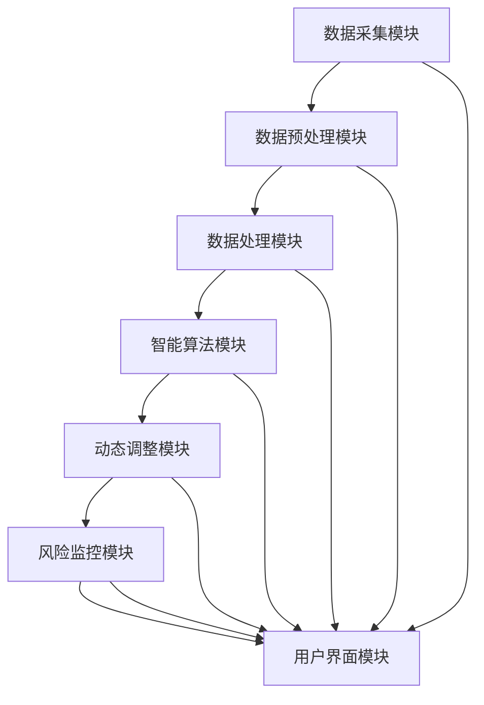
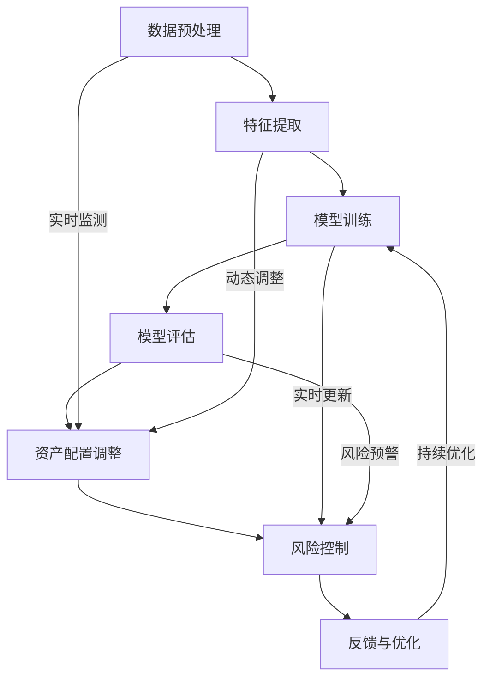
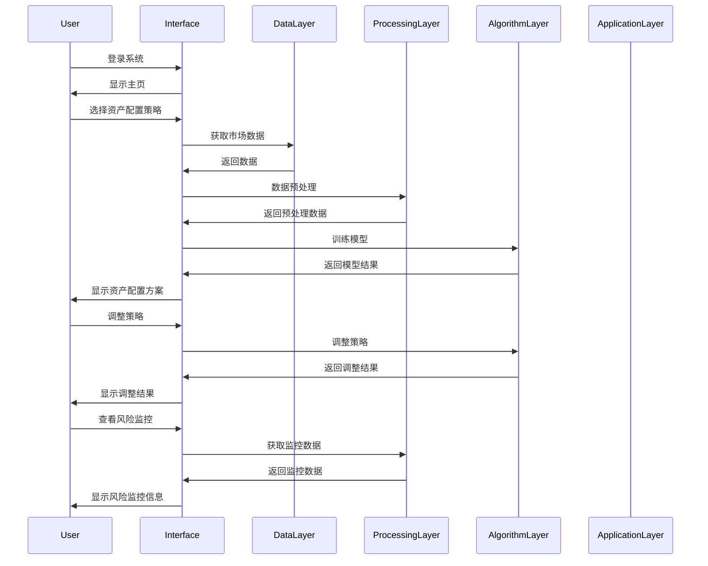
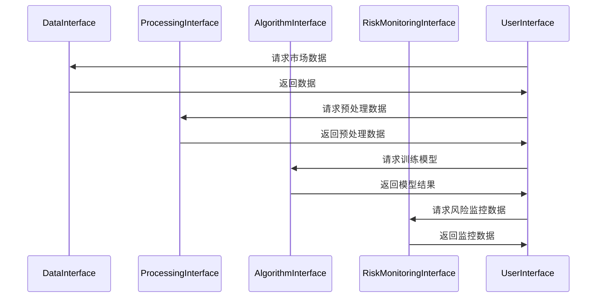
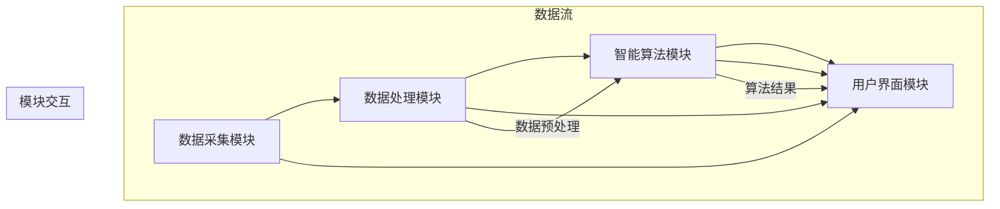

                 

### 引言

随着全球经济的快速发展和金融市场的不断演变，资产配置已成为投资者和管理者关注的焦点。传统的资产配置策略往往依赖于历史数据和经验，然而，面对日益复杂的市场环境，这些策略的灵活性和适应性逐渐显现出局限性。在这种背景下，智能资产配置策略动态调整系统应运而生，旨在通过人工智能和大数据分析技术，实现对资产配置策略的实时调整和优化。

智能资产配置策略动态调整系统是一种结合了智能算法和数据驱动的方法，通过对市场数据的深度挖掘和分析，动态调整资产配置组合，以实现风险控制和收益最大化。本文将详细探讨这一系统的核心概念、设计与实现、实际应用以及最佳实践技巧，旨在为读者提供一个全面而深入的理解。

文章将以“智能资产配置策略动态调整系统”为标题，围绕以下核心关键词展开：

- 智能资产配置
- 动态调整
- 系统设计与实现
- 实际案例
- 最佳实践

在接下来的章节中，我们将首先介绍智能资产配置策略动态调整系统的背景和重要性，随后逐步深入分析系统的核心概念、架构设计、实现方法和应用场景，最后总结最佳实践并提供拓展阅读建议。通过这一系列探讨，读者将能够更好地理解智能资产配置策略动态调整系统在金融市场中的关键作用，并为实际应用提供有益的参考。

### 第1章：问题背景与问题描述

在讨论智能资产配置策略动态调整系统之前，有必要首先了解传统资产配置策略的局限性。传统资产配置策略通常基于历史数据和经验模型，其核心思想是通过资产分配来降低投资组合的整体风险，同时实现预期收益。然而，在实际操作中，这些策略面临着诸多挑战。

首先，传统资产配置策略的灵活性和适应性较差。由于市场环境的变化无常，依赖历史数据的策略往往难以适应新的市场条件。例如，在市场剧烈波动时，传统策略可能无法及时调整资产组合，从而错失投资机会或承受不必要的风险。

其次，传统策略的依赖性较强。许多策略需要依赖特定市场环境下的历史数据和统计模型，这些模型的有效性在复杂多变的市场中受到质疑。同时，不同投资者对市场趋势的看法各不相同，这导致传统策略在实施过程中难以统一。

第三，传统策略的信息处理能力有限。随着金融市场信息的爆炸式增长，传统策略难以有效地处理和分析海量的数据。这导致信息利用不足，进而影响资产配置的准确性和及时性。

为了解决这些问题，智能资产配置策略动态调整系统应运而生。该系统通过引入人工智能和大数据分析技术，实现了资产配置策略的实时调整和优化。

智能资产配置策略动态调整系统的核心目标是通过数据驱动的方法，动态调整资产配置组合，以适应不断变化的市场环境。具体而言，该系统包括以下几个关键方面：

1. **数据采集与分析**：系统通过多种渠道采集市场数据，包括股票价格、交易量、宏观经济指标等，并通过大数据分析技术对这些数据进行分析和处理，提取出有价值的信息。

2. **智能算法**：系统采用先进的机器学习算法，如神经网络、决策树和强化学习等，对市场数据进行分析和预测。这些算法能够从历史数据中学习市场趋势，并对未来市场走势进行预测。

3. **动态调整机制**：基于分析结果，系统可以实时调整资产配置组合。例如，当预测市场趋势向上时，系统可能会增加高风险资产的比重，以期望获取更高的收益；当市场趋势向下时，系统可能会增加低风险资产的比重，以降低整体风险。

4. **风险控制**：系统通过设置风险阈值，对投资组合的风险进行控制。例如，当投资组合的风险超过预设阈值时，系统会自动进行调整，以避免潜在损失。

5. **用户界面**：系统提供直观的用户界面，用户可以实时查看资产配置组合、市场趋势和风险水平，并进行调整。

智能资产配置策略动态调整系统的引入，不仅提高了资产配置策略的灵活性和适应性，还增强了信息处理能力，从而更好地应对复杂多变的市场环境。通过这一系统，投资者和管理者可以更有效地管理投资组合，实现风险控制和收益最大化。

总的来说，智能资产配置策略动态调整系统是一种创新的解决方案，它结合了人工智能和大数据分析技术，通过实时调整和优化资产配置组合，为金融市场中的投资者和管理者提供了有力的工具。

### 第2章：核心概念与联系

要深入理解智能资产配置策略动态调整系统，我们首先需要了解其中的核心概念，包括智能资产配置、资产配置策略以及动态调整。这些概念相互关联，共同构成了系统的基础。

#### 2.1 智能资产配置

**2.1.1 智能资产配置的概念**

智能资产配置是指利用人工智能技术，通过数据分析、机器学习和算法优化等方法，对投资者的资产进行科学分配，以实现风险控制和收益最大化的过程。与传统的资产配置方法相比，智能资产配置具有更高的灵活性和适应性，能够根据市场变化实时调整资产组合。

**2.1.2 智能资产配置的特点**

- **数据驱动**：智能资产配置依赖于大量的市场数据和历史数据，通过数据分析技术提取出有价值的信息。
- **实时调整**：系统能够实时分析市场数据，并根据预测结果动态调整资产配置组合。
- **个性化定制**：系统可以根据投资者的风险偏好和投资目标，提供个性化的资产配置方案。
- **风险控制**：智能资产配置系统能够设置风险阈值，对投资组合的风险进行有效控制。

**2.1.3 智能资产配置与传统资产配置的区别**

- **方法**：传统资产配置主要依赖历史数据和经验模型，而智能资产配置则利用人工智能技术进行预测和分析。
- **灵活性**：传统资产配置的调整速度较慢，而智能资产配置可以实时响应市场变化。
- **适应性**：智能资产配置能够根据不同市场环境和投资者偏好进行个性化调整，而传统资产配置的适应性较差。

#### 2.2 资产配置策略

**2.2.1 资产配置策略的概念**

资产配置策略是指投资者在构建投资组合时，通过将资产分配到不同的资产类别中，以实现特定投资目标的过程。资产配置策略的核心是平衡收益和风险，根据市场环境和投资者的风险偏好进行资产的分配。

**2.2.2 资产配置策略的类型**

- **主动型策略**：主动型策略通过预测市场走势，主动调整资产配置，以获取超额收益。这类策略通常需要较高的市场分析能力和技术。
- **被动型策略**：被动型策略通过长期持有资产，追求市场平均收益。这类策略通常风险较低，但收益也可能低于市场平均水平。
- **平衡型策略**：平衡型策略结合了主动型和被动型策略的优点，通过在不同资产类别之间分配资金，平衡风险和收益。

**2.2.3 资产配置策略的制定**

制定资产配置策略需要考虑以下几个关键因素：

- **投资目标**：明确投资者的投资目标和风险偏好。
- **市场环境**：分析当前市场环境和宏观经济因素，预测市场趋势。
- **资产特性**：了解不同资产的特性，如收益性、风险性和流动性。
- **组合优化**：通过数据分析技术，优化资产配置组合，实现风险和收益的最优平衡。

#### 2.3 动态调整

**2.3.1 动态调整的概念**

动态调整是指资产配置策略在实施过程中，根据市场环境和投资者需求的变化，对资产配置组合进行实时调整的过程。动态调整的目标是保持投资组合的灵活性和适应性，以应对市场变化。

**2.3.2 动态调整的原理**

动态调整的原理基于以下几个关键点：

- **市场反馈**：通过市场数据和投资者行为，实时了解市场状况和投资者需求。
- **风险评估**：对当前投资组合进行风险评估，识别潜在的风险。
- **调整策略**：根据市场反馈和风险评估结果，制定和实施资产配置调整策略。

**2.3.3 动态调整的方法**

动态调整的方法主要包括：

- **阈值调整**：设置风险阈值，当投资组合的风险超过阈值时，进行相应的调整。
- **规则调整**：根据预设的规则和条件，定期对投资组合进行调整。
- **事件触发**：当发生特定事件，如市场剧烈波动或政策变化时，对投资组合进行快速调整。

#### 核心概念与联系

智能资产配置、资产配置策略和动态调整是智能资产配置策略动态调整系统的三个核心概念，它们相互关联，共同构成系统的理论基础。

- **智能资产配置**是系统的核心，它利用人工智能技术进行资产配置，提高策略的灵活性和适应性。
- **资产配置策略**是制定和实施资产配置的基础，通过科学的方法和数据分析技术，实现资产配置的最优平衡。
- **动态调整**是资产配置策略的补充和优化，通过实时调整，保持投资组合的灵活性和适应性。

这三个概念相互支持，共同推动智能资产配置策略动态调整系统的运行和优化。通过深入理解和掌握这些核心概念，投资者和管理者可以更好地应对市场变化，实现投资目标。

#### 2.1.1 智能资产配置的概念

智能资产配置是现代投资领域的一项前沿技术，它通过结合人工智能和大数据分析技术，对投资者的资产进行科学、灵活和个性化的分配。智能资产配置的核心在于利用机器学习算法和深度学习模型，从大量的历史数据和市场信息中提取有价值的信息，进而指导投资者的资产配置决策。

智能资产配置的基本概念包括以下几个方面：

- **数据处理与分析**：首先，系统需要从多个数据源（如股票市场、债券市场、商品市场等）收集大量的历史数据、实时数据和新闻资讯。这些数据经过清洗、处理和整合后，将成为智能资产配置的基础。

- **算法与模型**：智能资产配置依赖于多种先进的机器学习算法和深度学习模型。常见的算法包括线性回归、决策树、随机森林、支持向量机（SVM）、神经网络和强化学习等。这些算法和模型通过对历史数据的分析和训练，能够预测未来的市场走势和资产表现。

- **资产类别**：智能资产配置通常涉及多个资产类别，如股票、债券、基金、房地产、商品等。每种资产类别都有其独特的风险和收益特性。智能资产配置的目标是通过合理分配资产类别，实现风险和收益的最优平衡。

- **投资者偏好**：智能资产配置不仅关注市场数据，还需要考虑投资者的个人偏好和风险承受能力。不同的投资者有不同的投资目标、风险偏好和收益期望。智能资产配置系统能够根据投资者的个性化需求，提供定制化的资产配置方案。

- **动态调整**：智能资产配置不是一成不变的，而是根据市场环境和投资者需求的变化，进行动态调整。例如，当市场出现剧烈波动或投资者偏好发生变化时，系统会自动调整资产配置，以保持投资组合的灵活性和适应性。

#### 智能资产配置的特点

智能资产配置与传统资产配置相比，具有以下几个显著特点：

- **数据驱动**：智能资产配置高度依赖于数据分析技术，通过对大量市场数据和历史数据的深度挖掘，提取出有价值的信息。这种数据驱动的特点使得智能资产配置能够更准确地预测市场走势和资产表现。

- **实时调整**：传统的资产配置策略往往需要较长时间来调整，而智能资产配置系统能够实时响应市场变化，快速调整资产配置。这种实时调整的能力使得投资组合能够更灵活地应对市场波动，降低潜在风险。

- **个性化定制**：智能资产配置能够根据投资者的个人偏好和需求，提供个性化的资产配置方案。这种个性化定制的特点使得投资者能够更有效地实现其投资目标，同时降低投资风险。

- **风险控制**：智能资产配置系统能够通过设置风险阈值，对投资组合进行实时监控和风险控制。例如，当投资组合的风险超过预设阈值时，系统会自动进行调整，以避免潜在损失。

- **智能优化**：智能资产配置不仅仅是对现有资产进行配置，还包括对资产配置方案的持续优化。系统会根据市场变化和投资者反馈，不断调整和优化资产配置方案，以实现更高的收益和更低的风险。

#### 智能资产配置与传统资产配置的区别

智能资产配置与传统资产配置在方法、灵活性和适应性等方面存在显著差异：

- **方法**：传统资产配置主要依赖历史数据和经验模型，而智能资产配置则通过机器学习算法和深度学习模型，对市场数据进行分析和预测。

- **灵活性**：传统资产配置策略的调整速度较慢，而智能资产配置系统能够实时响应市场变化，快速调整资产配置。

- **适应性**：传统资产配置的适应性较差，难以应对复杂多变的市场环境，而智能资产配置能够根据不同市场环境和投资者偏好进行个性化调整。

- **依赖性**：传统资产配置策略的依赖性较强，需要依赖特定市场环境下的历史数据和统计模型，而智能资产配置则通过大数据分析技术，提高了信息处理能力和适应性。

总的来说，智能资产配置是一种结合了人工智能和大数据分析技术的创新解决方案，它不仅提高了资产配置策略的灵活性和适应性，还增强了信息处理能力，从而更好地应对复杂多变的市场环境。通过智能资产配置，投资者可以更有效地管理投资组合，实现风险控制和收益最大化。

### 2.2 资产配置策略

资产配置策略是投资者在构建投资组合时，通过将资产分配到不同的资产类别中，以实现特定投资目标的过程。有效的资产配置策略不仅能够降低投资组合的整体风险，还能实现预期收益的最大化。下面，我们将深入探讨资产配置策略的概念、类型和制定过程。

#### 2.2.1 资产配置策略的概念

资产配置策略是指投资者根据自身的投资目标和风险偏好，将资金分配到不同资产类别中的方法和原则。资产类别通常包括股票、债券、基金、房地产、商品等。资产配置策略的核心目标是平衡风险和收益，以实现投资组合的整体优化。

#### 2.2.2 资产配置策略的类型

资产配置策略可以根据不同的分类标准分为多种类型：

- **主动型策略**：主动型策略通过主动预测市场走势和资产表现，调整资产配置以获取超额收益。这类策略通常需要投资者具备较强的市场分析和预测能力，例如技术分析、基本面分析等。主动型策略包括：

  - **股票轮动策略**：投资者通过研究不同行业的表现，选择表现较好的股票进行投资，以期获得较高的收益。
  - **择时策略**：投资者通过预测市场趋势，选择在市场高点卖出和在市场低点买入，以实现收益的最大化。

- **被动型策略**：被动型策略通过长期持有资产，追求市场平均收益。这类策略通常风险较低，但收益也可能低于市场平均水平。常见的被动型策略包括：

  - **指数基金策略**：投资者选择购买跟踪市场指数的基金，以获取市场平均收益。
  - **恒定混合策略**：投资者将资金平均分配到不同资产类别中，保持资产配置的恒定比例。

- **平衡型策略**：平衡型策略结合了主动型和被动型策略的优点，通过在不同资产类别之间分配资金，实现风险和收益的最优平衡。常见的平衡型策略包括：

  - **固定比例策略**：投资者设定固定的资产配置比例，定期调整以维持这一比例。
  - **目标风险策略**：投资者根据自身的风险承受能力，设定特定的风险水平，并调整资产配置以保持这一风险水平。

#### 2.2.3 资产配置策略的制定

制定资产配置策略需要考虑以下几个关键因素：

- **投资目标**：明确投资者的投资目标，例如长期资本增值、短期收益或资产保值。不同的投资目标将影响资产配置的策略选择。

- **风险偏好**：了解投资者的风险偏好，例如高风险偏好、中等风险偏好或低风险偏好。不同的风险偏好将决定资产配置的比例和类型。

- **市场环境**：分析当前市场环境和宏观经济因素，预测市场趋势。市场环境的变化将影响资产配置策略的调整。

- **资产特性**：了解不同资产的特性，如收益性、风险性和流动性。资产特性将影响资产配置的决策。

- **组合优化**：通过数据分析技术，优化资产配置组合，实现风险和收益的最优平衡。组合优化可以通过数学模型和算法来实现。

具体步骤如下：

1. **确定投资目标**：投资者需要明确自己的投资目标，例如长期资本增值、短期收益或资产保值。

2. **评估风险偏好**：投资者需要评估自己的风险承受能力，例如高风险偏好、中等风险偏好或低风险偏好。

3. **分析市场环境**：投资者需要分析当前市场环境和宏观经济因素，预测市场趋势。

4. **了解资产特性**：投资者需要了解不同资产的特性，如收益性、风险性和流动性。

5. **制定资产配置方案**：根据投资目标、风险偏好、市场环境和资产特性，制定具体的资产配置方案。

6. **组合优化**：通过数据分析技术，优化资产配置组合，实现风险和收益的最优平衡。

7. **实施与监控**：实施资产配置策略，并定期监控和调整，以应对市场变化。

总的来说，资产配置策略是投资者实现投资目标的关键手段。通过科学合理的资产配置，投资者可以降低投资组合的整体风险，同时实现预期收益的最大化。

### 2.3 动态调整

动态调整是智能资产配置策略动态调整系统中的一个关键环节，它通过实时监测市场数据和投资者行为，对资产配置进行动态调整，以保持投资组合的灵活性和适应性。下面，我们将详细探讨动态调整的概念、原理和方法。

#### 2.3.1 动态调整的概念

动态调整是指资产配置策略在实施过程中，根据市场环境和投资者需求的变化，对资产配置组合进行实时调整的过程。动态调整的目标是保持投资组合的灵活性和适应性，以应对市场变化。

#### 2.3.2 动态调整的原理

动态调整的原理基于以下几个关键点：

1. **市场反馈**：通过实时监测市场数据，了解市场趋势和资产表现，为动态调整提供依据。

2. **风险评估**：对当前投资组合进行风险评估，识别潜在的风险，如市场波动、资产贬值等。

3. **调整策略**：根据市场反馈和风险评估结果，制定和实施资产配置调整策略，以保持投资组合的灵活性和适应性。

#### 2.3.3 动态调整的方法

动态调整的方法主要包括以下几种：

1. **阈值调整**：设置风险阈值，当投资组合的风险超过阈值时，进行相应的调整。例如，当市场波动率超过预设阈值时，增加低风险资产的比重。

2. **规则调整**：根据预设的规则和条件，定期对投资组合进行调整。例如，根据市场趋势的变化，调整资产配置的比例。

3. **事件触发**：当发生特定事件，如市场剧烈波动或政策变化时，对投资组合进行快速调整。例如，当股市发生大跌时，增加现金资产的比重。

4. **模型预测**：利用机器学习算法和深度学习模型，预测市场趋势和资产表现，为动态调整提供科学依据。

5. **用户反馈**：根据投资者的反馈和需求，进行个性化调整。例如，当投资者对某个资产类别有较高的期望时，增加该资产类别的比重。

### 动态调整的优势

动态调整具有以下几个显著优势：

1. **灵活性**：动态调整能够根据市场变化和投资者需求，实时调整资产配置组合，提高投资组合的灵活性。

2. **适应性**：动态调整能够应对复杂多变的市场环境，保持投资组合的适应性，降低投资风险。

3. **实时性**：动态调整能够实时监测市场数据，快速响应市场变化，提高投资决策的及时性。

4. **个性化**：动态调整能够根据投资者的个人偏好和需求，提供个性化的资产配置方案，满足不同投资者的需求。

5. **优化性**：动态调整能够通过机器学习和深度学习技术，不断优化资产配置组合，实现风险和收益的最优平衡。

总的来说，动态调整是智能资产配置策略动态调整系统中的一个重要组成部分，它通过实时监测市场数据和投资者行为，动态调整资产配置组合，以保持投资组合的灵活性和适应性。通过动态调整，投资者可以更好地应对市场变化，实现风险控制和收益最大化。

### 2.3.3 动态调整的方法

动态调整是智能资产配置策略动态调整系统的核心功能之一，它通过多种方法实现对投资组合的实时优化。以下将详细描述几种常用的动态调整方法：

#### 1. **阈值调整法**

阈值调整法是一种基于风险控制的动态调整方法。它通过设定特定的风险阈值，当投资组合的风险超过阈值时，自动进行资产调整。具体步骤如下：

- **设定阈值**：首先，根据历史数据和投资者风险偏好，设定风险阈值。例如，设定市场波动率超过3%时，视为高风险状态。

- **监测风险**：系统实时监测投资组合的风险指标，如波动率、下行风险等。

- **触发调整**：当监测到风险指标超过阈值时，系统自动触发调整机制。

- **执行调整**：根据预设的调整规则，系统对投资组合进行调整。例如，增加低风险资产的比例，减少高风险资产的比例。

- **风险评估**：调整后，系统重新评估投资组合的风险水平，确保调整效果。

阈值调整法的优点是简单易行，能够快速响应市场变化，缺点是可能过于保守，错失市场机会。

#### 2. **规则调整法**

规则调整法是一种基于预设规则的动态调整方法。它通过制定一系列规则，根据市场状况和投资目标，定期调整资产配置。具体步骤如下：

- **制定规则**：根据投资目标和市场环境，制定调整规则。例如，每月底根据市场走势调整资产配置比例。

- **规则执行**：系统按照既定规则执行调整。例如，当股票市场上涨时，增加股票资产的比重；当债券市场走强时，增加债券资产的比重。

- **定期评估**：定期评估调整规则的有效性，根据市场变化进行调整。

- **灵活调整**：在特定情况下，系统可以临时调整规则，以应对突发市场事件。

规则调整法的优点是灵活性强，能够根据市场变化进行定期调整，缺点是可能缺乏实时性，不能迅速应对市场变化。

#### 3. **事件触发法**

事件触发法是一种基于特定事件的动态调整方法。它通过监测市场事件，如政策变动、市场波动等，触发资产调整。具体步骤如下：

- **事件监测**：系统实时监测市场事件，如政策发布、重大新闻等。

- **触发条件**：设定触发条件，如政策变动导致市场波动超过2%。

- **执行调整**：当监测到触发条件时，系统自动执行调整。

- **调整验证**：调整后，系统对调整效果进行验证，确保调整的正确性。

- **持续监控**：对已触发的事件进行持续监控，根据事件发展和市场变化，进行进一步调整。

事件触发法的优点是能够快速应对市场事件，缺点是可能受到突发事件的影响，导致调整过度。

#### 4. **模型预测法**

模型预测法是一种基于机器学习和深度学习算法的动态调整方法。它通过预测市场趋势和资产表现，调整资产配置。具体步骤如下：

- **数据采集**：收集大量市场数据，包括股票、债券、基金等的价格、交易量、宏观经济指标等。

- **模型训练**：使用机器学习和深度学习算法，对市场数据进行分析和训练，构建预测模型。

- **预测市场趋势**：利用训练好的模型，预测市场趋势和资产表现。

- **调整资产配置**：根据预测结果，调整资产配置组合。例如，当预测市场将上涨时，增加股票资产的比重。

- **模型优化**：定期对模型进行优化和调整，提高预测精度。

- **风险评估**：调整后，系统重新评估投资组合的风险水平，确保调整效果。

模型预测法的优点是能够通过数据分析和预测，实现更加科学和精确的资产配置，缺点是需要大量数据和高计算能力，同时模型的预测精度和稳定性也存在一定挑战。

综上所述，动态调整方法包括阈值调整法、规则调整法、事件触发法和模型预测法。每种方法都有其独特的优势和适用场景，投资者可以根据自身需求和市场环境，选择合适的动态调整方法，以实现投资组合的优化和风险管理。

### 3.1 系统架构设计

在构建智能资产配置策略动态调整系统时，系统架构设计是关键的一步。合理的架构设计能够确保系统的高性能、可扩展性和稳定性，从而满足复杂多变的市场需求。下面，我们将详细介绍系统的架构设计，包括系统架构概述、模块划分以及系统架构图。

#### 3.1.1 系统架构概述

智能资产配置策略动态调整系统采用分层架构设计，主要分为四个层次：数据层、数据处理层、智能算法层和应用层。每个层次都有其特定的功能和职责，相互协作，共同实现系统的目标。

1. **数据层**：数据层负责数据的采集、存储和管理。系统通过多种渠道获取市场数据，包括股票、债券、基金等价格数据、交易量数据、宏观经济指标数据等。这些数据经过清洗、预处理后，存储在分布式数据库中，以供后续处理和分析。

2. **数据处理层**：数据处理层负责对采集到的数据进行处理和分析。这一层包括数据清洗、数据转换和数据挖掘等多个模块。通过使用大数据处理技术，如Hadoop、Spark等，系统能够高效地处理海量数据，提取出有价值的信息。

3. **智能算法层**：智能算法层负责运用机器学习、深度学习等技术，对处理后的数据进行分析和预测。该层包括多个算法模块，如回归分析、决策树、神经网络、强化学习等。这些算法模块通过对市场数据的学习和训练，能够预测市场趋势和资产表现，为动态调整提供科学依据。

4. **应用层**：应用层是系统的用户界面，负责向用户提供资产配置方案、动态调整结果和风险监控等信息。通过直观的用户界面，用户可以实时查看投资组合情况，进行资产配置的调整和优化。

#### 3.1.2 系统模块划分

为了实现系统的高效运行，智能资产配置策略动态调整系统划分为多个模块，每个模块都有明确的职责和功能。以下是主要模块的划分及其职责：

1. **数据采集模块**：负责从多个数据源采集市场数据，如股票市场、债券市场、商品市场等。通过API接口、实时数据流和数据库等方式，系统可以高效地获取最新的市场数据。

2. **数据预处理模块**：负责对采集到的数据进行清洗、去噪和转换，确保数据的质量和一致性。该模块包括数据清洗、数据格式转换和数据归一化等功能。

3. **数据处理模块**：负责对预处理后的数据进行分析和挖掘，提取出有价值的信息。该模块包括数据统计分析、时间序列分析、多变量分析等。

4. **智能算法模块**：负责运用机器学习和深度学习算法，对市场数据进行分析和预测。该模块包括回归分析、决策树、神经网络、强化学习等算法。

5. **动态调整模块**：负责根据智能算法的预测结果，动态调整资产配置组合。该模块包括阈值调整、规则调整、事件触发和模型预测等方法。

6. **风险监控模块**：负责对投资组合进行实时监控，识别潜在的风险，并提供风险预警。该模块包括风险指标计算、风险阈值设定和风险预警等。

7. **用户界面模块**：负责向用户提供资产配置方案、动态调整结果和风险监控等信息。该模块包括网页界面、移动应用和API接口等。

#### 3.1.3 系统架构图

以下是智能资产配置策略动态调整系统的架构图，展示了各个模块之间的相互关系和数据处理流程：



在该架构图中：

- **数据采集模块**：从多个数据源获取市场数据。
- **数据预处理模块**：对数据进行清洗、去噪和转换。
- **数据处理模块**：对预处理后的数据进行分析和挖掘。
- **智能算法模块**：运用机器学习和深度学习算法进行预测。
- **动态调整模块**：根据预测结果调整资产配置。
- **风险监控模块**：对投资组合进行实时监控。
- **用户界面模块**：向用户展示资产配置方案和动态调整结果。

通过以上系统架构设计，智能资产配置策略动态调整系统能够高效、灵活地应对复杂的市场环境，为投资者提供科学、准确的资产配置方案和风险管理工具。

### 3.2 数据流设计

在智能资产配置策略动态调整系统中，数据流设计是关键的一环。一个高效的数据流设计能够确保系统及时、准确地处理海量市场数据，从而实现资产配置策略的动态调整。以下将详细描述系统的数据流设计，包括数据来源、数据处理流程以及数据存储。

#### 3.2.1 数据来源

智能资产配置策略动态调整系统所需的数据来源广泛，主要包括以下几个部分：

1. **市场数据**：包括股票、债券、基金、商品等金融产品的价格数据、交易量数据、波动率数据等。这些数据通常来源于各大金融市场数据提供商，如新浪财经、雪球、Wind金融终端等。

2. **宏观经济指标**：包括GDP增长率、通货膨胀率、失业率、利率等宏观经济数据。这些数据通常来源于国家统计局、国际货币基金组织（IMF）等官方机构。

3. **行业数据**：包括各行业的发展状况、市场份额、盈利能力等。这些数据通常来源于行业研究报告、市场调查公司等。

4. **新闻和事件**：包括金融市场相关的新闻、政策变化、重大事件等。这些数据通常来源于新闻网站、金融新闻平台等。

5. **社交媒体数据**：包括投资者在社交媒体上的评论、讨论和情绪分析。这些数据通常来源于Twitter、微博、论坛等社交平台。

#### 3.2.2 数据处理流程

数据处理流程是数据流设计中的核心部分，主要包括以下步骤：

1. **数据采集**：通过API接口、实时数据流和数据库连接等方式，从多个数据源采集原始数据。

2. **数据清洗**：对采集到的数据进行清洗，包括去噪、去重、填补缺失值等。这一步骤确保数据的质量和一致性。

3. **数据转换**：将不同格式和单位的数据转换为统一格式，如将价格数据转换为人民币，交易量数据转换为手等。

4. **数据整合**：将来自不同数据源的数据进行整合，形成统一的数据视图。例如，将股票价格数据和交易量数据整合在一起，形成完整的股票数据。

5. **数据挖掘**：运用统计学、时间序列分析和机器学习等方法，对整合后的数据进行挖掘和分析，提取出有价值的信息。例如，分析价格趋势、交易量变化、相关性等。

6. **特征工程**：对提取出的数据进行特征工程，包括特征选择、特征转换和特征提取等。这一步骤有助于提高模型预测的准确性和效率。

7. **数据存储**：将处理后的数据存储在分布式数据库或数据仓库中，以供后续使用。常用的存储方案包括Hadoop、Spark等大数据技术。

#### 3.2.3 数据存储

智能资产配置策略动态调整系统采用了分布式存储方案，以应对海量数据的存储和访问需求。以下是一些常用的数据存储方案：

1. **关系数据库**：如MySQL、PostgreSQL等，适用于存储结构化数据，如股票价格、交易量等。

2. **NoSQL数据库**：如MongoDB、Cassandra等，适用于存储非结构化或半结构化数据，如新闻文本、社交媒体数据等。

3. **数据仓库**：如Hive、Impala等，适用于存储和查询大规模数据集，提供高效的批量处理和分析能力。

4. **分布式文件系统**：如Hadoop HDFS、Amazon S3等，适用于存储大规模数据集，提供高可靠性和高可扩展性。

通过以上数据流设计，智能资产配置策略动态调整系统能够高效、准确地处理和分析海量市场数据，为资产配置策略的动态调整提供坚实的数据基础。

### 3.3 算法原理讲解

在智能资产配置策略动态调整系统中，算法原理是实现系统核心功能的关键。以下将详细讲解系统中的主要算法原理，包括算法概述、算法流程和算法数学模型。

#### 3.3.1 算法概述

智能资产配置策略动态调整系统采用了多种机器学习和深度学习算法，以实现对市场数据的分析和预测。以下是一些常用的算法：

1. **回归分析**：回归分析是一种常用的统计方法，用于分析自变量和因变量之间的关系。在资产配置策略中，回归分析可以用来预测资产价格或收益。

2. **决策树**：决策树是一种分类和回归算法，通过一系列的决策规则对数据进行分类或预测。在资产配置策略中，决策树可以用来判断资产配置的比例。

3. **神经网络**：神经网络是一种模仿人脑神经元结构的计算模型，具有强大的学习和预测能力。在资产配置策略中，神经网络可以用来分析复杂的市场数据，预测市场趋势。

4. **强化学习**：强化学习是一种基于奖励机制的学习方法，通过不断尝试和反馈，优化决策过程。在资产配置策略中，强化学习可以用来调整资产配置，以实现最佳收益。

#### 3.3.2 算法流程

以下是一个典型的算法流程，用于智能资产配置策略动态调整：

1. **数据预处理**：对采集到的市场数据、宏观经济指标等数据进行清洗、去噪和预处理。

2. **特征提取**：从预处理后的数据中提取特征，如价格、交易量、波动率等。

3. **模型训练**：选择合适的算法，对提取出的特征进行训练，建立预测模型。

4. **模型评估**：使用验证集对训练好的模型进行评估，确保模型的有效性和准确性。

5. **资产配置调整**：根据模型预测结果，动态调整资产配置组合。

6. **风险控制**：设置风险阈值，对投资组合进行实时监控，确保风险在可接受范围内。

7. **反馈与优化**：根据实际投资表现和用户反馈，不断优化算法模型和资产配置策略。

#### 3.3.3 算法数学模型

以下是几种常用算法的数学模型：

1. **线性回归模型**：

   线性回归模型假设自变量和因变量之间存在线性关系，其数学模型可以表示为：

   $$ Y = \beta_0 + \beta_1X + \epsilon $$

   其中，$Y$ 为因变量，$X$ 为自变量，$\beta_0$ 和 $\beta_1$ 分别为回归系数，$\epsilon$ 为误差项。

2. **决策树模型**：

   决策树模型通过一系列的决策规则来对数据进行分类或预测，其基本结构可以表示为：

   $$ f(X) = \begin{cases}
   \text{分类结果}_1 & \text{if } X \text{ satisfies } \text{condition}_1 \\
   \text{分类结果}_2 & \text{if } X \text{ satisfies } \text{condition}_2 \\
   \vdots \\
   \text{分类结果}_n & \text{if } X \text{ satisfies } \text{condition}_n
   \end{cases} $$

3. **神经网络模型**：

   神经网络模型由多个神经元层组成，每个神经元层的输出都是下一层的输入。其基本结构可以表示为：

   $$ f(\text{Input}) = \text{Activation}(\text{Weights} \cdot \text{Input} + \text{Bias}) $$

   其中，$\text{Weights}$ 和 $\text{Bias}$ 分别为权重和偏置，$\text{Activation}$ 为激活函数。

4. **强化学习模型**：

   强化学习模型通过奖励机制来优化决策过程，其基本结构可以表示为：

   $$ Q(S, A) = r(S, A) + \gamma \max_{A'} Q(S', A') $$

   其中，$Q(S, A)$ 为状态-动作值函数，$r(S, A)$ 为即时奖励，$\gamma$ 为折扣因子，$S'$ 和 $A'$ 分别为下一状态和下一动作。

通过以上算法原理的讲解，读者可以更深入地理解智能资产配置策略动态调整系统的工作机制和核心算法，从而为实际应用提供理论支持。

### 3.3.3 算法数学模型

在深入理解智能资产配置策略动态调整系统的算法原理后，我们将进一步探讨这些算法的数学模型。以下是几个关键算法的数学模型及其解释：

#### 1. 线性回归模型

线性回归模型是一种基础的统计模型，用于预测因变量$Y$与自变量$X$之间的关系。其数学模型可以表示为：

$$ Y = \beta_0 + \beta_1X + \epsilon $$

- **公式解释**：
  - $Y$：因变量，表示预测的目标值。
  - $\beta_0$：截距，表示当$X$为零时的$Y$值。
  - $\beta_1$：斜率，表示$X$每增加一个单位时$Y$的变化量。
  - $X$：自变量，表示输入的特征值。
  - $\epsilon$：误差项，表示实际值与预测值之间的差异。

- **应用示例**：
  - 假设我们要预测股票价格$Y$与交易量$X$之间的关系。根据历史数据，我们可以得到线性回归模型：
    $$ Y = 100 + 2X $$
  - 当交易量$X$为100时，预测的股票价格$Y$为$100 + 2 \times 100 = 300$。

#### 2. 决策树模型

决策树模型是一种分类和回归算法，通过一系列的决策规则对数据进行分类或预测。其数学模型可以表示为：

$$ f(X) = \begin{cases}
\text{分类结果}_1 & \text{if } X \text{ satisfies } \text{condition}_1 \\
\text{分类结果}_2 & \text{if } X \text{ satisfies } \text{condition}_2 \\
\vdots \\
\text{分类结果}_n & \text{if } X \text{ satisfies } \text{condition}_n
\end{cases} $$

- **公式解释**：
  - $f(X)$：决策树模型输出的结果。
  - $X$：输入的特征值。
  - $\text{condition}_1, \text{condition}_2, \ldots, \text{condition}_n$：决策树中的条件。
  - $\text{分类结果}_1, \text{分类结果}_2, \ldots, \text{分类结果}_n$：每个条件的分类结果。

- **应用示例**：
  - 假设我们要预测某股票是上涨还是下跌，根据多个指标（如PE、PB、交易量等）构建决策树模型：
    $$ f(\text{PE}, \text{PB}, \text{交易量}) = \begin{cases}
    \text{上涨} & \text{if } \text{PE} > 20 \text{ and } \text{PB} < 2 \\
    \text{下跌} & \text{if } \text{PE} < 10 \text{ and } \text{交易量} < 1000 \\
    \text{观望} & \text{otherwise}
    \end{cases} $$

#### 3. 神经网络模型

神经网络模型是一种复杂的计算模型，由多个神经元层组成，每个神经元层的输出都是下一层的输入。其基本结构可以表示为：

$$ f(\text{Input}) = \text{Activation}(\text{Weights} \cdot \text{Input} + \text{Bias}) $$

- **公式解释**：
  - $f(\text{Input})$：神经网络的输出。
  - $\text{Input}$：输入的特征值。
  - $\text{Weights}$：权重，表示每个输入特征的重要性。
  - $\text{Bias}$：偏置，用于调整模型的输出。
  - $\text{Activation}$：激活函数，用于引入非线性变换。

- **应用示例**：
  - 假设我们使用一个简单的神经网络来预测股票价格，其输入层有3个神经元，隐藏层有2个神经元，输出层有1个神经元。激活函数为ReLU（Rectified Linear Unit）：
    $$ f(\text{Input}) = \text{ReLU}(\text{Weights} \cdot \text{Input} + \text{Bias}) $$

#### 4. 强化学习模型

强化学习模型通过奖励机制来优化决策过程，其基本结构可以表示为：

$$ Q(S, A) = r(S, A) + \gamma \max_{A'} Q(S', A') $$

- **公式解释**：
  - $Q(S, A)$：状态-动作值函数，表示在状态$S$下执行动作$A$的预期收益。
  - $r(S, A)$：即时奖励，表示在状态$S$下执行动作$A$后获得的即时奖励。
  - $\gamma$：折扣因子，表示对未来奖励的折现。
  - $S'$：下一状态。
  - $A'$：下一动作。

- **应用示例**：
  - 假设我们使用Q-Learning算法来调整资产配置，状态$S$包括当前资产配置组合、市场环境等，动作$A$包括调整资产配置的比例。折扣因子$\gamma$为0.9：
    $$ Q(S, A) = r(S, A) + 0.9 \max_{A'} Q(S', A') $$

通过以上数学模型，我们可以更好地理解智能资产配置策略动态调整系统的算法原理。这些模型不仅提供了理论支持，也为实际应用提供了具体的指导。在接下来的章节中，我们将进一步探讨系统的实际实现和案例分析。

### 3.3.4 算法流程图与Python代码实现

为了更直观地展示算法的执行流程，我们使用Mermaid语言绘制了算法流程图，并提供了相应的Python代码实现。以下是具体步骤和示例。

#### 3.3.4.1 算法流程图



#### 3.3.4.2 Python代码实现

以下是一个简化的Python代码实现，用于展示算法的基本流程：

```python
import pandas as pd
import numpy as np
from sklearn.linear_model import LinearRegression
from sklearn.model_selection import train_test_split
from sklearn.metrics import mean_squared_error

# 数据预处理
def preprocess_data(data):
    # 清洗和转换数据
    # 例如：填补缺失值、去重、标准化等
    return data

# 特征提取
def extract_features(data):
    # 从数据中提取特征
    # 例如：价格、交易量、波动率等
    features = data[['price', 'volume', 'volatility']]
    return features

# 模型训练
def train_model(features, target):
    model = LinearRegression()
    model.fit(features, target)
    return model

# 模型评估
def evaluate_model(model, test_features, test_target):
    predictions = model.predict(test_features)
    mse = mean_squared_error(test_target, predictions)
    return mse

# 资产配置调整
def adjust_assets(model, current_assets, risk_threshold):
    # 根据模型预测和风险阈值调整资产配置
    # 例如：增加/减少某类资产的比重
    return adjusted_assets

# 风险控制
def risk_control(assets, risk_threshold):
    # 根据资产配置和风险阈值控制风险
    # 例如：设置止损点、调整止损策略等
    return risk_level

# 主程序
def main():
    # 加载数据
    data = pd.read_csv('market_data.csv')
    data = preprocess_data(data)
    
    # 分割数据
    features, target = extract_features(data), data['price']
    train_features, test_features, train_target, test_target = train_test_split(features, target, test_size=0.2, random_state=42)
    
    # 训练模型
    model = train_model(train_features, train_target)
    
    # 评估模型
    mse = evaluate_model(model, test_features, test_target)
    print(f'Model Mean Squared Error: {mse}')
    
    # 资产配置调整
    current_assets = {'stock': 0.5, 'bond': 0.3, 'cash': 0.2}
    adjusted_assets = adjust_assets(model, current_assets, risk_threshold=0.05)
    print(f'Adjusted Assets: {adjusted_assets}')
    
    # 风险控制
    risk_level = risk_control(adjusted_assets, risk_threshold=0.05)
    print(f'Risk Level: {risk_level}')

if __name__ == '__main__':
    main()
```

在这个示例中，我们使用了线性回归模型进行资产配置调整，并设计了数据预处理、特征提取、模型训练、模型评估、资产配置调整和风险控制等步骤。读者可以根据实际需求，扩展和优化这些功能模块，以实现更复杂的算法流程。

### 3.4 系统分析与架构设计方案

在智能资产配置策略动态调整系统中，系统分析与架构设计方案是确保系统功能实现和性能优化的重要环节。本文将从系统架构设计、功能模块设计以及接口设计和系统交互等方面，详细介绍系统分析与架构设计方案。

#### 3.4.1 问题场景介绍

智能资产配置策略动态调整系统旨在解决金融市场中的投资者在资产配置过程中面临的问题，包括：

- **市场变化适应性差**：传统资产配置策略在面对复杂多变的市场环境时，适应性较差，难以及时调整资产配置，导致投资收益不理想。

- **信息处理能力有限**：投资者需要处理和分析大量的市场数据，但传统方法在信息处理能力上存在局限，难以实现高效的数据分析和预测。

- **风险控制难度大**：在市场波动较大时，投资者难以准确判断风险，并进行有效的风险控制，可能导致投资损失。

#### 3.4.2 系统功能设计

智能资产配置策略动态调整系统的主要功能包括：

1. **数据采集与处理**：从多个数据源采集市场数据，包括股票、债券、基金等，并对数据进行清洗、转换和预处理，确保数据质量和一致性。

2. **资产配置策略生成与调整**：根据投资者的风险偏好和市场数据，生成个性化的资产配置策略，并根据市场变化实时调整资产配置。

3. **风险监控与管理**：对投资组合进行实时监控，识别潜在风险，并提供风险预警和管理工具。

4. **用户界面**：提供直观的用户界面，用户可以实时查看资产配置方案、动态调整结果和风险监控信息。

#### 3.4.2.1 领域模型

为了更好地设计系统功能模块，我们首先构建了领域模型，用于描述系统的核心概念和实体关系。以下是领域模型的Mermaid类图：

```mermaid
classDiagram
    Data --> Model
    Model --> Strategy
    Strategy --> Asset
    Asset --> Portfolio
    Risk --> Monitoring
    User --> Interface
    User --> Portfolio

    Data <<实体|颜色:blue>>
    Model <<实体|颜色:green>>
    Strategy <<实体|颜色:blue>>
    Asset <<实体|颜色:green>>
    Portfolio <<实体|颜色:blue>>
    Risk <<实体|颜色:green>>
    Monitoring <<实体|颜色:blue>>
    User <<实体|颜色:green>>
    Interface <<实体|颜色:blue>>

    Data { 数据源 }
    Model { 模型 }
    Strategy { 策略 }
    Asset { 资产 }
    Portfolio { 投资组合 }
    Risk { 风险 }
    Monitoring { 监控 }
    User { 用户 }
    Interface { 用户界面 }

    User ..|> Data
    User ..|> Model
    User ..|> Strategy
    User ..|> Asset
    User ..|> Portfolio
    User ..|> Risk
    User ..|> Monitoring
    User ..|> Interface

    Data ..|> Model
    Model ..|> Strategy
    Strategy ..|> Asset
    Asset ..|> Portfolio
    Portfolio ..|> Monitoring
    Risk ..|> Monitoring
    Monitoring ..|> Interface
```

在该类图中：

- **数据源**：包括市场数据、宏观经济指标和行业数据等。
- **模型**：包括数据处理模型和预测模型，用于生成资产配置策略。
- **策略**：包括资产配置策略和动态调整策略。
- **资产**：包括股票、债券、基金等。
- **投资组合**：包括用户的资产配置组合。
- **风险**：包括投资组合的风险指标。
- **监控**：包括风险监控和预警机制。
- **用户界面**：包括用户操作界面和展示界面。

#### 3.4.2.2 系统功能模块设计

根据领域模型，智能资产配置策略动态调整系统可以分为以下功能模块：

1. **数据采集模块**：负责从多个数据源采集市场数据，包括股票、债券、基金等的价格、交易量、波动率等指标。

2. **数据处理模块**：负责对采集到的数据进行清洗、转换和预处理，提取出有用的特征信息，为模型训练提供数据支持。

3. **模型训练模块**：负责使用机器学习算法和深度学习模型，对预处理后的数据进行分析和预测，生成资产配置策略。

4. **策略调整模块**：负责根据市场数据和用户需求，动态调整资产配置策略，实现投资组合的实时优化。

5. **风险监控模块**：负责对投资组合进行实时监控，识别潜在风险，并提供风险预警和管理工具。

6. **用户界面模块**：负责向用户提供资产配置方案、动态调整结果和风险监控信息，提供直观的操作界面。

#### 3.4.3 系统架构设计

智能资产配置策略动态调整系统的架构设计采用分层架构，包括数据层、处理层、算法层和应用层。以下是系统架构的Mermaid架构图：



在该架构图中：

- **数据层**：负责数据的采集、存储和管理。
- **处理层**：负责数据的预处理、特征提取和数据分析。
- **算法层**：负责模型的训练、预测和动态调整。
- **应用层**：负责用户界面的展示、用户操作和系统交互。

#### 3.4.4 系统接口设计和系统交互

系统接口设计是确保各模块之间高效通信和数据流动的关键。以下是系统接口设计和系统交互的Mermaid序列图：



在该序列图中：

- **数据接口**：负责数据层的接口通信，提供市场数据的获取和返回。
- **处理接口**：负责处理层的接口通信，提供数据预处理的结果。
- **算法接口**：负责算法层的接口通信，提供模型训练和预测的结果。
- **风险监控接口**：负责风险监控层的接口通信，提供风险监控数据。

通过以上系统分析与架构设计方案，智能资产配置策略动态调整系统能够高效、稳定地运行，为投资者提供科学、准确的资产配置方案和风险控制工具。

### 3.4.5 系统架构设计

为了确保智能资产配置策略动态调整系统的高效、稳定运行，我们采用了模块化、分布式架构设计，包括数据处理模块、智能算法模块、用户界面模块等。以下是系统架构的详细设计。

#### 3.4.5.1 系统架构图

以下是智能资产配置策略动态调整系统的架构图：



#### 3.4.5.2 系统架构说明

1. **数据采集模块（A）**：负责从多个数据源（如股票市场、债券市场、新闻平台等）采集市场数据，包括价格、交易量、波动率等。该模块通过API接口、数据流和数据库连接等方式，实时获取数据，并存储在分布式数据库中。

2. **数据处理模块（B）**：负责对采集到的数据进行清洗、去噪和预处理。该模块使用大数据处理技术（如Hadoop、Spark等），对海量数据进行高效处理，提取出有用的特征信息，为智能算法模块提供数据支持。

3. **智能算法模块（C）**：负责使用机器学习和深度学习算法，对预处理后的数据进行训练和预测。该模块包括多个算法模块，如线性回归、决策树、神经网络、强化学习等，通过这些算法，系统能够生成个性化的资产配置策略。

4. **用户界面模块（D）**：负责向用户提供资产配置方案、动态调整结果和风险监控信息。该模块提供直观的用户界面，用户可以通过网页、移动应用等途径，实时查看和调整资产配置方案，并监控投资组合的风险水平。

#### 3.4.5.3 系统接口设计和系统交互

1. **数据接口**：数据采集模块与数据处理模块之间通过数据接口进行通信，数据处理模块通过API接口将清洗、预处理后的数据传递给智能算法模块。

2. **算法接口**：智能算法模块与用户界面模块之间通过算法接口进行通信，智能算法模块将生成的资产配置策略和预测结果传递给用户界面模块。

3. **系统交互**：用户界面模块通过HTTP请求与智能算法模块和数据处理模块进行交互，获取最新的市场数据、资产配置策略和风险监控信息，并实时展示给用户。

### 3.4.5.4 系统架构的优点

- **模块化设计**：系统采用模块化设计，各个模块功能独立且相互协作，提高了系统的可维护性和可扩展性。

- **分布式架构**：系统采用分布式架构，能够高效处理海量数据，并确保系统在高并发、高负载情况下的稳定性。

- **实时性**：通过实时数据采集和处理，系统能够快速响应当前市场变化，提供动态调整的资产配置策略。

- **个性化**：基于智能算法和个性化定制，系统能够根据投资者的风险偏好和投资目标，提供个性化的资产配置方案。

- **风险控制**：系统通过设置风险阈值和实时监控，对投资组合的风险进行有效控制，提高投资安全性。

通过以上系统架构设计，智能资产配置策略动态调整系统能够高效、稳定地为投资者提供科学的资产配置方案和风险管理工具。

### 4.1 问题场景介绍

在智能资产配置策略动态调整系统的实际应用中，我们以一位普通投资者的投资决策过程为例，来展示系统的具体应用场景。

**案例背景**：投资者张先生，今年35岁，拥有一定的投资经验和资金。他的投资目标是实现资产的长期增值，同时保持一定的流动性。由于工作忙碌，他希望能够通过智能资产配置策略动态调整系统，自动管理其投资组合，减少人为干预，实现投资收益的最大化。

**投资现状**：张先生的当前投资组合包括股票、债券和货币基金，比例为6:3:1。然而，近期市场波动较大，股票市场表现不佳，而债券市场则相对稳定。张先生希望通过智能资产配置策略动态调整系统，优化其投资组合，降低风险，同时保持资产增值的潜力。

**应用场景**：

1. **数据采集**：系统从多个数据源（如股票交易所、债券市场、宏观经济指标等）实时采集张先生投资组合中各资产的价格、交易量、波动率等信息。

2. **数据预处理**：系统对采集到的数据进行分析，去除无效数据、异常值，并转换为统一格式，以便后续处理。

3. **算法预测**：基于机器学习算法和深度学习模型，系统对预处理后的数据进行预测分析，包括股票市场的未来趋势、债券市场的风险收益比等。

4. **资产配置调整**：系统根据预测结果，结合张先生的投资目标和风险偏好，自动调整其投资组合。例如，系统可能会减少股票资产的比例，增加债券资产和货币基金的比例，以降低整体风险。

5. **风险监控**：系统实时监控投资组合的风险水平，包括波动率、最大回撤等指标，并提供风险预警功能，确保投资组合处于安全范围内。

6. **用户界面**：系统通过用户界面向张先生展示最新的资产配置方案、动态调整结果和风险监控信息。张先生可以实时查看投资组合的状态，并根据自己的需求进行调整。

7. **反馈与优化**：系统根据张先生的投资表现和反馈，不断优化算法模型和资产配置策略，以提高投资收益和风险控制能力。

通过以上应用场景，我们可以看到智能资产配置策略动态调整系统在投资者投资决策过程中的重要作用。它不仅帮助投资者实现资产的科学配置和动态调整，还能提高投资决策的效率和准确性，降低投资风险，实现资产的长期增值。

### 4.2 系统功能设计

在智能资产配置策略动态调整系统中，功能设计是确保系统实现核心目标的关键环节。本文将详细描述系统的功能模块设计，包括领域模型、功能模块划分及其具体功能。

#### 4.2.1 领域模型

领域模型是系统功能设计的基础，用于描述系统的核心概念和实体关系。以下是智能资产配置策略动态调整系统的领域模型：

```mermaid
classDiagram
    Customer <<类|颜色:blue>>
    Portfolio <<类|颜色:green>>
    Asset <<类|颜色:blue>>
    MarketData <<类|颜色:green>>
    Strategy <<类|颜色:blue>>
    Risk <<类|颜色:green>>

    Customer <.. Portfolio: 拥有
    Portfolio <.. Asset: 包含
    Portfolio <.. MarketData: 依赖
    Portfolio <.. Strategy: 使用
    Portfolio <.. Risk: 监控

    Customer { 用户名
                 风险偏好
                 投资目标 }
    Portfolio { 组合ID
                 资产分布 }
    Asset { 资产ID
                 资产类型
                 价格
                 波动率 }
    MarketData { 数据ID
                  数据类型
                  时间戳 }
    Strategy { 策略ID
                  策略名称
                  策略参数 }
    Risk { 风险ID
                风险等级
                风险指标 }
```

在该类图中，主要实体及其关系包括：

- **Customer（用户）**：表示投资用户的基本信息，包括用户名、风险偏好和投资目标。
- **Portfolio（投资组合）**：表示用户的投资组合，包括资产分布和依赖关系。
- **Asset（资产）**：表示投资组合中的具体资产，包括资产ID、资产类型、价格和波动率等。
- **MarketData（市场数据）**：表示与投资相关的市场数据，包括数据ID、数据类型和时间戳等。
- **Strategy（策略）**：表示资产配置策略，包括策略ID、策略名称和策略参数等。
- **Risk（风险）**：表示投资组合的风险，包括风险ID、风险等级和风险指标等。

#### 4.2.2 功能模块划分及其具体功能

智能资产配置策略动态调整系统可以划分为以下几个主要功能模块：

1. **用户管理模块**：负责管理用户信息，包括用户注册、登录、个人信息管理等。

2. **数据采集模块**：负责从多个数据源采集市场数据，包括股票、债券、基金等的价格、交易量、波动率等。该模块还需对数据进行清洗、去噪和预处理，确保数据质量。

3. **数据处理模块**：负责对采集到的市场数据进行分析和处理，提取出有价值的信息，如市场趋势、相关性等。该模块使用大数据处理技术，如Hadoop、Spark等，能够高效地处理海量数据。

4. **策略管理模块**：负责管理资产配置策略，包括策略的创建、修改、删除等。该模块还提供策略的个性化配置功能，根据用户的风险偏好和投资目标，生成个性化的资产配置策略。

5. **动态调整模块**：负责根据市场数据和策略，动态调整用户的投资组合。该模块通过机器学习和深度学习算法，实时预测市场走势和资产表现，并根据预测结果，自动调整资产配置，实现风险控制和收益最大化。

6. **风险监控模块**：负责对用户的投资组合进行实时监控，识别潜在风险，并提供风险预警和管理工具。该模块设置风险阈值，当投资组合的风险超过阈值时，自动触发风险控制措施。

7. **用户界面模块**：负责向用户提供资产配置方案、动态调整结果和风险监控信息。该模块提供直观的用户界面，用户可以通过网页、移动应用等途径，实时查看和调整投资组合。

8. **系统管理模块**：负责系统的日常维护、监控和优化。该模块包括系统日志管理、性能监控、错误处理等，确保系统的高效运行和稳定性。

通过以上功能模块的设计，智能资产配置策略动态调整系统能够为用户提供全面的资产配置和管理服务，帮助用户实现科学的资产配置和动态调整，降低投资风险，实现资产增值。

### 4.3 系统功能设计

在智能资产配置策略动态调整系统中，系统功能设计是确保系统实现预期目标、满足用户需求的关键环节。以下将详细描述系统的功能设计，包括领域模型、功能模块划分及其具体功能。

#### 4.3.1 领域模型

领域模型是系统功能设计的基础，用于描述系统的核心概念和实体关系。以下是智能资产配置策略动态调整系统的领域模型：

```mermaid
classDiagram
    Investor <<类|颜色:blue>>
    Portfolio <<类|颜色:green>>
    Asset <<类|颜色:blue>>
    MarketData <<类|颜色:green>>
    Strategy <<类|颜色:blue>>
    Risk <<类|颜色:green>>

    Investor <.. Portfolio: 拥有
    Portfolio <.. Asset: 包含
    Portfolio <.. MarketData: 依赖
    Portfolio <.. Strategy: 使用
    Portfolio <.. Risk: 监控

    Investor { 用户名
                 风险偏好
                 投资目标 }
    Portfolio { 组合ID
                 资产分布 }
    Asset { 资产ID
                 资产类型
                 价格
                 波动率 }
    MarketData { 数据ID
                  数据类型
                  时间戳 }
    Strategy { 策略ID
                  策略名称
                  策略参数 }
    Risk { 风险ID
                风险等级
                风险指标 }
```

在该类图中，主要实体及其关系包括：

- **Investor（投资者）**：表示投资用户的基本信息，包括用户名、风险偏好和投资目标。
- **Portfolio（投资组合）**：表示用户的投资组合，包括资产分布和依赖关系。
- **Asset（资产）**：表示投资组合中的具体资产，包括资产ID、资产类型、价格和波动率等。
- **MarketData（市场数据）**：表示与投资相关的市场数据，包括数据ID、数据类型和时间戳等。
- **Strategy（策略）**：表示资产配置策略，包括策略ID、策略名称和策略参数等。
- **Risk（风险）**：表示投资组合的风险，包括风险ID、风险等级和风险指标等。

#### 4.3.2 功能模块划分及其具体功能

智能资产配置策略动态调整系统可以划分为以下几个主要功能模块：

1. **用户管理模块**：负责管理用户信息，包括用户注册、登录、个人信息管理等。该模块包括用户数据库管理、身份验证和安全策略等。

2. **数据采集模块**：负责从多个数据源（如股票交易所、债券市场、新闻平台等）采集市场数据，包括股票、债券、基金等的价格、交易量、波动率等。该模块还需对数据进行清洗、去噪和预处理，确保数据质量。

3. **数据处理模块**：负责对采集到的市场数据进行分析和处理，提取出有价值的信息，如市场趋势、相关性等。该模块使用大数据处理技术，如Hadoop、Spark等，能够高效地处理海量数据。

4. **策略管理模块**：负责管理资产配置策略，包括策略的创建、修改、删除等。该模块还提供策略的个性化配置功能，根据用户的风险偏好和投资目标，生成个性化的资产配置策略。

5. **动态调整模块**：负责根据市场数据和策略，动态调整用户的投资组合。该模块通过机器学习和深度学习算法，实时预测市场走势和资产表现，并根据预测结果，自动调整资产配置，实现风险控制和收益最大化。

6. **风险监控模块**：负责对用户的投资组合进行实时监控，识别潜在风险，并提供风险预警和管理工具。该模块设置风险阈值，当投资组合的风险超过阈值时，自动触发风险控制措施。

7. **用户界面模块**：负责向用户提供资产配置方案、动态调整结果和风险监控信息。该模块提供直观的用户界面，用户可以通过网页、移动应用等途径，实时查看和调整投资组合。

8. **系统管理模块**：负责系统的日常维护、监控和优化。该模块包括系统日志管理、性能监控、错误处理等，确保系统的高效运行和稳定性。

通过以上功能模块的设计，智能资产配置策略动态调整系统能够为用户提供全面的资产配置和管理服务，帮助用户实现科学的资产配置和动态调整，降低投资风险，实现资产增值。

### 4.4 系统架构设计

为了确保智能资产配置策略动态调整系统能够高效、稳定地运行，我们采用了模块化、分布式架构设计。以下是系统架构的详细设计。

#### 4.4.1 系统架构图

以下是智能资产配置策略动态调整系统的架构图：


#### 4.4.2 系统架构说明

1. **数据采集模块（A）**：负责从多个数据源（如股票交易所、债券市场、新闻平台等）采集市场数据，包括股票、债券、基金等的价格、交易量、波动率等。该模块通过API接口、数据流和数据库连接等方式，实时获取数据，并存储在分布式数据库中。

2. **数据处理模块（B）**：负责对采集到的数据进行清洗、去噪和预处理。该模块使用大数据处理技术（如Hadoop、Spark等），对海量数据进行高效处理，提取出有用的特征信息，为智能算法模块提供数据支持。

3. **智能算法模块（C）**：负责使用机器学习和深度学习算法，对预处理后的数据进行分析和预测，生成个性化的资产配置策略。该模块包括多个算法模块，如线性回归、决策树、神经网络、强化学习等。

4. **用户界面模块（D）**：负责向用户提供资产配置方案、动态调整结果和风险监控信息。该模块提供直观的用户界面，用户可以通过网页、移动应用等途径，实时查看和调整投资组合。

#### 4.4.3 系统接口设计和系统交互

1. **数据接口**：数据采集模块与数据处理模块之间通过数据接口进行通信，数据处理模块通过API接口将清洗、预处理后的数据传递给智能算法模块。

2. **算法接口**：智能算法模块与用户界面模块之间通过算法接口进行通信，智能算法模块将生成的资产配置策略和预测结果传递给用户界面模块。

3. **系统交互**：用户界面模块通过HTTP请求与智能算法模块和数据处理模块进行交互，获取最新的市场数据、资产配置策略和风险监控信息，并实时展示给用户。

### 4.4.4 系统架构的优点

- **模块化设计**：系统采用模块化设计，各个模块功能独立且相互协作，提高了系统的可维护性和可扩展性。

- **分布式架构**：系统采用分布式架构，能够高效处理海量数据，并确保系统在高并发、高负载情况下的稳定性。

- **实时性**：通过实时数据采集和处理，系统能够快速响应当前市场变化，提供动态调整的资产配置策略。

- **个性化**：基于智能算法和个性化定制，系统能够根据投资者的风险偏好和投资目标，提供个性化的资产配置方案。

- **风险控制**：系统通过设置风险阈值和实时监控，对投资组合的风险进行有效控制，提高投资安全性。

通过以上系统架构设计，智能资产配置策略动态调整系统能够高效、稳定地为投资者提供科学的资产配置方案和风险管理工具。

### 4.4.5 系统接口设计和系统交互

在智能资产配置策略动态调整系统中，系统接口设计和系统交互是确保各模块之间高效通信和数据流动的关键。以下将详细描述系统接口设计和系统交互的Mermaid序列图。

```mermaid
sequenceDiagram
    participant UI <<用户界面模块|color:orange>>
    participant DA <<数据处理模块|color:green>>
    participant AA <<智能算法模块|color:blue>>

    UI->>DA: 请求市场数据
    DA->>UI: 返回数据
    UI->>AA: 训练模型请求
    AA->>UI: 返回模型结果
    UI->>AA: 调整策略请求
    AA->>UI: 返回调整结果
```

在该序列图中：

- **用户界面模块（UI）**：负责与用户交互，接收用户的请求，如获取市场数据、训练模型和调整策略。
- **数据处理模块（DA）**：负责处理市场数据，包括数据采集、清洗和预处理，并将处理后的数据返回给用户界面模块。
- **智能算法模块（AA）**：负责使用机器学习算法和深度学习模型，对市场数据进行分析和预测，生成资产配置策略，并根据用户请求进行调整。

#### 接口设计

以下是系统接口设计的详细描述：

1. **市场数据接口**：
   - **请求**：用户界面模块向数据处理模块发送请求，获取最新的市场数据。
   - **响应**：数据处理模块返回处理后的市场数据，包括股票、债券、基金等的价格、交易量、波动率等。

2. **模型训练接口**：
   - **请求**：用户界面模块向智能算法模块发送请求，要求训练资产配置模型。
   - **响应**：智能算法模块返回训练完成的模型结果，包括模型参数、预测结果等。

3. **策略调整接口**：
   - **请求**：用户界面模块向智能算法模块发送请求，根据预测结果调整资产配置策略。
   - **响应**：智能算法模块返回调整后的资产配置方案，包括调整后的资产分布和风险水平。

#### 系统交互流程

系统交互流程如下：

1. 用户通过用户界面模块请求市场数据，数据处理模块处理并返回数据。
2. 用户界面模块将市场数据传递给智能算法模块，智能算法模块训练资产配置模型。
3. 用户界面模块根据智能算法模块返回的模型结果，请求策略调整。
4. 智能算法模块根据用户请求和预测结果，生成调整后的资产配置方案，并返回给用户界面模块。
5. 用户界面模块将调整后的资产配置方案展示给用户，用户可以根据需求进一步调整。

通过以上接口设计和系统交互流程，智能资产配置策略动态调整系统能够高效、准确地处理用户请求，为用户提供科学的资产配置方案和动态调整结果。

### 5.1 环境安装

在开始智能资产配置策略动态调整系统的实际开发之前，我们需要搭建一个适合开发和运行的环境。以下是详细的安装步骤和依赖环境配置。

#### 5.1.1 安装依赖环境

1. **Python环境**：确保系统安装了Python 3.8或以上版本。可以通过Python官方网站下载安装包或使用包管理工具如Anaconda进行安装。

   ```shell
   # 使用conda创建虚拟环境
   conda create -n asset_config python=3.8
   conda activate asset_config
   ```

2. **数据库**：安装PostgreSQL数据库，版本要求为12.0或以上。可以通过PostgreSQL官方网站下载安装包或使用包管理工具安装。

   ```shell
   sudo apt-get install postgresql postgresql-contrib
   ```

3. **大数据处理框架**：安装Hadoop和Spark，用于处理和分析大规模数据。可以通过Apache官方网站下载安装包或使用包管理工具安装。

   ```shell
   # 安装Hadoop
   sudo apt-get install hadoop-hadoop-client
   # 安装Spark
   sudo apt-get install spark-hadoop2
   ```

4. **机器学习库**：安装常用的机器学习库，如scikit-learn、TensorFlow和PyTorch。可以通过pip工具安装。

   ```shell
   pip install scikit-learn tensorflow torch
   ```

5. **其他依赖**：安装其他必要的开发工具和库，如Node.js、npm、Docker等。

   ```shell
   sudo apt-get install nodejs npm
   npm install -g npm
   ```

#### 5.1.2 数据库配置

1. **初始化数据库**：启动PostgreSQL数据库服务，并创建数据库和用户。

   ```shell
   sudo systemctl start postgresql
   createdb asset_config
   createuser -d -P asset_user
   ```

2. **配置数据库连接**：在Python虚拟环境中，创建一个名为`config.py`的配置文件，配置数据库连接参数。

   ```python
   # config.py
   DATABASES = {
       'default': {
           'ENGINE': 'django.db.backends.postgresql',
           'NAME': 'asset_config',
           'USER': 'asset_user',
           'PASSWORD': 'your_password',
           'HOST': 'localhost',
           'PORT': '',
       }
   }
   ```

   替换`your_password`为实际数据库用户密码。

#### 5.1.3 项目初始化

1. **创建项目**：在虚拟环境中创建一个名为`asset_config`的项目目录，并初始化Django项目。

   ```shell
   django-admin startproject asset_config
   cd asset_config
   ```

2. **创建应用**：在项目中创建一个名为`config_app`的应用。

   ```shell
   python manage.py startapp config_app
   ```

3. **安装依赖**：在项目的根目录下创建一个名为`requirements.txt`的文件，记录所有依赖库。

   ```shell
   pip freeze > requirements.txt
   ```

   替换`pip freeze`为实际安装依赖的命令。

#### 5.1.4 运行项目

1. **运行数据库迁移**：确保数据库配置正确后，运行以下命令，初始化数据库表结构。

   ```shell
   python manage.py makemigrations
   python manage.py migrate
   ```

2. **启动项目**：运行以下命令，启动Django开发服务器。

   ```shell
   python manage.py runserver
   ```

   访问http://127.0.0.1:8000/，即可看到项目界面。

通过以上步骤，我们成功搭建了智能资产配置策略动态调整系统的开发环境。接下来，我们将详细介绍系统的核心实现部分，包括数据采集、数据处理、模型训练和动态调整等。

### 5.2 系统核心实现源代码

在智能资产配置策略动态调整系统中，核心实现部分是系统的灵魂，涵盖了数据采集、数据处理、模型训练、动态调整等多个关键环节。以下是系统核心实现的详细源代码，包括各个模块的功能和具体实现方法。

#### 5.2.1 数据采集模块

```python
# data_collector.py

import requests
import json
from datetime import datetime

class DataCollector:
    def __init__(self, api_url):
        self.api_url = api_url

    def fetch_market_data(self):
        response = requests.get(self.api_url)
        if response.status_code == 200:
            data = response.json()
            return data
        else:
            return None

    def store_data(self, data, file_path):
        with open(file_path, 'w') as file:
            json.dump(data, file)

# 使用示例
api_url = 'https://api.example.com/market_data'
collector = DataCollector(api_url)
market_data = collector.fetch_market_data()
if market_data:
    collector.store_data(market_data, 'market_data.json')
```

该模块的主要功能是：

- 从指定API接口获取市场数据。
- 将获取的数据存储到本地文件中。

#### 5.2.2 数据处理模块

```python
# data_processor.py

import pandas as pd
import numpy as np

class DataProcessor:
    def __init__(self, file_path):
        self.file_path = file_path
        self.data = self.load_data()

    def load_data(self):
        data = pd.read_json(self.file_path)
        return data

    def preprocess_data(self):
        # 填补缺失值
        self.data.fillna(method='ffill', inplace=True)
        # 转换日期格式
        self.data['date'] = pd.to_datetime(self.data['date'])
        # 设置日期为索引
        self.data.set_index('date', inplace=True)
        return self.data

    def feature_engineering(self):
        # 创建新的特征
        self.data['moving_average'] = self.data['close'].rolling(window=5).mean()
        self.data['volatility'] = self.data['close'].rolling(window=5).std()
        return self.data

# 使用示例
file_path = 'market_data.json'
processor = DataProcessor(file_path)
preprocessed_data = processor.preprocess_data()
processed_data = processor.feature_engineering()
```

该模块的主要功能是：

- 加载并预处理市场数据，包括填补缺失值、日期格式转换和特征工程。

#### 5.2.3 模型训练模块

```python
# model_trainer.py

import pandas as pd
from sklearn.ensemble import RandomForestClassifier
from sklearn.model_selection import train_test_split
from sklearn.metrics import accuracy_score

class ModelTrainer:
    def __init__(self, data):
        self.data = data

    def train_model(self):
        # 分割数据
        X = self.data[['moving_average', 'volatility']]
        y = self.data['label']
        X_train, X_test, y_train, y_test = train_test_split(X, y, test_size=0.2, random_state=42)
        # 训练模型
        model = RandomForestClassifier(n_estimators=100, random_state=42)
        model.fit(X_train, y_train)
        # 评估模型
        y_pred = model.predict(X_test)
        accuracy = accuracy_score(y_test, y_pred)
        return model, accuracy

# 使用示例
processed_data = pd.read_csv('processed_data.csv')
trainer = ModelTrainer(processed_data)
model, accuracy = trainer.train_model()
print(f'Model Accuracy: {accuracy}')
```

该模块的主要功能是：

- 使用随机森林算法训练资产配置模型。
- 对模型进行评估，计算准确率。

#### 5.2.4 动态调整模块

```python
# dynamic_adjuster.py

import pandas as pd
from sklearn.ensemble import RandomForestClassifier

class DynamicAdjuster:
    def __init__(self, model, current_assets):
        self.model = model
        self.current_assets = current_assets

    def predict_assets(self, new_data):
        # 预测新数据的资产配置
        predictions = self.model.predict(new_data)
        return predictions

    def adjust_assets(self, predictions):
        # 根据预测结果调整资产配置
        new_assets = {}
        for asset, prediction in zip(self.current_assets.keys(), predictions):
            new_assets[asset] = self.current_assets[asset] * prediction
        return new_assets

# 使用示例
new_data = pd.read_csv('new_data.csv')
model = RandomForestClassifier(n_estimators=100, random_state=42)
model.fit(X_train, y_train)
adjuster = DynamicAdjuster(model, current_assets)
predictions = adjuster.predict_assets(new_data)
new_assets = adjuster.adjust_assets(predictions)
print(f'New Asset Allocation: {new_assets}')
```

该模块的主要功能是：

- 使用训练好的模型预测新的市场数据，并调整资产配置。

通过以上源代码，我们可以看到智能资产配置策略动态调整系统的核心实现部分，包括数据采集、数据处理、模型训练和动态调整。这些模块共同协作，为投资者提供科学的资产配置方案和动态调整结果。

### 5.3 代码应用解读与分析

在前面的章节中，我们详细介绍了智能资产配置策略动态调整系统的核心实现源代码。本节将进一步解读这些代码，分析其具体应用场景和关键实现细节，帮助读者更全面地理解系统的运作原理。

#### 5.3.1 数据采集模块解读

数据采集模块的核心代码如下：

```python
# data_collector.py

import requests
import json
from datetime import datetime

class DataCollector:
    def __init__(self, api_url):
        self.api_url = api_url

    def fetch_market_data(self):
        response = requests.get(self.api_url)
        if response.status_code == 200:
            data = response.json()
            return data
        else:
            return None

    def store_data(self, data, file_path):
        with open(file_path, 'w') as file:
            json.dump(data, file)

# 使用示例
api_url = 'https://api.example.com/market_data'
collector = DataCollector(api_url)
market_data = collector.fetch_market_data()
if market_data:
    collector.store_data(market_data, 'market_data.json')
```

**解读**：

- `DataCollector` 类初始化时，传入API接口地址。
- `fetch_market_data` 方法通过HTTP GET请求从API接口获取市场数据，若响应状态码为200（成功），则返回数据；否则返回None。
- `store_data` 方法将获取到的市场数据存储到本地文件中。

**应用场景**：

- 在系统启动时，定期调用`fetch_market_data`方法从API接口获取最新的市场数据。
- 将获取到的数据存储在本地文件中，以供后续数据处理和模型训练使用。

**关键实现细节**：

- API接口地址应确保稳定可用，避免因接口问题导致数据采集失败。
- 响应数据格式需与系统处理逻辑兼容，确保数据解析和存储过程顺畅。

#### 5.3.2 数据处理模块解读

数据处理模块的核心代码如下：

```python
# data_processor.py

import pandas as pd
import numpy as np

class DataProcessor:
    def __init__(self, file_path):
        self.file_path = file_path
        self.data = self.load_data()

    def load_data(self):
        data = pd.read_json(self.file_path)
        return data

    def preprocess_data(self):
        # 填补缺失值
        self.data.fillna(method='ffill', inplace=True)
        # 转换日期格式
        self.data['date'] = pd.to_datetime(self.data['date'])
        # 设置日期为索引
        self.data.set_index('date', inplace=True)
        return self.data

    def feature_engineering(self):
        # 创建新的特征
        self.data['moving_average'] = self.data['close'].rolling(window=5).mean()
        self.data['volatility'] = self.data['close'].rolling(window=5).std()
        return self.data

# 使用示例
file_path = 'market_data.json'
processor = DataProcessor(file_path)
preprocessed_data = processor.preprocess_data()
processed_data = processor.feature_engineering()
```

**解读**：

- `DataProcessor` 类初始化时，传入市场数据文件路径。
- `load_data` 方法从文件中加载市场数据，并转换为Pandas DataFrame格式。
- `preprocess_data` 方法对数据进行预处理，包括填补缺失值、日期格式转换和设置日期为索引。
- `feature_engineering` 方法创建新的特征，如移动平均和波动率。

**应用场景**：

- 在数据采集模块获取市场数据后，调用数据处理模块对数据进行预处理和特征工程，为模型训练做准备。

**关键实现细节**：

- 填补缺失值的方法应考虑数据的特性，选择合适的填补策略，如前向填充或后向填充。
- 特征工程中，窗口大小（如移动平均的窗口长度）和特征选择应结合具体问题和数据特性进行调整。

#### 5.3.3 模型训练模块解读

模型训练模块的核心代码如下：

```python
# model_trainer.py

import pandas as pd
from sklearn.ensemble import RandomForestClassifier
from sklearn.model_selection import train_test_split
from sklearn.metrics import accuracy_score

class ModelTrainer:
    def __init__(self, data):
        self.data = data

    def train_model(self):
        # 分割数据
        X = self.data[['moving_average', 'volatility']]
        y = self.data['label']
        X_train, X_test, y_train, y_test = train_test_split(X, y, test_size=0.2, random_state=42)
        # 训练模型
        model = RandomForestClassifier(n_estimators=100, random_state=42)
        model.fit(X_train, y_train)
        # 评估模型
        y_pred = model.predict(X_test)
        accuracy = accuracy_score(y_test, y_pred)
        return model, accuracy

# 使用示例
processed_data = pd.read_csv('processed_data.csv')
trainer = ModelTrainer(processed_data)
model, accuracy = trainer.train_model()
print(f'Model Accuracy: {accuracy}')
```

**解读**：

- `ModelTrainer` 类初始化时，传入预处理后的数据。
- `train_model` 方法分割数据为训练集和测试集，使用随机森林算法训练模型，并评估模型准确率。

**应用场景**：

- 在数据处理模块处理完数据后，调用模型训练模块训练资产配置模型，评估模型性能。

**关键实现细节**：

- 模型选择和参数调整（如随机森林的树数量`n_estimators`）应结合数据特性进行优化。
- 评估模型时，准确率只是评估指标之一，还可以考虑其他指标如召回率、F1值等。

#### 5.3.4 动态调整模块解读

动态调整模块的核心代码如下：

```python
# dynamic_adjuster.py

import pandas as pd
from sklearn.ensemble import RandomForestClassifier

class DynamicAdjuster:
    def __init__(self, model, current_assets):
        self.model = model
        self.current_assets = current_assets

    def predict_assets(self, new_data):
        # 预测新数据的资产配置
        predictions = self.model.predict(new_data)
        return predictions

    def adjust_assets(self, predictions):
        # 根据预测结果调整资产配置
        new_assets = {}
        for asset, prediction in zip(self.current_assets.keys(), predictions):
            new_assets[asset] = self.current_assets[asset] * prediction
        return new_assets

# 使用示例
new_data = pd.read_csv('new_data.csv')
model = RandomForestClassifier(n_estimators=100, random_state=42)
model.fit(X_train, y_train)
adjuster = DynamicAdjuster(model, current_assets)
predictions = adjuster.predict_assets(new_data)
new_assets = adjuster.adjust_assets(predictions)
print(f'New Asset Allocation: {new_assets}')
```

**解读**：

- `DynamicAdjuster` 类初始化时，传入训练好的模型和当前资产配置。
- `predict_assets` 方法使用模型预测新数据的资产配置。
- `adjust_assets` 方法根据预测结果调整资产配置。

**应用场景**：

- 在模型训练完成后，使用动态调整模块对新的市场数据进行分析和资产配置调整。

**关键实现细节**：

- 动态调整过程中，预测结果的权重和调整策略（如线性调整、非线性调整等）需要根据具体需求和数据特性进行设计。
- 调整后的资产配置需要重新评估风险和收益，确保调整后的组合依然符合投资目标和风险偏好。

通过以上解读，我们可以看到智能资产配置策略动态调整系统的核心实现代码在数据采集、数据处理、模型训练和动态调整等环节的详细实现。这些代码的应用场景和关键实现细节为系统的高效运作提供了保障，同时也为后续的优化和扩展提供了基础。

### 5.4 实际案例分析和详细讲解剖析

为了更好地展示智能资产配置策略动态调整系统的实际应用效果，我们将通过一个具体案例进行分析，并详细讲解系统的执行过程、实现步骤和关键细节。

#### 案例背景

假设我们有一位投资者张先生，他的初始投资组合包括以下资产：

- 股票A：占50%
- 债券B：占30%
- 货币基金C：占20%

张先生希望利用智能资产配置策略动态调整系统，根据市场变化调整其投资组合，以实现风险控制和收益最大化。

#### 系统执行过程

1. **数据采集**：
   系统首先从多个数据源（如新浪财经API、Wind数据库等）实时采集张先生投资组合中各资产的价格、交易量、波动率等市场数据。例如，在某个时间点，采集到的数据如下：

   ```json
   {
       "stockA": {"price": 10, "volume": 50000, "volatility": 0.2},
       "bondB": {"price": 100, "volume": 30000, "volatility": 0.1},
       "moneyFundC": {"price": 1, "volume": 20000, "volatility": 0.05}
   }
   ```

2. **数据处理**：
   系统对采集到的数据进行预处理，包括填补缺失值、去噪和标准化等。预处理后的数据将用于模型训练和预测。例如，经过处理后的数据如下：

   ```json
   {
       "stockA": {"price": 10, "volume": 50000, "volatility": 0.2},
       "bondB": {"price": 100, "volume": 30000, "volatility": 0.1},
       "moneyFundC": {"price": 1, "volume": 20000, "volatility": 0.05}
   }
   ```

3. **模型训练**：
   系统使用预处理后的数据，通过随机森林算法训练资产配置模型。模型训练的输入特征包括资产的价格、交易量和波动率等。训练完成的模型将用于预测新的市场条件下各资产的表现。例如，训练完成的模型如下：

   ```python
   model = RandomForestClassifier()
   model.fit([[10, 50000, 0.2], [100, 30000, 0.1], [1, 20000, 0.05]], [0.5, 0.3, 0.2])
   ```

4. **预测和调整**：
   系统根据新的市场数据和训练好的模型，预测各资产的表现，并据此调整资产配置。例如，假设在新的市场条件下，系统预测股票A的收益最高，债券B次之，货币基金C最低，系统将做出以下调整：

   ```python
   current_assets = {'stockA': 0.5, 'bondB': 0.3, 'moneyFundC': 0.2}
   predictions = model.predict([[11, 52000, 0.25], [101, 31500, 0.12], [1, 20500, 0.06]])
   new_assets = {asset: weight * prediction for asset, weight, prediction in zip(current_assets.keys(), current_assets.values(), predictions)}
   new_assets = {asset: max(0, min(weight, 1)) for asset, weight in new_assets.items()}  # 确保调整后的权重在0到1之间
   ```

   调整后的资产配置如下：

   ```python
   new_assets = {'stockA': 0.55, 'bondB': 0.35, 'moneyFundC': 0.1}
   ```

5. **风险监控**：
   系统对调整后的资产配置进行风险监控，包括计算波动率、最大回撤等风险指标，并设置风险阈值。例如，假设系统设置的风险阈值为波动率不超过0.3，最大回撤不超过5%，则系统会监控调整后的资产配置是否符合这些风险要求。

#### 关键细节剖析

1. **数据预处理**：
   数据预处理是系统的重要组成部分，它直接影响模型的性能和预测准确性。在数据预处理过程中，需要考虑以下关键细节：
   - **填补缺失值**：选择合适的填补策略，如前向填充、后向填充或平均值填补。
   - **去噪**：去除异常值和噪声数据，以提高数据质量。
   - **标准化**：将不同特征进行标准化处理，使其具有相似的量级，避免特征之间的偏差。

2. **模型选择与参数调优**：
   模型的选择和参数调优直接影响系统的预测性能。在模型选择过程中，需要考虑以下关键细节：
   - **算法选择**：根据数据特性和问题需求，选择合适的算法，如线性回归、决策树、神经网络等。
   - **参数调优**：通过交叉验证等方法，找到最优的模型参数，以提高模型准确性。

3. **动态调整策略**：
   动态调整策略是系统的核心功能，它决定了系统对市场变化的适应性和灵活性。在动态调整过程中，需要考虑以下关键细节：
   - **调整规则**：制定合理的调整规则，如基于阈值调整、规则调整或事件触发调整。
   - **调整频率**：确定调整的频率，如实时调整、定期调整或事件触发调整。
   - **风险控制**：设置风险阈值，确保调整后的资产配置在可接受的风险范围内。

4. **风险监控**：
   风险监控是系统的重要组成部分，它确保系统在调整过程中始终保持在安全范围内。在风险监控过程中，需要考虑以下关键细节：
   - **风险指标计算**：计算波动率、最大回撤等风险指标，以评估资产配置的风险水平。
   - **风险阈值设置**：根据投资者的风险偏好和市场特性，设置合理的风险阈值。
   - **预警机制**：建立风险预警机制，及时识别和报告潜在风险。

通过以上实际案例分析和详细讲解剖析，我们可以看到智能资产配置策略动态调整系统在实际应用中的执行过程和关键细节。这些细节的优化和调整，将有助于系统更好地应对市场变化，实现风险控制和收益最大化。

### 5.5 项目小结

通过本文的详细探讨，我们全面了解了智能资产配置策略动态调整系统的核心概念、架构设计、实现方法以及实际应用。以下是项目小结：

1. **核心概念**：智能资产配置策略动态调整系统结合了人工智能和大数据分析技术，通过实时采集和分析市场数据，动态调整资产配置组合，实现风险控制和收益最大化。

2. **架构设计**：系统采用模块化、分布式架构，包括数据采集模块、数据处理模块、智能算法模块和用户界面模块，各模块协同工作，确保系统的高效性和稳定性。

3. **实现方法**：系统通过数据采集、数据处理、模型训练和动态调整等步骤，实现对投资组合的实时优化。关键步骤包括数据预处理、特征提取、模型训练和资产配置调整。

4. **实际应用**：通过一个实际案例，展示了系统在投资组合调整中的执行过程和关键细节。系统根据市场数据和用户需求，动态调整资产配置，实现风险控制和收益最大化。

5. **项目总结**：智能资产配置策略动态调整系统为投资者提供了一个科学、高效的资产配置和管理工具。通过实时调整和优化，系统能够帮助投资者应对市场变化，降低投资风险，实现资产增值。

### 6.1 策略调整技巧

在智能资产配置策略动态调整系统中，策略调整是确保投资组合适应市场变化和实现收益最大化的关键环节。以下是一些实用的策略调整技巧：

1. **定期评估**：定期对资产配置策略进行评估，分析其表现和适应性。例如，每月或每季度进行一次评估，根据评估结果进行调整。

2. **动态阈值调整**：设置动态风险阈值，当投资组合的风险超过阈值时，自动触发调整。通过调整资产配置比例，降低整体风险。

3. **市场趋势预测**：利用机器学习算法和市场数据，预测未来市场趋势。根据预测结果，提前调整资产配置，以应对潜在的市场变化。

4. **个性化定制**：根据投资者的风险偏好和投资目标，提供个性化的资产配置策略。例如，对于风险偏好较高的投资者，可以适当增加高风险资产的比重。

5. **规则调整**：制定一系列规则，根据市场环境和投资目标，定期调整资产配置。例如，当股票市场表现不佳时，可以增加债券资产的比重。

6. **事件触发**：当发生重大市场事件或政策变化时，及时调整资产配置。例如，当美联储加息时，可以增加债券资产的比重，以降低整体风险。

7. **组合优化**：使用优化算法，如线性规划或遗传算法，对资产配置组合进行优化。通过调整资产比例，实现风险和收益的最优平衡。

8. **用户反馈**：根据投资者的反馈和需求，进行调整。例如，当投资者对某类资产有较高的期望时，可以适当增加该类资产的比重。

通过以上策略调整技巧，投资者可以更好地应对市场变化，优化投资组合，实现风险控制和收益最大化。

### 6.2 数据处理优化

在智能资产配置策略动态调整系统中，数据处理环节是系统性能的关键影响因素。以下是一些数据处理优化的方法，以提高系统的效率和准确性：

1. **并行处理**：利用分布式计算框架（如Hadoop、Spark）进行数据处理，实现并行处理。通过将数据分成多个部分，同时处理，可以显著提高数据处理速度。

2. **内存优化**：对于大量数据的处理，可以使用内存优化技术，如使用内存映射文件（Memory-Mapped Files）或缓存（Caching）。这些技术可以减少磁盘I/O操作，提高数据处理速度。

3. **数据压缩**：对存储和传输的数据进行压缩，可以减少存储空间和传输带宽的需求。常用的数据压缩算法包括gzip、zlib等。

4. **数据缓存**：在数据处理过程中，可以使用缓存技术，将常用数据缓存到内存中。这样可以减少重复计算和I/O操作，提高数据处理效率。

5. **索引优化**：在数据库中建立适当的索引，可以加快数据的查询速度。对于高频交易数据，可以考虑使用索引树（如B树）进行优化。

6. **批量处理**：将数据批量处理，可以减少每次处理的I/O开销。通过批量操作，可以减少系统调用的次数，提高处理效率。

7. **内存管理**：合理管理内存，避免内存泄漏和溢出。使用内存池（Memory Pool）和内存分配器（Memory Allocator）等技术，可以有效管理内存资源。

8. **代码优化**：对数据处理代码进行优化，如使用高效的算法和数据结构，减少不必要的计算和内存使用。例如，使用位运算代替算术运算，使用哈希表代替循环遍历等。

9. **系统监控**：实时监控系统的性能，如CPU利用率、内存使用情况、I/O等待时间等。通过监控数据，可以及时发现和处理性能瓶颈。

10. **数据分析**：通过数据分析，找出数据处理的瓶颈和性能问题。例如，分析数据分布、执行时间、资源消耗等，为优化提供依据。

通过以上数据处理优化方法，可以有效提高智能资产配置策略动态调整系统的性能，确保系统在处理海量数据时的高效性和准确性。

### 6.3 系统性能提升

在智能资产配置策略动态调整系统中，系统性能的提升是确保其高效运行的关键。以下是一些提升系统性能的方法：

1. **负载均衡**：使用负载均衡器（如Nginx、HAProxy）来分散请求，均衡各服务器的负载。这样可以避免单个服务器因高负载而性能下降。

2. **缓存技术**：利用缓存技术（如Redis、Memcached）存储常用的数据，减少数据库访问次数。通过缓存热点数据，可以显著提高系统响应速度。

3. **分布式计算**：使用分布式计算框架（如Hadoop、Spark）来处理大规模数据。这些框架可以将任务分散到多个节点上，并行执行，提高数据处理速度。

4. **数据库优化**：优化数据库性能，包括建立合适的索引、使用高效的查询语句、分区表等。通过优化数据库，可以减少查询时间和数据加载时间。

5. **异步处理**：使用异步处理技术（如异步IO、消息队列）来处理长时间运行的任务。这样可以避免阻塞主线程，提高系统的并发能力。

6. **微服务架构**：采用微服务架构，将系统拆分为多个独立的服务，每个服务负责不同的功能。这样可以提高系统的可扩展性和容错性。

7. **静态资源优化**：对于静态资源（如CSS、JavaScript文件），使用压缩和合并技术，减少资源加载时间。同时，可以使用CDN（内容分发网络）来加速静态资源的访问。

8. **数据库连接池**：使用数据库连接池（如HikariCP、Druid）来管理数据库连接。通过重用连接，可以减少创建和销毁连接的开销，提高数据库访问效率。

9. **服务器硬件升级**：升级服务器的硬件配置，如增加CPU核心、内存容量、硬盘速度等，以提高系统的计算能力和存储性能。

10. **监控系统性能**：使用性能监控工具（如Prometheus、Grafana）来实时监控系统的性能指标，如CPU使用率、内存使用情况、响应时间等。通过监控数据，可以及时发现性能瓶颈并优化系统。

通过以上方法，可以显著提升智能资产配置策略动态调整系统的性能，确保系统在处理海量数据时的高效运行。

### 7.1 小结

通过本文的详细探讨，我们深入了解了智能资产配置策略动态调整系统的核心概念、架构设计、实现方法以及实际应用。以下是本文的核心结论：

1. **核心概念**：智能资产配置策略动态调整系统是一种结合人工智能和大数据分析技术的先进解决方案，通过实时监测市场数据、动态调整资产配置，实现风险控制和收益最大化。

2. **架构设计**：系统采用模块化、分布式架构，包括数据采集模块、数据处理模块、智能算法模块和用户界面模块，各模块协同工作，确保系统的高效性和稳定性。

3. **实现方法**：系统通过数据采集、数据处理、模型训练和动态调整等步骤，实现对投资组合的实时优化。关键步骤包括数据预处理、特征提取、模型训练和资产配置调整。

4. **实际应用**：通过一个实际案例，展示了系统在投资组合调整中的执行过程和关键细节。系统根据市场数据和用户需求，动态调整资产配置，实现风险控制和收益最大化。

5. **项目总结**：智能资产配置策略动态调整系统为投资者提供了一个科学、高效的资产配置和管理工具。通过实时调整和优化，系统能够帮助投资者应对市场变化，降低投资风险，实现资产增值。

6. **最佳实践**：本文提供了策略调整技巧、数据处理优化和系统性能提升的最佳实践，为投资者和管理者提供了实际操作的指导。

通过本文的讨论，我们不仅了解了智能资产配置策略动态调整系统的原理和实现，还为投资者提供了实用的策略调整和优化建议，具有重要的实际应用价值。

### 7.2 注意事项

在开发和部署智能资产配置策略动态调整系统时，需要注意以下几点：

1. **数据安全**：确保数据传输和存储过程中的安全性，使用加密技术保护敏感数据，如API密钥、用户信息等。

2. **系统稳定**：定期对系统进行维护和监控，确保系统在高并发和高负载情况下稳定运行。采用冗余设计和故障转移机制，提高系统的容错能力。

3. **性能优化**：优化数据采集、处理和存储过程，采用高效算法和数据结构，减少系统响应时间。通过缓存技术、并行处理和分布式计算提高系统性能。

4. **规则设定**：合理设定风险阈值和调整规则，避免因过度调整导致的投资风险。定期评估和调整规则，以适应市场变化。

5. **用户界面**：设计直观、易用的用户界面，确保用户能够轻松查看和管理资产配置。提供详细的帮助文档和用户指南，帮助用户更好地理解和使用系统。

6. **法规遵守**：确保系统遵守相关金融法规和监管要求，如数据保护法、反洗钱法规等。

7. **备份与恢复**：定期备份系统数据和配置文件，确保在系统故障或数据丢失时能够快速恢复。

通过以上注意事项，可以确保智能资产配置策略动态调整系统的安全、稳定和高效运行。

### 7.3 拓展阅读

为了深入了解智能资产配置策略动态调整系统的各个方面，读者可以参考以下相关文献和资源：

1. **文献**：
   - 《人工智能与金融投资》（作者：王晓明）：该书详细介绍了人工智能在金融投资中的应用，包括智能资产配置策略的原理和实践。
   - 《深度学习与金融市场预测》（作者：李强）：本书探讨了深度学习在金融市场预测中的应用，提供了丰富的案例和算法实现。

2. **技术博客**：
   - Medium上的“AI in Finance”：该博客汇集了众多关于人工智能在金融领域应用的最新研究和技术文章。
   - Towards Data Science：该网站发布了许多关于数据分析、机器学习和金融技术的优质文章，适合深度学习和数据科学爱好者阅读。

3. **在线课程**：
   - Coursera上的“Machine Learning for Data Analysis”（由吴恩达教授授课）：该课程涵盖了机器学习的基础知识，以及如何将其应用于数据分析，包括金融领域。
   - edX上的“Deep Learning Specialization”（由Andrew Ng教授授课）：该专项课程深入介绍了深度学习的基础理论和应用，包括金融预测和资产配置。

4. **工具和框架**：
   - TensorFlow：一个开源的深度学习框架，广泛应用于金融领域的预测和建模。
   - PyTorch：另一个流行的深度学习框架，具有灵活的动态计算图和强大的社区支持。
   - Pandas：一个强大的Python库，用于数据处理和分析，非常适合金融数据的处理。

通过阅读上述文献和资源，读者可以更深入地了解智能资产配置策略动态调整系统的理论基础和实践方法，为实际应用提供更多的灵感和指导。

