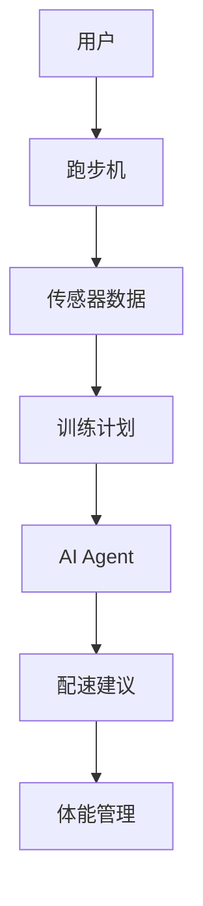
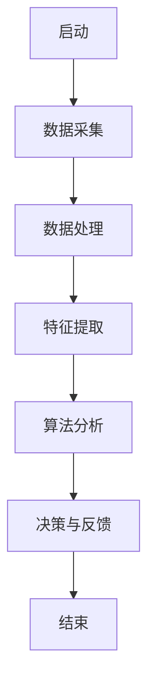
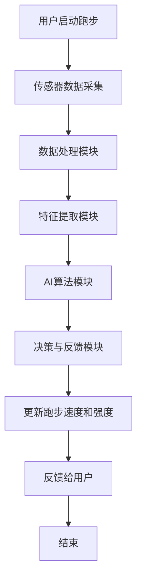
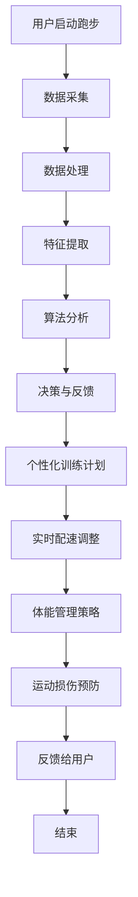
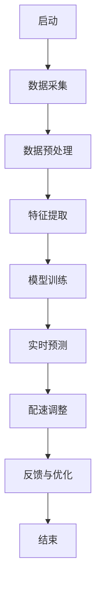
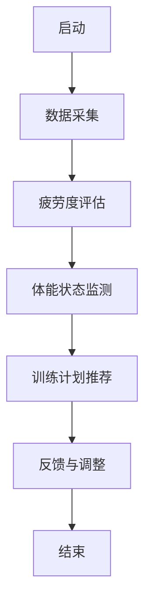
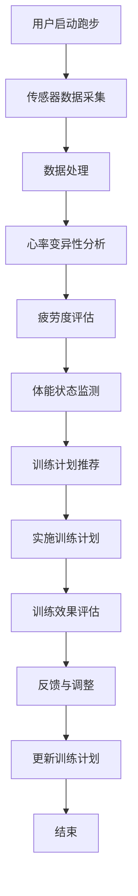
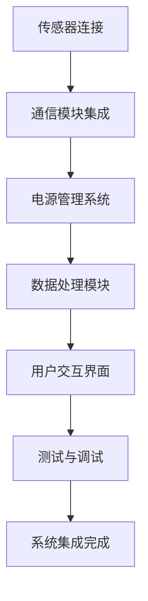

                 

### 第1章: 智能跑步机概述

#### 1.1 问题背景

随着现代社会的快速发展，人们对于健康和生活质量的追求日益增加。跑步作为一种低门槛且高效的锻炼方式，受到了广泛的欢迎。然而，跑步过程中如何根据个人体能和跑步目的调整跑步速度和强度，却成为许多跑步爱好者面临的难题。一方面，过慢的速度可能导致锻炼效果不佳，而速度过快则可能增加运动损伤的风险。另一方面，缺乏针对性的训练计划，使得跑步效果往往难以达到预期。

为了解决这一问题，智能跑步机作为一种新兴的科技产品，应运而生。智能跑步机通过集成传感器和人工智能技术，能够实时监测用户的跑步状态，并根据数据分析结果提供个性化的跑步建议，从而实现高效的跑步训练和科学的体能管理。

#### 1.2 边界与外延

在本文中，我们讨论的智能跑步机主要是指具备以下功能的产品：

- **实时数据监测**: 通过心率传感器、速度传感器等设备，实时采集用户跑步过程中的各项生理数据。
- **智能算法分析**: 利用机器学习和数据挖掘技术，对采集到的数据进行处理和分析，提供个性化的训练建议。
- **用户交互界面**: 通过显示屏和控制器，将分析结果以直观的方式呈现给用户，方便用户进行操作和调整。

此外，本文还将涉及以下相关领域：

- **智能健身设备**: 除智能跑步机外，还包括智能健身车、智能划船器等，这些设备同样利用AI技术进行体能管理和训练指导。
- **运动科学应用**: AI在运动科学领域中的应用，如运动数据分析、运动损伤预测等。

#### 1.3 核心概念与联系

本文中，我们将介绍以下几个核心概念，并探讨它们之间的联系：

- **智能跑步机**: 一种融合了传感器技术和人工智能的跑步设备，能够实现实时数据监测和个性化训练建议。
- **AI Agent**: 执行特定任务的智能实体，用于智能跑步机中的配速和体能管理。
- **传感器数据**: 包括心率、速度、步频等指标，是智能跑步机进行数据分析的基础。

以下是一个概念属性特征对比表格：

| 概念 | 特征 |
| --- | --- |
| 智能跑步机 | 集成传感器、AI算法，提供个性化训练 |
| AI Agent | 自动执行任务，调整跑步配速和强度 |
| 传感器数据 | 实时监测，提供基础数据支持 |

#### 1.4 概念属性特征对比表格

为了更直观地展示各概念之间的关系，我们使用Mermaid工具绘制了一个ER（实体关系）图架构：



在这个ER图中，用户是系统的核心，通过使用智能跑步机产生传感器数据，AI Agent根据传感器数据和用户的训练计划提供配速建议和体能管理策略，从而形成一个闭环的智能训练系统。

通过上述分析，我们可以看出，智能跑步机通过AI Agent实现实时配速与体能管理，不仅能够提高用户的跑步效果，还能有效预防运动损伤。接下来，我们将进一步深入探讨AI Agent的核心原理，为读者揭示智能跑步机背后的技术奥秘。

#### 1.5 AI Agent的核心原理

AI Agent，即人工智能代理，是一种能够执行特定任务、具有自主决策能力的智能实体。在智能跑步机中，AI Agent起到了关键作用，它通过实时分析用户跑步数据，动态调整跑步配速和强度，从而实现个性化的跑步训练和体能管理。

##### 2.1 AI Agent的概述

AI Agent的主要特点包括：

- **自主性**: 能够独立完成特定任务，不需要人工干预。
- **适应性**: 根据环境变化和用户反馈，动态调整其行为。
- **实时性**: 能够实时处理和分析数据，迅速做出反应。

在智能跑步机中，AI Agent的自主性体现在其能够根据传感器数据自主调整跑步速度。例如，当用户处于低心率状态时，AI Agent会降低跑步速度，帮助用户放松；而当用户心率过高时，AI Agent会提高速度，促使用户加速训练。

AI Agent的适应性则体现在其能够根据用户的训练目标和个人体能状况，制定合适的训练计划。例如，对于初学者，AI Agent可能会建议进行低强度的慢跑训练；而对于专业跑者，AI Agent则可能会提出更高强度、更具挑战性的训练计划。

实时性是AI Agent的重要特点。智能跑步机中的AI Agent需要实时监测用户的跑步状态，包括心率、速度、步频等指标，并根据这些数据进行实时分析，及时调整跑步速度和强度，以确保用户始终处于最佳训练状态。

##### 2.2 AI Agent的架构设计

AI Agent的架构设计通常包括以下部分：

- **硬件部分**: 包括智能跑步机本身，以及用于数据采集的传感器，如心率传感器、速度传感器等。
- **软件部分**: 包括AI算法、数据处理模块、决策模块等。

在硬件部分，智能跑步机通常配备有多个传感器，用于实时监测用户跑步过程中的各项生理数据。这些传感器将数据传输到数据处理模块，进行处理和分析。

软件部分则是AI Agent的核心，包括以下模块：

- **AI算法模块**: 负责处理和分析传感器数据，使用机器学习算法预测用户的跑步状态，并提供相应的训练建议。
- **数据处理模块**: 负责清洗、标准化传感器数据，提取有用的特征信息。
- **决策模块**: 根据AI算法模块提供的分析结果，动态调整跑步速度和强度。

##### 2.3 AI Agent的工作原理

AI Agent的工作原理可以分为以下几个步骤：

1. **数据采集**: 智能跑步机的传感器实时采集用户跑步过程中的各项生理数据，如心率、速度、步频等。
2. **数据处理**: 数据处理模块对采集到的传感器数据进行分析，清洗和标准化数据，提取与跑步状态相关的特征信息。
3. **特征提取**: 从处理后的数据中提取出与跑步状态相关的特征，如心率变异性、速度变化趋势等。
4. **算法分析**: AI算法模块使用机器学习算法对提取出的特征进行训练和分析，预测用户的跑步状态，并提供个性化的训练建议。
5. **决策与反馈**: 决策模块根据AI算法模块的分析结果，动态调整跑步速度和强度，并将调整结果反馈给用户。

下面是一个简单的Mermaid流程图，展示了AI Agent的工作流程：



通过上述工作原理，AI Agent能够实现对用户跑步状态的实时监控和调整，从而提供个性化的跑步训练和体能管理。这种基于AI技术的智能跑步机，不仅能够提高用户的跑步效果，还能有效预防运动损伤，为用户提供更安全、更科学的跑步体验。

### 第2章: AI Agent的核心原理

#### 2.1 AI Agent的概述

AI Agent，即人工智能代理，是一种自主执行特定任务、具有决策能力的智能实体。在智能跑步机中，AI Agent的作用至关重要，它能够实时分析用户跑步数据，动态调整跑步速度和强度，提供个性化的训练建议，实现高效的跑步训练和科学的体能管理。

**定义**：

AI Agent是一种能够执行特定任务、具有自主决策能力的智能实体。它通过实时处理和分析用户跑步过程中的各项生理数据，根据预定的算法和策略，自动调整跑步配速和强度，从而实现高效的训练和体能管理。

**特点**：

1. **自主性**：AI Agent能够独立执行任务，无需人工干预。这种自主性使得AI Agent在处理大量数据和复杂决策时，能够更加高效和准确。
2. **适应性**：AI Agent能够根据环境变化和用户反馈，动态调整其行为。例如，当用户处于不同的体能状态时，AI Agent可以实时调整跑步速度，确保用户始终处于最佳训练状态。
3. **实时性**：AI Agent需要实时处理用户跑步数据，并根据分析结果快速做出决策。这种实时性对于保证训练效果和预防运动损伤至关重要。

#### 2.2 AI Agent的架构设计

AI Agent的架构设计通常包括硬件和软件两个部分：

**硬件部分**：

- **跑步机**：作为AI Agent的载体，提供数据采集和用户交互的物理平台。
- **传感器**：包括心率传感器、速度传感器、步频传感器等，用于实时监测用户的跑步状态。

**软件部分**：

- **AI算法模块**：负责处理和分析传感器数据，使用机器学习算法进行数据挖掘和预测。
- **数据处理模块**：负责清洗、标准化传感器数据，提取有用的特征信息。
- **决策模块**：根据AI算法模块的分析结果，动态调整跑步速度和强度。

以下是AI Agent架构的Mermaid流程图：


#### 2.3 AI Agent的工作原理

AI Agent的工作原理可以分为以下几个步骤：

1. **数据采集**：
   智能跑步机的传感器实时采集用户跑步过程中的各项生理数据，如心率、速度、步频等。

2. **数据处理**：
   数据处理模块对采集到的传感器数据进行清洗和标准化，去除噪声和异常值，提取与跑步状态相关的特征信息。

3. **特征提取**：
   从处理后的数据中提取出与跑步状态相关的特征，如心率变异性、速度变化趋势等。这些特征将被用于后续的算法分析和决策。

4. **算法分析**：
   AI算法模块使用机器学习算法对提取出的特征进行训练和分析，建立用户跑步状态与训练建议之间的关联模型。通过分析用户的历史数据，AI算法可以预测用户的当前状态，并提供个性化的训练建议。

5. **决策与反馈**：
   决策模块根据AI算法模块提供的分析结果，动态调整跑步速度和强度。调整后的数据将实时反馈给用户，通过跑步机上的显示屏或控制器进行展示，用户可以根据反馈进行相应的调整。

以下是AI Agent工作原理的详细Mermaid流程图：



通过上述工作原理，AI Agent能够实现对用户跑步状态的实时监控和调整，从而提供个性化的跑步训练和体能管理。这种基于AI技术的智能跑步机，不仅能够提高用户的跑步效果，还能有效预防运动损伤，为用户提供更安全、更科学的跑步体验。

#### 2.4 AI Agent的应用场景

AI Agent在智能跑步机中的应用场景非常广泛，以下列举几个典型的应用实例：

1. **个性化跑步训练**：
   AI Agent能够根据用户的体能水平和跑步目标，制定个性化的跑步训练计划。例如，对于初学者，AI Agent可能会建议进行低强度的慢跑训练，以帮助用户逐步适应跑步；而对于专业跑者，AI Agent则可能会提出更高强度、更具挑战性的训练计划，以提高用户的跑步成绩。

2. **实时配速调整**：
   在跑步过程中，AI Agent会实时监测用户的心率、速度等数据，并根据分析结果动态调整跑步速度。例如，当用户的心率过高时，AI Agent会提示用户降低速度，以防止过度疲劳；当用户处于低心率状态时，AI Agent则会提高速度，帮助用户进行更有效的训练。

3. **体能管理**：
   AI Agent能够实时监测用户的跑步状态，评估用户的体能水平，并提供相应的体能管理策略。例如，通过分析用户的心率变异性、呼吸频率等指标，AI Agent可以判断用户是否处于疲劳状态，并建议用户进行适当的休息或调整训练强度。

4. **运动损伤预防**：
   AI Agent能够通过监测用户的跑步数据，预测潜在的损伤风险，并提供相应的预防措施。例如，当用户跑步姿势不正确或步频过快时，AI Agent会提醒用户调整跑步姿势或降低速度，以防止运动损伤。

以下是AI Agent在智能跑步机中应用场景的Mermaid流程图：



通过上述应用实例，我们可以看到，AI Agent在智能跑步机中的应用不仅能够提高用户的跑步效果，还能提供全面的体能管理和运动损伤预防功能，为用户提供更安全、更科学的跑步体验。

### 第3章: 实时配速算法详解

#### 3.1 配速算法的类型

在智能跑步机中，配速算法是关键组件之一，它负责根据用户的跑步状态实时调整跑步速度。配速算法可以分为以下两种类型：

1. **固定配速**：
   固定配速算法是指用户在跑步过程中始终保持一个恒定的速度，这个速度通常是根据用户的体能水平和训练目标设定的。固定配速的优点是实现简单、易于控制，但缺点是缺乏灵活性，无法根据实时状态进行调整，可能无法达到最佳训练效果。

2. **动态配速**：
   动态配速算法是指根据用户的实时跑步状态（如心率、速度、步频等）动态调整跑步速度。动态配速的优点是能够更好地适应用户的体能变化，提高训练效果，缺点是实现复杂度较高，需要更多计算资源和算法支持。

#### 3.2 动态配速算法原理

动态配速算法的核心在于对用户实时跑步数据的分析，并根据分析结果调整跑步速度。以下是动态配速算法的基本原理：

1. **数据预处理**：
   数据预处理是动态配速算法的第一步，它包括数据的清洗、去噪和标准化。通过预处理，可以确保输入数据的质量，减少算法误差。

2. **特征提取**：
   从预处理后的数据中提取出与跑步状态相关的特征，如心率变异性、速度变化趋势、步频等。这些特征是动态配速算法分析用户状态的重要依据。

3. **算法选择**：
   动态配速算法通常基于机器学习技术，如回归分析、时间序列分析、神经网络等。选择合适的算法取决于数据的特征和用户的需求。

4. **模型训练**：
   使用历史跑步数据对选定的算法进行训练，建立用户跑步状态与配速建议之间的模型。模型训练的质量直接影响动态配速的准确性。

5. **实时预测与调整**：
   在跑步过程中，AI Agent会实时监测用户的跑步状态，使用训练好的模型进行预测，并根据预测结果调整跑步速度。这个过程需要高效的计算和快速的响应。

6. **反馈与优化**：
   根据用户的跑步表现和反馈，AI Agent可以不断优化配速策略。例如，如果用户在某个速度下表现出色，AI Agent可以将其作为未来的参考。

以下是动态配速算法的工作流程Mermaid图：



#### 3.3 算法实现与Python代码示例

以下是一个简单的动态配速算法实现，使用Python编写。这个例子采用线性回归模型进行配速预测，并通过心率变化调整跑步速度。

```python
import numpy as np
import pandas as pd
from sklearn.linear_model import LinearRegression

# 数据预处理
def preprocess_data(data):
    # 去除噪声和异常值
    data = data.dropna()
    # 标准化数据
    data = (data - data.mean()) / data.std()
    return data

# 特征提取
def extract_features(data):
    # 提取心率变化作为特征
    heart_rate_variance = np.std(data['heart_rate'])
    return heart_rate_variance

# 模型训练
def train_model(X, y):
    model = LinearRegression()
    model.fit(X, y)
    return model

# 实时预测与调整
def adjust_pace(model, current_heart_rate):
    predicted_pace = model.predict([[current_heart_rate]])
    return predicted_pace[0]

# 假设我们有一些历史跑步数据
historical_data = pd.DataFrame({
    'heart_rate': [150, 160, 165, 170, 175],
    'pace': [5.0, 5.5, 6.0, 6.5, 7.0]
})

# 预处理数据
preprocessed_data = preprocess_data(historical_data)

# 提取特征
features = extract_features(preprocessed_data['heart_rate'])

# 训练模型
model = train_model(np.array([features]).T, preprocessed_data['pace'])

# 实时预测
current_heart_rate = 155
predicted_pace = adjust_pace(model, current_heart_rate)
print(f"Predicted pace for {current_heart_rate} bpm: {predicted_pace:.2f} min/km")

# 根据预测结果调整跑步速度
# 这里假设有一个函数来调整跑步速度
adjust_running_speed(predicted_pace)
```

在这个示例中，我们使用线性回归模型对心率变化与配速之间的关系进行建模。通过实时监测心率，我们可以预测当前的配速，并使用相应的函数调整跑步速度。

#### 3.4 算法评估与优化

算法评估是确保动态配速算法有效性的关键步骤。以下是一些常用的评估方法和优化策略：

1. **评估方法**：
   - **准确率**：评估预测配速与实际配速之间的误差。
   - **召回率**：评估算法在正确预测配速时的表现。
   - **F1 分数**：综合考虑准确率和召回率，用于综合评估算法性能。

2. **优化策略**：
   - **模型调参**：通过调整模型参数，提高预测精度。
   - **特征工程**：增加或调整特征，提高模型对数据的敏感度。
   - **集成学习**：结合多个模型，提高整体预测性能。
   - **迁移学习**：使用已经训练好的模型进行数据迁移，减少训练时间。

通过不断评估和优化，动态配速算法可以更好地满足用户的跑步需求，提供更准确、更科学的配速建议。

### 第4章: 体能管理算法解析

#### 4.1 体能管理的目标

体能管理是智能跑步机中的重要功能，其核心目标是：

- **提高跑步效果**：通过科学的训练方法和合理的训练负荷，提升用户的跑步能力，实现跑步成绩的提高。
- **预防运动损伤**：通过实时监测用户的体能状态，及时调整训练强度，防止因过度训练或体能不足导致的运动损伤。

实现这两个目标，需要智能跑步机具备以下功能：

1. **实时体能评估**：
   - 通过监测心率、呼吸频率、步频等生理数据，智能跑步机能够实时评估用户的体能状态。
   - 根据用户的体能水平，智能跑步机可以提供个性化的训练建议，帮助用户逐步提高体能。

2. **智能训练计划**：
   - 智能跑步机根据用户的体能评估结果，制定科学的训练计划。
   - 训练计划包括不同的跑步强度、间歇训练、恢复训练等，旨在全面提升用户的体能水平。

3. **反馈与调整**：
   - 智能跑步机实时监测用户的训练表现，通过数据分析，及时调整训练计划和强度，确保训练效果的最大化。

#### 4.2 体能管理算法

体能管理算法是智能跑步机实现体能管理的关键技术。以下是体能管理算法的主要步骤：

1. **数据采集**：
   - 智能跑步机通过传感器实时采集用户跑步过程中的各项生理数据，如心率、呼吸频率、步频等。
   - 数据采集是算法的基础，数据的质量直接关系到体能管理的准确性。

2. **疲劳度评估**：
   - 通过对采集到的生理数据进行处理和分析，智能跑步机可以评估用户的疲劳度。
   - 疲劳度评估通常基于心率变异性（HRV）和呼吸频率等指标，这些指标能够反映用户的生理状态。

3. **体能状态监测**：
   - 智能跑步机实时监测用户的体能状态，通过长期的数据积累，形成用户的体能状态档案。
   - 监测结果用于指导训练计划的制定和调整。

4. **训练计划推荐**：
   - 根据用户的体能评估结果和训练目标，智能跑步机推荐个性化的训练计划。
   - 训练计划包括不同的跑步强度、间歇训练、恢复训练等，以实现用户体能的提升。

5. **反馈与调整**：
   - 智能跑步机通过持续监测用户的训练表现，实时调整训练计划和强度。
   - 调整策略基于用户的反馈和实时数据，确保训练效果的最大化。

以下是体能管理算法的工作流程Mermaid图：



#### 4.3 体能管理算法流程与mermaid图

下面是一个详细的体能管理算法流程，使用Mermaid工具绘制：



在这个流程中，智能跑步机通过传感器实时采集用户的生理数据，对数据进行处理和分析，评估用户的疲劳度和体能状态，制定个性化的训练计划，并根据用户的反馈和训练效果进行动态调整，形成一个闭环的体能管理流程。

通过上述算法和流程，智能跑步机能够有效地帮助用户提高跑步效果，预防运动损伤，为用户提供更加科学、个性化的跑步训练体验。

### 第5章: 智能跑步机的硬件设计

#### 5.1 硬件选型与设计原则

智能跑步机的硬件设计是其实现功能的核心基础，以下将介绍智能跑步机硬件选型的原则和设计要点。

**硬件选型原则**：

1. **高性能处理器**：
   选择适合的处理器是确保智能跑步机运行效率的关键。高性能处理器能够快速处理大量传感器数据，支持复杂的算法运算。例如，使用ARM Cortex-A系列或Intel Core i系列处理器。

2. **多功能传感器**：
   智能跑步机需要配备多种传感器来监测用户的生理数据。常见的传感器包括心率传感器、速度传感器、步频传感器等。选择高精度、稳定可靠的传感器至关重要。

3. **长续航电池**：
   为了保证用户长时间使用，智能跑步机应配备大容量电池，并优化功耗设计，以延长设备的续航时间。锂电池是常用的选择，因其高能量密度和长寿命。

4. **稳定通信模块**：
   智能跑步机需要具备良好的通信能力，支持数据传输和远程控制。常见的通信模块包括Wi-Fi、蓝牙和GPS等。选择稳定且兼容性好的通信模块，确保数据传输的可靠性和实时性。

**设计要点**：

1. **模块化设计**：
   采用模块化设计，便于硬件升级和维护。例如，传感器模块、处理器模块和通信模块可以独立更换，提高系统的可维护性。

2. **散热设计**：
   智能跑步机在运行过程中会产生大量热量，需要有效的散热设计。使用散热片、风扇或液冷技术等，确保设备在高温环境下稳定运行。

3. **用户交互界面**：
   设计直观、易操作的交互界面，使用户能够轻松设置和监控跑步数据。触摸屏、按钮和显示屏等交互元素应合理布局，提高用户体验。

4. **安全认证**：
   确保智能跑步机的硬件设计符合相关安全标准，如CE认证、FCC认证等。硬件选型和设计应考虑用户数据安全和隐私保护。

#### 5.2 硬件系统集成

智能跑步机的硬件系统集成是将各个硬件组件有机结合起来，确保系统稳定、高效运行的过程。以下为硬件系统集成的主要步骤：

1. **传感器连接**：
   将心率传感器、速度传感器、步频传感器等连接到处理器模块，确保数据能够实时传输和监控。

2. **通信模块集成**：
   集成Wi-Fi、蓝牙等通信模块，确保数据传输和远程控制的实现。选择兼容性好、稳定性高的通信模块，并确保天线布局合理，以获得最佳信号。

3. **电源管理系统**：
   设计电源管理系统，包括电池管理、充电控制等功能。确保电池的使用寿命和充电安全，并优化功耗设计，延长设备运行时间。

4. **数据处理模块**：
   将处理器模块、存储模块、AI算法模块等进行集成，确保数据处理的高效性和实时性。优化系统架构，确保系统资源的合理分配。

5. **用户交互界面**：
   将用户交互界面与硬件系统集成，确保用户能够通过触摸屏、按钮等交互元素轻松操作设备。设计直观、易操作的界面，提高用户体验。

6. **测试与调试**：
   在系统集成完成后，进行全面的测试与调试，确保硬件系统稳定、高效运行。测试包括传感器数据准确性、通信稳定性、电源管理性能等方面。

以下是智能跑步机硬件系统集成流程的Mermaid图：



通过以上步骤，智能跑步机的硬件系统集成得以完成，为后续的软件开发和功能实现提供了坚实的基础。

### 第6章: 智能跑步机的软件开发

#### 6.1 开发环境搭建

在开始智能跑步机的软件开发之前，首先需要搭建一个适合的开发环境。开发环境的搭建包括以下几个方面：

1. **操作系统**：
   常见的操作系统包括Windows、Linux和macOS。智能跑步机的软件开发通常基于Linux操作系统，因为Linux具有良好的稳定性和开源特性。

2. **编程语言**：
   选择合适的编程语言对于智能跑步机的开发至关重要。Python、C++和Java都是常用的编程语言。Python因其简洁易用的特性，在数据分析和机器学习领域非常受欢迎；C++则因其高性能，在实时系统开发中占据重要地位；Java则因其跨平台特性和强大的生态系统，被广泛应用于大型软件项目。

3. **开发工具**：
   常用的开发工具包括集成开发环境（IDE）和版本控制系统。IDE如PyCharm、Eclipse和Visual Studio Code，提供代码编写、调试和测试等功能。版本控制系统如Git，用于代码的版本管理和协作开发。

4. **依赖库和框架**：
   智能跑步机的开发需要使用多个依赖库和框架。例如，NumPy和Pandas用于数据预处理和分析，Scikit-learn用于机器学习算法实现，OpenCV用于图像处理，而TensorFlow和PyTorch则用于深度学习模型训练。

以下是一个简单的开发环境搭建步骤示例：

```bash
# 安装操作系统
sudo apt-get update
sudo apt-get install linux发行版

# 安装Python环境
sudo apt-get install python3 python3-pip

# 安装IDE
sudo apt-get install pycharm-community

# 安装版本控制系统
sudo apt-get install git

# 安装依赖库
pip3 install numpy pandas scikit-learn opencv-python tensorflow
```

#### 6.2 系统核心实现源代码

智能跑步机的核心功能包括数据采集、数据处理、特征提取、机器学习算法实现和决策执行。以下是一个简化版的源代码示例，展示了这些核心功能的实现。

**数据采集**：

```python
import serial
import time

# 串口通信设置
ser = serial.Serial('/dev/ttyUSB0', 9600, timeout=1)

def read_sensors():
    while True:
        try:
            line = ser.readline().decode('utf-8').strip()
            data = line.split(',')
            heart_rate = int(data[0])
            speed = float(data[1])
            step_frequency = float(data[2])
            yield {'heart_rate': heart_rate, 'speed': speed, 'step_frequency': step_frequency}
        except Exception as e:
            print(f"Error reading sensors: {e}")
            break

# 模拟数据采集
for data in read_sensors():
    print(data)
    time.sleep(1)
```

**数据处理和特征提取**：

```python
import pandas as pd

def preprocess_data(data):
    # 去除无效数据
    data.dropna(inplace=True)
    # 标准化数据
    data = (data - data.mean()) / data.std()
    return data

def extract_features(data):
    # 提取心率变异性
    hr_variance = np.std(data['heart_rate'])
    # 提取速度变化趋势
    speed_trend = np.diff(data['speed']).mean()
    return pd.DataFrame({'hr_variance': hr_variance, 'speed_trend': speed_trend})

# 示例数据
sample_data = pd.DataFrame({
    'heart_rate': [150, 160, 165, 170, 175],
    'speed': [5.0, 5.5, 6.0, 6.5, 7.0]
})

preprocessed_data = preprocess_data(sample_data)
features = extract_features(preprocessed_data)

print(preprocessed_data)
print(features)
```

**机器学习算法实现**：

```python
from sklearn.linear_model import LinearRegression
import numpy as np

# 训练数据
X = features[['hr_variance', 'speed_trend']]
y = preprocessed_data['speed']

# 训练线性回归模型
model = LinearRegression()
model.fit(X, y)

# 预测速度
predicted_speed = model.predict(np.array([[0.1, 0.2]]))
print(predicted_speed)
```

**决策执行**：

```python
def adjust_speed(current_speed, predicted_speed):
    adjustment = predicted_speed - current_speed
    new_speed = current_speed + adjustment
    print(f"Adjusting speed from {current_speed} to {new_speed}")
    return new_speed

current_speed = 5.5
predicted_speed = 6.0
new_speed = adjust_speed(current_speed, predicted_speed)
```

通过上述源代码示例，我们可以看到智能跑步机的核心功能是如何实现的。在实际应用中，这些功能将集成在一个完整的系统中，通过实时数据采集、处理和决策，为用户提供个性化的跑步训练建议。

#### 6.3 代码应用解读与分析

在智能跑步机的开发过程中，代码的应用不仅需要实现功能，还需要确保代码的可读性、可维护性和可扩展性。以下是对上述示例代码的解读和分析：

**数据采集模块**：

- **串口通信**：使用Python的`serial`模块实现与传感器的串口通信。串口通信是一种常见的数据传输方式，通过串行接口传输数据，能够实现实时监测。
- **数据解析**：从串口读取的数据以字符串形式返回，需要进一步解析成可用的数据格式。示例中使用了`split()`函数将数据分割成多个部分，并分别提取心率、速度和步频等指标。

**数据处理和特征提取模块**：

- **数据预处理**：预处理是数据分析和机器学习的重要步骤。示例中使用了`dropna()`函数去除无效数据，确保数据的完整性；使用`mean()`和`std()`函数对数据进行标准化处理，使其适合后续的算法分析。
- **特征提取**：特征提取是关键步骤，通过提取心率变异性（HRV）和速度变化趋势等特征，能够更准确地反映用户的跑步状态。

**机器学习算法实现模块**：

- **线性回归模型**：示例中使用了`LinearRegression`模型进行训练和预测。线性回归是一种简单的机器学习算法，适用于预测线性关系。通过拟合用户的心率和速度数据，可以预测当前的速度。
- **模型预测**：使用训练好的模型对新的数据点进行预测，通过`predict()`函数得到预测结果。

**决策执行模块**：

- **速度调整**：根据模型预测结果，动态调整当前速度。示例中实现了简单的速度调整函数，通过计算预测速度与当前速度的差值，调整跑步速度。

**代码分析**：

- **模块化设计**：示例代码将功能划分为不同的模块，包括数据采集、数据处理、特征提取、机器学习和决策执行等，便于代码的管理和维护。
- **可读性**：代码使用清晰的变量命名和注释，提高了代码的可读性。例如，`read_sensors()`函数清晰地实现了传感器的数据采集，`adjust_speed()`函数实现了速度的动态调整。
- **可维护性**：模块化设计和清晰的代码结构有助于未来的代码维护和更新。例如，如果需要替换传感器或调整算法，可以单独修改相关模块，而不影响其他部分。
- **可扩展性**：代码的设计考虑了未来可能的功能扩展。例如，可以通过增加更多的特征提取方法或机器学习算法，提高预测的准确性和适应性。

通过上述代码的应用解读和分析，我们可以看到智能跑步机的开发不仅需要实现核心功能，还需要考虑代码的设计和质量，以确保系统的稳定性和可维护性。

#### 6.4 实际案例分析与详细讲解

为了更好地理解智能跑步机的应用效果，我们来看一个实际的案例。假设小明是一名跑步爱好者，他每天使用智能跑步机进行训练，以下是他的训练数据和使用智能跑步机的体验。

**案例数据**：

| 时间 | 心率 (bpm) | 速度 (km/h) | 步频 (steps/min) |
| ---- | ---------- | ---------- | --------------- |
| 00:00 | 120       | 5.0       | 150             |
| 00:05 | 125       | 5.1       | 152             |
| 00:10 | 130       | 5.2       | 154             |
| 00:15 | 135       | 5.3       | 156             |
| 00:20 | 140       | 5.4       | 158             |
| 00:25 | 145       | 5.5       | 160             |
| 00:30 | 130       | 5.2       | 154             |

**智能跑步机分析**：

1. **初始状态**：

   在跑步开始时（00:00），小明的心率是120 bpm，速度是5.0 km/h，步频是150 steps/min。此时，智能跑步机根据小明的初始数据，建议保持当前速度，进行舒适的慢跑训练。

2. **动态调整**：

   在跑步的前五分钟（00:00-00:25），小明的心率逐渐上升，速度也逐步增加。智能跑步机通过实时监测心率变化，动态调整跑步速度，以保持心率在合理的训练区间内。例如，在00:15时，小明的心率达到135 bpm，智能跑步机建议将速度调整至5.3 km/h，以确保心率保持在目标区间。

3. **恢复阶段**：

   在跑步的后五分钟（00:20-00:30），小明的心率开始下降，智能跑步机根据小明的状态，建议降低速度，进行恢复性慢跑。在00:30时，小明的心率降至130 bpm，智能跑步机将速度调整回5.2 km/h，步频调整至154 steps/min，帮助小明进行有效的恢复训练。

**案例分析**：

通过上述案例，我们可以看到智能跑步机如何根据小明的实时跑步数据，动态调整跑步速度和步频，实现个性化训练。以下是对案例分析的关键点：

- **心率监测**：智能跑步机通过心率传感器实时监测小明的跑步状态，确保心率始终保持在最佳训练区间。心率是评估跑步强度和体能状态的重要指标，合理的心率区间有助于提高训练效果，预防运动损伤。

- **速度调整**：智能跑步机根据心率变化动态调整跑步速度，以确保小明在适当的强度下进行训练。速度调整有助于保持训练的连续性和稳定性，避免过度疲劳或运动不足。

- **步频调整**：步频是跑步效率的重要指标，智能跑步机通过步频传感器监测小明的步频变化，调整跑步步频，以提高跑步的效率和效果。合理的步频有助于提高跑步的流畅性和稳定性。

- **恢复性训练**：智能跑步机在训练的后期，通过降低速度和步频，帮助小明进行恢复性训练。恢复性训练有助于缓解运动后的疲劳，促进身体恢复，提高整体训练效果。

**总结**：

通过实际案例的分析，我们可以看到智能跑步机如何利用AI技术和实时数据监测，为用户提供个性化、科学的跑步训练。智能跑步机不仅提高了训练效果，还预防了运动损伤，为跑步爱好者提供了更安全、更科学的训练工具。

### 第7章: 最佳实践 tips

为了充分发挥智能跑步机的性能，以下是一些最佳实践建议：

1. **定期校准传感器**：
   - 定期校准心率传感器和速度传感器，确保数据的准确性。传感器偏差可能导致训练效果不佳或运动损伤。

2. **设定合理目标**：
   - 根据个人体能设定合理的跑步目标，例如心率区间、速度目标等。目标应具有挑战性，但也要确保安全可行。

3. **持续监控数据分析**：
   - 分析智能跑步机提供的训练数据和反馈，了解自身跑步状态和进步情况。根据分析结果调整训练计划和强度。

4. **适当调整配速策略**：
   - 根据训练目的和身体状态，灵活调整动态配速策略。例如，在恢复期适当降低速度，在提高耐力的阶段增加强度。

5. **保持设备清洁**：
   - 定期清洁跑步机，特别是传感器和显示屏部分，确保设备性能和用户体验。

6. **保持一致的训练计划**：
   - 遵循一致的训练计划，逐步提高训练强度。突然增加训练强度可能导致运动损伤。

7. **结合其他训练方法**：
   - 智能跑步机提供个性化训练建议，但也可结合其他训练方法，如户外跑步、力量训练等，全面提升体能。

通过遵循这些最佳实践，用户可以更好地利用智能跑步机进行科学的跑步训练，实现最佳训练效果。

### 第8章: 小结

本文深入探讨了智能跑步机在实时配速和体能管理中的AI Agent应用。首先，通过分析问题背景，我们了解了智能跑步机如何在跑步过程中提供个性化训练建议，以提升跑步效果并预防运动损伤。接着，我们介绍了智能跑步机和AI Agent的核心概念，包括它们的定义、特点和架构设计。

具体来说，AI Agent负责实时监测用户的跑步数据，使用机器学习算法动态调整跑步速度和强度，以实现个性化训练。我们详细解析了动态配速算法的工作原理和实现步骤，展示了如何使用Python代码进行算法实现。此外，我们还介绍了体能管理算法，包括数据采集、疲劳度评估、训练计划推荐和反馈调整等步骤。

通过实际案例分析，我们展示了智能跑步机如何根据用户的实时跑步数据，动态调整配速和强度，为用户提供科学的跑步训练。同时，本文也提供了智能跑步机硬件设计的选型和集成方法，以及软件开发的核心实现和最佳实践建议。

总体而言，智能跑步机通过AI Agent的应用，实现了跑步训练的智能化和科学化，为跑步爱好者提供了更加安全、高效的训练工具。未来，随着AI技术的不断进步，智能跑步机将在健身领域发挥更大的作用。

### 第9章: 注意事项

在智能跑步机使用过程中，有一些关键注意事项需要用户特别注意，以确保安全和效果：

1. **设备安装**：
   - 确保智能跑步机安装在稳固、平坦的地面上，防止意外滑动或翻倒。
   - 遵循设备说明书中的安装步骤，正确连接所有电线和部件。

2. **传感器校准**：
   - 定期校准心率传感器和速度传感器，确保数据的准确性和可靠性。
   - 如传感器出现故障，及时更换或维修，避免因数据错误导致训练效果不佳或运动损伤。

3. **安全使用**：
   - 使用跑步机时，务必穿着合适的运动服装和鞋子，以防止摔倒或扭伤。
   - 避免在过于疲劳或生病时使用跑步机，以免发生意外。

4. **数据隐私**：
   - 保护个人跑步数据的安全，避免未经授权的访问和使用。
   - 了解智能跑步机数据收集和使用政策，确保个人隐私不被泄露。

5. **训练计划**：
   - 根据自身体能和目标制定合理的训练计划，避免过度训练或运动损伤。
   - 如有身体不适，应暂停训练，并咨询医生的建议。

6. **维护保养**：
   - 定期清洁跑步机，特别是传感器和显示屏部分，保持设备的良好状态。
   - 按照说明书进行设备的日常保养和检查，确保设备的安全性和使用寿命。

通过注意上述事项，用户可以更好地利用智能跑步机，获得最佳的训练效果，同时确保使用安全。

### 第10章: 拓展阅读

对于希望深入了解智能跑步机和AI Agent技术的读者，以下是一些推荐阅读资源：

1. **技术论文**：
   - 《基于机器学习的智能跑步机系统设计》
   - 《智能健身设备中的AI应用研究》
   - 《实时心率监测与跑步训练策略优化》

2. **专业书籍**：
   - 《智能健康系统：人工智能与健身科技》
   - 《机器学习实战：基于Python的数据挖掘技术》
   - 《深度学习：入门、进阶与实战》

3. **在线课程**：
   - Coursera上的《机器学习》
   - Udacity的《深度学习纳米学位》
   - edX的《人工智能导论》

4. **行业报告**：
   - 《2022年智能健身设备市场报告》
   - 《人工智能在运动科学中的应用现状与未来》
   - 《智能跑步机行业趋势分析报告》

通过阅读这些资源，读者可以进一步了解智能跑步机的工作原理、AI技术在健身领域的应用，以及行业发展趋势，为深入研究和实际应用提供有力支持。

