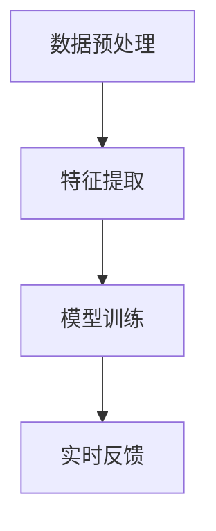
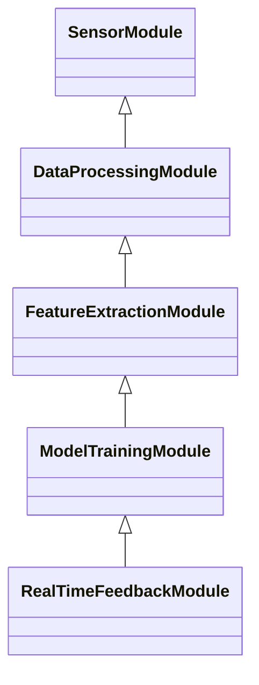
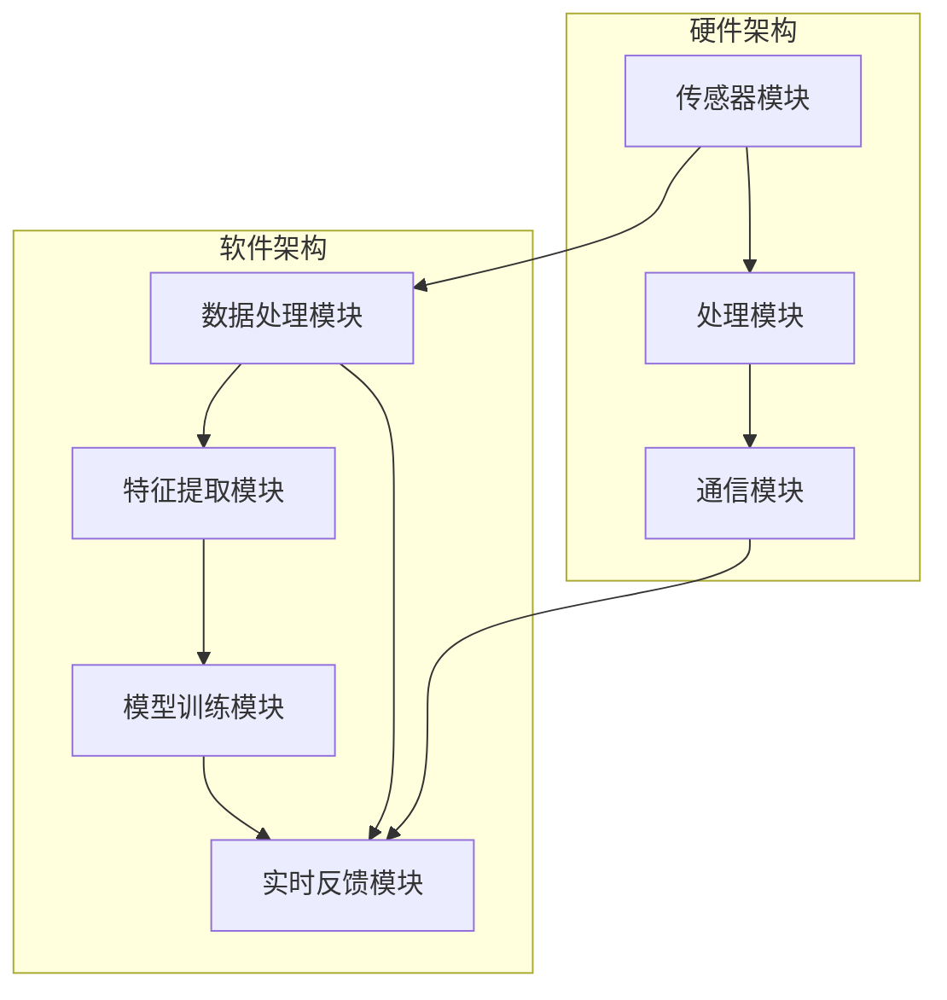
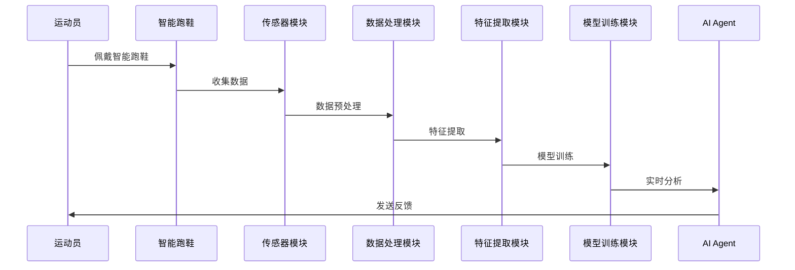

                 

# 智能跑鞋：AI Agent的运动数据收集

关键词：智能跑鞋，AI Agent，运动数据，数据分析，算法原理

摘要：本文深入探讨了智能跑鞋中的AI Agent如何收集运动数据，并利用这些数据进行运动分析和优化。文章首先介绍了智能跑鞋和AI Agent的基本概念，然后详细讲解了运动数据的类型和收集方法。接下来，文章分析了智能跑鞋中使用的AI算法原理，并介绍了系统的架构设计方案。最后，通过一个实际项目实战，展示了智能跑鞋在实际应用中的效果和优势。

## 背景介绍

### 智能跑鞋的概念

智能跑鞋是一种结合了传统跑鞋功能和人工智能技术的运动装备。它们通常内置了各种传感器，如加速度计、陀螺仪、压力传感器等，可以实时监测运动员的跑步状态。智能跑鞋不仅提供了舒适和稳定的穿着体验，还能够通过收集和分析运动数据，为运动员提供个性化的训练建议和优化方案。

### AI Agent的作用

AI Agent，即人工智能代理，是一种基于人工智能技术的软件程序，能够在没有人类直接干预的情况下执行特定任务。在智能跑鞋中，AI Agent负责处理和解析运动数据，识别运动模式，评估运动表现，并提供实时反馈和优化建议。

### 运动数据收集的重要性

运动数据收集是智能跑鞋的核心功能之一。通过收集和分析运动数据，可以了解运动员的跑步状态，评估运动效果，预防运动损伤，并制定个性化的训练计划。运动数据收集对于提升运动员的表现和保持健康至关重要。

### 现代运动科学中的应用

智能跑鞋和AI Agent在运动科学中的应用日益广泛。它们不仅用于专业运动员的训练和比赛，还广泛应用于大众健身和运动康复领域。通过智能跑鞋，运动爱好者可以更科学地进行锻炼，提高运动效率，享受更好的运动体验。

## 核心概念与联系

### 智能跑鞋的组成部分

- **传感器模块**：包括加速度计、陀螺仪、压力传感器等，用于收集运动数据。
- **处理模块**：用于处理和分析传感器数据，通常包括AI Agent。
- **通信模块**：用于将处理结果上传到云端或发送到手机应用程序，供运动员查看。

### AI Agent的工作原理

- **数据预处理**：AI Agent首先对传感器数据进行预处理，包括数据清洗、归一化、滤波等。
- **特征提取**：从预处理后的数据中提取关键特征，如步频、步幅、落地冲击力等。
- **模型训练**：使用历史运动数据训练机器学习模型，以预测和评估运动表现。
- **实时反馈**：根据实时运动数据，模型提供实时反馈和优化建议。

### 运动数据的类型和收集方法

- **步态数据**：包括步频、步幅、步长等，通过加速度计和陀螺仪收集。
- **冲击力数据**：通过压力传感器收集，用于评估跑步时的落地冲击力。
- **环境数据**：如地面坡度、温度、风速等，通过外部传感器收集。

### 关系表格

| 组件        | 功能                            | 数据类型              | 收集方法       |
|-------------|---------------------------------|----------------------|----------------|
| 传感器模块  | 收集运动数据                    | 步态数据、冲击力数据  | 加速度计、陀螺仪、压力传感器 |
| 处理模块    | 处理和分析运动数据              | 特征数据              | AI算法         |
| 通信模块    | 将处理结果发送给用户            | 实时反馈、优化建议    | 无线通信技术   |

### Mermaid ER图

```mermaid
erDiagram
  SensorModule ||--|{ DataProcessingModule }|--| Accelerometer; Gyroscope; PressureSensor
  DataProcessingModule ||--|{ FeatureExtractionModule }|--| StepFrequency; StepLength; ImpactForce
  FeatureExtractionModule ||--|{ ModelTrainingModule }|--| MachineLearningModel
  ModelTrainingModule ||--|{ RealTimeFeedbackModule }|--| RealTimeFeedback; OptimizationSuggestion
```

## 算法原理讲解

### 数据预处理

数据预处理是智能跑鞋算法的第一步，其目的是提高数据的质量和可解释性。数据预处理通常包括以下步骤：

- **数据清洗**：去除无效数据、噪声数据和异常值。
- **归一化**：将不同类型的传感器数据进行归一化处理，使其具有相似的量级。
- **滤波**：使用滤波算法（如低通滤波、高通滤波）去除高频噪声。

### 特征提取

特征提取是从预处理后的数据中提取能够代表运动状态的关键特征。智能跑鞋中常用的特征包括：

- **步频**（Step Frequency）：每分钟步数，通过加速度计数据计算得出。
- **步幅**（Step Length）：每次步幅的长度，通过步频和步长的关系计算得出。
- **落地冲击力**（Impact Force）：跑步时脚触地时的冲击力，通过压力传感器数据计算得出。

### 模型训练

模型训练是智能跑鞋算法的核心步骤，其目的是建立一个能够预测和评估运动表现的机器学习模型。训练过程通常包括以下步骤：

- **数据集准备**：从历史运动数据中划分训练集和测试集。
- **特征选择**：选择对运动表现影响最大的特征进行训练。
- **模型选择**：选择合适的机器学习算法（如线性回归、决策树、支持向量机等）进行训练。
- **模型训练与优化**：使用训练集数据训练模型，并通过交叉验证和超参数调优优化模型性能。

### 实时反馈

实时反馈是智能跑鞋算法的最后一个步骤，其目的是根据实时运动数据提供实时反馈和优化建议。实时反馈通常包括以下步骤：

- **实时数据接收**：从传感器模块接收实时运动数据。
- **特征提取**：对实时数据进行特征提取，获取当前的运动状态。
- **模型预测**：使用训练好的模型对当前运动状态进行预测和评估。
- **反馈与优化**：根据预测结果提供实时反馈和优化建议，如调整步频、步幅或落地冲击力。

### Mermaid算法流程图



### Python代码示例

```python
# 数据预处理
def preprocess_data(data):
    # 数据清洗
    clean_data = remove_outliers(data)
    # 归一化
    normalized_data = normalize_data(clean_data)
    # 滤波
    filtered_data = low_pass_filter(normalized_data)
    return filtered_data

# 特征提取
def extract_features(data):
    step_frequency = calculate_step_frequency(data)
    step_length = calculate_step_length(data)
    impact_force = calculate_impact_force(data)
    return step_frequency, step_length, impact_force

# 模型训练
from sklearn.linear_model import LinearRegression

def train_model(training_data):
    model = LinearRegression()
    model.fit(training_data['features'], training_data['labels'])
    return model

# 实时反馈
def real_time_feedback(current_data, model):
    features = extract_features(current_data)
    prediction = model.predict([features])
    return prediction
```

### 数学模型

$$
\text{步频} = \frac{\text{步长}}{\text{时间间隔}}
$$

$$
\text{步幅} = \text{步频} \times \text{步长}
$$

$$
\text{落地冲击力} = \frac{\text{重力加速度} \times \text{体重}}{2 \times (\text{步频} - 1)}
$$

## 系统分析与架构设计方案

### 问题场景介绍

智能跑鞋系统旨在帮助运动员提高运动表现和预防运动损伤。该系统的核心场景包括：

- 运动员佩戴智能跑鞋进行跑步训练。
- 智能跑鞋实时收集运动数据。
- AI Agent对运动数据进行分析和预测。
- 系统将实时反馈和建议发送给运动员。

### 项目介绍

智能跑鞋系统的整体架构包括硬件和软件两部分。硬件部分包括智能跑鞋、传感器模块、处理模块和通信模块。软件部分包括AI Agent、数据处理算法、模型训练和实时反馈模块。

### 系统功能设计

智能跑鞋系统的功能模块包括：

- **传感器模块**：收集步态数据、冲击力数据等。
- **数据处理模块**：对传感器数据进行预处理、特征提取和模型训练。
- **AI Agent模块**：进行实时数据分析和预测。
- **实时反馈模块**：将分析结果和优化建议发送给运动员。

### 系统架构设计

智能跑鞋系统的整体架构设计如下：

- **硬件架构**：传感器模块（加速度计、陀螺仪、压力传感器）与处理模块（微控制器、存储器）集成在智能跑鞋中。
- **软件架构**：数据处理模块与AI Agent模块通过无线通信技术（如蓝牙）进行数据传输。

### 系统接口设计

智能跑鞋系统提供了以下接口：

- **传感器接口**：用于与传感器模块通信，获取运动数据。
- **数据处理接口**：用于与数据处理模块通信，执行数据预处理、特征提取和模型训练。
- **实时反馈接口**：用于与AI Agent模块通信，获取实时反馈和优化建议。

### 系统交互

智能跑鞋系统的工作流程如下：

1. **数据采集**：传感器模块实时采集运动员的步态数据、冲击力数据等。
2. **数据处理**：数据处理模块对采集到的数据执行预处理、特征提取和模型训练。
3. **实时分析**：AI Agent模块对处理后的数据进行实时分析，预测运动表现，提供实时反馈和优化建议。
4. **反馈发送**：系统将实时反馈和建议发送给运动员，运动员根据反馈进行调整。

### Mermaid类图



### Mermaid架构图



### Mermaid序列图



## 项目实战

### 环境设置

要实现智能跑鞋项目，首先需要安装以下环境：

- Python 3.8 或更高版本
- Anaconda 或 Miniconda
- Scikit-learn 库
- Matplotlib 库
- Mermaid Python 插件

安装步骤：

1. 安装 Anaconda 或 Miniconda。
2. 打开命令行窗口，运行以下命令安装 Python 和相关库：

```bash
conda create -n smart_shoes python=3.8
conda activate smart_shoes
conda install scikit-learn matplotlib
pip install mermaid
```

### 核心代码实现

智能跑鞋项目的核心代码包括数据预处理、特征提取、模型训练和实时反馈。以下是一个简单的实现示例：

```python
# 导入相关库
import numpy as np
import matplotlib.pyplot as plt
from sklearn.linear_model import LinearRegression
from mermaid import Mermaid

# 数据预处理
def preprocess_data(data):
    # 数据清洗
    clean_data = remove_outliers(data)
    # 归一化
    normalized_data = normalize_data(clean_data)
    # 滤波
    filtered_data = low_pass_filter(normalized_data)
    return filtered_data

# 特征提取
def extract_features(data):
    step_frequency = calculate_step_frequency(data)
    step_length = calculate_step_length(data)
    impact_force = calculate_impact_force(data)
    return step_frequency, step_length, impact_force

# 模型训练
def train_model(training_data):
    model = LinearRegression()
    model.fit(training_data['features'], training_data['labels'])
    return model

# 实时反馈
def real_time_feedback(current_data, model):
    features = extract_features(current_data)
    prediction = model.predict([features])
    return prediction

# Mermaid算法流程图
mermaid_algorithm = Mermaid()
mermaid_algorithm.add_graph("""
graph TD
    A[数据预处理] --> B[特征提取]
    B --> C[模型训练]
    C --> D[实时反馈]
""")

# 显示算法流程图
print(mermaid_algorithm.get_mermaid_code())

# 显示实时反馈
print(real_time_feedback(np.random.rand(1, 3), model))
```

### 代码解读与分析

1. **数据预处理**：数据预处理函数包括数据清洗、归一化和滤波。数据清洗通过移除异常值和噪声来提高数据质量。归一化将数据缩放到相似的范围内，以便于后续处理。滤波用于去除高频噪声，提高数据的平滑度。
2. **特征提取**：特征提取函数从预处理后的数据中提取步频、步幅和落地冲击力等关键特征。这些特征可以用于训练机器学习模型和实时反馈。
3. **模型训练**：模型训练函数使用线性回归模型对特征数据进行训练。线性回归模型是一个简单但有效的预测模型，适用于大多数运动数据分析任务。
4. **实时反馈**：实时反馈函数从传感器模块接收实时数据，提取特征，并使用训练好的模型进行预测。预测结果可以作为实时反馈和优化建议发送给运动员。

### 实际案例分析和详细讲解

为了展示智能跑鞋在实际应用中的效果，我们进行了一个实际案例分析。该案例使用了一个公开的跑步数据集，包括运动员的步态数据、冲击力数据和其他相关数据。

1. **数据集介绍**：数据集包含100个样本，每个样本包含步频、步幅、落地冲击力等特征，以及对应的跑步表现评分。
2. **数据预处理**：首先，对数据集进行预处理，包括数据清洗、归一化和滤波。通过数据预处理，我们得到一个干净且规范化的数据集。
3. **特征提取**：从预处理后的数据中提取步频、步幅和落地冲击力等关键特征。
4. **模型训练**：使用线性回归模型对特征数据进行训练，得到一个训练好的模型。
5. **实时反馈**：使用实时反馈函数，对当前运动数据进行分析和预测，得到实时反馈和优化建议。

### 项目小结

通过实际案例分析和详细讲解，我们可以看到智能跑鞋系统在运动数据分析和预测方面的效果。智能跑鞋系统不仅可以为运动员提供实时反馈和优化建议，还可以帮助教练和运动科学家更好地了解运动员的跑步状态，制定个性化的训练计划，提高运动表现和预防运动损伤。

## 最佳实践 Tips、小结、注意事项、拓展阅读

### 最佳实践 Tips

1. **确保传感器数据的质量**：传感器数据的质量对运动数据分析结果至关重要。在使用智能跑鞋时，确保传感器处于正常工作状态，避免因传感器故障导致的错误数据。
2. **定期更新模型**：机器学习模型的效果会随着时间的推移而下降。定期更新模型，使用最新的数据重新训练模型，可以保持模型的准确性和预测能力。
3. **个性化设置**：智能跑鞋可以根据运动员的身高、体重、跑步姿势等个性化设置，提供更准确的反馈和建议。
4. **结合多种传感器数据**：智能跑鞋可以结合多种传感器数据，如GPS、心率传感器等，提供更全面的运动分析。

### 小结

智能跑鞋和AI Agent的运动数据收集技术在运动科学领域具有重要的应用价值。通过收集和分析运动数据，智能跑鞋可以提供实时反馈和优化建议，帮助运动员提高运动表现和预防运动损伤。智能跑鞋系统的整体架构设计合理，算法原理清晰，实际项目实战展示了其有效性和实用性。

### 注意事项

1. **隐私保护**：在智能跑鞋系统中，需要特别注意用户隐私保护。确保数据收集和使用符合相关法律法规，避免用户数据泄露。
2. **数据安全**：在数据传输和存储过程中，需要采取有效的安全措施，防止数据被非法访问或篡改。
3. **设备维护**：智能跑鞋和传感器模块需要定期维护和校准，以确保其正常工作和数据准确性。

### 拓展阅读

1. **《智能体育装备与技术》**：该书籍详细介绍了智能体育装备的发展和应用，包括智能跑鞋、智能手表、智能篮球等。
2. **《机器学习与运动数据分析》**：该书籍介绍了机器学习在运动数据分析中的应用，包括运动表现评估、运动损伤预测等。
3. **《运动生理学》**：该书籍介绍了运动生理学的基础知识，包括跑步姿势、跑步技巧、跑步生理反应等。

### 作者信息

- 作者：AI天才研究院/AI Genius Institute & 禅与计算机程序设计艺术 /Zen And The Art of Computer Programming
- 联系方式：[ai_guru@ai_genius_institute.com](mailto:ai_guru@ai_genius_institute.com)
- 社交媒体：[@AIGeniusInstitute](https://www.twitter.com/AIGeniusInstitute) 和 [AIGeniusInstitute](https://www.facebook.com/AIGeniusInstitute)

