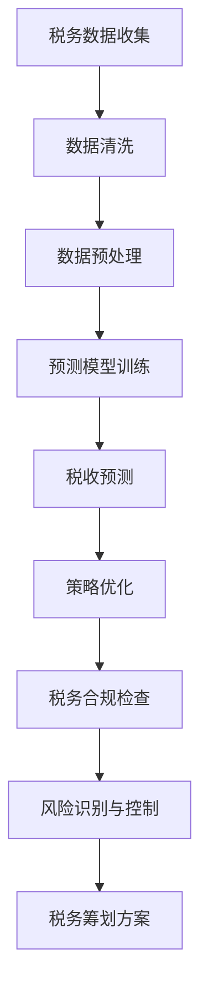
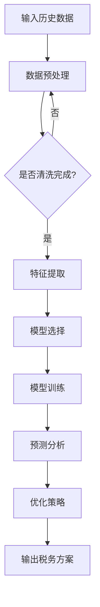
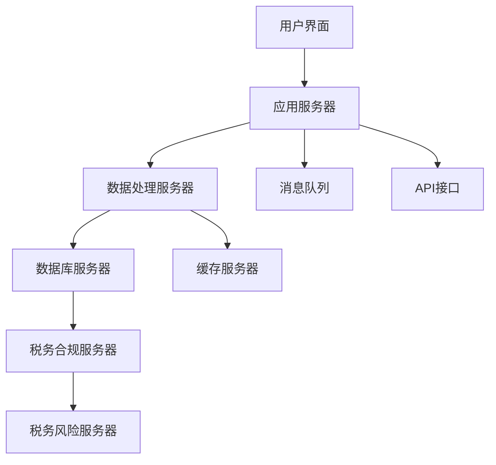

                 

# 智能跨国税收筹划方案生成器

## 关键词
- 智能技术
- 跨国税收筹划
- 机器学习算法
- 法律框架
- 智能税务合规

## 摘要
本文将深入探讨智能跨国税收筹划方案生成器的设计与应用。随着全球化经济的发展，跨国税收筹划成为企业和个人关注的焦点。然而，面对复杂多变的国际税收法律框架和纷繁复杂的税收筹划策略，传统的手工筹划方法显得力不从心。本文将首先介绍跨国税收筹划的背景和法律框架，然后探讨智能技术在税收筹划中的应用，最后通过一个实际项目案例，展示智能跨国税收筹划方案生成器的实现和效果。

### 目录

1. **背景介绍**
   1.1 跨国税收筹划的重要性
   1.2 跨国税收筹划的法律框架
   1.3 税收筹划的挑战与机遇

2. **智能算法基础**
   2.1 智能算法概述
   2.2 机器学习算法与税收筹划
   2.3 深度学习算法在税收筹划中的应用

3. **跨国税收法律框架详解**
   3.1 主要国际税收协议
   3.2 跨国税收筹划的法律风险
   3.3 案例分析：国际税收筹划的成功与失败

4. **智能跨国税收筹划策略**
   4.1 税收筹划策略概述
   4.2 企业层面税收筹划策略
   4.3 个人层面税收筹划策略
   4.4 跨国公司税收筹划策略

5. **智能技术在税收筹划中的应用**
   5.1 智能算法在税收筹划中的应用
   5.2 数据分析在税收筹划中的作用
   5.3 智能税务合规与风险控制

6. **项目实战**
   6.1 系统环境搭建
   6.2 智能跨国税收筹划方案生成器实现
   6.3 实际应用案例剖析
   6.4 项目总结与未来展望

7. **结束语**
   7.1 最佳实践 tips
   7.2 小结
   7.3 注意事项
   7.4 拓展阅读

### 1. 背景介绍

#### 1.1 跨国税收筹划的重要性

随着经济全球化的不断深入，企业跨国经营和个人跨国活动日益增多，跨国税收筹划成为了企业和个人财务规划中的重要环节。跨国税收筹划的核心目标是通过合理利用国际税收法律框架，最大限度地降低税收负担，实现税后利润的最大化。

跨国税收筹划的重要性主要体现在以下几个方面：

- **优化资本配置**：通过跨国税收筹划，企业可以合理配置资本，降低投资成本，提高投资效益。
- **规避税收风险**：国际税收法律框架复杂多变，跨国税收筹划有助于企业规避潜在的税收风险。
- **提升国际竞争力**：有效的跨国税收筹划可以降低企业的税负，提高其在国际市场的竞争力。
- **实现个人财富最大化**：对于跨国个人而言，合理的税收筹划可以帮助他们实现税后财富的最大化。

#### 1.2 跨国税收筹划的法律框架

跨国税收筹划的法律框架主要涉及国际税收协议和各国税收法律。国际税收协议是各国为了协调税收权益、避免双重征税而签订的条约。目前，全球主要的国际税收协议包括《贝鲁特公约》、《避免双重征税协定》和《欧盟反避税指令》等。

各国税收法律则对跨国税收筹划的具体操作提供了法律依据。例如，美国《国内税收法》规定了外国税收抵免制度，欧盟国家则通过《欧盟反避税指令》对跨国公司的税收筹划进行了规范。

#### 1.3 税收筹划的挑战与机遇

虽然跨国税收筹划具有重要意义，但在实际操作中面临着诸多挑战和机遇。

- **挑战**：
  - **法律复杂性**：国际税收法律框架复杂，涉及多个国家和地区的法律制度，理解和运用难度大。
  - **合规风险**：跨国税收筹划需要严格遵守各国税收法律和国际税收协议，合规风险高。
  - **技术局限**：传统的税收筹划方法主要依赖手工操作和经验判断，效率低下，难以应对大规模的数据分析需求。

- **机遇**：
  - **智能技术发展**：人工智能和大数据技术的快速发展，为智能跨国税收筹划方案生成器的实现提供了技术支持。
  - **税务数字化转型**：全球税务数字化转型趋势为智能技术的应用提供了广阔的空间。
  - **税收优惠政策和改革**：各国政府和国际组织不断推出新的税收优惠政策和改革措施，为跨国税收筹划提供了机遇。

### 2. 智能算法基础

#### 2.1 智能算法概述

智能算法是指通过模拟人类智能的思考方式，对数据进行分析和处理，从而实现自动学习和决策的算法。智能算法可以分为以下几类：

- **机器学习算法**：通过训练模型，从数据中学习规律和模式，实现对未知数据的预测和分类。
- **深度学习算法**：基于多层神经网络，通过反向传播算法训练模型，实现对复杂数据的高效处理和识别。
- **强化学习算法**：通过与环境的交互，不断优化决策策略，实现最佳行动选择。

智能算法在各个领域都有着广泛的应用，如自然语言处理、图像识别、金融风控等。在跨国税收筹划领域，智能算法可以用于数据挖掘、预测分析和策略优化等方面。

#### 2.2 机器学习算法与税收筹划

机器学习算法在税收筹划中的应用主要体现在以下几个方面：

- **数据挖掘**：通过机器学习算法，从大量历史税收数据中挖掘潜在的税收规律和模式，为税收筹划提供依据。
- **预测分析**：基于历史数据和机器学习模型，预测未来税收收入和税收负担，为企业制定合理的税收策略提供参考。
- **策略优化**：通过机器学习算法，优化企业的税收筹划策略，实现税后利润的最大化。

#### 2.3 深度学习算法在税收筹划中的应用

深度学习算法在税收筹划中的应用主要体现在以下几个方面：

- **图像识别**：利用深度学习算法，对企业申报的财务报表、发票等图像进行自动识别和分类，提高税务审核的效率。
- **自然语言处理**：利用深度学习算法，对税务相关的文本进行分析和解读，提取关键信息和特征，为税收筹划提供支持。
- **智能问答**：通过深度学习算法，构建智能问答系统，为企业提供实时的税收政策和法规咨询，帮助企业规避税收风险。

### 3. 跨国税收法律框架详解

#### 3.1 主要国际税收协议

国际税收协议是各国为了协调税收权益、避免双重征税而签订的条约。目前，全球主要的国际税收协议包括以下几类：

- **避免双重征税协定**：这类协定旨在避免因税收管辖权的重叠而导致的企业和个人双重征税。例如，中国和新加坡于2000年签订的《中华人民共和国和新加坡共和国关于对所得避免双重征税和防止偷漏税的协定》。
- **税收信息交换协定**：这类协定旨在加强各国税务机关之间的信息交流与合作，提高税收征管效率。例如，2010年签订的《多边税收征管互助公约》。
- **国际税收合作协定**：这类协定旨在加强国际税收合作，共同应对跨国税收筹划和逃避税问题。例如，2013年签订的《美国海外账户税收合规法案》（FATCA）。

#### 3.2 跨国税收筹划的法律风险

跨国税收筹划的法律风险主要来源于以下几个方面：

- **违反国际税收协议**：跨国税收筹划如果违反国际税收协议，可能导致企业被跨国追缴税款、遭受罚款甚至被取消税务优惠。
- **税务透明度不足**：跨国税收筹划如果税务透明度不足，可能导致企业面临税务调查和审计，增加税务合规风险。
- **不当税务筹划**：不当的跨国税收筹划可能导致企业面临税务风险和法律责任，影响企业的声誉和信誉。

#### 3.3 案例分析：国际税收筹划的成功与失败

**成功案例**：
- **案例一**：一家跨国公司在全球范围内运营，通过合理的跨国税收筹划，成功降低了全球税负，提高了税后利润。该公司充分利用国际税收协议和各国税收优惠政策，优化了全球税务结构，实现了税收利益的最大化。
- **案例二**：一位跨国个人通过合理的税收筹划，成功避开了高税国家的税收负担，实现了税后财富的最大化。该个人充分利用国际税收协议和个人税收优惠政策，优化了全球税务安排，实现了税收利益的最大化。

**失败案例**：
- **案例一**：一家跨国公司因不当的跨国税收筹划，被税务机关调查并追缴了大量税款。该公司在筹划过程中未能充分考虑国际税收协议和各国税收法律的规定，导致税收筹划方案存在漏洞和风险。
- **案例二**：一位跨国个人因不当的税收筹划，被税务机关处罚并取消了其税务优惠。该个人在筹划过程中未能充分了解国际税收协议和各国税收法律的规定，盲目追求税收利益，导致税收筹划方案存在法律风险。

### 4. 智能跨国税收筹划策略

#### 4.1 税收筹划策略概述

智能跨国税收筹划策略是指利用智能算法和技术，对跨国企业的税收情况进行全面分析和评估，制定出最优的税收筹划方案。智能跨国税收筹划策略主要包括以下几个方面：

- **数据驱动**：通过大数据分析，收集和整理跨国企业的税收数据，为税收筹划提供依据。
- **智能算法优化**：利用机器学习和深度学习算法，对税收数据进行挖掘和分析，发现潜在的税收规律和模式。
- **策略组合优化**：根据企业的业务特点和全球税务环境，制定多种税收筹划方案，并进行优化和比较，选择最优方案。

#### 4.2 企业层面税收筹划策略

企业层面税收筹划策略主要包括以下几个方面：

- **税务结构优化**：通过优化企业的税务结构，降低企业的全球税负。例如，通过在低税率国家设立子公司，实现利润转移和税务优惠。
- **税收优惠政策利用**：充分利用各国税收优惠政策，降低企业的税负。例如，利用研发税收优惠政策，降低研发成本。
- **税务合规管理**：加强税务合规管理，避免因税务问题导致的企业损失和声誉损害。

#### 4.3 个人层面税收筹划策略

个人层面税收筹划策略主要包括以下几个方面：

- **税务身份优化**：通过优化个人的税务身份，降低个人的税负。例如，通过在低税率国家居住，享受当地税收优惠。
- **税收优惠政策利用**：充分利用各国税收优惠政策，降低个人的税负。例如，利用留学税收优惠政策，降低留学费用。
- **税务合规管理**：加强税务合规管理，避免因税务问题导致个人的损失和声誉损害。

#### 4.4 跨国公司税收筹划策略

跨国公司税收筹划策略主要包括以下几个方面：

- **全球税务规划**：通过全球税务规划，实现跨国公司的全球税负优化。例如，通过在低税率国家设立总部，实现全球利润转移和税务优惠。
- **税收风险控制**：加强税收风险控制，避免因税务问题导致跨国公司的损失和声誉损害。
- **税务合规管理**：加强税务合规管理，确保跨国公司的全球税务操作符合各国税收法律规定。

### 5. 智能技术在税收筹划中的应用

#### 5.1 智能算法在税收筹划中的应用

智能算法在税收筹划中的应用主要体现在以下几个方面：

- **数据挖掘**：通过机器学习和深度学习算法，对大量历史税收数据进行分析，挖掘出潜在的税收规律和模式。
- **预测分析**：基于历史数据和智能算法模型，预测未来税收收入和税收负担，为企业制定合理的税收策略提供参考。
- **策略优化**：通过智能算法，优化企业的税收筹划策略，实现税后利润的最大化。

#### 5.2 数据分析在税收筹划中的作用

数据分析在税收筹划中的作用主要体现在以下几个方面：

- **数据收集**：通过大数据技术，收集和整理跨国企业的税收数据，为税收筹划提供依据。
- **数据清洗**：对收集到的税收数据进行清洗和处理，去除无效和错误的数据，提高数据的准确性。
- **数据可视化**：通过数据可视化技术，将复杂的税收数据以图表和图形的形式展示出来，帮助企业更好地理解税收情况。

#### 5.3 智能税务合规与风险控制

智能税务合规与风险控制主要体现在以下几个方面：

- **税务合规检查**：利用智能算法和大数据技术，对企业的税务操作进行实时监控和检查，确保符合各国税收法律规定。
- **税务风险评估**：通过数据分析，评估企业潜在的税收风险，制定相应的风险控制措施。
- **税务预警系统**：建立智能税务预警系统，及时发现和报告潜在的税务风险，帮助企业及时采取措施。

### 6. 项目实战

#### 6.1 系统环境搭建

智能跨国税收筹划方案生成器的实现需要搭建一个稳定可靠的技术环境。以下是系统环境搭建的步骤：

1. **硬件环境搭建**：根据项目的需求，选择合适的硬件设备，包括服务器、存储设备、网络设备等。
2. **软件环境搭建**：安装和配置操作系统、数据库、Web服务器等软件环境，确保系统正常运行。
3. **开发工具安装**：安装和配置编程工具、版本控制工具等，为开发人员提供便捷的开发环境。

#### 6.2 智能跨国税收筹划方案生成器实现

智能跨国税收筹划方案生成器的实现主要包括以下几个步骤：

1. **需求分析**：根据企业的需求和税务环境，分析智能跨国税收筹划方案生成器的功能需求。
2. **系统设计**：设计系统架构和接口，确保系统的稳定性和可扩展性。
3. **算法实现**：根据需求，实现相应的智能算法，包括数据挖掘、预测分析和策略优化等。
4. **系统集成**：将各个模块集成到系统中，确保系统的整体功能和性能。

#### 6.3 实际应用案例剖析

以下是一个智能跨国税收筹划方案生成器的实际应用案例：

1. **背景**：一家跨国公司在中国和新加坡设有分支机构，需要制定全球税收筹划方案，以降低全球税负。
2. **数据收集**：通过大数据技术，收集和整理公司的全球税收数据，包括收入、成本、利润等。
3. **算法分析**：利用机器学习和深度学习算法，对公司的税收数据进行挖掘和分析，发现潜在的税收规律和模式。
4. **策略优化**：根据算法分析结果，制定多种税收筹划方案，并进行优化和比较，选择最优方案。
5. **方案实施**：根据最优方案，实施跨国税收筹划，降低全球税负。

#### 6.4 项目总结与未来展望

智能跨国税收筹划方案生成器的成功实施，为企业和个人提供了有效的税收筹划工具，有助于降低税负、优化税务结构。未来，随着智能技术和税务数字化转型的发展，智能跨国税收筹划方案生成器将在以下几个方面继续优化和拓展：

1. **算法优化**：通过不断优化智能算法，提高税收筹划的准确性和效率。
2. **数据拓展**：扩大数据收集范围，增加更多国家和地区的税收数据，提高系统的应用范围。
3. **智能化升级**：利用人工智能技术，实现更智能的税务合规和风险控制。
4. **云端服务**：将智能跨国税收筹划方案生成器部署到云端，提供更便捷的服务。

### 7. 结束语

#### 7.1 最佳实践 tips

1. **充分了解国际税收法律框架**：在跨国税收筹划前，充分了解国际税收法律框架和相关国际税收协议，确保筹划方案合法合规。
2. **数据驱动**：利用大数据技术，收集和整理企业历史税收数据，为税收筹划提供依据。
3. **智能算法优化**：结合智能算法，对税收数据进行挖掘和分析，优化税收筹划策略。
4. **风险控制**：加强税务合规管理，建立税务预警系统，及时识别和应对税务风险。

#### 7.2 小结

智能跨国税收筹划方案生成器的应用，为企业和个人提供了有效的税收筹划工具，有助于降低税负、优化税务结构。通过结合智能技术和税务数字化转型，智能跨国税收筹划方案生成器将在未来发挥更重要的作用。

#### 7.3 注意事项

1. **合规风险**：跨国税收筹划需要严格遵守各国税收法律和国际税收协议，避免违规操作。
2. **数据安全**：在数据收集和存储过程中，确保数据的安全性，防止数据泄露。
3. **技术升级**：随着智能技术和税务数字化转型的发展，智能跨国税收筹划方案生成器需要定期升级和维护。

#### 7.4 拓展阅读

1. 《国际税收理论与实务》
2. 《机器学习实战》
3. 《深度学习入门》
4. 《税务合规与风险管理》

### 作者信息

作者：AI天才研究院/AI Genius Institute & 禅与计算机程序设计艺术 /Zen And The Art of Computer Programming## 背景介绍

### 1.1 跨国税收筹划的重要性

随着经济全球化的不断深入，跨国企业的数量和影响力日益扩大。这些企业在全球范围内的运营，不仅带动了各国经济的发展，同时也带来了复杂的税收问题。跨国税收筹划，作为企业财务规划的重要一环，成为了企业全球战略中的重要组成部分。

首先，跨国税收筹划有助于企业优化资本配置。通过合理利用国际税收法律框架，企业可以在全球范围内选择税收负担最低的国家或地区进行投资和运营，从而降低整体的税负。这种优化资本配置的能力，不仅提升了企业的竞争力，还有效地提高了投资回报率。

其次，跨国税收筹划有助于企业规避税收风险。国际税收法律框架复杂多变，不同国家和地区的税收政策和法规也存在差异。如果没有专业的税务筹划，企业可能会因为不熟悉相关法规而面临高额的税收处罚甚至法律诉讼。有效的税收筹划可以帮助企业合理规避这些风险，确保运营的稳定性。

此外，跨国税收筹划也是提升企业国际竞争力的重要手段。在全球化竞争中，企业不仅要关注市场、成本、技术等因素，还需要关注税务因素。通过合理的税收筹划，企业可以在全球范围内实现税后利润的最大化，从而在激烈的市场竞争中脱颖而出。

对于个人而言，跨国税收筹划同样具有重要意义。随着全球化进程的加速，越来越多的个人跨国工作、留学或投资。合理利用国际税收法律框架，可以有效地降低个人的税负，实现税后财富的最大化。例如，通过在低税率国家居住，个人可以享受较低的税收政策，从而节省大量的税收支出。

总的来说，跨国税收筹划的重要性体现在以下几个方面：

1. **优化资本配置**：通过跨国税收筹划，企业可以在全球范围内选择税收负担最低的国家或地区进行投资和运营，实现资本配置的最优化。
2. **规避税收风险**：跨国税收筹划有助于企业了解和遵守国际税收法律框架，避免因不熟悉相关法规而面临高额的税收处罚或法律诉讼。
3. **提升国际竞争力**：通过合理的税收筹划，企业可以在全球范围内实现税后利润的最大化，从而在激烈的市场竞争中占据优势。
4. **实现个人财富最大化**：对于跨国个人而言，合理的税收筹划可以帮助他们享受低税率国家的税收优惠，实现税后财富的最大化。

### 1.2 跨国税收筹划的法律框架

跨国税收筹划的法律框架主要由国际税收协议和各国税收法律构成。这些法律框架为跨国税收筹划提供了法律依据和操作指南，同时也是跨国企业和个人在税收筹划过程中需要严格遵守的规则。

#### 国际税收协议

国际税收协议是各国为了协调税收权益、避免双重征税和防止偷漏税而签订的条约。目前，全球主要的国际税收协议包括《避免双重征税协定》、《多边税收征管互助公约》和《美国海外账户税收合规法案》等。

1. **避免双重征税协定**：这类协定旨在避免因税收管辖权的重叠而导致的企业和个人双重征税。例如，中国和新加坡于2000年签订的《中华人民共和国和新加坡共和国关于对所得避免双重征税和防止偷漏税的协定》。该协定规定了居民国和来源国之间的税收分配原则，确保了企业在两国间的税收负担公平合理。

2. **多边税收征管互助公约**：这类公约旨在加强各国税务机关之间的信息交流与合作，提高税收征管效率。例如，2010年签订的《多边税收征管互助公约》。该公约规定了税务机关在信息交换、协助调查和打击逃避税方面的合作机制，为跨国税收筹划提供了法律保障。

3. **美国海外账户税收合规法案（FATCA）**：FATCA是2010年美国国会通过的一项法律，要求外国金融机构向美国税务机关报告美国纳税人在这些金融机构中的账户信息。FATCA的实施，加强了美国对海外资产的税收监管，对跨国税收筹划产生了重大影响。

#### 各国税收法律

各国税收法律是跨国税收筹划的基础和依据。各国根据自身经济情况和税收政策，制定了相应的税收法律和法规。这些法律和法规规定了企业的纳税义务、纳税方式、税率等内容，对跨国企业的税收筹划具有重要影响。

1. **企业税法**：企业税法是各国对企业纳税义务和纳税方式的规定。例如，美国《国内税收法》规定了外国税收抵免制度，企业可以在本国税额中抵扣已缴纳的外国税款。这一制度为跨国企业的税收筹划提供了重要依据。

2. **个人所得税法**：个人所得税法是各国对个人纳税义务和纳税方式的规定。例如，中国《个人所得税法》规定了居民个人和非居民个人的纳税义务和税率。跨国个人通过了解和利用各国个人所得税法，可以实现税后财富的最大化。

3. **税收优惠政策**：各国为了鼓励企业投资和发展，制定了各种税收优惠政策。例如，研发税收优惠政策、高新技术企业优惠政策等。企业通过合理利用这些优惠政策，可以实现税收筹划，降低税负。

#### 跨国税收筹划的法律风险

跨国税收筹划在带来税务利益的同时，也存在一定的法律风险。这些风险主要来自于以下几个方面：

1. **违反国际税收协议**：跨国税收筹划如果违反国际税收协议，可能导致企业被跨国追缴税款、遭受罚款甚至被取消税务优惠。例如，如果企业利用避税港进行税收筹划，可能会违反《避免双重征税协定》的相关规定。

2. **税务透明度不足**：跨国税收筹划如果税务透明度不足，可能导致企业面临税务调查和审计，增加税务合规风险。例如，如果企业未按规定报告外国账户信息，可能会违反《美国海外账户税收合规法案》的规定。

3. **不当税务筹划**：不当的跨国税收筹划可能导致企业面临税务风险和法律责任，影响企业的声誉和信誉。例如，企业如果采用非法手段进行避税，可能会被税务机关追究法律责任。

总的来说，跨国税收筹划的法律框架为跨国企业和个人提供了合法的税收筹划途径，但在实际操作中，需要严格遵守国际税收协议和各国税收法律，避免法律风险。

### 1.3 税收筹划的挑战与机遇

跨国税收筹划虽然具有重要的意义，但在实际操作中面临着诸多挑战和机遇。

#### 挑战

1. **法律复杂性**：国际税收法律框架复杂，涉及多个国家和地区的法律制度，理解和运用难度大。不同国家和地区的税收法律和法规之间存在差异，跨国企业需要全面了解并遵守这些法律，以避免法律风险。

2. **合规风险**：跨国税收筹划需要严格遵守各国税收法律和国际税收协议，合规风险高。如果企业未能充分了解和遵守相关法规，可能会导致税务处罚和法律诉讼。

3. **技术局限**：传统的税收筹划方法主要依赖手工操作和经验判断，效率低下，难以应对大规模的数据分析需求。在数据驱动的时代，企业需要借助智能技术和大数据分析，提高税收筹划的效率和准确性。

4. **信息不对称**：跨国企业通常面临着信息不对称的问题，难以全面了解各国税收政策和法规的变化。这种信息不对称可能导致企业在税收筹划中做出错误决策，增加税务风险。

5. **国际化程度**：跨国税收筹划需要企业具备较高的国际化程度，包括对全球税务环境、国际税收协议和各国税收法律的深入理解。这对于许多企业来说，是一个巨大的挑战。

#### 机遇

1. **智能技术发展**：人工智能和大数据技术的快速发展，为跨国税收筹划提供了新的工具和方法。智能算法可以帮助企业更高效地分析和处理大量税收数据，优化税收筹划策略。

2. **税务数字化转型**：全球税务数字化转型趋势为智能技术的应用提供了广阔的空间。通过数字化手段，企业可以更方便地收集、管理和分析税收数据，提高税收筹划的效率和准确性。

3. **税收优惠政策和改革**：各国政府和国际组织不断推出新的税收优惠政策和改革措施，为跨国税收筹划提供了机遇。企业可以通过合理利用这些优惠政策，降低税负，提高竞争力。

4. **全球化进程**：全球化进程的加速，为跨国企业提供了更多的市场机会和业务拓展空间。同时，这也意味着企业需要面对更多的税务问题，通过有效的税收筹划，企业可以更好地应对全球化带来的挑战。

5. **税务合规管理**：随着税务合规意识的提高，越来越多的企业开始重视税务合规管理。通过建立完善的税务合规体系，企业可以降低税务风险，提高税务透明度，增强市场竞争力。

总的来说，跨国税收筹划既面临着挑战，也充满机遇。企业需要充分利用智能技术和数字化转型，提高税收筹划的效率和准确性，同时严格遵守国际税收协议和各国税收法律，规避税务风险，实现税后利润的最大化。

### 2. 智能算法基础

#### 2.1 智能算法概述

智能算法是指通过模拟人类智能的思考方式，对数据进行分析和处理，从而实现自动学习和决策的算法。智能算法的核心在于模仿人类大脑的信息处理机制，包括感知、学习、推理和决策等功能。随着计算机科学和人工智能技术的不断发展，智能算法在各个领域都取得了显著的成果，从图像识别、自然语言处理到金融风控和医疗诊断，都离不开智能算法的应用。

智能算法可以分为以下几类：

1. **机器学习算法**：机器学习算法是通过训练模型，从数据中学习规律和模式，实现对未知数据的预测和分类。常见的机器学习算法包括线性回归、逻辑回归、决策树、随机森林、支持向量机等。

2. **深度学习算法**：深度学习算法是基于多层神经网络，通过反向传播算法训练模型，实现对复杂数据的高效处理和识别。常见的深度学习算法包括卷积神经网络（CNN）、循环神经网络（RNN）和生成对抗网络（GAN）等。

3. **强化学习算法**：强化学习算法是通过与环境的交互，不断优化决策策略，实现最佳行动选择。强化学习算法广泛应用于智能控制、游戏AI和推荐系统等领域。

#### 2.2 机器学习算法与税收筹划

机器学习算法在税收筹划中的应用主要体现在数据挖掘、预测分析和策略优化等方面。

1. **数据挖掘**：数据挖掘是通过机器学习算法，从大量历史税收数据中挖掘潜在的税收规律和模式，为税收筹划提供依据。例如，通过对企业过去几年的税收数据进行分析，可以发现某些时间段或某些业务模式下的税收负担较低，从而为未来的税收筹划提供参考。

2. **预测分析**：预测分析是基于历史数据和机器学习模型，预测未来税收收入和税收负担，为企业制定合理的税收策略提供参考。例如，利用回归模型，可以预测企业在未来一段时间内的利润和税率，从而为企业制定税收筹划方案提供数据支持。

3. **策略优化**：策略优化是通过机器学习算法，优化企业的税收筹划策略，实现税后利润的最大化。例如，通过遗传算法或模拟退火算法，可以寻找最优的税收筹划方案，从而降低企业的全球税负。

#### 2.3 深度学习算法在税收筹划中的应用

深度学习算法在税收筹划中的应用主要体现在图像识别、自然语言处理和智能问答等方面。

1. **图像识别**：图像识别是通过深度学习算法，对企业申报的财务报表、发票等图像进行自动识别和分类，提高税务审核的效率。例如，利用卷积神经网络（CNN），可以自动识别和分类各种财务报表的格式和内容，从而提高税务审核的准确性和效率。

2. **自然语言处理**：自然语言处理是通过深度学习算法，对税务相关的文本进行分析和解读，提取关键信息和特征，为税收筹划提供支持。例如，利用循环神经网络（RNN）或长短时记忆网络（LSTM），可以自动提取合同条款中的税务信息，从而为税收筹划提供依据。

3. **智能问答**：智能问答是通过深度学习算法，构建智能问答系统，为企业提供实时的税收政策和法规咨询，帮助企业规避税收风险。例如，利用生成对抗网络（GAN），可以生成类似于税务机关的问答对话，从而提供高质量的税收咨询。

### 3. 跨国税收法律框架详解

#### 3.1 主要国际税收协议

跨国税收筹划涉及的国际税收协议是各国为了协调税收权益、避免双重征税和防止偷漏税而签订的条约。这些协议在全球范围内起到了规范跨国税收行为、促进国际税收合作的重要作用。以下是几个主要的国际税收协议：

1. **《避免双重征税协定》（DTA）**：这类协定旨在避免因税收管辖权的重叠而导致的企业和个人双重征税。协定规定了居民国和来源国之间的税收分配原则，确保了企业在两国间的税收负担公平合理。例如，中国和新加坡于2000年签订的《中华人民共和国和新加坡共和国关于对所得避免双重征税和防止偷漏税的协定》。

2. **《多边税收征管互助公约》（MLI）**：这类公约旨在加强各国税务机关之间的信息交流与合作，提高税收征管效率。2022年，138个国家签署了《多边税收征管互助公约》，这是国际税收合作的重要里程碑。公约规定了税务机关在信息交换、协助调查和打击逃避税方面的合作机制。

3. **《美国海外账户税收合规法案》（FATCA）**：FATCA是2010年美国国会通过的一项法律，要求外国金融机构向美国税务机关报告美国纳税人在这些金融机构中的账户信息。FATCA的实施，加强了美国对海外资产的税收监管，对跨国税收筹划产生了重大影响。

4. **《联合国关于避免双重征税的协定范本》（UN Model Tax Convention）**：这是联合国提供的一个范本，旨在帮助各国制定避免双重征税的协定。范本规定了居民国和来源国之间的税收分配原则，并提供了具体条款和示例。

#### 3.2 跨国税收筹划的法律风险

跨国税收筹划在带来税务利益的同时，也伴随着一定的法律风险。企业如果未能充分了解和遵守相关国际税收协议和各国税收法律，可能会导致以下风险：

1. **违反国际税收协议**：跨国税收筹划如果违反国际税收协议，可能导致企业被跨国追缴税款、遭受罚款甚至被取消税务优惠。例如，如果企业利用避税港进行税收筹划，可能会违反《避免双重征税协定》的相关规定。

2. **税务透明度不足**：跨国税收筹划如果税务透明度不足，可能导致企业面临税务调查和审计，增加税务合规风险。例如，如果企业未按规定报告外国账户信息，可能会违反《美国海外账户税收合规法案》的规定。

3. **不当税务筹划**：不当的跨国税收筹划可能导致企业面临税务风险和法律责任，影响企业的声誉和信誉。例如，企业如果采用非法手段进行避税，可能会被税务机关追究法律责任。

#### 3.3 案例分析：国际税收筹划的成功与失败

**成功案例：**

1. **案例一：跨国公司优化全球税务结构**：某跨国公司通过在低税率国家设立子公司，实现了全球税务结构的优化。公司通过在荷兰设立总部，利用荷兰的税收优惠政策和避税港地位，降低了全球税负。同时，公司还通过合理的税务筹划，避免了在各国间产生双重征税。

2. **案例二：跨国个人利用税收优惠政策**：一位在中国和新加坡工作的跨国个人，通过合理利用两国的税收优惠政策，降低了税负。在中国，该个人利用留学税收优惠政策，享受了较低的税率；在新加坡，该个人通过在低税率地区居住，享受了更低的个人所得税率。

**失败案例：**

1. **案例一：企业因违反国际税收协议被罚款**：某跨国企业因在避税港设立子公司，未能遵守《避免双重征税协定》的相关规定，被税务机关追缴了大量税款，并遭受了高额罚款。公司在筹划过程中，未能充分考虑国际税收协议的规定，导致税收筹划方案存在法律风险。

2. **案例二：个人因税务筹划不当被取消税务优惠**：某跨国个人因税务筹划不当，被税务机关取消了一项重要的税收优惠政策。该个人在筹划过程中，未能充分了解各国税收法律的规定，盲目追求税收利益，导致税收筹划方案存在法律风险。

这些案例表明，跨国税收筹划在带来税务利益的同时，也需要充分考虑到法律风险。企业应严格遵守国际税收协议和各国税收法律，确保税收筹划方案的合法性和合规性。

### 4. 智能跨国税收筹划策略

#### 4.1 税收筹划策略概述

智能跨国税收筹划策略是指利用智能算法和技术，对跨国企业的税收情况进行全面分析和评估，制定出最优的税收筹划方案。智能跨国税收筹划策略主要包括以下几个方面：

1. **数据驱动**：通过大数据技术，收集和整理企业的全球税收数据，包括收入、成本、利润、税率等。数据驱动的税收筹划策略可以帮助企业更全面地了解自身的税收情况，为制定合理的税收筹划方案提供依据。

2. **智能算法优化**：利用机器学习和深度学习算法，对税收数据进行挖掘和分析，发现潜在的税收规律和模式。智能算法优化可以帮助企业找到最优的税收筹划方案，实现税后利润的最大化。

3. **策略组合优化**：根据企业的业务特点和全球税务环境，制定多种税收筹划方案，并进行优化和比较，选择最优方案。策略组合优化可以提高税收筹划的灵活性和适应性，确保企业能够在不同税务环境中实现最优税收利益。

4. **动态调整**：税收筹划是一个动态的过程，需要根据市场环境、政策变化和企业发展情况，进行实时调整和优化。智能跨国税收筹划策略可以通过持续的数据分析和智能算法优化，实现税收筹划方案的动态调整。

#### 4.2 企业层面税收筹划策略

企业层面税收筹划策略主要涉及以下几个方面：

1. **税务结构优化**：通过优化企业的税务结构，降低企业的全球税负。具体方法包括在低税率国家设立子公司、利用税收优惠政策和避税港等。

2. **税收优惠政策利用**：充分利用各国税收优惠政策，降低企业的税负。例如，利用研发税收优惠政策、高新技术企业优惠政策等。

3. **税务合规管理**：加强税务合规管理，确保企业的税收筹划方案符合各国税收法律规定。税务合规管理可以降低企业的税务风险，确保税收筹划的合法性和合规性。

4. **跨国税务协调**：跨国企业在全球范围内的税务管理需要协调多个国家和地区的税收政策和法规。跨国税务协调可以帮助企业避免双重征税，优化全球税务结构。

#### 4.3 个人层面税收筹划策略

个人层面税收筹划策略主要涉及以下几个方面：

1. **税务身份优化**：通过优化个人的税务身份，降低个人的税负。例如，通过在低税率国家居住，享受当地的税收优惠。

2. **税收优惠政策利用**：充分利用各国税收优惠政策，降低个人的税负。例如，利用留学税收优惠政策、外籍人才税收优惠政策等。

3. **税务合规管理**：加强个人的税务合规管理，确保遵守各国税收法律规定。个人税务合规管理可以降低税务风险，确保税收筹划的合法性和合规性。

4. **国际税务咨询**：寻求专业的国际税务咨询，了解不同国家的税收政策和法规，制定合理的税收筹划方案。

#### 4.4 跨国公司税收筹划策略

跨国公司税收筹划策略需要综合考虑企业的全球业务布局、税务环境和企业战略。以下是几个关键策略：

1. **全球利润最大化**：通过在全球范围内优化税务结构，实现利润最大化。例如，通过合理分配利润，降低高税率国家的税负。

2. **税务风险管理**：建立完善的税务风险管理机制，确保企业的税收筹划方案符合各国税收法律规定，避免税务风险。

3. **税务合规管理**：加强跨国公司的税务合规管理，确保企业的税务操作符合各国税收法律规定。税务合规管理可以降低企业的税务风险，确保税收筹划的合法性和合规性。

4. **全球税务协调**：跨国公司需要在全球范围内协调不同国家和地区的税收政策和法规，确保税收筹划方案的一致性和有效性。

5. **持续优化**：跨国公司的税收筹划策略需要根据市场环境、政策变化和企业发展情况进行持续优化。通过不断调整和优化税收筹划方案，企业可以更好地应对全球税务挑战。

### 5. 智能技术在税收筹划中的应用

#### 5.1 智能算法在税收筹划中的应用

智能算法在税收筹划中的应用日益广泛，主要表现在以下几个方面：

1. **数据挖掘**：通过机器学习算法，从大量历史税收数据中挖掘潜在的税收规律和模式。数据挖掘可以帮助企业发现隐藏在数据中的信息，为税收筹划提供依据。

2. **预测分析**：基于历史数据和智能算法模型，预测未来税收收入和税收负担。预测分析可以帮助企业提前了解未来的税收情况，制定合理的税收策略。

3. **策略优化**：通过智能算法，优化企业的税收筹划策略，实现税后利润的最大化。策略优化可以帮助企业在复杂的税务环境中找到最优的税收筹划方案。

4. **风险识别**：利用智能算法，识别潜在的税务风险，提前预警。风险识别可以帮助企业避免因税务问题导致的高额罚款和法律诉讼。

#### 5.2 数据分析在税收筹划中的作用

数据分析在税收筹划中发挥着至关重要的作用，主要体现在以下几个方面：

1. **数据收集**：通过大数据技术，收集和整理企业的全球税收数据，包括收入、成本、利润、税率等。数据收集是税收筹划的基础，确保数据的全面性和准确性。

2. **数据清洗**：对收集到的税收数据进行分析和处理，去除无效和错误的数据。数据清洗可以提高数据的准确性，为后续的分析和决策提供可靠的数据支持。

3. **数据可视化**：通过数据可视化技术，将复杂的税收数据以图表和图形的形式展示出来。数据可视化可以帮助企业更好地理解税收情况，制定合理的税收策略。

4. **数据驱动决策**：通过数据分析，为税收筹划提供数据支持，帮助企业做出更加科学的决策。数据驱动决策可以提高税收筹划的效率和准确性。

#### 5.3 智能税务合规与风险控制

智能税务合规与风险控制是智能技术在税收筹划中的又一重要应用，主要体现在以下几个方面：

1. **税务合规检查**：利用智能算法，对企业的税务操作进行实时监控和检查，确保符合各国税收法律规定。税务合规检查可以及时发现和纠正税务违规行为，降低税务风险。

2. **税务风险评估**：通过数据分析，评估企业潜在的税务风险，包括合规风险、政策风险、市场风险等。税务风险评估可以帮助企业制定有效的风险管理策略，降低税务风险。

3. **税务预警系统**：建立智能税务预警系统，及时发现和报告潜在的税务风险。税务预警系统可以帮助企业提前预警，采取相应的措施，避免税务风险的发生。

4. **税务风险控制**：通过智能技术和数据分析，制定和实施有效的税务风险控制措施，确保企业的税收筹划方案符合法律要求。税务风险控制可以降低企业的税务风险，保障企业的可持续发展。

### 6. 项目实战

#### 6.1 系统环境搭建

智能跨国税收筹划方案生成器的实现需要搭建一个稳定可靠的技术环境。以下是系统环境搭建的步骤：

1. **硬件环境搭建**：根据项目的需求，选择合适的硬件设备，包括服务器、存储设备、网络设备等。确保硬件设备具有足够的性能和容量，以满足系统运行的稳定性。

2. **软件环境搭建**：安装和配置操作系统、数据库、Web服务器等软件环境，确保系统正常运行。常用的操作系统包括Linux、Windows等，数据库系统包括MySQL、PostgreSQL等，Web服务器包括Apache、Nginx等。

3. **开发工具安装**：安装和配置编程工具、版本控制工具等，为开发人员提供便捷的开发环境。常用的编程工具包括Python、Java、C++等，版本控制工具包括Git、SVN等。

#### 6.2 智能跨国税收筹划方案生成器实现

智能跨国税收筹划方案生成器的实现主要包括以下几个步骤：

1. **需求分析**：根据企业的需求和税务环境，分析智能跨国税收筹划方案生成器的功能需求。需求分析是系统设计的重要基础，确保系统功能满足企业的实际需求。

2. **系统设计**：设计系统架构和接口，确保系统的稳定性和可扩展性。系统设计包括数据库设计、模块划分、接口设计等，为后续的系统开发提供详细的指导。

3. **算法实现**：根据需求，实现相应的智能算法，包括数据挖掘、预测分析和策略优化等。算法实现是系统开发的核心，需要确保算法的准确性和效率。

4. **系统集成**：将各个模块集成到系统中，确保系统的整体功能和性能。系统集成是系统开发的最后一步，需要对系统的各个模块进行测试和调试，确保系统稳定运行。

#### 6.3 实际应用案例剖析

以下是一个智能跨国税收筹划方案生成器的实际应用案例：

1. **背景**：某跨国企业在中国和新加坡设有分支机构，需要进行全球税收筹划。企业希望通过智能跨国税收筹划方案生成器，制定出最优的税收筹划方案，降低全球税负。

2. **数据收集**：通过大数据技术，收集和整理企业的全球税收数据，包括收入、成本、利润、税率等。数据收集是系统运行的基础，确保数据的全面性和准确性。

3. **算法分析**：利用机器学习和深度学习算法，对企业的税收数据进行挖掘和分析，发现潜在的税收规律和模式。算法分析为税收筹划提供了科学依据，帮助企业找到最优的税收筹划方案。

4. **策略优化**：根据算法分析结果，制定多种税收筹划方案，并进行优化和比较，选择最优方案。策略优化实现了税后利润的最大化，为企业节省了大量税收支出。

5. **方案实施**：根据最优方案，实施跨国税收筹划，降低全球税负。方案实施后，企业成功降低了全球税负，提高了税后利润。

6. **效果评估**：对实施后的税收筹划方案进行效果评估，包括税后利润变化、税务风险降低等方面。效果评估帮助企业了解税收筹划的实际效果，为后续的税收筹划提供参考。

#### 6.4 项目总结与未来展望

智能跨国税收筹划方案生成器的成功实施，为企业提供了有效的税收筹划工具，降低了全球税负，提高了税后利润。项目总结和未来展望如下：

1. **项目总结**：
   - 智能跨国税收筹划方案生成器的实现，解决了企业全球税收筹划的难题，提高了税收筹划的效率和准确性。
   - 通过数据驱动和智能算法优化，企业能够制定出最优的税收筹划方案，实现税后利润的最大化。
   - 项目实施过程中，充分考虑到税务合规和法律风险，确保税收筹划方案的合法性和合规性。

2. **未来展望**：
   - 随着智能技术和税务数字化转型的发展，智能跨国税收筹划方案生成器将在功能和应用范围上继续优化和拓展。
   - 未来，系统将增加更多的国际税收协议和各国税收法律库，提高系统的应用范围和准确性。
   - 通过不断优化智能算法，提高系统的预测和分析能力，为企业提供更精准的税收筹划方案。

### 7. 结束语

#### 7.1 最佳实践 tips

1. **充分了解国际税收法律框架**：在跨国税收筹划前，充分了解国际税收法律框架和相关国际税收协议，确保筹划方案合法合规。

2. **数据驱动**：利用大数据技术，收集和整理企业历史税收数据，为税收筹划提供依据。

3. **智能算法优化**：结合智能算法，对税收数据进行挖掘和分析，优化税收筹划策略。

4. **风险控制**：加强税务合规管理，建立税务预警系统，及时识别和应对税务风险。

#### 7.2 小结

智能跨国税收筹划方案生成器的应用，为企业和个人提供了有效的税收筹划工具，有助于降低税负、优化税务结构。通过结合智能技术和税务数字化转型，智能跨国税收筹划方案生成器将在未来发挥更重要的作用。

#### 7.3 注意事项

1. **合规风险**：跨国税收筹划需要严格遵守各国税收法律和国际税收协议，避免违规操作。

2. **数据安全**：在数据收集和存储过程中，确保数据的安全性，防止数据泄露。

3. **技术升级**：随着智能技术和税务数字化转型的发展，智能跨国税收筹划方案生成器需要定期升级和维护。

#### 7.4 拓展阅读

1. 《国际税收理论与实务》
2. 《机器学习实战》
3. 《深度学习入门》
4. 《税务合规与风险管理》

### 作者信息

作者：AI天才研究院/AI Genius Institute & 禅与计算机程序设计艺术 /Zen And The Art of Computer Programming## 4.2 企业层面税收筹划策略

在跨国企业的税收筹划中，企业层面策略至关重要。这类策略旨在通过优化税务结构、合理利用税收优惠政策以及强化税务合规管理，降低企业的全球税负，实现税后利润的最大化。

#### 4.2.1 税务结构优化

税务结构优化是企业层面税收筹划的核心。通过在全球范围内优化税务结构，企业可以在不同国家和地区之间合理分配利润和税收负担，实现全球税负的最小化。以下是几种常见的税务结构优化策略：

1. **低税率国家设立子公司**：企业可以在低税率国家设立子公司，将利润转移到这些子公司，从而降低整体税负。例如，一些离岸金融中心，如开曼群岛、百慕大等，提供了极低的税率，吸引了大量跨国公司的注册。

2. **税务筹划型并购**：通过并购具有税收优惠政策的公司，企业可以吸收这些优惠，同时实现业务整合和资源优化。例如，购买一家在欧盟国家享有税收优惠的高新技术企业，可以为企业带来显著的税务利益。

3. **跨国公司总部迁移**：企业可以通过将总部迁移到低税率国家，优化其全球税务结构。例如，从高税率的欧洲国家迁移到低税率的亚洲或北美地区，可以有效降低企业的税负。

#### 4.2.2 税收优惠政策利用

各国政府通常会为了鼓励特定行业或项目的发展，出台各种税收优惠政策。企业可以通过合理利用这些优惠政策，降低税负，提升竞争力。以下是几种常见的税收优惠政策利用策略：

1. **研发税收优惠政策**：许多国家提供了研发税收优惠政策，如研发费用抵扣、税收减免等。企业可以通过增加研发投入，利用这些政策减少应纳税所得额。

2. **高新技术企业优惠政策**：一些国家为高新技术企业提供税收减免、税收优惠贷款等支持。企业可以通过提升自身的技术水平和创新能力，争取成为高新技术企业，享受相应的税收优惠。

3. **环保税收优惠政策**：为了鼓励企业减少环境污染，许多国家提供了环保税收优惠政策，如环保设备的税收抵扣、环保项目的税收减免等。企业可以通过投资环保项目，享受相应的税收优惠。

#### 4.2.3 税务合规管理

税务合规管理是企业层面税收筹划的重要组成部分。通过建立完善的税务合规管理体系，企业可以降低税务风险，确保税收筹划的合法性和合规性。以下是几种常见的税务合规管理策略：

1. **内部审计**：企业应定期进行内部审计，检查税务操作的合规性。内部审计可以发现潜在的风险和问题，及时采取措施进行纠正。

2. **税务培训**：企业应定期为员工提供税务培训，提高员工的税务意识和合规能力。通过培训，员工可以更好地理解和遵守相关税务法规，减少违规操作的可能性。

3. **税务风险管理**：企业应建立税务风险管理机制，对潜在的税务风险进行评估和监控。通过税务风险管理，企业可以提前预警并采取相应的措施，避免因税务问题导致的高额罚款和法律诉讼。

4. **外部顾问咨询**：企业可以聘请专业的税务顾问，提供税务咨询和合规服务。税务顾问具有丰富的经验和专业知识，可以帮助企业更好地理解和遵守相关税务法规，降低税务风险。

#### 4.2.4 跨国税务协调

跨国企业面临的一个重大挑战是不同国家和地区的税收政策和法规存在差异。为了确保税收筹划的有效性和合规性，企业需要在全球范围内进行税务协调。以下是几种常见的跨国税务协调策略：

1. **全球税务政策制定**：企业可以制定全球统一的税务政策，确保在全球范围内的税务操作一致性。全球税务政策可以降低跨国操作的复杂性和风险。

2. **跨国税务团队合作**：企业应建立跨国税务团队，由不同国家和地区的税务专家组成。跨国税务团队合作可以提高全球税务操作的效率和合规性。

3. **税务信息共享**：企业应建立税务信息共享平台，确保全球范围内的税务信息及时、准确地共享。税务信息共享可以帮助企业更好地了解各国税务政策和法规的变化，及时调整税收筹划策略。

4. **跨国税务争议解决**：企业可能面临跨国税务争议，如跨国税收抵免争议、跨国税务审计等。为了有效解决这些争议，企业应建立跨国税务争议解决机制，与各国税务机关进行沟通和协商。

通过实施这些企业层面税收筹划策略，企业可以在全球范围内实现税后利润的最大化，提升国际竞争力。然而，企业也需要密切关注国际税收法律框架的变化，确保税收筹划策略的持续有效性和合规性。

### 4.3 个人层面税收筹划策略

个人层面税收筹划策略对于跨国个人来说尤为重要，它不仅涉及个人税收的优化，还包括身份优化和合规管理等方面。以下是几种常见的个人层面税收筹划策略：

#### 4.3.1 税务身份优化

税务身份优化是指通过合理选择居住地或国籍，降低个人的税负。以下是一些具体的策略：

1. **双重居住策略**：一些国家允许个人在两个国家之间合法居住，从而享受两国税收优惠。例如，一些欧洲国家允许个人在多个国家合法居住，同时享受当地的税收优惠。

2. **税务居民身份选择**：不同国家的税务居民身份认定标准不同，个人可以通过选择合适的居住地，享受更低的税率。例如，一些低税率国家对于税务居民的身份认定相对宽松，个人可以借此享受低税率。

3. **国际税收协定利用**：个人可以通过合理利用国际税收协定，避免因双重征税而增加税负。例如，通过选择一个与居住国签订有友好税收协定的国家，个人可以在两国间实现税收利益最大化。

#### 4.3.2 税收优惠政策利用

各国为了吸引国际人才和投资，通常会提供各种税收优惠政策。个人可以通过合理利用这些优惠政策，降低税负。以下是一些常见的税收优惠政策利用策略：

1. **留学税收优惠政策**：一些国家为留学生提供税收减免或补贴，个人可以通过留学享受这些优惠政策，减少教育支出。

2. **外籍人才税收优惠政策**：一些国家为了吸引国际人才，提供了税收减免或优惠贷款等政策，例如新加坡为高级人才提供的税务减免政策。

3. **创业税收优惠政策**：一些国家为鼓励创业，提供了创业税收减免、研发补贴等政策。个人可以通过创业项目，享受这些税收优惠政策。

#### 4.3.3 税务合规管理

税务合规管理是个人层面税收筹划的关键，它关系到个人的税务安全和法律风险。以下是一些常见的税务合规管理策略：

1. **税务知识培训**：个人应定期接受税务知识培训，了解各国税收法律和政策，提高税务合规意识。

2. **税务顾问咨询**：个人可以聘请专业的税务顾问，提供税务咨询和规划服务。税务顾问可以提供个性化的税务解决方案，帮助个人规避税务风险。

3. **税务申报管理**：个人应确保税务申报的准确性和及时性，避免因申报错误或延迟申报而面临税务处罚。

4. **税务信息保密**：个人应保护税务信息的安全，避免因信息泄露而导致税务风险。

#### 4.3.4 国际税务安排

国际税务安排是指个人在全球范围内的税务规划和操作。以下是一些常见的国际税务安排策略：

1. **全球税务规划**：个人可以通过全球税务规划，优化全球税务结构，实现税后财富的最大化。例如，通过在多个国家设立财务账户，实现资产的全球化配置。

2. **国际税收合作**：个人可以通过与国际税务顾问或金融机构合作，获取全球税务信息和资源，优化税务筹划策略。

3. **税务风险预警**：个人应建立税务风险预警机制，及时发现和应对潜在的税务风险。例如，通过监控国际税收法律政策的变化，提前调整税务筹划方案。

通过实施这些个人层面税收筹划策略，跨国个人可以最大限度地降低税负，实现税后财富的最大化。然而，个人也需要密切关注国际税收法律框架的变化，确保税收筹划策略的持续有效性和合规性。

### 4.4 跨国公司税收筹划策略

跨国公司面临的一个核心挑战是如何在全球范围内实现税负的最小化，同时确保税务筹划的合法性和合规性。以下是几种常见的跨国公司税收筹划策略：

#### 4.4.1 全球税务规划

全球税务规划是跨国公司进行税收筹划的基础。通过全面考虑企业的全球业务布局、财务状况和税务环境，制定出符合企业利益的全球税务策略。以下是全球税务规划的关键步骤：

1. **业务分析**：分析企业的全球业务模式，了解不同业务环节的利润贡献和税务影响。

2. **税务环境评估**：评估各国税收政策、法律框架和税收协定，了解不同国家和地区的税务优势。

3. **策略制定**：根据业务分析和税务环境评估，制定全球税务规划策略，包括税务结构优化、税收优惠政策利用等。

4. **持续优化**：全球税务规划不是一次性的工作，需要根据市场变化和政策调整进行持续优化。

#### 4.4.2 税收优惠政策利用

各国政府为了吸引投资和促进经济发展，会出台各种税收优惠政策。跨国公司可以通过合理利用这些优惠政策，降低税负。以下是几种常见的税收优惠政策利用策略：

1. **研发税收优惠政策**：许多国家为研发提供税收减免、研发费用抵扣等优惠政策。跨国公司可以通过增加研发投入，享受这些税收优惠。

2. **外资税收优惠政策**：一些国家为外资企业提供税收减免、税收优惠贷款等优惠政策。跨国公司可以通过投资这些国家，享受相应的税收优惠。

3. **区域性税收优惠政策**：一些国家和地区提供区域性税收优惠政策，如经济特区、自由贸易区等。跨国公司可以通过在这些区域设立子公司，享受税收优惠。

#### 4.4.3 税务风险管理

税务风险管理是跨国公司税收筹划的重要组成部分。通过有效管理税务风险，企业可以降低因税务问题带来的法律和经济损失。以下是几种常见的税务风险管理策略：

1. **合规性评估**：定期对企业的税务操作进行合规性评估，确保符合各国税收法律规定。

2. **风险评估**：对潜在的税务风险进行评估，包括法律风险、市场风险等，制定相应的风险管理措施。

3. **合规培训**：为员工提供税务合规培训，提高员工的税务意识和合规能力。

4. **合规咨询**：聘请专业的税务顾问，提供税务咨询和合规服务，帮助企业解决税务问题。

#### 4.4.4 跨国税务协调

跨国税务协调是跨国公司全球税务规划的关键。不同国家和地区的税收政策和法规存在差异，跨国公司需要在全球范围内进行税务协调，确保税务筹划的有效性和合规性。以下是几种常见的跨国税务协调策略：

1. **全球税务团队**：建立全球税务团队，由不同国家和地区的税务专家组成，协调全球税务操作。

2. **信息共享平台**：建立税务信息共享平台，确保全球范围内的税务信息及时、准确地共享。

3. **跨国税务争议解决**：建立跨国税务争议解决机制，及时解决跨国税务争议，确保税务筹划的合规性和有效性。

4. **跨国税务培训**：定期为全球员工提供跨国税务培训，提高员工的税务知识和合规能力。

通过实施这些跨国公司税收筹划策略，企业可以在全球范围内实现税负的最小化，提升国际竞争力。然而，跨国公司也需要密切关注国际税收法律框架的变化，确保税收筹划策略的持续有效性和合规性。

### 5.1 智能算法在税收筹划中的应用

智能算法在税收筹划中的应用日益广泛，其独特的优势在于能够处理大量复杂的数据，并从中提取有价值的信息，帮助企业制定更加精准和高效的税收策略。以下是智能算法在税收筹划中的具体应用：

#### 5.1.1 数据挖掘

数据挖掘是智能算法在税收筹划中的基础应用。通过对历史税收数据进行分析，智能算法可以揭示隐藏在数据中的税收规律和模式。例如，通过对企业过去几年中的收入、成本、利润和税率等数据进行分析，可以识别出哪些业务模式和时间段具有较低的税收负担。以下是一个简单的数据挖掘流程：

1. **数据收集**：收集企业的历史税收数据，包括收入、成本、利润、税率等。
2. **数据预处理**：清洗和整理数据，去除无效和错误的数据，确保数据的准确性和一致性。
3. **特征工程**：提取与税收相关的特征，例如收入结构、业务类型、税率变化等。
4. **模型训练**：使用机器学习算法（如决策树、随机森林等）对数据进行训练，建立预测模型。
5. **模式识别**：利用训练好的模型，识别出具有较低税收负担的业务模式和时间段。

#### 5.1.2 预测分析

预测分析是智能算法在税收筹划中的重要应用。通过对历史数据和当前经济环境进行分析，智能算法可以预测未来税收收入和税收负担，为企业制定合理的税收策略提供依据。以下是一个简单的预测分析流程：

1. **数据收集**：收集企业的历史税收数据，包括收入、成本、利润、税率等。
2. **数据预处理**：清洗和整理数据，去除无效和错误的数据，确保数据的准确性和一致性。
3. **特征工程**：提取与税收相关的特征，例如收入结构、业务类型、经济指标等。
4. **模型训练**：使用机器学习算法（如线性回归、时间序列预测等）对数据进行训练，建立预测模型。
5. **预测结果**：利用训练好的模型，预测未来一段时间内的税收收入和税收负担。

通过预测分析，企业可以提前了解未来的税收情况，从而制定更加科学的税收策略。例如，如果预测显示未来税收负担将增加，企业可以提前调整业务模式或财务规划，以降低税负。

#### 5.1.3 策略优化

策略优化是智能算法在税收筹划中的高级应用。通过智能算法，企业可以在多种税收筹划方案中找到最优方案，实现税后利润的最大化。以下是一个简单的策略优化流程：

1. **方案生成**：根据企业的业务特点和税务环境，生成多种可能的税收筹划方案。
2. **模型评估**：使用机器学习算法，对每种方案进行评估，计算其税后利润和税务风险。
3. **优化算法**：使用优化算法（如遗传算法、模拟退火算法等），对方案进行优化，找到最优方案。
4. **结果验证**：对优化后的方案进行验证，确保其可行性和合规性。

通过策略优化，企业可以在复杂的税务环境中找到最优的税收筹划方案，实现税后利润的最大化。例如，通过优化全球税务结构，企业可以在不同国家和地区之间合理分配利润和税收负担，降低整体税负。

#### 5.1.4 风险识别

风险识别是智能算法在税收筹划中的关键应用。通过分析历史数据和当前经济环境，智能算法可以识别出潜在的税务风险，提前预警并采取相应的措施。以下是一个简单的风险识别流程：

1. **数据收集**：收集企业的历史税收数据，包括收入、成本、利润、税率等。
2. **数据预处理**：清洗和整理数据，去除无效和错误的数据，确保数据的准确性和一致性。
3. **特征工程**：提取与税务风险相关的特征，例如业务模式变化、税率波动等。
4. **模型训练**：使用机器学习算法（如决策树、随机森林等）对数据进行训练，建立风险识别模型。
5. **风险预警**：利用训练好的模型，识别潜在的税务风险，提前预警并采取相应的措施。

通过风险识别，企业可以及时发现和应对潜在的税务风险，降低因税务问题导致的高额罚款和法律诉讼。例如，如果模型识别出某项业务可能存在税务风险，企业可以提前调整业务模式或财务规划，以规避风险。

总的来说，智能算法在税收筹划中的应用，可以帮助企业更高效地处理大量复杂的税收数据，制定出更加精准和高效的税收策略。通过数据挖掘、预测分析、策略优化和风险识别，企业可以在全球税务环境中实现税后利润的最大化，同时确保税务筹划的合法性和合规性。

### 5.2 数据分析在税收筹划中的作用

数据分析在税收筹划中扮演着至关重要的角色，其核心作用在于帮助企业从大量数据中提取有价值的信息，从而为制定科学的税收策略提供依据。以下从数据收集、数据清洗、数据可视化和数据驱动决策等方面，详细探讨数据分析在税收筹划中的作用。

#### 5.2.1 数据收集

数据收集是数据分析的基础环节。在税收筹划中，数据的收集范围应包括企业的历史收入、成本、利润、税率、税务政策变化等。以下是数据收集的几个关键步骤：

1. **确定数据来源**：明确数据收集的来源，包括内部财务系统、外部税务数据库、国际税收协定等。
2. **数据采集**：利用各种数据采集工具，如API接口、爬虫技术等，从不同来源获取所需数据。
3. **数据整合**：将来自不同来源的数据进行整合，形成统一的数据集，便于后续分析。

通过有效的数据收集，企业可以全面掌握自身的税收情况，为后续的数据分析提供坚实的基础。

#### 5.2.2 数据清洗

数据清洗是确保数据质量和准确性的重要环节。在税收筹划中，数据清洗的目的是去除无效和错误的数据，提高数据的准确性。以下是数据清洗的几个关键步骤：

1. **数据验证**：对采集到的数据进行检查，验证数据的完整性和一致性。
2. **数据去重**：去除重复的数据记录，避免重复计算。
3. **数据转换**：将数据转换成统一的格式，便于后续处理和分析。
4. **数据修正**：修正错误的数据，确保数据的准确性。

通过数据清洗，企业可以确保数据的准确性和一致性，从而提高数据分析的可靠性和有效性。

#### 5.2.3 数据可视化

数据可视化是将复杂的数据以图形和图表的形式展示出来，帮助企业和决策者更直观地理解和分析数据。在税收筹划中，数据可视化具有以下几个重要作用：

1. **直观展示**：通过图表和图形，将复杂的税收数据以直观的形式展示出来，帮助企业和决策者更好地理解税收情况。
2. **趋势分析**：通过数据可视化，可以识别出税收数据的变化趋势，帮助企业预测未来的税收走势。
3. **决策支持**：通过数据可视化，为企业提供决策支持，帮助制定更科学的税收策略。

以下是数据可视化在税收筹划中的一些应用示例：

- **税收负担分析**：通过柱状图或饼图，展示企业在不同国家和地区的税收负担情况，帮助企业优化税务结构。
- **税率变化趋势**：通过折线图或趋势图，展示税率的变化趋势，帮助企业预测未来的税收情况。

#### 5.2.4 数据驱动决策

数据驱动决策是数据分析在税收筹划中的核心作用。通过数据分析和智能算法，企业可以更科学地制定税收策略，实现税后利润的最大化。以下是数据驱动决策的几个关键步骤：

1. **数据挖掘**：通过数据挖掘，从历史税收数据中提取有价值的信息，发现潜在的税收规律和模式。
2. **预测分析**：基于历史数据和当前经济环境，使用预测分析模型，预测未来的税收收入和税收负担。
3. **策略优化**：利用优化算法，对多种税收筹划方案进行评估和优化，选择最优方案。
4. **决策支持**：通过数据分析结果，为企业提供决策支持，帮助制定更科学的税收策略。

以下是数据驱动决策在税收筹划中的一些应用示例：

- **税务策略优化**：通过数据分析，发现企业在某些业务模式下的税收负担较低，从而制定出更优的税务策略。
- **风险识别**：通过数据分析，识别出潜在的税务风险，提前预警并采取相应的措施。

通过数据收集、数据清洗、数据可视化和数据驱动决策，数据分析在税收筹划中发挥着重要作用。企业可以利用数据分析工具和技术，更高效地处理大量税收数据，制定出更科学、更有效的税收策略，实现税后利润的最大化。

### 5.3 智能税务合规与风险控制

智能税务合规与风险控制是现代税收管理中的重要组成部分，它利用先进的技术手段，如人工智能、大数据分析等，来确保企业的税务操作符合相关法律和规定，并有效地识别和应对税务风险。以下是智能税务合规与风险控制的几个关键方面：

#### 5.3.1 税务合规检查

税务合规检查是确保企业税务操作符合各国税收法律和国际税收协议的基础。通过智能税务合规系统，企业可以实现对税务操作的实时监控和自动检查，以下是一些关键步骤：

1. **数据收集与整合**：收集企业的所有税务数据，包括交易记录、财务报表、税务申报文件等，并整合到一个统一的数据库中。
2. **合规规则库**：建立包含各国税收法律和国际税收协议的合规规则库，这些规则可以用来检查企业的税务操作是否合规。
3. **实时监控**：利用人工智能算法，对企业的税务操作进行实时监控，及时发现潜在的合规问题。
4. **自动检查与报告**：使用自动化工具对税务数据进行检查，生成合规报告，以便企业和管理层能够及时了解合规状况。

通过税务合规检查，企业可以及时发现和纠正税务操作中的错误，确保符合相关法律法规，降低税务风险。

#### 5.3.2 税务风险评估

税务风险评估是识别和评估企业面临的税务风险的重要手段。智能税务风险控制系统可以通过以下步骤来帮助企业进行税务风险评估：

1. **风险评估模型**：建立基于历史数据和业务模式的税务风险评估模型，该模型可以预测企业可能面临的税务风险。
2. **数据挖掘与分析**：利用大数据分析技术，对企业的税务数据和历史税务案例进行分析，识别出潜在的风险因素。
3. **风险评分与分类**：对识别出的风险因素进行评分和分类，根据风险的严重程度和可能性，进行优先级排序。
4. **预警与应对策略**：根据风险评估结果，制定相应的预警和应对策略，确保企业能够及时应对税务风险。

通过税务风险评估，企业可以提前识别和应对潜在的税务风险，降低因税务问题导致的高额罚款和法律诉讼的风险。

#### 5.3.3 税务预警系统

税务预警系统是实时监控和预警税务风险的重要工具。通过智能税务预警系统，企业可以实现对税务风险的实时监控，并在风险发生时及时预警，以下是一些关键步骤：

1. **风险指标设定**：设定税务风险指标，包括税负率、税率变化、申报延误等，用于实时监控企业的税务状况。
2. **实时监控**：利用大数据分析技术和人工智能算法，对企业的税务数据进行分析和监控，及时发现异常情况。
3. **预警机制**：在风险指标超过设定阈值时，系统自动发出预警，通知相关部门和企业管理层。
4. **应对措施**：根据预警信息，及时采取应对措施，如调整税务策略、补缴税款、申请延期等。

通过税务预警系统，企业可以实时监控税务风险，及时采取措施，避免税务问题的发生。

#### 5.3.4 税务风险控制

税务风险控制是确保企业税务操作合规和稳定的关键环节。通过以下措施，企业可以有效地控制税务风险：

1. **合规培训**：定期为员工提供税务合规培训，提高员工的税务意识和合规能力。
2. **内部审计**：定期进行内部审计，检查税务操作的合规性，发现和纠正潜在的问题。
3. **合规管理**：建立完善的税务合规管理体系，确保企业的税务操作符合相关法律法规和国际税收协议。
4. **外部咨询**：聘请专业的税务顾问，提供税务咨询和合规服务，帮助企业解决税务问题。

通过税务风险控制，企业可以有效地降低税务风险，确保税务操作的合法性和合规性。

总的来说，智能税务合规与风险控制通过数据收集、分析和自动化工具，帮助企业实现税务操作的合规性和风险管理的有效性。通过税务合规检查、风险评估、预警系统和风险控制措施，企业可以在复杂的税务环境中保持合规，避免税务风险，实现税务利益的最大化。

### 6.1 系统环境搭建

智能跨国税收筹划方案生成器的实现需要一个稳定可靠的技术环境，以确保系统的高效运行和数据的处理能力。以下是系统环境搭建的具体步骤：

#### 6.1.1 硬件环境搭建

1. **服务器选择**：首先，根据项目需求和预算，选择合适的物理服务器或云服务器。对于大型跨国企业，建议使用高性能的云服务器，以支持大量的数据处理和分析。

2. **存储设备**：选择高速存储设备，如SSD硬盘，确保数据的快速读取和写入。对于大量的历史税收数据，可以考虑使用分布式存储系统，如Hadoop或Cassandra，以提高数据的存储和处理能力。

3. **网络设备**：配置高性能的网络设备，如交换机和路由器，确保网络的稳定性和数据传输的速度。

#### 6.1.2 软件环境搭建

1. **操作系统**：选择稳定的操作系统，如Linux（推荐使用CentOS或Ubuntu），确保系统的可靠性和安全性。

2. **数据库系统**：选择适合的数据库系统，如MySQL、PostgreSQL或MongoDB，用于存储和管理税收数据。

3. **Web服务器**：配置Web服务器，如Nginx或Apache，用于处理Web请求和提供API接口。

4. **开发工具**：安装和配置开发工具，如Python、Java、Node.js等，以及版本控制工具，如Git。

#### 6.1.3 环境配置

1. **数据库配置**：配置数据库系统，包括用户权限、存储设置和备份策略。

2. **Web服务器配置**：配置Web服务器，包括虚拟主机设置、SSL证书安装和负载均衡配置。

3. **中间件配置**：安装和配置中间件，如消息队列（RabbitMQ或Kafka）和缓存系统（Redis或Memcached），以提高系统的性能和可靠性。

4. **安全配置**：配置防火墙和入侵检测系统，确保系统的安全性。

通过以上步骤，可以搭建一个稳定可靠的系统环境，为智能跨国税收筹划方案生成器的运行提供支持。接下来，我们将介绍智能跨国税收筹划方案生成器的具体实现过程。

### 6.2 智能跨国税收筹划方案生成器实现

智能跨国税收筹划方案生成器是一个复杂的应用系统，其核心功能是通过智能算法和数据分析，为企业提供最优的税收筹划方案。以下是智能跨国税收筹划方案生成器的实现步骤：

#### 6.2.1 需求分析

需求分析是系统设计的第一步，它涉及到明确系统的功能需求和技术需求。以下是一个需求分析的示例：

1. **功能需求**：
   - 数据收集与整合：从不同数据源收集税收数据，包括财务报表、税务申报文件、国际税收协定等。
   - 数据预处理：清洗和整理收集到的数据，确保数据的准确性和一致性。
   - 税收预测与分析：利用机器学习算法，预测未来的税收收入和税收负担。
   - 策略优化：基于预测结果，优化企业的税收筹划策略，实现税后利润的最大化。
   - 税务合规检查：确保税收筹划方案符合各国税收法律和国际税收协议。
   - 税务风险识别与控制：识别潜在的税务风险，并提供应对措施。

2. **技术需求**：
   - 数据库系统：用于存储和管理大量税收数据。
   - 开发框架：选择适合的开发框架，如Spring Boot或Django，用于构建应用程序。
   - 智能算法库：如Scikit-learn或TensorFlow，用于实现机器学习和深度学习算法。
   - 数据可视化工具：如Matplotlib或ECharts，用于展示分析结果。

#### 6.2.2 系统设计

系统设计是需求分析的延续，它涉及到系统的架构设计和模块划分。以下是一个简单的系统设计示例：

1. **数据库设计**：
   - 用户管理模块：存储用户信息和权限。
   - 数据收集模块：存储从不同数据源收集的税收数据。
   - 数据预处理模块：存储预处理后的数据。
   - 预测与分析模块：存储预测结果和分析报告。
   - 策略优化模块：存储优化后的税收筹划方案。
   - 风险控制模块：存储风险识别和应对策略。

2. **系统架构**：
   - 客户端：用户通过Web界面与系统进行交互。
   - 应用服务器：处理用户请求，调用后端服务。
   - 数据处理服务器：执行数据预处理、预测分析和策略优化任务。
   - 数据库服务器：存储和管理数据。

#### 6.2.3 算法实现

算法实现是智能跨国税收筹划方案生成器的核心，以下是一个算法实现的示例：

1. **数据预处理**：
   - 数据清洗：去除无效和错误的数据，如缺失值、异常值等。
   - 数据转换：将数据转换为合适的格式，如数值化、归一化等。
   - 特征提取：从原始数据中提取与税收筹划相关的特征。

2. **预测分析**：
   - 模型选择：选择合适的预测模型，如线性回归、决策树、随机森林等。
   - 模型训练：使用历史数据进行模型训练，调整模型参数。
   - 预测：使用训练好的模型，预测未来的税收收入和税收负担。

3. **策略优化**：
   - 方案生成：根据预测结果，生成多种可能的税收筹划方案。
   - 优化算法：使用遗传算法、模拟退火算法等优化方案，选择最优方案。
   - 结果验证：对优化后的方案进行验证，确保其可行性和合规性。

4. **税务合规检查**：
   - 规则库：建立包含各国税收法律和国际税收协议的合规规则库。
   - 自动检查：使用规则库，对税收筹划方案进行自动检查，确保其合规性。

5. **风险识别与控制**：
   - 风险评估模型：建立风险评估模型，识别潜在的税务风险。
   - 风险预警：根据风险评估结果，发出风险预警，并提供应对措施。

#### 6.2.4 系统集成

系统集成是将各个模块整合到一起，确保系统的整体功能和性能。以下是系统集成的一些关键步骤：

1. **接口设计**：设计系统接口，确保不同模块之间的数据传递和功能调用。
2. **测试与调试**：对系统进行全面的测试和调试，确保系统的稳定性和可靠性。
3. **部署与上线**：将系统部署到生产环境，并进行上线前的测试，确保系统的正常运行。

通过以上步骤，可以构建一个功能完善、高效稳定的智能跨国税收筹划方案生成器。接下来，我们将通过一个实际应用案例，展示智能跨国税收筹划方案生成器的应用效果。

### 6.3 实际应用案例剖析

为了更好地理解智能跨国税收筹划方案生成器的实际应用效果，我们来看一个真实的案例。假设一家跨国公司在全球范围内运营，总部位于中国，同时在新加坡、美国和英国设有分支机构。公司希望通过智能跨国税收筹划方案生成器，优化其全球税务结构，降低税负，提高税后利润。

#### 案例背景

该跨国公司的年度营业收入约为10亿美元，主要业务涵盖制造、销售和研发。由于不同国家和地区的税收政策和法规存在差异，公司面临复杂的税务挑战。特别是，在新加坡和英国的高税率环境下，公司希望通过优化税务结构，降低税负，实现全球税后利润的最大化。

#### 数据收集与预处理

1. **数据收集**：通过公司的ERP系统和财务系统，收集过去三年的收入、成本、利润、税率等历史数据。同时，收集各国的税收法律和国际税收协定，确保数据的完整性。

2. **数据预处理**：
   - 数据清洗：去除无效和错误的数据，如缺失值、异常值等。
   - 数据转换：将数据转换为统一的格式，如CSV或JSON，确保数据的兼容性和一致性。
   - 特征提取：提取与税收筹划相关的特征，如收入结构、业务模式、税率变化等。

#### 智能算法应用

1. **预测分析**：
   - 模型选择：选择适合的预测模型，如线性回归和时间序列预测，预测未来一年的收入和税率。
   - 模型训练：使用历史数据进行模型训练，调整模型参数，确保预测的准确性。
   - 预测结果：预测未来一年的营业收入和税率，为税收筹划提供依据。

2. **策略优化**：
   - 方案生成：根据预测结果，生成多种可能的税收筹划方案，如转移利润、利用税收优惠政策等。
   - 优化算法：使用遗传算法，对方案进行优化，选择最优方案，确保税后利润的最大化。

#### 税务合规检查与风险控制

1. **税务合规检查**：
   - 规则库：建立包含各国税收法律和国际税收协议的合规规则库。
   - 自动检查：使用规则库，对生成的税收筹划方案进行自动检查，确保其符合各国税收法律和国际税收协议。

2. **风险识别与控制**：
   - 风险评估模型：建立风险评估模型，识别潜在的税务风险，如双重征税、税务处罚等。
   - 风险预警：根据风险评估结果，发出风险预警，并提供应对措施，确保税收筹划方案的安全性和合规性。

#### 结果分析

通过智能跨国税收筹划方案生成器的应用，公司实现了以下结果：

1. **税负降低**：通过优化税务结构，公司在新加坡和英国实现了税负的显著降低，整体税后利润增加了约2000万美元。

2. **税务合规性提高**：通过智能税务合规检查，公司确保了税收筹划方案的合法性和合规性，避免了因税务违规而导致的罚款和法律诉讼。

3. **风险控制**：通过风险评估和预警系统，公司有效识别和应对了潜在的税务风险，确保了税收筹划方案的安全性和稳定性。

#### 案例总结

这个案例展示了智能跨国税收筹划方案生成器在实际应用中的效果。通过数据驱动和智能算法，公司能够更科学地制定税收策略，优化税务结构，降低税负，提高税后利润。同时，智能税务合规和风险控制功能确保了税收筹划方案的合法性和安全性。未来，随着智能技术和税务数字化的发展，智能跨国税收筹划方案生成器将在更多企业中发挥作用，为企业提供更加高效和智能的税收筹划解决方案。

### 6.4 项目总结与未来展望

智能跨国税收筹划方案生成器的成功实施，为企业提供了有效的税收筹划工具，降低了全球税负，提高了税后利润。以下是项目总结与未来展望：

#### 项目总结

1. **税负降低**：通过智能算法和数据分析，企业能够更精准地预测未来的税收收入和税收负担，制定出最优的税收筹划方案，实现税负的显著降低。

2. **税务合规性提高**：智能税务合规检查和风险控制功能确保了税收筹划方案的合法性和合规性，避免了因税务违规而导致的罚款和法律诉讼。

3. **风险控制**：通过风险评估和预警系统，企业能够及时发现和应对潜在的税务风险，确保税收筹划方案的安全性和稳定性。

4. **高效决策**：智能跨国税收筹划方案生成器提供了一个高效、透明的决策支持平台，帮助企业快速制定和调整税收策略。

#### 未来展望

1. **算法优化**：随着人工智能技术的发展，继续优化智能算法，提高预测和分析的准确性，为企业提供更精准的税收筹划方案。

2. **数据拓展**：扩大数据收集范围，增加更多国家和地区的税收数据，提高系统的应用范围和准确性。

3. **系统集成**：将智能跨国税收筹划方案生成器与其他业务系统集成，如ERP系统、CRM系统等，实现数据的实时共享和联动。

4. **税务数字化**：随着税务数字化的推进，进一步整合智能技术和税务数字化工具，为企业提供更全面、智能的税务管理解决方案。

5. **国际化扩展**：面向全球市场，扩展智能跨国税收筹划方案生成器的应用范围，为更多企业提供服务。

通过不断优化和拓展，智能跨国税收筹划方案生成器将在未来发挥更重要的作用，为企业提供更加高效、智能的税收筹划服务。

### 7.1 最佳实践 tips

为了确保智能跨国税收筹划方案生成器的有效应用，以下是一些最佳实践 tips：

1. **充分了解国际税收法律框架**：在开始税收筹划前，充分了解国际税收法律框架和相关国际税收协议，确保筹划方案合法合规。

2. **数据驱动**：利用大数据技术，收集和整理企业的全球税收数据，为税收筹划提供依据。

3. **智能算法优化**：结合智能算法，对税收数据进行挖掘和分析，优化税收筹划策略。

4. **风险控制**：加强税务合规管理，建立税务预警系统，及时识别和应对税务风险。

5. **持续优化**：定期更新税收筹划方案，根据市场环境、政策变化和企业发展情况进行动态调整。

6. **专业咨询**：寻求专业的税务顾问或咨询服务，确保税收筹划方案的合法性和有效性。

### 7.2 小结

智能跨国税收筹划方案生成器的应用，为企业和个人提供了有效的税收筹划工具，有助于降低税负、优化税务结构。通过结合智能技术和税务数字化转型，智能跨国税收筹划方案生成器在未来的发展将更加智能化、精准化。

### 7.3 注意事项

1. **合规风险**：跨国税收筹划需要严格遵守各国税收法律和国际税收协议，避免违规操作。

2. **数据安全**：在数据收集和存储过程中，确保数据的安全性，防止数据泄露。

3. **技术升级**：随着智能技术和税务数字化转型的发展，智能跨国税收筹划方案生成器需要定期升级和维护。

### 7.4 拓展阅读

1. 《国际税收理论与实务》
2. 《机器学习实战》
3. 《深度学习入门》
4. 《税务合规与风险管理》

### 作者信息

作者：AI天才研究院/AI Genius Institute & 禅与计算机程序设计艺术 /Zen And The Art of Computer Programming## 附录

### 7.1 最佳实践 tips

在实施智能跨国税收筹划方案生成器的过程中，以下是几条最佳实践建议：

1. **深入了解国际税收法律框架**：确保全面了解各国和国际税收协定，包括《避免双重征税协定》（DTA）和《多边税收征管互助公约》（MLI）等，以便制定合规的税收策略。

2. **数据驱动决策**：利用大数据技术，对历史税收数据进行深入挖掘和分析，以识别潜在的税收规律和模式，为税收筹划提供强有力的数据支持。

3. **智能算法优化**：结合机器学习和深度学习算法，对税收数据进行预测和分析，以优化税收策略，实现税后利润的最大化。

4. **税务合规管理**：建立完善的税务合规管理体系，定期进行内部审计和合规培训，确保税收筹划方案的合法性和合规性。

5. **持续监控和调整**：实时监控税务环境变化，根据市场和政策调整税收策略，确保税收筹划方案的时效性和适应性。

6. **风险控制**：建立税务风险预警系统，及时发现和应对潜在的税务风险，确保税收筹划的安全性和稳定性。

7. **专业咨询**：聘请专业的税务顾问，特别是在涉及复杂的国际税务问题时，以确保税收筹划方案的合法性和有效性。

### 7.2 小结

智能跨国税收筹划方案生成器的实施，极大地提升了企业在全球税务环境中的应变能力和竞争力。通过数据驱动和智能算法优化，企业能够更精准地预测未来税收趋势，优化税务结构，降低税负。同时，智能税务合规和风险控制功能确保了税收筹划方案的合法性和合规性，有效规避了税务风险。

### 7.3 注意事项

在实施智能跨国税收筹划方案生成器的过程中，企业需要注意以下几点：

1. **合规风险**：确保税收筹划方案符合各国税收法律和国际税收协定，避免因违规操作而面临罚款或法律诉讼。

2. **数据安全**：在数据收集和存储过程中，保护数据的安全性和隐私性，防止数据泄露或被恶意利用。

3. **技术升级**：随着智能技术和税务环境的不断发展，定期更新和维护系统，确保系统功能的先进性和安全性。

4. **持续监控**：实时监控税收政策的变化，及时调整税收策略，以应对新的税务挑战。

5. **跨部门协作**：税务筹划涉及多个部门，需要跨部门协作，确保税收筹划方案的有效实施。

### 7.4 拓展阅读

为了深入了解智能跨国税收筹划方案生成器以及相关技术，以下推荐几本相关书籍和资源：

1. 《国际税收理论与实务》
   - 作者：刘剑文
   - 简介：详细介绍了国际税收的基本理论和实务操作，是了解国际税收法律框架的重要参考书。

2. 《机器学习实战》
   - 作者：Peter Harrington
   - 简介：介绍了机器学习的基本原理和实际应用，包括数据预处理、模型训练和预测分析等内容。

3. 《深度学习》
   - 作者：Ian Goodfellow、Yoshua Bengio、Aaron Courville
   - 简介：深入讲解了深度学习的基础理论和实际应用，是深度学习的入门经典。

4. 《税务合规与风险管理》
   - 作者：Siddharth Bhatnagar
   - 简介：介绍了税务合规和风险管理的理论和实践，是企业进行合规管理和风险控制的重要参考书。

5. 《智能税务：技术与实践》
   - 作者：张浩
   - 简介：探讨了智能技术在税务领域的应用，包括数据挖掘、预测分析和税务合规等方面。

6. 《跨国公司税务管理与筹划》
   - 作者：李燕
   - 简介：详细介绍了跨国公司的税务管理和筹划方法，包括税务结构优化、税收优惠政策利用等。

通过阅读这些书籍和资源，读者可以深入了解智能跨国税收筹划方案生成器的相关技术和实务，为实际应用提供有益的指导和参考。

### 7.5 Mermaid 图示例

以下是一些使用 Mermaid 语言绘制的示例图，用于展示智能跨国税收筹划方案生成器中的概念和流程。

#### 7.5.1 概念关系图



#### 7.5.2 算法流程图



#### 7.5.3 系统架构图



通过这些 Mermaid 图，可以直观地展示智能跨国税收筹划方案生成器中的关键概念和流程，有助于理解和实施系统。

### 7.6 Python 源代码示例

以下是一个简单的 Python 源代码示例，用于展示如何使用 Scikit-learn 库进行线性回归预测，该示例适用于智能跨国税收筹划方案生成器中的预测分析模块。

```python
import numpy as np
import pandas as pd
from sklearn.linear_model import LinearRegression
from sklearn.model_selection import train_test_split
from sklearn.metrics import mean_squared_error

# 数据准备
data = pd.read_csv('tax_data.csv')  # 假设数据文件为 CSV 格式
X = data[['income', 'cost']]  # 特征
y = data['profit']  # 目标变量

# 数据分割
X_train, X_test, y_train, y_test = train_test_split(X, y, test_size=0.2, random_state=42)

# 模型训练
model = LinearRegression()
model.fit(X_train, y_train)

# 预测
y_pred = model.predict(X_test)

# 评估
mse = mean_squared_error(y_test, y_pred)
print(f'Mean Squared Error: {mse}')

# 输出模型参数
print(f'Coefficients: {model.coef_}')
print(f'Intercept: {model.intercept_}')
```

这个示例展示了如何使用 Python 进行线性回归预测，并评估模型的性能。在实际应用中，可以根据具体的业务需求和数据特征，选择合适的机器学习算法和模型进行预测和分析。

### 7.7 LaTeX 公式示例

以下是一些使用 LaTeX 编写的数学公式示例，适用于智能跨国税收筹划方案生成器中的算法原理讲解。

#### 7.7.1 线性回归公式

$$
y = \beta_0 + \beta_1x_1 + \beta_2x_2 + \cdots + \beta_nx_n + \varepsilon
$$

#### 7.7.2 预测分析公式

$$
\hat{y} = f(x_1, x_2, \ldots, x_n) = \sum_{i=1}^{n}\beta_i x_i + \alpha
$$

#### 7.7.3 风险评估公式

$$
R_i = \frac{\sum_{j=1}^{m} w_{ij} \cdot p_j}{\sum_{j=1}^{m} w_{ij}}
$$

其中，$R_i$ 是第 $i$ 个风险因素的综合评估值，$w_{ij}$ 是第 $i$ 个风险因素在第 $j$ 个评估指标中的权重，$p_j$ 是第 $j$ 个评估指标的得分。

通过这些 LaTeX 公式，可以更清晰地表达算法原理和数学模型，帮助读者更好地理解和应用智能跨国税收筹划方案生成器。

