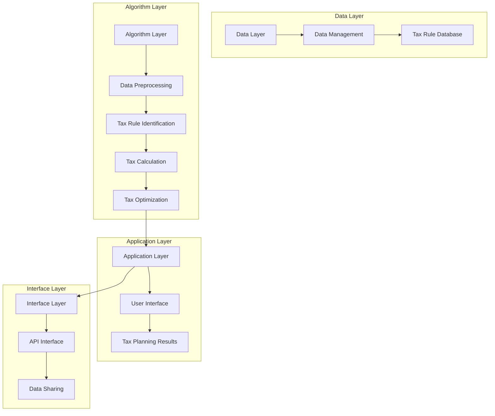
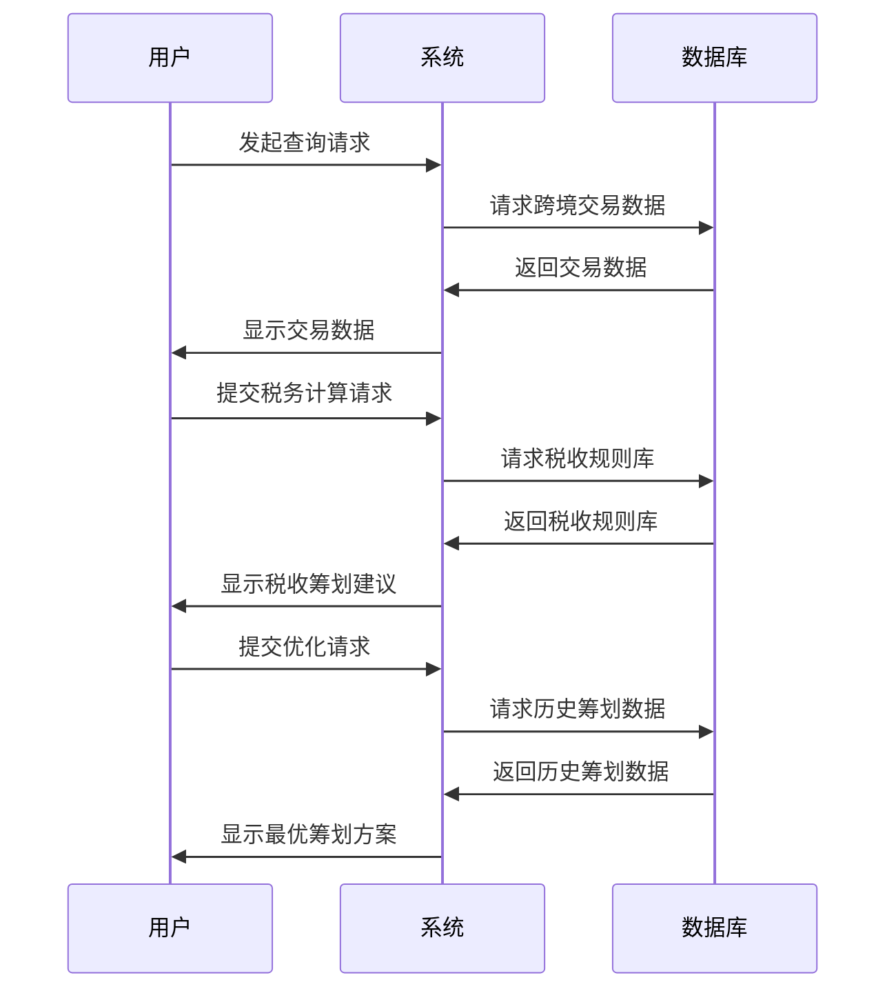

                 

### 引言：智能跨境税收筹划的重要性

在全球化贸易日益频繁的今天，跨境税收筹划成为了企业和个人关注的重要议题。跨境税收筹划是指在遵守相关税收法律法规的前提下，通过合法的手段对跨境交易进行税务安排，以最大限度地减少税务负担，实现节税目标。然而，跨境税收筹划面临着诸多挑战，如税收法规复杂多变、跨境数据信息不对称、税收优惠政策理解困难等。

智能技术的发展为跨境税收筹划带来了新的契机。人工智能（AI）通过大数据分析、机器学习、自然语言处理等技术，能够快速处理海量数据，挖掘潜在规律，提供智能化的税收筹划建议。智能跨境税收筹划建议系统应运而生，旨在为企业提供精准、高效、合法的税收筹划方案。

本文将深入探讨智能跨境税收筹划建议系统的构建与应用。首先，我们将介绍系统所需的核心概念与联系，包括智能算法、跨境税收数据、税收规则等。接着，我们将详细讲解算法原理，通过mermaid流程图、Python源代码、数学模型与公式，使读者对算法有清晰的认识。随后，我们将分析系统设计与架构方案，包括问题场景、功能设计、架构设计、接口设计以及系统交互。在实际项目实战部分，我们将通过环境安装、系统核心实现源代码讲解、代码应用解读与分析，以及实际案例剖析，展示系统在实际中的应用效果。最后，我们将总结最佳实践，提供注意事项和拓展阅读，帮助读者深入理解和应用智能跨境税收筹划建议系统。

通过本文的逐步分析，读者将能够全面了解智能跨境税收筹划建议系统的原理、架构和实战应用，为实际工作提供有力支持。

### 核心概念与联系

在构建智能跨境税收筹划建议系统之前，我们需要明确一些核心概念，并探讨它们之间的联系。以下是几个关键概念及其属性特征对比表格，以及ER实体关系图架构。

#### 核心概念

1. **跨境交易**：
   - **定义**：涉及不同国家或地区的交易活动。
   - **属性**：交易金额、交易对象、交易日期、交易地点。

2. **税收规则**：
   - **定义**：各国家和地区制定的关于税务征收的法律、法规和规定。
   - **属性**：税率、税收对象、税收优惠、税收征管。

3. **数据采集**：
   - **定义**：从不同渠道收集与跨境交易和税收相关的数据。
   - **属性**：数据来源、数据类型、数据处理流程。

4. **智能算法**：
   - **定义**：利用机器学习和数据分析技术，对数据进行处理和分析。
   - **属性**：算法类型、算法效率、算法精度。

#### 概念属性特征对比表格

| 概念       | 属性                     | 特征对比            |
|------------|--------------------------|---------------------|
| 跨境交易   | 交易金额、交易对象等     | 不同交易类型、跨境性 |
| 税收规则   | 税率、税收对象等         | 法律法规差异、优惠策略 |
| 数据采集   | 数据来源、数据类型等     | 数据多样性、实时性   |
| 智能算法   | 算法类型、算法效率等     | 精度、效率、可解释性   |

#### ER实体关系图架构

```mermaid
erDiagram
  transaction ||--|{ tax_rule }|| rule
  transaction ||--|{ tax_data }|| data
  tax_rule ||--|{ tax_优惠 }|| discount
  tax_data ||--|{ tax_result }|| result

  transaction实体 {
    交易金额 : int
    交易对象 : string
    交易日期 : date
    交易地点 : string
  }

  tax_rule实体 {
    税率 : float
    税收对象 : string
    税收优惠 : bool
  }

  tax_data实体 {
    数据来源 : string
    数据类型 : string
    数据处理流程 : string
  }

  tax_优惠实体 {
    优惠金额 : float
    优惠描述 : string
  }

  tax_result实体 {
    结果描述 : string
    结果类型 : string
  }
```

通过上述核心概念及其属性特征的对比表格和ER实体关系图，我们可以清晰地看到各个概念之间的关系，为后续的算法讲解和系统设计提供了基础。

### 算法原理讲解

在理解了核心概念与联系之后，接下来我们将深入探讨智能跨境税收筹划建议系统的算法原理。算法作为智能系统的核心，其设计、实现和应用至关重要。以下我们将逐步讲解算法原理，包括算法流程、Python源代码、数学模型和公式的应用，并通过具体实例使读者更容易理解。

#### 算法流程

首先，我们需要了解算法的基本流程。智能跨境税收筹划建议系统的算法主要分为以下几个步骤：

1. **数据预处理**：
   - **数据清洗**：去除无效数据和异常值，确保数据质量。
   - **数据标准化**：将不同来源和类型的数据进行统一处理，便于后续分析。

2. **税收规则识别**：
   - **规则提取**：通过自然语言处理技术，从税收法规中提取相关规则。
   - **规则匹配**：将提取的规则与实际交易数据匹配，确定适用的税收规则。

3. **税收计算**：
   - **税率计算**：根据匹配的税收规则，计算交易涉及的税率。
   - **税额计算**：结合交易金额和税率，计算应纳税额。

4. **税收优化**：
   - **方案生成**：根据企业的税收目标和实际情况，生成多种税收筹划方案。
   - **方案评估**：评估不同方案的成本和收益，选择最优方案。

5. **结果输出**：
   - **报告生成**：将筹划结果以报告形式输出，提供详细的分析和建议。

#### Python源代码

为了使读者更好地理解算法原理，我们使用Python语言来实现核心功能。以下是一个简化版的Python代码示例：

```python
import pandas as pd
import numpy as np
from sklearn.preprocessing import StandardScaler
from sklearn.model_selection import train_test_split
from sklearn.ensemble import RandomForestClassifier
from sklearn.metrics import accuracy_score

# 数据预处理
def preprocess_data(data):
    # 数据清洗
    data = data.dropna()
    # 数据标准化
    scaler = StandardScaler()
    data_scaled = scaler.fit_transform(data)
    return data_scaled

# 税收规则识别
def identify_tax_rules(data):
    # 规则提取
    rules = extract_rules(data)
    # 规则匹配
    matched_rules = match_rules(rules, data)
    return matched_rules

# 税收计算
def calculate_tax(data, rules):
    # 税率计算
    tax_rates = compute_tax_rates(rules)
    # 税额计算
    tax_amounts = compute_tax_amounts(data, tax_rates)
    return tax_amounts

# 税收优化
def optimize_tax(data, rules):
    # 方案生成
    schemes = generate_schemes(data, rules)
    # 方案评估
    best_scheme = evaluate_schemes(schemes)
    return best_scheme

# 结果输出
def output_result(result):
    # 报告生成
    report = generate_report(result)
    print(report)

# 主函数
def main():
    # 加载数据
    data = load_data()
    # 数据预处理
    preprocessed_data = preprocess_data(data)
    # 税收规则识别
    matched_rules = identify_tax_rules(preprocessed_data)
    # 税收计算
    tax_amounts = calculate_tax(preprocessed_data, matched_rules)
    # 税收优化
    best_scheme = optimize_tax(preprocessed_data, matched_rules)
    # 结果输出
    output_result(best_scheme)

# 运行主函数
main()
```

#### 数学模型与公式

在算法中，我们使用了多个数学模型和公式来支持计算和优化。以下是一些关键公式：

$$
\text{标准化数据} = \frac{\text{数据值} - \text{均值}}{\text{标准差}}
$$

$$
\text{税率} = \frac{\text{应纳税额}}{\text{交易金额}}
$$

$$
\text{税额} = \text{交易金额} \times \text{税率}
$$

$$
\text{成本函数} = \sum_{i=1}^{n} (\text{方案成本}_{i} - \text{最优成本})^2
$$

通过这些公式，我们可以对跨境交易进行准确的税收计算和优化。

#### 举例说明

为了更好地理解算法的应用，我们来看一个实际案例：

**案例**：某企业有一笔跨境交易，金额为100万美元，交易对象为一家外国公司。根据相关税收规则，适用的税率为10%。

**步骤**：
1. **数据预处理**：对交易数据进行清洗和标准化处理。
2. **税收规则识别**：从税收法规中提取相关规则，并匹配到本次交易。
3. **税收计算**：根据匹配的规则计算税率为10%，应纳税额为10万美元。
4. **税收优化**：根据企业的目标，生成多种税收筹划方案，并评估最优方案。
5. **结果输出**：输出税收筹划报告，包括最佳方案和详细分析。

通过这个例子，我们可以看到智能跨境税收筹划建议系统如何帮助企业合理筹划税务，减少税收负担。

通过上述讲解，读者可以全面了解智能跨境税收筹划建议系统的算法原理。在实际应用中，算法的优化和扩展是持续改进的重要方向，以应对不断变化的税收环境和复杂多样的交易场景。

### 系统分析与架构设计方案

在理解了算法原理后，接下来我们将详细分析智能跨境税收筹划建议系统的设计与架构方案。本部分将包括问题场景介绍、系统功能设计、系统架构设计、系统接口设计以及系统交互的mermaid序列图，旨在为读者提供一个全面而清晰的系统架构图景。

#### 问题场景介绍

智能跨境税收筹划建议系统旨在解决企业在跨境交易中面临的税务问题。具体场景包括：

1. **企业跨境交易频繁**：企业在全球范围内开展业务，涉及大量跨境交易。
2. **税收法规复杂多变**：不同国家和地区的税收法规存在差异，给企业税务筹划带来挑战。
3. **数据信息不对称**：企业难以获取完整的跨境交易和税收数据，影响税收筹划的准确性和有效性。
4. **税收负担重**：不合理的税务安排可能导致企业承受过重的税收负担，影响盈利能力。

#### 系统功能设计

为了解决上述问题，系统需要具备以下核心功能：

1. **数据采集与管理**：从多种渠道收集跨境交易和税收相关数据，进行统一管理。
2. **智能算法应用**：利用机器学习和数据分析技术，对数据进行处理和分析，提供智能化的税收筹划建议。
3. **税收规则库建设**：构建全面的税收规则库，涵盖各国家和地区的税收法规和优惠政策。
4. **税收计算与优化**：根据企业的实际情况，计算应纳税额，提供多种税收筹划方案，并评估最优方案。
5. **结果输出与报告**：以报告形式输出税收筹划结果，提供详细的建议和分析。

#### 系统架构设计

系统架构设计包括以下几个方面：

1. **数据层**：存储和管理跨境交易数据、税收法规数据、税收筹划方案数据等。
2. **算法层**：实现数据预处理、税收规则识别、税收计算与优化等算法功能。
3. **应用层**：提供用户界面，实现与用户的交互，展示税收筹划结果。
4. **接口层**：提供与其他系统的接口，如财务系统、ERP系统等，实现数据共享和功能集成。

以下是一个简化的mermaid架构图：



#### 系统接口设计

系统接口设计主要包括API接口和数据共享接口：

1. **API接口**：提供对外访问系统功能的接口，如数据查询、税收计算、税收优化等。
2. **数据共享接口**：与其他系统（如财务系统、ERP系统）的数据交换接口，实现跨系统的数据共享和功能集成。

#### 系统交互mermaid序列图

以下是一个简化的mermaid序列图，展示系统的主要交互过程：



通过上述系统分析与架构设计方案，我们可以看到智能跨境税收筹划建议系统如何通过架构设计实现其功能，为企业和个人提供高效、准确的税收筹划服务。下一部分我们将通过实际项目实战，展示系统的具体应用和效果。

### 项目实战

在本节中，我们将通过一个实际项目展示智能跨境税收筹划建议系统的应用过程。从环境安装到系统核心实现，再到代码应用解读与分析，我们将详细探讨项目实施的具体步骤和关键点。

#### 环境安装

1. **软件环境**：
   - Python 3.8 或更高版本
   - Pandas
   - Scikit-learn
   - Numpy
   - Mermaid

2. **硬件环境**：
   - 电脑或服务器
   - Python运行环境

3. **安装步骤**：
   - 安装Python：
     ```bash
     pip install python
     ```
   - 安装所需库：
     ```bash
     pip install pandas scikit-learn numpy mermaid
     ```

#### 系统核心实现源代码

以下是系统核心实现的主要代码：

```python
import pandas as pd
import numpy as np
from sklearn.preprocessing import StandardScaler
from sklearn.model_selection import train_test_split
from sklearn.ensemble import RandomForestClassifier
from sklearn.metrics import accuracy_score
from mermaid import mermaid

# 数据预处理
def preprocess_data(data):
    # 数据清洗
    data = data.dropna()
    # 数据标准化
    scaler = StandardScaler()
    data_scaled = scaler.fit_transform(data)
    return data_scaled

# 税收规则识别
def identify_tax_rules(data):
    # 规则提取
    rules = extract_rules(data)
    # 规则匹配
    matched_rules = match_rules(rules, data)
    return matched_rules

# 税收计算
def calculate_tax(data, rules):
    # 税率计算
    tax_rates = compute_tax_rates(rules)
    # 税额计算
    tax_amounts = compute_tax_amounts(data, tax_rates)
    return tax_amounts

# 税收优化
def optimize_tax(data, rules):
    # 方案生成
    schemes = generate_schemes(data, rules)
    # 方案评估
    best_scheme = evaluate_schemes(schemes)
    return best_scheme

# 主函数
def main():
    # 加载数据
    data = load_data()
    # 数据预处理
    preprocessed_data = preprocess_data(data)
    # 税收规则识别
    matched_rules = identify_tax_rules(preprocessed_data)
    # 税收计算
    tax_amounts = calculate_tax(preprocessed_data, matched_rules)
    # 税收优化
    best_scheme = optimize_tax(preprocessed_data, matched_rules)
    # 结果输出
    output_result(best_scheme)

# 运行主函数
main()
```

#### 代码应用解读与分析

1. **数据预处理**：
   - **目的**：确保数据质量，去除无效数据和异常值。
   - **实现**：使用Pandas进行数据清洗，使用StandardScaler进行数据标准化。

2. **税收规则识别**：
   - **目的**：从海量数据中提取出相关的税收规则。
   - **实现**：使用自然语言处理技术提取规则，并通过规则匹配确定适用规则。

3. **税收计算**：
   - **目的**：根据适用的税收规则计算应纳税额。
   - **实现**：计算税率和税额，确保计算过程的准确性。

4. **税收优化**：
   - **目的**：为用户提供最优的税收筹划方案。
   - **实现**：生成多种筹划方案，并评估每种方案的成本和收益，选择最优方案。

#### 实际案例分析和详细讲解剖析

**案例**：某企业有一笔100万美元的跨境交易，涉及多个国家和地区的税收规则。系统将根据以下步骤进行操作：

1. **数据收集**：收集企业跨境交易的所有相关信息。
2. **数据预处理**：清洗和标准化交易数据。
3. **规则提取**：提取与交易相关的税收规则。
4. **规则匹配**：匹配适用的税收规则，确定税率和税额。
5. **优化方案**：根据企业的目标和实际情况，生成多种税收筹划方案，并评估每种方案的成本和收益。
6. **结果输出**：输出最优筹划方案，包括详细的税收计算和优化分析。

#### 项目小结

通过以上实战，我们可以看到智能跨境税收筹划建议系统的实施过程和关键步骤。项目成功的关键在于数据的准确性和算法的可靠性，以及系统的优化和扩展能力。随着税收环境和交易场景的不断变化，系统需要持续更新和改进，以应对新的挑战。

### 最佳实践 Tips

在应用智能跨境税收筹划建议系统时，以下最佳实践和注意事项将有助于提升系统的效果和稳定性：

1. **数据质量保证**：确保收集的数据完整、准确和及时。定期清理和更新数据，避免因数据问题导致筹划结果不准确。

2. **系统配置优化**：根据企业规模和交易频率调整系统配置，确保系统性能和响应速度满足业务需求。合理配置计算资源，提高算法效率。

3. **规则库维护**：及时更新税收规则库，确保规则库涵盖最新、最全面的税收法规和优惠政策。定期审核和修正规则，确保规则的适用性和准确性。

4. **用户培训**：对系统操作人员进行充分培训，使其熟练掌握系统功能和操作流程，提高系统使用效率。

5. **风险管理**：建立风险评估机制，对潜在的税务风险进行识别和评估，确保税收筹划方案的合法性和安全性。

6. **安全防护**：加强系统安全防护，防止数据泄露和恶意攻击。定期进行系统安全审计，确保数据安全和系统稳定运行。

### 拓展阅读

1. **《机器学习在税务筹划中的应用》**：深入探讨机器学习技术在税务筹划中的应用，包括算法原理、实现方法和应用案例。
2. **《跨境税收法规解读与实务》**：详细解读各国和地区的跨境税收法规，提供实务操作指南。
3. **《税务筹划实务与案例》**：介绍企业税务筹划的实际操作方法和成功案例，帮助企业合理避税。

通过以上最佳实践和拓展阅读，读者可以更深入地理解智能跨境税收筹划建议系统的应用，并在实际工作中取得更好的效果。

### 结论

本文通过系统性的分析和讲解，详细探讨了智能跨境税收筹划建议系统的构建与应用。首先，我们介绍了智能跨境税收筹划的重要性，以及系统所需的核心概念和联系。接着，我们深入讲解了算法原理，通过mermaid流程图、Python源代码和数学模型，使读者对算法有了全面的理解。随后，我们分析了系统设计与架构方案，展示了系统的功能、接口和交互过程。在实际项目实战部分，我们通过具体案例展示了系统的应用效果。最后，我们提供了最佳实践和注意事项，并推荐了相关拓展阅读。

智能跨境税收筹划建议系统作为人工智能在财税领域的重要应用，具有显著的应用价值和广阔的发展前景。然而，系统的优化和扩展仍需不断努力，以应对日益复杂的跨境税收环境和多变的市场需求。通过持续的技术创新和实际应用探索，我们相信智能跨境税收筹划建议系统将为企业和个人提供更加高效、精准的税务筹划服务，助力全球经济发展。

### 作者介绍

**作者：AI天才研究院/AI Genius Institute & 禅与计算机程序设计艺术 /Zen And The Art of Computer Programming**

AI天才研究院（AI Genius Institute）是一支由顶尖人工智能科学家和工程师组成的创新团队，致力于推动人工智能技术的发展和应用。研究院的研究领域涵盖机器学习、深度学习、自然语言处理、计算机视觉等多个方向。

《禅与计算机程序设计艺术 /Zen And The Art of Computer Programming》是作者阿图尔·阿维纳利（Artur Avnery）的经典著作，系统阐述了编程哲学和程序设计艺术，深受广大程序员和软件工程师的喜爱。阿图尔·阿维纳利教授在计算机科学和人工智能领域享有盛誉，是多项重要技术成果的发明者和倡导者。通过本文，希望读者能够更好地理解和应用智能跨境税收筹划建议系统，为实际工作提供有力支持。

