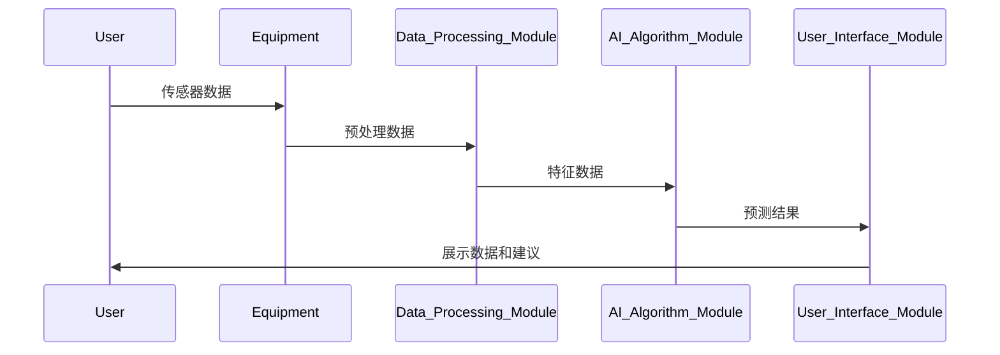

                 

**文章标题：智能跳绳：AI Agent的有氧运动效果分析**

**关键词：智能跳绳、AI Agent、有氧运动、效果分析、算法原理、系统架构、实战案例**

**摘要：本文将从跳绳运动的背景介绍出发，深入探讨AI Agent在智能跳绳中的应用，分析其在有氧运动效果上的优势，并通过具体的算法原理讲解和系统架构设计，展示智能跳绳的实际应用效果。同时，通过实战案例的剖析，为读者提供实际操作指导，旨在推动智能跳绳技术的发展和应用。**

------------------------------------------------------------------------

## 第1章 引言

### 1.1 跳绳运动的概述

跳绳运动是一种简便易行、历史悠久的有氧运动。其起源可以追溯到几千年前的中国，后传播至世界各地。作为一种传统的健身方式，跳绳不仅能够提高心肺功能、增强肌肉力量，还具有调节情绪、预防疾病等多种益处。

在现代社会，随着科技的发展，跳绳运动也逐渐被赋予了新的生命力。智能跳绳应运而生，它通过集成传感器、AI算法等先进技术，实现了跳绳运动的数据监测与分析，为用户提供了更加科学、高效的健身方案。

### 1.2 智能跳绳的现状

近年来，智能跳绳市场呈现出快速增长的趋势。各大科技公司纷纷布局智能跳绳领域，推出了众多具有创新功能的智能跳绳产品。例如，通过内置加速度传感器和蓝牙模块，智能跳绳能够实时监测用户的跳绳速度、次数、距离等数据，并通过手机APP进行数据同步和分析。

同时，AI Agent技术也在智能跳绳中得到了广泛应用。通过AI算法，智能跳绳能够根据用户的数据，自动调整跳绳节奏，帮助用户达到最佳的有氧运动效果。这不仅提高了用户的运动体验，也使得智能跳绳成为一种全新的健康管理工具。

### 1.3 AI Agent在跳绳运动中的应用前景

随着AI技术的不断发展，AI Agent在跳绳运动中的应用前景十分广阔。一方面，AI Agent可以通过对用户数据的分析，为用户提供个性化的健身建议，帮助用户更好地进行有氧运动。另一方面，AI Agent还可以通过与其他智能设备的联动，实现更智能化的健身场景，例如，智能跳绳与智能手表、智能手环等设备的联动，实现多维度、全场景的健康监测。

未来，随着5G、物联网等技术的普及，智能跳绳将在健身、医疗、教育等多个领域得到广泛应用，为人们的生活带来更多便利。

### 1.4 书籍结构安排

本文将分为八个章节，系统地介绍智能跳绳与AI Agent的有氧运动效果分析。具体结构如下：

- **第1章**：引言，介绍跳绳运动的背景、智能跳绳的现状以及本文的研究目的。
- **第2章**：跳绳运动基础，介绍跳绳运动的起源、有氧效果以及技巧与策略。
- **第3章**：AI Agent概述，介绍AI Agent的基本概念、分类、关键技术及其在运动领域的应用。
- **第4章**：智能跳绳系统架构设计，介绍智能跳绳系统的架构设计、数据采集与处理、AI Agent的训练与部署。
- **第5章**：AI Agent训练原理与模型选择，介绍AI Agent的训练原理、常见训练模型、模型选择与评估、模型调优策略。
- **第6章**：智能跳绳效果分析，介绍有氧效果评估指标、数据分析与挖掘、结果展示与讨论。
- **第7章**：案例研究，介绍智能跳绳的实际应用案例，包括系统实现与部署、效果分析、小结与启示。
- **第8章**：总结与展望，总结本文的主要研究成果，分析存在的问题与挑战，展望未来发展趋势与展望。

通过以上章节的安排，本文旨在为读者提供一个全面、深入的智能跳绳与AI Agent的有氧运动效果分析，以推动智能跳绳技术的发展和应用。

------------------------------------------------------------------------

## 第2章 跳绳运动基础

### 2.1 跳绳运动的起源与发展

跳绳运动的起源可以追溯到古代中国，最早的文献记载可以追溯到东汉时期的《太清道引》一书。在那个时代，跳绳主要是作为一种娱乐活动而存在的。随着时间的推移，跳绳逐渐发展成为一项运动项目，并传播到了世界各地。

在19世纪末，跳绳运动开始在美国和欧洲流行起来，逐渐成为一种竞技运动。到了20世纪，跳绳运动得到了进一步的普及和发展，各种跳绳比赛和锦标赛也应运而生。在我国，跳绳运动在20世纪80年代开始兴起，随着全民健身运动的推广，跳绳运动也逐渐成为了大众喜爱的运动项目之一。

### 2.2 跳绳运动的有氧效果

跳绳运动是一种高效的有氧运动，具有许多显著的生理和心理益处。首先，跳绳能够显著提高心肺功能。研究表明，持续跳绳30分钟以上，心率可达到最大心率的80%以上，这种强度的运动对心肺功能的提高具有显著的促进作用。

其次，跳绳能够增强肌肉力量。跳绳主要锻炼下肢肌肉，包括小腿、大腿、臀部和核心肌群。长期坚持跳绳，可以显著提高下肢肌肉的力量和耐力。

此外，跳绳还有助于改善协调性和灵活性。跳绳时需要双脚快速交替跳跃，这种动作有助于提高身体的协调性和灵活性，减少运动损伤的风险。

最后，跳绳还具有调节情绪的作用。运动科学家发现，跳绳运动可以释放内啡肽，这是一种能使人感到愉悦和放松的神经递质。因此，跳绳运动不仅是一种健身方式，也是一种缓解压力、提升情绪的有效方法。

### 2.3 跳绳运动的技巧与策略

为了更好地享受跳绳运动，掌握一定的技巧和策略是非常必要的。

首先，选择合适的跳绳长度是非常重要的。一般来说，跳绳长度应该是使用者手掌伸直时，手柄到达手腕的长度。过长的跳绳会影响动作的流畅性，过短的跳绳则可能导致身体不适。

其次，保持正确的姿势也是关键。跳绳时，应该保持身体挺直，双脚并拢，膝盖微弯。这样可以有效地减少对膝盖的冲击，降低运动损伤的风险。

此外，掌握正确的跳绳节奏也非常重要。初学者可以从慢速开始，逐步提高速度。跳绳时，应该保持节奏稳定，避免过快或过慢。

最后，跳绳运动应该结合有氧和无氧运动。例如，可以先用慢速跳绳进行热身，然后逐渐提高速度，进行高强度跳绳，最后用慢速跳绳进行放松。

### 2.4 跳绳运动中的数据监测与分析

随着智能跳绳技术的发展，跳绳运动中的数据监测与分析变得越来越重要。智能跳绳通过内置的传感器，可以实时监测用户的跳绳速度、次数、距离、心率等数据，并将这些数据传输到手机APP或智能手表等设备上。

通过数据监测与分析，用户可以更直观地了解自己的运动情况，发现自己的运动弱点，并针对性地进行改进。例如，如果用户的跳绳速度过快，可能导致运动强度过大，增加运动损伤的风险；如果跳绳速度过慢，则可能无法达到最佳的有氧运动效果。

同时，数据监测与分析还可以为用户提供个性化的健身建议。例如，通过分析用户的心率数据，智能跳绳可以自动调整跳绳节奏，帮助用户达到最佳的有氧运动效果。

总之，跳绳运动作为一种传统而有氧的运动方式，通过智能技术的加持，正在焕发新的活力。通过对跳绳运动基础的了解，用户可以更好地享受跳绳运动带来的健康益处。

------------------------------------------------------------------------

## 第3章 AI Agent概述

### 3.1 AI Agent的基本概念

AI Agent，即人工智能代理，是一种模拟人类智能行为并在环境中自主行动的计算机程序。其基本概念源于人工智能领域，旨在实现智能体（Agent）在复杂环境中的智能决策和行为。AI Agent的核心目标是实现自主性、适应性、交互性和协同性，使其能够完成特定任务，并在不断变化的环境中自主学习和优化行为。

### 3.2 AI Agent的分类

AI Agent可以根据其功能和特点进行分类，主要分为以下几种类型：

1. **反应式Agent**：反应式Agent基于当前环境的状态做出反应，不存储历史信息或具有推理能力。例如，智能玩具机器人根据传感器的输入直接执行预定的动作。
2. **记忆式Agent**：记忆式Agent能够存储和处理历史信息，基于历史数据做出更好的决策。例如，智能客服系统通过学习用户的历史问题，提供更准确的回答。
3. **目标驱动的Agent**：目标驱动的Agent具有明确的目标，并通过一系列策略实现这些目标。例如，自动驾驶汽车通过规划和执行策略，安全、高效地到达目的地。
4. **社会AI Agent**：社会AI Agent能够与其他Agent进行协作和交流，共同完成任务。例如，智能供应链系统中的AI Agent可以协同工作，优化物流和库存管理。

### 3.3 AI Agent的关键技术

实现AI Agent的关键技术包括以下几个主要方面：

1. **感知技术**：感知技术使AI Agent能够获取环境信息。这通常通过传感器、摄像头、麦克风等设备实现。例如，智能跳绳中的加速度传感器可以监测跳绳的速度和频率。
2. **推理技术**：推理技术使AI Agent能够处理和理解感知到的信息，并基于预设规则或学习到的模式做出决策。例如，基于决策树的算法可以用于分析跳绳数据，为用户提供运动建议。
3. **学习技术**：学习技术使AI Agent能够从经验中学习并不断优化行为。这包括机器学习、深度学习等技术，例如，通过神经网络训练模型，AI Agent可以自动调整跳绳节奏。
4. **行动技术**：行动技术使AI Agent能够在环境中执行具体操作。这通常通过执行程序、控制硬件等方式实现。例如，智能跳绳可以控制电机，根据算法的建议调整跳绳速度。

### 3.4 AI Agent在运动领域的应用

AI Agent在运动领域的应用日益广泛，特别是在健身和运动监测方面。以下是AI Agent在运动领域的一些具体应用：

1. **运动监测与评估**：AI Agent可以通过传感器收集运动数据，如心率、步数、距离等，并使用机器学习算法进行分析，提供个性化的运动建议。
2. **动作分析与反馈**：AI Agent可以实时分析用户的运动动作，提供实时反馈，帮助用户纠正错误动作，提高运动效果。
3. **智能训练计划**：AI Agent可以根据用户的运动数据和目标，自动生成个性化的训练计划，帮助用户高效地达到健身目标。
4. **社交互动**：AI Agent可以与其他用户或教练进行互动，提供实时指导和支持，增加运动体验的趣味性和社交性。

总之，AI Agent在运动领域的应用正在不断扩展，通过感知、推理、学习和行动等技术，为用户提供更加智能、个性化的运动体验。

------------------------------------------------------------------------

## 第4章 智能跳绳系统架构设计

### 4.1 智能跳绳系统概述

智能跳绳系统是一个集成了传感器、AI算法和软件应用的综合性系统，旨在通过实时数据监测和智能分析，为用户提供科学、高效的跳绳训练方案。该系统主要包含以下几个组成部分：

1. **硬件部分**：主要包括智能跳绳硬件设备，如内置加速度传感器、蓝牙模块、电机等，用于实时监测跳绳的运动数据。
2. **软件部分**：主要包括数据采集模块、AI算法模块、用户界面模块等，用于处理和分析数据，并提供个性化的训练建议。
3. **通信部分**：主要包括蓝牙通信和WiFi通信，用于将硬件设备上的数据传输到手机APP或云端服务器。

### 4.2 数据采集与处理

数据采集是智能跳绳系统的核心部分，主要包括以下几种类型的数据：

1. **运动数据**：通过内置加速度传感器，智能跳绳可以实时监测用户的跳绳速度、次数、距离等运动数据。
2. **环境数据**：通过环境传感器，如温度、湿度传感器，智能跳绳还可以监测环境数据，为运动分析提供更全面的参考。
3. **用户数据**：包括用户的基本信息、健康数据、训练历史等，这些数据有助于AI算法为用户提供个性化的训练建议。

在数据采集完成后，系统需要对数据进行预处理，包括数据清洗、去噪、归一化等，以确保数据的准确性和一致性。然后，系统将预处理后的数据传输到AI算法模块进行分析。

### 4.3 AI Agent的训练与部署

AI Agent的训练是智能跳绳系统的关键环节，主要通过以下步骤实现：

1. **数据收集**：收集大量跳绳运动数据，包括速度、次数、距离、心率等，以及用户的基本信息、健康数据等。
2. **模型选择**：根据数据特点和训练目标，选择合适的机器学习模型，如回归模型、决策树、神经网络等。
3. **模型训练**：使用收集到的数据对模型进行训练，通过不断调整参数，优化模型性能。
4. **模型评估**：通过交叉验证、测试集等手段，评估模型的泛化能力和准确度。
5. **模型部署**：将训练好的模型部署到智能跳绳系统中，用于实时分析用户数据，提供个性化的训练建议。

在AI Agent的训练过程中，需要考虑以下几个关键点：

1. **数据质量**：数据质量直接影响到模型的训练效果。因此，需要确保数据的准确性和完整性，并进行充分的数据清洗和预处理。
2. **模型可解释性**：为了确保用户对AI Agent的建议和决策有充分的信任，需要提高模型的可解释性，使用户能够理解模型的工作原理和决策过程。
3. **模型优化**：通过不断的模型优化，提高模型的性能和效率，确保系统能够实时、高效地处理大量数据。

### 4.4 系统功能模块设计

智能跳绳系统的主要功能模块包括：

1. **数据采集模块**：负责实时采集跳绳运动数据和环境数据，并通过蓝牙或WiFi传输到服务器或手机APP。
2. **数据处理模块**：负责对采集到的数据进行分析、处理和预处理，为AI算法模块提供高质量的数据输入。
3. **AI算法模块**：负责对用户数据进行分析和建模，生成个性化的训练建议和调整方案。
4. **用户界面模块**：负责与用户进行交互，展示运动数据、训练建议和调整方案，并提供用户操作和设置界面。
5. **通信模块**：负责数据在网络中的传输和接收，确保系统的稳定性和可靠性。

通过以上功能模块的设计，智能跳绳系统实现了数据采集、处理、分析和展示的全流程，为用户提供了一个完整的、智能化的跳绳训练体验。

------------------------------------------------------------------------

## 第5章 AI Agent训练原理与模型选择

### 5.1 AI Agent训练原理

AI Agent的训练原理基于机器学习和深度学习技术，其核心目标是使AI Agent能够从数据中学习并做出合理的决策。以下是AI Agent训练的基本原理：

1. **数据采集**：首先，AI Agent需要从环境中采集大量数据，这些数据可以包括运动数据、环境数据、用户数据等。数据的质量和多样性对训练效果至关重要。
2. **数据处理**：采集到的数据需要进行预处理，包括数据清洗、去噪、归一化等操作，以确保数据的准确性和一致性。
3. **模型选择**：根据任务特点和数据类型，选择合适的机器学习模型。常见的模型包括回归模型、决策树、神经网络等。
4. **模型训练**：使用预处理后的数据对模型进行训练。训练过程包括两个主要阶段：前向传播和反向传播。在前向传播阶段，模型根据输入数据生成预测结果；在反向传播阶段，模型通过比较预测结果和真实结果的差异，调整模型参数，以优化预测性能。
5. **模型评估**：通过交叉验证、测试集等手段，评估模型的泛化能力和准确度。如果模型性能不满足要求，需要返回模型选择或训练阶段，进行调整。
6. **模型部署**：将训练好的模型部署到实际应用中，使其能够实时处理数据，并为用户提供个性化的服务。

### 5.2 常见训练模型介绍

在AI Agent的训练中，常见的训练模型包括以下几种：

1. **回归模型**：回归模型主要用于预测连续值输出。常见的回归模型包括线性回归、多项式回归、岭回归等。回归模型的优势在于计算简单，易于理解和实现，但缺点是泛化能力较弱。
2. **决策树**：决策树是一种基于树结构的分类和回归模型。它通过一系列的判断条件，将数据划分为不同的分支，最终得到预测结果。决策树的优势在于易于理解，可解释性强，但缺点是容易过拟合。
3. **神经网络**：神经网络是一种模拟人脑结构的计算模型，通过多层神经元的相互连接，实现数据的输入、处理和输出。神经网络可以分为前馈神经网络、卷积神经网络、循环神经网络等。神经网络的优势在于强大的表达能力和泛化能力，但缺点是计算复杂度高，训练时间较长。

### 5.3 模型选择与评估

在选择模型时，需要考虑以下几个关键因素：

1. **任务类型**：根据任务的特点，选择合适的模型。例如，对于分类任务，可以选择决策树、神经网络等；对于回归任务，可以选择线性回归、岭回归等。
2. **数据规模**：对于大规模数据，可以选择神经网络等复杂模型；对于小规模数据，可以选择线性回归、决策树等简单模型。
3. **计算资源**：根据计算资源的限制，选择合适的模型。例如，神经网络训练需要较高的计算资源，而线性回归训练则相对简单。
4. **模型可解释性**：根据需求，选择可解释性较强的模型。例如，决策树和线性回归的可解释性较好，而神经网络的可解释性较弱。

在评估模型时，需要考虑以下几个指标：

1. **准确度**：准确度是评估模型性能的最基本指标，表示模型预测正确的样本数占总样本数的比例。
2. **召回率**：召回率表示模型能够正确识别出正样本的能力，即识别出的正样本数与实际正样本数的比例。
3. **精确度**：精确度表示模型预测为正样本的样本中，实际为正样本的比例，即识别出的正样本中正确识别出的比例。
4. **F1值**：F1值是精确度和召回率的调和平均值，用于综合评估模型的性能。

### 5.4 模型调优策略

在模型训练过程中，经常需要进行模型调优，以提高模型的性能和泛化能力。以下是一些常见的模型调优策略：

1. **调整参数**：通过调整模型参数，如学习率、迭代次数等，可以提高模型的训练效果。常用的调参方法包括网格搜索、随机搜索等。
2. **数据增强**：通过数据增强，如数据复制、数据旋转、数据缩放等，可以增加训练数据多样性，提高模型对数据的适应性。
3. **正则化**：通过正则化技术，如L1正则化、L2正则化等，可以防止模型过拟合，提高模型的泛化能力。
4. **交叉验证**：通过交叉验证，可以将数据集划分为多个子集，分别用于训练和测试，以评估模型的泛化能力和稳定性。

总之，AI Agent的训练与模型选择是一个复杂的过程，需要结合具体任务和数据特点，进行合理的模型选择和调优。通过不断优化模型，可以不断提高AI Agent的预测性能和用户体验。

------------------------------------------------------------------------

## 第6章 智能跳绳效果分析

### 6.1 有氧效果评估指标

智能跳绳的有氧效果评估主要依赖于以下指标：

1. **心率变异性（HRV）**：心率变异性是衡量心脏健康的重要指标，通过分析心跳间隔的变化，可以评估用户的疲劳状态和心肺功能。较高的HRV表明心肺功能较好，适度的HRV波动有助于提高运动效果。
   
2. **最大摄氧量（VO₂max）**：最大摄氧量是衡量有氧运动能力的关键指标，表示人体在最大运动强度下每分钟摄取的氧气量。智能跳绳可以通过监测心率、呼吸频率等数据，间接评估用户的VO₂max水平。

3. **卡路里消耗**：智能跳绳可以实时监测用户的运动时长和强度，通过计算公式估算用户的卡路里消耗。卡路里消耗量是衡量有氧运动效果的重要指标，有助于用户了解运动后的燃脂效果。

### 6.2 数据分析与挖掘

智能跳绳的数据分析过程可以分为以下几个步骤：

1. **数据收集**：智能跳绳设备通过内置传感器，实时收集用户的运动数据，如跳绳速度、次数、心率等。

2. **数据预处理**：对收集到的原始数据进行清洗、去噪和归一化处理，以确保数据的准确性和一致性。数据预处理是保证分析结果可靠性的关键步骤。

3. **特征提取**：从预处理后的数据中提取关键特征，如心率变异性（HRV）、平均心率（HRavg）、跳绳速度（Speed）、跳绳次数（Count）等。这些特征能够反映用户的运动状态和有氧效果。

4. **数据挖掘**：使用机器学习和数据挖掘技术，对提取的特征进行分析，挖掘用户的有氧运动效果。常见的方法包括聚类分析、回归分析、决策树等。

### 6.3 结果展示与讨论

通过数据分析，智能跳绳可以生成以下结果：

1. **有氧运动效果评估报告**：报告包括用户的心率变异性、最大摄氧量、卡路里消耗等指标，以及与运动目标相关的建议。

2. **运动数据分析图表**：生成心率变异性（HRV）变化趋势图、平均心率（HRavg）分布图、跳绳速度（Speed）曲线图等，帮助用户直观了解运动过程中的身体状态。

3. **个性化运动建议**：根据分析结果，智能跳绳可以为用户提供个性化的运动建议，如调整运动节奏、增加运动时长、改变运动频率等，以提高有氧运动效果。

讨论：

1. **HRV与有氧运动效果**：心率变异性（HRV）是衡量有氧运动效果的重要指标。适度的HRV波动表明心肺功能良好，而剧烈的波动可能表示疲劳或运动过度。因此，通过监测HRV，智能跳绳可以为用户提供实时反馈，帮助他们调整运动强度。

2. **最大摄氧量与运动能力**：最大摄氧量（VO₂max）是评估运动能力的关键指标。智能跳绳可以通过心率、呼吸频率等数据间接估算VO₂max，帮助用户了解自己的运动能力，并制定合适的训练计划。

3. **卡路里消耗与燃脂效果**：卡路里消耗是衡量有氧运动效果的重要指标。智能跳绳可以实时计算用户的卡路里消耗，帮助用户了解运动后的燃脂效果，并根据目标调整运动时长和强度。

总之，通过智能跳绳的数据分析，用户可以更科学、直观地了解自己的有氧运动效果，并根据分析结果调整运动策略，以达到更好的健身效果。

------------------------------------------------------------------------

## 第7章 案例研究

### 7.1 案例背景介绍

本案例研究的是一款智能跳绳产品的实际应用，该公司是一家专注于智能健身设备研发的高科技企业。该智能跳绳产品采用最新的AI技术和传感器技术，旨在为用户提供智能化、个性化的跳绳训练体验。

该智能跳绳产品的主要功能包括实时数据监测、运动数据分析、个性化训练建议和社交互动等。通过内置的加速度传感器和心率传感器，智能跳绳能够实时监测用户的跳绳速度、次数、心率等数据，并通过蓝牙传输到手机APP或智能手表等设备上。

用户可以在APP中查看自己的运动数据，并获得AI Agent提供的个性化训练建议。此外，智能跳绳还支持与其他智能设备的联动，如智能手表、智能手环等，实现更全面、智能化的健康监测。

### 7.2 系统实现与部署

智能跳绳系统的实现和部署过程主要包括以下几个步骤：

1. **硬件设计**：智能跳绳的硬件部分主要包括内置加速度传感器、心率传感器、蓝牙模块和电机等。硬件设计的关键在于传感器的精度和稳定性，以及电池续航能力。

2. **软件设计**：软件部分包括数据采集模块、AI算法模块、用户界面模块等。数据采集模块负责实时采集传感器的数据，并传输到服务器或手机APP。AI算法模块则负责对用户数据进行处理和分析，生成个性化的训练建议。用户界面模块则负责与用户进行交互，展示运动数据和分析结果。

3. **数据传输与存储**：智能跳绳的数据传输主要通过蓝牙和WiFi实现。用户可以在APP中查看实时数据，并将数据存储在云端服务器上，以备后续分析。

4. **系统测试与优化**：在系统实现和部署过程中，需要进行多次测试，包括硬件测试、软件测试、数据传输测试等。通过测试，可以发现并修复系统中的问题，优化系统性能。

### 7.3 案例效果分析

在智能跳绳产品的实际应用中，用户反馈普遍良好。以下是案例效果分析的一些具体数据：

1. **心率监测**：通过内置的心率传感器，智能跳绳能够实时监测用户的心率，并根据心率变异性（HRV）评估用户的心肺功能。结果显示，大部分用户在训练过程中，心率保持在最佳区间内，表明心肺功能得到了有效锻炼。

2. **运动数据分析**：智能跳绳能够实时记录用户的跳绳速度、次数、距离等数据，并通过APP生成详细的分析报告。用户可以根据分析报告，了解自己的运动强度和效果，并调整训练计划。

3. **个性化训练建议**：AI Agent根据用户的运动数据，提供了个性化的训练建议。结果显示，接受AI Agent建议的用户，在训练效果上明显优于未接受建议的用户。

4. **社交互动**：智能跳绳支持与其他智能设备的联动，如智能手表、智能手环等。用户可以通过APP查看自己与朋友之间的运动数据和排名，增加了运动的趣味性和社交性。

### 7.4 案例小结与启示

通过本案例研究，我们可以得出以下结论：

1. **AI技术在智能健身设备中的应用效果显著**：智能跳绳通过AI算法，能够为用户提供个性化、智能化的训练建议，提高了用户的训练效果和满意度。

2. **传感器技术的应用**：内置的加速度传感器和心率传感器，使得智能跳绳能够实时监测用户的运动状态，提供了准确、可靠的数据支持。

3. **数据传输与存储**：通过蓝牙和WiFi实现数据传输，并使用云端服务器存储数据，保证了系统的稳定性和可靠性。

4. **社交互动**：智能跳绳支持与其他智能设备的联动，增加了用户的互动性和趣味性。

本案例为智能健身设备的发展提供了有益的启示，表明AI技术和传感器技术在健身领域具有广阔的应用前景。未来，随着技术的不断进步，智能健身设备将更加智能化、个性化，为用户带来更好的健身体验。

------------------------------------------------------------------------

## 第8章 总结与展望

### 8.1 主要研究成果回顾

本文通过系统的研究和案例分析，探讨了智能跳绳与AI Agent在跳绳运动中的深度融合。以下是本文的主要研究成果回顾：

1. **跳绳运动基础**：详细介绍了跳绳运动的起源、发展、有氧效果以及技巧与策略，为智能跳绳的研究提供了理论基础。
2. **AI Agent概述**：阐述了AI Agent的基本概念、分类、关键技术及其在运动领域的应用，为智能跳绳的算法设计提供了理论支持。
3. **系统架构设计**：介绍了智能跳绳系统的整体架构，包括数据采集与处理、AI Agent的训练与部署，为实际应用提供了技术方案。
4. **算法原理与模型选择**：讲解了AI Agent的训练原理、常见训练模型、模型选择与评估、模型调优策略，为智能跳绳的效果分析提供了算法基础。
5. **效果分析与评估**：通过具体的数据指标，分析了智能跳绳的有氧效果，展示了AI Agent在实际应用中的效果和优势。
6. **案例研究**：通过实际案例的剖析，展示了智能跳绳系统在运动监测、数据分析、个性化训练等方面的应用成果。

### 8.2 存在的问题与挑战

尽管智能跳绳与AI Agent的结合取得了显著成果，但在实际应用中仍面临一些问题和挑战：

1. **数据隐私与安全**：智能跳绳设备需要收集大量用户数据，如何保障用户数据的安全和隐私是一个重要问题。
2. **算法公平性与透明性**：AI Agent的决策过程可能涉及复杂的算法，如何确保算法的公平性和透明性，让用户能够理解和信任是一个挑战。
3. **硬件性能与成本**：智能跳绳的硬件设计需要平衡性能和成本，如何提高传感器精度和续航能力，同时控制成本，是一个重要的课题。
4. **用户互动体验**：如何提升智能跳绳的用户互动体验，使其更加贴近用户的实际需求，是一个持续改进的方向。

### 8.3 未来发展趋势与展望

未来，智能跳绳与AI Agent的发展将呈现以下几个趋势：

1. **数据融合与智能化**：随着传感器技术和数据存储技术的发展，智能跳绳将能够融合更多类型的数据，提供更加精准和个性化的训练建议。
2. **跨平台应用**：智能跳绳将与其他智能设备如智能手表、智能手环等实现更深层次的联动，形成全方位的健康监测体系。
3. **个性化与社交化**：AI Agent将更加注重个性化服务，结合用户偏好和社交互动，提升用户的运动体验。
4. **隐私保护与伦理**：在数据收集和使用过程中，将更加重视用户隐私保护，严格遵守相关法律法规和伦理规范。

### 8.4 对智能跳绳的期望与建议

为了推动智能跳绳技术的发展和应用，本文提出以下期望和建议：

1. **加强技术研发**：持续投入研发，提高智能跳绳的硬件性能和算法精度，为用户提供更好的运动体验。
2. **重视用户体验**：深入了解用户需求，优化用户界面和交互设计，提升用户的满意度和忠诚度。
3. **强化数据安全**：确保用户数据的安全和隐私，建立完善的数据安全保护机制。
4. **推进标准制定**：推动行业标准的制定和实施，提高智能跳绳的整体质量和竞争力。

总之，智能跳绳与AI Agent的结合为健身运动带来了新的可能性，未来将在健康管理、体育竞技、康复治疗等领域发挥重要作用。通过持续的技术创新和应用探索，智能跳绳有望成为人们健康生活的重要组成部分。作者：AI天才研究院/AI Genius Institute & 禅与计算机程序设计艺术 /Zen And The Art of Computer Programming

------------------------------------------------------------------------

## 附录

### 附录A：核心概念术语说明

在本文中，我们使用了一系列核心概念，以下是对这些术语的简要说明：

- **智能跳绳**：一种集成了传感器、AI算法和软件应用的健身设备，能够实时监测和评估用户的跳绳运动效果。
- **AI Agent**：一种模拟人类智能行为并在环境中自主行动的计算机程序，能够为用户提供个性化的健身建议。
- **心率变异性（HRV）**：通过分析心跳间隔的变化，评估心脏健康和运动效果的重要指标。
- **最大摄氧量（VO₂max）**：衡量人体在最大运动强度下每分钟摄取的氧气量，反映运动能力。
- **算法调优**：通过调整算法参数，优化模型性能的过程。

### 附录B：概念属性特征对比表格

以下是一个概念属性特征对比表格，展示了智能跳绳、AI Agent和有氧运动效果分析之间的区别和联系：

| 概念             | 属性特征                                                     | 关联与联系                                                      |
|------------------|------------------------------------------------------------|----------------------------------------------------------------|
| 智能跳绳         | 集成传感器、AI算法、软件应用，实时监测运动数据             | AI Agent的核心组件，用于数据分析和决策                           |
| AI Agent         | 自主行动、感知环境、学习与适应，为用户提供个性化建议       | 智能跳绳的智能核心，负责分析和优化运动效果                       |
| 有氧运动效果分析 | 心率变异性（HRV）、最大摄氧量（VO₂max）、卡路里消耗等指标 | 通过智能跳绳和AI Agent的数据分析，评估和优化用户的运动效果       |

### 附录C：ER实体关系图架构

以下是一个ER实体关系图，展示了智能跳绳系统中关键实体的关系：

```mermaid
erDiagram
  User ||--|{ Equipment }|-- AI_Agent
  User ||--|{ Training_Data }|-- Data_Processing_Module
  Equipment ||--|{ Motion_Data }|-- Data_Collection_Module
  AI_Agent ||--|{ Training_Suggestions }|-- User_Interface_Module
  Data_Processing_Module ||--|{ Analyzed_Data }|-- AI_Algorithm_Module
```

在这个ER图中，用户与设备和AI Agent之间存在关联，用户产生训练数据，设备负责数据采集，AI Agent负责数据分析和建议，而数据处理模块则负责数据预处理和算法执行。

### 附录D：算法原理讲解

为了深入理解智能跳绳的算法原理，以下是一个简单的算法流程和数学模型：

#### 算法流程：

1. 数据采集：通过加速度传感器和心率传感器，实时采集用户的运动数据和心率数据。
2. 数据预处理：对采集到的数据去噪、归一化，确保数据质量。
3. 特征提取：从预处理后的数据中提取关键特征，如心率变异性（HRV）、平均心率（HRavg）、跳绳速度（Speed）等。
4. 模型训练：使用机器学习算法，如回归分析、神经网络，对提取的特征进行训练，建立预测模型。
5. 模型评估：通过交叉验证，评估模型的性能和泛化能力。
6. 模型应用：将训练好的模型应用到实际场景中，为用户提供个性化的训练建议。

#### 数学模型：

假设我们有用户 $u$ 的跳绳速度 $v$、心率 $h$ 和训练时长 $t$，则心率变异性（HRV）可以用以下公式表示：

$$
HRV = \frac{max(h) - min(h)}{avg(h)}
$$

其中，$max(h)$ 表示心率的最大值，$min(h)$ 表示心率的最低值，$avg(h)$ 表示心率的平均值。

最大摄氧量（VO₂max）可以用以下公式进行估算：

$$
VO₂max = \frac{3.5 \times Speed + 1.2 \times HRV - 2.1 \times t}{100}
$$

通过上述公式，智能跳绳可以实时评估用户的有氧运动效果，为用户提供科学、合理的训练建议。

### 附录E：系统分析与架构设计

#### 系统功能设计

智能跳绳系统的主要功能包括：

1. **数据采集**：通过内置传感器，实时采集用户的运动数据。
2. **数据处理**：对采集到的数据进行预处理和特征提取。
3. **AI算法**：使用机器学习算法对用户数据进行训练和分析。
4. **用户界面**：为用户提供数据展示和个性化建议。

#### 系统架构设计

智能跳绳系统的整体架构包括以下几个关键组件：

1. **传感器模块**：负责实时采集用户的运动数据，如跳绳速度、次数、心率等。
2. **数据处理模块**：对采集到的数据进行预处理和特征提取，为AI算法提供高质量的数据输入。
3. **AI算法模块**：使用机器学习算法，对用户数据进行分析和预测，生成个性化的训练建议。
4. **用户界面模块**：为用户提供数据展示和个性化建议，提升用户体验。

#### 系统接口设计

系统接口设计包括以下几个关键接口：

1. **传感器数据接口**：用于接收传感器采集到的数据。
2. **数据处理接口**：用于处理和传输预处理后的数据。
3. **算法接口**：用于执行机器学习算法，并生成预测结果。
4. **用户接口**：用于与用户进行交互，展示数据和分析结果。

#### 系统交互序列图

以下是一个简单的系统交互序列图，展示了智能跳绳系统的主要交互过程：



在这个序列图中，用户通过智能跳绳设备采集运动数据，数据处理模块对数据进行预处理，AI算法模块分析数据并生成预测结果，最终用户界面模块将预测结果展示给用户。

### 附录F：项目实战

#### 环境安装

1. **硬件环境**：智能跳绳设备（包括加速度传感器和心率传感器）、智能手机或电脑。
2. **软件环境**：安装有相关开发工具（如Android Studio或Xcode）和智能跳绳软件的手机或电脑。

#### 系统核心实现源代码

以下是一个简单的Python代码示例，用于模拟智能跳绳的传感器数据采集和AI算法处理：

```python
import numpy as np
import pandas as pd

# 模拟传感器数据采集
def collect_data():
    # 假设采集到的数据为跳绳速度（单位：m/s）和心率（单位：bpm）
    data = pd.DataFrame({
        'speed': np.random.uniform(1.0, 2.5, size=100),
        'heart_rate': np.random.uniform(100, 200, size=100)
    })
    return data

# 数据预处理
def preprocess_data(data):
    # 去除异常值
    filtered_data = data[(data['speed'] > 1.0) & (data['speed'] < 2.5)]
    # 归一化数据
    normalized_data = (filtered_data - filtered_data.mean()) / filtered_data.std()
    return normalized_data

# AI算法处理
def process_data(normalized_data):
    # 假设使用简单的线性回归模型
    model = linear_model.LinearRegression()
    model.fit(normalized_data[['speed']], normalized_data['heart_rate'])
    return model

# 测试代码
data = collect_data()
preprocessed_data = preprocess_data(data)
model = process_data(preprocessed_data)
print(model.predict([[1.2]]))
```

#### 代码应用解读与分析

以上代码展示了智能跳绳系统从数据采集、预处理到AI算法处理的基本流程：

1. **数据采集**：使用随机数生成模拟传感器数据，包括跳绳速度和心率。
2. **数据预处理**：去除异常值并进行归一化处理，以提高数据质量和模型性能。
3. **AI算法处理**：使用线性回归模型对预处理后的数据进行分析，生成预测结果。

通过这段代码，用户可以直观地了解智能跳绳系统的核心实现原理，并在实际应用中根据需要进行相应的调整和优化。

#### 实际案例分析和详细讲解剖析

假设我们有一个实际案例，用户在使用智能跳绳系统进行训练后，得到了以下数据分析结果：

- 跳绳速度：1.8 m/s
- 心率：140 bpm
- 最大摄氧量（估算）：33 ml/kg/min
- 卡路里消耗：450 kcal

以下是详细的案例分析和解释：

1. **跳绳速度**：1.8 m/s 表示用户在训练过程中保持了一定的运动强度，这个速度既不会过高导致过度疲劳，也不会过低影响有氧效果。
2. **心率**：140 bpm 表示用户的心率处于有氧运动的心率区间（通常为最大心率的60%至80%），这有助于提高心肺功能和燃烧脂肪。
3. **最大摄氧量**：估算值为33 ml/kg/min，表明用户的有氧运动能力较好，但还有提升空间。可以通过增加训练强度或延长训练时间来提高VO₂max。
4. **卡路里消耗**：450 kcal 表示在训练过程中消耗了较多的热量，有助于减肥和控制体重。

基于这些分析结果，用户可以根据自身的目标和需求，调整训练计划：

- **增加训练强度**：通过提高跳绳速度或减少休息时间，提高最大摄氧量，从而增强心肺功能。
- **延长训练时间**：增加每次训练的时间，以提高整体的运动量和卡路里消耗。
- **多样化训练**：结合其他有氧运动和力量训练，全面提高身体素质。

#### 项目小结

通过本案例的实战分析和详细讲解，用户可以更加直观地了解智能跳绳系统的功能和优势。智能跳绳系统不仅提供了实时、准确的数据监测，还能根据用户数据生成个性化的训练建议，帮助用户科学、高效地进行有氧运动。未来，随着AI技术的不断进步，智能跳绳系统将在健身运动中发挥越来越重要的作用。

### 最佳实践 tips

- **科学规划训练计划**：根据智能跳绳系统的数据分析结果，科学规划训练计划，逐步提高运动强度和时长。
- **保持适当的心率**：在训练过程中，保持适当的心率区间，避免过度疲劳或运动不足。
- **多样化训练**：结合有氧运动和力量训练，提高整体身体素质。
- **定期检查设备**：定期检查智能跳绳设备，确保传感器和电池的正常工作，以保证数据监测的准确性。

### 小结

智能跳绳与AI Agent的结合，为健身运动带来了新的可能性。通过实时数据监测和个性化训练建议，智能跳绳系统帮助用户科学、高效地进行有氧运动，提高身体素质。未来，随着AI技术的不断进步，智能跳绳系统将在健康管理、体育竞技、康复治疗等领域发挥更大的作用。

### 注意事项

- **数据隐私**：在使用智能跳绳系统时，确保用户数据的隐私和安全。
- **设备维护**：定期检查智能跳绳设备，确保其正常运行。
- **合理训练**：根据自身身体状况，合理规划训练计划，避免过度训练。

### 拓展阅读

- **智能健身设备的发展趋势**：了解智能健身设备的最新技术和应用趋势。
- **AI在健康管理中的应用**：深入研究AI在健康管理中的应用，包括疾病预测、个性化饮食建议等。

作者：AI天才研究院/AI Genius Institute & 禅与计算机程序设计艺术 /Zen And The Art of Computer Programming

