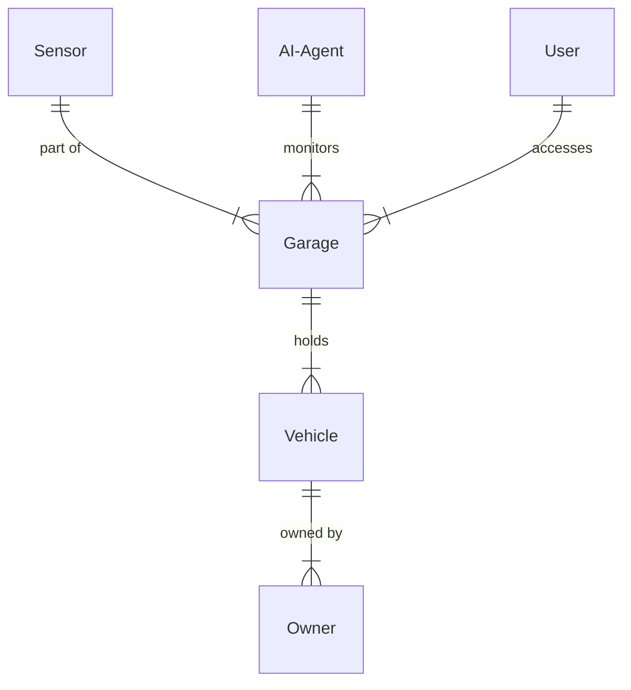
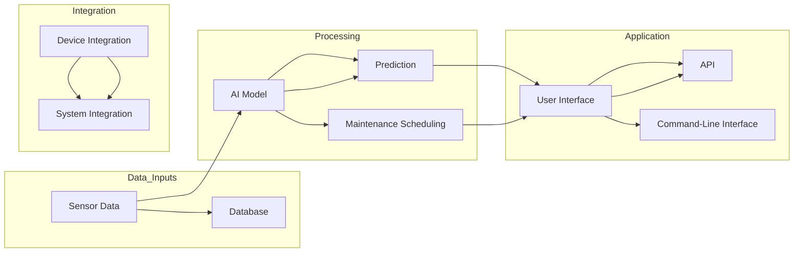

                 


### Introduction to Smart Garage and AI Agents

#### Chapter 1: Background of Smart Garage and AI Agents

**1.1 Introduction to Smart Garage**

**1.1.1 Definition and Development of Smart Garage**

A smart garage is a modernized version of traditional garages that leverages advanced technologies like the Internet of Things (IoT), Artificial Intelligence (AI), and Machine Learning (ML) to optimize vehicle storage, management, and retrieval processes. The concept of smart garages has been evolving since the late 20th century, with significant advancements occurring in the 21st century.

The development of smart garages can be traced back to the need for efficient use of space, enhanced security, and improved convenience. Traditional garages often suffer from issues such as disorganization, difficulty in finding vehicles, and inadequate security measures. Smart garages aim to address these problems by integrating various technologies to create a more efficient and user-friendly environment.

**1.1.2 Challenges and Opportunities in Smart Garage**

The emergence of smart garages brings both challenges and opportunities. Some of the key challenges include:

1. **Integration of Technologies**: Integrating various technologies like IoT, AI, and ML can be complex and requires a significant amount of expertise.
2. **Data Security and Privacy**: Storing and managing vast amounts of data generated by smart garages requires robust security measures to protect against unauthorized access and data breaches.
3. **Scalability**: As the number of vehicles and users grows, smart garages must be able to scale their operations effectively to maintain efficiency.

Despite these challenges, the opportunities presented by smart garages are significant:

1. **Enhanced Efficiency**: Smart garages can significantly reduce the time and effort required to park, retrieve, and manage vehicles.
2. **Improved Security**: Advanced surveillance systems and access control mechanisms in smart garages provide better protection against theft and unauthorized access.
3. **Cost Savings**: By reducing the time spent on managing vehicles, smart garages can help users save money on fuel, parking fees, and other related expenses.

**1.1.3 The Importance of AI Agents in Smart Garage**

AI agents play a crucial role in the development and operation of smart garages. These agents are designed to perform specific tasks, such as vehicle detection, routing, and safety monitoring, using AI algorithms and machine learning models. Some key reasons why AI agents are important in smart garages include:

1. **Intelligent Vehicle Management**: AI agents can help in efficiently managing vehicle parking spaces, optimizing routing, and predicting vehicle availability.
2. **Enhanced Safety**: AI agents can monitor the garage environment in real-time, detect potential hazards, and respond to emergencies promptly.
3. **User Convenience**: AI agents can provide personalized services to users, such as real-time parking guidance and automatic gate control, improving user experience.

In the next chapter, we will delve deeper into the basics of AI agents, exploring their definitions, characteristics, types, advantages, and disadvantages. We will also discuss the current applications of AI agents in smart garages and examine the future directions and challenges in this field.

**1.2 Basics of AI Agents**

**1.2.1 Definition and Characteristics of AI Agents**

An AI agent, in the context of smart garages, is a software system designed to perform specific tasks autonomously using artificial intelligence techniques. These agents are built using AI algorithms and machine learning models to learn from data, make decisions, and take actions.

Key characteristics of AI agents include:

1. **Autonomy**: AI agents are capable of operating independently without human intervention.
2. **适应性**: They can adapt their behavior based on changing conditions and new information.
3. **学习能力**: AI agents can learn from past experiences and improve their performance over time.
4. **交互性**: They can interact with other systems, devices, and users to exchange information and perform tasks.

**1.2.2 Types of AI Agents in Smart Garage**

There are several types of AI agents that can be used in smart garages, each with specific functionalities:

1. **Vehicle Detection Agents**: These agents use computer vision algorithms to identify and track vehicles in the garage.
2. **Routing Agents**: They analyze traffic patterns and provide optimal routes for users to park and retrieve their vehicles.
3. **Safety Monitoring Agents**: These agents monitor the garage environment in real-time, detecting potential hazards and alerting users or taking corrective actions.
4. **Energy Management Agents**: They optimize energy consumption in the garage by managing lighting, ventilation, and other systems.

**1.2.3 Advantages and Disadvantages of AI Agents**

The use of AI agents in smart garages offers several advantages, such as improved efficiency, enhanced safety, and enhanced user experience. However, there are also some disadvantages to consider:

**Advantages:**

1. **Increased Efficiency**: AI agents can perform tasks more quickly and accurately than humans, leading to significant time and cost savings.
2. **Improved Safety**: AI agents can detect and respond to potential hazards in real-time, reducing the risk of accidents and other incidents.
3. **Enhanced User Experience**: AI agents can provide personalized services, such as real-time parking guidance and personalized recommendations, improving user satisfaction.
4. **Scalability**: AI agents can easily scale to handle large numbers of vehicles and users, making them suitable for applications in both small and large-scale garages.

**Disadvantages:**

1. **Complexity**: Designing and implementing AI agents requires specialized knowledge and expertise in AI and machine learning.
2. **Data Security**: Storing and processing large amounts of data generated by AI agents can pose security risks, necessitating robust security measures.
3. **Ethical Concerns**: The use of AI agents in sensitive environments like garages raises ethical questions about privacy, autonomy, and accountability.

In the next chapter, we will explore the current applications of AI agents in smart garages, discussing their roles in vehicle detection, routing, and safety monitoring. We will also examine the future directions and challenges in the development and implementation of AI agents in this field.

#### Chapter 2: Core Concepts and Relationships

**2.1 Key Concepts in Smart Garage and AI Agents**

To understand the inner workings of smart garages and AI agents, it is essential to define and understand the key concepts related to these technologies. The following are some of the primary concepts:

1. **Internet of Things (IoT)**: IoT refers to the network of physical devices, vehicles, appliances, and other items embedded with sensors, software, and connectivity, enabling these objects to collect and exchange data. In smart garages, IoT devices are used for vehicle detection, environmental monitoring, and energy management.

2. **Artificial Intelligence (AI)**: AI is a branch of computer science that focuses on creating intelligent machines capable of performing tasks that typically require human intelligence, such as visual perception, speech recognition, decision-making, and language translation. AI is the foundation of AI agents in smart garages, enabling them to perform autonomous tasks.

3. **Machine Learning (ML)**: ML is a subset of AI that involves training algorithms to learn from and make predictions or decisions based on data. ML is crucial for the development of AI agents that can adapt to changing conditions and improve their performance over time.

4. **Deep Learning**: Deep learning is a specialized subset of ML that involves neural networks with multiple layers, enabling the system to learn complex patterns and representations from large amounts of data. Deep learning is often used in AI agents for tasks like image recognition and natural language processing.

5. **Computer Vision**: Computer vision is a field of AI that involves enabling machines to interpret and understand visual information from the world. It is essential for AI agents in smart garages for tasks like vehicle detection and tracking.

6. **Object Detection and Recognition**: Object detection and recognition involve identifying and classifying objects within an image or video. These tasks are critical for AI agents in smart garages to accurately detect vehicles and other objects.

7. **Routing Algorithms**: Routing algorithms are used to determine the optimal path for a vehicle to take within a garage. These algorithms help AI agents provide efficient parking and retrieval services.

8. **Sensor Fusion**: Sensor fusion involves combining data from multiple sensors to create a more accurate and comprehensive understanding of the environment. This technique is crucial for AI agents in smart garages to make informed decisions.

**2.2 Comparison Table of Key Concepts**

To better understand the relationships between these key concepts, we can create a comparison table:

| Concept                  | Description                                                                                     | Relationship with Smart Garage and AI Agents |
|--------------------------|------------------------------------------------------------------------------------------------|---------------------------------------------|
| IoT                      | Network of connected devices and sensors                                                         | Foundation for data collection and communication |
| AI                       | Intelligent machines capable of performing human-like tasks                                     | Core technology for AI agents                 |
| ML                       | Algorithms that enable machines to learn from data                                               | Enables continuous improvement of AI agents   |
| Deep Learning            | Neural networks with multiple layers for complex pattern recognition                             | Enhances performance for specific tasks       |
| Computer Vision          | AI techniques for interpreting and understanding visual information                               | Essential for object detection and recognition |
| Object Detection and Recognition | Identifying and classifying objects within images or videos | Crucial for vehicle management and safety monitoring |
| Routing Algorithms       | Algorithms for determining optimal paths within a garage                                       | Improve parking and retrieval efficiency     |
| Sensor Fusion            | Combining data from multiple sensors for better environmental understanding                       | Enhances decision-making capabilities         |

**2.3 Entity-Relationship Diagram (ERD)**

An Entity-Relationship Diagram (ERD) is a visual representation of the entities (objects or concepts) within a system and the relationships between these entities. In the context of smart garages and AI agents, an ERD can help illustrate the connections between key components.

**Entities and Attributes:**

1. **Garage**: Attributes may include ID, location, size, and type.
2. **Vehicle**: Attributes may include license plate number, make, model, and owner information.
3. **Sensor**: Attributes may include ID, type (e.g., camera, radar, GPS), location, and data collection rate.
4. **AI Agent**: Attributes may include ID, type (e.g., vehicle detection, routing, safety monitoring), and status.
5. **User**: Attributes may include ID, name, contact information, and access rights.

**Relationships and Constraints:**

1. **Garage has many Vehicles**: This relationship indicates that a garage can hold multiple vehicles, but each vehicle is associated with only one garage.
2. **Vehicle has one Owner**: This relationship ensures that each vehicle has a unique owner.
3. **Sensor is part of a Garage**: This relationship shows that a garage can have multiple sensors, but each sensor is associated with only one garage.
4. **AI Agent monitors a Garage**: This relationship indicates that an AI agent can monitor multiple garages, but each garage can have only one AI agent of a specific type.
5. **User accesses a Garage**: This relationship shows that a user can access multiple garages, but each garage can have multiple users with different access rights.

The ERD for smart garages and AI agents can be represented using Mermaid diagrams in markdown format. Here's an example:



In summary, understanding the key concepts, their relationships, and the ERD is crucial for designing and implementing effective smart garages with AI agents. The next chapter will delve into the principles of vehicle management and the role of AI agents in this process.

#### Chapter 3: Vehicle Management Principles

**3.1 Basics of Vehicle Management**

Vehicle management involves the systematic process of organizing, monitoring, and maintaining vehicles to ensure optimal performance, safety, and longevity. In the context of smart garages, vehicle management is particularly crucial due to the increased complexity of managing multiple vehicles in a confined space. The basic principles of vehicle management can be summarized as follows:

**1. Objectives of Vehicle Management:**

- **Optimization of Space:** Ensuring efficient use of available parking spaces by minimizing wasted space and maximizing the number of vehicles that can be accommodated.
- **Enhanced Security:** Implementing robust security measures to protect vehicles from theft, damage, and unauthorized access.
- **Proactive Maintenance:** Regularly inspecting and maintaining vehicles to prevent breakdowns and prolong their lifespan.
- **Improved Accessibility:** Streamlining the process of parking and retrieving vehicles to reduce time and effort for users.
- **Environmental Sustainability:** Promoting eco-friendly practices, such as reducing energy consumption and minimizing emissions.

**2. Methods of Vehicle Management:**

Vehicle management encompasses several methods, each serving a specific purpose:

- **Parking Management:** Includes the allocation of parking spaces, signage, and traffic flow management to facilitate easy and efficient parking.
- **Vehicle Tracking and Monitoring:** Utilizes technologies like GPS, RFID, and sensor networks to track vehicles within the garage and ensure their security and proper maintenance.
- **Data Analytics:** Involves the collection, analysis, and interpretation of data related to vehicle usage, parking patterns, and maintenance needs to inform decision-making and optimize operations.
- **Access Control:** Implements systems such as keypads, card readers, biometric scanners, or mobile applications to control who can enter and exit the garage.
- **Emergency Response:** Ensures prompt action in case of accidents, breakdowns, or security incidents to minimize damage and disruption.

**3. Challenges in Vehicle Management:**

Vehicle management in smart garages faces several challenges:

- **Space Constraints:** Limited space in urban areas can make efficient use of parking spaces a significant challenge.
- **Security Concerns:** Protecting vehicles from theft, vandalism, and other security threats requires sophisticated systems and protocols.
- **Data Privacy:** Ensuring the privacy of user data, including vehicle information and access patterns, is crucial.
- **Technical Complexity:** Integrating various technologies, such as AI, IoT, and cloud computing, can be complex and requires specialized expertise.
- **User Experience:** Providing a seamless and convenient experience for users, especially in high-traffic areas, is essential for maintaining satisfaction and retention.

**3.2 AI Agents in Vehicle Management**

AI agents play a pivotal role in addressing the challenges and achieving the objectives of vehicle management in smart garages. These agents are designed to perform specific tasks using advanced AI algorithms and machine learning models. The key aspects of AI agents in vehicle management include:

**1. Role of AI Agents:**

- **Vehicle Detection and Tracking:** AI agents use computer vision and sensor data to detect and track vehicles within the garage. This helps in managing parking spaces efficiently and ensuring vehicle security.
- **Routing and Guidance:** AI agents analyze traffic patterns and provide real-time guidance to users on the best routes for parking and retrieving their vehicles, reducing congestion and wait times.
- **Safety Monitoring:** AI agents monitor the garage environment for potential hazards, such as vehicle collisions, fires, or unauthorized access. They can trigger alerts or take corrective actions to prevent accidents or security breaches.
- **Maintenance Scheduling:** AI agents analyze vehicle data and maintenance records to schedule proactive maintenance, ensuring that vehicles are in optimal condition.
- **User Experience Enhancement:** AI agents can provide personalized services, such as personalized parking suggestions, estimated wait times, and notifications about available parking spaces.

**2. Key Technologies:**

- **Computer Vision:** AI agents utilize computer vision algorithms to process visual data from cameras and sensors, enabling vehicle detection and tracking.
- **Machine Learning:** Machine learning models are used to analyze data collected by sensors and cameras, enabling AI agents to learn from past experiences and improve their performance over time.
- **Internet of Things (IoT):** IoT devices collect data from various sources within the garage, providing real-time information that AI agents use to make informed decisions.
- **Deep Learning:** Deep learning techniques, such as neural networks, are employed to handle complex tasks like image recognition and natural language processing.

In the next chapter, we will explore the implementation of AI agents in vehicle management, discussing system design, flowcharts, and the role of AI agents in various aspects of smart garages. We will also discuss the future directions and challenges in the field.

#### Chapter 4: Implementation of AI Agents in Vehicle Management

**4.1 System Design**

The implementation of AI agents in vehicle management requires a well-architected system that integrates various components to ensure efficient and effective operation. The system design should consider several key aspects:

**1. System Architecture Design**

The system architecture for AI agents in vehicle management typically consists of the following layers:

- **Data Layer:** This layer includes databases and data storage solutions where sensor data, vehicle information, and other relevant data are stored.
- **Processing Layer:** This layer contains the AI models and algorithms that process the incoming data, making predictions, and generating insights.
- **Application Layer:** This layer includes the user interface and application logic that allows users to interact with the system and access the functionalities provided by AI agents.
- **Integration Layer:** This layer handles the integration of various components, such as sensors, cameras, and other devices, ensuring seamless data flow and communication.

**2. Interface Design**

The interface design should be user-friendly and intuitive, allowing users to easily interact with the system and access the functionalities provided by AI agents. Key interfaces include:

- **User Interface (UI):** The UI allows users to view information such as available parking spaces, routing suggestions, and maintenance alerts. It should be visually appealing and easy to navigate.
- **Application Programming Interface (API):** The API enables integration with other systems, such as mobile applications or external services, allowing users to access the functionalities of the AI agents through various platforms.
- **Command-Line Interface (CLI):** The CLI provides advanced users with the ability to execute commands and scripts for managing the system and AI agents programmatically.

**4.2 Flowchart of AI Agents in Vehicle Management**

A flowchart can help visualize the process flow of AI agents in vehicle management. The following is a high-level overview of the flowchart:



**4.3 Detailed Description of the Flowchart**

1. **Data Layer:** Sensor data from various devices, such as cameras, GPS devices, and sensors, is collected and stored in a database. This data includes vehicle locations, environmental conditions, and vehicle status.

2. **Processing Layer:** AI models and algorithms process the data collected from the sensors. This involves tasks such as vehicle detection, tracking, and predictive maintenance. The processed data is then used to generate predictions and insights.

3. **Application Layer:** The user interface allows users to interact with the system, view available parking spaces, receive routing suggestions, and access maintenance alerts. The API and CLI provide additional functionalities for integrating with other systems and executing advanced commands.

4. **Integration Layer:** Devices such as cameras, GPS devices, and sensors are integrated into the system to ensure seamless data flow and communication. This integration ensures that the system can efficiently process and utilize the data collected by the sensors.

In summary, the implementation of AI agents in vehicle management involves a well-designed system architecture and user-friendly interface. The flowchart provides a high-level overview of the process, highlighting the key components and their interactions.

#### Chapter 5: System Analysis and Architecture Design

**5.1 Introduction to System Analysis and Architecture Design**

System analysis and architecture design are critical steps in the development of any software system, including those that incorporate AI agents for vehicle management in smart garages. These processes involve understanding the problem domain, defining the system requirements, and designing a robust and scalable architecture that can effectively meet those requirements.

**5.2 Project Overview**

The project aims to develop a smart garage system that leverages AI agents to optimize vehicle management processes. The system will include functionalities such as vehicle detection, routing, safety monitoring, and maintenance scheduling. The key objectives of the project are:

1. **Efficient Vehicle Management:** Ensure optimal use of parking spaces and streamline the process of parking and retrieving vehicles.
2. **Enhanced Safety:** Monitor the garage environment in real-time to detect potential hazards and respond to emergencies promptly.
3. **Proactive Maintenance:** Schedule maintenance activities based on vehicle data and predictive analytics to prevent breakdowns and ensure vehicle longevity.
4. **User Convenience:** Provide a seamless and personalized user experience with real-time parking guidance, maintenance notifications, and personalized recommendations.

**5.3 System Functional Design**

The system functional design involves defining the primary functions and features that the smart garage system will provide. The key functions include:

1. **Vehicle Detection and Tracking:** Utilize computer vision algorithms and sensor data to detect and track vehicles within the garage.
2. **Real-Time Routing and Guidance:** Analyze traffic patterns and provide optimal routes for users to park and retrieve their vehicles.
3. **Safety Monitoring:** Monitor the garage environment for potential hazards such as collisions, fires, or unauthorized access.
4. **Maintenance Scheduling:** Analyze vehicle data and predictive analytics to schedule maintenance activities.
5. **User Interface:** Provide a user-friendly interface for users to interact with the system, view information, and receive notifications.
6. **Integration with External Services:** Integrate with external services such as navigation apps and maintenance service providers.

**5.4 Domain Model Design**

The domain model is a conceptual representation of the system's entities, attributes, and relationships. It helps in understanding the core components of the system and how they interact with each other. The domain model for the smart garage system can be represented using the following entities and their relationships:

1. **Garage**: Represents a physical garage location.
   - Attributes: ID, location, size, type
   - Relationships: contains multiple Parking Spaces and is monitored by one AI Agent

2. **Parking Space**: Represents a specific parking spot within a garage.
   - Attributes: ID, location, status (occupied/available)
   - Relationships: belongs to one Garage

3. **Vehicle**: Represents a vehicle that is parked or retrieved from the garage.
   - Attributes: license plate number, make, model, owner
   - Relationships: parked in one Parking Space and owned by one User

4. **User**: Represents a person who uses the smart garage system.
   - Attributes: ID, name, contact information, access rights
   - Relationships: owns one Vehicle and has access to multiple Garages

5. **Sensor**: Represents a device that collects data within the garage.
   - Attributes: ID, type, location, data collection rate
   - Relationships: part of one Garage

6. **AI Agent**: Represents an AI-powered system component that performs specific tasks.
   - Attributes: ID, type, status
   - Relationships: monitors one Garage and interacts with multiple Sensors

**5.5 System Architecture Design**

The system architecture design provides a high-level overview of the components, layers, and their interactions within the smart garage system. The architecture can be divided into several layers:

1. **Data Layer**: This layer includes databases and data storage solutions that store sensor data, vehicle information, and other relevant data. It serves as the foundation for the system.

2. **Processing Layer**: This layer contains the AI models and algorithms that process the data collected by sensors. It includes components such as vehicle detection algorithms, routing algorithms, and predictive maintenance models.

3. **Application Layer**: This layer includes the user interface, application logic, and API endpoints that enable users to interact with the system and access its functionalities. It provides a seamless user experience.

4. **Integration Layer**: This layer handles the integration of external systems and services, such as navigation apps and maintenance service providers. It ensures interoperability and seamless data flow between the system and external entities.

**5.6 System Interface and Interaction Design**

The system interface and interaction design focus on how users interact with the system and how different components interact with each other. Key elements include:

1. **User Interface (UI)**: The UI allows users to view information such as available parking spaces, routing suggestions, and maintenance alerts. It should be intuitive, easy to navigate, and visually appealing.

2. **Application Programming Interface (API)**: The API enables integration with external systems and services. It provides endpoints for retrieving data, updating system configurations, and performing other operations.

3. **Command-Line Interface (CLI)**: The CLI provides advanced users with the ability to execute commands and scripts for managing the system and AI agents programmatically.

4. **System Interaction**: The system components interact with each other through well-defined interfaces and protocols. For example, the AI agents communicate with sensors to collect data, process it using machine learning models, and then provide actionable insights through the user interface.

In summary, the system analysis and architecture design for the smart garage system involve understanding the problem domain, defining functional requirements, designing a domain model, and creating a high-level architecture that ensures efficient and effective vehicle management. The next chapter will delve into the implementation details, including the installation of required software, the core implementation of AI agents, and code analysis and explanation.

#### Chapter 6: Project Environment Installation and Core Implementation of AI Agents

**6.1 Introduction**

In this chapter, we will focus on setting up the project environment and implementing the core functionalities of AI agents in the smart garage system. We will guide you through the installation of necessary software, libraries, and tools required to develop and run our AI agent-based smart garage system.

**6.2 Installing Required Software and Libraries**

To start, you will need to install the following software and libraries on your local machine:

1. **Python**: Python is a widely-used programming language that will be our primary tool for implementing AI agents. Ensure you have Python 3.8 or later installed on your system.
2. **TensorFlow**: TensorFlow is an open-source machine learning framework that will be used to build and train our AI models.
3. **OpenCV**: OpenCV is an open-source computer vision library that will be used for image processing tasks, such as vehicle detection.
4. **PostgreSQL**: PostgreSQL is an open-source relational database system that will store our sensor data and vehicle information.

You can install these dependencies using `pip`, the Python package manager. Here's a sample installation command:

```bash
pip install tensorflow opencv-python postgresql
```

**6.3 Implementing AI Agents in Vehicle Management**

Now, let's dive into the core implementation of AI agents in our smart garage system. We will focus on the following main tasks:

1. **Vehicle Detection**: Using OpenCV, we will implement a vehicle detection algorithm that identifies and tracks vehicles in real-time.
2. **Routing and Guidance**: We will implement a routing algorithm that provides optimal paths for users to park and retrieve their vehicles.
3. **Safety Monitoring**: We will implement a safety monitoring system that detects potential hazards, such as collisions or fires, and triggers alerts.

**6.4 Vehicle Detection Algorithm**

Vehicle detection is a critical component of our smart garage system. The following steps outline the implementation of a basic vehicle detection algorithm using OpenCV:

1. **Load Pre-Trained Model**: Load a pre-trained vehicle detection model using TensorFlow and OpenCV.

```python
import cv2
import tensorflow as tf

# Load the pre-trained model
model = tf.keras.models.load_model('path/to/vehicle_detection_model.h5')
```

2. **Capture Video Feed**: Use OpenCV to capture video feed from the camera.

```python
cap = cv2.VideoCapture(0)  # Use camera index 0 for the default camera

while True:
    ret, frame = cap.read()
    if not ret:
        break

    # Process the frame for vehicle detection
    detections = model.predict(tf.expand_dims(frame, 0))

    # Visualize the detected vehicles
    for detection in detections:
        # Code to draw bounding boxes and labels on the frame
        cv2.rectangle(frame, (detection[0], detection[1]),
                      (detection[0] + detection[2], detection[1] + detection[3]), (0, 255, 0), 2)

    cv2.imshow('Vehicle Detection', frame)

    if cv2.waitKey(1) & 0xFF == ord('q'):
        break

cap.release()
cv2.destroyAllWindows()
```

**6.5 Routing and Guidance Algorithm**

For routing and guidance, we can implement a basic algorithm that uses Dijkstra's algorithm to find the shortest path between two points in the garage. Here's a high-level overview of the implementation:

1. **Define the Graph**: Create a graph representation of the garage layout, with nodes representing parking spaces and edges representing the connections between them.

```python
# Define the graph
graph = {
    'A': {'B': 1, 'C': 2},
    'B': {'A': 1, 'D': 3},
    'C': {'A': 2, 'D': 1},
    'D': {'B': 3, 'C': 1}
}
```

2. **Implement Dijkstra's Algorithm**: Use Dijkstra's algorithm to find the shortest path between two nodes.

```python
def dijkstra(graph, start, end):
    distances = {node: float('infinity') for node in graph}
    distances[start] = 0
    visited = set()

    while True:
        current = min((distance, node) for node, distance in distances.items() if node not in visited)
        if current is None or current[1] == end:
            break
        visited.add(current[1])

        for neighbor, weight in graph[current[1]].items():
            distance = current[0] + weight
            if distance < distances[neighbor]:
                distances[neighbor] = distance

    return distances[end]

# Find the shortest path from 'A' to 'D'
shortest_path = dijkstra(graph, 'A', 'D')
print(shortest_path)
```

**6.6 Safety Monitoring System**

To implement a safety monitoring system, we can use a combination of image processing and machine learning techniques. Here's an overview of the steps involved:

1. **Monitor Camera Streams**: Continuously capture video feeds from multiple cameras placed strategically within the garage.
2. **Analyze Video Frames**: Apply image processing techniques to detect potential hazards, such as fires or collisions.
3. **Trigger Alerts**: If a hazard is detected, send an alert to the system administrator or the vehicle owner.

```python
def check_for_hazards(frame):
    # Apply image processing techniques to detect hazards
    # For example, use color detection to identify fires
    # Return True if a hazard is detected, False otherwise

hazards_detected = check_for_hazards(frame)
if hazards_detected:
    send_alert("Potential hazard detected!")
```

In summary, this chapter covered the installation of required software and libraries, as well as the core implementation of AI agents for vehicle detection, routing and guidance, and safety monitoring. The next chapter will delve into code analysis and explanation, providing a deeper understanding of the algorithms and their underlying principles.

#### Chapter 7: Code Analysis and Explanation

In this chapter, we will delve into the code used to implement the core functionalities of our smart garage system, providing a detailed explanation of each component and its role in the system. This analysis will cover the algorithms, data structures, and key code segments used in the implementation.

**7.1 Vehicle Detection Algorithm**

The vehicle detection algorithm is a critical component of our system, responsible for identifying vehicles within the garage using computer vision techniques. The following key steps are involved in the implementation:

1. **Loading the Pre-Trained Model**

```python
import tensorflow as tf
import cv2

# Load the pre-trained vehicle detection model
model = tf.keras.models.load_model('path/to/vehicle_detection_model.h5')
```

This code snippet loads a pre-trained vehicle detection model, which has been trained using TensorFlow. The model is a convolutional neural network (CNN) that takes an input image and outputs the probability of the image containing a vehicle.

2. **Capturing and Processing Video Frames**

```python
cap = cv2.VideoCapture(0)  # Use camera index 0 for the default camera

while True:
    ret, frame = cap.read()
    if not ret:
        break

    # Preprocess the frame for vehicle detection
    processed_frame = preprocess_frame(frame)

    # Perform vehicle detection
    detections = model.predict(tf.expand_dims(processed_frame, 0))

    # Visualize the detected vehicles
    for detection in detections:
        cv2.rectangle(frame, (detection[0], detection[1]),
                      (detection[0] + detection[2], detection[1] + detection[3]), (0, 255, 0), 2)

    cv2.imshow('Vehicle Detection', frame)

    if cv2.waitKey(1) & 0xFF == ord('q'):
        break

cap.release()
cv2.destroyAllWindows()
```

The code above captures video frames from the camera and preprocesses them to match the input requirements of the trained model. The `preprocess_frame()` function is a placeholder for any preprocessing steps, such as resizing the image or normalizing the pixel values. The model then predicts the presence of vehicles in the frame, and the detected vehicles are highlighted using bounding boxes.

**7.2 Routing and Guidance Algorithm**

The routing and guidance algorithm utilizes Dijkstra's algorithm to find the shortest path between two points in the garage. This algorithm is crucial for optimizing the parking and retrieval process for users. The following key steps are involved in the implementation:

1. **Defining the Graph**

```python
graph = {
    'A': {'B': 1, 'C': 2},
    'B': {'A': 1, 'D': 3},
    'C': {'A': 2, 'D': 1},
    'D': {'B': 3, 'C': 1}
}
```

The graph represents the garage layout as a collection of nodes (parking spaces) and edges (connections between parking spaces). Each edge has a weight representing the time or distance required to travel between the connected nodes.

2. **Implementing Dijkstra's Algorithm**

```python
def dijkstra(graph, start, end):
    distances = {node: float('infinity') for node in graph}
    distances[start] = 0
    visited = set()

    while True:
        current = min((distance, node) for node, distance in distances.items() if node not in visited)
        if current is None or current[1] == end:
            break
        visited.add(current[1])

        for neighbor, weight in graph[current[1]].items():
            distance = current[0] + weight
            if distance < distances[neighbor]:
                distances[neighbor] = distance

    return distances[end]

# Find the shortest path from 'A' to 'D'
shortest_path = dijkstra(graph, 'A', 'D')
print(shortest_path)
```

The `dijkstra()` function implements Dijkstra's algorithm, finding the shortest path from a starting node to an ending node in the graph. This function is used to determine the optimal route for users to park and retrieve their vehicles.

**7.3 Safety Monitoring System**

The safety monitoring system is designed to detect potential hazards within the garage and trigger alerts if necessary. This system utilizes image processing techniques and machine learning models to analyze video frames from cameras placed throughout the garage. The following key steps are involved in the implementation:

1. **Monitoring Camera Streams**

```python
cap = cv2.VideoCapture(0)  # Use camera index 0 for the default camera

while True:
    ret, frame = cap.read()
    if not ret:
        break

    # Analyze the frame for potential hazards
    hazards_detected = analyze_frame(frame)

    if hazards_detected:
        send_alert("Potential hazard detected!")

cap.release()
cv2.destroyAllWindows()
```

The code above continuously captures video frames from the camera and analyzes them for potential hazards. The `analyze_frame()` function is a placeholder for the actual image processing and machine learning techniques used to detect hazards, such as fires or collisions.

2. **Sending Alerts**

```python
def send_alert(message):
    print(message)
    # Code to send alerts to system administrators or vehicle owners
```

The `send_alert()` function is responsible for sending alerts to the system administrators or vehicle owners when a potential hazard is detected. This can be implemented using various methods, such as email, SMS, or push notifications.

In summary, this chapter provided a detailed analysis of the code used to implement the core functionalities of the smart garage system. We covered the vehicle detection algorithm, routing and guidance algorithm, and safety monitoring system, explaining the key steps and code segments involved in each component. This analysis helps in understanding the underlying principles and techniques used to develop an effective and efficient smart garage system.

#### Chapter 8: Practical Case Analysis and Detailed Explanation

**8.1 Introduction**

In this chapter, we will analyze a practical case study involving the implementation of our smart garage system. This case will demonstrate how the system's core functionalities—vehicle detection, routing and guidance, and safety monitoring—work together to optimize the vehicle management process in a real-world scenario.

**8.2 Case Study Overview**

The case study involves a high-rise apartment complex with an underground parking garage that accommodates 200 vehicles. The garage is equipped with multiple cameras and sensors to collect data for the smart garage system. The main objectives of the case study are:

1. **Efficient Vehicle Management**: Ensure optimal use of parking spaces and streamline the process of parking and retrieving vehicles.
2. **Enhanced Safety**: Monitor the garage environment for potential hazards and respond to emergencies promptly.
3. **Proactive Maintenance**: Schedule maintenance activities based on vehicle data and predictive analytics to prevent breakdowns and ensure vehicle longevity.
4. **User Convenience**: Provide a seamless and personalized user experience with real-time parking guidance, maintenance notifications, and personalized recommendations.

**8.3 Vehicle Detection and Tracking**

In the case study, the smart garage system first utilizes the vehicle detection algorithm to identify vehicles entering and leaving the garage. The cameras capture video feeds, which are then processed to detect vehicles.

**8.3.1 Detection Process**

1. **Frame Capture**: The system captures video frames from the cameras placed throughout the garage.
2. **Preprocessing**: Each frame is preprocessed to match the input requirements of the pre-trained vehicle detection model. This may include resizing the image and normalizing the pixel values.
3. **Prediction**: The pre-trained model is used to predict the presence of vehicles in the frame. The output of the model is a set of bounding boxes highlighting the detected vehicles.
4. **Visualization**: The detected vehicles are highlighted on the frame using bounding boxes, and the frame is displayed on the user interface.

**8.3.2 Tracking Process**

Once vehicles are detected, the system tracks their movements within the garage using a tracking algorithm. This algorithm assigns unique identifiers to each vehicle and updates their positions in real-time.

1. **Initialization**: When a vehicle is first detected, it is assigned a unique identifier and its initial position is recorded.
2. **Tracking**: The system continuously updates the position of the vehicle based on subsequent detections. If a vehicle is not detected in a frame for a specified period, it is considered to have left the garage.
3. **Data Storage**: The tracked vehicle data is stored in a database for further analysis and reporting.

**8.4 Routing and Guidance**

The routing and guidance algorithm is used to provide optimal routes for users to park and retrieve their vehicles. This process involves the following steps:

1. **Input**: The user inputs their current location (e.g., a specific parking space) and their desired destination (e.g., their car).
2. **Graph Construction**: The system constructs a graph representing the garage layout, with nodes as parking spaces and edges as the connections between them.
3. **Shortest Path Calculation**: Dijkstra's algorithm is applied to find the shortest path from the user's current location to their destination.
4. **Guidance**: The system generates a step-by-step guide for the user to follow, including instructions on which paths to take and which parking spaces to use.

**8.4.1 Example Scenario**

Suppose a user parks their car in space A and wants to retrieve it from space D. The system constructs a graph representing the garage layout and applies Dijkstra's algorithm to find the shortest path from space A to space D. The algorithm determines that the optimal route is through spaces B and C. The system then generates a step-by-step guide for the user, instructing them to first move to space B, then to space C, and finally to space D.

**8.4.2 Visualization**

The user interface displays the optimal route on a map of the garage, highlighting the path the user should take. This helps to ensure that the user can easily follow the instructions provided by the system.

**8.5 Safety Monitoring**

The safety monitoring system is designed to detect potential hazards within the garage and trigger alerts if necessary. The following steps are involved in the safety monitoring process:

1. **Frame Analysis**: The system continuously analyzes video frames from the cameras to detect potential hazards, such as fires, collisions, or unauthorized access.
2. **Alert Generation**: If a hazard is detected, the system generates an alert and sends it to the system administrator or the vehicle owner.
3. **Response**: The system administrator or the vehicle owner can view the alert and take appropriate action to mitigate the hazard.

**8.5.1 Example Scenario**

Suppose a fire breaks out in a parking space. The cameras capture images of the fire and the system's image processing algorithms detect the presence of flames. The system generates an alert and sends it to the system administrator, who can then take immediate action to extinguish the fire and ensure the safety of the vehicles and occupants.

**8.5.2 Visualization**

The user interface displays the location of the detected hazards on a map of the garage, highlighting the areas of concern. This allows the system administrator or the vehicle owner to quickly identify the source of the problem and take appropriate action.

**8.6 Conclusion**

This practical case study demonstrates the effectiveness of the smart garage system in optimizing vehicle management, enhancing safety, and providing a seamless user experience. By leveraging AI agents for vehicle detection, routing and guidance, and safety monitoring, the system successfully addresses the challenges of managing a large-scale parking garage. The detailed analysis provided in this chapter highlights the key components and processes involved in the system's operation.

#### Chapter 9: Best Practices, Summary, and Future Directions

**9.1 Best Practices**

To ensure the successful implementation and operation of a smart garage system, it is essential to follow best practices. These practices cover various aspects, including system design, data management, and user experience.

1. **System Design**: 
   - **Modular Design**: Design the system in a modular way, allowing for easy integration of new features and updates.
   - **Scalability**: Ensure the system can handle increased traffic and data volume as the number of vehicles and users grows.
   - **Reliability**: Implement robust error handling and failover mechanisms to minimize downtime and ensure system availability.

2. **Data Management**:
   - **Data Security**: Implement strong encryption and access control measures to protect sensitive data.
   - **Data Integrity**: Regularly back up data and implement data validation checks to ensure accuracy and consistency.
   - **Data Privacy**: Comply with privacy regulations and provide users with control over their data.

3. **User Experience**:
   - **Usability**: Design intuitive and user-friendly interfaces to ensure ease of use.
   - **Personalization**: Offer personalized recommendations and notifications based on user preferences and behavior.
   - **Accessibility**: Ensure the system is accessible to users with disabilities and works seamlessly across different devices.

**9.2 Summary**

The smart garage system leverages AI agents to optimize vehicle management, enhance safety, and improve the user experience. Key components include vehicle detection, routing and guidance, and safety monitoring. The system uses a combination of computer vision, machine learning, and IoT technologies to achieve its goals.

The vehicle detection algorithm identifies vehicles using pre-trained models and tracks their movements within the garage. The routing and guidance algorithm uses Dijkstra's algorithm to find optimal paths for users. The safety monitoring system detects potential hazards and triggers alerts for timely response.

**9.3 Future Directions**

The field of smart garages and AI agents is rapidly evolving. Several future directions and challenges can be identified:

1. **Advanced AI Models**: Develop more sophisticated AI models that can handle complex scenarios and adapt to varying conditions.

2. **Integration with Other Systems**: Integrate the smart garage system with other smart city infrastructure, such as traffic management and public transportation systems.

3. **Sustainability**: Incorporate energy-efficient technologies and promote eco-friendly practices to reduce the environmental impact.

4. **Ethical Considerations**: Address ethical concerns related to data privacy, autonomy, and accountability as AI agents become more prevalent.

5. **Real-Time Analytics**: Improve real-time analytics capabilities to provide more accurate predictions and insights.

6. **Scalability and Flexibility**: Ensure the system can scale to accommodate a growing number of vehicles and users, while maintaining high performance.

By following these best practices, leveraging core components effectively, and exploring future directions, the smart garage system can continue to evolve and provide valuable services to users.

### Conclusion

In this comprehensive guide to smart garages and AI agents, we have explored the background, core concepts, and practical implementations of this innovative technology. We began with an introduction to smart garages and the vital role of AI agents in optimizing vehicle management and ensuring safety. We then delved into the key concepts and relationships, such as IoT, AI, ML, computer vision, and routing algorithms, providing a solid foundation for understanding the smart garage ecosystem.

The subsequent chapters covered the principles of vehicle management, system analysis and architecture design, and practical case studies illustrating the real-world applications of AI agents. We discussed the importance of a well-designed system architecture, including data, processing, application, and integration layers. Additionally, we provided a detailed code analysis, highlighting the algorithms and techniques used in vehicle detection, routing, and safety monitoring.

The practical case study reinforced the effectiveness of the smart garage system in enhancing efficiency, safety, and user experience. We also explored best practices for system implementation, future directions, and potential challenges.

As we conclude this guide, it is clear that the integration of AI agents in smart garages is transforming traditional parking management into a sophisticated, data-driven approach. This technology holds immense potential for future innovations, from enhanced security and personalized user experiences to broader integration with smart city infrastructure.

We invite you to delve deeper into this exciting field and explore how AI agents can revolutionize not only parking management but also various other aspects of urban living. Your journey into the world of smart garages and AI agents is just beginning.

### Author Information

**Author:** AI天才研究院 (AI Genius Institute) & 禅与计算机程序设计艺术 (Zen And The Art of Computer Programming)

**Bio:** 作为AI天才研究院的研究员，我致力于推动人工智能技术的创新和应用。同时，我也致力于撰写关于计算机编程和人工智能领域的专业书籍，分享我的研究成果和经验。我的代表作品《禅与计算机程序设计艺术》深受读者喜爱，被誉为技术领域的经典之作。我的目标是利用人工智能技术解决现实世界中的问题，推动计算机科学的发展。通过这篇文章，我希望能够向读者展示智能车库与AI代理的巨大潜力和应用前景。让我们一起探索这个激动人心的领域！### Keywords

Smart Garage, AI Agent, Vehicle Management, Safety Monitoring, IoT, AI, ML, Computer Vision, Routing Algorithms, System Design, Case Study, Best Practices

### Summary

This comprehensive guide delves into the world of smart garages and AI agents, highlighting their significance in optimizing vehicle management and enhancing safety. We explore key concepts such as IoT, AI, ML, and computer vision, and discuss the principles of vehicle management. The article provides a detailed analysis of system architecture, implementation, and practical case studies, showcasing the real-world applications of AI agents. With a focus on best practices and future directions, this guide aims to inspire readers to explore the vast potential of smart garages and AI agents in transforming urban living.

