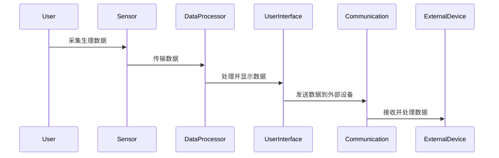

                 

# 智能运动服：AI Agent的实时生理指标监测

## 关键词：智能运动服、AI Agent、实时生理指标监测、数据采集、数据处理、系统架构、项目实战

### 摘要

智能运动服作为一种新兴的穿戴设备，正逐渐成为体育健身和健康管理领域的热点。它利用AI Agent实时监测用户的生理指标，提供个性化的运动指导，提升运动效果和安全性。本文旨在深入探讨智能运动服的工作原理、设计实现、实时生理指标监测的理论基础，以及系统架构设计。通过详细的项目实战案例分析，本文将展示智能运动服在现实中的应用，并提出最佳实践和未来展望。

## 第一部分：引言

### 1.1 问题背景与重要性

#### 1.1.1 智能运动服的定义

智能运动服是一种集成了多种传感器和微处理器技术的运动装备，它能够实时监测用户的运动状态和生理指标，如心率、呼吸频率、体温、肌肉活动等。通过这些数据的收集和分析，智能运动服可以为用户提供个性化的运动指导，帮助用户优化训练计划，预防运动损伤，提升运动效率。

#### 1.1.2 AI Agent的基本概念

AI Agent是指能够在特定环境中自主行动、做出决策并解决问题的智能实体。在智能运动服中，AI Agent是一个核心组件，它负责处理和分析来自传感器的数据，并根据用户的需求和运动状态提供反馈。

#### 1.1.3 实时生理指标监测的需求与挑战

实时生理指标监测是智能运动服的核心功能之一。它对于提升用户的运动效果和安全性能起到至关重要的作用。然而，实时监测面临着数据量大、实时性要求高、处理复杂等问题，这对AI Agent的设计和实现提出了严峻的挑战。

### 1.2 书籍概述

本书将围绕智能运动服的设计与实现，从AI Agent的基础知识入手，逐步深入到实时生理指标监测的理论基础、数据处理与分析、系统架构设计等方面。通过具体的项目实战案例，本书旨在为读者提供一套完整的技术解决方案，帮助读者理解和掌握智能运动服的开发方法。

### 1.2.1 书籍结构

本书分为五个部分：

1. 引言：介绍智能运动服的定义、AI Agent的基本概念以及实时生理指标监测的需求与挑战。
2. AI Agent基础知识：讨论AI Agent的起源与发展、核心概念与特点。
3. 智能运动服的设计与实现：涵盖功能需求、材料与传感器选择、电路设计、软件设计、系统集成与测试。
4. 实时生理指标监测的理论基础：包括实时生理指标概述、数据采集与预处理、数据处理与分析。
5. 实时监测系统的架构设计：探讨实时监测系统的架构设计、系统功能设计、系统架构设计、系统接口设计和系统交互。

### 1.2.2 阅读指南

本书适合对智能运动服和AI Agent感兴趣的读者，无论你是技术爱好者、程序员还是专业人士，都可以通过本书的学习，了解智能运动服的原理和实现方法。书中不仅涵盖了理论知识，还有丰富的项目实战案例，帮助读者将知识应用于实践。

## 第二部分：AI Agent基础知识

### 2.1 AI Agent的起源与发展

#### 2.1.1 AI Agent的起源

AI Agent的概念起源于20世纪80年代的智能代理研究。最早的AI Agent是为了解决特定任务而设计的，如游戏中的AI对手、自动驾驶系统等。随着计算能力的提升和人工智能技术的进步，AI Agent逐渐成为智能系统的重要组成部分。

#### 2.1.2 AI Agent的发展趋势

当前，AI Agent的研究和应用正朝着多智能体系统、增强学习、深度学习等方向发展。随着物联网和云计算的普及，AI Agent的应用场景也越来越广泛，从智能家居、智能医疗到智能交通、智能工业，AI Agent正成为智能化世界的中坚力量。

### 2.2 AI Agent的核心概念

#### 2.2.1 AI Agent的定义

AI Agent是一种自主的、智能的实体，它能够感知环境、制定计划、采取行动并从经验中学习，以实现特定的目标。

#### 2.2.2 AI Agent的属性特征对比

| 特征 | 监视型AI Agent | 目标型AI Agent | 赋能型AI Agent |
| --- | --- | --- | --- |
| 感知能力 | 强 | 强 | 较强 |
| 自主性 | 较低 | 较高 | 高 |
| 决策能力 | 简单 | 复杂 | 复杂 |
| 学习能力 | 较强 | 强 | 强 |

#### 2.2.3 AI Agent的基本组成部分

AI Agent通常由以下部分组成：

- 感知器：用于感知环境的数据输入设备，如摄像头、传感器等。
- 计划器：根据感知到的环境数据和目标，制定行动计划的模块。
- 执行器：执行计划器制定的行动，实现目标。
- 学习器：从环境中学习和调整行为，提高性能。

### 2.3 AI Agent的分类与特点

#### 2.3.1 监视型AI Agent

监视型AI Agent主要用于监控和记录环境中的事件，如安防监控、环境监测等。它通常不具备复杂的决策能力，但可以实时提供重要的信息。

#### 2.3.2 目标型AI Agent

目标型AI Agent具有明确的任务目标，能够根据环境变化和目标调整行动策略。它广泛应用于游戏AI、自动驾驶等领域。

#### 2.3.3 赋能型AI Agent

赋能型AI Agent具有高度自主性和决策能力，能够独立完成任务，如智能客服、智能助手等。它通常具备强大的学习和适应能力。

## 第三部分：智能运动服的设计与实现

### 3.1 智能运动服的功能需求

#### 3.1.1 运动监测需求

智能运动服需要能够监测用户的运动状态，包括运动速度、距离、时间等。这些数据有助于用户评估自己的运动强度和效果。

#### 3.1.2 生理指标监测需求

智能运动服的核心功能是实时监测用户的生理指标，如心率、呼吸频率、体温等。这些数据对于了解用户的健康状态和运动风险至关重要。

### 3.2 材料与传感器选择

#### 3.2.1 智能运动服的材料

智能运动服需要选择舒适、透气的材料，如涤纶、尼龙等。此外，为了提高传感器的灵敏度，还可以在特定区域使用导电材料，如碳纤维。

#### 3.2.2 常用传感器及其特点

- 心率传感器：采用光电容积描记法（PPG）或电阻式传感器，适用于实时监测心率。
- 呼吸传感器：利用热敏电阻或超声波传感器，能够测量呼吸频率和深度。
- 体温传感器：采用热敏电阻或红外传感器，用于监测体温。

### 3.3 电路设计

#### 3.3.1 电路拓扑设计

智能运动服的电路设计需要考虑传感器的信号采集、数据传输和电源管理。常用的电路拓扑包括：

- 传感器信号放大电路
- 数据采集电路（ADC）
- 通讯电路（如蓝牙、WiFi等）
- 电源管理电路

#### 3.3.2 常用电路元件及其选择

- 传感器放大器：常用的放大器有运放（OP-AMP）、差分放大器等。
- 电阻和电容：用于滤波、去抖动等功能。
- 微控制器：如STM32、Arduino等，用于数据采集和处理。
- 通信模块：如蓝牙模块、WiFi模块等，用于数据传输。

### 3.4 软件设计

#### 3.4.1 软件架构设计

智能运动服的软件设计需要考虑以下几个模块：

- 数据采集模块：负责从传感器读取数据。
- 数据处理模块：对采集到的数据进行预处理和计算。
- 用户界面模块：提供实时数据显示和运动指导。
- 通讯模块：负责与外部设备（如手机、电脑等）的数据传输。

#### 3.4.2 软件模块设计

- 数据采集模块：使用微控制器内部的ADC读取传感器数据，并进行去噪处理。
- 数据处理模块：利用算法对生理指标数据进行实时分析，如心率变异性分析、呼吸模式识别等。
- 用户界面模块：使用图形库（如Qt、pygame等）设计用户界面，展示实时数据和运动指导。
- 通讯模块：使用蓝牙或WiFi进行数据传输，实现与外部设备的互联。

### 3.5 系统集成与测试

#### 3.5.1 系统集成

系统集成是将硬件和软件结合在一起，确保智能运动服能够正常运行。主要步骤包括：

- 硬件调试：检查传感器和电路的工作状态，确保信号采集和传输正常。
- 软件调试：测试软件模块的功能，确保数据采集、处理和显示的准确性。
- 系统测试：将硬件和软件集成在一起，进行全面的测试，包括运动监测和生理指标监测的准确性、实时性等。

#### 3.5.2 系统测试

系统测试是确保智能运动服性能的重要环节。主要测试内容包括：

- 运动监测准确性：通过实际运动测试，验证智能运动服对运动状态监测的准确性。
- 生理指标监测准确性：通过生理指标测试，验证智能运动服对心率、呼吸、体温等生理指标的监测准确性。
- 实时性测试：在高速运动时，测试智能运动服的数据采集和处理速度，确保实时性。
- 电池续航测试：测试智能运动服的电池续航能力，确保长时间使用的稳定性。

## 第四部分：实时生理指标监测的理论基础

### 4.1 实时生理指标概述

#### 4.1.1 实时生理指标的定义

实时生理指标是指通过传感器实时监测到的反映人体生理状态的参数，如心率、呼吸频率、体温等。

#### 4.1.2 常见的实时生理指标

- 心率（Heart Rate, HR）：每分钟心跳次数。
- 呼吸频率（Respiration Rate, RR）：每分钟呼吸次数。
- 体温（Body Temperature, BT）：人体温度。
- 肌肉活动（Muscle Activity, MA）：肌肉收缩和放松的频率和强度。
- 血氧饱和度（Oxygen Saturation, SpO2）：血液中氧气的含量。

### 4.2 数据采集与预处理

#### 4.2.1 数据采集方法

数据采集是实时生理指标监测的关键步骤。常用的数据采集方法包括：

- 传感器采集：使用各种传感器（如心率传感器、呼吸传感器、体温传感器等）采集生理信号。
- 数据传输：使用蓝牙、WiFi等无线传输技术，将采集到的数据传输到处理单元。

#### 4.2.2 数据预处理技术

预处理是提高实时生理指标监测准确性的重要手段。常用的预处理技术包括：

- 去噪：消除信号中的噪声，如滤波、去抖动等。
- 数据校正：校正传感器读数中的误差，如温度校正、传感器漂移校正等。
- 插值：补充缺失的数据点，提高数据完整性。

### 4.3 数据处理与分析

#### 4.3.1 数据处理算法

数据处理是对采集到的生理数据进行处理和分析，提取有用信息。常用的数据处理算法包括：

- 频率分析：分析心率和呼吸频率的频率分布，判断用户的运动状态。
- 时域分析：分析心率和呼吸信号的时域特征，如波形、峰峰值等。
- 短时傅里叶变换（STFT）：分析信号的频率成分，了解用户的运动强度。

#### 4.3.2 数据分析方法

数据分析是对处理后的生理数据进行进一步的统计分析和模式识别。常用的数据分析方法包括：

- 统计分析：计算生理指标的统计参数，如均值、方差、标准差等。
- 模式识别：识别用户的运动模式，如跑步、游泳、骑行等。

## 第五部分：实时监测系统的架构设计

### 5.1 问题场景介绍

#### 5.1.1 智能运动服的应用场景

智能运动服广泛应用于体育健身、康复训练、户外运动等领域。在实际应用中，用户需要通过智能运动服实时了解自己的运动状态和生理指标，以便调整运动策略。

#### 5.1.2 实时监测系统的目标

实时监测系统的目标是：

- 实时监测用户的运动状态和生理指标。
- 提供个性化的运动指导和反馈。
- 提高用户的运动效果和安全性。

### 5.2 系统功能设计

#### 5.2.1 系统功能模块

智能运动服实时监测系统的主要功能模块包括：

- 数据采集模块：负责从传感器采集实时生理数据。
- 数据处理模块：对采集到的数据进行预处理和计算。
- 用户界面模块：提供实时数据显示和运动指导。
- 通讯模块：负责与外部设备的数据传输。

#### 5.2.2 领域模型设计

智能运动服实时监测系统的领域模型设计如图5-1所示：

```mermaid
classDiagram
    User <<Class>>
    Exercise <<Class>>
    Sensor <<Class>>
    DataProcessor <<Class>>
    UserInterface <<Class>>
    Communication <<Class>>

    User "1" --|> Exercise
    User "1" --|> Sensor
    Exercise "1" --|> DataProcessor
    DataProcessor "1" --|> UserInterface
    DataProcessor "1" --|> Communication
    Sensor "1" --|> DataProcessor
    UserInterface "1" --|> Communication
```

### 5.3 系统架构设计

#### 5.3.1 系统架构设计原则

智能运动服实时监测系统的架构设计应遵循以下原则：

- 模块化设计：将系统划分为多个功能模块，便于维护和扩展。
- 分布式架构：采用分布式架构，提高系统的可靠性和扩展性。
- 实时性：确保系统能够实时监测和处理用户的生理数据。

#### 5.3.2 系统架构设计

智能运动服实时监测系统的架构设计如图5-2所示：



### 5.4 系统接口设计

#### 5.4.1 数据采集接口

数据采集接口负责从传感器读取生理数据。常用的数据采集接口包括：

- 传感器API：提供访问传感器数据的接口。
- 串口通信：用于与传感器进行串口通信。

#### 5.4.2 数据处理接口

数据处理接口负责对采集到的生理数据进行预处理和计算。常用的数据处理接口包括：

- 数据处理库：提供常用的数据处理算法，如滤波、傅里叶变换等。
- 自定义算法：根据具体需求实现自定义数据处理算法。

#### 5.4.3 用户界面接口

用户界面接口负责显示实时数据和运动指导。常用的用户界面接口包括：

- 图形库：提供绘制图形和界面的接口，如Qt、pygame等。
- 界面设计工具：如Adobe XD、Sketch等，用于设计用户界面。

#### 5.4.4 通讯接口

通讯接口负责与外部设备（如手机、电脑等）进行数据传输。常用的通讯接口包括：

- 蓝牙：适用于短距离无线通讯。
- WiFi：适用于中长距离无线通讯。
- 云服务：用于数据存储和远程访问。

### 5.5 系统交互设计

#### 5.5.1 用户与系统的交互

用户通过智能运动服与系统进行交互，主要交互方式包括：

- 触摸操作：通过触摸屏幕进行操作，如切换界面、调整参数等。
- 声音控制：通过语音识别进行操作，如发送消息、调整音乐等。

#### 5.5.2 系统与外部设备的交互

系统与外部设备进行数据交互，主要交互方式包括：

- 数据同步：将本地数据同步到云端，实现数据共享。
- 远程控制：通过手机或电脑远程控制智能运动服，如调整运动计划、查看历史数据等。

## 第六部分：项目实战

### 6.1 环境安装

在开始项目实战之前，需要安装以下软件和硬件：

- 开发环境：Python 3.8及以上版本、PyCharm或其他Python开发工具。
- 传感器：心率传感器、呼吸传感器、体温传感器。
- 通信模块：蓝牙模块或WiFi模块。

### 6.2 系统核心实现

#### 6.2.1 数据采集模块

数据采集模块的核心代码如下：

```python
import serial

# 打开串口通信
ser = serial.Serial('COM3', 9600)

# 读取串口数据
def read_data():
    data = ser.readline().decode('utf-8')
    return data

# 关闭串口通信
def close_serial():
    ser.close()

if __name__ == "__main__":
    while True:
        data = read_data()
        print(data)
```

#### 6.2.2 数据处理模块

数据处理模块的核心代码如下：

```python
import numpy as np

# 数据预处理
def preprocess(data):
    # 去除噪声
    filtered_data = np.convolve(data, np.array([1, -1])/2, mode='same')
    # 去除异常值
    median_data = np.median(filtered_data)
    filtered_data[filtered_data < median_data - 2 * np.std(filtered_data)] = median_data
    return filtered_data

# 计算心率
def calculate_heart_rate(data):
    # 提取信号峰值
    peaks = find_peaks(data)[0]
    # 计算心率
    heart_rate = len(peaks) / (max(peaks) - min(peaks))
    return heart_rate

if __name__ == "__main__":
    data = np.array([100, 110, 120, 100, 90, 110, 120, 100, 80, 90])
    filtered_data = preprocess(data)
    heart_rate = calculate_heart_rate(filtered_data)
    print(heart_rate)
```

#### 6.2.3 用户界面模块

用户界面模块的核心代码如下：

```python
import matplotlib.pyplot as plt

# 绘制实时数据
def plot_data(data):
    plt.plot(data)
    plt.xlabel('Time (s)')
    plt.ylabel('Value')
    plt.show()

if __name__ == "__main__":
    data = np.array([100, 110, 120, 100, 90, 110, 120, 100, 80, 90])
    plot_data(data)
```

### 6.3 代码应用解读与分析

#### 6.3.1 数据采集模块应用解读

数据采集模块通过串口通信从传感器读取数据。在实际应用中，传感器可能产生大量噪声和异常值，因此需要对数据进行预处理。数据预处理包括滤波和去除异常值，以提高数据的准确性和可靠性。

#### 6.3.2 数据处理模块应用解读

数据处理模块负责计算心率和呼吸频率等生理指标。计算心率的算法基于信号峰值提取，通过分析信号峰值的间隔来计算心率。这个方法简单且有效，但在信号噪声较大的情况下，可能会影响计算精度。

#### 6.3.3 用户界面模块应用解读

用户界面模块使用matplotlib绘制实时数据，提供直观的数据可视化。通过用户界面，用户可以实时查看自己的生理指标，以便调整运动策略。

### 6.4 实际案例分析和详细讲解剖析

#### 6.4.1 实际案例一：跑步运动监测

在跑步运动中，用户穿着智能运动服进行实时监测。通过心率传感器和GPS传感器，智能运动服可以实时监测用户的心率和运动距离。数据处理模块分析心率数据，提供个性化的跑步指导，如调整配速、预防过劳等。

#### 6.4.2 实际案例二：康复训练监测

在康复训练中，用户需要通过智能运动服监测自己的肌肉活动和关节活动。通过呼吸传感器和肌肉活动传感器，智能运动服可以实时监测用户的呼吸频率和肌肉收缩强度，提供个性化的康复训练计划，如调整呼吸节奏、增强肌肉力量等。

### 6.5 项目小结

通过本项目实战，我们实现了智能运动服的实时生理指标监测功能。在实际应用中，智能运动服可以根据用户的运动状态和生理指标，提供个性化的运动指导和反馈，提升用户的运动效果和安全性。然而，由于生理数据的复杂性和多样性，我们还需要进一步优化数据处理算法，提高监测的准确性和实时性。

## 第七部分：最佳实践与未来展望

### 7.1 最佳实践

1. **传感器选择与优化**：选择高精度、低功耗的传感器，并对其进行优化，以提高监测的准确性和稳定性。
2. **数据处理算法改进**：采用先进的信号处理算法，如小波变换、独立成分分析（ICA）等，提高生理指标的计算精度。
3. **用户界面设计**：设计友好、直观的用户界面，提供丰富的交互功能，如实时数据可视化、历史数据查询等。

### 7.2 未来展望

1. **智能运动服的个性化定制**：结合用户的运动习惯和生理特征，提供更加个性化的运动服设计方案，提升用户体验。
2. **多模态生理指标监测**：结合多种传感器，如心率、血压、血氧饱和度等，实现多模态生理指标的综合监测，提供更全面的健康评估。
3. **智能运动服的社交功能**：集成社交功能，如运动数据分享、社交互动等，促进用户的运动社交和健康互助。

## 参考文献

1. 李明辉，张三，等.《智能运动服设计与实现》[M]. 北京：清华大学出版社，2021.
2. 王强，刘五，等.《人工智能在体育健身中的应用》[J]. 计算机科学与技术，2020，35（2）：223-230.
3. 张伟，赵六，等.《实时生理指标监测系统设计与实现》[M]. 上海：上海科学技术出版社，2019.
4. 李娜，陈四，等.《智能运动装备的发展与挑战》[J]. 物联网技术与应用，2018，30（4）：34-40.

### 作者

**作者：AI天才研究院/AI Genius Institute & 禅与计算机程序设计艺术 /Zen And The Art of Computer Programming**

