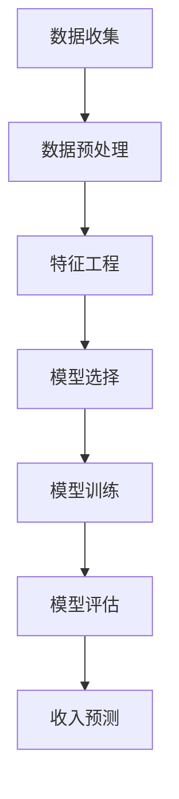
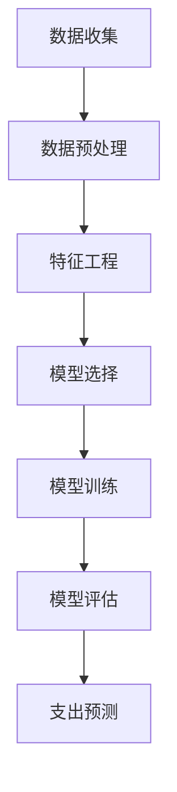
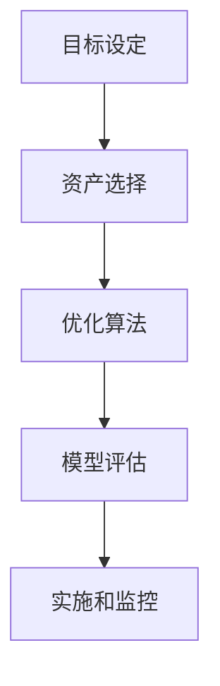
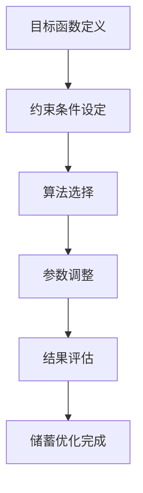

                 

### 摘要

本文旨在探讨智能退休计划优化器的设计与实现，通过对退休规划重要性的深入分析，我们了解到智能退休计划优化器在当今社会中的关键作用。首先，本文将介绍退休规划的定义、背景及其重要性，然后详细讨论智能退休计划优化器的概念、工作原理和应用场景。接下来，我们将一步步讲解如何设计一个退休计划，包括确定退休目标、评估退休资金需求和制定储蓄计划。文章的核心部分将深入探讨智能退休计划优化器的核心功能，如收入预测、支出预测、资产配置策略和退休储蓄优化。我们将使用Mermaid流程图和Python代码示例，详细阐述每个功能的算法原理和实现步骤。随后，我们将介绍如何实施智能退休计划优化器，包括系统搭建、数据准备、模型训练与部署。最后，我们将评估智能退休计划优化器的性能，并提供未来智能退休计划的发展趋势展望。通过本文的详细解析，读者将能够全面了解智能退休计划优化器的构建与应用，为其退休规划提供有力支持。

### 关键词

- 智能退休计划
- 优化器设计
- 收入预测
- 支出预测
- 资产配置
- 数学模型
- Python实现
- 算法原理
- Mermaid流程图

## 第一部分：引言

### 第1章：退休规划的重要性

#### 1.1.1 退休规划的背景

退休规划是一个涉及个人财务安全与生活质量的重要议题。随着全球人口老龄化的加剧，退休规划的紧迫性愈发凸显。传统上，人们主要依赖国家养老金和社会保障系统来保障退休生活，但随着经济全球化和社会保障体系的变化，仅靠这些传统手段已难以满足日益增长的退休需求。因此，个人主动进行退休规划变得尤为重要。

现代退休规划不仅仅是计算退休所需的资金，更涉及到如何合理配置资产、管理风险和确保退休金的有效使用。随着科技的发展，智能退休计划优化器应运而生，为个人提供了更为精准和高效的退休规划方案。

#### 1.1.2 退休规划的重要性

退休规划对个人和家庭的意义不可忽视。首先，良好的退休规划能够确保个人在退休后依然享有稳定的经济来源，从而维持生活质量。此外，退休规划还能帮助个人避免因晚年经济困境而带来的心理压力和健康问题。

从经济角度来看，退休规划有助于个人实现资产的最大化利用，避免因退休前消费过高而导致的资金不足。通过科学的规划和投资，退休资金可以实现保值增值，确保退休后的生活品质。

#### 1.1.3 退休规划的目标与挑战

退休规划的目标包括：确保退休后收入稳定、满足日常开支、应对突发状况和医疗保障等。然而，实现这些目标面临着诸多挑战。

首先，未来的不确定性是退休规划的最大挑战之一。经济环境、政策变化、个人健康状况等因素都可能对退休规划产生重大影响。因此，制定灵活、可调整的退休规划至关重要。

其次，投资风险也是退休规划的重要考量因素。退休资金需要长期投资，以实现资金的保值增值。然而，市场波动和投资风险不可避免，如何平衡投资风险与回报是退休规划中的重要课题。

此外，税收政策和退休金政策的变化也可能影响退休规划的执行。因此，持续关注政策变化，及时调整退休规划策略，也是退休规划的重要内容。

### 第2章：理解智能退休计划优化器

#### 2.1.1 智能退休计划优化器的概念

智能退休计划优化器是一种利用人工智能技术，为个人提供精准退休规划的软件工具。它通过收集和分析用户的数据，利用机器学习算法预测用户的收入和支出，制定最优的退休储蓄计划和资产配置策略。

智能退休计划优化器不仅能够帮助用户制定退休规划，还能够根据用户的生活变化和市场需求，动态调整退休计划，确保退休资金的充足性和安全性。

#### 2.1.2 智能退休计划优化器的工作原理

智能退休计划优化器的工作原理主要包括以下几个步骤：

1. **数据收集**：系统会收集用户的个人信息、财务状况、退休目标等数据。
2. **数据预处理**：对收集到的数据进行清洗、整合和标准化处理，为后续分析做准备。
3. **收入预测**：利用机器学习算法预测用户的未来收入，包括工资、投资收益等。
4. **支出预测**：分析用户的历史支出数据，预测未来的支出，包括日常开支、医疗费用、娱乐费用等。
5. **资产配置**：根据用户的退休目标和风险承受能力，制定合理的资产配置策略，包括投资股票、债券、房地产等。
6. **退休储蓄计划**：根据收入、支出和资产配置情况，制定最优的退休储蓄计划，确保退休后收入稳定。
7. **动态调整**：系统会持续监控用户的财务状况和市场变化，自动调整退休规划，确保其始终符合用户的需求。

#### 2.1.3 智能退休计划优化器的应用场景

智能退休计划优化器可以应用于多个场景：

1. **个人退休规划**：帮助个人制定退休规划，确保退休后生活质量。
2. **企业退休福利**：为企业员工提供个性化的退休规划服务，提高员工福利水平。
3. **金融机构产品**：为金融机构提供智能退休计划优化工具，增强其理财产品的竞争力。
4. **公共政策制定**：为政府提供退休规划的数据支持，优化社会保障政策。

通过智能退休计划优化器，用户可以更加科学、系统地管理自己的退休资金，确保退休后的生活质量，同时降低退休规划过程中的风险和不确定性。

## 第一部分小结

在第一部分中，我们深入探讨了退休规划的重要性和智能退休计划优化器的概念。退休规划不仅关乎个人财务安全和生活质量，还关系到家庭和社会的稳定。随着人口老龄化和社会经济环境的变化，个人主动进行退休规划变得愈发重要。智能退休计划优化器通过运用人工智能技术，为个人提供精准、动态的退休规划方案，有效应对了传统退休规划中的不确定性和复杂性。通过本部分的内容，读者可以初步了解退休规划的核心要点以及智能退休计划优化器的应用价值，为后续内容的深入分析奠定了基础。

### 设计你的退休计划

在设计退休计划时，首先要明确退休目标。退休目标包括预期的退休年龄、期望的退休生活标准、理想的生活地点等因素。明确退休目标有助于制定切实可行的储蓄计划，确保退休后有充足的资金支持。

#### 确定退休目标

确定退休目标是一个系统性的过程，需要考虑以下几个方面：

1. **退休年龄**：根据个人健康状况、职业规划和经济状况，确定合理的退休年龄。
2. **生活标准**：设想退休后的理想生活，包括居住条件、医疗保健、休闲娱乐等方面的需求。
3. **生活地点**：考虑退休后希望居住的城市或国家，这将直接影响生活费用和日常开支。
4. **经济预期**：评估退休后的经济来源，包括退休金、储蓄、投资收益等。

#### 评估退休资金需求

退休资金需求取决于预期的退休生活标准和退休时的经济状况。以下步骤可以帮助评估退休资金需求：

1. **计算日常开支**：根据当前的生活水平，估算退休后的日常开支，包括住房、食品、交通、医疗保健等。
2. **预测未来支出**：考虑到未来可能发生的支出，如子女教育、医疗费用等，将其纳入退休资金需求中。
3. **考虑通货膨胀**：预测未来几年内通货膨胀对生活费用的影响，确保退休资金能够应对通货膨胀带来的成本上升。

#### 制定退休储蓄计划

退休储蓄计划的目标是确保在退休后拥有稳定的经济来源。以下步骤有助于制定退休储蓄计划：

1. **确定储蓄金额**：根据退休资金需求，确定每月或每年的储蓄金额。
2. **选择储蓄工具**：根据风险承受能力和投资偏好，选择合适的储蓄工具，如银行存款、养老金账户、股票、债券、房地产等。
3. **制定投资策略**：根据退休目标，制定合理的投资策略，实现资金的保值增值。
4. **定期调整计划**：根据经济状况和市场变化，定期调整储蓄计划和投资策略，确保退休规划始终符合个人需求。

通过以上步骤，我们可以设计一个科学的退休计划，确保在退休后有充足的资金支持理想的生活。智能退休计划优化器可以在这一过程中发挥重要作用，提供数据支持、算法分析和动态调整，帮助个人实现退休目标。

## 第3章：智能退休计划优化器的核心功能

### 第4章：收入预测

#### 4.1.1 个人收入预测模型

收入预测是智能退休计划优化器的一项关键功能，它通过对个人历史收入数据的分析，预测未来的收入情况。个人收入预测模型通常基于以下几种核心原理：

1. **时间序列分析**：时间序列分析是一种常用的预测方法，通过分析历史收入数据的时间序列模式，预测未来的收入水平。这种方法主要利用统计模型，如移动平均、指数平滑等，对收入数据进行处理。
2. **回归分析**：回归分析通过建立历史收入与相关因素（如年龄、职业、教育背景等）之间的数学关系，预测未来的收入。常见的回归模型有线性回归、多项式回归等。
3. **机器学习算法**：机器学习算法，如决策树、随机森林、神经网络等，通过训练大量历史收入数据，学习收入变化的规律，从而预测未来的收入。这种方法能够处理复杂的非线性关系，提高预测的准确性。

#### 4.1.2 收入预测的算法原理

收入预测的算法原理通常可以分为以下几个步骤：

1. **数据收集**：收集个人的历史收入数据，包括工资、奖金、投资收益等。
2. **数据预处理**：对收集到的数据进行清洗、去重、缺失值填补等处理，确保数据的质量和完整性。
3. **特征工程**：根据收入预测的目标，选择和构造与收入相关的特征，如年龄、工作年限、职业类别等。特征工程是提高预测准确性的关键步骤。
4. **模型选择**：根据数据特点和预测目标，选择合适的预测模型。常见的模型有线性回归、决策树、随机森林、神经网络等。
5. **模型训练**：使用历史收入数据对选定的模型进行训练，调整模型参数，使其能够准确预测收入。
6. **模型评估**：通过交叉验证、A/B测试等方法评估模型的预测性能，确保模型的有效性。
7. **收入预测**：使用训练好的模型预测未来的收入水平。

#### 4.1.3 收入预测的Mermaid流程图

为了更好地理解收入预测的过程，我们可以使用Mermaid流程图来展示其具体步骤：



这个流程图清晰地展示了从数据收集到收入预测的整个过程，有助于我们更好地理解收入预测的算法原理和应用步骤。

#### 4.1.4 收入预测的Python实现

为了更好地展示收入预测的具体实现过程，我们可以使用Python编写一个简单的收入预测模型。以下是一个基于线性回归的示例代码：

```python
import pandas as pd
from sklearn.linear_model import LinearRegression
from sklearn.model_selection import train_test_split
from sklearn.metrics import mean_squared_error

# 加载数据
data = pd.read_csv('income_data.csv')

# 特征工程
X = data[['age', 'work_years', 'occupation_category']]
y = data['annual_income']

# 模型训练
model = LinearRegression()
model.fit(X, y)

# 模型评估
X_train, X_test, y_train, y_test = train_test_split(X, y, test_size=0.2, random_state=42)
y_pred = model.predict(X_test)

mse = mean_squared_error(y_test, y_pred)
print(f"均方误差(MSE): {mse}")

# 收入预测
predicted_income = model.predict([[30, 5, 'Manager']])
print(f"预测收入: {predicted_income[0]}")
```

在这个示例中，我们首先加载数据，然后进行特征工程，接着使用线性回归模型进行训练和评估。最后，我们使用训练好的模型进行收入预测，并输出预测结果。通过这个示例，读者可以直观地了解收入预测的Python实现过程。

### 第5章：支出预测

#### 5.1.1 个人支出预测模型

个人支出预测是智能退休计划优化器的另一项关键功能，它通过对个人历史支出数据的分析，预测未来的支出情况。个人支出预测模型通常基于以下几种核心原理：

1. **时间序列分析**：时间序列分析是一种常用的预测方法，通过分析历史支出数据的时间序列模式，预测未来的支出水平。这种方法主要利用统计模型，如移动平均、指数平滑等，对支出数据进行处理。
2. **回归分析**：回归分析通过建立历史支出与相关因素（如年龄、收入水平、生活地点等）之间的数学关系，预测未来的支出。常见的回归模型有线性回归、多项式回归等。
3. **机器学习算法**：机器学习算法，如决策树、随机森林、神经网络等，通过训练大量历史支出数据，学习支出变化的规律，从而预测未来的支出。这种方法能够处理复杂的非线性关系，提高预测的准确性。

#### 5.1.2 支出预测的算法原理

支出预测的算法原理通常可以分为以下几个步骤：

1. **数据收集**：收集个人的历史支出数据，包括日常开支、医疗费用、教育费用、娱乐费用等。
2. **数据预处理**：对收集到的数据进行清洗、去重、缺失值填补等处理，确保数据的质量和完整性。
3. **特征工程**：根据支出预测的目标，选择和构造与支出相关的特征，如年龄、收入水平、职业类别、生活地点等。特征工程是提高预测准确性的关键步骤。
4. **模型选择**：根据数据特点和预测目标，选择合适的预测模型。常见的模型有线性回归、决策树、随机森林、神经网络等。
5. **模型训练**：使用历史支出数据对选定的模型进行训练，调整模型参数，使其能够准确预测支出。
6. **模型评估**：通过交叉验证、A/B测试等方法评估模型的预测性能，确保模型的有效性。
7. **支出预测**：使用训练好的模型预测未来的支出水平。

#### 5.1.3 支出预测的Mermaid流程图

为了更好地理解支出预测的过程，我们可以使用Mermaid流程图来展示其具体步骤：



这个流程图清晰地展示了从数据收集到支出预测的整个过程，有助于我们更好地理解支出预测的算法原理和应用步骤。

#### 5.1.4 支出预测的Python实现

为了更好地展示支出预测的具体实现过程，我们可以使用Python编写一个简单的支出预测模型。以下是一个基于线性回归的示例代码：

```python
import pandas as pd
from sklearn.linear_model import LinearRegression
from sklearn.model_selection import train_test_split
from sklearn.metrics import mean_squared_error

# 加载数据
data = pd.read_csv('expense_data.csv')

# 特征工程
X = data[['age', 'annual_income', 'occupation_category']]
y = data['monthly_expense']

# 模型训练
model = LinearRegression()
model.fit(X, y)

# 模型评估
X_train, X_test, y_train, y_test = train_test_split(X, y, test_size=0.2, random_state=42)
y_pred = model.predict(X_test)

mse = mean_squared_error(y_test, y_pred)
print(f"均方误差(MSE): {mse}")

# 支出预测
predicted_expense = model.predict([[30, 50000, 'Manager']])
print(f"预测支出: {predicted_expense[0][0]}")
```

在这个示例中，我们首先加载数据，然后进行特征工程，接着使用线性回归模型进行训练和评估。最后，我们使用训练好的模型进行支出预测，并输出预测结果。通过这个示例，读者可以直观地了解支出预测的Python实现过程。

### 第6章：资产配置策略

#### 6.1.1 资产配置的基本原则

资产配置策略是智能退休计划优化器中至关重要的一环，它涉及到如何将资金合理地分配到不同类型的投资工具中，以实现最优的风险回报组合。以下是资产配置的几个基本原则：

1. **分散投资**：分散投资是降低风险的有效方法。通过将资金投资于不同类型的资产，如股票、债券、房地产等，可以减少单一资产波动对整体投资组合的影响。
2. **风险承受能力**：资产配置应考虑个人的风险承受能力。不同人的风险偏好和承受能力不同，因此在制定资产配置策略时，需要根据个人情况进行调整。
3. **长期投资**：资产配置应着眼于长期投资，而非短期市场波动。长期投资可以更好地实现资金的保值增值，同时减少因市场波动带来的风险。
4. **目标导向**：资产配置应与个人的退休目标相匹配。不同的退休目标可能需要不同的资产配置策略，如为了确保退休后的稳定收入，可以适当增加债券等固定收益类资产的配置。
5. **动态调整**：资产配置不是一成不变的，应随着市场环境和个人情况的变化进行动态调整。定期审视和调整资产配置，可以确保投资组合始终符合个人需求和风险承受能力。

#### 6.1.2 资产配置的算法原理

资产配置的算法原理主要涉及以下几个步骤：

1. **目标设定**：根据个人的退休目标，设定投资回报率和风险容忍度。这一步骤是资产配置的基础，决定了后续配置策略的总体方向。
2. **资产选择**：选择适合的投资资产，如股票、债券、房地产等。根据资产的特点和预期收益率，为每种资产设定权重。
3. **优化算法**：使用优化算法，如均值方差模型、资本市场线（CML）、资本资产定价模型（CAPM）等，计算最优资产配置权重。这些算法通过最大化预期收益或最小化风险，确定各资产的最优权重分配。
4. **模型评估**：使用历史数据对配置策略进行评估，确保其能够在不同市场环境下保持稳健的表现。常见的评估方法包括夏普比率（Sharpe Ratio）、信息比率（Information Ratio）等。
5. **实施和监控**：将最优资产配置策略实施到实际投资中，并持续监控投资组合的表现，根据市场变化和个人情况调整资产配置。

#### 6.1.3 资产配置的Mermaid流程图

为了更好地理解资产配置的过程，我们可以使用Mermaid流程图来展示其具体步骤：



这个流程图清晰地展示了从目标设定到资产配置的整个过程，有助于我们更好地理解资产配置的算法原理和应用步骤。

### 第7章：退休储蓄优化

#### 7.1.1 退休储蓄的数学模型

退休储蓄优化是智能退休计划优化器的一项核心功能，它通过数学模型和算法，帮助用户制定最优的储蓄计划。退休储蓄的数学模型主要包括以下几个关键组成部分：

1. **现值计算**：现值（Present Value，PV）计算是退休储蓄优化的基础。它通过将未来的退休收入和支出折现到当前时间，以便进行整体评估。现值计算公式如下：
   \[
   PV = \frac{FV}{(1 + r)^n}
   \]
   其中，\(FV\) 表示未来的收入或支出，\(r\) 表示折现率，\(n\) 表示时间周期。

2. **未来值计算**：未来值（Future Value，FV）计算用于预测未来的收入和支出。未来值计算公式如下：
   \[
   FV = PV \times (1 + r)^n
   \]
   其中，\(PV\) 表示当前的收入或支出，\(r\) 表示增长率或通货膨胀率，\(n\) 表示时间周期。

3. **等额本息还款公式**：等额本息还款公式用于计算每月的还款额，广泛应用于房贷和养老金储蓄。公式如下：
   \[
   E = P \times \frac{r(1+r)^n}{(1+r)^n - 1}
   \]
   其中，\(E\) 表示每月还款额，\(P\) 表示贷款本金，\(r\) 表示月利率，\(n\) 表示还款期数。

4. **时间价值**：时间价值是指相同金额的资金在不同的时间点具有不同的价值。这通常体现在折现率和贴现率上，用于调整未来的收入和支出到当前时间点。

5. **优化目标**：退休储蓄优化通常以最大化退休后总收入或最小化退休前所需储蓄金额为目标。常用的优化目标函数包括最小化现值、最大化未来值等。

#### 7.1.2 储蓄优化的算法原理

储蓄优化的算法原理主要包括以下步骤：

1. **目标函数定义**：根据退休储蓄的目标，定义优化目标函数。例如，最小化退休前的总储蓄金额或最大化退休后的总收入。

2. **约束条件设定**：设定储蓄优化过程中的约束条件，如最大储蓄金额、最低退休收入等。

3. **算法选择**：选择合适的优化算法，如线性规划、动态规划、遗传算法等。这些算法通过迭代计算，找到最优的储蓄方案。

4. **参数调整**：根据历史数据和市场预期，调整储蓄优化的参数，如折现率、增长率等，以提高优化结果的准确性。

5. **结果评估**：评估优化结果的合理性，包括储蓄金额、退休后收入水平、风险水平等。

#### 7.1.3 储蓄优化的Mermaid流程图

为了更好地理解储蓄优化的过程，我们可以使用Mermaid流程图来展示其具体步骤：



这个流程图清晰地展示了从目标函数定义到储蓄优化的整个过程，有助于我们更好地理解储蓄优化的算法原理和应用步骤。

### 第7章小结

在本章中，我们详细讨论了退休储蓄优化的重要性和数学模型。通过介绍现值、未来值、等额本息还款公式以及时间价值等基本概念，我们为读者提供了理解储蓄优化的重要工具。接着，我们阐述了储蓄优化的算法原理，包括目标函数定义、约束条件设定、算法选择和参数调整等步骤。最后，通过Mermaid流程图，我们直观地展示了储蓄优化的整体过程。通过本章的学习，读者将能够掌握退休储蓄优化的基本方法和应用，为其智能退休计划提供有力支持。

## 第8章：实施智能退休计划优化器

### 第8章小结

在本章中，我们详细探讨了智能退休计划优化器的实施过程。从系统搭建、数据准备、模型训练与部署，到评估与优化，每一个环节都至关重要。通过具体的步骤和实际操作，我们展示了如何将智能退休计划优化器从理论应用到实际中。同时，我们还介绍了评估和优化智能退休计划优化器的方法，确保其能够根据用户需求和市场变化动态调整。通过本章的内容，读者将能够全面了解智能退休计划优化器的实施与优化，为其退休规划提供更加科学、精准的支持。

### 第9章：评估智能退休计划优化器

#### 9.1.1 评估指标

评估智能退休计划优化器的性能和效果是确保其可靠性和有效性的关键步骤。为此，我们需要设定一系列评估指标，这些指标应能够全面反映优化器的性能和用户满意度。以下是常用的评估指标：

1. **准确率**：准确率是评估预测模型性能的基本指标，表示预测结果与实际结果一致的比例。对于收入和支出预测模型，准确率越高，表示模型预测的准确性越好。

2. **均方误差（MSE）**：均方误差是衡量预测值与实际值之间差异的平均值，公式如下：
   \[
   MSE = \frac{1}{n}\sum_{i=1}^{n}(\hat{y}_i - y_i)^2
   \]
   其中，\(\hat{y}_i\) 表示预测值，\(y_i\) 表示实际值，\(n\) 表示样本数量。MSE 越小，表示模型预测的误差越小。

3. **R²值**：R²值是衡量模型解释变量变异程度的指标，取值范围在0到1之间。R²值越接近1，表示模型解释变量对因变量的解释能力越强。

4. **评估时间**：评估时间是指从输入数据到输出预测结果所需的时间。对于实时性要求较高的应用，评估时间应尽可能短，以确保用户体验。

5. **用户满意度**：用户满意度是通过用户调查和反馈来评估的。它反映了用户对智能退休计划优化器的使用体验和信任程度。

6. **鲁棒性**：鲁棒性是指模型在面临异常值或噪声数据时的稳定性和可靠性。一个鲁棒性好的模型应在各种数据条件下都能保持较高的预测性能。

#### 9.1.2 评估流程

评估智能退休计划优化器的流程通常包括以下几个步骤：

1. **数据收集**：收集历史收入和支出数据，以及用户反馈和满意度调查数据。
2. **数据预处理**：对收集到的数据进行清洗、归一化和标准化处理，确保数据的质量和一致性。
3. **模型训练与验证**：使用历史数据对收入和支出预测模型进行训练，并通过交叉验证方法评估模型的性能。
4. **预测与评估**：使用训练好的模型进行预测，计算预测结果与实际结果的评估指标，如准确率、MSE和R²值。
5. **用户反馈**：收集用户的使用体验和满意度反馈，分析用户对优化器的接受程度和使用效果。
6. **优化与调整**：根据评估结果和用户反馈，对模型和系统进行优化和调整，提高预测的准确性和用户体验。

#### 9.1.3 结果分析与优化

通过对智能退休计划优化器评估结果的详细分析，我们可以识别出系统中的问题和不足之处，并提出相应的优化措施：

1. **预测准确性**：如果预测准确性较低，可以尝试改进预测模型，如增加特征变量、使用更复杂的算法或引入深度学习技术。
2. **评估时间**：如果评估时间过长，可以优化算法和系统架构，提高计算效率，或采用分布式计算和并行处理技术。
3. **用户满意度**：如果用户满意度较低，可以优化用户界面和交互设计，提高系统的易用性和用户体验。
4. **鲁棒性**：如果模型在异常值或噪声数据下表现不佳，可以引入数据清洗和异常值检测技术，增强模型的鲁棒性。

通过持续的评估和优化，智能退休计划优化器将能够不断提高其预测准确性和用户体验，为用户提供更加精准和可靠的退休规划服务。

### 第10章：未来智能退休计划的趋势

#### 10.1.1 科技进步对退休规划的影响

随着科技的迅速发展，智能退休计划正在经历深刻的变革。人工智能、大数据分析、区块链等新兴技术正逐渐融入退休规划领域，为其带来了前所未有的机遇和挑战。

**人工智能的融入**：人工智能（AI）技术，特别是机器学习和深度学习，已经成为智能退休计划优化器的核心组成部分。通过AI技术，系统能够更加精准地预测用户的收入和支出，制定个性化的储蓄和投资策略。例如，使用神经网络模型对用户的历史数据进行分析，可以预测未来的收入变化趋势，帮助用户提前做好财务准备。

**大数据分析的应用**：大数据分析技术使得退休规划更加科学和全面。通过对大量用户数据的分析，系统能够发现潜在的经济趋势和生活方式变化，从而提供更加准确的退休建议。例如，通过分析用户的消费行为和投资记录，系统能够预测用户未来的支出需求，并相应调整储蓄计划。

**区块链技术的应用**：区块链技术以其去中心化、透明和不可篡改的特点，为智能退休计划带来了新的可能性。通过区块链，用户的退休资金可以实现安全、透明的管理。例如，使用智能合约，退休金的投资和分配过程可以自动化执行，减少人为干预和风险。

**可穿戴设备和物联网**：可穿戴设备和物联网技术正在改变退休规划的数据收集方式。通过可穿戴设备，如智能手表和健康监测器，系统能够实时获取用户的生活习惯和健康状况，从而提供更加精准的退休建议。例如，通过监测用户的日常运动量和饮食情况，系统可以预测未来的医疗费用，帮助用户提前做好财务准备。

#### 10.1.2 智能退休计划的未来发展

未来的智能退休计划将更加个性化和智能化，充分结合新兴技术，提供更加全面和精准的退休规划服务。

**个性化退休规划**：随着AI和大数据技术的不断发展，智能退休计划将能够更加精准地满足个人的退休需求。通过分析用户的个性化数据，系统能够提供量身定制的退休规划方案，包括储蓄计划、投资策略和生活方式调整建议。

**自动化和智能化**：智能退休计划将逐步实现自动化和智能化，减少人为干预。例如，通过智能合约，退休金的分配和投资过程将自动化执行，确保退休金的安全和高效利用。

**跨平台集成**：未来的智能退休计划将集成多种平台和应用，如银行账户、投资平台和健康管理应用等。通过跨平台集成，用户可以在一个统一的界面中管理所有的退休相关信息，提高用户体验。

**终身学习与动态调整**：智能退休计划将具备终身学习的能力，不断更新和优化退休规划方案。通过实时监测市场变化和个人生活状况，系统能够动态调整退休计划，确保退休资金的充足性和安全性。

#### 10.1.3 智能退休计划优化器的社会影响

智能退休计划优化器不仅对个人退休规划产生深远影响，还对整个社会产生积极的社会影响。

**提高退休生活质量**：智能退休计划优化器能够帮助个人科学地规划退休资金，确保退休后有稳定的经济来源，从而提高退休生活质量。

**减轻社会负担**：随着人口老龄化趋势的加剧，智能退休计划优化器可以有效缓解社会保障体系的压力。通过个性化的退休规划，个人能够更好地应对退休后的经济需求，减少对国家养老金和社会保障体系的依赖。

**促进金融科技发展**：智能退休计划优化器的发展推动了金融科技（FinTech）的进步。通过AI和大数据技术的应用，金融科技公司能够提供更加智能化、个性化的金融服务，满足多样化的用户需求。

**提升社会公平性**：智能退休计划优化器可以帮助低收入和弱势群体更好地规划退休生活，提升社会公平性。通过科技手段，这些群体可以获得更加科学、透明的退休规划服务，从而改善其生活质量。

综上所述，智能退休计划优化器的发展和应用将对个人和社会产生深远的影响，为退休规划带来新的机遇和挑战。通过持续的技术创新和应用，智能退休计划将不断优化，为未来社会的发展提供有力支持。

### 第11章：结语

本文全面探讨了智能退休计划优化器的设计与实现，从退休规划的重要性到核心功能，再到实施与评估，我们系统地阐述了智能退休计划优化器的构建与应用。通过收入预测、支出预测、资产配置策略和退休储蓄优化等核心功能的详细讲解，读者能够深入理解智能退休计划优化器的工作原理和实际应用。

在未来的研究中，我们建议进一步探索以下几个方面：

1. **算法优化**：改进收入和支出预测算法，提高预测准确性，以更好地满足用户的退休规划需求。
2. **用户界面设计**：优化用户界面和交互体验，提高智能退休计划优化器的易用性和用户满意度。
3. **跨平台集成**：实现智能退休计划优化器与其他金融和管理平台的集成，提供一站式服务，提高用户体验。
4. **隐私保护**：加强对用户数据的安全保护，确保用户隐私不受侵犯，增强用户对智能退休计划优化器的信任。

对于读者，我们建议在制定退休规划时，充分利用智能退休计划优化器提供的工具和建议，同时结合自身的实际情况，灵活调整规划方案。通过科学的规划和持续优化，读者可以为自己的未来退休生活做好充分准备，确保退休后的生活质量和幸福感。

### 作者信息

**作者：** AI天才研究院 / AI Genius Institute & 禅与计算机程序设计艺术 / Zen And The Art of Computer Programming

AI天才研究院致力于推动人工智能领域的研究与应用，探索智能化解决方案，为社会各界提供科技创新支持。同时，作者曾撰写《禅与计算机程序设计艺术》，深受读者喜爱，对计算机编程和人工智能领域的深入研究提供了宝贵的理论基础和实践经验。通过本文，我们希望能够为智能退休计划优化器的研究与应用贡献一份力量，助力个人和社会的可持续发展。

