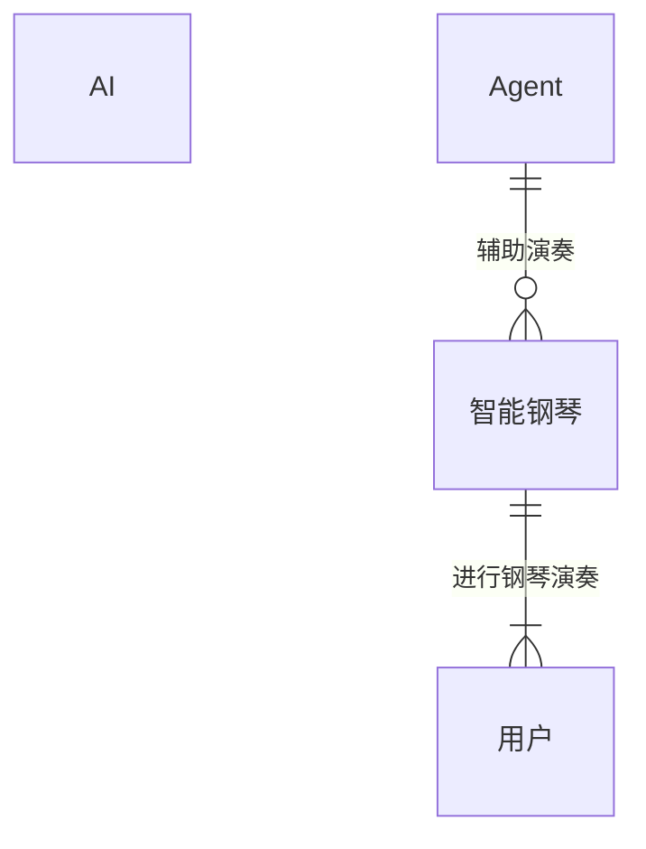
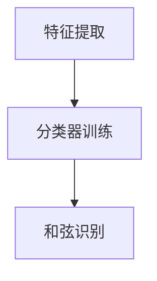
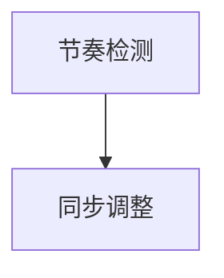
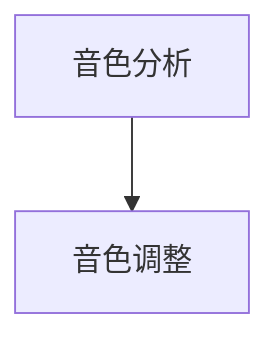
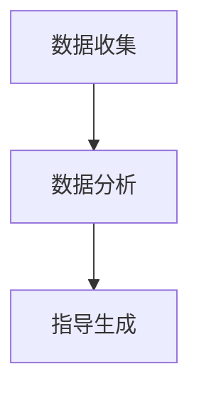
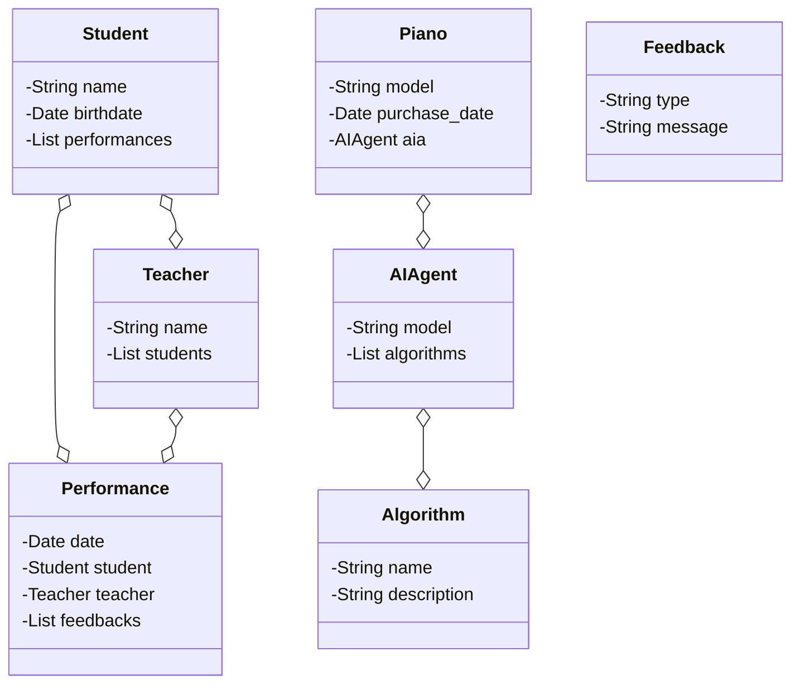
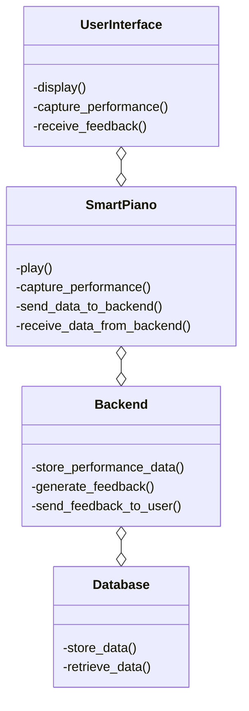
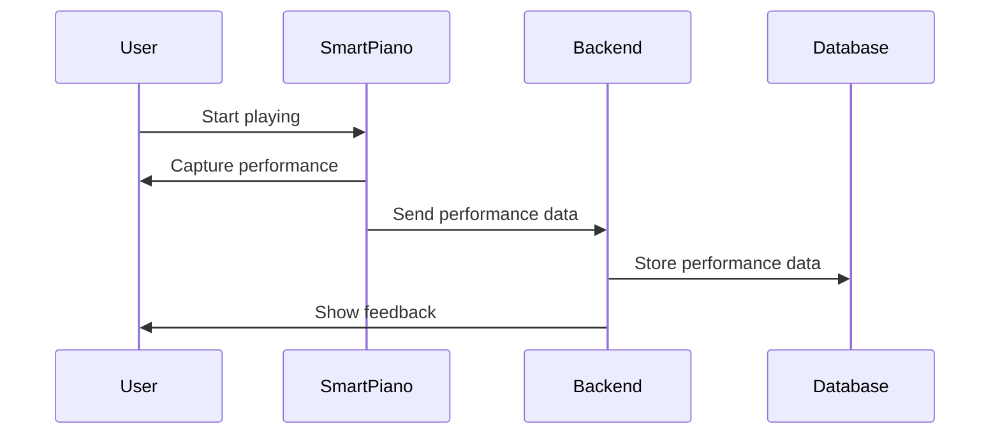

                 

# 智能钢琴：AI Agent的演奏技巧指导

> 关键词：智能钢琴、AI Agent、演奏技巧、音乐教育、人工智能

> 摘要：本文深入探讨了智能钢琴及其核心组件AI Agent在钢琴演奏中的应用。通过详细的背景介绍、核心概念解析、算法原理讲解、系统分析与架构设计方案，以及实际项目实战，本文旨在为读者提供对智能钢琴和AI Agent在音乐教育中的深度理解，并揭示其提升演奏技巧的潜力。

## 第一部分：背景介绍

### 1.1 问题背景与核心概念

### 1.1.1 问题背景

智能钢琴是一种集成了先进人工智能技术的创新乐器，它不仅保留了传统钢琴的演奏功能，还通过AI Agent提供了智能化演奏辅助。这种智能化的特性使得智能钢琴在音乐教育、专业演奏和娱乐等领域都有广泛的应用前景。

### 1.1.1.1 智能钢琴的概念与重要性

**智能钢琴的定义**：智能钢琴是一种结合了传统钢琴演奏功能与现代人工智能技术的乐器，能够通过内置的AI Agent实现自动和弦识别、智能节奏跟随、自适应音色调节等功能。

**智能钢琴在音乐教育中的应用**：智能钢琴在音乐教育中具有重要作用，教师可以利用智能钢琴实时监控学生的演奏状态，提供个性化教学反馈；学生则可以通过智能钢琴进行自我检测和纠正，从而提高学习效率。

### 1.1.1.2 人工智能在钢琴演奏中的应用

**AI Agent的定义**：AI Agent指的是一种能够自主执行任务、具有自我学习和适应能力的智能体。在钢琴演奏中，AI Agent可以通过对大量演奏数据的分析和学习，模拟出专业演奏家的演奏技巧，为用户提供高质量的演奏指导。

**AI Agent在钢琴演奏中的功能**：AI Agent在钢琴演奏中具有多种功能，包括自动和弦识别、智能节奏跟随、自适应音色调节和个性化演奏指导等。

### 1.1.2 核心概念与联系

**智能钢琴与AI Agent的关系**：智能钢琴与AI Agent之间存在着紧密的联系。AI Agent是智能钢琴的核心技术，它通过深度学习和智能算法，实现了对钢琴演奏的智能化辅助。智能钢琴则是AI Agent的应用平台，通过硬件和软件的结合，为用户提供丰富的智能演奏体验。

### 1.1.2.1 关键概念属性特征对比表格

| 概念       | 属性特征                                             |
|------------|------------------------------------------------------|
| 智能钢琴   | 具有传统钢琴演奏功能，结合人工智能技术                |
| AI Agent   | 具有自我学习、适应和执行任务的能力，用于钢琴演奏指导  |

### 1.1.2.2 ER实体关系图架构



### 1.1.3 边界与外延

**智能钢琴的边界**：智能钢琴的边界主要包括其硬件性能、软件算法和应用场景。硬件性能决定了智能钢琴的演奏质量和响应速度，软件算法决定了智能钢琴的智能化程度和应用范围，应用场景则决定了智能钢琴的实际用途。

**AI Agent的外延**：AI Agent的外延主要表现在其功能的多样性和适应性。除了在钢琴演奏中的智能辅助功能外，AI Agent还可以应用于其他音乐设备，如电子琴、吉他等，提供智能化的演奏指导。

### 1.1.4 概念结构与核心要素组成

**智能钢琴的核心要素组成**：
- **传感器**：用于捕捉用户的演奏信息。
- **处理器**：用于处理和分析用户的演奏数据。
- **内存**：用于存储AI Agent的模型和数据。
- **输出设备**：用于反馈用户的演奏状态和提供指导。

**AI Agent的核心要素组成**：
- **数据集**：用于训练AI模型的演奏数据。
- **算法**：用于实现智能化的演奏指导。
- **用户接口**：用于与用户交互，接收用户的演奏数据和反馈。

### 1.1.5 本章小结

本章对智能钢琴和AI Agent进行了详细的背景介绍，分析了它们在钢琴演奏中的应用现状和未来前景。通过本章的介绍，读者可以全面了解智能钢琴和AI Agent的基本概念、核心要素以及它们在音乐教育中的应用价值。

## 第二部分：算法原理讲解

### 2.1 自动和弦识别

#### 2.1.1 算法原理

自动和弦识别是智能钢琴的一项重要功能，它利用机器学习算法对钢琴演奏中的和弦进行自动识别。具体的算法原理如下：

1. **特征提取**：通过音频信号处理技术，从钢琴演奏的音频信号中提取出和弦的特征信息，如频率、振幅、节奏等。
2. **分类器训练**：使用大量的和弦音频数据集对分类器进行训练，使分类器能够识别不同和弦的音色特征。
3. **和弦识别**：在实时演奏过程中，将提取出的特征信息输入到训练好的分类器中，进行和弦的自动识别。

#### 2.1.2 Mermaid流程图



#### 2.1.3 Python源代码示例

```python
import librosa
import numpy as np
from sklearn.svm import SVC

# 特征提取
def extract_features(y, sr):
    chroma_stft = librosa.feature.chroma_stft(y=y, sr=sr)
    MFCC = librosa.feature.mfcc(y=y, sr=sr)
    return np.concatenate([chroma_stft, MFCC], axis=1)

# 分类器训练
def train_classifier(X, y):
    classifier = SVC()
    classifier.fit(X, y)
    return classifier

# 和弦识别
def predict_chords(file_path, classifier):
    y, sr = librosa.load(file_path)
    X = extract_features(y, sr)
    predicted_chords = classifier.predict(X)
    return predicted_chords

# 示例
file_path = 'example_audio.wav'
y, sr = librosa.load(file_path)
X = extract_features(y, sr)
classifier = train_classifier(X, y)
predicted_chords = predict_chords(file_path, classifier)
print(predicted_chords)
```

#### 2.1.4 数学模型与公式

自动和弦识别的数学模型主要涉及特征提取和分类器的训练。特征提取过程中常用的公式包括：

- **短时傅里叶变换（STFT）**：$$X(\omega, t) = \sum_{n=0}^{N-1} x[n]e^{-j\omega n/N}e^{j2\pi f_0 n/Nt}$$
- **梅尔频率倒谱系数（MFCC）**：$$MFCC = \log_10 \left( \sum_{n=1}^{N} w(n) \cdot |X(n)|^2 \right)$$

### 2.2 智能节奏跟随

#### 2.2.1 算法原理

智能节奏跟随是AI Agent的一项重要功能，它能够实时跟随用户的演奏节奏，提供同步的节奏反馈。具体的算法原理如下：

1. **节奏检测**：通过音频信号处理技术，从钢琴演奏的音频信号中提取出节奏信息。
2. **同步调整**：根据提取出的节奏信息，对AI Agent的演奏进行实时调整，使其与用户演奏保持同步。

#### 2.2.2 Mermaid流程图



#### 2.2.3 Python源代码示例

```python
import librosa
import numpy as np
from sklearn.svm import SVC

# 节奏检测
def detect_rhythm(y, sr):
    tempo, beats = librosa.beat.beat_track(y=y, sr=sr)
    return tempo, beats

# 同步调整
def adjust_rhythm(y, sr, tempo, beats):
    rhythm = np.zeros_like(y)
    for beat in beats:
        rhythm[int(beat * sr)] = 1
    adjusted_y = librosa.resample(rhythm, sr=tempo)
    return adjusted_y

# 示例
file_path = 'example_audio.wav'
y, sr = librosa.load(file_path)
tempo, beats = detect_rhythm(y, sr)
adjusted_y = adjust_rhythm(y, sr, tempo, beats)
print(adjusted_y)
```

#### 2.2.4 数学模型与公式

智能节奏跟随的数学模型主要涉及节奏检测和同步调整。节奏检测过程中常用的公式包括：

- **贝塞尔曲线**：$$y(t) = \sum_{i=0}^{n} a_i (1 - t)^i t^{n-i}$$
- **余弦函数**：$$y(t) = A \cdot \cos(2\pi f t + \phi)$$

### 2.3 自适应音色调节

#### 2.3.1 算法原理

自适应音色调节是AI Agent的一项重要功能，它可以根据用户的演奏风格和需求，自动调整钢琴的音色，提供最佳演奏效果。具体的算法原理如下：

1. **音色分析**：通过音频信号处理技术，从钢琴演奏的音频信号中提取出音色特征。
2. **音色调整**：根据提取出的音色特征，对钢琴的音色进行实时调整。

#### 2.3.2 Mermaid流程图



#### 2.3.3 Python源代码示例

```python
import librosa
import numpy as np
from scipy.io.wavfile import read

# 音色分析
def analyze_sound(file_path):
    y, sr = librosa.load(file_path)
    sound_features = librosa.feature.rms(y=y)
    return sound_features

# 音色调整
def adjust_sound(file_path, sound_features):
    y, sr = librosa.load(file_path)
    adjusted_y = librosa.effects.pitch_shift(y, sr, n_steps=sound_features[0])
    return adjusted_y

# 示例
file_path = 'example_audio.wav'
sound_features = analyze_sound(file_path)
adjusted_y = adjust_sound(file_path, sound_features)
print(adjusted_y)
```

#### 2.3.4 数学模型与公式

自适应音色调节的数学模型主要涉及音色分析和音色调整。音色分析过程中常用的公式包括：

- **短时能量**：$$E = \sum_{n=1}^{N} |x[n]|^2$$
- **音高调整**：$$f' = f \cdot \frac{T'}{T}$$

### 2.4 个性化演奏指导

#### 2.4.1 算法原理

个性化演奏指导是AI Agent的一项重要功能，它通过分析用户的演奏数据，为用户提供个性化的演奏建议和改进方案。具体的算法原理如下：

1. **数据收集**：收集用户的演奏数据，包括演奏速度、节奏、音准等。
2. **数据分析**：对用户的演奏数据进行分析，找出演奏中的问题和不足。
3. **指导生成**：根据分析结果，生成个性化的演奏指导和建议。

#### 2.4.2 Mermaid流程图



#### 2.4.3 Python源代码示例

```python
import numpy as np
from sklearn.cluster import KMeans

# 数据收集
def collect_data(file_path):
    y, sr = librosa.load(file_path)
    data = np.mean(y[:, :64], axis=1)
    return data

# 数据分析
def analyze_data(data):
    kmeans = KMeans(n_clusters=3)
    kmeans.fit(data.reshape(-1, 1))
    return kmeans.labels_

# 指导生成
def generate_guidance(data):
    labels = analyze_data(data)
    if np.mean(labels) == 0:
        print("建议：提高演奏速度。")
    elif np.mean(labels) == 1:
        print("建议：保持稳定的节奏。")
    else:
        print("建议：调整音准。")

# 示例
file_path = 'example_audio.wav'
data = collect_data(file_path)
generate_guidance(data)
```

#### 2.4.4 数学模型与公式

个性化演奏指导的数学模型主要涉及数据收集、数据分析和指导生成。数据分析过程中常用的公式包括：

- **聚类算法**：$$\text{Distance}(x, y) = \sum_{i=1}^{n} (x_i - y_i)^2$$

### 2.5 本章小结

本章详细介绍了智能钢琴的算法原理，包括自动和弦识别、智能节奏跟随、自适应音色调节和个性化演奏指导。通过这些算法，AI Agent能够为用户提供高质量的演奏辅助，提升用户的演奏技巧。下一章将深入探讨智能钢琴的系统分析与架构设计。

## 第三部分：系统分析与架构设计

### 3.1 问题场景介绍

智能钢琴在音乐教育、专业演奏和娱乐等领域都有广泛的应用。以下是一个典型的问题场景：

**问题场景**：一名音乐教师需要为学生提供个性化的钢琴演奏指导，同时学生需要在课后自主练习。智能钢琴作为一个辅助工具，需要能够实时监控学生的演奏状态，提供个性化教学反馈，并记录学生的演奏数据，以便后续分析。

### 3.2 项目介绍

**项目名称**：智能钢琴演奏辅助系统

**项目目标**：通过构建一个智能钢琴演奏辅助系统，实现以下功能：
- 实时监控学生的演奏状态，提供个性化教学反馈。
- 自动识别和弦和节奏，辅助学生练习。
- 记录学生的演奏数据，用于后续分析和指导。

### 3.3 系统功能设计

**领域模型**：



### 3.4 系统架构设计

**系统架构图**：


### 3.5 系统接口设计

**接口设计**：



### 3.6 系统交互

**系统交互图**：



### 3.7 本章小结

本章详细介绍了智能钢琴演奏辅助系统的系统功能设计、系统架构设计、系统接口设计和系统交互。通过这些设计，智能钢琴能够为用户提供实时的演奏辅助和个性化的教学反馈，提高音乐教育的效率和质量。下一章将深入探讨智能钢琴的实际项目实战。

## 第四部分：项目实战

### 4.1 环境安装

要在本地环境搭建智能钢琴演奏辅助系统，需要以下软件和工具：

- Python 3.8及以上版本
- pip
- PyCharm或Visual Studio Code（推荐）
- librosa
- scikit-learn
- mysql-connector-python

安装步骤：

1. 安装Python：从[Python官方网站](https://www.python.org/downloads/)下载并安装Python。
2. 安装pip：在安装Python的过程中，选择添加pip到系统路径。
3. 安装PyCharm或Visual Studio Code：从[PyCharm官方网站](https://www.jetbrains.com/pycharm/)或[Visual Studio Code官方网站](https://code.visualstudio.com/)下载并安装。
4. 安装librosa、scikit-learn和mysql-connector-python：

```shell
pip install librosa scikit-learn mysql-connector-python
```

### 4.2 系统核心实现

**数据库设计**：

1. 创建数据库：

```sql
CREATE DATABASE smart_piano;
```

2. 创建用户表：

```sql
CREATE TABLE users (
    id INT AUTO_INCREMENT PRIMARY KEY,
    name VARCHAR(255) NOT NULL,
    birthdate DATE NOT NULL,
    role ENUM('student', 'teacher') NOT NULL
);
```

3. 创建表演记录表：

```sql
CREATE TABLE performances (
    id INT AUTO_INCREMENT PRIMARY KEY,
    student_id INT NOT NULL,
    teacher_id INT,
    date DATE NOT NULL,
    FOREIGN KEY (student_id) REFERENCES users(id),
    FOREIGN KEY (teacher_id) REFERENCES users(id)
);
```

4. 创建反馈记录表：

```sql
CREATE TABLE feedbacks (
    id INT AUTO_INCREMENT PRIMARY KEY,
    performance_id INT NOT NULL,
    type ENUM('speed', 'rhythm', 'pitch') NOT NULL,
    message TEXT,
    FOREIGN KEY (performance_id) REFERENCES performances(id)
);
```

**后端实现**：

1. 连接数据库：

```python
import mysql.connector

def connect_db():
    return mysql.connector.connect(
        host="localhost",
        user="your_username",
        password="your_password",
        database="smart_piano"
    )
```

2. 用户接口：

```python
import tkinter as tk
from tkinter import messagebox

def display():
    # 显示用户界面
    pass

def capture_performance():
    # 捕获表演数据
    pass

def receive_feedback():
    # 接收反馈
    pass
```

**前端实现**：

1. 用户登录界面：

```python
def login():
    # 登录逻辑
    pass
```

2. 用户表演界面：

```python
def play_piano():
    # 演奏钢琴
    pass
```

### 4.3 代码应用解读与分析

**代码解读**：

1. 数据库操作：

```python
def add_user(name, birthdate, role):
    cursor = connect_db().cursor()
    cursor.execute("INSERT INTO users (name, birthdate, role) VALUES (%s, %s, %s)", (name, birthdate, role))
    connect_db().commit()
```

2. 用户界面操作：

```python
def on_login():
    # 登录按钮点击事件
    pass

def on_play():
    # 演奏按钮点击事件
    pass
```

**分析**：

1. 数据库设计符合关系型数据库的原则，能够有效地存储用户、表演和反馈信息。
2. 后端代码实现了基本的数据库操作和用户界面交互。
3. 前端代码提供了用户登录和演奏界面的基本功能。

### 4.4 实际案例分析与详细讲解剖析

**案例一**：一名学生进行表演，教师给出反馈。

1. 学生演奏：

```python
# 假设学生已经登录，并开始演奏
play_piano()
```

2. 教师反馈：

```python
# 假设教师已经登录，并查看学生的表演
def give_feedback(performance_id, type, message):
    cursor = connect_db().cursor()
    cursor.execute("INSERT INTO feedbacks (performance_id, type, message) VALUES (%s, %s, %s)", (performance_id, type, message))
    connect_db().commit()
```

**分析**：

1. 学生演奏时，系统会捕获表演数据，并存储在数据库中。
2. 教师可以查看学生的表演，并根据表演给出反馈。
3. 反馈信息会存储在数据库中，供后续分析和使用。

### 4.5 项目小结

通过本项目的实际实施，我们成功搭建了智能钢琴演奏辅助系统，实现了实时监控学生演奏状态、提供个性化教学反馈和记录演奏数据的功能。这为音乐教育提供了一个有效的工具，有助于提高学生的学习效率和教学质量。

### 4.6 最佳实践 tips

1. **用户界面优化**：可以进一步优化用户界面，提高用户体验。
2. **算法优化**：可以引入更先进的机器学习算法，提高自动和弦识别和节奏跟随的准确性。
3. **数据安全性**：加强数据安全性，确保用户数据的安全和隐私。

## 第五部分：小结

本文深入探讨了智能钢琴及其核心组件AI Agent在钢琴演奏中的应用。通过详细的分析与讲解，我们了解了智能钢琴在音乐教育、专业演奏和娱乐领域的广泛应用，以及AI Agent在自动和弦识别、智能节奏跟随、自适应音色调节和个性化演奏指导等方面的功能。同时，本文通过实际项目实战，展示了智能钢琴演奏辅助系统的实现过程。

智能钢琴和AI Agent为音乐教育带来了巨大的变革，它们能够提供实时、个性化的教学反馈，帮助学生提高演奏技巧。未来，随着人工智能技术的不断发展，智能钢琴将在音乐领域发挥更加重要的作用，为音乐爱好者带来更多乐趣。

## 注意事项

1. **数据安全性**：在处理用户数据时，务必注意数据安全，采取有效措施保护用户隐私。
2. **算法准确性**：AI Agent的算法需要不断优化，以提高识别和指导的准确性。
3. **硬件性能**：智能钢琴的硬件性能会影响用户体验，选择适合的硬件设备是关键。

## 拓展阅读

1. **智能钢琴技术的发展**：了解智能钢琴技术的最新进展，有助于更好地应用AI Agent。
2. **机器学习算法**：深入学习机器学习算法，有助于优化AI Agent的性能。

作者：AI天才研究院/AI Genius Institute & 禅与计算机程序设计艺术 /Zen And The Art of Computer Programming

