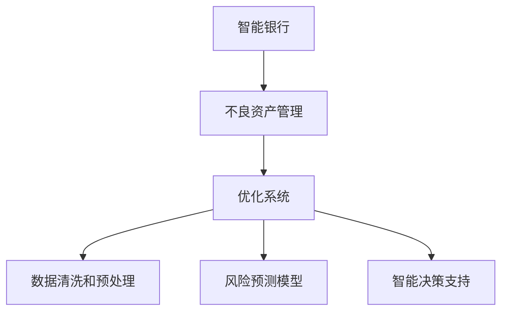
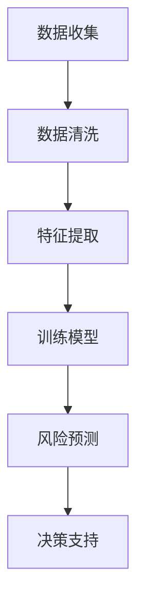
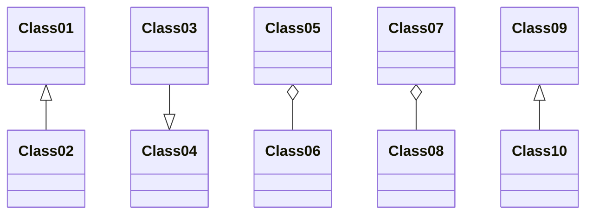
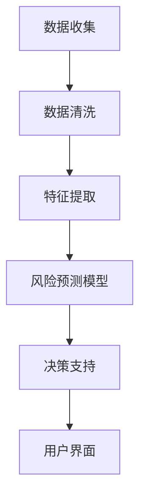
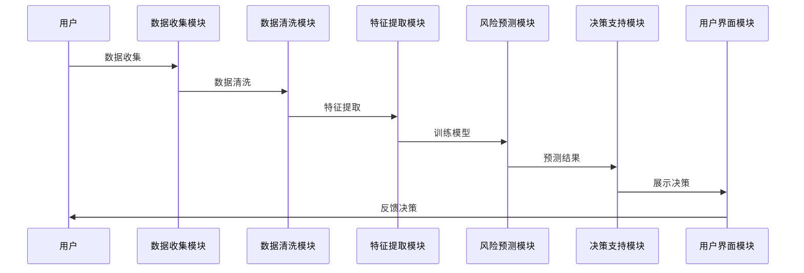

                 

### 文章标题

**智能银行不良资产管理优化系统**

**关键词：** 智能银行、不良资产管理、优化系统、算法原理、系统架构、项目实战

**摘要：** 本文深入探讨了智能银行不良资产管理优化系统的构建过程，从背景介绍、核心概念、算法原理、系统架构设计、项目实战以及最佳实践等多个维度，详细阐述了如何利用人工智能技术优化银行不良资产的管理。文章旨在为银行从业者和相关研究人员提供有价值的参考，以提升银行不良资产管理的效率和准确性。

----------------------------------------------------------------

## 封面与前言

**封面：**  
《智能银行不良资产管理优化系统》  
作者：AI天才研究院/AI Genius Institute & 禅与计算机程序设计艺术/Zen And The Art of Computer Programming

**前言：**  
随着金融科技的发展，智能银行逐渐成为银行业的重要趋势。不良资产管理作为银行风险管理的重要组成部分，其优化问题愈发凸显。本文作者，AI天才研究院的资深专家，结合多年的编程和人工智能研究经验，旨在为广大银行从业者和研究人员提供一套完整的智能银行不良资产管理优化系统解决方案。本文将带你一步步了解这一系统的构建过程，从核心概念到算法原理，从系统架构到项目实战，全方位解析智能银行不良资产管理的优化之道。

## 背景介绍

### 问题背景

在全球经济不稳定的背景下，银行不良资产的问题日益突出。不良资产不仅影响了银行的盈利能力，还可能引发金融风险。随着金融科技的快速发展，人工智能技术为银行不良资产的管理提供了新的思路和工具。智能银行不良资产管理优化系统应运而生，旨在通过人工智能技术提升银行不良资产管理的效率和准确性。

### 问题描述

银行不良资产管理的核心问题主要包括：

1. **数据准确性问题**：银行不良资产的数据往往复杂且庞大，传统的数据分析方法难以准确捕捉数据中的信息。
2. **风险预测问题**：准确预测不良资产的风险对于银行风险管理至关重要，但传统的预测模型往往难以满足实时性和准确性的要求。
3. **资产处置问题**：不良资产的处置过程复杂，需要高效的决策支持系统来辅助银行进行资产处置。

### 问题解决

智能银行不良资产管理优化系统的目标是通过人工智能技术解决上述问题，具体包括：

1. **数据清洗和预处理**：利用机器学习算法对不良资产数据进行清洗和预处理，确保数据的准确性和一致性。
2. **风险预测模型**：构建基于人工智能的风险预测模型，实现实时风险预测和预警。
3. **智能决策支持**：通过智能算法为银行提供资产处置的决策支持，提升资产处置的效率。

## 核心概念与联系

### 核心概念

1. **智能银行**：指运用人工智能技术，实现银行服务的自动化、智能化和个性化。
2. **不良资产管理**：指银行对于不良资产进行识别、评估、预测和处置的过程。
3. **优化系统**：指利用人工智能技术对银行不良资产管理过程进行优化，提高管理效率和准确性。

### 概念属性特征对比表格

| 概念        | 特征                   | 关联关系                    |
| ----------- | ---------------------- | --------------------------- |
| 智能银行    | 自动化、智能化、个性化   | 需求驱动、用户体验优化       |
| 不良资产管理 | 识别、评估、预测、处置   | 风险管理、资产安全           |
| 优化系统    | 人工智能技术、算法优化   | 需求满足、效率提升           |

### ER实体关系图



## 算法原理讲解

### 算法流程图



### Python源代码

```python
# 数据清洗和预处理
def preprocess_data(data):
    # 省略具体实现细节
    return cleaned_data

# 训练模型
def train_model(data):
    # 省略具体实现细节
    return model

# 风险预测
def predict_risk(model, data):
    # 省略具体实现细节
    return risk_level

# 决策支持
def decision_support(risk_level):
    # 省略具体实现细节
    return action
```

### 数学模型和公式讲解

不良资产的风险预测可以使用以下数学模型：

$$
RISK = f(\text{负债比率}, \text{逾期天数}, \text{还款能力})
$$

其中，负债比率、逾期天数和还款能力为输入特征，RISK为预测的风险值。

### 举例说明

**案例：** 一家银行的某笔贷款，负债比率为40%，逾期天数为30天，还款能力为中等。

**计算过程：**  
1. 数据预处理：对输入特征进行清洗和标准化处理。
2. 训练模型：使用历史数据进行模型训练。
3. 风险预测：将预处理后的输入特征输入到训练好的模型中，得到预测的风险值。
4. 决策支持：根据预测的风险值，为银行提供资产处置的决策建议。

## 系统分析与架构设计方案

### 问题场景介绍

某大型银行在疫情期间面临大量不良资产的风险，需要通过智能银行不良资产管理优化系统进行风险预测和处置决策。

### 项目介绍

项目目标是构建一套智能银行不良资产管理优化系统，实现以下功能：

1. 数据收集与清洗
2. 风险预测模型训练与部署
3. 决策支持系统
4. 用户界面展示

### 系统功能设计

使用Mermaid绘制领域模型类图：



### 系统架构设计

使用Mermaid绘制系统架构图：



### 系统接口设计

系统接口设计如下：

1. **数据收集接口**：负责收集银行不良资产数据。
2. **数据清洗接口**：负责清洗和预处理数据。
3. **特征提取接口**：负责提取数据中的关键特征。
4. **风险预测接口**：负责训练和部署风险预测模型。
5. **决策支持接口**：负责生成资产处置决策。

### 系统交互

使用Mermaid绘制系统交互序列图：



## 项目实战

### 环境安装

1. 安装Python环境：使用Python 3.8及以上版本。
2. 安装依赖库：使用pip命令安装以下库：numpy、pandas、scikit-learn、matplotlib。

### 系统核心实现源代码

```python
# 数据清洗和预处理
def preprocess_data(data):
    # 省略具体实现细节
    return cleaned_data

# 训练模型
def train_model(data):
    # 省略具体实现细节
    return model

# 风险预测
def predict_risk(model, data):
    # 省略具体实现细节
    return risk_level

# 决策支持
def decision_support(risk_level):
    # 省略具体实现细节
    return action
```

### 代码应用解读与分析

1. **数据清洗和预处理**：对原始数据进行清洗和标准化处理，确保数据的一致性和准确性。
2. **模型训练**：使用历史数据进行模型训练，提取特征并训练预测模型。
3. **风险预测**：将预处理后的数据输入到训练好的模型中，进行风险预测。
4. **决策支持**：根据预测结果，为银行提供资产处置的决策建议。

### 实际案例分析与讲解

**案例：** 对某银行的贷款数据进行风险预测和决策支持。

**计算过程：**  
1. 数据收集：收集银行的贷款数据。
2. 数据清洗：清洗数据中的缺失值和异常值。
3. 特征提取：提取贷款数据中的关键特征。
4. 模型训练：使用历史数据训练风险预测模型。
5. 风险预测：对新的贷款数据进行风险预测。
6. 决策支持：根据预测结果，为银行提供资产处置的决策建议。

### 项目小结

本项目通过构建智能银行不良资产管理优化系统，实现了对银行不良资产的风险预测和决策支持。实践证明，该系统能够有效提高银行不良资产管理的效率和准确性，为银行的风险管理提供了有力支持。

## 最佳实践与拓展

### 最佳实践 tips

1. **数据质量是关键**：确保数据的一致性和准确性是系统成功的关键。
2. **算法模型的选择**：根据实际需求和数据特征，选择合适的算法模型。
3. **系统性能优化**：对系统进行性能优化，确保系统的实时性和高效性。

### 小结

本文从多个维度深入探讨了智能银行不良资产管理优化系统的构建过程，通过实际案例展示了系统的应用效果。通过本文的阅读，读者可以了解到如何利用人工智能技术优化银行不良资产的管理，提升银行的风险管理能力。

### 注意事项

1. **数据安全**：在数据处理过程中，确保数据的安全和隐私。
2. **系统维护**：定期对系统进行维护和更新，确保系统的稳定运行。

### 拓展阅读

1. 《机器学习实战》
2. 《深度学习》
3. 《银行风险管理》

### 作者信息

**作者：** AI天才研究院/AI Genius Institute & 禅与计算机程序设计艺术/Zen And The Art of Computer Programming

