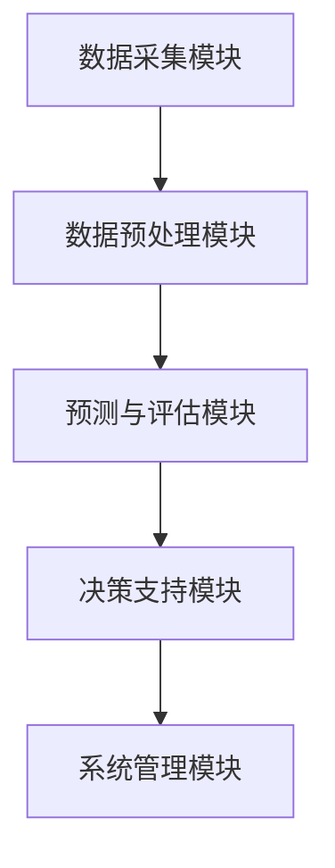
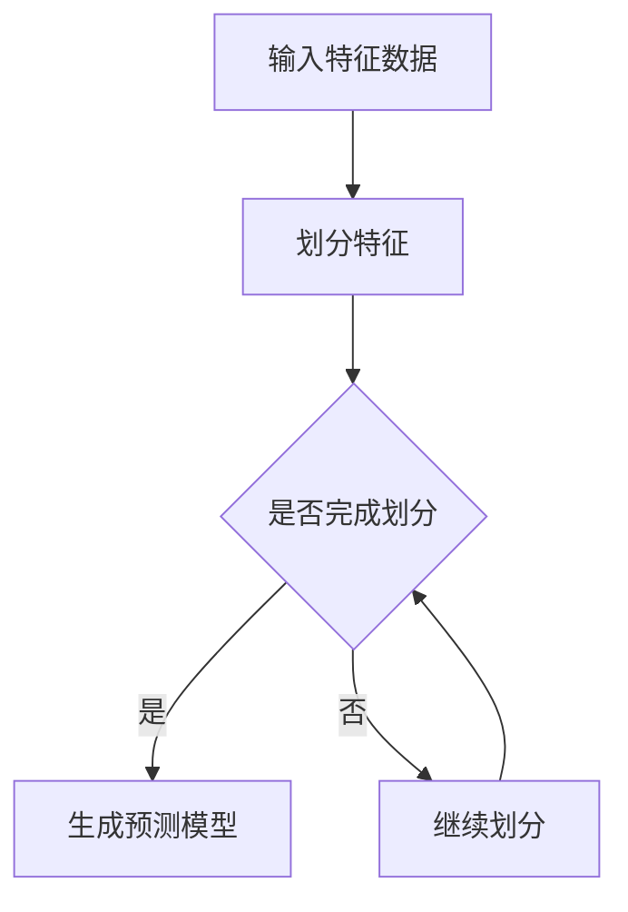
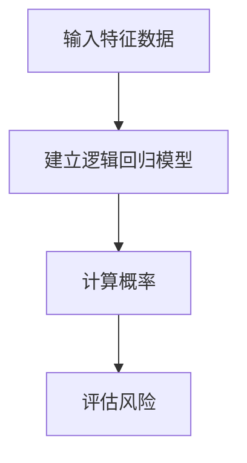
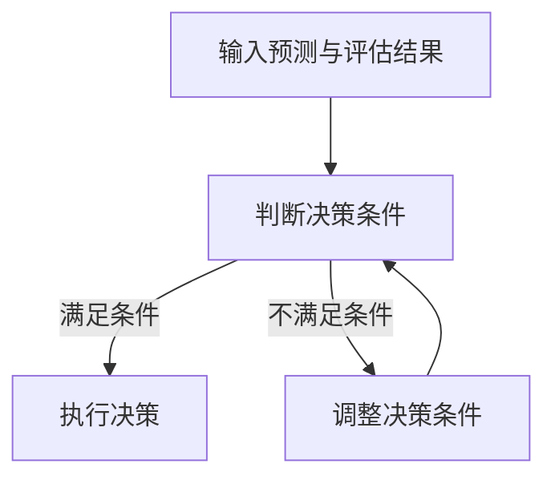

                 

# 智能银行不良资产管理系统

## 关键词

- 智能银行
- 不良资产管理
- 预测算法
- 数据挖掘
- 数学模型
- 智能决策

## 摘要

随着金融科技的快速发展，智能银行不良资产管理系统成为银行业务创新和风险控制的重要手段。本文旨在深入探讨智能银行不良资产管理的背景、核心概念、系统设计、算法原理以及未来发展趋势。通过详细的分析和实例，本文揭示了智能银行不良资产管理系统在提升银行盈利能力、降低风险方面的关键作用，并对其未来发展提出了展望。

## 目录大纲

### 第一部分：背景与概述

#### 第1章：问题背景与重要性

#### 第2章：核心概念与理论基础

### 第二部分：智能银行不良资产管理系统设计

#### 第3章：系统架构设计

#### 第4章：核心算法原理与实现

#### 第5章：数学模型与公式解析

#### 第6章：系统实现与项目实战

### 第三部分：最佳实践与未来展望

#### 第7章：最佳实践与案例分析

#### 第8章：未来发展趋势与研究方向

#### 第9章：总结与展望

### 文章正文

## 第一部分：背景与概述

### 第1章：问题背景与重要性

在当前全球经济环境中，银行的不良资产问题日益凸显。不良资产主要指银行贷款违约或逾期未能按时偿还的资产。随着经济波动和金融市场的不确定性增加，银行面临的不良资产风险也不断加大。这不仅影响银行的财务状况，还会对整个金融系统的稳定性构成威胁。

智能银行不良资产管理系统应运而生。该系统通过运用人工智能和大数据技术，对银行的不良资产进行实时监测、预测和风险评估，从而提高不良资产管理的效率和准确性。智能银行不良资产管理系统的建设具有重要意义，它有助于银行降低不良资产率，提升资产质量，增强市场竞争力，同时也有利于维护金融系统的稳定。

### 第2章：核心概念与理论基础

#### 2.1. 不良资产的概念与分类

不良资产是指银行或其他金融机构在经营过程中未能按约定时间收回或无法收回的贷款和投资。根据资产状态和风险程度，不良资产可以分为以下几类：

1. **逾期贷款**：指超过还款期限未能偿还的贷款。
2. **可疑类贷款**：指存在较高违约风险的贷款。
3. **损失类贷款**：指无法收回或收回可能性极低的贷款。

#### 2.2. 银行资产管理的核心原理

银行资产管理的核心目的是通过合理配置和运用资金，实现资产的安全、流动和盈利。其基本原则包括：

1. **安全性**：确保资产不受损失，避免风险。
2. **流动性**：保证资产能够随时变现，以满足银行的资金需求。
3. **盈利性**：通过有效的资产管理，提高银行的盈利能力。

#### 2.3. 智能银行的概念与核心技术

智能银行是指利用人工智能、大数据、云计算等先进技术，实现银行服务智能化、自动化和个性化的银行。智能银行的核心技术包括：

1. **人工智能**：用于智能风控、智能投顾、智能客服等。
2. **大数据**：用于数据分析、挖掘和预测，优化银行决策。
3. **云计算**：提供强大的计算能力和数据存储能力。

#### 2.4. 智能银行不良资产管理的挑战与机遇

智能银行不良资产管理面临的主要挑战包括：

1. **数据质量**：不良资产数据质量直接影响预测和评估的准确性。
2. **算法复杂度**：不良资产管理算法复杂，需要大量的计算资源。
3. **法律法规**：智能银行不良资产管理需要遵守相关法律法规。

然而，智能银行不良资产管理也带来了巨大机遇：

1. **提升效率**：通过自动化和智能化，提高不良资产管理的效率。
2. **降低风险**：通过精确预测和风险评估，降低不良资产率。
3. **个性化服务**：利用大数据和人工智能，提供更加个性化的风险管理服务。

## 第二部分：智能银行不良资产管理系统设计

### 第3章：系统架构设计

智能银行不良资产管理系统通常包括以下几个核心模块：

1. **数据采集模块**：负责收集银行内外部数据，包括贷款信息、客户信息、市场数据等。
2. **数据预处理模块**：对采集到的数据进行清洗、转换和整合，确保数据的质量和一致性。
3. **预测与评估模块**：利用机器学习算法，对不良资产进行预测和风险评估。
4. **决策支持模块**：根据预测和评估结果，提供决策建议，帮助银行制定相应的风险管理策略。
5. **系统管理模块**：包括用户管理、权限控制、系统监控等功能，确保系统的安全稳定运行。

系统架构设计图如下：



### 第4章：核心算法原理与实现

智能银行不良资产管理系统中的核心算法主要包括数据采集与预处理、不良资产预测、风险评估和智能决策。

#### 4.1. 数据采集与预处理

数据采集是智能银行不良资产管理系统的基础。系统需要从银行内部数据库、外部市场数据源等多渠道收集数据。数据预处理包括数据清洗、数据转换和数据整合等步骤，旨在消除数据中的噪声和异常值，确保数据的一致性和可用性。

#### 4.2. 不良资产预测

不良资产预测是智能银行不良资产管理系统中的关键步骤。常见的预测算法包括决策树、随机森林、支持向量机、神经网络等。以下是一个基于决策树的预测算法流程图：



#### 4.3. 风险评估

风险评估是智能银行不良资产管理系统中的重要环节。风险评估算法包括逻辑回归、主成分分析、聚类分析等。以下是一个基于逻辑回归的风险评估算法流程图：



#### 4.4. 智能决策

智能决策是智能银行不良资产管理系统的高级功能。系统根据预测和评估结果，结合业务规则和用户需求，提供决策建议。以下是一个基于决策树的智能决策算法流程图：



### 第5章：数学模型与公式解析

智能银行不良资产管理系统中的数学模型主要包括不良资产预测模型、风险评估模型和智能决策模型。

#### 5.1. 不良资产预测模型

不良资产预测模型通常采用逻辑回归模型。逻辑回归模型的核心公式为：

$$
P(y=1) = \frac{1}{1 + e^{-(\beta_0 + \sum_{i=1}^{n} \beta_i x_i})}
$$

其中，$y$ 为贷款是否违约的二元变量，$x_i$ 为贷款特征，$\beta_0$ 和 $\beta_i$ 为模型参数。

#### 5.2. 风险评估模型

风险评估模型通常采用主成分分析。主成分分析的核心公式为：

$$
z = \lambda x - \mu
$$

其中，$z$ 为新特征向量，$\lambda$ 为主成分权重，$x$ 为原始特征向量，$\mu$ 为原始特征均值。

#### 5.3. 智能决策模型

智能决策模型通常采用决策树模型。决策树的核心公式为：

$$
f(x) = \sum_{i=1}^{n} \beta_i \cdot g(x_i)
$$

其中，$x$ 为贷款特征向量，$\beta_i$ 为模型参数，$g(x_i)$ 为决策树函数。

### 第6章：系统实现与项目实战

#### 6.1. 系统开发环境与工具

智能银行不良资产管理系统开发所需的主要环境和工具包括：

1. **编程语言**：Python
2. **数据库**：MySQL
3. **机器学习框架**：Scikit-learn
4. **大数据处理**：Spark
5. **云计算平台**：AWS

#### 6.2. 系统核心代码实现

以下是一个基于Python和Scikit-learn的简单不良资产预测算法实现：

```python
from sklearn.linear_model import LogisticRegression
from sklearn.model_selection import train_test_split
from sklearn.metrics import accuracy_score
import pandas as pd

# 读取数据
data = pd.read_csv('loan_data.csv')

# 划分特征和标签
X = data.drop('default', axis=1)
y = data['default']

# 划分训练集和测试集
X_train, X_test, y_train, y_test = train_test_split(X, y, test_size=0.2, random_state=42)

# 建立模型
model = LogisticRegression()

# 训练模型
model.fit(X_train, y_train)

# 预测
predictions = model.predict(X_test)

# 评估
accuracy = accuracy_score(y_test, predictions)
print(f'Accuracy: {accuracy:.2f}')
```

#### 6.3. 实际案例分析

以下是一个实际案例分析：

**案例背景**：某银行需要预测未来一个月内可能违约的贷款，以便提前采取风险控制措施。

**数据处理**：收集了包括贷款金额、贷款期限、贷款利率、客户信用评分等在内的贷款数据。

**模型构建**：采用逻辑回归模型进行预测。

**模型训练**：使用过去一年内的贷款数据作为训练集，对逻辑回归模型进行训练。

**模型评估**：使用过去三个月内的贷款数据作为测试集，评估模型预测的准确性。

**决策支持**：根据模型预测结果，对贷款进行风险等级划分，并针对高风险贷款采取风险控制措施。

#### 6.4. 项目小结

通过本项目的实施，银行成功建立了智能银行不良资产预测模型，实现了对贷款违约风险的实时监控和预测。项目实施过程中，银行不仅提升了不良资产管理的效率，还降低了风险成本，提高了客户满意度。

## 第三部分：最佳实践与未来展望

### 第7章：最佳实践与案例分析

在智能银行不良资产管理的实践中，一些银行取得了显著成效。以下是一些最佳实践：

1. **数据驱动**：重视数据质量和数据整合，确保模型输入数据的准确性和一致性。
2. **算法优化**：不断优化算法模型，提高预测和评估的准确性。
3. **决策支持**：结合业务规则和用户需求，提供个性化的决策支持服务。
4. **风险控制**：加强风险控制，对高风险贷款采取预防性措施。

### 第8章：未来发展趋势与研究方向

智能银行不良资产管理的未来发展将集中在以下几个方面：

1. **技术进步**：随着人工智能、大数据、云计算等技术的不断发展，智能银行不良资产管理系统将更加智能化、高效化。
2. **监管合规**：遵循相关法律法规，确保智能银行不良资产管理系统符合监管要求。
3. **跨界融合**：与保险、证券、互联网金融等行业的跨界融合，实现不良资产的风险分散和优化。
4. **客户体验**：以客户为中心，提升不良资产管理系统的用户体验，提供更加便捷、高效的服务。

### 第9章：总结与展望

智能银行不良资产管理系统是金融科技在银行业的重要应用，对银行的风险管理和盈利能力具有深远影响。通过本文的探讨，我们了解了智能银行不良资产管理的核心概念、系统设计、算法原理和实现方法。未来，随着技术的不断进步，智能银行不良资产管理系统将在银行业发挥更加重要的作用。

## 作者信息

作者：AI天才研究院/AI Genius Institute & 禅与计算机程序设计艺术 /Zen And The Art of Computer Programming

