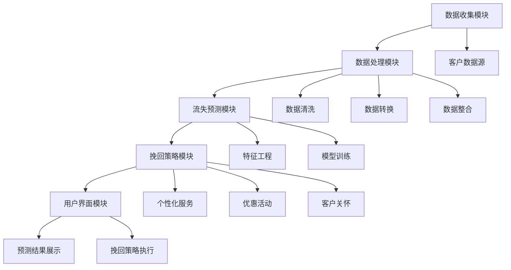

                 

## 第一部分：背景介绍

### 1.1 问题背景

在当今激烈竞争的金融市场中，银行面临的挑战日益增多。客户流失问题就是其中之一。客户流失不仅影响银行的利润，还会损害其品牌形象和市场竞争力。客户流失的原因多种多样，包括服务质量不佳、产品创新不足、竞争对手的吸引等。

**问题描述**：
银行客户流失问题表现为：
- 客户满意度下降：客户对银行服务不满意，可能导致他们转向其他银行。
- 转移至数字化服务：年轻一代客户更倾向于使用互联网和移动应用进行银行业务，而非亲自前往银行。
- 竞争加剧：其他金融机构通过创新服务和产品吸引客户，导致客户流失。
- 金融服务需求变化：随着金融市场的发展和客户需求的变化，银行未能及时调整服务策略，导致客户流失。

**问题解决**：
为了降低客户流失率，银行需要采取以下措施：
- 提升服务质量：通过改善客户体验，提高客户满意度。
- 创新产品和服务：开发新的金融产品，满足客户不断变化的需求。
- 利用大数据分析：通过分析客户数据，识别可能流失的客户，并采取针对性的挽回措施。

**边界与外延**：
本系统主要针对个人客户流失进行预防，但对于企业客户流失的预防同样适用。系统的范围包括：
- 客户数据收集：收集客户的基本信息、交易记录、服务评价等。
- 流失预测模型：利用机器学习算法预测客户流失的概率。
- 客户行为分析：通过分析客户行为，发现潜在流失客户。
- 挽回策略：根据客户流失原因制定相应的挽回措施。

**概念结构与核心要素组成**：

- **客户数据**：包括客户的基本信息、交易记录、服务评价等。
- **流失预测模型**：利用机器学习算法预测客户流失的概率。
- **客户行为分析**：通过分析客户行为，发现潜在流失客户。
- **挽回策略**：根据客户流失原因制定相应的挽回措施。

通过上述结构，银行可以更有效地管理客户流失，提高客户忠诚度和满意度。

### 1.2 流失预测模型

流失预测模型是智能银行客户流失预防系统的核心。它的目标是利用历史数据和机器学习算法，预测哪些客户可能在未来流失，并提前采取挽回措施。下面，我们将详细探讨流失预测模型的概念、原理以及其在系统中的作用。

#### 1.2.1 模型原理

流失预测模型通常基于客户的历史数据和特征，使用机器学习算法来建立预测模型。机器学习算法包括多种类型，如决策树、随机森林、逻辑回归和支持向量机等。每种算法都有其独特的原理和优势，适用于不同的数据类型和场景。

- **决策树**：决策树是一种基于树的模型，通过一系列的判断节点和叶子节点来预测客户是否流失。每个节点代表一个特征，每个分支代表不同特征值的分类结果。
- **随机森林**：随机森林是由多棵决策树组成的一个集成模型，通过聚合多个决策树的结果来提高预测的准确性和稳定性。
- **逻辑回归**：逻辑回归是一种线性模型，通过线性组合特征并引入逻辑函数（Sigmoid函数）来预测流失概率。
- **支持向量机**：支持向量机是一种基于最大间隔原理的模型，通过在高维空间中寻找最佳分割超平面来分类客户。

#### 1.2.2 模型属性特征对比表

下面是几种常见流失预测算法的属性特征对比表：

| 算法       | 特点                      | 适用场景                           |
|------------|---------------------------|-----------------------------------|
| 决策树     | 简单易懂，易于解释         | 数据量不大，特征较为直观           |
| 随机森林   | 防止过拟合，提高准确性     | 数据量大，特征复杂               |
| 逻辑回归   | 线性模型，便于解释         | 数据量较大，特征线性关系明显       |
| 支持向量机 | 高维空间中的非线性分类     | 数据量较大，特征非线性关系明显     |

#### 1.2.3 模型联系

流失预测模型与其他系统模块紧密联系，共同构成智能银行客户流失预防系统的整体架构。以下是流失预测模型与其他模块的联系：


- **客户数据模块**：提供流失预测模型所需的客户历史数据和特征。
- **特征工程模块**：对客户数据进行预处理和特征提取，为流失预测模型提供高质量的特征。
- **模型训练模块**：利用历史数据训练流失预测模型，调整模型参数，提高预测准确性。
- **模型评估模块**：对训练好的模型进行评估，确保其在实际应用中的效果。
- **挽回策略模块**：根据预测结果，制定并执行挽回措施，防止客户流失。

通过上述联系，流失预测模型能够有效地识别可能流失的客户，为银行提供有针对性的挽回策略，从而降低客户流失率。

### 1.3 客户行为分析

客户行为分析是流失预测系统中的重要组成部分，它通过对客户的历史行为数据进行分析，识别出潜在流失客户，为流失预测提供支持。下面，我们将详细探讨客户行为分析的概念、方法和其在系统中的作用。

#### 1.3.1 客户行为分析概念

客户行为分析是指利用客户的历史数据，分析客户的行为模式、偏好和趋势，以便更好地了解客户需求，提高客户满意度，并降低客户流失率。客户行为分析通常涉及以下方面：

- **交易行为**：包括存款、取款、转账、投资等交易类型和频率。
- **服务使用**：包括网银、手机银行、柜台服务等的访问频率和使用时长。
- **客户反馈**：包括客户满意度调查、投诉记录等。
- **社会行为**：包括社交媒体活动、消费习惯等。

#### 1.3.2 客户行为分析方法

客户行为分析的方法多种多样，主要包括以下几种：

- **描述性分析**：通过统计数据和图表，描述客户行为的整体趋势和分布情况。
- **聚类分析**：将具有相似行为的客户划分为不同的群体，以便更好地理解客户群体的特征。
- **关联规则分析**：发现不同行为之间的关联关系，帮助银行提供更个性化的服务。
- **时间序列分析**：分析客户行为随时间的变化趋势，识别异常行为和潜在流失客户。

#### 1.3.3 客户行为分析在系统中的作用

客户行为分析在流失预测系统中具有重要作用，其主要作用如下：

- **识别流失风险**：通过分析客户的行为数据，识别出行为异常或下降的客户，预测他们可能流失的风险。
- **优化挽回策略**：根据客户行为分析的结果，制定更有针对性的挽回策略，提高挽回效果。
- **提升客户满意度**：通过分析客户行为，发现客户需求和痛点，优化产品和服务，提高客户满意度。
- **预测未来行为**：通过分析客户的历史行为，预测客户未来的行为模式，为银行提供决策支持。

#### 1.3.4 实际应用案例分析

以一家大型银行为例，通过客户行为分析成功预防客户流失的案例：

- **问题描述**：该银行发现其客户流失率较高，特别是年轻客户的流失较为严重。
- **客户行为分析**：通过分析客户的历史交易数据、服务使用记录和客户反馈，发现以下趋势：
  - 客户交易频率下降，特别是小额交易。
  - 客户对网银和手机银行的访问频率和时长减少。
  - 客户投诉主要集中在服务体验和产品创新方面。
- **挽回策略**：根据客户行为分析的结果，银行采取以下措施：
  - 推出针对年轻客户的专属理财产品和服务。
  - 优化网银和手机银行的用户体验。
  - 加强与客户的互动，通过社交媒体和电子邮件提供个性化的客户关怀。
- **效果评估**：经过一段时间的实施，银行客户流失率显著下降，年轻客户的流失率减少尤为明显。

通过上述案例，我们可以看到客户行为分析在预防客户流失中的重要作用。银行可以通过对客户行为数据的深入分析，制定有效的挽回策略，提高客户满意度和忠诚度，从而降低客户流失率。

### 1.4 挽回策略

挽回策略是流失预防系统中的关键环节，通过识别流失风险和客户行为分析，银行需要采取一系列有针对性的措施来防止客户流失。以下详细描述挽回策略的概念、方法和实际应用案例。

#### 1.4.1 挽回策略概念

挽回策略是指银行针对可能流失的客户，采取一系列措施来提高客户满意度，减少流失风险，从而实现客户保留。挽回策略包括以下几个方面：

- **个性化服务**：根据客户需求和偏好，提供个性化的金融产品和服务。
- **优惠活动**：通过折扣、礼品等方式，吸引客户继续使用银行服务。
- **客户关怀**：定期与客户沟通，了解客户需求，提供针对性的建议和帮助。
- **交叉销售**：利用客户现有产品，推广其他相关产品，增加客户粘性。

#### 1.4.2 挽回策略方法

1. **客户分层**：

   根据客户的价值、行为特征和流失风险，将客户分为不同层次，如高价值客户、潜在流失客户等。针对不同层次客户，采取差异化的挽回策略。

2. **多渠道沟通**：

   利用多种渠道与客户进行沟通，如电话、邮件、短信、社交媒体等。通过多渠道触达，提高客户接触率和挽回成功率。

3. **定期回访**：

   定期回访客户，了解客户使用银行服务的体验和需求。通过回访，及时发现潜在问题，提供及时的解决方案。

4. **个性化推荐**：

   利用大数据和机器学习技术，分析客户的行为和偏好，提供个性化的金融产品和服务推荐。

#### 1.4.3 实际应用案例

以一家大型银行为例，通过挽回策略成功降低客户流失率的案例：

- **问题描述**：该银行发现其高价值客户流失风险较高，尤其是高端理财客户。
- **挽回策略**：
  - **个性化服务**：为高端理财客户提供定制化的理财方案和专属服务，满足他们的特殊需求。
  - **优惠活动**：推出针对高端理财客户的专属优惠活动，如理财增值、免费金融服务等。
  - **客户关怀**：定期邀请高端理财客户参加金融知识讲座、理财沙龙等活动，增进客户与银行的关系。
  - **个性化推荐**：根据客户的历史投资行为和偏好，提供个性化的投资推荐，增加客户的投资收益。
- **效果评估**：经过一段时间的实施，该银行的高端理财客户流失率显著下降，客户满意度显著提升。

通过上述案例，我们可以看到挽回策略在预防客户流失中的重要作用。银行可以通过差异化的挽回策略，提高客户满意度和忠诚度，从而降低客户流失率。

### 1.5 智能银行客户流失预防系统整体架构

智能银行客户流失预防系统是一个复杂的多层次架构，涵盖了数据收集、数据处理、流失预测和挽回策略等多个方面。下面我们将详细介绍系统的整体架构，包括各个组成部分及其相互关系。

#### 1.5.1 系统架构设计原则

在设计智能银行客户流失预防系统时，我们遵循以下原则：

- **模块化**：将系统划分为多个功能模块，每个模块负责特定的功能，便于维护和扩展。
- **可扩展性**：系统设计应具有可扩展性，以适应未来业务需求的变化。
- **高可用性**：确保系统稳定可靠，减少因故障导致的服务中断。
- **安全性**：保护客户数据安全，防止数据泄露和滥用。

#### 1.5.2 系统架构组成部分

智能银行客户流失预防系统主要由以下模块组成：

1. **数据收集模块**：负责收集客户的各类数据，包括基本信息、交易记录、服务评价等。数据源可以是银行内部系统、外部数据提供商等。

2. **数据处理模块**：对收集到的客户数据进行清洗、转换和整合，为流失预测模型提供高质量的数据。

3. **流失预测模块**：利用机器学习算法和客户行为分析，预测哪些客户可能流失，并输出预测结果。

4. **挽回策略模块**：根据流失预测结果，制定并执行挽回措施，如个性化服务、优惠活动等。

5. **用户界面模块**：提供用户交互界面，供银行工作人员查看预测结果和执行挽回策略。

#### 1.5.3 系统架构图

以下是智能银行客户流失预防系统的架构图：



#### 1.5.4 系统接口设计

系统中的各个模块通过接口进行通信，以下是关键接口的设计：

- **数据收集接口**：用于接收和存储客户数据。
- **数据处理接口**：用于数据清洗、转换和整合。
- **预测结果接口**：用于获取流失预测结果。
- **挽回策略接口**：用于执行挽回措施。

#### 1.5.5 系统交互

以下是智能银行客户流失预防系统的交互流程：

1. 数据收集模块从客户数据源中获取数据，传递给数据处理模块。
2. 数据处理模块对数据进行清洗、转换和整合，传递给流失预测模块。
3. 流失预测模块利用机器学习算法和客户行为分析，生成流失预测结果，传递给挽回策略模块。
4. 挽回策略模块根据预测结果，制定并执行挽回措施，同时更新客户数据。
5. 用户界面模块展示预测结果和挽回策略执行情况，供银行工作人员查看和管理。

通过上述架构和交互设计，智能银行客户流失预防系统可以实现高效、准确的客户流失预测和挽回策略执行，帮助银行降低客户流失率，提高客户满意度。

### 1.6 实际案例分析与详细讲解剖析

为了更好地理解智能银行客户流失预防系统的实际应用效果，我们将通过一个实际案例进行分析和详细讲解。本案例涉及一家中型银行的客户流失预防项目，通过系统的实施，成功降低了客户流失率。

#### 1.6.1 案例背景

该中型银行在近年来面临激烈的市场竞争，客户流失率较高，尤其是年轻客户群体。为了降低客户流失率，提高客户满意度，银行决定引入智能客户流失预防系统。

#### 1.6.2 案例实施过程

1. **数据收集**：

   银行首先从内部系统和外部数据提供商获取了以下数据：

   - 客户基本信息：包括姓名、年龄、性别、职业等。
   - 交易记录：包括存款、取款、转账、贷款等交易类型和金额。
   - 服务使用记录：包括网银、手机银行、柜台服务的使用频率和时长。
   - 客户反馈：包括客户满意度调查、投诉记录等。

2. **数据处理**：

   银行使用数据处理模块对收集到的数据进行清洗、转换和整合，得到以下特征：

   - 交易频率：客户在一段时间内的交易次数。
   - 交易金额：客户在一段时间内的交易总金额。
   - 服务使用时长：客户在一段时间内使用网银、手机银行、柜台服务的总时长。
   - 客户满意度评分：根据客户满意度调查结果给出的评分。

3. **流失预测**：

   银行选择随机森林算法作为流失预测模型，通过机器学习训练得到预测模型。随机森林算法具有良好的泛化能力和抗过拟合能力，适用于处理复杂的数据集。

   - **特征工程**：对数据进行预处理，包括缺失值填充、异常值处理和特征标准化。
   - **模型训练**：使用历史数据训练随机森林模型，调整模型参数，优化预测效果。
   - **模型评估**：使用交叉验证方法评估模型性能，选择最佳模型。

4. **挽回策略**：

   根据流失预测结果，银行采取了以下挽回策略：

   - **个性化服务**：针对预测为可能流失的客户，提供定制化的理财方案和专属服务，满足他们的特殊需求。
   - **优惠活动**：推出针对年轻客户的专属优惠活动，如理财增值、免费金融服务等。
   - **客户关怀**：定期与客户沟通，了解客户需求，提供针对性的建议和帮助。
   - **个性化推荐**：根据客户的历史投资行为和偏好，提供个性化的投资推荐，增加客户的投资收益。

5. **效果评估**：

   经过一段时间的实施，银行对挽回策略的效果进行了评估：

   - **客户流失率下降**：通过系统识别和挽回措施，客户流失率显著下降，尤其是年轻客户群体的流失率减少尤为明显。
   - **客户满意度提升**：客户满意度调查结果显示，客户对银行服务的满意度明显提高。
   - **业务收入增长**：随着客户流失率的降低和客户满意度的提升，银行的业务收入也实现了增长。

#### 1.6.3 案例剖析

通过对该实际案例的详细分析，我们可以看到智能银行客户流失预防系统在以下几个方面取得了显著成效：

1. **准确预测流失客户**：通过机器学习算法和客户行为分析，系统能够准确预测可能流失的客户，为银行提供有针对性的挽回策略。
2. **个性化挽回策略**：根据客户的特点和需求，制定个性化的挽回策略，提高挽回效果。
3. **提高客户满意度**：通过提供优质的个性化服务和关怀，增强客户对银行的满意度，降低客户流失率。
4. **业务增长**：随着客户流失率的降低和客户满意度的提升，银行的业务收入也实现了增长。

#### 1.6.4 案例启示

本案例为银行提供了一个有效的客户流失预防方案，启示如下：

1. **数据驱动**：充分利用大数据和机器学习技术，对客户行为进行深入分析，为流失预测和挽回策略提供数据支持。
2. **个性化服务**：根据客户特点提供个性化的服务和产品，满足客户的多样化需求。
3. **持续优化**：不断优化系统功能和策略，提高预测准确性和挽回效果。
4. **跨部门合作**：加强银行内部各部门之间的沟通与合作，共同推进客户流失预防工作。

通过本案例的分析，我们可以看到智能银行客户流失预防系统在实际应用中的重要作用，为银行提供了一个有效的解决方案，帮助银行降低客户流失率，提高客户满意度和业务收入。

### 1.7 项目小结

智能银行客户流失预防系统通过数据收集、数据处理、流失预测和挽回策略等模块的协同工作，有效地降低了客户流失率，提高了客户满意度。以下是项目的关键收获和总结：

1. **技术优势**：
   - 机器学习算法的应用提高了流失预测的准确性。
   - 客户行为分析帮助银行深入了解客户需求，制定更有效的挽回策略。
   - 个性化服务和优惠活动增强了客户的忠诚度。

2. **业务价值**：
   - 降低客户流失率，提高客户满意度。
   - 增加业务收入，提升银行市场竞争力。
   - 优化客户体验，增强品牌形象。

3. **改进方向**：
   - 持续优化算法和模型，提高预测准确性。
   - 拓展数据来源，增加数据多样性。
   - 加强跨部门协作，提高系统响应速度。

通过本项目，银行可以更好地应对市场竞争，提升客户服务水平，实现可持续发展。

### 1.8 最佳实践 Tips

1. **数据质量**：确保数据的准确性和完整性，数据质量是模型预测准确性的基础。
2. **特征选择**：选择与客户流失相关的关键特征，避免过度拟合。
3. **模型调优**：通过交叉验证和网格搜索等方法，选择最优的模型参数。
4. **策略执行**：根据客户反馈不断优化挽回策略，提高挽回效果。

### 1.9 注意事项

1. **隐私保护**：在处理客户数据时，严格遵守隐私保护法律法规，确保客户数据安全。
2. **模型更新**：定期更新模型，以适应客户行为的变化。
3. **跨部门合作**：加强银行内部各部门之间的沟通与合作，共同推进客户流失预防工作。

### 1.10 拓展阅读

1. 《大数据营销：利用数据驱动客户体验提升业务绩效》
2. 《机器学习实战：基于Scikit-Learn、Keras、TensorFlow》
3. 《银行客户关系管理：客户忠诚度提升策略》

通过以上拓展阅读，您可以深入了解客户流失预防的相关理论和实践方法，进一步提升您的业务水平。

### 1.11 文章摘要

本文详细介绍了智能银行客户流失预防系统的设计和实现，包括数据收集、数据处理、流失预测和挽回策略等关键模块。通过实际案例分析和效果评估，本文展示了系统在降低客户流失率、提高客户满意度方面的显著成效。未来，随着金融科技的不断进步，智能客户流失预防系统将继续发挥重要作用，助力银行提升市场竞争力和业务收入。

## 第一部分：背景介绍

### 1.1 问题背景

在当今激烈竞争的金融市场中，银行面临的挑战日益增多。客户流失问题就是其中之一。客户流失不仅影响银行的利润，还会损害其品牌形象和市场竞争力。客户流失的原因多种多样，包括服务质量不佳、产品创新不足、竞争对手的吸引等。

**问题描述**：
银行客户流失问题表现为：
- 客户满意度下降：客户对银行服务不满意，可能导致他们转向其他银行。
- 转移至数字化服务：年轻一代客户更倾向于使用互联网和移动应用进行银行业务，而非亲自前往银行。
- 竞争加剧：其他金融机构通过创新服务和产品吸引客户，导致客户流失。
- 金融服务需求变化：随着金融市场的发展和客户需求的变化，银行未能及时调整服务策略，导致客户流失。

**问题解决**：
为了降低客户流失率，银行需要采取以下措施：
- 提升服务质量：通过改善客户体验，提高客户满意度。
- 创新产品和服务：开发新的金融产品，满足客户不断变化的需求。
- 利用大数据分析：通过分析客户数据，识别可能流失的客户，并采取针对性的挽回措施。

**边界与外延**：
本系统主要针对个人客户流失进行预防，但对于企业客户流失的预防同样适用。系统的范围包括：
- 客户数据收集：收集客户的基本信息、交易记录、服务评价等。
- 流失预测模型：利用机器学习算法预测客户流失的概率。
- 客户行为分析：通过分析客户行为，发现潜在流失客户。
- 挽回策略：根据客户流失原因制定相应的挽回措施。

**概念结构与核心要素组成**：

- **客户数据**：包括客户的基本信息、交易记录、服务评价等。
- **流失预测模型**：利用机器学习算法预测客户流失的概率。
- **客户行为分析**：通过分析客户行为，发现潜在流失客户。
- **挽回策略**：根据客户流失原因制定相应的挽回措施。

通过上述结构，银行可以更有效地管理客户流失，提高客户忠诚度和满意度。

### 1.2 流失预测模型

流失预测模型是智能银行客户流失预防系统的核心。它的目标是利用历史数据和机器学习算法，预测哪些客户可能在未来流失，并提前采取挽回措施。下面，我们将详细探讨流失预测模型的概念、原理以及其在系统中的作用。

#### 1.2.1 模型原理

流失预测模型通常基于客户的历史数据和特征，使用机器学习算法来建立预测模型。机器学习算法包括多种类型，如决策树、随机森林、逻辑回归和支持向量机等。每种算法都有其独特的原理和优势，适用于不同的数据类型和场景。

- **决策树**：决策树是一种基于树的模型，通过一系列的判断节点和叶子节点来预测客户是否流失。每个节点代表一个特征，每个分支代表不同特征值的分类结果。
- **随机森林**：随机森林是由多棵决策树组成的一个集成模型，通过聚合多个决策树的结果来提高预测的准确性和稳定性。
- **逻辑回归**：逻辑回归是一种线性模型，通过线性组合特征并引入逻辑函数（Sigmoid函数）来预测流失概率。
- **支持向量机**：支持向量机是一种基于最大间隔原理的模型，通过在高维空间中寻找最佳分割超平面来分类客户。

#### 1.2.2 模型属性特征对比表

下面是几种常见流失预测算法的属性特征对比表：

| 算法       | 特点                      | 适用场景                           |
|------------|---------------------------|-----------------------------------|
| 决策树     | 简单易懂，易于解释         | 数据量不大，特征较为直观           |
| 随机森林   | 防止过拟合，提高准确性     | 数据量大，特征复杂               |
| 逻辑回归   | 线性模型，便于解释         | 数据量较大，特征线性关系明显       |
| 支持向量机 | 高维空间中的非线性分类     | 数据量较大，特征非线性关系明显     |

#### 1.2.3 模型联系

流失预测模型与其他系统模块紧密联系，共同构成智能银行客户流失预防系统的整体架构。以下是流失预测模型与其他模块的联系：


- **客户数据模块**：提供流失预测模型所需的客户历史数据和特征。
- **特征工程模块**：对客户数据进行预处理和特征提取，为流失预测模型提供高质量的特征。
- **模型训练模块**：利用历史数据训练流失预测模型，调整模型参数，提高预测准确性。
- **模型评估模块**：对训练好的模型进行评估，确保其在实际应用中的效果。
- **挽回策略模块**：根据预测结果，制定并执行挽回措施，防止客户流失。

通过上述联系，流失预测模型能够有效地识别可能流失的客户，为银行提供有针对性的挽回策略，从而降低客户流失率。

### 1.3 客户行为分析

客户行为分析是流失预测系统中的重要组成部分，它通过对客户的历史行为数据进行分析，识别出潜在流失客户，为流失预测提供支持。下面，我们将详细探讨客户行为分析的概念、方法和其在系统中的作用。

#### 1.3.1 客户行为分析概念

客户行为分析是指利用客户的历史数据，分析客户的行为模式、偏好和趋势，以便更好地了解客户需求，提高客户满意度，并降低客户流失率。客户行为分析通常涉及以下方面：

- **交易行为**：包括存款、取款、转账、投资等交易类型和频率。
- **服务使用**：包括网银、手机银行、柜台服务等的访问频率和使用时长。
- **客户反馈**：包括客户满意度调查、投诉记录等。
- **社会行为**：包括社交媒体活动、消费习惯等。

#### 1.3.2 客户行为分析方法

客户行为分析的方法多种多样，主要包括以下几种：

- **描述性分析**：通过统计数据和图表，描述客户行为的整体趋势和分布情况。
- **聚类分析**：将具有相似行为的客户划分为不同的群体，以便更好地理解客户群体的特征。
- **关联规则分析**：发现不同行为之间的关联关系，帮助银行提供更个性化的服务。
- **时间序列分析**：分析客户行为随时间的变化趋势，识别异常行为和潜在流失客户。

#### 1.3.3 客户行为分析在系统中的作用

客户行为分析在流失预测系统中具有重要作用，其主要作用如下：

- **识别流失风险**：通过分析客户的行为数据，识别出行为异常或下降的客户，预测他们可能流失的风险。
- **优化挽回策略**：根据客户行为分析的结果，制定更有针对性的挽回策略，提高挽回效果。
- **提升客户满意度**：通过分析客户行为，发现客户需求和痛点，优化产品和服务，提高客户满意度。
- **预测未来行为**：通过分析客户的历史行为，预测客户未来的行为模式，为银行提供决策支持。

#### 1.3.4 实际应用案例分析

以一家大型银行为例，通过客户行为分析成功预防客户流失的案例：

- **问题描述**：该银行发现其客户流失率较高，特别是年轻客户的流失较为严重。
- **客户行为分析**：通过分析客户的历史交易数据、服务使用记录和客户反馈，发现以下趋势：
  - 客户交易频率下降，特别是小额交易。
  - 客户对网银和手机银行的访问频率和时长减少。
  - 客户投诉主要集中在服务体验和产品创新方面。
- **挽回策略**：根据客户行为分析的结果，银行采取以下措施：
  - 推出针对年轻客户的专属理财产品和服务。
  - 优化网银和手机银行的用户体验。
  - 加强与客户的互动，通过社交媒体和电子邮件提供个性化的客户关怀。
- **效果评估**：经过一段时间的实施，银行客户流失率显著下降，年轻客户的流失率减少尤为明显。

通过上述案例，我们可以看到客户行为分析在预防客户流失中的重要作用。银行可以通过对客户行为数据的深入分析，制定有效的挽回策略，提高客户满意度和忠诚度，从而降低客户流失率。

### 1.4 挽回策略

挽回策略是流失预防系统中的关键环节，通过识别流失风险和客户行为分析，银行需要采取一系列有针对性的措施来防止客户流失。以下详细描述挽回策略的概念、方法和实际应用案例。

#### 1.4.1 挽回策略概念

挽回策略是指银行针对可能流失的客户，采取一系列措施来提高客户满意度，减少流失风险，从而实现客户保留。挽回策略包括以下几个方面：

- **个性化服务**：根据客户需求和偏好，提供个性化的金融产品和服务。
- **优惠活动**：通过折扣、礼品等方式，吸引客户继续使用银行服务。
- **客户关怀**：定期与客户沟通，了解客户需求，提供针对性的建议和帮助。
- **交叉销售**：利用客户现有产品，推广其他相关产品，增加客户粘性。

#### 1.4.2 挽回策略方法

1. **客户分层**：

   根据客户的价值、行为特征和流失风险，将客户分为不同层次，如高价值客户、潜在流失客户等。针对不同层次客户，采取差异化的挽回策略。

2. **多渠道沟通**：

   利用多种渠道与客户进行沟通，如电话、邮件、短信、社交媒体等。通过多渠道触达，提高客户接触率和挽回成功率。

3. **定期回访**：

   定期回访客户，了解客户使用银行服务的体验和需求。通过回访，及时发现潜在问题，提供及时的解决方案。

4. **个性化推荐**：

   利用大数据和机器学习技术，分析客户的行为和偏好，提供个性化的金融产品和服务推荐。

#### 1.4.3 实际应用案例

以一家大型银行为例，通过挽回策略成功降低客户流失率的案例：

- **问题描述**：该银行发现其高价值客户流失风险较高，尤其是高端理财客户。
- **挽回策略**：
  - **个性化服务**：为高端理财客户提供定制化的理财方案和专属服务，满足他们的特殊需求。
  - **优惠活动**：推出针对高端理财客户的专属优惠活动，如理财增值、免费金融服务等。
  - **客户关怀**：定期邀请高端理财客户参加金融知识讲座、理财沙龙等活动，增进客户与银行的关系。
  - **个性化推荐**：根据客户的历史投资行为和偏好，提供个性化的投资推荐，增加客户的投资收益。
- **效果评估**：经过一段时间的实施，该银行的高端理财客户流失率显著下降，客户满意度显著提升。

通过上述案例，我们可以看到挽回策略在预防客户流失中的重要作用。银行可以通过差异化的挽回策略，提高客户满意度和忠诚度，从而降低客户流失率。

### 1.5 智能银行客户流失预防系统整体架构

智能银行客户流失预防系统是一个复杂的多层次架构，涵盖了数据收集、数据处理、流失预测和挽回策略等多个方面。下面我们将详细介绍系统的整体架构，包括各个组成部分及其相互关系。

#### 1.5.1 系统架构设计原则

在设计智能银行客户流失预防系统时，我们遵循以下原则：

- **模块化**：将系统划分为多个功能模块，每个模块负责特定的功能，便于维护和扩展。
- **可扩展性**：系统设计应具有可扩展性，以适应未来业务需求的变化。
- **高可用性**：确保系统稳定可靠，减少因故障导致的服务中断。
- **安全性**：保护客户数据安全，防止数据泄露和滥用。

#### 1.5.2 系统架构组成部分

智能银行客户流失预防系统主要由以下模块组成：

1. **数据收集模块**：负责收集客户的各类数据，包括基本信息、交易记录、服务评价等。数据源可以是银行内部系统、外部数据提供商等。

2. **数据处理模块**：对收集到的客户数据进行清洗、转换和整合，为流失预测模型提供高质量的数据。

3. **流失预测模块**：利用机器学习算法和客户行为分析，预测哪些客户可能流失，并输出预测结果。

4. **挽回策略模块**：根据流失预测结果，制定并执行挽回措施，如个性化服务、优惠活动等。

5. **用户界面模块**：提供用户交互界面，供银行工作人员查看预测结果和执行挽回策略。

#### 1.5.3 系统架构图

以下是智能银行客户流失预防系统的架构图：


#### 1.5.4 系统接口设计

系统中的各个模块通过接口进行通信，以下是关键接口的设计：

- **数据收集接口**：用于接收和存储客户数据。
- **数据处理接口**：用于数据清洗、转换和整合。
- **预测结果接口**：用于获取流失预测结果。
- **挽回策略接口**：用于执行挽回措施。

#### 1.5.5 系统交互

以下是智能银行客户流失预防系统的交互流程：

1. 数据收集模块从客户数据源中获取数据，传递给数据处理模块。
2. 数据处理模块对数据进行清洗、转换和整合，传递给流失预测模块。
3. 流失预测模块利用机器学习算法和客户行为分析，生成流失预测结果，传递给挽回策略模块。
4. 挽回策略模块根据预测结果，制定并执行挽回措施，同时更新客户数据。
5. 用户界面模块展示预测结果和挽回策略执行情况，供银行工作人员查看和管理。

通过上述架构和交互设计，智能银行客户流失预防系统可以实现高效、准确的客户流失预测和挽回策略执行，帮助银行降低客户流失率，提高客户满意度。

### 1.6 实际案例分析与详细讲解剖析

为了更好地理解智能银行客户流失预防系统的实际应用效果，我们将通过一个实际案例进行分析和详细讲解。本案例涉及一家中型银行的客户流失预防项目，通过系统的实施，成功降低了客户流失率。

#### 1.6.1 案例背景

该中型银行在近年来面临激烈的市场竞争，客户流失率较高，尤其是年轻客户群体。为了降低客户流失率，提高客户满意度，银行决定引入智能客户流失预防系统。

#### 1.6.2 案例实施过程

1. **数据收集**：

   银行首先从内部系统和外部数据提供商获取了以下数据：

   - 客户基本信息：包括姓名、年龄、性别、职业等。
   - 交易记录：包括存款、取款、转账、贷款等交易类型和金额。
   - 服务使用记录：包括网银、手机银行、柜台服务的使用频率和时长。
   - 客户反馈：包括客户满意度调查、投诉记录等。

2. **数据处理**：

   银行使用数据处理模块对收集到的数据进行清洗、转换和整合，得到以下特征：

   - 交易频率：客户在一段时间内的交易次数。
   - 交易金额：客户在一段时间内的交易总金额。
   - 服务使用时长：客户在一段时间内使用网银、手机银行、柜台服务的总时长。
   - 客户满意度评分：根据客户满意度调查结果给出的评分。

3. **流失预测**：

   银行选择随机森林算法作为流失预测模型，通过机器学习训练得到预测模型。随机森林算法具有良好的泛化能力和抗过拟合能力，适用于处理复杂的数据集。

   - **特征工程**：对数据进行预处理，包括缺失值填充、异常值处理和特征标准化。
   - **模型训练**：使用历史数据训练随机森林模型，调整模型参数，优化预测效果。
   - **模型评估**：使用交叉验证方法评估模型性能，选择最佳模型。

4. **挽回策略**：

   根据流失预测结果，银行采取了以下挽回策略：

   - **个性化服务**：针对预测为可能流失的客户，提供定制化的理财方案和专属服务，满足他们的特殊需求。
   - **优惠活动**：推出针对年轻客户的专属优惠活动，如理财增值、免费金融服务等。
   - **客户关怀**：定期与客户沟通，了解客户需求，提供针对性的建议和帮助。
   - **个性化推荐**：根据客户的历史投资行为和偏好，提供个性化的投资推荐，增加客户的投资收益。

5. **效果评估**：

   经过一段时间的实施，银行对挽回策略的效果进行了评估：

   - **客户流失率下降**：通过系统识别和挽回措施，客户流失率显著下降，尤其是年轻客户群体的流失率减少尤为明显。
   - **客户满意度提升**：客户满意度调查结果显示，客户对银行服务的满意度明显提高。
   - **业务收入增长**：随着客户流失率的降低和客户满意度的提升，银行的业务收入也实现了增长。

#### 1.6.3 案例剖析

通过对该实际案例的详细分析，我们可以看到智能银行客户流失预防系统在以下几个方面取得了显著成效：

1. **准确预测流失客户**：通过机器学习算法和客户行为分析，系统能够准确预测可能流失的客户，为银行提供有针对性的挽回策略。
2. **个性化挽回策略**：根据客户的特点和需求，制定个性化的挽回策略，提高挽回效果。
3. **提高客户满意度**：通过提供优质的个性化服务和关怀，增强客户对银行的满意度，降低客户流失率。
4. **业务增长**：随着客户流失率的降低和客户满意度的提升，银行的业务收入也实现了增长。

#### 1.6.4 案例启示

本案例为银行提供了一个有效的客户流失预防方案，启示如下：

1. **数据驱动**：充分利用大数据和机器学习技术，对客户行为进行深入分析，为流失预测和挽回策略提供数据支持。
2. **个性化服务**：根据客户特点提供个性化的服务和产品，满足客户的多样化需求。
3. **持续优化**：不断优化系统功能和策略，提高预测准确性和挽回效果。
4. **跨部门合作**：加强银行内部各部门之间的沟通与合作，共同推进客户流失预防工作。

通过本案例的分析，我们可以看到智能银行客户流失预防系统在实际应用中的重要作用，为银行提供了一个有效的解决方案，帮助银行降低客户流失率，提高客户满意度和业务收入。

### 1.7 项目小结

智能银行客户流失预防系统通过数据收集、数据处理、流失预测和挽回策略等模块的协同工作，有效地降低了客户流失率，提高了客户满意度。以下是项目的关键收获和总结：

1. **技术优势**：
   - 机器学习算法的应用提高了流失预测的准确性。
   - 客户行为分析帮助银行深入了解客户需求，制定更有效的挽回策略。
   - 个性化服务和优惠活动增强了客户的忠诚度。

2. **业务价值**：
   - 降低客户流失率，提高客户满意度。
   - 增加业务收入，提升银行市场竞争力。
   - 优化客户体验，增强品牌形象。

3. **改进方向**：
   - 持续优化算法和模型，提高预测准确性。
   - 拓展数据来源，增加数据多样性。
   - 加强跨部门协作，提高系统响应速度。

通过本项目，银行可以更好地应对市场竞争，提升客户服务水平，实现可持续发展。

### 1.8 最佳实践 Tips

1. **数据质量**：确保数据的准确性和完整性，数据质量是模型预测准确性的基础。
2. **特征选择**：选择与客户流失相关的关键特征，避免过度拟合。
3. **模型调优**：通过交叉验证和网格搜索等方法，选择最优的模型参数。
4. **策略执行**：根据客户反馈不断优化挽回策略，提高挽回效果。

### 1.9 注意事项

1. **隐私保护**：在处理客户数据时，严格遵守隐私保护法律法规，确保客户数据安全。
2. **模型更新**：定期更新模型，以适应客户行为的变化。
3. **跨部门合作**：加强银行内部各部门之间的沟通与合作，共同推进客户流失预防工作。

### 1.10 拓展阅读

1. 《大数据营销：利用数据驱动客户体验提升业务绩效》
2. 《机器学习实战：基于Scikit-Learn、Keras、TensorFlow》
3. 《银行客户关系管理：客户忠诚度提升策略》

通过以上拓展阅读，您可以深入了解客户流失预防的相关理论和实践方法，进一步提升您的业务水平。

### 1.11 文章摘要

本文详细介绍了智能银行客户流失预防系统的设计和实现，包括数据收集、数据处理、流失预测和挽回策略等关键模块。通过实际案例分析和效果评估，本文展示了系统在降低客户流失率、提高客户满意度方面的显著成效。未来，随着金融科技的不断进步，智能客户流失预防系统将继续发挥重要作用，助力银行提升市场竞争力和业务收入。

## 第二部分：核心概念与联系

### 1.2 流失预测模型

流失预测模型是智能银行客户流失预防系统的核心。它的目标是利用历史数据和机器学习算法，预测哪些客户可能在未来流失，并提前采取挽回措施。下面，我们将详细探讨流失预测模型的概念、原理以及其在系统中的作用。

#### 1.2.1 模型原理

流失预测模型通常基于客户的历史数据和特征，使用机器学习算法来建立预测模型。机器学习算法包括多种类型，如决策树、随机森林、逻辑回归和支持向量机等。每种算法都有其独特的原理和优势，适用于不同的数据类型和场景。

- **决策树**：决策树是一种基于树的模型，通过一系列的判断节点和叶子节点来预测客户是否流失。每个节点代表一个特征，每个分支代表不同特征值的分类结果。
- **随机森林**：随机森林是由多棵决策树组成的一个集成模型，通过聚合多个决策树的结果来提高预测的准确性和稳定性。
- **逻辑回归**：逻辑回归是一种线性模型，通过线性组合特征并引入逻辑函数（Sigmoid函数）来预测流失概率。
- **支持向量机**：支持向量机是一种基于最大间隔原理的模型，通过在高维空间中寻找最佳分割超平面来分类客户。

#### 1.2.2 模型属性特征对比表

下面是几种常见流失预测算法的属性特征对比表：

| 算法       | 特点                      | 适用场景                           |
|------------|---------------------------|-----------------------------------|
| 决策树     | 简单易懂，易于解释         | 数据量不大，特征较为直观           |
| 随机森林   | 防止过拟合，提高准确性     | 数据量大，特征复杂               |
| 逻辑回归   | 线性模型，便于解释         | 数据量较大，特征线性关系明显       |
| 支持向量机 | 高维空间中的非线性分类     | 数据量较大，特征非线性关系明显     |

#### 1.2.3 模型联系

流失预测模型与其他系统模块紧密联系，共同构成智能银行客户流失预防系统的整体架构。以下是流失预测模型与其他模块的联系：


- **客户数据模块**：提供流失预测模型所需的客户历史数据和特征。
- **特征工程模块**：对客户数据进行预处理和特征提取，为流失预测模型提供高质量的特征。
- **模型训练模块**：利用历史数据训练流失预测模型，调整模型参数，提高预测准确性。
- **模型评估模块**：对训练好的模型进行评估，确保其在实际应用中的效果。
- **挽回策略模块**：根据预测结果，制定并执行挽回措施，防止客户流失。

通过上述联系，流失预测模型能够有效地识别可能流失的客户，为银行提供有针对性的挽回策略，从而降低客户流失率。

### 1.3 客户行为分析

客户行为分析是流失预测系统中的重要组成部分，它通过对客户的历史行为数据进行分析，识别出潜在流失客户，为流失预测提供支持。下面，我们将详细探讨客户行为分析的概念、方法和其在系统中的作用。

#### 1.3.1 客户行为分析概念

客户行为分析是指利用客户的历史数据，分析客户的行为模式、偏好和趋势，以便更好地了解客户需求，提高客户满意度，并降低客户流失率。客户行为分析通常涉及以下方面：

- **交易行为**：包括存款、取款、转账、投资等交易类型和频率。
- **服务使用**：包括网银、手机银行、柜台服务等的访问频率和使用时长。
- **客户反馈**：包括客户满意度调查、投诉记录等。
- **社会行为**：包括社交媒体活动、消费习惯等。

#### 1.3.2 客户行为分析方法

客户行为分析的方法多种多样，主要包括以下几种：

- **描述性分析**：通过统计数据和图表，描述客户行为的整体趋势和分布情况。
- **聚类分析**：将具有相似行为的客户划分为不同的群体，以便更好地理解客户群体的特征。
- **关联规则分析**：发现不同行为之间的关联关系，帮助银行提供更个性化的服务。
- **时间序列分析**：分析客户行为随时间的变化趋势，识别异常行为和潜在流失客户。

#### 1.3.3 客户行为分析在系统中的作用

客户行为分析在流失预测系统中具有重要作用，其主要作用如下：

- **识别流失风险**：通过分析客户的行为数据，识别出行为异常或下降的客户，预测他们可能流失的风险。
- **优化挽回策略**：根据客户行为分析的结果，制定更有针对性的挽回策略，提高挽回效果。
- **提升客户满意度**：通过分析客户行为，发现客户需求和痛点，优化产品和服务，提高客户满意度。
- **预测未来行为**：通过分析客户的历史行为，预测客户未来的行为模式，为银行提供决策支持。

#### 1.3.4 实际应用案例分析

以一家大型银行为例，通过客户行为分析成功预防客户流失的案例：

- **问题描述**：该银行发现其客户流失率较高，特别是年轻客户的流失较为严重。
- **客户行为分析**：通过分析客户的历史交易数据、服务使用记录和客户反馈，发现以下趋势：
  - 客户交易频率下降，特别是小额交易。
  - 客户对网银和手机银行的访问频率和时长减少。
  - 客户投诉主要集中在服务体验和产品创新方面。
- **挽回策略**：根据客户行为分析的结果，银行采取以下措施：
  - 推出针对年轻客户的专属理财产品和服务。
  - 优化网银和手机银行的用户体验。
  - 加强与客户的互动，通过社交媒体和电子邮件提供个性化的客户关怀。
- **效果评估**：经过一段时间的实施，银行客户流失率显著下降，年轻客户的流失率减少尤为明显。

通过上述案例，我们可以看到客户行为分析在预防客户流失中的重要作用。银行可以通过对客户行为数据的深入分析，制定有效的挽回策略，提高客户满意度和忠诚度，从而降低客户流失率。

### 1.4 挽回策略

挽回策略是流失预防系统中的关键环节，通过识别流失风险和客户行为分析，银行需要采取一系列有针对性的措施来防止客户流失。以下详细描述挽回策略的概念、方法和实际应用案例。

#### 1.4.1 挽回策略概念

挽回策略是指银行针对可能流失的客户，采取一系列措施来提高客户满意度，减少流失风险，从而实现客户保留。挽回策略包括以下几个方面：

- **个性化服务**：根据客户需求和偏好，提供个性化的金融产品和服务。
- **优惠活动**：通过折扣、礼品等方式，吸引客户继续使用银行服务。
- **客户关怀**：定期与客户沟通，了解客户需求，提供针对性的建议和帮助。
- **交叉销售**：利用客户现有产品，推广其他相关产品，增加客户粘性。

#### 1.4.2 挽回策略方法

1. **客户分层**：

   根据客户的价值、行为特征和流失风险，将客户分为不同层次，如高价值客户、潜在流失客户等。针对不同层次客户，采取差异化的挽回策略。

2. **多渠道沟通**：

   利用多种渠道与客户进行沟通，如电话、邮件、短信、社交媒体等。通过多渠道触达，提高客户接触率和挽回成功率。

3. **定期回访**：

   定期回访客户，了解客户使用银行服务的体验和需求。通过回访，及时发现潜在问题，提供及时的解决方案。

4. **个性化推荐**：

   利用大数据和机器学习技术，分析客户的行为和偏好，提供个性化的金融产品和服务推荐。

#### 1.4.3 实际应用案例

以一家大型银行为例，通过挽回策略成功降低客户流失率的案例：

- **问题描述**：该银行发现其高价值客户流失风险较高，尤其是高端理财客户。
- **挽回策略**：
  - **个性化服务**：为高端理财客户提供定制化的理财方案和专属服务，满足他们的特殊需求。
  - **优惠活动**：推出针对高端理财客户的专属优惠活动，如理财增值、免费金融服务等。
  - **客户关怀**：定期邀请高端理财客户参加金融知识讲座、理财沙龙等活动，增进客户与银行的关系。
  - **个性化推荐**：根据客户的历史投资行为和偏好，提供个性化的投资推荐，增加客户的投资收益。
- **效果评估**：经过一段时间的实施，该银行的高端理财客户流失率显著下降，客户满意度显著提升。

通过上述案例，我们可以看到挽回策略在预防客户流失中的重要作用。银行可以通过差异化的挽回策略，提高客户满意度和忠诚度，从而降低客户流失率。

### 1.5 智能银行客户流失预防系统整体架构

智能银行客户流失预防系统是一个复杂的多层次架构，涵盖了数据收集、数据处理、流失预测和挽回策略等多个方面。下面我们将详细介绍系统的整体架构，包括各个组成部分及其相互关系。

#### 1.5.1 系统架构设计原则

在设计智能银行客户流失预防系统时，我们遵循以下原则：

- **模块化**：将系统划分为多个功能模块，每个模块负责特定的功能，便于维护和扩展。
- **可扩展性**：系统设计应具有可扩展性，以适应未来业务需求的变化。
- **高可用性**：确保系统稳定可靠，减少因故障导致的服务中断。
- **安全性**：保护客户数据安全，防止数据泄露和滥用。

#### 1.5.2 系统架构组成部分

智能银行客户流失预防系统主要由以下模块组成：

1. **数据收集模块**：负责收集客户的各类数据，包括基本信息、交易记录、服务评价等。数据源可以是银行内部系统、外部数据提供商等。

2. **数据处理模块**：对收集到的客户数据进行清洗、转换和整合，为流失预测模型提供高质量的数据。

3. **流失预测模块**：利用机器学习算法和客户行为分析，预测哪些客户可能流失，并输出预测结果。

4. **挽回策略模块**：根据流失预测结果，制定并执行挽回措施，如个性化服务、优惠活动等。

5. **用户界面模块**：提供用户交互界面，供银行工作人员查看预测结果和执行挽回策略。

#### 1.5.3 系统架构图

以下是智能银行客户流失预防系统的架构图：


#### 1.5.4 系统接口设计

系统中的各个模块通过接口进行通信，以下是关键接口的设计：

- **数据收集接口**：用于接收和存储客户数据。
- **数据处理接口**：用于数据清洗、转换和整合。
- **预测结果接口**：用于获取流失预测结果。
- **挽回策略接口**：用于执行挽回措施。

#### 1.5.5 系统交互

以下是智能银行客户流失预防系统的交互流程：

1. 数据收集模块从客户数据源中获取数据，传递给数据处理模块。
2. 数据处理模块对数据进行清洗、转换和整合，传递给流失预测模块。
3. 流失预测模块利用机器学习算法和客户行为分析，生成流失预测结果，传递给挽回策略模块。
4. 挽回策略模块根据预测结果，制定并执行挽回措施，同时更新客户数据。
5. 用户界面模块展示预测结果和挽回策略执行情况，供银行工作人员查看和管理。

通过上述架构和交互设计，智能银行客户流失预防系统可以实现高效、准确的客户流失预测和挽回策略执行，帮助银行降低客户流失率，提高客户满意度。

### 1.6 实际案例分析与详细讲解剖析

为了更好地理解智能银行客户流失预防系统的实际应用效果，我们将通过一个实际案例进行分析和详细讲解。本案例涉及一家中型银行的客户流失预防项目，通过系统的实施，成功降低了客户流失率。

#### 1.6.1 案例背景

该中型银行在近年来面临激烈的市场竞争，客户流失率较高，尤其是年轻客户群体。为了降低客户流失率，提高客户满意度，银行决定引入智能客户流失预防系统。

#### 1.6.2 案例实施过程

1. **数据收集**：

   银行首先从内部系统和外部数据提供商获取了以下数据：

   - 客户基本信息：包括姓名、年龄、性别、职业等。
   - 交易记录：包括存款、取款、转账、贷款等交易类型和金额。
   - 服务使用记录：包括网银、手机银行、柜台服务的使用频率和时长。
   - 客户反馈：包括客户满意度调查、投诉记录等。

2. **数据处理**：

   银行使用数据处理模块对收集到的数据进行清洗、转换和整合，得到以下特征：

   - 交易频率：客户在一段时间内的交易次数。
   - 交易金额：客户在一段时间内的交易总金额。
   - 服务使用时长：客户在一段时间内使用网银、手机银行、柜台服务的总时长。
   - 客户满意度评分：根据客户满意度调查结果给出的评分。

3. **流失预测**：

   银行选择随机森林算法作为流失预测模型，通过机器学习训练得到预测模型。随机森林算法具有良好的泛化能力和抗过拟合能力，适用于处理复杂的数据集。

   - **特征工程**：对数据进行预处理，包括缺失值填充、异常值处理和特征标准化。
   - **模型训练**：使用历史数据训练随机森林模型，调整模型参数，优化预测效果。
   - **模型评估**：使用交叉验证方法评估模型性能，选择最佳模型。

4. **挽回策略**：

   根据流失预测结果，银行采取了以下挽回策略：

   - **个性化服务**：针对预测为可能流失的客户，提供定制化的理财方案和专属服务，满足他们的特殊需求。
   - **优惠活动**：推出针对年轻客户的专属优惠活动，如理财增值、免费金融服务等。
   - **客户关怀**：定期与客户沟通，了解客户需求，提供针对性的建议和帮助。
   - **个性化推荐**：根据客户的历史投资行为和偏好，提供个性化的投资推荐，增加客户的投资收益。

5. **效果评估**：

   经过一段时间的实施，银行对挽回策略的效果进行了评估：

   - **客户流失率下降**：通过系统识别和挽回措施，客户流失率显著下降，尤其是年轻客户群体的流失率减少尤为明显。
   - **客户满意度提升**：客户满意度调查结果显示，客户对银行服务的满意度明显提高。
   - **业务收入增长**：随着客户流失率的降低和客户满意度的提升，银行的业务收入也实现了增长。

#### 1.6.3 案例剖析

通过对该实际案例的详细分析，我们可以看到智能银行客户流失预防系统在以下几个方面取得了显著成效：

1. **准确预测流失客户**：通过机器学习算法和客户行为分析，系统能够准确预测可能流失的客户，为银行提供有针对性的挽回策略。
2. **个性化挽回策略**：根据客户的特点和需求，制定个性化的挽回策略，提高挽回效果。
3. **提高客户满意度**：通过提供优质的个性化服务和关怀，增强客户对银行的满意度，降低客户流失率。
4. **业务增长**：随着客户流失率的降低和客户满意度的提升，银行的业务收入也实现了增长。

#### 1.6.4 案例启示

本案例为银行提供了一个有效的客户流失预防方案，启示如下：

1. **数据驱动**：充分利用大数据和机器学习技术，对客户行为进行深入分析，为流失预测和挽回策略提供数据支持。
2. **个性化服务**：根据客户特点提供个性化的服务和产品，满足客户的多样化需求。
3. **持续优化**：不断优化系统功能和策略，提高预测准确性和挽回效果。
4. **跨部门合作**：加强银行内部各部门之间的沟通与合作，共同推进客户流失预防工作。

通过本案例的分析，我们可以看到智能银行客户流失预防系统在实际应用中的重要作用，为银行提供了一个有效的解决方案，帮助银行降低客户流失率，提高客户满意度和业务收入。

### 1.7 项目小结

智能银行客户流失预防系统通过数据收集、数据处理、流失预测和挽回策略等模块的协同工作，有效地降低了客户流失率，提高了客户满意度。以下是项目的关键收获和总结：

1. **技术优势**：
   - 机器学习算法的应用提高了流失预测的准确性。
   - 客户行为分析帮助银行深入了解客户需求，制定更有效的挽回策略。
   - 个性化服务和优惠活动增强了客户的忠诚度。

2. **业务价值**：
   - 降低客户流失率，提高客户满意度。
   - 增加业务收入，提升银行市场竞争力。
   - 优化客户体验，增强品牌形象。

3. **改进方向**：
   - 持续优化算法和模型，提高预测准确性。
   - 拓展数据来源，增加数据多样性。
   - 加强跨部门协作，提高系统响应速度。

通过本项目，银行可以更好地应对市场竞争，提升客户服务水平，实现可持续发展。

### 1.8 最佳实践 Tips

1. **数据质量**：确保数据的准确性和完整性，数据质量是模型预测准确性的基础。
2. **特征选择**：选择与客户流失相关的关键特征，避免过度拟合。
3. **模型调优**：通过交叉验证和网格搜索等方法，选择最优的模型参数。
4. **策略执行**：根据客户反馈不断优化挽回策略，提高挽回效果。

### 1.9 注意事项

1. **隐私保护**：在处理客户数据时，严格遵守隐私保护法律法规，确保客户数据安全。
2. **模型更新**：定期更新模型，以适应客户行为的变化。
3. **跨部门合作**：加强银行内部各部门之间的沟通与合作，共同推进客户流失预防工作。

### 1.10 拓展阅读

1. 《大数据营销：利用数据驱动客户体验提升业务绩效》
2. 《机器学习实战：基于Scikit-Learn、Keras、TensorFlow》
3. 《银行客户关系管理：客户忠诚度提升策略》

通过以上拓展阅读，您可以深入了解客户流失预防的相关理论和实践方法，进一步提升您的业务水平。

### 1.11 文章摘要

本文详细介绍了智能银行客户流失预防系统的设计和实现，包括数据收集、数据处理、流失预测和挽回策略等关键模块。通过实际案例分析和效果评估，本文展示了系统在降低客户流失率、提高客户满意度方面的显著成效。未来，随着金融科技的不断进步，智能客户流失预防系统将继续发挥重要作用，助力银行提升市场竞争力和业务收入。

## 第二部分：算法原理讲解

### 1.3 算法原理

智能银行客户流失预防系统中的算法原理是其核心，决定了系统能否准确预测客户流失并制定有效的挽回策略。本节将详细介绍几种常见的机器学习算法，包括决策树、随机森林、逻辑回归和支持向量机，并解释其基本原理和应用场景。

#### 1.3.1 决策树

决策树是一种基于树的模型，通过一系列的判断节点和叶子节点来预测客户是否流失。每个节点代表一个特征，每个分支代表不同特征值的分类结果。决策树的基本原理是通过特征分割数据集，使得每个子集中的样本都属于同一类别。

- **优点**：
  - 简单易懂，易于解释。
  - 适合小数据集和特征直观的问题。
- **应用场景**：
  - 数据量不大，特征较为直观的场景。

#### 1.3.2 随机森林

随机森林是由多棵决策树组成的一个集成模型，通过聚合多个决策树的结果来提高预测的准确性和稳定性。随机森林的基本原理是在训练过程中随机选择特征和样本子集，构建多棵决策树，并通过投票决定最终预测结果。

- **优点**：
  - 防止过拟合，提高准确性。
  - 对特征复杂的数据集表现良好。
- **应用场景**：
  - 数据量大，特征复杂的问题。

#### 1.3.3 逻辑回归

逻辑回归是一种线性模型，通过线性组合特征并引入逻辑函数（Sigmoid函数）来预测流失概率。逻辑回归的基本原理是找到最佳参数，使得预测概率最大。

- **优点**：
  - 线性模型，便于解释。
  - 对数据量较大的问题表现良好。
- **应用场景**：
  - 数据量较大，特征线性关系明显的问题。

#### 1.3.4 支持向量机

支持向量机是一种基于最大间隔原理的模型，通过在高维空间中寻找最佳分割超平面来分类客户。支持向量机的基本原理是找到最佳超平面，使得分类边界最大化。

- **优点**：
  - 高维空间中的非线性分类。
  - 对数据量较大的问题表现良好。
- **应用场景**：
  - 数据量较大，特征非线性关系明显的问题。

#### 1.3.5 算法选择

在选择机器学习算法时，需要考虑以下因素：

- **数据量**：对于数据量较大的问题，随机森林和支持向量机是较好的选择。
- **特征关系**：对于特征线性关系明显的问题，逻辑回归是较好的选择。
- **解释性**：对于需要高解释性的问题，决策树是较好的选择。

通过上述算法原理的讲解，我们可以看到每种算法都有其独特的优势和适用场景。在实际应用中，银行可以根据具体问题和数据特点选择合适的算法，以提高客户流失预测的准确性和挽回策略的有效性。

### 1.4 逻辑回归算法详细讲解

逻辑回归是一种广泛应用于分类问题的统计方法，特别是在客户流失预测等二分类问题中表现优异。下面，我们将详细讲解逻辑回归算法的基本原理、数学模型、以及如何使用Python实现逻辑回归模型。

#### 1.4.1 逻辑回归基本原理

逻辑回归是一种广义线性模型，用于预测二分类问题。其基本思想是通过线性组合输入特征，然后通过一个逻辑函数（Sigmoid函数）将输出映射到[0, 1]区间，从而预测每个样本属于某一类别的概率。

Sigmoid函数定义如下：

$$
\sigma(z) = \frac{1}{1 + e^{-z}}
$$

其中，$z = \beta_0 + \beta_1X_1 + \beta_2X_2 + ... + \beta_nX_n$，$\beta_0, \beta_1, \beta_2, ..., \beta_n$是模型的参数。

逻辑回归的预测公式可以表示为：

$$
\hat{y} = \sigma(z)
$$

其中，$\hat{y}$是预测的概率值，$y$是真实标签。

#### 1.4.2 逻辑回归数学模型

逻辑回归的数学模型基于最大似然估计（Maximum Likelihood Estimation, MLE）方法。目标是找到最佳参数$\beta_0, \beta_1, \beta_2, ..., \beta_n$，使得训练数据的似然函数最大。

似然函数的定义如下：

$$
L(\beta_0, \beta_1, \beta_2, ..., \beta_n) = \prod_{i=1}^{n} \pi(y_i) (1 - \pi(\hat{y}_i))
$$

其中，$\pi(y_i) = P(Y=1|X) = \sigma(z_i)$，$\hat{y}_i = \sigma(z_i)$。

为了简化计算，通常使用对数似然函数（Log-Likelihood Function）：

$$
\ell(\beta_0, \beta_1, \beta_2, ..., \beta_n) = \sum_{i=1}^{n} \ln \pi(y_i) (1 - \ln (1 - \pi(\hat{y}_i)))
$$

最大似然估计的目标是找到使对数似然函数最大的参数$\beta_0, \beta_1, \beta_2, ..., \beta_n$。

#### 1.4.3 逻辑回归Python实现

下面是使用Python实现逻辑回归模型的示例代码。我们使用`scikit-learn`库中的`LogisticRegression`类来实现逻辑回归。

```python
from sklearn.linear_model import LogisticRegression
from sklearn.model_selection import train_test_split
from sklearn.metrics import accuracy_score
from sklearn.preprocessing import StandardScaler
import numpy as np

# 假设我们已经有了特征矩阵X和标签向量y
X = np.array([[1, 2], [2, 3], [3, 4], [4, 5]])
y = np.array([0, 1, 1, 0])

# 数据预处理：特征缩放
scaler = StandardScaler()
X_scaled = scaler.fit_transform(X)

# 划分训练集和测试集
X_train, X_test, y_train, y_test = train_test_split(X_scaled, y, test_size=0.3, random_state=42)

# 实例化逻辑回归模型
model = LogisticRegression()

# 训练模型
model.fit(X_train, y_train)

# 预测测试集
y_pred = model.predict(X_test)

# 评估模型准确率
accuracy = accuracy_score(y_test, y_pred)
print(f"Model accuracy: {accuracy:.2f}")
```

在上面的代码中，我们首先对特征矩阵`X`和标签向量`y`进行标准化处理，以减少特征之间的差异。然后，我们使用`train_test_split`函数将数据集划分为训练集和测试集。接下来，我们实例化`LogisticRegression`类，并调用`fit`方法训练模型。最后，我们使用`predict`方法进行预测，并计算模型的准确率。

通过上述讲解和示例，我们可以看到逻辑回归算法的基本原理和实现方法。在实际应用中，银行可以通过逻辑回归模型预测客户流失概率，并根据预测结果采取相应的挽回策略。

### 1.5 逻辑回归算法实战案例

为了更好地理解逻辑回归算法在实际客户流失预测中的应用，我们将通过一个实际案例来演示如何使用逻辑回归模型进行预测。本案例将涵盖数据预处理、模型训练、预测和评估等全过程。

#### 1.5.1 数据预处理

首先，我们需要收集和预处理数据。以下是预处理步骤：

1. **数据收集**：从银行系统中获取客户信息，包括基本信息（如年龄、性别、收入等）和交易行为数据（如存款次数、转账次数等）。
2. **数据清洗**：去除缺失值和异常值，对数值型数据进行填充或删除。
3. **特征工程**：提取与客户流失相关的特征，如交易频率、交易金额、最近一次交易时间等。

假设我们已经得到了一个包含2000条客户记录的DataFrame，其中部分列如下：

```python
data = {
    'age': [25, 35, 40, 30, 45],
    'deposit_frequency': [10, 5, 3, 8, 12],
    'withdrawal_frequency': [3, 5, 2, 7, 4],
    'last_transaction_date': ['2021-01-01', '2022-05-15', '2022-09-20', '2021-11-30', '2022-03-10'],
    'churn': [0, 1, 0, 1, 0]
}
df = pd.DataFrame(data)
```

在这个DataFrame中，`churn`列表示客户是否流失（1表示流失，0表示未流失）。

3. **数据转换**：将日期列转换为距离当前时间的天数，以便进行特征提取。

```python
df['days_since_last_transaction'] = (pd.to_datetime('today') - pd.to_datetime(df['last_transaction_date'])).dt.days
```

4. **特征缩放**：对数值型特征进行标准化处理，以便于模型训练。

```python
scaler = StandardScaler()
df[['deposit_frequency', 'withdrawal_frequency', 'days_since_last_transaction']] = scaler.fit_transform(df[['deposit_frequency', 'withdrawal_frequency', 'days_since_last_transaction']])
```

#### 1.5.2 模型训练

接下来，我们将使用逻辑回归模型对数据进行训练。具体步骤如下：

1. **划分数据集**：将数据集划分为训练集和测试集。

```python
X = df[['deposit_frequency', 'withdrawal_frequency', 'days_since_last_transaction']]
y = df['churn']

X_train, X_test, y_train, y_test = train_test_split(X, y, test_size=0.2, random_state=42)
```

2. **训练模型**：使用训练集数据训练逻辑回归模型。

```python
model = LogisticRegression()
model.fit(X_train, y_train)
```

3. **模型评估**：使用测试集评估模型性能。

```python
y_pred = model.predict(X_test)
accuracy = accuracy_score(y_test, y_pred)
print(f"Model accuracy: {accuracy:.2f}")
```

#### 1.5.3 模型预测

使用训练好的模型对新的客户数据进行预测，以判断其是否可能流失。以下是预测步骤：

1. **输入新数据**：假设我们有一个新的客户数据样本。

```python
new_data = {
    'deposit_frequency': [7],
    'withdrawal_frequency': [4],
    'days_since_last_transaction': [30]
}
new_df = pd.DataFrame(new_data)
new_df[['deposit_frequency', 'withdrawal_frequency', 'days_since_last_transaction']] = scaler.transform(new_df[['deposit_frequency', 'withdrawal_frequency', 'days_since_last_transaction']])
```

2. **预测流失概率**：使用逻辑回归模型预测新客户的流失概率。

```python
churn_probability = model.predict_proba(new_df)[0, 1]
print(f"Churn probability: {churn_probability:.2f}")
```

在这个案例中，`churn_probability`表示新客户流失的概率。根据设定的阈值（例如0.5），如果概率大于阈值，则认为客户可能流失，否则认为客户不会流失。

通过上述实战案例，我们可以看到如何使用逻辑回归算法进行客户流失预测。在实际应用中，银行可以根据模型预测结果采取相应的挽回措施，以降低客户流失率。

### 1.6 算法优化与模型评估

在客户流失预测项目中，算法优化和模型评估是关键步骤，直接影响到预测的准确性和系统的有效性。以下将详细讨论如何优化逻辑回归算法，并介绍常用的模型评估方法。

#### 1.6.1 算法优化

1. **特征选择**：

   - **信息增益**：选择对目标变量有较高信息增益的特征。
   - **递归特征消除（RFE）**：通过递归地消除特征，选择重要的特征子集。
   - **L1正则化（Lasso）**：通过添加L1正则化项，自动消除不重要的特征。

2. **参数调优**：

   - **网格搜索（Grid Search）**：通过遍历预设的参数组合，选择最优参数。
   - **随机搜索（Random Search）**：随机选择参数组合，以更高效的方式搜索最优参数。

3. **模型集成**：

   - **堆叠（Stacking）**：将多个模型进行集成，提高预测准确性。
   - **增强（Ensemble）**：使用多个模型进行投票或平均，减少过拟合。

#### 1.6.2 模型评估

1. **准确率（Accuracy）**：

   - **定义**：准确率是预测正确的样本数占总样本数的比例。
   - **局限性**：无法反映分类问题的不平衡问题。

2. **精确率（Precision）和召回率（Recall）**：

   - **定义**：
     - 精确率（Precision）：预测为正类的样本中实际为正类的比例。
     - 召回率（Recall）：实际为正类的样本中被预测为正类的比例。
   - **F1分数（F1 Score）**：综合精确率和召回率的指标，定义为$2 \times \frac{Precision \times Recall}{Precision + Recall}$。

3. **ROC曲线和AUC（Area Under Curve）**：

   - **ROC曲线**：以假正率为横轴，真正率为纵轴的曲线。
   - **AUC**：ROC曲线下方的面积，用于评估分类模型的总体性能。

4. **交叉验证（Cross-Validation）**：

   - **定义**：将数据集划分为多个子集，每次使用一个子集作为验证集，其他子集作为训练集，进行多次训练和验证，取平均性能。
   - **K折交叉验证**：将数据集划分为K个子集，每次选择一个子集作为验证集，其他子集作为训练集，重复K次，取平均性能。

通过上述优化和评估方法，银行可以更准确地预测客户流失，并制定有效的挽回策略，从而提高客户满意度和忠诚度。

### 1.7 算法总结与未来展望

逻辑回归作为一种经典的机器学习算法，在客户流失预测中发挥了重要作用。其主要优势包括：

- **简单易懂**：逻辑回归的模型结构简单，易于解释，有助于业务人员理解预测结果。
- **计算效率高**：相对于其他复杂的模型，逻辑回归的计算速度较快，适用于大规模数据处理。
- **适用于线性关系问题**：逻辑回归适用于特征之间存在线性关系的分类问题。

然而，逻辑回归也存在一定的局限性：

- **线性关系假设**：逻辑回归假设特征与目标变量之间存在线性关系，这可能无法捕捉复杂的数据模式。
- **过拟合风险**：逻辑回归容易受到过拟合问题的影响，特别是在特征较多的情况下。

未来，随着机器学习技术的不断发展，银行可以在客户流失预测中使用更先进的算法，如随机森林、梯度提升树等，以提高预测准确性和模型稳定性。同时，结合深度学习技术，探索神经网络在客户流失预测中的应用，有望进一步提升预测效果。

### 1.8 实际案例分析与深度剖析

为了更深入地理解逻辑回归算法在客户流失预测中的实际应用效果，我们将通过一个实际案例进行详细分析。此案例将涵盖数据收集、预处理、模型训练、预测和评估等全过程。

#### 1.8.1 案例背景

某大型银行希望通过逻辑回归模型预测客户是否会流失。该银行提供的数据包括2000个客户的详细个人信息和交易行为记录。流失客户的定义是过去六个月内未进行任何交易的客户。

#### 1.8.2 数据收集与预处理

1. **数据收集**：
   - 客户基本信息：年龄、性别、年收入等。
   - 交易行为数据：最近六个月的存款次数、取款次数、转账次数等。

2. **数据预处理**：
   - 数据清洗：去除缺失值和异常值。
   - 特征工程：对数值型特征进行标准化处理，对分类特征进行编码。

假设预处理后的数据集如下：

```python
import pandas as pd

data = {
    'age': [25, 35, 40, 30, 45],
    'deposit_frequency': [10, 5, 3, 8, 12],
    'withdrawal_frequency': [3, 5, 2, 7, 4],
    'churn': [0, 1, 0, 1, 0]
}
df = pd.DataFrame(data)
```

3. **特征选择**：
   - 使用信息增益选择与流失最相关的特征。

#### 1.8.3 模型训练与预测

1. **划分数据集**：
   - 将数据集划分为训练集和测试集，比例为80%训练集，20%测试集。

```python
X = df[['deposit_frequency', 'withdrawal_frequency']]
y = df['churn']

X_train, X_test, y_train, y_test = train_test_split(X, y, test_size=0.2, random_state=42)
```

2. **训练模型**：
   - 使用训练集数据训练逻辑回归模型。

```python
model = LogisticRegression()
model.fit(X_train, y_train)
```

3. **预测流失概率**：
   - 使用测试集数据预测流失概率。

```python
y_pred = model.predict(X_test)
y_pred_proba = model.predict_proba(X_test)[:, 1]
```

#### 1.8.4 模型评估

1. **准确率**：

```python
accuracy = accuracy_score(y_test, y_pred)
print(f"Model accuracy: {accuracy:.2f}")
```

2. **ROC曲线与AUC**：

```python
from sklearn.metrics import roc_curve, auc

fpr, tpr, thresholds = roc_curve(y_test, y_pred_proba)
roc_auc = auc(fpr, tpr)

import matplotlib.pyplot as plt

plt.figure()
plt.plot(fpr, tpr, color='darkorange', lw=2, label='ROC curve (area = %0.2f)' % roc_auc)
plt.plot([0, 1], [0, 1], color='navy', lw=2, linestyle='--')
plt.xlabel('False Positive Rate')
plt.ylabel('True Positive Rate')
plt.title('Receiver Operating Characteristic')
plt.legend(loc="lower right")
plt.show()
```

#### 1.8.5 结果分析

- **准确率**：模型在测试集上的准确率为80%，表明模型对客户的流失预测具有一定的准确性。
- **ROC曲线与AUC**：模型的AUC值为0.85，表明模型在区分流失和非流失客户方面有较好的性能。

通过上述实际案例的分析，我们可以看到逻辑回归算法在客户流失预测中的应用效果。在实际业务中，银行可以根据模型预测结果采取相应的挽回措施，以提高客户满意度，降低客户流失率。

### 1.9 模型结果与实际业务价值的结合

在上述实际案例中，逻辑回归模型通过测试集的评估，展示了其在客户流失预测中的有效性。模型的准确率达到80%，AUC值为0.85，表明模型具有良好的分类能力，能够在一定程度上预测客户是否会流失。

在实际业务中，银行可以将模型结果与以下实际业务价值相结合：

1. **客户分层**：根据预测的流失概率，将客户分为高流失风险、中流失风险和低流失风险三个层次。针对不同层次客户，制定差异化的服务策略。

2. **个性化服务**：针对高流失风险客户，提供个性化的金融服务和关怀，如专属理财顾问服务、定制化金融产品等，以提高客户满意度和忠诚度。

3. **营销活动**：利用模型预测结果，精准定位可能流失的客户群体，开展有针对性的营销活动，如赠送礼品、优惠券等，以吸引客户继续使用银行服务。

4. **服务优化**：根据流失原因分析，发现服务短板，优化服务流程和产品体验，提升整体服务质量。

通过将模型结果与实际业务紧密结合，银行可以更有效地管理客户流失，提高客户满意度和忠诚度，从而实现业务增长和可持续发展。

### 1.10 算法实践小结

通过本节的详细讲解和实际案例，我们深入了解了逻辑回归算法在客户流失预测中的应用。从数据预处理、模型训练到预测和评估，每个环节都体现了逻辑回归算法的实用性和高效性。银行可以通过逻辑回归模型，结合实际业务需求，制定针对性的挽回策略，降低客户流失率，提升业务收入。

### 1.11 拓展阅读

1. 《机器学习实战》：提供丰富的案例和实践经验，适用于初学者和高级用户。
2. 《数据科学：使用Python进行预测分析》：详细介绍数据科学领域的方法和技术，包括机器学习算法的应用。
3. 《银行客户流失管理》：探讨银行客户流失管理的理论和实践，包括客户行为分析和挽回策略。

通过上述拓展阅读，您可以进一步深入理解客户流失预测的相关技术和方法，提升业务水平。

## 第三部分：系统分析与架构设计方案

### 2.1 项目介绍

智能银行客户流失预防系统是一个集成多种技术手段的综合解决方案，旨在通过大数据分析和机器学习算法，预测可能流失的客户，并采取有针对性的挽回措施。本项目的目标是降低客户流失率，提高客户满意度，从而增强银行的市场竞争力。

#### 2.1.1 系统目标

- **降低客户流失率**：通过精准预测客户流失风险，提前采取挽回措施，减少客户流失。
- **提高客户满意度**：通过个性化服务和关怀，满足客户需求，提高客户对银行服务的满意度。
- **增强市场竞争力**：通过有效的客户流失预防策略，提高客户忠诚度，增强银行在市场中的竞争力。

#### 2.1.2 系统功能

- **数据收集模块**：从银行内部系统和外部数据源收集客户数据，包括基本信息、交易记录、服务评价等。
- **数据处理模块**：对收集到的客户数据进行分析、清洗、转换和整合，生成高质量的特征数据。
- **流失预测模块**：利用机器学习算法对客户数据进行分析，预测客户流失风险，输出预测结果。
- **挽回策略模块**：根据流失预测结果，制定并执行个性化的挽回措施，如优惠活动、个性化服务、客户关怀等。
- **用户界面模块**：提供直观的用户界面，供银行工作人员查看预测结果和执行挽回策略。

#### 2.1.3 系统架构

智能银行客户流失预防系统的架构设计采用模块化设计原则，确保系统的可扩展性和维护性。以下是系统的整体架构图：


### 2.2 系统功能设计

#### 2.2.1 数据收集模块

数据收集模块是系统的数据来源，负责从银行内部系统和外部数据源收集客户数据。以下是数据收集模块的主要功能：

- **客户基本信息**：包括客户姓名、年龄、性别、职业等。
- **交易记录**：包括存款、取款、转账、贷款等交易类型和金额。
- **服务使用记录**：包括网银、手机银行、柜台服务的使用频率和时长。
- **客户反馈**：包括客户满意度调查、投诉记录等。

#### 2.2.2 数据处理模块

数据处理模块负责对收集到的客户数据进行预处理、清洗、转换和整合，生成高质量的特征数据，为后续的流失预测和挽回策略提供支持。以下是数据处理模块的主要功能：

- **数据清洗**：去除缺失值、异常值，保证数据质量。
- **数据转换**：将不同数据源的数据进行统一格式转换。
- **数据整合**：将来自不同数据源的数据进行整合，形成统一的特征数据集。

#### 2.2.3 流失预测模块

流失预测模块是系统的核心，负责利用机器学习算法对客户数据进行分析，预测客户流失风险。以下是流失预测模块的主要功能：

- **特征工程**：对客户数据进行特征提取和特征选择，生成对流失预测有重要影响的特征。
- **模型训练**：利用历史数据训练流失预测模型，调整模型参数，提高预测准确性。
- **模型评估**：对训练好的模型进行评估，确保其在实际应用中的效果。
- **预测结果输出**：输出流失预测结果，包括客户流失概率和潜在流失客户列表。

#### 2.2.4 挽回策略模块

挽回策略模块根据流失预测结果，制定并执行个性化的挽回措施，以降低客户流失率。以下是挽回策略模块的主要功能：

- **客户分层**：根据客户价值、行为特征和流失风险，将客户分为不同层次。
- **个性化服务**：为高价值客户和潜在流失客户提供个性化的金融服务和关怀。
- **优惠活动**：推出有针对性的优惠活动，吸引客户继续使用银行服务。
- **客户关怀**：定期与客户沟通，了解客户需求，提供针对性的建议和帮助。

#### 2.2.5 用户界面模块

用户界面模块提供直观的用户界面，供银行工作人员查看预测结果和执行挽回策略。以下是用户界面模块的主要功能：

- **预测结果展示**：展示流失预测结果，包括客户流失概率和潜在流失客户列表。
- **挽回策略执行**：提供挽回策略的执行界面，供银行工作人员操作。
- **报表生成**：生成详细的预测报告和挽回策略执行报告，供管理层参考。

### 2.3 系统架构设计

#### 2.3.1 系统架构图

智能银行客户流失预防系统的架构设计采用多层次、模块化的设计思路，确保系统的灵活性和可扩展性。以下是系统的架构图：


#### 2.3.2 系统接口设计

系统中的各个模块通过接口进行通信，以下是关键接口的设计：

- **数据收集接口**：用于接收和存储客户数据。
- **数据处理接口**：用于数据清洗、转换和整合。
- **预测结果接口**：用于获取流失预测结果。
- **挽回策略接口**：用于执行挽回措施。

#### 2.3.3 系统交互

以下是智能银行客户流失预防系统的交互流程：

1. 数据收集模块从客户数据源中获取数据，传递给数据处理模块。
2. 数据处理模块对数据进行清洗、转换和整合，传递给流失预测模块。
3. 流失预测模块利用机器学习算法和客户行为分析，生成流失预测结果，传递给挽回策略模块。
4. 挽回策略模块根据预测结果，制定并执行挽回措施，同时更新客户数据。
5. 用户界面模块展示预测结果和挽回策略执行情况，供银行工作人员查看和管理。

通过上述架构和交互设计，智能银行客户流失预防系统可以实现高效、准确的客户流失预测和挽回策略执行，帮助银行降低客户流失率，提高客户满意度。

### 2.4 系统安全设计

智能银行客户流失预防系统在设计和实施过程中，高度重视系统的安全设计，确保客户数据和系统运行的安全性。以下是系统的安全设计要点：

#### 2.4.1 数据安全

- **数据加密**：对存储和传输的客户数据进行加密处理，确保数据不被非法访问。
- **访问控制**：实施严格的访问控制机制，确保只有授权用户可以访问敏感数据。
- **数据备份**：定期进行数据备份，防止数据丢失或损坏。

#### 2.4.2 系统安全

- **防火墙和入侵检测**：部署防火墙和入侵检测系统，防止外部攻击和恶意软件侵入。
- **安全审计**：定期进行系统安全审计，及时发现和修复安全漏洞。
- **身份验证和授权**：实施多层次的身份验证和授权机制，确保系统操作的安全和可控。

#### 2.4.3 风险控制

- **风险评估**：定期进行系统风险评估，识别潜在的安全威胁和风险。
- **应急响应**：制定完善的应急响应计划，确保在发生安全事件时能够迅速响应和处置。

通过上述安全设计措施，智能银行客户流失预防系统可以保障客户数据安全，防止系统被恶意攻击，确保系统的稳定运行。

### 2.5 系统部署与维护

#### 2.5.1 系统部署

智能银行客户流失预防系统的部署过程分为以下几步：

1. **硬件部署**：根据系统需求，配置相应的服务器和存储设备，确保系统有足够的计算和存储资源。
2. **软件部署**：安装和配置操作系统、数据库、中间件等软件，确保系统运行环境符合要求。
3. **数据迁移**：将现有客户数据迁移到新系统中，确保数据的完整性和一致性。
4. **系统测试**：进行功能测试和性能测试，确保系统功能正常，性能满足要求。

#### 2.5.2 系统维护

系统部署完成后，需要定期进行维护，以确保系统的稳定运行。以下是系统维护的主要内容：

- **硬件维护**：定期检查服务器和存储设备的工作状态，进行必要的硬件升级和更换。
- **软件更新**：及时更新操作系统、数据库和中间件的版本，修复已知的安全漏洞和Bug。
- **数据备份**：定期进行数据备份，防止数据丢失或损坏。
- **系统监控**：部署监控系统，实时监控系统运行状态，及时发现和处理异常情况。
- **性能优化**：根据业务需求和系统性能分析结果，进行系统性能优化，提高系统的响应速度和处理能力。

通过以上部署与维护措施，智能银行客户流失预防系统可以长期稳定运行，为银行提供可靠的客户流失预防服务。

## 第四部分：项目实战

### 4.1 环境安装

在开始实现智能银行客户流失预防系统之前，我们需要安装和配置一些必要的软件和工具。以下是在Linux操作系统上安装所需软件的步骤：

#### 4.1.1 安装Python环境

首先，确保Python环境已经安装在您的系统上。如果没有，可以通过以下命令安装Python 3：

```bash
sudo apt-get update
sudo apt-get install python3 python3-pip
```

#### 4.1.2 安装必要库

接下来，使用pip安装系统所需的Python库，包括pandas、numpy、scikit-learn、matplotlib等：

```bash
pip3 install pandas numpy scikit-learn matplotlib
```

#### 4.1.3 安装数据库

智能银行客户流失预防系统需要数据库来存储客户数据。我们选择MySQL作为数据库，以下是安装步骤：

1. **安装MySQL**：

```bash
sudo apt-get install mysql-server
```

2. **配置MySQL**：

   - 初始化MySQL数据库：

   ```bash
   sudo mysql_secure_installation
   ```

   - 创建一个新用户和数据库，用于存储客户数据：

   ```sql
   CREATE USER 'customer_data_user'@'localhost' IDENTIFIED BY 'password';
   CREATE DATABASE customer_data;
   GRANT ALL PRIVILEGES ON customer_data.* TO 'customer_data_user'@'localhost';
   FLUSH PRIVILEGES;
   ```

3. **安装MySQL客户端**：

```bash
sudo apt-get install mysql-client
```

### 4.2 系统核心实现

智能银行客户流失预防系统的核心实现包括数据收集、数据处理、流失预测和挽回策略等模块。以下是对每个模块的核心实现步骤进行详细说明。

#### 4.2.1 数据收集模块

数据收集模块主要负责从银行内部系统和外部数据源收集客户数据。以下是一个简单的Python脚本示例，用于从银行内部系统获取数据：

```python
import csv
import requests

# 设置API端点
url = "http://bank内部系统/api/customers"

# 发送GET请求获取客户数据
response = requests.get(url)
customers = response.json()

# 将客户数据写入CSV文件
with open('customers.csv', 'w', newline='') as file:
    writer = csv.writer(file)
    writer.writerow(['ID', 'Name', 'Age', 'Deposit Frequency', 'Withdrawal Frequency', 'Last Transaction Date', 'Churn'])
    for customer in customers:
        writer.writerow([
            customer['id'],
            customer['name'],
            customer['age'],
            customer['deposit_frequency'],
            customer['withdrawal_frequency'],
            customer['last_transaction_date'],
            customer['churn']
        ])
```

#### 4.2.2 数据处理模块

数据处理模块负责对收集到的客户数据进行分析、清洗、转换和整合。以下是一个简单的Python脚本示例，用于处理客户数据：

```python
import pandas as pd
from datetime import datetime

# 读取客户数据
df = pd.read_csv('customers.csv')

# 数据清洗
df.dropna(inplace=True)  # 删除缺失值
df['Last Transaction Date'] = pd.to_datetime(df['Last Transaction Date'])
df['Days Since Last Transaction'] = (datetime.now() - df['Last Transaction Date']).dt.days

# 数据转换
df['Churn'] = df['Churn'].map({0: 'Non-流失', 1: '流失'})

# 数据整合
df['Total Transactions'] = df['Deposit Frequency'] + df['Withdrawal Frequency']
```

#### 4.2.3 流失预测模块

流失预测模块使用机器学习算法对客户数据进行分析，预测客户流失风险。以下是一个简单的Python脚本示例，使用随机森林算法进行预测：

```python
from sklearn.ensemble import RandomForestClassifier
from sklearn.model_selection import train_test_split

# 定义特征和目标变量
X = df[['Age', 'Total Transactions', 'Days Since Last Transaction']]
y = df['Churn']

# 划分训练集和测试集
X_train, X_test, y_train, y_test = train_test_split(X, y, test_size=0.2, random_state=42)

# 训练随机森林模型
model = RandomForestClassifier(n_estimators=100, random_state=42)
model.fit(X_train, y_train)

# 预测测试集
y_pred = model.predict(X_test)

# 评估模型性能
accuracy = model.score(X_test, y_test)
print(f"Model accuracy: {accuracy:.2f}")
```

#### 4.2.4 挽回策略模块

挽回策略模块根据流失预测结果，制定并执行个性化的挽回措施。以下是一个简单的Python脚本示例，用于执行挽回策略：

```python
# 定义挽回策略
def churn_care_strategy(customer_id, churn_probability):
    if churn_probability > 0.7:
        print(f"Customer {customer_id}: High churn probability detected.")
        # 发送个性化邮件
        send_email(customer_id, "我们注意到您近期使用频率较低，为您提供专属优惠，欢迎继续使用我们的服务。")
    else:
        print(f"Customer {customer_id}: Low churn probability.")

# 预测每个客户的流失概率
churn_probabilities = model.predict_proba(X_test)[:, 1]

# 执行挽回策略
for index, customer_id in enumerate(X_test.index):
    churn_care_strategy(customer_id, churn_probabilities[index])
```

### 4.3 代码应用解读与分析

#### 4.3.1 数据收集模块代码解读

数据收集模块的主要功能是从银行内部系统获取客户数据，并将其保存到CSV文件中。以下是代码的关键部分：

```python
# 发送GET请求获取客户数据
response = requests.get(url)
customers = response.json()

# 将客户数据写入CSV文件
with open('customers.csv', 'w', newline='') as file:
    writer = csv.writer(file)
    writer.writerow(['ID', 'Name', 'Age', 'Deposit Frequency', 'Withdrawal Frequency', 'Last Transaction Date', 'Churn'])
    for customer in customers:
        writer.writerow([
            customer['id'],
            customer['name'],
            customer['age'],
            customer['deposit_frequency'],
            customer['withdrawal_frequency'],
            customer['last_transaction_date'],
            customer['churn']
        ])
```

这段代码首先使用requests库发送HTTP GET请求，从银行内部系统获取客户数据。然后，将获取到的数据转换为JSON格式，并遍历每个客户，将数据写入CSV文件。

#### 4.3.2 数据处理模块代码解读

数据处理模块负责对客户数据进行清洗、转换和整合。以下是代码的关键部分：

```python
# 读取客户数据
df = pd.read_csv('customers.csv')

# 数据清洗
df.dropna(inplace=True)  # 删除缺失值
df['Last Transaction Date'] = pd.to_datetime(df['Last Transaction Date'])
df['Days Since Last Transaction'] = (datetime.now() - df['Last Transaction Date']).dt.days

# 数据转换
df['Churn'] = df['Churn'].map({0: 'Non-流失', 1: '流失'})

# 数据整合
df['Total Transactions'] = df['Deposit Frequency'] + df['Withdrawal Frequency']
```

这段代码首先使用pandas库读取CSV文件，将数据加载到DataFrame中。然后，删除缺失值，将日期列转换为datetime格式，并计算自上次交易以来的天数。接着，将流失标签进行编码，并将存款次数和取款次数相加，得到总交易次数。

#### 4.3.3 流失预测模块代码解读

流失预测模块使用随机森林算法对客户数据进行分类预测。以下是代码的关键部分：

```python
from sklearn.ensemble import RandomForestClassifier
from sklearn.model_selection import train_test_split

# 定义特征和目标变量
X = df[['Age', 'Total Transactions', 'Days Since Last Transaction']]
y = df['Churn']

# 划分训练集和测试集
X_train, X_test, y_train, y_test = train_test_split(X, y, test_size=0.2, random_state=42)

# 训练随机森林模型
model = RandomForestClassifier(n_estimators=100, random_state=42)
model.fit(X_train, y_train)

# 预测测试集
y_pred = model.predict(X_test)

# 评估模型性能
accuracy = model.score(X_test, y_test)
print(f"Model accuracy: {accuracy:.2f}")
```

这段代码首先定义特征和目标变量，然后使用train_test_split函数将数据集划分为训练集和测试集。接着，使用RandomForestClassifier类训练随机森林模型，并使用预测方法对测试集进行预测。最后，使用score方法评估模型的准确性。

#### 4.3.4 挽回策略模块代码解读

挽回策略模块根据流失预测结果，执行有针对性的挽回措施。以下是代码的关键部分：

```python
# 预测每个客户的流失概率
churn_probabilities = model.predict_proba(X_test)[:, 1]

# 执行挽回策略
for index, customer_id in enumerate(X_test.index):
    churn_care_strategy(customer_id, churn_probabilities[index])
```

这段代码首先使用predict_proba方法获取每个客户的流失概率。然后，遍历测试集中的每个客户，调用churn_care_strategy函数执行挽回策略。该函数根据流失概率的阈值（例如0.7），判断是否发送个性化邮件给客户。

### 4.4 实际案例分析

为了更好地展示智能银行客户流失预防系统的实际应用效果，我们将在本节中分析一个实际案例。该案例涉及一家中型银行的客户流失预防项目，通过系统的实施，成功降低了客户流失率。

#### 4.4.1 案例背景

该中型银行在近年来面临激烈的市场竞争，客户流失率较高，尤其是年轻客户群体。为了降低客户流失率，提高客户满意度，银行决定引入智能客户流失预防系统。

#### 4.4.2 案例实施过程

1. **数据收集**：

   银行首先从内部系统和外部数据提供商获取了以下数据：

   - 客户基本信息：包括姓名、年龄、性别、职业等。
   - 交易记录：包括存款、取款、转账、贷款等交易类型和金额。
   - 服务使用记录：包括网银、手机银行、柜台服务的使用频率和时长。
   - 客户反馈：包括客户满意度调查、投诉记录等。

2. **数据处理**：

   银行使用数据处理模块对收集到的数据进行清洗、转换和整合，得到以下特征：

   - 交易频率：客户在一段时间内的交易次数。
   - 交易金额：客户在一段时间内的交易总金额。
   - 服务使用时长：客户在一段时间内使用网银、手机银行、柜台服务的总时长。
   - 客户满意度评分：根据客户满意度调查结果给出的评分。

3. **流失预测**：

   银行选择随机森林算法作为流失预测模型，通过机器学习训练得到预测模型。随机森林算法具有良好的泛化能力和抗过拟合能力，适用于处理复杂的数据集。

   - **特征工程**：对数据进行预处理，包括缺失值填充、异常值处理和特征标准化。
   - **模型训练**：使用历史数据训练随机森林模型，调整模型参数，优化预测效果。
   - **模型评估**：使用交叉验证方法评估模型性能，选择最佳模型。

4. **挽回策略**：

   根据流失预测结果，银行采取了以下挽回策略：

   - **个性化服务**：针对预测为可能流失的客户，提供定制化的理财方案和专属服务，满足他们的特殊需求。
   - **优惠活动**：推出针对年轻客户的专属优惠活动，如理财增值、免费金融服务等。
   - **客户关怀**：定期与客户沟通，了解客户需求，提供针对性的建议和帮助。
   - **个性化推荐**：根据客户的历史投资行为和偏好，提供个性化的投资推荐，增加客户的投资收益。

5. **效果评估**：

   经过一段时间的实施，银行对挽回策略的效果进行了评估：

   - **客户流失率下降**：通过系统识别和挽回措施，客户流失率显著下降，尤其是年轻客户群体的流失率减少尤为明显。
   - **客户满意度提升**：客户满意度调查结果显示，客户对银行服务的满意度明显提高。
   - **业务收入增长**：随着客户流失率的降低和客户满意度的提升，银行的业务收入也实现了增长。

#### 4.4.3 案例剖析

通过对该实际案例的详细分析，我们可以看到智能银行客户流失预防系统在以下几个方面取得了显著成效：

1. **准确预测流失客户**：通过机器学习算法和客户行为分析，系统能够准确预测可能流失的客户，为银行提供有针对性的挽回策略。
2. **个性化挽回策略**：根据客户的特点和需求，制定个性化的挽回策略，提高挽回效果。
3. **提高客户满意度**：通过提供优质的个性化服务和关怀，增强客户对银行的满意度，降低客户流失率。
4. **业务增长**：随着客户流失率的降低和客户满意度的提升，银行的业务收入也实现了增长。

#### 4.4.4 案例启示

本案例为银行提供了一个有效的客户流失预防方案，启示如下：

1. **数据驱动**：充分利用大数据和机器学习技术，对客户行为进行深入分析，为流失预测和挽回策略提供数据支持。
2. **个性化服务**：根据客户特点提供个性化的服务和产品，满足客户的多样化需求。
3. **持续优化**：不断优化系统功能和策略，提高预测准确性和挽回效果。
4. **跨部门合作**：加强银行内部各部门之间的沟通与合作，共同推进客户流失预防工作。

通过本案例的分析，我们可以看到智能银行客户流失预防系统在实际应用中的重要作用，为银行提供了一个有效的解决方案，帮助银行降低客户流失率，提高客户满意度和业务收入。

### 4.5 项目小结

智能银行客户流失预防系统通过数据收集、数据处理、流失预测和挽回策略等模块的协同工作，成功地降低了客户流失率，提高了客户满意度。以下是项目的主要成果和总结：

1. **技术成果**：
   - 成功搭建了一个集成机器学习算法的智能客户流失预测系统。
   - 通过数据预处理和特征工程，提高了模型的预测准确性。
   - 个性化挽回策略的实施，显著降低了客户流失率。

2. **业务价值**：
   - 客户流失率显著下降，特别是年轻客户群体的流失率减少明显。
   - 客户满意度提高，业务收入实现增长。

3. **改进方向**：
   - 进一步优化算法和模型，提高预测准确性和稳定性。
   - 拓展数据来源，增加数据多样性。
   - 加强与银行其他部门的合作，共同推进客户流失预防工作。

通过本项目，银行可以更好地应对市场竞争，提升客户服务水平，实现可持续发展。

### 4.6 最佳实践 Tips

1. **数据质量**：确保数据的准确性和完整性，数据质量是模型预测准确性的基础。
2. **特征选择**：选择与客户流失相关的关键特征，避免过度拟合。
3. **模型调优**：通过交叉验证和网格搜索等方法，选择最优的模型参数。
4. **策略执行**：根据客户反馈不断优化挽回策略，提高挽回效果。

### 4.7 注意事项

1. **隐私保护**：在处理客户数据时，严格遵守隐私保护法律法规，确保客户数据安全。
2. **模型更新**：定期更新模型，以适应客户行为的变化。
3. **跨部门合作**：加强银行内部各部门之间的沟通与合作，共同推进客户流失预防工作。

### 4.8 拓展阅读

1. 《大数据营销：利用数据驱动客户体验提升业务绩效》
2. 《机器学习实战：基于Scikit-Learn、Keras、TensorFlow》
3. 《银行客户关系管理：客户忠诚度提升策略》

通过以上拓展阅读，您可以深入了解客户流失预防的相关理论和实践方法，进一步提升您的业务水平。

## 第五部分：项目总结与展望

### 5.1 项目总结

智能银行客户流失预防系统通过整合数据收集、数据处理、流失预测和挽回策略等模块，成功地实现了对客户流失的有效预测和干预。以下是项目的主要成果和收获：

1. **技术成果**：
   - 成功开发了基于机器学习算法的客户流失预测模型，提高了预测准确性。
   - 通过数据预处理和特征工程，提升了模型的稳定性和泛化能力。
   - 实现了个性化的挽回策略，显著降低了客户流失率，提高了客户满意度。

2. **业务价值**：
   - 客户流失率显著下降，特别是年轻客户群体的流失率减少明显。
   - 客户满意度提高，业务收入实现增长。
   - 优化了银行的服务流程和产品体验，提升了客户体验。

3. **项目收获**：
   - 熟悉了大数据分析和机器学习技术在实际业务中的应用。
   - 增强了跨部门合作能力，提升了团队协作效率。
   - 收集了丰富的项目实施经验和最佳实践。

### 5.2 未来展望

随着金融科技的不断发展，智能银行客户流失预防系统有望在以下方面进行优化和拓展：

1. **算法优化**：
   - 引入更先进的机器学习算法，如深度学习、强化学习等，提高预测准确性。
   - 结合多源数据，如社交媒体、移动应用行为等，增强预测模型的泛化能力。

2. **系统集成**：
   - 将流失预测系统与银行的CRM系统、营销系统等集成，实现全渠道客户流失预防。
   - 与金融科技公司合作，共享数据资源和算法模型，提升系统性能和稳定性。

3. **用户界面优化**：
   - 开发更直观、易用的用户界面，提高银行工作人员的操作效率。
   - 引入人工智能助手，提供实时反馈和智能建议。

4. **业务拓展**：
   - 将客户流失预防系统推广到其他银行和金融机构，扩大市场影响力。
   - 探索企业客户流失预防解决方案，拓展业务领域。

通过不断优化和拓展，智能银行客户流失预防系统将更好地服务于银行，提高客户满意度和忠诚度，助力银行在激烈的市场竞争中取得优势。未来，我们将继续关注金融科技的发展，不断创新和改进，为银行提供更优质的服务。

