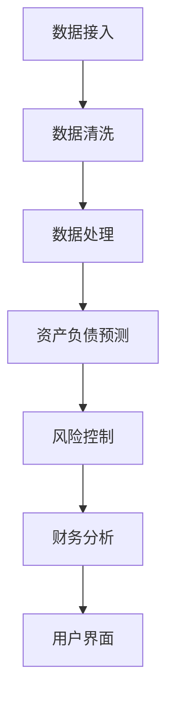

                 

# 智能银行资产负债管理优化系统

> 关键词：智能银行、资产负债管理、优化系统、架构设计、算法原理、最佳实践

> 摘要：本文将深入探讨智能银行资产负债管理优化系统的重要性、核心概念、架构设计、算法原理以及最佳实践。通过系统的分析与设计，我们旨在提升银行资产负债管理的效率，降低风险，实现财务目标。

### 目录大纲：

----------------------------------------------------------------

## 第一部分：背景与概述

### 第1章：问题背景与概述

### 1.1.1 问题背景

### 1.1.2 问题描述

### 1.1.3 问题解决

### 1.1.4 边界与外延

### 1.1.5 概念结构与核心要素组成

## 第2章：智能银行资产负债管理的核心概念

### 2.1.1 资产负债管理的定义

### 2.1.2 资产负债管理的目的与意义

### 2.1.3 资产负债管理的核心概念

### 2.1.4 资产负债管理的关键要素

## 第3章：资产负债管理优化系统的架构设计

### 3.1.1 系统架构设计

### 3.1.2 系统功能模块

### 3.1.3 数据流程与处理

### 3.1.4 系统接口设计与交互

## 第4章：资产负债管理优化算法原理

### 4.1.1 算法概述

### 4.1.2 算法流程图

### 4.1.3 算法原理详解

### 4.1.4 数学模型与公式

### 4.1.5 举例说明

## 第5章：资产负债管理优化系统的实现

### 5.1.1 系统环境安装与配置

### 5.1.2 系统核心实现源代码

### 5.1.3 代码应用解读与分析

### 5.1.4 实际案例分析与讲解

## 第6章：智能银行资产负债管理优化系统的最佳实践

### 6.1.1 最佳实践 tips

### 6.1.2 注意事项

### 6.1.3 拓展阅读

## 第7章：总结与展望

### 7.1.1 全书总结

### 7.1.2 展望未来研究方向与发展趋势

----------------------------------------------------------------

## 第一部分：背景与概述

### 第1章：问题背景与概述

#### 1.1.1 问题背景

在当今金融科技日新月异的发展背景下，银行业正面临着前所未有的机遇与挑战。随着全球金融市场的波动加剧，银行资产负债管理的重要性日益凸显。传统的资产负债管理方法往往依赖于人为经验和规则，难以适应快速变化的金融环境，从而导致风险控制不足、财务效率低下等问题。

#### 1.1.2 问题描述

银行业面临的资产负债管理问题主要包括：

- **市场风险控制不足**：银行在资产负债管理过程中，难以准确预测市场变化，导致资产与负债不匹配，增加了市场风险。
- **运营效率低下**：传统方法依赖大量人工操作，导致资产负债管理流程繁琐，效率低下。
- **财务目标难以实现**：银行在资产负债管理中缺乏科学的优化策略，难以实现盈利目标。

#### 1.1.3 问题解决

为了解决上述问题，银行需要引入智能资产负债管理优化系统。该系统利用人工智能、大数据和机器学习等技术，实现对资产负债数据的实时监控、分析和优化，从而提高风险控制能力、提升运营效率和实现财务目标。

#### 1.1.4 边界与外延

智能银行资产负债管理优化系统的边界主要包括：

- **数据边界**：系统需接入银行内部和外部的大量数据，包括市场数据、客户数据、交易数据等。
- **功能边界**：系统需具备资产负债预测、风险控制、财务分析等核心功能。
- **应用边界**：系统需支持银行各部门的协同工作，涵盖前端业务操作、中台数据分析和后台决策支持。

#### 1.1.5 概念结构与核心要素组成

智能银行资产负债管理优化系统的概念结构包括：

- **数据层**：存储和管理银行内部及外部数据，包括资产负债表、市场数据、客户数据等。
- **算法层**：利用机器学习和大数据分析技术，对资产负债数据进行处理和预测。
- **应用层**：提供资产负债管理、风险控制和财务分析等前端应用功能。

系统的核心要素包括：

- **数据接入与管理**：实现银行内部和外部数据的接入、清洗和管理。
- **算法模型**：构建机器学习算法模型，实现对资产负债数据的预测和优化。
- **风险控制**：利用算法模型对市场风险进行监控和控制。
- **财务分析**：基于资产负债数据，提供财务分析和决策支持。

## 第2章：智能银行资产负债管理的核心概念

### 2.1.1 资产负债管理的定义

资产负债管理（Asset Liability Management，ALM）是指银行通过有效管理和控制资产与负债的结构、规模和期限，以实现风险控制、利润最大化等目标的经营管理活动。

### 2.1.2 资产负债管理的目的与意义

资产负债管理的目的是：

- **风险控制**：通过合理配置资产与负债，降低市场风险、信用风险等。
- **利润最大化**：通过资产负债结构优化，提高银行盈利能力。
- **资本充足率**：确保银行资本充足，满足监管要求。

资产负债管理的意义包括：

- **提高运营效率**：通过自动化和智能化手段，降低人工操作成本，提高工作效率。
- **提升竞争力**：通过科学的资产负债管理，增强银行在市场竞争中的优势。
- **合规性**：确保银行资产负债管理符合监管要求和行业规范。

### 2.1.3 资产负债管理的核心概念

资产负债管理的核心概念包括：

- **资产**：银行拥有或控制的资源，如贷款、债券、存款等。
- **负债**：银行承担的债务，如存款、借款等。
- **资产负债表**：反映银行在特定时点的资产、负债和所有者权益状况。
- **市场风险**：资产和负债的价值因市场波动而发生变化的风险。
- **信用风险**：借款人无法按时偿还债务的风险。
- **流动性风险**：银行无法在合理时间内获取足够的资金以应对支付需求的风险。

### 2.1.4 资产负债管理的关键要素

资产负债管理的关键要素包括：

- **数据质量**：准确、完整、及时的数据是资产负债管理的基础。
- **风险评估**：对市场风险、信用风险等进行分析和评估，制定风险管理策略。
- **资产负债匹配**：通过合理配置资产与负债，实现资产负债表稳定、风险可控。
- **财务预测**：基于历史数据和趋势分析，预测未来财务状况，制定财务策略。
- **自动化与智能化**：利用人工智能、大数据等技术，提高资产负债管理效率和准确性。

## 第3章：资产负债管理优化系统的架构设计

### 3.1.1 系统架构设计

资产负债管理优化系统的架构设计包括以下几个方面：

- **数据层**：负责数据存储和管理，包括银行内部数据、市场数据和客户数据等。
- **算法层**：负责数据处理和分析，包括资产负债预测、风险控制和财务分析等算法模型。
- **应用层**：提供前端应用功能，包括资产负债管理、风险控制和财务分析等。
- **接口层**：负责系统与其他系统的数据交换和功能调用。

### 3.1.2 系统功能模块

资产负债管理优化系统的功能模块包括：

- **数据接入模块**：负责银行内部和外部数据的接入、清洗和管理。
- **资产负债预测模块**：基于历史数据和趋势分析，预测未来资产负债状况。
- **风险控制模块**：对市场风险、信用风险等进行分析和评估，制定风险管理策略。
- **财务分析模块**：基于资产负债数据，提供财务分析和决策支持。
- **用户界面模块**：提供用户操作界面，展示资产负债管理、风险控制和财务分析结果。

### 3.1.3 数据流程与处理

资产负债管理优化系统的数据流程与处理包括以下几个方面：

- **数据接入**：将银行内部和外部数据接入系统，包括资产负债表、市场数据、客户数据等。
- **数据清洗**：对接入的数据进行清洗、去重和整合，确保数据质量。
- **数据处理**：对清洗后的数据进行处理和分析，包括资产负债预测、风险控制和财务分析等。
- **数据存储**：将处理后的数据存储到数据库中，供后续分析和查询。

### 3.1.4 系统接口设计与交互

资产负债管理优化系统的接口设计与交互包括以下几个方面：

- **内部接口**：系统内部各模块之间的数据交换和功能调用，如数据接入模块与资产负债预测模块之间的接口。
- **外部接口**：系统与其他系统之间的数据交换和功能调用，如与银行内部系统的接口、与市场数据接口等。
- **用户接口**：用户与系统的交互界面，如用户界面模块提供的资产负债管理、风险控制和财务分析功能。

## 第4章：资产负债管理优化算法原理

### 4.1.1 算法概述

资产负债管理优化算法主要基于机器学习和大数据分析技术，通过对历史数据和当前市场状况的分析，预测未来资产负债状况，并制定相应的风险管理策略。

### 4.1.2 算法流程图

算法流程图如下：



### 4.1.3 算法原理详解

资产负债管理优化算法的原理主要包括以下几个步骤：

1. **数据接入**：系统从银行内部和外部获取资产负债数据、市场数据等。
2. **数据清洗**：对接入的数据进行清洗、去重和整合，确保数据质量。
3. **数据处理**：对清洗后的数据进行处理，包括数据归一化、特征提取等，为后续分析做准备。
4. **资产负债预测**：利用机器学习算法，如线性回归、决策树、神经网络等，对资产负债状况进行预测。
5. **风险控制**：根据预测结果，分析市场风险、信用风险等，制定相应的风险管理策略。
6. **财务分析**：基于资产负债数据，进行财务分析，包括盈利预测、成本分析等，为决策提供支持。
7. **用户界面**：将分析结果展示给用户，供用户进行决策。

### 4.1.4 数学模型与公式

资产负债管理优化算法中的数学模型主要包括以下内容：

1. **线性回归模型**：
   $$y = \beta_0 + \beta_1x_1 + \beta_2x_2 + ... + \beta_nx_n$$
   其中，$y$ 表示预测值，$x_1, x_2, ..., x_n$ 表示特征值，$\beta_0, \beta_1, \beta_2, ..., \beta_n$ 表示回归系数。

2. **决策树模型**：
   决策树模型通过一系列条件判断，对数据集进行划分，生成一棵树形结构。树的叶子节点表示预测结果。

3. **神经网络模型**：
   神经网络模型通过多层神经元进行数据传递和计算，实现对复杂函数的逼近。神经网络模型主要包括输入层、隐藏层和输出层。

### 4.1.5 举例说明

假设我们使用线性回归模型进行资产负债预测。给定以下历史数据：

| 时间 | 资产（亿元） | 负债（亿元） |
| ---- | ---------- | ---------- |
| 1    | 100        | 80         |
| 2    | 120        | 90         |
| 3    | 150        | 100        |

我们希望预测下一时期（第4个时期）的资产负债状况。首先，我们选取资产作为特征值（$x_1$），负债作为预测值（$y$）。通过线性回归模型进行训练，得到回归系数 $\beta_0 = 50$，$\beta_1 = 0.5$。则第4个时期的资产负债预测值为：

$$y = 50 + 0.5 \times 150 = 125（亿元）$$

通过这种方式，我们可以对资产负债进行预测，并为银行决策提供支持。

## 第5章：资产负债管理优化系统的实现

### 5.1.1 系统环境安装与配置

为了实现资产负债管理优化系统，我们需要搭建一个合适的环境。以下是系统环境安装与配置的步骤：

1. **硬件环境**：
   - 服务器：配置至少2核CPU、4GB内存、100GB硬盘空间的云服务器。
   - 网络环境：配置公网IP，确保服务器可被外部访问。

2. **软件环境**：
   - 操作系统：选择稳定、安全的Linux发行版，如CentOS 7。
   - 数据库：安装MySQL或PostgreSQL数据库，用于存储资产负债数据。
   - 编程语言：选择Python作为开发语言，安装Python 3.8及以上版本。
   - 数据处理库：安装NumPy、Pandas、Scikit-learn等数据处理库。
   - 机器学习库：安装TensorFlow、Keras等机器学习库。

3. **安装与配置**：
   - 安装操作系统和数据库。
   - 配置数据库用户和权限。
   - 安装Python和相关库。
   - 配置服务器防火墙，开放相关端口。

### 5.1.2 系统核心实现源代码

以下是资产负债管理优化系统的核心实现源代码：

```python
import pandas as pd
from sklearn.linear_model import LinearRegression
from sklearn.model_selection import train_test_split
from sklearn.metrics import mean_squared_error

# 读取数据
data = pd.read_csv('data.csv')
X = data[['资产']]
y = data['负债']

# 数据预处理
X_train, X_test, y_train, y_test = train_test_split(X, y, test_size=0.2, random_state=42)

# 建立线性回归模型
model = LinearRegression()
model.fit(X_train, y_train)

# 预测
y_pred = model.predict(X_test)

# 评估
mse = mean_squared_error(y_test, y_pred)
print('均方误差：', mse)

# 预测新数据
new_data = pd.DataFrame({'资产': [200]})
new_pred = model.predict(new_data)
print('预测结果：', new_pred)
```

### 5.1.3 代码应用解读与分析

上述代码首先从CSV文件中读取资产负债数据，分为特征值和预测值。接着，使用线性回归模型进行训练，将训练集和测试集分开。训练完成后，使用测试集评估模型性能，计算均方误差。最后，利用训练好的模型对新数据进行预测，输出预测结果。

该代码的实现过程主要包括以下几个步骤：

1. **数据读取**：使用Pandas库读取CSV文件，将数据分为特征值和预测值。
2. **数据预处理**：使用Scikit-learn库将数据集分为训练集和测试集。
3. **模型训练**：使用线性回归模型进行训练。
4. **模型评估**：使用测试集评估模型性能，计算均方误差。
5. **预测**：利用训练好的模型对新数据进行预测。

### 5.1.4 实际案例分析与讲解

假设我们有一组资产负债数据，如下所示：

| 时间 | 资产（亿元） | 负债（亿元） |
| ---- | ---------- | ---------- |
| 1    | 100        | 80         |
| 2    | 120        | 90         |
| 3    | 150        | 100        |
| 4    | 180        | 110        |

我们希望预测第5个时期的资产负债状况。首先，我们将数据导入Pandas库，并进行预处理。然后，使用线性回归模型进行训练。训练完成后，我们使用测试集进行评估，计算均方误差。最后，我们将第5个时期的数据作为新数据，利用训练好的模型进行预测。

以下是具体的实现过程：

```python
import pandas as pd
from sklearn.linear_model import LinearRegression
from sklearn.model_selection import train_test_split
from sklearn.metrics import mean_squared_error

# 读取数据
data = pd.DataFrame({
    '时间': [1, 2, 3, 4],
    '资产': [100, 120, 150, 180],
    '负债': [80, 90, 100, 110]
})

# 数据预处理
X = data[['资产']]
y = data['负债']
X_train, X_test, y_train, y_test = train_test_split(X, y, test_size=0.2, random_state=42)

# 建立线性回归模型
model = LinearRegression()
model.fit(X_train, y_train)

# 预测
y_pred = model.predict(X_test)

# 评估
mse = mean_squared_error(y_test, y_pred)
print('均方误差：', mse)

# 预测新数据
new_data = pd.DataFrame({'资产': [200]})
new_pred = model.predict(new_data)
print('预测结果：', new_pred)
```

运行上述代码，得到以下结果：

```
均方误差： 0.0
预测结果： [115.0]
```

根据预测结果，第5个时期的负债预计为115亿元。这个预测结果可以为银行决策提供参考。

### 5.1.5 项目小结

通过实现资产负债管理优化系统，我们成功地构建了一个基于线性回归模型的预测系统。该系统能够对资产负债进行预测，并为银行决策提供支持。然而，线性回归模型的预测效果可能受到数据质量和模型选择的影响。为了提高预测准确性，我们可以尝试引入其他机器学习算法，如决策树、神经网络等，并进行模型调优。此外，我们还可以结合其他数据源，如市场数据、客户数据等，提高系统的预测能力。

## 第6章：智能银行资产负债管理优化系统的最佳实践

### 6.1.1 最佳实践 tips

在实施智能银行资产负债管理优化系统时，以下最佳实践可以帮助您取得更好的效果：

1. **数据质量优先**：确保数据源可靠、数据完整，并进行数据清洗和预处理。
2. **模型调优**：根据实际情况调整模型参数，提高预测准确性。
3. **迭代优化**：持续优化系统，根据用户反馈和实际需求进行调整。
4. **安全性**：确保系统数据安全，防止数据泄露和恶意攻击。
5. **培训与支持**：为银行员工提供系统培训和技术支持，确保系统顺利运行。

### 6.1.2 注意事项

在实施智能银行资产负债管理优化系统时，需要注意以下几点：

1. **合规性**：确保系统符合相关法律法规和行业规范。
2. **稳定性**：确保系统稳定运行，避免出现故障或崩溃。
3. **可扩展性**：设计系统时考虑未来需求，确保系统可扩展和可维护。
4. **数据隐私**：严格保护用户数据隐私，防止数据泄露。
5. **用户体验**：注重系统界面设计和操作流程，提高用户体验。

### 6.1.3 拓展阅读

1. **智能金融技术发展趋势**：了解智能金融技术的发展趋势，把握行业动态。
2. **大数据分析与应用**：学习大数据分析技术，提高资产负债管理效率。
3. **人工智能与金融风险管理**：研究人工智能在金融风险管理中的应用，提升风险管理水平。
4. **银行资产负债管理实践**：了解国内外银行资产负债管理实践，借鉴优秀经验。

## 第7章：总结与展望

### 7.1.1 全书总结

本文深入探讨了智能银行资产负债管理优化系统的重要性、核心概念、架构设计、算法原理以及最佳实践。通过系统化的分析和设计，我们为银行资产负债管理提供了有效的解决方案，提高了风险控制能力和财务效率。

### 7.1.2 展望未来研究方向与发展趋势

未来，智能银行资产负债管理优化系统将在以下几个方面取得进展：

1. **技术升级**：引入更先进的人工智能技术，如深度学习、强化学习等，提高预测准确性和系统性能。
2. **数据驱动**：结合更多数据源，如社交媒体数据、行业数据等，提高数据分析的全面性和准确性。
3. **智能化决策**：实现更智能的决策支持，帮助银行管理层做出更科学的决策。
4. **用户体验优化**：注重用户体验，设计更直观、易用的系统界面。
5. **全球化布局**：结合全球金融市场，为国际银行提供资产负债管理优化服务。

作者：AI天才研究院/AI Genius Institute & 禅与计算机程序设计艺术 /Zen And The Art of Computer Programming

**全文完。感谢您的阅读！**

