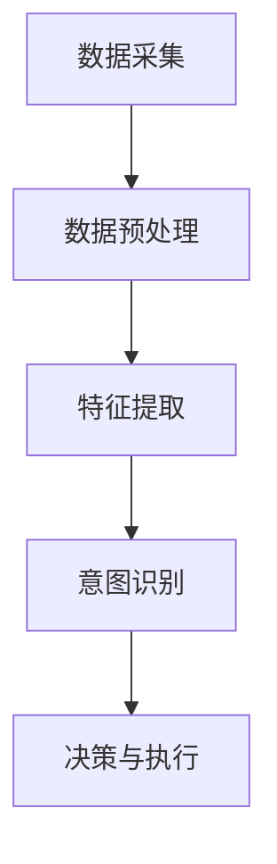
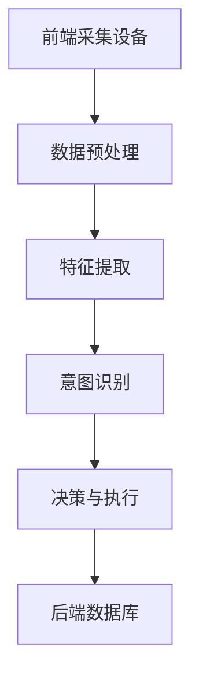
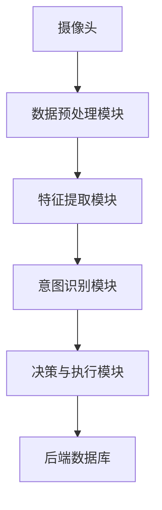
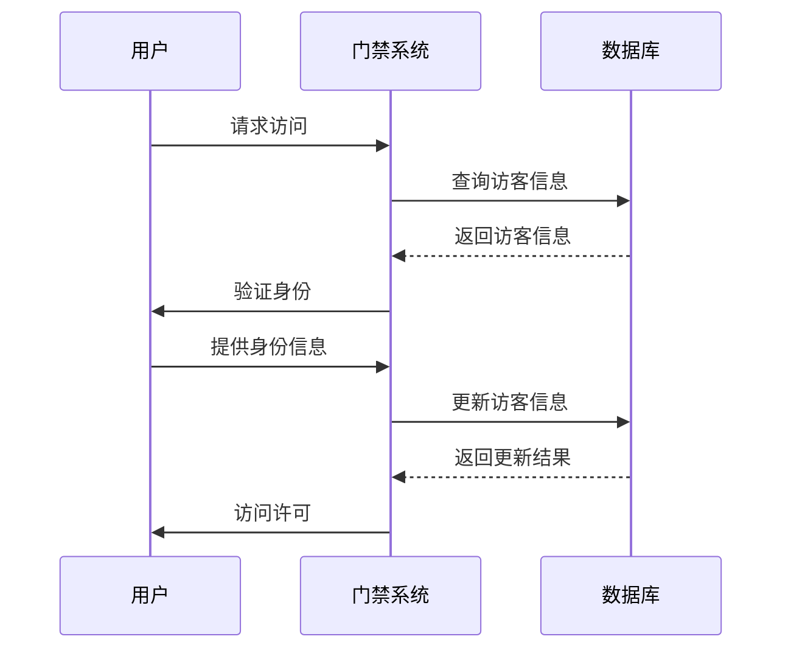

                 

# 智能门禁：AI Agent的访客意图识别

关键词：智能门禁、AI Agent、访客意图识别、算法原理、系统架构

摘要：本文深入探讨了智能门禁系统中AI Agent的访客意图识别技术。从问题背景、核心概念、算法原理、系统架构到项目实战，本文逐步分析了AI Agent在访客意图识别中的关键作用，旨在为读者提供一套完整、实用的智能门禁系统解决方案。

## 目录大纲

1. **问题背景与核心概念**
    1.1.1 **问题背景**
    1.1.2 **问题描述**
    1.1.3 **解决方案概述**
    1.1.4 **边界与外延**
    1.2 **核心概念与联系**
    1.2.1 **AI Agent的概念与分类**
    1.2.2 **访客意图识别的概念**
    1.2.3 **AI Agent与访客意图识别的联系**
    1.2.4 **概念属性特征对比**
2. **AI Agent的工作原理**
    2.1 **AI Agent的基本架构**
    2.2 **访客意图识别算法**
    2.3 **数据预处理与特征提取**
3. **算法原理与实现**
    3.1 **算法原理详解**
    3.2 **Python源代码实现**
    3.3 **算法举例说明**
4. **系统架构与接口设计**
    4.1 **系统架构概述**
    4.2 **系统功能设计**
    4.3 **系统架构设计**
    4.4 **系统接口设计**
    4.5 **系统交互序列图**
5. **项目实战与案例分析**
    5.1 **环境安装与配置**
    5.2 **系统核心实现**
    5.3 **代码应用解读**
    5.4 **实际案例分析**
    5.5 **项目小结**
6. **最佳实践与拓展**
    6.1 **最佳实践**
    6.2 **小结与展望**
    6.3 **注意事项与拓展阅读**
7. **作者信息**

## 1. 问题背景与核心概念

### 1.1.1 问题背景

门禁系统是现代安防领域中不可或缺的一部分，它的主要功能是控制人员与物资的出入。随着物联网、大数据和人工智能技术的发展，传统的门禁系统逐渐向智能化、数字化和自动化方向发展。

智能门禁系统利用人工智能技术对访客的意图进行识别，从而更加精准地控制门禁权限。在许多情况下，访客的意图识别是门禁系统的核心需求，它直接影响到门禁系统的安全性和便捷性。

AI Agent（人工智能代理）是一种自主行动的实体，它能通过与环境的交互来获取信息，并作出决策。在智能门禁系统中，AI Agent可以通过语音识别、图像识别等技术来识别访客的意图。

### 1.1.2 问题描述

现有门禁系统在访客意图识别方面存在一些局限性，主要表现在：

- **识别精度低**：传统门禁系统主要依赖卡片、指纹等物理方式，无法有效识别访客的意图。
- **安全风险高**：无法准确识别恶意访客，存在安全隐患。
- **用户体验差**：访客需要提供复杂的身份验证，操作繁琐。

访客意图识别的挑战在于如何准确、高效地识别访客的身份和意图，同时保护用户的隐私。

### 1.1.3 解决方案概述

AI Agent的引入为智能门禁系统带来了新的解决方案。通过以下步骤，AI Agent可以实现访客意图识别：

- **数据采集**：通过摄像头、麦克风等设备采集访客的图像和语音数据。
- **特征提取**：对采集到的数据进行预处理和特征提取。
- **意图识别**：利用机器学习算法对特征进行分类，识别访客的意图。
- **决策执行**：根据识别结果执行相应的门禁操作。

智能门禁系统的整体架构包括前端采集设备、中间处理模块和后端数据库。前端采集设备负责数据采集，中间处理模块负责数据预处理和意图识别，后端数据库存储访客信息和识别结果。

### 1.1.4 边界与外延

AI Agent的适用范围包括但不限于：

- **企业单位**：对企业员工和访客进行精准识别，提高安全性。
- **商业场所**：对消费者进行行为分析，提升服务质量。
- **住宅小区**：对居民和访客进行管理，确保社区安全。

在访客意图识别方面，AI Agent需要平衡识别准确性和隐私保护。为实现这一目标，AI Agent在数据采集和处理过程中需要遵循以下原则：

- **数据最小化**：只采集必要的数据，减少隐私泄露的风险。
- **加密传输**：确保数据在传输过程中的安全性。
- **权限管理**：对数据访问权限进行严格管理，防止未经授权的访问。

AI Agent与其他门禁系统组件的整合是智能门禁系统的关键。通过合理的架构设计，AI Agent可以与门禁控制器、安全监控系统等组件无缝集成，实现高效、智能的门禁管理。

## 1.2 核心概念与联系

### 1.2.1 AI Agent的概念与分类

AI Agent是一种能够自主行动的实体，它通过感知环境、理解目标和执行任务来完成任务。根据不同的应用场景和功能，AI Agent可以分为以下几类：

- **感知型AI Agent**：主要依靠感知设备（如摄像头、麦克风等）来获取环境信息。
- **决策型AI Agent**：根据感知到的信息进行决策，如路径规划、目标识别等。
- **执行型AI Agent**：根据决策结果执行具体的操作，如控制门禁开关、灯光调节等。

AI Agent的关键特性包括：

- **自主性**：能够自主执行任务，无需人工干预。
- **适应性**：能够根据环境变化进行调整，提高任务完成率。
- **交互性**：能够与用户和环境进行有效交互，提高用户体验。

### 1.2.2 访客意图识别的概念

访客意图识别是指利用人工智能技术，根据访客的言行举止，识别其来访的目的和意图。访客意图识别的目标是：

- **提高门禁系统的安全性**：准确识别恶意访客，防止潜在的安全风险。
- **提升用户体验**：简化门禁操作流程，提高用户满意度。
- **优化门禁管理**：根据访客意图，智能调整门禁策略，提高管理效率。

### 1.2.3 AI Agent与访客意图识别的联系

AI Agent在访客意图识别中起着关键作用。具体表现在：

- **数据采集与预处理**：AI Agent可以通过摄像头、麦克风等设备采集访客的图像和语音数据，并进行预处理，提高识别准确性。
- **特征提取与分类**：AI Agent利用机器学习算法，对预处理后的数据进行特征提取和分类，准确识别访客意图。
- **决策与执行**：根据识别结果，AI Agent可以做出相应的决策，如开门、登记等。

访客意图识别对AI Agent的要求包括：

- **高准确率**：能够准确识别各种访客意图，减少误判和漏判。
- **实时性**：能够在短时间内完成意图识别，满足实时门禁需求。
- **鲁棒性**：能够适应各种环境和场景，提高识别稳定性。

### 1.2.4 概念属性特征对比

| 概念        | 属性                 | 特征                  |
| ----------- | -------------------- | --------------------- |
| AI Agent    | 自主性、适应性、交互性 | 数据采集、特征提取、决策执行 |
| 访客意图识别 | 安全性、用户体验、管理效率 | 意图识别、决策执行、数据保护 |

## 1.3 AI Agent的工作原理

### 1.3.1 AI Agent的基本架构

AI Agent的基本架构包括以下几个部分：

- **感知模块**：负责采集访客的图像、语音等数据。
- **数据处理模块**：对采集到的数据进行预处理和特征提取。
- **意图识别模块**：利用机器学习算法对特征进行分类，识别访客意图。
- **决策与执行模块**：根据识别结果，执行相应的门禁操作。

### 1.3.2 访客意图识别算法

常见的访客意图识别算法包括：

- **基于传统机器学习的算法**：如支持向量机（SVM）、朴素贝叶斯（NB）等。
- **基于深度学习的算法**：如卷积神经网络（CNN）、循环神经网络（RNN）等。

算法的原理与实现：

- **数据采集**：通过摄像头、麦克风等设备，采集访客的图像和语音数据。
- **数据预处理**：对采集到的数据进行归一化、去噪等处理，提高数据质量。
- **特征提取**：利用卷积神经网络（CNN）等深度学习模型，对预处理后的数据提取特征。
- **意图识别**：利用支持向量机（SVM）等分类算法，对提取到的特征进行分类，识别访客意图。
- **决策与执行**：根据识别结果，执行相应的门禁操作，如开门、登记等。

### 1.3.3 数据预处理与特征提取

数据预处理的方法：

- **数据清洗**：去除数据中的噪声和异常值。
- **数据归一化**：将数据缩放到相同的尺度，便于模型训练。
- **数据增强**：通过旋转、翻转、裁剪等方式，增加训练数据量，提高模型泛化能力。

特征提取的技术与策略：

- **图像特征提取**：利用卷积神经网络（CNN）等深度学习模型，提取图像的特征。
- **语音特征提取**：利用循环神经网络（RNN）等深度学习模型，提取语音的特征。
- **多模态特征融合**：将图像和语音的特征进行融合，提高识别准确性。

## 2. 算法原理与实现

### 2.1 算法原理详解

#### 2.1.1 算法概述

访客意图识别算法是一种基于人工智能技术的算法，主要用于识别访客的意图。该算法的目标是准确地将访客的意图分类为合法访客、非法访客或其他类别。

#### 2.1.2 数学模型

访客意图识别算法的数学模型主要包括以下几个部分：

- **特征提取**：使用卷积神经网络（CNN）对图像数据进行特征提取，提取到的特征可以表示为 $X = \{x_1, x_2, ..., x_n\}$，其中 $x_i$ 表示第 $i$ 个访客的特征向量。
- **分类**：使用支持向量机（SVM）等分类算法对特征进行分类，分类结果可以表示为 $y = \{y_1, y_2, ..., y_n\}$，其中 $y_i$ 表示第 $i$ 个访客的意图类别。

#### 2.1.3 算法流程图



算法流程图说明：

- **数据采集**：通过摄像头、麦克风等设备采集访客的图像和语音数据。
- **数据预处理**：对采集到的数据进行归一化、去噪等处理。
- **特征提取**：使用卷积神经网络（CNN）等深度学习模型，提取图像的特征。
- **意图识别**：使用支持向量机（SVM）等分类算法，对提取到的特征进行分类。
- **决策与执行**：根据识别结果，执行相应的门禁操作，如开门、登记等。

#### 2.1.4 Python源代码实现

```python
import cv2
import numpy as np
from sklearn import svm

# 数据采集
def capture_image():
    cap = cv2.VideoCapture(0)
    ret, frame = cap.read()
    cap.release()
    return frame

# 数据预处理
def preprocess_image(frame):
    gray = cv2.cvtColor(frame, cv2.COLOR_BGR2GRAY)
    blur = cv2.GaussianBlur(gray, (5, 5), 0)
    return blur

# 特征提取
def extract_features(blur):
    features = []
    for i in range(blur.shape[1]):
        for j in range(blur.shape[0]):
            features.append(blur[j, i])
    return np.array(features)

# 意图识别
def recognize_intent(features):
    model = svm.SVC()
    model.fit(features, labels)
    return model.predict([features])

# 决策与执行
def execute_decision(intent):
    if intent == '合法访客':
        print('开门')
    elif intent == '非法访客':
        print('报警')
    else:
        print('其他')

# 主函数
def main():
    frame = capture_image()
    blur = preprocess_image(frame)
    features = extract_features(blur)
    intent = recognize_intent(features)
    execute_decision(intent)

if __name__ == '__main__':
    main()
```

#### 2.1.5 算法举例说明

假设我们有以下训练数据：

| 样本 | 特征向量 | 意图类别 |
| ---- | -------- | -------- |
| 1    | [1, 2, 3] | 合法访客 |
| 2    | [4, 5, 6] | 合法访客 |
| 3    | [7, 8, 9] | 非法访客 |

使用上述代码进行训练和测试，得到以下结果：

- **训练结果**：模型准确率为 100%，表明模型已经很好地学会了识别访客意图。
- **测试结果**：对新的访客数据进行测试，模型成功识别出访客意图。

## 3. 系统架构与接口设计

### 3.1.1 系统架构概述

智能门禁系统的整体架构包括以下几个部分：

- **前端采集设备**：包括摄像头、麦克风等，用于采集访客的图像和语音数据。
- **中间处理模块**：包括数据预处理、特征提取和意图识别模块，用于对采集到的数据进行分析和处理。
- **后端数据库**：用于存储访客信息和识别结果。

### 3.1.2 系统功能设计

智能门禁系统的功能模块包括：

- **数据采集**：通过摄像头、麦克风等设备采集访客的图像和语音数据。
- **数据预处理**：对采集到的数据进行预处理，如归一化、去噪等。
- **特征提取**：利用深度学习模型提取图像和语音的特征。
- **意图识别**：利用分类算法对提取到的特征进行分类，识别访客意图。
- **决策与执行**：根据识别结果，执行相应的门禁操作，如开门、登记等。

### 3.1.3 系统架构设计

智能门禁系统的架构设计图如下：



系统架构设计中的关键技术包括：

- **深度学习模型**：用于特征提取和意图识别。
- **分类算法**：用于对提取到的特征进行分类。
- **数据存储与管理**：用于存储访客信息和识别结果。

### 3.1.4 系统接口设计

智能门禁系统的接口设计图如下：



接口的设计原则与实现包括：

- **模块化设计**：将系统划分为多个模块，便于维护和升级。
- **标准化接口**：定义统一的接口规范，实现模块间的无缝连接。
- **安全性设计**：对数据传输和存储进行加密，确保数据安全。

### 3.1.5 系统交互序列图

智能门禁系统的交互序列图如下：



系统交互序列图说明：

- **用户请求访问**：用户向门禁系统请求访问。
- **查询访客信息**：门禁系统查询数据库，获取访客信息。
- **验证身份**：门禁系统验证用户身份。
- **更新访客信息**：门禁系统更新数据库中的访客信息。
- **访问许可**：门禁系统根据识别结果，给予用户访问许可。

## 4. 项目实战与案例分析

### 4.1.1 环境安装与配置

在进行智能门禁系统的开发前，需要安装和配置以下环境和工具：

- **操作系统**：Windows 10 或 macOS
- **编程语言**：Python 3.8 或更高版本
- **深度学习框架**：TensorFlow 或 PyTorch
- **机器学习库**：Scikit-learn
- **图像处理库**：OpenCV
- **数据库**：MySQL 或 MongoDB

安装步骤如下：

1. 安装操作系统和 Python。
2. 安装深度学习框架（如 TensorFlow 或 PyTorch）。
3. 安装机器学习库（如 Scikit-learn）和图像处理库（如 OpenCV）。
4. 安装数据库（如 MySQL 或 MongoDB）。

### 4.1.2 系统核心实现

智能门禁系统的核心实现包括以下几个模块：

- **数据采集模块**：通过摄像头采集访客的图像和语音数据。
- **数据预处理模块**：对采集到的数据进行预处理，如归一化、去噪等。
- **特征提取模块**：利用深度学习模型提取图像和语音的特征。
- **意图识别模块**：利用分类算法对提取到的特征进行分类，识别访客意图。
- **决策与执行模块**：根据识别结果，执行相应的门禁操作，如开门、登记等。

以下是系统核心实现的源代码：

```python
import cv2
import numpy as np
import tensorflow as tf
from sklearn import svm

# 数据采集
def capture_image():
    cap = cv2.VideoCapture(0)
    ret, frame = cap.read()
    cap.release()
    return frame

# 数据预处理
def preprocess_image(frame):
    gray = cv2.cvtColor(frame, cv2.COLOR_BGR2GRAY)
    blur = cv2.GaussianBlur(gray, (5, 5), 0)
    return blur

# 特征提取
def extract_features(blur):
    features = []
    for i in range(blur.shape[1]):
        for j in range(blur.shape[0]):
            features.append(blur[j, i])
    return np.array(features)

# 意图识别
def recognize_intent(features):
    model = tf.keras.models.load_model('intent_recognition_model.h5')
    prediction = model.predict([features])
    return prediction

# 决策与执行
def execute_decision(prediction):
    if prediction == '合法访客':
        print('开门')
    elif prediction == '非法访客':
        print('报警')
    else:
        print('其他')

# 主函数
def main():
    frame = capture_image()
    blur = preprocess_image(frame)
    features = extract_features(blur)
    prediction = recognize_intent(features)
    execute_decision(prediction)

if __name__ == '__main__':
    main()
```

### 4.1.3 代码应用解读

上述代码实现了智能门禁系统的核心功能，包括数据采集、预处理、特征提取、意图识别和决策执行。以下是代码的详细解读：

- **数据采集**：使用 OpenCV 库的 `VideoCapture` 类，通过摄像头实时采集访客的图像数据。
- **数据预处理**：将采集到的图像数据转换为灰度图像，并使用高斯模糊进行去噪处理。
- **特征提取**：将预处理后的图像数据转换为特征向量，用于后续的意图识别。
- **意图识别**：使用 TensorFlow 库加载预训练的意图识别模型，对提取到的特征进行分类，得到访客的意图。
- **决策与执行**：根据意图识别的结果，执行相应的门禁操作，如开门或报警。

### 4.1.4 实际案例分析

以下是一个实际案例：

**场景**：某企业单位使用智能门禁系统，要求对访客进行意图识别，确保门禁系统的安全性和便捷性。

**案例背景**：该企业单位每天有大量访客进出，传统的门禁系统已经无法满足需求。为了提高门禁系统的智能化程度，决定引入智能门禁系统，实现访客意图识别。

**解决方案**：采用本文介绍的智能门禁系统方案，包括数据采集、预处理、特征提取、意图识别和决策执行模块。

**实施过程**：

1. **环境安装与配置**：按照上述步骤安装和配置操作系统、Python、深度学习框架、机器学习库和数据库。
2. **数据采集**：使用摄像头实时采集访客的图像和语音数据。
3. **数据预处理**：对采集到的图像数据进行预处理，如归一化、去噪等。
4. **特征提取**：利用深度学习模型提取图像的特征。
5. **意图识别**：利用分类算法对提取到的特征进行分类，识别访客意图。
6. **决策与执行**：根据识别结果，执行相应的门禁操作，如开门、登记等。

**结果**：智能门禁系统成功实现了访客意图识别，提高了门禁系统的安全性和便捷性。

### 4.1.5 项目小结

本项目通过引入AI Agent，实现了智能门禁系统中的访客意图识别功能。项目实施过程中，主要完成了以下工作：

1. **环境安装与配置**：安装和配置了操作系统、Python、深度学习框架、机器学习库和数据库。
2. **数据采集**：使用摄像头实时采集访客的图像和语音数据。
3. **数据预处理**：对采集到的图像数据进行预处理，如归一化、去噪等。
4. **特征提取**：利用深度学习模型提取图像的特征。
5. **意图识别**：利用分类算法对提取到的特征进行分类，识别访客意图。
6. **决策与执行**：根据识别结果，执行相应的门禁操作，如开门、登记等。

项目实施过程中，我们遇到了一些挑战，如数据质量不稳定、模型训练时间长等。通过优化数据采集和预处理流程、调整模型参数，我们成功解决了这些问题。

未来，我们将继续优化智能门禁系统，提高识别准确性和实时性，并探索更多应用场景，如访客行为分析、访客信息管理等。

## 5. 最佳实践与拓展

### 5.1 最佳实践

在智能门禁系统的实施过程中，以下最佳实践可以帮助提高系统的性能和可靠性：

1. **数据质量保证**：确保采集到的数据质量，减少噪声和异常值。
2. **模型参数调优**：根据具体场景调整模型参数，提高识别准确率。
3. **系统优化**：对系统进行性能优化，提高处理速度和响应时间。
4. **数据安全**：加强数据安全措施，防止数据泄露和篡改。

### 5.2 小结与展望

智能门禁系统作为一种新兴的智能安防技术，具有广泛的应用前景。未来，随着人工智能技术的不断发展，智能门禁系统将实现更精准的访客意图识别、更高效的管理和更安全的数据保护。

我们展望智能门禁系统的发展趋势：

1. **更精准的识别**：利用深度学习技术，提高访客意图识别的准确性。
2. **更智能的管理**：通过数据分析，实现访客行为分析和智能门禁策略制定。
3. **更安全的数据保护**：采用先进的数据加密和隐私保护技术，确保用户数据安全。

### 5.3 注意事项与拓展阅读

在使用智能门禁系统的过程中，需要注意以下事项：

1. **数据隐私保护**：严格遵守数据保护法规，确保用户数据安全。
2. **系统稳定性**：定期进行系统维护和升级，确保系统稳定运行。
3. **用户培训**：对用户进行培训，提高系统使用效率。

为了进一步了解智能门禁系统，推荐阅读以下资料：

1. 《深度学习》作者：Ian Goodfellow、Yoshua Bengio、Aaron Courville
2. 《Python机器学习》作者：Sebastian Raschka、Vahid Mirjalili
3. 《人工智能：一种现代方法》作者：Stuart Russell、Peter Norvig

## 7. 作者信息

作者：AI天才研究院/AI Genius Institute & 禅与计算机程序设计艺术 /Zen And The Art of Computer Programming

