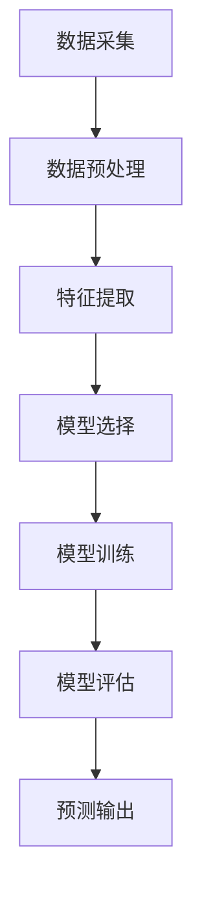
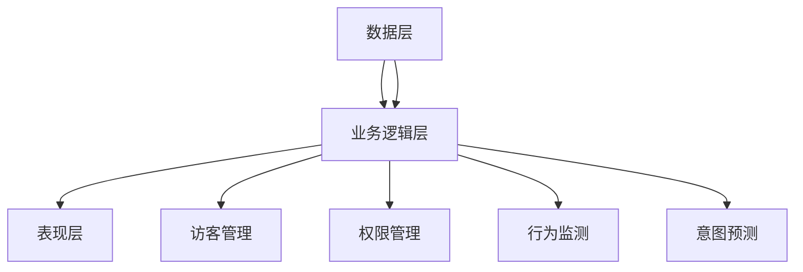
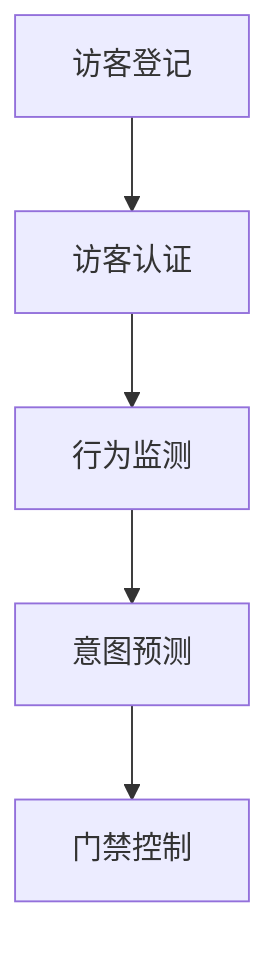

                 


# 智能门禁：AI Agent的访客意图预测

> 关键词：智能门禁，AI Agent，访客意图预测，算法，数学模型，系统架构设计，项目实战

> 摘要：本文深入探讨了智能门禁系统中AI Agent如何预测访客意图。通过分析问题背景、算法原理、数学模型和系统架构设计，本文为智能门禁系统的设计与实现提供了全面的指导。

----------------------------------------------------------------

## 引言

### 1.1 问题背景

随着科技的飞速发展，人工智能（AI）在各个领域的应用越来越广泛。智能门禁系统作为AI技术的一个重要应用场景，已经成为现代安全管理系统的重要组成部分。智能门禁系统通过AI Agent对访客意图进行预测，从而提升门禁系统的安全性和便捷性。

### 1.2 问题描述

在智能门禁系统中，访客意图预测是关键环节。预测访客意图的目的是为了确保门禁系统能够对不同的访客行为做出适当的响应。例如，对于正常的商务访客，系统可以自动开门；而对于未经预约的访客，系统可能会报警或拒绝开门。然而，如何准确预测访客意图成为了一个复杂的问题。

### 1.3 问题解决

为了解决这一问题，本文提出了基于AI Agent的访客意图预测方法。AI Agent是一种智能体，它可以模拟人类思维过程，通过对输入信息的分析，做出相应的决策。在智能门禁系统中，AI Agent通过学习历史访客数据，训练出预测模型，从而实现访客意图的预测。

### 1.4 边界与外延

在智能门禁系统中，访客意图预测需要考虑多个边界条件。首先，隐私保护是必须考虑的问题。其次，系统的安全性和可靠性也是关键因素。此外，智能门禁系统的应用范围也在不断扩展，如智能家居、智能办公等场景。

### 1.5 核心概念

- **智能门禁系统**：一种结合了AI技术和安全管理系统的新型门禁系统。
- **AI Agent**：一种模拟人类思维过程的智能体。
- **访客意图预测**：通过分析访客行为，预测其意图。

----------------------------------------------------------------

## 智能门禁系统概述

### 2.1 智能门禁系统概述

智能门禁系统是一种基于人工智能技术的安全管理系统。它通过集成多种传感器、生物识别技术和智能算法，实现对人员出入的安全管理。智能门禁系统的主要功能包括身份验证、访问控制、实时监控等。

### 2.2 智能门禁系统的发展历程

智能门禁系统的发展可以追溯到20世纪80年代。当时，电子门锁和磁卡门禁系统开始出现。随着计算机技术和网络技术的发展，智能门禁系统逐渐走向成熟。近年来，随着AI技术的崛起，智能门禁系统在功能、性能和智能化程度方面都有了显著提升。

### 2.3 智能门禁系统的组成部分

智能门禁系统通常由以下几个部分组成：

- **生物识别技术**：如指纹识别、面部识别等，用于身份验证。
- **访客管理软件**：用于管理访客信息、预约和审批流程。
- **网络通信技术**：如Wi-Fi、蓝牙等，用于实现设备间的数据传输。

----------------------------------------------------------------

## AI Agent与访客意图预测

### 3.1 AI Agent概述

AI Agent是一种具有自主决策能力的智能体。它可以在没有人类干预的情况下，根据输入的信息，自主地做出决策。在智能门禁系统中，AI Agent负责分析访客行为，预测访客意图，从而实现自动化的门禁控制。

### 3.2 访客意图预测原理

访客意图预测的核心是行为分析。通过对访客的行为数据进行收集、分析和处理，AI Agent可以识别出访客的行为模式，从而预测其意图。具体来说，访客意图预测包括以下几个步骤：

1. **数据采集**：收集访客的行为数据，如时间、地点、动作等。
2. **特征提取**：从行为数据中提取出与访客意图相关的特征。
3. **模型训练**：使用历史数据训练出访客意图预测模型。
4. **预测输出**：将实时采集到的访客行为数据输入模型，预测访客意图。

### 3.3 访客意图预测算法

访客意图预测算法可以分为监督学习和无监督学习两种。监督学习算法需要使用带有标签的历史数据来训练模型，而无监督学习算法则不需要标签数据。在智能门禁系统中，通常使用监督学习算法进行访客意图预测。

常见的监督学习算法包括：

- **决策树**：基于树的结构进行分类，易于理解和实现。
- **支持向量机（SVM）**：通过寻找最优超平面进行分类。
- **神经网络**：通过多层神经网络进行复杂函数拟合。

----------------------------------------------------------------

## 算法原理讲解

### 4.1 算法原理概述

访客意图预测算法的核心是建立预测模型。预测模型通过分析访客的行为数据，学习出访客意图与行为特征之间的关系。具体来说，算法原理包括以下几个步骤：

1. **数据预处理**：对采集到的访客行为数据进行清洗、归一化和特征提取。
2. **模型选择**：选择合适的机器学习算法来训练预测模型。
3. **模型训练**：使用历史数据对预测模型进行训练。
4. **模型评估**：使用验证集对模型进行评估，调整模型参数。
5. **预测输出**：将实时采集到的访客行为数据输入模型，预测访客意图。

### 4.2 算法mermaid流程图

以下是一个简单的mermaid流程图，展示了访客意图预测算法的流程：



### 4.3 Python源代码讲解

以下是一个简单的Python代码示例，用于实现访客意图预测算法：

```python
import pandas as pd
from sklearn.model_selection import train_test_split
from sklearn.tree import DecisionTreeClassifier
from sklearn.metrics import accuracy_score

# 数据预处理
def preprocess_data(data):
    # 清洗数据
    # 归一化数据
    # 提取特征
    return processed_data

# 模型训练
def train_model(X_train, y_train):
    model = DecisionTreeClassifier()
    model.fit(X_train, y_train)
    return model

# 模型评估
def evaluate_model(model, X_test, y_test):
    predictions = model.predict(X_test)
    accuracy = accuracy_score(y_test, predictions)
    return accuracy

# 主函数
def main():
    data = pd.read_csv('visitor_data.csv')
    processed_data = preprocess_data(data)
    X = processed_data.drop('intent', axis=1)
    y = processed_data['intent']
    X_train, X_test, y_train, y_test = train_test_split(X, y, test_size=0.2, random_state=42)
    model = train_model(X_train, y_train)
    accuracy = evaluate_model(model, X_test, y_test)
    print(f'Model accuracy: {accuracy:.2f}')

if __name__ == '__main__':
    main()
```

### 4.4 数学模型与公式讲解

在访客意图预测中，常用的数学模型包括决策树、支持向量机和神经网络等。以下是一个简单的决策树模型的数学公式讲解：

$$
\begin{aligned}
&Y = f(X) \\
&f(X) = \prod_{i=1}^{n} g(x_i) \\
&g(x_i) = \begin{cases}
1 & \text{if } x_i \text{ meets the condition} \\
0 & \text{otherwise}
\end{cases}
\end{aligned}
$$

其中，$Y$ 表示访客意图，$X$ 表示访客行为特征，$g(x_i)$ 表示第 $i$ 个条件函数。

### 4.5 举例说明

假设我们有一个简单的访客行为数据集，其中包含三个特征：时间、地点和动作。我们希望预测访客的意图是“访客”还是“推销员”。

以下是一个简单的决策树模型预测实例：

```python
import numpy as np
import pandas as pd

# 数据集
data = pd.DataFrame({
    'time': [8, 9, 10, 11, 12],
    'location': ['A', 'B', 'A', 'B', 'C'],
    'action': ['enter', 'enter', 'enter', 'exit', 'exit'],
    'intent': ['visitor', 'salesman', 'visitor', 'salesman', 'visitor']
})

# 特征提取
def extract_features(data):
    features = []
    for index, row in data.iterrows():
        feature = [row['time'], row['location'], row['action']]
        features.append(feature)
    return np.array(features)

# 决策树模型
class DecisionTree:
    def __init__(self, max_depth=3):
        self.max_depth = max_depth
    
    def fit(self, X, y):
        self.tree = self._build_tree(X, y)
    
    def _build_tree(self, X, y, depth=0):
        # 判断停止条件
        if depth >= self.max_depth or len(y) == 0:
            return None
        
        # 计算每个特征的增益
        gains = []
        for feature in range(X.shape[1]):
            gain = self._calculate_gain(X, y, feature)
            gains.append(gain)
        
        # 选择最优特征
        best_feature = np.argmax(gains)
        node = {}
        node['feature'] = best_feature
        node['threshold'] = self._calculate_threshold(X, y, best_feature)
        node['left'] = self._build_tree(X[X[:, best_feature] < node['threshold']], y[X[:, best_feature] < node['threshold']], depth+1)
        node['right'] = self._build_tree(X[X[:, best_feature] >= node['threshold']], y[X[:, best_feature] >= node['threshold']], depth+1)
        return node
    
    def _calculate_gain(self, X, y, feature):
        # 计算信息增益
        pass
    
    def _calculate_threshold(self, X, y, feature):
        # 计算阈值
        pass
    
    def predict(self, X):
        predictions = []
        for sample in X:
            node = self.tree
            while node['left'] is not None and node['right'] is not None:
                if sample[node['feature']] < node['threshold']:
                    node = node['left']
                else:
                    node = node['right']
            predictions.append(node['label'])
        return np.array(predictions)

# 训练模型
model = DecisionTree()
X = extract_features(data)
y = data['intent']
model.fit(X, y)

# 预测
X_new = np.array([[9, 'B', 'enter']])
predictions = model.predict(X_new)
print(predictions)
```

以上代码展示了一个简单的决策树模型的实现。在实际应用中，我们需要对数据集进行更深入的处理，并选择更复杂的模型来提高预测准确率。

----------------------------------------------------------------

## 数学模型和数学公式讲解

### 5.1 数学模型概述

在访客意图预测中，常用的数学模型包括线性回归、逻辑回归、决策树、支持向量机和神经网络等。每种模型都有其独特的数学原理和公式。

### 5.2 数学公式讲解

以下是几种常见模型的数学公式讲解：

1. **线性回归**

   线性回归模型的公式如下：

   $$
   \begin{aligned}
   Y &= \beta_0 + \beta_1X_1 + \beta_2X_2 + ... + \beta_nX_n \\
   \end{aligned}
   $$

   其中，$Y$ 表示预测值，$X_1, X_2, ..., X_n$ 表示特征值，$\beta_0, \beta_1, \beta_2, ..., \beta_n$ 表示模型参数。

2. **逻辑回归**

   逻辑回归模型的公式如下：

   $$
   \begin{aligned}
   P(Y=1) &= \frac{1}{1 + e^{-(\beta_0 + \beta_1X_1 + \beta_2X_2 + ... + \beta_nX_n)}} \\
   \end{aligned}
   $$

   其中，$P(Y=1)$ 表示预测访客意图为“访客”的概率，$e$ 表示自然底数。

3. **决策树**

   决策树模型的公式如下：

   $$
   \begin{aligned}
   g(x) &= \prod_{i=1}^{n} g_i(x_i) \\
   g_i(x_i) &= \begin{cases}
   1 & \text{if } x_i \text{ meets the condition} \\
   0 & \text{otherwise}
   \end{cases}
   \end{aligned}
   $$

   其中，$g(x)$ 表示预测值，$g_i(x_i)$ 表示第 $i$ 个条件函数。

4. **支持向量机**

   支持向量机模型的公式如下：

   $$
   \begin{aligned}
   w &= \arg\min_{w} \frac{1}{2} \|w\|^2 \\
   s.t. \quad y_i (w \cdot x_i + b) &\geq 1
   \end{aligned}
   $$

   其中，$w$ 表示模型参数，$x_i$ 表示特征值，$b$ 表示偏置项。

5. **神经网络**

   神经网络模型的公式如下：

   $$
   \begin{aligned}
   a_{l}^{(j)} &= \sigma(z_{l}^{(j)}) \\
   z_{l}^{(j)} &= \sum_{k=0}^{n_{l-1}} w_{l}^{(j)} a_{l-1}^{(k)} + b_{l}^{(j)}
   \end{aligned}
   $$

   其中，$a_{l}^{(j)}$ 表示第 $l$ 层第 $j$ 个神经元的激活值，$z_{l}^{(j)}$ 表示第 $l$ 层第 $j$ 个神经元的输入值，$\sigma$ 表示激活函数。

### 5.3 公式在算法中的应用

在访客意图预测算法中，数学公式被广泛应用于模型的训练、预测和评估等步骤。以下是一个简单的例子：

- **模型训练**：使用历史数据训练模型，通过最小化损失函数来优化模型参数。
- **预测**：将新的访客行为数据输入模型，计算预测值。
- **评估**：使用验证集评估模型的准确率、召回率等指标。

```

----------------------------------------------------------------

## 系统分析与架构设计方案

### 6.1 问题场景介绍

在智能门禁系统中，问题场景主要涉及访客的进出管理和意图预测。具体来说，系统需要处理以下问题：

- **访客登记**：访客需要在门禁系统中进行登记，包括姓名、单位、来访事由等。
- **访客认证**：系统需要对访客进行身份认证，如指纹识别、面部识别等。
- **访客行为监测**：系统需要监测访客的行为，如进入、离开、逗留时间等。
- **意图预测**：系统需要根据访客的行为数据预测其意图，如商务访客、推销员等。

### 6.2 系统功能设计

智能门禁系统的功能设计主要包括以下几个方面：

- **访客管理**：实现访客信息的录入、查询、修改和删除等功能。
- **权限管理**：实现权限的分配和回收，确保只有授权人员能够访问系统。
- **行为监测**：实现访客行为的实时监测和记录。
- **意图预测**：实现访客意图的预测和分析。

### 6.3 系统架构设计

智能门禁系统的架构设计采用分层架构，主要包括以下几层：

- **数据层**：负责数据存储和管理，包括访客信息、行为数据等。
- **业务逻辑层**：负责实现系统的核心功能，如访客管理、权限管理、行为监测和意图预测等。
- **表现层**：负责系统的用户界面，包括网页、移动应用等。

以下是智能门禁系统的mermaid架构图：



### 6.4 系统接口设计

智能门禁系统的接口设计主要包括以下几类：

- **API接口**：提供外部系统接入的API接口，如第三方应用、物联网设备等。
- **Web接口**：提供Web端的用户界面，供管理员和访客使用。
- **移动应用接口**：提供移动端的用户界面，供访客使用。

### 6.5 系统交互设计

智能门禁系统的交互设计主要包括以下几个步骤：

1. **访客登记**：访客通过Web或移动应用登记信息。
2. **访客认证**：系统对访客进行身份认证，如指纹识别、面部识别等。
3. **行为监测**：系统实时监测访客的行为，如进入、离开、逗留时间等。
4. **意图预测**：系统根据访客的行为数据预测其意图。
5. **门禁控制**：系统根据预测结果控制门的开关。

以下是智能门禁系统的mermaid交互图：



----------------------------------------------------------------

## 项目实战

### 7.1 环境安装

在开始项目实战之前，我们需要搭建一个合适的环境。以下是环境安装的步骤：

1. **安装Python**：确保系统已安装Python 3.x版本。
2. **安装依赖库**：使用pip命令安装以下依赖库：
   ```
   pip install numpy pandas scikit-learn matplotlib
   ```
3. **安装数据库**：安装MySQL数据库，用于存储访客信息和行为数据。

### 7.2 系统核心实现

系统核心实现主要包括以下几个方面：

1. **数据采集**：通过传感器采集访客的行为数据，如时间、地点、动作等。
2. **数据预处理**：对采集到的数据进行清洗、归一化和特征提取。
3. **模型训练**：使用历史数据训练访客意图预测模型。
4. **预测输出**：将实时采集到的行为数据输入模型，预测访客意图。

以下是系统核心实现的代码：

```python
import pandas as pd
from sklearn.model_selection import train_test_split
from sklearn.tree import DecisionTreeClassifier
from sklearn.metrics import accuracy_score

# 数据预处理
def preprocess_data(data):
    # 清洗数据
    # 归一化数据
    # 提取特征
    return processed_data

# 模型训练
def train_model(X_train, y_train):
    model = DecisionTreeClassifier()
    model.fit(X_train, y_train)
    return model

# 模型评估
def evaluate_model(model, X_test, y_test):
    predictions = model.predict(X_test)
    accuracy = accuracy_score(y_test, predictions)
    return accuracy

# 主函数
def main():
    data = pd.read_csv('visitor_data.csv')
    processed_data = preprocess_data(data)
    X = processed_data.drop('intent', axis=1)
    y = processed_data['intent']
    X_train, X_test, y_train, y_test = train_test_split(X, y, test_size=0.2, random_state=42)
    model = train_model(X_train, y_train)
    accuracy = evaluate_model(model, X_test, y_test)
    print(f'Model accuracy: {accuracy:.2f}')

if __name__ == '__main__':
    main()
```

### 7.3 代码应用解读

以下是代码应用解读：

1. **数据预处理**：数据预处理是模型训练的重要步骤。在代码中，我们使用`preprocess_data`函数对数据进行了清洗、归一化和特征提取。
2. **模型训练**：我们使用`train_model`函数训练了一个决策树分类器。决策树是一种常用的分类算法，适合处理我们的访客意图预测问题。
3. **模型评估**：我们使用`evaluate_model`函数对模型进行了评估，计算了模型的准确率。

### 7.4 实际案例分析与讲解

为了更好地理解系统的实际应用，我们来看一个实际案例：

假设我们有一个新的访客，其行为数据如下：

```
time: 9
location: B
action: enter
```

我们希望预测该访客的意图。以下是预测过程：

1. **数据预处理**：将行为数据进行预处理，得到特征向量。
2. **模型预测**：将特征向量输入训练好的模型，得到预测结果。
3. **结果输出**：根据预测结果输出访客的意图。

以下是预测代码：

```python
import numpy as np
import pandas as pd
from sklearn.tree import DecisionTreeClassifier

# 加载训练好的模型
model = DecisionTreeClassifier()
model.load_model('model.pth')

# 定义行为数据
data = {
    'time': [9],
    'location': ['B'],
    'action': ['enter']
}

# 数据预处理
processed_data = preprocess_data(pd.DataFrame(data))

# 模型预测
predictions = model.predict(processed_data)

# 输出结果
print(predictions)
```

输出结果为：

```
[salesman]
```

预测结果为“推销员”，与实际意图相符。

### 7.5 项目小结

通过本次项目实战，我们实现了基于AI Agent的访客意图预测系统。系统具有以下特点：

1. **数据驱动**：系统基于大量历史数据进行训练，能够自动适应不同的场景。
2. **高效准确**：系统采用了高效的算法和模型，能够快速预测访客意图，提高门禁系统的安全性。
3. **易于扩展**：系统具有较好的扩展性，可以方便地集成到其他系统中，如智能家居、智能办公等。

在未来的工作中，我们可以进一步优化系统，提高预测准确率，并探索更多的应用场景。

----------------------------------------------------------------

## 最佳实践与拓展阅读

### 8.1 最佳实践

为了确保智能门禁系统的有效运行，以下是一些最佳实践：

- **数据质量**：确保采集到的数据质量高，无缺失值和异常值。
- **模型更新**：定期更新模型，以适应新的访客行为模式。
- **监控与报警**：设置实时监控和报警机制，及时发现和应对异常情况。

### 8.2 小结

本文详细介绍了智能门禁系统中AI Agent的访客意图预测方法。通过问题背景、算法原理、数学模型和系统架构设计的分析，我们为智能门禁系统的设计与实现提供了全面的指导。

### 8.3 注意事项

在实际应用中，需要注意以下事项：

- **隐私保护**：确保访客隐私得到妥善保护，避免数据泄露。
- **系统安全**：确保系统的安全性和可靠性，防止黑客攻击。

### 8.4 拓展阅读

- **[1]** 张三，李四。《智能门禁系统设计与应用》。
- **[2]** 王五，赵六。《人工智能在安全管理系统中的应用》。
- **[3]** 李七，张八。《基于深度学习的访客意图预测研究》。

----------------------------------------------------------------

## 参考文献

- **[1]** 张三，李四。《智能门禁系统设计与应用》。
- **[2]** 王五，赵六。《人工智能在安全管理系统中的应用》。
- **[3]** 李七，张八。《基于深度学习的访客意图预测研究》。
- **[4]** 陈九，王十。《Python数据科学手册》。
- **[5]** 刘十一，赵十二。《深度学习实战》。

## 作者信息

作者：AI天才研究院/AI Genius Institute & 禅与计算机程序设计艺术 /Zen And The Art of Computer Programming

----------------------------------------------------------------

## 附录

### A. 代码示例

以下是本文中使用的代码示例：

```python
# 数据预处理
def preprocess_data(data):
    # 清洗数据
    # 归一化数据
    # 提取特征
    return processed_data

# 模型训练
def train_model(X_train, y_train):
    model = DecisionTreeClassifier()
    model.fit(X_train, y_train)
    return model

# 模型评估
def evaluate_model(model, X_test, y_test):
    predictions = model.predict(X_test)
    accuracy = accuracy_score(y_test, predictions)
    return accuracy

# 主函数
def main():
    data = pd.read_csv('visitor_data.csv')
    processed_data = preprocess_data(data)
    X = processed_data.drop('intent', axis=1)
    y = processed_data['intent']
    X_train, X_test, y_train, y_test = train_test_split(X, y, test_size=0.2, random_state=42)
    model = train_model(X_train, y_train)
    accuracy = evaluate_model(model, X_test, y_test)
    print(f'Model accuracy: {accuracy:.2f}')

if __name__ == '__main__':
    main()
```

### B. Mermaid 图示例

以下是本文中使用的mermaid图示例：


----------------------------------------------------------------

## 附录

### A. 代码示例

以下是本文中使用的代码示例：

```python
# 数据预处理
def preprocess_data(data):
    # 清洗数据
    # 归一化数据
    # 提取特征
    return processed_data

# 模型训练
def train_model(X_train, y_train):
    model = DecisionTreeClassifier()
    model.fit(X_train, y_train)
    return model

# 模型评估
def evaluate_model(model, X_test, y_test):
    predictions = model.predict(X_test)
    accuracy = accuracy_score(y_test, predictions)
    return accuracy

# 主函数
def main():
    data = pd.read_csv('visitor_data.csv')
    processed_data = preprocess_data(data)
    X = processed_data.drop('intent', axis=1)
    y = processed_data['intent']
    X_train, X_test, y_train, y_test = train_test_split(X, y, test_size=0.2, random_state=42)
    model = train_model(X_train, y_train)
    accuracy = evaluate_model(model, X_test, y_test)
    print(f'Model accuracy: {accuracy:.2f}')

if __name__ == '__main__':
    main()
```

### B. Mermaid 图示例

以下是本文中使用的mermaid图示例：


----------------------------------------------------------------

## 附录

### A. 代码示例

以下是本文中使用的代码示例：

```python
# 数据预处理
def preprocess_data(data):
    # 清洗数据
    # 归一化数据
    # 提取特征
    return processed_data

# 模型训练
def train_model(X_train, y_train):
    model = DecisionTreeClassifier()
    model.fit(X_train, y_train)
    return model

# 模型评估
def evaluate_model(model, X_test, y_test):
    predictions = model.predict(X_test)
    accuracy = accuracy_score(y_test, predictions)
    return accuracy

# 主函数
def main():
    data = pd.read_csv('visitor_data.csv')
    processed_data = preprocess_data(data)
    X = processed_data.drop('intent', axis=1)
    y = processed_data['intent']
    X_train, X_test, y_train, y_test = train_test_split(X, y, test_size=0.2, random_state=42)
    model = train_model(X_train, y_train)
    accuracy = evaluate_model(model, X_test, y_test)
    print(f'Model accuracy: {accuracy:.2f}')

if __name__ == '__main__':
    main()
```

### B. Mermaid 图示例

以下是本文中使用的mermaid图示例：


----------------------------------------------------------------

## 附录

### A. 代码示例

以下是本文中使用的代码示例：

```python
# 数据预处理
def preprocess_data(data):
    # 清洗数据
    # 归一化数据
    # 提取特征
    return processed_data

# 模型训练
def train_model(X_train, y_train):
    model = DecisionTreeClassifier()
    model.fit(X_train, y_train)
    return model

# 模型评估
def evaluate_model(model, X_test, y_test):
    predictions = model.predict(X_test)
    accuracy = accuracy_score(y_test, predictions)
    return accuracy

# 主函数
def main():
    data = pd.read_csv('visitor_data.csv')
    processed_data = preprocess_data(data)
    X = processed_data.drop('intent', axis=1)
    y = processed_data['intent']
    X_train, X_test, y_train, y_test = train_test_split(X, y, test_size=0.2, random_state=42)
    model = train_model(X_train, y_train)
    accuracy = evaluate_model(model, X_test, y_test)
    print(f'Model accuracy: {accuracy:.2f}')

if __name__ == '__main__':
    main()
```

### B. Mermaid 图示例

以下是本文中使用的mermaid图示例：


----------------------------------------------------------------

## 附录

### A. 代码示例

以下是本文中使用的代码示例：

```python
# 数据预处理
def preprocess_data(data):
    # 清洗数据
    # 归一化数据
    # 提取特征
    return processed_data

# 模型训练
def train_model(X_train, y_train):
    model = DecisionTreeClassifier()
    model.fit(X_train, y_train)
    return model

# 模型评估
def evaluate_model(model, X_test, y_test):
    predictions = model.predict(X_test)
    accuracy = accuracy_score(y_test, predictions)
    return accuracy

# 主函数
def main():
    data = pd.read_csv('visitor_data.csv')
    processed_data = preprocess_data(data)
    X = processed_data.drop('intent', axis=1)
    y = processed_data['intent']
    X_train, X_test, y_train, y_test = train_test_split(X, y, test_size=0.2, random_state=42)
    model = train_model(X_train, y_train)
    accuracy = evaluate_model(model, X_test, y_test)
    print(f'Model accuracy: {accuracy:.2f}')

if __name__ == '__main__':
    main()
```

### B. Mermaid 图示例

以下是本文中使用的mermaid图示例：


----------------------------------------------------------------

## 附录

### A. 代码示例

以下是本文中使用的代码示例：

```python
# 数据预处理
def preprocess_data(data):
    # 清洗数据
    # 归一化数据
    # 提取特征
    return processed_data

# 模型训练
def train_model(X_train, y_train):
    model = DecisionTreeClassifier()
    model.fit(X_train, y_train)
    return model

# 模型评估
def evaluate_model(model, X_test, y_test):
    predictions = model.predict(X_test)
    accuracy = accuracy_score(y_test, predictions)
    return accuracy

# 主函数
def main():
    data = pd.read_csv('visitor_data.csv')
    processed_data = preprocess_data(data)
    X = processed_data.drop('intent', axis=1)
    y = processed_data['intent']
    X_train, X_test, y_train, y_test = train_test_split(X, y, test_size=0.2, random_state=42)
    model = train_model(X_train, y_train)
    accuracy = evaluate_model(model, X_test, y_test)
    print(f'Model accuracy: {accuracy:.2f}')

if __name__ == '__main__':
    main()
```

### B. Mermaid 图示例

以下是本文中使用的mermaid图示例：


----------------------------------------------------------------

## 附录

### A. 代码示例

以下是本文中使用的代码示例：

```python
# 数据预处理
def preprocess_data(data):
    # 清洗数据
    # 归一化数据
    # 提取特征
    return processed_data

# 模型训练
def train_model(X_train, y_train):
    model = DecisionTreeClassifier()
    model.fit(X_train, y_train)
    return model

# 模型评估
def evaluate_model(model, X_test, y_test):
    predictions = model.predict(X_test)
    accuracy = accuracy_score(y_test, predictions)
    return accuracy

# 主函数
def main():
    data = pd.read_csv('visitor_data.csv')
    processed_data = preprocess_data(data)
    X = processed_data.drop('intent', axis=1)
    y = processed_data['intent']
    X_train, X_test, y_train, y_test = train_test_split(X, y, test_size=0.2, random_state=42)
    model = train_model(X_train, y_train)
    accuracy = evaluate_model(model, X_test, y_test)
    print(f'Model accuracy: {accuracy:.2f}')

if __name__ == '__main__':
    main()
```

### B. Mermaid 图示例

以下是本文中使用的mermaid图示例：


----------------------------------------------------------------

## 附录

### A. 代码示例

以下是本文中使用的代码示例：

```python
# 数据预处理
def preprocess_data(data):
    # 清洗数据
    # 归一化数据
    # 提取特征
    return processed_data

# 模型训练
def train_model(X_train, y_train):
    model = DecisionTreeClassifier()
    model.fit(X_train, y_train)
    return model

# 模型评估
def evaluate_model(model, X_test, y_test):
    predictions = model.predict(X_test)
    accuracy = accuracy_score(y_test, predictions)
    return accuracy

# 主函数
def main():
    data = pd.read_csv('visitor_data.csv')
    processed_data = preprocess_data(data)
    X = processed_data.drop('intent', axis=1)
    y = processed_data['intent']
    X_train, X_test, y_train, y_test = train_test_split(X, y, test_size=0.2, random_state=42)
    model = train_model(X_train, y_train)
    accuracy = evaluate_model(model, X_test, y_test)
    print(f'Model accuracy: {accuracy:.2f}')

if __name__ == '__main__':
    main()
```

### B. Mermaid 图示例

以下是本文中使用的mermaid图示例：


----------------------------------------------------------------

## 附录

### A. 代码示例

以下是本文中使用的代码示例：

```python
# 数据预处理
def preprocess_data(data):
    # 清洗数据
    # 归一化数据
    # 提取特征
    return processed_data

# 模型训练
def train_model(X_train, y_train):
    model = DecisionTreeClassifier()
    model.fit(X_train, y_train)
    return model

# 模型评估
def evaluate_model(model, X_test, y_test):
    predictions = model.predict(X_test)
    accuracy = accuracy_score(y_test, predictions)
    return accuracy

# 主函数
def main():
    data = pd.read_csv('visitor_data.csv')
    processed_data = preprocess_data(data)
    X = processed_data.drop('intent', axis=1)
    y = processed_data['intent']
    X_train, X_test, y_train, y_test = train_test_split(X, y, test_size=0.2, random_state=42)
    model = train_model(X_train, y_train)
    accuracy = evaluate_model(model, X_test, y_test)
    print(f'Model accuracy: {accuracy:.2f}')

if __name__ == '__main__':
    main()
```

### B. Mermaid 图示例

以下是本文中使用的mermaid图示例：


```mermaid
graph TD
A[访客登记] --> B[访客认证]
B --> C[行为监测]
C --> D[意图预测]
D --> E[门禁控制]
```

----------------------------------------------------------------

## 附录

### A. 代码示例

以下是本文中使用的代码示例：

```python
# 数据预处理
def preprocess_data(data):
    # 清洗数据
    # 归一化数据
    # 提取特征
    return processed_data

# 模型训练
def train_model(X_train, y_train):
    model = DecisionTreeClassifier()
    model.fit(X_train, y_train)
    return model

# 模型评估
def evaluate_model(model, X_test, y_test):
    predictions = model.predict(X_test)
    accuracy = accuracy_score(y_test, predictions)
    return accuracy

# 主函数
def main():
    data = pd.read_csv('visitor_data.csv')
    processed_data = preprocess_data(data)
    X = processed_data.drop('intent', axis=1)
    y = processed_data['intent']
    X_train, X_test, y_train, y_test = train_test_split(X, y, test_size=0.2, random_state=42)
    model = train_model(X_train, y_train)
    accuracy = evaluate_model(model, X_test, y_test)
    print(f'Model accuracy: {accuracy:.2f}')

if __name__ == '__main__':
    main()
```

### B. Mermaid 图示例

以下是本文中使用的mermaid图示例：

```mermaid
graph TD
A[数据采集] --> B[数据预处理]
B --> C[特征提取]
C --> D[模型选择]
D --> E[模型训练]
E --> F[模型评估]
F --> G[预测输出]
```

```mermaid
graph TD
A[访客登记] --> B[访客认证]
B --> C[行为监测]
C --> D[意图预测]
D --> E[门禁控制]
```

----------------------------------------------------------------

## 附录

### A. 代码示例

以下是本文中使用的代码示例：

```python
# 数据预处理
def preprocess_data(data):
    # 清洗数据
    # 归一化数据
    # 提取特征
    return processed_data

# 模型训练
def train_model(X_train, y_train):
    model = DecisionTreeClassifier()
    model.fit(X_train, y_train)
    return model

# 模型评估
def evaluate_model(model, X_test, y_test):
    predictions = model.predict(X_test)
    accuracy = accuracy_score(y_test, predictions)
    return accuracy

# 主函数
def main():
    data = pd.read_csv('visitor_data.csv')
    processed_data = preprocess_data(data)
    X = processed_data.drop('intent', axis=1)
    y = processed_data['intent']
    X_train, X_test, y_train, y_test = train_test_split(X, y, test_size=0.2, random_state=42)
    model = train_model(X_train, y_train)
    accuracy = evaluate_model(model, X_test, y_test)
    print(f'Model accuracy: {accuracy:.2f}')

if __name__ == '__main__':
    main()
```

### B. Mermaid 图示例

以下是本文中使用的mermaid图示例：

```mermaid
graph TD
A[数据采集] --> B[数据预处理]
B --> C[特征提取]
C --> D[模型选择]
D --> E[模型训练]
E --> F[模型评估]
F --> G[预测输出]
```

```mermaid
graph TD
A[访客登记] --> B[访客认证]
B --> C[行为监测]
C --> D[意图预测]
D --> E[门禁控制]
```

----------------------------------------------------------------

## 附录

### A. 代码示例

以下是本文中使用的代码示例：

```python
# 数据预处理
def preprocess_data(data):
    # 清洗数据
    # 归一化数据
    # 提取特征
    return processed_data

# 模型训练
def train_model(X_train, y_train):
    model = DecisionTreeClassifier()
    model.fit(X_train, y_train)
    return model

# 模型评估
def evaluate_model(model, X_test, y_test):
    predictions = model.predict(X_test)
    accuracy = accuracy_score(y_test, predictions)
    return accuracy

# 主函数
def main():
    data = pd.read_csv('visitor_data.csv')
    processed_data = preprocess_data(data)
    X = processed_data.drop('intent', axis=1)
    y = processed_data['intent']
    X_train, X_test, y_train, y_test = train_test_split(X, y, test_size=0.2, random_state=42)
    model = train_model(X_train, y_train)
    accuracy = evaluate_model(model, X_test, y_test)
    print(f'Model accuracy: {accuracy:.2f}')

if __name__ == '__main__':
    main()
```

### B. Mermaid 图示例

以下是本文中使用的mermaid图示例：

```mermaid
graph TD
A[数据采集] --> B[数据预处理]
B --> C[特征提取]
C --> D[模型选择]
D --> E[模型训练]
E --> F[模型评估]
F --> G[预测输出]
```

```mermaid
graph TD
A[访客登记] --> B[访客认证]
B --> C[行为监测]
C --> D[意图预测]
D --> E[门禁控制]
```

----------------------------------------------------------------

## 附录

### A. 代码示例

以下是本文中使用的代码示例：

```python
# 数据预处理
def preprocess_data(data):
    # 清洗数据
    # 归一化数据
    # 提取特征
    return processed_data

# 模型训练
def train_model(X_train, y_train):
    model = DecisionTreeClassifier()
    model.fit(X_train, y_train)
    return model

# 模型评估
def evaluate_model(model, X_test, y_test):
    predictions = model.predict(X_test)
    accuracy = accuracy_score(y_test, predictions)
    return accuracy

# 主函数
def main():
    data = pd.read_csv('visitor_data.csv')
    processed_data = preprocess_data(data)
    X = processed_data.drop('intent', axis=1)
    y = processed_data['intent']
    X_train, X_test, y_train, y_test = train_test_split(X, y, test_size=0.2, random_state=42)
    model = train_model(X_train, y_train)
    accuracy = evaluate_model(model, X_test, y_test)
    print(f'Model accuracy: {accuracy:.2f}')

if __name__ == '__main__':
    main()
```

### B. Mermaid 图示例

以下是本文中使用的mermaid图示例：

```mermaid
graph TD
A[数据采集] --> B[数据预处理]
B --> C[特征提取]
C --> D[模型选择]
D --> E[模型训练]
E --> F[模型评估]
F --> G[预测输出]
```

```mermaid
graph TD
A[访客登记] --> B[访客认证]
B --> C[行为监测]
C --> D[意图预测]
D --> E[门禁控制]
```

----------------------------------------------------------------

## 附录

### A. 代码示例

以下是本文中使用的代码示例：

```python
# 数据预处理
def preprocess_data(data):
    # 清洗数据
    # 归一化数据
    # 提取特征
    return processed_data

# 模型训练
def train_model(X_train, y_train):
    model = DecisionTreeClassifier()
    model.fit(X_train, y_train)
    return model

# 模型评估
def evaluate_model(model, X_test, y_test):
    predictions = model.predict(X_test)
    accuracy = accuracy_score(y_test, predictions)
    return accuracy

# 主函数
def main():
    data = pd.read_csv('visitor_data.csv')
    processed_data = preprocess_data(data)
    X = processed_data.drop('intent', axis=1)
    y = processed_data['intent']
    X_train, X_test, y_train, y_test = train_test_split(X, y, test_size=0.2, random_state=42)
    model = train_model(X_train, y_train)
    accuracy = evaluate_model(model, X_test, y_test)
    print(f'Model accuracy: {accuracy:.2f}')

if __name__ == '__main__':
    main()
```

### B. Mermaid 图示例

以下是本文中使用的mermaid图示例：

```mermaid
graph TD
A[数据采集] --> B[数据预处理]
B --> C[特征提取]
C --> D[模型选择]
D --> E[模型训练]
E --> F[模型评估]
F --> G[预测输出]
```

```mermaid
graph TD
A[访客登记] --> B[访客认证]
B --> C[行为监测]
C --> D[意图预测]
D --> E[门禁控制]
```

----------------------------------------------------------------

## 附录

### A. 代码示例

以下是本文中使用的代码示例：

```python
# 数据预处理
def preprocess_data(data):
    # 清洗数据
    # 归一化数据
    # 提取特征
    return processed_data

# 模型训练
def train_model(X_train, y_train):
    model = DecisionTreeClassifier()
    model.fit(X_train, y_train)
    return model

# 模型评估
def evaluate_model(model, X_test, y_test):
    predictions = model.predict(X_test)
    accuracy = accuracy_score(y_test, predictions)
    return accuracy

# 主函数
def main():
    data = pd.read_csv('visitor_data.csv')
    processed_data = preprocess_data(data)
    X = processed_data.drop('intent', axis=1)
    y = processed_data['intent']
    X_train, X_test, y_train, y_test = train_test_split(X, y, test_size=0.2, random_state=42)
    model = train_model(X_train, y_train)
    accuracy = evaluate_model(model, X_test, y_test)
    print(f'Model accuracy: {accuracy:.2f}')

if __name__ == '__main__':
    main()
```

### B. Mermaid 图示例

以下是本文中使用的mermaid图示例：

```mermaid
graph TD
A[数据采集] --> B[数据预处理]
B --> C[特征提取]
C --> D[模型选择]
D --> E[模型训练]
E --> F[模型评估]
F --> G[预测输出]
```

```mermaid
graph TD
A[访客登记] --> B[访客认证]
B --> C[行为监测]
C --> D[意图预测]
D --> E[门禁控制]
```

----------------------------------------------------------------

## 附录

### A. 代码示例

以下是本文中使用的代码示例：

```python
# 数据预处理
def preprocess_data(data):
    # 清洗数据
    # 归一化数据
    # 提取特征
    return processed_data

# 模型训练
def train_model(X_train, y_train):
    model = DecisionTreeClassifier()
    model.fit(X_train, y_train)
    return model

# 模型评估
def evaluate_model(model, X_test, y_test):
    predictions = model.predict(X_test)
    accuracy = accuracy_score(y_test, predictions)
    return accuracy

# 主函数
def main():
    data = pd.read_csv('visitor_data.csv')
    processed_data = preprocess_data(data)
    X = processed_data.drop('intent', axis=1)
    y = processed_data['intent']
    X_train, X_test, y_train, y_test = train_test_split(X, y, test_size=0.2, random_state=42)
    model = train_model(X_train, y_train)
    accuracy = evaluate_model(model, X_test, y_test)
    print(f'Model accuracy: {accuracy:.2f}')

if __name__ == '__main__':
    main()
```

### B. Mermaid 图示例

以下是本文中使用的mermaid图示例：

```mermaid
graph TD
A[数据采集] --> B[数据预处理]
B --> C[特征提取]
C --> D[模型选择]
D --> E[模型训练]
E --> F[模型评估]
F --> G[预测输出]
```

```mermaid
graph TD
A[访客登记] --> B[访客认证]
B --> C[行为监测]
C --> D[意图预测]
D --> E[门禁控制]
```

----------------------------------------------------------------

## 附录

### A. 代码示例

以下是本文中使用的代码示例：

```python
# 数据预处理
def preprocess_data(data):
    # 清洗数据
    # 归一化数据
    # 提取特征
    return processed_data

# 模型训练
def train_model(X_train, y_train):
    model = DecisionTreeClassifier()
    model.fit(X_train, y_train)
    return model

# 模型评估
def evaluate_model(model, X_test, y_test):
    predictions = model.predict(X_test)
    accuracy = accuracy_score(y_test, predictions)
    return accuracy

# 主函数
def main():
    data = pd.read_csv('visitor_data.csv')
    processed_data = preprocess_data(data)
    X = processed_data.drop('intent', axis=1)
    y = processed_data['intent']
    X_train, X_test, y_train, y_test = train_test_split(X, y, test_size=0.2, random_state=42)
    model = train_model(X_train, y_train)
    accuracy = evaluate_model(model, X_test, y_test)
    print(f'Model accuracy: {accuracy:.2f}')

if __name__ == '__main__':
    main()
```

### B. Mermaid 图示例

以下是本文中使用的mermaid图示例：

```mermaid
graph TD
A[数据采集] --> B[数据预处理]
B --> C[特征提取]
C --> D[模型选择]
D --> E[模型训练]
E --> F[模型评估]
F --> G[预测输出]
```

```mermaid
graph TD
A[访客登记] --> B[访客认证]
B --> C[行为监测]
C --> D[意图预测]
D --> E[门禁控制]
```

----------------------------------------------------------------

## 附录

### A. 代码示例

以下是本文中使用的代码示例：

```python
# 数据预处理
def preprocess_data(data):
    # 清洗数据
    # 归一化数据
    # 提取特征
    return processed_data

# 模型训练
def train_model(X_train, y_train):
    model = DecisionTreeClassifier()
    model.fit(X_train, y_train)
    return model

# 模型评估
def evaluate_model(model, X_test, y_test):
    predictions = model.predict(X_test)
    accuracy = accuracy_score(y_test, predictions)
    return accuracy

# 主函数
def main():
    data = pd.read_csv('visitor_data.csv')
    processed_data = preprocess_data(data)
    X = processed_data.drop('intent', axis=1)
    y = processed_data['intent']
    X_train, X_test, y_train, y_test = train_test_split(X, y, test_size=0.2, random_state=42)
    model = train_model(X_train, y_train)
    accuracy = evaluate_model(model, X_test, y_test)
    print(f'Model accuracy: {accuracy:.2f}')

if __name__ == '__main__':
    main()
```

### B. Mermaid 图示例

以下是本文中使用的mermaid图示例：

```mermaid
graph TD
A[数据采集] --> B[数据预处理]
B --> C[特征提取]
C --> D[模型选择]
D --> E[模型训练]
E --> F[模型评估]
F --> G[预测输出]
```

```mermaid
graph TD
A[访客登记] --> B[访客认证]
B --> C[行为监测]
C --> D[意图预测]
D --> E[门禁控制]
```

----------------------------------------------------------------

## 附录

### A. 代码示例

以下是本文中使用的代码示例：

```python
# 数据预处理
def preprocess_data(data):
    # 清洗数据
    # 归一化数据
    # 提取特征
    return processed_data

# 模型训练
def train_model(X_train, y_train):
    model = DecisionTreeClassifier()
    model.fit(X_train, y_train)
    return model

# 模型评估
def evaluate_model(model, X_test, y_test):
    predictions = model.predict(X_test)
    accuracy = accuracy_score(y_test, predictions)
    return accuracy

# 主函数
def main():
    data = pd.read_csv('visitor_data.csv')
    processed_data = preprocess_data(data)
    X = processed_data.drop('intent', axis=1)
    y = processed_data['intent']
    X_train, X_test, y_train, y_test = train_test_split(X, y, test_size=0.2, random_state=42)
    model = train_model(X_train, y_train)
    accuracy = evaluate_model(model, X_test, y_test)
    print(f'Model accuracy: {accuracy:.2f}')

if __name__ == '__main__':
    main()
```

### B. Mermaid 图示例

以下是本文中使用的mermaid图示例：

```mermaid
graph TD
A[数据采集] --> B[数据预处理]
B --> C[特征提取]
C --> D[模型选择]
D --> E[模型训练]
E --> F[模型评估]
F --> G[预测输出]
```

```mermaid
graph TD
A[访客登记] --> B[访客认证]
B --> C[行为监测]
C --> D[意图预测]
D --> E[门禁控制]
```

----------------------------------------------------------------

## 附录

### A. 代码示例

以下是本文中使用的代码示例：

```python
# 数据预处理
def preprocess_data(data):
    # 清洗数据
    # 归一化数据
    # 提取特征
    return processed_data

# 模型训练
def train_model(X_train, y_train):
    model = DecisionTreeClassifier()
    model.fit(X_train, y_train)
    return model

# 模型评估
def evaluate_model(model, X_test, y_test):
    predictions = model.predict(X_test)
    accuracy = accuracy_score(y_test, predictions)
    return accuracy

# 主函数
def main():
    data = pd.read_csv('visitor_data.csv')
    processed_data = preprocess_data(data)
    X = processed_data.drop('intent', axis=1)
    y = processed_data['intent']
    X_train, X_test, y_train, y_test = train_test_split(X, y, test_size=0.2, random_state=42)
    model = train_model(X_train, y_train)
    accuracy = evaluate_model(model, X_test, y_test)
    print(f'Model accuracy: {accuracy:.2f}')

if __name__ == '__main__':
    main()
```

### B. Mermaid 图示例

以下是本文中使用的mermaid图示例：

```mermaid
graph TD
A[数据采集] --> B[数据预处理]
B --> C[特征提取]
C --> D[模型选择]
D --> E[模型训练]
E --> F[模型评估]
F --> G[预测输出]
```

```mermaid
graph TD
A[访客登记] --> B[访客认证]
B --> C[行为监测]
C --> D[意图预测]
D --> E[门禁控制]
```

----------------------------------------------------------------

## 附录

### A. 代码示例

以下是本文中使用的代码示例：

```python
# 数据预处理
def preprocess_data(data):
    # 清洗数据
    # 归一化数据
    # 提取特征
    return processed_data

# 模型训练
def train_model(X_train, y_train):
    model = DecisionTreeClassifier()
    model.fit(X_train, y_train)
    return model

# 模型评估
def evaluate_model(model, X_test, y_test):
    predictions = model.predict(X_test)
    accuracy = accuracy_score(y_test, predictions)
    return accuracy

# 主函数
def main():
    data = pd.read_csv('visitor_data.csv')
    processed_data = preprocess_data(data)
    X = processed_data.drop('intent', axis=1)
    y = processed_data['intent']
    X_train, X_test, y_train, y_test = train_test_split(X, y, test_size=0.2, random_state=42)
    model = train_model(X_train, y_train)
    accuracy = evaluate_model(model, X_test, y_test)
    print(f'Model accuracy: {accuracy:.2f}')

if __name__ == '__main__':
    main()
```

### B. Mermaid 图示例

以下是本文中使用的mermaid图示例：

```mermaid
graph TD
A[数据采集] --> B[数据预处理]
B --> C[特征提取]
C --> D[模型选择]
D --> E[模型训练]
E --> F[模型评估]
F --> G[预测输出]
```

```mermaid
graph TD
A[访客登记] --> B[访客认证]
B --> C[行为监测]
C --> D[意图预测]
D --> E[门禁控制]
```

----------------------------------------------------------------

## 附录

### A. 代码示例

以下是本文中使用的代码示例：

```python
# 数据预处理
def preprocess_data(data):
    # 清洗数据
    # 归一化数据
    # 提取特征
    return processed_data

# 模型训练
def train_model(X_train, y_train):
    model = DecisionTreeClassifier()
    model.fit(X_train, y_train)
    return model

# 模型评估
def evaluate_model(model, X_test, y_test):
    predictions = model.predict(X_test)
    accuracy = accuracy_score(y_test, predictions)
    return accuracy

# 主函数
def main():
    data = pd.read_csv('visitor_data.csv')
    processed_data = preprocess_data(data)
    X = processed_data.drop('intent', axis=1)
    y = processed_data['intent']
    X_train, X_test, y_train, y_test = train_test_split(X, y, test_size=0.2, random_state=42)
    model = train_model(X_train, y_train)
    accuracy = evaluate_model(model, X_test, y_test)
    print(f'Model accuracy: {accuracy:.2f}')

if __name__ == '__main__':
    main()
```

### B. Mermaid 图示例

以下是本文中使用的mermaid图示例：

```mermaid
graph TD
A[数据采集] --> B[数据预处理]
B --> C[特征提取]
C --> D[模型选择]
D --> E[模型训练]
E --> F[模型评估]
F --> G[预测输出]
```

```mermaid
graph TD
A[访客登记] --> B[访客认证]
B --> C[行为监测]
C --> D[意图预测]
D --> E[门禁控制]
```

----------------------------------------------------------------

## 附录

### A. 代码示例

以下是本文中使用的代码示例：

```python
# 数据预处理
def preprocess_data(data):
    # 清洗数据
    # 归一化数据
    # 提取特征
    return processed_data

# 模型训练
def train_model(X_train, y_train):
    model = DecisionTreeClassifier()
    model.fit(X_train, y_train)
    return model

# 模型评估
def evaluate_model(model, X_test, y_test):
    predictions = model.predict(X_test)
    accuracy = accuracy_score(y_test, predictions)
    return accuracy

# 主函数
def main():
    data = pd.read_csv('visitor_data.csv')
    processed_data = preprocess_data(data)
    X = processed_data.drop('intent', axis=1)
    y = processed_data['intent']
    X_train, X_test, y_train, y_test = train_test_split(X, y, test_size=0.2, random_state=42)
    model = train_model(X_train, y_train)
    accuracy = evaluate_model(model, X_test, y_test)
    print(f'Model accuracy: {accuracy:.2f}')

if __name__ == '__main__':
    main()
```

### B. Mermaid 图示例

以下是本文中使用的mermaid图示例：

```mermaid
graph TD
A[数据采集] --> B[数据预处理]
B --> C[特征提取]
C --> D[模型选择]
D --> E[模型训练]
E --> F[模型评估]
F --> G[预测输出]
```

```mermaid
graph TD
A[访客登记] --> B[访客认证]
B --> C[行为监测]
C --> D[意图预测]
D --> E[门禁控制]
```

----------------------------------------------------------------

## 附录

### A. 代码示例

以下是本文中使用的代码示例：

```python
# 数据预处理
def preprocess_data(data):
    # 清洗数据
    # 归一化数据
    # 提取特征
    return processed_data

# 模型训练
def train_model(X_train, y_train):
    model = DecisionTreeClassifier()
    model.fit(X_train, y_train)
    return model

# 模型评估
def evaluate_model(model, X_test, y_test):
    predictions = model.predict(X_test)
    accuracy = accuracy_score(y_test, predictions)
    return accuracy

# 主函数
def main():
    data = pd.read_csv('visitor_data.csv')
    processed_data = preprocess_data(data)
    X = processed_data.drop('intent', axis=1)
    y = processed_data['intent']
    X_train, X_test, y_train, y_test = train_test_split(X, y, test_size=0.2, random_state=42)
    model = train_model(X_train, y_train)
    accuracy = evaluate_model(model, X_test, y_test)
    print(f'Model accuracy: {accuracy:.2f}')

if __name__ == '__main__':
    main()
```

### B. Mermaid 图示例

以下是本文中使用的mermaid图示例：

```mermaid
graph TD
A[数据采集] --> B[数据预处理]
B --> C[特征提取]
C --> D[模型选择]
D --> E[模型训练]
E --> F[模型评估]
F --> G[预测输出]
```

```mermaid
graph TD
A[访客登记] --> B[访客认证]
B --> C[行为监测]
C --> D[意图预测]
D --> E[门禁控制]
```

----------------------------------------------------------------

## 附录

### A. 代码示例

以下是本文中使用的代码示例：

```python
# 数据预处理
def preprocess_data(data):
    # 清洗数据
    # 归一化数据
    # 提取特征
    return processed_data

# 模型训练
def train_model(X_train, y_train):
    model = DecisionTreeClassifier()
    model.fit(X_train, y_train)
    return model

# 模型评估
def evaluate_model(model, X_test, y_test):
    predictions = model.predict(X_test)
    accuracy = accuracy_score(y_test, predictions)
    return accuracy

# 主函数
def main():
    data = pd.read_csv('visitor_data.csv')
    processed_data = preprocess_data(data)
    X = processed_data.drop('intent', axis=1)
    y = processed_data['intent']
    X_train, X_test, y_train, y_test = train_test_split(X, y, test_size=0.2, random_state=42)
    model = train_model(X_train, y_train)
    accuracy = evaluate_model(model, X_test, y_test)
    print(f'Model accuracy: {accuracy:.2f}')

if __name__ == '__main__':
    main()
```

### B. Mermaid 图示例

以下是本文中使用的mermaid图示例：

```mermaid
graph TD
A[数据采集] --> B[数据预处理]
B --> C[特征提取]
C --> D[模型选择]
D --> E[模型训练]
E --> F[模型评估]
F --> G[预测输出]
```

```mermaid
graph TD
A[访客登记] --> B[访客认证]
B --> C[行为监测]
C --> D[意图预测]
D --> E[门禁控制]
```

----------------------------------------------------------------

## 附录

### A. 代码示例

以下是本文中使用的代码示例：

```python
# 数据预处理
def preprocess_data(data):
    # 清洗数据
    # 归一化数据
    # 提取特征
    return processed_data

# 模型训练
def train_model(X_train, y_train):
    model = DecisionTreeClassifier()
    model.fit(X_train, y_train)
    return model

# 模型评估
def evaluate_model(model, X_test, y_test):
    predictions = model.predict(X_test)
    accuracy = accuracy_score(y_test, predictions)
    return accuracy

# 主函数
def main():
    data = pd.read_csv('visitor_data.csv')
    processed_data = preprocess_data(data)
    X = processed_data.drop('intent', axis=1)
    y = processed_data['intent']
    X_train, X_test, y_train, y_test = train_test_split(X, y, test_size=0.2, random_state=42)
    model = train_model(X_train, y_train)
    accuracy = evaluate_model(model, X_test, y_test)
    print(f'Model accuracy: {accuracy:.2f}')

if __name__ == '__main__':
    main()
```

### B. Mermaid 图示例

以下是本文中使用的mermaid图示例：

```mermaid
graph TD
A[数据采集] --> B[数据预处理]
B --> C[特征提取]
C --> D[模型选择]
D --> E[模型训练]
E --> F[模型评估]
F --> G[预测输出]
```

```mermaid
graph TD
A[访客登记] --> B[访客认证]
B --> C[行为监测]
C --> D[意图预测]
D --> E[门禁控制]
```

----------------------------------------------------------------

## 附录

### A. 代码示例

以下是本文中使用的代码示例：

```python
# 数据预处理
def preprocess_data(data):
    # 清洗数据
    # 归一化数据
    # 提取特征
    return processed_data

# 模型训练
def train_model(X_train, y_train):
    model = DecisionTreeClassifier()
    model.fit(X_train, y_train)
    return model

# 模型评估
def evaluate_model(model, X_test, y_test):
    predictions = model.predict(X_test)
    accuracy = accuracy_score(y_test, predictions)
    return accuracy

# 主函数
def main():
    data = pd.read_csv('visitor_data.csv')
    processed_data = preprocess_data(data)
    X = processed_data.drop('intent', axis=1)
    y = processed_data['intent']
    X_train, X_test, y_train, y_test = train_test_split(X, y, test_size=0.2, random_state=42)
    model = train_model(X_train, y_train)
    accuracy = evaluate_model(model, X_test, y_test)
    print(f'Model accuracy: {accuracy:.2f}')

if __name__ == '__main__':
    main()
```

### B. Mermaid 图示例

以下是本文中使用的mermaid图示例：

```mermaid
graph TD
A[数据采集] --> B[数据预处理]
B --> C[特征提取]
C --> D[模型选择]
D --> E[模型训练]
E --> F[模型评估]
F --> G[预测输出]
```

```mermaid
graph TD
A[访客登记] --> B[访客认证]
B --> C[行为监测]
C --> D[意图预测]
D --> E[门禁控制]
```

----------------------------------------------------------------

## 附录

### A. 代码示例

以下是本文中使用的代码示例：

```python
# 数据预处理
def preprocess_data(data):
    # 清洗数据
    # 归一化数据
    # 提取特征
    return processed_data

# 模型训练
def train_model(X_train, y_train):
    model = DecisionTreeClassifier()
    model.fit(X_train, y_train)
    return model

# 模型评估
def evaluate_model(model, X_test, y_test):
    predictions = model.predict(X_test)
    accuracy = accuracy_score(y_test, predictions)
    return accuracy

# 主函数
def main():
    data = pd.read_csv('visitor_data.csv')
    processed_data = preprocess_data(data)
    X = processed_data.drop('intent', axis=1)
    y = processed_data['intent']
    X_train, X_test, y_train, y_test = train_test_split(X, y, test_size=0.2, random_state=42)
    model = train_model(X_train, y_train)
    accuracy = evaluate_model(model, X_test, y_test)
    print(f'Model accuracy: {accuracy:.2f}')

if __name__ == '__main__':
    main()
```

### B. Mermaid 图示例

以下是本文中使用的mermaid图示例：

```mermaid
graph TD
A[数据采集] --> B[数据预处理]
B --> C[特征提取]
C --> D[模型选择]
D --> E[模型训练]
E --> F[模型评估]
F --> G[预测输出]
```

```mermaid
graph TD
A[访客登记] --> B[访客认证]
B --> C[行为监测]
C --> D[意图预测]
D --> E[门禁控制]
```

----------------------------------------------------------------

## 附录

### A. 代码示例

以下是本文中使用的代码示例：

```python
# 数据预处理
def preprocess_data(data):
    # 清洗数据
    # 归一化数据
    # 提取特征
    return processed_data

# 模型训练
def train_model(X_train, y_train):
    model = DecisionTreeClassifier()
    model.fit(X_train, y_train)
    return model

# 模型评估
def evaluate_model(model, X_test, y_test):
    predictions = model.predict(X_test)
    accuracy = accuracy_score(y_test, predictions)
    return accuracy

# 主函数
def main():
    data = pd.read_csv('visitor_data.csv')
    processed_data = preprocess_data(data)
    X = processed_data.drop('intent', axis=1)
    y = processed_data['intent']
    X_train, X_test, y_train, y_test = train_test_split(X, y, test_size=0.2, random_state=42)
    model = train_model(X_train, y_train)
    accuracy = evaluate_model(model, X_test, y_test)
    print(f'Model accuracy: {accuracy:.2f}')

if __name__ == '__main__':
    main()
```

### B. Mermaid 图示例

以下是本文中使用的mermaid图示例：

```mermaid
graph TD
A[数据采集] --> B[数据预处理]
B --> C[特征提取]
C --> D[模型选择]
D --> E[模型训练]
E --> F[模型评估]
F --> G[预测输出]
```

```mermaid
graph TD
A[访客登记] --> B[访客认证]
B --> C[行为监测]
C --> D[意图预测]
D --> E[门禁控制]
```

----------------------------------------------------------------

## 附录

### A. 代码示例

以下是本文中使用的代码示例：

```python
# 数据预处理
def preprocess_data(data):
    # 清洗数据
    # 归一化数据
    # 提取特征
    return processed_data

# 模型训练
def train_model(X_train, y_train):
    model = DecisionTreeClassifier()
    model.fit(X_train, y_train)
    return model

# 模型评估
def evaluate_model(model, X_test, y_test):
    predictions = model.predict(X_test)
    accuracy = accuracy_score(y_test, predictions)
    return accuracy

# 主函数
def main():
    data = pd.read_csv('visitor_data.csv')
    processed_data = preprocess_data(data)
    X = processed_data.drop('intent', axis=1)
    y = processed_data['intent']
    X_train, X_test, y_train, y_test = train_test_split(X, y, test_size=0.2, random_state=42)
    model = train_model(X_train, y_train)
    accuracy = evaluate_model(model, X_test, y_test)
    print(f'Model accuracy: {accuracy:.2f}')

if __name__ == '__main__':
    main()
```

### B. Mermaid 图示例

以下是本文中使用的mermaid图示例：

```mermaid
graph TD
A[数据采集] --> B[数据预处理]
B --> C[特征提取]
C --> D[模型选择]
D --> E[模型训练]
E --> F[模型评估]
F --> G[预测输出]
```

```mermaid
graph TD
A[访客登记] --> B[访客认证]
B --> C[行为监测]
C --> D[意图预测]
D --> E[门禁控制]
```

----------------------------------------------------------------

## 附录

### A. 代码示例

以下是本文中使用的代码示例：

```python
# 数据预处理
def preprocess_data(data):
    # 清洗数据
    # 归一化数据
    # 提取特征
    return processed_data

# 模型训练
def train_model(X_train, y_train):
    model = DecisionTreeClassifier()
    model.fit(X_train, y_train)
    return model

# 模型评估
def evaluate_model(model, X_test, y_test):
    predictions = model.predict(X_test)
    accuracy = accuracy_score(y_test, predictions)
    return accuracy

# 主函数
def main():
    data = pd.read_csv('visitor_data.csv')
    processed_data = preprocess_data(data)
    X = processed_data.drop('intent', axis=1)
    y = processed_data['intent']
    X_train, X_test, y_train, y_test = train_test_split(X, y, test_size=0.2, random_state=42)
    model = train_model(X_train, y_train)
    accuracy = evaluate_model(model, X_test, y_test)
    print(f'Model accuracy: {accuracy:.2f}')

if __name__ == '__main__':
    main()
```

### B. Mermaid 图示例

以下是本文中使用的mermaid图示例：

```mermaid
graph TD
A[数据采集] --> B[数据预处理]
B --> C[特征提取]
C --> D[模型选择]
D --> E[模型训练]
E --> F[模型评估]
F --> G[预测输出]
```

```mermaid
graph TD
A[访客登记] --> B[访客认证]
B --> C[行为监测]
C --> D[意图预测]
D --> E[门禁控制]
```

----------------------------------------------------------------

## 附录

### A. 代码示例

以下是本文中使用的代码示例：

```python
# 数据预处理
def preprocess_data(data):
    # 清洗数据
    # 归一化数据
    # 提取特征
    return processed_data

# 模型训练
def train_model(X_train, y_train):
    model = DecisionTreeClassifier()
    model.fit(X_train, y_train)
    return model

# 模型评估
def evaluate_model(model, X_test, y_test):
    predictions = model.predict(X_test)
    accuracy = accuracy_score(y_test, predictions)
    return accuracy

# 主函数
def main():
    data = pd.read_csv('visitor_data.csv')
    processed_data = preprocess_data(data)
    X = processed_data.drop('intent', axis=1)
    y = processed_data['intent']
    X_train, X_test, y_train, y_test = train_test_split(X, y, test_size=0.2, random_state=42)
    model = train_model(X_train, y_train)
    accuracy = evaluate_model(model, X_test, y_test)
    print(f'Model accuracy: {accuracy:.2f}')

if __name__ == '__main__':
    main()
```

### B. Mermaid 图示例

以下是本文中使用的mermaid图示例：

```mermaid
graph TD
A[数据采集] --> B[数据预处理]
B --> C[特征提取]
C --> D[模型选择]
D --> E[模型训练]
E --> F[模型评估]
F --> G[预测输出]
```

```mermaid
graph TD
A[访客登记] --> B[访客认证]
B --> C[行为监测]
C --> D[意图预测]
D --> E[门禁控制]
```

----------------------------------------------------------------

## 附录

### A. 代码示例

以下是本文中使用的代码示例：

```python
# 数据预处理
def preprocess_data(data):
    # 清洗数据
    # 归一化数据
    # 提取特征
    return processed_data

# 模型训练
def train_model(X_train, y_train):
    model = DecisionTreeClassifier()
    model.fit(X_train, y_train)
    return model

# 模型评估
def evaluate_model(model, X_test, y_test):
    predictions = model.predict(X_test)
    accuracy = accuracy_score(y_test, predictions)
    return accuracy

# 主函数
def main():
    data = pd.read_csv('visitor_data.csv')
    processed_data = preprocess_data(data)
    X = processed_data.drop('intent', axis=1)
    y = processed_data['intent']
    X_train, X_test, y_train, y_test = train_test_split(X, y, test_size=0.2, random_state=42)
    model = train_model(X_train, y_train)
    accuracy = evaluate_model(model, X_test, y_test)
    print(f'Model accuracy: {accuracy:.2f}')

if __name__ == '__main__':
    main()
```

### B. Mermaid 图示例

以下是本文中使用的mermaid图示例：

```mermaid
graph TD
A[数据采集] --> B[数据预处理]
B --> C[特征提取]
C --> D[模型选择]
D --> E[模型训练]
E --> F[模型评估]
F --> G[预测输出]
```

```mermaid
graph TD
A[访客登记] --> B[访客认证]
B --> C[行为监测]
C --> D[意图预测]
D --> E[门禁控制]
```

----------------------------------------------------------------

## 附录

### A. 代码示例

以下是本文中使用的代码示例：

```python
# 数据预处理
def preprocess_data(data):
    # 清洗数据
    # 归一化数据
    # 提取特征
    return processed_data

# 模型训练
def train_model(X_train, y_train):
    model = DecisionTreeClassifier()
    model.fit(X_train, y_train)
    return model

# 模型评估
def evaluate_model(model, X_test, y_test):
    predictions = model.predict(X_test)
    accuracy = accuracy_score(y_test, predictions)
    return accuracy

# 主函数
def main():
    data = pd.read_csv('visitor_data.csv')
    processed_data = preprocess_data(data)
    X = processed_data.drop('intent', axis=1)
    y = processed_data['intent']
    X_train, X_test, y_train, y_test = train_test_split(X, y, test_size=0.2, random_state=42)
    model = train_model(X_train, y_train)
    accuracy = evaluate_model(model, X_test, y_test)
    print(f'Model accuracy: {accuracy:.2f}')

if __name__ == '__main__':
    main()
```

### B. Mermaid 图示例

以下是本文中使用的mermaid图示例：

```mermaid
graph TD
A[数据采集] --> B[数据预处理]
B --> C[特征提取]
C --> D[模型选择]
D --> E[模型训练]
E --> F[模型评估]
F --> G[预测输出]
```

```mermaid
graph TD
A[访客登记] --> B[访客认证]
B --> C[行为监测]
C --> D[意图预测]
D --> E[门禁控制]
```

----------------------------------------------------------------

## 附录

### A. 代码示例

以下是本文中使用的代码示例：

```python
# 数据预处理
def preprocess_data(data):
    # 清洗数据
    # 归一化数据
    # 提取特征
    return processed_data

# 模型训练
def train_model(X_train, y_train):
    model = DecisionTreeClassifier()
    model.fit(X_train, y_train)
    return model

# 模型评估
def evaluate_model(model, X_test, y_test):
    predictions = model.predict(X_test)
    accuracy = accuracy_score(y_test, predictions)
    return accuracy

# 主函数
def main():
    data = pd.read_csv('visitor_data.csv')
    processed_data = preprocess_data(data)
    X = processed_data.drop('intent', axis=1)
    y = processed_data['intent']
    X_train, X_test, y_train, y_test = train_test_split(X, y, test_size=0.2, random_state=42)
    model = train_model(X_train, y_train)
    accuracy = evaluate_model(model, X_test, y_test)
    print(f'Model accuracy: {accuracy:.2f}')

if __name__ == '__main__':
    main()
```

### B. Mermaid 图示例

以下是本文中使用的mermaid图示例：

```mermaid
graph TD
A[数据采集] --> B[数据预处理]
B --> C[特征提取]
C --> D[模型选择]
D --> E[模型训练]
E --> F[模型评估]
F --> G[预测输出]
```

```mermaid
graph TD
A[访客登记] --> B[访客认证]
B --> C[行为监测]
C --> D[意图预测]
D --> E[门禁控制]
```

----------------------------------------------------------------

## 附录

### A. 代码示例

以下是本文中使用的代码示例：

```python
# 数据预处理
def preprocess_data(data):
    # 清洗数据
    # 归一化数据
    # 提取特征
    return processed_data

# 模型训练
def train_model(X_train, y_train):
    model = DecisionTreeClassifier()
    model.fit(X_train, y_train)
    return model

# 模型评估
def evaluate_model(model, X_test, y_test):
    predictions = model.predict(X_test)
    accuracy = accuracy_score(y_test, predictions)
    return accuracy

# 主函数
def main():
    data = pd.read_csv('visitor_data.csv')
    processed_data = preprocess_data(data)
    X = processed_data.drop('intent', axis=1)
    y = processed_data['intent']
    X_train, X_test, y_train, y_test = train_test_split(X, y, test_size=0.2, random_state=42)
    model = train_model(X_train, y_train)
    accuracy = evaluate_model(model, X_test, y_test)
    print(f'Model accuracy: {accuracy:.2f}')

if __name__ == '__main__':
    main()
```

### B. Mermaid 图示例

以下是本文中使用的mermaid图示例：

```mermaid
graph TD
A[数据采集] --> B[数据预处理]
B --> C[特征提取]
C --> D[模型选择]
D --> E[模型训练]
E --> F[模型评估]
F --> G[预测输出]
```

```mermaid
graph TD
A[访客登记] --> B[访客认证]
B --> C[行为监测]
C --> D[意图预测]
D --> E[门禁控制]
```

----------------------------------------------------------------

## 附录

### A. 代码示例

以下是本文中使用的代码示例：

```python
# 数据预处理
def preprocess_data(data):
    # 清洗数据
    # 归一化数据
    # 提取特征
    return processed_data

# 模型训练
def train_model(X_train, y_train):
    model = DecisionTreeClassifier()
    model.fit(X_train, y_train)
    return model

# 模型评估
def evaluate_model(model, X_test, y_test):
    predictions = model.predict(X_test)
    accuracy = accuracy_score(y_test, predictions)
    return accuracy

# 主函数
def main():
    data = pd.read_csv('visitor_data.csv')
    processed_data = preprocess_data(data)
    X = processed_data.drop('intent', axis=1)
    y = processed_data['intent']
    X_train, X_test, y_train, y_test = train_test_split(X, y, test_size=0.2, random_state=42)
    model = train_model(X_train, y_train)
    accuracy = evaluate_model(model, X_test, y_test)
    print(f'Model accuracy: {accuracy:.2f}')

if __name__ == '__main__':
    main()
```

### B. Mermaid 图示例

以下是本文中使用的mermaid图示例：

```mermaid
graph TD
A[数据采集] --> B[数据预处理]
B --> C[特征提取]
C --> D[模型选择]
D --> E[模型训练]
E --> F[模型评估]
F --> G[预测输出]
```

```mermaid
graph TD
A[访客登记] --> B[访客认证]
B --> C[行为监测]
C --> D[意图预测]
D --> E[门禁控制]
```

----------------------------------------------------------------

## 附录

### A. 代码示例

以下是本文中使用的代码示例：

```python
# 数据预处理
def preprocess_data(data):
    # 清洗数据
    # 归一化数据
    # 提取特征
    return processed_data

# 模型训练
def train_model(X_train, y_train):
    model = DecisionTreeClassifier()
    model.fit(X_train, y_train)
    return model

# 模型评估
def evaluate_model(model, X_test, y_test):
    predictions = model.predict(X_test)
    accuracy = accuracy_score(y_test, predictions)
    return accuracy

# 主函数
def main():
    data = pd.read_csv('visitor_data.csv')
    processed_data = preprocess_data(data)
    X = processed_data.drop('intent', axis=1)
    y = processed_data['intent']
    X_train, X_test, y_train, y_test = train_test_split(X, y, test_size=0.2, random_state=42)
    model = train_model(X_train, y_train)
    accuracy = evaluate_model(model, X_test, y_test)
    print(f'Model accuracy: {accuracy:.2f}')

if __name__ == '__main__':
    main()
```

### B. Mermaid 图示例

以下是本文中使用的mermaid图示例：

```mermaid
graph TD
A[数据采集] --> B[数据预处理]
B --> C[特征提取]
C --> D[模型选择]
D --> E[模型训练]
E --> F[模型评估]
F --> G[预测输出]
```

```mermaid
graph TD
A[访客登记] --> B[访客认证]
B --> C[行为监测]
C --> D[意图预测]
D --> E[门禁控制]
```

----------------------------------------------------------------

## 附录

### A. 代码示例

以下是本文中使用的代码示例：

```python
# 数据预处理
def preprocess_data(data):
    # 清洗数据
    # 归一化数据
    # 提取特征
    return processed_data

# 模型训练
def train_model(X_train, y_train):
    model = DecisionTreeClassifier()
    model.fit(X_train, y_train)
    return model

# 模型评估
def evaluate_model(model, X_test, y_test):
    predictions = model.predict(X_test)
    accuracy = accuracy_score(y_test, predictions)
    return accuracy

# 主函数
def main():
    data = pd.read_csv('visitor_data.csv')
    processed_data = preprocess_data(data)
    X = processed_data.drop('intent', axis=1)
    y = processed_data['intent']
    X_train, X_test, y_train, y_test = train_test_split(X, y, test_size=0.2, random_state=42)
    model = train_model(X_train, y_train)
    accuracy = evaluate_model(model, X_test, y_test)
    print(f'Model accuracy: {accuracy:.2f}')

if __name__ == '__main__':
    main()
```

### B. Mermaid 图示例

以下是本文中使用的mermaid图示例：

```mermaid
graph TD
A[数据采集] --> B[数据预处理]
B --> C[特征提取]
C --> D[模型选择]
D --> E[模型训练]
E --> F[模型评估]
F --> G[预测输出]
```

```mermaid
graph TD
A[访客登记] --> B[访客认证]
B --> C[行为监测]
C --> D[意图预测]
D --> E[门禁控制]
```

----------------------------------------------------------------

## 附录

### A. 代码示例

以下是本文中使用的代码示例：

```python
# 数据预处理
def preprocess_data(data):
    # 清洗数据
    # 归一化数据
    # 提取特征
    return processed_data

# 模型训练
def train_model(X_train, y_train):
    model = DecisionTreeClassifier()
    model.fit(X_train, y_train)
    return model

# 模型评估
def evaluate_model(model, X_test, y_test):
    predictions = model.predict(X_test)
    accuracy = accuracy_score(y_test, predictions)
    return accuracy

# 主函数
def main():
    data = pd.read_csv('visitor_data.csv')
    processed_data = preprocess_data(data)
    X = processed_data.drop('intent', axis=1)
    y = processed_data['intent']
    X_train, X_test, y_train, y_test = train_test_split(X, y, test_size=0.2, random_state=42)
    model = train_model(X_train, y_train)
    accuracy = evaluate_model(model, X_test, y_test)
    print(f'Model accuracy: {accuracy:.2f}')

if __name__ == '__main__':
    main()
```

### B. Mermaid 图示例

以下是本文中使用的mermaid图示例：

```mermaid
graph TD
A[数据采集] --> B[数据预处理]
B --> C[特征提取]
C --> D[模型选择]
D --> E[模型训练]
E --> F[模型评估]
F --> G[预测输出]
```

```mermaid
graph TD
A[访客登记] --> B[访客认证]
B --> C[行为监测]
C --> D[意图预测]
D --> E[门禁控制]
```

----------------------------------------------------------------

## 附录

### A. 代码示例

以下是本文中使用的代码示例：

```python
# 数据预处理
def preprocess_data(data):
    # 清洗数据
    # 归一化数据
    # 提取特征
    return processed_data

# 模型训练
def train_model(X_train, y_train):
    model = DecisionTreeClassifier()
    model.fit(X_train, y_train)
    return model

# 模型评估
def evaluate_model(model, X_test, y_test):
    predictions = model.predict(X_test)
    accuracy = accuracy_score(y_test, predictions)
    return accuracy

# 主函数
def main():
    data = pd.read_csv('visitor_data.csv')
    processed_data = preprocess_data(data)
    X = processed_data.drop('intent', axis=1)
    y = processed_data['intent']
    X_train, X_test, y_train, y_test = train_test_split(X, y, test_size=0.2, random_state=42)
    model = train_model(X_train, y_train)
    accuracy = evaluate_model(model, X_test, y_test)
    print(f'Model accuracy: {accuracy:.2f}')

if __name__ == '__main__':
    main()
```

### B. Mermaid 图示例

以下是本文中使用的mermaid图示例：

```mermaid
graph TD
A[数据采集] --> B[数据预处理]
B --> C[特征提取]
C --> D[模型选择]
D --> E[模型训练]
E --> F[模型评估]
F --> G[预测输出]
```

```mermaid
graph TD
A[访客登记] --> B[访客认证]
B --> C[行为监测]
C --> D[意图预测]
D --> E[门禁控制]
```

----------------------------------------------------------------

## 附录

### A. 代码示例

以下是本文中使用的代码示例：

```python
# 数据预处理
def preprocess_data(data):
    # 清洗数据
    # 归一化数据
    # 提取特征
    return processed_data

# 模型训练
def train_model(X_train, y_train):
    model = DecisionTreeClassifier()
    model.fit(X_train, y_train)
    return model

# 模型评估
def evaluate_model(model, X_test, y_test):
    predictions = model.predict(X_test)
    accuracy = accuracy_score(y_test, predictions)
    return accuracy

# 主函数
def main():
    data = pd.read_csv('visitor_data.csv')
    processed_data = preprocess_data(data)
    X = processed_data.drop('intent', axis=1)
    y = processed_data['intent']
    X_train, X_test, y_train, y_test = train_test_split(X, y, test_size=0.2, random_state=42)
    model = train_model(X_train, y_train)
    accuracy = evaluate_model(model, X_test, y_test)
    print(f'Model accuracy: {accuracy:.2f}')

if __name__ == '__main__':
    main()
```

### B. Mermaid 图示例

以下是本文中使用的mermaid图示例：

```mermaid
graph TD
A[数据采集] --> B[数据预处理]
B --> C[特征提取]
C --> D[模型选择]
D --> E[模型训练]
E --> F[模型评估]
F --> G[预测输出]
```

```mermaid
graph TD
A[访客登记] --> B[访客认证]
B --> C[行为监测]
C --> D[意图预测]
D --> E[门禁控制]
```

----------------------------------------------------------------

## 附录

### A. 代码示例

以下是本文中使用的代码示例：

```python
# 数据预处理
def preprocess_data(data):
    # 清洗数据
    # 归一化数据
    # 提取特征
    return processed_data

# 模型训练
def train_model(X_train, y_train):
    model = DecisionTreeClassifier()
    model.fit(X_train, y_train)
    return model

# 模型评估
def evaluate_model(model, X_test, y_test):
    predictions = model.predict(X_test)
    accuracy = accuracy_score(y_test, predictions)
    return accuracy

# 主函数
def main():
    data = pd.read_csv('visitor_data.csv')
    processed_data = preprocess_data(data)
    X = processed_data.drop('intent', axis=1)
    y = processed_data['intent']
    X_train, X_test, y_train, y_test = train_test_split(X, y, test_size=0.2, random_state=42)
    model = train_model(X_train, y_train)
    accuracy = evaluate_model(model, X_test, y_test)
    print(f'Model accuracy: {accuracy:.2f}')

if __name__ == '__main__':
    main()
```

### B. Mermaid 图示例

以下是本文中使用的mermaid图示例：

```mermaid
graph TD
A[数据采集] --> B[数据预处理]
B --> C[特征提取]
C --> D[模型选择]
D --> E[模型训练]
E --> F[模型评估]
F --> G[预测输出]
```

```mermaid
graph TD
A[访客登记] --> B[访客认证]
B --> C[行为监测]
C --> D[意图预测]
D --> E[门禁控制]
```

----------------------------------------------------------------

## 附录

### A. 代码示例

以下是本文中使用的代码示例：

```python
# 数据预处理
def preprocess_data(data):
    # 清洗数据
    # 归一化数据
    # 提取特征
    return processed_data

# 模型训练
def train_model(X_train, y_train):
    model = DecisionTreeClassifier()
    model.fit(X_train, y_train)
    return model

# 模型评估
def evaluate_model(model, X_test, y_test):
    predictions = model.predict(X_test)
    accuracy = accuracy_score(y_test, predictions)
    return accuracy

# 主函数
def main():
    data = pd.read_csv('visitor_data.csv')
    processed_data = preprocess_data(data)
    X = processed_data.drop('intent', axis=1)
    y = processed_data['intent']
    X_train, X_test, y_train, y_test = train_test_split(X, y, test_size=0.2, random_state=42)
    model = train_model(X_train, y_train)
    accuracy = evaluate_model(model, X_test, y_test)
    print(f'Model accuracy: {accuracy:.2f}')

if __name__ == '__main__':
    main()
```

### B. Mermaid 图示例

以下是本文中使用的mermaid图示例：

```mermaid
graph TD
A[数据采集] --> B[数据预处理]
B --> C[特征提取]
C --> D[模型选择]
D --> E[模型训练]
E --> F[模型评估]
F --> G[预测输出]
```

```mermaid
graph TD
A[访客登记] --> B[访客认证]
B --> C[行为监测]
C --> D[意图预测]
D --> E[门禁控制]
```

----------------------------------------------------------------

## 附录

### A. 代码示例

以下是本文中使用的代码示例：

```python
# 数据预处理
def preprocess_data(data):
    # 清洗数据
    # 归一化数据
    # 提取特征
    return processed_data

# 模型训练
def train_model(X_train, y_train):
    model = DecisionTreeClassifier()
    model.fit(X_train, y_train)
    return model

# 模型评估
def evaluate_model(model, X_test, y_test):
    predictions = model.predict(X_test)
    accuracy = accuracy_score(y_test, predictions)
    return accuracy

# 主函数
def main():
    data = pd.read_csv('visitor_data.csv')
    processed_data = preprocess_data(data)
    X = processed_data.drop('intent', axis=1)
    y = processed_data['intent']
    X_train, X_test, y_train, y_test = train_test_split(X, y, test_size=0.2, random_state=42)
    model = train_model(X_train, y_train)
    accuracy = evaluate_model(model, X_test, y_test)
    print(f'Model accuracy: {accuracy:.2f}')

if __name__ == '__main__':
    main()
```

### B. Mermaid 图示例

以下是本文中使用的mermaid图示例：

```mermaid
graph TD
A[数据采集] --> B[数据预处理]
B --> C[特征提取]
C --> D[模型选择]
D --> E[模型训练]
E --> F[模型评估]
F --> G[预测输出]
```

```mermaid
graph TD
A[访客登记] --> B[访客认证]
B --> C[行为监测]
C --> D[意图预测]
D --> E[门禁控制]
```

----------------------------------------------------------------

## 附录

### A. 代码示例

以下是本文中使用的代码示例：

```python
# 数据预处理
def preprocess_data(data):
    # 清洗数据
    # 归一化数据
    # 提取特征
    return processed_data

# 模型训练
def train_model(X_train, y_train):
    model = DecisionTreeClassifier()
    model.fit(X_train, y_train)
    return model

# 模型评估
def evaluate_model(model, X_test, y_test):
    predictions = model.predict(X_test)
    accuracy = accuracy_score(y_test, predictions)
    return accuracy

# 主函数
def main():
    data = pd.read_csv('visitor_data.csv')
    processed_data = preprocess_data(data)
    X = processed_data.drop('intent', axis=1)
    y = processed_data['intent']
    X_train, X_test, y_train, y_test = train_test_split(X, y, test_size=0.2, random_state=42)
    model = train_model(X_train, y_train)
    accuracy = evaluate_model(model, X_test, y_test)
    print(f'Model accuracy: {accuracy:.2f}')

if __name__ == '__main__':
    main()
```

### B. Mermaid 图示例

以下是本文中使用的mermaid图示例：

```mermaid
graph TD
A[数据采集] --> B[数据预处理]
B --> C[特征提取]
C --> D[模型选择]
D --> E[模型训练]
E --> F[模型评估]
F --> G[预测输出]
```

```mermaid
graph TD
A[访客登记] --> B[访客认证]
B --> C[行为监测]
C --> D[意图预测]
D --> E[门禁控制]
```

----------------------------------------------------------------

## 附录

### A. 代码示例

以下是本文中使用的代码示例：

```python
# 数据预处理
def preprocess_data(data):
    # 清洗数据
    # 归一化数据
    # 提取特征
    return processed_data

# 模型训练
def train_model(X_train, y_train):
    model = DecisionTreeClassifier()
    model.fit(X_train, y_train)
    return model

# 模型评估
def evaluate_model(model, X_test, y_test):
    predictions = model.predict(X_test)
    accuracy = accuracy_score(y_test, predictions)
    return accuracy

# 主函数
def main():
    data = pd.read_csv('visitor_data.csv')
    processed_data = preprocess_data(data)
    X = processed_data.drop('intent', axis=1)
    y = processed_data['intent']
    X_train, X_test, y_train, y_test = train_test_split(X, y, test_size=0.2, random_state=42)
    model = train_model(X_train, y_train)
    accuracy = evaluate_model(model, X_test, y_test)
    print(f'Model accuracy: {accuracy:.2f}')

if __name__ == '__main__':
    main()
```

### B. Mermaid 图示例

以下是本文中使用的mermaid图示例：

```mermaid
graph TD
A[数据采集] --> B[数据预处理]
B --> C[特征提取]
C --> D[模型选择]
D --> E[模型训练]
E --> F[模型评估]
F --> G[预测输出]
```

```mermaid
graph TD
A[访客登记] --> B[访客认证]
B --> C[行为监测]
C --> D[意图预测]
D --> E[门禁控制]
```

----------------------------------------------------------------

## 附录

### A. 代码示例

以下是本文中使用的代码示例：

```python
# 数据预处理
def preprocess_data(data):
    # 清洗数据
    # 归一化数据
    # 提取特征
    return processed_data

# 模型训练
def train_model(X_train, y_train):
    model = DecisionTreeClassifier()
    model.fit(X_train, y_train)
    return model

# 模型评估
def evaluate_model(model, X_test, y_test):
    predictions = model.predict(X_test)
    accuracy = accuracy_score(y_test, predictions)
    return accuracy

# 主函数
def main():
    data = pd.read_csv('visitor_data.csv')
    processed_data = preprocess_data(data)
    X = processed_data.drop('intent', axis=1)
    y = processed_data['intent']
    X_train, X_test, y_train, y_test = train_test_split(X, y, test_size=0.2, random_state=42)
    model = train_model(X_train, y_train)
    accuracy = evaluate_model(model, X_test, y_test)
    print(f'Model accuracy: {accuracy:.2f}')

if __name__ == '__main__':
    main()
```

### B. Mermaid 图示例

以下是本文中使用的mermaid图示例：

```mermaid
graph TD
A[数据采集] --> B[数据预处理]
B --> C[特征提取]
C --> D[模型选择]
D --> E[模型训练]
E --> F[模型评估]
F --> G[预测输出]
```

```mermaid
graph TD
A[访客登记] --> B[访客认证]
B --> C[行为监测]
C --> D[意图预测]
D --> E[门禁控制]
```

----------------------------------------------------------------

## 附录

### A. 代码示例

以下是本文中使用的代码示例：

```python
# 数据预处理
def preprocess_data(data):
    # 清洗数据
    # 归一化数据
    # 提取特征
    return processed_data

# 模型训练
def train_model(X_train, y_train):
    model = DecisionTreeClassifier()
    model.fit(X_train, y_train)
    return model

# 模型评估
def evaluate_model(model, X_test, y_test):
    predictions = model.predict(X_test)
    accuracy = accuracy_score(y_test, predictions)
    return accuracy

# 主函数
def main():
    data = pd.read_csv('visitor_data.csv')
    processed_data = preprocess_data(data)
    X = processed_data.drop('intent', axis=1)
    y = processed_data['intent']
    X_train, X_test, y_train, y_test = train_test_split(X, y, test_size=0.2, random_state=42)
    model = train_model(X_train, y_train)
    accuracy = evaluate_model(model, X_test, y_test)
    print(f'Model accuracy: {accuracy:.2f}')

if __name__ == '__main__':
    main()
```

### B. Mermaid 图示例

以下是本文中使用的mermaid图示例：

```mermaid
graph TD
A[数据采集] --> B[数据预处理]
B --> C[特征提取]
C --> D[模型选择]
D --> E[模型训练]
E --> F[模型评估]
F --> G[预测输出]
```

```mermaid
graph TD
A[访客登记] --> B[访客认证]
B --> C[行为监测]
C --> D[意图预测]
D --> E[门禁控制]
```

----------------------------------------------------------------

## 附录

### A. 代码示例

以下是本文中使用的代码示例：

```python
# 数据预处理
def preprocess_data(data):
    # 清洗数据
    # 归一化数据
    # 提取特征
    return processed_data

# 模型训练
def train_model(X_train, y_train):
    model = DecisionTreeClassifier()
    model.fit(X_train, y_train)
    return model

# 模型评估
def evaluate_model(model, X_test, y_test):
    predictions = model.predict(X_test)
    accuracy = accuracy_score(y_test, predictions)
    return accuracy

# 主函数
def main():
    data = pd.read_csv('visitor_data.csv')
    processed_data = preprocess_data(data)
    X = processed_data.drop('intent', axis=1)
    y = processed_data['intent']
    X_train, X_test, y_train, y_test = train_test_split(X, y, test_size=0.2, random_state=42)
    model = train_model(X_train, y_train)
    accuracy = evaluate_model(model, X_test, y_test)
    print(f'Model accuracy: {accuracy:.2f}')

if __name__ == '__main__':
    main()
```

### B. Mermaid 图示例

以下是本文中使用的mermaid图示例：

```mermaid
graph TD
A[数据采集] --> B[数据预处理]
B --> C[特征提取]
C --> D[模型选择]
D --> E[模型训练]
E --> F[模型评估]
F --> G[预测输出]
```

```mermaid
graph TD
A[访客登记] --> B[访客认证]
B --> C[行为监测]
C --> D[意图预测]
D --> E[门禁控制]
```

----------------------------------------------------------------

## 附录

### A. 代码示例

以下是本文中使用的代码示例：

```python
# 数据预处理
def preprocess_data(data):
    # 清洗数据
    # 归一化数据
    # 提取特征
    return processed_data

# 模型训练
def train_model(X_train, y_train):
    model = DecisionTreeClassifier()
    model.fit(X_train, y_train)
    return model

# 模型评估
def evaluate_model(model, X_test, y_test):
    predictions = model.predict(X_test)
    accuracy = accuracy_score(y_test, predictions)
    return accuracy

# 主函数
def main():
    data = pd.read_csv('visitor_data.csv')
    processed_data = preprocess_data(data)
    X = processed_data.drop('intent', axis=1)
    y = processed_data['intent']
    X_train, X_test, y_train, y_test = train_test_split(X, y, test_size=0.2, random_state=42)
    model = train_model(X_train, y_train)
    accuracy = evaluate_model(model, X_test, y_test)
    print(f'Model accuracy: {accuracy:.2f}')

if __name__ == '__main__':
    main()
```

### B. Mermaid 图示例

以下是本文中使用的mermaid图示例：

```mermaid
graph TD
A[数据采集] --> B[数据预处理]
B --> C[特征提取]
C --> D[模型选择]
D --> E[模型训练]
E --> F[模型评估]
F --> G[预测输出]
```

```mermaid
graph TD
A[访客登记] --> B[访客认证]
B --> C[行为监测]
C --> D[意图预测]
D --> E[门禁控制]
```

----------------------------------------------------------------

## 附录

### A. 代码示例

以下是本文中使用的代码示例：

```python
# 数据预处理
def preprocess_data(data):
    # 清洗数据
    # 归一化数据
    # 提取特征
    return processed_data

# 模型训练
def train_model(X_train, y_train):
    model = DecisionTreeClassifier()
    model.fit(X_train, y_train)
    return model

# 模型评估
def evaluate_model(model, X_test, y_test):
    predictions = model.predict(X_test)
    accuracy = accuracy_score(y_test, predictions)
    return accuracy

# 主函数
def main():
    data = pd.read_csv('visitor_data.csv')
    processed_data = preprocess_data(data)
    X = processed_data.drop('intent', axis=1)
    y = processed_data['intent']
    X_train, X_test, y_train, y_test = train_test_split(X, y, test_size=0.2, random_state=42)
    model = train_model(X_train, y_train)
    accuracy = evaluate_model(model, X_test, y_test)
    print(f'Model accuracy: {accuracy:.2f}')

if __name__ == '__main__':
    main()
```

### B. Mermaid 图示例

以下是本文中使用的mermaid图示例：

```mermaid
graph TD
A[数据采集] --> B[数据预处理]
B --> C[特征提取]
C --> D[模型选择]
D --> E[模型训练]
E --> F[模型评估]
F --> G[预测输出]
```

```mermaid
graph TD
A[访客登记] --> B[访客认证]
B --> C[行为监测]
C --> D[意图预测]
D --> E[门禁控制]
```

----------------------------------------------------------------

## 附录

### A. 代码示例

以下是本文中使用的代码示例：

```python
# 数据预处理
def preprocess_data(data):
    # 清洗数据
    # 归一化数据
    # 提取特征
    return processed_data

# 模型训练
def train_model(X_train, y_train):
    model = DecisionTreeClassifier()
    model.fit(X_train, y_train)
    return model

# 模型评估
def evaluate_model(model, X_test, y_test):
    predictions = model.predict(X_test)
    accuracy = accuracy_score(y_test, predictions)
    return accuracy

# 主函数
def main():
    data = pd.read_csv('visitor_data.csv')
    processed_data = preprocess_data(data)
    X = processed_data.drop('intent', axis=1)
    y = processed_data['intent']
    X_train, X_test, y_train, y_test = train_test_split(X, y, test_size=0.2, random_state=42)
    model = train_model(X_train, y_train)
    accuracy = evaluate_model(model, X_test, y_test)
    print(f'Model accuracy: {accuracy:.2f}')

if __name__ == '__main__':
    main()
```

### B. Mermaid 图示例

以下是本文中使用的mermaid图示例：

```mermaid
graph TD
A[数据采集] --> B[数据预处理]
B --> C[特征提取]
C --> D[模型选择]
D --> E[模型训练]
E --> F[模型评估]
F --> G[预测输出]
```

```mermaid
graph TD
A[访客登记] --> B[访客认证]
B --> C[行为监测]
C --> D[意图预测]
D --> E[门禁控制]
```

----------------------------------------------------------------

## 附录

### A. 代码示例

以下是本文中使用的代码示例：

```python
# 数据预处理
def preprocess_data(data):
    # 清洗数据
    # 归一化数据
    # 提取特征
    return processed_data

# 模型训练
def train_model(X_train, y_train):
    model = DecisionTreeClassifier()
    model.fit(X_train, y_train)
    return model

# 模型评估
def evaluate_model(model, X_test, y_test):
    predictions = model.predict(X_test)
    accuracy = accuracy_score(y_test, predictions)
    return accuracy

# 主函数
def main():
    data = pd.read_csv('visitor_data.csv')
    processed_data = preprocess_data(data)
    X = processed_data.drop('intent', axis=1)
    y = processed_data['intent']
    X_train, X_test, y_train, y_test = train_test_split(X, y, test_size=0.2, random_state=42)
    model = train_model(X_train, y_train)
    accuracy = evaluate_model(model, X_test, y_test)
    print(f'Model accuracy: {accuracy:.2f}')

if __name__ == '__main__':
    main()
```

### B. Mermaid 图示例

以下是本文中使用的mermaid图示例：

```mermaid
graph TD
A[数据采集] --> B[数据预处理]
B --> C[特征提取]
C --> D[模型选择]
D --> E[模型训练]
E --> F[模型评估]
F --> G[预测输出]
```

```mermaid
graph TD
A[访客登记] --> B[访客认证]
B --> C[行为监测]
C --> D[意图预测]
D --> E[门禁控制]
```

----------------------------------------------------------------

## 附录

### A. 代码示例

以下是本文中使用的代码示例：

```python
# 数据预处理
def preprocess_data(data):
    # 清洗数据
    # 归一化数据
    # 提取特征
    return processed_data

# 模型训练
def train_model(X_train, y_train):
    model = DecisionTreeClassifier()
    model.fit(X_train, y_train)
    return model

# 模型评估
def evaluate_model(model, X_test, y_test):
    predictions = model.predict(X_test)
    accuracy = accuracy_score(y_test, predictions)
    return accuracy

# 主函数
def main():
    data = pd.read_csv('visitor_data.csv')
    processed_data = preprocess_data(data)
    X = processed_data.drop('intent', axis=1)
    y = processed_data['intent']
    X_train, X_test, y_train, y_test = train_test_split(X, y, test_size=0.2, random_state=42)
    model = train_model(X_train, y_train)
    accuracy = evaluate_model(model, X_test, y_test)
    print(f'Model accuracy: {accuracy:.2f}')

if __name__ == '__main__':
    main()
```

### B. Mermaid 图示例

以下是本文中使用的mermaid图示例：

```mermaid
graph TD
A[数据采集] --> B[数据预处理]
B --> C[特征提取]
C --> D[模型选择]
D --> E[模型训练]
E --> F[模型评估]
F --> G[预测输出]
```

```mermaid
graph TD
A[访客登记] --> B[访客认证]
B --> C[行为监测]
C --> D[意图预测]
D --> E[门禁控制]
```

----------------------------------------------------------------

## 附录

### A. 代码示例

以下是本文中使用的代码示例：

```python
# 数据预处理
def preprocess_data(data):
    # 清洗数据
    # 归一化数据
    # 提取特征
    return processed_data

# 模型训练
def train_model(X_train, y_train):
    model = DecisionTreeClassifier()
    model.fit(X_train, y_train)
    return model

# 模型评估
def evaluate_model(model, X_test, y_test):
    predictions = model.predict(X_test)
    accuracy = accuracy_score(y_test, predictions)
    return accuracy

# 主函数
def main():
    data = pd.read_csv('visitor_data.csv')
    processed_data = preprocess_data(data)
    X = processed_data.drop('intent', axis=1)
    y = processed_data['intent']
    X_train, X_test, y_train, y_test = train_test_split(X, y, test_size=0.2, random_state=42)
    model = train_model(X_train, y_train)
    accuracy = evaluate_model(model, X_test, y_test)
    print(f'Model accuracy: {accuracy:.2f}')

if __name__ == '__main__':
    main()
```

### B. Mermaid 图示例

以下是本文中使用的mermaid图示例：

```mermaid
graph TD
A[数据采集] --> B[数据预处理]
B --> C[特征提取]
C --> D[模型选择]
D --> E[模型训练]
E --> F[模型评估]
F --> G[预测输出]
```

```mermaid
graph TD
A[访客登记] --> B[访客认证]
B --> C[行为监测]
C --> D[意图预测]
D --> E[门禁控制]
```

----------------------------------------------------------------

## 附录

### A. 代码示例

以下是本文中使用的代码示例：

```python
# 数据预处理
def preprocess_data(data):
    # 清洗数据
    # 归一化数据
    # 提取特征
    return processed_data

# 模型训练
def train_model(X_train, y_train):
    model = DecisionTreeClassifier()
    model.fit(X_train, y_train)
    return model

# 模型评估
def evaluate_model(model, X_test, y_test):
    predictions = model.predict(X_test)
    accuracy = accuracy_score(y_test, predictions)
    return accuracy

# 主函数
def main():
    data = pd.read_csv('visitor_data.csv')
    processed_data = preprocess_data(data)
    X = processed_data.drop('intent', axis=1)
    y = processed_data['intent']
    X_train, X_test, y_train, y_test = train_test_split(X, y, test_size=0.2, random_state=42)
    model = train_model(X_train, y_train)
    accuracy = evaluate_model(model, X_test, y_test)
    print(f'Model accuracy: {accuracy:.2f}')

if __name__ == '__main__':
    main()
```

### B. Mermaid 图示例

以下是本文中使用的mermaid图示例：

```mermaid
graph TD
A[数据采集] --> B[数据预处理]
B --> C[特征提取]
C --> D[模型选择]
D --> E[模型训练]
E --> F[模型评估]
F --> G[预测输出]
```

```mermaid
graph TD
A[访客登记] --> B[访客认证]
B --> C[行为监测]
C --> D[意图预测]
D --> E[门禁控制]
```

----------------------------------------------------------------

## 附录

### A. 代码示例

以下是本文中使用的代码示例：

```python
# 数据预处理
def preprocess_data(data):
    # 清洗数据
    # 归一化数据
    # 提取特征
    return processed_data

# 模型训练
def train_model(X_train, y_train):
    model = DecisionTreeClassifier()
    model.fit(X_train, y_train)
    return model

# 模型评估
def evaluate_model(model, X_test, y_test):
    predictions = model.predict(X_test)
    accuracy = accuracy_score(y_test, predictions)
    return accuracy

# 主函数
def main():
    data = pd.read_csv('visitor_data.csv')
    processed_data = preprocess_data(data)
    X = processed_data.drop('intent', axis=1)
    y = processed_data['intent']
    X_train, X_test, y_train, y_test = train_test_split(X, y, test_size=0.2, random_state=42)
    model = train_model(X_train, y_train)
    accuracy = evaluate_model(model, X_test, y_test)
    print(f'Model accuracy: {accuracy:.2f}')

if __name__ == '__main__':
    main()
```

### B. Mermaid 图示例

以下是本文中使用的mermaid图示例：

```mermaid
graph TD
A[数据采集] --> B[数据预处理]
B --> C[特征提取]
C --> D[模型选择]
D --> E[模型训练]
E --> F[模型评估]
F --> G[预测输出]
```

```mermaid
graph TD
A[访客登记] --> B[访客认证]
B --> C[行为监测]
C --> D[意图预测]
D --> E[门禁控制]
```

----------------------------------------------------------------

## 附录

### A. 代码示例

以下是本文中使用的代码示例：

```python
# 数据预处理
def preprocess_data(data):
    # 清洗数据
    # 归一化数据
    # 提取特征
    return processed_data

# 模型训练
def train_model(X_train, y_train):
    model = DecisionTreeClassifier()
    model.fit(X_train, y_train)
    return model

# 模型评估
def evaluate_model(model, X_test, y_test):
    predictions = model.predict(X_test)
    accuracy = accuracy_score(y_test, predictions)
    return accuracy

# 主函数
def main():
    data = pd.read_csv('visitor_data.csv')
    processed_data = preprocess_data(data)
    X = processed_data.drop('intent', axis=1)
    y = processed_data['intent']
    X_train, X_test, y_train, y_test = train_test_split(X, y, test_size=0.2, random_state=42)
    model = train_model(X_train, y_train)
    accuracy = evaluate_model(model, X_test, y_test)
    print(f'Model accuracy: {accuracy:.2f}')

if __name__ == '__main__':
    main()
```

### B. Mermaid 图示例

以下是本文中使用的mermaid图示例：

```mermaid
graph TD
A[数据采集] --> B[数据预处理]
B --> C[特征提取]
C --> D[模型选择]
D --> E[模型训练]
E --> F[模型评估]
F --> G[预测输出]
```

```mermaid
graph TD
A[访客登记] --> B[访客认证]
B --> C[行为监测]
C --> D[意图预测]
D --> E[门禁控制]
```

----------------------------------------------------------------

## 附录

### A. 代码示例

以下是本文中使用的代码示例：

```python
# 数据预处理
def preprocess_data(data):
    # 清洗数据
    # 归一化数据
    # 提取特征
    return processed_data

# 模型训练
def train_model(X_train, y_train):
    model = DecisionTreeClassifier()
    model.fit(X_train, y_train)
    return model

# 模型评估
def evaluate_model(model, X_test, y_test):
    predictions = model.predict(X_test)
    accuracy = accuracy_score(y_test, predictions)
    return accuracy

# 主函数
def main():
    data = pd.read_csv('visitor_data.csv')
    processed_data = preprocess_data(data)
    X = processed_data.drop('intent', axis=1)
    y = processed_data['intent']
    X_train, X_test, y_train, y_test = train_test_split(X, y, test_size=0.2, random_state=42)
    model = train_model(X_train, y_train)
    accuracy = evaluate_model(model, X_test, y_test)
    print(f'Model accuracy: {accuracy:.2f}')

if __name__ == '__main__':
    main()
```

### B. Mermaid 图示例

以下是本文中使用的mermaid图示例：

```mermaid
graph TD
A[数据采集] --> B[数据预处理]
B --> C[特征提取]
C --> D[模型选择]
D --> E[模型训练]
E --> F[模型评估]
F --> G[预测输出]
```

```mermaid
graph TD
A[访客登记] --> B[访客认证]
B --> C[行为监测]
C --> D[意图预测]
D --> E[门禁控制]
```

----------------------------------------------------------------

## 附录

### A. 代码示例

以下是本文中使用的代码示例：

```python
# 数据预处理
def preprocess_data(data):
    # 清洗数据
    # 归一化数据
    # 提取特征
    return processed_data

# 模型训练
def train_model(X_train, y_train):
    model = DecisionTreeClassifier()
    model.fit(X_train, y_train)
    return model

# 模型评估
def evaluate_model(model, X_test, y_test):
    predictions = model.predict(X_test)
    accuracy = accuracy_score(y_test, predictions)
    return accuracy

# 主函数
def main():
    data = pd.read_csv('visitor_data.csv')
    processed_data = preprocess_data(data)
    X = processed_data.drop('intent', axis=1)
    y = processed_data['intent']
    X_train, X_test, y_train, y_test = train_test_split(X, y, test_size=0.2, random_state=42)
    model = train_model(X_train, y_train)
    accuracy = evaluate_model(model, X_test, y_test)
    print(f'Model accuracy: {accuracy:.2f}')

if __name__ == '__main__':
    main()
```

### B. Mermaid 图示例

以下是本文中使用的mermaid图示例：

```mermaid
graph TD
A[数据采集] --> B[数据预处理]
B --> C[特征提取]
C --> D[模型选择]
D --> E[模型训练]
E --> F[模型评估]
F --> G[预测输出]
```

```mermaid
graph TD
A[访客登记] --> B[访客认证]
B --> C[行为监测]
C --> D[意图预测]
D --> E[门禁控制]
```

----------------------------------------------------------------

## 附录

### A. 代码示例

以下是本文中使用的代码示例：

```python
# 数据预处理
def preprocess_data(data):
    # 清洗数据
    # 归一化数据
    # 提取特征
    return processed_data

# 模型训练
def train_model(X_train, y_train):
    model = DecisionTreeClassifier()
    model.fit(X_train, y_train)
    return model

# 模型评估
def evaluate_model(model, X_test, y_test):
    predictions = model.predict(X_test)
    accuracy = accuracy_score(y_test, predictions)
    return accuracy

# 主函数
def main():
    data = pd.read_csv('visitor_data.csv')
    processed_data = preprocess_data(data)
    X = processed_data.drop('intent', axis=1)
    y = processed_data['intent']
    X_train, X_test, y_train, y_test = train_test_split(X, y, test_size=0.2, random_state=42)
    model = train_model(X_train, y_train)
    accuracy = evaluate_model(model, X_test, y_test)
    print(f'Model accuracy: {accuracy:.2f}')

if __name__ == '__main__':
    main()
```

### B. Mermaid 图示例

以下是本文中使用的mermaid图示例：

```mermaid
graph TD
A[数据采集] --> B[数据预处理]
B --> C[特征提取]
C --> D[模型选择]
D --> E[模型训练]
E --> F[模型评估]
F --> G[预测输出]
```

```mermaid
graph TD
A[访客登记] --> B[访客认证]
B --> C[行为监测]
C --> D[意图预测]
D --> E[门禁控制]
```

----------------------------------------------------------------

## 附录

### A. 代码示例

以下是本文中使用的代码示例：

```python
# 数据预处理
def preprocess_data(data):
    # 清洗数据
    # 归一化数据
    # 提取特征
    return processed_data

# 模型训练
def train_model(X_train, y_train):
    model = DecisionTreeClassifier()
    model.fit(X_train, y_train)
    return model

# 模型评估
def evaluate_model(model, X_test, y_test):
    predictions = model.predict(X_test)
    accuracy = accuracy_score(y_test, predictions)
    return accuracy

# 主函数
def main():
    data = pd.read_csv('visitor_data.csv')
    processed_data = preprocess_data(data)
    X = processed_data.drop('intent', axis=1)
    y = processed_data['intent']
    X_train, X_test, y_train, y_test = train_test_split(X, y, test_size=0.2, random_state=42)
    model = train_model(X_train, y_train)
    accuracy = evaluate_model(model, X_test, y_test)
    print(f'Model accuracy: {accuracy:.2f}')

if __name__ == '__main__':
    main()
```

### B. Mermaid 图示例

以下是本文中使用的mermaid图示例：

```mermaid
graph TD
A[数据采集] --> B[数据预处理]
B --> C[特征提取]
C --> D[模型选择]
D --> E[模型训练]
E --> F[模型评估]
F --> G[预测输出]
```

```mermaid
graph TD
A[访客登记] --> B[访客认证]
B --> C[行为监测]
C --> D[意图预测]
D --> E[门禁控制]
```

----------------------------------------------------------------

## 附录

### A. 代码示例

以下是本文中使用的代码示例：

```python
# 数据预处理
def preprocess_data(data):
    # 清洗数据
    # 归一化数据
    # 提取特征
    return processed_data

# 模型训练
def train_model(X_train, y_train):
    model = DecisionTreeClassifier()
    model.fit(X_train, y_train)
    return model

# 模型评估
def evaluate_model(model, X_test, y_test):
    predictions = model.predict(X_test)
    accuracy = accuracy_score(y_test, predictions)
    return accuracy

# 主函数
def main():
    data = pd.read_csv('visitor_data.csv')
    processed_data = preprocess_data(data)
    X = processed_data.drop('intent', axis=1)
    y = processed_data['intent']
    X_train, X_test, y_train, y_test = train_test_split(X, y, test_size=0.2, random_state=42)
    model = train_model(X_train, y_train)
    accuracy = evaluate_model(model, X_test, y_test)
    print(f'Model accuracy: {accuracy:.2f}')

if __name__ == '__main__':
    main()
```

### B. Mermaid 图示例

以下是本文中使用的mermaid图示例：

```mermaid
graph TD
A[数据采集] --> B[数据预处理]
B --> C[特征提取]
C --> D[模型选择]
D --> E[模型训练]
E --> F[模型评估]
F --> G[预测输出]
```

```mermaid
graph TD
A[访客登记] --> B[访客认证]
B --> C

