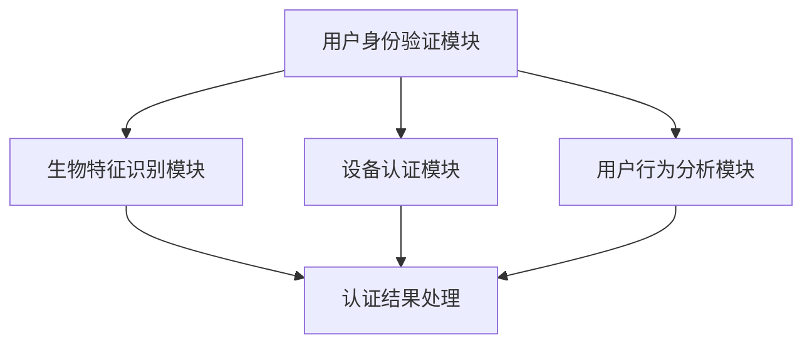

                 

### 智能门锁：AI Agent的多因素认证系统

> **关键词：**智能门锁、AI Agent、多因素认证、安全系统、技术架构。

> **摘要：**本文深入探讨了智能门锁的技术背景，重点介绍了基于AI Agent的多因素认证系统。通过逐步分析智能门锁的工作原理、AI Agent的设计、多因素认证系统的实现，以及安全性问题与解决方案，为智能门锁领域的研发提供了系统的理论指导。

## 第1章：智能门锁行业背景

### 1.1 智能门锁市场发展历程

智能门锁作为一种智能家居的典型应用，其市场发展历程可以追溯到20世纪末。最初，智能门锁主要应用于高档住宅和商业场所，作为安全性和便捷性的象征。随着物联网（IoT）技术的发展和普及，智能门锁逐渐从高端市场走向大众消费市场。近年来，得益于人工智能和大数据技术的迅猛发展，智能门锁的功能和性能得到了显著提升，市场需求也呈现爆发式增长。

### 1.2 智能门锁技术演进

智能门锁技术的发展经历了从机械锁到电子锁，再到如今的智能锁的演变过程。早期的智能门锁主要依赖电子控制电路实现基本的锁定和解锁功能，而现代智能门锁则集成了多种先进技术，如指纹识别、人脸识别、密码输入、蓝牙连接等。这些技术的融合使得智能门锁不仅具备传统门锁的安全性，还提供了更加便捷的用户体验。

### 1.3 智能门锁行业现状与趋势

当前，智能门锁市场呈现出高速发展的态势，各大厂商纷纷推出具有差异化功能的产品，以满足不同用户的需求。根据市场调研数据，全球智能门锁市场规模预计将在未来几年内持续扩大，行业竞争也将愈发激烈。未来，智能门锁的发展趋势将包括更加智能化、安全化和个性化，同时，AI Agent技术的应用将成为提升智能门锁性能的关键因素。

## 第2章：智能门锁核心技术解析

### 2.1 智能门锁的工作原理

智能门锁的工作原理主要包括传感器识别、数据传输和执行机构控制三个环节。首先，门锁通过内置传感器（如指纹传感器、摄像头、红外传感器等）收集用户身份信息；然后，通过无线通信模块（如蓝牙、Wi-Fi等）将数据传输至云端服务器；最后，根据服务器返回的认证结果，控制执行机构（如电机、锁芯等）完成锁定或解锁操作。

### 2.2 AI Agent简介

AI Agent，即人工智能代理，是一种能够自主执行任务、适应环境变化并具备学习能力的人工智能系统。在智能门锁领域，AI Agent主要用于用户身份验证、行为分析和故障诊断等方面。通过实时学习用户的行为习惯和特征，AI Agent能够提高认证的准确性和效率，同时增强门锁的智能化水平。

### 2.3 多因素认证系统原理

多因素认证系统（Multi-Factor Authentication, MFA）是一种安全认证机制，通过结合多种认证方式，提高系统的安全性。在智能门锁中，多因素认证系统通常包括密码输入、生物特征识别（如指纹、人脸识别）和设备认证等多种方式。这些认证方式的组合使用，可以有效防范恶意攻击，确保门锁的安全性。

## 第3章：多因素认证系统架构设计

### 3.1 系统需求分析

多因素认证系统的设计需要考虑以下需求：

1. **安全性**：确保认证过程无法被恶意攻击者轻易攻破。
2. **便捷性**：用户在使用过程中能够快速、方便地完成认证。
3. **扩展性**：系统能够根据需求的变化灵活调整和扩展认证方式。
4. **可靠性**：系统在长时间运行中能够保持稳定、可靠的工作状态。

### 3.2 系统功能模块划分

多因素认证系统通常包括以下功能模块：

1. **用户身份验证模块**：负责对用户身份进行验证，包括密码输入、生物特征识别等。
2. **生物特征识别模块**：实现指纹、人脸等生物特征的识别功能。
3. **设备认证模块**：确保认证过程的合法性，防止未经授权的设备访问。
4. **用户行为分析模块**：对用户的行为进行分析，发现异常行为并及时响应。

### 3.3 系统架构设计

多因素认证系统架构设计如下图所示：

### 3.4 系统接口设计

系统接口设计应包括以下部分：

1. **用户界面**：提供用户输入密码、指纹等操作的界面。
2. **无线通信接口**：实现门锁与用户设备（如手机、平板等）之间的数据传输。
3. **云端接口**：与云端服务器进行通信，处理认证请求和用户数据。

## 第4章：智能门锁AI Agent设计

### 4.1 AI Agent的基本概念

AI Agent是一种具备自主决策和行动能力的人工智能系统，能够在复杂的动态环境中执行任务。在智能门锁中，AI Agent主要用于以下几个方面：

1. **用户身份验证**：通过分析用户行为特征，实现高准确度的身份验证。
2. **行为预测**：预测用户未来的行为，提高认证的便捷性。
3. **故障诊断**：监测门锁的工作状态，发现故障并自动修复。

### 4.2 AI Agent的主要功能

AI Agent的主要功能包括：

1. **用户行为分析**：通过采集用户的行为数据，如指纹、人脸、操作习惯等，构建用户行为模型。
2. **异常行为检测**：分析用户行为，识别异常行为并发出警报。
3. **智能认证**：结合用户行为模型和生物特征，实现智能化的身份验证。

### 4.3 AI Agent的设计与实现

AI Agent的设计与实现涉及以下步骤：

1. **数据采集与预处理**：采集用户行为数据，并进行预处理，如去噪、归一化等。
2. **特征提取与选择**：提取关键特征，并选择最适合的特征进行建模。
3. **模型训练与优化**：使用机器学习算法训练模型，并进行优化，提高模型性能。
4. **系统集成与测试**：将AI Agent集成到智能门锁系统中，进行功能测试和性能评估。

## 第5章：多因素认证系统的实现

### 5.1 用户身份验证模块

用户身份验证模块是智能门锁的核心功能之一，主要包括以下步骤：

1. **用户输入**：用户通过输入密码、指纹或人脸信息进行身份验证。
2. **数据采集**：门锁采集用户的生物特征数据。
3. **数据预处理**：对采集到的数据进行分析和预处理，如去噪、特征提取等。
4. **模型匹配**：将预处理后的数据与用户数据库中的数据进行分析匹配，判断用户身份。

### 5.2 生物特征识别模块

生物特征识别模块是智能门锁的重要功能之一，主要包括以下步骤：

1. **特征提取**：从生物特征图像中提取关键特征点。
2. **特征比对**：将提取到的特征与已注册的特征进行比对，判断是否匹配。
3. **实时更新**：根据用户行为变化，实时更新用户特征数据库。

### 5.3 设备认证模块

设备认证模块主要确保认证过程的合法性，防止未经授权的设备访问。主要包括以下步骤：

1. **设备识别**：通过设备ID或其他唯一标识识别用户设备。
2. **设备认证**：验证设备合法性，如验证设备与门锁之间的绑定关系。
3. **实时监控**：监控设备行为，发现异常情况及时响应。

### 5.4 用户行为分析模块

用户行为分析模块主要用于分析用户的行为模式，提高认证的准确性和便捷性。主要包括以下步骤：

1. **行为数据采集**：采集用户的操作行为数据。
2. **行为特征提取**：提取关键行为特征，如操作频率、时间间隔等。
3. **行为模式识别**：根据行为特征识别用户的行为模式。
4. **行为预测**：根据历史行为数据预测用户未来的行为，提高认证的便捷性。

## 第6章：智能门锁的安全性问题与解决方案

### 6.1 智能门锁安全威胁分析

智能门锁作为一种智能家居设备，面临着多种安全威胁，包括：

1. **信息泄露**：用户身份信息和生物特征信息泄露，可能导致用户隐私泄露。
2. **恶意攻击**：恶意攻击者可能通过漏洞入侵系统，篡改认证结果。
3. **设备篡改**：攻击者可能篡改智能门锁的硬件设备，实现非法访问。
4. **数据篡改**：攻击者可能篡改用户数据和系统配置，破坏门锁的正常运行。

### 6.2 安全防护措施

为了应对智能门锁的安全威胁，可以采取以下安全防护措施：

1. **数据加密**：对用户身份信息和生物特征数据进行加密存储和传输，防止信息泄露。
2. **访问控制**：实施严格的访问控制策略，确保只有授权用户和设备才能访问系统资源。
3. **安全监测**：实时监控智能门锁的工作状态，发现异常情况及时响应。
4. **更新与升级**：定期更新和升级门锁系统，修复安全漏洞，提高系统安全性。

### 6.3 安全事件响应策略

在发生安全事件时，应采取以下响应策略：

1. **立即断开连接**：在发现恶意攻击时，立即断开与门锁的连接，防止攻击者进一步入侵。
2. **安全报警**：及时向用户发出安全警报，提醒用户注意安全风险。
3. **事件调查**：对发生的安全事件进行详细调查，分析攻击原因和手段。
4. **改进措施**：根据调查结果，改进系统设计和安全策略，防止类似事件再次发生。

## 第7章：智能门锁案例分析与实战

### 7.1 案例背景介绍

本案例选取一家高档公寓作为研究对象，该公寓安装了智能门锁系统，以实现住户的安全便捷管理。公寓管理方希望通过智能门锁系统实现以下功能：

1. **住户身份验证**：住户通过输入密码、指纹或人脸信息进行身份验证。
2. **访客管理**：住户可以邀请访客使用临时密码或生物特征进行访问。
3. **行为监控**：系统实时监控住户和访客的行为，记录访问日志。

### 7.2 智能门锁系统核心实现

智能门锁系统的核心实现包括以下部分：

1. **用户身份验证模块**：采用多因素认证系统，结合密码输入、指纹识别和访客二维码等多种认证方式。
2. **生物特征识别模块**：采用高精度指纹识别和人脸识别技术，确保认证的准确性。
3. **访客管理模块**：通过临时密码和二维码实现访客认证，方便住户管理。
4. **行为监控模块**：实时记录住户和访客的行为，实现智能行为分析。

### 7.3 案例分析与讲解

通过本案例，我们可以看到智能门锁系统在实际应用中的优势和不足：

1. **优势**：
   - **提高安全性**：多因素认证系统有效防止了恶意攻击和非法入侵。
   - **便捷性**：住户和访客可以通过多种认证方式快速完成访问。
   - **智能化**：智能行为分析功能为住户提供了更个性化的服务。

2. **不足**：
   - **成本较高**：智能门锁系统具有较高的成本，可能不适合所有用户。
   - **技术门槛**：系统设计和实施需要较高技术水平和专业知识。

### 7.4 案例小结与反思

本案例展示了智能门锁系统在公寓管理中的应用价值，但同时也提醒我们：

1. **持续优化**：需要不断优化系统功能和性能，提升用户体验。
2. **关注安全**：在智能门锁系统中，安全始终是首要考虑的因素。
3. **成本控制**：在推广智能门锁系统时，需要平衡成本和性能，确保系统的可持续性。

## 第8章：智能门锁未来发展趋势

### 8.1 新技术展望

随着科技的不断进步，智能门锁未来将融入更多新技术，包括：

1. **量子加密**：采用量子加密技术，提高数据传输和存储的安全性。
2. **物联网（IoT）**：与智能家居设备实现无缝连接，实现更多智能化功能。
3. **区块链**：利用区块链技术，确保用户数据和交易的安全性和透明性。

### 8.2 行业挑战与机遇

智能门锁行业面临着以下挑战：

1. **安全性**：如何提高系统的安全性，防范恶意攻击。
2. **成本**：如何降低系统成本，使其更加普及。

同时，智能门锁行业也存在着巨大的机遇：

1. **市场潜力**：智能家居市场的持续增长，为智能门锁带来了广阔的市场空间。
2. **技术创新**：新技术的不断涌现，为智能门锁的发展提供了强大动力。

### 8.3 智能门锁的发展趋势

未来，智能门锁的发展趋势将包括：

1. **智能化**：通过AI Agent等技术，实现更智能的用户身份验证和行为分析。
2. **安全性**：采用更先进的安全技术，确保用户数据和交易的安全。
3. **普及化**：降低系统成本，使智能门锁成为智能家居的标配。

## 总结

智能门锁作为一种新兴的智能家居设备，具有广泛的应用前景。本文从智能门锁的技术背景、核心原理、架构设计、安全性和未来趋势等方面进行了全面探讨。通过逐步分析智能门锁的工作原理、AI Agent的设计、多因素认证系统的实现，以及安全性问题与解决方案，为智能门锁领域的研发提供了系统的理论指导。未来，随着新技术的不断涌现，智能门锁将实现更高的智能化和安全性能，为用户提供更加便捷和安全的居住环境。

## 作者信息

作者：AI天才研究院/AI Genius Institute & 禅与计算机程序设计艺术 /Zen And The Art of Computer Programming

## 拓展阅读

1. 智能门锁技术白皮书
2. 人工智能在智能家居中的应用
3. 智能门锁安全指南
4. 智能家居市场研究报告
5. 量子加密技术原理与应用

本文由AI天才研究院和禅与计算机程序设计艺术联合撰写，旨在为智能门锁领域的研究者和从业者提供有益的参考。希望本文的内容能够帮助您更好地理解智能门锁的技术原理和应用前景，为您的研发工作提供启示和帮助。在未来的研究中，我们将继续关注智能门锁领域的新技术、新趋势和新挑战，期待与您共同探讨和进步。

