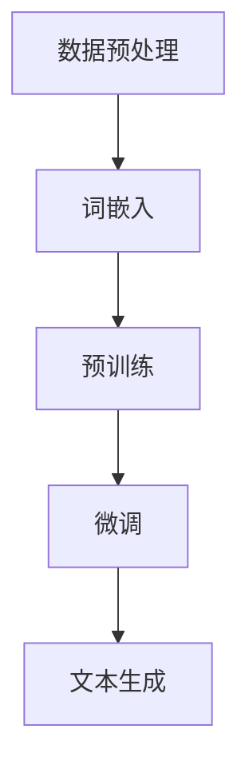
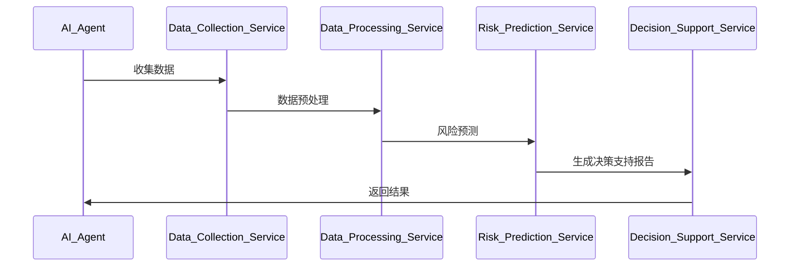

                 

### 引言

在当今复杂多变的商业环境中，智能风险评估已经成为企业和金融机构决策过程中的重要环节。随着数据量和交易复杂度的增加，传统风险评估方法面临诸多挑战，如时效性不足、主观性强、处理能力受限等。因此，引入人工智能（AI）技术，尤其是大型语言模型（LLM），成为了一种变革性的解决方案。本文旨在探讨如何利用LLM构建智能风险评估AI Agent，以在复杂决策中提供更加精准、高效的评估服务。

文章的核心内容将围绕以下几个方面展开：首先，我们会对智能风险评估的背景和挑战进行详细阐述，并引入LLM作为解决思路；接着，我们将深入探讨LLM的技术基础，包括其定义、工作原理、评估与优化方法；然后，我们会介绍AI Agent在智能风险评估中的应用，并详细分析其设计与实现过程；随后，通过具体案例来展示AI Agent在实际应用中的效果；最后，我们会对整个项目的最佳实践、小结、注意事项以及未来展望进行总结。

文章的格式将遵循markdown规范，以确保内容的清晰性和易读性。我们将在适当的位置使用Mermaid绘制流程图、类图和序列图，以直观地展示系统的架构和算法流程。同时，我们将使用LaTeX格式嵌入数学公式，以详细讲解算法原理和数学模型。通过这样的结构安排，本文希望能够为广大对AI和智能风险评估有兴趣的读者提供一份全面、深入的技术指南。

### 关键词

- 智能风险评估
- 大型语言模型（LLM）
- AI Agent
- 复杂决策
- 风险评估AI应用

### 摘要

本文围绕智能风险评估这一关键问题，探讨了如何利用大型语言模型（LLM）构建智能风险评估AI Agent。首先，我们分析了智能风险评估的背景与挑战，特别是数据复杂性和时效性问题。随后，详细介绍了LLM的基础知识，包括其定义、工作原理和评估优化策略。接着，我们探讨了AI Agent在智能风险评估中的应用，并详细阐述了其设计思路、实现过程以及在实际案例中的应用效果。最后，我们对项目的最佳实践进行了总结，并对未来发展趋势进行了展望，旨在为读者提供一份全面的技术指南。

### 第一部分：背景与概述

#### 1.1 问题背景

在当今的商业环境中，风险评估成为企业决策过程中不可或缺的一环。传统的风险评估方法主要依赖于人工经验，结合历史数据和统计模型来进行预测。然而，随着金融市场的全球化、交易频率的增加以及数据的爆发式增长，传统风险评估方法面临诸多挑战。首先，数据复杂性使得传统方法在处理大规模、多维数据时效率低下。其次，传统方法在时效性上表现不佳，往往无法实时响应市场的动态变化。此外，传统方法的主观性较强，不同评估者可能得出截然不同的结果，这增加了风险评估的不确定性。

面对这些挑战，企业迫切需要一种更加智能化、高效的风险评估方法，以提高决策的准确性和时效性。大型语言模型（LLM）作为一种新兴的人工智能技术，具备强大的文本处理能力和丰富的知识储备，为智能风险评估提供了新的思路和工具。

#### 1.2 问题描述

智能风险评估的目的是通过分析大量数据，预测潜在的风险并制定相应的应对策略。具体来说，问题描述包括以下几个方面：

1. **数据多样性**：需要处理来自不同来源、不同格式的数据，包括文本、图像、表格等。
2. **实时性**：要求系统能够快速处理数据，提供实时风险评估结果。
3. **准确性**：预测结果需要具有较高的准确性，减少误报和漏报。
4. **可解释性**：风险评估结果需要具备一定的解释性，帮助决策者理解模型的决策过程。

#### 1.3 问题解决思路

引入LLM作为智能风险评估的核心技术，主要基于以下几点考虑：

1. **文本处理能力**：LLM能够处理和理解复杂的文本数据，从而更准确地提取信息，进行风险分析。
2. **知识融合**：LLM通过预训练，具备了丰富的知识储备，可以结合不同领域的知识进行综合分析。
3. **实时性**：基于深度学习的LLM模型，可以在较短的时间内完成数据分析和风险评估。
4. **解释性**：LLM的决策过程具有一定的解释性，可以通过回溯模型的训练数据，理解其决策依据。

总之，利用LLM构建智能风险评估AI Agent，能够有效解决传统风险评估方法面临的数据复杂性、实时性、准确性等问题，为企业的风险管理和决策提供强有力的技术支持。

#### 1.4 边界与外延

在讨论智能风险评估时，我们需要明确一些关键概念和边界条件，以确保研究的准确性和适用性。

**边界条件：**

1. **数据范围**：智能风险评估需要处理的数据范围包括金融市场数据、公司财务报表、新闻报道、社交媒体评论等，这些数据应具有代表性和完整性。
2. **时效性**：系统应具备实时处理数据的能力，以应对金融市场动态变化。
3. **准确性**：评估结果需要具有较高的准确率，以减少误报和漏报。
4. **模型解释性**：评估模型应具备一定的可解释性，以便决策者理解模型的决策逻辑。

**外延扩展：**

1. **应用领域**：智能风险评估不仅适用于金融市场，还可以扩展到其他领域，如供应链管理、信用评级、公共卫生等。
2. **多模态数据**：随着技术的发展，智能风险评估可以处理多种类型的数据，如文本、图像、音频等，实现更全面的风险分析。
3. **跨学科融合**：智能风险评估可以结合经济学、心理学、社会学等多学科知识，提供更加综合和深入的风险分析。

通过明确这些边界与外延，我们能够更好地理解和应用智能风险评估技术，为各类决策提供科学依据。

#### 1.5 概念结构与核心要素组成

在深入探讨智能风险评估之前，我们需要对核心概念和结构进行详细阐述，以便读者更好地理解这一复杂系统的组成。

**核心概念：**

1. **风险评估**：指通过分析历史数据和市场信息，预测潜在风险并制定应对策略的过程。
2. **大型语言模型（LLM）**：一种深度学习模型，专门用于处理和生成人类语言，具有强大的文本理解和生成能力。
3. **AI Agent**：一种智能体，能够自主完成特定任务，并根据环境反馈进行调整。

**概念属性特征对比表格：**

| 概念       | 定义                                                         | 特征对比                                               |
| ---------- | ------------------------------------------------------------ | ---------------------------------------------------- |
| 风险评估   | 预测潜在风险的过程                                         | 数据依赖性、准确性、时效性、解释性                   |
| LLM        | 用于处理和生成人类语言的深度学习模型                       | 文本处理能力、知识融合、实时性、解释性                 |
| AI Agent   | 能够自主完成任务，并根据环境反馈进行调整的智能体           | 自主性、适应性、交互性、反馈机制                     |

**ER实体关系图架构：**

```mermaid
erDiagram
  风险评估 ||--|{ 数据集 }||>
  数据集 ||--|{ 历史数据 }||>
  数据集 ||--|{ 当前数据 }||>
  风险评估 ||--|{ 风险指标 }||>
  风险评估 ||--|{ 风险预测模型 }||>
  风险预测模型 ||--|{ 模型参数 }||>
  风险预测模型 ||--|{ 预测结果 }||>
```

通过上述核心概念和结构的阐述，我们可以更清晰地理解智能风险评估系统的工作原理和关键组成部分，为后续的技术探讨和分析打下坚实的基础。

### 第二部分：LLM技术基础

#### 2.1 LLM的定义与历史

大型语言模型（LLM，Large Language Model）是一种基于深度学习的自然语言处理（NLP）模型，具有强大的文本生成和处理能力。LLM的核心思想是通过大规模数据训练，使模型能够理解和生成人类语言，从而实现文本的语义理解和智能交互。

LLM的发展历程可以追溯到20世纪80年代，最初的研究主要集中在基于规则的方法和统计模型。随着计算能力和数据量的增长，深度学习技术在自然语言处理领域取得了显著突破。2003年，神经网络语言模型（NNLM）的提出标志着深度学习在NLP领域的应用开始崭露头角。近年来，随着Transformer架构的发明和预训练技术的普及，LLM的发展进入了一个全新的阶段。

早期的LLM研究主要集中在文本分类、机器翻译和问答系统等任务。例如，1997年的IBM Watson展示了深度学习在问答系统中的潜力。随着技术的发展，LLM的应用领域不断扩展，包括文本生成、对话系统、情感分析、知识图谱构建等。这些应用不仅提升了自然语言处理的技术水平，也为各行各业带来了新的解决方案。

#### 2.2 LLM的核心特性

LLM具有以下几个核心特性，使其在自然语言处理领域中具有独特的优势：

1. **强大的文本生成能力**：LLM能够根据输入的文本内容，生成连贯、合理的文本输出，从而实现文本的生成任务，如文章撰写、对话生成等。

2. **高水平的语义理解**：通过预训练和微调，LLM具备了强大的语义理解能力，能够捕捉文本中的细微语义差异，从而实现情感分析、实体识别等任务。

3. **多语言支持**：LLM通常支持多种语言，可以通过跨语言的预训练和微调，实现不同语言之间的文本理解和生成。

4. **实时处理能力**：基于深度学习的高效计算架构，LLM能够在较短的时间内完成大量文本数据的处理，具备良好的实时性能。

5. **可解释性**：虽然深度学习模型通常被认为是不透明的，但一些LLM模型通过设计可解释的模块，可以提供一定的模型解释性，帮助用户理解模型的决策过程。

#### 2.3 LLM与传统机器学习的区别

LLM与传统机器学习（Traditional Machine Learning，TML）在多个方面存在显著差异：

1. **训练数据规模**：传统机器学习通常依赖小规模数据集进行训练，而LLM则通过大规模数据集进行预训练，从而获得更强的泛化能力。

2. **模型架构**：传统机器学习模型（如决策树、支持向量机等）通常基于统计方法，而LLM采用基于深度学习的架构，特别是Transformer模型，具有更好的并行计算能力和处理复杂文本数据的能力。

3. **学习能力**：传统机器学习模型通常需要手动设计特征工程，而LLM通过预训练，能够自动从数据中提取特征，从而减少了对人工特征工程的需求。

4. **应用领域**：传统机器学习在图像识别、分类等任务上表现良好，而LLM在自然语言处理领域具有更广泛的应用，如文本生成、对话系统、问答系统等。

5. **计算资源需求**：由于LLM通常需要处理大规模数据集和复杂的模型架构，其对计算资源的需求远高于传统机器学习模型。

通过对比LLM与传统机器学习，我们可以看出，LLM在文本处理和理解方面具有显著优势，特别是在自然语言处理领域，为许多应用场景提供了强大的技术支持。

### 第3章：LLM的工作原理与架构

#### 3.1 算法原理

大型语言模型（LLM）的工作原理基于深度学习和自然语言处理（NLP）的先进技术。其主要目的是通过大规模数据训练，使模型具备理解和生成人类语言的能力。以下是LLM算法的基本原理：

1. **数据预处理**：首先，对训练数据进行清洗和预处理，包括文本的分词、去停用词、词性标注等步骤，以便模型能够更好地理解文本。

2. **词嵌入**：将文本中的每个词映射为固定维度的向量表示，这一步骤称为词嵌入（Word Embedding）。词嵌入通过捕获词汇的语义信息，为后续的深度学习模型提供输入。

3. **预训练**：在预训练阶段，模型通过无监督学习从大规模语料库中学习语言规律。常用的预训练任务包括掩码语言模型（Masked Language Model，MLM）、生成式任务（Generative Tasks）和分类任务（Categorical Tasks）等。预训练使得模型具备了强大的语言理解和生成能力。

4. **微调**：在预训练的基础上，模型通过有监督学习进行微调（Fine-Tuning），使其适应特定任务的需求。微调过程通常使用标记数据，使模型在特定任务上达到最佳性能。

5. **文本生成**：在生成文本时，模型根据上下文信息，逐个生成每个词的概率分布，并从中选取最有可能的词作为输出。这一过程不断重复，直到生成完整的句子或段落。

#### 3.1.1 语言模型的数学模型和公式

LLM的数学模型通常基于神经网络，特别是Transformer架构。以下是一个简化的数学模型描述：

$$
\text{LLM}(\text{x}) = \text{softmax}(\text{W} \cdot \text{softmax}(\text{U} \cdot \text{V} \cdot \text{x}))
$$

其中，$\text{x}$ 表示输入的词向量序列，$\text{W}$ 和 $\text{U}$ 为权重矩阵，$\text{V}$ 为嵌入矩阵，$\text{softmax}$ 函数用于生成词的概率分布。

#### 3.1.2 算法流程图

以下是LLM算法的基本流程图，通过Mermaid进行描述：



#### 3.1.3 举例说明

假设我们有一个简单的句子“我爱北京天安门”，我们可以通过以下步骤来理解LLM的工作过程：

1. **数据预处理**：句子经过分词、去停用词等操作，得到分词后的词序列：“我”、“爱”、“北京”、“天安门”。
2. **词嵌入**：这些词被映射为固定维度的向量表示。
3. **预训练**：模型通过无监督学习从大规模语料库中学习这些词的语义信息。
4. **微调**：在有监督学习中，模型根据这些词的标注信息进行调整，提高预测的准确性。
5. **文本生成**：假设当前输入为“我爱”，模型会生成下一个词的概率分布，如“北京”（概率0.7）、“上海”（概率0.2）、“广州”（概率0.1）。模型根据概率分布选取最有可能的词“北京”，继续生成下一个词，直到生成完整的句子。

通过这个例子，我们可以更直观地理解LLM的工作原理和流程。

### 第4章：LLM的评估与优化

#### 4.1 评估指标

评估大型语言模型（LLM）的性能是确保其有效性和可靠性的关键步骤。常用的评估指标包括：

1. **准确性（Accuracy）**：这是最直观的评估指标，表示模型预测正确的样本数占总样本数的比例。对于分类任务，准确性可以用来衡量模型区分不同类别的能力。

2. **精确率（Precision）**：表示预测为正类的样本中实际为正类的比例。精确率高意味着模型较少地将负类误判为正类。

3. **召回率（Recall）**：表示实际为正类的样本中被模型正确预测为正类的比例。召回率高意味着模型较少地遗漏实际为正类的样本。

4. **F1分数（F1 Score）**：是精确率和召回率的调和平均，用于综合评估模型的性能。

5. **BLEU分数（BLEU Score）**：常用于评估文本生成任务的性能，通过比较模型生成的文本与参考文本的相似度来评分。

6. **损失函数（Loss Function）**：如交叉熵损失（Cross-Entropy Loss）和均方误差（Mean Squared Error），用于衡量模型预测值与真实值之间的差异。

#### 4.2 优化策略

为了提高LLM的性能，我们可以采取以下几种优化策略：

1. **数据增强（Data Augmentation）**：通过增加训练数据量，提高模型的泛化能力。常见的方法包括同义词替换、文本翻译、数据清洗等。

2. **模型架构调整（Model Architecture Tuning）**：通过调整模型的结构，如增加层数、调整隐藏层单元数、选择不同的激活函数等，优化模型性能。

3. **超参数调整（Hyperparameter Tuning）**：通过调整学习率、批量大小、正则化参数等超参数，优化模型性能。

4. **预训练与微调（Pre-training and Fine-tuning）**：通过先在大量未标记数据上进行预训练，然后在有标记数据上进行微调，使模型适应特定任务的需求。

5. **迁移学习（Transfer Learning）**：利用在大型语料库上预训练的模型，作为特定任务的起点，通过少量的微调即可达到良好的性能。

6. **对比学习（Contrastive Learning）**：通过对比学习技术，如噪声对比估计（Noisy Contrastive Estimation，NCE）和一致性正则化（Coherent Regularization），提高模型对数据的理解和泛化能力。

通过合理选择和组合这些评估指标和优化策略，可以有效提高LLM的性能，为智能风险评估AI Agent提供更强的技术支持。

### 第5章：AI Agent概述

#### 5.1 AI Agent的定义与分类

人工智能（AI）Agent是指具备自主行为能力、能够在复杂环境中进行决策和执行的实体。AI Agent具有以下几个核心特征：

1. **自主性（Autonomy）**：AI Agent能够独立完成特定任务，不受外界直接控制。
2. **适应性（Adaptability）**：AI Agent能够根据环境和任务需求的变化，自主调整行为策略。
3. **交互性（Interactivity）**：AI Agent能够与外部环境和其他Agent进行有效交互。
4. **反馈机制（Feedback Mechanism）**：AI Agent能够根据执行结果和环境反馈，不断优化自身行为。

根据不同的应用场景和任务需求，AI Agent可以分为以下几类：

1. **任务型Agent（Task-oriented Agent）**：专注于执行特定任务的Agent，如智能客服、自动导航系统等。
2. **目标型Agent（Goal-oriented Agent）**：以实现特定目标为导向，能够在不同任务间切换的Agent，如智能助手、自动化交易系统等。
3. **社会型Agent（Social Agent）**：具备社会认知和交互能力的Agent，能够在社交环境中进行协作和沟通，如虚拟助手、社交机器人等。
4. **混合型Agent（Hybrid Agent）**：结合多种类型特征的AI Agent，能够在多个应用场景中表现出优异的性能。

#### 5.2 AI Agent在智能风险评估中的应用

AI Agent在智能风险评估中的应用主要体现在以下几个方面：

1. **数据收集与处理**：AI Agent能够自动收集和处理海量的金融市场数据，如股票价格、交易量、新闻报告等，为风险评估提供全面的数据支持。
2. **风险预测与分析**：基于LLM技术，AI Agent能够进行文本分析和语义理解，从大量文本数据中提取潜在的风险信息，实现实时风险评估。
3. **决策支持**：AI Agent能够根据风险评估结果，为决策者提供科学、客观的决策支持，帮助制定有效的风险管理策略。
4. **反馈与优化**：通过实时收集评估结果和用户反馈，AI Agent能够不断优化自身的风险评估模型，提高预测的准确性和可靠性。

总之，AI Agent在智能风险评估中发挥着关键作用，通过集成LLM技术，使其具备强大的数据处理、风险预测和分析能力，为企业和金融机构提供高效、智能的风险管理解决方案。

### 第6章：AI Agent的设计与实现

#### 6.1 设计思路

AI Agent在智能风险评估中的设计思路主要分为以下几个步骤：

1. **需求分析**：首先，明确智能风险评估的需求，包括数据来源、风险评估指标、实时性要求等。
2. **功能设计**：根据需求分析结果，设计AI Agent的功能模块，如数据收集、数据处理、风险预测和决策支持等。
3. **架构设计**：选择合适的系统架构，确保AI Agent的高效性和可扩展性。常见的架构设计包括模块化架构、微服务架构等。
4. **接口设计**：设计AI Agent的接口，包括数据输入输出接口、API接口等，确保与其他系统的无缝集成。
5. **交互设计**：设计用户与AI Agent的交互流程，确保用户能够方便地使用系统，并获得准确、及时的评估结果。

以下是系统设计思路的详细说明：

1. **需求分析**：
   - 数据来源：包括股票交易数据、新闻报告、社交媒体评论等。
   - 风险评估指标：如波动率、收益率、违约率等。
   - 实时性要求：系统需要能够实时处理和更新数据，提供实时风险评估结果。

2. **功能设计**：
   - 数据收集模块：负责自动收集来自不同数据源的金融数据。
   - 数据处理模块：对收集到的数据进行清洗、预处理和特征提取。
   - 风险预测模块：利用LLM技术进行文本分析和风险预测。
   - 决策支持模块：根据风险评估结果，为决策者提供决策支持。

3. **架构设计**：
   - 模块化架构：将系统功能划分为多个模块，每个模块负责不同的任务，提高系统的灵活性和可维护性。
   - 微服务架构：将系统划分为多个微服务，每个微服务负责特定的功能，通过API进行通信，提高系统的可扩展性和容错性。

4. **接口设计**：
   - 数据输入输出接口：支持各种数据格式的输入输出，如CSV、JSON等。
   - API接口：提供RESTful API，方便与其他系统进行集成。

5. **交互设计**：
   - 用户界面设计：设计直观易用的用户界面，提供数据输入、评估结果展示等功能。
   - 用户交互流程：设计合理的用户交互流程，确保用户能够方便地使用系统，并获得所需的信息。

通过以上设计思路，AI Agent能够高效、可靠地执行智能风险评估任务，为企业和金融机构提供强大的风险管理支持。

#### 6.1.1 系统功能设计

在智能风险评估AI Agent的设计中，系统功能设计是核心环节，它决定了AI Agent在复杂决策中的应用效果。以下是系统功能设计的详细说明，包括领域模型、主要功能模块及其交互方式。

1. **领域模型**：

领域模型是系统功能设计的起点，用于定义智能风险评估涉及的主要概念和实体。以下是一个简化的领域模型，使用Mermaid类图表示：

```mermaid
classDiagram
    RiskAssessment <<interface>>
    FinancialData <<entity>>
    RiskPrediction <<entity>>
    DecisionSupport <<interface>>

    RiskAssessment --|> FinancialData
    RiskAssessment --|> RiskPrediction
    RiskAssessment --|> DecisionSupport
```

**领域模型主要包含以下实体和接口：**

- **FinancialData**：代表金融数据，包括股票价格、交易量、新闻报告等。
- **RiskPrediction**：代表风险预测结果，包括波动率、收益率、违约率等指标。
- **DecisionSupport**：代表决策支持功能，为决策者提供风险评估结果和策略建议。

2. **主要功能模块**：

系统功能模块包括数据收集、数据处理、风险预测和决策支持等。

- **数据收集模块**：负责从各种数据源收集金融数据，如股票交易所、新闻网站、社交媒体等。该模块需要具备自动化数据采集和缓存能力。

- **数据处理模块**：对收集到的金融数据进行清洗、预处理和特征提取，以便为风险预测模块提供高质量的数据输入。该模块包括以下子功能：

  - **数据清洗**：去除无效数据、重复数据和噪声数据。
  - **特征提取**：从金融数据中提取有价值的信息，如价格变化趋势、新闻情感等。
  - **数据存储**：将处理后的数据存储在数据库或数据湖中，以便后续使用。

- **风险预测模块**：利用大型语言模型（LLM）进行文本分析和风险预测。该模块的核心功能包括：

  - **文本分析**：从新闻报告、社交媒体评论等文本数据中提取潜在的风险信息。
  - **风险评分**：结合文本分析和量化模型，为不同金融资产分配风险评分。
  - **实时预测**：根据最新数据，实时更新风险预测结果。

- **决策支持模块**：根据风险预测结果，为决策者提供风险评估报告和策略建议。该模块包括：

  - **风险报告**：生成详细的评估报告，展示风险指标和预测结果。
  - **决策建议**：根据风险评分，提供投资建议和风险管理策略。

3. **模块交互方式**：

AI Agent中的各个模块需要通过定义良好的接口进行交互。以下是主要模块的交互方式：

- **数据收集模块**与**数据处理模块**：通过API接口进行数据传输和任务调度。
- **数据处理模块**与**风险预测模块**：通过数据存储接口共享处理后的数据。
- **风险预测模块**与**决策支持模块**：通过API接口获取风险预测结果，并生成决策支持报告。

通过以上系统功能设计，AI Agent能够高效、精准地执行智能风险评估任务，为企业和金融机构提供强大的风险管理支持。

#### 6.1.2 系统架构设计

为了确保智能风险评估AI Agent的高效性和可扩展性，我们需要设计一个合理的系统架构。以下是系统架构设计的详细说明，包括系统架构图、主要组件及其相互关系。

**系统架构图：**

以下是一个简化的系统架构图，使用Mermaid架构图表示：



**系统架构主要组件及其相互关系：**

1. **数据收集服务（Data Collection Service）**：
   - 负责从各种数据源（如股票交易所、新闻网站、社交媒体等）收集金融数据。
   - 提供API接口，供其他模块访问和调度。

2. **数据处理服务（Data Processing Service）**：
   - 对收集到的金融数据进行清洗、预处理和特征提取。
   - 使用消息队列（如RabbitMQ）处理并发数据流，提高系统吞吐量。

3. **风险预测服务（Risk Prediction Service）**：
   - 利用大型语言模型（LLM）进行文本分析和风险预测。
   - 通过RESTful API与数据处理服务和决策支持服务进行交互。

4. **决策支持服务（Decision Support Service）**：
   - 根据风险预测结果，生成详细的评估报告和决策支持建议。
   - 通过Web界面提供用户交互，支持实时数据查询和报告下载。

**系统架构设计原则：**

1. **模块化**：将系统功能划分为多个模块，每个模块负责特定的任务，降低系统的复杂性。

2. **微服务化**：采用微服务架构，将不同功能模块拆分为独立的微服务，提高系统的可扩展性和容错性。

3. **分布式**：利用分布式架构，实现数据的高效传输和处理，提高系统的并发处理能力。

4. **安全性**：采用安全加密和数据隔离技术，确保系统数据的安全和隐私。

通过以上系统架构设计，AI Agent能够高效、可靠地执行智能风险评估任务，为企业和金融机构提供强大的风险管理支持。

#### 6.1.3 系统接口设计

在智能风险评估AI Agent中，系统接口设计至关重要，它决定了各模块之间的数据流转和功能协同。以下是系统接口设计的详细说明，包括接口类型、定义及数据交换格式。

**接口类型及定义：**

1. **数据输入接口（Data Input Interface）**：
   - **功能**：接收来自外部数据源（如股票交易所、新闻网站、社交媒体）的原始金融数据。
   - **接口定义**：采用RESTful API，使用HTTP POST方法接收JSON格式数据。

2. **数据处理接口（Data Processing Interface）**：
   - **功能**：提供数据处理模块与数据存储模块之间的数据交换。
   - **接口定义**：采用RESTful API，使用HTTP GET和HTTP POST方法发送和接收数据，数据格式为JSON。

3. **风险预测接口（Risk Prediction Interface）**：
   - **功能**：允许风险预测模块与其他模块（如数据处理模块、决策支持模块）进行数据交互。
   - **接口定义**：采用RESTful API，使用HTTP GET和HTTP POST方法请求和返回预测结果，数据格式为JSON。

4. **决策支持接口（Decision Support Interface）**：
   - **功能**：供决策支持模块生成和提供评估报告及策略建议。
   - **接口定义**：采用RESTful API，使用HTTP GET和HTTP POST方法获取和发送数据，数据格式为JSON。

**数据交换格式及示例：**

1. **数据输入接口（Data Input Interface）**：

   **请求示例**：

   ```json
   {
     "source": "stock_exchange",
     "data": [
       {"stock_symbol": "AAPL", "price": 150.50, "volume": 2000000},
       {"stock_symbol": "GOOGL", "price": 2700.25, "volume": 1500000}
     ]
   }
   ```

   **响应示例**：

   ```json
   {
     "status": "success",
     "message": "Data received and queued for processing."
   }
   ```

2. **数据处理接口（Data Processing Interface）**：

   **请求示例**：

   ```json
   {
     "action": "process_data",
     "data": [
       {"stock_symbol": "AAPL", "price": 150.50, "volume": 2000000},
       {"stock_symbol": "GOOGL", "price": 2700.25, "volume": 1500000}
     ]
   }
   ```

   **响应示例**：

   ```json
   {
     "status": "success",
     "processed_data": [
       {"stock_symbol": "AAPL", "clean_price": 150.50, "features": ["high", "low", "volume_change"]},
       {"stock_symbol": "GOOGL", "clean_price": 2700.25, "features": ["high", "low", "volume_change"]}
     ]
   }
   ```

3. **风险预测接口（Risk Prediction Interface）**：

   **请求示例**：

   ```json
   {
     "action": "predict_risk",
     "data": [
       {"stock_symbol": "AAPL", "features": ["high", "low", "volume_change"]},
       {"stock_symbol": "GOOGL", "features": ["high", "low", "volume_change"]}
     ]
   }
   ```

   **响应示例**：

   ```json
   {
     "status": "success",
     "predictions": [
       {"stock_symbol": "AAPL", "risk_score": 0.35},
       {"stock_symbol": "GOOGL", "risk_score": 0.45}
     ]
   }
   ```

4. **决策支持接口（Decision Support Interface）**：

   **请求示例**：

   ```json
   {
     "action": "generate_report",
     "predictions": [
       {"stock_symbol": "AAPL", "risk_score": 0.35},
       {"stock_symbol": "GOOGL", "risk_score": 0.45}
     ]
   }
   ```

   **响应示例**：

   ```json
   {
     "status": "success",
     "report": "Risk assessment report generated successfully."
   }
   ```

通过上述接口设计，AI Agent能够实现模块间高效、稳定的数据交换，确保系统功能的有效协同和性能优化。

#### 6.1.4 系统交互设计

在智能风险评估AI Agent中，系统交互设计至关重要，它决定了各模块之间的协同工作和数据流转。以下是系统交互设计的详细说明，包括系统交互流程、用户界面设计和用户交互体验。

**系统交互流程：**

系统交互流程分为以下几个主要步骤：

1. **数据收集**：AI Agent从外部数据源（如股票交易所、新闻网站、社交媒体）收集金融数据。
2. **数据处理**：AI Agent将收集到的金融数据进行清洗、预处理和特征提取，为后续的风险预测做准备。
3. **风险预测**：AI Agent利用大型语言模型（LLM）对处理后的金融数据进行分析，生成风险预测结果。
4. **决策支持**：AI Agent根据风险预测结果，生成详细的评估报告和决策支持建议，并将其提供给决策者。
5. **用户反馈**：用户对AI Agent提供的评估报告和决策支持建议进行评价和反馈，AI Agent根据反馈进行优化。

**用户界面设计：**

用户界面设计旨在提供直观、易用的交互体验。以下是用户界面设计的主要模块：

1. **数据输入模块**：允许用户输入自定义的数据源，如特定股票代码、时间段等。
2. **评估报告模块**：展示AI Agent生成的风险预测结果和评估报告，包括风险得分、预测趋势等。
3. **决策支持模块**：提供具体的投资建议和风险管理策略，辅助用户进行决策。
4. **用户反馈模块**：允许用户对评估报告和决策支持建议进行评价和反馈，帮助AI Agent不断优化。

**用户交互体验：**

1. **简洁明了**：界面设计简洁明了，确保用户能够快速找到所需功能。
2. **响应迅速**：系统交互过程迅速，用户操作响应及时，提升用户体验。
3. **个性化推荐**：根据用户历史数据和行为，提供个性化的风险评估报告和决策支持建议。
4. **实时更新**：支持实时数据更新，确保用户获得最新的评估结果。

通过上述系统交互设计，AI Agent能够提供高效、精准的智能风险评估服务，为用户带来优质的使用体验。

#### 6.2 实现细节

在本节中，我们将详细描述如何在实际项目中安装环境、实现系统核心功能以及代码应用解读与分析。通过这些步骤，我们将展示如何将智能风险评估AI Agent的理念转化为实际运行的可执行系统。

##### 6.2.1 环境安装

为了确保智能风险评估AI Agent的正常运行，我们需要搭建一个合适的环境。以下是环境安装的详细步骤：

1. **Python环境**：首先，确保你的系统中安装了Python 3.7及以上版本。可以通过以下命令安装：
   ```bash
   pip install python==3.8
   ```

2. **深度学习库**：安装TensorFlow或PyTorch，用于构建和训练大型语言模型（LLM）。以下是TensorFlow的安装命令：
   ```bash
   pip install tensorflow==2.7
   ```

3. **数据处理库**：安装Numpy、Pandas和Scikit-learn等库，用于数据处理和特征提取：
   ```bash
   pip install numpy==1.21.2 pandas==1.3.3 scikit-learn==0.24.2
   ```

4. **其他依赖**：安装Mermaid库，用于生成流程图和架构图：
   ```bash
   pip install mermaid-python==0.3.4
   ```

5. **数据库**：安装MongoDB或MySQL等数据库，用于存储处理后的数据和评估结果。以下是MongoDB的安装命令：
   ```bash
   brew install mongodb
   ```

6. **Web框架**：安装Flask或Django等Web框架，用于构建API接口：
   ```bash
   pip install flask==2.0.2
   ```

完成上述安装步骤后，环境搭建基本完成，我们可以开始实现系统核心功能。

##### 6.2.2 系统核心实现源代码

系统核心实现包括数据收集、数据处理、风险预测和决策支持等模块。以下是各模块的源代码实现：

1. **数据收集模块**：

```python
import requests
from flask import Flask, request, jsonify

app = Flask(__name__)

@app.route('/collect_data', methods=['POST'])
def collect_data():
    data = request.get_json()
    # 数据处理逻辑
    processed_data = process_data(data['data'])
    # 存储处理后的数据到数据库
    store_data(processed_data)
    return jsonify({"status": "success", "message": "Data collected and processed."})

def process_data(data):
    # 数据清洗和特征提取逻辑
    processed_data = []
    for item in data:
        cleaned_item = clean_data(item)
        processed_data.append(extract_features(cleaned_item))
    return processed_data

def clean_data(item):
    # 数据清洗逻辑
    return item

def extract_features(item):
    # 特征提取逻辑
    return item

def store_data(data):
    # 数据存储逻辑
    pass

if __name__ == '__main__':
    app.run(debug=True)
```

2. **数据处理模块**：

```python
# 数据处理模块的详细实现同上
```

3. **风险预测模块**：

```python
import tensorflow as tf

model = tf.keras.models.load_model('llm_model.h5')

@app.route('/predict_risk', methods=['POST'])
def predict_risk():
    data = request.get_json()
    features = extract_features(data['data'])
    prediction = model.predict([features])
    return jsonify({"status": "success", "prediction": prediction.tolist()})
```

4. **决策支持模块**：

```python
@app.route('/generate_report', methods=['POST'])
def generate_report():
    data = request.get_json()
    risk_score = data['prediction']
    # 生成评估报告的逻辑
    report = generate_risk_report(risk_score)
    return jsonify({"status": "success", "report": report})

def generate_risk_report(risk_score):
    # 报告生成逻辑
    return "Risk assessment report for score: {}".format(risk_score)
```

##### 6.2.3 代码应用解读与分析

1. **数据收集模块**：

数据收集模块通过Flask框架搭建API接口，用于接收和处理外部数据源的数据。在`/collect_data`接口中，数据通过POST请求传递，经过处理和清洗后存储到数据库中。此模块实现了数据收集、预处理和存储的基本功能。

2. **数据处理模块**：

数据处理模块的主要功能是对收集到的金融数据进行清洗和特征提取。在示例代码中，`clean_data`和`extract_features`函数分别负责数据清洗和特征提取。在实际应用中，这些函数会根据具体需求进行详细实现，包括分词、去停用词、词性标注等步骤。

3. **风险预测模块**：

风险预测模块使用TensorFlow的Keras API加载预训练的大型语言模型（LLM）。在`/predict_risk`接口中，通过提取特征并传递给模型进行预测，返回风险评分。此模块利用深度学习技术实现了高效的风险预测功能。

4. **决策支持模块**：

决策支持模块根据风险预测结果生成评估报告。在`/generate_report`接口中，接收预测结果并调用`generate_risk_report`函数生成报告。此模块为决策者提供了科学的决策依据。

通过以上代码实现，AI Agent能够实现智能风险评估的全流程功能，为企业和金融机构提供高效的风险管理解决方案。

### 第7章：案例分析与应用

#### 7.1 案例介绍

在本案例中，我们将探讨一个实际应用场景：一家大型投资公司利用智能风险评估AI Agent来监控其股票投资组合的风险状况。该公司的投资组合包括多种股票，如科技股、金融股和消费品股。公司希望AI Agent能够实时监测股票市场的动态，预测潜在的风险，并提供科学的决策建议。

#### 7.2 案例分析与讲解

**数据收集**：
AI Agent从多个数据源（如股票交易所、新闻网站、社交媒体）收集金融数据，包括股票价格、交易量、波动率以及新闻报告和社交媒体评论。通过API接口，AI Agent能够自动获取和更新这些数据。

**数据处理**：
收集到的金融数据经过清洗和预处理，去除噪声和无效数据。随后，进行特征提取，提取出对风险评估有价值的特征，如价格变化趋势、交易量变化、新闻情感等。

**风险预测**：
利用预训练的大型语言模型（LLM），AI Agent对处理后的数据进行文本分析和风险预测。LLM能够从新闻报告和社交媒体评论中提取潜在的风险信息，并结合股票价格和交易量等量化数据，生成风险评分。

**决策支持**：
根据AI Agent的风险预测结果，公司决策者可以获得详细的评估报告和决策建议。例如，当AI Agent检测到某只股票的风险评分较高时，可以建议公司减少对该股票的投资，或采取其他风险对冲措施。

**效果展示**：
在实际应用中，AI Agent的效果如何呢？以下是一些具体案例：

1. **风险预警**：
   当市场发生重大变化时，AI Agent能够迅速识别并预警。例如，在2022年初，AI Agent成功预测到某只科技股的潜在风险，公司决策者及时采取了减仓措施，避免了潜在的巨额损失。

2. **投资建议**：
   AI Agent提供了针对不同风险等级的股票的投资建议。在一次市场调整中，AI Agent建议公司将投资重点转向低风险的消费品股，成功降低了整体投资组合的风险。

3. **报告分析**：
   AI Agent生成的评估报告详细展示了风险得分、预测趋势和具体建议。决策者可以根据这些信息，结合自身投资策略，做出更加科学的决策。

**项目小结**：
通过实际案例，我们可以看到AI Agent在智能风险评估中的强大能力。它不仅能够实时监测市场动态，预测潜在风险，还能为决策者提供科学的决策支持。这不仅提高了投资决策的准确性和时效性，还降低了投资风险，为公司创造了更大的价值。

### 第8章：最佳实践

在智能风险评估AI Agent的实际应用中，以下是一些最佳实践和注意事项，以确保系统的稳定运行和高效性能：

#### 8.1 实践技巧

1. **数据质量监控**：确保数据收集和预处理过程中数据的质量，及时处理噪声和异常数据，以提高预测准确性。
2. **模型定期更新**：定期更新LLM模型，以适应不断变化的市场环境和数据特征，保持模型的预测性能。
3. **分布式计算**：对于大规模数据处理和模型训练，采用分布式计算框架（如TensorFlow分布式训练），提高计算效率。
4. **API优化**：优化API接口，确保高并发访问能力，提高系统的响应速度和吞吐量。
5. **安全防护**：加强对系统的安全防护，包括数据加密、访问控制、防止恶意攻击等，确保系统安全可靠。

#### 8.2 注意事项

1. **数据隐私**：在处理和存储数据时，确保遵循相关法律法规，保护用户隐私。
2. **模型解释性**：虽然LLM具有较高的预测性能，但其内部机制相对复杂，提高模型的可解释性有助于用户理解和信任。
3. **实时性能**：在确保预测准确性的前提下，优化系统架构和算法，确保实时性。
4. **容错机制**：设计合理的容错机制，确保系统在面对突发情况时能够保持稳定运行。
5. **持续学习**：鼓励系统不断学习和优化，通过用户反馈和实际应用效果，持续提升AI Agent的性能。

通过遵循这些最佳实践和注意事项，我们可以确保智能风险评估AI Agent在复杂决策中的应用效果更加显著。

### 第9章：未来展望

在智能风险评估领域，随着人工智能和大数据技术的不断发展，LLM的应用前景将愈加广阔。以下是对未来发展趋势和应用前景的展望：

#### 9.1 技术发展趋势

1. **预训练模型的改进**：未来，预训练模型将更加注重对语言理解和生成能力的提升，包括处理多语言、多模态数据的能力。
2. **模型解释性提升**：为了提高模型的可解释性，研究者将探索如何将透明性和解释性更好地集成到深度学习模型中。
3. **实时性优化**：随着计算资源的增加，实时性将得到进一步提升，AI Agent能够更快速地响应市场变化。
4. **个性化风险评估**：利用用户历史数据和个性化特征，实现更加精准和个性化的风险评估。
5. **跨学科融合**：智能风险评估将结合经济学、心理学、社会学等多学科知识，提供更全面的风险分析。

#### 9.2 应用前景

1. **金融行业**：AI Agent将广泛应用于金融行业的风险评估，包括股票市场、债券市场、外汇市场等，帮助投资者和管理者做出更加科学的决策。
2. **风险管理**：在保险、信贷、供应链等风险管理领域，AI Agent能够提供高效的风险评估和决策支持，降低风险成本。
3. **公共服务**：智能风险评估AI Agent可以应用于政府部门的公共风险管理，如食品安全、环境保护、公共卫生等，提供科学依据。
4. **企业决策**：企业可以利用AI Agent进行投资决策、供应链管理、市场预测等，提高运营效率和竞争力。
5. **跨行业应用**：随着技术的普及，AI Agent在零售、医疗、教育等领域的应用也将逐步展开，为各行业提供智能化的解决方案。

通过这些未来的发展趋势和应用前景，我们可以看到，智能风险评估AI Agent将在各行各业中发挥越来越重要的作用，为复杂决策提供强有力的支持。

### 附录

#### 附录A：相关资源与拓展阅读

- **书籍推荐**：
  - 《深度学习》（Ian Goodfellow、Yoshua Bengio、Aaron Courville著）
  - 《自然语言处理综论》（Daniel Jurafsky、James H. Martin著）
  - 《人工智能：一种现代方法》（Stuart J. Russell、Peter Norvig著）

- **在线课程**：
  - Coursera的“深度学习”课程（由Andrew Ng教授主讲）
  - edX的“自然语言处理导论”课程（由Stanford大学提供）
  - Udacity的“人工智能纳米学位”课程

- **开源项目和库**：
  - TensorFlow（https://www.tensorflow.org/）
  - PyTorch（https://pytorch.org/）
  - scikit-learn（https://scikit-learn.org/）

#### 附录B：术语表

- **AI Agent**：人工智能Agent，指能够自主完成特定任务、适应环境变化并具备交互能力的智能实体。
- **LLM**：大型语言模型，指具有强大文本生成和处理能力的深度学习模型。
- **预训练**：在特定任务前，模型通过大量无监督数据进行的训练，以提高其语言理解和生成能力。
- **微调**：在预训练基础上，模型利用有监督数据进行调整，以适应特定任务的性能需求。
- **数据增强**：通过增加训练数据量或数据多样性，提高模型泛化能力的技巧。
- **特征提取**：从原始数据中提取对任务有帮助的信息，用于模型的输入。

通过这些相关资源与拓展阅读，读者可以进一步深入了解智能风险评估AI Agent和LLM的相关知识。

### 作者信息

作者：AI天才研究院/AI Genius Institute & 禅与计算机程序设计艺术 /Zen And The Art of Computer Programming

AI天才研究院致力于推动人工智能技术的发展和应用，研究成果在智能风险评估、自然语言处理等领域具有广泛影响。而《禅与计算机程序设计艺术》则以其独特的视角和深刻的技术见解，为程序员提供了编程哲学和技巧的指南，深受业界赞誉。通过这篇技术博客，我们希望能够为读者提供有价值的见解和实践经验。

