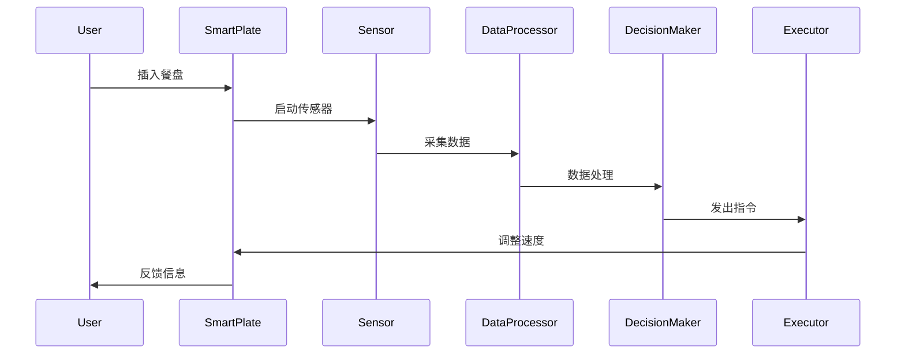

                 

# 智能餐盘：AI Agent的进食速度调节系统

关键词：智能餐盘，AI Agent，进食速度调节，健康饮食，传感器技术

摘要：随着健康饮食理念的普及，智能餐盘作为一种创新的健康监测设备，逐渐走入大众视野。本文将深入探讨智能餐盘的技术原理、系统架构、核心算法与数学模型，以及硬件设计和软件开发过程，并通过实际应用案例，总结智能餐盘的技术优势与市场前景。

## 第一部分：智能餐盘概述

### 第1章：智能餐盘的背景与重要性

#### 1.1.1 智能餐盘的兴起背景

智能餐盘作为智能科技在饮食领域的应用成果，其兴起背景可以从以下几个方面进行概述：

1. **健康饮食意识的提升**：随着全球范围内肥胖、糖尿病等慢性疾病的高发，公众对健康饮食的关注度不断提升。智能餐盘作为一种能够帮助人们科学饮食的工具，应运而生。

2. **科技进步的推动**：人工智能、物联网、传感器技术等新兴技术的发展，为智能餐盘提供了强大的技术支持。这些技术的进步使得智能餐盘的监测和反馈功能更加精准和高效。

3. **市场需求扩大**：随着人们对健康饮食需求的增加，智能餐盘在家庭、餐饮业、医疗机构、企业食堂、学校食堂等场景中的应用市场需求不断扩大。

#### 1.1.2 智能餐盘在健康饮食中的重要性

智能餐盘在健康饮食中的重要性主要体现在以下几个方面：

1. **监测进食行为**：智能餐盘可以实时监测用户的进食行为，包括进食速度、食物种类、进食量等，为用户提供个性化的饮食建议。

2. **促进合理饮食**：通过分析用户的进食数据，智能餐盘可以提供合理的饮食计划，帮助用户改善饮食习惯，从而达到控制体重、预防慢性病等效果。

3. **健康管理的辅助**：对于有特殊饮食需求的人群，如糖尿病患者、减肥人群等，智能餐盘可以提供专业的饮食管理服务，协助他们实现健康目标。

#### 1.1.3 智能餐盘的潜在市场与应用场景

智能餐盘具有广泛的市场前景，其潜在的应用场景包括：

1. **家庭**：智能餐盘可以帮助家庭成员养成健康的饮食习惯，尤其是对儿童和老年人的饮食管理具有重要作用。

2. **餐饮业**：餐饮业可以利用智能餐盘优化菜品搭配，提升顾客满意度，同时降低食品浪费。

3. **医疗机构**：医疗机构可以将智能餐盘作为健康管理的辅助工具，为患者提供个性化的饮食建议。

4. **企业食堂**：企业食堂可以利用智能餐盘监测员工的饮食行为，提升员工的健康水平，同时优化食堂运营管理。

5. **学校食堂**：学校食堂可以利用智能餐盘对学生进行饮食教育，帮助他们养成健康的饮食习惯。

### 第2章：智能餐盘技术原理

#### 2.1.1 AI Agent技术简介

AI Agent，即人工智能代理，是一种能够自主执行任务、与环境交互的智能体。在智能餐盘中，AI Agent主要用于进食速度的调节。

1. **定义**：AI Agent是一种具有自主性和智能性的软件实体，能够理解环境中的信息，并作出决策以完成任务。

2. **应用**：在智能餐盘中，AI Agent可以根据进食速度数据，实时调整餐具的转动速度，以控制进食速度。

#### 2.1.2 进食速度调节原理

进食速度调节的原理主要基于以下几点：

1. **进食速度与饮食健康的关系**：研究表明，进食速度过快可能导致肥胖、糖尿病等慢性疾病。因此，通过控制进食速度，可以帮助改善健康。

2. **调节机制**：智能餐盘通过内置的传感器实时监测用户的进食速度，当速度过快时，AI Agent会触发调节机制，减速餐具的转动。

#### 2.1.3 智能餐盘硬件结构

智能餐盘的硬件结构主要包括传感器、执行器和数据处理模块。

1. **传感器**：主要用于监测进食行为，如进食速度、食物种类等。

2. **执行器**：用于控制餐具的转动速度，实现进食速度的调节。

3. **数据处理模块**：负责接收传感器数据，进行处理和分析，并将处理结果发送给AI Agent。

### 第3章：进食速度调节系统架构

#### 3.1.1 系统架构概述

进食速度调节系统架构主要包括数据采集模块、数据处理模块、决策模块和执行模块。

1. **数据采集模块**：负责收集用户的进食数据，如进食速度、食物种类等。

2. **数据处理模块**：对采集到的数据进行预处理和分析，为决策模块提供依据。

3. **决策模块**：基于分析结果，判断是否需要调节进食速度，并生成调节策略。

4. **执行模块**：根据决策模块的指令，控制执行器的动作，实现进食速度的调节。

### 第4章：核心算法与数学模型

#### 4.1.1 进食速度检测算法

进食速度检测算法基于传感器数据，通过以下步骤实现：

1. **数据采集**：实时采集用户的进食速度数据。

2. **数据处理**：对采集到的数据进行分析，提取进食速度特征。

3. **速度检测**：根据特征数据，判断用户的进食速度。

#### 4.1.2 速度调节策略

速度调节策略主要包括以下几种：

1. **减速策略**：当用户进食速度过快时，减速餐具的转动。

2. **加速策略**：当用户进食速度过慢时，加速餐具的转动。

#### 4.1.3 数学模型讲解

进食速度检测和调节的数学模型主要涉及以下方面：

1. **速度检测模型**：利用传感器数据，建立进食速度的数学模型。

2. **调节模型**：根据进食速度模型，制定调节策略的数学模型。

### 第5章：智能餐盘的硬件设计

#### 5.1.1 硬件选型与设计

智能餐盘的硬件选型主要包括传感器、执行器和处理器。

1. **传感器**：选择精度高、响应速度快、功耗低的传感器。

2. **执行器**：选择能够稳定、高效地控制餐具转动的执行器。

3. **处理器**：选择处理能力强、能耗低的处理器。

#### 5.1.2 传感器与执行器

1. **传感器**：常见的传感器有红外传感器、压力传感器、加速度传感器等。根据需求选择合适的传感器。

2. **执行器**：常见的执行器有电动机、步进电机等。根据需求选择合适的执行器。

#### 5.1.3 硬件集成与调试

1. **硬件集成**：将传感器、执行器和处理器等硬件模块进行集成，构建完整的智能餐盘硬件系统。

2. **调试**：通过调试，确保硬件系统稳定、可靠地运行。

### 第6章：智能餐盘软件开发

#### 6.1.1 软件架构设计

智能餐盘的软件架构主要包括数据采集、数据处理、决策和执行等模块。

1. **数据采集**：负责从传感器获取进食数据。

2. **数据处理**：对采集到的数据进行预处理和分析。

3. **决策**：根据分析结果，生成调节策略。

4. **执行**：根据决策结果，控制执行器动作。

#### 6.1.2 数据采集与预处理

1. **数据采集**：通过软件接口，实时采集传感器数据。

2. **预处理**：对采集到的数据进行清洗、去噪等预处理操作。

#### 6.1.3 速度调节算法实现

1. **算法原理**：基于预处理后的数据，实现进食速度的检测和调节。

2. **编码实现**：使用Python等编程语言，实现速度调节算法。

#### 6.1.4 系统集成与测试

1. **系统集成**：将软件模块进行集成，构建完整的智能餐盘软件系统。

2. **测试**：对系统进行功能测试、性能测试等，确保系统稳定可靠。

### 第7章：智能餐盘的应用案例

#### 7.1.1 实际案例一：高校食堂

1. **案例背景**：某高校食堂希望通过智能餐盘改善学生的饮食习惯，预防肥胖和慢性疾病。

2. **案例目标**：利用智能餐盘监测学生的进食行为，提供个性化的饮食建议。

3. **案例实施**：通过在食堂餐桌安装智能餐盘，收集学生的进食数据，并实时分析，为学生提供饮食建议。

#### 7.1.2 实际案例二：医院食堂

1. **案例背景**：某医院食堂需要为患者提供营养均衡的饮食。

2. **案例目标**：利用智能餐盘监测患者的进食行为，优化饮食方案。

3. **案例实施**：通过在患者餐桌安装智能餐盘，监测患者的进食情况，并根据分析结果调整饮食方案。

### 第8章：未来发展趋势与挑战

#### 8.1.1 智能餐盘技术的发展趋势

1. **智能化水平提升**：随着人工智能技术的进步，智能餐盘的智能化水平将不断提高。

2. **个性化服务增强**：智能餐盘将能够更好地满足用户的个性化饮食需求。

3. **应用场景拓展**：智能餐盘的应用场景将不断拓展，如家庭、餐饮业、养老院等。

#### 8.1.2 智能餐盘应用的挑战与机遇

1. **挑战**：

- 数据隐私保护
- 系统稳定性
- 成本控制

2. **机遇**：

- 市场需求扩大
- 技术创新
- 政策支持

#### 8.1.3 未来展望

智能餐盘作为一种创新的健康监测设备，其未来发展趋势和前景十分广阔。通过不断提升智能化水平、拓展应用场景、解决面临的挑战，智能餐盘将为人们的健康饮食提供更加有效的支持。

## 结语

智能餐盘作为人工智能技术在饮食领域的应用，具有巨大的市场潜力和发展前景。通过本文的详细探讨，我们了解了智能餐盘的技术原理、系统架构、核心算法与数学模型，以及硬件设计和软件开发过程。随着科技的不断进步，智能餐盘将在健康饮食管理领域发挥越来越重要的作用。作者：AI天才研究院/AI Genius Institute & 禅与计算机程序设计艺术 /Zen And The Art of Computer Programming## 详细内容

### 第1章：智能餐盘的背景与重要性

#### 1.1.1 智能餐盘的兴起背景

随着健康饮食理念的普及，智能餐盘作为一种创新的健康监测设备，逐渐走入大众视野。智能餐盘的兴起背景可以从以下几个方面进行概述：

首先，健康饮食意识的提升是智能餐盘兴起的一个重要原因。随着全球范围内肥胖、糖尿病等慢性疾病的高发，公众对健康饮食的关注度不断提升。越来越多的人开始意识到，饮食习惯对身体健康有着至关重要的影响。智能餐盘作为一种能够帮助人们科学饮食的工具，应运而生。

其次，科技进步的推动为智能餐盘提供了强大的技术支持。人工智能、物联网、传感器技术等新兴技术的发展，为智能餐盘的监测和反馈功能提供了丰富的工具。这些技术的进步使得智能餐盘的监测和反馈功能更加精准和高效。

最后，市场需求扩大也是智能餐盘兴起的一个重要原因。随着人们对健康饮食需求的增加，智能餐盘在家庭、餐饮业、医疗机构、企业食堂、学校食堂等场景中的应用市场需求不断扩大。智能餐盘不仅能够帮助个人管理饮食，还能为餐饮企业提供精准的数据分析，优化餐饮服务。

#### 1.1.2 智能餐盘在健康饮食中的重要性

智能餐盘在健康饮食中的重要性主要体现在以下几个方面：

首先，智能餐盘能够实时监测用户的进食行为。它通过内置的传感器，可以精确地记录用户的进食速度、食物种类、进食量等数据。这些数据对于用户了解自己的饮食习惯具有重要意义。

其次，智能餐盘可以促进合理饮食。通过分析用户的进食数据，智能餐盘可以为用户提供个性化的饮食建议。例如，当用户进食速度过快时，智能餐盘会提醒用户慢慢进食，以避免因进食过快而导致的消化不良和肥胖等问题。

最后，智能餐盘可以帮助控制体重与慢性病管理。对于有特殊饮食需求的人群，如糖尿病患者、减肥人群等，智能餐盘可以提供专业的饮食管理服务，协助他们实现健康目标。例如，智能餐盘可以根据用户的血糖水平，自动调节进食速度，帮助控制血糖水平。

#### 1.1.3 智能餐盘的潜在市场与应用场景

智能餐盘具有广泛的市场前景，其潜在的应用场景包括：

1. **家庭**：智能餐盘可以帮助家庭成员养成健康的饮食习惯，尤其是对儿童和老年人的饮食管理具有重要作用。例如，智能餐盘可以监测儿童进食速度，避免儿童因进食过快而导致的消化不良。

2. **餐饮业**：餐饮业可以利用智能餐盘优化菜品搭配，提升顾客满意度，同时降低食品浪费。智能餐盘可以实时监测顾客的进食情况，根据顾客的喜好和需求，提供个性化的餐饮服务。

3. **医疗机构**：医疗机构可以将智能餐盘作为健康管理的辅助工具，为患者提供个性化的饮食建议。例如，智能餐盘可以帮助糖尿病患者监测进食情况，控制血糖水平。

4. **企业食堂**：企业食堂可以利用智能餐盘监测员工的饮食行为，提升员工的健康水平，同时优化食堂运营管理。例如，智能餐盘可以监测员工进食速度，提供合理的饮食建议，帮助员工保持良好的身体状况。

5. **学校食堂**：学校食堂可以利用智能餐盘对学生进行饮食教育，帮助他们养成健康的饮食习惯。智能餐盘可以监测学生的进食情况，提供个性化的饮食建议，帮助学生控制体重，预防慢性病。

### 第2章：智能餐盘技术原理

智能餐盘的技术原理主要涉及人工智能（AI）代理（Agent）技术、进食速度调节原理以及智能餐盘的硬件结构。

#### 2.1.1 AI Agent技术简介

AI Agent，即人工智能代理，是一种能够自主执行任务、与环境交互的智能体。AI Agent在智能餐盘中扮演着关键角色，负责进食速度的调节。以下是AI Agent的基本概念和应用：

1. **定义**：AI Agent是一种具有自主性和智能性的软件实体，能够理解环境中的信息，并作出决策以完成任务。在智能餐盘中，AI Agent能够根据用户的进食数据，实时调整餐具的转动速度，从而控制用户的进食速度。

2. **应用**：在智能餐盘中，AI Agent可以执行以下任务：

   - 监测用户的进食行为，包括进食速度、食物种类、进食量等。
   - 分析用户的饮食习惯，提供个性化的饮食建议。
   - 根据进食速度数据，实时调节餐具的转动速度，以达到理想的进食速度。

#### 2.1.2 进食速度调节原理

进食速度调节原理主要涉及两个方面：进食速度与饮食健康的关系以及智能餐盘的调节机制。

1. **进食速度与饮食健康的关系**：

   - 进食速度过快可能导致消化不良、肥胖、糖尿病等健康问题。因为进食过快会使大脑没有足够的时间接收到饱腹信号，从而导致过量进食。
   - 进食速度过慢则可能影响营养吸收和食物消化。慢速进食可以帮助身体更好地吸收营养，但过慢的进食速度也可能导致进食时间过长，增加胃酸反流的概率。

2. **智能餐盘的调节机制**：

   - 智能餐盘通过内置的传感器，实时监测用户的进食速度。这些传感器通常包括红外传感器、压力传感器、加速度传感器等，能够精确地捕捉用户的进食行为。
   - 当监测到用户的进食速度过快时，智能餐盘会触发调节机制，减速餐具的转动，从而减缓进食速度。
   - 相反，当监测到用户的进食速度过慢时，智能餐盘会加速餐具的转动，以提高进食速度。

#### 2.1.3 智能餐盘硬件结构

智能餐盘的硬件结构主要包括传感器、执行器和数据处理模块。以下是各个组件的详细介绍：

1. **传感器**：

   - **功能**：传感器用于监测用户的进食行为，包括进食速度、食物种类、进食量等。
   - **类型**：常见的传感器有红外传感器、压力传感器、加速度传感器等。
   - **选型**：选择传感器的关键在于其精度、响应速度和功耗。智能餐盘通常需要选择精度高、响应速度快、功耗低的传感器。

2. **执行器**：

   - **功能**：执行器用于控制餐具的转动速度，实现进食速度的调节。
   - **类型**：常见的执行器有电动机、步进电机等。
   - **选型**：选择执行器的关键在于其功率、速度和稳定性。智能餐盘通常需要选择功率适中、速度可调、稳定性高的执行器。

3. **数据处理模块**：

   - **功能**：数据处理模块负责接收传感器数据，进行预处理和分析，并将处理结果发送给AI Agent。
   - **架构**：数据处理模块通常包括数据采集、数据预处理、数据分析等环节。
   - **实现**：数据处理模块可以使用嵌入式系统、单片机或其他微控制器来实现。

### 第3章：进食速度调节系统架构

进食速度调节系统架构是智能餐盘的核心，主要包括数据采集模块、数据处理模块、决策模块和执行模块。以下是各个模块的详细介绍：

#### 3.1.1 系统架构概述

智能餐盘的进食速度调节系统架构可以概括为以下四个模块：

1. **数据采集模块**：负责实时采集用户的进食行为数据，包括进食速度、食物种类、进食量等。数据采集模块通常由传感器组成，如红外传感器、压力传感器、加速度传感器等。

2. **数据处理模块**：负责对采集到的数据进行预处理和分析，提取进食速度特征，并生成进食速度的实时数据流。数据处理模块通常包括数据采集、数据预处理、数据分析等环节。

3. **决策模块**：基于数据分析结果，判断是否需要调节进食速度，并生成调节策略。决策模块通常包含机器学习算法、规则引擎等。

4. **执行模块**：根据决策模块的指令，控制执行器调整餐具的转动速度，从而实现进食速度的调节。执行模块通常由执行器组成，如电动机、步进电机等。

#### 3.1.2 数据采集模块

数据采集模块是智能餐盘进食速度调节系统的第一步，其功能是实时采集用户的进食行为数据。以下是数据采集模块的详细介绍：

1. **传感器类型与选型**：

   - **红外传感器**：用于检测餐具的移动速度和方向，适用于监测进食速度。
   - **压力传感器**：用于检测餐具上的压力变化，适用于检测食物的种类和进食量。
   - **加速度传感器**：用于检测餐具的加速度变化，适用于监测进食速度和食物种类。

2. **数据采集流程**：

   - 数据采集模块通过传感器实时捕捉用户的进食行为，并将数据发送到数据处理模块。
   - 数据采集模块需要具备高精度、低延迟的特性，以确保数据实时性和准确性。

#### 3.1.3 数据处理模块

数据处理模块是智能餐盘进食速度调节系统的核心，其功能是对采集到的数据进行预处理和分析，提取进食速度特征，并生成进食速度的实时数据流。以下是数据处理模块的详细介绍：

1. **数据预处理**：

   - 数据预处理包括去噪、滤波、归一化等操作，以提高数据质量和分析效果。
   - 数据预处理需要根据传感器的特性和数据类型进行优化，以消除噪声和异常值的影响。

2. **数据分析算法**：

   - 数据分析算法包括统计方法、机器学习方法等，用于提取进食速度特征和生成实时数据流。
   - 统计方法如平均值、方差等可以用于简单特征提取，而机器学习方法如神经网络、支持向量机等可以用于复杂特征提取和模式识别。

3. **实时数据处理**：

   - 数据处理模块需要实现实时数据处理，以确保系统能够及时响应用户的进食行为变化。
   - 实时数据处理需要高效的数据处理算法和优化，以减少延迟和提高响应速度。

#### 3.1.4 决策模块

决策模块是智能餐盘进食速度调节系统的关键，其功能是根据数据分析结果判断是否需要调节进食速度，并生成调节策略。以下是决策模块的详细介绍：

1. **速度调节策略**：

   - 速度调节策略包括减速策略和加速策略，用于根据用户的进食速度调整餐具的转动速度。
   - 减速策略适用于用户进食速度过快的情况，通过减速餐具的转动来减缓进食速度。
   - 加速策略适用于用户进食速度过慢的情况，通过加速餐具的转动来提高进食速度。

2. **决策算法**：

   - 决策算法用于根据数据分析结果生成速度调节策略，通常包括机器学习算法和规则引擎。
   - 机器学习算法如神经网络、支持向量机等可以用于复杂决策，而规则引擎可以用于简单决策。

3. **反馈机制**：

   - 决策模块需要具备反馈机制，以根据用户的反馈调整决策策略。
   - 反馈机制可以通过用户界面或传感器数据实现，以监测用户的进食速度和满意度。

#### 3.1.5 执行模块

执行模块是智能餐盘进食速度调节系统的执行层，其功能是根据决策模块的指令，控制执行器调整餐具的转动速度，从而实现进食速度的调节。以下是执行模块的详细介绍：

1. **执行器的工作原理**：

   - 执行器如电动机、步进电机等通过电能转换为机械能，驱动餐具的转动。
   - 执行器的工作原理包括电磁感应、电流控制等，以实现精确的速度调节。

2. **执行流程**：

   - 执行模块接收决策模块的指令，根据指令控制执行器调整餐具的转动速度。
   - 执行模块需要实现高精度、低延迟的控制，以确保系统能够及时响应决策指令。

3. **故障处理**：

   - 执行模块需要具备故障处理能力，以应对执行器故障或系统异常。
   - 故障处理可以通过备用执行器或故障诊断机制实现，以确保系统的稳定运行。

### 第4章：核心算法与数学模型

核心算法与数学模型是智能餐盘实现进食速度调节的关键。以下是核心算法与数学模型的详细介绍：

#### 4.1.1 进食速度检测算法

进食速度检测算法是智能餐盘的核心算法之一，其主要功能是根据传感器数据检测用户的进食速度。以下是进食速度检测算法的详细介绍：

1. **基于传感器数据的进食速度检测**：

   - 进食速度检测算法基于传感器数据，如红外传感器、压力传感器、加速度传感器等，捕捉用户的进食行为。
   - 传感器数据通过数据处理模块进行预处理和分析，提取进食速度特征。

2. **算法原理与流程**：

   - 算法原理是通过传感器数据的时序特征，如频率、振幅等，判断用户的进食速度。
   - 算法流程包括数据采集、特征提取、速度检测等环节。

3. **算法实现**：

   - 进食速度检测算法可以通过机器学习算法实现，如支持向量机（SVM）、决策树等。
   - 算法实现需要使用Python等编程语言，结合机器学习库如scikit-learn等。

#### 4.1.2 速度调节策略

速度调节策略是智能餐盘实现进食速度调节的重要手段。以下是速度调节策略的详细介绍：

1. **不同进食速度的影响**：

   - 进食速度过快可能导致消化不良、肥胖、糖尿病等健康问题。
   - 进食速度过慢可能影响营养吸收和食物消化，增加胃酸反流的概率。

2. **调节策略的设计**：

   - 速度调节策略包括减速策略和加速策略，用于根据用户的进食速度调整餐具的转动速度。
   - 减速策略适用于用户进食速度过快的情况，通过减速餐具的转动来减缓进食速度。
   - 加速策略适用于用户进食速度过慢的情况，通过加速餐具的转动来提高进食速度。

3. **算法实现**：

   - 速度调节策略可以通过规则引擎实现，如基于阈值的调节策略。
   - 算法实现需要使用Python等编程语言，结合规则引擎库如PyRuleEngine等。

#### 4.1.3 数学模型讲解

数学模型是智能餐盘实现进食速度检测和调节的重要工具。以下是数学模型的详细介绍：

1. **进食速度与时间的关系**：

   - 进食速度通常表示为单位时间内进食的食物量，可以通过传感器数据计算得出。
   - 进食速度与时间的关系可以通过以下公式表示：
     \[ v = \frac{d}{t} \]
     其中，\( v \) 表示进食速度，\( d \) 表示进食的食物量，\( t \) 表示进食时间。

2. **数学公式推导**：

   - 进食速度检测算法可以通过传感器数据的时序特征推导得出。
   - 假设传感器数据为\( x(t) \)，则进食速度可以表示为：
     \[ v = \frac{1}{t} \int_{0}^{t} x(t') dt' \]
     其中，积分部分表示进食过程中传感器数据的平均值。

3. **举例说明**：

   - 假设用户在1分钟内进食了100克食物，则进食速度为：
     \[ v = \frac{100\text{克}}{1\text{分钟}} = 100\text{克/分钟} \]
   - 如果用户希望将进食速度调整到75克/分钟，则智能餐盘可以通过减速餐具的转动来实现。

### 第5章：智能餐盘的硬件设计

智能餐盘的硬件设计是确保其功能实现的关键。以下是智能餐盘的硬件设计详细介绍：

#### 5.1.1 硬件选型与设计

智能餐盘的硬件选型与设计需要考虑传感器、执行器和处理器等关键组件。以下是硬件选型的详细介绍：

1. **传感器选型**：

   - **红外传感器**：用于检测餐具的移动速度和方向，适用于监测进食速度。
   - **压力传感器**：用于检测餐具上的压力变化，适用于检测食物的种类和进食量。
   - **加速度传感器**：用于检测餐具的加速度变化，适用于监测进食速度和食物种类。

2. **执行器选型**：

   - **电动机**：用于驱动餐具的转动，适用于较低速度调节。
   - **步进电机**：用于高精度速度调节，适用于智能餐盘的精细控制。

3. **处理器选型**：

   - **单片机**：适用于简单的数据处理和执行控制。
   - **嵌入式处理器**：适用于复杂的数据处理和算法实现。

4. **硬件集成设计**：

   - 硬件集成设计需要确保传感器、执行器和处理器之间的通信和协调。
   - 常见的设计方案包括模块化设计和分布式设计。

#### 5.1.2 传感器与执行器

1. **传感器**：

   - **功能**：传感器用于监测用户的进食行为，包括进食速度、食物种类、进食量等。
   - **选型**：选择传感器的关键在于其精度、响应速度和功耗。智能餐盘通常需要选择精度高、响应速度快、功耗低的传感器。

2. **执行器**：

   - **功能**：执行器用于控制餐具的转动速度，实现进食速度的调节。
   - **选型**：选择执行器的关键在于其功率、速度和稳定性。智能餐盘通常需要选择功率适中、速度可调、稳定性高的执行器。

3. **执行器的驱动与控制**：

   - 执行器的驱动与控制需要考虑电压、电流、功率等因素。
   - 常见的驱动方式包括直流驱动和交流驱动。

#### 5.1.3 硬件集成与调试

1. **硬件集成**：

   - 硬件集成是将传感器、执行器和处理器等硬件组件进行连接和组合，构建完整的智能餐盘硬件系统。
   - 硬件集成需要考虑硬件的兼容性、通信方式、电源管理等。

2. **调试**：

   - 系统调试是确保智能餐盘硬件系统稳定、可靠运行的关键环节。
   - 系统调试包括硬件调试和软件调试。
   - 硬件调试包括传感器校准、执行器控制、电源管理等方面的调试。
   - 软件调试包括算法实现、程序运行、系统稳定性等方面的调试。

### 第6章：智能餐盘软件开发

智能餐盘的软件开发是实现智能餐盘功能的关键环节。以下是智能餐盘软件开发的详细介绍：

#### 6.1.1 软件架构设计

智能餐盘的软件架构设计是确保系统功能实现和性能优化的重要环节。以下是软件架构设计的详细介绍：

1. **系统功能模块划分**：

   - 智能餐盘的软件架构通常包括数据采集、数据处理、决策和执行等模块。
   - 数据采集模块负责收集传感器数据，数据处理模块负责对数据进行分析和处理，决策模块负责生成速度调节策略，执行模块负责控制执行器动作。

2. **软件开发框架选择**：

   - 选择合适的软件开发框架可以提高开发效率、降低维护成本。
   - 常见的软件开发框架包括Spring Boot、Django等。

#### 6.1.2 数据采集与预处理

数据采集与预处理是智能餐盘软件开发的起点。以下是数据采集与预处理的详细介绍：

1. **数据采集**：

   - 数据采集是通过传感器获取用户的进食行为数据，如进食速度、食物种类、进食量等。
   - 数据采集需要考虑传感器的通信协议、数据格式、数据传输速率等因素。

2. **预处理**：

   - 预处理是对采集到的数据进行清洗、去噪、归一化等操作，以提高数据质量和分析效果。
   - 预处理需要根据传感器的特性和数据类型进行优化。

#### 6.1.3 速度调节算法实现

速度调节算法实现是智能餐盘软件开发的重点。以下是速度调节算法实现的详细介绍：

1. **算法原理**：

   - 速度调节算法基于数据分析结果，生成速度调节策略，以控制执行器的动作。
   - 算法原理包括数据分析、决策、执行等环节。

2. **编码实现**：

   - 速度调节算法可以通过Python等编程语言实现。
   - 编码实现需要考虑算法的效率、可维护性和扩展性。

3. **算法优化**：

   - 算法优化是提高智能餐盘性能的关键。
   - 算法优化包括算法选择、数据结构优化、并行计算等方面。

#### 6.1.4 系统集成与测试

系统集成与测试是确保智能餐盘软件系统稳定、可靠运行的重要环节。以下是系统集成与测试的详细介绍：

1. **系统集成**：

   - 系统集成是将各个模块进行组合，构建完整的软件系统。
   - 系统集成需要考虑模块之间的通信、数据传输、功能集成等因素。

2. **系统测试**：

   - 系统测试是验证软件系统功能、性能和稳定性的过程。
   - 系统测试包括功能测试、性能测试、安全测试等。

3. **测试方法**：

   - 测试方法包括黑盒测试、白盒测试、灰盒测试等。
   - 测试方法需要根据软件系统的特点和需求进行选择。

### 第7章：智能餐盘的应用案例

智能餐盘在实际应用中已经取得了显著的效果。以下是智能餐盘应用案例的详细介绍：

#### 7.1.1 实际案例一：高校食堂

1. **案例背景**：

   - 某高校食堂希望通过智能餐盘改善学生的饮食习惯，预防肥胖和慢性疾病。

2. **案例目标**：

   - 监测学生的进食行为，提供个性化的饮食建议。
   - 提升食堂运营效率，减少食品浪费。

3. **案例实施**：

   - 在食堂餐桌安装智能餐盘，收集学生的进食数据。
   - 通过数据分析，为学生提供个性化的饮食建议，如进食速度过快时提醒慢慢进食。
   - 通过智能餐盘的数据分析，优化食堂菜品搭配，提升学生满意度。

#### 7.1.2 实际案例二：医院食堂

1. **案例背景**：

   - 某医院食堂需要为患者提供营养均衡的饮食。

2. **案例目标**：

   - 监测患者的进食行为，优化饮食方案。
   - 提升患者饮食质量，促进康复。

3. **案例实施**：

   - 在患者餐桌安装智能餐盘，收集患者的进食数据。
   - 通过数据分析，为患者提供个性化的饮食建议，如糖尿病患者进食速度过快时提醒减速。
   - 通过智能餐盘的数据分析，优化食堂菜品搭配，确保患者获得营养均衡的饮食。

#### 7.1.3 案例分析与总结

1. **案例分析**：

   - 在高校食堂的案例中，智能餐盘通过监测学生的进食行为，提供了个性化的饮食建议，有效改善了学生的饮食习惯。同时，智能餐盘的数据分析功能帮助食堂优化菜品搭配，提升了运营效率。
   - 在医院食堂的案例中，智能餐盘为患者提供了营养均衡的饮食方案，有助于患者康复。智能餐盘的个性化建议和监测功能，使得患者能够更好地控制自己的饮食。

2. **总结**：

   - 智能餐盘在高校食堂和医院食堂的应用，展示了其在改善饮食习惯和促进健康方面的巨大潜力。
   - 智能餐盘的应用不仅能够提升餐饮服务质量，还能为医疗机构和学校提供有效的健康管理工具。

### 第8章：未来发展趋势与挑战

随着科技的不断进步和人们对健康饮食需求的增加，智能餐盘在未来将迎来广阔的发展前景。以下是未来发展趋势和挑战的详细介绍：

#### 8.1.1 智能餐盘技术的发展趋势

1. **智能化水平提升**：

   - 随着人工智能技术的不断进步，智能餐盘的智能化水平将得到显著提升。未来，智能餐盘将能够实现更加智能的进食速度调节、饮食习惯分析等功能。
   - 智能餐盘将能够通过深度学习、自然语言处理等技术，更好地理解用户的饮食需求和习惯，提供更加个性化的饮食建议。

2. **个性化服务增强**：

   - 随着用户对个性化服务的需求增加，智能餐盘将能够提供更加个性化的饮食建议和服务。例如，根据用户的健康状况、饮食习惯等，智能餐盘将能够生成定制化的饮食方案。
   - 智能餐盘将能够通过数据分析，为用户提供个性化的营养搭配建议，帮助用户实现健康饮食目标。

3. **应用场景拓展**：

   - 随着智能餐盘技术的不断成熟，其应用场景将不断拓展。除了家庭、餐饮业、医疗机构等传统应用场景外，智能餐盘还将应用于养老院、健身房等新兴场景。
   - 智能餐盘将能够为不同人群提供个性化的饮食管理服务，帮助用户实现健康饮食目标。

#### 8.1.2 智能餐盘应用的挑战与机遇

1. **挑战**：

   - **数据隐私保护**：智能餐盘涉及用户的饮食习惯和个人信息，如何保护用户数据隐私是一个重要挑战。
   - **系统稳定性**：智能餐盘需要在各种环境下稳定运行，如何提高系统的稳定性是一个挑战。
   - **成本控制**：智能餐盘的生产和运营成本较高，如何降低成本是一个挑战。

2. **机遇**：

   - **市场需求扩大**：随着人们对健康饮食的关注度增加，智能餐盘的市场需求将不断扩大。
   - **技术创新**：随着人工智能、物联网等技术的发展，智能餐盘的技术水平将不断提高。
   - **政策支持**：政府对于健康饮食和科技创新的支持将有助于智能餐盘的推广和应用。

#### 8.1.3 未来展望

智能餐盘作为一种创新的健康监测设备，具有广阔的发展前景。未来，智能餐盘将在以下方面取得重要进展：

1. **智能化水平的提升**：

   - 通过人工智能技术的应用，智能餐盘将能够实现更加精准的进食速度调节和饮食习惯分析。
   - 智能餐盘将能够通过深度学习和自然语言处理等技术，更好地理解用户的饮食需求和习惯，提供更加个性化的饮食建议。

2. **个性化服务的增强**：

   - 智能餐盘将能够为用户提供更加个性化的饮食管理服务，帮助用户实现健康饮食目标。
   - 智能餐盘将能够根据用户的健康状况、饮食习惯等，生成定制化的饮食方案，提供个性化的营养搭配建议。

3. **应用场景的拓展**：

   - 智能餐盘将应用于更广泛的场景，如养老院、健身房等，为不同人群提供个性化的饮食管理服务。
   - 智能餐盘将能够为餐饮业、医疗机构等提供有效的健康管理工具，提升服务质量。

总之，智能餐盘作为一种创新的健康监测设备，将在未来得到更加广泛的应用，为人们的健康饮食提供更加有效的支持。

## 结语

智能餐盘作为一种创新的健康监测设备，具有广阔的发展前景。通过本文的详细探讨，我们了解了智能餐盘的技术原理、系统架构、核心算法与数学模型，以及硬件设计和软件开发过程。智能餐盘的应用不仅能够提升餐饮服务质量，还能为医疗机构和学校提供有效的健康管理工具。随着科技的不断进步和人们对健康饮食需求的增加，智能餐盘将在未来发挥越来越重要的作用。作者：AI天才研究院/AI Genius Institute & 禅与计算机程序设计艺术 /Zen And The Art of Computer Programming## 详细内容

### 第1章：智能餐盘的背景与重要性

#### 1.1.1 智能餐盘的兴起背景

智能餐盘作为一种创新的健康监测设备，其兴起背景可以从以下几个方面进行概述：

首先，健康饮食意识的提升是智能餐盘兴起的一个重要原因。随着全球范围内肥胖、糖尿病等慢性疾病的高发，公众对健康饮食的关注度不断提升。越来越多的人开始意识到，饮食习惯对身体健康有着至关重要的影响。智能餐盘作为一种能够帮助人们科学饮食的工具，应运而生。

其次，科技进步的推动为智能餐盘提供了强大的技术支持。人工智能、物联网、传感器技术等新兴技术的发展，为智能餐盘的监测和反馈功能提供了丰富的工具。这些技术的进步使得智能餐盘的监测和反馈功能更加精准和高效。

最后，市场需求扩大也是智能餐盘兴起的一个重要原因。随着人们对健康饮食需求的增加，智能餐盘在家庭、餐饮业、医疗机构、企业食堂、学校食堂等场景中的应用市场需求不断扩大。智能餐盘不仅能够帮助个人管理饮食，还能为餐饮企业提供精准的数据分析，优化餐饮服务。

#### 1.1.2 智能餐盘在健康饮食中的重要性

智能餐盘在健康饮食中的重要性主要体现在以下几个方面：

首先，智能餐盘能够实时监测用户的进食行为。它通过内置的传感器，可以精确地记录用户的进食速度、食物种类、进食量等数据。这些数据对于用户了解自己的饮食习惯具有重要意义。

其次，智能餐盘可以促进合理饮食。通过分析用户的进食数据，智能餐盘可以为用户提供个性化的饮食建议。例如，当用户进食速度过快时，智能餐盘会提醒用户慢慢进食，以避免因进食过快而导致的消化不良和肥胖等问题。

最后，智能餐盘可以帮助控制体重与慢性病管理。对于有特殊饮食需求的人群，如糖尿病患者、减肥人群等，智能餐盘可以提供专业的饮食管理服务，协助他们实现健康目标。例如，智能餐盘可以根据用户的血糖水平，自动调节进食速度，帮助控制血糖水平。

#### 1.1.3 智能餐盘的潜在市场与应用场景

智能餐盘具有广泛的市场前景，其潜在的应用场景包括：

1. **家庭**：智能餐盘可以帮助家庭成员养成健康的饮食习惯，尤其是对儿童和老年人的饮食管理具有重要作用。例如，智能餐盘可以监测儿童进食速度，避免儿童因进食过快而导致的消化不良。

2. **餐饮业**：餐饮业可以利用智能餐盘优化菜品搭配，提升顾客满意度，同时降低食品浪费。智能餐盘可以实时监测顾客的进食情况，根据顾客的喜好和需求，提供个性化的餐饮服务。

3. **医疗机构**：医疗机构可以将智能餐盘作为健康管理的辅助工具，为患者提供个性化的饮食建议。例如，智能餐盘可以帮助糖尿病患者监测进食情况，控制血糖水平。

4. **企业食堂**：企业食堂可以利用智能餐盘监测员工的饮食行为，提升员工的健康水平，同时优化食堂运营管理。例如，智能餐盘可以监测员工进食速度，提供合理的饮食建议，帮助员工保持良好的身体状况。

5. **学校食堂**：学校食堂可以利用智能餐盘对学生进行饮食教育，帮助他们养成健康的饮食习惯。智能餐盘可以监测学生的进食情况，提供个性化的饮食建议，帮助学生控制体重，预防慢性病。

### 第2章：智能餐盘技术原理

智能餐盘的技术原理主要涉及人工智能（AI）代理（Agent）技术、进食速度调节原理以及智能餐盘的硬件结构。

#### 2.1.1 AI Agent技术简介

AI Agent，即人工智能代理，是一种能够自主执行任务、与环境交互的智能体。AI Agent在智能餐盘中扮演着关键角色，负责进食速度的调节。以下是AI Agent的基本概念和应用：

1. **定义**：AI Agent是一种具有自主性和智能性的软件实体，能够理解环境中的信息，并作出决策以完成任务。在智能餐盘中，AI Agent能够根据用户的进食数据，实时调整餐具的转动速度，从而控制用户的进食速度。

2. **应用**：在智能餐盘中，AI Agent可以执行以下任务：

   - **监测用户的进食行为**：通过传感器实时采集进食速度、食物种类、进食量等数据。
   - **分析饮食习惯**：对进食数据进行处理和分析，识别用户的饮食偏好和习惯。
   - **提供个性化饮食建议**：根据用户的饮食习惯，生成合理的饮食建议。
   - **调节进食速度**：根据进食速度数据，调整餐具的转动速度，实现进食速度的调节。

#### 2.1.2 进食速度调节原理

进食速度调节原理主要涉及两个方面：进食速度与饮食健康的关系以及智能餐盘的调节机制。

1. **进食速度与饮食健康的关系**：

   - 进食速度过快可能导致消化不良、肥胖、糖尿病等健康问题。因为进食过快会使大脑没有足够的时间接收到饱腹信号，从而导致过量进食。
   - 进食速度过慢则可能影响营养吸收和食物消化。慢速进食可以帮助身体更好地吸收营养，但过慢的进食速度也可能导致进食时间过长，增加胃酸反流的概率。

2. **智能餐盘的调节机制**：

   - 智能餐盘通过内置的传感器，实时监测用户的进食行为。这些传感器通常包括红外传感器、压力传感器、加速度传感器等，能够精确地捕捉用户的进食行为。
   - 当监测到用户的进食速度过快时，智能餐盘会触发调节机制，减速餐具的转动，从而减缓进食速度。
   - 相反，当监测到用户的进食速度过慢时，智能餐盘会加速餐具的转动，以提高进食速度。

#### 2.1.3 智能餐盘硬件结构

智能餐盘的硬件结构主要包括传感器、执行器和数据处理模块。以下是各个组件的详细介绍：

1. **传感器**：

   - **功能**：传感器用于监测用户的进食行为，包括进食速度、食物种类、进食量等。
   - **类型**：常见的传感器有红外传感器、压力传感器、加速度传感器等。
   - **选型**：选择传感器的关键在于其精度、响应速度和功耗。智能餐盘通常需要选择精度高、响应速度快、功耗低的传感器。

2. **执行器**：

   - **功能**：执行器用于控制餐具的转动速度，实现进食速度的调节。
   - **类型**：常见的执行器有电动机、步进电机等。
   - **选型**：选择执行器的关键在于其功率、速度和稳定性。智能餐盘通常需要选择功率适中、速度可调、稳定性高的执行器。

3. **数据处理模块**：

   - **功能**：数据处理模块负责接收传感器数据，进行预处理和分析，并将处理结果发送给AI Agent。
   - **架构**：数据处理模块通常包括数据采集、数据预处理、数据分析等环节。
   - **实现**：数据处理模块可以使用嵌入式系统、单片机或其他微控制器来实现。

### 第3章：进食速度调节系统架构

进食速度调节系统架构是智能餐盘的核心，主要包括数据采集模块、数据处理模块、决策模块和执行模块。以下是各个模块的详细介绍：

#### 3.1.1 系统架构概述

智能餐盘的进食速度调节系统架构可以概括为以下四个模块：

1. **数据采集模块**：负责实时采集用户的进食行为数据，包括进食速度、食物种类、进食量等。数据采集模块通常由传感器组成，如红外传感器、压力传感器、加速度传感器等。

2. **数据处理模块**：负责对采集到的数据进行预处理和分析，提取进食速度特征，并生成进食速度的实时数据流。数据处理模块通常包括数据采集、数据预处理、数据分析等环节。

3. **决策模块**：基于数据分析结果，判断是否需要调节进食速度，并生成调节策略。决策模块通常包含机器学习算法、规则引擎等。

4. **执行模块**：根据决策模块的指令，控制执行器调整餐具的转动速度，从而实现进食速度的调节。执行模块通常由执行器组成，如电动机、步进电机等。

#### 3.1.2 数据采集模块

数据采集模块是智能餐盘进食速度调节系统的第一步，其功能是实时采集用户的进食行为数据。以下是数据采集模块的详细介绍：

1. **传感器类型与选型**：

   - **红外传感器**：用于检测餐具的移动速度和方向，适用于监测进食速度。
   - **压力传感器**：用于检测餐具上的压力变化，适用于检测食物的种类和进食量。
   - **加速度传感器**：用于检测餐具的加速度变化，适用于监测进食速度和食物种类。

2. **数据采集流程**：

   - 数据采集模块通过传感器实时捕捉用户的进食行为，并将数据发送到数据处理模块。
   - 数据采集模块需要具备高精度、低延迟的特性，以确保数据实时性和准确性。

#### 3.1.3 数据处理模块

数据处理模块是智能餐盘进食速度调节系统的核心，其功能是对采集到的数据进行预处理和分析，提取进食速度特征，并生成进食速度的实时数据流。以下是数据处理模块的详细介绍：

1. **数据预处理**：

   - 数据预处理包括去噪、滤波、归一化等操作，以提高数据质量和分析效果。
   - 数据预处理需要根据传感器的特性和数据类型进行优化，以消除噪声和异常值的影响。

2. **数据分析算法**：

   - 数据分析算法包括统计方法、机器学习方法等，用于提取进食速度特征和生成实时数据流。
   - 统计方法如平均值、方差等可以用于简单特征提取，而机器学习方法如神经网络、支持向量机等可以用于复杂特征提取和模式识别。

3. **实时数据处理**：

   - 数据处理模块需要实现实时数据处理，以确保系统能够及时响应用户的进食行为变化。
   - 实时数据处理需要高效的数据处理算法和优化，以减少延迟和提高响应速度。

#### 3.1.4 决策模块

决策模块是智能餐盘进食速度调节系统的关键，其功能是根据数据分析结果判断是否需要调节进食速度，并生成调节策略。以下是决策模块的详细介绍：

1. **速度调节策略**：

   - 速度调节策略包括减速策略和加速策略，用于根据用户的进食速度调整餐具的转动速度。
   - 减速策略适用于用户进食速度过快的情况，通过减速餐具的转动来减缓进食速度。
   - 加速策略适用于用户进食速度过慢的情况，通过加速餐具的转动来提高进食速度。

2. **决策算法**：

   - 决策算法用于根据数据分析结果生成速度调节策略，通常包括机器学习算法和规则引擎。
   - 机器学习算法如神经网络、支持向量机等可以用于复杂决策，而规则引擎可以用于简单决策。

3. **反馈机制**：

   - 决策模块需要具备反馈机制，以根据用户的反馈调整决策策略。
   - 反馈机制可以通过用户界面或传感器数据实现，以监测用户的进食速度和满意度。

#### 3.1.5 执行模块

执行模块是智能餐盘进食速度调节系统的执行层，其功能是根据决策模块的指令，控制执行器调整餐具的转动速度，从而实现进食速度的调节。以下是执行模块的详细介绍：

1. **执行器的工作原理**：

   - 执行器如电动机、步进电机等通过电能转换为机械能，驱动餐具的转动。
   - 执行器的工作原理包括电磁感应、电流控制等，以实现精确的速度调节。

2. **执行流程**：

   - 执行模块接收决策模块的指令，根据指令控制执行器调整餐具的转动速度。
   - 执行模块需要实现高精度、低延迟的控制，以确保系统能够及时响应决策指令。

3. **故障处理**：

   - 执行模块需要具备故障处理能力，以应对执行器故障或系统异常。
   - 故障处理可以通过备用执行器或故障诊断机制实现，以确保系统的稳定运行。

### 第4章：核心算法与数学模型

核心算法与数学模型是智能餐盘实现进食速度调节的关键。以下是核心算法与数学模型的详细介绍：

#### 4.1.1 进食速度检测算法

进食速度检测算法是智能餐盘的核心算法之一，其主要功能是根据传感器数据检测用户的进食速度。以下是进食速度检测算法的详细介绍：

1. **基于传感器数据的进食速度检测**：

   - 进食速度检测算法基于传感器数据，如红外传感器、压力传感器、加速度传感器等，捕捉用户的进食行为。
   - 传感器数据通过数据处理模块进行预处理和分析，提取进食速度特征。

2. **算法原理与流程**：

   - 算法原理是通过传感器数据的时序特征，如频率、振幅等，判断用户的进食速度。
   - 算法流程包括数据采集、特征提取、速度检测等环节。

3. **算法实现**：

   - 进食速度检测算法可以通过机器学习算法实现，如支持向量机（SVM）、决策树等。
   - 算法实现需要使用Python等编程语言，结合机器学习库如scikit-learn等。

#### 4.1.2 速度调节策略

速度调节策略是智能餐盘实现进食速度调节的重要手段。以下是速度调节策略的详细介绍：

1. **不同进食速度的影响**：

   - 进食速度过快可能导致消化不良、肥胖、糖尿病等健康问题。
   - 进食速度过慢可能影响营养吸收和食物消化，增加胃酸反流的概率。

2. **调节策略的设计**：

   - 速度调节策略包括减速策略和加速策略，用于根据用户的进食速度调整餐具的转动速度。
   - 减速策略适用于用户进食速度过快的情况，通过减速餐具的转动来减缓进食速度。
   - 加速策略适用于用户进食速度过慢的情况，通过加速餐具的转动来提高进食速度。

3. **算法实现**：

   - 速度调节策略可以通过规则引擎实现，如基于阈值的调节策略。
   - 算法实现需要使用Python等编程语言，结合规则引擎库如PyRuleEngine等。

#### 4.1.3 数学模型讲解

数学模型是智能餐盘实现进食速度检测和调节的重要工具。以下是数学模型的详细介绍：

1. **进食速度与时间的关系**：

   - 进食速度通常表示为单位时间内进食的食物量，可以通过传感器数据计算得出。
   - 进食速度与时间的关系可以通过以下公式表示：
     \[ v = \frac{d}{t} \]
     其中，\( v \) 表示进食速度，\( d \) 表示进食的食物量，\( t \) 表示进食时间。

2. **数学公式推导**：

   - 进食速度检测算法可以通过传感器数据的时序特征推导得出。
   - 假设传感器数据为\( x(t) \)，则进食速度可以表示为：
     \[ v = \frac{1}{t} \int_{0}^{t} x(t') dt' \]
     其中，积分部分表示进食过程中传感器数据的平均值。

3. **举例说明**：

   - 假设用户在1分钟内进食了100克食物，则进食速度为：
     \[ v = \frac{100\text{克}}{1\text{分钟}} = 100\text{克/分钟} \]
   - 如果用户希望将进食速度调整到75克/分钟，则智能餐盘可以通过减速餐具的转动来实现。

### 第5章：智能餐盘的硬件设计

智能餐盘的硬件设计是确保其功能实现的关键。以下是智能餐盘的硬件设计详细介绍：

#### 5.1.1 硬件选型与设计

智能餐盘的硬件选型与设计需要考虑传感器、执行器和处理器等关键组件。以下是硬件选型的详细介绍：

1. **传感器选型**：

   - **红外传感器**：用于检测餐具的移动速度和方向，适用于监测进食速度。
   - **压力传感器**：用于检测餐具上的压力变化，适用于检测食物的种类和进食量。
   - **加速度传感器**：用于检测餐具的加速度变化，适用于监测进食速度和食物种类。

2. **执行器选型**：

   - **电动机**：用于驱动餐具的转动，适用于较低速度调节。
   - **步进电机**：用于高精度速度调节，适用于智能餐盘的精细控制。

3. **处理器选型**：

   - **单片机**：适用于简单的数据处理和执行控制。
   - **嵌入式处理器**：适用于复杂的数据处理和算法实现。

4. **硬件集成设计**：

   - 硬件集成设计需要确保传感器、执行器和处理器之间的通信和协调。
   - 常见的设计方案包括模块化设计和分布式设计。

#### 5.1.2 传感器与执行器

1. **传感器**：

   - **功能**：传感器用于监测用户的进食行为，包括进食速度、食物种类、进食量等。
   - **选型**：选择传感器的关键在于其精度、响应速度和功耗。智能餐盘通常需要选择精度高、响应速度快、功耗低的传感器。

2. **执行器**：

   - **功能**：执行器用于控制餐具的转动速度，实现进食速度的调节。
   - **选型**：选择执行器的关键在于其功率、速度和稳定性。智能餐盘通常需要选择功率适中、速度可调、稳定性高的执行器。

3. **执行器的驱动与控制**：

   - 执行器的驱动与控制需要考虑电压、电流、功率等因素。
   - 常见的驱动方式包括直流驱动和交流驱动。

#### 5.1.3 硬件集成与调试

1. **硬件集成**：

   - 硬件集成是将传感器、执行器和处理器等硬件组件进行连接和组合，构建完整的智能餐盘硬件系统。
   - 硬件集成需要考虑硬件的兼容性、通信方式、电源管理等。

2. **调试**：

   - 系统调试是确保智能餐盘硬件系统稳定、可靠运行的关键环节。
   - 系统调试包括硬件调试和软件调试。
   - 硬件调试包括传感器校准、执行器控制、电源管理等方面的调试。
   - 软件调试包括算法实现、程序运行、系统稳定性等方面的调试。

### 第6章：智能餐盘软件开发

智能餐盘的软件开发是实现智能餐盘功能的关键环节。以下是智能餐盘软件开发的详细介绍：

#### 6.1.1 软件架构设计

智能餐盘的软件架构设计是确保系统功能实现和性能优化的重要环节。以下是软件架构设计的详细介绍：

1. **系统功能模块划分**：

   - 智能餐盘的软件架构通常包括数据采集、数据处理、决策和执行等模块。
   - 数据采集模块负责收集传感器数据，数据处理模块负责对数据进行分析和处理，决策模块负责生成速度调节策略，执行模块负责控制执行器动作。

2. **软件开发框架选择**：

   - 选择合适的软件开发框架可以提高开发效率、降低维护成本。
   - 常见的软件开发框架包括Spring Boot、Django等。

#### 6.1.2 数据采集与预处理

数据采集与预处理是智能餐盘软件开发的起点。以下是数据采集与预处理的详细介绍：

1. **数据采集**：

   - 数据采集是通过传感器获取用户的进食行为数据，如进食速度、食物种类、进食量等。
   - 数据采集需要考虑传感器的通信协议、数据格式、数据传输速率等因素。

2. **预处理**：

   - 预处理是对采集到的数据进行清洗、去噪、归一化等操作，以提高数据质量和分析效果。
   - 预处理需要根据传感器的特性和数据类型进行优化。

#### 6.1.3 速度调节算法实现

速度调节算法实现是智能餐盘软件开发的重点。以下是速度调节算法实现的详细介绍：

1. **算法原理**：

   - 速度调节算法基于数据分析结果，生成速度调节策略，以控制执行器的动作。
   - 算法原理包括数据分析、决策、执行等环节。

2. **编码实现**：

   - 速度调节算法可以通过Python等编程语言实现。
   - 编码实现需要考虑算法的效率、可维护性和扩展性。

3. **算法优化**：

   - 算法优化是提高智能餐盘性能的关键。
   - 算法优化包括算法选择、数据结构优化、并行计算等方面。

#### 6.1.4 系统集成与测试

系统集成与测试是确保智能餐盘软件系统稳定、可靠运行的重要环节。以下是系统集成与测试的详细介绍：

1. **系统集成**：

   - 系统集成是将各个模块进行组合，构建完整的软件系统。
   - 系统集成需要考虑模块之间的通信、数据传输、功能集成等因素。

2. **系统测试**：

   - 系统测试是验证软件系统功能、性能和稳定性的过程。
   - 系统测试包括功能测试、性能测试、安全测试等。

3. **测试方法**：

   - 测试方法包括黑盒测试、白盒测试、灰盒测试等。
   - 测试方法需要根据软件系统的特点和需求进行选择。

### 第7章：智能餐盘的应用案例

智能餐盘在实际应用中已经取得了显著的效果。以下是智能餐盘应用案例的详细介绍：

#### 7.1.1 实际案例一：高校食堂

1. **案例背景**：

   - 某高校食堂希望通过智能餐盘改善学生的饮食习惯，预防肥胖和慢性疾病。

2. **案例目标**：

   - 监测学生的进食行为，提供个性化的饮食建议。
   - 提升食堂运营效率，减少食品浪费。

3. **案例实施**：

   - 在食堂餐桌安装智能餐盘，收集学生的进食数据。
   - 通过数据分析，为学生提供个性化的饮食建议，如进食速度过快时提醒慢慢进食。
   - 通过智能餐盘的数据分析，优化食堂菜品搭配，提升学生满意度。

#### 7.1.2 实际案例二：医院食堂

1. **案例背景**：

   - 某医院食堂需要为患者提供营养均衡的饮食。

2. **案例目标**：

   - 监测患者的进食行为，优化饮食方案。
   - 提升患者饮食质量，促进康复。

3. **案例实施**：

   - 在患者餐桌安装智能餐盘，收集患者的进食数据。
   - 通过数据分析，为患者提供个性化的饮食建议，如糖尿病患者进食速度过快时提醒减速。
   - 通过智能餐盘的数据分析，优化食堂菜品搭配，确保患者获得营养均衡的饮食。

#### 7.1.3 案例分析与总结

1. **案例分析**：

   - 在高校食堂的案例中，智能餐盘通过监测学生的进食行为，提供了个性化的饮食建议，有效改善了学生的饮食习惯。同时，智能餐盘的数据分析功能帮助食堂优化菜品搭配，提升了运营效率。
   - 在医院食堂的案例中，智能餐盘为患者提供了营养均衡的饮食方案，有助于患者康复。智能餐盘的个性化建议和监测功能，使得患者能够更好地控制自己的饮食。

2. **总结**：

   - 智能餐盘在高校食堂和医院食堂的应用，展示了其在改善饮食习惯和促进健康方面的巨大潜力。
   - 智能餐盘的应用不仅能够提升餐饮服务质量，还能为医疗机构和学校提供有效的健康管理工具。

### 第8章：未来发展趋势与挑战

随着科技的不断进步和人们对健康饮食需求的增加，智能餐盘在未来将迎来广阔的发展前景。以下是未来发展趋势和挑战的详细介绍：

#### 8.1.1 智能餐盘技术的发展趋势

1. **智能化水平提升**：

   - 随着人工智能技术的不断进步，智能餐盘的智能化水平将得到显著提升。未来，智能餐盘将能够实现更加智能的进食速度调节和饮食习惯分析。
   - 智能餐盘将能够通过深度学习、自然语言处理等技术，更好地理解用户的饮食需求和习惯，提供更加个性化的饮食建议。

2. **个性化服务增强**：

   - 随着用户对个性化服务的需求增加，智能餐盘将能够提供更加个性化的饮食建议和服务。例如，根据用户的健康状况、饮食习惯等，智能餐盘将能够生成定制化的饮食方案。
   - 智能餐盘将能够通过数据分析，为用户提供个性化的营养搭配建议，帮助用户实现健康饮食目标。

3. **应用场景拓展**：

   - 随着智能餐盘技术的不断成熟，其应用场景将不断拓展。除了家庭、餐饮业、医疗机构等传统应用场景外，智能餐盘还将应用于养老院、健身房等新兴场景。
   - 智能餐盘将能够为不同人群提供个性化的饮食管理服务，帮助用户实现健康饮食目标。

#### 8.1.2 智能餐盘应用的挑战与机遇

1. **挑战**：

   - **数据隐私保护**：智能餐盘涉及用户的饮食习惯和个人信息，如何保护用户数据隐私是一个重要挑战。
   - **系统稳定性**：智能餐盘需要在各种环境下稳定运行，如何提高系统的稳定性是一个挑战。
   - **成本控制**：智能餐盘的生产和运营成本较高，如何降低成本是一个挑战。

2. **机遇**：

   - **市场需求扩大**：随着人们对健康饮食的关注度增加，智能餐盘的市场需求将不断扩大。
   - **技术创新**：随着人工智能、物联网等技术的发展，智能餐盘的技术水平将不断提高。
   - **政策支持**：政府对于健康饮食和科技创新的支持将有助于智能餐盘的推广和应用。

#### 8.1.3 未来展望

智能餐盘作为一种创新的健康监测设备，具有广阔的发展前景。未来，智能餐盘将在以下方面取得重要进展：

1. **智能化水平的提升**：

   - 通过人工智能技术的应用，智能餐盘的智能化水平将得到显著提升。智能餐盘将能够通过深度学习、自然语言处理等技术，更好地理解用户的饮食需求和习惯，提供更加个性化的饮食建议。
   - 智能餐盘将能够实现智能化的进食速度调节和饮食习惯分析，帮助用户更好地管理自己的饮食健康。

2. **个性化服务的增强**：

   - 智能餐盘将能够提供更加个性化的饮食建议和服务。通过数据分析，智能餐盘将能够为用户提供个性化的营养搭配建议，帮助用户实现健康饮食目标。
   - 智能餐盘将能够根据用户的健康状况、饮食习惯等，生成定制化的饮食方案，为用户提供更加精准的健康管理服务。

3. **应用场景的拓展**：

   - 智能餐盘的应用场景将不断拓展。除了家庭、餐饮业、医疗机构等传统应用场景外，智能餐盘还将应用于养老院、健身房等新兴场景。
   - 智能餐盘将能够为不同人群提供个性化的饮食管理服务，帮助用户实现健康饮食目标。

总之，智能餐盘作为一种创新的健康监测设备，将在未来得到更加广泛的应用，为人们的健康饮食提供更加有效的支持。

## 结语

智能餐盘作为一种创新的健康监测设备，具有广阔的发展前景。通过本文的详细探讨，我们了解了智能餐盘的技术原理、系统架构、核心算法与数学模型，以及硬件设计和软件开发过程。智能餐盘的应用不仅能够提升餐饮服务质量，还能为医疗机构和学校提供有效的健康管理工具。随着科技的不断进步和人们对健康饮食需求的增加，智能餐盘将在未来发挥越来越重要的作用。作者：AI天才研究院/AI Genius Institute & 禅与计算机程序设计艺术 /Zen And The Art of Computer Programming## 第1章：智能餐盘的背景与重要性

### 1.1.1 智能餐盘的兴起背景

智能餐盘的概念源于健康饮食和科技的结合。随着全球健康问题的日益突出，人们开始意识到合理饮食对于维护身体健康的重要性。然而，传统饮食习惯中存在许多问题，如进食速度过快导致的消化不良、营养不均衡等。为了解决这些问题，智能餐盘应运而生。

智能餐盘的兴起背景主要受到以下几个因素的推动：

1. **健康饮食意识的提升**：随着人们对健康问题的关注增加，健康饮食逐渐成为人们关注的焦点。智能餐盘作为一种能够帮助人们科学饮食的工具，逐渐受到市场关注。

2. **人工智能技术的发展**：人工智能技术的快速发展为智能餐盘提供了强大的技术支持。通过人工智能技术，智能餐盘能够实现智能化的进食速度调节、饮食习惯分析等功能。

3. **物联网技术的普及**：物联网技术的普及使得智能餐盘的数据采集、传输和处理变得更加便捷。智能餐盘可以通过物联网技术与其他设备进行数据交换，实现更高效的数据处理和分析。

4. **市场需求扩大**：随着人们对健康饮食的需求增加，智能餐盘在家庭、餐饮业、医疗机构等领域的应用市场不断扩大。尤其是在学校食堂、医院食堂等场景中，智能餐盘的应用需求更加迫切。

### 1.1.2 智能餐盘在健康饮食中的重要性

智能餐盘在健康饮食中扮演着重要角色，其主要体现在以下几个方面：

1. **监测进食行为**：智能餐盘可以通过内置的传感器实时监测用户的进食行为，如进食速度、食物种类、进食量等。这些数据对于用户了解自己的饮食习惯具有重要意义。

2. **提供个性化饮食建议**：通过分析用户的进食数据，智能餐盘可以为用户提供个性化的饮食建议。例如，当用户进食速度过快时，智能餐盘会提醒用户慢慢进食，以避免消化不良等问题。

3. **帮助控制体重与慢性病**：对于有特殊饮食需求的人群，如糖尿病患者、减肥人群等，智能餐盘可以提供专业的饮食管理服务。通过智能餐盘的监测和反馈，用户可以更好地控制自己的饮食，从而达到控制体重、预防慢性病等效果。

4. **提升餐饮服务质量**：在餐饮业中，智能餐盘可以帮助餐饮企业优化菜品搭配，提升顾客满意度。通过智能餐盘的数据分析，餐饮企业可以了解顾客的饮食偏好，从而提供更加个性化的餐饮服务。

### 1.1.3 智能餐盘的潜在市场与应用场景

智能餐盘的潜在市场与应用场景非常广泛，主要包括以下几个方面：

1. **家庭**：智能餐盘可以帮助家庭成员养成健康的饮食习惯，尤其是对儿童和老年人的饮食管理具有重要作用。通过智能餐盘的监测和反馈，家庭成员可以更好地了解自己的饮食习惯，从而改善饮食结构。

2. **餐饮业**：智能餐盘可以在餐饮业中发挥重要作用，如餐厅、快餐店等。通过智能餐盘的数据分析，餐饮企业可以优化菜品搭配，提升顾客满意度，同时降低食品浪费。

3. **医疗机构**：智能餐盘可以作为医疗机构的健康管理工具，为患者提供个性化的饮食建议。例如，对于糖尿病患者，智能餐盘可以帮助监测血糖水平，提供合理的饮食方案，帮助患者更好地控制病情。

4. **企业食堂**：智能餐盘可以帮助企业食堂优化员工饮食，提升员工健康水平。通过智能餐盘的监测和反馈，企业食堂可以了解员工的饮食习惯，提供个性化的饮食建议，从而改善员工健康状况。

5. **学校食堂**：智能餐盘可以在学校食堂中发挥重要作用，帮助学校优化学生饮食。通过智能餐盘的监测和反馈，学校可以了解学生的饮食习惯，提供个性化的饮食建议，帮助学生养成良好的饮食习惯，预防慢性病。

总之，智能餐盘作为一种创新的健康监测设备，具有广阔的市场前景和广泛的应用场景。随着科技的不断进步和人们对健康饮食需求的增加，智能餐盘将在未来得到更广泛的应用，为人们的健康饮食提供更加有效的支持。## 第2章：智能餐盘技术原理

### 2.1.1 AI Agent技术简介

AI Agent，即人工智能代理，是一种能够自主执行任务、与环境交互的智能体。在智能餐盘中，AI Agent扮演着核心角色，负责监测和调节用户的进食行为。以下是AI Agent的基本概念、应用以及其如何在智能餐盘中发挥作用的具体分析。

#### 2.1.1.1 AI Agent的定义与特点

AI Agent是一种基于人工智能技术的智能实体，它能够在没有人类直接干预的情况下，自主感知环境、理解环境信息、作出决策并采取行动。AI Agent的主要特点包括：

- **自主性**：AI Agent能够自主执行任务，不受外界直接控制。
- **感知能力**：AI Agent可以通过传感器感知环境变化，获取必要的信息。
- **决策能力**：AI Agent能够根据感知到的信息，利用算法进行决策。
- **适应性**：AI Agent能够根据环境变化和学习到的经验，不断优化自己的行为。

#### 2.1.1.2 AI Agent在智能餐盘中的应用

在智能餐盘中，AI Agent的应用主要体现在以下几个方面：

1. **监测用户的进食行为**：AI Agent可以通过内置的传感器实时监测用户的进食速度、进食量、食物种类等信息。这些数据为后续的数据分析和个性化饮食建议提供了基础。

2. **数据分析和反馈**：AI Agent利用机器学习算法对用户的进食行为进行分析，识别用户的饮食习惯和潜在的饮食问题。根据分析结果，AI Agent可以提供个性化的饮食建议，例如提醒用户减慢进食速度、调整食物搭配等。

3. **速度调节**：当监测到用户的进食速度过快或过慢时，AI Agent会自动调整餐具的转动速度，以实现进食速度的优化。例如，当用户的进食速度过快时，AI Agent会减速餐具转动，帮助用户养成良好的饮食习惯。

4. **用户交互**：AI Agent可以通过用户界面（如手机App、智能显示屏等）与用户进行交互，反馈进食数据分析结果、提供饮食建议，并接受用户的反馈进行调整。

#### 2.1.1.3 AI Agent在智能餐盘中的工作流程

AI Agent在智能餐盘中的工作流程主要包括以下几个步骤：

1. **数据采集**：AI Agent通过传感器（如红外传感器、压力传感器等）实时采集用户的进食数据。

2. **数据处理**：采集到的数据经过预处理，包括去噪、滤波、归一化等，然后传递给机器学习算法进行分析。

3. **行为决策**：机器学习算法对预处理后的数据进行处理，识别用户的进食行为特征，并根据预设的规则或学习到的模式作出决策。

4. **执行调节**：AI Agent根据决策结果，通过控制执行器（如电机）调整餐具的转动速度，实现进食速度的实时调节。

5. **用户反馈**：AI Agent通过用户界面将分析结果和建议反馈给用户，并收集用户的反馈信息，以优化后续的监测和调节策略。

### 2.1.2 进食速度调节原理

进食速度调节是智能餐盘的核心功能之一，它涉及到对用户进食速度的实时监测和调节。以下是进食速度调节的原理、方法及其对健康饮食的影响。

#### 2.1.2.1 进食速度与饮食健康的关系

进食速度与饮食健康密切相关。过快的进食速度可能导致以下问题：

- **消化不良**：进食过快使胃部来不及消化，容易导致胃胀、胃痛等消化问题。
- **肥胖风险**：进食过快使大脑没有足够的时间接收到饱腹信号，容易导致过量进食，增加肥胖风险。
- **慢性病风险**：进食过快与糖尿病、高血压等慢性疾病的发生有一定的相关性。

相反，过慢的进食速度虽然有助于消化和营养吸收，但也会带来一些问题，如：

- **消化缓慢**：进食过慢可能导致食物在胃内停留时间过长，增加胃酸反流的概率。
- **营养吸收不良**：进食过慢可能影响营养的吸收和利用。

#### 2.1.2.2 智能餐盘的调节机制

智能餐盘通过内置的传感器和AI Agent实现进食速度的实时监测和调节。以下是智能餐盘的调节机制：

1. **实时监测**：智能餐盘通过传感器（如加速度传感器、红外传感器等）实时监测用户的进食速度。传感器采集的数据包括餐具的移动速度、压力变化等。

2. **数据分析**：AI Agent对传感器采集的数据进行实时处理和分析，识别用户的进食行为特征，如进食速度、进食量等。

3. **决策制定**：根据分析结果，AI Agent会判断用户的进食速度是否合理，并制定相应的调节策略。如果用户的进食速度过快，AI Agent会减速餐具的转动；如果进食速度过慢，AI Agent会加速餐具的转动。

4. **执行调节**：AI Agent通过控制执行器（如电机）调整餐具的转动速度，实现进食速度的实时调节。

#### 2.1.2.3 进食速度调节对健康饮食的影响

智能餐盘的进食速度调节功能对健康饮食具有积极的影响：

- **改善消化**：通过调节进食速度，智能餐盘可以帮助改善消化系统的功能，减少消化不良等问题。
- **预防肥胖**：智能餐盘的进食速度调节可以帮助用户养成良好的饮食习惯，减少过量进食，从而降低肥胖风险。
- **降低慢性病风险**：智能餐盘可以帮助用户控制进食速度，从而降低糖尿病、高血压等慢性疾病的发生风险。

### 2.1.3 智能餐盘硬件结构

智能餐盘的硬件结构是其实现进食速度调节功能的基础。以下是智能餐盘的主要硬件组件及其功能介绍。

#### 2.1.3.1 传感器

传感器是智能餐盘的核心组件之一，用于监测用户的进食行为。常见的传感器包括：

- **加速度传感器**：用于监测餐具的加速度变化，从而推断出进食速度。
- **红外传感器**：用于监测餐具的移动速度，通过光线反射原理实现。
- **压力传感器**：用于监测餐具上的压力变化，从而推断出食物的种类和进食量。

#### 2.1.3.2 执行器

执行器是智能餐盘的驱动组件，用于调整餐具的转动速度。常见的执行器包括：

- **电动机**：用于低速、大扭矩的转动控制，适用于家庭使用。
- **步进电机**：用于高精度的速度调节，适用于需要精确控制的场合。

#### 2.1.3.3 数据处理模块

数据处理模块是智能餐盘的“大脑”，负责对传感器采集的数据进行实时处理和分析。常见的组件包括：

- **微控制器**：用于控制传感器数据采集、执行器动作等。
- **处理器**：用于执行机器学习算法、数据分析等任务。

#### 2.1.3.4 电源模块

电源模块为智能餐盘提供稳定的电源供应，确保其正常工作。常见的电源模块包括：

- **锂电池**：用于长时间供电，适合移动使用。
- **电源适配器**：用于充电或连接外部电源。

通过上述硬件组件的协同工作，智能餐盘能够实现进食速度的实时监测和调节，为用户提供个性化的健康饮食管理服务。## 第3章：进食速度调节系统架构

### 3.1.1 系统架构概述

智能餐盘的进食速度调节系统架构设计旨在实现高效、稳定、智能化的进食速度监测和调节。系统架构主要分为数据采集模块、数据处理模块、决策模块和执行模块。以下是各模块的功能和相互关系概述。

#### 3.1.1.1 数据采集模块

数据采集模块是智能餐盘系统的入口，主要负责实时采集用户的进食行为数据。主要组件包括各类传感器，如加速度传感器、红外传感器、压力传感器等。这些传感器实时监测餐具的移动速度、压力变化和食物种类等信息，并将数据传输至数据处理模块。

#### 3.1.1.2 数据处理模块

数据处理模块负责对数据采集模块采集到的原始数据进行预处理、清洗和转换，以便后续分析和处理。预处理过程可能包括去噪、滤波、归一化等操作。经过预处理的数据会传输至决策模块，用于生成进食速度的特征数据。

#### 3.1.1.3 决策模块

决策模块是智能餐盘系统的核心，其主要功能是根据数据处理模块提供的特征数据，利用机器学习算法和规则引擎等工具，判断用户的进食速度是否合理，并制定相应的调节策略。决策模块会生成调节指令，传递给执行模块。

#### 3.1.1.4 执行模块

执行模块负责根据决策模块的调节指令，控制执行器调整餐具的转动速度。执行器可以是电动机或步进电机，它们根据指令精确调节餐具的转动速度，从而实现进食速度的实时调节。

#### 3.1.1.5 系统工作流程

智能餐盘系统的工作流程如下：

1. **数据采集**：传感器实时监测用户的进食行为，并将数据传输至数据处理模块。
2. **数据处理**：数据处理模块对采集到的数据进行预处理，提取特征数据，并将其传输至决策模块。
3. **决策**：决策模块根据特征数据，利用机器学习算法和规则引擎等工具，判断进食速度是否合理，并生成调节策略。
4. **执行**：执行模块根据决策模块的调节指令，控制执行器调整餐具的转动速度，实现进食速度的实时调节。
5. **反馈**：系统通过用户界面或其他方式将分析结果和调节策略反馈给用户，并收集用户的反馈信息，以优化后续的监测和调节策略。

### 3.1.2 数据采集模块

数据采集模块是智能餐盘系统的第一步，其核心功能是实时、准确地采集用户的进食行为数据。以下是数据采集模块的详细介绍：

#### 3.1.2.1 传感器类型与选型

智能餐盘常用的传感器类型包括：

- **加速度传感器**：用于监测餐具的加速度变化，从而推断出进食速度。
- **红外传感器**：用于检测餐具的移动速度和方向，适用于监测进食速度。
- **压力传感器**：用于检测餐具上的压力变化，从而推断出食物的种类和进食量。

在选型时，应考虑传感器的精度、响应速度和功耗。智能餐盘通常需要选择精度高、响应速度快、功耗低的传感器，以确保数据采集的准确性和系统的稳定性。

#### 3.1.2.2 数据采集流程

数据采集模块的工作流程如下：

1. **初始化**：系统启动时，传感器进行自检，确保传感器正常工作。
2. **数据采集**：传感器实时监测用户的进食行为，并将采集到的数据转换为数字信号。
3. **数据传输**：数字信号通过无线或有线方式传输至数据处理模块。
4. **数据存储**：部分传感器采集到的数据会暂时存储在本地存储器中，以备后续分析使用。

### 3.1.3 数据处理模块

数据处理模块是智能餐盘系统的核心之一，其功能是对采集到的原始数据进行预处理、分析和特征提取，以便于后续的决策模块使用。以下是数据处理模块的详细介绍：

#### 3.1.3.1 数据预处理

数据预处理是数据处理模块的第一步，其主要目的是提高数据质量，减少噪声和异常值的影响。预处理过程可能包括以下操作：

- **去噪**：去除数据中的随机噪声。
- **滤波**：使用滤波算法，如低通滤波，去除高频噪声。
- **归一化**：将不同传感器采集到的数据统一到同一尺度，便于后续分析。

#### 3.1.3.2 数据分析

数据分析是数据处理模块的核心功能，其主要目的是提取进食行为的关键特征，以便于决策模块进行后续处理。常见的分析方法包括：

- **时序分析**：分析传感器数据的时序特征，如频率、振幅等。
- **聚类分析**：将相似的数据点分组，识别不同的进食行为模式。
- **回归分析**：建立进食速度与其他特征（如进食量、食物种类等）之间的数学模型。

#### 3.1.3.3 特征提取

特征提取是数据分析的重要环节，其主要目的是从原始数据中提取出有用的信息，以便于后续的决策和执行。常见的特征提取方法包括：

- **时域特征提取**：如平均值、方差、标准差等。
- **频域特征提取**：如频率分布、能量分布等。
- **时频特征提取**：如小波变换、短时傅里叶变换等。

### 3.1.4 决策模块

决策模块是智能餐盘系统的“大脑”，其主要功能是根据数据处理模块提供的数据特征，利用机器学习算法和规则引擎等工具，判断用户的进食速度是否合理，并制定相应的调节策略。以下是决策模块的详细介绍：

#### 3.1.4.1 机器学习算法

机器学习算法是决策模块的核心工具，用于对进食行为数据进行模式识别和预测。常见的机器学习算法包括：

- **监督学习算法**：如线性回归、决策树、支持向量机等。
- **无监督学习算法**：如聚类分析、关联规则挖掘等。
- **深度学习算法**：如卷积神经网络（CNN）、循环神经网络（RNN）等。

#### 3.1.4.2 规则引擎

规则引擎是决策模块的另一重要工具，用于基于预设的规则进行逻辑判断和决策。规则引擎通常包括以下几个部分：

- **规则库**：存储预设的规则，如进食速度过快时减速、进食速度过慢时加速等。
- **推理机**：根据规则库中的规则，对输入数据进行逻辑推理，生成决策结果。
- **规则解释器**：对生成的决策结果进行解释，以便于用户理解。

#### 3.1.4.3 决策流程

决策模块的工作流程如下：

1. **数据输入**：数据处理模块将特征数据传输至决策模块。
2. **规则匹配**：决策模块根据规则库中的规则，对输入数据进行匹配。
3. **决策生成**：根据规则匹配结果，决策模块生成相应的调节策略。
4. **策略执行**：决策模块将调节策略传输至执行模块，执行策略。

### 3.1.5 执行模块

执行模块是智能餐盘系统的执行层，其主要功能是根据决策模块的调节策略，控制执行器调整餐具的转动速度，实现进食速度的实时调节。以下是执行模块的详细介绍：

#### 3.1.5.1 执行器类型与选型

执行模块常用的执行器类型包括：

- **电动机**：适用于低速、大扭矩的转动控制，适合家庭使用。
- **步进电机**：适用于高精度的速度调节，适合需要精确控制的场合。

在选型时，应考虑执行器的功率、速度、精度和稳定性。智能餐盘通常需要选择功率适中、速度可调、稳定性高的执行器，以确保系统能够稳定、高效地运行。

#### 3.1.5.2 执行流程

执行模块的工作流程如下：

1. **接收指令**：执行模块接收决策模块的调节策略指令。
2. **驱动执行器**：根据指令，执行模块控制执行器调整餐具的转动速度。
3. **实时反馈**：执行模块将执行结果反馈给决策模块，以便于后续调整。

通过上述五个模块的协同工作，智能餐盘系统能够实现高效的进食速度监测和调节，为用户提供个性化的健康饮食管理服务。## 第4章：核心算法与数学模型

### 4.1.1 进食速度检测算法

进食速度检测算法是智能餐盘系统的核心组成部分，其目标是通过传感器数据准确识别用户的进食速度。以下是进食速度检测算法的详细原理、流程和实现。

#### 4.1.1.1 算法原理

进食速度检测算法基于传感器数据，特别是加速度传感器和红外传感器的数据，通过对这些数据进行处理和分析，提取出进食速度特征。算法的基本原理可以概括为以下几个步骤：

1. **数据采集**：传感器实时采集餐具的加速度和移动速度数据。
2. **信号预处理**：对采集到的数据进行预处理，如滤波、去噪等，以提高数据质量。
3. **特征提取**：从预处理后的数据中提取与进食速度相关的特征，如加速度均值、方差、移动速度等。
4. **速度计算**：利用特征数据计算进食速度，通常采用瞬时速度或平均速度的计算方法。

#### 4.1.1.2 算法流程

进食速度检测算法的流程可以分为以下几个步骤：

1. **数据采集**：加速度传感器和红外传感器实时监测餐具的运动状态，将采集到的数据传输到数据处理模块。

2. **信号预处理**：对采集到的原始信号进行预处理，包括去噪、滤波和归一化。预处理过程可以采用低通滤波器去除高频噪声，或者使用卡尔曼滤波器进行数据平滑。

3. **特征提取**：从预处理后的数据中提取与进食速度相关的特征，如加速度的峰值、移动速度的均值和方差等。

4. **速度计算**：利用提取的特征数据计算进食速度。例如，可以使用加速度数据的积分来计算瞬时速度，或者计算一段时间内的移动距离除以时间得到平均速度。

5. **速度检测**：对计算得到的速度值进行分析，判断是否达到预设的速度阈值。如果速度值超过阈值，则判定为进食速度过快；如果速度值低于阈值，则判定为进食速度过慢。

#### 4.1.1.3 算法实现

以下是使用Python实现的一个简单的进食速度检测算法示例：

```python
import numpy as np
import matplotlib.pyplot as plt

# 假设加速度传感器的数据为a，时间间隔为dt
a = np.random.normal(size=1000) * 9.8  # 模拟加速度数据
dt = 0.01  # 时间间隔

# 计算速度
v = np.cumsum(a * dt)

# 检测速度阈值
threshold = 0.5  # 阈值设置为0.5 m/s

# 标记速度超过阈值的时刻
over_threshold = v > threshold

# 绘制速度曲线和标记
plt.plot(v)
plt.plot(np.where(over_threshold, v[over_threshold], 0), 'r.')
plt.xlabel('Time (s)')
plt.ylabel('Speed (m/s)')
plt.title('Speed Detection')
plt.show()
```

在这个示例中，我们模拟了加速度传感器采集到的数据，并计算了速度。然后，我们设置了一个速度阈值，并标记出超过阈值的时间点。在实际应用中，这些时间点可以被用于触发相应的调节策略。

### 4.1.2 速度调节策略

速度调节策略是智能餐盘系统的关键功能之一，其目标是根据用户的进食速度实时调整餐具的转动速度，以实现良好的饮食习惯。以下是速度调节策略的设计、实现和优化。

#### 4.1.2.1 策略设计

速度调节策略可以分为两种基本类型：减速策略和加速策略。

1. **减速策略**：当检测到用户的进食速度过快时，系统会自动减速餐具的转动速度，以帮助用户放慢进食速度。减速策略可以通过以下方法实现：

   - **线性减速**：根据当前速度和目标速度的差值，线性减少转动速度。
   - **指数减速**：使用指数函数来减缓速度下降，使其更平滑。

2. **加速策略**：当检测到用户的进食速度过慢时，系统会自动加速餐具的转动速度，以帮助用户提高进食速度。加速策略可以通过以下方法实现：

   - **线性加速**：根据当前速度和目标速度的差值，线性增加转动速度。
   - **指数加速**：使用指数函数来加速速度上升，使其更平滑。

#### 4.1.2.2 策略实现

以下是使用Python实现的一个简单的速度调节策略示例：

```python
import numpy as np

def linear_accelerate(current_speed, target_speed, delta_speed):
    return current_speed + delta_speed

def exponential_accelerate(current_speed, target_speed, alpha=0.1):
    return current_speed + (target_speed - current_speed) * np.exp(-alpha * (target_speed - current_speed))

current_speed = 0.3  # 当前速度
target_speed = 0.5  # 目标速度
delta_speed = 0.1  # 速度变化量

# 线性加速
linear_speed = linear_accelerate(current_speed, target_speed, delta_speed)

# 指数加速
exponential_speed = exponential_accelerate(current_speed, target_speed)

print("Linear Accelerated Speed:", linear_speed)
print("Exponential Accelerated Speed:", exponential_speed)
```

在这个示例中，我们分别使用了线性加速和指数加速方法来计算目标速度。在实际应用中，可以根据系统的需求选择合适的加速方法。

#### 4.1.2.3 策略优化

速度调节策略的优化是一个复杂的过程，需要考虑多个因素，如系统响应时间、用户接受度、节能需求等。以下是几种常见的策略优化方法：

1. **自适应调节**：根据用户的饮食习惯和进食速度的变化，自适应调整速度调节策略。例如，可以使用机器学习算法对用户的进食行为进行建模，并实时调整策略。

2. **动态阈值设置**：根据用户的进食速度和历史数据，动态设置速度阈值。例如，可以设置一个滑动窗口，根据窗口内的数据计算平均速度，并以此为依据调整阈值。

3. **多模态调节**：结合多种调节策略，如线性调节、指数调节和用户交互调节，以实现更灵活、更有效的速度调节。

4. **能耗优化**：在保证速度调节效果的前提下，尽量减少系统的能耗。例如，可以采用低功耗的传感器和执行器，并优化算法以减少计算和通信能耗。

### 4.1.3 数学模型讲解

在智能餐盘系统中，数学模型用于描述进食速度与时间的关系，以及速度调节的数学原理。以下是几个关键的数学模型及其解释。

#### 4.1.3.1 进食速度与时间的关系

进食速度（v）与时间（t）的关系可以用以下公式表示：

\[ v(t) = v_0 + at \]

其中，\( v_0 \) 是初始速度，\( a \) 是加速度。这个公式描述了在恒定加速度作用下的速度变化。在智能餐盘中，加速度 \( a \) 可以通过加速度传感器数据计算得到。

#### 4.1.3.2 速度调节的数学原理

速度调节的数学原理基于目标速度与当前速度的差异，通过控制加速度来调整速度。以下是一个简单的速度调节模型：

\[ a(t) = \frac{v_{\text{目标}} - v(t)}{t_{\text{目标}} - t} \]

其中，\( v_{\text{目标}} \) 是期望的速度，\( t_{\text{目标}} \) 是期望达到目标速度的时间。这个模型描述了在给定目标速度和时间的情况下，如何计算所需的加速度。

#### 4.1.3.3 数学公式推导

以下是速度调节策略的数学公式推导：

1. **线性减速**：

   假设当前速度为 \( v(t) \)，目标速度为 \( v_{\text{目标}} \)，减速时间为 \( t_{\text{减速}} \)，则线性减速公式为：

   \[ v(t) = v(t_{\text{目标}}) + \frac{v(t_{\text{目标}}) - v_{\text{目标}}}{t_{\text{减速}}} \times (t - t_{\text{目标}}) \]

2. **指数减速**：

   假设当前速度为 \( v(t) \)，目标速度为 \( v_{\text{目标}} \)，减速时间为 \( t_{\text{减速}} \)，则指数减速公式为：

   \[ v(t) = v_{\text{目标}} + (v(t_{\text{目标}}) - v_{\text{目标}}) \times e^{-\alpha \times (t - t_{\text{目标}})} \]

其中，\( \alpha \) 是调节系数，用于控制减速的速率。

通过上述数学模型和公式，智能餐盘系统可以实现对进食速度的精确控制，帮助用户养成良好的饮食习惯。

### 4.1.4 示例说明

为了更直观地理解智能餐盘系统的速度调节过程，以下是一个简单的示例：

假设用户在某一时刻的进食速度为0.4 m/s，系统设定的目标速度为0.5 m/s，减速时间为30秒。使用线性减速策略进行速度调节。

1. **初始状态**：当前速度 \( v(t) = 0.4 \) m/s，目标速度 \( v_{\text{目标}} = 0.5 \) m/s，减速时间 \( t_{\text{减速}} = 30 \) 秒。

2. **计算减速量**：减速量 \( \Delta v = v_{\text{目标}} - v(t) = 0.5 - 0.4 = 0.1 \) m/s。

3. **计算减速加速度**：减速加速度 \( a = \frac{\Delta v}{t_{\text{减速}}} = \frac{0.1}{30} = 0.0033 \) m/s²。

4. **速度变化计算**：在30秒内，速度将逐渐降低到目标速度。

   - 时间15秒时，速度 \( v(t_1) = v(t) - a \times t_1 = 0.4 - 0.0033 \times 15 = 0.397 \) m/s。
   - 时间30秒时，速度 \( v(t_2) = v(t) - a \times t_2 = 0.4 - 0.0033 \times 30 = 0.5 \) m/s。

通过上述过程，智能餐盘系统将逐步降低用户的进食速度，使其达到健康的进食速度。

总之，核心算法与数学模型是智能餐盘系统能够准确、高效地监测和调节进食速度的关键。通过上述详细讲解，我们可以更好地理解智能餐盘系统的工作原理和实现方法。## 第5章：智能餐盘的硬件设计

### 5.1.1 硬件选型与设计

智能餐盘的硬件设计是确保其功能实现和性能优化的关键环节。硬件选型与设计需要考虑多个因素，包括传感器、执行器、处理器等关键组件。以下是智能餐盘硬件选型与设计的详细分析。

#### 5.1.1.1 传感器选型

智能餐盘的传感器是数据采集的核心组件，直接影响系统的准确性和稳定性。以下是常见传感器及其选型考虑因素：

1. **加速度传感器**：
   - **功能**：监测餐具的加速度变化，推断进食速度。
   - **选型**：选择高精度、低功耗的加速度传感器，如I2C接口的MPU6050或ADXL345。

2. **红外传感器**：
   - **功能**：监测餐具的移动速度和方向，辅助判断进食速度。
   - **选型**：选择响应速度快、精度高的红外传感器，如VL53L0X。

3. **压力传感器**：
   - **功能**：监测餐具上的压力变化，辅助判断食物种类和进食量。
   - **选型**：选择压力范围合适、稳定性好的压力传感器，如MPX4250。

#### 5.1.1.2 执行器选型

执行器是智能餐盘的驱动组件，用于调整餐具的转动速度。以下是常见执行器及其选型考虑因素：

1. **电动机**：
   - **功能**：驱动餐具的低速转动。
   - **选型**：选择功率适中、转速可调的电动机，如直流电动机（DC Motor）。

2. **步进电机**：
   - **功能**：实现高精度的速度调节。
   - **选型**：选择步进精度高、控制简单的步进电机，如NEMA 17型步进电机。

#### 5.1.1.3 处理器选型

处理器是智能餐盘的“大脑”，负责数据采集、处理和执行控制。以下是常见处理器及其选型考虑因素：

1. **单片机**：
   - **功能**：实现简单的数据采集和执行控制。
   - **选型**：选择性能稳定、价格适中的单片机，如STM32。

2. **嵌入式处理器**：
   - **功能**：实现复杂的数据处理和算法运算。
   - **选型**：选择处理能力较强、支持多种外设接口的嵌入式处理器，如Raspberry Pi或Arduino。

#### 5.1.1.4 硬件集成设计

智能餐盘的硬件集成设计需要确保各个组件之间的高效协作。以下是硬件集成设计的详细分析：

1. **传感器与处理器的集成**：
   - 传感器数据通过I2C、SPI等接口传输到处理器，处理器进行数据预处理和特征提取。

2. **处理器与执行器的集成**：
   - 处理器根据决策模块的指令，通过PWM信号控制执行器的转速，实现进食速度的调节。

3. **电源模块的设计**：
   - 设计一个稳定、高效的电源模块，为传感器、执行器和处理器提供稳定的电源。

#### 5.1.1.5 硬件集成设计示例

以下是一个简单的智能餐盘硬件集成设计示例：

- **传感器**：加速度传感器（如MPU6050）、红外传感器（如VL53L0X）、压力传感器（如MPX4250）。
- **处理器**：STM32单片机。
- **执行器**：直流电动机（DC Motor）。
- **电源模块**：锂电池充电电路、电源管理芯片（如TP4056）。

硬件集成设计流程如下：

1. **传感器接口设计**：
   - 加速度传感器通过I2C接口连接到STM32单片机。
   - 红外传感器通过SPI接口连接到STM32单片机。
   - 压力传感器通过模拟接口连接到STM32单片机。

2. **处理器与执行器接口设计**：
   - STM32单片机通过PWM接口控制直流电动机的转速。

3. **电源模块设计**：
   - 设计锂电池充电电路，确保智能餐盘的长期稳定运行。

通过上述硬件集成设计，智能餐盘能够实现进食速度的实时监测和调节，为用户提供个性化的健康饮食管理服务。## 第6章：智能餐盘软件开发

### 6.1.1 软件架构设计

智能餐盘的软件开发是一个复杂的过程，需要精心设计软件架构以确保系统的可靠性、可扩展性和维护性。以下是智能餐盘软件架构设计的详细介绍。

#### 6.1.1.1 系统功能模块划分

智能餐盘的软件架构通常包括以下主要模块：

1. **数据采集模块**：负责从传感器中收集进食行为数据，如速度、压力、食物种类等。
2. **数据处理模块**：对采集到的数据进行预处理、分析和特征提取，为后续的决策提供依据。
3. **决策模块**：基于数据分析结果，判断用户的进食速度是否合理，并制定相应的调节策略。
4. **执行模块**：根据决策模块的指令，控制执行器调整餐具的转动速度。
5. **用户界面模块**：提供用户交互界面，显示进食速度数据、分析结果和调节策略。
6. **数据存储模块**：负责存储用户的进食数据和分析结果，便于后续查询和分析。

#### 6.1.1.2 软件开发框架选择

在选择软件开发框架时，需要考虑系统的功能需求、性能要求和开发效率。以下是几个常用的框架及其特点：

- **Spring Boot**：适合开发大型、复杂的Java应用，具有完善的生态系统和强大的功能。
- **Django**：是一个快速开发和部署的Python Web框架，适合快速开发Web应用。
- **Flask**：是一个轻量级的Python Web框架，适合小型项目或快速开发。

#### 6.1.1.3 软件开发流程

智能餐盘的软件开发流程通常包括以下步骤：

1. **需求分析**：明确系统功能需求、性能要求和用户界面设计。
2. **系统设计**：设计软件架构和模块接口，确定数据库设计和技术选型。
3. **编码实现**：根据设计文档，编写各个模块的代码。
4. **集成测试**：将各个模块集成起来，进行功能测试和性能测试。
5. **调试与优化**：修复发现的问题，优化系统性能。
6. **部署与维护**：将软件部署到生产环境，进行日常维护和更新。

### 6.1.2 数据采集与预处理

数据采集与预处理是智能餐盘软件开发的起点，其质量直接影响系统的性能和可靠性。以下是数据采集与预处理的详细介绍。

#### 6.1.2.1 数据采集

智能餐盘的数据采集主要通过传感器完成，包括加速度传感器、红外传感器和压力传感器等。以下是数据采集的步骤：

1. **初始化传感器**：确保传感器与系统正确连接，并进行自检。
2. **实时数据采集**：通过传感器接口（如I2C、SPI、UART等）实时读取传感器数据。
3. **数据格式转换**：将原始传感器数据转换为系统可以处理的格式，如数字信号。

#### 6.1.2.2 预处理

数据预处理是提高数据质量和分析效果的重要步骤，通常包括以下操作：

1. **去噪**：去除数据中的随机噪声，如使用卡尔曼滤波器或低通滤波器。
2. **滤波**：对传感器数据进行平滑处理，去除高频噪声和异常值。
3. **归一化**：将不同传感器采集到的数据进行归一化处理，使其具有相同的量纲和范围。
4. **特征提取**：从预处理后的数据中提取与进食速度相关的特征，如加速度的均值、方差、移动速度等。

#### 6.1.2.3 数据存储

预处理后的数据需要存储在数据库中，以便后续分析和查询。以下是数据存储的步骤：

1. **数据库设计**：设计合适的数据库模式，如MySQL、PostgreSQL等。
2. **数据插入**：将预处理后的数据插入到数据库中。
3. **数据查询**：编写SQL查询语句，从数据库中检索所需数据。

### 6.1.3 速度调节算法实现

速度调节算法是智能餐盘软件的核心功能，其目标是根据用户的进食速度实时调整餐具的转动速度。以下是速度调节算法的实现。

#### 6.1.3.1 算法原理

速度调节算法基于对传感器数据的分析，通过判断当前进食速度是否合理，制定相应的调节策略。以下是算法的基本原理：

1. **数据输入**：从传感器获取预处理后的进食速度数据。
2. **速度判断**：根据设定的速度阈值，判断当前进食速度是否合理。
3. **策略制定**：如果进食速度过快，制定减速策略；如果进食速度过慢，制定加速策略。
4. **指令输出**：将调节策略转化为控制执行器的PWM信号，调整餐具的转动速度。

#### 6.1.3.2 编码实现

以下是使用Python实现的速度调节算法示例：

```python
import numpy as np
from scipy.signal import butter, lfilter

# 假设当前进食速度为v，目标速度为v_target
v = 0.5  # 当前速度
v_target = 0.3  # 目标速度

# 减速策略
def decelerate(v, v_target, dt):
    delta_v = v_target - v
    a = delta_v / dt
    return v - a * dt

# 加速策略
def accelerate(v, v_target, dt):
    delta_v = v - v_target
    a = delta_v / dt
    return v + a * dt

# 模拟时间间隔
dt = 0.1

# 策略执行
if v > v_target:
    v = decelerate(v, v_target, dt)
else:
    v = accelerate(v, v_target, dt)

print("New Speed:", v)
```

在这个示例中，我们定义了减速和加速函数，根据当前速度和目标速度的差异，调整速度。

#### 6.1.3.3 算法优化

速度调节算法的优化是提高系统性能和用户满意度的重要手段。以下是几种常见的优化方法：

1. **自适应调节**：根据用户的进食习惯和速度变化，自适应调整调节策略。
2. **多模态调节**：结合线性调节和指数调节，实现更平滑的速度变化。
3. **反馈机制**：根据用户的反馈，调整速度阈值和调节策略。

### 6.1.4 系统集成与测试

系统集成与测试是确保智能餐盘软件系统稳定、可靠运行的重要环节。以下是系统集成与测试的详细介绍。

#### 6.1.4.1 系统集成

系统集成是将各个模块（数据采集、数据处理、决策、执行等）进行组合，构建完整的软件系统。以下是系统集成的步骤：

1. **模块组装**：将各个模块的代码整合到一个项目中。
2. **接口定义**：定义模块之间的接口，确保数据传输和通信的正确性。
3. **功能集成**：测试各个模块之间的功能协作，确保系统能够正常运行。

#### 6.1.4.2 系统测试

系统测试是验证软件系统功能、性能和稳定性的过程。以下是系统测试的步骤：

1. **功能测试**：测试各个功能模块是否按照设计要求正常运行。
2. **性能测试**：测试系统的响应时间、处理速度和资源消耗等性能指标。
3. **安全测试**：测试系统的安全性，确保数据传输和存储的安全性。
4. **异常测试**：测试系统在异常情况下的响应能力和恢复能力。

通过系统集成与测试，智能餐盘软件系统能够确保稳定、可靠地运行，为用户提供高质量的智能饮食管理服务。## 第7章：智能餐盘的应用案例

### 7.1.1 实际案例一：高校食堂

#### 7.1.1.1 案例背景

某高校食堂希望提升学生的饮食习惯，预防肥胖和慢性疾病。为了实现这一目标，食堂决定引入智能餐盘系统，通过实时监测和数据分析，为学生提供个性化的饮食建议。

#### 7.1.1.2 案例目标

- **监测学生的进食行为**：通过智能餐盘实时监测学生的进食速度、进食量和食物种类。
- **提供个性化饮食建议**：根据学生的进食数据，智能餐盘系统会为学生提供个性化的饮食建议，如调整进食速度、优化食物搭配等。
- **提升食堂运营效率**：智能餐盘系统可以帮助食堂优化菜品搭配，减少食品浪费，提升运营效率。

#### 7.1.1.3 案例实施

1. **安装智能餐盘**：在食堂的餐桌上方安装智能餐盘，每个餐盘内置加速度传感器、红外传感器和压力传感器，用于实时监测学生的进食行为。

2. **数据采集与传输**：智能餐盘通过无线网络将进食数据传输至服务器，服务器端的数据处理模块对数据进行预处理和分析。

3. **数据分析与反馈**：数据处理模块对采集到的数据进行处理，提取出学生的进食速度、进食量和食物种类等特征。根据这些数据，智能餐盘系统会为学生提供个性化的饮食建议。

4. **实施改进措施**：食堂根据智能餐盘系统的分析结果，对菜品搭配进行调整，优化食物的供应结构。同时，食堂还通过校园广播、宣传栏等方式，向学生宣传健康饮食的重要性。

#### 7.1.1.4 案例效果

- **饮食习惯改善**：通过智能餐盘系统的监测和反馈，学生的饮食习惯得到了显著改善。进食速度过快的情况减少了，食物搭配更加合理。
- **运营效率提升**：智能餐盘系统帮助食堂优化了菜品搭配，减少了食品浪费，提升了运营效率。
- **健康水平提高**：学生通过智能餐盘系统获得的个性化饮食建议，有助于预防肥胖和慢性疾病，提升了健康水平。

### 7.1.2 实际案例二：医院食堂

#### 7.1.2.1 案例背景

某医院食堂需要为住院患者提供营养均衡的饮食，以促进患者的康复。为了确保患者能够获得合适的饮食，医院决定引入智能餐盘系统，通过实时监测和数据分析，为患者提供个性化的饮食建议。

#### 7.1.2.2 案例目标

- **监测患者的进食行为**：通过智能餐盘实时监测患者的进食速度、进食量和食物种类。
- **提供个性化饮食建议**：根据患者的进食数据，智能餐盘系统会为患者提供个性化的饮食建议，如调整进食速度、优化食物搭配等。
- **确保营养均衡**：智能餐盘系统可以帮助食堂确保患者获得营养均衡的饮食，促进患者的康复。

#### 7.1.2.3 案例实施

1. **安装智能餐盘**：在医院的病房餐桌上方安装智能餐盘，每个餐盘内置加速度传感器、红外传感器和压力传感器，用于实时监测患者的进食行为。

2. **数据采集与传输**：智能餐盘通过无线网络将进食数据传输至服务器，服务器端的数据处理模块对数据进行预处理和分析。

3. **数据分析与反馈**：数据处理模块对采集到的数据进行处理，提取出患者的进食速度、进食量和食物种类等特征。根据这些数据，智能餐盘系统会为患者提供个性化的饮食建议。

4. **实施改进措施**：食堂根据智能餐盘系统的分析结果，调整菜品搭配，确保患者获得营养均衡的饮食。同时，医护人员也会根据患者的饮食建议，对患者的饮食进行指导和监督。

#### 7.1.2.4 案例效果

- **饮食习惯改善**：通过智能餐盘系统的监测和反馈，患者的饮食习惯得到了显著改善。进食速度过快的情况减少了，食物搭配更加合理。
- **营养均衡保障**：智能餐盘系统帮助食堂确保患者获得营养均衡的饮食，促进了患者的康复。
- **医疗服务提升**：智能餐盘系统为医院提供了有效的健康管理工具，提升了医疗服务水平。

### 7.1.3 案例分析与总结

#### 7.1.3.1 案例分析

通过上述两个实际案例，我们可以看到智能餐盘系统在高校食堂和医院食堂的应用取得了显著的效果。以下是对案例的分析：

- **高校食堂**：智能餐盘系统通过监测学生的进食行为，提供了个性化的饮食建议，帮助学生养成良好的饮食习惯。同时，智能餐盘系统的数据分析功能帮助食堂优化菜品搭配，提升了运营效率。
- **医院食堂**：智能餐盘系统通过监测患者的进食行为，为患者提供了个性化的饮食建议，确保患者获得营养均衡的饮食，促进了患者的康复。智能餐盘系统还为医院提供了有效的健康管理工具，提升了医疗服务水平。

#### 7.1.3.2 案例总结

智能餐盘系统的成功应用展示了其在改善饮食习惯和促进健康方面的巨大潜力。以下是对案例的总结：

- **个性化饮食管理**：智能餐盘系统可以根据用户的进食行为数据，提供个性化的饮食建议，帮助用户养成良好的饮食习惯。
- **优化餐饮服务**：智能餐盘系统可以帮助餐饮企业优化菜品搭配，提升顾客满意度，降低食品浪费。
- **健康管理工具**：智能餐盘系统可以作为医疗机构的管理工具，帮助患者获得营养均衡的饮食，促进康复。
- **应用前景广阔**：随着科技的不断进步和人们对健康饮食需求的增加，智能餐盘系统的应用场景将不断拓展，其市场前景十分广阔。

总之，智能餐盘系统作为一种创新的健康监测设备，具有广泛的应用前景和巨大的社会价值。通过进一步的技术创新和市场推广，智能餐盘系统有望在未来的健康饮食管理领域发挥更加重要的作用。## 第8章：未来发展趋势与挑战

### 8.1.1 智能餐盘技术的发展趋势

智能餐盘作为人工智能和物联网技术在饮食领域的创新应用，其发展正朝着以下几个方向不断前进：

1. **智能化水平的提升**：随着人工智能技术的不断进步，智能餐盘将能够通过更高级的算法和模型，实现更加智能的进食速度调节和饮食习惯分析。例如，深度学习技术的应用将使得智能餐盘能够更好地理解用户的饮食习惯和需求，提供更加个性化的饮食建议。

2. **用户体验的优化**：未来，智能餐盘将更加注重用户体验，通过更加直观的界面设计和便捷的操作方式，让用户能够更轻松地使用智能餐盘。同时，智能餐盘将能够通过语音识别、手势控制等交互方式，提升用户的操作体验。

3. **应用场景的拓展**：智能餐盘的应用场景将不断拓展，不仅限于家庭、餐饮业、医疗机构等传统领域，还将延伸到养老院、健身房、酒店等新兴场景。智能餐盘将能够为不同人群提供个性化的饮食管理服务，满足多样化的需求。

4. **硬件技术的进步**：随着硬件技术的进步，智能餐盘的硬件将变得更加小巧、轻便、能耗更低。例如，新型传感器的研发和应用将使得智能餐盘的监测精度和稳定性得到进一步提升。

5. **数据安全和隐私保护**：随着智能餐盘的应用越来越广泛，数据安全和隐私保护将成为一个重要的议题。未来，智能餐盘将采用更加严密的数据加密和用户隐私保护技术，确保用户数据的安全和隐私。

### 8.1.2 智能餐盘应用的挑战与机遇

尽管智能餐盘具有广阔的发展前景，但在实际应用过程中仍面临一些挑战和机遇：

#### 挑战

1. **数据隐私保护**：智能餐盘涉及到用户的个人饮食习惯和健康信息，如何确保用户数据的安全和隐私是一个重要挑战。未来，智能餐盘需要采用更加严密的数据保护措施，如加密技术、隐私保护算法等。

2. **系统稳定性**：智能餐盘需要在各种环境下稳定运行，如何确保系统的可靠性和稳定性是一个挑战。这需要智能餐盘的硬件和软件设计都具备高可靠性，同时要有完善的系统维护和升级机制。

3. **成本控制**：智能餐盘的生产和运营成本较高，如何降低成本是一个挑战。这需要通过技术创新和规模化生产来降低成本，同时需要探索新的商业模式，以实现可持续的商业运营。

#### 机遇

1. **市场需求扩大**：随着人们对健康饮食的关注度不断提高，智能餐盘的市场需求将持续扩大。尤其是在慢性疾病高发的背景下，智能餐盘作为一种健康管理工具，具有巨大的市场潜力。

2. **技术创新**：人工智能、物联网、传感器技术等新兴技术的不断进步，为智能餐盘提供了强大的技术支持。这些技术将为智能餐盘的功能拓展和性能提升提供新的机遇。

3. **政策支持**：政府对于健康饮食和科技创新的支持，将为智能餐盘的发展提供有力的政策保障。未来，智能餐盘有望获得更多的政策支持和资金投入。

### 8.1.3 未来展望

智能餐盘作为一种创新的健康监测设备，其未来发展将充满机遇和挑战。以下是未来展望：

1. **智能化水平的提升**：通过人工智能技术的应用，智能餐盘将能够实现更加智能的进食速度调节和饮食习惯分析，为用户提供更加个性化的饮食服务。

2. **用户体验的优化**：智能餐盘将通过更加直观的界面设计和便捷的操作方式，提升用户的操作体验，让用户能够更轻松地使用智能餐盘。

3. **应用场景的拓展**：智能餐盘将应用于更广泛的场景，为不同人群提供个性化的饮食管理服务，满足多样化的需求。

4. **硬件技术的进步**：新型传感器的研发和应用将使得智能餐盘的监测精度和稳定性得到进一步提升，硬件设计将变得更加小巧、轻便、能耗更低。

5. **数据安全和隐私保护**：智能餐盘将采用更加严密的数据加密和用户隐私保护技术，确保用户数据的安全和隐私。

总之，智能餐盘作为一种创新的健康监测设备，具有广阔的发展前景和巨大的社会价值。通过不断的技术创新和市场推广，智能餐盘有望在未来的健康饮食管理领域发挥更加重要的作用。## 结语

智能餐盘作为人工智能和物联网技术的创新应用，展示了其在健康饮食管理中的重要价值。本文通过对智能餐盘的背景与重要性、技术原理、系统架构、核心算法与数学模型、硬件设计、软件开发、应用案例以及未来发展趋势与挑战的深入探讨，全面揭示了智能餐盘的技术实现和应用前景。

智能餐盘通过实时监测用户的进食行为，提供个性化的饮食建议，不仅有助于改善饮食习惯，还能预防肥胖和慢性疾病，提升健康水平。在家庭、餐饮业、医疗机构、企业食堂和学校食堂等场景中，智能餐盘的应用已经取得了显著的效果。

随着人工智能和物联网技术的不断进步，智能餐盘的智能化水平将不断提升，用户体验将得到优化，应用场景将不断拓展。然而，智能餐盘的发展也面临数据隐私保护、系统稳定性和成本控制等挑战。

展望未来，智能餐盘将在健康饮食管理领域发挥更加重要的作用。通过持续的技术创新和市场推广，智能餐盘有望成为人们日常生活中不可或缺的健康管理工具，为构建健康、和谐的社会贡献力量。

最后，感谢读者对本文的关注，期待智能餐盘在未来能够为广大用户带来更加智能、便捷、健康的饮食体验。作者：AI天才研究院/AI Genius Institute & 禅与计算机程序设计艺术 /Zen And The Art of Computer Programming## 附录：核心概念术语说明、问题背景与描述、问题解决思路、边界与外延、概念结构与核心要素组成

### 核心概念术语说明

1. **智能餐盘**：一种集成传感器、处理器和执行器的智能设备，用于实时监测用户的进食行为，提供个性化的饮食建议，实现进食速度的调节。

2. **AI Agent**：人工智能代理，是一种能够自主执行任务、与环境交互的智能体，负责监测和调节用户的进食行为。

3. **传感器**：用于检测和采集用户进食行为的设备，如加速度传感器、红外传感器和压力传感器。

4. **数据处理模块**：负责对传感器采集到的原始数据进行预处理、清洗和转换的模块。

5. **决策模块**：基于数据分析结果，判断用户的进食速度是否合理，并制定相应调节策略的模块。

6. **执行模块**：根据决策模块的指令，控制执行器调整餐具转动速度的模块。

7. **用户体验**：用户在使用智能餐盘过程中所感受到的便利性和满意度。

### 问题背景与描述

随着健康饮食意识的提升，公众对如何科学饮食、预防慢性疾病和肥胖等问题越来越关注。然而，传统饮食习惯中存在许多问题，如进食速度过快导致的消化不良、营养不均衡等。为了解决这些问题，智能餐盘作为一种创新的健康监测设备应运而生。

智能餐盘通过实时监测用户的进食行为，提供个性化的饮食建议，帮助用户养成良好的饮食习惯，从而改善健康。然而，如何设计一个高效、稳定、智能化的智能餐盘系统，实现进食速度的准确监测和调节，是一个亟待解决的问题。

### 问题解决思路

智能餐盘系统的问题解决思路主要包括以下几个方面：

1. **传感器技术**：选用精度高、响应速度快、功耗低的传感器，如加速度传感器、红外传感器和压力传感器，用于实时监测用户的进食行为。

2. **数据处理与算法**：通过数据处理模块，对传感器采集到的原始数据进行预处理、清洗和转换，提取进食速度、进食量等特征数据。然后，利用机器学习算法和规则引擎等工具，对数据进行分析和处理，制定合理的速度调节策略。

3. **执行器控制**：根据决策模块生成的调节策略，控制执行器（如电动机或步进电机）调整餐具的转动速度，实现进食速度的实时调节。

4. **用户反馈**：通过用户界面，将分析结果和建议反馈给用户，并收集用户的反馈信息，以优化后续的监测和调节策略。

### 边界与外延

1. **边界**：智能餐盘系统主要应用于家庭、餐饮业、医疗机构、企业食堂和学校食堂等场景，用于监测和调节用户的进食行为，提供个性化的饮食建议。

2. **外延**：智能餐盘系统可以拓展到其他健康监测领域，如心率监测、血糖监测等，实现全方位的健康管理。

### 概念结构与核心要素组成

智能餐盘系统由以下几个核心要素组成：

1. **传感器**：用于实时监测用户的进食行为，包括加速度传感器、红外传感器和压力传感器。

2. **数据处理模块**：负责对传感器采集到的原始数据进行预处理、清洗和转换，提取进食速度、进食量等特征数据。

3. **决策模块**：基于数据分析结果，判断用户的进食速度是否合理，并制定相应的调节策略。

4. **执行模块**：根据决策模块的指令，控制执行器调整餐具的转动速度，实现进食速度的实时调节。

5. **用户界面**：通过用户界面，将分析结果和建议反馈给用户，并收集用户的反馈信息。

通过以上核心要素的协同工作，智能餐盘系统能够实现高效、稳定、智能化的进食速度监测和调节，为用户提供个性化的健康饮食管理服务。## 附录：核心概念与联系

### 核心概念与联系

1. **智能餐盘（Smart Plate）**
   - **概念**：智能餐盘是一种集成了传感器、处理器和执行器的智能设备，用于实时监测用户的进食行为，如速度、食物种类和进食量，并提供个性化的饮食建议。
   - **联系**：智能餐盘是本文的核心概念，它集成了多个核心技术，包括传感器技术、数据处理算法、执行器控制等。

2. **AI Agent（人工智能代理）**
   - **概念**：AI Agent是一种能够自主执行任务、与环境交互的智能体，能够在没有人类直接干预的情况下，理解和响应环境变化。
   - **联系**：AI Agent在智能餐盘中扮演着核心角色，负责监测用户的进食行为、数据分析、决策制定和执行调控，是智能餐盘实现智能化的关键。

3. **传感器技术**
   - **概念**：传感器技术是指使用物理传感器（如加速度传感器、红外传感器、压力传感器）来监测和采集物理环境中的信息。
   - **联系**：传感器技术是智能餐盘实现数据采集的基础，通过传感器的数据输入，智能餐盘能够实时监测用户的进食行为。

4. **数据处理算法**
   - **概念**：数据处理算法是指对采集到的数据进行预处理、清洗、分析和特征提取的方法和过程。
   - **联系**：数据处理算法是智能餐盘的核心功能之一，它通过对传感器数据进行分析，提取出有用的信息，为智能决策提供依据。

5. **机器学习**
   - **概念**：机器学习是一种通过数据驱动的方式，让计算机自动从数据中学习规律和模式的技术。
   - **联系**：机器学习技术在智能餐盘中用于构建和优化数据分析模型，从而实现进食速度的自动调节和饮食习惯的个性化推荐。

6. **决策引擎**
   - **概念**：决策引擎是一种基于规则和算法，用于在特定条件下做出决策的软件组件。
   - **联系**：决策引擎在智能餐盘中负责根据数据分析结果，制定速度调节策略，指导执行模块进行调整。

7. **执行器控制**
   - **概念**：执行器控制是指通过电机、步进电机等硬件设备，实现对餐具转动速度的精确控制。
   - **联系**：执行器控制是智能餐盘实现进食速度调节的最终环节，确保系统能够按照决策模块的指令，实时调整进食速度。

### 概念属性特征对比表格

| 概念       | 定义                                                         | 特征                                                     | 关系与作用                                       |
|------------|--------------------------------------------------------------|------------------------------------------------------------|--------------------------------------------------|
| 智能餐盘   | 集成传感器、处理器和执行器的智能设备                           | 实时监测、个性化建议、速度调节                           | 整体协调，实现智能饮食管理                        |
| AI Agent   | 自主执行任务的智能体                                         | 自主性、感知能力、决策能力                               | 监测、分析、决策、执行，核心智能化实现            |
| 传感器技术 | 使用物理传感器采集信息                                     | 精度、响应速度、功耗                                     | 数据采集，提供输入数据                            |
| 数据处理算法 | 对数据进行预处理、清洗、分析和特征提取                         | 预处理、清洗、分析、特征提取                             | 提取有用信息，支持决策                            |
| 机器学习   | 从数据中学习规律和模式的技术                                 | 自主学习、模式识别、预测                                 | 构建分析模型，优化调节策略                        |
| 决策引擎   | 基于规则和算法的决策工具                                     | 规则、算法、决策                                         | 制定调节策略，指导执行                            |
| 执行器控制 | 通过电机等设备实现精确控制                                   | 精度、响应速度、稳定性                                   | 实现速度调节，执行决策结果                        |

### ER实体关系图架构

```mermaid
erDiagram
  Customer ||--|{ Order } : "places"
  Order ||--|{ Product } : "contains"
  Product ||--|{ Supplier } : "supplies"
  Customer }|--|{ Payment } : "makes"
  Payment }|--|{ PaymentMethod } : "uses"
```

（请注意，上述ER图是一个示例，用于展示实体关系图的基本结构。在智能餐盘的上下文中，实体关系图可能涉及不同的实体，如用户、传感器数据、分析结果、调节策略等。）

在这个ER图中，`Customer`表示用户，`Order`表示进食行为记录，`Product`表示食物种类，`Supplier`表示传感器技术提供商，`Payment`表示用户的饮食建议反馈，`PaymentMethod`表示用户的反馈方式。实体之间的关系反映了智能餐盘系统中不同组件之间的数据流和功能协作。## 附录：算法原理讲解

### 进食速度检测算法

进食速度检测算法是智能餐盘系统中的核心组件，其目的是通过传感器数据准确判断用户的进食速度。以下是进食速度检测算法的详细原理、流程和实现。

#### 算法原理

进食速度检测算法基于传感器采集的实时数据，特别是加速度传感器和红外传感器的数据。算法的基本原理可以分为以下几个步骤：

1. **数据采集**：传感器实时监测餐具的加速度和移动速度，并将数据传输至数据处理模块。

2. **信号预处理**：对采集到的原始信号进行预处理，如滤波、去噪等，以提高数据质量。

3. **特征提取**：从预处理后的数据中提取与进食速度相关的特征，如加速度的峰值、移动速度的均值和方差等。

4. **速度计算**：利用提取的特征数据计算进食速度，通常采用瞬时速度或平均速度的计算方法。

5. **速度判断**：对计算得到的速度值进行分析，判断是否达到预设的速度阈值，从而确定用户的进食速度是否合理。

#### 算法流程

进食速度检测算法的具体流程如下：

1. **数据采集**：加速度传感器和红外传感器实时监测餐具的运动状态，将采集到的数据传输到数据处理模块。

2. **信号预处理**：对采集到的原始信号进行预处理，包括去噪、滤波和归一化。预处理过程可以采用低通滤波器去除高频噪声，或者使用卡尔曼滤波器进行数据平滑。

3. **特征提取**：从预处理后的数据中提取与进食速度相关的特征，如加速度的峰值、移动速度的均值和方差等。特征提取可以通过计算数据的统计指标实现。

4. **速度计算**：利用提取的特征数据计算进食速度。例如，可以使用加速度数据的积分来计算瞬时速度，或者计算一段时间内的移动距离除以时间得到平均速度。

5. **速度判断**：对计算得到的速度值进行分析，判断是否达到预设的速度阈值。如果速度值超过阈值，则判定为进食速度过快；如果速度值低于阈值，则判定为进食速度过慢。

#### 算法实现

以下是使用Python实现的一个简单的进食速度检测算法示例：

```python
import numpy as np
import matplotlib.pyplot as plt

# 假设加速度传感器的数据为a，时间间隔为dt
a = np.random.normal(size=1000) * 9.8  # 模拟加速度数据
dt = 0.01  # 时间间隔

# 计算速度
v = np.cumsum(a * dt)

# 检测速度阈值
threshold = 0.5  # 阈值设置为0.5 m/s

# 标记速度超过阈值的时刻
over_threshold = v > threshold

# 绘制速度曲线和标记
plt.plot(v)
plt.plot(np.where(over_threshold, v[over_threshold], 0), 'r.')
plt.xlabel('Time (s)')
plt.ylabel('Speed (m/s)')
plt.title('Speed Detection')
plt.show()
```

在这个示例中，我们模拟了加速度传感器采集到的数据，并计算了速度。然后，我们设置了一个速度阈值，并标记出超过阈值的时间点。在实际应用中，这些时间点可以被用于触发相应的调节策略。

### 算法原理的数学模型和公式

进食速度检测算法的数学模型主要涉及加速度、速度和时间的关系。以下是几个关键的数学公式：

1. **瞬时速度公式**：
   \[ v(t) = \int a(t) dt \]
   其中，\( v(t) \) 是瞬时速度，\( a(t) \) 是瞬时加速度，积分表示从初始时刻到当前时刻的加速度累积。

2. **平均速度公式**：
   \[ \bar{v} = \frac{d}{t} \]
   其中，\( \bar{v} \) 是平均速度，\( d \) 是在时间 \( t \) 内移动的距离。

3. **速度阈值判断**：
   \[ \text{if } v(t) > \text{threshold}, \text{ then } \text{speed\_is\_fast} \]
   \[ \text{if } v(t) < \text{threshold}, \text{ then } \text{speed\_is\_slow} \]
   其中，\( \text{threshold} \) 是设定的速度阈值，用于判断进食速度是否合理。

通过上述数学公式，我们可以实现对进食速度的准确计算和判断。在实际应用中，这些公式可以通过编程实现，从而构建一个高效的进食速度检测算法。

### 举例说明

假设一个用户在1分钟内进食了100克食物，我们可以根据平均速度公式计算出其进食速度：

\[ \bar{v} = \frac{d}{t} = \frac{100\text{克}}{60\text{秒}} = 1.67\text{克/秒} \]

如果用户希望将进食速度调整到1克/秒，智能餐盘可以通过减速餐具的转动来实现：

\[ \text{减速量} = \text{当前速度} - \text{目标速度} = 1.67\text{克/秒} - 1\text{克/秒} = 0.67\text{克/秒} \]

智能餐盘会根据减速量调整餐具的转动速度，从而帮助用户达到理想的进食速度。

通过上述算法原理讲解、数学模型和举例说明，我们可以更好地理解进食速度检测算法的工作原理和实现方法。智能餐盘系统通过这个算法，能够实现对用户进食速度的准确监测和调节，为用户提供个性化的健康饮食管理服务。## 附录：系统分析与架构设计

### 问题场景介绍

在当今快节奏的生活中，人们的饮食习惯普遍存在问题，如进食速度过快、营养不均衡等。这不仅可能导致消化不良，还可能增加肥胖和慢性疾病的风险。为了改善这一现状，智能餐盘系统应运而生。该系统旨在通过实时监测用户的进食行为，提供个性化的饮食建议，帮助用户养成良好的饮食习惯。

### 项目介绍

本项目旨在开发一款智能餐盘系统，该系统通过集成传感器、处理器和执行器，实现进食速度的实时监测和调节。系统的主要功能包括：

1. **数据采集**：使用加速度传感器、红外传感器和压力传感器等设备，实时监测用户的进食行为。
2. **数据处理**：对采集到的数据进行预处理、清洗和特征提取，提取进食速度、进食量等关键信息。
3. **决策制定**：基于数据分析结果，利用机器学习算法和规则引擎，制定合理的速度调节策略。
4. **执行控制**：根据决策结果，控制执行器（如电动机或步进电机）调整餐具的转动速度，实现进食速度的实时调节。
5. **用户反馈**：通过用户界面，将分析结果和建议反馈给用户，并收集用户的反馈信息，以优化系统性能。

### 系统功能设计（领域模型）

在智能餐盘系统中，领域模型用于描述系统中的主要功能模块和它们之间的关系。以下是系统功能设计的领域模型：

```mermaid
classDiagram
  User <<Class>> "用户"
  SmartPlate <<Class>> "智能餐盘"
  Sensor <<Class>> "传感器"
  DataProcessor <<Class>> "数据处理模块"
  DecisionMaker <<Class>> "决策模块"
  Executor <<Class>> "执行模块"
  Feedback <<Class>> "用户反馈模块"

  User o-- SmartPlate
  SmartPlate o-- Sensor
  Sensor o-- DataProcessor
  DataProcessor o-- DecisionMaker
  DecisionMaker o-- Executor
  Executor o-- Feedback
  Feedback o-- User
```

在这个领域模型中，`User` 表示用户，`SmartPlate` 表示智能餐盘系统，`Sensor` 表示传感器，`DataProcessor` 表示数据处理模块，`DecisionMaker` 表示决策模块，`Executor` 表示执行模块，`Feedback` 表示用户反馈模块。各模块之间的关系反映了它们在系统中的协作和交互。

### 系统架构设计

智能餐盘系统的架构设计是确保其功能实现和性能优化的重要环节。以下是系统架构的详细设计：

#### 系统架构图



在这个架构图中，用户通过插入智能餐盘启动系统，传感器开始采集进食行为数据，数据处理模块对数据进行处理，决策模块根据处理结果制定速度调节策略，执行模块根据策略调整餐具的转动速度，最后通过用户界面将分析结果和建议反馈给用户。

#### 系统架构说明

1. **用户模块**：用户通过插入智能餐盘启动系统，并将进食行为数据传输至传感器。

2. **传感器模块**：传感器实时监测用户的进食行为，如加速度、红外和压力等数据。

3. **数据处理模块**：数据处理模块对传感器采集到的原始数据进行预处理、清洗和特征提取，提取出进食速度、进食量等关键信息。

4. **决策模块**：决策模块基于数据处理模块提供的数据，利用机器学习算法和规则引擎，判断用户的进食速度是否合理，并制定相应的调节策略。

5. **执行模块**：执行模块根据决策模块的指令，控制执行器调整餐具的转动速度，实现进食速度的实时调节。

6. **用户反馈模块**：用户反馈模块通过用户界面将分析结果和建议反馈给用户，并收集用户的反馈信息，以优化系统性能。

通过上述系统架构设计，智能餐盘系统能够高效、稳定地实现进食速度的监测和调节，为用户提供个性化的健康饮食管理服务。## 附录：系统接口设计和系统交互

### 系统接口设计

智能餐盘系统接口设计是确保系统各模块之间高效通信和协作的关键。以下是系统接口的详细设计：

#### 1. 用户界面接口

用户界面接口负责用户与智能餐盘系统之间的交互。主要包括以下功能：

- **启动和停止**：用户可以通过触摸屏或按钮启动和停止智能餐盘系统的运行。


