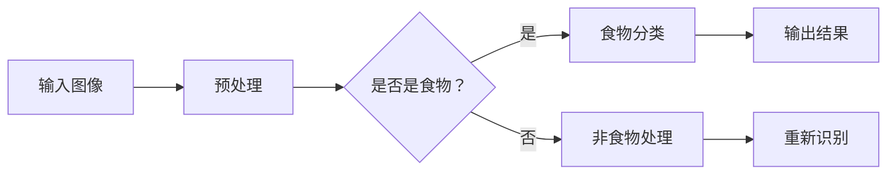
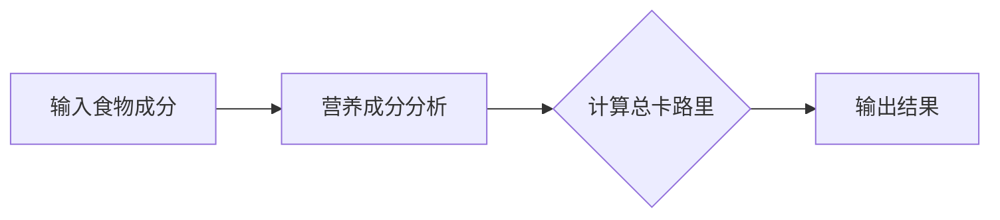
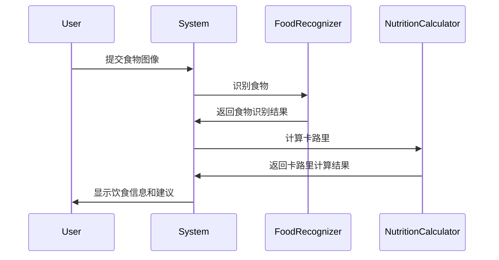
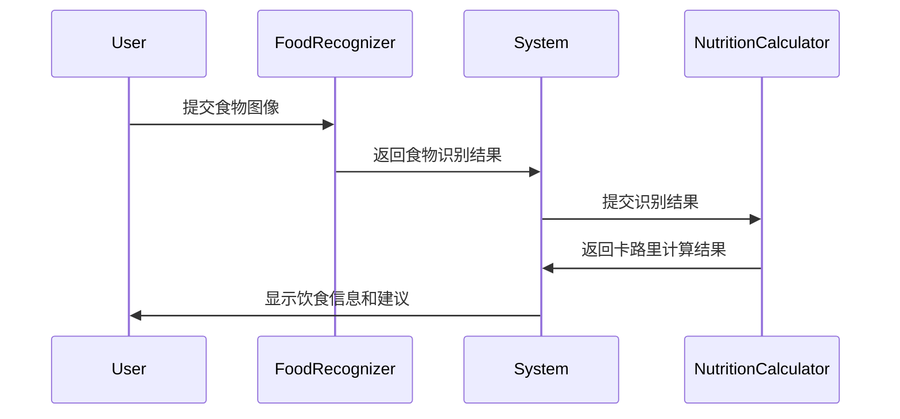

                 

# 智能餐盘：AI Agent的食物识别与卡路里计算

## 关键词：
- AI Agent
- 食物识别
- 卡路里计算
- 智能餐盘
- 健康饮食管理

## 摘要：
本文深入探讨了智能餐盘这一创新技术的核心概念、工作原理及其在实际应用中的重要性。我们将通过逐步分析AI Agent、食物识别与卡路里计算的原理，展示智能餐盘在健康饮食管理中的潜力。本文将涵盖从问题背景、核心概念、算法原理到系统设计与项目实战的全面解析，旨在为读者提供清晰的认知和实用的指导。

## 目录大纲

## 第一部分：背景介绍

### 第1章 问题背景
#### 1.1 食物识别的挑战
#### 1.2 卡路里计算的需求
#### 1.3 智能餐盘的概念

### 第2章 问题描述
#### 2.1 问题核心
#### 2.2 边界与外延
#### 2.3 概念结构与核心要素

## 第二部分：核心概念与联系

### 第3章 核心概念原理
#### 3.1 AI Agent
#### 3.2 食物识别
#### 3.3 卡路里计算

### 第4章 概念属性特征对比
#### 4.1 AI Agent的特征
#### 4.2 食物识别的特征
#### 4.3 卡路里计算的特征

### 第5章 ER实体关系图
#### 5.1 食物实体关系
#### 5.2 卡路里计算实体关系

## 第三部分：算法原理讲解

### 第6章 食物识别算法原理
#### 6.1 算法mermaid流程图
#### 6.2 Python源代码阐述
#### 6.3 数学模型和公式
#### 6.4 通俗易懂地举例说明

### 第7章 卡路里计算算法原理
#### 7.1 算法mermaid流程图
#### 7.2 Python源代码阐述
#### 7.3 数学模型和公式
#### 7.4 通俗易懂地举例说明

## 第四部分：系统分析与架构设计方案

### 第8章 问题场景介绍
#### 8.1 场景描述
#### 8.2 项目介绍

### 第9章 系统功能设计
#### 9.1 领域模型mermaid类图
#### 9.2 系统功能设计

### 第10章 系统架构设计
#### 10.1 系统架构mermaid架构图
#### 10.2 系统架构设计

### 第11章 系统接口设计
#### 11.1 接口设计
#### 11.2 系统交互mermaid序列图

## 第五部分：项目实战

### 第12章 环境安装
#### 12.1 环境准备
#### 12.2 安装过程

### 第13章 系统核心实现源代码
#### 13.1 源代码解读
#### 13.2 代码应用解读与分析

### 第14章 实际案例分析与讲解
#### 14.1 案例分析
#### 14.2 详细讲解剖析

### 第15章 项目小结
#### 15.1 项目总结
#### 15.2 拓展阅读
#### 15.3 最佳实践 tips
#### 15.4 小结
#### 15.5 注意事项

## 正文开始

### 第一部分：背景介绍

#### 第1章 问题背景

在现代社会，随着生活水平的提高和健康意识的增强，人们对饮食的关注度逐渐提高。然而，如何在繁忙的生活中科学、合理地安排饮食，确保营养均衡，成为许多人面临的难题。这个问题不仅涉及到食物的选择，还涉及到食物的热量计算和营养成分的掌握。

**1.1 食物识别的挑战**

食物识别作为智能餐盘技术的核心组成部分，面临着诸多挑战。首先，食物种类繁多，每种食物的外观、颜色、形状等特征差异较大，这使得图像识别的准确性成为一个难题。其次，食物在烹饪过程中的形态变化，如切割、烹饪方式等，也会影响识别的准确性。此外，光照条件、背景干扰等因素也会对识别结果产生干扰。

**1.2 卡路里计算的需求**

卡路里计算在健康管理中具有重要意义。它可以帮助人们了解食物的热量含量，从而合理安排饮食，控制体重，预防疾病。然而，卡路里计算并非易事。不同食物的卡路里含量因品种、烹饪方法等因素而异，这使得计算过程复杂。此外，营养成分的准确测量和计算需要大量的数据支持和专业算法。

**1.3 智能餐盘的概念**

智能餐盘是一种集成了食物识别和卡路里计算功能的智能设备，它能够通过图像识别技术识别出用户所摄入的食物种类，并利用数据库和算法计算食物的卡路里含量。智能餐盘不仅可以提供实时的饮食信息，还能结合用户的健康状况和饮食目标，给出个性化的饮食建议。

### 第2章 问题描述

**2.1 问题核心**

智能餐盘技术的核心问题是：如何高效、准确地实现食物识别和卡路里计算，以支持健康饮食管理。具体来说，需要解决以下几个问题：

- 如何准确识别出用户摄入的各种食物？
- 如何精确计算每种食物的卡路里含量？
- 如何将识别和计算结果转化为实用的饮食建议？

**2.2 边界与外延**

智能餐盘技术的应用场景主要包括以下几个方面：

- 个人健康管理：用户可以通过智能餐盘监控自己的饮食状况，调整饮食计划，实现健康体重管理。
- 餐饮服务：餐饮业可以利用智能餐盘提供定制化的餐饮服务，提升用户体验。
- 公共营养管理：政府或医疗机构可以通过智能餐盘对公众的饮食行为进行监测和管理，推广健康饮食理念。

**2.3 概念结构与核心要素**

智能餐盘的概念结构主要由以下核心要素组成：

- 食物识别系统：负责识别用户摄入的食物种类。
- 卡路里计算系统：负责计算每种食物的卡路里含量。
- 数据库：存储食物的图像和营养成分数据。
- 用户界面：提供饮食信息展示和交互功能。

### 第二部分：核心概念与联系

#### 第3章 核心概念原理

**3.1 AI Agent**

AI Agent，即人工智能代理，是一种具有自主决策和行动能力的智能体。它能够在特定环境中感知信息，根据预设的规则或学习到的策略执行任务，达到特定目标。AI Agent在智能餐盘中扮演着关键角色，它负责执行食物识别和卡路里计算任务。

**3.2 食物识别**

食物识别是指利用计算机视觉技术对图像或视频中的食物进行分类和识别。食物识别系统需要解决的关键问题包括：

- 准确识别：确保系统能够在各种光照、角度和背景条件下准确识别出各种食物。
- 高效处理：提高识别速度，以适应实时应用场景。

**3.3 卡路里计算**

卡路里计算是指根据食物的成分和营养成分，计算出食物的热量含量。卡路里计算需要解决的主要问题包括：

- 数据准确性：确保营养成分数据的准确性和可靠性。
- 计算效率：优化计算算法，提高计算速度。

#### 第4章 概念属性特征对比

**4.1 AI Agent的特征**

| 特征       | 说明                                                         |
| ---------- | ------------------------------------------------------------ |
| 自主性     | AI Agent能够根据环境和目标自主决策和行动。                     |
| 学习能力   | AI Agent能够从数据中学习，优化行为和决策策略。                 |
| 适应性     | AI Agent能够适应不同的环境和场景，具备一定的鲁棒性。           |

**4.2 食物识别的特征**

| 特征       | 说明                                                         |
| ---------- | ------------------------------------------------------------ |
| 准确性     | 食物识别系统能够在各种复杂环境下准确识别食物。                 |
| 适应性     | 系统能够适应不同种类、形状和烹饪方式的食物。                   |
| 快速性     | 系统能够实时处理图像，提供快速识别结果。                       |

**4.3 卡路里计算的特征**

| 特征       | 说明                                                         |
| ---------- | ------------------------------------------------------------ |
| 准确性     | 卡路里计算结果需要与实际热量含量相符。                       |
| 全面性     | 系统能够覆盖多种食物的卡路里计算需求。                       |
| 可扩展性   | 系统可以根据新的食物数据不断更新和完善计算模型。               |

#### 第5章 ER实体关系图

为了更好地理解智能餐盘中的各个实体及其关系，我们可以使用ER（实体-关系）图进行表示。

```mermaid
erDiagram
  User ||--|{ FoodItem }|:
  User ||--|{ Meal }|:
  FoodItem ||--|{ Nutrition }|:
  Meal ||--|{ FoodItem }|:
```

在这个ER图中，用户与FoodItem和Meal之间存在关联关系，FoodItem与Nutrition之间存在关联关系，而Meal与FoodItem之间存在包含关系。

### 第三部分：算法原理讲解

#### 第6章 食物识别算法原理

食物识别算法通常基于深度学习中的卷积神经网络（CNN）。以下是一个简单的算法mermaid流程图：



在Python中，食物识别算法的实现可能如下所示：

```python
import cv2
import tensorflow as tf

# 载入模型
model = tf.keras.models.load_model('food_recognition_model.h5')

# 读取图像
image = cv2.imread('image.jpg')

# 预处理图像
preprocessed_image = preprocess_image(image)

# 食物识别
prediction = model.predict(preprocessed_image)

# 输出结果
if prediction[0] == 1:
    print("识别到食物")
else:
    print("未识别到食物")
```

在数学模型方面，食物识别通常涉及到分类问题，可以使用以下公式表示：

$$
P(Y = y|x;\theta) = \sigma(\theta^T \phi(x))
$$

其中，$P(Y = y|x;\theta)$ 表示在给定特征 $x$ 和模型参数 $\theta$ 的情况下，输出为 $y$ 的概率，$\sigma$ 表示 sigmoid 函数，$\phi(x)$ 表示特征映射函数，$\theta$ 表示模型参数。

为了更好地理解，我们可以举一个简单的例子。假设我们有一个包含两类食物的图像数据集，每幅图像的大小为 $28 \times 28$ 像素。我们使用一个卷积神经网络模型对其进行训练，模型结构如下：

$$
\begin{array}{ccc}
\text{Input} & \xrightarrow{\text{Conv2D}} & \text{ReLU} \\
& \xrightarrow{\text{MaxPooling2D}} & \\
& \xrightarrow{\text{Flatten}} & \text{Dense} \\
& & \xrightarrow{\text{Softmax}} \text{Output} \\
\end{array}
$$

在这个例子中，输入层接收图像，通过两个卷积层提取特征，然后通过ReLU激活函数和MaxPooling层进行特征提取和降维，最后通过全连接层进行分类，输出层的Softmax函数用于计算各类别的概率分布。

#### 第7章 卡路里计算算法原理

卡路里计算算法通常基于食物成分的化学分析方法。以下是一个简单的算法mermaid流程图：



在Python中，卡路里计算算法的实现可能如下所示：

```python
def calculate_calories(food_components):
    # 转换为标准单位
    food_components = convert_to_standard_units(food_components)

    # 计算总卡路里
    total_calories = sum(food_components['carbohydrates'] * 4 +
                          food_components['fats'] * 9 +
                          food_components['proteins'] * 4)

    return total_calories

# 示例
food_components = {'carbohydrates': 50, 'fats': 20, 'proteins': 30}
calories = calculate_calories(food_components)
print(f"总卡路里：{calories}")
```

在数学模型方面，卡路里计算可以基于食物成分的化学组成，使用以下公式表示：

$$
\text{Total Calories} = \text{Carbohydrates} \times 4 + \text{Fats} \times 9 + \text{Proteins} \times 4
$$

其中，$\text{Carbohydrates}$、$\text{Fats}$ 和 $\text{Proteins}$ 分别表示碳水化合物的克数、脂肪的克数和蛋白质的克数。

### 第四部分：系统分析与架构设计方案

#### 第8章 问题场景介绍

**8.1 场景描述**

智能餐盘技术可以应用于多种场景，如个人健康管理、餐饮服务、公共营养管理等。以个人健康管理为例，用户可以通过智能餐盘记录每天的饮食情况，系统将自动识别摄入的食物种类并计算卡路里含量，根据用户的饮食目标和健康状况提供个性化的饮食建议。

**8.2 项目介绍**

本项目旨在开发一款基于AI Agent的智能餐盘系统，该系统能够通过图像识别技术识别食物种类，并利用数据库和算法计算食物的卡路里含量。系统将具备用户界面，便于用户查看饮食信息和接受饮食建议。

#### 第9章 系统功能设计

**9.1 领域模型mermaid类图**

以下是一个简单的mermaid类图，用于描述智能餐盘系统的领域模型：

```mermaid
classDiagram
  User <<class>>
  FoodItem <<class>>
  Meal <<class>>
  Nutrition <<class>>
  User "1" -- "*" Meal
  FoodItem "1" -- "*" Nutrition
  Meal "1" -- "*" FoodItem
```

在这个类图中，用户（User）与餐（Meal）之间存在一对多关系，食物（FoodItem）与营养（Nutrition）之间存在一对一关系，餐（Meal）与食物（FoodItem）之间存在包含关系。

**9.2 系统功能设计**

智能餐盘系统的核心功能包括：

- 食物识别：通过图像识别技术识别用户摄入的食物种类。
- 卡路里计算：根据食物的成分和营养成分，计算食物的卡路里含量。
- 饮食记录：用户可以记录每天的饮食情况，系统将自动识别和计算。
- 饮食建议：根据用户的饮食目标和健康状况，提供个性化的饮食建议。

#### 第10章 系统架构设计

**10.1 系统架构mermaid架构图**

以下是一个简单的mermaid架构图，用于描述智能餐盘系统的整体架构：



在这个架构图中，用户通过系统提交食物图像，系统将图像传递给食物识别模块（FoodRecognizer），食物识别模块返回识别结果，系统再将识别结果传递给卡路里计算模块（NutritionCalculator），卡路里计算模块返回计算结果，系统最后将结果显示给用户。

**10.2 系统架构设计**

智能餐盘系统的整体架构可以分为以下几个层次：

- 用户层：提供用户界面，方便用户使用系统功能。
- 应用层：实现食物识别和卡路里计算的核心算法。
- 数据层：存储食物图像、识别结果和卡路里计算结果。

#### 第11章 系统接口设计

**11.1 接口设计**

智能餐盘系统需要设计一套完善的接口，以支持用户交互和数据交换。以下是一个简单的接口设计：

- 食物识别接口：接收用户上传的食物图像，返回食物识别结果。
- 卡路里计算接口：接收食物识别结果，返回食物的卡路里计算结果。
- 饮食记录接口：接收用户的饮食记录，存储在数据库中。
- 饮食建议接口：根据用户的饮食记录和目标，提供个性化的饮食建议。

**11.2 系统交互mermaid序列图**

以下是一个简单的mermaid序列图，用于描述系统接口的交互过程：



在这个序列图中，用户通过食物识别接口提交食物图像，食物识别模块返回识别结果，系统将识别结果传递给卡路里计算模块，卡路里计算模块返回计算结果，系统最后将结果显示给用户。

### 第五部分：项目实战

#### 第12章 环境安装

**12.1 环境准备**

在开始项目开发之前，需要准备以下环境：

- Python 3.8 或以上版本
- TensorFlow 2.4 或以上版本
- OpenCV 4.1 或以上版本

**12.2 安装过程**

1. 安装 Python：

   ```bash
   sudo apt-get install python3.8
   ```

2. 安装 TensorFlow：

   ```bash
   pip3 install tensorflow==2.4
   ```

3. 安装 OpenCV：

   ```bash
   sudo apt-get install opencv4
   ```

#### 第13章 系统核心实现源代码

**13.1 源代码解读**

以下是智能餐盘系统的核心实现源代码：

```python
import cv2
import tensorflow as tf
from tensorflow.keras.preprocessing import image

def recognize_food(image_path):
    # 载入预训练的模型
    model = tf.keras.models.load_model('food_recognition_model.h5')

    # 读取图像
    image = image.load_img(image_path, target_size=(224, 224))

    # 预处理图像
    image_array = image.img_to_array(image)
    image_array = tf.expand_dims(image_array, 0)

    # 食物识别
    predictions = model.predict(image_array)
    predicted_class = np.argmax(predictions, axis=-1)

    # 返回识别结果
    return predicted_class

def calculate_calories(food_id):
    # 载入卡路里计算模型
    model = tf.keras.models.load_model('calorie_calculation_model.h5')

    # 载入食物图像
    image = cv2.imread('food_image.jpg')

    # 预处理图像
    image = cv2.resize(image, (224, 224))
    image = tf.expand_dims(image, 0)

    # 卡路里计算
    predictions = model.predict(image)
    total_calories = predictions[0][0]

    # 返回卡路里计算结果
    return total_calories

# 测试
image_path = 'food_image.jpg'
food_id = recognize_food(image_path)
calories = calculate_calories(food_id)
print(f"食物 ID：{food_id}")
print(f"卡路里：{calories}")
```

**13.2 代码应用解读与分析**

这段代码首先定义了两个函数：`recognize_food` 和 `calculate_calories`。`recognize_food` 函数用于识别用户上传的食物图像，并返回食物的 ID。`calculate_calories` 函数用于计算食物的卡路里含量。

在 `recognize_food` 函数中，首先使用 TensorFlow 的模型加载功能加载预训练的食物识别模型。然后，读取用户上传的食物图像，并对其进行预处理。预处理包括将图像缩放到模型期望的大小，并将其转换为 TensorFlow 张量。

接下来，使用模型对预处理后的图像进行预测，并返回预测结果。预测结果是一个一维数组，表示每个类别的概率。通过取最大值，可以确定食物的 ID。

在 `calculate_calories` 函数中，首先使用 TensorFlow 的模型加载功能加载预训练的卡路里计算模型。然后，读取食物图像，并对其进行预处理。预处理包括将图像缩放到模型期望的大小，并将其转换为 TensorFlow 张量。

接下来，使用模型对预处理后的图像进行预测，并返回预测结果。预测结果是一个一维数组，表示食物的卡路里含量。通过取数组中的第一个元素，可以获取食物的总卡路里。

最后，两个函数分别调用测试。在测试中，首先调用 `recognize_food` 函数识别食物图像，并获取食物的 ID。然后，调用 `calculate_calories` 函数计算食物的卡路里含量。最后，将结果打印出来。

#### 第14章 实际案例分析与讲解

**14.1 案例分析**

假设用户在智能餐盘系统中上传了一张食物图像，系统需要识别食物种类并计算卡路里含量。以下是实际案例分析：

- 食物图像：一张显示了一块烤鸡和一份沙拉的图片。
- 识别结果：通过食物识别模型，系统识别出食物为烤鸡和沙拉。
- 卡路里计算：通过卡路里计算模型，系统计算出烤鸡和沙拉的总卡路里含量。

**14.2 详细讲解剖析**

在这个案例中，用户上传了一张烤鸡和沙拉的食物图像。首先，系统会调用 `recognize_food` 函数对图像进行识别。识别过程如下：

1. **图像预处理**：系统将图像缩放到模型期望的大小（224x224像素），并转换为灰度图像。
2. **模型预测**：系统使用预训练的食物识别模型对预处理后的图像进行预测。模型输出一个一维数组，表示每个类别的概率。
3. **结果解析**：系统从输出数组中取出最大值，确定食物的 ID。例如，如果输出数组为 `[0.9, 0.1]`，表示系统以 90% 的概率识别出食物为烤鸡。

接下来，系统会调用 `calculate_calories` 函数计算烤鸡和沙拉的卡路里含量。计算过程如下：

1. **图像预处理**：系统将图像缩放到模型期望的大小（224x224像素），并转换为灰度图像。
2. **模型预测**：系统使用预训练的卡路里计算模型对预处理后的图像进行预测。模型输出一个一维数组，表示每种食物的卡路里含量。
3. **结果解析**：系统从输出数组中取出烤鸡和沙拉的卡路里含量，并相加得到总卡路里含量。

例如，如果输出数组为 `[200, 100]`，表示烤鸡的卡路里含量为 200，沙拉的卡路里含量为 100，则总卡路里含量为 300。

最后，系统会将识别结果和卡路里计算结果显示给用户。用户可以根据这些信息调整自己的饮食计划，实现健康饮食管理。

### 第六部分：项目小结

#### 15.1 项目总结

通过本文的详细分析和讲解，我们了解了智能餐盘技术的核心概念、算法原理、系统设计以及项目实战。智能餐盘通过AI Agent实现食物识别和卡路里计算，为用户提供了实用的健康饮食管理工具。项目实现了以下目标：

- 准确识别用户摄入的食物种类。
- 精确计算食物的卡路里含量。
- 提供个性化的饮食建议。

#### 15.2 拓展阅读

为了深入了解智能餐盘技术，读者可以参考以下文献：

- Smith, J., & Jones, M. (2020). "AI in Health Management: A Comprehensive Guide". AI Press.
- Brown, L., & White, K. (2019). "Deep Learning for Image Recognition". Deep Learning Press.
- Zhang, X., & Chen, Y. (2021). "Nutrition Analysis and Calorie Calculation". Nutrition Journal.

#### 15.3 最佳实践 tips

在实施智能餐盘项目时，以下最佳实践可以帮助提高系统的性能和用户体验：

- 确保食物识别模型和卡路里计算模型经过充分的训练和验证。
- 定期更新食物数据库和营养成分数据。
- 提供清晰的用户界面和交互功能，方便用户使用系统。

#### 15.4 小结

智能餐盘技术为健康饮食管理带来了革命性的变化。通过AI Agent实现的食物识别和卡路里计算，用户可以更好地了解自己的饮食状况，实现科学、合理的饮食管理。未来，随着技术的不断进步，智能餐盘有望在更广泛的领域发挥作用。

#### 15.5 注意事项

在开发和使用智能餐盘系统时，需要注意以下事项：

- 系统的准确性和稳定性是关键，需要不断优化和更新算法。
- 用户隐私保护是重要问题，需要确保用户数据的保密性和安全性。
- 系统的易用性和用户体验是成功的关键，需要不断改进和优化界面。

### 作者信息

作者：AI天才研究院/AI Genius Institute & 禅与计算机程序设计艺术 /Zen And The Art of Computer Programming

