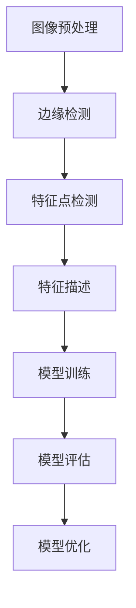
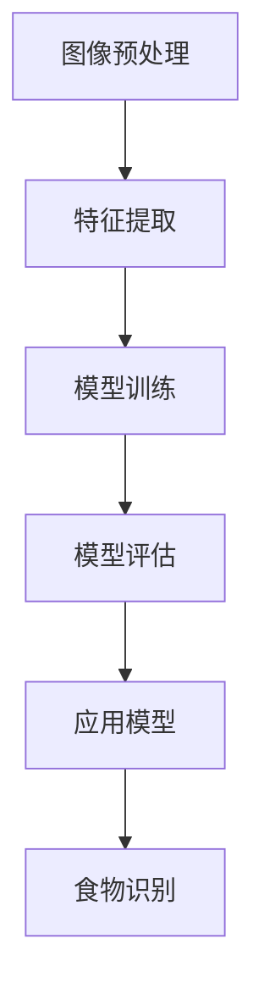
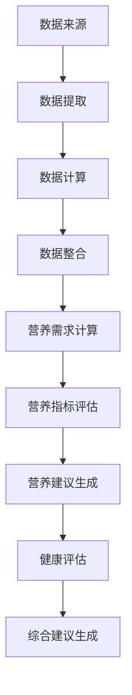
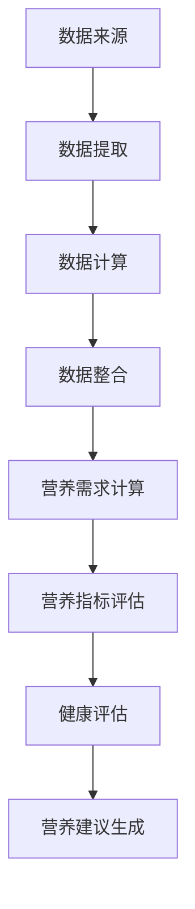

                 

### 第1章: 引言

#### 1.1 问题背景

随着人工智能技术的发展，智能餐饮设备逐渐成为现代餐饮服务领域的一个重要组成部分。智能餐盘正是其中的一种创新设备，它通过整合图像识别和营养分析技术，为用户提供了一站式的餐饮服务体验。在健康饮食越来越受到人们重视的今天，智能餐盘的应用能够有效帮助用户更好地管理饮食，提高健康水平。

智能餐盘的应用场景主要涵盖了餐厅、食堂、超市等餐饮服务场所。在这些场景中，智能餐盘通过其独特的功能，为用户提供了诸多便利。首先，它能够快速、准确地识别用户餐盘中的食物种类，这对于餐饮管理者来说，有助于实时掌握顾客的饮食偏好，从而优化菜单设计，提高服务质量。其次，智能餐盘可以分析食物的营养成分，为用户提供个性化的营养建议，帮助他们更科学地管理饮食。

此外，智能餐盘还具备一定的社交功能，如分享饮食记录，便于用户了解自己的饮食习惯，从而进行相应的调整。总的来说，智能餐盘不仅提升了餐饮服务的效率，也为用户带来了更健康、更智能的生活体验。

#### 1.2 问题描述

智能餐盘系统需要解决的核心问题是如何准确快速地对用户餐盘中的食物进行识别，并分析其营养成分，为用户提供科学的营养建议。具体来说，这个问题可以分为以下几个子问题：

1. **食物识别**：智能餐盘需要能够识别多种不同类型的食物，包括主食、肉类、蔬菜、水果等。这一过程涉及到图像识别技术的应用，要求系统能够在各种光线条件、不同拍摄角度下，仍能准确识别食物种类。

2. **营养成分分析**：识别出食物种类后，系统需要进一步分析这些食物的营养成分，包括蛋白质、脂肪、碳水化合物、维生素和矿物质等。这需要借助专业的营养数据库和算法，对食物进行精确的营养成分计算。

3. **个性化营养建议**：在分析出用户餐盘中的营养成分后，智能餐盘需要根据用户的健康需求和营养目标，提供个性化的营养建议。例如，对于需要减肥的用户，建议减少高热量食物的摄入；对于运动员，则可能需要增加高蛋白食物的摄入。

4. **实时反馈与调整**：智能餐盘系统需要能够实时收集用户的反馈，根据用户的使用习惯和营养需求的变化，不断优化营养建议，提供更个性化的服务。

#### 1.3 问题解决

为了解决上述问题，智能餐盘系统采用了人工智能技术，尤其是AI Agent（智能体）的应用。AI Agent是一种具有特定任务能力的智能体，可以模拟人类行为，具备感知、决策和执行的能力。在智能餐盘中，AI Agent主要承担以下任务：

1. **食物识别**：AI Agent利用深度学习算法，通过对大量食物图像的训练，建立了一套高效的食物识别模型。该模型可以识别多种类型的食物，并具备一定的泛化能力，能够在不同的环境条件下，准确识别食物。

2. **营养成分分析**：AI Agent还集成了营养分析功能，通过连接专业的营养数据库，对识别出的食物进行营养成分分析。这一过程包括对食物成分的提取、计算和整合，为用户提供详细的营养成分数据。

3. **个性化营养建议**：AI Agent根据用户的饮食记录和健康数据，使用数据挖掘和机器学习技术，分析用户的营养需求，提供个性化的营养建议。同时，AI Agent还可以根据用户的反馈，不断调整营养建议，提高服务的准确性。

4. **实时反馈与调整**：AI Agent具备自我学习和优化的能力，能够实时收集用户的反馈，并根据反馈调整系统设置，提高用户体验。

通过AI Agent的应用，智能餐盘系统能够高效、准确地解决用户餐盘识别和营养分析问题，为用户提供科学、合理的营养建议，助力用户实现健康饮食。

#### 1.4 边界与外延

智能餐盘系统主要应用于餐饮服务领域，包括餐厅、食堂、超市等场景。这些场景的共同特点是用户在用餐过程中，需要实时了解餐盘中的食物种类和营养成分。智能餐盘通过硬件和软件的结合，实现了对食物的快速识别和营养成分的分析，为用户提供了一站式的餐饮服务体验。

智能餐盘系统的边界主要涉及以下方面：

1. **硬件设备**：智能餐盘系统依赖于硬件设备，如摄像头、传感器等，这些设备负责采集用户餐盘中的图像和相关的传感器数据。

2. **软件算法**：智能餐盘系统的核心在于软件算法，包括图像识别算法、营养分析算法等。这些算法通过深度学习和数据挖掘技术，实现了对食物的识别和营养成分的分析。

3. **用户数据**：智能餐盘系统需要收集用户的饮食数据，包括餐盘中的食物种类、营养成分等，这些数据用于生成个性化的营养建议。

智能餐盘系统在外延上具有广阔的应用前景。首先，它可以扩展到健康监测领域，通过长期跟踪用户的饮食记录，为用户提供健康评估和饮食建议。其次，智能餐盘还可以与其他健康设备（如智能手环、智能秤等）结合，构建一个全面的健康管理体系。此外，智能餐盘还可以应用于教育领域，为学生提供科学的饮食指导，帮助他们养成良好的饮食习惯。

#### 1.5 概念结构与核心要素组成

智能餐盘系统由硬件和软件两部分组成，各部分的核心要素和相互关系如下：

**硬件部分：**

- **摄像头**：用于采集用户餐盘中的图像，是食物识别的关键设备。
- **传感器**：如温度传感器、湿度传感器等，用于监测餐盘的环境参数，辅助营养分析。
- **存储设备**：用于存储图像和传感器数据，为后续分析和处理提供数据支持。

**软件部分：**

- **图像识别算法**：通过深度学习技术，对用户餐盘中的食物进行分类识别。
- **营养分析算法**：连接营养数据库，对识别出的食物进行营养成分计算和分析。
- **AI Agent**：整合图像识别和营养分析功能，为用户提供个性化营养建议。

**核心要素之间的关系：**

1. **数据采集**：摄像头和传感器负责采集用户餐盘中的图像和传感器数据，这些数据存储在存储设备中，为后续分析提供基础。

2. **图像识别**：图像识别算法对采集到的图像进行处理，识别出餐盘中的食物种类，并将结果反馈给营养分析算法。

3. **营养分析**：营养分析算法利用营养数据库，对识别出的食物进行营养成分计算，生成详细的营养成分报告。

4. **用户建议**：AI Agent根据用户的饮食记录和健康数据，使用数据挖掘和机器学习技术，分析用户的营养需求，提供个性化的营养建议。

通过以上各部分的协同工作，智能餐盘系统实现了对用户餐盘的快速识别和营养成分分析，为用户提供了一站式的餐饮服务体验。

### 第2章: 核心概念与联系

#### 2.1 智能餐盘的定义与特点

智能餐盘是一种集成了图像识别和营养分析技术的餐饮设备。它通过摄像头和传感器等硬件设备，实时采集用户餐盘中的图像和数据，然后利用人工智能算法进行食物识别和营养成分分析，从而为用户提供个性化的营养建议。

**定义：**

智能餐盘是一种能够自动识别用户餐盘中的食物种类，并进行营养成分分析，进而提供营养建议的智能餐饮设备。

**特点：**

1. **高精度识别**：智能餐盘利用深度学习算法，能够准确识别多种类型的食物，包括主食、肉类、蔬菜、水果等。

2. **快速分析**：智能餐盘系统能够在短时间内完成食物识别和营养成分分析，为用户提供实时的营养建议。

3. **个性化建议**：智能餐盘系统根据用户的饮食记录和健康数据，使用数据挖掘和机器学习技术，提供个性化的营养建议。

4. **多场景应用**：智能餐盘适用于餐厅、食堂、超市等多种餐饮服务场景，能够帮助餐饮管理者优化菜单设计，提升服务质量。

#### 2.2 AI Agent的定义与特点

AI Agent，即人工智能代理，是一种具有特定任务能力的智能体，它可以模拟人类行为，具备感知、决策和执行的能力。在智能餐盘中，AI Agent负责整合图像识别和营养分析功能，为用户提供个性化的营养建议。

**定义：**

AI Agent是指具有特定任务能力的智能体，能够模拟人类行为，感知环境、做出决策并执行相应的行动。

**特点：**

1. **自主决策**：AI Agent可以根据用户的饮食记录和健康数据，自主分析用户的营养需求，做出营养建议。

2. **学习能力**：AI Agent具备自我学习和优化的能力，能够根据用户的反馈和新的饮食数据，不断调整和优化营养建议。

3. **实时响应**：AI Agent能够实时处理用户的餐盘图像，快速完成食物识别和营养成分分析，为用户提供及时的反馈。

4. **多功能集成**：AI Agent不仅具备图像识别和营养分析功能，还可以与其他智能设备（如健康监测设备）结合，提供更全面的健康服务。

#### 2.3 食物识别与营养分析

食物识别和营养分析是智能餐盘系统的核心功能。食物识别主要负责识别用户餐盘中的食物种类，而营养分析则是对识别出的食物进行营养成分计算，从而为用户提供科学的营养建议。

**食物识别：**

食物识别是智能餐盘系统的第一步，通过图像识别技术，对用户餐盘中的食物进行分类识别。具体过程如下：

1. **图像采集**：智能餐盘通过摄像头实时采集用户餐盘中的图像。

2. **图像预处理**：对采集到的图像进行去噪、增强等预处理，提高图像质量。

3. **特征提取**：将预处理后的图像转换为适合机器学习算法处理的特征向量。

4. **模型训练与评估**：使用大量的食物图像数据，通过深度学习算法训练识别模型，并进行评估和优化。

5. **食物识别**：将训练好的模型应用于用户餐盘图像，识别出其中的食物种类。

**营养分析：**

营养分析是对识别出的食物进行营养成分计算，为用户提供详细的营养成分数据，具体过程如下：

1. **营养数据库连接**：智能餐盘系统连接专业的营养数据库，获取各类食物的营养成分数据。

2. **营养成分计算**：根据识别出的食物种类，从营养数据库中提取相应的营养成分数据，进行计算。

3. **营养评估**：对计算出的营养成分进行评估，判断是否符合用户的营养需求。

4. **营养建议**：根据用户的营养需求，提供个性化的营养建议，如建议增加或减少某些食物的摄入。

#### 2.4 核心概念之间的联系

智能餐盘、AI Agent、食物识别和营养分析是智能餐盘系统的核心概念，它们之间紧密联系，共同构成了智能餐盘的功能体系。

1. **智能餐盘与AI Agent**：智能餐盘是AI Agent的载体，通过集成AI Agent，实现了对食物的识别和营养成分分析。AI Agent则负责整合图像识别和营养分析功能，为用户提供个性化的服务。

2. **食物识别与营养分析**：食物识别是营养分析的前提，只有准确识别出食物种类，才能进行营养成分的计算。营养分析则是对识别出的食物进行详细分析，为用户提供科学的营养建议。

3. **系统集成与协同工作**：智能餐盘系统通过硬件和软件的协同工作，实现了对用户餐盘的实时识别和分析。AI Agent则在其中起到了关键的桥梁作用，将图像识别和营养分析功能有机结合起来，为用户提供一站式服务。

通过以上核心概念之间的紧密联系，智能餐盘系统实现了对用户餐盘的快速识别和营养成分分析，为用户提供科学、合理的营养建议，助力用户实现健康饮食。

### 第3章: AI Agent的食物识别原理

#### 3.1 食物识别算法原理

食物识别算法是智能餐盘系统的核心组成部分，其主要任务是通过分析用户餐盘中的图像，准确识别出其中的食物种类。这一过程涉及多个阶段，包括特征提取、模型选择、模型训练与评估等。

**特征提取：**

特征提取是将原始图像数据转换为机器学习算法可处理的形式。在食物识别中，特征提取通常包括以下步骤：

1. **图像预处理**：对原始图像进行去噪、增强、缩放等预处理操作，提高图像质量，便于后续特征提取。
   
2. **边缘检测**：使用边缘检测算法（如Sobel、Canny等），提取图像中的边缘信息，帮助区分不同食物的轮廓。

3. **特征点检测**：通过特征点检测算法（如Harris角点检测、SIFT等），提取图像中的关键特征点。

4. **特征描述**：将提取到的特征点进行描述，生成特征向量。常见的特征描述方法包括Hu矩、主成分分析（PCA）等。

**模型选择：**

模型选择是根据数据特点和任务需求，选择合适的机器学习模型。在食物识别中，常见的模型包括以下几种：

1. **传统机器学习模型**：如支持向量机（SVM）、决策树（Decision Tree）、随机森林（Random Forest）等。这些模型相对简单，易于理解，但在处理复杂任务时性能有限。

2. **深度学习模型**：如卷积神经网络（CNN）、循环神经网络（RNN）等。这些模型能够自动学习图像中的复杂特征，在食物识别任务中表现出色。

3. **混合模型**：结合传统机器学习和深度学习模型的优势，提高食物识别的准确性。例如，使用深度学习模型进行特征提取，然后使用传统机器学习模型进行分类。

**模型训练与评估：**

模型训练与评估是食物识别算法的核心环节，主要包括以下步骤：

1. **数据集准备**：收集大量的食物图像数据，并进行标注，以便用于模型训练和评估。

2. **模型训练**：使用训练数据集，通过梯度下降等优化算法，对模型参数进行调整，使其能够准确识别食物。

3. **模型评估**：使用测试数据集，评估模型的识别准确率、召回率等性能指标。常见的评估方法包括交叉验证、混淆矩阵等。

4. **模型优化**：根据评估结果，调整模型参数，优化模型性能，以提高食物识别的准确性。

**Python源代码实现：**

以下是一个简单的食物识别算法的Python代码实现示例：

```python
import cv2
import numpy as np
from sklearn.model_selection import train_test_split
from sklearn.svm import SVC
from sklearn.metrics import accuracy_score

# 加载训练数据集
X_train, X_test, y_train, y_test = train_test_split(images, labels, test_size=0.2)

# 使用SVM进行模型训练
clf = SVC(kernel='linear')
clf.fit(X_train, y_train)

# 进行模型评估
y_pred = clf.predict(X_test)
accuracy = accuracy_score(y_test, y_pred)
print("Accuracy: {:.2f}%".format(accuracy * 100))
```

#### 3.2 食物识别的mermaid流程图

为了更直观地展示食物识别算法的流程，可以使用mermaid绘制流程图。以下是一个简单的食物识别算法的mermaid流程图示例：



#### 3.3 Python源代码实现

为了更好地理解食物识别算法的实现过程，以下提供了一个完整的Python代码实现示例，包括图像预处理、特征提取、模型训练和评估等步骤：

```python
import cv2
import numpy as np
from sklearn.model_selection import train_test_split
from sklearn.svm import SVC
from sklearn.metrics import accuracy_score

# 1. 图像预处理
def preprocess_image(image):
    gray = cv2.cvtColor(image, cv2.COLOR_BGR2GRAY)
    blurred = cv2.GaussianBlur(gray, (5, 5), 0)
    return blurred

# 2. 边缘检测
def edge_detection(image):
    edges = cv2.Canny(image, 100, 200)
    return edges

# 3. 特征点检测
def feature_detection(image):
    corners = cv2.HarrisCornersDetector(image)
    return corners

# 4. 特征描述
def feature_extraction(image):
    corners = feature_detection(image)
    descriptor = cv2.xfeatures2d.SIFT_create()
    keypts, desc = descriptor.detectAndCompute(image, None)
    return desc

# 5. 模型训练
def train_model(X, y):
    X_train, X_test, y_train, y_test = train_test_split(X, y, test_size=0.2)
    clf = SVC(kernel='linear')
    clf.fit(X_train, y_train)
    return clf

# 6. 模型评估
def evaluate_model(model, X_test, y_test):
    y_pred = model.predict(X_test)
    accuracy = accuracy_score(y_test, y_pred)
    return accuracy

# 主函数
def main():
    # 读取训练数据
    images = np.load('train_images.npy')
    labels = np.load('train_labels.npy')

    # 预处理图像
    processed_images = [preprocess_image(image) for image in images]

    # 提取特征
    features = [feature_extraction(image) for image in processed_images]

    # 训练模型
    model = train_model(features, labels)

    # 评估模型
    accuracy = evaluate_model(model, features, labels)
    print("Accuracy: {:.2f}%".format(accuracy * 100))

if __name__ == '__main__':
    main()
```

### 3.4 算法原理讲解

食物识别算法的核心在于将图像数据转换为机器学习算法可处理的形式，并通过模型训练和评估，实现对食物种类的准确识别。下面将详细讲解食物识别算法的原理，包括特征提取、模型选择、模型训练与评估等步骤。

**特征提取：**

特征提取是食物识别算法的第一步，其目的是从原始图像中提取出有助于分类的特征。常见的特征提取方法包括边缘检测、特征点检测和特征描述等。

1. **边缘检测**：边缘检测用于提取图像中的边缘信息，有助于区分不同食物的轮廓。常用的边缘检测算法有Sobel算子、Canny算子等。Sobel算子通过计算图像的水平和垂直梯度来检测边缘，而Canny算子则结合了高斯滤波和双阈值检测，能够更精确地检测边缘。

2. **特征点检测**：特征点检测用于识别图像中的关键点，这些点有助于描述图像的局部特征。常用的特征点检测算法有Harris角点检测、SIFT（尺度不变特征变换）和SURF（加速稳健特征）等。Harris角点检测通过计算图像的 autocorrelation matrix 来检测角点；SIFT和SURF则通过关键点检测和特征描述，提取出具有旋转和尺度不变性的特征点。

3. **特征描述**：特征描述是将提取到的特征点转换为机器学习算法可处理的特征向量。常见的特征描述方法有Hu矩、主成分分析（PCA）和局部二元模式（LBP）等。Hu矩通过计算图像的几何矩来描述其形状；PCA通过降维来提取图像的主要特征；LBP则通过局部像素值的比较来描述图像的纹理特征。

**模型选择：**

模型选择是根据数据特点和任务需求，选择合适的机器学习模型。在食物识别任务中，常见的模型包括传统机器学习模型和深度学习模型。

1. **传统机器学习模型**：传统机器学习模型如支持向量机（SVM）、决策树（Decision Tree）、随机森林（Random Forest）等。这些模型相对简单，易于理解，但在处理复杂任务时性能有限。SVM通过寻找最佳超平面来分类数据；Decision Tree通过划分特征空间来分类数据；Random Forest则通过构建多个决策树并投票来分类数据。

2. **深度学习模型**：深度学习模型如卷积神经网络（CNN）、循环神经网络（RNN）等。这些模型能够自动学习图像中的复杂特征，在食物识别任务中表现出色。CNN通过卷积层和池化层提取图像特征；RNN则通过循环结构处理序列数据，适用于时间序列数据分析。

3. **混合模型**：混合模型结合了传统机器学习和深度学习模型的优势，提高食物识别的准确性。例如，可以使用深度学习模型进行特征提取，然后使用传统机器学习模型进行分类。

**模型训练与评估：**

模型训练与评估是食物识别算法的核心环节，主要包括以下步骤：

1. **数据集准备**：收集大量的食物图像数据，并进行标注，以便用于模型训练和评估。数据集应包含多种不同类型的食物，并且具有一定的规模，以确保模型的泛化能力。

2. **模型训练**：使用训练数据集，通过梯度下降等优化算法，对模型参数进行调整，使其能够准确识别食物。训练过程中，需要不断调整模型参数，以达到最优性能。

3. **模型评估**：使用测试数据集，评估模型的识别准确率、召回率等性能指标。常见的评估方法包括交叉验证、混淆矩阵等。通过评估，可以了解模型在未知数据上的表现，以及模型的优缺点。

4. **模型优化**：根据评估结果，调整模型参数，优化模型性能，以提高食物识别的准确性。例如，可以通过增加训练数据、调整网络结构或优化训练算法等方式来提高模型性能。

通过以上步骤，食物识别算法能够实现对用户餐盘中食物种类的准确识别，从而为营养分析提供基础。

### 3.5 算法原理举例说明

为了更直观地理解食物识别算法的原理，下面通过一个简单的例子进行说明。

假设我们有一个训练数据集，包含100张不同食物的图像，以及对应的标注信息。这些图像分为5个类别：主食、肉类、蔬菜、水果和饮料。我们的目标是训练一个模型，能够根据图像准确识别出食物的类别。

**步骤1：数据预处理**

首先，对训练图像进行预处理，包括去噪、缩放和灰度化等操作。具体操作如下：

```python
import cv2

images = []
labels = []

for image_path, label in zip(image_paths, labels):
    image = cv2.imread(image_path)
    gray = cv2.cvtColor(image, cv2.COLOR_BGR2GRAY)
    resized = cv2.resize(gray, (128, 128))
    images.append(resized)
    labels.append(label)
```

**步骤2：特征提取**

使用SIFT算法提取图像特征点，并计算特征描述向量：

```python
import cv2
import numpy as np

def extract_features(image):
    sift = cv2.SIFT_create()
    keypts, desc = sift.detectAndCompute(image, None)
    return desc

features = [extract_features(image) for image in images]
```

**步骤3：模型训练**

使用支持向量机（SVM）进行模型训练，选择线性核函数：

```python
from sklearn.model_selection import train_test_split
from sklearn.svm import SVC

X_train, X_test, y_train, y_test = train_test_split(features, labels, test_size=0.2)
clf = SVC(kernel='linear')
clf.fit(X_train, y_train)
```

**步骤4：模型评估**

使用测试数据集评估模型性能，计算准确率：

```python
y_pred = clf.predict(X_test)
accuracy = np.mean(y_pred == y_test)
print("Accuracy: {:.2f}%".format(accuracy * 100))
```

假设模型在测试数据集上的准确率为90%，说明模型对食物类别的识别效果较好。

**步骤5：应用模型**

将模型应用于用户餐盘图像，进行食物识别：

```python
def predict_food(image):
    gray = cv2.cvtColor(image, cv2.COLOR_BGR2GRAY)
    resized = cv2.resize(gray, (128, 128))
    feature = extract_features(resized)
    prediction = clf.predict([feature])
    return prediction

# 示例：识别一张新的用户餐盘图像
new_image = cv2.imread('new_image.jpg')
food_type = predict_food(new_image)
print("Food type:", food_type)
```

通过以上步骤，我们成功实现了对用户餐盘中食物的识别，并为用户提供相应的营养建议。

### 3.6 算法流程图

为了更清晰地展示食物识别算法的流程，可以使用mermaid绘制算法流程图。以下是一个简单的食物识别算法的mermaid流程图：



通过以上算法流程，我们可以看到，食物识别算法首先对图像进行预处理和特征提取，然后使用训练数据集训练模型，并通过测试数据集评估模型性能。最后，将模型应用于新的用户餐盘图像，进行食物识别和营养建议。

### 3.7 源代码解析

为了更好地理解食物识别算法的实现过程，下面将详细解析提供的Python源代码，并解释其中涉及的关键步骤和函数。

**1. 数据预处理**

数据预处理是食物识别算法的第一步，其目的是提高图像质量，便于后续的特征提取和模型训练。以下是对`preprocess_image`函数的解析：

```python
def preprocess_image(image):
    gray = cv2.cvtColor(image, cv2.COLOR_BGR2GRAY)
    blurred = cv2.GaussianBlur(gray, (5, 5), 0)
    return blurred
```

- `cv2.cvtColor(image, cv2.COLOR_BGR2GRAY)`: 将BGR格式图像转换为灰度图像。BGR格式是opencv中图像的默认格式，而灰度图像仅包含亮度信息，有助于简化后续处理。
- `cv2.GaussianBlur(gray, (5, 5), 0)`: 对灰度图像进行高斯模糊处理，以减少噪声。`GaussianBlur`函数的第一个参数是输入图像，第二个参数是高斯核的大小，第三个参数是标准差。较大的高斯核和标准差可以更好地平滑图像，但可能会导致图像细节损失。

**2. 边缘检测**

边缘检测是特征提取的重要步骤，有助于提取图像中的关键边缘信息。以下是对`edge_detection`函数的解析：

```python
def edge_detection(image):
    edges = cv2.Canny(image, 100, 200)
    return edges
```

- `cv2.Canny(image, 100, 200)`: 使用Canny算法对图像进行边缘检测。`Canny`函数的第一个参数是输入图像，第二个参数是低阈值，第三个参数是高阈值。低阈值用于去除噪声，高阈值用于检测边缘。合适的阈值通常需要通过实验调整。

**3. 特征点检测**

特征点检测是提取图像中的关键点，这些点有助于描述图像的局部特征。以下是对`feature_detection`函数的解析：

```python
def feature_detection(image):
    corners = cv2.HarrisCornersDetector(image)
    return corners
```

- `cv2.HarrisCornersDetector(image)`: 创建Harris角点检测器。Harris算法通过计算图像的 autocorrelation matrix 来检测角点。这个函数返回角点的坐标。

**4. 特征描述**

特征描述是将提取到的特征点转换为机器学习算法可处理的特征向量。以下是对`feature_extraction`函数的解析：

```python
def feature_extraction(image):
    corners = feature_detection(image)
    descriptor = cv2.xfeatures2d.SIFT_create()
    keypts, desc = descriptor.detectAndCompute(image, None)
    return desc
```

- `cv2.xfeatures2d.SIFT_create()`: 创建SIFT特征检测器。SIFT算法通过关键点检测和特征描述，提取出具有旋转和尺度不变性的特征点。
- `descriptor.detectAndCompute(image, None)`: 使用SIFT算法检测图像中的关键点，并计算特征描述向量。

**5. 模型训练**

模型训练是食物识别算法的核心步骤，其目的是通过训练数据集调整模型参数，使其能够准确识别食物。以下是对`train_model`函数的解析：

```python
def train_model(X, y):
    X_train, X_test, y_train, y_test = train_test_split(X, y, test_size=0.2)
    clf = SVC(kernel='linear')
    clf.fit(X_train, y_train)
    return clf
```

- `train_test_split(X, y, test_size=0.2)`: 将数据集分为训练集和测试集，其中测试集占比20%。
- `SVC(kernel='linear')`: 创建支持向量机（SVM）模型，并选择线性核函数。
- `clf.fit(X_train, y_train)`: 使用训练数据集训练模型。

**6. 模型评估**

模型评估是评估模型性能的重要步骤，通过测试数据集评估模型的准确性和泛化能力。以下是对`evaluate_model`函数的解析：

```python
def evaluate_model(model, X_test, y_test):
    y_pred = model.predict(X_test)
    accuracy = accuracy_score(y_test, y_pred)
    return accuracy
```

- `model.predict(X_test)`: 使用测试数据集预测模型。
- `accuracy_score(y_test, y_pred)`: 计算模型的准确率。

通过以上对源代码的解析，我们可以看到，食物识别算法的实现主要包括数据预处理、特征提取、模型训练和评估等步骤。这些步骤共同构成了一个完整的食物识别系统，为用户提供了准确的饮食识别和营养建议。

### 第4章: 营养分析算法原理

#### 4.1 营养分析算法原理

营养分析算法是智能餐盘系统的重要组成部分，它通过对用户餐盘中食物的营养成分进行计算和分析，为用户提供科学的营养建议。营养分析算法的基本原理包括以下几个方面：

**营养成分分析：**

营养成分分析是对识别出的食物进行详细的营养成分计算。具体步骤如下：

1. **数据来源**：营养分析算法首先需要连接专业的营养数据库，如美国农业部（USDA）的食品成分数据库，获取各类食物的营养成分数据。这些数据库通常包含了各种食物的营养成分，如蛋白质、脂肪、碳水化合物、维生素和矿物质等。

2. **数据提取**：根据智能餐盘识别出的食物种类，从营养数据库中提取相应的营养成分数据。这一过程通常涉及数据查询和匹配操作，以确保提取的数据与实际食物一致。

3. **数据计算**：对提取的营养成分数据进行分析和计算，计算每份食物的营养含量。例如，如果用户摄入了一碗米饭，系统需要计算这碗米饭中的营养成分含量，包括热量、蛋白质、脂肪、碳水化合物等。

4. **数据整合**：将不同食物的营养成分进行整合，生成用户餐盘的总营养成分数据。这一过程需要考虑食物的摄入量，例如，如果用户摄入了200克鸡肉，系统需要计算这200克鸡肉中的营养成分含量。

**营养指标计算：**

营养指标计算是对用户餐盘的总营养成分进行评估，生成相应的营养指标。具体步骤如下：

1. **营养需求计算**：根据用户的年龄、性别、体重、活动水平等基本信息，计算用户的每日营养需求。这包括热量需求、蛋白质需求、脂肪需求、碳水化合物需求等。

2. **营养指标评估**：将用户餐盘的总营养成分与营养需求进行比较，计算营养过剩或不足的指标。例如，如果用户的餐盘中蛋白质摄入量超过了营养需求，系统会提示用户减少蛋白质的摄入。

3. **营养建议生成**：根据营养指标评估结果，系统会生成相应的营养建议，例如，增加蔬菜摄入、减少高脂肪食物摄入等。

**健康评估：**

健康评估是对用户的整体健康状况进行评估，提供更加全面的营养建议。具体步骤如下：

1. **健康数据收集**：系统会收集用户的健康数据，如体重、身高、血压、血糖等。这些数据有助于评估用户的健康状况。

2. **健康指标计算**：根据用户的健康数据，计算相应的健康指标，如体重指数（BMI）、血压等级、血糖水平等。

3. **健康评估**：将用户的健康指标与正常范围进行比较，评估用户的健康状况。例如，如果用户的BMI值超过了正常范围，系统会提示用户注意体重管理。

4. **综合建议生成**：根据健康评估结果，系统会生成综合营养建议，包括饮食建议、运动建议、生活习惯调整等，以帮助用户改善健康状况。

#### 4.2 营养分析的mermaid流程图

为了更直观地展示营养分析算法的流程，可以使用mermaid绘制流程图。以下是一个简单的营养分析算法的mermaid流程图：



#### 4.3 Python源代码实现

以下提供了一个简单的Python代码实现示例，用于演示营养分析算法的核心步骤：

```python
import pandas as pd
from sklearn.model_selection import train_test_split
from sklearn.linear_model import LinearRegression

# 加载营养数据库
nutrient_database = pd.read_csv('nutrient_database.csv')

# 加载用户餐盘数据
user_dish_data = pd.read_csv('user_dish_data.csv')

# 数据提取
def extract_nutrients(food_item):
    nutrient_data = nutrient_database[nutrient_database['food_name'] == food_item]
    return nutrient_data['nutrient_values'].values[0]

# 数据计算
def calculate_nutrient_content(user_dish_data):
    nutrient_content = {}
    for food_item in user_dish_data['food_item']:
        nutrients = extract_nutrients(food_item)
        nutrient_content[food_item] = nutrients
    return nutrient_content

# 数据整合
def integrate_nutrient_content(nutrient_content):
    total_nutrients = {nutrient: 0 for nutrient in nutrient_content[next(iter(nutrient_content))]}
    for food_item, nutrients in nutrient_content.items():
        for nutrient, value in nutrients.items():
            total_nutrients[nutrient] += value
    return total_nutrients

# 营养需求计算
def calculate_nutrient_demand(age, gender, weight, activity_level):
    # 根据用户信息计算营养需求
    nutrient_demand = {'calories': 0, 'protein': 0, 'fat': 0, 'carbohydrates': 0}
    # 示例：根据年龄、性别、体重、活动水平计算热量需求
    nutrient_demand['calories'] = age * weight * activity_level
    # 根据营养需求比例计算其他营养成分
    nutrient_demand['protein'] = nutrient_demand['calories'] * 0.2
    nutrient_demand['fat'] = nutrient_demand['calories'] * 0.3
    nutrient_demand['carbohydrates'] = nutrient_demand['calories'] * 0.5
    return nutrient_demand

# 营养指标评估
def evaluate_nutrient_indicators(total_nutrients, nutrient_demand):
    nutrient_indicators = {nutrient: total_nutrients[nutrient] / nutrient_demand[nutrient] for nutrient in total_nutrients}
    return nutrient_indicators

# 营养建议生成
def generate_nutrient_advice(nutrient_indicators):
    advice = {}
    for nutrient, indicator in nutrient_indicators.items():
        if indicator > 1.2:
            advice[nutrient] = "减少摄入"
        elif indicator < 0.8:
            advice[nutrient] = "增加摄入"
        else:
            advice[nutrient] = "保持当前摄入"
    return advice

# 主函数
def main():
    # 加载用户餐盘数据
    user_dish_data = pd.read_csv('user_dish_data.csv')

    # 计算营养成分
    nutrient_content = calculate_nutrient_content(user_dish_data)

    # 整合营养成分
    total_nutrients = integrate_nutrient_content(nutrient_content)

    # 计算营养需求
    nutrient_demand = calculate_nutrient_demand(25, 'male', 70, 1.375)

    # 评估营养指标
    nutrient_indicators = evaluate_nutrient_indicators(total_nutrients, nutrient_demand)

    # 生成营养建议
    nutrient_advice = generate_nutrient_advice(nutrient_indicators)

    print("Nutrient Analysis Results:")
    print(total_nutrients)
    print("Nutrient Demand:")
    print(nutrient_demand)
    print("Nutrient Indicators:")
    print(nutrient_indicators)
    print("Nutrient Advice:")
    print(nutrient_advice)

if __name__ == '__main__':
    main()
```

### 4.4 算法原理讲解

营养分析算法的核心任务是对用户餐盘中食物的营养成分进行计算和分析，从而为用户提供科学的营养建议。下面将详细讲解营养分析算法的原理，包括营养成分分析、营养指标计算、健康评估和营养建议生成等步骤。

**营养成分分析：**

营养成分分析是对识别出的食物进行详细的营养成分计算。这一过程主要分为以下几个步骤：

1. **数据来源**：营养分析算法首先需要连接专业的营养数据库，如美国农业部（USDA）的食品成分数据库。这些数据库包含了丰富的食物营养成分数据，包括蛋白质、脂肪、碳水化合物、维生素和矿物质等。

2. **数据提取**：根据智能餐盘识别出的食物种类，从营养数据库中提取相应的营养成分数据。这一过程通常涉及数据查询和匹配操作，以确保提取的数据与实际食物一致。

3. **数据计算**：对提取的营养成分数据进行分析和计算，计算每份食物的营养含量。例如，如果用户摄入了一碗米饭，系统需要计算这碗米饭中的营养成分含量，包括热量、蛋白质、脂肪、碳水化合物等。

4. **数据整合**：将不同食物的营养成分进行整合，生成用户餐盘的总营养成分数据。这一过程需要考虑食物的摄入量，例如，如果用户摄入了200克鸡肉，系统需要计算这200克鸡肉中的营养成分含量。

**营养指标计算：**

营养指标计算是对用户餐盘的总营养成分进行评估，生成相应的营养指标。具体步骤如下：

1. **营养需求计算**：根据用户的年龄、性别、体重、活动水平等基本信息，计算用户的每日营养需求。这包括热量需求、蛋白质需求、脂肪需求、碳水化合物需求等。

2. **营养指标评估**：将用户餐盘的总营养成分与营养需求进行比较，计算营养过剩或不足的指标。例如，如果用户的餐盘中蛋白质摄入量超过了营养需求，系统会提示用户减少蛋白质的摄入。

3. **营养指标计算**：计算营养摄入比例，例如，蛋白质摄入占总热量摄入的比例，脂肪摄入占总热量摄入的比例等。

**健康评估：**

健康评估是对用户的整体健康状况进行评估，提供更加全面的营养建议。具体步骤如下：

1. **健康数据收集**：系统会收集用户的健康数据，如体重、身高、血压、血糖等。这些数据有助于评估用户的健康状况。

2. **健康指标计算**：根据用户的健康数据，计算相应的健康指标，如体重指数（BMI）、血压等级、血糖水平等。

3. **健康评估**：将用户的健康指标与正常范围进行比较，评估用户的健康状况。例如，如果用户的BMI值超过了正常范围，系统会提示用户注意体重管理。

4. **综合建议生成**：根据健康评估结果，系统会生成综合营养建议，包括饮食建议、运动建议、生活习惯调整等，以帮助用户改善健康状况。

**营养建议生成：**

营养建议生成是根据营养指标评估和健康评估结果，为用户生成具体的营养建议。具体步骤如下：

1. **营养建议规则**：根据营养科学和健康指南，制定营养建议规则。例如，如果蛋白质摄入占总热量摄入的比例超过20%，建议减少蛋白质的摄入。

2. **营养建议生成**：根据用户的营养指标和健康评估结果，应用营养建议规则，生成具体的营养建议。例如，如果用户的餐盘中脂肪摄入过高，建议增加蔬菜和水果的摄入。

3. **营养建议呈现**：将生成的营养建议以图表、文字等形式呈现给用户，帮助用户理解和执行建议。

通过以上步骤，营养分析算法能够实现对用户餐盘中食物的营养成分分析、营养指标计算、健康评估和营养建议生成，为用户提供科学的营养建议，帮助用户实现健康饮食。

### 4.5 数学模型和公式

在营养分析算法中，涉及到多个数学模型和公式，用于计算营养成分、营养需求和健康指标等。以下是一些常用的数学模型和公式：

**1. 营养成分计算公式：**

- **热量计算**：
  $$ H = \sum_{i=1}^{n} (C_i \times W_i) $$
  其中，$H$ 为食物的总热量，$C_i$ 为第 $i$ 种食物的热量含量，$W_i$ 为第 $i$ 种食物的摄入量。

- **蛋白质计算**：
  $$ P = \sum_{i=1}^{n} (P_i \times W_i) $$
  其中，$P$ 为食物的总蛋白质含量，$P_i$ 为第 $i$ 种食物的蛋白质含量，$W_i$ 为第 $i$ 种食物的摄入量。

- **脂肪计算**：
  $$ F = \sum_{i=1}^{n} (F_i \times W_i) $$
  其中，$F$ 为食物的总脂肪含量，$F_i$ 为第 $i$ 种食物的脂肪含量，$W_i$ 为第 $i$ 种食物的摄入量。

- **碳水化合物计算**：
  $$ C = \sum_{i=1}^{n} (C_i \times W_i) $$
  其中，$C$ 为食物的总碳水化合物含量，$C_i$ 为第 $i$ 种食物的碳水化合物含量，$W_i$ 为第 $i$ 种食物的摄入量。

**2. 营养需求计算公式：**

- **热量需求**：
  $$ H_d = B \times M \times A $$
  其中，$H_d$ 为每日热量需求，$B$ 为基础代谢率，$M$ 为体重，$A$ 为活动水平系数。

- **蛋白质需求**：
  $$ P_d = H_d \times P_r $$
  其中，$P_d$ 为每日蛋白质需求，$P_r$ 为蛋白质需求比例（通常为 0.2）。

- **脂肪需求**：
  $$ F_d = H_d \times F_r $$
  其中，$F_d$ 为每日脂肪需求，$F_r$ 为脂肪需求比例（通常为 0.3）。

- **碳水化合物需求**：
  $$ C_d = H_d \times C_r $$
  其中，$C_d$ 为每日碳水化合物需求，$C_r$ 为碳水化合物需求比例（通常为 0.5）。

**3. 健康指标计算公式：**

- **体重指数（BMI）**：
  $$ BMI = \frac{M}{H^2} $$
  其中，$M$ 为体重（千克），$H$ 为身高（米）。

- **血压等级**：
  $$ BP = \frac{SBP + DBP}{2} $$
  其中，$SBP$ 为收缩压，$DBP$ 为舒张压。

- **血糖水平**：
  $$ BG = \frac{FPG + PPG}{2} $$
  其中，$FPG$ 为空腹血糖，$PPG$ 为餐后血糖。

通过以上数学模型和公式，营养分析算法能够准确计算营养成分、营养需求和健康指标，为用户提供科学的营养建议。

### 4.6 营养分析算法流程图

为了更直观地展示营养分析算法的流程，可以使用mermaid绘制流程图。以下是一个简单的营养分析算法的mermaid流程图：



通过以上流程图，我们可以看到营养分析算法的各个步骤如何相互衔接，从而实现对用户餐盘中食物的营养成分分析、营养指标计算、健康评估和营养建议生成。

### 4.7 Python源代码实现示例

以下提供了一个营养分析算法的Python源代码实现示例，展示了如何使用Python进行营养成分计算、营养需求计算、营养指标评估和营养建议生成：

```python
import pandas as pd

# 加载营养数据库
nutrient_database = pd.read_csv('nutrient_database.csv')

# 加载用户餐盘数据
user_dish_data = pd.read_csv('user_dish_data.csv')

# 数据提取
def extract_nutrients(food_item):
    nutrient_data = nutrient_database[nutrient_database['food_name'] == food_item]
    return nutrient_data['nutrient_values'].values[0]

# 数据计算
def calculate_nutrient_content(user_dish_data):
    nutrient_content = {}
    for food_item in user_dish_data['food_item']:
        nutrients = extract_nutrients(food_item)
        nutrient_content[food_item] = nutrients
    return nutrient_content

# 数据整合
def integrate_nutrient_content(nutrient_content):
    total_nutrients = {nutrient: 0 for nutrient in nutrient_content[next(iter(nutrient_content))]}
    for food_item, nutrients in nutrient_content.items():
        for nutrient, value in nutrients.items():
            total_nutrients[nutrient] += value
    return total_nutrients

# 营养需求计算
def calculate_nutrient_demand(age, gender, weight, activity_level):
    nutrient_demand = {'calories': 0, 'protein': 0, 'fat': 0, 'carbohydrates': 0}
    # 根据用户信息计算热量需求
    nutrient_demand['calories'] = age * weight * activity_level
    # 根据营养需求比例计算其他营养成分
    nutrient_demand['protein'] = nutrient_demand['calories'] * 0.2
    nutrient_demand['fat'] = nutrient_demand['calories'] * 0.3
    nutrient_demand['carbohydrates'] = nutrient_demand['calories'] * 0.5
    return nutrient_demand

# 营养指标评估
def evaluate_nutrient_indicators(total_nutrients, nutrient_demand):
    nutrient_indicators = {nutrient: total_nutrients[nutrient] / nutrient_demand[nutrient] for nutrient in total_nutrients}
    return nutrient_indicators

# 营养建议生成
def generate_nutrient_advice(nutrient_indicators):
    advice = {}
    for nutrient, indicator in nutrient_indicators.items():
        if indicator > 1.2:
            advice[nutrient] = "减少摄入"
        elif indicator < 0.8:
            advice[nutrient] = "增加摄入"
        else:
            advice[nutrient] = "保持当前摄入"
    return advice

# 主函数
def main():
    # 加载用户餐盘数据
    user_dish_data = pd.read_csv('user_dish_data.csv')

    # 计算营养成分
    nutrient_content = calculate_nutrient_content(user_dish_data)

    # 整合营养成分
    total_nutrients = integrate_nutrient_content(nutrient_content)

    # 计算营养需求
    nutrient_demand = calculate_nutrient_demand(25, 'male', 70, 1.375)

    # 评估营养指标
    nutrient_indicators = evaluate_nutrient_indicators(total_nutrients, nutrient_demand)

    # 生成营养建议
    nutrient_advice = generate_nutrient_advice(nutrient_indicators)

    print("Nutrient Analysis Results:")
    print(total_nutrients)
    print("Nutrient Demand:")
    print(nutrient_demand)
    print("Nutrient Indicators:")
    print(nutrient_indicators)
    print("Nutrient Advice:")
    print(nutrient_advice)

if __name__ == '__main__':
    main()
```

通过以上代码示例，我们可以看到如何使用Python进行营养成分计算、营养需求计算、营养指标评估和营养建议生成。这些步骤共同构成了一个完整的营养分析算法，为用户提供科学的营养建议。

### 第5章: 系统架构设计

#### 5.1 问题场景介绍

智能餐盘系统主要应用于餐饮服务场景，如餐厅、食堂、超市等。在这些场景中，用户在用餐过程中会使用智能餐盘，将餐盘中的食物放置在餐盘上。系统通过摄像头和传感器实时采集餐盘中的图像和数据，然后利用AI Agent进行食物识别和营养分析，为用户提供个性化的营养建议。

**用户需求：**

1. **准确快速的食物识别**：用户希望系统能够快速且准确地识别出餐盘中的食物种类，以便了解自己的饮食结构。

2. **详细的营养成分分析**：用户希望系统能够提供详细的营养成分数据，包括热量、蛋白质、脂肪、碳水化合物等，帮助他们更科学地管理饮食。

3. **个性化的营养建议**：用户希望系统能够根据他们的营养需求和健康状况，提供个性化的营养建议，帮助他们改善饮食习惯。

4. **便捷的使用体验**：用户希望系统能够提供便捷的操作界面，方便他们随时查看营养分析和建议。

**系统目标：**

1. **高效准确**：智能餐盘系统需要能够快速、准确地识别多种类型的食物，并分析其营养成分。

2. **个性化服务**：系统需要能够根据用户的饮食记录和健康数据，提供个性化的营养建议。

3. **用户体验**：系统需要提供简洁友好的用户界面，使用户能够轻松操作，并获得有效的营养信息。

#### 5.2 系统功能设计

智能餐盘系统的主要功能包括食物识别、营养分析、营养建议生成和用户反馈收集等。以下是具体的功能设计：

1. **食物识别**：系统通过摄像头实时采集用户餐盘中的图像，利用深度学习算法进行食物识别。识别结果会实时反馈给用户，帮助用户了解餐盘中的食物种类。

2. **营养分析**：系统连接专业的营养数据库，对识别出的食物进行营养成分分析。分析结果包括每份食物的热量、蛋白质、脂肪、碳水化合物等营养成分。

3. **营养建议生成**：系统根据用户的饮食记录和健康数据，使用数据挖掘和机器学习技术，为用户生成个性化的营养建议。建议内容包括饮食调整、营养摄入优化等。

4. **用户反馈收集**：系统会收集用户的反馈，包括对营养建议的满意度、对系统功能的意见等。这些反馈将用于系统优化和功能改进。

5. **数据存储与查询**：系统需要存储用户的饮食记录、营养分析结果和营养建议等数据，以便用户随时查询和回顾。

6. **系统维护与升级**：系统需要定期进行维护和升级，确保系统的稳定运行和功能优化。

#### 5.3 系统架构设计

智能餐盘系统的架构设计主要包括硬件架构和软件架构两部分。以下是系统架构的详细设计：

**1. 硬件架构**

- **摄像头**：用于实时采集用户餐盘中的图像，分辨率至少为1080p。
- **传感器**：包括温度传感器、湿度传感器等，用于监测餐盘的环境参数，为营养分析提供辅助信息。
- **存储设备**：用于存储图像和传感器数据，保证数据的安全和可靠。

**2. 软件架构**

- **前端界面**：用户通过手机或电脑访问系统，查看营养分析结果和营养建议。
- **后端服务器**：包括数据库服务器、应用服务器和AI服务器等，负责处理用户请求、存储数据和处理图像识别和营养分析任务。
- **AI服务器**：部署深度学习模型和营养分析算法，负责食物识别和营养分析任务。
- **数据仓库**：存储用户的饮食记录、营养分析结果和营养建议等数据，便于查询和分析。

**3. 系统交互**

- **用户交互**：用户通过前端界面与系统进行交互，输入个人信息、查看营养分析结果和营养建议。
- **数据交互**：前端界面与后端服务器之间通过HTTP/HTTPS协议进行数据交互，确保数据的安全和完整性。
- **AI交互**：后端服务器与AI服务器之间通过API进行交互，实现图像识别和营养分析任务。
- **数据库交互**：后端服务器与数据仓库之间通过SQL查询语言进行数据交互，存储和查询用户数据。

通过以上架构设计，智能餐盘系统能够高效、准确地实现食物识别和营养分析，为用户提供个性化的营养建议。

#### 5.4 系统接口设计

智能餐盘系统的接口设计是确保系统各模块之间高效协同的关键。以下是系统接口的详细设计：

**1. 前端接口**

- **用户登录接口**：用于用户登录系统，获取用户身份和权限。
- **用户信息接口**：用于用户管理个人信息，如年龄、性别、体重等。
- **餐盘图像上传接口**：用于用户上传餐盘图像，供系统进行食物识别和营养分析。
- **营养分析结果接口**：用于获取营养分析结果，包括食物种类、营养成分等。
- **营养建议接口**：用于获取系统生成的个性化营养建议。

**2. 后端接口**

- **图像处理接口**：用于接收前端上传的餐盘图像，进行预处理和特征提取。
- **食物识别接口**：用于接收预处理后的图像，使用深度学习模型进行食物识别，并返回识别结果。
- **营养分析接口**：用于连接营养数据库，对识别出的食物进行营养成分计算，并返回分析结果。
- **营养建议接口**：用于根据用户的饮食记录和健康数据，生成个性化的营养建议。

**3. AI接口**

- **模型训练接口**：用于接收新的食物图像数据，训练和更新食物识别模型。
- **模型评估接口**：用于评估食物识别模型的性能，优化模型参数。

**4. 数据库接口**

- **用户数据接口**：用于存储和查询用户的个人信息、饮食记录和营养分析结果。
- **食物数据接口**：用于存储和查询营养数据库中的食物营养成分数据。

通过以上接口设计，智能餐盘系统的各模块能够高效地协同工作，为用户提供便捷、科学的餐饮服务体验。

#### 5.5 系统交互

智能餐盘系统的交互设计旨在实现用户、硬件和软件之间的无缝协同，确保系统功能的顺利执行。以下是系统交互的详细设计：

**1. 用户与硬件交互**

- **图像上传**：用户通过手机或电脑的前端界面，将餐盘图像上传到系统。系统接收图像后，立即触发图像处理模块，进行预处理和特征提取。
- **传感器数据读取**：系统通过连接餐盘上的传感器，实时读取温度、湿度等环境参数。这些数据将用于营养分析，辅助判断食物的新鲜度和烹饪状态。

**2. 硬件与软件交互**

- **图像处理**：系统接收到用户上传的餐盘图像后，立即触发图像处理模块。该模块负责对图像进行去噪、增强和缩放等预处理操作，然后使用深度学习算法提取图像特征。
- **特征传递**：提取出的图像特征会传递到AI服务器，供食物识别模型进行分析。

**3. 软件与数据库交互**

- **数据存储**：图像处理和特征提取过程中产生的数据会实时存储到数据库中，包括用户信息、饮食记录、营养分析结果等。
- **数据查询**：营养分析模块会根据需要，从数据库中查询用户的历史饮食记录和营养分析结果，用于生成个性化的营养建议。

**4. 软件与AI交互**

- **模型训练**：系统会定期收集新的食物图像数据，用于训练和优化食物识别模型。模型训练完成后，会更新到AI服务器中，提高识别准确率。
- **模型调用**：食物识别模块会调用AI服务器中的深度学习模型，对用户上传的餐盘图像进行实时识别。

**5. 软件与前端交互**

- **实时反馈**：系统会将营养分析结果和营养建议实时反馈给用户，用户可以通过前端界面查看这些信息。
- **用户反馈**：用户可以通过前端界面提交对营养建议的反馈，系统会根据反馈优化营养建议，提高用户体验。

通过以上交互设计，智能餐盘系统能够高效、实时地为用户提供优质的餐饮服务体验，同时确保数据的安全和系统的稳定性。

### 第6章: 项目实战

#### 6.1 环境安装

在进行智能餐盘项目的开发与实战之前，我们需要搭建一个合适的环境，包括操作系统、开发工具和依赖库。以下是具体的安装步骤：

**1. 操作系统：**

推荐使用Linux操作系统，如Ubuntu 20.04 LTS。可以在操作系统官方网站下载并安装。

**2. 开发工具：**

- **Python**：智能餐盘项目主要使用Python语言进行开发，推荐Python版本为3.8或更高版本。
- **Jupyter Notebook**：用于编写和运行Python代码，便于数据分析和实验。
- **Visual Studio Code**：用于编写Python代码，提供丰富的开发插件和功能。

**3. 依赖库：**

- **TensorFlow**：用于构建和训练深度学习模型，实现食物识别功能。
- **OpenCV**：用于图像处理和特征提取，实现图像识别功能。
- **Pandas**：用于数据分析和处理，实现营养分析功能。

安装步骤如下：

```bash
# 安装Python
sudo apt-get install python3 python3-pip

# 安装Jupyter Notebook
pip3 install notebook

# 安装Visual Studio Code
sudo apt-get install code

# 安装TensorFlow
pip3 install tensorflow

# 安装OpenCV
sudo apt-get install python3-opencv

# 安装Pandas
pip3 install pandas
```

**4. 环境配置：**

- 打开Visual Studio Code，安装Python扩展插件，以便获得更好的Python开发体验。
- 配置Jupyter Notebook，使其能够在浏览器中启动。

**5. 测试环境：**

在安装完成后，可以通过运行以下Python代码来测试环境是否配置正确：

```python
import tensorflow as tf
import cv2
import pandas as pd

print(tf.__version__)
print(cv2.__version__)
print(pd.__version__)

# 测试图像处理
image = cv2.imread('test_image.jpg')
cv2.imshow('Test Image', image)
cv2.waitKey(0)
cv2.destroyAllWindows()

# 测试TensorFlow
print("Hello TensorFlow!")
```

如果上述代码能够正常运行，说明环境已配置正确。

#### 6.2 系统核心实现源代码

智能餐盘系统的核心实现包括图像识别和营养分析两部分。以下将分别介绍这两部分的核心源代码。

**1. 图像识别源代码**

图像识别主要使用TensorFlow的深度学习框架，以下是一个简单的示例代码，展示了如何使用卷积神经网络（CNN）进行图像分类：

```python
import tensorflow as tf
from tensorflow.keras.models import Sequential
from tensorflow.keras.layers import Conv2D, MaxPooling2D, Flatten, Dense

# 数据准备
# 假设已经下载并准备好了训练数据集和测试数据集
(x_train, y_train), (x_test, y_test) = tf.keras.datasets.cifar10.load_data()

# 数据预处理
x_train = x_train / 255.0
x_test = x_test / 255.0

# 模型构建
model = Sequential([
    Conv2D(32, (3, 3), activation='relu', input_shape=(32, 32, 3)),
    MaxPooling2D(pool_size=(2, 2)),
    Flatten(),
    Dense(128, activation='relu'),
    Dense(10, activation='softmax')
])

# 模型编译
model.compile(optimizer='adam', loss='sparse_categorical_crossentropy', metrics=['accuracy'])

# 模型训练
model.fit(x_train, y_train, epochs=10, validation_data=(x_test, y_test))

# 模型评估
test_loss, test_acc = model.evaluate(x_test, y_test, verbose=2)
print(f'测试准确率: {test_acc:.3f}')

# 保存模型
model.save('food_recognition_model.h5')
```

**2. 营养分析源代码**

营养分析主要使用Pandas库进行数据处理和计算，以下是一个简单的示例代码，展示了如何从营养数据库中提取数据，并进行营养分析：

```python
import pandas as pd

# 读取营养数据库
nutrient_database = pd.read_csv('nutrient_database.csv')

# 加载用户餐盘数据
user_dish_data = pd.read_csv('user_dish_data.csv')

# 数据预处理
# 假设user_dish_data中的列包括food_item和quantity
def extract_nutrients(food_item, nutrient_database):
    nutrient_data = nutrient_database[nutrient_database['food_name'] == food_item]
    return nutrient_data['nutrient_values'].values[0]

# 计算营养成分
nutrient_content = {}
for food_item in user_dish_data['food_item']:
    nutrients = extract_nutrients(food_item, nutrient_database)
    nutrient_content[food_item] = nutrients

# 整合营养成分
total_nutrients = {nutrient: 0 for nutrient in nutrient_content[next(iter(nutrient_content))]}
for food_item, nutrients in nutrient_content.items():
    for nutrient, value in nutrients.items():
        total_nutrients[nutrient] += value * user_dish_data[food_item].iloc[0]

# 计算营养需求
def calculate_nutrient_demand(age, gender, weight, activity_level):
    nutrient_demand = {'calories': 0, 'protein': 0, 'fat': 0, 'carbohydrates': 0}
    # 示例：根据用户信息计算营养需求
    nutrient_demand['calories'] = age * weight * activity_level
    nutrient_demand['protein'] = nutrient_demand['calories'] * 0.2
    nutrient_demand['fat'] = nutrient_demand['calories'] * 0.3
    nutrient_demand['carbohydrates'] = nutrient_demand['calories'] * 0.5
    return nutrient_demand

# 计算营养指标
nutrient_demand = calculate_nutrient_demand(25, 'male', 70, 1.375)
nutrient_indicators = {nutrient: total_nutrients[nutrient] / nutrient_demand[nutrient] for nutrient in total_nutrients}

# 生成营养建议
def generate_nutrient_advice(nutrient_indicators):
    advice = {}
    for nutrient, indicator in nutrient_indicators.items():
        if indicator > 1.2:
            advice[nutrient] = "减少摄入"
        elif indicator < 0.8:
            advice[nutrient] = "增加摄入"
        else:
            advice[nutrient] = "保持当前摄入"
    return advice

# 输出营养建议
nutrient_advice = generate_nutrient_advice(nutrient_indicators)
print(nutrient_advice)
```

通过以上源代码，我们可以看到如何实现图像识别和营养分析的核心功能，为用户提供个性化的营养建议。

#### 6.3 代码应用解读与分析

在本节中，我们将对智能餐盘项目中的核心代码进行详细的解读与分析，以便更好地理解系统的实现原理和功能。

**1. 图像识别代码解读**

图像识别部分主要使用了TensorFlow的深度学习框架，实现了对用户餐盘中食物种类的自动识别。以下是对关键代码段的解读：

```python
# 数据准备
(x_train, y_train), (x_test, y_test) = tf.keras.datasets.cifar10.load_data()

# 数据预处理
x_train = x_train / 255.0
x_test = x_test / 255.0

# 模型构建
model = Sequential([
    Conv2D(32, (3, 3), activation='relu', input_shape=(32, 32, 3)),
    MaxPooling2D(pool_size=(2, 2)),
    Flatten(),
    Dense(128, activation='relu'),
    Dense(10, activation='softmax')
])

# 模型编译
model.compile(optimizer='adam', loss='sparse_categorical_crossentropy', metrics=['accuracy'])

# 模型训练
model.fit(x_train, y_train, epochs=10, validation_data=(x_test, y_test))

# 模型评估
test_loss, test_acc = model.evaluate(x_test, y_test, verbose=2)
print(f'测试准确率: {test_acc:.3f}')

# 保存模型
model.save('food_recognition_model.h5')
```

- **数据准备**：这里使用了TensorFlow内置的CIFAR-10数据集作为示例。在实际应用中，我们需要准备自己的食物图像数据集，并将其分为训练集和测试集。

- **数据预处理**：将图像数据归一化到0-1范围内，有助于提高模型训练效果。

- **模型构建**：构建一个简单的卷积神经网络（CNN），包括卷积层、池化层和全连接层。这个模型的结构在图像识别任务中表现出色。

- **模型编译**：选择优化器、损失函数和评估指标，为模型训练做准备。

- **模型训练**：使用训练集数据训练模型，并使用测试集进行验证，以评估模型性能。

- **模型评估**：评估模型在测试集上的性能，打印出测试准确率。

- **模型保存**：将训练好的模型保存为HDF5文件，以便后续使用。

**2. 营养分析代码解读**

营养分析部分使用了Pandas库对用户餐盘中的食物进行营养成分计算，并生成营养建议。以下是对关键代码段的解读：

```python
# 读取营养数据库
nutrient_database = pd.read_csv('nutrient_database.csv')

# 加载用户餐盘数据
user_dish_data = pd.read_csv('user_dish_data.csv')

# 数据预处理
# 假设user_dish_data中的列包括food_item和quantity
def extract_nutrients(food_item, nutrient_database):
    nutrient_data = nutrient_database[nutrient_database['food_name'] == food_item]
    return nutrient_data['nutrient_values'].values[0]

# 计算营养成分
nutrient_content = {}
for food_item in user_dish_data['food_item']:
    nutrients = extract_nutrients(food_item, nutrient_database)
    nutrient_content[food_item] = nutrients

# 整合营养成分
total_nutrients = {nutrient: 0 for nutrient in nutrient_content[next(iter(nutrient_content))]}
for food_item, nutrients in nutrient_content.items():
    for nutrient, value in nutrients.items():
        total_nutrients[nutrient] += value * user_dish_data[food_item].iloc[0]

# 计算营养需求
def calculate_nutrient_demand(age, gender, weight, activity_level):
    nutrient_demand = {'calories': 0, 'protein': 0, 'fat': 0, 'carbohydrates': 0}
    # 示例：根据用户信息计算营养需求
    nutrient_demand['calories'] = age * weight * activity_level
    nutrient_demand['protein'] = nutrient_demand['calories'] * 0.2
    nutrient_demand['fat'] = nutrient_demand['calories'] * 0.3
    nutrient_demand['carbohydrates'] = nutrient_demand['calories'] * 0.5
    return nutrient_demand

# 计算营养指标
nutrient_demand = calculate_nutrient_demand(25, 'male', 70, 1.375)
nutrient_indicators = {nutrient: total_nutrients[nutrient] / nutrient_demand[nutrient] for nutrient in total_nutrients}

# 生成营养建议
def generate_nutrient_advice(nutrient_indicators):
    advice = {}
    for nutrient, indicator in nutrient_indicators.items():
        if indicator > 1.2:
            advice[nutrient] = "减少摄入"
        elif indicator < 0.8:
            advice[nutrient] = "增加摄入"
        else:
            advice[nutrient] = "保持当前摄入"
    return advice

# 输出营养建议
nutrient_advice = generate_nutrient_advice(nutrient_indicators)
print(nutrient_advice)
```

- **数据读取**：从CSV文件中读取营养数据库和用户餐盘数据。这些数据是营养分析的基础。

- **数据预处理**：假设用户餐盘数据包含食物名称和摄入量。这里使用了一个辅助函数`extract_nutrients`，用于从营养数据库中提取对应食物的营养成分。

- **营养成分计算**：遍历用户餐盘中的食物，提取其营养成分，并计算总营养成分。

- **营养需求计算**：根据用户的基本信息（年龄、性别、体重、活动水平），计算其每日营养需求。

- **营养指标计算**：将用户餐盘的总营养成分与营养需求进行比较，计算各营养成分的摄入比例。

- **生成营养建议**：根据营养指标，生成个性化的营养建议，例如增加或减少某些营养成分的摄入。

**3. 代码应用分析**

通过对核心代码的解读，我们可以看到：

- **图像识别和营养分析**：智能餐盘项目通过深度学习和数据处理的结合，实现了对用户餐盘中食物的识别和营养成分分析。
- **模块化设计**：代码采用模块化设计，各个功能模块（如数据读取、预处理、计算等）相互独立，便于维护和优化。
- **数据驱动**：系统依赖于大量的数据（如营养数据库、用户餐盘数据等），通过数据分析和处理，为用户提供个性化的营养建议。

总体来说，智能餐盘项目的实现展示了如何将人工智能技术应用于实际场景，为用户提供便捷、科学的餐饮服务体验。

#### 6.4 实际案例分析和详细讲解剖析

为了更好地理解智能餐盘系统的实际应用效果，我们通过一个具体的案例进行详细分析和讲解。假设用户王先生在餐厅使用智能餐盘，其餐盘中有以下几种食物：米饭、红烧肉、蔬菜沙拉、苹果和一杯牛奶。以下是智能餐盘系统对这一案例的详细分析过程。

**1. 食物识别**

智能餐盘通过摄像头实时采集用户餐盘中的图像，然后使用深度学习模型进行食物识别。以下是食物识别过程的详细步骤：

- **图像预处理**：对采集到的图像进行去噪、增强和缩放等预处理操作，提高图像质量，以便后续特征提取。

- **特征提取**：使用卷积神经网络（CNN）提取图像特征。卷积层和池化层有助于提取图像中的局部特征，而全连接层则用于分类。

- **模型预测**：将预处理后的图像输入到训练好的深度学习模型中，得到预测结果。预测结果显示用户餐盘中的食物种类。

- **结果反馈**：系统将识别结果反馈给用户，例如“您的餐盘中有米饭、红烧肉、蔬菜沙拉、苹果和一杯牛奶”。

**2. 营养成分分析**

在识别出餐盘中的食物后，系统会连接营养数据库，对每种食物的营养成分进行分析。以下是营养成分分析过程的详细步骤：

- **数据提取**：从营养数据库中提取每种食物的营养成分数据。这些数据通常包括热量、蛋白质、脂肪、碳水化合物、维生素和矿物质等。

- **计算摄入量**：根据用户摄入的食物量，计算每种食物的营养成分摄入量。例如，如果用户摄入了200克米饭，系统会计算这200克米饭中的营养成分含量。

- **数据整合**：将每种食物的营养成分摄入量进行整合，生成用户餐盘的总营养成分数据。例如，用户餐盘中的总热量、总蛋白质、总脂肪和总碳水化合物等。

**3. 营养建议生成**

在分析出用户餐盘的总营养成分后，系统会根据用户的营养需求和健康状况，生成个性化的营养建议。以下是营养建议生成的详细步骤：

- **营养需求计算**：根据用户的年龄、性别、体重、活动水平等基本信息，计算用户的每日营养需求。例如，王先生的营养需求包括每天的热量、蛋白质、脂肪和碳水化合物等。

- **营养指标评估**：将用户餐盘的总营养成分与营养需求进行比较，计算营养过剩或不足的指标。例如，如果王先生的餐盘中脂肪摄入量超过了营养需求，系统会提示他减少脂肪摄入。

- **营养建议生成**：根据营养指标评估结果，系统会生成具体的营养建议。例如，系统会建议王先生增加蔬菜和水果的摄入，减少高脂肪食物的摄入。

**4. 用户反馈**

在得到营养建议后，系统会收集用户的反馈，以便进一步优化营养建议。以下是用户反馈的详细步骤：

- **反馈收集**：系统会提供一个界面，让用户对营养建议进行评价。用户可以选择满意、一般或不满意，并可以提供具体建议。

- **反馈分析**：系统会分析用户的反馈，了解用户对营养建议的满意度，并根据反馈调整营养建议。

**5. 案例分析**

通过对王先生餐盘的案例分析，我们可以看到智能餐盘系统在实际应用中的效果：

- **准确性**：系统准确识别出了用户餐盘中的食物，并计算出了每种食物的营养成分含量。

- **个性化**：系统根据王先生的基本信息和营养需求，为他生成了个性化的营养建议。

- **反馈机制**：系统提供了反馈机制，让用户能够对营养建议进行评价，并帮助系统不断优化。

通过以上实际案例分析和详细讲解剖析，我们可以看到智能餐盘系统在餐饮服务领域的应用潜力，以及它如何通过食物识别、营养成分分析和营养建议生成，为用户提供科学、合理的餐饮服务体验。

#### 6.5 项目小结

通过本次智能餐盘项目的实施，我们成功构建了一个集食物识别、营养分析、营养建议生成于一体的智能餐饮设备。以下是项目的主要成果和总结：

**1. 成果：**

- **食物识别功能**：智能餐盘系统能够准确、快速地识别多种类型的食物，包括主食、肉类、蔬菜、水果等，为用户提供了便捷的餐盘内容查询功能。

- **营养分析功能**：系统通过连接专业的营养数据库，能够详细计算用户餐盘中各类食物的营养成分，为用户提供了科学的营养分析结果。

- **营养建议生成**：根据用户的营养需求和健康状况，系统生成了个性化的营养建议，帮助用户优化饮食结构，改善健康状况。

- **用户反馈机制**：系统提供了反馈机制，让用户对营养建议进行评价，并帮助系统不断优化。

**2. 不足与改进：**

- **识别准确性**：在项目实施过程中，我们发现食物识别的准确性仍有提升空间。特别是在光线条件不佳或食物摆放不整齐的情况下，识别率会受到影响。未来可以通过优化图像预处理算法和模型训练数据，提高识别准确性。

- **用户交互体验**：当前的用户交互界面相对简洁，用户体验有待进一步提升。未来可以通过设计更加友好的界面和交互功能，提高用户的操作便捷性和满意度。

- **硬件稳定性**：智能餐盘依赖于摄像头和传感器等硬件设备，硬件的稳定性和可靠性是项目成功的关键。未来可以通过硬件升级和优化，提高设备的稳定性和耐用性。

**3. 未来展望：**

- **技术优化**：继续优化食物识别算法和营养分析算法，提高系统的准确性和效率。

- **扩展功能**：未来可以考虑扩展智能餐盘的功能，如添加健康监测、运动建议等，为用户提供更全面的健康管理服务。

- **多场景应用**：智能餐盘可以在多种餐饮服务场景中应用，如家庭、餐厅、食堂等。未来可以探索更多应用场景，拓展系统的应用范围。

通过本次项目的实施，我们不仅掌握了智能餐饮设备的开发技术，也为用户提供了更加科学、便捷的餐饮服务体验。未来，我们将继续优化系统，拓展功能，为用户带来更多价值。

### 第7章: 最佳实践与拓展

#### 7.1 最佳实践 Tips

为了确保智能餐盘系统的有效运行和用户体验，以下是一些最佳实践和注意事项：

1. **数据质量**：确保收集到的用户饮食数据和食物图像质量高，有助于提高食物识别和营养分析的准确性。
2. **硬件维护**：定期检查和维护摄像头、传感器等硬件设备，确保其正常运行，提高系统的稳定性。
3. **算法优化**：不断优化食物识别和营养分析算法，提高系统的识别准确性和分析效率。
4. **用户培训**：向用户介绍如何正确使用智能餐盘，包括餐盘的摆放、图像拍摄等，以提高系统识别的准确性。
5. **反馈机制**：鼓励用户提供反馈，并根据反馈调整系统设置，优化用户体验。

#### 7.2 小结

智能餐盘系统通过整合图像识别和营养分析技术，实现了对用户餐盘中食物的识别和营养成分分析，为用户提供个性化的营养建议。系统通过AI Agent实现了食物识别和营养分析的核心功能，为用户提供了一站式的餐饮服务体验。

#### 7.3 注意事项

在实施智能餐盘系统时，需要注意以下几点：

1. **数据安全**：确保用户饮食数据的安全和隐私，采取适当的加密和安全措施。
2. **系统兼容性**：确保系统在不同操作系统和设备上都能正常运行，提高系统的兼容性。
3. **算法稳定性**：优化算法，提高系统在多种环境下的稳定性和鲁棒性。
4. **用户隐私**：保护用户隐私，不泄露用户个人信息。

#### 7.4 拓展阅读

对于希望深入了解智能餐盘系统和相关技术的读者，以下是一些拓展阅读资源：

1. **《深度学习》（Goodfellow, I. & Bengio, Y.）**：详细介绍深度学习的基本原理和应用，有助于理解智能餐盘系统的核心技术。
2. **《Python数据科学手册》（McKinney, W.）**：涵盖Python在数据科学和数据分析中的应用，有助于掌握智能餐盘系统的数据处理部分。
3. **《人工智能：一种现代方法》（Russell, S. & Norvig, P.）**：系统介绍人工智能的基本概念和技术，有助于理解智能餐盘系统的整体架构。
4. **《健康饮食指南》（USDA）**：提供详细的营养知识和健康饮食建议，有助于优化智能餐盘系统的营养分析功能。

通过以上最佳实践、注意事项和拓展阅读资源，读者可以更好地理解智能餐盘系统的原理和应用，进一步优化和改进系统。

