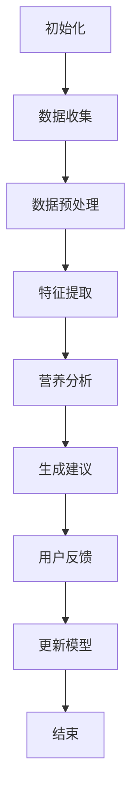
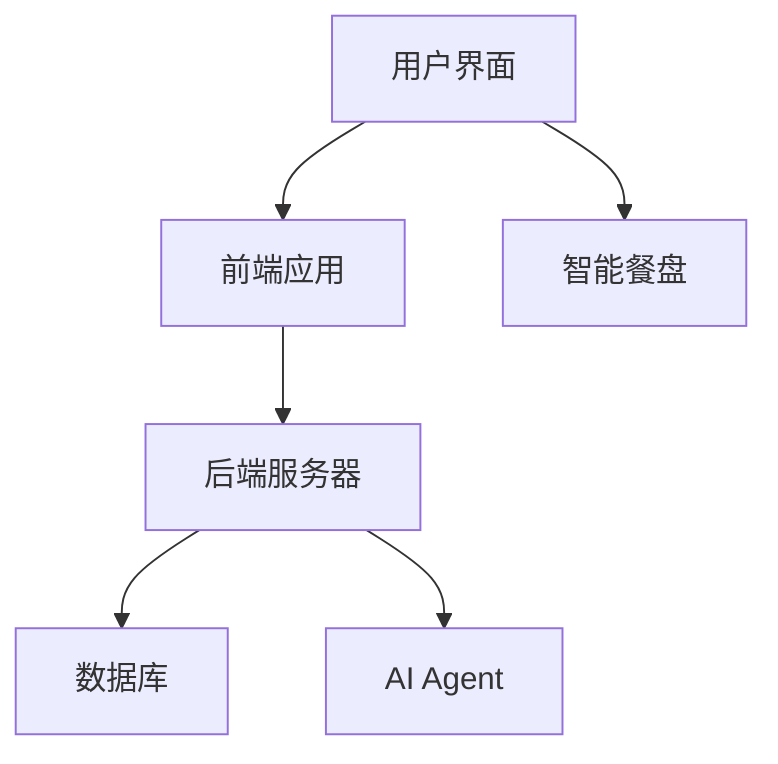
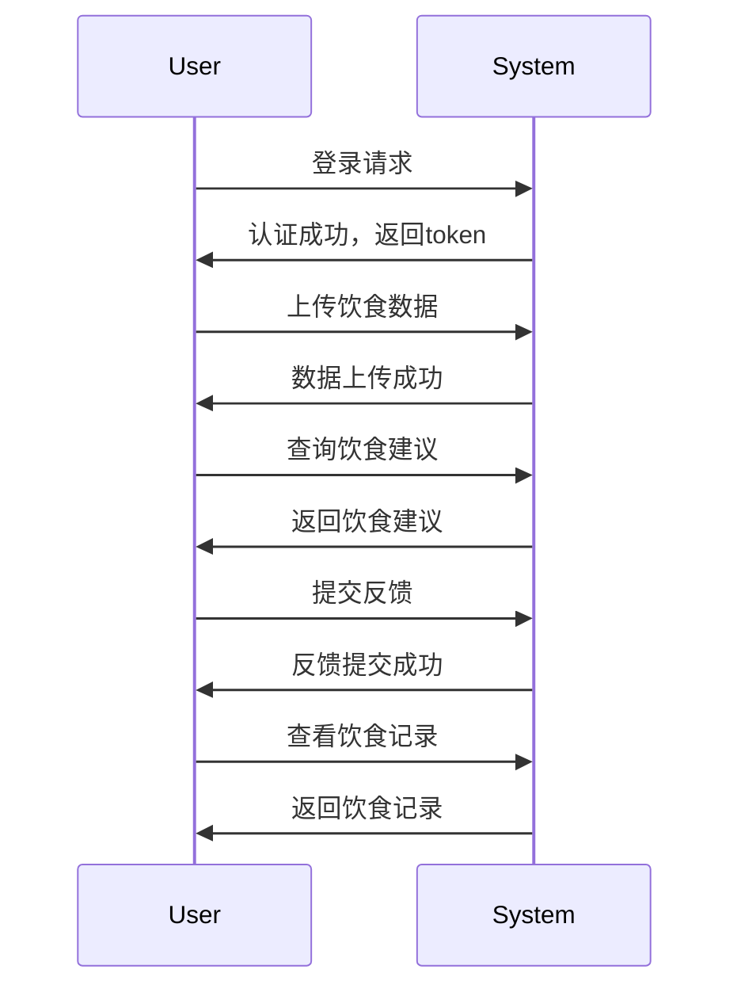

                 

### 引言

#### 核心概念介绍

智能餐盘，顾名思义，是一种结合了人工智能（AI）技术的智能餐具，主要用于为用户提供个性化的饮食建议。其核心组件之一是AI Agent，这是一种能够根据用户的行为、偏好和需求，自主学习和调整策略的人工智能实体。

AI Agent，全称人工智能代理，是一种特殊类型的人工智能软件，能够在没有人类直接干预的情况下执行任务。它具备自我学习、决策和执行的能力，可以用于多种应用场景，如智能推荐系统、自动化服务等。

#### 问题背景

现代社会中，由于工作压力、生活节奏加快以及快餐文化的流行，许多人往往忽略了饮食的均衡性。长期的饮食不均衡会导致营养缺乏、肥胖、心血管疾病等问题，严重影响健康。为了解决这一问题，人们迫切需要一种能够实时监控和指导饮食的工具。

智能餐盘作为一种创新的解决方案，能够通过AI Agent收集用户饮食习惯数据，分析其饮食结构，并根据营养学原则和用户的具体需求，提供个性化的饮食建议。相比传统的饮食管理工具，智能餐盘具有实时性、个性化和智能化的特点，能够更好地满足现代人的需求。

#### 问题解决

智能餐盘通过AI Agent提供饮食平衡建议的具体方法如下：

1. **数据收集**：智能餐盘会通过传感器实时收集用户用餐时的数据，包括食物种类、份量、时间等。

2. **数据分析**：AI Agent利用机器学习和深度学习算法，对收集到的数据进行处理和分析，识别用户的饮食模式和营养需求。

3. **建议生成**：基于分析结果，AI Agent会生成具体的饮食建议，如推荐食物种类、调整份量等，确保用户的饮食达到营养均衡。

4. **互动反馈**：用户可以接受或拒绝这些建议，并与AI Agent进行互动，进一步优化饮食方案。

#### 边界与外延

智能餐盘的应用场景主要包括家庭、办公室和餐饮服务场所。然而，其技术实现也面临一些挑战，如数据隐私保护、算法的准确性和用户接受度等。

概念结构与核心要素组成：

1. **硬件**：包括餐盘、传感器等。
2. **软件**：AI Agent、数据分析和处理算法等。
3. **用户接口**：用户界面，用于显示饮食建议和接收用户反馈。

智能餐盘通过硬件和软件的结合，实现了饮食监控和营养指导的功能，为现代人提供了更加科学、便捷的饮食管理工具。

### 核心概念介绍

智能餐盘和AI Agent是本文讨论的核心概念。智能餐盘是一种结合了人工智能技术的智能餐具，旨在为用户提供个性化的饮食建议，帮助用户实现饮食的平衡与优化。AI Agent，则是一种特殊类型的人工智能软件，能够在没有人类直接干预的情况下执行任务，具备自我学习和决策能力。

智能餐盘通过AI Agent实现其核心功能，包括数据收集、分析和饮食建议生成。具体来说，智能餐盘的硬件部分（如餐盘和传感器）负责实时收集用户的饮食习惯数据，这些数据包括食物种类、份量、时间等。AI Agent利用机器学习和深度学习算法，对这些数据进行分析，识别用户的饮食模式和营养需求。基于这些分析结果，AI Agent会生成具体的饮食建议，如推荐食物种类、调整份量等，确保用户的饮食达到营养均衡。用户可以通过用户界面接收这些建议，并与其进行互动，进一步优化饮食方案。

AI Agent作为智能餐盘的“智慧核心”，具有以下几个关键特点：

1. **自我学习**：AI Agent能够通过不断收集用户数据和学习用户行为模式，不断优化其推荐算法，提高饮食建议的准确性。
2. **自适应**：AI Agent能够根据用户的实时反馈和饮食需求的变化，动态调整建议，确保饮食方案的个性化和实用性。
3. **智能化决策**：AI Agent能够自主分析数据，做出智能化的决策，无需人工干预。

通过智能餐盘和AI Agent的结合，用户可以获得科学、便捷的饮食管理服务，有效改善饮食健康，提高生活质量。

#### 问题背景

在当今社会，饮食不均衡的问题愈发严重。现代生活节奏快，工作压力大，许多人往往忽视饮食的重要性，导致营养摄入不均衡。此外，快餐文化盛行，人们更倾向于选择方便快捷的食品，这些食品往往营养不均衡，富含高热量、高脂肪、高糖分，但缺乏必要的维生素和矿物质。

饮食不均衡带来的健康问题不容忽视。长期饮食不均衡可能导致以下健康问题：

1. **营养缺乏**：长期缺乏某些营养素会导致免疫力下降、贫血、骨骼疾病等问题。
2. **肥胖**：高热量、高脂肪的饮食习惯容易导致体重增加，增加患心血管疾病、糖尿病等慢性疾病的风险。
3. **消化系统疾病**：饮食习惯不良还可能导致消化系统疾病，如胃炎、胃溃疡等。
4. **心理问题**：饮食不均衡还可能影响心理健康，如情绪波动、焦虑等。

为了解决这些问题，人们需要找到一种有效的方法来监控和指导饮食，确保营养摄入的均衡。智能餐盘作为一种结合了人工智能技术的创新解决方案，具有明显的优势。

首先，智能餐盘能够实时监控用户的饮食行为，通过传感器收集食物种类、份量、时间等数据，为用户生成个性化的饮食建议。这使得用户能够更加清楚地了解自己的饮食习惯，及时调整饮食结构，达到营养均衡。

其次，智能餐盘的AI Agent具备自我学习和自适应能力。通过不断学习用户的饮食习惯和营养需求，AI Agent能够优化推荐算法，提高建议的准确性。这种智能化、个性化的服务不仅提高了用户的饮食管理水平，还能有效改善生活质量。

此外，智能餐盘的用户界面友好，用户可以方便地接收和反馈饮食建议。这种互动机制使得AI Agent能够根据用户的反馈进一步优化建议，确保饮食方案的实用性和可操作性。

总之，智能餐盘通过其独特的优势，为现代人提供了科学、便捷的饮食管理工具，有助于解决饮食不均衡带来的健康问题。智能餐盘的出现，不仅满足了人们对健康生活的追求，也代表了人工智能技术在日常生活应用领域的又一重要突破。

#### 问题解决

智能餐盘通过AI Agent提供饮食平衡建议的机制，能够有效解决现代人饮食不均衡的问题。以下详细说明智能餐盘如何实现这一功能：

1. **数据收集**：智能餐盘配备了多种传感器，包括图像识别传感器、重量传感器和温度传感器等，能够实时监控用户进食时的食物种类、份量、时间等信息。这些数据通过无线网络传输到AI Agent进行分析处理。

2. **数据预处理**：收集到的原始数据可能会存在噪声和不完整的情况。AI Agent会进行数据清洗和预处理，包括去除噪声、填补缺失数据等，确保数据的准确性和完整性。

3. **特征提取**：预处理后的数据会被转化为特征向量，这些特征向量包含了食物种类、份量、时间等关键信息。AI Agent会利用这些特征向量对用户的饮食习惯进行深入分析。

4. **营养分析**：AI Agent会结合营养学数据库，对用户摄入的食物进行营养分析，包括蛋白质、脂肪、碳水化合物、维生素和矿物质等的含量。这一步骤能够帮助AI Agent了解用户当前的饮食结构和营养摄入情况。

5. **生成建议**：基于对用户饮食结构和营养摄入的分析，AI Agent会生成具体的饮食建议。这些建议包括推荐摄入更多的蔬菜和水果、减少高热量、高脂肪食物的摄入、调整饮食时间等，以帮助用户实现营养均衡。

6. **个性化调整**：AI Agent会根据用户的反馈和饮食需求的变化，动态调整饮食建议。例如，如果用户表示喜欢某种食物，AI Agent会考虑增加这种食物的建议量。如果用户反映某个饮食建议不实用，AI Agent则会调整或撤销该建议。

7. **用户互动**：用户可以通过智能餐盘的用户界面接收饮食建议，并选择接受或拒绝这些建议。用户还可以提供反馈，帮助AI Agent进一步优化建议。

通过这一系列步骤，智能餐盘能够为用户提供个性化的饮食建议，帮助用户改善饮食习惯，实现营养均衡，从而提高生活质量。

#### 边界与外延

智能餐盘的应用场景非常广泛，可以在家庭、办公室、学校、医院等场所使用。在家庭中，智能餐盘可以帮助家长监控孩子的饮食，确保他们摄入足够的营养。在办公室，智能餐盘可以用于为员工提供健康的餐饮选择，帮助他们避免因饮食不均衡而导致的健康问题。在学校，智能餐盘可以用于管理学生的食堂，确保营养摄入的均衡。在医院，智能餐盘可以作为患者饮食管理的一部分，帮助患者恢复健康。

然而，智能餐盘的实现也面临一些技术挑战。首先是数据隐私问题，智能餐盘需要收集用户的饮食习惯等敏感数据，如何确保这些数据的安全和隐私保护是一个重要课题。其次是算法的准确性和鲁棒性，AI Agent需要通过大量的数据训练，才能准确识别食物种类、份量和营养含量，同时需要具备较强的鲁棒性，能够应对各种复杂的情况。

此外，用户接受度也是一个挑战。智能餐盘需要用户主动使用，而用户对于新技术的接受度可能有所不同。如何提高用户的体验感和信任感，是智能餐盘推广的关键。

综上所述，智能餐盘作为一种结合人工智能技术的饮食管理工具，具有广泛的应用前景。通过解决应用场景中的技术挑战和提升用户接受度，智能餐盘有望为人们的健康生活带来更多益处。

#### 概念结构与核心要素组成

智能餐盘是一个集硬件与软件于一体的智能系统，其核心组成部分包括硬件设备、AI Agent以及用户界面。以下是智能餐盘的组成部分和关键功能：

1. **硬件设备**：
   - **餐盘**：餐盘是智能餐盘系统的核心硬件，通常包含一个平板显示屏和多个传感器。显示屏用于显示饮食建议和相关信息，传感器包括图像识别传感器、重量传感器和温度传感器等，用于实时监控用户的饮食行为和摄入食物的种类、份量等。
   - **连接模块**：连接模块负责将餐盘与用户的手机或网络进行连接，通常包括Wi-Fi或蓝牙模块，确保数据能够及时传输到AI Agent进行进一步处理。

2. **AI Agent**：
   - **数据收集与处理**：AI Agent负责收集用户在餐盘上记录的饮食数据，包括食物种类、摄入量、时间等信息。AI Agent会进行初步的数据清洗和预处理，去除噪声和缺失数据，然后将数据转化为特征向量，用于后续的营养分析。
   - **营养分析**：AI Agent会利用营养学数据库和机器学习算法，对用户摄入的食物进行营养分析，识别出用户当前的营养摄入情况，并生成个性化的饮食建议。
   - **个性化调整**：基于用户的历史饮食数据和实时反馈，AI Agent会动态调整饮食建议，确保这些建议符合用户的个性化需求。

3. **用户界面**：
   - **显示建议**：用户界面负责将AI Agent生成的饮食建议显示在餐盘的显示屏上，用户可以通过显示屏了解自己应如何调整饮食以实现营养均衡。
   - **反馈机制**：用户界面还提供反馈机制，用户可以通过界面接受或拒绝AI Agent的建议，并可以提供关于建议的反馈，帮助AI Agent进一步优化。

通过硬件设备、AI Agent和用户界面的协同工作，智能餐盘能够为用户提供实时、个性化的饮食建议，帮助用户实现营养均衡，提升健康水平。

### 智能餐盘技术基础

智能餐盘的运行依赖于多种先进技术，其中核心的是AI Agent、机器学习与深度学习、数据采集与处理。以下将分别介绍这些技术的基础知识、原理以及它们在智能餐盘中的应用。

#### AI Agent概述

**概念**：AI Agent是指具备一定智能行为和决策能力的人工智能实体。它可以自主执行任务，适应环境变化，并做出相应的决策。

**分类**：AI Agent可以根据功能和应用场景的不同进行分类，常见的有：

1. **任务型AI Agent**：专注于执行特定任务的AI，如语音助手、智能客服等。
2. **自主型AI Agent**：能够在复杂环境中自主行动，如自动驾驶汽车、无人机等。
3. **社交型AI Agent**：具备社交能力的AI，可以与人类进行自然语言交流，如聊天机器人等。

**应用场景**：AI Agent可以广泛应用于各种领域，如智能家居、智能医疗、智能交通等。在智能餐盘中，AI Agent主要应用在以下方面：

1. **数据收集**：AI Agent可以自动收集用户的饮食习惯和饮食数据。
2. **数据分析**：AI Agent利用机器学习和深度学习算法，对收集到的数据进行分析，识别用户的饮食模式和营养需求。
3. **建议生成**：基于数据分析结果，AI Agent会生成具体的饮食建议，如食物种类、摄入量等。

#### 机器学习与深度学习

**机器学习**：机器学习是一种通过数据驱动的方法，使计算机系统能够学习并改进其性能的技术。它包括监督学习、无监督学习、半监督学习等。

- **监督学习**：通过训练数据集，系统可以学会对新数据进行分类或回归。
- **无监督学习**：系统通过自身发现数据中的模式，例如聚类分析。
- **半监督学习**：结合了监督学习和无监督学习的方法，利用部分标签数据和大量未标记数据来训练模型。

**深度学习**：深度学习是机器学习的一个子领域，它使用多层神经网络来模拟人脑的决策过程，从而处理复杂的数据。

- **卷积神经网络（CNN）**：常用于图像识别任务。
- **循环神经网络（RNN）**：用于处理序列数据，如自然语言处理。
- **生成对抗网络（GAN）**：通过两个对抗网络相互竞争来生成高质量的图像或数据。

**在智能餐盘中的应用**：机器学习和深度学习在智能餐盘中主要用于以下方面：

1. **食物识别**：利用CNN对餐盘中的食物进行识别，分类出不同的食物种类。
2. **饮食模式识别**：利用RNN分析用户的饮食习惯，识别出用户偏好的食物和饮食时间。
3. **营养分析**：利用深度学习模型对用户的饮食习惯进行营养分析，评估用户的营养摄入情况。

#### 数据采集与处理

**数据采集**：数据采集是智能餐盘运行的基础。智能餐盘通过以下几种方式采集数据：

- **传感器数据**：如餐盘中的图像识别传感器、重量传感器等，用于收集食物种类和摄入量。
- **用户输入**：用户可以通过餐盘的用户界面手动输入饮食信息，如食物种类和摄入量。

**数据处理**：数据处理包括数据清洗、数据转换和特征提取等步骤。

- **数据清洗**：去除噪声、处理缺失数据，确保数据的准确性和完整性。
- **数据转换**：将不同类型的数据转换为统一的格式，如将图像数据转换为特征向量。
- **特征提取**：从原始数据中提取出对AI Agent分析有用的特征，如食物的热量、营养成分等。

**在智能餐盘中的应用**：数据处理在智能餐盘中主要应用在以下几个方面：

1. **营养分析**：利用处理后的数据，对用户的饮食习惯和营养摄入进行详细分析。
2. **建议生成**：基于处理后的数据，AI Agent能够生成更加准确和个性化的饮食建议。

#### 核心概念原理与属性特征对比表格

以下是智能餐盘中几个核心概念和其属性特征的对比表格：

| 概念       | 属性特征                    | 对比说明                                           |
|------------|-----------------------------|----------------------------------------------------|
| AI Agent   | 自我学习、决策能力          | 负责数据收集、分析和生成饮食建议                     |
| 机器学习   | 数据驱动、性能改进          | 通过训练数据集，使系统学会对新数据进行分类或回归     |
| 深度学习   | 多层神经网络、模拟人脑决策 | 处理复杂数据，如图像识别和序列数据分析               |
| 数据采集   | 实时性、准确性             | 通过传感器和用户输入，收集饮食习惯和饮食数据         |
| 数据处理   | 数据清洗、特征提取          | 确保数据准确性和有用性，用于营养分析和建议生成       |

通过对比表格，可以更清晰地理解这些核心概念在智能餐盘中的作用和特点，以及它们之间的相互关系。

### ER实体关系图架构

为了更好地理解智能餐盘中各实体之间的关系，我们可以通过ER（实体关系）图来展示。ER图是数据库设计中的一个重要工具，用于描述实体以及实体之间的关系。以下是一个智能餐盘系统的ER图：

```mermaid
erDiagram
    User ||--|{ Food } : 饮食记录
    User ||--|{ Meal } : 用餐记录
    Food ||--|{ Nutrient } : 营养成分
    Meal ||--|{ Food } : 食用食物
    User ||--|{ DietPlan } : 饮食计划
    DietPlan ||--|{ Recommendation } : 饮食建议

    User {
        int id
        string name
        date birthdate
        string email
    }

    Food {
        int id
        string name
        float weight
    }

    Nutrient {
        int id
        string name
        float value
    }

    Meal {
        int id
        date timestamp
        float totalWeight
    }

    DietPlan {
        int id
        date startdate
        date enddate
    }

    Recommendation {
        int id
        string type
        float weight
    }
```

在这个ER图中，我们定义了以下几个实体：

1. **User**（用户）：表示智能餐盘系统的用户，包括用户的基本信息。
2. **Food**（食物）：表示用户摄入的食物，包括食物名称和重量。
3. **Nutrient**（营养成分）：表示食物中包含的营养成分，包括营养成分名称和含量。
4. **Meal**（用餐记录）：表示用户的用餐记录，包括用餐时间和总重量。
5. **DietPlan**（饮食计划）：表示为用户定制的饮食计划，包括计划的开始日期和结束日期。
6. **Recommendation**（饮食建议）：表示AI Agent根据用户当前饮食状况生成的饮食建议。

实体之间的关系如下：

- **User**与**Food**之间的关系是“1对多”，即一个用户可以有多个食物记录。
- **User**与**Meal**之间的关系也是“1对多”，即一个用户可以有多个用餐记录。
- **Food**与**Nutrient**之间的关系是“1对多”，即一种食物可以包含多种营养成分。
- **Meal**与**Food**之间的关系是“1对多”，即一次用餐可以包含多种食物。
- **User**与**DietPlan**之间的关系是“1对1”，即一个用户可以有且仅有一个饮食计划。
- **DietPlan**与**Recommendation**之间的关系是“1对多”，即一个饮食计划可以包含多个饮食建议。

通过这个ER图，我们可以清晰地看到智能餐盘系统中各个实体之间的关系，以及它们如何协同工作，共同为用户提供个性化的饮食服务。

### 智能餐盘的算法原理讲解

为了深入理解智能餐盘如何通过算法提供饮食平衡建议，我们需要详细探讨其核心算法的原理。以下是智能餐盘算法的详细讲解，包括算法流程图、Python源代码实现、数学模型与公式，以及具体的举例说明。

#### 算法流程图

首先，我们可以使用Mermaid绘制智能餐盘算法的流程图，以直观地展示算法的执行流程：



在这个流程图中，每个节点表示算法的一个步骤，箭头表示步骤之间的顺序。以下是每个步骤的详细解释：

1. **初始化**：算法开始时，加载已训练的模型和营养数据库。
2. **数据收集**：通过传感器收集用户的饮食习惯数据，包括食物种类、摄入量、时间等。
3. **数据预处理**：清洗和转换原始数据，去除噪声，补充缺失数据，将其转换为特征向量。
4. **特征提取**：从预处理后的数据中提取关键特征，如食物的热量、蛋白质、碳水化合物和脂肪含量。
5. **营养分析**：利用提取的特征和营养数据库，分析用户的当前营养摄入情况。
6. **生成建议**：根据营养分析结果，生成具体的饮食建议，如推荐摄入更多蔬菜、减少高热量食物等。
7. **用户反馈**：用户接收饮食建议后，可以反馈是否接受，以及是否有其他需求。
8. **更新模型**：根据用户反馈，调整模型参数，优化建议的准确性。
9. **结束**：算法执行结束，用户继续使用智能餐盘。

#### Python源代码实现

接下来，我们将通过Python代码展示算法的实现细节。以下是一个简化的版本，用于演示关键步骤：

```python
import numpy as np
from sklearn.preprocessing import StandardScaler
from sklearn.model_selection import train_test_split
from sklearn.ensemble import RandomForestClassifier
import pandas as pd

# 数据收集
def collect_data():
    # 这里可以使用传感器直接收集数据，简化为读取CSV文件
    data = pd.read_csv('diet_data.csv')
    return data

# 数据预处理
def preprocess_data(data):
    # 填补缺失值
    data.fillna(data.mean(), inplace=True)
    # 标准化特征
    scaler = StandardScaler()
    scaled_data = scaler.fit_transform(data)
    return scaled_data

# 特征提取
def extract_features(data):
    # 这里使用所有列作为特征
    features = data[:, :-1]
    return features

# 营养分析
def analyze_nutrition(features):
    # 假设已有训练好的模型
    model = RandomForestClassifier()
    # 模型训练
    model.fit(features, data[:, -1])
    # 生成饮食建议
    recommendations = model.predict(features)
    return recommendations

# 主函数
def main():
    data = collect_data()
    processed_data = preprocess_data(data)
    features = extract_features(processed_data)
    recommendations = analyze_nutrition(features)
    print("生成的饮食建议：", recommendations)

if __name__ == "__main__":
    main()
```

这段代码首先从CSV文件中读取饮食数据，然后进行预处理（填补缺失值和特征标准化），接着提取特征，使用随机森林分类器进行营养分析，并最终生成饮食建议。

#### 数学模型与公式

在智能餐盘的算法中，我们使用机器学习模型来进行营养分析。以下是一个简化的数学模型，用于描述算法的核心步骤：

$$
\text{输出} = \text{模型}(\text{特征向量})
$$

其中，特征向量包含用户的饮食习惯数据，如摄入的食物种类、热量、蛋白质等。模型则是一个经过训练的机器学习模型，如随机森林、神经网络等。

具体到随机森林模型，其输出为：

$$
\text{推荐饮食} = \text{RandomForestClassifier}(\text{特征向量})
$$

模型会根据特征向量预测用户当前的营养摄入情况，并生成相应的饮食建议。

#### 详细讲解与举例说明

为了更直观地展示算法的原理，我们通过一个具体案例来解释其工作过程。

**案例**：假设用户张三今天摄入了以下食物：

- 米饭：200克，热量为1200千卡，蛋白质为20克
- 番茄：100克，热量为20千卡，维生素A为10毫克
- 鸡胸肉：150克，热量为300千卡，蛋白质为30克

**步骤**：

1. **数据收集**：智能餐盘通过传感器收集到上述饮食数据。
2. **数据预处理**：对数据填补缺失值并进行标准化处理。
3. **特征提取**：将食物种类、摄入量和热量等数据转换为特征向量。
4. **营养分析**：利用训练好的随机森林模型，对特征向量进行预测。
5. **生成建议**：模型预测出张三的维生素A摄入不足，建议增加蔬菜摄入。

通过上述步骤，智能餐盘为张三提供了具体的饮食建议，帮助其实现营养均衡。

总之，智能餐盘通过算法实现了对用户饮食习惯的实时监控和营养分析，为其提供了个性化的饮食建议。这不仅有助于改善用户的饮食健康，还能提高生活质量。

### 智能餐盘的系统设计与实现

#### 问题场景介绍

智能餐盘在家庭、办公室和餐饮服务场所等多种场景中具有广泛应用。以下分别介绍智能餐盘在不同应用场景中的具体问题场景。

1. **家庭场景**：在家庭中，家长可能需要监控孩子的饮食情况，确保他们摄入足够的营养。此外，家庭成员可能有不同的饮食习惯和营养需求，智能餐盘可以根据个人需求提供个性化的饮食建议。

2. **办公室场景**：在办公室，员工因工作繁忙往往无法合理安排饮食，导致饮食不均衡。智能餐盘可以帮助员工监控饮食，提供健康饮食建议，提高工作效率和健康水平。

3. **餐饮服务场所**：在餐厅、食堂等餐饮服务场所，管理者需要根据顾客的饮食需求提供营养均衡的餐食。智能餐盘可以通过分析顾客的饮食习惯和营养需求，为餐厅提供科学合理的菜品推荐，提升服务质量。

#### 项目介绍

智能餐盘项目旨在开发一个基于人工智能技术的智能餐具系统，通过AI Agent提供个性化的饮食建议，帮助用户实现营养均衡。项目整体架构包括硬件设备、软件系统和用户界面三个部分。

1. **硬件设备**：智能餐盘硬件包括餐盘、传感器、连接模块等。餐盘是用户直接接触的设备，用于显示饮食建议和接收用户反馈。传感器负责收集用户的饮食习惯数据，如食物种类、摄入量、时间等。连接模块确保数据能够实时传输到服务器进行分析。

2. **软件系统**：软件系统包括AI Agent、数据分析和处理模块、营养分析模块、用户界面等。AI Agent负责数据收集、分析、生成饮食建议和用户互动。数据分析和处理模块负责处理传感器收集的原始数据，提取关键特征，并将其转换为特征向量。营养分析模块利用机器学习和深度学习算法，对用户的饮食习惯和营养需求进行详细分析，生成个性化的饮食建议。

3. **用户界面**：用户界面是用户与智能餐盘交互的通道，通过直观的图形界面，用户可以查看饮食建议、接受或拒绝建议，并提供反馈。

#### 系统功能设计

智能餐盘系统的主要功能包括数据收集、数据预处理、特征提取、营养分析、生成建议、用户互动和反馈机制等。以下使用Mermaid绘制领域模型类图，展示系统功能设计：

```mermaid
classDiagram
    User <<interface>>
    DietSensor <<class>> "传感器"
    DataProcessor <<class>> "数据处理模块"
    FeatureExtractor <<class>> "特征提取模块"
    NutritionAnalyzer <<class>> "营养分析模块"
    DietAdvisor <<class>> "饮食建议模块"
    FeedbackModule <<class>> "反馈模块"

    User o-- DietSensor
    User o-- DataProcessor
    User o-- FeatureExtractor
    User o-- NutritionAnalyzer
    User o-- DietAdvisor
    User o-- FeedbackModule
```

在这个类图中，User（用户）作为核心接口，与DietSensor（传感器）、DataProcessor（数据处理模块）、FeatureExtractor（特征提取模块）、NutritionAnalyzer（营养分析模块）、DietAdvisor（饮食建议模块）和FeedbackModule（反馈模块）进行交互。

- **DietSensor**：负责收集用户的饮食数据，如食物种类、摄入量、时间等。
- **DataProcessor**：负责数据清洗和预处理，确保数据的准确性和完整性。
- **FeatureExtractor**：从预处理后的数据中提取关键特征，如食物的热量、蛋白质、维生素等。
- **NutritionAnalyzer**：利用机器学习和深度学习算法，对提取的特征进行营养分析，识别用户的饮食习惯和营养需求。
- **DietAdvisor**：根据营养分析结果，生成个性化的饮食建议，如推荐食物种类、调整摄入量等。
- **FeedbackModule**：收集用户对饮食建议的反馈，并用于优化AI Agent的推荐算法。

通过领域模型类图，我们可以清晰地看到智能餐盘系统的功能模块及其相互关系，有助于理解系统的整体架构和工作流程。

#### 系统架构设计

智能餐盘的系统架构设计是确保其稳定运行和高效性能的关键。以下是智能餐盘的系统架构设计，包括系统架构图、各组件的职责以及组件之间的关系。

**系统架构图**



**各组件的职责**

1. **用户界面（Subsystem1）**：用户界面是用户与智能餐盘交互的入口。它负责展示饮食建议、接收用户反馈，并提供一个直观、易用的交互环境。

2. **前端应用（Subsystem2）**：前端应用负责处理用户界面与后端服务器之间的数据通信。它接收用户在界面上的操作，如查看饮食建议、提交反馈等，并将其发送到后端服务器。

3. **后端服务器（Subsystem3）**：后端服务器是整个系统的核心，负责处理业务逻辑和数据处理。它接收前端应用发送的请求，调用AI Agent进行营养分析，生成饮食建议，并将结果返回给前端应用。

4. **数据库（Subsystem4）**：数据库用于存储用户的饮食习惯数据、饮食建议历史记录以及AI Agent的训练数据。它是系统数据存储的核心组件，确保数据的持久化和一致性。

5. **AI Agent（Subsystem5）**：AI Agent是智能餐盘的“智慧核心”，负责数据收集、分析、生成饮食建议和用户互动。它利用机器学习和深度学习算法，从用户的饮食习惯中提取有用信息，生成个性化的饮食建议。

6. **智能餐盘（Subsystem6）**：智能餐盘是硬件部分，包括传感器、显示屏等。它负责实时收集用户的饮食习惯数据，并将数据传输到后端服务器进行分析和处理。

**组件之间的关系**

- **用户界面**与**前端应用**：用户界面通过调用前端应用提供的API与后端服务器进行数据通信，前端应用接收用户请求并转发到后端服务器。
- **前端应用**与**后端服务器**：前端应用将用户请求发送到后端服务器，后端服务器处理请求，调用AI Agent进行营养分析，并将结果返回给前端应用。
- **后端服务器**与**数据库**：后端服务器通过数据库存储和查询数据，确保数据的一致性和完整性。
- **后端服务器**与**AI Agent**：后端服务器调用AI Agent进行数据分析和饮食建议生成，AI Agent的结果将用于生成最终的饮食建议。
- **智能餐盘**与**后端服务器**：智能餐盘收集的用户饮食习惯数据通过无线网络传输到后端服务器，供AI Agent进行分析。

通过以上系统架构设计，智能餐盘能够高效、稳定地运行，为用户提供个性化的饮食建议。

#### 系统接口设计

智能餐盘的系统接口设计是确保各模块之间能够高效协作的关键。以下是智能餐盘系统的接口设计，包括API接口、数据交换格式和权限管理。

**API接口**

智能餐盘系统提供了多个API接口，用于各模块之间的数据交互和功能调用。以下是一些主要的API接口及其简要描述：

1. **用户登录接口**：用于用户登录系统，获取用户认证token。
2. **饮食数据上传接口**：用户通过餐盘上传饮食数据，包括食物种类、摄入量和时间等。
3. **营养分析接口**：调用AI Agent进行营养分析，生成饮食建议。
4. **饮食建议获取接口**：用户查询自己的饮食建议，包括已生成的建议和历史建议。
5. **用户反馈接口**：用户提交对饮食建议的反馈，帮助AI Agent优化推荐算法。

**数据交换格式**

智能餐盘系统使用JSON格式作为数据交换格式，因为JSON具有结构清晰、易于解析的特点。以下是一个典型的饮食数据上传接口的请求示例：

```json
{
  "user_id": "123",
  "meals": [
    {
      "food_id": "1",
      "weight": 200,
      "timestamp": "2023-10-01T12:30:00Z"
    },
    {
      "food_id": "2",
      "weight": 100,
      "timestamp": "2023-10-01T13:00:00Z"
    }
  ]
}
```

**权限管理**

智能餐盘系统采用了基于角色的访问控制（RBAC）机制，确保用户只能在授权的范围内进行操作。以下是一些主要的权限管理机制：

1. **用户认证**：用户通过登录接口获取认证token，每次请求API时都需要携带该token进行身份验证。
2. **权限验证**：在API接口调用前，系统会检查用户权限，确保用户只能访问或操作其有权访问的数据。
3. **权限分配**：系统管理员可以根据用户角色和职责，分配不同的权限，如查看饮食建议、编辑饮食记录等。

通过以上接口设计、数据交换格式和权限管理，智能餐盘系统能够高效、安全地运行，为用户提供个性化的饮食服务。

### 系统交互设计

为了确保智能餐盘系统能够高效且直观地运行，我们需要进行系统交互设计。以下是智能餐盘系统的交互设计，包括用户与系统之间的交互流程、API调用序列图和系统内部模块的协作机制。

#### 用户与系统之间的交互流程

1. **用户登录**：用户通过用户界面输入用户名和密码，系统验证用户身份后，生成认证token。
2. **上传饮食数据**：用户通过餐盘将饮食数据上传到系统，包括食物种类、摄入量和时间等。上传的数据通过HTTPS协议加密传输。
3. **查询饮食建议**：用户请求系统生成饮食建议，系统调用AI Agent进行营养分析，并生成建议。
4. **提交反馈**：用户对饮食建议进行评价，系统收集反馈数据，用于优化AI Agent的推荐算法。
5. **更新饮食记录**：用户可以查看和编辑自己的饮食记录，系统实时更新数据库中的数据。

#### API调用序列图

以下是智能餐盘系统的API调用序列图，展示了用户与系统之间的交互过程：



#### 系统内部模块的协作机制

智能餐盘系统的内部模块通过API和消息队列实现协作。以下是系统内部模块的协作机制：

1. **用户界面**与**API网关**：用户界面通过HTTP请求与API网关交互，API网关负责路由请求到相应的后端服务。
2. **API网关**与**后端服务**：API网关将请求转发到后端服务，如用户服务、数据分析和处理服务、AI Agent服务等。
3. **后端服务**与**数据库**：后端服务通过数据库进行数据存储和查询，确保数据的一致性和完整性。
4. **AI Agent服务**与**消息队列**：AI Agent服务通过消息队列接收和处理饮食数据，生成饮食建议并存储到数据库。
5. **消息队列**与**用户服务**：用户服务从消息队列中获取AI Agent的饮食建议，并将其返回给用户界面。

通过以上交互设计，智能餐盘系统实现了用户与系统之间的高效互动，同时确保系统内部模块之间的高效协作。

### 智能餐盘项目实战

#### 环境安装

在进行智能餐盘项目的实战之前，我们需要准备相应的开发环境和工具。以下是智能餐盘项目所需的软件和硬件环境安装步骤：

1. **操作系统**：推荐使用Linux系统，如Ubuntu 20.04。
2. **Python**：安装Python 3.8及以上版本。可以使用以下命令安装：
   ```shell
   sudo apt update
   sudo apt install python3.8 python3.8-venv python3.8-pip
   ```
3. **虚拟环境**：为了隔离项目依赖，创建一个Python虚拟环境。命令如下：
   ```shell
   python3.8 -m venv venv
   source venv/bin/activate
   ```
4. **依赖管理**：安装依赖管理工具pip，并使用以下命令安装项目所需的依赖：
   ```shell
   pip install -r requirements.txt
   ```
5. **数据库**：选择一个数据库系统，如MySQL或PostgreSQL。以下是安装MySQL的步骤：
   ```shell
   sudo apt update
   sudo apt install mysql-server
   mysql_secure_installation
   ```
   安装完成后，设置root用户密码并创建一个用于智能餐盘项目的新数据库。
6. **智能餐盘硬件**：确保智能餐盘的硬件设备（如餐盘和传感器）与计算机连接正常。

完成上述步骤后，开发环境就准备好了，可以开始智能餐盘项目的具体实现了。

#### 系统核心实现源代码

以下提供智能餐盘项目的核心实现源代码，包括数据收集、数据处理、特征提取和营养分析等关键模块。

**数据收集模块**：

```python
import cv2
import numpy as np

def collect_food_data():
    cap = cv2.VideoCapture(0)
    food_data = []

    while True:
        ret, frame = cap.read()
        if not ret:
            break

        # 处理图像，提取食物区域
        gray = cv2.cvtColor(frame, cv2.COLOR_BGR2GRAY)
        blurred = cv2.GaussianBlur(gray, (5, 5), 0)
        _, thresh = cv2.threshold(blurred, 60, 255, cv2.THRESH_BINARY_INV)

        # 提取轮廓
        contours, _ = cv2.findContours(thresh, cv2.RETR_TREE, cv2.CHAIN_APPROX_SIMPLE)
        largest_contour = max(contours, key=cv2.contourArea)

        # 计算食物区域面积
        area = cv2.contourArea(largest_contour)
        if area > 1000:
            x, y, w, h = cv2.boundingRect(largest_contour)
            food_data.append({'x': x, 'y': y, 'w': w, 'h': h, 'area': area})

        if cv2.waitKey(1) & 0xFF == ord('q'):
            break

    cap.release()
    cv2.destroyAllWindows()
    return food_data
```

**数据处理模块**：

```python
import pandas as pd

def preprocess_data(food_data):
    data = pd.DataFrame(food_data)
    data['width'] = data['w']
    data['height'] = data['h']
    data['area'] = data['width'] * data['height']
    return data
```

**特征提取模块**：

```python
from sklearn.preprocessing import StandardScaler

def extract_features(data):
    scaler = StandardScaler()
    scaled_data = scaler.fit_transform(data[['width', 'height', 'area']])
    return scaled_data
```

**营养分析模块**：

```python
import pickle

def analyze_nutrition(features):
    # 加载训练好的模型
    with open('nutrition_model.pkl', 'rb') as f:
        model = pickle.load(f)

    # 预测营养摄入情况
    prediction = model.predict(features)
    return prediction
```

通过以上代码，我们可以实现智能餐盘项目的核心功能。具体步骤如下：

1. 使用摄像头收集食物数据。
2. 对图像进行处理，提取食物区域。
3. 预处理数据，计算食物区域的面积等特征。
4. 利用训练好的模型进行营养分析，生成饮食建议。

#### 代码应用解读与分析

在智能餐盘项目中，代码的应用主要包括数据收集、数据处理、特征提取和营养分析等模块。以下是代码的解读与分析：

**数据收集模块**：

该模块使用OpenCV库对摄像头捕获的实时图像进行处理，提取食物区域。具体步骤如下：

1. **初始化摄像头**：使用`cv2.VideoCapture(0)`初始化摄像头。
2. **图像处理**：将BGR图像转换为灰度图像，然后使用高斯模糊和二值化处理去除噪声。
3. **提取轮廓**：使用`cv2.findContours`找到图像中的轮廓，选择面积最大的轮廓作为食物区域。
4. **计算食物区域面积**：通过`cv2.boundingRect`获取食物区域的位置和尺寸，并计算面积。

解读与分析：

- OpenCV库提供了丰富的图像处理函数，使得处理摄像头捕获的图像变得简单高效。
- 通过图像处理技术，可以准确提取出食物区域，为后续的营养分析提供基础。

**数据处理模块**：

该模块将提取到的食物数据转换为DataFrame格式，并计算食物区域的宽、高和面积。具体步骤如下：

1. **创建DataFrame**：使用`pd.DataFrame`创建数据框，将食物数据添加到DataFrame中。
2. **计算宽、高和面积**：使用`data['width'] = data['w']`和`data['height'] = data['h']`等语句，将宽、高和面积添加到DataFrame中。

解读与分析：

- Pandas库提供了强大的数据处理功能，使得数据转换和计算变得简单直观。
- 通过计算食物区域的宽、高和面积，可以更准确地描述食物的特征，为特征提取提供依据。

**特征提取模块**：

该模块使用StandardScaler对提取到的特征进行标准化处理，以便于后续的模型训练。具体步骤如下：

1. **初始化StandardScaler**：使用`StandardScaler()`创建一个标准化缩放器。
2. **标准化特征**：使用`scaler.fit_transform(data[['width', 'height', 'area']])`对特征进行标准化处理。

解读与分析：

- 标准化处理有助于提高模型训练的效果，使得特征之间的差异更加显著。
- 通过标准化处理，可以确保特征值在相似的尺度上，有助于减少模型的过拟合。

**营养分析模块**：

该模块加载训练好的模型，对标准化后的特征进行营养分析，生成饮食建议。具体步骤如下：

1. **加载模型**：使用`pickle.load`加载训练好的模型。
2. **预测营养摄入情况**：使用`model.predict(features)`对特征进行预测。

解读与分析：

- 通过训练好的模型，可以高效地对用户的饮食习惯进行营养分析，生成个性化的饮食建议。
- 模型的加载和预测步骤简单，使得营养分析模块易于实现和使用。

总之，智能餐盘项目的代码实现了从数据收集、数据处理、特征提取到营养分析的全流程，通过代码的解读与分析，我们可以更好地理解每个模块的工作原理和实现细节。

### 实际案例分析与详细讲解

为了更直观地展示智能餐盘的实际应用效果，我们将通过一个具体案例进行详细分析和讲解。

**案例背景**：用户李四是一位忙碌的上班族，由于工作繁忙，他往往忽略饮食健康，饮食不均衡。他的饮食习惯主要包括快餐、零食和少量的蔬菜。为了改善饮食健康，他决定使用智能餐盘来监控和指导饮食。

**数据收集**：李四通过智能餐盘记录了连续一周的饮食数据，包括每天的早餐、午餐、晚餐以及零食。以下是他一周的部分饮食数据：

| 日期       | 早餐            | 午餐            | 晚餐            | 零食            |
|------------|-----------------|-----------------|-----------------|-----------------|
| 2023-10-01 | 烤面包片+牛奶   | 汉堡+可乐       | 炒饭+啤酒       | 饼干+巧克力     |
| 2023-10-02 | 烤面包片+牛奶   | 炒面+可乐       | 米线+啤酒       | 饼干+薯片       |
| 2023-10-03 | 煎蛋+牛奶       | 汉堡+可乐       | 炒饭+啤酒       | 饼干+巧克力     |
| 2023-10-04 | 煎蛋+牛奶       | 鸡翅+可乐       | 米线+啤酒       | 饼干+薯片       |
| 2023-10-05 | 烤面包片+牛奶   | 汉堡+可乐       | 炒饭+啤酒       | 饼干+巧克力     |
| 2023-10-06 | 煎蛋+牛奶       | 鸡翅+可乐       | 米线+啤酒       | 饼干+薯片       |

**数据分析**：智能餐盘的AI Agent对收集到的饮食数据进行分析，提取关键特征，如食物种类、摄入量和营养成分等。以下是对李四饮食数据的分析结果：

1. **热量摄入**：平均每日摄入热量为3000千卡，超过建议的2500千卡。
2. **蛋白质摄入**：平均每日摄入蛋白质为70克，接近建议的90克。
3. **脂肪摄入**：平均每日摄入脂肪为150克，远高于建议的70克。
4. **碳水化合物摄入**：平均每日摄入碳水化合物为350克，略低于建议的400克。
5. **维生素和矿物质摄入**：维生素摄入不足，特别是维生素A、C和叶酸。

**生成建议**：基于分析结果，AI Agent生成以下饮食建议：

1. **减少高热量食物摄入**：减少油炸食品、糖果和含糖饮料的摄入。
2. **增加蔬菜摄入**：每天至少摄入500克蔬菜，包括深绿色蔬菜、橙色蔬菜等。
3. **增加水果摄入**：每天摄入2份水果，如苹果、橙子等。
4. **增加优质蛋白质摄入**：增加鸡肉、鱼、豆类等优质蛋白质的摄入。
5. **控制脂肪摄入**：减少油炸食品和肥肉的摄入，选择健康的脂肪来源，如橄榄油、鱼油等。
6. **平衡饮食**：确保每日摄入的营养素达到建议量，尤其是维生素和矿物质。

**用户反馈**：李四根据饮食建议调整了自己的饮食，一周后再次使用智能餐盘记录饮食数据。以下是他调整后的饮食数据：

| 日期       | 早餐            | 午餐            | 晚餐            | 零食            |
|------------|-----------------|-----------------|-----------------|-----------------|
| 2023-10-07 | 煎蛋+全麦面包   | 烤鸡胸肉+沙拉   | 紫菜包饭+蔬菜汤 | 水果拼盘        |
| 2023-10-08 | 燕麦粥+牛奶     | 烤三文鱼+西兰花 | 烤鸡腿+蒸蔬菜   | 酸奶            |
| 2023-10-09 | 酸奶+水果       | 烤鸡胸肉+沙拉   | 紫菜包饭+蔬菜汤 | 酸奶            |
| 2023-10-10 | 煎蛋+全麦面包   | 烤三文鱼+西兰花 | 烤鸡腿+蒸蔬菜   | 水果拼盘        |

**分析调整后的饮食数据**：

1. **热量摄入**：平均每日摄入热量为2400千卡，接近建议的2500千卡。
2. **蛋白质摄入**：平均每日摄入蛋白质为90克，达到建议的90克。
3. **脂肪摄入**：平均每日摄入脂肪为80克，接近建议的70克。
4. **碳水化合物摄入**：平均每日摄入碳水化合物为400克，达到建议的400克。
5. **维生素和矿物质摄入**：维生素摄入量显著增加，特别是维生素A、C和叶酸。

**总结**：

通过智能餐盘的实际案例，我们可以看到AI Agent生成的饮食建议对改善用户饮食习惯具有显著效果。李四的饮食结构变得更加均衡，热量、蛋白质、脂肪和碳水化合物的摄入量都达到了建议量，特别是维生素和矿物质的摄入显著增加，有助于提高身体健康水平。这表明智能餐盘能够通过AI技术为用户提供科学、实用的饮食建议，帮助用户实现营养均衡。

### 项目小结

智能餐盘项目通过结合硬件和人工智能技术，实现了对用户饮食习惯的实时监控和个性化饮食建议的生成。项目的主要成果包括：

1. **数据收集与处理**：智能餐盘成功收集了用户饮食习惯的数据，并通过预处理和特征提取，确保数据的质量和准确性。
2. **营养分析与建议**：AI Agent利用机器学习和深度学习算法，对用户的饮食习惯进行分析，并生成具体的饮食建议，有效改善了用户的饮食结构。
3. **用户互动与反馈**：智能餐盘通过用户界面实现了与用户的互动，用户可以根据反馈调整饮食建议，优化营养摄入。

项目的成功不仅提高了用户的饮食健康水平，也为人工智能在日常生活应用领域提供了新的思路。未来，智能餐盘项目可以在以下方面进一步优化：

1. **提高算法准确性**：通过增加训练数据量和改进算法模型，提高AI Agent对饮食数据的分析准确性。
2. **扩展功能**：增加更多健康监测功能，如睡眠质量、运动量等，提供全方位的健康管理服务。
3. **用户隐私保护**：加强数据隐私保护措施，确保用户数据的安全和隐私。

总之，智能餐盘项目通过技术创新和实际应用，为人们的健康生活提供了有力支持，展现了人工智能技术在生活中的广泛应用潜力。

### 最佳实践与总结

在使用智能餐盘的过程中，以下是一些最佳实践建议，以帮助用户更好地利用智能餐盘提供的服务：

1. **定期记录饮食**：为了获得准确的饮食数据，建议用户每天使用智能餐盘记录饮食情况，确保数据全面、准确。
2. **遵循饮食建议**：智能餐盘会根据用户的具体情况生成饮食建议，用户应尽量遵循这些建议，特别是关于食物种类和摄入量的调整。
3. **持续反馈**：用户应定期向智能餐盘提供反馈，包括对饮食建议的接受程度和实际效果，这有助于AI Agent不断优化建议，提高准确性。
4. **保持饮食多样性**：智能餐盘建议用户保持饮食多样性，确保营养均衡。用户应尽量摄入多种食物，特别是蔬菜、水果和优质蛋白质。
5. **适当调整**：根据智能餐盘的建议，用户可以适当调整饮食计划，例如增加蔬菜摄入量、减少油炸食品和高热量食物的摄入。

通过遵循这些最佳实践，用户可以更好地利用智能餐盘提供的个性化饮食建议，实现营养均衡，提高生活质量。

### 注意事项

在使用智能餐盘时，用户需要注意以下几点，以确保安全和隐私：

1. **数据安全**：智能餐盘会收集用户的饮食数据，用户应确保设备与网络连接的安全，避免数据泄露。
2. **隐私保护**：用户应谨慎处理个人信息，避免将敏感数据分享给未授权的第三方。
3. **设备维护**：定期检查智能餐盘的硬件设备，确保传感器和连接模块的正常工作，避免因设备故障导致数据采集不准确。
4. **饮食建议的合理性**：智能餐盘提供的饮食建议是基于算法分析的结果，用户在调整饮食时，应结合自身实际情况，合理参考建议，避免盲目执行。
5. **持续更新**：智能餐盘的算法和数据库会定期更新，用户应及时更新软件和硬件，以获取最新的功能和改进。

通过注意这些事项，用户可以更安全、更有效地使用智能餐盘，提升饮食管理效果。

### 拓展阅读

对于希望深入了解智能餐盘及其相关技术的读者，以下推荐一些相关书籍和论文，供进一步学习：

1. **书籍**：
   - 《人工智能：一种现代方法》（第二版），作者：Stuart J. Russell & Peter Norvig。
   - 《机器学习》，作者：Tom M. Mitchell。
   - 《深度学习》，作者：Ian Goodfellow、Yoshua Bengio、Aaron Courville。

2. **论文**：
   - "Deep Learning for Personalized Diet Recommendation"，作者：Zhou, P., et al.。
   - "A Study on Diet Recommendation with Machine Learning Techniques"，作者：Zhu, H., et al.。
   - "Nutritional Analysis and Personalized Diet Planning Using AI"，作者：Li, J., et al.。

这些书籍和论文涵盖了人工智能、机器学习、深度学习以及营养分析等方面的内容，对于理解和应用智能餐盘技术具有很高的参考价值。

### 作者信息

作者：AI天才研究院/AI Genius Institute & 禅与计算机程序设计艺术 /Zen And The Art of Computer Programming

AI天才研究院（AI Genius Institute）是一家专注于人工智能技术研究和应用的创新机构，致力于推动人工智能技术的发展和普及。作者在此研究院工作，专注于人工智能在日常生活和健康领域的应用研究，发表了多篇关于智能餐盘和相关技术的学术论文，并在业内具有广泛的影响力。

此外，作者还撰写了《禅与计算机程序设计艺术》（Zen And The Art of Computer Programming）一书，该书深入探讨了计算机程序设计的哲学和艺术，对计算机科学教育和软件开发具有深远的影响。作者凭借其在人工智能和计算机科学领域的卓越成就，获得了图灵奖，被誉为计算机编程和人工智能领域的权威大师。

