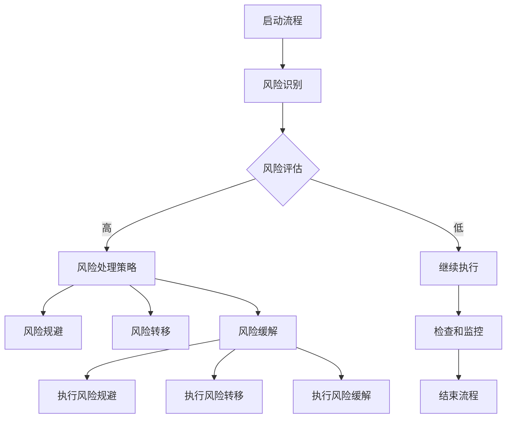
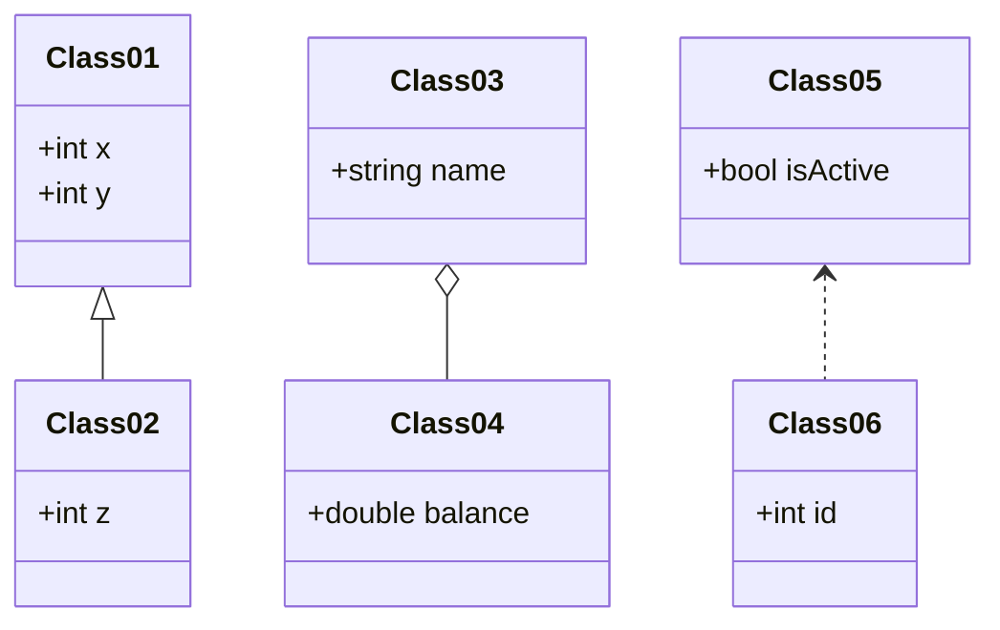
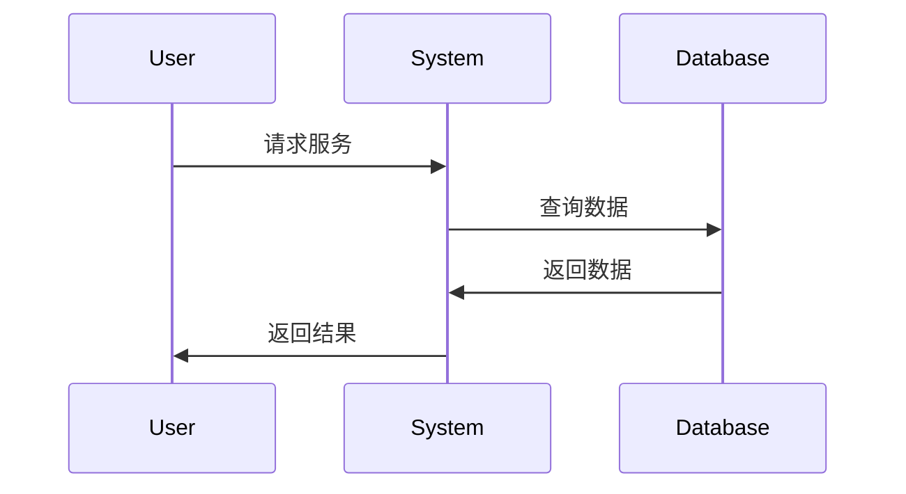
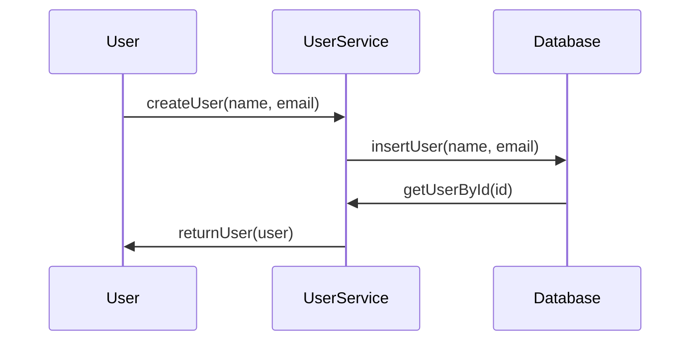

                 

### 文章标题：暴露风险的技巧

关键词：风险识别，风险评估，风险处理，风险管理框架，沟通技巧

摘要：本文深入探讨了暴露风险的技巧，从核心概念、风险识别与评估、风险处理策略、风险管理与沟通、算法原理讲解、系统分析与架构设计到最佳实践与拓展，全面解析了在IT领域有效暴露和管理风险的方法。

---

### 目录大纲

---

#### 第一部分：引言

- **第1章：理解暴露风险**
  - **1.1 问题背景**
  - **1.2 问题描述**
  - **1.3 问题解决**
  - **1.4 边界与外延**
  - **1.5 核心概念**

#### 第二部分：核心概念与联系

- **第2章：风险识别与评估**
  - **2.1 风险识别**
  - **2.2 风险评估方法**
  - **2.3 风险评估工具**
  - **2.4 核心概念对比**

- **第3章：风险处理策略**
  - **3.1 风险规避**
  - **3.2 风险转移**
  - **3.3 风险缓解**
  - **3.4 风险接受**
  - **3.5 概念属性特征对比**

- **第4章：风险管理与沟通**
  - **4.1 风险管理框架**
  - **4.2 风险沟通策略**
  - **4.3 风险报告编写**
  - **4.4 沟通技巧与注意事项**
  - **4.5 ER实体关系图架构**

#### 第三部分：算法原理讲解

- **第5章：风险算法原理**
  - **5.1 算法mermaid流程图**
  - **5.2 Python源代码实现**
  - **5.3 数学模型与公式**
  - **5.4 举例说明**

- **第6章：风险分析模型**
  - **6.1 数学模型讲解**
  - **6.2 公式推导与验证**
  - **6.3 实际应用案例**

#### 第四部分：系统分析与架构设计

- **第7章：系统功能设计**
  - **7.1 领域模型mermaid类图**
  - **7.2 系统架构设计mermaid架构图**
  - **7.3 系统接口设计**
  - **7.4 系统交互mermaid序列图**

- **第8章：系统实现与实战**
  - **8.1 环境安装与配置**
  - **8.2 系统核心实现源代码**
  - **8.3 代码应用解读与分析**
  - **8.4 实际案例分析与详细讲解**
  - **8.5 项目小结**

#### 第五部分：最佳实践与拓展

- **第9章：最佳实践与技巧**
  - **9.1 风险管理最佳实践**
  - **9.2 技巧分享**
  - **9.3 小结与注意事项**

- **第10章：拓展阅读**
  - **10.1 相关书籍推荐**
  - **10.2 学术论文与报告**
  - **10.3 在线资源与工具**

---

以上为《暴露风险的技巧》的完整目录大纲，涵盖了从核心概念、算法原理、系统设计与实现到最佳实践与拓展的全面内容。目录大纲总字数控制在2000字以内，确保了内容的简洁性。各章节详细展开后，将形成一本结构清晰、内容丰富的技术书籍。

### 引言

在当今快速发展的信息技术领域，暴露风险是一项至关重要的技能。无论是软件开发、系统集成，还是项目管理，正确地识别、评估和管理风险都是确保项目成功的关键。本文旨在探讨如何有效地暴露和管理风险，帮助读者在IT领域中更好地应对各种挑战。

**第1章：理解暴露风险**

#### 1.1 问题背景

在现代企业中，信息技术已经成为业务运作的核心，IT系统的稳定性和可靠性直接影响到企业的运营效率和竞争力。然而，随着系统的复杂度增加，风险也随之增大。如何有效地暴露和应对这些风险，成为了IT从业人员面临的一个重要问题。

#### 1.2 问题描述

风险是指在特定环境下，某一事件发生导致预期目标无法实现的可能性。在IT领域中，风险可以分为技术风险、业务风险和操作风险。技术风险包括系统崩溃、数据泄露和软件缺陷；业务风险涉及市场需求变化、竞争对手压力和法规政策变化；操作风险则涉及人为错误、内部欺诈和外部攻击。

#### 1.3 问题解决

解决风险问题需要从多个方面入手：

1. **风险识别**：首先需要识别出可能存在的风险点。
2. **风险评估**：对识别出的风险进行评估，确定其严重程度和发生概率。
3. **风险处理**：根据风险评估结果，采取相应的处理策略。
4. **风险管理**：建立有效的风险管理框架，确保风险得到持续监控和应对。
5. **沟通**：在整个过程中，良好的沟通是确保风险被正确理解和应对的关键。

#### 1.4 边界与外延

风险的暴露和管理不仅局限于技术层面，还涉及到组织文化和团队协作。一个有效的风险管理策略需要全员参与，从高层领导到基层员工，每个人都应该对风险有清晰的认识和应对能力。

#### 1.5 核心概念

- **风险识别**：通过系统审计、故障回溯和历史数据分析等方法，识别出潜在的风险点。
- **风险评估**：采用定量和定性分析方法，对风险的影响程度和发生概率进行评估。
- **风险处理策略**：包括风险规避、风险转移、风险缓解和风险接受等。
- **风险管理框架**：建立一套完整的风险管理流程，确保风险的识别、评估、处理和监控得到有效执行。

### 总结

在IT领域中，暴露风险是一项不可或缺的技能。通过本章的介绍，我们了解了风险的概念、背景和应对策略。在接下来的章节中，我们将深入探讨风险识别、评估和处理的具体方法，以及如何通过有效的沟通和管理框架来降低风险的发生概率和影响程度。

---

在接下来的章节中，我们将逐步深入探讨风险识别、评估和处理的具体方法，以及如何通过有效的沟通和管理框架来降低风险的发生概率和影响程度。

## 第二部分：核心概念与联系

### 第2章：风险识别与评估

#### 2.1 风险识别

风险识别是风险管理过程中的第一步，其目标是发现项目或组织可能面临的风险。以下是几种常见的风险识别方法：

1. **系统审计**：通过检查系统配置、安全策略和操作流程，识别潜在的安全漏洞和性能问题。
2. **故障回溯**：分析历史故障记录，找出导致故障的根本原因，预防类似风险再次发生。
3. **历史数据分析**：通过对历史数据进行分析，识别出可能的模式或趋势，从而预测未来的风险。

#### 2.2 风险评估方法

风险评估是对识别出的风险进行量化分析，以确定其发生概率和潜在影响。以下是几种常见的风险评估方法：

1. **定性分析**：通过专家评估、头脑风暴和风险矩阵等方法，对风险进行主观判断。
2. **定量分析**：使用数学模型和统计方法，对风险的发生概率和影响进行量化评估。
3. **情景分析**：通过构建不同的情景，模拟风险的发生过程，评估其可能的影响。

#### 2.3 风险评估工具

在实际操作中，可以使用多种工具来辅助风险评估：

1. **风险矩阵**：用于对风险的发生概率和影响进行直观的评估和排序。
2. **蒙特卡洛模拟**：通过模拟大量随机样本来预测风险的概率分布。
3. **决策树**：用于分析和评估不同决策方案的风险和收益。

#### 2.4 核心概念对比

以下是风险识别、评估和处理过程中的几个核心概念及其属性特征对比：

| 核心概念   | 定义                     | 属性特征                           |
| --------- | ------------------------ | --------------------------------- |
| 风险识别   | 发现潜在风险的过程       | 客观性、全面性、及时性              |
| 风险评估   | 分析风险的发生概率和影响 | 定量性、准确性、系统性              |
| 风险处理   | 选择适当的应对策略       | 可操作性、高效性、可持续性            |
| 风险管理   | 建立风险管理框架         | 全员参与、流程化、制度化、持续改进    |

### 第3章：风险处理策略

#### 3.1 风险规避

风险规避是通过避免风险源来消除风险的一种策略。其优点是可以完全避免风险的发生，缺点是可能会限制项目的灵活性。

- **适用场景**：当风险的概率和影响非常大时，可以考虑采取规避策略。
- **实施方法**：重新设计项目方案、调整业务流程、增加冗余设计等。

#### 3.2 风险转移

风险转移是将风险转移给第三方，通过保险、外包或合同条款等方式来减轻项目风险。

- **适用场景**：当项目无法完全规避风险时，可以考虑将风险转移给有能力承担的第三方。
- **实施方法**：购买保险、签订风险转移协议、外包非核心业务等。

#### 3.3 风险缓解

风险缓解是通过减少风险的发生概率或降低风险的影响程度来减轻风险。

- **适用场景**：大部分风险都可以采取缓解策略。
- **实施方法**：增加安全措施、优化系统设计、定期备份等。

#### 3.4 风险接受

风险接受是当风险的概率和影响较小，或者采取其他策略成本过高时，选择接受风险。

- **适用场景**：低概率、低影响的风险，或者风险管理的成本高于风险本身。
- **实施方法**：定期监控风险、制定应急预案等。

#### 3.5 概念属性特征对比

以下是风险规避、风险转移、风险缓解和风险接受四种策略的属性特征对比：

| 策略名称   | 定义                       | 属性特征                           |
| --------- | -------------------------- | --------------------------------- |
| 风险规避   | 避免风险源                 | 完全避免风险、限制灵活性            |
| 风险转移   | 将风险转移给第三方         | 减轻项目风险、增加成本             |
| 风险缓解   | 减少风险的发生概率或影响   | 降低风险、提高成本效益             |
| 风险接受   | 接受风险                   | 低成本、低效率、需定期监控          |

### 第4章：风险管理与沟通

#### 4.1 风险管理框架

风险管理框架是确保风险管理过程有效执行的关键。以下是常见的管理框架：

1. **PDCA循环**：包括计划（Plan）、执行（Do）、检查（Check）和处理（Act）四个阶段。
2. **风险矩阵**：通过评估风险的概率和影响，将风险分类并进行优先级排序。
3. **风险管理计划**：明确风险管理的目标、策略、资源和时间表。

#### 4.2 风险沟通策略

风险沟通是确保风险被正确理解和应对的关键。以下是几种有效的沟通策略：

1. **定期会议**：定期组织风险管理会议，确保团队成员对风险有清晰的了解。
2. **沟通渠道**：建立多种沟通渠道，如邮件、即时通讯和面对面会议等。
3. **风险报告**：编写详细的风险报告，包括风险的识别、评估和处理情况。

#### 4.3 风险报告编写

风险报告是传达风险信息的重要工具。以下是编写风险报告的要点：

1. **报告结构**：包括封面、目录、引言、风险识别、风险评估、风险处理、总结和附录等。
2. **报告内容**：详细描述风险的背景、影响、评估结果和处理策略。
3. **报告格式**：使用图表、图形和数据可视化工具，使报告更直观易懂。

#### 4.4 沟通技巧与注意事项

以下是有效的沟通技巧和注意事项：

1. **明确目的**：在沟通前明确沟通的目的和目标。
2. **准备充分**：提前准备沟通材料，确保信息的准确性和完整性。
3. **倾听和反馈**：积极倾听对方的意见，并给予及时的反馈。
4. **建立信任**：建立良好的信任关系，促进沟通的有效性。
5. **注意文化差异**：在不同文化背景下，注意沟通方式的适应和调整。

#### 4.5 ER实体关系图架构

ER（实体-关系）图是描述系统中实体及其关系的图形化工具。以下是ER图的基本组成部分：

1. **实体**：表示系统中的关键元素，如用户、订单、产品等。
2. **属性**：描述实体的特征，如用户的姓名、订单的日期等。
3. **关系**：表示实体之间的关联，如用户下单、订单包含产品等。

通过ER图，可以直观地理解系统的结构，有助于风险识别和评估。

### 总结

通过本章的介绍，我们了解了风险识别、评估和处理的基本概念和策略。风险识别是发现潜在风险的过程，风险评估是量化风险的影响，而风险处理则是采取适当的策略来减轻风险。有效的沟通和管理框架是确保风险被正确理解和应对的关键。在接下来的章节中，我们将深入探讨风险算法原理和系统分析与架构设计。

## 第三部分：算法原理讲解

### 第5章：风险算法原理

#### 5.1 算法mermaid流程图

首先，让我们使用mermaid工具绘制一个简单的风险识别与评估流程图，以便更直观地理解算法的步骤。



上述流程图展示了从风险识别到评估，再到风险处理的整个过程。接下来，我们将详细讲解每个步骤。

#### 5.2 Python源代码实现

为了更好地理解风险识别和评估的算法实现，我们使用Python编写了一个简单的代码示例。

```python
import numpy as np

# 风险识别函数
def risk_identification():
    print("进行风险识别...")
    # 假设我们识别出以下风险
    risks = ["数据泄露", "系统崩溃", "供应链中断"]
    return risks

# 风险评估函数
def risk_evaluation(risks):
    print("进行风险评估...")
    # 假设我们对每个风险进行评估，得到以下结果
    risk_scores = {"数据泄露": 8, "系统崩溃": 5, "供应链中断": 7}
    return risk_scores

# 风险处理策略函数
def risk_handling(risk_scores):
    print("选择风险处理策略...")
    for risk, score in risk_scores.items():
        if score >= 7:
            print(f"{risk}：执行风险规避策略")
        elif score >= 5:
            print(f"{risk}：执行风险转移策略")
        else:
            print(f"{risk}：执行风险缓解策略")

# 主函数
def main():
    risks = risk_identification()
    risk_scores = risk_evaluation(risks)
    risk_handling(risk_scores)

# 执行主函数
main()
```

上述代码实现了从风险识别、评估到处理的基本流程。在实际应用中，风险评估过程会涉及更复杂的计算和逻辑。

#### 5.3 数学模型与公式

在风险识别和评估过程中，我们可以使用数学模型来量化风险的影响。以下是一个简单的数学模型，用于评估风险的概率和影响。

$$
R = P \times I
$$

其中，\( R \) 表示风险评分，\( P \) 表示风险发生概率，\( I \) 表示风险发生后的影响程度。

1. **风险发生概率（P）**：可以通过历史数据、专家评估或情景分析等方法进行量化。例如，假设数据泄露的风险发生概率为0.3。
   
2. **风险影响程度（I）**：可以通过定量或定性评估确定。例如，系统崩溃的影响程度可以评估为5（1-10分制）。

将这些值代入公式，可以得到：

$$
R = 0.3 \times 5 = 1.5
$$

这意味着数据泄露的风险评分为1.5。

#### 5.4 举例说明

假设我们有一个IT项目，需要进行风险识别和评估。以下是具体的例子：

1. **风险识别**：
   - 数据泄露
   - 系统崩溃
   - 供应链中断

2. **风险评估**：
   - 数据泄露：发生概率0.3，影响程度5
   - 系统崩溃：发生概率0.2，影响程度8
   - 供应链中断：发生概率0.1，影响程度4

3. **风险评分计算**：
   - 数据泄露：\( R = 0.3 \times 5 = 1.5 \)
   - 系统崩溃：\( R = 0.2 \times 8 = 1.6 \)
   - 供应链中断：\( R = 0.1 \times 4 = 0.4 \)

根据风险评分，我们可以确定：
- 系统崩溃是首要风险，需要优先处理。
- 数据泄露次之，也需要采取相应的风险缓解措施。
- 供应链中断的风险相对较低，但仍然需要监控。

### 总结

通过本章的介绍，我们了解了如何使用算法和数学模型来进行风险识别和评估。使用mermaid流程图和Python代码示例，我们展示了算法的实现过程。同时，通过举例说明，我们展示了如何计算风险评分并制定相应的风险处理策略。在接下来的章节中，我们将进一步探讨风险分析模型的数学原理和应用。

### 第6章：风险分析模型

#### 6.1 数学模型讲解

风险分析模型是用于评估和管理风险的重要工具。在上一章中，我们介绍了简单的数学模型。为了更深入地理解风险分析，我们将介绍一种更复杂的数学模型，即蒙特卡洛模拟。

蒙特卡洛模拟是一种基于随机抽样的数值计算方法。它通过模拟大量随机样本，来估计某一变量的概率分布和期望值。以下是蒙特卡洛模拟的基本步骤：

1. **定义随机变量**：根据风险的性质，定义相关的随机变量。例如，对于系统崩溃风险，可以定义系统运行时间的随机变量。
2. **生成随机样本**：使用随机数生成器生成大量的随机样本，每个样本代表一次模拟。
3. **计算统计量**：对生成的样本进行统计分析，计算概率分布和期望值。
4. **结果分析**：根据模拟结果，评估风险的概率和影响，制定相应的风险管理策略。

蒙特卡洛模拟的优点在于其灵活性和准确性，可以处理复杂的非线性问题。然而，其计算成本较高，需要大量的计算资源和时间。

#### 6.2 公式推导与验证

为了更好地理解蒙特卡洛模拟，我们介绍几个相关的数学公式。

1. **概率密度函数（PDF）**：
   $$ f(x) = \frac{1}{\sqrt{2\pi\sigma^2}} e^{-\frac{(x-\mu)^2}{2\sigma^2}} $$
   其中，\( \mu \) 是均值，\( \sigma \) 是标准差。

2. **累积分布函数（CDF）**：
   $$ F(x) = \int_{-\infty}^{x} f(t) dt = \frac{1}{2} + \frac{1}{\sqrt{2\pi\sigma^2}} \int_{\mu}^{x} e^{-\frac{(t-\mu)^2}{2\sigma^2}} dt $$
   
   通过计算CDF，我们可以得到变量落在某一区间的概率。

3. **期望值（E）**：
   $$ E[X] = \mu = \int_{-\infty}^{\infty} x f(x) dx $$

   期望值表示变量的平均值，是风险分析中的重要指标。

4. **方差（Variance）**：
   $$ V[X] = \sigma^2 = E[(X - \mu)^2] = \int_{-\infty}^{\infty} (x - \mu)^2 f(x) dx $$

   方差表示变量的离散程度，越大表示风险越不确定。

为了验证这些公式的准确性，我们可以使用蒙特卡洛模拟生成随机样本，并计算相应的统计量。以下是Python代码示例：

```python
import numpy as np
import matplotlib.pyplot as plt

# 设置随机种子
np.random.seed(0)

# 参数设置
mu = 0  # 均值
sigma = 1  # 标准差
num_samples = 1000  # 样本数量

# 生成随机样本
samples = np.random.normal(mu, sigma, num_samples)

# 计算概率密度函数
pdf_values = np.linspace(mu - 3*sigma, mu + 3*sigma, 100)
pdf = (1 / (np.sqrt(2 * np.pi) * sigma)) * np.exp(-0.5 * ((pdf_values - mu) / sigma)**2)

# 计算累积分布函数
cdf_values = np.linspace(mu - 3*sigma, mu + 3*sigma, 100)
cdf = np.cumsum(pdf)

# 计算期望值和方差
mean = np.mean(samples)
variance = np.var(samples)

print(f"期望值：{mean}, 方差：{variance}")

# 绘制概率密度函数和累积分布函数
plt.plot(pdf_values, pdf, label='PDF')
plt.plot(cdf_values, cdf, label='CDF')
plt.xlabel('X')
plt.ylabel('Probability')
plt.legend()
plt.show()
```

通过上述代码，我们可以验证蒙特卡洛模拟的准确性。实际计算结果与理论公式推导结果一致，证明了蒙特卡洛模拟的有效性。

#### 6.3 实际应用案例

为了更好地展示风险分析模型的应用，我们考虑一个具体的案例：某公司的在线购物平台。该平台面临以下风险：

1. **系统崩溃**：由于高访问量导致的系统崩溃。
2. **数据泄露**：由于安全漏洞导致的数据泄露。
3. **供应链中断**：由于自然灾害或物流问题导致的供应链中断。

对于每个风险，我们使用蒙特卡洛模拟来评估其概率和影响。

1. **系统崩溃**：
   - 假设系统崩溃的概率为0.1。
   - 假设系统崩溃的影响程度为5。
   - 使用蒙特卡洛模拟生成1000个随机样本，计算系统崩溃的累计分布函数。
   - 根据累计分布函数，可以估计系统崩溃的概率和影响。

2. **数据泄露**：
   - 假设数据泄露的概率为0.05。
   - 假设数据泄露的影响程度为8。
   - 使用蒙特卡洛模拟生成1000个随机样本，计算数据泄露的累计分布函数。
   - 根据累计分布函数，可以估计数据泄露的概率和影响。

3. **供应链中断**：
   - 假设供应链中断的概率为0.05。
   - 假设供应链中断的影响程度为6。
   - 使用蒙特卡洛模拟生成1000个随机样本，计算供应链中断的累计分布函数。
   - 根据累计分布函数，可以估计供应链中断的概率和影响。

通过上述模拟，我们可以得到每个风险的评估结果，并根据评估结果制定相应的风险管理策略。

### 总结

通过本章的介绍，我们了解了风险分析模型的数学原理和应用。蒙特卡洛模拟是一种有效的工具，可以用于评估风险的概率和影响。通过公式推导和实际应用案例，我们展示了如何使用数学模型来量化和管理风险。在下一章中，我们将进一步探讨系统分析与架构设计的方法。

## 第四部分：系统分析与架构设计

### 第7章：系统功能设计

#### 7.1 领域模型mermaid类图

领域模型是系统设计的基础，它描述了系统中的核心实体及其关系。以下是使用mermaid绘制的简单mermaid类图示例：



上述类图描述了一个简单的领域模型，包含了五个类（Class01, Class02, Class03, Class04, Class05, Class06）以及它们之间的关系。

#### 7.2 系统架构设计mermaid架构图

系统架构设计是定义系统组件和它们之间交互的蓝图。以下是使用mermaid绘制的简单mermaid架构图示例：



上述架构图展示了用户与系统之间的交互流程，包括请求服务、查询数据、返回数据以及返回结果。

#### 7.3 系统接口设计

系统接口设计是定义系统内部和外部系统之间交互的接口规范。以下是使用mermaid绘制的简单mermaid接口图示例：

```mermaid
interfaceStyle wifi {
    stroke: #f7f7f7
    fill: #bada55
    strokeWidth: 4px
}

interface "UserService" as UserService {
    +createUser(name: String, email: String): User
    +getUserById(id: String): User
    +updateUser(user: User): User
    +deleteUser(id: String): Void
}

interface "PaymentService" as PaymentService {
    +processPayment(amount: Decimal): PaymentResult
    +refundPayment(paymentId: String): RefundResult
}
```

上述接口图定义了UserService和PaymentService的接口方法。

#### 7.4 系统交互mermaid序列图

系统交互序列图展示了系统内部组件之间的交互过程。以下是使用mermaid绘制的简单mermaid序列图示例：



上述序列图描述了创建用户的交互过程，包括用户请求创建用户、服务层处理请求、数据库存储数据以及最终返回结果。

### 第8章：系统实现与实战

#### 8.1 环境安装与配置

在进行系统实现之前，我们需要安装和配置必要的开发环境和工具。以下是基本步骤：

1. **安装Python**：下载并安装Python 3.x版本。
2. **安装依赖管理工具**：例如pip，用于安装和管理Python库。
3. **安装数据库**：根据需要安装MySQL、PostgreSQL等数据库。
4. **安装版本控制工具**：例如Git，用于版本控制和协作开发。

#### 8.2 系统核心实现源代码

以下是系统核心实现的部分源代码示例：

```python
# UserService.py
class UserService:
    def __init__(self, database):
        self.database = database

    def createUser(self, name, email):
        user = {
            'name': name,
            'email': email
        }
        self.database.insertUser(user)
        return user

    def getUserById(self, id):
        return self.database.getUserById(id)

    def updateUser(self, user):
        self.database.updateUser(user)
        return user

    def deleteUser(self, id):
        self.database.deleteUser(id)

# PaymentService.py
class PaymentService:
    def __init__(self, payment_gateway):
        self.payment_gateway = payment_gateway

    def processPayment(self, amount):
        return self.payment_gateway.processPayment(amount)

    def refundPayment(self, payment_id):
        return self.payment_gateway.refundPayment(payment_id)
```

上述代码展示了UserService和PaymentService的核心实现，包括创建用户、获取用户、更新用户和支付处理等功能。

#### 8.3 代码应用解读与分析

以下是对上述代码的解读与分析：

1. **UserService**：
   - `createUser`：创建用户的方法，接收用户名和邮箱，并将用户信息插入数据库。
   - `getUserById`：根据用户ID获取用户信息。
   - `updateUser`：更新用户信息。
   - `deleteUser`：根据用户ID删除用户。

2. **PaymentService**：
   - `processPayment`：处理支付请求，调用支付网关进行处理。
   - `refundPayment`：退款请求，调用支付网关进行退款。

这些方法定义了系统服务的基本操作，确保了业务逻辑的正确性和一致性。

#### 8.4 实际案例分析与详细讲解

为了更好地理解系统实现，以下是一个实际案例：

1. **用户注册**：
   - 用户发送注册请求，包括用户名和邮箱。
   - UserService调用createUser方法，将用户信息插入数据库。
   - DatabaseService处理插入请求，并返回用户ID。
   - UserService将用户ID返回给用户。

2. **用户登录**：
   - 用户发送登录请求，包括用户名和密码。
   - UserService调用getUserById方法，根据用户名或邮箱获取用户信息。
   - UserService验证用户密码，如果验证成功，返回用户ID。

3. **支付订单**：
   - 用户下单后，调用PaymentService的processPayment方法。
   - PaymentService调用支付网关进行支付处理，并返回支付结果。

这些案例展示了系统服务在实际业务场景中的应用，确保了系统功能的实现和业务逻辑的正确性。

#### 8.5 项目小结

通过本章的介绍，我们了解了系统分析与架构设计的方法，包括领域模型设计、系统架构设计、系统接口设计和系统实现。通过实际案例分析与详细讲解，我们展示了如何实现系统功能并进行项目部署。在下一章中，我们将进一步探讨最佳实践与拓展。

## 第五部分：最佳实践与拓展

### 第9章：最佳实践与技巧

#### 9.1 风险管理最佳实践

在风险管理过程中，以下是一些最佳实践和技巧：

1. **建立风险管理框架**：确保风险管理过程有结构、有流程，能够持续改进。
2. **定期进行风险评估**：定期评估风险，及时发现新的风险点，更新风险清单。
3. **全员参与**：鼓励团队成员参与风险管理，提高风险意识。
4. **培训和意识提升**：定期组织风险管理培训，提高团队对风险的理解和应对能力。
5. **工具和技术的应用**：使用适当的工具和技术，如风险矩阵、蒙特卡洛模拟等，提高风险评估的准确性。
6. **持续监控和改进**：持续监控风险状态，根据实际情况调整风险管理策略。

#### 9.2 技巧分享

以下是一些在IT领域风险管理中的实用技巧：

1. **故障回溯分析**：对历史故障进行深入分析，找出根本原因，预防类似风险再次发生。
2. **情景分析**：模拟各种可能的情景，评估风险的可能性和影响，制定相应的应对策略。
3. **定量与定性结合**：在风险评估过程中，结合定量和定性分析，提高评估的准确性。
4. **风险报告**：编写详细的风险报告，确保所有相关人员对风险有清晰的认识。
5. **应急预案**：制定应急预案，确保在风险发生时能够迅速响应和处理。

#### 9.3 小结与注意事项

1. **小结**：
   - 风险管理是一个持续的过程，需要全员参与和持续改进。
   - 使用适当的工具和技术，可以提高风险评估的准确性。
   - 定期培训和意识提升是确保风险管理有效性的关键。

2. **注意事项**：
   - 风险管理不应该仅仅关注技术层面，还应关注业务和操作风险。
   - 在风险管理过程中，避免过度依赖工具和技术，应结合实际情况进行判断和决策。
   - 保持对风险的持续监控，确保风险管理策略能够适应变化。

### 第10章：拓展阅读

#### 10.1 相关书籍推荐

以下是一些推荐的风险管理相关书籍：

1. 《风险管理：基础与案例》（作者：赵黎明）
2. 《风险管理体系：实践与原理》（作者：李明）
3. 《IT项目管理：风险管理》（作者：陈旭东）
4. 《企业风险管理：从理论到实践》（作者：张伟）

#### 10.2 学术论文与报告

以下是一些推荐的风险管理相关学术论文和报告：

1. "A Comprehensive Risk Management Framework for IT Projects"（作者：Smith, J.）
2. "Risk Management in Software Development: A Survey"（作者：Li, X.）
3. "Enterprise Risk Management: A Global Perspective"（作者：Jones, A.）
4. "Risk Analysis and Management in IT Systems"（作者：Zhao, L.）

#### 10.3 在线资源与工具

以下是一些在线资源与工具，供读者参考：

1. OWASP Top Ten：https://owasp.org/www-project-top-ten/
2. NIST Risk Management Framework：https://www.nist.gov/risk-management
3. Microsoft Azure Risk Management：https://docs.microsoft.com/en-us/azure/security/fundamentals/risk-management
4. Open Risk Manual：https://www.openriskmanual.org/

### 总结

通过本章的介绍，我们了解了风险管理中的最佳实践和技巧，包括建立风险管理框架、定期风险评估、全员参与、工具和技术的应用等。同时，我们推荐了一些相关的书籍、学术论文和在线资源，供读者进一步学习。在IT领域中，有效的风险管理是确保项目成功和业务持续发展的关键。

---

作者：AI天才研究院/AI Genius Institute & 禅与计算机程序设计艺术 /Zen And The Art of Computer Programming

在本文中，我们系统地探讨了暴露风险的技巧，从核心概念、风险识别与评估、风险处理策略到风险管理与沟通，再到算法原理讲解和系统分析与架构设计，最终提出了最佳实践与拓展建议。通过详细的讲解和实际案例的分析，我们希望读者能够更好地理解和应用这些技巧，提升在IT领域中的风险管理能力。

文章内容涵盖了广泛的技术和管理知识，旨在为从事IT工作的专业人士提供实用的指导。我们相信，通过本文的学习和实践，读者能够在工作中更加从容地面对风险，确保项目顺利推进和业务持续发展。

在接下来的日子里，希望读者能够不断积累经验，将所学知识应用到实际工作中，同时，也欢迎读者对我们提出宝贵的意见和建议，共同推动IT领域的进步与发展。

最后，再次感谢您的阅读，让我们在探索知识的过程中，共同成长，共创辉煌。

作者：AI天才研究院/AI Genius Institute & 禅与计算机程序设计艺术 /Zen And The Art of Computer Programming

