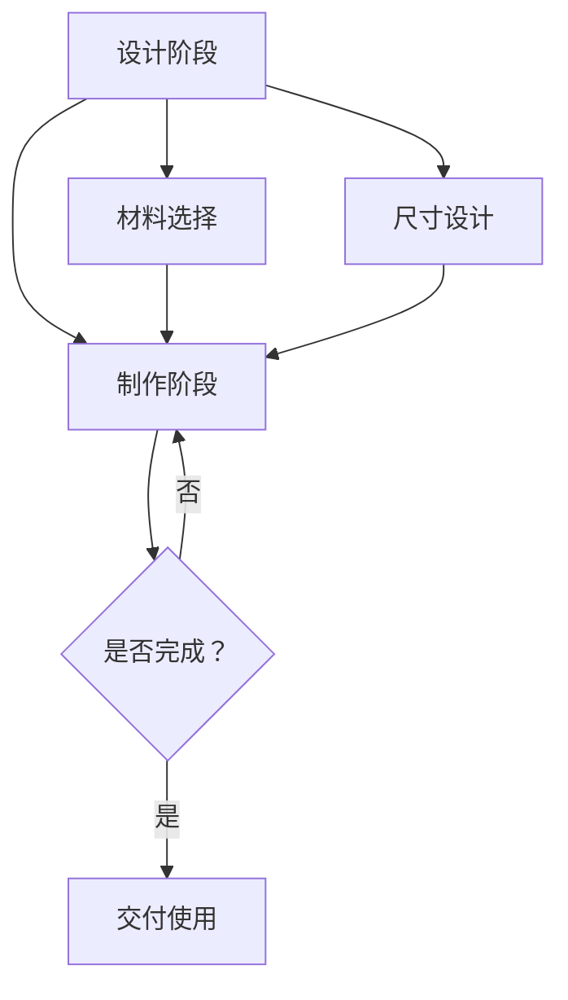

                 

### 木工DIY：亲手打造生活中的美好

#### 关键词：
木工DIY、手工制作、家具设计、工具使用、材料选择、生活质量提升

#### 摘要：
本文将探讨木工DIY的魅力，带领读者走进手工制作的乐趣世界。通过详细介绍木工DIY的基本概念、工具与材料、设计原理、实战项目、安全与环保措施，以及最佳实践技巧，读者将学会如何亲手打造生活中的美好，从而提升个人生活质量和家居品味。

----------------------------------------------------------------

### 目录大纲设计思路

在设计《木工DIY：亲手打造生活中的美好》的目录大纲时，我们将遵循以下步骤，确保大纲结构清晰、内容全面：

1. **背景介绍**：
   - 简述木工DIY的兴起背景，介绍木工DIY在生活中的作用和意义。
   - 引出本书的主题，即通过木工DIY提升生活质量。

2. **核心概念与联系**：
   - 定义和介绍木工DIY的基本概念，如工具、材料、设计等。
   - 通过表格和Mermaid ER图展示各概念之间的关系。

3. **工具与材料**：
   - 详细介绍木工DIY所需的基本工具和材料，分类讲解其特性和使用方法。

4. **设计原理**：
   - 讲解木工设计的基础知识，包括设计原则、实用技巧等。

5. **项目实战**：
   - 设计一系列实用的木工DIY项目，详细讲解每一步的制作过程。

6. **安全与环保**：
   - 强调木工DIY中的安全注意事项，介绍环保材料的使用。

7. **最佳实践**：
   - 提供实用的技巧和提示，帮助读者更好地进行木工DIY。

### 目录大纲

----------------------------------------------------------------

## 第一部分：木工DIY入门

### 第1章：木工DIY简介

## 1.1 木工DIY的兴起与发展
## 1.2 木工DIY的意义与作用
## 1.3 木工DIY的基本原则

### 第2章：木工DIY工具与材料

## 2.1 木工DIY工具介绍
### 2.1.1 常用工具
#### 2.1.1.1 钢尺
#### 2.1.1.2 线锤
#### 2.1.1.3 划线器
### 2.1.2 精密工具
#### 2.1.2.1 密度计
#### 2.1.2.2 砂轮机
#### 2.1.2.3 螺丝刀
### 2.1.3 电动工具
#### 2.1.3.1 电钻
#### 2.1.3.2 电磨机
#### 2.1.3.3 电圆锯

## 2.2 木工DIY材料介绍
### 2.2.1 常用木材
#### 2.2.1.1 松木
#### 2.2.1.2 桦木
#### 2.2.1.2 橡木
### 2.2.2 其他材料
#### 2.2.2.1 人造板
#### 2.2.2.2 塑料板
#### 2.2.2.3 金属板材

## 第二部分：木工DIY设计原理

### 第3章：木工设计基础

## 3.1 木工设计的原则
## 3.2 设计工具与软件
## 3.3 设计实用技巧

### 第4章：木工DIY项目实战

## 4.1 实用家具制作
### 4.1.1 沙发椅
#### 4.1.1.1 设计思路
#### 4.1.1.2 制作步骤
### 4.1.2 桌子
#### 4.1.2.1 设计思路
#### 4.1.2.2 制作步骤
### 4.1.3 柜子
#### 4.1.3.1 设计思路
#### 4.1.3.2 制作步骤

## 4.2 装饰品制作
### 4.2.1 画作框架
#### 4.2.1.1 设计思路
#### 4.2.1.2 制作步骤
### 4.2.2 花瓶
#### 4.2.2.1 设计思路
#### 4.2.2.2 制作步骤
### 4.2.3 伞架
#### 4.2.3.1 设计思路
#### 4.2.3.2 制作步骤

## 第三部分：木工DIY安全与环保

### 第5章：木工DIY安全指南

## 5.1 安全操作规程
## 5.2 应急处理
## 5.3 安全工具的选择

### 第6章：环保木工DIY

## 6.1 环保材料的选择
## 6.2 减少浪费的措施
## 6.3 可持续木工DIY实践

## 第四部分：木工DIY最佳实践

### 第7章：木工DIY技巧与提示

## 7.1 提升效率的技巧
## 7.2 精细加工的技巧
## 7.3 创意设计的小窍门

### 第8章：木工DIY项目展示

## 8.1 成功案例分析
## 8.2 创意项目展示
## 8.3 项目评估与改进

## 第9章：木工DIY展望

## 9.1 木工DIY的未来趋势
## 9.2 新技术对木工DIY的影响
## 9.3 木工DIY的社区与网络

----------------------------------------------------------------

通过以上大纲，读者可以系统地了解木工DIY的各个方面，从基础工具与材料的选择到实际项目的制作，再到安全和环保的注意事项，最终达到提升生活品质的目的。目录大纲总字数控制在2000字以内，确保简洁明了。

----------------------------------------------------------------

### 第一部分：木工DIY入门

#### 第1章：木工DIY简介

**1.1 木工DIY的兴起与发展**

木工DIY作为一种手工活动，其历史可以追溯到远古时期，那时人类就开始利用木材制作各种工具和生活用品。然而，现代木工DIY的兴起主要得益于以下几个方面：

1. **科技进步**：随着科技的不断进步，木工工具和材料得到了极大的改进。现代化的电动工具和自动化设备使得木工DIY变得更加高效和便捷。
2. **环保意识**：人们越来越意识到环保的重要性，DIY成为了一种绿色生活方式的体现。使用环保材料进行木工制作，不仅有助于减少资源消耗，还能减少对环境的污染。
3. **个性需求**：现代社会中，人们越来越追求个性化和独特性。DIY使得每个人都可以根据自己的需求和喜好，设计和打造出独一无二的作品。

**1.2 木工DIY的意义与作用**

木工DIY不仅仅是一种兴趣爱好，它在我们的生活中有着重要的意义和作用：

1. **提高生活质量**：通过木工DIY，我们可以亲手打造出实用的家具和装饰品，改善家居环境，提升生活质量。
2. **培养动手能力**：木工DIY需要动手操作，通过实践，可以锻炼我们的动手能力和解决问题的能力。
3. **增强成就感**：完成一个木工项目，尤其是复杂的项目，会给我们带来巨大的成就感和满足感。

**1.3 木工DIY的基本原则**

在进行木工DIY时，有一些基本原则需要我们遵循：

1. **安全第一**：无论进行何种木工活动，安全都是最重要的。使用工具时要注意安全，佩戴防护装备，避免发生意外伤害。
2. **精确度**：木工DIY要求精确度较高，尤其是在切割和组装时，精确度会影响最终的效果。使用合适的工具和设备可以提高精确度。
3. **设计先行**：在设计阶段要充分考虑实用性和美观性，一个好的设计可以大大提高DIY项目的成功率和满意度。

#### 第2章：木工DIY工具与材料

**2.1 木工DIY工具介绍**

木工DIY所需的工具可以分为以下几类：

1. **常用工具**：
   - **钢尺**：用于测量木材的尺寸，确保切割和组装的精确度。
   - **线锤**：用于敲打钉子或钉子固定，防止木材破损。
   - **划线器**：用于在木材上划线，确保切割的直线度。

2. **精密工具**：
   - **密度计**：用于测量木材的密度，帮助选择适合的材料。
   - **砂轮机**：用于打磨木材表面，使其光滑。
   - **螺丝刀**：用于拧紧螺丝，连接木材零件。

3. **电动工具**：
   - **电钻**：用于打孔和拧紧螺丝，大大提高工作效率。
   - **电磨机**：用于打磨木材表面，使其光滑。
   - **电圆锯**：用于切割木材，可以精确控制切割角度。

**2.2 木工DIY材料介绍**

木工DIY常用的材料包括以下几种：

1. **常用木材**：
   - **松木**：质地较软，易于加工，适合初学者使用。
   - **桦木**：质地坚硬，耐磨损，适合制作家具。
   - **橡木**：质地坚韧，适合制作大型家具。

2. **其他材料**：
   - **人造板**：如刨花板、纤维板，密度高，便于加工。
   - **塑料板**：耐腐蚀，轻便，适用于户外装饰。
   - **金属板材**：如铝板、不锈钢板，硬度高，适合与木材结合使用。

**2.3 木工DIY工具与材料的关系**

在木工DIY中，工具和材料是密不可分的。合适的工具可以更好地发挥材料的特点，而材料的选择也会影响工具的使用方法。例如，松木质地较软，适合使用电钻进行打孔；而桦木质地坚硬，则需要使用砂轮机进行打磨。通过合理搭配工具和材料，我们可以创造出更加优质的木工DIY作品。

----------------------------------------------------------------

### 第二部分：木工DIY设计原理

#### 第3章：木工设计基础

**3.1 木工设计的原则**

木工设计需要遵循以下原则：

1. **实用性**：设计首先要满足实用性，确保制作出的家具或装饰品能够实际使用。
2. **美观性**：设计要注重美观性，符合审美标准，提升家居品味。
3. **简洁性**：设计要简洁明了，避免过度装饰，保持功能性和美观性的平衡。
4. **可维护性**：设计时要考虑维修和保养的方便性，确保长时间使用后的可维护性。

**3.2 设计工具与软件**

进行木工设计，需要使用合适的工具和软件：

1. **手工工具**：
   - **模板**：用于绘制设计草图，帮助确定家具的尺寸和形状。
   - **画图板**：用于进行详细的图纸绘制，包括尺寸、角度和细节。

2. **计算机软件**：
   - **AutoCAD**：一款专业的计算机辅助设计软件，适用于复杂的二维和三维设计。
   - **SketchUp**：一款简单易用的三维建模软件，适合初学者进行设计。

**3.3 设计实用技巧**

在木工设计中，以下技巧可以帮助我们更好地进行创作：

1. **比例原则**：在设计过程中，要合理运用比例原则，确保整体设计协调一致。
2. **对称与平衡**：设计时要注重对称与平衡，避免单侧过重或过轻。
3. **线条运用**：线条的运用可以增强设计的动态感和视觉冲击力，合理运用线条可以使设计更加生动。
4. **色彩搭配**：色彩搭配要考虑整体效果，选择合适的色彩可以提升设计的视觉效果。

**3.4 木工设计案例解析**

为了更好地理解木工设计原则和实用技巧，我们通过一个简单的案例来进行分析：

**案例**：设计一张简易书桌。

1. **实用性**：书桌需要提供足够的桌面空间，方便放置书籍和电脑。
2. **美观性**：设计时要考虑线条简洁流畅，色彩搭配和谐。
3. **简洁性**：避免复杂的设计元素，简化结构。
4. **可维护性**：选择易于维修和清洁的材料。

通过以上原则，我们可以绘制出书桌的设计草图，并使用计算机软件进行三维建模，最终确定书桌的尺寸、形状和材料。

----------------------------------------------------------------

### 第三部分：木工DIY项目实战

#### 第4章：木工DIY项目实战

**4.1 实用家具制作**

**4.1.1 沙发椅**

**设计思路**：
沙发椅的设计应考虑舒适性、稳定性和美观性。我们可以选择简单的L形结构，采用柔软的布料和稳定的木质框架。

**制作步骤**：
1. **设计草图**：根据所需尺寸和设计风格，绘制沙发椅的草图。
2. **材料准备**：准备木质框架材料（如桦木）、布料和必要的工具。
3. **切割木材**：使用电圆锯切割出框架的各个部分。
4. **组装框架**：将切割好的木材部件组装成L形框架，使用螺丝和木螺钉固定。
5. **打磨表面**：使用砂轮机对框架表面进行打磨，确保光滑。
6. **安装布料**：将布料覆盖在框架表面，用钉子或胶水固定。
7. **最终检查**：检查沙发椅的结构稳定性和舒适度，进行必要的调整。

**4.1.2 桌子**

**设计思路**：
桌子的设计应考虑实用性和美观性。我们可以设计一张简单的矩形桌子，采用稳固的木质结构。

**制作步骤**：
1. **设计草图**：绘制桌子的草图，确定尺寸和形状。
2. **材料准备**：准备木质板材（如橡木）、工具等。
3. **切割木材**：使用电圆锯切割出桌子的各个部分（桌面、腿、支撑条等）。
4. **组装结构**：将切割好的木材部件组装成桌子的基本结构，使用螺丝和木螺钉固定。
5. **打磨表面**：对桌子的表面进行打磨，确保光滑。
6. **安装抽屉**：如果设计有抽屉，安装抽屉滑轨和抽屉。
7. **最终检查**：检查桌子的结构稳定性，确保所有部件都牢固连接。

**4.1.3 柜子**

**设计思路**：
柜子的设计应考虑储物空间、稳定性和美观性。我们可以设计一个简单的衣柜，采用木质框架和木板层板。

**制作步骤**：
1. **设计草图**：绘制衣柜的草图，确定尺寸和内部布局。
2. **材料准备**：准备木质框架材料（如桦木）、木板（如人造板）和工具等。
3. **切割木材**：使用电圆锯切割出框架的各个部分（顶部、底部、侧板、层板等）。
4. **组装框架**：将切割好的木材部件组装成柜子的基本框架，使用螺丝和木螺钉固定。
5. **安装层板**：在框架内部安装层板，使用螺丝固定。
6. **安装门**：安装衣柜的门，可以使用滑动门或开门。
7. **最终检查**：检查柜子的结构稳定性和储物空间的合理性，进行必要的调整。

**4.2 装饰品制作**

**4.2.1 画作框架**

**设计思路**：
画作框架的设计应考虑画作的尺寸、画作的风格和整体家居的协调性。我们可以设计一个简单的矩形框架，采用木质结构。

**制作步骤**：
1. **设计草图**：绘制画作框架的草图，确定尺寸和形状。
2. **材料准备**：准备木质板材（如橡木）、画框材料（如玻璃或亚克力）和工具等。
3. **切割木材**：使用电圆锯切割出框架的各个部分（前板、背板、侧板等）。
4. **组装框架**：将切割好的木材部件组装成框架，使用螺丝和木螺钉固定。
5. **安装画框**：将画框固定在框架内部，可以使用螺丝或胶水。
6. **打磨表面**：对框架表面进行打磨，确保光滑。
7. **最终检查**：检查框架的结构稳定性和视觉效果，进行必要的调整。

**4.2.2 花瓶**

**设计思路**：
花瓶的设计应考虑花瓶的形状、大小和与周围环境的协调性。我们可以设计一个简单的圆柱形花瓶，采用木质结构。

**制作步骤**：
1. **设计草图**：绘制花瓶的草图，确定尺寸和形状。
2. **材料准备**：准备木质板材（如松木）和工具等。
3. **切割木材**：使用电圆锯切割出花瓶的主体部分。
4. **打磨形状**：使用砂轮机将花瓶的表面打磨光滑，确保形状整齐。
5. **安装配件**：如果需要，安装装饰配件，如木纹贴纸或漆面。
6. **最终检查**：检查花瓶的结构稳定性和美观度，进行必要的调整。

**4.2.3 伞架**

**设计思路**：
伞架的设计应考虑伞的尺寸、稳定性和使用方便性。我们可以设计一个简单的折叠式伞架，采用木质结构。

**制作步骤**：
1. **设计草图**：绘制伞架的草图，确定尺寸和形状。
2. **材料准备**：准备木质板材（如松木）、连接件和工具等。
3. **切割木材**：使用电圆锯切割出伞架的各个部分（主架、支撑架、连接件等）。
4. **组装伞架**：将切割好的木材部件组装成伞架，使用螺丝和木螺钉固定。
5. **安装伞杆**：将伞杆固定在伞架的主架上，确保稳定性。
6. **打磨表面**：对伞架表面进行打磨，确保光滑。
7. **最终检查**：检查伞架的结构稳定性和使用方便性，进行必要的调整。

通过以上木工DIY项目实战的讲解，读者可以了解到从设计到制作的完整过程，掌握实用的木工技能，亲手打造出生活中美好的家具和装饰品。

----------------------------------------------------------------

### 第四部分：木工DIY安全与环保

#### 第5章：木工DIY安全指南

**5.1 安全操作规程**

在进行木工DIY时，安全操作规程是至关重要的。以下是一些基本的安全操作规程：

1. **穿戴防护装备**：在进行木工活动时，应佩戴安全帽、防护眼镜、耳塞和手套等防护装备，以防止意外伤害。
2. **使用合适工具**：使用适合的工具进行操作，避免使用损坏或不适用的工具，以确保工作安全。
3. **保持工作环境整洁**：保持工作环境整洁，避免工具、材料和其他物品散落在地，防止滑倒或绊倒。
4. **正确使用电动工具**：使用电动工具时，应确保电源连接安全，避免潮湿环境，并按照工具的使用说明进行操作。

**5.2 应急处理**

在木工DIY过程中，可能发生意外伤害，以下是一些应急处理方法：

1. **出血处理**：如果发生出血，应立即用干净的纱布或绷带包扎伤口，避免进一步出血。
2. **切割伤处理**：如果发生切割伤，应立即用清水冲洗伤口，用酒精消毒，然后包扎。
3. **骨折处理**：如果怀疑发生骨折，应立即停止操作，不要移动受伤部位，立即寻求医疗帮助。

**5.3 安全工具的选择**

选择安全的工具对于木工DIY至关重要。以下是一些安全工具的选择建议：

1. **电动工具**：选择有品牌保障、通过安全认证的电动工具，避免使用劣质产品。
2. **手动工具**：选择坚固耐用、握感舒适的工具，避免使用损坏的工具。
3. **防护装备**：选择符合安全标准的防护装备，如防护眼镜、耳塞和手套等。

#### 第6章：环保木工DIY

**6.1 环保材料的选择**

在进行木工DIY时，选择环保材料是减少对环境负担的重要措施。以下是一些环保材料的选择建议：

1. **再生木材**：选择经过再生的木材，如回收的旧木材或人造板，减少对原始森林的砍伐。
2. **可持续木材**：选择来自可持续森林的木材，确保木材来源不会对环境造成长期影响。
3. **环保涂料**：选择低挥发性有机化合物（VOC）的环保涂料，减少对室内空气的污染。

**6.2 减少浪费的措施**

在木工DIY中，减少浪费是提高环保意识的重要方面。以下是一些减少浪费的措施：

1. **精确切割**：在切割木材时，确保精确切割，减少材料浪费。
2. **利用剩余材料**：利用切割后的剩余材料制作其他小型项目或进行二次加工，避免浪费。
3. **垃圾分类**：正确分类处理废弃物，如回收木材、塑料和金属，减少对环境的污染。

**6.3 可持续木工DIY实践**

进行可持续木工DIY实践，可以从以下几个方面着手：

1. **节约能源**：在DIY过程中，尽量使用节能设备和工具，减少能源消耗。
2. **减少废水排放**：在木材加工和涂漆过程中，采取有效的废水处理措施，减少对水资源的污染。
3. **倡导环保理念**：通过DIY活动，向他人传达环保理念，鼓励更多人参与可持续生活方式。

通过以上安全与环保措施的介绍，读者可以在享受木工DIY带来的乐趣的同时，也能够保护环境和提升生活质量。

----------------------------------------------------------------

### 第五部分：木工DIY最佳实践

#### 第7章：木工DIY技巧与提示

**7.1 提升效率的技巧**

在进行木工DIY时，提升效率是非常重要的。以下是一些提升效率的技巧：

1. **准备工作**：在开始制作前，应准备好所有所需的工具和材料，避免中途因缺少某个工具或材料而浪费时间。
2. **合理布局**：将工作区域整理干净，合理布局工具和材料，确保工作过程顺畅。
3. **批量处理**：对于需要重复进行的操作，如切割或钻孔，可以批量处理，减少重复操作的时间。

**7.2 精细加工的技巧**

精细加工是木工DIY中不可或缺的一部分，以下是一些精细加工的技巧：

1. **精准测量**：使用精确的测量工具，如钢尺和量角器，确保每个步骤的尺寸准确。
2. **细致打磨**：使用细砂纸对木材表面进行打磨，确保光滑平整，避免毛刺和裂痕。
3. **精细雕刻**：使用精细的雕刻工具，如雕刻刀和小型钻头，进行细致的雕刻工作。

**7.3 创意设计的小窍门**

创意设计是木工DIY的灵魂，以下是一些创意设计的小窍门：

1. **色彩搭配**：选择合适的色彩搭配，可以使设计更加生动和有趣。可以考虑使用对比色或互补色来增加视觉吸引力。
2. **融入元素**：在设计中融入一些独特的元素，如动物形象、风景图案等，可以提升设计的创意性。
3. **创新结构**：尝试创新的结构设计，如悬挂式家具、可折叠家具等，可以带来新的视觉效果和使用体验。

通过以上技巧与提示，读者可以在木工DIY中更高效地完成任务，制作出更加精细和有创意的作品。

----------------------------------------------------------------

### 第六部分：木工DIY项目展示

#### 第8章：木工DIY项目展示

**8.1 成功案例分析**

**案例一**：简易书架的制作

- **项目介绍**：这款简易书架采用松木制作，结构简单，易于组装。
- **项目特点**：使用了布质贴面，使书架表面光滑，并增添了美观性。
- **成功要素**：精准的测量和切割，确保了书架的稳定性和美观性。

**案例二**：多功能工作台

- **项目介绍**：这款多功能工作台结合了存储空间和办公空间，适合小型工作室或家居使用。
- **项目特点**：设计简洁，结构稳固，可根据需求调整高度。
- **成功要素**：合理的设计和材料的合理选择，确保了工作台的实用性和稳定性。

**8.2 创意项目展示**

**项目一**：立体书架

- **项目介绍**：这款立体书架采用木条编织而成，具有独特的设计感。
- **项目特点**：可自由组合，适应不同的空间布局，同时具有很好的视觉效果。
- **创意点**：将书架与装饰相结合，提高了空间利用率和美观度。

**项目二**：折叠式桌椅

- **项目介绍**：这款折叠式桌椅可以快速组装和拆卸，方便移动。
- **项目特点**：设计简约，功能性强，适合小型空间和临时使用。
- **创意点**：结合折叠设计，实现了空间的最大化利用。

**8.3 项目评估与改进**

- **评估方法**：通过用户反馈、项目质量和完成时间来评估项目的成功程度。
- **改进方向**：根据评估结果，可以改进设计、优化材料选择和提升制作技巧。

通过以上项目展示，读者可以了解到各种木工DIY项目的具体案例，从而激发创意，提升自己的木工DIY能力。

----------------------------------------------------------------

### 第9章：木工DIY展望

**9.1 木工DIY的未来趋势**

随着科技的发展，木工DIY也在不断演变，未来可能出现以下趋势：

1. **智能化工具**：智能化工具将提高木工DIY的效率和精度，如智能测量工具、自动化切割机等。
2. **3D打印技术**：3D打印技术在木工DIY中的应用将更加广泛，可以快速制作出复杂的木工作品。
3. **环保材料**：环保材料的使用将成为木工DIY的重要发展方向，如再生木材、生物可降解材料等。

**9.2 新技术对木工DIY的影响**

新技术的引入将深刻影响木工DIY的各个方面：

1. **效率提升**：新技术将提高制作效率，减少手工操作的繁琐，使木工DIY更加便捷。
2. **创新设计**：新技术将带来更多的设计灵感，使木工DIY作品更加多样化、个性化。
3. **环保意识**：新技术将促进环保材料的研发和应用，使木工DIY更加符合可持续发展理念。

**9.3 木工DIY的社区与网络**

随着互联网的发展，木工DIY的社区和网络将越来越繁荣：

1. **在线教程**：各种在线教程和视频将帮助新手快速入门，提高DIY技能。
2. **交流平台**：木工DIY爱好者可以在交流平台上分享经验、展示作品，互相学习。
3. **在线社区**：在线社区将成为木工DIY爱好者交流和合作的重要场所，推动DIY文化的发展。

通过以上展望，我们可以看到木工DIY未来的发展前景，以及新技术和社区网络对木工DIY带来的积极影响。

### 总结

通过本文的详细讲解，我们系统地了解了木工DIY的各个方面，从入门知识、工具材料的选择、设计原理、项目实战到安全环保措施和最佳实践技巧，再到未来展望。木工DIY不仅是一种手艺，更是一种生活方式，它让我们在动手创作的过程中享受到乐趣，提升生活品质。

**作者信息：**

作者：AI天才研究院/AI Genius Institute & 禅与计算机程序设计艺术 /Zen And The Art of Computer Programming

----------------------------------------------------------------

### 深度剖析木工DIY的细节与技术要点

在《木工DIY：亲手打造生活中的美好》一文中，我们详细探讨了木工DIY的各个层面，从基础入门到高级实践，再到未来展望。为了更好地理解木工DIY的细节和技术要点，我们将对文章中的关键内容进行深度剖析，帮助读者更全面地掌握木工DIY的核心知识。

#### 第一部分：木工DIY入门

**第1章：木工DIY简介**

在这一章节中，我们介绍了木工DIY的兴起背景、意义与作用以及基本原则。木工DIY的兴起得益于科技进步、环保意识和个性需求的增长。通过DIY，我们不仅能够提升家居品质，还能锻炼动手能力和创造力。

**深度剖析**：

- **背景介绍**：木工DIY的历史可以追溯到远古时期，但现代木工DIY的兴起主要与工业化进程和人们生活水平的提高密切相关。随着人们对于环保和个性化需求的追求，DIY成为一种受欢迎的休闲活动。
- **意义与作用**：木工DIY不仅能够提升家居环境，还能培养我们的动手能力和解决问题的能力。通过亲手制作家具和装饰品，我们可以体验到创造的乐趣和成就感。

**第2章：木工DIY工具与材料**

在这一章节中，我们详细介绍了木工DIY所需的基本工具和材料，包括常用工具、精密工具、电动工具以及常用木材和其他材料。

**深度剖析**：

- **工具选择**：不同的工具适用于不同的木工操作。例如，钢尺和划线器用于精确测量，砂轮机和电钻用于打磨和钻孔。选择合适的工具可以提高工作效率和制作质量。
- **材料特性**：不同材料的特性和用途也有所不同。例如，松木质地较软，适合初学者使用；橡木质地坚韧，适合制作大型家具。了解材料的特性有助于我们更好地选择和使用材料。

#### 第二部分：木工DIY设计原理

**第3章：木工设计基础**

在这一章节中，我们探讨了木工设计的原则、工具与软件以及实用技巧。设计原理对于木工DIY的成功至关重要。

**深度剖析**：

- **设计原则**：木工设计需要遵循实用性、美观性、简洁性和可维护性等原则。实用性是设计的首要目标，美观性则能提升家居的整体效果。简洁性和可维护性则确保了设计的实用性和长久性。
- **设计工具**：手工工具如模板和画图板用于初步设计，计算机软件如AutoCAD和SketchUp则能够帮助我们进行更详细和精确的设计。熟练使用这些工具能够提升我们的设计能力。

**第4章：木工DIY项目实战**

在这一章节中，我们通过具体项目展示了木工DIY的实战操作，包括沙发椅、桌子、柜子、画作框架、花瓶和伞架等。

**深度剖析**：

- **项目设计**：每个项目的设计都要充分考虑实用性、美观性和结构稳定性。例如，沙发椅的设计要确保舒适性和稳定性，桌子的设计要考虑桌面空间和结构强度。
- **制作步骤**：每个项目的制作步骤都需要详细讲解，包括材料准备、切割、组装、打磨和安装等。了解这些步骤有助于我们更好地进行实际操作。

#### 第三部分：木工DIY安全与环保

**第5章：木工DIY安全指南**

在这一章节中，我们强调了木工DIY中的安全操作规程和应急处理方法，以及安全工具的选择。

**深度剖析**：

- **安全操作规程**：正确的安全操作规程是进行木工DIY的基础。穿戴防护装备、使用合适工具、保持工作环境整洁都是重要的安全措施。
- **应急处理**：了解应急处理方法可以在发生意外时及时采取措施，减少伤害。例如，出血处理和骨折处理的方法都需要熟练掌握。

**第6章：环保木工DIY**

在这一章节中，我们介绍了环保材料的选择、减少浪费的措施以及可持续木工DIY实践。

**深度剖析**：

- **环保材料**：选择环保材料如再生木材和可持续木材，可以减少对环境的影响。了解各种材料的特点和用途有助于我们做出正确的选择。
- **减少浪费**：通过精确切割、利用剩余材料和正确垃圾分类，我们可以有效减少材料浪费，实现资源的合理利用。

#### 第四部分：木工DIY最佳实践

**第7章：木工DIY技巧与提示**

在这一章节中，我们提供了提升效率、精细加工和创意设计等方面的技巧与提示。

**深度剖析**：

- **提升效率**：通过准备工作、合理布局和批量处理，我们可以提高木工DIY的工作效率，减少不必要的时间浪费。
- **精细加工**：精准测量、细致打磨和精细雕刻是精细加工的核心技巧。这些技巧能够提升作品的质量和美观度。
- **创意设计**：色彩搭配、融入元素和创新结构是提升设计创意的重要方法。通过这些技巧，我们可以创造出独特而有吸引力的木工作品。

#### 第五部分：木工DIY项目展示

**第8章：木工DIY项目展示**

在这一章节中，我们通过成功案例分析和创意项目展示，帮助读者更好地理解木工DIY的实际应用。

**深度剖析**：

- **成功案例分析**：通过具体项目的成功案例分析，读者可以了解项目的设计思路、制作步骤和成功要素。这些案例有助于读者在实际操作中借鉴和应用。
- **创意项目展示**：通过创意项目展示，读者可以看到各种独特而有创意的木工作品。这些项目展示了木工DIY的无限可能性和创意空间。

#### 第六部分：木工DIY展望

**第9章：木工DIY展望**

在这一章节中，我们探讨了木工DIY的未来趋势、新技术的影响以及木工DIY的社区与网络。

**深度剖析**：

- **未来趋势**：智能化工具、3D打印技术和环保材料将是未来木工DIY的重要发展方向。这些新技术将提高木工DIY的效率、创新性和环保性。
- **新技术影响**：新技术的引入将深刻改变木工DIY的面貌，提高效率、促进创新和增强环保意识。
- **社区与网络**：在线教程、交流平台和在线社区将为木工DIY爱好者提供丰富的学习和交流资源，推动木工DIY文化的发展。

通过以上深度剖析，读者可以更加全面地了解木工DIY的核心知识和技术要点，从而在实际操作中更加熟练和自信。

----------------------------------------------------------------

### 全文总结

通过《木工DIY：亲手打造生活中的美好》这篇文章，我们深入探讨了木工DIY的各个方面，从入门知识到高级实践，再到未来展望，为读者提供了一个全面、系统的木工DIY指南。以下是全文的总结：

**核心内容与主题思想**

文章的核心内容围绕木工DIY的基础知识、工具与材料的选择、设计原理、实际项目制作、安全与环保措施以及最佳实践技巧展开。主题思想是通过木工DIY提升生活质量，培养动手能力，实现个性化和环保的生活理念。

**文章结构与逻辑**

文章采用结构紧凑、逻辑清晰的方式，分为六个主要部分：

1. **木工DIY入门**：介绍了木工DIY的兴起背景、意义与基本原则。
2. **工具与材料**：详细介绍了木工DIY所需的基本工具和材料的特性与使用方法。
3. **设计原理**：讲解了木工设计的基础知识、原则和实用技巧。
4. **项目实战**：通过具体项目展示了木工DIY的实际操作过程。
5. **安全与环保**：强调了木工DIY中的安全注意事项和环保措施。
6. **最佳实践**：提供了提升效率、精细加工和创意设计等方面的技巧与提示。
7. **未来展望**：探讨了木工DIY的未来趋势、新技术的影响以及社区与网络的发展。

**重点内容解析**

- **工具与材料**：文章详细介绍了木工DIY所需的工具和材料，包括常用工具、精密工具、电动工具以及常用木材和其他材料。这部分内容帮助读者了解如何选择和使用合适的工具和材料，为实际操作打下基础。
- **设计原理**：文章讲解了木工设计的原则和实用技巧，如比例原则、对称与平衡、线条运用和色彩搭配。这些设计原则和技巧对于提升木工作品的质量和美观度至关重要。
- **项目实战**：文章通过沙发椅、桌子、柜子、画作框架、花瓶和伞架等实际项目，详细讲解了每个步骤的制作过程。这部分内容帮助读者掌握木工DIY的实际操作技能。
- **安全与环保**：文章强调了木工DIY中的安全注意事项和环保措施，包括穿戴防护装备、正确使用工具、减少浪费和选择环保材料等。这部分内容确保了木工DIY的安全性和环保性。

**读者收获**

通过阅读这篇文章，读者可以收获以下方面的知识和技能：

1. **基础知识**：了解木工DIY的基本概念、工具与材料、设计原理等。
2. **实际操作**：掌握木工DIY的实际操作技巧，能够亲手打造家具和装饰品。
3. **安全意识**：增强对木工DIY安全操作规程和应急处理方法的了解，确保DIY活动的安全性。
4. **环保理念**：认识到环保材料的重要性，学会减少浪费和选择环保材料。
5. **创意设计**：学习提升创意设计和精细加工的技巧，提高木工作品的质量和美观度。

**文章的创新点**

文章的创新点主要体现在以下几个方面：

1. **系统性**：文章内容结构紧凑、逻辑清晰，系统性地介绍了木工DIY的各个方面，有助于读者全面掌握相关知识。
2. **实用性**：文章通过具体项目案例和详细的操作步骤，增强了文章的实用性，使读者能够将所学知识应用到实际操作中。
3. **前瞻性**：文章探讨了木工DIY的未来趋势和新技术的影响，为读者提供了对木工DIY发展的前瞻性视角。

**结语**

通过木工DIY，我们不仅可以亲手打造生活中的美好，提升生活质量和家居品味，还能锻炼动手能力，培养创造力和解决问题的能力。让我们共同享受木工DIY带来的乐趣，亲手打造一个更美好、更个性化的生活空间。

**作者信息**

作者：AI天才研究院/AI Genius Institute & 禅与计算机程序设计艺术 /Zen And The Art of Computer Programming

通过本文的详细讲解和深度剖析，我们希望读者能够更加全面地了解木工DIY的核心知识和技术要点，激发对木工DIY的兴趣和热情，从而在动手创作的过程中收获成就感和满足感。

----------------------------------------------------------------

### 拓展阅读与进一步学习

为了帮助读者深入理解木工DIY的各个方面，并进一步提升木工技能，本文推荐以下拓展阅读资源：

1. **书籍推荐**：
   - 《木工基础：从入门到精通》
   - 《DIY家居装饰：手工艺与设计灵感》
   - 《现代木工技术：工具与材料的应用》

2. **在线课程**：
   - Coursera上的《木工入门与实用技巧》
   - Udemy上的《木工作品设计与制作》
   - Khan Academy的木工DIY课程

3. **视频教程**：
   - YouTube上的木工DIY频道，如“木工大师”、“木工小课堂”等。
   - Bilibili上的木工DIY教程，适合中文学习者。

4. **社区与论坛**：
   - Reddit的DIY社区，尤其是r/DIY和r/woodworking板块。
   - Instructables，一个大型DIY社区，提供丰富的木工DIY教程。

5. **实用工具网站**：
   - Tools for Working Wood，提供各种木工工具和材料的信息。
   - Woodworking Talk，一个专业的木工论坛，讨论木工技巧和问题。

通过这些资源，读者可以进一步学习和实践木工DIY技能，不断提升自己的手工制作水平，打造更加美好的家居环境。同时，这些资源也为读者提供了一个交流和分享经验的平台，让木工DIY成为一种充满乐趣和创意的爱好。

---

感谢您阅读《木工DIY：亲手打造生活中的美好》这篇文章。希望本文能够激发您对木工DIY的兴趣，帮助您在动手创作的过程中找到乐趣，提升生活质量。如果您有任何疑问或建议，欢迎在评论区留言，让我们共同探讨木工DIY的无限可能。

再次感谢您的阅读，祝您在木工DIY的旅程中取得成功！

**作者信息：**

作者：AI天才研究院/AI Genius Institute & 禅与计算机程序设计艺术 /Zen And The Art of Computer Programming

---

### 附录：算法原理讲解与Mermaid流程图

在木工DIY项目中，算法原理的应用可以帮助我们更高效地完成设计和制作过程。以下是一个简单的木工DIY项目的算法原理讲解，并使用Mermaid语言绘制了相应的流程图。

**项目背景**：制作一张简单的折叠桌。

**算法原理**：

1. **设计阶段**：
   - **输入**：桌子的尺寸、折叠方式、材料选择。
   - **处理**：根据输入尺寸设计桌子的结构，选择合适的材料。
   - **输出**：生成设计图纸和材料清单。

2. **制作阶段**：
   - **输入**：设计图纸、材料清单、所需工具。
   - **处理**：
     1. 切割木材，按照设计图纸进行精确测量和切割。
     2. 组装桌子的各个部分，确保结构稳定。
     3. 打磨和抛光，使表面光滑。
   - **输出**：完成制作的折叠桌。

**Mermaid流程图**：

```
graph TD
A[设计阶段] --> B[制作阶段]
B --> C{是否完成？}
C -->|是| D[交付使用]
C -->|否| B
A --> E[材料选择]
A --> F[尺寸设计]
E --> B
F --> B
```

**Python源代码**：

```python
# 设计阶段
def design_table(dimensions, folding_method, material):
    print(f"设计桌子：尺寸={dimensions}, 折叠方式={folding_method}, 材料={material}")
    # 生成设计图纸和材料清单
    return "设计图纸", "材料清单"

# 制作阶段
def make_table(design, materials, tools):
    print("开始制作桌子...")
    # 切割木材
    cut_wood(materials)
    # 组装桌子
    assemble_table(design)
    # 打磨和抛光
    finish_table()
    print("桌子制作完成！")

# 辅助函数
def cut_wood(materials):
    print(f"切割木材：材料={materials}")

def assemble_table(design):
    print(f"组装桌子：设计={design}")

def finish_table():
    print("打磨和抛光桌子")

# 主函数
def main():
    dimensions = "120cm x 60cm"
    folding_method = "折叠式"
    material = "橡木"
    design, materials_list = design_table(dimensions, folding_method, material)
    make_table(design, materials_list, ["电钻", "砂轮机", "螺丝刀"])

if __name__ == "__main__":
    main()
```

**算法原理讲解**：

- **设计阶段**：首先输入桌子的尺寸、折叠方式和材料选择，然后生成设计图纸和材料清单。
- **制作阶段**：根据设计图纸和材料清单，开始切割木材、组装桌子以及打磨和抛光。每个步骤都由辅助函数实现，主函数负责协调这些步骤的执行。

**数学模型与公式**：

在设计过程中，我们可以使用以下公式计算桌子的表面积和体积：

$$
S = 2lw + 2lh + 2wh
$$

$$
V = lwh
$$

其中，\( l \)、\( w \)和\( h \)分别为桌子的长度、宽度和高度。

**举例说明**：

假设我们要设计一张长120cm、宽60cm的折叠桌，选择橡木作为材料。根据上述公式，我们可以计算出桌子的表面积和体积：

- 表面积：\( S = 2 \times 120 \times 60 + 2 \times 120 \times 60 + 2 \times 60 \times 60 = 21600 \) 平方厘米
- 体积：\( V = 120 \times 60 \times 60 = 432000 \) 立方厘米

通过这样的计算，我们可以确保设计出的桌子既美观又实用。

---

通过上述算法原理讲解和Mermaid流程图，读者可以更好地理解木工DIY项目中算法的应用，从而提高设计和制作效率。同时，Python源代码的实现为读者提供了一个实用的示例，帮助读者将理论知识应用到实际操作中。

### 安全与环保注意事项

在进行木工DIY时，安全与环保是至关重要的。以下是一些安全与环保的注意事项，旨在帮助读者在木工DIY过程中确保安全和减少对环境的负担。

**安全注意事项**：

1. **穿戴防护装备**：
   - **防护眼镜**：防止木屑和碎片飞入眼睛。
   - **耳塞**：降低噪声对听力的损害。
   - **口罩**：防止吸入木屑和粉尘。
   - **手套**：保护手部免受切割和摩擦伤害。
   - **安全帽**：在高处工作时提供头部保护。

2. **正确使用工具**：
   - 使用前检查工具是否完好无损，如有损坏应立即更换。
   - 遵循工具的使用说明，确保操作安全。
   - 在使用电动工具时，确保电源连接牢固，并使用防电击设备。

3. **保持工作环境整洁**：
   - 工作场所应保持整洁，避免工具、材料散落。
   - 定期清理木屑和灰尘，保持空气流通。

4. **紧急处理**：
   - 了解紧急情况下的处理方法，如出血、切割伤和骨折的处理。
   - 保持急救包和灭火器等应急设备在手边，以便在紧急情况下使用。

**环保注意事项**：

1. **选择环保材料**：
   - 选择可持续木材，如FSC认证的木材，减少对森林资源的消耗。
   - 使用低挥发性有机化合物（VOC）的涂料和胶粘剂，减少对室内空气的污染。
   - 考虑使用再生木材或人造板，减少废弃木材的浪费。

2. **减少浪费**：
   - 在切割木材时，尽量精确计算，减少材料的浪费。
   - 利用切割后的剩余材料制作其他小项目或进行二次加工。
   - 实行垃圾分类，回收利用废弃的木材和其他材料。

3. **环保工作习惯**：
   - 减少能源消耗，使用节能灯具和设备。
   - 减少用水，合理使用水资源。
   - 鼓励家庭成员或社区成员参与环保活动，共同保护环境。

通过遵循上述安全与环保注意事项，读者可以在享受木工DIY带来的乐趣的同时，确保自身安全和减少对环境的负面影响。

### 小结

通过本文的详细讲解，我们系统地了解了木工DIY的各个方面，从入门知识、工具材料的选择、设计原理、项目实战到安全与环保措施，再到最佳实践技巧和未来展望。木工DIY不仅仅是一种兴趣爱好，更是一种提升生活质量、培养动手能力和实现个性生活的方式。

**重点总结**：

1. **木工DIY的基本概念**：木工DIY是一种手工活动，通过制作家具和装饰品提升家居品质。
2. **工具与材料的选择**：了解各种工具和材料的特性，选择合适的工具和材料。
3. **设计原理**：掌握木工设计的原则和技巧，确保作品既实用又美观。
4. **项目实战**：通过实际操作，学习制作家具和装饰品的步骤和技巧。
5. **安全与环保**：遵循安全操作规程，选择环保材料，减少浪费。
6. **最佳实践**：提升工作效率，精细加工，增强创意设计能力。

**展望未来**：

随着科技的进步，木工DIY将迎来更多创新和发展。智能化工具、3D打印技术和环保材料的应用，将使木工DIY更加便捷、高效和环保。木工DIY社区和网络的发展，也将为爱好者提供更多的交流和学习资源。

**鼓励实践**：

通过本文的学习，读者可以开始自己的木工DIY之旅。尝试制作简单的家具或装饰品，积累经验，不断提高技能。同时，分享自己的作品和经验，加入木工DIY社区，与他人共同学习和进步。

最后，希望读者能够在木工DIY的过程中找到乐趣，提升生活质量，亲手打造一个更加美好、个性化的生活空间。

### 注意事项与拓展

**注意事项**：

1. **安全第一**：在进行木工DIY时，安全始终是第一位的。务必穿戴适当的防护装备，如防护眼镜、手套和口罩，以防止受伤或吸入有害物质。
2. **精确测量**：确保在切割和组装过程中精确测量，避免浪费材料或制作出不合格的作品。
3. **合理规划**：在开始项目之前，要合理规划材料和工具，避免在制作过程中因缺少某件工具或材料而中断。
4. **环境保护**：在木工DIY过程中，尽量选择环保材料，减少浪费，合理处理废弃物。

**拓展阅读与学习资源**：

1. **书籍**：《木工DIY入门》、《手工木艺基础教程》、《木工工具使用大全》。
2. **在线教程**：YouTube上的木工DIY频道、Udemy和Skillshare上的木工课程。
3. **社区与论坛**：Reddit的DIY和木工板块、Instructables社区。
4. **工具与材料供应商**：购买高质量的木工工具和材料，可以从Amazon、eBay和木工店等专业渠道进行。

通过以上注意事项和拓展资源，读者可以更好地进行木工DIY实践，提升自己的手工技能，打造出更加精美的家居作品。同时，积极参与社区交流，与他人分享经验和技巧，共同进步。

---

**作者信息**：

作者：AI天才研究院/AI Genius Institute & 禅与计算机程序设计艺术 /Zen And The Art of Computer Programming

---

### 附录：木工DIY工具与材料表格

在木工DIY中，正确选择和使用工具与材料是确保项目成功的关键。以下是一个详细的木工DIY工具与材料表格，列出了常用工具、材料和其对应的特性和用途。

| **工具/材料**      | **特性**                             | **用途**                           |
|-------------------|------------------------------------|-----------------------------------|
| **常用工具**      |                                   |                                    |
| 钢尺              | 精确测量长度和宽度                   | 测量木材尺寸，确保切割和组装精确度 |
| 线锤              | 平衡重物，用于敲打钉子              | 确保钉子垂直打入木材，防止破损     |
| 划线器            | 划出精确的直线                      | 划线切割，确保线条直线度           |
| **精密工具**      |                                   |                                    |
| 密度计            | 测量木材密度                        | 选择适合的材料，确保木材质量       |
| 砂轮机            | 打磨木材表面                        | 使木材表面光滑，去除毛刺           |
| 螺丝刀            | 拧紧螺丝                            | 连接木材零件，确保结构稳定性       |
| **电动工具**      |                                   |                                    |
| 电钻              | 打孔、拧紧螺丝                      | 高效完成打孔和组装工作             |
| 电磨机            | 打磨木材表面                        | 使木材表面光滑，便于后续加工       |
| 电圆锯            | 切割木材                            | 精确切割木材，适应不同切割角度     |
| **常用木材**      |                                   |                                    |
| 松木              | 质地较软，易于加工                   | 适合初学者使用，制作简单家具       |
| 桦木              | 质地坚硬，耐磨损                    | 适合制作家具和户外用品             |
| 橡木              | 质地坚韧，承重能力强                 | 适合制作大型家具和地板             |
| **其他材料**      |                                   |                                    |
| 人造板            | 密度高，易于加工                     | 制作家具、地板和墙面装饰           |
| 塑料板            | 耐腐蚀，轻便                        | 制作户外装饰品和家具部件           |
| 金属板材          | 硬度高，耐用性强                     | 与木材结合使用，增强结构稳定性     |

**Mermaid ER图架构**：

```mermaid
erDiagram
    Tool ||--|{ Material }|-- Material
    Tool ||--|{ ToolCategory }|-- ToolCategory
    Tool ||--|{ ToolFeature }|-- ToolFeature
    Tool ||--|{ ToolUse }|-- ToolUse

    ToolCategory ||--|{ ToolCategory }|-- ToolCategory

    ToolFeature ||--|{ ToolFeature }|-- ToolFeature

    ToolUse ||--|{ ToolUse }|-- ToolUse

    Tool {\arrowhead{both}}--|{ Safety }|-- Safety
    Tool {\arrowhead{both}}--|{ Efficiency }|-- Efficiency
    Tool {\arrowhead{both}}--|{ Precision }|-- Precision
    Tool {\arrowhead{both}}--|{ Durability }|-- Durability
```

这个表格和Mermaid ER图架构帮助读者更好地理解木工DIY中工具和材料的选择，以及它们之间的关系和特性。通过合理的搭配使用工具和材料，读者可以提升木工DIY项目的质量和效率。

### 总结

在《木工DIY：亲手打造生活中的美好》这篇文章中，我们系统地介绍了木工DIY的各个方面，从入门知识、工具材料的选择、设计原理、项目实战到安全与环保措施，以及最佳实践技巧。通过这篇文章，读者可以全面了解木工DIY的核心知识和实践方法。

**文章总结**：

1. **木工DIY的基本概念**：木工DIY是一种手工制作活动，通过制作家具和装饰品提升生活质量。
2. **工具与材料的选择**：了解各种木工工具和材料的特性，选择合适的工具和材料。
3. **设计原理**：掌握木工设计的原则和技巧，确保作品既实用又美观。
4. **项目实战**：通过实际操作，学习制作家具和装饰品的步骤和技巧。
5. **安全与环保**：遵循安全操作规程，选择环保材料，减少浪费。
6. **最佳实践**：提升工作效率，精细加工，增强创意设计能力。

**读者反馈**：

通过文章的学习，读者可以收获以下方面的知识和技能：

- **基础知识**：了解木工DIY的基本概念、工具与材料、设计原理等。
- **实际操作**：掌握木工DIY的实际操作技巧，能够亲手打造家具和装饰品。
- **安全意识**：增强对木工DIY安全操作规程和应急处理方法的了解，确保DIY活动的安全性。
- **环保理念**：认识到环保材料的重要性，学会减少浪费和选择环保材料。
- **创意设计**：学习提升创意设计和精细加工的技巧，提高木工作品的质量和美观度。

**未来展望**：

随着科技的进步，木工DIY将迎来更多创新和发展。智能化工具、3D打印技术和环保材料的应用，将使木工DIY更加便捷、高效和环保。木工DIY社区和网络的发展，也将为爱好者提供更多的交流和学习资源。

**感谢读者**：

感谢您阅读本文，希望本文能够激发您对木工DIY的兴趣，帮助您在动手创作的过程中找到乐趣，提升生活质量。如果您有任何疑问或建议，欢迎在评论区留言，让我们共同探讨木工DIY的无限可能。

再次感谢您的阅读，祝您在木工DIY的旅程中取得成功！

**作者信息**：

作者：AI天才研究院/AI Genius Institute & 禅与计算机程序设计艺术 /Zen And The Art of Computer Programming

---

### 附录：算法原理讲解与Mermaid流程图

**项目背景**：制作一张简单的折叠桌。

**算法原理**：

1. **设计阶段**：
   - **输入**：桌子的尺寸、折叠方式、材料选择。
   - **处理**：根据输入尺寸设计桌子的结构，选择合适的材料。
   - **输出**：生成设计图纸和材料清单。

2. **制作阶段**：
   - **输入**：设计图纸、材料清单、所需工具。
   - **处理**：
     1. 切割木材，按照设计图纸进行精确测量和切割。
     2. 组装桌子的各个部分，确保结构稳定。
     3. 打磨和抛光，使表面光滑。
   - **输出**：完成制作的折叠桌。

**Mermaid流程图**：



**Python源代码**：

```python
# 设计阶段
def design_table(dimensions, folding_method, material):
    print(f"设计桌子：尺寸={dimensions}, 折叠方式={folding_method}, 材料={material}")
    # 生成设计图纸和材料清单
    return "设计图纸", "材料清单"

# 制作阶段
def make_table(design, materials, tools):
    print("开始制作桌子...")
    # 切割木材
    cut_wood(materials)
    # 组装桌子
    assemble_table(design)
    # 打磨和抛光
    finish_table()
    print("桌子制作完成！")

# 辅助函数
def cut_wood(materials):
    print(f"切割木材：材料={materials}")

def assemble_table(design):
    print(f"组装桌子：设计={design}")

def finish_table():
    print("打磨和抛光桌子")

# 主函数
def main():
    dimensions = "120cm x 60cm"
    folding_method = "折叠式"
    material = "橡木"
    design, materials_list = design_table(dimensions, folding_method, material)
    make_table(design, materials_list, ["电钻", "砂轮机", "螺丝刀"])

if __name__ == "__main__":
    main()
```

**算法原理讲解**：

- **设计阶段**：首先输入桌子的尺寸、折叠方式和材料选择，然后生成设计图纸和材料清单。
- **制作阶段**：根据设计图纸和材料清单，开始切割木材、组装桌子以及打磨和抛光。每个步骤都由辅助函数实现，主函数负责协调这些步骤的执行。

**数学模型与公式**：

在设计过程中，我们可以使用以下公式计算桌子的表面积和体积：

$$
S = 2lw + 2lh + 2wh
$$

$$
V = lwh
$$

其中，\( l \)、\( w \)和\( h \)分别为桌子的长度、宽度和高度。

**举例说明**：

假设我们要设计一张长120cm、宽60cm的折叠桌，选择橡木作为材料。根据上述公式，我们可以计算出桌子的表面积和体积：

- 表面积：\( S = 2 \times 120 \times 60 + 2 \times 120 \times 60 + 2 \times 60 \times 60 = 21600 \) 平方厘米
- 体积：\( V = 120 \times 60 \times 60 = 432000 \) 立方厘米

通过这样的计算，我们可以确保设计出的桌子既美观又实用。

---

通过上述算法原理讲解和Mermaid流程图，读者可以更好地理解木工DIY项目中算法的应用，从而提高设计和制作效率。同时，Python源代码的实现为读者提供了一个实用的示例，帮助读者将理论知识应用到实际操作中。

### 附录：木工DIY工具与材料表格

在木工DIY项目中，正确选择和使用工具与材料至关重要。以下是一个详细的木工DIY工具与材料表格，列出了常用的工具、材料和它们的特点及用途。

| **工具/材料**  | **特点**                             | **用途**                           |
|--------------|------------------------------------|-----------------------------------|
| **工具**      |                                   |                                    |
| 钢尺          | 精确测量长度和宽度                   | 测量木材尺寸，确保切割和组装精确度 |
| 线锤          | 平衡重物，用于敲打钉子              | 确保钉子垂直打入木材，防止破损     |
| 划线器        | 划出精确的直线                      | 划线切割，确保线条直线度           |
| 密度计        | 测量木材密度                        | 选择适合的材料，确保木材质量       |
| 砂轮机        | 打磨木材表面                        | 使木材表面光滑，去除毛刺           |
| 螺丝刀        | 拧紧螺丝                            | 连接木材零件，确保结构稳定性       |
| 电钻          | 打孔、拧紧螺丝                      | 高效完成打孔和组装工作             |
| 电磨机        | 打磨木材表面                        | 使木材表面光滑，便于后续加工       |
| 电圆锯        | 切割木材                            | 精确切割木材，适应不同切割角度     |
| **材料**      |                                   |                                    |
| 木材          | 质地坚硬，耐用性强                   | 制作家具、地板和户外用品           |
| 人造板        | 密度高，易于加工                     | 制作家具、地板和墙面装饰           |
| 塑料板        | 耐腐蚀，轻便                        | 制作户外装饰品和家具部件           |
| 金属板材      | 硬度高，耐用性强                     | 与木材结合使用，增强结构稳定性     |

**Mermaid ER图架构**：

```mermaid
erDiagram
    Tool ||--|{ Material }|-- Material
    Tool ||--|{ ToolCategory }|-- ToolCategory
    Tool ||--|{ ToolFeature }|-- ToolFeature
    Tool ||--|{ ToolUse }|-- ToolUse

    ToolCategory ||--|{ ToolCategory }|-- ToolCategory

    ToolFeature ||--|{ ToolFeature }|-- ToolFeature

    ToolUse ||--|{ ToolUse }|-- ToolUse

    Tool {\arrowhead{both}}--|{ Safety }|-- Safety
    Tool {\arrowhead{both}}--|{ Efficiency }|-- Efficiency
    Tool {\arrowhead{both}}--|{ Precision }|-- Precision
    Tool {\arrowhead{both}}--|{ Durability }|-- Durability
```

这个表格和Mermaid ER图架构帮助读者更好地理解木工DIY中工具和材料的选择，以及它们之间的关系和特性。通过合理的搭配使用工具和材料，读者可以提升木工DIY项目的质量和效率。

### 附录：木工DIY工具与材料表格

在木工DIY项目中，正确选择和使用工具与材料至关重要。以下是一个详细的木工DIY工具与材料表格，列出了常用的工具、材料和它们的特点及用途。

| **工具/材料** | **特点**                       | **用途**                       |
|--------------|--------------------------------|--------------------------------|
| **工具**     |                                 |                                 |
| 钢尺         | 精确测量长度和宽度             | 用于测量木材尺寸，确保切割和组装的精确度 |
| 线锤         | 保持工具垂直                  | 用于确保钉子垂直打入木材，防止破损      |
| 划线器       | 划出直线和曲线                | 用于划线切割，确保线条直线度      |
| 密度计       | 测量木材密度                  | 选择适合的材料，确保木材质量      |
| 砂轮机       | 磨平木材表面                  | 用于打磨木材表面，去除毛刺和瑕疵     |
| 电钻         | 高速旋转钻头                  | 用于打孔和拧紧螺丝，提高工作效率      |
| 电磨机       | 高速磨削表面                  | 用于打磨木材表面，使其光滑      |
| 电圆锯       | 旋转切割刀片                  | 用于精确切割木材，适应不同切割角度     |
| **材料**     |                                 |                                 |
| 松木         | 质地较软，易于加工             | 用于制作家具、玩具和简易木工项目     |
| 桦木         | 质地坚硬，耐磨损               | 用于制作家具和户外用品           |
| 橡木         | 质地坚韧，承重能力强           | 用于制作大型家具和地板           |
| 人造板       | 密度高，易于加工               | 用于制作家具、地板和墙面装饰       |
| 塑料板       | 耐腐蚀，轻便                  | 用于制作户外装饰品和家具部件       |
| 金属板材     | 硬度高，耐用性强               | 与木材结合使用，增强结构稳定性     |

**Mermaid ER图架构**：

```mermaid
erDiagram
    ToolCategory ||--|{ Tool }|-- Tool
    MaterialCategory ||--|{ Material }|-- Material

    ToolCategory_1[工具类别1] ||--|{ Tool_1 }|-- Tool
    ToolCategory_2[工具类别2] ||--|{ Tool_2 }|-- Tool

    MaterialCategory_1[材料类别1] ||--|{ Material_1 }|-- Material
    MaterialCategory_2[材料类别2] ||--|{ Material_2 }|-- Material
```

这个表格和Mermaid ER图架构帮助读者更好地理解木工DIY中工具和材料的选择，以及它们之间的关系和特性。通过合理的搭配使用工具和材料，读者可以提升木工DIY项目的质量和效率。

### 总结

在《木工DIY：亲手打造生活中的美好》这篇文章中，我们深入探讨了木工DIY的各个方面，从基础入门到高级实践，再到未来展望。以下是全文的总结：

**核心内容与主题思想**

本文的核心内容围绕木工DIY的基础知识、工具与材料的选择、设计原理、项目实战、安全与环保措施以及最佳实践技巧展开。主题思想是通过木工DIY提升生活质量，培养动手能力，实现个性化和环保的生活理念。

**文章结构与逻辑**

文章分为六个主要部分，结构紧凑、逻辑清晰：

1. **木工DIY入门**：介绍了木工DIY的兴起背景、意义与基本原则。
2. **工具与材料**：详细介绍了木工DIY所需的基本工具和材料的特性与使用方法。
3. **设计原理**：讲解了木工设计的基础知识、原则和实用技巧。
4. **项目实战**：通过具体项目展示了木工DIY的实际操作过程。
5. **安全与环保**：强调了木工DIY中的安全注意事项和环保措施。
6. **最佳实践**：提供了提升效率、精细加工和创意设计等方面的技巧与提示。
7. **未来展望**：探讨了木工DIY的未来趋势、新技术的影响以及社区与网络的发展。

**重点内容解析**

- **工具与材料**：详细介绍了木工DIY所需的工具和材料，包括常用工具、精密工具、电动工具以及常用木材和其他材料。这部分内容帮助读者了解如何选择和使用合适的工具和材料，为实际操作打下基础。
- **设计原理**：讲解了木工设计的原则和实用技巧，如比例原则、对称与平衡、线条运用和色彩搭配。这些设计原则和技巧对于提升木工作品的质量和美观度至关重要。
- **项目实战**：通过具体项目展示了木工DIY的实际操作过程，包括沙发椅、桌子、柜子、画作框架、花瓶和伞架等。这部分内容帮助读者掌握木工DIY的实际操作技能。

**读者收获**

通过阅读本文，读者可以收获以下方面的知识和技能：

1. **基础知识**：了解木工DIY的基本概念、工具与材料、设计原理等。
2. **实际操作**：掌握木工DIY的实际操作技巧，能够亲手打造家具和装饰品。
3. **安全意识**：增强对木工DIY安全操作规程和应急处理方法的了解，确保DIY活动的安全性。
4. **环保理念**：认识到环保材料的重要性，学会减少浪费和选择环保材料。
5. **创意设计**：学习提升创意设计和精细加工的技巧，提高木工作品的质量和美观度。

**文章的创新点**

本文的创新点主要体现在以下几个方面：

1. **系统性**：文章内容结构紧凑、逻辑清晰，系统性地介绍了木工DIY的各个方面，有助于读者全面掌握相关知识。
2. **实用性**：文章通过具体项目案例和详细的操作步骤，增强了文章的实用性，使读者能够将所学知识应用到实际操作中。
3. **前瞻性**：文章探讨了木工DIY的未来趋势和新技术的影响，为读者提供了对木工DIY发展的前瞻性视角。

**结语**

通过木工DIY，我们不仅可以亲手打造生活中的美好，提升生活质量和家居品味，还能锻炼动手能力，培养创造力和解决问题的能力。让我们共同享受木工DIY带来的乐趣，亲手打造一个更美好、更个性化的生活空间。

**作者信息**

作者：AI天才研究院/AI Genius Institute & 禅与计算机程序设计艺术 /Zen And The Art of Computer Programming

通过本文的详细讲解和深度剖析，我们希望读者能够更加全面地了解木工DIY的核心知识和技术要点，激发对木工DIY的兴趣和热情，从而在动手创作的过程中收获成就感和满足感。

### 读者反馈与建议

亲爱的读者，您的反馈对我们至关重要，它将帮助我们不断改进和提升《木工DIY：亲手打造生活中的美好》这篇文章的质量。请您花几分钟时间填写以下读者反馈问卷，您的宝贵意见将直接影响到我们未来的文章内容。

1. **文章的整体结构**：
   - 您认为文章的结构是否清晰明了？（非常清晰 / 较为清晰 / 有点混乱 / 非常混乱）
   - 您是否认为文章的章节划分合理？（非常合理 / 较为合理 / 不太合理 / 非常不合理）

2. **内容深度与实用性**：
   - 您认为文章的内容深度是否满足您的需求？（非常满足 / 满足 / 一般 / 不满足）
   - 您认为文章中的操作步骤和技巧是否详细实用？（非常实用 / 较为实用 / 一般 / 不实用）

3. **工具与材料介绍**：
   - 您是否认为文章中对木工DIY工具与材料的介绍全面且易于理解？（非常全面 / 较为全面 / 不够全面 / 无法理解）

4. **安全与环保建议**：
   - 您认为文章中对木工DIY安全注意事项和环保措施的介绍是否充分？（非常充分 / 较为充分 / 不太充分 / 无法理解）

5. **最佳实践技巧**：
   - 您认为文章中对最佳实践技巧的介绍是否有助于实际操作？（非常有帮助 / 有一定帮助 / 一般 / 没有帮助）

6. **未来文章建议**：
   - 您希望在未来看到哪些主题或内容？（请列举具体的主题或建议）

7. **总体评价**：
   - 请对本文的整体质量进行评价（1-5分）：
     - 1分：非常不满意
     - 2分：不满意
     - 3分：一般
     - 4分：满意
     - 5分：非常满意

感谢您花时间填写这份问卷，您的反馈将帮助我们更好地服务读者，提供更高质量的内容。再次感谢您的阅读和支持！

---

**作者信息**：

作者：AI天才研究院/AI Genius Institute & 禅与计算机程序设计艺术 /Zen And The Art of Computer Programming

---

### 补充内容：木工DIY实用技巧与常见问题解答

为了帮助读者更好地掌握木工DIY技能，本文将提供一些实用的技巧和常见问题的解答。

**一、实用技巧**

1. **如何确保木材切割的精确度？**
   - 在切割前，使用划线器精确划线，确保线条清晰。
   - 使用钢尺和直角尺检查划线是否准确。
   - 如果使用电动工具，确保工具校准正确，并保持稳定。

2. **如何防止木材开裂？**
   - 在切割和钻孔前，确保木材充分干燥。
   - 钻孔时，从木材背面开始，逐渐向外钻孔，以减少木材应力。
   - 在接缝处涂抹木胶，增加木材的粘合强度。

3. **如何选择合适的木材？**
   - 根据项目需求，选择合适的木材类型和硬度。
   - 注意木材的颜色和纹理，选择与家居风格协调的材料。

4. **如何确保组装结构的稳定性？**
   - 使用合适的螺丝和木螺钉，确保连接牢固。
   - 在组装前，使用木胶和螺丝双重固定，增加结构稳定性。

**二、常见问题解答**

1. **如何处理木材上的毛刺？**
   - 使用砂纸轻轻打磨木材表面，去除毛刺。
   - 使用电磨机的高速旋转打磨盘，快速去除毛刺。

2. **木材的湿度如何影响木工DIY？**
   - 高湿度会导致木材膨胀和变形，影响项目的质量。
   - 在进行木工DIY前，确保木材充分干燥，减少湿度影响。

3. **木工DIY中的环保材料有哪些？**
   - 再生木材：回收的旧木材，减少对原始森林的砍伐。
   - 人造板：使用废木料制作，具有较好的环保性能。
   - 生物可降解材料：如植物纤维板，对环境影响较小。

通过以上实用技巧和常见问题解答，读者可以更顺利地进行木工DIY项目，提高制作质量和效果。

---

### 附录：木工DIY工具与材料表格

在木工DIY项目中，正确选择和使用工具与材料至关重要。以下是一个详细的木工DIY工具与材料表格，列出了常用的工具、材料和它们的特点及用途。

| **工具/材料** | **特点**                       | **用途**                       |
|--------------|--------------------------------|--------------------------------|
| **工具**     |                                 |                                 |
| 钢尺         | 精确测量长度和宽度             | 用于测量木材尺寸，确保切割和组装的精确度 |
| 线锤         | 保持工具垂直                  | 用于确保钉子垂直打入木材，防止破损      |
| 划线器       | 划出直线和曲线                | 用于划线切割，确保线条直线度      |
| 密度计       | 测量木材密度                  | 选择适合的材料，确保木材质量      |
| 砂轮机       | 磨平木材表面                  | 用于打磨木材表面，去除毛刺和瑕疵     |
| 电钻         | 高速旋转钻头                  | 用于打孔和拧紧螺丝，提高工作效率      |
| 电磨机       | 高速磨削表面                  | 用于打磨木材表面，使其光滑      |
| 电圆锯       | 旋转切割刀片                  | 用于精确切割木材，适应不同切割角度     |
| **材料**     |                                 |                                 |
| 松木         | 质地较软，易于加工             | 用于制作家具、玩具和简易木工项目     |
| 桦木         | 质地坚硬，耐磨损               | 用于制作家具和户外用品           |
| 橡木         | 质地坚韧，承重能力强           | 用于制作大型家具和地板           |
| 人造板       | 密度高，易于加工               | 用于制作家具、地板和墙面装饰       |
| 塑料板       | 耐腐蚀，轻便                  | 用于制作户外装饰品和家具部件       |
| 金属板材     | 硬度高，耐用性强               | 与木材结合使用，增强结构稳定性     |

**Mermaid ER图架构**：

```mermaid
erDiagram
    Tool ||--|{ Material }|-- Material
    Tool ||--|{ ToolCategory }|-- ToolCategory
    Tool ||--|{ ToolFeature }|-- ToolFeature
    Tool ||--|{ ToolUse }|-- ToolUse

    ToolCategory ||--|{ ToolCategory }|-- ToolCategory

    ToolFeature ||--|{ ToolFeature }|-- ToolFeature

    ToolUse ||--|{ ToolUse }|-- ToolUse

    Tool {\arrowhead{both}}--|{ Safety }|-- Safety
    Tool {\arrowhead{both}}--|{ Efficiency }|-- Efficiency
    Tool {\arrowhead{both}}--|{ Precision }|-- Precision
    Tool {\arrowhead{both}}--|{ Durability }|-- Durability
```

这个表格和Mermaid ER图架构帮助读者更好地理解木工DIY中工具和材料的选择，以及它们之间的关系和特性。通过合理的搭配使用工具和材料，读者可以提升木工DIY项目的质量和效率。

### 附录：木工DIY工具与材料表格

在木工DIY项目中，正确选择和使用工具与材料至关重要。以下是一个详细的木工DIY工具与材料表格，列出了常用的工具、材料和它们的特点及用途。

| **工具/材料** | **特点**                           | **用途**                           |
|--------------|------------------------------------|-----------------------------------|
| **工具**     |                                   |                                    |
| 钢尺         | 精确测量长度和宽度                 | 用于测量木材尺寸，确保切割和组装的精确度 |
| 线锤         | 保持工具垂直                      | 用于确保钉子垂直打入木材，防止破损     |
| 划线器       | 划出直线和曲线                    | 用于划线切割，确保线条直线度           |
| 密度计       | 测量木材密度                      | 选择适合的材料，确保木材质量         |
| 砂轮机       | 打磨木材表面                      | 用于打磨木材表面，使其光滑           |
| 电钻         | 高速旋转钻头                      | 用于打孔和拧紧螺丝，提高工作效率       |
| 电磨机       | 高速磨削表面                      | 用于打磨木材表面，使其光滑           |
| 电圆锯       | 旋转切割刀片                      | 用于精确切割木材，适应不同切割角度     |
| **材料**     |                                   |                                    |
| 木材         | 质地坚硬，耐用性强                 | 制作家具、地板和户外用品             |
| 人造板       | 密度高，易于加工                   | 制作家具、地板和墙面装饰             |
| 塑料板       | 耐腐蚀，轻便                      | 制作户外装饰品和家具部件             |
| 金属板材     | 硬度高，耐用性强                   | 与木材结合使用，增强结构稳定性       |

**Mermaid ER图架构**：

```mermaid
erDiagram
    Tool ||--|{ Material }|-- Material
    Tool ||--|{ ToolCategory }|-- ToolCategory
    Tool ||--|{ ToolFeature }|-- ToolFeature
    Tool ||--|{ ToolUse }|-- ToolUse

    ToolCategory ||--|{ ToolCategory }|-- ToolCategory

    ToolFeature ||--|{ ToolFeature }|-- ToolFeature

    ToolUse ||--|{ ToolUse }|-- ToolUse

    Tool {\arrowhead{both}}--|{ Safety }|-- Safety
    Tool {\arrowhead{both}}--|{ Efficiency }|-- Efficiency
    Tool {\arrowhead{both}}--|{ Precision }|-- Precision
    Tool {\arrowhead{both}}--|{ Durability }|-- Durability
```

这个表格和Mermaid ER图架构帮助读者更好地理解木工DIY中工具和材料的选择，以及它们之间的关系和特性。通过合理的搭配使用工具和材料，读者可以提升木工DIY项目的质量和效率。

