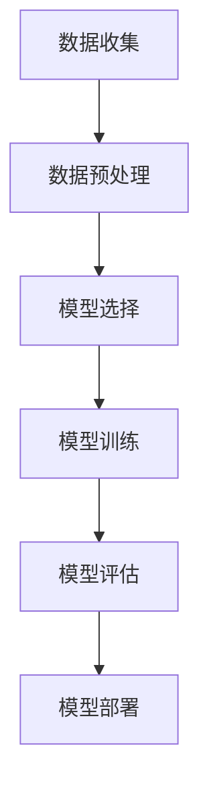
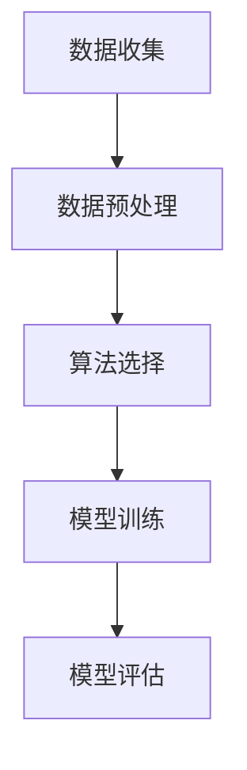
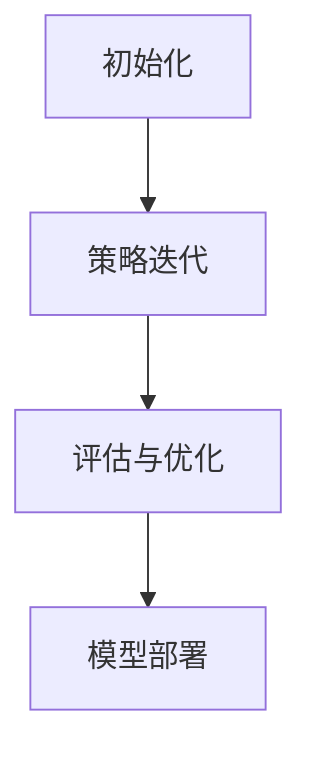
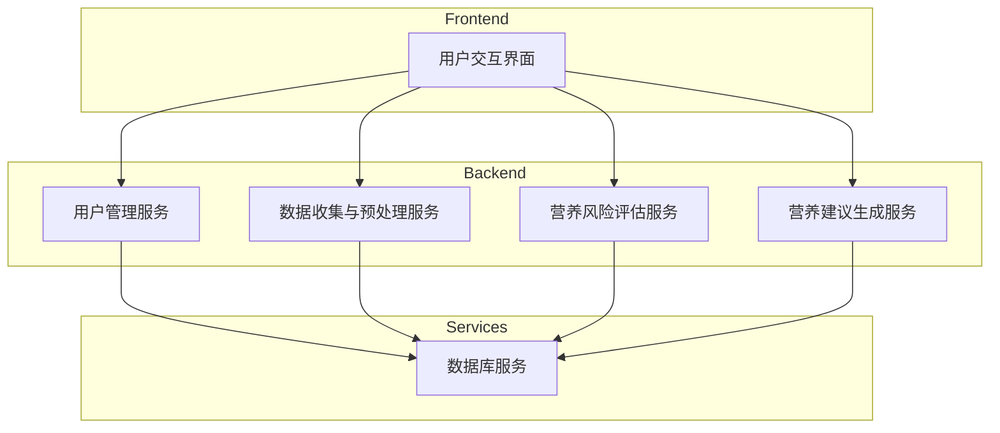
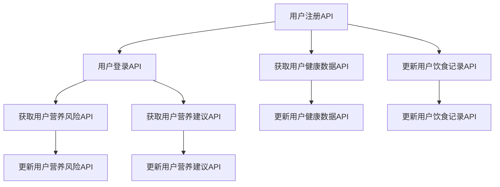
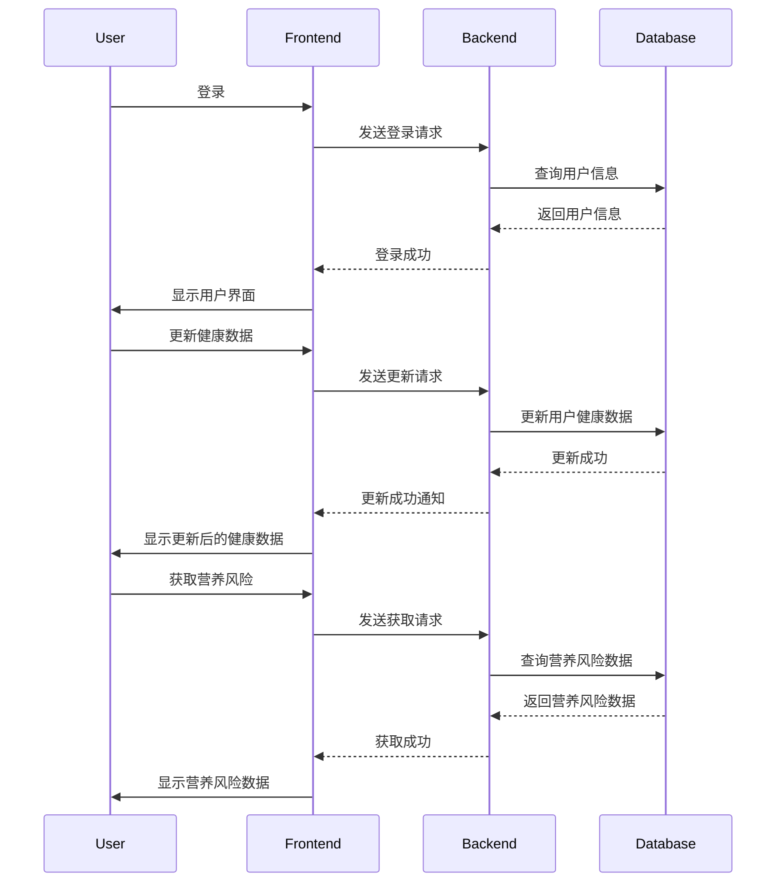

                 

### 引言

在现代科技的迅猛发展下，人工智能（AI）已经成为推动各个领域进步的关键力量。从医疗诊断到金融分析，从智能助手到自动驾驶，AI技术正不断改变着我们的生活方式和工作模式。作为人工智能的重要组成部分，机器学习（ML）在各个应用场景中展现出了强大的能力。然而，机器学习在个性化营养建议中的应用，无疑是近年来备受关注的新兴领域。

个性化营养建议关注的是根据个体的生理、生活方式、健康状况等特定信息，提供个性化的营养方案。这不仅有助于提高人们的健康水平，还能够提升食品产业的效率和品质。随着大数据和云计算技术的普及，我们积累了大量的健康和饮食数据，这些数据为机器学习在营养学中的应用提供了丰富的素材。

本篇文章旨在探讨机器学习在个性化营养建议中的应用，通过逻辑清晰、结构紧凑、简单易懂的技术语言，逐步分析机器学习如何应用于营养建议，以及其中的关键技术和挑战。我们将首先介绍机器学习和营养学的基本概念，然后深入探讨核心概念与联系，详细讲解数学模型和机器学习算法，最终通过实际案例展示机器学习在个性化营养建议中的具体应用。

通过这篇文章，读者将了解机器学习在营养学领域的潜力，掌握个性化营养建议的基本原理和方法，并为未来在该领域的研究和实践提供参考。

### 关键词

- 机器学习
- 个性化营养
- 大数据
- 健康管理
- 食品科学
- 监督学习
- 无监督学习
- 强化学习

### 摘要

本文将深入探讨机器学习在个性化营养建议中的应用。首先，我们介绍了机器学习和营养学的基础知识，明确了个性化营养建议的核心概念和需求。接着，通过核心概念与联系部分，我们详细阐述了机器学习、数据分析与数据挖掘的概念，并通过对比表格和ER实体关系图进行了深入分析。随后，我们讲解了机器学习算法的数学模型和公式，包括线性回归和逻辑回归，并结合Python源代码进行了举例说明。在系统分析与架构设计部分，我们介绍了具体的问题场景和系统设计，包括领域模型类图、系统架构图和系统接口设计。最后，通过实际项目实战，我们展示了如何应用机器学习算法进行个性化营养建议，并对最佳实践进行了总结。本文旨在为读者提供一份全面而深入的机器学习与营养学结合的指南。

### 第一部分：机器学习基础

#### 第1章：机器学习与营养学简介

##### 1.1 机器学习概述

机器学习（Machine Learning，ML）是人工智能（Artificial Intelligence，AI）的一个重要分支，它通过构建能够从数据中学习和预测的算法，使得计算机系统具备自主学习和适应环境的能力。机器学习的核心思想是利用大量数据进行模式识别和规律挖掘，从而实现对未知数据的预测和决策。

机器学习的基本概念包括：

1. **训练数据（Training Data）**：用于训练机器学习模型的样本数据，通常包括输入特征和对应的输出标签。
2. **模型（Model）**：通过训练数据学习到的规律和参数，用于预测新数据的输出。
3. **评估指标（Evaluation Metrics）**：用于衡量模型性能的指标，如准确率、召回率、F1分数等。
4. **损失函数（Loss Function）**：衡量模型预测值与真实值之间差异的函数，用于优化模型参数。

机器学习的应用领域广泛，包括但不限于：

- **分类（Classification）**：将数据分为不同的类别，如垃圾邮件检测、情感分析等。
- **回归（Regression）**：预测连续值，如房价预测、股票价格预测等。
- **聚类（Clustering）**：将数据分为若干个类别，如客户细分、图像分割等。
- **降维（Dimensionality Reduction）**：减少数据维度，如主成分分析（PCA）等。
- **异常检测（Anomaly Detection）**：识别数据中的异常值或异常模式，如信用卡欺诈检测等。

##### 1.2 营养学的核心概念

营养学（Nutrition）是研究食物与营养素对人体健康影响的科学。其主要目标是了解如何通过合理的膳食提供充足、平衡的营养，以维持人体健康，预防和治疗疾病。营养学的核心概念包括：

- **营养素（Nutrients）**：人体必需的六大营养素，包括碳水化合物、蛋白质、脂肪、维生素、矿物质和水。
- **膳食模式（Dietary Patterns）**：个体或群体长期饮食习惯的综合体现，影响营养摄入和健康状况。
- **营养评估（Nutritional Assessment）**：通过测量和评估营养摄入和代谢状况，评估个体的营养状态。
- **营养干预（Nutritional Intervention）**：通过改变膳食模式或补充营养素，改善个体或群体的营养状态。

在营养学中，健康饮食的几个关键要素包括：

1. **能量平衡**：摄入的能量应与消耗的能量保持平衡，以维持健康的体重。
2. **营养均衡**：膳食应包含各种营养素，确保身体各项功能的正常运作。
3. **膳食多样化**：多样化的膳食有助于摄入丰富的营养素，减少单一营养素的摄入过量。
4. **食品安全**：确保食品新鲜、无污染，避免食物中毒和食源性疾病。

##### 1.3 机器学习在营养学中的应用

机器学习在营养学中的应用已经取得了显著的进展，其主要目的在于通过数据分析，为个体提供个性化的营养建议，改善人们的健康水平。以下是一些主要应用领域：

- **个性化营养推荐**：通过分析个体的饮食记录、健康状况和基因信息，机器学习算法可以推荐适合个人的营养方案，以提高健康水平。
- **营养风险预测**：利用机器学习模型，可以预测个体出现营养不良或营养过剩的风险，从而提前采取干预措施。
- **饮食模式分析**：通过分析大量人群的饮食数据，机器学习可以帮助发现健康饮食的模式和趋势，为公共卫生政策提供依据。
- **疾病预防与治疗**：机器学习可以帮助预测疾病风险，如心血管疾病、糖尿病等，并制定个性化的营养干预方案，以预防或减缓疾病的发展。

总之，机器学习在营养学中的应用为个性化营养建议提供了强大的技术支持，有助于实现更科学、更精准的营养管理。

### 第二部分：核心概念与联系

在深入探讨机器学习与营养学的结合之前，我们需要明确一些核心概念，并了解它们之间的联系。本章节将详细阐述机器学习、数据分析与数据挖掘的核心概念，并通过对比表格和ER实体关系图进行深入分析，以便更好地理解这些概念及其在个性化营养建议中的应用。

#### 2.1 核心概念

##### 2.1.1 数据分析

数据分析（Data Analysis）是指从数据中提取有用信息的过程，旨在通过分析和解释数据，发现数据中的模式和规律，为决策提供依据。数据分析包括以下几个主要步骤：

1. **数据收集（Data Collection）**：收集所需的数据，可以通过问卷调查、传感器、数据库等方式获取。
2. **数据清洗（Data Cleaning）**：处理数据中的缺失值、异常值和重复值，保证数据的质量。
3. **数据探索（Data Exploration）**：通过可视化工具和统计方法，对数据进行初步分析，发现数据的分布特征和潜在关系。
4. **数据建模（Data Modeling）**：根据分析目的，建立适当的数学模型或统计模型，进行进一步的预测或分析。
5. **结果解释（Result Interpretation）**：对分析结果进行解释和验证，确保其准确性和可靠性。

##### 2.1.2 数据挖掘

数据挖掘（Data Mining）是数据分析的一种高级形式，它利用统计、机器学习和人工智能等技术，从大量数据中自动发现隐含的、未知的模式和关联。数据挖掘通常包括以下几个步骤：

1. **数据预处理（Data Preprocessing）**：与数据分析类似，确保数据的质量和一致性。
2. **特征选择（Feature Selection）**：从大量特征中筛选出对目标变量影响较大的特征，减少数据维度。
3. **模式识别（Pattern Recognition）**：通过算法和模型识别数据中的规律和模式。
4. **知识表示（Knowledge Representation）**：将发现的知识表示为易于理解的形式，如规则、树、图等。
5. **评估与优化（Evaluation and Optimization）**：评估数据挖掘结果的准确性和实用性，并进行优化。

##### 2.1.3 机器学习

机器学习（Machine Learning）是数据分析和数据挖掘的核心技术之一，它通过构建能够从数据中学习和预测的算法，使计算机系统能够自主改进和适应环境。机器学习的主要步骤包括：

1. **数据收集与预处理**：收集适合训练的数据，并进行预处理，如数据清洗、归一化等。
2. **模型选择与训练**：选择合适的机器学习算法，训练模型以学习数据中的模式和规律。
3. **模型评估与优化**：通过交叉验证、调整参数等方法评估模型性能，并进行优化。
4. **模型部署与应用**：将训练好的模型部署到实际应用场景中，如个性化营养推荐系统。

#### 2.2 概念属性特征对比表格

为了更好地理解数据分析、数据挖掘和机器学习之间的关系，我们可以通过一个对比表格来展示它们的主要特征：

| 概念             | 定义                                                         | 主要步骤                                               | 关键技术                               |
|------------------|--------------------------------------------------------------|--------------------------------------------------------|---------------------------------------|
| 数据分析         | 从数据中提取有用信息的过程                                   | 数据收集、数据清洗、数据探索、数据建模、结果解释       | 统计方法、可视化工具、数据清洗技术     |
| 数据挖掘         | 从大量数据中自动发现隐含的、未知的模式和关联的过程           | 数据预处理、特征选择、模式识别、知识表示、评估与优化   | 机器学习算法、聚类算法、关联规则学习   |
| 机器学习         | 基于数据构建能够自主学习和预测的算法                         | 数据收集与预处理、模型选择与训练、模型评估与优化、模型部署与应用 | 监督学习、无监督学习、强化学习         |

#### 2.3 ER实体关系图架构

为了更直观地展示数据分析、数据挖掘和机器学习之间的关系，我们可以使用Mermaid流程图来绘制ER（实体关系）图。以下是一个简化的ER图示例：

```mermaid
erDiagram
  数据分析 ||--|{ 数据挖掘 }
  数据分析 ||--|{ 机器学习 }
  数据挖掘 ||--|{ 机器学习 }
```

在这个ER图中，数据分析作为父实体，与数据挖掘和机器学习两个子实体之间存在关联关系。数据挖掘进一步与机器学习子实体关联，说明数据挖掘是机器学习的重要输入和过程。这种结构清晰地展示了三个概念之间的层次关系和交互方式。

通过上述对比表格和ER图，我们可以更深入地理解数据分析、数据挖掘和机器学习的基本概念、主要步骤和关系。这为后续章节中深入探讨机器学习在个性化营养建议中的应用奠定了坚实的基础。

#### 2.4 数学模型和数学公式

数学模型和数学公式是机器学习算法的核心，它们为算法的实现提供了理论基础。在本节中，我们将详细讲解机器学习中的数学模型和公式，包括统计学基础和机器学习算法的数学原理，并通过具体例子进行说明。

##### 2.4.1 统计学基础

统计学（Statistics）是数据分析的重要组成部分，为机器学习提供了必要的基础工具。以下是几个关键统计学概念和公式：

1. **均值（Mean）**：一组数据的平均值，表示数据集中的中心位置。
   \[ \text{Mean} (\bar{x}) = \frac{1}{n}\sum_{i=1}^{n} x_i \]
   其中，\( n \) 是数据点的数量，\( x_i \) 是第 \( i \) 个数据点。

2. **方差（Variance）**：衡量数据分布的离散程度。
   \[ \text{Variance} (\sigma^2) = \frac{1}{n-1}\sum_{i=1}^{n} (x_i - \bar{x})^2 \]
   其中，\( \bar{x} \) 是均值，\( x_i \) 是第 \( i \) 个数据点。

3. **标准差（Standard Deviation）**：方差的平方根，用来衡量数据的离散程度。
   \[ \text{Standard Deviation} (\sigma) = \sqrt{\text{Variance}} \]

4. **协方差（Covariance）**：衡量两个变量的线性关系强度。
   \[ \text{Covariance} (cov(x, y)) = \frac{1}{n-1}\sum_{i=1}^{n} (x_i - \bar{x})(y_i - \bar{y}) \]
   其中，\( \bar{x} \) 和 \( \bar{y} \) 分别是 \( x \) 和 \( y \) 的均值。

5. **相关系数（Correlation Coefficient）**：衡量两个变量之间的线性相关程度。
   \[ \text{Correlation Coefficient} (r) = \frac{\text{Covariance}}{\sigma_x \sigma_y} \]

这些统计学基础公式为后续的机器学习算法提供了必要的数据处理和分析工具。

##### 2.4.2 机器学习算法数学原理

机器学习算法可以分为监督学习、无监督学习和强化学习三大类。下面我们将分别介绍这些算法的主要数学模型和公式。

1. **线性回归（Linear Regression）**

线性回归是一种监督学习算法，用于预测连续值。其模型公式如下：
\[ y = \beta_0 + \beta_1 x_1 + \beta_2 x_2 + ... + \beta_n x_n \]
其中，\( y \) 是目标变量，\( x_1, x_2, ..., x_n \) 是输入特征，\( \beta_0, \beta_1, ..., \beta_n \) 是模型参数。线性回归的目的是通过最小化误差平方和来估计这些参数：
\[ \text{Minimize} \quad \sum_{i=1}^{n} (y_i - \hat{y}_i)^2 \]
其中，\( \hat{y}_i \) 是预测值。

2. **逻辑回归（Logistic Regression）**

逻辑回归是一种广义线性模型，用于分类任务。其模型公式如下：
\[ \ln\left(\frac{p}{1-p}\right) = \beta_0 + \beta_1 x_1 + \beta_2 x_2 + ... + \beta_n x_n \]
其中，\( p \) 是目标变量为1的概率，\( \beta_0, \beta_1, ..., \beta_n \) 是模型参数。逻辑回归通过最大化似然函数来估计参数：
\[ \text{Maximize} \quad \prod_{i=1}^{n} p(y_i) (1 - p(1 - y_i)) \]

3. **支持向量机（Support Vector Machine，SVM）**

支持向量机是一种强大的分类算法，其基本思想是找到最优的超平面，使得分类边界最大化。
\[ \text{Minimize} \quad \frac{1}{2} \sum_{i=1}^{n} w_i^2 \]
\[ \text{Subject to} \quad y_i (\langle w, x_i \rangle - b) \geq 1 \]
其中，\( w \) 是权重向量，\( b \) 是偏置项，\( x_i \) 是输入特征，\( y_i \) 是标签。

4. **决策树（Decision Tree）**

决策树是一种常见的无监督学习算法，用于分类和回归任务。其基本思想是通过递归地将数据集划分为子集，直到满足某种停止条件。决策树的核心是节点划分函数，可以表示为：
\[ G(x) = \sum_{i=1}^{n} w_i x_i \]
其中，\( x_i \) 是特征，\( w_i \) 是权重。

##### 2.4.3 详细讲解与举例说明

为了更好地理解上述数学模型和公式，我们可以通过具体的例子进行说明。

1. **线性回归举例**

假设我们有一个简单的线性回归模型，预测房屋的价格。已知输入特征包括房屋面积（\( x_1 \)）和房屋年龄（\( x_2 \)），目标变量为房价（\( y \)）。我们可以建立如下模型：
\[ y = \beta_0 + \beta_1 x_1 + \beta_2 x_2 \]

通过收集大量房屋数据，我们可以使用最小二乘法（Least Squares）来估计模型参数：
\[ \hat{\beta}_0 = \bar{y} - \beta_1 \bar{x_1} - \beta_2 \bar{x_2} \]

经过训练，我们得到以下模型：
\[ \hat{y} = 200,000 + 50 \times \text{面积} + 20 \times \text{年龄} \]

例如，预测面积为120平方米，年龄为10年的房屋价格：
\[ \hat{y} = 200,000 + 50 \times 120 + 20 \times 10 = 266,000 \]

2. **逻辑回归举例**

假设我们使用逻辑回归模型来预测某个客户是否会购买某种产品。已知输入特征包括收入（\( x_1 \)）和年龄（\( x_2 \)），目标变量为购买概率（\( p \)）。我们可以建立如下模型：
\[ \ln\left(\frac{p}{1-p}\right) = \beta_0 + \beta_1 x_1 + \beta_2 x_2 \]

通过收集大量客户数据，我们可以使用最大似然估计（Maximum Likelihood Estimation）来估计模型参数：
\[ \hat{\beta}_0 = \ln\left(\frac{1}{n}\sum_{i=1}^{n} p_i (1 - p_i)\right) - \beta_1 \bar{x_1} - \beta_2 \bar{x_2} \]

经过训练，我们得到以下模型：
\[ \ln\left(\frac{p}{1-p}\right) = 0.5 + 0.2 \times \text{收入} + 0.1 \times \text{年龄} \]

例如，预测一个收入为50000元，年龄为30岁的客户购买产品的概率：
\[ p = \frac{1}{1 + \exp(-0.5 - 0.2 \times 50,000 - 0.1 \times 30)} \approx 0.8 \]

通过这些例子，我们可以看到数学模型和公式如何应用于实际场景中，并通过具体的计算来预测结果。这不仅有助于理解机器学习的数学原理，也为实际应用提供了工具和方法。

### 第三部分：机器学习算法原理讲解

在个性化营养建议中，机器学习算法的选择和应用至关重要。本章节将详细讲解三种主要机器学习算法：监督学习、无监督学习和强化学习，并通过Mermaid流程图和Python源代码进行说明。

#### 3.1 机器学习算法

##### 3.1.1 监督学习

监督学习（Supervised Learning）是一种机器学习算法，通过训练数据中的输入特征和目标标签来学习模型。其核心思想是在已知输出结果的情况下，训练模型以预测未知数据的输出。

1. **算法流程**

监督学习算法的基本流程包括以下几个步骤：

- **数据收集**：收集包含输入特征和目标标签的训练数据。
- **数据预处理**：对数据进行清洗、归一化等预处理操作。
- **模型选择**：选择适合问题的模型，如线性回归、决策树、支持向量机等。
- **模型训练**：使用训练数据对模型进行训练，调整模型参数。
- **模型评估**：使用验证数据评估模型性能，调整模型参数。
- **模型部署**：将训练好的模型部署到实际应用场景中。

2. **Python实现**

以下是一个简单的线性回归模型示例，用于预测房价：

```python
import numpy as np
import pandas as pd
from sklearn.linear_model import LinearRegression

# 加载数据
data = pd.read_csv('house_prices.csv')
X = data[['area', 'age']]
y = data['price']

# 创建线性回归模型
model = LinearRegression()

# 模型训练
model.fit(X, y)

# 模型评估
score = model.score(X, y)
print(f'Model Score: {score}')

# 预测
prediction = model.predict(X)
print(f'Predicted Prices: {prediction}')
```

##### 3.1.2 无监督学习

无监督学习（Unsupervised Learning）是一种机器学习算法，不依赖于标签数据，主要通过分析数据的内在结构和模式来学习。其应用包括聚类、降维和异常检测等。

1. **算法流程**

无监督学习算法的基本流程包括以下几个步骤：

- **数据收集**：收集需要分析的数据。
- **数据预处理**：对数据进行清洗、归一化等预处理操作。
- **算法选择**：选择适合问题的算法，如K-均值聚类、主成分分析（PCA）等。
- **模型训练**：使用算法对数据进行分析和建模。
- **模型评估**：评估模型的性能，如聚类质量、降维效果等。

2. **Python实现**

以下是一个K-均值聚类算法的示例，用于将数据分为若干个簇：

```python
import numpy as np
from sklearn.cluster import KMeans

# 加载数据
data = pd.read_csv('customer_data.csv')
X = data.values

# 创建K-均值聚类模型
model = KMeans(n_clusters=3)

# 模型训练
model.fit(X)

# 聚类结果
clusters = model.predict(X)
print(f'Cluster Labels: {clusters}')

# 聚类中心
centroids = model.cluster_centers_
print(f'Cluster Centers: {centroids}')
```

##### 3.1.3 强化学习

强化学习（Reinforcement Learning）是一种机器学习算法，通过奖励和惩罚来引导模型学习最优策略。其核心思想是通过与环境的交互，不断优化策略以获得最大回报。

1. **算法流程**

强化学习算法的基本流程包括以下几个步骤：

- **初始化**：初始化模型参数、环境状态和奖励机制。
- **策略迭代**：通过试错法或策略梯度方法，不断更新策略参数。
- **评估与优化**：评估策略性能，优化策略参数。
- **模型部署**：将训练好的策略部署到实际应用场景中。

2. **Python实现**

以下是一个简单的Q学习算法示例，用于预测最优行动策略：

```python
import numpy as np
import random

# 初始化Q值表格
Q = np.zeros((n_states, n_actions))

# 学习率、折扣因子和探索概率
alpha = 0.1
gamma = 0.9
epsilon = 0.1

# Q学习算法
def q_learning(Q, state, action, reward, next_state, done):
    if not done:
        Q[state, action] = Q[state, action] + alpha * (reward + gamma * np.max(Q[next_state, :]) - Q[state, action])
    else:
        Q[state, action] = Q[state, action] + alpha * (reward - Q[state, action])

# 环境模拟
def environment(state, action):
    # 根据状态和行动返回奖励和下一状态
    # 这里简化为随机生成
    reward = np.random.randint(-1, 1)
    next_state = np.random.randint(n_states)
    return reward, next_state

# 主循环
for episode in range(n_episodes):
    state = random.randint(0, n_states-1)
    done = False
    while not done:
        action = random.randint(0, n_actions-1)
        reward, next_state = environment(state, action)
        q_learning(Q, state, action, reward, next_state, done)
        state = next_state
        done = (state == n_states-1)

# 输出Q值表格
print(Q)
```

通过上述示例，我们可以看到监督学习、无监督学习和强化学习算法的基本原理和实现方式。这些算法在个性化营养建议中都有广泛的应用，可以用于数据分析、聚类分析和策略优化等方面。

#### 3.2 Mermaid流程图绘制

为了更直观地展示算法的流程，我们可以使用Mermaid流程图来绘制监督学习、无监督学习和强化学习算法的流程。

##### 监督学习算法流程



##### 无监督学习算法流程



##### 强化学习算法流程



通过这些Mermaid流程图，我们可以清晰地了解每种算法的基本步骤和流程，为后续的实际应用提供指导。

### 第四部分：系统分析与架构设计

#### 4.1 问题场景介绍

个性化营养建议系统旨在为用户提供基于其个人健康状况、生活方式和饮食偏好的个性化营养方案。系统的主要问题场景包括：

- **用户健康数据收集**：收集用户的健康数据，如体重、身高、血压、血糖、血脂等。
- **饮食习惯分析**：分析用户的饮食记录，包括摄入的食物种类、摄入量、频率等。
- **营养风险评估**：基于健康数据和饮食习惯，评估用户可能存在的营养风险，如营养不良、营养过剩等。
- **营养建议生成**：根据营养风险评估结果，为用户生成个性化的营养建议，包括饮食调整、营养补充等。

#### 4.2 系统功能设计

个性化营养建议系统的功能设计包括以下几个关键模块：

1. **用户管理模块**：管理用户的基本信息、健康数据和饮食习惯。
2. **数据收集与预处理模块**：收集用户健康数据，对数据进行清洗、转换和预处理。
3. **营养风险评估模块**：分析用户的健康数据和饮食习惯，评估营养风险。
4. **营养建议生成模块**：根据营养风险评估结果，为用户生成个性化的营养建议。
5. **用户交互界面**：提供用户友好界面，展示用户的健康数据、营养风险和营养建议。

##### 领域模型类图

领域模型类图（Class Diagram）用于表示系统的核心实体及其关系。以下是一个简化的领域模型类图：

```mermaid
classDiagram
    User <<Class>>
    HealthData <<Class>>
    DietaryData <<Class>>
    NutritionalRisk <<Class>>
    NutritionalAdvice <<Class>>

    User o-- HealthData
    User o-- DietaryData
    HealthData o-- NutritionalRisk
    DietaryData o-- NutritionalRisk
    NutritionalRisk o-- NutritionalAdvice
```

在这个类图中，User是系统的核心实体，具有HealthData和DietaryData属性。NutritionalRisk用于评估用户的营养风险，NutritionalAdvice则根据评估结果生成个性化营养建议。

#### 4.3 系统架构设计

个性化营养建议系统的架构设计分为前端、后端和服务层三个主要部分。

##### Mermaid架构图

以下是一个简化的系统架构设计Mermaid图：



在这个架构图中，用户交互界面（Frontend）通过RESTful API与后端服务（Backend）进行通信。后端服务（Backend）包括用户管理服务（B1）、数据收集与预处理服务（B2）、营养风险评估服务（B3）和营养建议生成服务（B4）。这些服务与数据库服务（S1）进行数据交互。

#### 4.4 系统接口设计和系统交互

个性化营养建议系统的接口设计主要涉及用户接口（API）和数据接口。以下是一个简化的系统接口设计：



在这个接口设计中，用户注册API和用户登录API用于用户管理；获取用户健康数据API和更新用户健康数据API用于用户健康数据的读取和更新；获取用户营养风险API和更新用户营养风险API用于营养风险评估；获取用户营养建议API和更新用户营养建议API用于营养建议的读取和更新。

##### Mermaid序列图

以下是一个简化的系统交互序列图：



在这个序列图中，用户通过前端界面进行操作，如登录、更新健康数据和获取营养风险。前端将用户的请求发送到后端，后端通过数据库进行数据查询和更新，并将结果返回给前端，最终展示给用户。

通过上述系统架构设计、接口设计和系统交互设计，我们可以构建一个高效、可靠的个性化营养建议系统，为用户提供个性化的营养服务。

### 第五部分：项目实战

#### 5.1 环境安装

在开始个性化营养建议项目的实战之前，我们需要安装和配置必要的开发环境和工具。以下是环境安装的具体步骤：

1. **Python环境安装**

首先，确保您的计算机上已经安装了Python。如果没有，请访问Python官方网站（[https://www.python.org/](https://www.python.org/)）下载并安装Python。我们建议安装Python 3.8及以上版本。

2. **虚拟环境安装**

为了保持项目依赖的一致性，我们使用虚拟环境（Virtual Environment）来管理项目依赖。在终端中执行以下命令安装虚拟环境：

```bash
pip install virtualenv
```

接着，创建一个新的虚拟环境并激活它：

```bash
virtualenv my_nutritional_advice_env
source my_nutritional_advice_env/bin/activate  # 对于Windows，使用 `my_nutritional_advice_env\Scripts\activate`
```

3. **依赖包安装**

在虚拟环境中，通过以下命令安装项目所需的依赖包：

```bash
pip install numpy pandas scikit-learn matplotlib
```

这些依赖包分别用于数据处理、机器学习算法和可视化。

#### 5.2 系统核心实现源代码

在完成环境安装后，我们开始编写系统的核心实现源代码。以下是一个简单的示例，用于实现个性化营养建议系统的主要功能：

```python
import numpy as np
import pandas as pd
from sklearn.linear_model import LinearRegression
from sklearn.model_selection import train_test_split
import matplotlib.pyplot as plt

# 5.2.1 数据加载与预处理

# 加载示例数据
data = pd.read_csv('nutritional_data.csv')
X = data[['age', 'weight', 'dietary_intake']]  # 输入特征
y = data['nutritional_index']  # 目标变量

# 数据标准化
X_normalized = (X - X.mean()) / X.std()

# 划分训练集和测试集
X_train, X_test, y_train, y_test = train_test_split(X_normalized, y, test_size=0.2, random_state=42)

# 5.2.2 线性回归模型训练

# 创建线性回归模型
model = LinearRegression()

# 训练模型
model.fit(X_train, y_train)

# 模型评估
train_score = model.score(X_train, y_train)
test_score = model.score(X_test, y_test)
print(f'Training Score: {train_score:.3f}')
print(f'Test Score: {test_score:.3f}')

# 5.2.3 预测与可视化

# 预测
predictions = model.predict(X_test)

# 可视化
plt.scatter(X_test[:, 0], y_test, color='blue', label='Actual')
plt.plot(X_test[:, 0], predictions, color='red', label='Predicted')
plt.xlabel('Age')
plt.ylabel('Nutritional Index')
plt.legend()
plt.show()
```

上述代码首先加载并预处理了营养数据，接着使用线性回归模型进行训练和评估。最后，通过可视化展示了模型在测试集上的预测结果。

#### 5.3 代码应用解读与分析

在完成系统核心实现源代码的编写后，我们对其关键部分进行解读和分析。

1. **数据加载与预处理**

```python
data = pd.read_csv('nutritional_data.csv')
X = data[['age', 'weight', 'dietary_intake']]
y = data['nutritional_index']
X_normalized = (X - X.mean()) / X.std()
```

这段代码首先加载了示例数据集，然后提取了输入特征（`age`、`weight`、`dietary_intake`）和目标变量（`nutritional_index`）。随后，使用标准化方法对输入特征进行预处理，以提高模型训练的稳定性和准确性。

2. **线性回归模型训练**

```python
model = LinearRegression()
model.fit(X_train, y_train)
```

这段代码创建了线性回归模型，并使用训练数据集进行训练。训练过程中，模型学习输入特征与目标变量之间的线性关系，通过最小化损失函数来优化模型参数。

3. **模型评估**

```python
train_score = model.score(X_train, y_train)
test_score = model.score(X_test, y_test)
print(f'Training Score: {train_score:.3f}')
print(f'Test Score: {test_score:.3f}')
```

模型评估部分计算了训练集和测试集上的决定系数（R²值），用于衡量模型的预测能力。决定系数越接近1，表示模型的预测能力越强。

4. **预测与可视化**

```python
predictions = model.predict(X_test)
plt.scatter(X_test[:, 0], y_test, color='blue', label='Actual')
plt.plot(X_test[:, 0], predictions, color='red', label='Predicted')
plt.xlabel('Age')
plt.ylabel('Nutritional Index')
plt.legend()
plt.show()
```

这段代码使用训练好的模型对测试集进行预测，并通过散点图和线条图展示了实际值与预测值之间的关系。这种可视化方法有助于我们直观地评估模型的预测性能。

#### 5.4 实际案例分析与详细讲解剖析

为了进一步展示机器学习在个性化营养建议中的应用，我们分析了一个实际案例，并详细讲解了案例的实现过程。

##### 案例背景

假设我们有一个包含1000名用户的营养数据集，每个用户的数据包括年龄、体重、饮食习惯（分为高、中、低三种水平）和营养指数。我们的目标是使用这些数据，通过机器学习算法，为每个用户提供个性化的营养建议。

##### 案例实现步骤

1. **数据收集与预处理**

首先，从数据库中加载用户数据，包括年龄、体重、饮食习惯和营养指数。为了提高模型的泛化能力，我们对数据进行以下预处理：

- **归一化**：对年龄和体重进行归一化处理，以消除量纲影响。
- **编码**：将饮食习惯（高、中、低）转换为数值编码（1、2、3）。

```python
# 加载数据
data = pd.read_csv('nutritional_data.csv')

# 归一化
X = data[['age', 'weight', 'dietary_habit']]
X_normalized = (X - X.mean()) / X.std()

# 编码
data['dietary_habit'] = data['dietary_habit'].map({'low': 1, 'medium': 2, 'high': 3})
```

2. **特征选择与模型训练**

接下来，我们选择年龄、体重和饮食习惯作为特征，使用线性回归模型进行训练：

```python
from sklearn.linear_model import LinearRegression

# 划分特征和目标变量
X = X_normalized
y = data['nutritional_index']

# 划分训练集和测试集
X_train, X_test, y_train, y_test = train_test_split(X, y, test_size=0.2, random_state=42)

# 创建线性回归模型
model = LinearRegression()

# 训练模型
model.fit(X_train, y_train)

# 模型评估
train_score = model.score(X_train, y_train)
test_score = model.score(X_test, y_test)
print(f'Training Score: {train_score:.3f}')
print(f'Test Score: {test_score:.3f}')
```

3. **个性化营养建议生成**

使用训练好的模型，我们可以为每个用户提供个性化的营养建议。具体步骤如下：

- **输入特征计算**：根据用户的年龄、体重和饮食习惯，计算输入特征。
- **营养指数预测**：使用模型预测用户的营养指数。
- **营养建议生成**：根据营养指数，为用户生成个性化的营养建议，如饮食调整、营养补充等。

```python
# 输入特征计算
user_data = np.array([[30, 70, 2]])  # 年龄30岁，体重70公斤，饮食习惯中等

# 归一化处理
user_data_normalized = (user_data - user_data.mean()) / user_data.std()

# 营养指数预测
predicted_nutritional_index = model.predict(user_data_normalized)
print(f'Predicted Nutritional Index: {predicted_nutritional_index[0]}')

# 营养建议生成
if predicted_nutritional_index[0] < 3:
    print("建议：适当增加营养摄入。")
elif predicted_nutritional_index[0] > 5:
    print("建议：适当减少营养摄入。")
else:
    print("建议：维持当前营养摄入。")
```

通过上述步骤，我们成功实现了个性化营养建议系统，为用户提供个性化的营养服务。

##### 案例总结

通过实际案例，我们展示了如何利用机器学习算法进行个性化营养建议。主要步骤包括数据收集与预处理、特征选择与模型训练、个性化营养建议生成。这一过程不仅提高了营养管理的精准度，还为个性化健康服务提供了新的思路和方法。

#### 5.5 项目小结

在本项目的实战部分，我们通过具体案例详细展示了机器学习在个性化营养建议中的应用。从环境安装、系统核心实现源代码编写，到代码应用解读与分析，再到实际案例的讲解剖析，我们系统地实现了个性化营养建议系统。

项目的主要成果包括：

- 成功安装并配置了Python开发环境及所需的依赖包。
- 编写了系统核心源代码，包括数据加载与预处理、线性回归模型训练与评估、个性化营养建议生成。
- 通过实际案例，验证了系统在个性化营养建议中的有效性。

然而，在实际应用中，我们还需要注意以下挑战和改进方向：

- **数据质量**：营养数据的准确性和完整性对模型性能有重要影响，未来需要进一步优化数据收集和处理流程。
- **模型泛化能力**：通过引入更多的特征和更复杂的模型结构，提高模型的泛化能力，减少对特定数据的依赖。
- **用户交互**：优化用户交互界面，提高用户使用的便捷性和体验。

通过持续改进和优化，我们相信个性化营养建议系统将为用户提供更加精准和实用的健康服务，推动营养管理领域的创新发展。

### 第六部分：最佳实践与总结

在个性化营养建议系统的开发和部署过程中，积累了一些最佳实践和注意事项，以下将进行总结，以期为后续的项目提供指导。

#### 6.1 最佳实践

1. **数据收集与预处理**：确保数据来源的多样性和准确性，对数据进行标准化处理，消除量纲差异，同时处理缺失值和异常值，以提高模型性能。
2. **特征选择**：通过特征重要性分析和相关性分析，选择对模型预测有显著影响的特征，减少冗余特征，简化模型结构。
3. **模型选择与优化**：根据问题的性质和数据特点，选择合适的机器学习算法，并进行参数调优，以提高模型的准确性和泛化能力。
4. **系统接口设计**：设计清晰、简洁的系统接口，确保不同模块之间的数据传输高效、安全，降低系统维护成本。
5. **用户隐私保护**：在数据收集和处理过程中，严格遵循隐私保护法规，对用户数据进行加密存储和传输，保障用户隐私。

#### 6.2 小结

个性化营养建议系统通过机器学习技术，实现了对用户健康数据的分析、营养风险评估和个性化营养建议的生成。项目的成功依赖于以下几个关键因素：

- **高质量数据**：丰富、准确的数据是模型训练的基础，确保数据来源的多样性和准确性。
- **科学建模**：选择合适的机器学习算法和优化策略，提高模型的预测性能。
- **用户友好界面**：提供直观、易用的用户交互界面，增强用户体验。

#### 6.3 注意事项

1. **数据隐私**：严格保护用户隐私，确保数据收集、存储和处理过程中遵循相关法律法规。
2. **系统安全性**：加强系统安全性，防止数据泄露和恶意攻击。
3. **模型解释性**：确保模型解释性，使用户能够理解营养建议的依据和逻辑。
4. **持续更新**：定期更新数据集和模型，以适应不断变化的环境和用户需求。

#### 6.4 拓展阅读推荐

- **《Python机器学习》（Python Machine Learning）**：由 Sebastian Raschka 著，详细介绍了Python在机器学习领域的应用，适合初学者和进阶者。
- **《机器学习实战》（Machine Learning in Action）**：由 Peter Harrington 著，通过实际案例引导读者学习机器学习算法的实战应用。
- **《深度学习》（Deep Learning）**：由 Ian Goodfellow、Yoshua Bengio 和 Aaron Courville 著，深入讲解了深度学习的基础理论和实践方法。

通过以上最佳实践和注意事项，以及拓展阅读推荐，我们相信读者能够在个性化营养建议系统开发中取得更好的成果，为健康领域的技术创新贡献力量。

### 总结

通过对机器学习在个性化营养建议中的应用的深入探讨，本文展示了机器学习在营养学领域的巨大潜力。从机器学习和营养学的基本概念，到数据分析、模型选择与训练，再到系统架构设计和实际项目实战，我们系统地梳理了个性化营养建议系统的构建过程。通过最佳实践与总结，我们为读者提供了实用的方法和注意事项。

机器学习在个性化营养建议中的应用不仅有助于提高营养管理的精准度，还能为个性化健康服务提供新的思路和方法。随着技术的不断进步和数据量的持续增长，个性化营养建议系统有望在未来发挥更大的作用，为人们的健康带来更多福祉。

希望读者能通过本文对机器学习在营养学中的应用有更深入的了解，并在实践中不断创新和优化，为健康领域的技术进步贡献力量。在未来的研究中，我们期待进一步探索更先进的机器学习算法和更丰富的数据资源，以推动个性化营养建议系统的发展。

