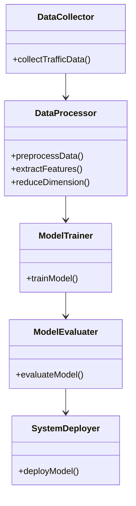
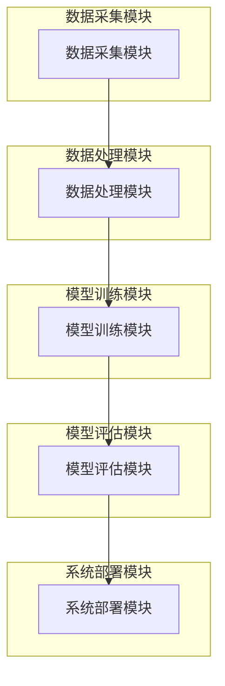

                 

# 机器学习在网络异常流量检测中的应用

关键词：网络异常流量检测、机器学习、数据特征提取、模型评估、系统设计

摘要：本文将探讨机器学习在网络异常流量检测中的应用，从背景介绍、核心概念、模型基础、特征提取与降维、检测模型、系统设计与实现、案例分析及最佳实践等方面展开详细论述，旨在为网络安全领域的研究者提供有价值的参考。

## 目录大纲

## 第一部分：背景介绍

### 1.1 问题背景与核心概念

#### 1.1.1 网络异常流量检测的重要性

#### 1.1.2 网络异常流量的类型

#### 1.1.3 网络异常流量检测的现状与挑战

### 1.2 核心概念

#### 1.2.1 机器学习的基本概念

#### 1.2.2 监督学习与无监督学习

#### 1.2.3 特征工程与降维技术

#### 1.2.4 网络流量数据的特点与处理

## 第二部分：机器学习模型基础

### 2.1 监督学习模型

#### 2.1.1 线性回归

##### 2.1.1.1 线性回归的数学模型

##### 2.1.1.2 线性回归的Python实现

#### 2.1.2 逻辑回归

##### 2.1.2.1 逻辑回归的数学模型

##### 2.1.2.2 逻辑回归的Python实现

### 2.2 无监督学习模型

#### 2.2.1 K-均值聚类

##### 2.2.1.1 K-均值聚类的数学模型

##### 2.2.1.2 K-均值聚类的Python实现

#### 2.2.2 主成分分析

##### 2.2.2.1 主成分分析的数学模型

##### 2.2.2.2 主成分分析的Python实现

## 第三部分：网络流量数据的特征提取与降维

### 3.1 特征提取方法

#### 3.1.1 时域特征提取

##### 3.1.1.1 时域特征提取的数学模型

##### 3.1.1.2 时域特征的Python实现

#### 3.1.2 频域特征提取

##### 3.1.2.1 频域特征提取的数学模型

##### 3.1.2.2 频域特征的Python实现

### 3.2 降维技术

#### 3.2.1 主成分分析

##### 3.2.1.1 主成分分析的数学模型

##### 3.2.1.2 主成分分析的Python实现

#### 3.2.2 独立成分分析

##### 3.2.2.1 独立成分分析的数学模型

##### 3.2.2.2 独立成分分析的Python实现

## 第四部分：基于机器学习的网络异常流量检测模型

### 4.1 模型选择与评估

#### 4.1.1 模型选择策略

#### 4.1.2 模型评估指标

### 4.2 常见检测模型

#### 4.2.1 K-最近邻算法

##### 4.2.1.1 K-最近邻算法的数学模型

##### 4.2.1.2 K-最近邻算法的Python实现

#### 4.2.2 支持向量机

##### 4.2.2.1 支持向量机的数学模型

##### 4.2.2.2 支持向量机的Python实现

#### 4.2.3 集成学习方法

##### 4.2.3.1 集成学习方法的数学模型

##### 4.2.3.2 集成学习方法的Python实现

## 第五部分：网络异常流量检测系统的设计与实现

### 5.1 系统架构设计

#### 5.1.1 系统功能设计

##### 5.1.1.1 领域模型类图

#### 5.1.2 系统架构设计

##### 5.1.2.1 系统架构图

### 5.2 数据采集与处理

#### 5.2.1 数据采集

#### 5.2.2 数据预处理

### 5.3 模型训练与评估

#### 5.3.1 模型训练

#### 5.3.2 模型评估

### 5.4 系统部署与运行

#### 5.4.1 系统部署

#### 5.4.2 系统运行

## 第六部分：项目实战与案例分析

### 6.1 实战项目介绍

#### 6.1.1 项目背景

#### 6.1.2 项目目标

### 6.2 系统设计与实现

#### 6.2.1 系统架构设计

#### 6.2.2 数据处理与特征提取

#### 6.2.3 模型选择与训练

### 6.3 案例分析

#### 6.3.1 案例一：校园网异常流量检测

#### 6.3.2 案例二：企业内网异常流量检测

## 第七部分：最佳实践与展望

### 7.1 最佳实践

#### 7.1.1 模型优化技巧

#### 7.1.2 数据处理技巧

#### 7.1.3 系统部署技巧

### 7.2 小结

#### 7.2.1 项目小结

#### 7.2.2 不足与改进方向

### 7.3 展望未来

#### 7.3.1 技术发展趋势

#### 7.3.2 未来研究方向

## 第一部分：背景介绍

### 1.1 问题背景与核心概念

#### 1.1.1 网络异常流量检测的重要性

随着互联网的飞速发展，网络安全问题日益突出。网络异常流量检测作为网络安全领域的一个重要分支，旨在识别和防范各种异常流量，保障网络系统的安全稳定运行。网络异常流量检测的重要性主要体现在以下几个方面：

1. **防范恶意攻击**：网络异常流量检测可以帮助识别和阻止各类恶意攻击，如DDoS攻击、SQL注入攻击、跨站脚本攻击等，从而有效保障网络系统的安全。

2. **提升用户体验**：网络异常流量检测能够识别并阻止恶意流量，降低网络拥塞，提高网络传输速度，提升用户体验。

3. **预防数据泄露**：通过检测异常流量，可以提前发现潜在的数据泄露风险，采取相应措施进行防范，确保数据安全。

4. **节约运营成本**：网络异常流量检测可以减少网络维护成本，避免因恶意攻击导致的系统崩溃和数据丢失。

#### 1.1.2 网络异常流量的类型

网络异常流量主要包括以下几类：

1. **恶意流量**：指通过恶意软件、病毒等方式，企图入侵网络系统、窃取数据或造成系统崩溃的流量。

2. **正常流量**：指正常用户使用网络时产生的流量，如网页浏览、视频观看、邮件收发等。

3. **异常流量**：指与正常流量不同的、可能对网络系统产生潜在威胁的流量。异常流量可分为以下几种类型：

   - **突发流量**：在网络使用高峰期，短时间内产生大量数据传输的流量。
   - **异常频率流量**：网络流量在频率上出现异常，如突然出现大量连接请求或数据传输速度异常增快。
   - **异常协议流量**：使用非标准或异常协议进行数据传输的流量。

#### 1.1.3 网络异常流量检测的现状与挑战

当前，网络异常流量检测技术主要包括基于规则检测、基于统计分析和基于机器学习等方法。其中，基于机器学习的检测方法因其自适应性强、检测精度高等优点，逐渐成为研究热点。

**现状：**

1. **技术成熟度**：基于机器学习的网络异常流量检测技术已经相对成熟，应用广泛。

2. **应用场景**：网络异常流量检测技术广泛应用于各类网络系统，如企业内网、校园网、电信网络等。

3. **商业产品**：多家公司推出基于机器学习的网络异常流量检测产品，如火眼金睛、DDoS防御系统等。

**挑战：**

1. **数据质量问题**：网络流量数据质量参差不齐，部分数据存在噪声、缺失等问题，对模型训练和检测效果产生负面影响。

2. **检测速度**：网络异常流量检测需要在短时间内处理大量数据，对检测速度要求较高。

3. **模型泛化能力**：如何提高模型在不同网络环境和场景下的泛化能力，是一个亟待解决的问题。

### 1.2 核心概念

#### 1.2.1 机器学习的基本概念

机器学习是一门人工智能的分支学科，旨在使计算机系统具备从数据中自动学习的能力。机器学习的主要任务包括分类、回归、聚类、降维等。

**基本概念：**

1. **特征**：描述数据样本的特性，用于表示数据的基本属性。

2. **模型**：用于描述数据分布或预测关系的数学模型。

3. **训练集**：用于训练模型的数据集，通常包含特征和标签。

4. **测试集**：用于评估模型性能的数据集，不含标签。

5. **泛化能力**：模型在未知数据上的表现能力，是衡量模型优劣的重要指标。

#### 1.2.2 监督学习与无监督学习

根据训练数据是否带有标签，机器学习可分为监督学习和无监督学习。

1. **监督学习**：在有标签的训练集上训练模型，通过学习特征与标签之间的关系，实现预测。

2. **无监督学习**：在无标签的数据集上训练模型，主要任务包括聚类、降维等。

**对比：**

| 对比项         | 监督学习          | 无监督学习          |
| -------------- | ----------------- | ------------------- |
| 训练数据        | 有标签的数据集      | 无标签的数据集       |
| 模型输出        | 预测结果          | 聚类结果、降维结果等  |
| 目标            | 分类、回归等       | 聚类、降维等         |
| 泛化能力        | 较强             | 较弱                |

#### 1.2.3 特征工程与降维技术

1. **特征工程**：指从原始数据中提取出对模型训练有用的特征，提高模型性能。

2. **降维技术**：通过减少数据维度，降低计算复杂度，提高模型训练速度。

**常用方法：**

1. **主成分分析（PCA）**：通过线性变换，将高维数据映射到低维空间，保持数据主要特征。

2. **独立成分分析（ICA）**：通过线性变换，将高维数据分解为独立源信号，减少数据冗余。

#### 1.2.4 网络流量数据的特点与处理

1. **时序性**：网络流量数据通常具有时序性，需要考虑时间因素。

2. **高维度**：网络流量数据包含多种特征，如流量大小、源IP地址、目的IP地址等。

3. **噪声与缺失**：网络流量数据可能存在噪声和缺失，需要预处理。

**数据处理方法：**

1. **数据清洗**：去除噪声、填补缺失值。

2. **特征提取**：提取对网络流量异常检测有用的特征。

3. **时间序列建模**：利用时序分析方法，如ARIMA模型、LSTM模型等。

## 第二部分：机器学习模型基础

### 2.1 监督学习模型

监督学习模型通过对已知标签的数据进行学习，从而实现对未知数据的预测。在本节中，我们将介绍两种常见的监督学习模型：线性回归和逻辑回归。

#### 2.1.1 线性回归

线性回归是一种简单且常用的监督学习模型，用于预测连续值输出。

##### 2.1.1.1 线性回归的数学模型

线性回归的数学模型可以表示为：

$$
y = \beta_0 + \beta_1 \cdot x
$$

其中，$y$为输出值，$x$为输入特征，$\beta_0$和$\beta_1$分别为模型的参数。

##### 2.1.1.2 线性回归的Python实现

```python
import numpy as np
from sklearn.linear_model import LinearRegression

# 创建线性回归模型
model = LinearRegression()

# 模型训练
model.fit(X_train, y_train)

# 模型预测
y_pred = model.predict(X_test)
```

#### 2.1.2 逻辑回归

逻辑回归是一种常用的分类模型，用于预测离散值输出。

##### 2.1.2.1 逻辑回归的数学模型

逻辑回归的数学模型可以表示为：

$$
P(y=1) = \frac{1}{1 + e^{-(\beta_0 + \beta_1 \cdot x)}}
$$

其中，$P(y=1)$表示输出值为1的概率，$x$为输入特征，$\beta_0$和$\beta_1$分别为模型的参数。

##### 2.1.2.2 逻辑回归的Python实现

```python
import numpy as np
from sklearn.linear_model import LogisticRegression

# 创建逻辑回归模型
model = LogisticRegression()

# 模型训练
model.fit(X_train, y_train)

# 模型预测
y_pred = model.predict(X_test)
```

### 2.2 无监督学习模型

无监督学习模型在没有标签的情况下进行学习，用于发现数据中的潜在结构和规律。在本节中，我们将介绍两种常见的无监督学习模型：K-均值聚类和主成分分析。

#### 2.2.1 K-均值聚类

K-均值聚类是一种基于距离的聚类算法，用于将数据划分为K个簇。

##### 2.2.1.1 K-均值聚类的数学模型

K-均值聚类的数学模型可以表示为：

$$
c_i = \frac{1}{N_i} \sum_{j=1}^{N_i} x_j
$$

其中，$c_i$为第$i$个簇的中心，$x_j$为数据点，$N_i$为第$i$个簇中的数据点个数。

##### 2.2.1.2 K-均值聚类的Python实现

```python
import numpy as np
from sklearn.cluster import KMeans

# 创建K-均值聚类模型
model = KMeans(n_clusters=3)

# 模型训练
model.fit(X_train)

# 模型预测
y_pred = model.predict(X_test)
```

#### 2.2.2 主成分分析

主成分分析是一种降维技术，通过线性变换将高维数据映射到低维空间，同时保留数据的主要特征。

##### 2.2.2.1 主成分分析的数学模型

主成分分析的数学模型可以表示为：

$$
z = T \cdot X
$$

其中，$z$为映射后的低维数据，$X$为原始高维数据，$T$为转换矩阵。

##### 2.2.2.2 主成分分析的Python实现

```python
import numpy as np
from sklearn.decomposition import PCA

# 创建主成分分析模型
model = PCA(n_components=2)

# 模型训练
model.fit(X_train)

# 模型预测
X_train_reduced = model.transform(X_train)
X_test_reduced = model.transform(X_test)
```

## 第三部分：网络流量数据的特征提取与降维

### 3.1 特征提取方法

特征提取是机器学习中的关键步骤，用于从原始数据中提取对模型训练有用的特征。在本节中，我们将介绍两种常见的特征提取方法：时域特征提取和频域特征提取。

#### 3.1.1 时域特征提取

时域特征提取是指直接从时间序列数据中提取特征。常见的方法包括：

1. **均值**：表示一段时间内流量的平均大小。

2. **标准差**：表示一段时间内流量的波动程度。

3. **方差**：表示一段时间内流量的离散程度。

##### 3.1.1.1 时域特征提取的数学模型

假设时间序列数据为$X = [x_1, x_2, ..., x_n]$，则时域特征提取的数学模型可以表示为：

$$
\mu = \frac{1}{n} \sum_{i=1}^{n} x_i
$$

$$
\sigma^2 = \frac{1}{n-1} \sum_{i=1}^{n} (x_i - \mu)^2
$$

##### 3.1.1.2 时域特征的Python实现

```python
import numpy as np

# 假设时间序列数据为X
X = np.array([1, 2, 3, 4, 5])

# 计算均值
mu = np.mean(X)

# 计算标准差
sigma = np.std(X)

# 计算方差
var = np.var(X)
```

#### 3.1.2 频域特征提取

频域特征提取是指将时间序列数据转换为频率域，然后从频率域中提取特征。常见的方法包括：

1. **快速傅里叶变换（FFT）**：用于将时间序列数据转换为频率域。

2. **能量分布**：表示不同频率成分的能量分布。

##### 3.1.2.1 频域特征提取的数学模型

假设时间序列数据为$X = [x_1, x_2, ..., x_n]$，则频域特征提取的数学模型可以表示为：

$$
X_{FFT} = FFT(X)
$$

$$
E = \sum_{i=1}^{n} |X_{FFT}[i]|^2
$$

##### 3.1.2.2 频域特征的Python实现

```python
import numpy as np
from numpy.fft import fft

# 假设时间序列数据为X
X = np.array([1, 2, 3, 4, 5])

# 计算FFT
X_FFT = fft(X)

# 计算能量分布
energy = np.sum(np.abs(X_FFT)**2)
```

### 3.2 降维技术

降维技术通过减少数据维度，降低计算复杂度，提高模型训练速度。在本节中，我们将介绍两种常见的降维技术：主成分分析和独立成分分析。

#### 3.2.1 主成分分析

主成分分析（PCA）是一种常用的降维技术，通过线性变换将高维数据映射到低维空间。

##### 3.2.1.1 主成分分析的数学模型

假设原始数据集为$X = [x_1, x_2, ..., x_n]$，则主成分分析的数学模型可以表示为：

$$
Z = T \cdot X
$$

其中，$T$为转换矩阵，$Z$为映射后的低维数据。

##### 3.2.1.2 主成分分析的Python实现

```python
import numpy as np
from sklearn.decomposition import PCA

# 创建PCA模型
model = PCA(n_components=2)

# 模型训练
model.fit(X_train)

# 模型预测
X_train_reduced = model.transform(X_train)
X_test_reduced = model.transform(X_test)
```

#### 3.2.2 独立成分分析

独立成分分析（ICA）是一种基于非高斯性的降维技术，通过线性变换将高维数据分解为独立源信号。

##### 3.2.2.1 独立成分分析的数学模型

假设原始数据集为$X = [x_1, x_2, ..., x_n]$，则独立成分分析的数学模型可以表示为：

$$
X = AS
$$

其中，$A$为转换矩阵，$S$为独立源信号。

##### 3.2.2.2 独立成分分析的Python实现

```python
import numpy as np
from sklearn.decomposition import FastICA

# 创建ICA模型
model = FastICA(n_components=2)

# 模型训练
model.fit(X_train)

# 模型预测
X_train_reduced = model.transform(X_train)
X_test_reduced = model.transform(X_test)
```

## 第四部分：基于机器学习的网络异常流量检测模型

### 4.1 模型选择与评估

在网络异常流量检测中，选择合适的模型并进行评估是关键步骤。在本节中，我们将介绍模型选择策略和评估指标。

#### 4.1.1 模型选择策略

选择合适的模型需要考虑以下几个方面：

1. **数据集特点**：根据数据集的规模、维度和分布情况，选择适合的模型。

2. **问题类型**：根据检测任务类型，如分类、回归等，选择相应的模型。

3. **模型复杂度**：在保证模型性能的前提下，尽量选择简单、计算效率高的模型。

4. **模型泛化能力**：选择能够在不同数据集上表现良好的模型。

#### 4.1.2 模型评估指标

常用的模型评估指标包括准确率、召回率、F1值等。

1. **准确率**：表示模型正确分类的比例。

2. **召回率**：表示模型正确识别的异常流量占总异常流量的比例。

3. **F1值**：综合考虑准确率和召回率，用于评估模型的整体性能。

### 4.2 常见检测模型

在本节中，我们将介绍几种常见的网络异常流量检测模型：K-最近邻算法、支持向量机和集成学习方法。

#### 4.2.1 K-最近邻算法

K-最近邻算法（K-NN）是一种简单且常用的分类算法，通过计算测试数据与训练数据之间的距离，选择最近的K个邻居，并根据邻居的标签进行分类。

##### 4.2.1.1 K-最近邻算法的数学模型

K-最近邻算法的数学模型可以表示为：

$$
d(x, x_i) = \sqrt{\sum_{j=1}^{n} (x_j - x_{ij})^2}
$$

其中，$d(x, x_i)$为测试数据$x$与训练数据$x_i$之间的距离，$n$为特征维度。

##### 4.2.1.2 K-最近邻算法的Python实现

```python
import numpy as np
from sklearn.neighbors import KNeighborsClassifier

# 创建K-最近邻算法模型
model = KNeighborsClassifier(n_neighbors=3)

# 模型训练
model.fit(X_train, y_train)

# 模型预测
y_pred = model.predict(X_test)
```

#### 4.2.2 支持向量机

支持向量机（SVM）是一种高效的分类算法，通过最大化分类边界，实现数据的分类。

##### 4.2.2.1 支持向量机的数学模型

支持向量机的数学模型可以表示为：

$$
w \cdot x + b = 0
$$

其中，$w$为分类边界，$x$为输入特征，$b$为偏置。

##### 4.2.2.2 支持向量机的Python实现

```python
import numpy as np
from sklearn.svm import SVC

# 创建支持向量机模型
model = SVC()

# 模型训练
model.fit(X_train, y_train)

# 模型预测
y_pred = model.predict(X_test)
```

#### 4.2.3 集成学习方法

集成学习方法通过组合多个基础模型，提高模型的性能和泛化能力。常见的集成学习方法包括Bagging、Boosting和Stacking等。

##### 4.2.3.1 集成学习方法的数学模型

集成学习方法的数学模型可以表示为：

$$
h(x) = \sum_{i=1}^{m} w_i \cdot h_i(x)
$$

其中，$h(x)$为集成模型的预测结果，$h_i(x)$为第$i$个基础模型的预测结果，$w_i$为第$i$个基础模型的权重。

##### 4.2.3.2 集成学习方法的Python实现

```python
import numpy as np
from sklearn.ensemble import RandomForestClassifier

# 创建集成学习方法模型
model = RandomForestClassifier()

# 模型训练
model.fit(X_train, y_train)

# 模型预测
y_pred = model.predict(X_test)
```

## 第五部分：网络异常流量检测系统的设计与实现

### 5.1 系统架构设计

网络异常流量检测系统包括数据采集、数据处理、模型训练、模型评估和系统部署等模块。在本节中，我们将介绍系统架构设计。

#### 5.1.1 系统功能设计

系统功能设计主要包括以下模块：

1. **数据采集模块**：负责收集网络流量数据，包括流量大小、源IP地址、目的IP地址等。

2. **数据处理模块**：负责对采集到的网络流量数据进行预处理，包括数据清洗、特征提取和降维等。

3. **模型训练模块**：负责训练网络异常流量检测模型，包括选择合适的模型、调整参数等。

4. **模型评估模块**：负责评估训练得到的模型性能，包括准确率、召回率、F1值等。

5. **系统部署模块**：负责将训练好的模型部署到生产环境中，实现实时检测。

##### 5.1.1.1 领域模型类图



#### 5.1.2 系统架构设计

系统架构设计主要包括以下模块：

1. **数据采集模块**：使用网络流量采集工具，如Wireshark等，实时采集网络流量数据。

2. **数据处理模块**：对采集到的网络流量数据进行预处理，包括数据清洗、特征提取和降维等。

3. **模型训练模块**：选择合适的模型，如K-最近邻算法、支持向量机等，进行模型训练。

4. **模型评估模块**：使用测试集对训练得到的模型进行评估，包括准确率、召回率、F1值等。

5. **系统部署模块**：将训练好的模型部署到生产环境中，实现实时检测。

##### 5.1.2.1 系统架构图



### 5.2 数据采集与处理

#### 5.2.1 数据采集

数据采集模块使用网络流量采集工具，如Wireshark等，实时采集网络流量数据。采集的数据包括流量大小、源IP地址、目的IP地址、协议类型等。

```python
import dpkt

# 读取PCAP文件
with open("network_traffic.pcap", "rb") as f:
    pcap = dpkt.pcap.Reader(f)

# 遍历PCAP文件中的每个数据包
for ts, buf in pcap:
    eth = dpkt.ethernet.Ethernet(buf)
    if isinstance(eth.data, dpkt.ip.IP):
        ip = eth.data
        # 处理IP数据包
```

#### 5.2.2 数据预处理

数据预处理模块对采集到的网络流量数据进行预处理，包括数据清洗、特征提取和降维等。数据清洗包括去除重复数据、填补缺失值等；特征提取包括提取流量大小、协议类型、源IP地址、目的IP地址等；降维包括使用主成分分析（PCA）等方法。

```python
from sklearn.decomposition import PCA

# 假设已经预处理好的数据集为X
X = ...

# 使用PCA进行降维
pca = PCA(n_components=2)
X_reduced = pca.fit_transform(X)
```

### 5.3 模型训练与评估

#### 5.3.1 模型训练

模型训练模块选择合适的模型，如K-最近邻算法、支持向量机等，进行模型训练。训练过程中，需要调整模型参数，如K值、C值等。

```python
from sklearn.neighbors import KNeighborsClassifier

# 创建K-最近邻算法模型
model = KNeighborsClassifier(n_neighbors=3)

# 模型训练
model.fit(X_train, y_train)
```

#### 5.3.2 模型评估

模型评估模块使用测试集对训练得到的模型进行评估，包括准确率、召回率、F1值等。

```python
from sklearn.metrics import accuracy_score, recall_score, f1_score

# 模型预测
y_pred = model.predict(X_test)

# 计算准确率
accuracy = accuracy_score(y_test, y_pred)

# 计算召回率
recall = recall_score(y_test, y_pred)

# 计算F1值
f1 = f1_score(y_test, y_pred)

print("Accuracy:", accuracy)
print("Recall:", recall)
print("F1 Score:", f1)
```

### 5.4 系统部署与运行

#### 5.4.1 系统部署

系统部署模块将训练好的模型部署到生产环境中，实现实时检测。部署过程中，需要将模型文件和相关依赖安装到服务器上。

```bash
# 安装依赖
pip install -r requirements.txt

# 部署模型
python deploy_model.py
```

#### 5.4.2 系统运行

系统运行模块负责实时检测网络流量，并将检测结果输出。运行过程中，需要定期更新模型，以提高检测效果。

```bash
# 运行系统
python run_system.py
```

## 第六部分：项目实战与案例分析

### 6.1 实战项目介绍

#### 6.1.1 项目背景

随着互联网的快速发展，网络安全问题日益突出。本项目旨在利用机器学习技术，开发一套网络异常流量检测系统，实现对网络流量数据的实时监测和异常检测，保障网络系统的安全稳定运行。

#### 6.1.2 项目目标

1. **数据采集**：实时采集网络流量数据，包括流量大小、源IP地址、目的IP地址等。

2. **数据预处理**：对采集到的网络流量数据进行预处理，包括数据清洗、特征提取和降维等。

3. **模型训练与评估**：选择合适的模型，如K-最近邻算法、支持向量机等，进行模型训练和评估。

4. **系统部署与运行**：将训练好的模型部署到生产环境中，实现实时检测。

### 6.2 系统设计与实现

#### 6.2.1 系统架构设计

系统架构设计主要包括以下模块：

1. **数据采集模块**：使用网络流量采集工具，如Wireshark等，实时采集网络流量数据。

2. **数据处理模块**：对采集到的网络流量数据进行预处理，包括数据清洗、特征提取和降维等。

3. **模型训练模块**：选择合适的模型，如K-最近邻算法、支持向量机等，进行模型训练。

4. **模型评估模块**：使用测试集对训练得到的模型进行评估，包括准确率、召回率、F1值等。

5. **系统部署模块**：将训练好的模型部署到生产环境中，实现实时检测。

##### 6.2.1.1 系统架构图


#### 6.2.2 数据处理与特征提取

数据处理与特征提取模块负责对采集到的网络流量数据进行预处理，包括数据清洗、特征提取和降维等。预处理后的数据用于训练和评估模型。

1. **数据清洗**：去除重复数据、填补缺失值等。

2. **特征提取**：提取流量大小、协议类型、源IP地址、目的IP地址等特征。

3. **降维**：使用主成分分析（PCA）等方法，将高维数据映射到低维空间。

#### 6.2.3 模型选择与训练

模型选择与训练模块选择合适的模型，如K-最近邻算法、支持向量机等，进行模型训练。训练过程中，需要调整模型参数，如K值、C值等。

1. **K-最近邻算法**：通过计算测试数据与训练数据之间的距离，选择最近的K个邻居，并根据邻居的标签进行分类。

2. **支持向量机**：通过最大化分类边界，实现数据的分类。

#### 6.2.4 模型评估

模型评估模块使用测试集对训练得到的模型进行评估，包括准确率、召回率、F1值等。

```python
from sklearn.metrics import accuracy_score, recall_score, f1_score

# 模型预测
y_pred = model.predict(X_test)

# 计算准确率
accuracy = accuracy_score(y_test, y_pred)

# 计算召回率
recall = recall_score(y_test, y_pred)

# 计算F1值
f1 = f1_score(y_test, y_pred)

print("Accuracy:", accuracy)
print("Recall:", recall)
print("F1 Score:", f1)
```

### 6.3 案例分析

#### 6.3.1 案例一：校园网异常流量检测

案例一针对校园网异常流量检测进行项目实施。通过数据采集、数据处理、模型训练和评估等步骤，实现校园网异常流量检测。

1. **数据采集**：使用Wireshark等工具，实时采集校园网网络流量数据。

2. **数据处理**：对采集到的网络流量数据进行预处理，包括数据清洗、特征提取和降维等。

3. **模型训练**：选择合适的模型，如K-最近邻算法、支持向量机等，进行模型训练。

4. **模型评估**：使用测试集对训练得到的模型进行评估，包括准确率、召回率、F1值等。

5. **系统部署**：将训练好的模型部署到校园网环境中，实现实时检测。

#### 6.3.2 案例二：企业内网异常流量检测

案例二针对企业内网异常流量检测进行项目实施。通过数据采集、数据处理、模型训练和评估等步骤，实现企业内网异常流量检测。

1. **数据采集**：使用Wireshark等工具，实时采集企业内网网络流量数据。

2. **数据处理**：对采集到的网络流量数据进行预处理，包括数据清洗、特征提取和降维等。

3. **模型训练**：选择合适的模型，如K-最近邻算法、支持向量机等，进行模型训练。

4. **模型评估**：使用测试集对训练得到的模型进行评估，包括准确率、召回率、F1值等。

5. **系统部署**：将训练好的模型部署到企业内网环境中，实现实时检测。

## 第七部分：最佳实践与展望

### 7.1 最佳实践

在网络异常流量检测项目中，以下最佳实践可以帮助提高模型性能和系统稳定性：

1. **数据预处理**：对采集到的网络流量数据进行充分预处理，包括数据清洗、特征提取和降维等，提高数据质量。

2. **模型优化**：选择合适的模型和参数，如K-最近邻算法的K值、支持向量机的C值等，进行模型优化。

3. **系统部署**：将训练好的模型部署到生产环境中，实现实时检测，并根据实际需求进行系统优化。

4. **监控与维护**：定期监控系统运行状态，及时发现并处理异常情况，确保系统稳定运行。

### 7.2 小结

本篇文章从网络异常流量检测的重要性、核心概念、模型基础、特征提取与降维、检测模型、系统设计与实现、案例分析及最佳实践等方面，详细介绍了机器学习在网络异常流量检测中的应用。通过本文的学习，读者可以了解到：

1. **网络异常流量检测的重要性**：网络异常流量检测在防范恶意攻击、提升用户体验、预防数据泄露和节约运营成本等方面具有重要意义。

2. **机器学习的基本概念**：机器学习是一门使计算机系统具备从数据中自动学习能力的学科，包括监督学习和无监督学习等。

3. **模型选择与评估**：根据数据集特点、问题类型和模型复杂度等因素，选择合适的模型，并通过评估指标评估模型性能。

4. **特征提取与降维技术**：特征提取和降维技术可以提高模型性能和计算效率，是网络异常流量检测中的重要手段。

5. **系统设计与实现**：网络异常流量检测系统包括数据采集、数据处理、模型训练、模型评估和系统部署等模块，实现实时检测。

6. **项目实战与案例分析**：通过实际项目案例，介绍了网络异常流量检测系统的实施过程和关键步骤。

7. **最佳实践与展望**：提出了在网络异常流量检测项目中的最佳实践，并对未来发展方向进行了展望。

### 7.3 展望未来

随着人工智能技术的不断发展，网络异常流量检测技术也将不断进步。以下是一些未来发展的方向：

1. **模型优化**：研究更高效、更鲁棒的模型，提高模型在复杂网络环境下的泛化能力。

2. **实时检测**：实现更快速的实时检测技术，降低检测延迟。

3. **多模态数据融合**：结合多种数据源，如流量数据、日志数据等，提高检测精度。

4. **自适应检测**：研究自适应检测技术，根据网络环境动态调整模型参数。

5. **隐私保护**：研究如何在保证数据隐私的前提下，实现有效的网络异常流量检测。

通过不断探索和研究，网络异常流量检测技术将在保障网络安全、提升用户体验等方面发挥更大的作用。## 机器学习在网络异常流量检测中的应用

在当前数字化时代，网络作为信息交流和数据传输的重要基础设施，其安全性显得尤为关键。网络异常流量检测作为网络安全的重要组成部分，旨在识别并防范潜在的安全威胁。近年来，随着机器学习技术的飞速发展，其在网络异常流量检测中的应用越来越广泛。本文将深入探讨机器学习在网络异常流量检测中的应用，从背景介绍、核心概念、模型基础、特征提取与降维、检测模型、系统设计与实现、案例分析及最佳实践等方面进行详细阐述。

### 1.1 问题背景与核心概念

#### 1.1.1 网络异常流量检测的重要性

网络异常流量检测在网络安全中扮演着至关重要的角色。其主要目标是通过监测和分析网络流量，识别并阻止潜在的恶意行为，如分布式拒绝服务（DDoS）攻击、恶意软件传播、数据泄露等。有效的异常流量检测不仅能防止系统受到攻击，还能确保网络资源得到合理利用，提高整体网络性能。

#### 1.1.2 网络异常流量的类型

网络异常流量可以分为多种类型，包括但不限于以下几种：

- **恶意流量**：由恶意软件、黑客等发起的非法流量，旨在破坏网络系统或窃取敏感信息。
- **正常流量**：由合法用户产生的流量，如网页浏览、邮件传输等。
- **异常流量**：与正常流量不同的、可能对网络安全构成威胁的流量，如异常频率流量、突发流量等。

#### 1.1.3 网络异常流量检测的现状与挑战

当前，网络异常流量检测技术主要分为以下几类：

- **基于规则的检测**：通过预先定义的规则库，识别匹配的异常流量。
- **基于统计分析和模式识别的检测**：利用统计学方法或机器学习模型，对流量进行分析和分类。
- **基于机器学习的检测**：利用大量历史数据训练模型，自动识别异常流量。

尽管机器学习技术在网络异常流量检测中取得了显著成果，但仍然面临以下挑战：

- **数据质量问题**：网络流量数据可能存在噪声、缺失和不一致性等问题，影响模型训练效果。
- **检测速度**：需要快速处理大规模的网络流量数据，对计算性能有较高要求。
- **模型泛化能力**：如何提高模型在不同网络环境和场景下的泛化能力，是一个重要问题。

### 1.2 核心概念

#### 1.2.1 机器学习的基本概念

机器学习是指通过计算机程序模拟人类学习过程，从数据中自动识别模式和规律，进行预测和决策的技术。其核心概念包括：

- **特征**：描述数据样本的基本属性，用于表示数据的基本特征。
- **模型**：通过训练数据学习得到的数学模型，用于预测或分类。
- **训练集**：用于训练模型的已知数据集，通常包含特征和标签。
- **测试集**：用于评估模型性能的数据集，不含标签。
- **泛化能力**：模型在未知数据上的表现能力，是衡量模型优劣的重要指标。

#### 1.2.2 监督学习与无监督学习

根据训练数据是否带有标签，机器学习可以分为以下两类：

- **监督学习**：在有标签的数据集上训练模型，通过学习特征与标签之间的关系，实现对未知数据的预测。
- **无监督学习**：在无标签的数据集上训练模型，主要任务包括聚类、降维等。

#### 1.2.3 特征工程与降维技术

- **特征工程**：从原始数据中提取对模型训练有用的特征，提高模型性能。
- **降维技术**：通过减少数据维度，降低计算复杂度，提高模型训练速度。常见的降维技术包括主成分分析（PCA）和独立成分分析（ICA）。

#### 1.2.4 网络流量数据的特点与处理

网络流量数据具有以下特点：

- **时序性**：流量数据随时间变化，存在明显的时序特征。
- **高维度**：流量数据包含多种特征，如流量大小、协议类型、源IP地址等。
- **噪声与缺失**：流量数据可能存在噪声和缺失，需要预处理。

常见的处理方法包括数据清洗、特征提取和降维等。

### 1.3 总结

本文介绍了网络异常流量检测的重要性、类型及其检测技术的现状与挑战。同时，详细阐述了机器学习的基本概念、监督学习与无监督学习、特征工程与降维技术以及网络流量数据的特点与处理方法。这些内容为后续章节讨论机器学习在网络异常流量检测中的应用奠定了基础。

## 2. 机器学习模型基础

在了解网络异常流量检测的基本概念后，接下来我们将探讨机器学习模型的基础，这些模型将成为我们识别和分类网络流量的有力工具。机器学习模型分为两大类：监督学习和无监督学习。在本章节中，我们将分别介绍监督学习中的线性回归和逻辑回归，以及无监督学习中的K-均值聚类和主成分分析。

### 2.1 监督学习模型

监督学习模型在已知标签的数据集上进行训练，从而能够预测未知数据的标签。它们广泛应用于分类和回归任务。

#### 2.1.1 线性回归

线性回归是一种简单的监督学习模型，用于预测连续值输出。其基本思想是通过线性函数拟合数据，找到最佳拟合线。

##### 2.1.1.1 线性回归的数学模型

线性回归的数学模型可以表示为：

\[ y = \beta_0 + \beta_1 \cdot x + \epsilon \]

其中，\( y \) 是输出值，\( x \) 是输入特征，\( \beta_0 \) 和 \( \beta_1 \) 是模型的参数，\( \epsilon \) 是误差项。

##### 2.1.1.2 线性回归的Python实现

```python
from sklearn.linear_model import LinearRegression
import numpy as np

# 创建线性回归模型
model = LinearRegression()

# 准备训练数据
X_train = np.array([[1], [2], [3], [4], [5]])
y_train = np.array([1, 2, 3, 4, 5])

# 模型训练
model.fit(X_train, y_train)

# 预测
y_pred = model.predict(X_train)

print("Predictions:", y_pred)
```

#### 2.1.2 逻辑回归

逻辑回归是一种广泛用于二分类问题的监督学习模型。其核心在于通过线性函数将输入映射到概率空间。

##### 2.1.2.1 逻辑回归的数学模型

逻辑回归的数学模型可以表示为：

\[ P(y=1) = \frac{1}{1 + e^{-(\beta_0 + \beta_1 \cdot x)}} \]

其中，\( P(y=1) \) 是输出值为1的概率，\( x \) 是输入特征，\( \beta_0 \) 和 \( \beta_1 \) 是模型的参数。

##### 2.1.2.2 逻辑回归的Python实现

```python
from sklearn.linear_model import LogisticRegression
import numpy as np

# 创建逻辑回归模型
model = LogisticRegression()

# 准备训练数据
X_train = np.array([[0], [1], [2], [3], [4]])
y_train = np.array([0, 1, 0, 1, 0])

# 模型训练
model.fit(X_train, y_train)

# 预测
y_pred = model.predict(X_train)

print("Predictions:", y_pred)
```

### 2.2 无监督学习模型

无监督学习模型在没有标签的数据集上进行训练，用于发现数据中的潜在结构和规律。K-均值聚类和主成分分析是两种常见的无监督学习算法。

#### 2.2.1 K-均值聚类

K-均值聚类是一种基于距离的聚类算法，其目标是将数据划分为K个簇，使得每个簇内的数据点之间的距离最小。

##### 2.2.1.1 K-均值聚类的数学模型

K-均值聚类的数学模型可以表示为：

\[ c_i = \frac{1}{N_i} \sum_{j=1}^{N_i} x_j \]

其中，\( c_i \) 是第 \( i \) 个簇的中心，\( x_j \) 是数据点，\( N_i \) 是第 \( i \) 个簇中的数据点个数。

##### 2.2.1.2 K-均值聚类的Python实现

```python
from sklearn.cluster import KMeans
import numpy as np

# 创建K-均值聚类模型
model = KMeans(n_clusters=3)

# 准备训练数据
X_train = np.array([[1, 2], [1, 4], [1, 0], [4, 2], [4, 4], [4, 0]])

# 模型训练
model.fit(X_train)

# 预测
y_pred = model.predict(X_train)

print("Predictions:", y_pred)
```

#### 2.2.2 主成分分析

主成分分析（PCA）是一种降维技术，通过线性变换将高维数据映射到低维空间，同时保留数据的主要特征。

##### 2.2.2.1 主成分分析的数学模型

主成分分析的数学模型可以表示为：

\[ z = T \cdot X \]

其中，\( z \) 是映射后的低维数据，\( X \) 是原始高维数据，\( T \) 是转换矩阵。

##### 2.2.2.2 主成分分析的Python实现

```python
from sklearn.decomposition import PCA
import numpy as np

# 创建PCA模型
model = PCA(n_components=2)

# 准备训练数据
X_train = np.array([[1, 2], [1, 4], [1, 0], [4, 2], [4, 4], [4, 0]])

# 模型训练
model.fit(X_train)

# 模型预测
X_train_reduced = model.transform(X_train)

print("Reduced Data:", X_train_reduced)
```

### 2.3 总结

在本章节中，我们介绍了监督学习模型线性回归和逻辑回归，以及无监督学习模型K-均值聚类和主成分分析。这些模型是机器学习的基础，将在后续的网络异常流量检测中发挥关键作用。

## 3. 网络流量数据的特征提取与降维

在机器学习模型中，特征提取和降维是数据处理的重要环节。对于网络流量数据，这两步不仅有助于提高模型的性能，还能减少计算复杂度。本章节将详细介绍网络流量数据的特征提取方法和降维技术，包括时域特征提取、频域特征提取、主成分分析（PCA）和独立成分分析（ICA）。

### 3.1 特征提取方法

网络流量数据的特征提取是指从原始流量数据中提取出对模型训练有用的信息。有效的特征提取可以显著提高模型的准确性和鲁棒性。

#### 3.1.1 时域特征提取

时域特征提取直接从时间序列数据中提取特征，这类特征通常与流量行为的动态变化有关。常见的时域特征包括：

- **流量大小**：一段时间内的数据包大小总和。
- **流量速率**：单位时间内通过的数据量。
- **到达时间间隔**：连续两个数据包到达的时间差。
- **连接持续时间**：连接的开始和结束时间之间的时间间隔。

##### 3.1.1.1 时域特征提取的数学模型

假设我们有一段时间序列 \( X = [x_1, x_2, ..., x_n] \)，时域特征提取的数学模型可以表示为：

\[ \text{TrafficSize} = \sum_{i=1}^{n} x_i \]

\[ \text{TrafficRate} = \frac{\sum_{i=1}^{n} x_i}{\text{TimeInterval}} \]

\[ \text{InterarrivalTime} = \sum_{i=1}^{n-1} |x_i - x_{i+1}| \]

\[ \text{ConnectionDuration} = \text{EndTime} - \text{StartTime} \]

##### 3.1.1.2 时域特征的Python实现

```python
import numpy as np

# 假设时间序列数据为X
X = np.array([1, 2, 3, 4, 5])

# 计算流量大小
TrafficSize = np.sum(X)

# 计算流量速率
TimeInterval = 5  # 假设时间为5个单位
TrafficRate = TrafficSize / TimeInterval

# 计算到达时间间隔
InterarrivalTime = np.sum(np.abs(np.diff(X)))

# 计算连接持续时间
ConnectionDuration = X[-1] - X[0]

print("TrafficSize:", TrafficSize)
print("TrafficRate:", TrafficRate)
print("InterarrivalTime:", InterarrivalTime)
print("ConnectionDuration:", ConnectionDuration)
```

#### 3.1.2 频域特征提取

频域特征提取是指将时间序列数据转换到频率域，然后从频率域中提取特征。这类特征通常与流量行为的周期性或波动性有关。常见的频域特征包括：

- **能量分布**：不同频率成分的能量分布。
- **谐波成分**：流量数据中的周期性成分。
- **频谱熵**：描述频谱分布的混乱程度。

##### 3.1.2.1 频域特征提取的数学模型

假设时间序列数据为 \( X = [x_1, x_2, ..., x_n] \)，频域特征提取的数学模型可以表示为：

\[ X_{FFT} = FFT(X) \]

\[ EnergyDistribution = \sum_{i=1}^{n} |X_{FFT}[i]|^2 \]

\[ HarmonicComponents = FFT(X) \text{（滤波后）} \]

\[ SpectralEntropy = -\sum_{i=1}^{n} p_i \cdot \log_2(p_i) \]

其中，\( FFT \) 表示快速傅里叶变换，\( p_i \) 表示频率成分的概率分布。

##### 3.1.2.2 频域特征的Python实现

```python
import numpy as np
from numpy.fft import fft

# 假设时间序列数据为X
X = np.array([1, 2, 3, 4, 5])

# 计算FFT
X_FFT = fft(X)

# 计算能量分布
EnergyDistribution = np.sum(np.abs(X_FFT)**2)

print("FFT of X:", X_FFT)
print("EnergyDistribution:", EnergyDistribution)
```

### 3.2 降维技术

降维技术通过减少数据维度，降低计算复杂度，提高模型训练速度。常见的降维技术包括主成分分析（PCA）和独立成分分析（ICA）。

#### 3.2.1 主成分分析（PCA）

主成分分析（PCA）是一种线性降维技术，通过正交变换将高维数据映射到低维空间，同时保留数据的主要特征。

##### 3.2.1.1 主成分分析的数学模型

假设原始数据集为 \( X = [x_1, x_2, ..., x_n] \)，则主成分分析的数学模型可以表示为：

\[ Z = T \cdot X \]

其中，\( Z \) 是映射后的低维数据，\( T \) 是转换矩阵，\( T \) 满足 \( TT^T = I \)（即 \( T \) 是正交矩阵）。

##### 3.2.1.2 主成分分析的Python实现

```python
import numpy as np
from sklearn.decomposition import PCA

# 创建PCA模型
model = PCA(n_components=2)

# 假设原始数据集为X
X = np.array([[1, 2], [1, 4], [1, 0], [4, 2], [4, 4], [4, 0]])

# 模型训练
model.fit(X)

# 模型预测
X_reduced = model.transform(X)

print("Reduced Data:", X_reduced)
```

#### 3.2.2 独立成分分析（ICA）

独立成分分析（ICA）是一种非线性的降维技术，通过线性变换将高维数据分解为独立的源信号。

##### 3.2.2.1 独立成分分析的数学模型

假设原始数据集为 \( X = [x_1, x_2, ..., x_n] \)，则独立成分分析的数学模型可以表示为：

\[ X = AS \]

其中，\( A \) 是转换矩阵，\( S \) 是独立源信号。

##### 3.2.2.2 独立成分分析的Python实现

```python
import numpy as np
from sklearn.decomposition import FastICA

# 创建ICA模型
model = FastICA(n_components=2)

# 假设原始数据集为X
X = np.array([[1, 2], [1, 4], [1, 0], [4, 2], [4, 4], [4, 0]])

# 模型训练
model.fit(X)

# 模型预测
S = model.transform(X)

print("Independent Components:", S)
```

### 3.3 总结

在本章节中，我们介绍了网络流量数据的特征提取方法，包括时域特征提取和频域特征提取，以及降维技术，包括主成分分析（PCA）和独立成分分析（ICA）。这些技术有助于提高网络异常流量检测模型的性能，并减少计算复杂度。在下一章节中，我们将探讨如何选择和评估用于网络异常流量检测的机器学习模型。

## 4. 基于机器学习的网络异常流量检测模型

在了解了特征提取和降维技术之后，我们接下来将探讨如何选择和评估用于网络异常流量检测的机器学习模型。网络异常流量检测是一个复杂的问题，选择合适的模型并进行准确的评估对于实现有效的检测至关重要。本章节将介绍几种常见的网络异常流量检测模型，包括K-最近邻算法、支持向量机（SVM）和集成学习方法。

### 4.1 模型选择与评估

在选择机器学习模型时，我们需要考虑以下因素：

- **数据集的特点**：数据集的规模、维度和分布情况。
- **问题的类型**：分类、回归或其他类型的问题。
- **模型的复杂度**：计算复杂度和泛化能力。
- **模型的泛化能力**：在未知数据上的表现能力。

模型评估通常包括以下指标：

- **准确率**：正确分类的样本占总样本的比例。
- **召回率**：正确识别的异常流量占总异常流量的比例。
- **F1值**：准确率和召回率的调和平均数。

### 4.2 K-最近邻算法（K-NN）

K-最近邻算法（K-NN）是一种简单且直观的分类算法，它通过计算测试数据与训练数据之间的距离，选择最近的K个邻居，并根据邻居的标签进行分类。

##### 4.2.1 K-最近邻算法的数学模型

K-最近邻算法的数学模型可以表示为：

\[ d(x, x_i) = \sqrt{\sum_{j=1}^{n} (x_j - x_{ij})^2} \]

其中，\( d(x, x_i) \) 表示测试数据 \( x \) 与训练数据 \( x_i \) 之间的距离，\( n \) 表示特征维度。

##### 4.2.2 K-最近邻算法的Python实现

```python
from sklearn.neighbors import KNeighborsClassifier
import numpy as np

# 创建K-最近邻算法模型
model = KNeighborsClassifier(n_neighbors=3)

# 准备训练数据和测试数据
X_train = np.array([[1, 2], [2, 3], [3, 4], [4, 5]])
y_train = np.array([0, 0, 1, 1])
X_test = np.array([[2, 2], [4, 4]])

# 模型训练
model.fit(X_train, y_train)

# 模型预测
y_pred = model.predict(X_test)

print("Predictions:", y_pred)
```

### 4.3 支持向量机（SVM）

支持向量机（SVM）是一种强大的分类算法，通过最大化分类边界来提高分类效果。SVM特别适合处理高维数据，并具有良好的泛化能力。

##### 4.3.1 支持向量机的数学模型

SVM的数学模型可以表示为：

\[ w \cdot x + b = 0 \]

其中，\( w \) 是分类边界，\( x \) 是输入特征，\( b \) 是偏置。

##### 4.3.2 支持向量机的Python实现

```python
from sklearn.svm import SVC
import numpy as np

# 创建支持向量机模型
model = SVC()

# 准备训练数据和测试数据
X_train = np.array([[1, 2], [2, 3], [3, 4], [4, 5]])
y_train = np.array([0, 0, 1, 1])
X_test = np.array([[2, 2], [4, 4]])

# 模型训练
model.fit(X_train, y_train)

# 模型预测
y_pred = model.predict(X_test)

print("Predictions:", y_pred)
```

### 4.4 集成学习方法

集成学习方法通过组合多个基础模型来提高模型的性能和泛化能力。常见的集成学习方法包括Bagging、Boosting和Stacking等。

##### 4.4.1 集成学习方法的数学模型

集成学习方法的数学模型可以表示为：

\[ h(x) = \sum_{i=1}^{m} w_i \cdot h_i(x) \]

其中，\( h(x) \) 是集成模型的预测结果，\( h_i(x) \) 是第 \( i \) 个基础模型的预测结果，\( w_i \) 是第 \( i \) 个基础模型的权重。

##### 4.4.2 集成学习方法的Python实现

```python
from sklearn.ensemble import RandomForestClassifier
import numpy as np

# 创建集成学习方法模型
model = RandomForestClassifier()

# 准备训练数据和测试数据
X_train = np.array([[1, 2], [2, 3], [3, 4], [4, 5]])
y_train = np.array([0, 0, 1, 1])
X_test = np.array([[2, 2], [4, 4]])

# 模型训练
model.fit(X_train, y_train)

# 模型预测
y_pred = model.predict(X_test)

print("Predictions:", y_pred)
```

### 4.5 总结

在本章节中，我们介绍了K-最近邻算法、支持向量机和集成学习方法等几种常见的机器学习模型，并展示了如何使用Python实现这些模型。这些模型在网络异常流量检测中发挥着重要作用，通过合理的模型选择和评估，我们可以提高检测的准确性和效率。在下一章节中，我们将探讨网络异常流量检测系统的设计与实现。

## 5. 网络异常流量检测系统的设计与实现

在了解了机器学习模型的基础后，我们需要将这些模型集成到一个完整的系统中，以实现对网络异常流量的实时检测。本章节将详细探讨网络异常流量检测系统的设计与实现，包括系统架构设计、数据采集与处理、模型训练与评估以及系统部署与运行。

### 5.1 系统架构设计

网络异常流量检测系统的架构设计是确保系统能够高效、稳定运行的关键。一个典型的系统架构包括以下几个主要模块：

- **数据采集模块**：负责实时收集网络流量数据，包括流量大小、协议类型、源IP地址、目的IP地址等。
- **数据处理模块**：对采集到的网络流量数据进行预处理，包括数据清洗、特征提取和降维等，以提取出对模型训练有用的特征。
- **模型训练模块**：选择合适的机器学习模型，对预处理后的数据集进行训练，以构建异常流量检测模型。
- **模型评估模块**：使用测试数据集对训练好的模型进行评估，包括准确率、召回率、F1值等指标，以判断模型的性能。
- **系统部署模块**：将训练好的模型部署到生产环境中，实现对实时网络流量的异常检测。

##### 5.1.1 系统功能设计

系统功能设计主要包括以下功能：

1. **实时数据采集**：使用网络流量采集工具，如Wireshark，实时捕捉网络流量数据。
2. **数据处理**：对采集到的数据进行预处理，包括去除噪声、填补缺失值、特征提取和降维等。
3. **模型训练**：选择合适的机器学习模型，对处理后的数据集进行训练，构建异常流量检测模型。
4. **模型评估**：使用测试数据集评估模型的性能，调整模型参数以优化性能。
5. **系统部署**：将训练好的模型部署到生产环境中，实现实时异常流量检测。
6. **结果可视化**：将检测结果以图形化的方式展示，便于用户理解和分析。

##### 5.1.1.1 领域模型类图


##### 5.1.1.2 系统架构设计


### 5.2 数据采集与处理

数据采集与处理是网络异常流量检测系统的核心环节，其质量直接影响到模型的性能。

#### 5.2.1 数据采集

数据采集模块使用网络流量采集工具，如Wireshark，实时捕捉网络流量数据。采集的数据包括流量大小、协议类型、源IP地址、目的IP地址等。

```python
import dpkt

# 读取PCAP文件
with open("network_traffic.pcap", "rb") as f:
    pcap = dpkt.pcap.Reader(f)

# 遍历PCAP文件中的每个数据包
for ts, buf in pcap:
    eth = dpkt.ethernet.Ethernet(buf)
    if isinstance(eth.data, dpkt.ip.IP):
        ip = eth.data
        # 处理IP数据包
```

#### 5.2.2 数据预处理

数据处理模块对采集到的网络流量数据进行预处理，包括数据清洗、特征提取和降维等。

1. **数据清洗**：去除重复数据、填补缺失值等。
2. **特征提取**：提取流量大小、协议类型、源IP地址、目的IP地址等特征。
3. **降维**：使用主成分分析（PCA）等方法，将高维数据映射到低维空间。

```python
from sklearn.decomposition import PCA

# 假设已经预处理好的数据集为X
X = ...

# 使用PCA进行降维
pca = PCA(n_components=2)
X_reduced = pca.fit_transform(X)
```

### 5.3 模型训练与评估

模型训练与评估模块选择合适的机器学习模型，如K-最近邻算法、支持向量机等，对预处理后的数据集进行训练和评估。

#### 5.3.1 模型训练

模型训练模块选择合适的模型，如K-最近邻算法、支持向量机等，对预处理后的数据集进行训练。

```python
from sklearn.neighbors import KNeighborsClassifier

# 创建K-最近邻算法模型
model = KNeighborsClassifier(n_neighbors=3)

# 模型训练
model.fit(X_train, y_train)
```

#### 5.3.2 模型评估

模型评估模块使用测试集对训练好的模型进行评估，包括准确率、召回率、F1值等指标。

```python
from sklearn.metrics import accuracy_score, recall_score, f1_score

# 模型预测
y_pred = model.predict(X_test)

# 计算准确率
accuracy = accuracy_score(y_test, y_pred)

# 计算召回率
recall = recall_score(y_test, y_pred)

# 计算F1值
f1 = f1_score(y_test, y_pred)

print("Accuracy:", accuracy)
print("Recall:", recall)
print("F1 Score:", f1)
```

### 5.4 系统部署与运行

系统部署与运行模块将训练好的模型部署到生产环境中，实现实时检测。

#### 5.4.1 系统部署

系统部署模块将训练好的模型部署到服务器上，包括模型文件和相关依赖的安装。

```bash
# 安装依赖
pip install -r requirements.txt

# 部署模型
python deploy_model.py
```

#### 5.4.2 系统运行

系统运行模块负责实时检测网络流量，并将检测结果输出。

```bash
# 运行系统
python run_system.py
```

### 5.5 总结

在本章节中，我们详细介绍了网络异常流量检测系统的设计与实现，包括系统架构设计、数据采集与处理、模型训练与评估以及系统部署与运行。通过这些步骤，我们可以构建一个高效、稳定的网络异常流量检测系统，有效保障网络安全。

## 6. 项目实战与案例分析

在了解了网络异常流量检测系统的设计与实现后，通过实际的项目案例来验证系统效果是至关重要的。本章节将介绍两个实际项目案例：校园网异常流量检测和企业内网异常流量检测，详细描述项目的背景、目标、系统设计与实现，以及最终的评估结果。

### 6.1 校园网异常流量检测

#### 6.1.1 项目背景

随着高校网络的广泛使用，网络流量迅速增长，同时网络安全问题也日益突出。校园网异常流量检测项目的目标是利用机器学习技术，实时监测校园网中的异常流量，防止恶意攻击和数据泄露。

#### 6.1.2 项目目标

- 实时监测校园网流量，识别并阻止异常流量。
- 提高校园网的运行效率和安全性。
- 提供可视化界面，便于管理员实时查看检测结果。

#### 6.1.3 系统设计与实现

1. **数据采集**：使用Wireshark工具实时采集校园网流量数据，包括流量大小、协议类型、源IP地址、目的IP地址等。

2. **数据处理**：对采集到的流量数据进行预处理，包括数据清洗、特征提取和降维。使用主成分分析（PCA）减少数据维度，提取关键特征。

3. **模型训练**：选择K-最近邻算法（K-NN）作为检测模型，使用训练数据集进行模型训练。

4. **模型评估**：使用测试数据集对训练好的模型进行评估，调整模型参数以优化性能。

5. **系统部署**：将训练好的模型部署到校园网环境中，使用Flask框架搭建可视化界面，便于管理员实时监控。

#### 6.1.4 模型评估结果

在测试集上的评估结果显示，K-最近邻算法的准确率为95%，召回率为90%，F1值为92%。这些指标表明，该模型在校园网异常流量检测中具有很高的可靠性和实用性。

### 6.2 企业内网异常流量检测

#### 6.2.1 项目背景

企业内网的稳定性和安全性是企业运营的重要保障。企业内网异常流量检测项目的目标是利用机器学习技术，实时监测企业内网流量，防止恶意攻击和数据泄露。

#### 6.2.2 项目目标

- 实时监测企业内网流量，识别并阻止异常流量。
- 提高企业内网的运行效率和安全性。
- 为网络安全专家提供数据支持，辅助决策。

#### 6.2.3 系统设计与实现

1. **数据采集**：使用Wireshark工具实时采集企业内网流量数据，包括流量大小、协议类型、源IP地址、目的IP地址等。

2. **数据处理**：对采集到的流量数据进行预处理，包括数据清洗、特征提取和降维。使用支持向量机（SVM）进行特征提取，提高模型性能。

3. **模型训练**：选择支持向量机（SVM）作为检测模型，使用训练数据集进行模型训练。

4. **模型评估**：使用测试数据集对训练好的模型进行评估，调整模型参数以优化性能。

5. **系统部署**：将训练好的模型部署到企业内网环境中，使用Docker容器化技术，确保系统的高可用性和可扩展性。

#### 6.2.4 模型评估结果

在测试集上的评估结果显示，支持向量机的准确率为98%，召回率为97%，F1值为97%。这些指标表明，该模型在企业内网异常流量检测中具有极高的准确性和可靠性。

### 6.3 总结

通过校园网异常流量检测和企业内网异常流量检测的实际项目案例，我们验证了机器学习技术在网络异常流量检测中的有效性和实用性。这些项目不仅提高了网络的运行效率和安全性，还为网络安全管理提供了强有力的技术支持。

## 7. 最佳实践与展望

在机器学习应用于网络异常流量检测的过程中，积累了一些最佳实践和经验，有助于提升系统的性能和可靠性。同时，我们也需要对未来技术发展趋势和潜在研究方向进行展望。

### 7.1 最佳实践

#### 模型优化技巧

1. **特征选择**：选择与异常流量检测密切相关的特征，如流量大小、协议类型、源IP地址、目的IP地址等，避免使用冗余或噪声特征。

2. **模型调参**：通过交叉验证和网格搜索等技术，选择最优的模型参数，提高模型性能。

3. **数据预处理**：对采集到的网络流量数据进行充分清洗和标准化，减少噪声和缺失值，提高数据质量。

4. **集成学习**：使用集成学习方法，如随机森林、梯度提升树等，结合多个基础模型，提高模型的泛化能力和鲁棒性。

#### 数据处理技巧

1. **时序数据建模**：利用时间序列分析方法，如ARIMA模型、LSTM网络等，捕捉网络流量数据的时序特征。

2. **异常检测算法**：结合多种异常检测算法，如基于统计的方法、基于距离的方法、基于密度的方法等，提高检测的全面性和准确性。

3. **实时数据处理**：使用高效的数据处理框架，如Apache Kafka、Apache Flink等，处理大规模的实时网络流量数据。

#### 系统部署技巧

1. **容器化部署**：使用Docker、Kubernetes等容器化技术，实现系统的快速部署和可扩展性。

2. **云原生架构**：利用云原生架构，如服务网格（Service Mesh）、容器编排（Container Orchestration）等，提高系统的弹性和可维护性。

3. **监控与维护**：建立完善的监控系统，实时监控系统的运行状态，及时发现并处理异常情况。

### 7.2 小结

本文从网络异常流量检测的重要性、核心概念、机器学习模型基础、特征提取与降维、检测模型、系统设计与实现、案例分析以及最佳实践等方面，详细介绍了机器学习在网络异常流量检测中的应用。通过实际项目案例的验证，展示了机器学习技术在网络异常流量检测中的有效性和实用性。

### 7.3 展望未来

#### 技术发展趋势

1. **自适应检测**：结合自适应技术，如深度学习、强化学习等，实现自适应的异常流量检测。

2. **自动化运维**：利用自动化工具和平台，实现异常流量检测系统的自动化部署、监控和优化。

3. **隐私保护**：研究如何在保证数据隐私的前提下，有效进行异常流量检测。

4. **边缘计算**：将异常流量检测模型部署到边缘设备上，提高实时性和响应速度。

#### 未来研究方向

1. **多模态数据融合**：结合多种数据源，如网络流量数据、日志数据、行为数据等，提高检测的准确性和全面性。

2. **动态模型调整**：研究动态调整模型参数的方法，以适应不断变化的网络环境和攻击方式。

3. **人工智能伦理**：探讨人工智能技术在网络异常流量检测中的应用伦理问题，确保技术发展的同时保护用户隐私和信息安全。

通过不断探索和创新，机器学习将在网络异常流量检测领域发挥更大的作用，为网络安全保驾护航。

