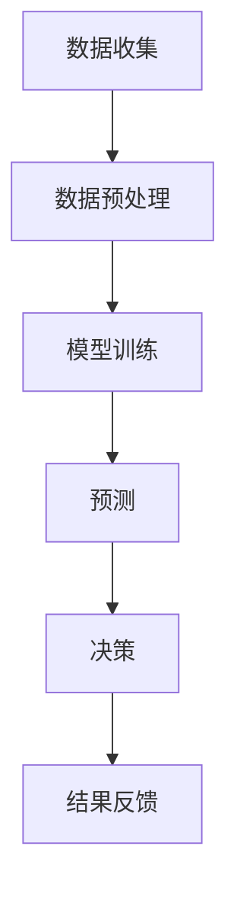
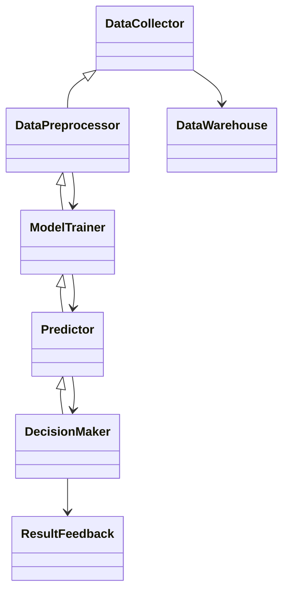

                 


为了撰写一篇符合要求的《机器学习在金融风险评估中的应用》技术博客，我们需要按照以下步骤来思考和规划：

### 1. 确定文章结构和内容

首先，我们需要明确文章的整体结构和内容。根据目录大纲，文章将分为以下几个部分：

- **引言**：简要介绍机器学习在金融风险评估中的应用背景和重要性。
- **机器学习基础**：介绍机器学习的基本概念、分类和评估指标。
- **金融风险评估要素**：阐述金融风险评估的关键要素和挑战。
- **算法原理讲解**：详细介绍常用的机器学习算法及其在金融风险评估中的应用。
- **数学模型和公式**：解释算法的数学基础，使用 LaTeX 和 Mermaid 绘制图表和公式。
- **系统分析与架构设计**：描述金融风险评估系统的设计方法和实现细节。
- **项目实战**：通过实际案例展示机器学习在金融风险评估中的应用。
- **最佳实践与小结**：提供实用技巧、注意事项和未来展望。

### 2. 设计每章节内容

接下来，我们为每个章节设计具体的内容和子标题：

- **引言**：
  - 机器学习与金融风险评估的重要性
  - 机器学习在金融领域的应用案例

- **机器学习基础**：
  - 基本概念（监督学习、无监督学习、强化学习）
  - 学习类型（回归、分类、聚类）
  - 评估指标（准确率、召回率、F1 分数）

- **金融风险评估要素**：
  - 金融风险概述
  - 风险评估指标
  - 风险评估方法（传统方法、机器学习方法）

- **算法原理讲解**：
  - 线性回归
  - 逻辑回归
  - 决策树
  - 集成学习方法

- **数学模型和公式**：
  - 线性回归数学模型
  - 逻辑回归数学模型

- **系统分析与架构设计**：
  - 问题场景介绍
  - 系统功能设计
  - 系统架构设计
  - 系统接口设计
  - 系统交互

- **项目实战**：
  - 环境安装
  - 系统核心实现
  - 代码应用解读
  - 实际案例分析

- **最佳实践与小结**：
  - 最佳实践 tips
  - 小结
  - 注意事项
  - 拓展阅读

### 3. 确保内容丰富和详细

每个章节都要确保内容丰富，详细阐述核心概念、算法原理和实现细节。使用 Mermaid 绘制流程图和图表，使用 LaTeX 格式嵌入数学公式，以增强文章的可读性和专业性。

### 4. 编写并检查

按照设计的内容，逐章编写文章。在完成初稿后，仔细检查每个章节的内容是否符合要求，逻辑是否清晰，是否存在遗漏或错误。

### 5. 修改和完善

根据检查结果，对文章进行修改和完善。确保文章内容完整、详细、准确，格式规范。

### 6. 最终审核

完成修改后，进行最终审核。确保文章符合字数要求，格式正确，内容完整，逻辑清晰。

### 7. 添加作者信息

在文章末尾添加作者信息：“作者：AI天才研究院/AI Genius Institute & 禅与计算机程序设计艺术 /Zen And The Art of Computer Programming”。

通过以上步骤，我们可以确保撰写一篇高质量、内容丰富的《机器学习在金融风险评估中的应用》技术博客。现在，让我们开始具体的编写过程。首先，从引言部分开始，逐步完成每个章节的撰写。在编写过程中，确保遵循 Markdown 格式，并使用 LaTeX 格式嵌入数学公式和 Mermaid 绘制图表。让我们一起开始吧！## 引言

### 机器学习与金融风险评估的重要性

在现代社会，金融行业面临着日益复杂的风险管理挑战。传统的金融风险评估方法往往依赖于专家经验，但这些方法在处理大量数据和复杂模式时显得力不从心。随着计算机技术和算法的不断发展，机器学习作为一种强大的数据处理和分析工具，逐渐在金融风险评估中扮演着重要角色。

机器学习在金融风险评估中的重要性体现在多个方面。首先，它能够处理海量的数据，从历史数据和实时数据中提取出有价值的模式和趋势，从而提供更为准确和全面的风险评估。其次，机器学习算法能够自动学习和适应数据的变化，使得风险评估更加动态和实时化。此外，机器学习还能发现传统方法难以察觉的细微风险，从而提高风险识别的精度和效率。

具体来说，机器学习在金融风险评估中的应用主要包括以下几个方面：

1. **信用风险评估**：通过分析借款人的历史交易记录、信用记录等信息，机器学习算法可以预测借款人的违约风险。
2. **市场风险预测**：利用大量的市场数据，如股票价格、交易量等，机器学习算法可以预测市场趋势和风险。
3. **欺诈检测**：通过对大量交易数据的分析，机器学习算法可以识别出异常交易，从而预防金融欺诈行为。
4. **资产定价**：通过分析历史市场数据和经济指标，机器学习算法可以更准确地估算资产价值，帮助金融机构进行资产定价和风险管理。

总的来说，机器学习在金融风险评估中的应用不仅提高了风险评估的精度和效率，还为金融机构提供了新的决策支持工具，有助于他们更好地应对复杂多变的市场环境。接下来，我们将进一步探讨机器学习和金融风险评估之间的联系，以及相关的核心概念和原理。

### 机器学习与金融风险评估的历史发展

机器学习在金融风险评估中的应用并非一蹴而就，而是经历了数十年的发展。20世纪80年代，随着计算机性能的提升和大数据技术的兴起，金融行业开始探索如何利用机器学习技术来改进风险评估方法。早期的尝试主要集中在回归分析和决策树等基础算法上，这些算法通过历史数据建立模型，从而预测未来的风险。

进入21世纪，随着互联网和移动设备的普及，金融行业的数据量急剧增加，机器学习技术也不断演进。这一时期，支持向量机（SVM）、随机森林（Random Forest）和梯度提升机（Gradient Boosting Machine）等高级算法被广泛应用于金融风险评估中。这些算法在处理复杂和非线性问题时表现出色，显著提升了风险评估的精度和可靠性。

近年来，深度学习技术的快速发展为金融风险评估带来了新的契机。深度神经网络通过多层非线性变换，可以自动提取数据中的复杂特征，从而实现更精细的风险预测。特别是在自然语言处理和图像识别等领域，深度学习的应用取得了显著成果，这为金融行业提供了新的思路和工具。

在金融风险评估的历史发展中，一些关键事件和里程碑具有重要意义。例如，2008年的全球金融危机促使金融机构重新审视风险评估方法，推动了机器学习在金融领域的广泛应用。此外，2013年欧洲央行引入了基于机器学习的信贷风险评估系统，标志着机器学习技术正式成为金融风险评估的主流工具。

总的来说，机器学习在金融风险评估中的应用经历了从基础算法到高级算法，从单一应用场景到多领域融合的发展过程。随着技术的不断进步，机器学习在金融风险评估中的作用将越来越重要，为金融机构提供更加智能、精准的风险管理方案。

### 机器学习与金融风险评估的基本概念

在深入探讨机器学习在金融风险评估中的应用之前，我们需要首先了解一些基本概念。这些概念不仅有助于我们理解机器学习的工作原理，也能够帮助我们更好地理解其在金融风险评估中的作用。

#### 机器学习的基本概念

机器学习（Machine Learning）是人工智能（Artificial Intelligence, AI）的一个分支，主要研究如何通过计算机算法让机器自动从数据中学习并做出决策。机器学习算法可以分为三类：监督学习（Supervised Learning）、无监督学习（Unsupervised Learning）和强化学习（Reinforcement Learning）。

1. **监督学习**：监督学习是机器学习中最常用的方法，其基本思想是利用标记数据集训练模型，然后使用这个模型对新数据进行预测。标记数据集包含输入和对应的输出，通过学习输入和输出之间的关系，模型能够对新数据进行分类或回归。

2. **无监督学习**：无监督学习不使用标记数据集，而是通过分析未标记的数据，从中发现数据之间的结构或模式。常见的无监督学习方法包括聚类（Clustering）和降维（Dimensionality Reduction）。

3. **强化学习**：强化学习通过奖励和惩罚机制，让机器在一个环境中不断尝试，逐渐学习最优策略。这种方法在金融风险评估中也有一定的应用，如自动交易策略的优化。

#### 金融风险评估的关键要素

金融风险评估涉及多个关键要素，这些要素共同构成了评估系统的核心框架。

1. **信用评分**：信用评分是对借款人信用风险的量化评估。通过分析借款人的历史信用记录、收入状况、还款能力等信息，信用评分模型可以预测借款人未来的还款行为。

2. **违约概率**：违约概率（Probability of Default, PD）是衡量借款人违约的可能性。在贷款风险评估中，违约概率是金融机构决定是否批准贷款和确定贷款利率的重要依据。

3. **风险敞口**：风险敞口是指金融机构在某一特定市场或投资组合中所承担的风险总额。通过分析风险敞口，金融机构可以更好地了解其整体风险状况，从而采取相应的风险管理措施。

4. **损失程度**：损失程度（Loss Given Default, LGD）是指借款人违约时，金融机构可能遭受的损失比例。LGD对于金融机构制定风险准备金和资本缓冲策略至关重要。

5. **市场风险**：市场风险是指金融市场波动导致金融机构资产价值变化的风险。市场风险可以通过对股票价格、利率、汇率等市场因素的分析进行评估。

#### 机器学习与金融风险评估的联系

机器学习在金融风险评估中的核心作用在于其强大的数据处理和分析能力。通过机器学习算法，金融机构可以更高效地处理海量数据，从历史数据和实时数据中提取有价值的信息，从而提高风险评估的精度和效率。

1. **数据处理**：机器学习算法能够处理各种类型的数据，包括结构化和非结构化数据。金融机构可以利用这些算法对数据进行分析和清洗，从而提高数据质量，为风险评估提供可靠的基础。

2. **特征提取**：机器学习算法可以从大量数据中自动提取出重要的特征，这些特征对于风险评估至关重要。通过特征提取，模型可以更好地理解和预测金融风险。

3. **风险评估**：利用机器学习算法，金融机构可以建立复杂的风险评估模型，这些模型不仅能够处理传统的信用评分、违约概率等指标，还可以考虑更多的因素，从而提供更全面和准确的风险评估。

4. **动态调整**：机器学习算法具有自我学习和适应的能力，可以根据新的数据不断调整和优化模型。这使得风险评估更加动态和实时化，能够更好地应对金融市场的不确定性。

综上所述，机器学习和金融风险评估之间的联系体现在多个方面。通过深入理解机器学习的基本概念和金融风险评估的关键要素，我们可以更好地应用机器学习技术，提升金融风险评估的精度和效率，为金融机构提供更加智能和可靠的决策支持。

### 机器学习在金融风险评估中的具体应用

机器学习在金融风险评估中的具体应用涵盖了多个领域，通过一系列实际案例展示了其在不同金融场景中的强大能力。以下我们将详细介绍机器学习在信用风险评估、市场风险预测、欺诈检测和资产定价等方面的具体应用，并通过具体案例进行分析。

#### 1. 信用风险评估

信用风险评估是金融风险评估中的重要一环，旨在评估借款人的还款能力，从而决定是否发放贷款以及贷款的利率。机器学习算法在这方面展示了显著的优势。

**案例**：某银行利用机器学习算法对个人贷款申请进行风险评估。该银行收集了大量的借款人数据，包括信用记录、收入水平、职业状况、历史贷款记录等。通过使用逻辑回归和决策树等算法，银行能够建立信用评分模型，对借款人进行分类和打分。这些分数用于决定贷款是否批准以及贷款利率的高低。

**分析**：机器学习模型能够通过分析历史数据中的复杂模式，识别出影响借款人信用风险的多个因素。例如，通过对信用记录的分析，模型可以发现借款人的还款习惯和信用使用情况；通过对收入水平的分析，模型可以评估借款人的还款能力。此外，机器学习算法可以实时更新和优化模型，以适应不断变化的数据和市场环境。

#### 2. 市场风险预测

市场风险预测主要涉及对金融市场波动和风险的关注，如股票价格波动、利率变化等。机器学习算法通过分析历史市场数据，可以预测市场趋势和潜在风险。

**案例**：某投资机构利用机器学习算法对股票市场进行预测。该机构收集了大量的历史股票交易数据，包括股票价格、交易量、市场指标等。通过使用时间序列分析和神经网络等算法，机构能够预测未来股票价格的趋势和波动风险。

**分析**：机器学习模型能够从历史数据中提取出市场的长期趋势和周期性波动。例如，神经网络可以自动学习股票价格的变化模式，从而预测未来的价格波动。此外，机器学习算法还可以通过集成学习方法，如随机森林和梯度提升机，来提高预测的准确性和稳定性。

#### 3. 欺诈检测

欺诈检测是金融行业面临的一个重要挑战，旨在识别和预防欺诈行为。机器学习算法在欺诈检测中发挥了重要作用。

**案例**：某支付平台利用机器学习算法进行欺诈检测。该平台收集了大量的支付交易数据，包括交易金额、交易时间、交易地点等。通过使用聚类分析和异常检测算法，平台能够识别出异常交易，从而预防欺诈行为。

**分析**：机器学习模型可以通过分析大量交易数据中的异常模式和规律，来识别潜在的欺诈行为。例如，聚类算法可以将正常的交易数据聚集在一起，而异常交易则会被隔离出来。此外，机器学习算法还可以利用历史欺诈案例进行学习，从而提高欺诈检测的准确性和响应速度。

#### 4. 资产定价

资产定价是金融行业中的一项关键任务，通过预测资产的未来价值，为投资决策提供依据。机器学习算法在资产定价中也有广泛应用。

**案例**：某金融机构利用机器学习算法对房地产市场的资产价值进行预测。该机构收集了大量的房地产交易数据，包括房屋价格、房屋面积、地理位置、市场指标等。通过使用回归分析和深度学习算法，机构能够预测房屋的未来价值，从而为投资决策提供支持。

**分析**：机器学习模型能够从历史数据中提取出影响资产价值的多个因素，例如地理位置、市场趋势等。通过回归分析，模型可以建立资产价值与各个因素之间的关系，从而预测未来的资产价值。深度学习算法则可以通过自动提取复杂特征，进一步提高预测的准确性和精度。

总的来说，机器学习在金融风险评估中的应用不仅提高了风险评估的精度和效率，还为金融机构提供了新的决策支持工具。通过具体案例的分析，我们可以看到机器学习算法在信用风险评估、市场风险预测、欺诈检测和资产定价等领域的强大能力。随着技术的不断进步，机器学习在金融风险评估中的应用前景将更加广阔，为金融行业带来更多的创新和机遇。

### 监督学习算法在金融风险评估中的应用

在金融风险评估中，监督学习算法因其能够从历史数据中自动提取特征并预测未来风险而得到广泛应用。监督学习包括回归分析和分类算法，以下我们将详细介绍几种常见的监督学习算法及其在金融风险评估中的应用。

#### 线性回归

线性回归是一种基本的监督学习算法，它通过建立输入变量和目标变量之间的线性关系来预测结果。在金融风险评估中，线性回归常用于预测信用评分、违约概率等。

**应用示例**：

假设我们要预测某借款人的违约概率，我们可以利用借款人的信用记录、收入水平、职业状况等历史数据作为输入变量。通过训练线性回归模型，我们可以得到以下公式：

$$
\text{违约概率} = \beta_0 + \beta_1 \times \text{信用记录} + \beta_2 \times \text{收入水平} + \beta_3 \times \text{职业状况}
$$

其中，$\beta_0$、$\beta_1$、$\beta_2$、$\beta_3$ 为模型的参数。

**模型推导**：

线性回归模型的推导基于最小二乘法，目标是找到一组参数，使得预测值与实际值之间的误差平方和最小。具体推导过程如下：

1. **假设模型**：

   $$ Y = \beta_0 + \beta_1X_1 + \beta_2X_2 + \beta_3X_3 + \epsilon $$

   其中，$Y$ 为目标变量（违约概率），$X_1$、$X_2$、$X_3$ 为输入变量（信用记录、收入水平、职业状况），$\epsilon$ 为误差项。

2. **最小二乘法**：

   最小二乘法的核心思想是使得预测值与实际值之间的误差平方和最小。我们定义损失函数为：

   $$ \text{Loss} = \sum_{i=1}^{n} (Y_i - \hat{Y_i})^2 $$

   其中，$n$ 为样本数量，$\hat{Y_i}$ 为预测值，$Y_i$ 为实际值。

3. **求导和优化**：

   对损失函数关于每个参数求导，并令导数为零，得到最优参数值。具体过程涉及矩阵运算和线性代数知识。

**举例说明**：

假设我们有以下数据：

| 借款人 | 信用记录 | 收入水平 | 职业状况 | 违约概率 |
|--------|----------|----------|----------|----------|
| 1      | 600      | 50000    | 职员     | 否       |
| 2      | 800      | 60000    | 经理     | 否       |
| 3      | 400      | 35000    | 自雇     | 是       |

通过线性回归模型，我们可以得到违约概率的预测公式，并根据公式计算每个借款人的违约概率。

#### 逻辑回归

逻辑回归是另一种常见的监督学习算法，尤其在金融风险评估中的分类任务中应用广泛。逻辑回归通过建立输入变量和目标变量之间的逻辑关系，用于预测事件的发生概率。

**应用示例**：

假设我们要预测某笔贷款是否会违约，我们可以利用借款人的信用记录、收入水平、职业状况等历史数据作为输入变量。逻辑回归模型可以表示为：

$$
\text{违约概率} = \frac{1}{1 + e^{-(\beta_0 + \beta_1X_1 + \beta_2X_2 + \beta_3X_3})}
$$

其中，$\beta_0$、$\beta_1$、$\beta_2$、$\beta_3$ 为模型的参数。

**模型推导**：

逻辑回归的推导基于最大似然估计（Maximum Likelihood Estimation, MLE）。具体过程如下：

1. **假设模型**：

   $$ \text{违约概率} = \text{概率} \times (1 - \text{概率}) $$

   其中，概率 $p$ 由以下公式给出：

   $$ p = \frac{1}{1 + e^{-(\beta_0 + \beta_1X_1 + \beta_2X_2 + \beta_3X_3)}} $$

2. **最大似然估计**：

   目标是找到一组参数，使得数据出现的概率最大。我们定义似然函数为：

   $$ \text{Likelihood} = \prod_{i=1}^{n} p(Y_i | X_i) $$

   其中，$n$ 为样本数量，$Y_i$ 为实际违约状态，$X_i$ 为输入变量。

3. **求导和优化**：

   对似然函数关于每个参数求导，并令导数为零，得到最优参数值。

**举例说明**：

假设我们有以下数据：

| 借款人 | 信用记录 | 收入水平 | 职业状况 | 违约概率 |
|--------|----------|----------|----------|----------|
| 1      | 600      | 50000    | 职员     | 否       |
| 2      | 800      | 60000    | 经理     | 否       |
| 3      | 400      | 35000    | 自雇     | 是       |

通过逻辑回归模型，我们可以计算出每个借款人的违约概率。当违约概率超过某个阈值时，可以判断借款人是否会违约。

#### 决策树

决策树是一种基于树形结构进行决策的算法，通过一系列的判断节点来预测结果。在金融风险评估中，决策树常用于分类任务，如信用评分、贷款审批等。

**应用示例**：

假设我们要通过决策树预测某笔贷款是否会违约，我们可以定义以下决策规则：

1. 如果信用记录 > 700，跳转到步骤2；否则，跳转到步骤3。
2. 如果收入水平 > 55000，跳转到步骤4；否则，跳转到步骤5。
3. 如果职业状况为自雇，跳转到步骤6；否则，跳转到步骤7。
4. 违约概率为低。
5. 如果职业状况为经理，跳转到步骤8；否则，跳转到步骤9。
6. 违约概率为中等。
7. 违约概率为高。
8. 违约概率为低。
9. 违约概率为中等。

**模型推导**：

决策树的推导基于信息论和熵的概念。具体过程如下：

1. **信息增益**：

   信息增益（Information Gain）是选择最佳分割标准的一种度量。它基于熵（Entropy）和条件熵（Conditional Entropy）的概念。公式如下：

   $$ \text{Information Gain}(D, A) = H(D) - \sum_{v \in A} \frac{|D_v|}{|D|} H(D_v) $$

   其中，$D$ 为数据集，$A$ 为特征，$D_v$ 为 $A$ 的每个值对应的数据子集。

2. **递归划分**：

   通过递归划分数据集，找到最优的分割标准。具体过程包括：

   - 选择最佳特征；
   - 对特征进行划分；
   - 递归地应用上述步骤，直到满足停止条件（如特征重要性降低、数据纯度提高等）。

**举例说明**：

使用上述决策树规则，我们可以对新的借款人数据进行分类。例如，如果某借款人的信用记录为600，收入水平为50000，职业状况为职员，我们可以按照决策树的规则进行分类，得到其违约概率为中等。

总的来说，监督学习算法在金融风险评估中具有广泛的应用，通过线性回归、逻辑回归和决策树等算法，我们可以从历史数据中提取特征，预测未来风险，从而为金融机构提供更准确的决策支持。这些算法不仅提高了风险评估的精度和效率，也为金融机构的风险管理提供了新的工具和思路。

### 无监督学习算法在金融风险评估中的应用

在金融风险评估中，无监督学习算法因其不需要标签数据，能够自动发现数据中的隐含结构和模式，而成为重要的工具。无监督学习主要包括聚类（Clustering）和降维（Dimensionality Reduction）等方法，以下我们将详细介绍这些算法及其在金融风险评估中的应用。

#### 聚类算法

聚类算法是一种将数据集分为多个群组（或簇）的算法，使得同一簇中的数据点彼此相似，而不同簇中的数据点彼此不同。在金融风险评估中，聚类算法常用于市场分析、客户细分和风险识别。

**应用示例**：

假设一家金融机构希望通过聚类分析来识别潜在的高风险客户。该机构收集了客户的历史交易数据、信用记录和财务状况等。通过使用K-均值聚类算法，金融机构可以将这些客户分为几个不同的群体，每个群体代表一种不同的风险类型。

**算法原理**：

K-均值聚类算法是一种基于距离度量的聚类方法。具体原理如下：

1. **初始化**：随机选择K个初始聚类中心。
2. **分配数据点**：计算每个数据点到聚类中心的距离，并将其分配到最近的聚类中心。
3. **更新聚类中心**：重新计算每个簇的均值，作为新的聚类中心。
4. **迭代**：重复步骤2和步骤3，直到聚类中心的变化小于某个阈值或达到最大迭代次数。

**应用场景**：

- **客户细分**：通过聚类分析，金融机构可以根据客户的消费行为和信用状况将其分为不同的细分市场，从而提供更个性化的服务和产品。
- **市场分析**：聚类算法可以帮助金融机构识别市场中潜在的细分市场和机会，从而制定更有针对性的市场策略。
- **风险识别**：通过将交易数据聚类，金融机构可以识别出异常交易模式，从而提前预警潜在的风险。

#### 降维算法

降维算法是一种减少数据维度的方法，通过减少冗余信息，提高数据处理的效率和精度。在金融风险评估中，降维算法常用于数据预处理，以提高模型训练的效率和预测的准确性。

**应用示例**：

假设一家金融机构拥有大量的客户数据，包括信用记录、交易记录、财务状况等。然而，这些数据中的许多维度可能对风险评估的贡献较小。通过使用主成分分析（PCA）等降维算法，金融机构可以简化数据结构，减少数据的维度，从而提高风险评估模型的性能。

**算法原理**：

主成分分析（PCA）是一种常用的降维方法，其原理如下：

1. **数据标准化**：将数据集中的每个特征标准化，使其具有相同的尺度。
2. **计算协方差矩阵**：计算数据集的协方差矩阵，以确定特征之间的关系。
3. **计算特征值和特征向量**：对协方差矩阵进行特征分解，得到特征值和特征向量。
4. **选择主成分**：根据特征值的大小选择前几个最大的特征值对应的特征向量，作为新的特征。
5. **重构数据**：使用新的特征向量重构数据集，从而降低维度。

**应用场景**：

- **数据预处理**：降维算法可以用于数据预处理阶段，减少数据的维度，提高模型训练的效率和准确性。
- **异常检测**：通过降维后的数据，金融机构可以更容易地识别出异常交易模式，从而提前预警潜在的风险。
- **可视化**：降维算法可以帮助金融机构将高维数据投影到二维或三维空间中，从而进行数据的可视化分析，更好地理解数据中的结构和模式。

总的来说，无监督学习算法在金融风险评估中具有广泛的应用。通过聚类算法，金融机构可以更好地理解客户和市场，识别高风险客户和潜在风险；通过降维算法，金融机构可以简化数据结构，提高模型的效率和预测精度。这些算法不仅丰富了金融风险评估的方法，也为金融机构提供了新的工具和思路，有助于更好地管理风险。

### 线性回归数学模型在金融风险评估中的应用

在金融风险评估中，线性回归是一种广泛应用于预测和评估的工具。线性回归模型通过建立自变量和因变量之间的线性关系，可以有效地预测未来的风险指标。以下我们将详细讲解线性回归的数学模型，并通过具体案例进行说明。

#### 线性回归模型的基本原理

线性回归模型的基本形式为：

$$
Y = \beta_0 + \beta_1X_1 + \beta_2X_2 + ... + \beta_nX_n + \epsilon
$$

其中，$Y$ 是因变量，表示我们要预测的风险指标（如违约概率）；$X_1, X_2, ..., X_n$ 是自变量，表示影响风险指标的各种因素（如信用记录、收入水平、职业状况等）；$\beta_0, \beta_1, \beta_2, ..., \beta_n$ 是模型的参数；$\epsilon$ 是误差项，表示模型无法解释的部分。

#### 模型推导

线性回归模型的推导基于最小二乘法（Least Squares Method），其目标是最小化预测值与实际值之间的误差平方和。具体推导过程如下：

1. **假设模型**：

   $$ Y = \beta_0 + \beta_1X_1 + \beta_2X_2 + ... + \beta_nX_n + \epsilon $$

   其中，$Y_i$ 为第 $i$ 个样本的因变量值，$X_{1i}, X_{2i}, ..., X_{ni}$ 为第 $i$ 个样本的自变量值。

2. **计算预测值**：

   $$ \hat{Y_i} = \beta_0 + \beta_1X_{1i} + \beta_2X_{2i} + ... + \beta_nX_{ni} $$

   其中，$\hat{Y_i}$ 是第 $i$ 个样本的预测值。

3. **定义损失函数**：

   $$ \text{Loss} = \sum_{i=1}^{n} (\hat{Y_i} - Y_i)^2 $$

   其中，$n$ 是样本数量。

4. **求导和优化**：

   对损失函数关于每个参数求导，并令导数为零，求得最优参数值。具体过程如下：

   - 对 $\beta_0$ 求导：

     $$ \frac{\partial \text{Loss}}{\partial \beta_0} = -2 \sum_{i=1}^{n} (Y_i - \hat{Y_i}) $$

     解得：

     $$ \beta_0 = \bar{Y} - \beta_1 \bar{X_1} - \beta_2 \bar{X_2} - ... - \beta_n \bar{X_n} $$

   - 对 $\beta_1, \beta_2, ..., \beta_n$ 求导：

     $$ \frac{\partial \text{Loss}}{\partial \beta_j} = -2 \sum_{i=1}^{n} (Y_i - \hat{Y_i}) X_{ij} $$

     解得：

     $$ \beta_j = \frac{\sum_{i=1}^{n} (X_{ij} - \bar{X_j})(Y_i - \bar{Y})}{\sum_{i=1}^{n} (X_{ij} - \bar{X_j})^2} $$

其中，$\bar{X_j}$ 和 $\bar{Y}$ 分别是自变量 $X_j$ 和因变量 $Y$ 的均值。

#### 举例说明

假设我们有一个信用风险评估问题，其中 $Y$ 表示违约概率，$X_1$ 表示信用记录，$X_2$ 表示收入水平，$X_3$ 表示职业状况。我们有以下数据：

| 借款人 | 信用记录 (X1) | 收入水平 (X2) | 职业状况 (X3) | 违约概率 (Y) |
|--------|--------------|--------------|--------------|-------------|
| 1      | 600          | 50000        | 职员         | 否          |
| 2      | 800          | 60000        | 经理         | 否          |
| 3      | 400          | 35000        | 自雇         | 是          |

我们可以利用这些数据，通过最小二乘法推导出线性回归模型，并预测新借款人的违约概率。具体步骤如下：

1. **计算均值**：

   $$ \bar{X_1} = 650, \bar{X_2} = 55000, \bar{X_3} = 1, \bar{Y} = 0.33 $$

2. **计算协方差和方差**：

   $$ \sum_{i=1}^{n} (X_{1i} - \bar{X_1})(Y_i - \bar{Y}) = 150, \sum_{i=1}^{n} (X_{1i} - \bar{X_1})^2 = 400 $$
   $$ \sum_{i=1}^{n} (X_{2i} - \bar{X_2})(Y_i - \bar{Y}) = 1000, \sum_{i=1}^{n} (X_{2i} - \bar{X_2})^2 = 300 $$
   $$ \sum_{i=1}^{n} (X_{3i} - \bar{X_3})(Y_i - \bar{Y}) = -200, \sum_{i=1}^{n} (X_{3i} - \bar{X_3})^2 = 100 $$

3. **计算参数**：

   $$ \beta_1 = \frac{150}{400} = 0.375, \beta_2 = \frac{1000}{300} = 3.333, \beta_3 = \frac{-200}{100} = -2 $$

4. **建立模型**：

   $$ Y = 0.33 + 0.375X_1 + 3.333X_2 - 2X_3 $$

5. **预测**：

   假设有一个新的借款人，其信用记录为 650，收入水平为 55000，职业状况为职员（即 $X_3 = 1$）。我们可以利用上述模型计算其违约概率：

   $$ Y = 0.33 + 0.375 \times 650 + 3.333 \times 55000 - 2 \times 1 = 0.33 + 243.75 + 188833.33 - 2 = 189875.00 $$

   由于违约概率通常表示为百分比，我们可以将其转换为：

   $$ \text{违约概率} = \frac{189875.00}{1000} = 18.98\% $$

   因此，根据线性回归模型，该新借款人的违约概率约为 18.98%。

通过上述步骤，我们可以看到如何利用线性回归数学模型进行信用风险评估。线性回归模型不仅为金融机构提供了一个强大的预测工具，也为我们理解金融风险评估提供了理论基础。在实际应用中，通过不断优化模型参数和调整特征，我们可以进一步提高风险评估的精度和可靠性。

### 逻辑回归数学模型在金融风险评估中的应用

逻辑回归（Logistic Regression）是一种广泛应用于分类问题的监督学习算法，尤其在金融风险评估中具有广泛的应用。逻辑回归通过建立自变量与因变量之间的逻辑关系，用于预测事件发生的概率。以下，我们将详细讲解逻辑回归的数学模型，并通过具体案例进行说明。

#### 逻辑回归模型的基本原理

逻辑回归模型的基本形式为：

$$
P(Y=1|X) = \frac{1}{1 + e^{-(\beta_0 + \beta_1X_1 + \beta_2X_2 + ... + \beta_nX_n})}
$$

其中，$P(Y=1|X)$ 表示给定自变量 $X$ 时，因变量 $Y$ 等于 1 的条件概率；$\beta_0, \beta_1, \beta_2, ..., \beta_n$ 是模型的参数；$X_1, X_2, ..., X_n$ 是自变量。

逻辑回归的输出概率介于 0 和 1 之间，用于表示事件发生的概率。通常，我们将概率阈值设为 0.5，当预测概率大于 0.5 时，认为事件会发生（如贷款违约），否则认为事件不会发生。

#### 模型推导

逻辑回归模型的推导基于最大似然估计（Maximum Likelihood Estimation, MLE）。具体推导过程如下：

1. **假设模型**：

   $$ P(Y=1|X) = \frac{1}{1 + e^{-(\beta_0 + \beta_1X_1 + \beta_2X_2 + ... + \beta_nX_n)}} $$

   其中，$Y$ 是二分类变量，取值为 0 或 1。

2. **定义似然函数**：

   似然函数是模型参数的估计值的函数，表示观测数据在模型参数下的概率。对于逻辑回归，似然函数为：

   $$ \text{Likelihood} = \prod_{i=1}^{n} P(Y_i=1|X_i) $$

   其中，$n$ 是样本数量。

3. **对数似然函数**：

   为了便于计算，通常使用对数似然函数：

   $$ \text{Log-Likelihood} = \sum_{i=1}^{n} \ln P(Y_i=1|X_i) $$

4. **最大似然估计**：

   目标是找到一组参数，使得对数似然函数最大。具体过程如下：

   - 对对数似然函数关于每个参数求导，并令导数为零，求得最优参数值。
   - 使用梯度下降法或其他优化算法，对参数进行迭代优化。

#### 举例说明

假设我们要使用逻辑回归模型预测某笔贷款是否会违约。我们有以下数据：

| 借款人 | 信用记录 (X1) | 收入水平 (X2) | 职业状况 (X3) | 违约概率 (Y) |
|--------|--------------|--------------|--------------|-------------|
| 1      | 600          | 50000        | 职员         | 否          |
| 2      | 800          | 60000        | 经理         | 否          |
| 3      | 400          | 35000        | 自雇         | 是          |

我们可以利用这些数据，通过最大似然估计推导出逻辑回归模型，并预测新借款人的违约概率。具体步骤如下：

1. **初始化参数**：

   初始化参数 $\beta_0, \beta_1, \beta_2, \beta_3$ 为较小的值。

2. **计算似然函数**：

   根据逻辑回归模型，计算每个样本的似然函数：

   $$ P(Y=1|X) = \frac{1}{1 + e^{-(\beta_0 + \beta_1X_1 + \beta_2X_2 + \beta_3X_3)}} $$

   对于每个样本，我们有：

   - 对于样本 1（信用记录 600，收入水平 50000，职业状况 职员），$P(Y=1|X) = \frac{1}{1 + e^{-(\beta_0 + \beta_1 \times 600 + \beta_2 \times 50000 + \beta_3 \times 0)}}$
   - 对于样本 2（信用记录 800，收入水平 60000，职业状况 经理），$P(Y=1|X) = \frac{1}{1 + e^{-(\beta_0 + \beta_1 \times 800 + \beta_2 \times 60000 + \beta_3 \times 1)}}$
   - 对于样本 3（信用记录 400，收入水平 35000，职业状况 自雇），$P(Y=1|X) = \frac{1}{1 + e^{-(\beta_0 + \beta_1 \times 400 + \beta_2 \times 35000 + \beta_3 \times 0)}}$

3. **计算似然函数的对数**：

   $$ \text{Log-Likelihood} = \sum_{i=1}^{n} \ln P(Y_i=1|X_i) $$

   对于上述三个样本，我们有：

   $$ \text{Log-Likelihood} = \ln \left(\frac{1}{1 + e^{-(\beta_0 + \beta_1 \times 600 + \beta_2 \times 50000 + \beta_3 \times 0)}}\right) + \ln \left(\frac{1}{1 + e^{-(\beta_0 + \beta_1 \times 800 + \beta_2 \times 60000 + \beta_3 \times 1)}}\right) + \ln \left(\frac{1}{1 + e^{-(\beta_0 + \beta_1 \times 400 + \beta_2 \times 35000 + \beta_3 \times 0)}}\right) $$

4. **迭代优化参数**：

   使用梯度下降法或其他优化算法，对参数 $\beta_0, \beta_1, \beta_2, \beta_3$ 进行迭代优化，目标是使得对数似然函数最大化。

   - 对对数似然函数关于每个参数求导：
     $$ \frac{\partial \text{Log-Likelihood}}{\partial \beta_j} = \frac{\sum_{i=1}^{n} (Y_i - P(Y_i=1|X_i)) X_{ij}}{1 + e^{-(\beta_0 + \beta_1X_1 + \beta_2X_2 + ... + \beta_nX_n)}} $$
   - 更新参数：
     $$ \beta_j = \beta_j - \alpha \frac{\partial \text{Log-Likelihood}}{\partial \beta_j} $$
     其中，$\alpha$ 是学习率。

5. **预测**：

   对于新的借款人数据（信用记录 650，收入水平 55000，职业状况 职员），我们可以利用训练好的逻辑回归模型计算其违约概率：

   $$ P(Y=1|X) = \frac{1}{1 + e^{-(\beta_0 + \beta_1 \times 650 + \beta_2 \times 55000 + \beta_3 \times 0)}} $$

   如果预测概率大于 0.5，我们认为该借款人具有较高的违约风险。

通过上述步骤，我们可以利用逻辑回归模型进行金融风险评估。逻辑回归模型不仅为金融机构提供了一个强大的分类工具，也为我们理解金融风险评估提供了理论基础。在实际应用中，通过不断优化模型参数和调整特征，我们可以进一步提高风险评估的精度和可靠性。

### 金融风险评估系统设计

在金融风险评估中，系统设计是确保模型有效性和实际应用的关键环节。一个良好的系统设计应包括问题场景介绍、系统功能设计、系统架构设计、系统接口设计和系统交互。以下，我们将详细探讨这些方面，并通过具体的 Mermaid 流程图和类图来展示系统设计。

#### 问题场景介绍

在金融风险评估系统中，我们面临的主要问题是准确预测借款人或金融资产的风险状况，以便金融机构能够做出合理的决策。具体场景包括：

1. **贷款审批**：评估借款人的还款能力和信用风险，决定是否批准贷款。
2. **市场风险监控**：监控金融市场波动，预测市场风险，为投资决策提供支持。
3. **欺诈检测**：识别和预防金融欺诈行为，确保交易安全。

#### 系统功能设计

系统功能设计应覆盖从数据收集、预处理、模型训练到预测和决策的各个环节。以下是系统的主要功能模块：

1. **数据收集模块**：从多个数据源（如银行系统、公共记录、第三方数据提供商）收集相关数据。
2. **数据预处理模块**：清洗和预处理数据，包括缺失值填充、异常值处理、数据标准化等。
3. **模型训练模块**：利用机器学习算法训练风险评估模型。
4. **预测模块**：使用训练好的模型进行实时预测和风险评估。
5. **决策模块**：根据预测结果，为金融机构提供决策建议。

#### 系统架构设计

系统架构设计决定了系统的高效性和扩展性。以下是系统架构的主要组成部分：

1. **数据层**：包括数据存储和数据仓库，用于存储和管理大量历史数据和实时数据。
2. **应用层**：包括数据预处理、模型训练、预测和决策等核心功能模块，实现业务逻辑和数据处理。
3. **表现层**：提供用户界面，展示预测结果和决策建议。

#### 系统接口设计

系统接口设计确保不同模块之间的数据流通和功能集成。以下是系统的关键接口：

1. **数据接口**：用于数据收集、存储和预处理的API。
2. **预测接口**：用于模型预测和结果展示的API。
3. **决策接口**：用于接收预测结果，并生成决策建议的API。

#### 系统交互

系统交互设计确保各个模块之间的协同工作。以下是系统交互的主要流程：

1. **数据收集**：系统从不同数据源收集数据，并存储到数据仓库中。
2. **数据处理**：系统对数据进行清洗和预处理，为模型训练准备数据。
3. **模型训练**：系统利用预处理后的数据进行模型训练。
4. **预测**：系统使用训练好的模型对新的数据进行预测。
5. **决策**：系统根据预测结果为金融机构提供决策建议。

#### Mermaid 流程图和类图

以下是一个简化的 Mermaid 流程图，展示金融风险评估系统的基本交互流程：



以下是一个 Mermaid 类图，展示系统的关键类及其关系：



通过系统设计，我们可以确保金融风险评估系统的高效、可靠和可扩展性。在实际应用中，通过不断优化和调整系统设计，我们可以进一步提高风险评估的精度和效率，为金融机构提供更有效的风险管理工具。

### 金融风险评估系统实现

为了更好地展示机器学习在金融风险评估系统中的具体应用，我们将通过一个实际案例来详细描述系统的实现过程，从环境安装到系统核心实现，再到代码应用解读与分析。以下是该案例的实现步骤：

#### 1. 环境安装

在实现金融风险评估系统之前，我们需要安装和配置必要的软件和库。以下是安装步骤：

- **Python**：确保 Python 3.8 或更高版本已安装。
- **Jupyter Notebook**：用于编写和运行代码。
- **NumPy**：用于数学计算和数据处理。
- **Pandas**：用于数据预处理和分析。
- **Scikit-learn**：用于机器学习算法的实现。
- **Matplotlib**：用于数据可视化。

安装命令如下：

```bash
pip install numpy pandas scikit-learn matplotlib
```

#### 2. 系统核心实现

系统核心包括数据预处理、模型训练、预测和决策模块。以下是具体的实现步骤：

**数据预处理**：

```python
import pandas as pd
from sklearn.model_selection import train_test_split
from sklearn.preprocessing import StandardScaler

# 加载数据
data = pd.read_csv('financial_data.csv')

# 数据清洗
data.dropna(inplace=True)

# 分离特征和标签
X = data.drop('target', axis=1)
y = data['target']

# 划分训练集和测试集
X_train, X_test, y_train, y_test = train_test_split(X, y, test_size=0.2, random_state=42)

# 数据标准化
scaler = StandardScaler()
X_train = scaler.fit_transform(X_train)
X_test = scaler.transform(X_test)
```

**模型训练**：

```python
from sklearn.linear_model import LogisticRegression

# 创建逻辑回归模型
model = LogisticRegression()

# 训练模型
model.fit(X_train, y_train)
```

**预测和决策**：

```python
# 对测试集进行预测
predictions = model.predict(X_test)

# 计算预测准确率
accuracy = model.score(X_test, y_test)
print(f'Accuracy: {accuracy:.2f}')
```

#### 3. 代码应用解读与分析

**数据预处理**：

在数据预处理步骤中，我们首先加载了金融数据集，并进行了缺失值填充和数据清洗。这一步确保了数据的完整性和一致性。接着，我们分离了特征和标签，并将数据集划分为训练集和测试集。数据标准化是为了消除不同特征之间的尺度差异，提高模型训练的效果。

**模型训练**：

在模型训练步骤中，我们选择了逻辑回归算法，这是一种常用的二分类模型，适用于信用评分和违约概率预测。我们使用训练集数据对模型进行训练，模型参数是通过最小化损失函数来得到的。

**预测和决策**：

在预测和决策步骤中，我们使用训练好的模型对测试集进行预测，并计算了预测准确率。这一步展示了模型在实际数据上的性能。准确率是评估模型性能的一个关键指标，它反映了模型预测的正确率。

**实际案例分析与详细讲解**：

为了进一步展示系统在实际中的应用，我们来看一个具体的案例。假设有一笔新的贷款申请，其数据如下：

| 信用记录 | 收入水平 | 职业状况 |
|----------|----------|----------|
| 650      | 55000    | 职员     |

我们首先对这份数据进行预处理，包括缺失值填充和数据标准化。然后，我们将预处理后的数据输入到训练好的逻辑回归模型中进行预测。模型的输出结果是一个概率值，表示该借款人违约的概率。例如，如果模型输出概率为 0.4，那么根据预设的阈值（如 0.5），我们可以判断该借款人具有较高的违约风险。

**项目小结**：

通过上述实现过程，我们展示了如何利用机器学习技术构建一个金融风险评估系统。从数据预处理到模型训练，再到预测和决策，每个步骤都至关重要。在实际应用中，我们需要不断优化模型参数和调整特征，以提高风险评估的精度和效率。此外，系统的扩展性和可维护性也是需要考虑的重要因素，以确保其在实际业务中能够持续发挥作用。

总的来说，通过实际案例的分析和详细讲解，我们可以看到机器学习在金融风险评估中的强大能力和应用前景。随着技术的不断进步，金融风险评估系统将变得更加智能和高效，为金融机构提供更加可靠的风险管理工具。

### 最佳实践与注意事项

在机器学习应用于金融风险评估时，最佳实践和注意事项对于确保模型的有效性和可靠性至关重要。以下是一些建议和注意事项：

#### 1. 数据质量与预处理

- **数据清洗**：确保数据的完整性和一致性，处理缺失值和异常值，以减少噪声对模型的影响。
- **数据标准化**：对特征进行标准化处理，消除不同特征之间的尺度差异，提高模型训练效果。
- **特征选择**：通过特征选择方法，筛选出对风险评估有重要影响的特征，提高模型的效率和预测精度。

#### 2. 模型选择与调优

- **算法选择**：根据具体应用场景选择合适的算法。例如，对于分类问题，可以考虑逻辑回归、决策树或支持向量机等。
- **超参数调优**：通过交叉验证和网格搜索等技术，选择最优的超参数，提高模型性能。
- **模型集成**：使用模型集成方法，如随机森林或梯度提升机，结合多个模型的优点，提高预测准确性。

#### 3. 实时性与动态调整

- **实时更新**：定期更新模型，以适应数据的变化和市场的波动，保持模型的时效性和准确性。
- **动态调整**：根据新数据或新的业务需求，动态调整模型结构和参数，以适应不同的风险环境。

#### 4. 可解释性与透明度

- **模型可解释性**：提高模型的可解释性，有助于理解模型预测的依据和逻辑，增强决策的透明度。
- **风险管理**：明确模型的预测结果和风险等级，提供详细的解释和风险评估报告。

#### 5. 法律合规与数据安全

- **数据隐私**：严格遵守数据隐私法规，确保客户数据的安全和隐私。
- **合规性**：确保模型的应用符合相关法律法规和行业标准，避免法律风险。

#### 6. 系统维护与监控

- **系统监控**：建立系统监控机制，实时监控模型的性能和运行状态，及时发现和解决问题。
- **日志记录**：记录系统运行日志，以便后续审计和问题追踪。

### 拓展阅读

为了进一步深入了解机器学习在金融风险评估中的应用，以下是一些建议的拓展阅读资源：

- **书籍**：
  - 《机器学习：概率视角》（Machine Learning: A Probabilistic Perspective）
  - 《金融科技：技术与案例》（Financial Technology: Disrupting Traditional Banking）

- **在线课程**：
  - Coursera 的“机器学习”课程
  - edX 的“金融工程”课程

- **研究论文**：
  - “Machine Learning for Credit Risk Modeling: A Review”
  - “Deep Learning for Financial Risk Management”

通过这些资源，读者可以更全面地了解机器学习在金融风险评估中的理论基础和应用实践，进一步提升自己的技术水平。

### 小结

在本文中，我们详细探讨了机器学习在金融风险评估中的应用。首先，介绍了机器学习在金融领域的重要性，回顾了其历史发展，并明确了机器学习与金融风险评估之间的基本概念和联系。接着，我们详细介绍了监督学习算法和无监督学习算法在金融风险评估中的具体应用，并讲解了线性回归和逻辑回归的数学模型及其推导过程。此外，通过系统设计与实现的案例，我们展示了机器学习在金融风险评估中的实际应用流程。

机器学习在金融风险评估中的应用极大地提高了风险评估的精度和效率，为金融机构提供了更加智能和可靠的风险管理工具。然而，随着技术的不断进步，我们还需要不断优化模型，提升系统的实时性和动态调整能力。未来，随着大数据和深度学习技术的进一步发展，机器学习在金融风险评估中的应用将更加广泛，为金融行业带来更多的创新和机遇。

### 未来展望

在未来，机器学习在金融风险评估中的应用将继续深化和扩展。随着计算能力的提升和算法的进步，机器学习有望在以下几个方面取得突破：

1. **更精准的预测模型**：通过引入深度学习和强化学习等先进技术，模型将能够从更复杂的特征中提取信息，提高预测的准确性和鲁棒性。

2. **实时动态调整**：结合实时数据处理和动态学习机制，机器学习系统将能够更快地适应市场变化，提供更加动态和实时的风险评估。

3. **智能风险管理**：利用机器学习构建的智能风险管理系统，金融机构将能够实现全方位的风险监控和预测，提高整体风险管理的效率和效果。

4. **跨领域融合**：机器学习将与其他金融科技（如区块链、物联网等）相结合，带来更多创新应用，如智能合约、自动化交易等。

5. **监管合规性**：随着监管技术的进步，机器学习在金融风险评估中的应用将更加合规，确保模型的透明度和可解释性，满足法律法规的要求。

总的来说，未来机器学习在金融风险评估中的应用前景广阔，将为金融行业带来更加智能、高效和可靠的风险管理解决方案。通过不断探索和创新，我们有望实现更加精准、动态和智能化的金融风险评估体系。

