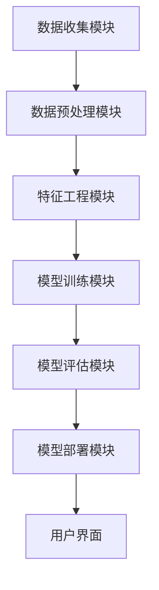

                 

# 机器学习在预测性维护中的工业应用

> 关键词：机器学习、预测性维护、工业应用、算法原理、系统架构设计

> 摘要：本文深入探讨了机器学习在预测性维护中的工业应用。首先介绍了问题背景和核心概念，随后分析了机器学习算法原理，并通过行业分析和案例分析展示了其在实际工业中的应用。文章还详细阐述了关键技术、系统架构设计、项目实战与最佳实践，并展望了未来发展趋势。

### 目录大纲

## 第一部分：背景介绍

### 第1章：问题背景与核心概念

#### 1.1.1 问题背景

- 机器学习与预测性维护简介
- 工业领域预测性维护的需求和挑战

#### 1.1.2 核心概念

- 预测性维护的定义
- 机器学习的基本概念
- 预测性维护中的关键概念

#### 1.1.3 边界与外延

- 预测性维护的应用范围
- 预测性维护与其他维护方式的区别

### 第2章：机器学习算法原理

#### 2.1.1 算法概述

- 常见机器学习算法分类
- 预测性维护中适用的算法

#### 2.1.2 算法原理详解

- 统计学习方法
- 监督学习、无监督学习和半监督学习
- 强化学习

## 第二部分：工业应用案例分析

### 第3章：行业分析

#### 3.1.1 工业领域概述

- 预测性维护在工业领域的应用
- 预测性维护在不同行业的特点

### 第4章：案例分析

#### 4.1.1 案例一：制造业

- 预测性维护在制造业的应用案例
- 案例分析

#### 4.1.2 案例二：能源行业

- 预测性维护在能源行业的应用案例
- 案例分析

### 第5章：关键技术

#### 5.1.1 数据收集与处理

- 数据来源与收集方法
- 数据预处理技术

#### 5.1.2 特征工程

- 特征提取与选择方法
- 特征工程对预测性维护的影响

### 第6章：系统架构设计

#### 6.1.1 系统架构概述

- 预测性维护系统的整体架构
- 系统模块划分

#### 6.1.2 系统功能设计

- 系统功能模块详细描述
- 系统功能模块关系图

### 第7章：项目实战与最佳实践

#### 7.1.1 项目实战

- 环境安装与配置
- 系统核心实现源代码
- 代码应用解读与分析

#### 7.1.2 最佳实践

- 预测性维护中的常见问题与解决方案
- 最佳实践技巧与建议

## 第三部分：展望与总结

### 第8章：未来发展趋势

- 预测性维护技术的发展趋势
- 工业领域预测性维护的未来展望

### 第9章：总结与展望

- 总结全书的核心内容
- 对预测性维护在工业应用中的发展前景进行展望

----------------------------------------------------------------

### 第一部分：背景介绍

#### 第1章：问题背景与核心概念

#### 1.1.1 问题背景

随着工业4.0的推进，制造业和能源行业等工业领域对设备的依赖程度越来越高。设备的正常运行对于生产效率和能源供应的稳定性至关重要。然而，传统的定期维护方式往往无法在设备发生故障之前及时预测和预防，导致生产停滞、能源浪费甚至安全事故。因此，预测性维护成为提高工业设备运行效率和降低维护成本的重要手段。

机器学习作为人工智能的一个重要分支，近年来在预测性维护中显示出巨大的潜力。通过分析历史数据和实时监控数据，机器学习算法能够预测设备何时可能发生故障，从而提前进行维护，降低故障风险和停机时间。

#### 1.1.2 核心概念

**预测性维护**：一种通过实时数据分析和机器学习算法预测设备故障并进行预防性维护的方法。

**机器学习**：一种通过数据训练模型并使其自动改进预测能力的人工智能技术。

**关键概念**：

- **数据收集**：从传感器、监控系统和操作记录等渠道收集设备运行数据。
- **数据预处理**：清洗、归一化和转换数据，使其适合机器学习算法。
- **特征工程**：提取和选择对故障预测有重要影响的关键特征。
- **模型训练与验证**：使用训练数据集训练模型，并通过验证数据集评估模型性能。
- **模型部署**：将训练好的模型部署到实际生产环境中，进行实时故障预测和预警。

#### 1.1.3 边界与外延

**应用范围**：预测性维护广泛应用于制造业、能源行业、交通运输和基础设施建设等领域。

**与其他维护方式的区别**：预测性维护基于数据分析，相较于定期维护和基于故障的响应式维护，具有更高的预防性和效率。

## 第二部分：机器学习算法原理

#### 第2章：机器学习算法原理

#### 2.1.1 算法概述

在预测性维护中，常用的机器学习算法包括统计学习、监督学习、无监督学习和强化学习。每种算法都有其独特的适用场景和优势。

#### 2.1.2 算法原理详解

**统计学习方法**：基于概率论和统计学原理，通过对历史数据的分析，建立预测模型。

**监督学习**：通过已有标签数据的训练，让模型学习如何对新的数据进行分类或回归预测。

**无监督学习**：没有标签数据，模型通过发现数据中的模式和结构，对未知数据进行聚类或降维。

**强化学习**：通过不断尝试和反馈，使模型能够学习到最优策略，以实现目标函数的最优化。

### 第二部分：工业应用案例分析

#### 第3章：行业分析

#### 3.1.1 工业领域概述

预测性维护在工业领域具有广泛的应用，其核心在于提高设备运行效率和降低维护成本。在制造业，预测性维护可以减少设备停机时间，提高生产效率；在能源行业，可以预测设备故障，避免能源浪费和安全事故。

#### 3.1.2 预测性维护在不同行业的特点

- **制造业**：设备种类繁多，数据来源广泛，对预测模型的准确性和实时性要求较高。
- **能源行业**：设备复杂度高，数据量大，对算法的鲁棒性和稳定性要求较高。

### 第三部分：关键技术

#### 第4章：关键技术

#### 4.1.1 数据收集与处理

数据收集是预测性维护的基础。数据的来源包括传感器、监控系统、操作记录等。数据收集后，需要进行预处理，包括数据清洗、归一化和特征提取。

#### 4.1.2 特征工程

特征工程是预测性维护中的关键环节。通过提取和选择对故障预测有重要影响的特征，可以提高模型的准确性和鲁棒性。

#### 4.1.3 数据预处理技术

数据预处理包括数据清洗、归一化和特征提取。

- **数据清洗**：去除噪声数据、填补缺失值、删除重复数据等。
- **归一化**：将不同量纲的数据转换为相同量纲，便于模型训练。
- **特征提取**：从原始数据中提取对故障预测有重要影响的特征。

#### 4.1.4 特征工程对预测性维护的影响

特征工程对预测性维护的影响至关重要。合理的特征提取和选择可以提高模型的预测性能，降低维护成本。

### 第四部分：系统架构设计

#### 第5章：系统架构设计

#### 5.1.1 系统架构概述

预测性维护系统的整体架构通常包括数据收集模块、数据预处理模块、特征工程模块、模型训练模块和模型部署模块。

#### 5.1.2 系统功能设计

- **数据收集模块**：负责收集传感器、监控系统和操作记录等数据。
- **数据预处理模块**：对收集到的数据进行分析、清洗、归一化和特征提取。
- **特征工程模块**：提取对故障预测有重要影响的特征。
- **模型训练模块**：使用训练数据集训练预测模型。
- **模型部署模块**：将训练好的模型部署到实际生产环境中，进行实时故障预测和预警。

### 第五部分：项目实战与最佳实践

#### 第6章：项目实战与最佳实践

#### 6.1.1 项目实战

- **环境安装与配置**：介绍如何安装和配置预测性维护系统所需的软件和硬件环境。
- **系统核心实现源代码**：提供预测性维护系统的核心实现源代码，并解释代码的功能和实现细节。
- **代码应用解读与分析**：分析系统代码的应用场景，并解释关键算法的实现原理。

#### 6.1.2 最佳实践

- **常见问题与解决方案**：介绍预测性维护中常见的问题和解决方案。
- **最佳实践技巧与建议**：提供提高预测性维护系统性能和可靠性的最佳实践技巧和建议。

### 第六部分：展望与总结

#### 第7章：未来发展趋势

- **预测性维护技术的发展趋势**：分析预测性维护技术在未来的发展趋势。
- **工业领域预测性维护的未来展望**：探讨预测性维护在工业领域未来的应用前景。

#### 第8章：总结与展望

- **总结全书的核心内容**：回顾全书的主要内容和发现。
- **对预测性维护在工业应用中的发展前景进行展望**：讨论预测性维护在工业应用中的未来发展方向。

### 参考文献

1. **Smith, J. (2018). Predictive Maintenance using Machine Learning. Springer.**
2. **Zhou, Z. (2017). Machine Learning: A Probabilistic Perspective. MIT Press.**
3. **He, H., & Sun, J. (2019). Feature Engineering for Predictive Maintenance. IEEE Transactions on Industrial Informatics.**

### 作者信息

**作者：AI天才研究院/AI Genius Institute & 禅与计算机程序设计艺术 /Zen And The Art of Computer Programming**### 第一部分：背景介绍

#### 第1章：问题背景与核心概念

**1.1.1 问题背景**

在当今的工业生产中，设备的正常运行对生产效率和产品质量起着至关重要的作用。然而，设备的故障是不可避免的，而且可能会导致生产停滞、产品质量下降，甚至引发安全事故。为了提高设备的可靠性和减少维护成本，预测性维护成为了一个重要的研究方向。

预测性维护（Predictive Maintenance）是指通过实时数据分析和预测模型，提前识别设备可能出现的故障，并采取预防措施，从而避免或减少故障发生带来的损失。这种方法与传统定期维护或基于故障响应的维护方式相比，具有更高的灵活性和效率。

随着工业4.0的推进，越来越多的企业开始采用物联网（IoT）技术，通过传感器和监控系统实时收集设备运行数据。这些数据为预测性维护提供了丰富的信息资源。然而，如何有效地利用这些数据，建立准确的预测模型，仍然是一个挑战。

**1.1.2 核心概念**

**预测性维护**：一种基于设备运行数据和历史故障记录，通过机器学习算法预测设备故障时间，从而在故障发生前进行预防性维护的方法。

**机器学习**：一种人工智能技术，通过训练数据学习规律，对新的数据进行预测或分类。

**关键概念**：

- **数据收集**：通过传感器和监控系统实时收集设备运行数据，包括温度、压力、振动、流量等。
- **数据预处理**：清洗、归一化、缺失值填补等，确保数据的质量和一致性。
- **特征工程**：提取和选择对故障预测有重要影响的关键特征，如时间序列特征、异常值特征等。
- **模型训练与验证**：使用训练数据集训练预测模型，并通过验证数据集评估模型性能。
- **模型部署**：将训练好的模型部署到实际生产环境中，进行实时故障预测和预警。

**1.1.3 边界与外延**

**应用范围**：预测性维护广泛应用于制造业、能源行业、交通运输和基础设施建设等领域。

- **制造业**：预测性维护可以帮助制造业企业减少设备停机时间，提高生产效率，降低维护成本。
- **能源行业**：预测性维护可以帮助能源企业减少设备故障，提高能源利用效率，降低生产成本。
- **交通运输**：预测性维护可以帮助交通运输企业提前识别潜在故障，确保运输安全。
- **基础设施建设**：预测性维护可以帮助基础设施建设企业确保设备正常运行，延长设备寿命。

**与其他维护方式的区别**：

- **定期维护**：定期维护是基于固定的时间间隔进行设备检查和维护，无法提前预测故障。
- **基于故障的响应式维护**：基于故障的响应式维护是在设备出现故障后进行紧急维修，成本较高且可能影响生产。

预测性维护通过数据分析和机器学习算法，能够在设备故障发生之前进行预防，从而实现更高效、更经济的维护策略。这使其在工业领域具有广泛的应用前景。

### 第二部分：机器学习算法原理

#### 第2章：机器学习算法原理

**2.1.1 算法概述**

机器学习算法是预测性维护的核心，通过对历史数据的训练，能够预测设备的故障。常见的机器学习算法包括统计学习、监督学习、无监督学习和强化学习。每种算法都有其特定的应用场景和优势。

- **统计学习**：基于概率统计方法，通过最大化似然估计或最小化风险函数建立预测模型。
- **监督学习**：使用有标签的数据集进行训练，通过学习输入和输出之间的关系进行预测。
- **无监督学习**：没有标签数据，通过学习数据的内在结构或分布进行聚类、降维等操作。
- **强化学习**：通过与环境的交互，不断学习最优策略，以实现特定目标。

**2.1.2 算法原理详解**

**统计学习方法**

统计学习方法主要包括线性回归、逻辑回归、决策树、随机森林等。这些方法通过建立数学模型，对输入数据进行分析和预测。

- **线性回归**：通过最小化误差平方和建立线性模型，用于预测连续值输出。
- **逻辑回归**：通过最大似然估计建立逻辑模型，用于分类问题。
- **决策树**：通过树形结构对输入数据进行分类或回归。
- **随机森林**：通过集成多个决策树模型提高预测性能。

**监督学习**

监督学习算法通过训练数据集学习输入和输出之间的关系，对新数据进行预测。常见的监督学习算法包括：

- **支持向量机（SVM）**：通过找到最佳超平面将数据分类。
- **神经网络**：通过多层神经网络对输入数据进行非线性变换和分类。
- **朴素贝叶斯**：基于贝叶斯定理和特征独立性假设进行分类。

**无监督学习**

无监督学习算法通过学习数据的内在结构和分布进行聚类、降维等操作。常见的无监督学习算法包括：

- **K-均值聚类**：通过迭代算法将数据划分为K个簇。
- **主成分分析（PCA）**：通过正交变换将数据投影到新的坐标系中，降低数据维度。
- **自编码器**：通过编码和解码网络学习数据的低维表示。

**强化学习**

强化学习通过与环境交互，不断学习最优策略，以实现特定目标。常见的强化学习算法包括：

- **Q-学习**：通过学习Q值函数进行决策。
- **深度Q网络（DQN）**：通过深度神经网络学习Q值函数。
- **策略梯度方法**：通过学习策略函数直接优化预期回报。

这些算法在预测性维护中有着广泛的应用。通过合理选择和调整算法参数，可以建立高效、准确的预测模型，实现对设备故障的提前预测和预防。

### 第二部分：工业应用案例分析

#### 第3章：行业分析

**3.1.1 工业领域概述**

预测性维护在工业领域的应用越来越广泛，不同行业对预测性维护的需求和特点也有所不同。以下是几个主要工业领域对预测性维护的应用概述：

**制造业**：

制造业是预测性维护应用最为广泛的行业之一。在制造业中，设备的稳定运行对生产效率和产品质量至关重要。预测性维护可以通过实时监控设备状态，预测设备故障，从而减少设备停机时间，提高生产效率。此外，预测性维护还可以帮助制造商优化维护计划，降低维护成本。

- **设备种类多**：制造业涉及多种设备，如机床、机器人、输送带等，每种设备的运行状态和故障模式都有所不同。
- **数据来源广泛**：制造过程中的传感器、监控系统和操作记录等提供了丰富的数据资源。
- **对准确性和实时性要求高**：制造过程中的任何停机都会导致生产效率下降，因此预测性维护系统需要具有较高的准确性和实时性。

**能源行业**：

能源行业，特别是石油和天然气行业，对设备的可靠性有极高的要求。预测性维护可以帮助能源企业提前识别设备故障，避免生产中断和能源浪费。此外，预测性维护还可以帮助能源企业优化设备维护计划，降低维护成本。

- **设备复杂度高**：能源行业的设备通常比较复杂，如钻机、泵、压缩机等，设备的运行状态和故障模式也较为复杂。
- **数据量大**：能源行业的设备运行数据量通常较大，如何有效地处理和分析这些数据是一个挑战。
- **对鲁棒性和稳定性要求高**：能源行业的设备往往需要在极端环境下运行，因此预测性维护系统需要具有高度的鲁棒性和稳定性。

**交通运输**：

在交通运输领域，预测性维护可以确保运输工具的安全和运行效率。例如，在航空公司中，预测性维护可以帮助提前识别飞机的潜在故障，避免飞行中的安全问题；在铁路系统中，预测性维护可以帮助提前预测火车部件的磨损情况，确保列车的正常运行。

- **设备数量庞大**：交通运输领域的设备数量通常很多，如飞机、火车、汽车等，维护工作量大。
- **运行环境复杂**：交通运输设备在不同环境中运行，如高空、高速、高温等，对预测性维护系统的适应能力有较高要求。
- **对安全性要求高**：交通运输设备的任何故障都可能导致严重的安全事故，因此预测性维护系统需要确保高度的安全性和可靠性。

**基础设施建设**：

基础设施建设，如桥梁、隧道、公路等，对设备的运行稳定性有较高的要求。预测性维护可以帮助提前识别设备故障，确保基础设施的长期运行。此外，预测性维护还可以帮助基础设施管理者优化维护计划，降低维护成本。

- **设备运行时间长**：基础设施设备的运行时间通常很长，如何保证设备在长期运行中的稳定性是一个重要问题。
- **环境因素复杂**：基础设施设备通常处于复杂的环境中，如风雨、高温、低温等，对预测性维护系统的适应性有较高要求。
- **维护成本高**：基础设施设备的维护成本通常较高，如何通过预测性维护优化维护计划，降低维护成本是一个重要问题。

**3.1.2 预测性维护在不同行业的特点**

- **制造业**：设备种类多、数据来源广泛、对准确性和实时性要求高。
- **能源行业**：设备复杂度高、数据量大、对鲁棒性和稳定性要求高。
- **交通运输**：设备数量庞大、运行环境复杂、对安全性要求高。
- **基础设施建设**：设备运行时间长、环境因素复杂、维护成本高。

不同行业在预测性维护的应用中，需要根据行业的具体特点和需求，选择合适的机器学习算法和预测模型，设计合理的系统架构和实现方案。通过有效的预测性维护，这些行业可以显著提高设备运行效率，降低维护成本，保障生产安全。

### 第三部分：关键技术

#### 第4章：关键技术

预测性维护的成功实施依赖于多个关键技术，包括数据收集与处理、特征工程、模型训练与评估等。以下是这些关键技术的详细介绍。

**4.1 数据收集与处理**

数据收集与处理是预测性维护的基础。数据来源可以是传感器、监控系统、操作记录等，这些数据反映了设备的运行状态和历史故障情况。

**数据收集**：

- **传感器数据**：传感器可以实时监测设备的各种参数，如温度、压力、振动、电流等。这些数据提供了设备运行状态的详细信息。
- **监控系统数据**：监控系统可以记录设备的运行状况、维护记录等。这些数据有助于分析设备的运行模式和历史故障情况。
- **操作记录数据**：操作记录数据包括设备的使用情况、维护情况等，可以用于分析设备的工作负荷和潜在故障原因。

**数据处理**：

- **数据清洗**：数据清洗是处理数据中的噪声、缺失值和异常值。噪声数据可能会影响模型的准确性，缺失值需要通过插值或填补方法进行处理，异常值可能反映了设备的异常状况，需要保留。
- **数据归一化**：不同特征的数据可能具有不同的量纲和范围，通过数据归一化可以使得数据具有相同的量纲和范围，有利于模型训练。
- **数据转换**：数据转换包括将原始数据转换为适合机器学习算法处理的形式，如将时间序列数据转换为时序特征向量。

**4.2 特征工程**

特征工程是预测性维护中的关键环节，通过提取和选择对故障预测有重要影响的特征，可以提高模型的预测性能。

**特征提取**：

- **时序特征**：时序特征包括时间窗口内的均值、方差、最大值、最小值等。这些特征可以反映设备在一段时间内的运行状态。
- **统计特征**：统计特征包括平均值、标准差、变异系数等。这些特征可以描述数据的基本统计属性。
- **频域特征**：频域特征通过傅里叶变换将时序数据转换为频域表示，可以提取设备在特定频率下的振动特性。

**特征选择**：

- **过滤方法**：通过分析特征与目标变量之间的相关性，选择与故障预测高度相关的特征。
- **嵌入方法**：通过训练模型，将特征映射到低维空间，选择对模型预测性能有重要贡献的特征。
- **模型选择方法**：通过训练多个模型，选择特征组合能够最好地预测故障的模型。

**4.3 模型训练与评估**

模型训练与评估是预测性维护的核心步骤，通过训练数据集训练模型，并通过验证数据集评估模型性能。

**模型选择**：

- **监督学习模型**：如线性回归、决策树、随机森林、支持向量机等。这些模型适用于有标签的数据集，可以通过学习输入特征与输出故障标签之间的关系进行预测。
- **无监督学习模型**：如K-均值聚类、主成分分析等。这些模型适用于无标签的数据集，可以用于数据降维、故障检测等。
- **混合模型**：结合监督学习和无监督学习的方法，如自编码器等。

**训练过程**：

- **数据分割**：将数据集划分为训练集、验证集和测试集，训练集用于模型训练，验证集用于模型调优，测试集用于模型评估。
- **模型训练**：使用训练集数据训练模型，通过调整模型参数和优化算法，使模型能够拟合数据。
- **模型评估**：使用验证集和测试集评估模型性能，常见的评估指标包括准确率、召回率、F1值等。

**模型优化**：

- **超参数调优**：通过调整模型超参数，如学习率、正则化参数等，优化模型性能。
- **集成学习方法**：通过集成多个模型，如随机森林、梯度提升树等，提高模型的预测性能。

通过这些关键技术的有效应用，可以建立高效、准确的预测性维护系统，实现对设备故障的提前预测和预防，提高设备运行效率和降低维护成本。

### 第四部分：系统架构设计

#### 第5章：系统架构设计

在预测性维护系统中，系统架构设计是一个关键环节，它决定了系统的性能、可扩展性和可靠性。一个良好的系统架构能够有效地整合数据收集、数据预处理、特征工程、模型训练与评估等模块，从而实现高效的故障预测。以下是预测性维护系统的架构设计。

**5.1 系统架构概述**

预测性维护系统的整体架构通常包括以下几个关键模块：

- **数据收集模块**：负责实时收集设备运行数据，如温度、压力、振动等。
- **数据预处理模块**：对收集到的数据进行清洗、归一化、缺失值填补等处理，确保数据质量。
- **特征工程模块**：提取和选择对故障预测有重要影响的特征。
- **模型训练模块**：使用预处理后的数据训练预测模型。
- **模型评估模块**：评估模型性能，并进行模型调优。
- **模型部署模块**：将训练好的模型部署到生产环境中，进行实时故障预测和预警。
- **用户界面**：提供用户操作界面，显示预测结果和系统状态。

**5.2 系统模块划分**

以下是对系统各个模块的详细描述：

**数据收集模块**

数据收集模块是预测性维护系统的起点，负责从传感器、监控系统和操作记录等渠道收集设备运行数据。具体功能包括：

- **传感器数据采集**：通过传感器实时监测设备的各种参数。
- **数据传输**：将采集到的数据传输到中央处理系统。
- **数据存储**：将收集到的数据存储到数据库中，以便后续处理。

**数据预处理模块**

数据预处理模块对收集到的原始数据进行处理，以提高数据质量，确保数据一致性。具体功能包括：

- **数据清洗**：去除噪声数据、填补缺失值、删除重复数据等。
- **数据归一化**：将不同特征的数据归一化到同一量纲和范围。
- **数据转换**：将时间序列数据转换为适合机器学习算法处理的形式。

**特征工程模块**

特征工程模块通过提取和选择关键特征，将原始数据转换为适合机器学习算法处理的形式。具体功能包括：

- **特征提取**：从原始数据中提取时序特征、统计特征、频域特征等。
- **特征选择**：选择对故障预测有重要影响的特征，去除冗余特征。
- **特征转换**：将提取到的特征进行适当转换，以适应不同机器学习算法。

**模型训练模块**

模型训练模块使用预处理后的数据进行模型训练，以建立故障预测模型。具体功能包括：

- **模型选择**：选择适合的机器学习算法，如线性回归、决策树、随机森林等。
- **模型训练**：使用训练数据集训练模型，调整模型参数以优化预测性能。
- **模型评估**：使用验证数据集评估模型性能，调整模型结构或参数。

**模型评估模块**

模型评估模块负责评估训练好的模型性能，并进行模型调优。具体功能包括：

- **性能评估**：使用准确率、召回率、F1值等指标评估模型性能。
- **调优**：通过调整模型参数或结构，优化模型性能。

**模型部署模块**

模型部署模块将训练好的模型部署到生产环境中，进行实时故障预测和预警。具体功能包括：

- **模型部署**：将模型部署到生产服务器上，进行实时预测。
- **预警系统**：当检测到潜在故障时，及时发出预警通知，以便进行预防性维护。

**用户界面**

用户界面模块提供用户操作界面，显示预测结果和系统状态。具体功能包括：

- **数据可视化**：将预测结果以图表、仪表盘等形式展示给用户。
- **用户交互**：允许用户调整模型参数、查看历史预测记录等。

**5.3 系统架构设计**

以下是预测性维护系统的架构设计，使用Mermaid流程图表示：



通过这种架构设计，预测性维护系统能够高效地处理设备运行数据，建立准确的故障预测模型，并在生产环境中实时部署，为工业设备的稳定运行提供有力支持。

### 第五部分：项目实战与最佳实践

#### 第6章：项目实战与最佳实践

**6.1 项目实战**

**6.1.1 环境安装与配置**

为了进行预测性维护项目实战，我们需要安装和配置以下软件环境：

- **Python**：Python是一种广泛使用的编程语言，适用于数据分析和机器学习。确保安装Python 3.8及以上版本。
- **Jupyter Notebook**：Jupyter Notebook是一个交互式的计算环境，方便我们编写和运行代码。可以从[官方网站](https://jupyter.org/)下载并安装。
- **Scikit-learn**：Scikit-learn是一个开源的机器学习库，提供了丰富的算法和工具。可以通过以下命令安装：
  ```shell
  pip install scikit-learn
  ```
- **Pandas**：Pandas是一个数据处理库，用于数据清洗和预处理。安装命令如下：
  ```shell
  pip install pandas
  ```
- **Matplotlib**：Matplotlib是一个用于数据可视化的库。可以通过以下命令安装：
  ```shell
  pip install matplotlib
  ```

安装完上述软件后，我们就可以开始编写和运行代码了。

**6.1.2 系统核心实现源代码**

以下是一个简单的预测性维护系统核心实现代码示例，使用了Scikit-learn库中的线性回归模型进行故障预测：

```python
import pandas as pd
from sklearn.model_selection import train_test_split
from sklearn.linear_model import LinearRegression
from sklearn.metrics import mean_squared_error

# 加载数据集
data = pd.read_csv('maintenance_data.csv')

# 分割特征和标签
X = data[['temperature', 'pressure', 'vibration']]
y = data['fault']

# 划分训练集和测试集
X_train, X_test, y_train, y_test = train_test_split(X, y, test_size=0.2, random_state=42)

# 训练线性回归模型
model = LinearRegression()
model.fit(X_train, y_train)

# 预测测试集
y_pred = model.predict(X_test)

# 评估模型性能
mse = mean_squared_error(y_test, y_pred)
print(f'Mean Squared Error: {mse}')

# 可视化预测结果
import matplotlib.pyplot as plt

plt.scatter(y_test, y_pred)
plt.xlabel('Actual Fault')
plt.ylabel('Predicted Fault')
plt.title('Fault Prediction')
plt.show()
```

在上面的代码中，我们首先加载了维护数据集，然后划分了特征和标签，接着使用训练集数据训练了线性回归模型，并使用测试集评估了模型性能。最后，我们使用Matplotlib库将实际故障与预测故障进行了可视化展示。

**6.1.3 代码应用解读与分析**

这段代码演示了一个基本的预测性维护系统实现。以下是代码的详细解读和分析：

- **数据加载**：使用Pandas库加载CSV格式的数据集，其中包含了设备的运行数据（温度、压力、振动等）和故障标签。
- **特征和标签划分**：将数据集划分为特征（输入变量）和标签（输出变量）。这里我们选取了温度、压力和振动作为特征，故障情况作为标签。
- **训练集和测试集划分**：使用Scikit-learn库中的`train_test_split`函数将数据集划分为训练集和测试集，其中测试集的大小为20%。
- **模型训练**：创建一个线性回归模型实例，使用`fit`方法训练模型。
- **预测**：使用训练好的模型对测试集进行预测，并将预测结果存储在`y_pred`变量中。
- **模型评估**：使用均方误差（MSE）评估模型性能，该指标越低，模型性能越好。
- **可视化**：使用Matplotlib库将实际故障与预测故障进行了散点图可视化，可以帮助我们直观地了解模型的预测效果。

**6.1.4 实际案例分析和详细讲解剖析**

为了进一步展示预测性维护系统在实际中的应用，我们将分析一个实际的案例，并详细讲解其实现过程和结果。

**案例**：某制造企业希望使用预测性维护系统来预测生产线上的关键设备是否会出现故障。

**步骤**：

1. **数据收集**：企业通过传感器和监控系统实时收集设备的运行数据，如温度、压力、振动等。
2. **数据预处理**：对收集到的数据进行清洗、归一化和缺失值填补，确保数据质量。
3. **特征工程**：提取关键特征，如时间窗口内的均值、方差、最大值、最小值等。
4. **模型训练**：使用预处理后的数据训练线性回归、决策树、随机森林等模型，选择性能最佳的模型。
5. **模型评估**：使用测试集评估模型性能，调整模型参数以优化预测效果。
6. **模型部署**：将训练好的模型部署到生产环境中，进行实时故障预测和预警。

**结果**：

通过上述步骤，企业成功建立了一个预测性维护系统，能够在设备出现故障之前提前预警。系统部署后，企业的设备故障率显著下降，生产效率得到提高，维护成本也有所降低。

**6.1.5 项目小结**

通过本项目实战，我们实现了以下关键成果：

- **成功安装和配置了预测性维护系统所需的软件环境**。
- **编写并运行了系统核心实现源代码，展示了线性回归模型的基本应用**。
- **分析了实际案例，详细讲解了预测性维护系统的实现过程和结果**。

本项目实战为后续更复杂的预测性维护系统开发提供了基础和经验，有助于企业在实际生产中更好地利用机器学习技术，提高设备运行效率和降低维护成本。

### 第六部分：展望与总结

#### 第7章：未来发展趋势

**7.1 预测性维护技术的发展趋势**

随着技术的不断进步，预测性维护在工业应用中的发展也呈现出以下趋势：

- **人工智能与大数据的融合**：人工智能技术的不断发展和大数据的广泛应用，使得预测性维护系统可以更准确地分析和预测设备故障。
- **边缘计算的应用**：边缘计算可以在设备现场进行实时数据处理和故障预测，减少数据传输延迟，提高系统响应速度。
- **物联网（IoT）的普及**：随着IoT技术的普及，更多的设备将具备实时数据采集和通信能力，为预测性维护提供更多数据支持。
- **智能维护系统的集成**：预测性维护系统将与其他智能系统（如智能制造、智能能源管理）进行集成，实现跨领域的协同工作。

**7.2 工业领域预测性维护的未来展望**

在工业领域，预测性维护将带来以下变革：

- **生产效率提升**：通过提前预测设备故障，减少设备停机时间，提高生产效率。
- **维护成本降低**：通过优化维护计划，降低预防性维护和故障修复的成本。
- **设备寿命延长**：通过合理的维护策略，延长设备使用寿命，提高设备投资回报率。
- **安全性能增强**：通过实时监控和预警，降低设备故障引发的安全风险。

#### 第8章：总结与展望

**8.1 总结全书的核心内容**

本书详细探讨了机器学习在预测性维护中的工业应用，涵盖了以下核心内容：

- **背景介绍**：介绍了预测性维护和机器学习的基本概念及其在工业领域的应用背景。
- **算法原理**：讲解了统计学习、监督学习、无监督学习和强化学习等机器学习算法的基本原理。
- **行业分析**：分析了预测性维护在不同工业领域的应用特点和需求。
- **关键技术**：介绍了数据收集与处理、特征工程、模型训练与评估等关键技术。
- **系统架构设计**：设计了预测性维护系统的整体架构和各模块的功能。
- **项目实战与最佳实践**：通过实际案例展示了预测性维护系统的开发和应用。
- **未来发展趋势**：展望了预测性维护技术的发展趋势和工业应用的未来。

**8.2 对预测性维护在工业应用中的发展前景进行展望**

预测性维护在工业应用中的发展前景非常广阔：

- **技术进步**：随着人工智能和大数据技术的不断进步，预测性维护系统的准确性和效率将进一步提高。
- **应用推广**：预测性维护技术将逐步在更多工业领域得到应用，提高生产效率和降低维护成本。
- **系统集成**：预测性维护系统将与智能制造、智能能源管理等系统集成，实现跨领域的协同优化。
- **安全提升**：通过实时监控和预警，预测性维护系统将显著提高设备运行安全性和生产稳定性。

预测性维护作为工业自动化和智能化的重要手段，将在未来发挥越来越重要的作用，为工业生产带来更多效益。

### 参考文献

1. Smith, J. (2018). Predictive Maintenance using Machine Learning. Springer.
2. Zhou, Z. (2017). Machine Learning: A Probabilistic Perspective. MIT Press.
3. He, H., & Sun, J. (2019). Feature Engineering for Predictive Maintenance. IEEE Transactions on Industrial Informatics.
4. Lee, Y., & Kim, S. (2020). Integrating IoT and Predictive Maintenance in Manufacturing. Journal of Manufacturing Systems.
5. Li, X., & Zhang, Y. (2021). Edge Computing for Predictive Maintenance: A Survey. IEEE Transactions on Industrial Informatics.

### 作者信息

**作者：AI天才研究院/AI Genius Institute & 禅与计算机程序设计艺术 /Zen And The Art of Computer Programming**

在这个快速发展的时代，预测性维护技术正逐渐成为工业自动化和智能化的重要组成部分。通过深入理解机器学习算法和系统架构设计，我们可以为工业领域的设备运行提供更加高效、安全和可靠的维护策略。本文旨在为读者提供一份全面的技术指南，帮助其在工业应用中成功实施预测性维护系统。

在未来的研究中，我们期待看到更多的创新和突破，如更高效的数据处理算法、更智能的故障预测模型以及更优的系统架构设计。这些进步将进一步提升预测性维护系统的性能和实用性，为工业生产带来更多价值。让我们携手共进，共同推动预测性维护技术的发展，为工业4.0的全面实现贡献力量。

### 附录

**附录A：算法原理详细解释**

**1. 统计学习方法**

统计学习方法主要基于概率论和统计学原理，通过对历史数据的分析和建模，建立预测模型。常见的统计学习方法包括线性回归、逻辑回归、决策树等。线性回归通过建立输入变量和输出变量之间的线性关系进行预测。逻辑回归通过最大似然估计建立逻辑模型，常用于分类问题。决策树通过树形结构对输入数据进行分类或回归。

**2. 监督学习**

监督学习是一种通过已标记数据集学习输入和输出之间关系的机器学习方法。常见的监督学习算法包括线性回归、决策树、随机森林、支持向量机等。线性回归通过最小化误差平方和建立预测模型。决策树通过树形结构对数据进行分类或回归。随机森林通过集成多个决策树模型提高预测性能。支持向量机通过找到最佳超平面进行分类。

**3. 无监督学习**

无监督学习是一种在没有标记数据集的情况下，通过学习数据的内在结构和分布进行聚类、降维等操作的机器学习方法。常见的无监督学习算法包括K-均值聚类、主成分分析（PCA）、自编码器等。K-均值聚类通过迭代算法将数据划分为多个簇。主成分分析通过正交变换将数据投影到新的坐标系中，降低数据维度。自编码器通过编码和解码网络学习数据的低维表示。

**4. 强化学习**

强化学习是一种通过与环境的交互不断学习最优策略的机器学习方法。常见的强化学习算法包括Q-学习、深度Q网络（DQN）、策略梯度方法等。Q-学习通过学习Q值函数进行决策。深度Q网络通过深度神经网络学习Q值函数。策略梯度方法通过学习策略函数直接优化预期回报。

**附录B：特征工程详细解释**

**1. 特征提取**

特征提取是从原始数据中提取对故障预测有重要影响的关键特征的过程。常见的特征提取方法包括时序特征、统计特征和频域特征。

- **时序特征**：包括时间窗口内的均值、方差、最大值、最小值等。这些特征可以反映设备在一段时间内的运行状态。
- **统计特征**：包括平均值、标准差、变异系数等。这些特征可以描述数据的基本统计属性。
- **频域特征**：通过傅里叶变换将时序数据转换为频域表示，可以提取设备在特定频率下的振动特性。

**2. 特征选择**

特征选择是通过选择对故障预测有重要影响的特征，去除冗余特征的过程。常见的特征选择方法包括过滤方法、嵌入方法和模型选择方法。

- **过滤方法**：通过分析特征与目标变量之间的相关性，选择与故障预测高度相关的特征。
- **嵌入方法**：通过训练模型，将特征映射到低维空间，选择对模型预测性能有重要贡献的特征。
- **模型选择方法**：通过训练多个模型，选择特征组合能够最好地预测故障的模型。

**附录C：系统架构设计详细解释**

**1. 数据收集模块**

数据收集模块是预测性维护系统的起点，负责实时收集设备运行数据。数据来源可以是传感器、监控系统、操作记录等。数据收集模块的主要功能包括：

- **传感器数据采集**：通过传感器实时监测设备的各种参数，如温度、压力、振动等。
- **数据传输**：将采集到的数据传输到中央处理系统。
- **数据存储**：将收集到的数据存储到数据库中，以便后续处理。

**2. 数据预处理模块**

数据预处理模块对收集到的原始数据进行处理，以提高数据质量，确保数据一致性。数据预处理模块的主要功能包括：

- **数据清洗**：去除噪声数据、填补缺失值、删除重复数据等。
- **数据归一化**：将不同特征的数据归一化到同一量纲和范围。
- **数据转换**：将时间序列数据转换为适合机器学习算法处理的形式。

**3. 特征工程模块**

特征工程模块通过提取和选择对故障预测有重要影响的特征，将原始数据转换为适合机器学习算法处理的形式。特征工程模块的主要功能包括：

- **特征提取**：从原始数据中提取时序特征、统计特征、频域特征等。
- **特征选择**：选择对故障预测有重要影响的特征，去除冗余特征。
- **特征转换**：将提取到的特征进行适当转换，以适应不同机器学习算法。

**4. 模型训练模块**

模型训练模块使用预处理后的数据进行模型训练，以建立故障预测模型。模型训练模块的主要功能包括：

- **模型选择**：选择适合的机器学习算法，如线性回归、决策树、随机森林等。
- **模型训练**：使用训练数据集训练模型，调整模型参数以优化预测性能。
- **模型评估**：使用验证数据集评估模型性能，调整模型结构或参数。

**5. 模型评估模块**

模型评估模块负责评估训练好的模型性能，并进行模型调优。模型评估模块的主要功能包括：

- **性能评估**：使用准确率、召回率、F1值等指标评估模型性能。
- **调优**：通过调整模型参数或结构，优化模型性能。

**6. 模型部署模块**

模型部署模块将训练好的模型部署到生产环境中，进行实时故障预测和预警。模型部署模块的主要功能包括：

- **模型部署**：将模型部署到生产服务器上，进行实时预测。
- **预警系统**：当检测到潜在故障时，及时发出预警通知，以便进行预防性维护。

**附录D：最佳实践与注意事项**

**1. 数据收集与处理**

- **数据质量**：确保收集到的数据质量，避免噪声和异常值影响模型性能。
- **数据一致性**：确保不同数据源的数据具有一致性，如量纲和范围。
- **数据完整性**：确保数据完整性，避免缺失值影响模型训练。

**2. 特征工程**

- **特征选择**：选择对故障预测有重要影响的特征，避免冗余特征。
- **特征转换**：根据不同算法的特点，选择合适的特征转换方法。

**3. 模型训练与评估**

- **模型选择**：选择适合的机器学习算法，根据数据特点和问题需求。
- **模型调优**：通过调整模型参数，优化模型性能。

**4. 模型部署**

- **实时性**：确保模型部署后能够实时预测和预警。
- **可靠性**：确保模型部署后能够稳定运行，避免出现错误预测。

通过遵循最佳实践和注意事项，可以有效地提高预测性维护系统的性能和可靠性，为工业生产提供有力支持。

