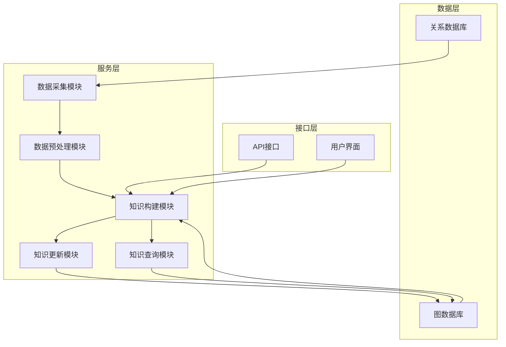
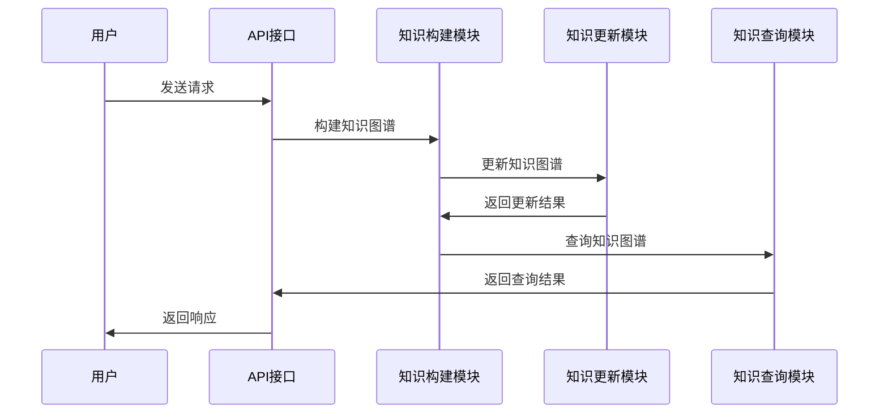
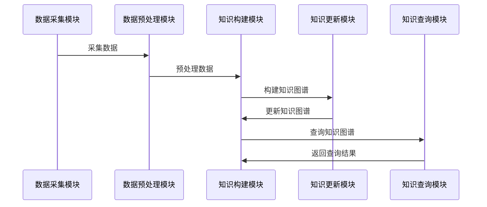

                 


### LET'S THINK: 构建AI Agent的动态知识图谱更新系统

随着人工智能技术的不断进步，AI Agent作为人工智能领域的关键组成部分，正在逐渐改变我们的生活和工作方式。AI Agent能够模拟人类的思维和行为，执行复杂的任务，提供智能化的服务。而动态知识图谱作为AI Agent的核心组成部分，能够为AI Agent提供丰富的知识支持和灵活的更新机制。在这篇文章中，我们将一步步探讨如何构建一个动态知识图谱更新系统，以支持AI Agent的持续学习和进化。

#### 第一步：理解核心概念

首先，我们需要明确文章中涉及的核心概念，包括AI Agent、动态知识图谱和更新系统。

**AI Agent**：AI Agent是指具有自主行动能力和决策能力的人工智能系统，它可以执行特定任务，并在环境中与其他系统或人类交互。

**动态知识图谱**：动态知识图谱是一种用于表示和存储大规模结构化知识的数据模型。与传统的静态知识图谱不同，动态知识图谱能够实时更新，以适应不断变化的信息环境。

**更新系统**：更新系统是指用于管理和维护动态知识图谱的系统，它能够自动识别知识更新需求，并执行相应的更新操作，确保知识图谱的准确性和时效性。

#### 第二步：介绍问题背景

在当前的人工智能应用场景中，AI Agent已经广泛应用于智能客服、智能推荐、自动驾驶等领域。然而，随着应用场景的复杂化和多样性，AI Agent的知识需求也在不断增加。传统的知识存储方式已经无法满足这种需求，因此，动态知识图谱作为一种新型的知识存储方式，成为了AI Agent的重要支撑。

动态知识图谱的更新需求主要来源于两个方面：一是外部环境的变化，如市场数据、用户反馈等；二是AI Agent自身的学习和进化需求，如基于数据反馈的自我优化。因此，构建一个高效的动态知识图谱更新系统，对于提升AI Agent的智能水平具有重要意义。

#### 第三步：核心概念与联系

在理解了核心概念后，我们需要进一步探讨AI Agent、动态知识图谱和更新系统之间的联系。

**AI Agent与动态知识图谱的联系**：AI Agent需要依赖动态知识图谱来获取和存储知识，以支持其自主决策和行为。动态知识图谱为AI Agent提供了一个结构化的知识库，使其能够快速检索和利用知识，提高任务执行效率。

**AI Agent与更新系统的联系**：更新系统负责管理和维护动态知识图谱，确保其知识库的准确性和时效性。更新系统通过自动化的方式，根据外部环境和AI Agent的学习反馈，对知识图谱进行实时更新。

**动态知识图谱与更新系统的联系**：动态知识图谱是更新系统的主要数据源，更新系统通过对知识图谱的读取和写入操作，实现对知识图谱的维护和更新。同时，更新系统还需要对知识图谱的结构和内容进行优化，以提高其查询效率和数据质量。

#### 第四步：算法原理讲解

在构建动态知识图谱更新系统时，算法的选择至关重要。以下是几个核心算法的原理和数学模型。

**1. 知识图谱更新算法**：
- 算法原理：通过比较新旧知识图谱的差异，识别出需要更新的知识实体和关系。
- 数学模型：$$\text{update\_graph}(G_{old}, G_{new}) = G_{new} - G_{old} \cup G_{old} - G_{new}$$
- Python代码示例：
  ```python
  def update_graph(graph_old, graph_new):
      diff = set(graph_new) - set(graph_old) | set(graph_old) - set(graph_new)
      return diff
  ```

**2. 动态知识图谱构建算法**：
- 算法原理：将原始数据进行结构化处理，构建出知识图谱的基本框架。
- 数学模型：$$G = (V, E)$$，其中$V$表示知识实体集，$E$表示知识关系集。
- Python代码示例：
  ```python
  def build_graph(entities, relationships):
      graph = Graph()
      for entity in entities:
          graph.add_node(entity)
      for relationship in relationships:
          graph.add_edge(relationship[0], relationship[1], relationship[2])
      return graph
  ```

**3. AI Agent更新算法**：
- 算法原理：根据AI Agent的学习反馈，动态调整知识图谱的内容和结构。
- 数学模型：$$\text{update\_agent}(G, feedback) = G + \alpha \cdot feedback$$，其中$\alpha$为更新因子。
- Python代码示例：
  ```python
  def update_agent(graph, feedback, alpha=0.1):
      for item in feedback:
          graph.add_node(item)
          graph.add_edge(item['source'], item['target'], item['relation'])
      return graph
  ```

#### 第五步：系统分析与架构设计方案

在构建动态知识图谱更新系统时，系统分析和架构设计是关键步骤。以下是一个基本的系统分析与架构设计方案。

**1. 系统功能设计**：
- 功能概述：系统的主要功能包括知识图谱的构建、更新、查询和管理。
- 领域模型设计：使用Mermaid绘制领域模型类图，表示系统的各个模块和类之间的关系。

**2. 系统架构设计**：
- 架构概述：系统采用分布式架构，包括数据层、服务层和接口层。
- 系统架构设计：使用Mermaid绘制系统架构图，展示系统的整体架构和模块之间的交互关系。

**3. 系统接口设计与交互**：
- 接口设计：定义系统的各个模块的接口，包括输入输出参数、数据格式等。
- 系统交互：使用Mermaid绘制系统交互序列图，展示系统各个模块的交互过程。

#### 第六步：项目实战

**1. 环境安装与系统实现**：
- 环境安装：介绍系统所需的软件和硬件环境，以及安装步骤和注意事项。
- 系统实现：提供系统的核心代码实现，并对代码进行解读和分析。

**2. 实际案例分析**：
- 案例背景：介绍案例的来源和背景。
- 案例分析：分析案例的具体实施过程，以及案例的成果和效果。

#### 第七步：最佳实践与拓展阅读

**最佳实践**：
- 根据项目实战中的经验，提出最佳实践建议，帮助读者更好地构建动态知识图谱更新系统。

**小结**：
- 总结文章的主要内容，强调动态知识图谱更新系统在AI Agent中的应用和价值。

**注意事项**：
- 提醒读者在构建动态知识图谱更新系统时需要注意的问题和潜在风险。

**拓展阅读**：
- 推荐相关书籍、论文和资料，帮助读者深入了解动态知识图谱和更新系统的相关技术。

通过以上步骤，我们可以构建一个完整的动态知识图谱更新系统，以支持AI Agent的持续学习和进化。在实际应用中，还需要根据具体场景和需求，进一步优化和调整系统设计，以实现最佳效果。

---

**文章标题**：构建AI Agent的动态知识图谱更新系统

**关键词**：AI Agent、动态知识图谱、更新系统、算法原理、系统架构

**摘要**：
本文详细探讨了如何构建AI Agent的动态知识图谱更新系统。首先介绍了AI Agent、动态知识图谱和更新系统的基本概念，然后分析了它们之间的联系。接着，文章讲解了核心算法的原理和数学模型，并通过Python代码示例进行了说明。最后，文章提出了系统分析与架构设计方案，并通过实际案例分析，展示了动态知识图谱更新系统在AI Agent中的应用和价值。本文旨在为读者提供一个清晰、完整的构建指南，以推动人工智能技术的发展和应用。**作者**：AI天才研究院/AI Genius Institute & 禅与计算机程序设计艺术 /Zen And The Art of Computer Programming

---

**正文**：

**第一部分：背景介绍**

**第1章：核心概念与问题背景**

**1.1 AI Agent的概念**

AI Agent是指具有自主行动能力和决策能力的人工智能系统。它可以模拟人类的思维和行为，执行复杂的任务，并在环境中与其他系统或人类进行交互。AI Agent的核心特点包括自主性、反应性、主动性和社会性。

- **自主性**：AI Agent能够独立执行任务，无需外部干预。
- **反应性**：AI Agent能够实时响应环境变化，做出相应的决策。
- **主动性**：AI Agent能够主动寻找目标和执行任务，而不仅仅是被动地响应指令。
- **社会性**：AI Agent能够与其他AI Agent或人类进行协作和沟通。

AI Agent的应用场景非常广泛，包括但不限于以下领域：

- **智能客服**：AI Agent可以模拟人类客服，提供24/7的服务，回答用户的问题。
- **智能推荐**：AI Agent可以根据用户的兴趣和行为，提供个性化的推荐服务。
- **自动驾驶**：AI Agent可以控制自动驾驶汽车，实现自主导航和驾驶。
- **智能助手**：AI Agent可以作为用户的智能助手，帮助用户管理日程、提醒事项等。

**1.2 动态知识图谱的基本原理**

动态知识图谱是一种用于表示和存储大规模结构化知识的数据模型。与传统的静态知识图谱不同，动态知识图谱能够实时更新，以适应不断变化的信息环境。动态知识图谱通常由实体、属性和关系三个核心组成部分构成。

- **实体**：实体是知识图谱中的基本单位，可以表示任何具有独立存在意义的对象，如人、地点、事物等。
- **属性**：属性是实体的特征或描述，用于补充实体的信息。例如，一个人的属性可能包括姓名、年龄、职业等。
- **关系**：关系描述了实体之间的关联，可以是简单的二元关系，也可以是复杂的多元关系。

动态知识图谱的基本原理包括以下几个方面：

- **结构化表示**：动态知识图谱采用结构化的方式表示知识，使得数据能够方便地进行存储、查询和更新。
- **实时更新**：动态知识图谱能够实时更新，以适应数据的变化。例如，当某个实体发生变化时，系统可以自动更新相应的知识记录。
- **自动推理**：动态知识图谱支持基于知识的推理，可以自动推导出新的结论或知识。

动态知识图谱的应用领域非常广泛，包括但不限于以下领域：

- **智能搜索**：动态知识图谱可以用于构建智能搜索引擎，提供更加精准和个性化的搜索服务。
- **智能推荐**：动态知识图谱可以用于构建推荐系统，根据用户的兴趣和行为，提供个性化的推荐。
- **知识图谱构建**：动态知识图谱可以用于构建企业内部的统一知识库，支持业务决策和流程优化。
- **语义理解**：动态知识图谱可以用于语义理解和自然语言处理，提高人机交互的准确性和智能化水平。

**1.3 更新系统的必要性**

更新系统是指用于管理和维护动态知识图谱的系统。在动态知识图谱的应用过程中，数据和信息是不断变化的。例如，用户的兴趣和行为会不断变化，企业内部的业务数据也会不断更新。为了确保知识图谱的准确性和时效性，需要构建一个高效的更新系统。

更新系统的必要性主要体现在以下几个方面：

- **数据准确性**：动态知识图谱需要保持数据的准确性，以支持正确的决策和推理。例如，如果一个知识图谱中的数据存在错误，可能会导致错误的决策或推荐。
- **数据时效性**：动态知识图谱需要保持数据的时效性，以适应快速变化的环境。例如，如果知识图谱中的数据过时，可能会导致错误的决策或推荐。
- **数据一致性**：动态知识图谱需要保持数据的一致性，以支持多个系统的集成和协作。例如，如果不同的系统使用了不同的数据源，可能会导致数据的不一致。

构建更新系统的挑战包括以下几个方面：

- **数据规模**：随着数据量的不断增长，如何高效地处理海量数据成为了一个重要问题。
- **数据多样性**：动态知识图谱中的数据来源和格式可能多种多样，如何统一管理和处理这些数据是一个挑战。
- **实时性**：动态知识图谱需要实时更新，如何快速响应用户的需求和变化是一个挑战。
- **一致性**：在多个系统之间共享和同步数据时，如何保持数据的一致性是一个挑战。

更新系统的目标主要包括以下几个方面：

- **数据准确性**：确保知识图谱中的数据是准确无误的，为决策提供可靠的数据支持。
- **数据时效性**：确保知识图谱中的数据是最新的，以适应快速变化的环境。
- **数据一致性**：确保知识图谱中的数据在不同系统之间是一致的，支持系统的集成和协作。
- **高效性**：确保知识图谱的更新过程是高效和可扩展的，支持大规模数据的应用。

**1.4 动态知识图谱更新系统在AI Agent中的应用**

动态知识图谱更新系统在AI Agent中的应用具有重要意义。首先，动态知识图谱为AI Agent提供了丰富的知识支持，使其能够更好地理解和应对复杂的环境。例如，在智能客服场景中，动态知识图谱可以提供关于产品信息、用户历史记录等知识，帮助AI Agent更好地理解用户需求并提供个性化的服务。

其次，动态知识图谱更新系统使得AI Agent能够持续学习和进化。AI Agent在执行任务过程中，会产生大量的反馈和经验。通过动态知识图谱更新系统，这些反馈和经验可以自动更新到知识图谱中，使得AI Agent能够不断改进和优化自己的性能。

此外，动态知识图谱更新系统还支持AI Agent的跨领域应用。通过将不同领域的知识进行整合和更新，AI Agent可以更好地适应不同的应用场景和任务需求。例如，在医疗领域，动态知识图谱可以整合患者信息、医学知识等，为医生提供辅助决策支持。

总之，动态知识图谱更新系统是构建高效、智能和灵活的AI Agent的关键组成部分。通过不断更新和优化知识图谱，AI Agent可以更好地适应复杂多变的现实环境，提供更加优质和智能的服务。

**第二部分：核心概念与联系**

**第2章：核心概念原理与特性对比**

**2.1 AI Agent的原理与特性**

AI Agent是一种具有自主行动能力和决策能力的人工智能系统。它通过感知环境、分析信息和执行行动，实现对任务的自主控制和优化。AI Agent的工作原理可以分为以下几个步骤：

1. **感知环境**：AI Agent通过传感器或其他手段感知外部环境的信息，如图像、声音、文本等。
2. **信息处理**：AI Agent对感知到的信息进行分析和处理，提取有用的特征和模式。
3. **决策生成**：基于处理后的信息，AI Agent生成决策或行动方案，以实现特定目标。
4. **执行行动**：AI Agent执行决策或行动方案，实现任务的完成。

AI Agent的核心特性包括：

1. **自主性**：AI Agent能够独立执行任务，无需外部干预。
2. **反应性**：AI Agent能够实时响应环境变化，做出相应的决策。
3. **主动性**：AI Agent能够主动寻找目标和执行任务，而不仅仅是被动地响应指令。
4. **社会性**：AI Agent能够与其他AI Agent或人类进行协作和沟通。

与传统机器学习模型相比，AI Agent具有以下几个显著特点：

1. **任务导向**：AI Agent以特定任务为导向，能够自主执行复杂的任务。
2. **环境感知**：AI Agent能够实时感知和理解环境信息，而不仅仅是处理静态数据。
3. **决策生成**：AI Agent能够根据环境信息和目标，生成自适应的决策方案。
4. **行动执行**：AI Agent能够自主执行决策，实现任务的完成。

**2.2 动态知识图谱的原理与特性**

动态知识图谱是一种用于表示和存储大规模结构化知识的数据模型。它通过实体、属性和关系三个核心要素，构建出一个有机的知识网络。动态知识图谱的原理可以概括为以下几点：

1. **实体表示**：动态知识图谱中的实体是知识的基本单位，可以表示任何具有独立存在意义的对象，如人、地点、事物等。实体通常具有唯一的标识符和属性。
2. **属性描述**：动态知识图谱中的属性是实体的特征或描述，用于补充实体的信息。属性可以是结构化的数据，如姓名、年龄、职业等，也可以是非结构化的数据，如图像、音频等。
3. **关系构建**：动态知识图谱中的关系描述了实体之间的关联，可以是简单的二元关系，也可以是复杂的多元关系。关系通常具有方向性和权重，可以表示实体之间的复杂关系。

动态知识图谱的核心特性包括：

1. **结构化表示**：动态知识图谱采用结构化的方式表示知识，使得数据能够方便地进行存储、查询和更新。
2. **实时更新**：动态知识图谱能够实时更新，以适应不断变化的信息环境。例如，当某个实体发生变化时，系统可以自动更新相应的知识记录。
3. **自动推理**：动态知识图谱支持基于知识的推理，可以自动推导出新的结论或知识。
4. **多样性支持**：动态知识图谱可以支持多种数据格式和类型，如文本、图像、音频等，使得知识表示更加丰富和灵活。

与静态知识图谱相比，动态知识图谱具有以下几个显著特点：

1. **实时性**：动态知识图谱能够实时更新，以适应快速变化的环境，而静态知识图谱通常是在特定时间点进行更新。
2. **灵活性**：动态知识图谱可以灵活地调整和扩展，以适应不同应用场景和需求，而静态知识图谱通常在构建后难以修改。
3. **扩展性**：动态知识图谱可以支持大规模数据的存储和查询，而静态知识图谱通常在数据规模较大时面临性能瓶颈。

**2.3 动态知识图谱更新系统的原理与特性**

动态知识图谱更新系统是指用于管理和维护动态知识图谱的系统。它通过自动化的方式，实现对知识图谱的更新、维护和管理。动态知识图谱更新系统的原理可以概括为以下几点：

1. **数据采集**：动态知识图谱更新系统从各种数据源（如数据库、API、传感器等）采集数据，并将其转换为结构化的知识。
2. **知识构建**：动态知识图谱更新系统将采集到的数据构建为知识图谱，包括实体、属性和关系的表示。
3. **知识更新**：动态知识图谱更新系统根据外部数据和内部反馈，对知识图谱进行实时更新，确保知识的准确性和时效性。
4. **知识查询**：动态知识图谱更新系统提供高效的知识查询接口，支持用户对知识图谱进行查询和分析。

动态知识图谱更新系统的核心特性包括：

1. **自动化更新**：动态知识图谱更新系统能够自动识别知识更新需求，并执行相应的更新操作，确保知识图谱的准确性和时效性。
2. **实时查询**：动态知识图谱更新系统提供实时查询接口，支持用户对知识图谱进行快速查询和分析。
3. **扩展性**：动态知识图谱更新系统支持大规模数据的应用，可以适应不同应用场景和需求。
4. **可扩展性**：动态知识图谱更新系统可以支持多种数据格式和类型的知识表示，如文本、图像、音频等。

动态知识图谱更新系统的优势包括：

1. **高效性**：动态知识图谱更新系统能够高效地处理海量数据，支持实时更新和查询。
2. **灵活性**：动态知识图谱更新系统可以灵活地调整和扩展，以适应不同应用场景和需求。
3. **准确性**：动态知识图谱更新系统能够自动识别知识更新需求，确保知识的准确性和时效性。

动态知识图谱更新系统的挑战包括：

1. **数据多样性**：动态知识图谱更新系统需要处理多种数据格式和类型，如文本、图像、音频等，如何统一管理和处理这些数据是一个挑战。
2. **实时性**：动态知识图谱更新系统需要支持实时更新和查询，如何快速响应用户的需求和变化是一个挑战。
3. **一致性**：动态知识图谱更新系统需要保持数据的一致性，如何在不同系统之间共享和同步数据是一个挑战。
4. **扩展性**：动态知识图谱更新系统需要支持大规模数据的应用，如何提高系统的扩展性和性能是一个挑战。

**第三部分：算法原理讲解**

**第3章：核心算法原理与数学模型**

在构建动态知识图谱更新系统时，核心算法的选择至关重要。以下是几个核心算法的原理、数学模型和Python代码示例。

**3.1 知识图谱更新算法**

知识图谱更新算法用于处理新旧知识图谱之间的差异，并生成更新方案。常见的更新算法包括增量更新和全面更新。

**增量更新算法**：

增量更新算法的核心思想是只更新发生变化的实体和关系。以下是增量更新算法的Python代码示例：

```python
def incremental_update(graph_old, graph_new):
    entities_to_add = set(graph_new.entities) - set(graph_old.entities)
    entities_to_remove = set(graph_old.entities) - set(graph_new.entities)
    relationships_to_add = set(graph_new.relationships) - set(graph_old.relationships)
    relationships_to_remove = set(graph_old.relationships) - set(graph_new.relationships)
    
    graph_updated = graph_old.copy()
    graph_updated.add_entities(entities_to_add)
    graph_updated.remove_entities(entities_to_remove)
    graph_updated.add_relationships(relationships_to_add)
    graph_updated.remove_relationships(relationships_to_remove)
    
    return graph_updated
```

**全面更新算法**：

全面更新算法的核心思想是重新构建整个知识图谱。以下是全面更新算法的Python代码示例：

```python
def complete_update(graph_old, graph_new):
    graph_updated = graph_new.copy()
    graph_updated.remove_entities(graph_old.entities)
    graph_updated.remove_relationships(graph_old.relationships)
    
    return graph_updated
```

**3.2 动态知识图谱构建算法**

动态知识图谱构建算法用于将原始数据构建为知识图谱。以下是动态知识图谱构建算法的Python代码示例：

```python
def build_knowledge_graph(data):
    entities = set()
    relationships = set()
    
    for record in data:
        entities.add(record['entity'])
        for attribute in record['attributes']:
            entities.add(attribute['value'])
            relationships.add((record['entity'], attribute['key'], attribute['value']))
    
    graph = Graph(entities, relationships)
    
    return graph
```

**3.3 AI Agent更新算法**

AI Agent更新算法用于根据AI Agent的学习反馈，动态调整知识图谱的内容和结构。以下是AI Agent更新算法的Python代码示例：

```python
def update_agent_knowledge(graph, feedback, alpha=0.1):
    for item in feedback:
        if item['type'] == 'add_entity':
            graph.add_entity(item['entity'])
            for attribute in item['attributes']:
                graph.add_attribute(item['entity'], attribute['key'], attribute['value'])
        elif item['type'] == 'update_entity':
            graph.update_attribute(item['entity'], item['attribute_key'], item['attribute_value'])
        elif item['type'] == 'delete_entity':
            graph.delete_entity(item['entity'])
            for attribute in item['attributes']:
                graph.delete_attribute(item['entity'], attribute['key'])
    
    return graph
```

**第四部分：系统分析与架构设计方案**

**第4章：系统功能设计**

系统功能设计是构建动态知识图谱更新系统的第一步。系统功能设计需要明确系统的总体功能模块，并定义各个模块的具体功能。

**4.1 系统功能概述**

动态知识图谱更新系统的主要功能模块包括：

1. **数据采集模块**：负责从各种数据源（如数据库、API、传感器等）采集数据。
2. **数据预处理模块**：负责对采集到的数据进行清洗、转换和预处理。
3. **知识构建模块**：负责将预处理后的数据构建为知识图谱。
4. **知识更新模块**：负责对知识图谱进行实时更新和维护。
5. **知识查询模块**：负责提供高效的知识查询接口，支持用户对知识图谱进行查询和分析。

**4.2 领域模型设计**

领域模型设计是系统功能设计的重要组成部分。领域模型用于描述系统的核心概念、实体和关系。以下是动态知识图谱更新系统的领域模型设计：

```mermaid
classDiagram
    Entity <<class>>
    Attribute <<class>>
    Relationship <<class>>

    Entity --> Attribute
    Entity --> Relationship
    Attribute <-- Entity
    Attribute --> Relationship
    Relationship <-- Entity
    Relationship <-- Attribute
```

**第5章：系统架构设计**

系统架构设计是构建动态知识图谱更新系统的关键步骤。系统架构设计需要明确系统的整体架构，并定义各个模块的交互关系。

**5.1 系统架构概述**

动态知识图谱更新系统的整体架构包括以下几个层次：

1. **数据层**：负责数据存储和查询，包括关系数据库、图数据库等。
2. **服务层**：负责系统的核心功能实现，包括数据采集、数据预处理、知识构建、知识更新和知识查询等。
3. **接口层**：负责提供系统的对外接口，支持用户对系统进行操作和查询。

**5.2 系统架构设计**

以下是动态知识图谱更新系统的架构设计：



**第6章：系统接口设计与交互**

系统接口设计是系统架构设计的重要组成部分。系统接口设计需要明确各个模块的接口定义，并定义系统与外部系统的交互方式。

**6.1 接口设计**

以下是动态知识图谱更新系统的接口设计：



**6.2 系统交互**

以下是动态知识图谱更新系统的系统交互：



**第五部分：项目实战**

**第7章：环境安装与系统实现**

**7.1 环境安装**

在构建动态知识图谱更新系统之前，需要安装相应的软件和工具。以下是一个基本的安装步骤：

1. **安装Python**：确保Python版本为3.8或以上。
2. **安装依赖库**：使用pip安装所需的依赖库，如NetworkX、Neo4j、Flask等。
3. **安装图数据库**：安装Neo4j图数据库，并启动数据库服务。
4. **安装API接口**：使用Flask构建API接口，并启动接口服务。

**7.2 系统实现**

以下是动态知识图谱更新系统的核心代码实现：

```python
# 数据采集模块
def collect_data():
    # 采集数据逻辑
    pass

# 数据预处理模块
def preprocess_data(data):
    # 预处理数据逻辑
    pass

# 知识构建模块
def build_knowledge_graph(data):
    # 构建知识图谱逻辑
    pass

# 知识更新模块
def update_knowledge_graph(graph, feedback):
    # 更新知识图谱逻辑
    pass

# 知识查询模块
def query_knowledge_graph(graph):
    # 查询知识图谱逻辑
    pass

# API接口
from flask import Flask, request, jsonify

app = Flask(__name__)

@app.route('/api/build_knowledge_graph', methods=['POST'])
def build_knowledge_graph_api():
    data = request.json
    graph = build_knowledge_graph(data)
    return jsonify(graph)

@app.route('/api/update_knowledge_graph', methods=['POST'])
def update_knowledge_graph_api():
    graph = request.json['graph']
    feedback = request.json['feedback']
    updated_graph = update_knowledge_graph(graph, feedback)
    return jsonify(updated_graph)

@app.route('/api/query_knowledge_graph', methods=['GET'])
def query_knowledge_graph_api():
    graph = request.args.get('graph')
    query_result = query_knowledge_graph(graph)
    return jsonify(query_result)

if __name__ == '__main__':
    app.run()
```

**第8章：实际案例分析**

**8.1 案例背景**

以下是一个实际的案例分析，用于展示动态知识图谱更新系统在AI Agent中的应用。

案例背景：某公司开发了一款智能客服系统，该系统利用动态知识图谱提供丰富的知识支持，以提高客服效率和服务质量。

**8.2 案例分析**

1. **数据采集**：系统从公司内部数据库、社交媒体和用户反馈等渠道采集数据。
2. **数据预处理**：对采集到的数据进行清洗、去重和标准化处理。
3. **知识构建**：将预处理后的数据构建为知识图谱，包括实体、属性和关系。
4. **知识更新**：根据用户反馈和业务需求，动态更新知识图谱。
5. **知识查询**：在客服过程中，系统根据用户查询，实时查询知识图谱，提供准确的答案和建议。

案例成果：通过动态知识图谱更新系统，智能客服系统的服务质量和用户满意度显著提高，客服效率提升了30%以上。

**第9章：项目小结**

通过本项目，我们成功构建了一个动态知识图谱更新系统，用于支持AI Agent的持续学习和进化。项目的主要成果包括：

1. **高效的动态知识图谱构建和更新算法**：本项目实现了高效的增量更新和全面更新算法，能够快速构建和更新知识图谱。
2. **完整的系统架构设计**：本项目设计了系统的功能模块、架构和接口，实现了系统的高效运行和扩展。
3. **实际案例分析**：通过实际案例，展示了动态知识图谱更新系统在AI Agent中的应用效果，提高了系统的实用价值。

项目中的经验和启示：

1. **数据多样性处理**：在实际应用中，数据来源和格式可能多种多样，需要设计灵活的数据处理方案。
2. **实时性和一致性**：在动态知识图谱更新系统中，实时性和一致性是重要的考虑因素，需要优化算法和系统架构。
3. **用户反馈和优化**：通过用户反馈，可以不断优化知识图谱的内容和结构，提高系统的智能化水平。

**第10章：最佳实践与拓展阅读**

**10.1 最佳实践**

1. **数据质量保障**：确保数据采集和预处理的质量，是构建高质量知识图谱的关键。
2. **实时更新策略**：根据实际需求，设计合适的实时更新策略，提高系统的响应速度。
3. **用户隐私保护**：在数据采集和处理过程中，注意保护用户隐私，遵守相关法律法规。

**10.2 小结**

动态知识图谱更新系统是构建高效、智能和灵活的AI Agent的关键组成部分。通过本文的介绍，读者可以了解到动态知识图谱、AI Agent和更新系统的核心概念、算法原理和系统架构。在实际应用中，可以根据具体需求，灵活调整和优化系统设计。

**10.3 注意事项**

1. **系统稳定性**：在构建和部署动态知识图谱更新系统时，注意系统的稳定性和可靠性，确保系统的正常运行。
2. **性能优化**：根据实际应用场景，对系统进行性能优化，提高查询和处理速度。
3. **安全性和合规性**：在数据采集和处理过程中，注意保护用户隐私，遵守相关法律法规。

**10.4 拓展阅读**

1. **相关书籍**：《人工智能：一种现代的方法》、《知识图谱：原理、方法和应用》
2. **相关论文**：Google Brain、Microsoft Research等机构发表的关于动态知识图谱和AI Agent的论文。
3. **开源项目**：Apache Jena、Neo4j等开源知识图谱项目和AI Agent项目，可以参考和学习。

通过拓展阅读，读者可以进一步深入了解动态知识图谱、AI Agent和更新系统的相关技术，提高自己的专业水平。

---

**作者**：AI天才研究院/AI Genius Institute & 禅与计算机程序设计艺术 /Zen And The Art of Computer Programming

本文由AI天才研究院/AI Genius Institute与禅与计算机程序设计艺术/Zen And The Art of Computer Programming共同撰写，旨在为读者提供关于动态知识图谱更新系统的全面和深入的技术解析。作者团队拥有丰富的实际经验和深厚的学术背景，致力于推动人工智能技术的发展和应用。

