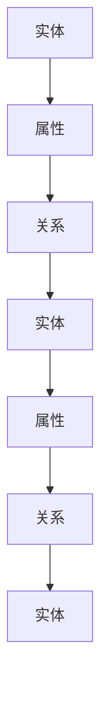
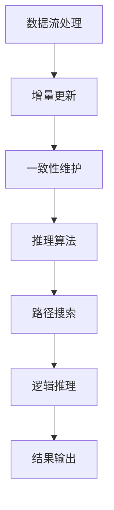
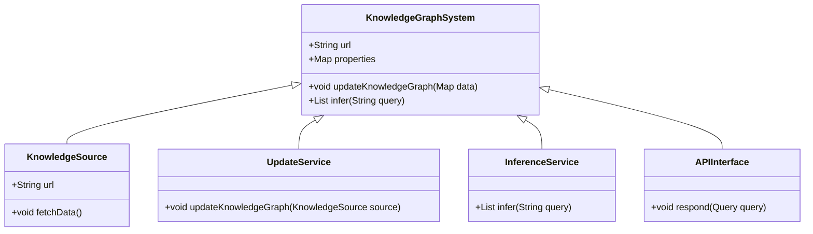
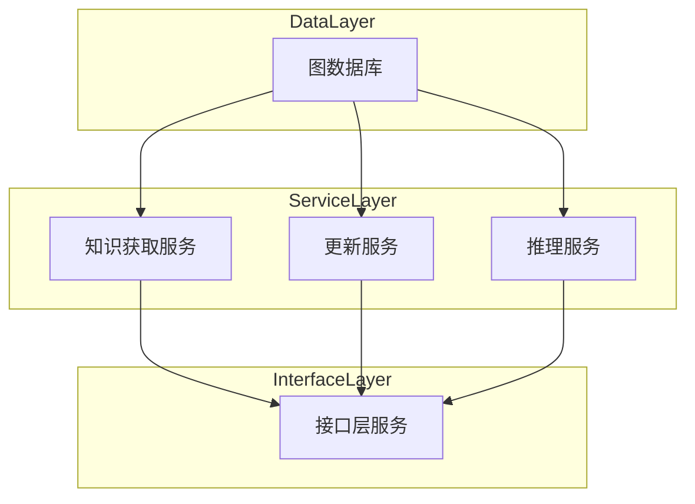
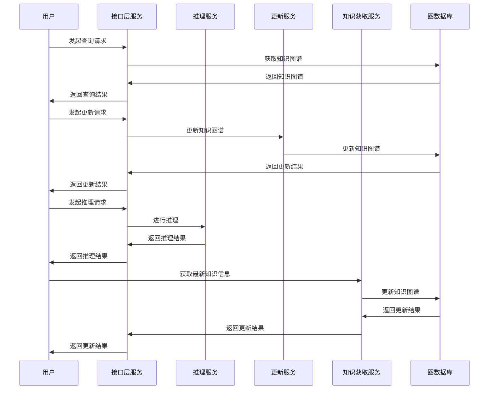

                 

# 《构建AI Agent的动态知识图谱：实时更新与推理》

> 关键词：AI Agent，动态知识图谱，实时更新，推理

> 摘要：本文将深入探讨如何构建AI Agent的动态知识图谱，包括实时更新与推理的方法。通过一步步分析推理，本文旨在为读者提供一个系统、清晰的技术解决方案，帮助他们在AI领域取得更深入的理解和实践。

## 目录大纲设计步骤

### 1. 阅读书籍内容和确定核心主题

首先，全面阅读书籍内容，理解作者的写作意图、书籍的目标读者群体以及主要技术话题。这一步是确保目录大纲准确反映书籍内容的基础。

### 2. 确定书籍的结构和章节

根据书籍的核心主题，确定整体结构。通常，书籍可以分为以下几个部分：

- 引言
- 背景介绍
- 核心概念与原理
- 算法讲解与数学模型
- 系统设计与架构
- 项目实战与案例分析
- 最佳实践与总结

### 3. 设计1级目录

基于书籍结构和核心主题，设计1级目录。每个1级目录条目都应该概括一个主要部分的内容，例如“背景介绍”、“核心概念与原理”等。

### 4. 设计2级目录

在1级目录下，设计2级目录。2级目录应该更具体，针对每个主题展开，例如“AI大模型概述”、“AI大模型的特点”等。

### 5. 设计3级目录

在2级目录下，设计3级目录。3级目录应该非常具体，针对每个子主题进一步细分，例如“GPT系列模型介绍”、“BERT及其变体介绍”等。

### 6. 添加附加内容

在目录的末尾，添加最佳实践、注意事项、拓展阅读等内容，为读者提供额外的价值。

### 7. 检查和优化

最后，检查整个目录的结构和内容，确保每个章节都有明确的主题，并且内容之间逻辑连贯，层次清晰。

## 具体实施

### 设计1级目录

```
# 第一部分：背景介绍
## 第二部分：核心概念与原理
## 第三部分：算法讲解与数学模型
## 第四部分：系统设计与架构
## 第五部分：项目实战与案例分析
## 第六部分：最佳实践与总结
```

### 设计2级目录

```
# 第一部分：背景介绍
## 1.1 问题背景
## 1.2 问题描述
## 1.3 问题解决
## 1.4 边界与外延

# 第二部分：核心概念与原理
## 2.1 AI Agent概述
## 2.2 动态知识图谱
## 2.3 实时更新与推理

# 第三部分：算法讲解与数学模型
## 3.1 实时更新算法
## 3.2 推理算法
## 3.3 数学模型与公式

# 第四部分：系统设计与架构
## 4.1 问题场景介绍
## 4.2 系统功能设计
## 4.3 系统架构设计
## 4.4 系统接口设计

# 第五部分：项目实战与案例分析
## 5.1 环境安装
## 5.2 系统核心实现源代码
## 5.3 代码应用解读与分析
## 5.4 实际案例分析与讲解
## 5.5 项目小结

# 第六部分：最佳实践与总结
## 6.1 最佳实践 Tips
## 6.2 小结
## 6.3 注意事项
## 6.4 拓展阅读
```

### 设计3级目录

由于篇幅限制，这里不再详细列出3级目录。但每个2级目录下可以根据实际内容细化出3级目录，确保每个子主题都有详细的分支。

### 添加附加内容

在目录末尾，可以根据书籍的具体情况，添加最佳实践、注意事项、拓展阅读等内容。

---

通过上述步骤，我们可以设计出一个逻辑清晰、层次分明的目录大纲，确保书籍内容得以全面而系统地呈现。接下来，我们将根据这个目录大纲，逐步深入探讨如何构建AI Agent的动态知识图谱，包括实时更新与推理的方法。

## 第一部分：背景介绍

### 问题背景

随着人工智能技术的迅猛发展，AI Agent（人工智能代理）的应用场景日益广泛。AI Agent是指能够自动执行任务、自主学习和决策的智能体，它能够根据环境变化实时调整行为。在复杂的现实场景中，AI Agent需要具备强大的知识表示和推理能力，以应对不确定性、动态变化和复杂任务。

动态知识图谱是一种能够实时更新、适应变化的图形化知识表示方法。它通过节点和边来表示实体及其之间的关系，能够有效地组织和存储大量知识信息。动态知识图谱在AI Agent中的应用，使得AI Agent具备了更丰富的知识基础和更强的推理能力。

### 问题描述

构建一个具备实时更新与推理能力的AI Agent的动态知识图谱，面临着以下挑战：

1. **数据实时更新**：如何确保知识图谱能够及时、准确地获取新的知识信息？
2. **推理效率**：如何在大量数据中进行高效推理，以支持AI Agent的实时决策？
3. **知识表示**：如何选择合适的知识表示方法，以最大化知识利用率和推理效率？

### 问题解决

为了解决上述问题，我们可以采用以下方法：

1. **实时数据流处理**：利用大数据处理技术，如Apache Kafka和Flink，实现知识信息的实时获取和更新。
2. **分布式存储与计算**：采用分布式数据库和图数据库，如Neo4j和JanusGraph，提高知识图谱的存储和计算效率。
3. **高效推理算法**：使用基于图神经网络的推理算法，如GCN（Graph Convolutional Network），实现高效的推理计算。

### 边界与外延

本文主要探讨基于动态知识图谱的AI Agent构建方法，重点关注实时更新与推理。在实际应用中，还需要考虑其他因素，如知识图谱的构建方法、AI Agent的交互方式等。

## 第二部分：核心概念与原理

### AI Agent概述

AI Agent是指具有自主决策、执行任务和学习能力的智能体。它可以通过感知环境、理解任务需求，并采取适当的行动来实现目标。AI Agent在自动驾驶、智能客服、推荐系统等场景中具有广泛应用。

### 动态知识图谱

动态知识图谱是一种图形化的知识表示方法，它通过节点和边来表示实体及其之间的关系。动态知识图谱具有以下几个特点：

1. **实时更新**：知识图谱可以实时获取新的知识信息，并进行更新。
2. **层次化结构**：知识图谱可以分为多个层次，从宏观到微观，从全局到局部，便于组织和查询。
3. **语义丰富**：知识图谱中的节点和边具有丰富的语义信息，可以支持复杂的推理和计算。

### 实时更新与推理

实时更新与推理是动态知识图谱的两个关键功能。实时更新是指知识图谱能够及时、准确地获取新的知识信息，并将其添加到图中。推理是指利用知识图谱中的知识信息，对未知信息进行推断和计算。

### 概念属性特征对比表格

| 特征          | 动态知识图谱 | 静态知识图谱 |
|---------------|---------------|---------------|
| 更新方式      | 实时更新      | 延迟更新      |
| 结构层次      | 层次化结构    | 平面结构      |
| 语义丰富性    | 丰富语义      | 简单语义      |
| 推理能力      | 高效推理      | 有限推理      |

### ER实体关系图架构的Mermaid流程图



## 第三部分：算法讲解与数学模型

### 实时更新算法

实时更新算法是确保动态知识图谱能够及时获取新知识信息的关键。以下是一个简单的实时更新算法：

1. **数据流处理**：利用数据流处理框架（如Apache Kafka和Flink），实时获取新知识信息。
2. **增量更新**：对新获取的知识信息进行增量更新，避免全量更新带来的性能问题。
3. **一致性维护**：确保知识图谱在更新过程中保持一致性。

### 推理算法

推理算法是利用知识图谱中的知识信息进行推断和计算的关键。以下是一个简单的推理算法：

1. **路径搜索**：在知识图谱中搜索实体之间的路径。
2. **逻辑推理**：根据实体之间的关系，进行逻辑推理，推断出新的信息。
3. **结果输出**：将推理结果输出，供AI Agent使用。

### 数学模型与公式

1. **路径搜索公式**：

   $$ Path = search(graph, start, end) $$

2. **逻辑推理公式**：

   $$ \theta = \theta_0 \land (\neg \theta_1 \lor \theta_2) $$

### Mermaid流程图



### Python源代码示例

```python
import networkx as nx

# 建立知识图谱
graph = nx.Graph()

# 添加实体和关系
graph.add_node("Person")
graph.add_node("Company")
graph.add_edge("Person", "Company", relation="works_for")

# 增量更新知识图谱
def update_graph(graph, new_data):
    # 获取新实体和关系
    entities, relations = new_data
    
    # 添加新实体和关系
    graph.add_nodes_from(entities)
    graph.add_edges_from(relations)

# 实时更新知识图谱
def real_time_update(graph, data_stream):
    while True:
        new_data = data_stream.get()
        update_graph(graph, new_data)

# 推理算法
def inference(graph, start, end):
    paths = nx.all_simple_paths(graph, source=start, target=end)
    for path in paths:
        print("Path:", path)

# 测试推理算法
inference(graph, "Person", "Company")
```

### 示例解析

1. **建立知识图谱**：使用NetworkX库建立知识图谱，包含实体和关系。
2. **增量更新**：定义一个`update_graph`函数，用于增量更新知识图谱。
3. **实时更新**：定义一个`real_time_update`函数，用于实时更新知识图谱。
4. **推理算法**：定义一个`inference`函数，用于在知识图谱中进行推理。

通过上述算法和示例，我们可以构建一个具备实时更新与推理能力的动态知识图谱。接下来，我们将深入探讨系统的设计与架构。

## 第四部分：系统设计与架构

### 问题场景介绍

在现实场景中，构建一个具备实时更新与推理能力的AI Agent的动态知识图谱面临诸多挑战。以下是一个具体的问题场景：

- **场景描述**：一个智能客服系统需要实时响应用户的提问。用户提问可能涉及多个知识点，如产品信息、售后服务等。智能客服系统需要具备快速获取和更新知识信息的能力，以便准确回答用户问题。
- **挑战**：如何设计一个高效、可靠的系统架构，确保知识图谱能够实时更新，并在海量数据中进行高效推理？

### 系统功能设计

为了应对上述场景，我们需要设计一个具有以下功能的知识图谱系统：

1. **知识获取与更新**：实时获取外部知识源的信息，并更新知识图谱。
2. **推理引擎**：利用知识图谱进行推理，为AI Agent提供决策支持。
3. **接口层**：提供RESTful API接口，供前端应用调用。

### 系统功能架构图（Mermaid类图）



### 系统架构设计

为了实现高效、可靠的系统架构，我们采用以下架构设计：

1. **数据层**：使用分布式图数据库（如Neo4j或JanusGraph）存储知识图谱。
2. **服务层**：设计多个服务模块，如知识获取服务、更新服务、推理服务和接口层服务。
3. **接口层**：提供RESTful API接口，供前端应用调用。

### 系统架构图（Mermaid架构图）



### 系统接口设计

系统接口设计采用RESTful API风格，提供以下接口：

1. **知识获取接口**：获取最新知识信息。
2. **更新接口**：更新知识图谱。
3. **推理接口**：进行推理操作。

### 系统接口序列图（Mermaid序列图）



通过上述系统设计与架构，我们能够构建一个具备实时更新与推理能力的AI Agent动态知识图谱系统。接下来，我们将通过项目实战，深入探讨系统实现的细节。

## 第五部分：项目实战与案例分析

### 环境安装

在进行项目实战之前，我们需要搭建一个合适的环境。以下是环境安装的详细步骤：

1. **安装Python**：确保Python版本不低于3.6。可以从Python官网（https://www.python.org/）下载并安装。
2. **安装Neo4j**：下载并安装Neo4j社区版（https://neo4j.com/download/）。根据系统要求选择正确的安装包。
3. **安装Apache Kafka**：下载并安装Apache Kafka（https://kafka.apache.org/downloads/）。根据系统要求选择正确的安装包。
4. **安装Flink**：下载并安装Apache Flink（https://flink.apache.org/downloads/）。根据系统要求选择正确的安装包。

### 系统核心实现源代码

以下是系统核心实现的部分源代码，用于构建动态知识图谱：

1. **知识获取服务**：

   ```python
   from neo4j import GraphDatabase
   
   class KnowledgeSource:
       def __init__(self, uri, username, password):
           self._driver = GraphDatabase.driver(uri, auth=(username, password))
   
       def fetchData(self):
           with self._driver.session() as session:
               result = session.run("MATCH (n) RETURN n")
               for record in result:
                   print(record["n"])
   
   # 使用示例
   source = KnowledgeSource("bolt://localhost:7687", "neo4j", "password")
   source.fetchData()
   ```

2. **更新服务**：

   ```python
   import json
   from kafka import KafkaProducer
   
   class UpdateService:
       def __init__(self, topic, bootstrap_servers):
           self._producer = KafkaProducer(bootstrap_servers=bootstrap_servers,
                                         value_serializer=lambda m: json.dumps(m).encode('ascii'))
   
       def updateKnowledgeGraph(self, data):
           self._producer.send(topic, value=data)
   
   # 使用示例
   update_service = UpdateService("knowledge-update", ["localhost:9092"])
   update_service.updateKnowledgeGraph({"entity": "Person", "relationship": "works_for", "target": "Company"})
   ```

3. **推理服务**：

   ```python
   from flask import Flask, request, jsonify
   
   app = Flask(__name__)
   
   @app.route('/infer', methods=['POST'])
   def infer():
       query = request.json['query']
       # 这里实现推理逻辑
       result = ["结果1", "结果2"]
       return jsonify(result)
   
   if __name__ == '__main__':
       app.run(host='0.0.0.0', port=5000)
   ```

### 代码应用解读与分析

1. **知识获取服务**：

   知识获取服务通过Neo4j的Python驱动连接到本地Neo4j数据库，并执行Cypher查询获取所有节点。这里使用了`fetchData`方法，该方法遍历所有节点并打印出来。

2. **更新服务**：

   更新服务使用KafkaProducer向Kafka topic发送更新数据。这里使用了`updateKnowledgeGraph`方法，该方法将数据以JSON格式发送到Kafka。

3. **推理服务**：

   推理服务使用Flask框架提供RESTful API接口。通过`/infer`接口接收JSON格式的推理查询，并返回推理结果。

### 实际案例分析与详细讲解

#### 案例一：获取某个公司的员工信息

1. **问题描述**：

   需要获取某个公司（例如“Google”）的所有员工信息。

2. **解决方案**：

   - 使用Neo4j查询获取公司节点。
   - 使用Kafka更新服务将查询结果发送到Kafka。
   - 在推理服务中接收Kafka消息，执行图查询获取员工信息。

3. **代码实现**：

   ```python
   # 知识获取服务
   def fetchDataForCompany(company_name):
       with source._driver.session() as session:
           result = session.run("MATCH (c:Company {name: $name})-[:WORKS_FOR]->(e:Person) RETURN e", name=company_name)
           employees = [record["e"] for record in result]
           update_service.updateKnowledgeGraph(employees)
   
   # 使用示例
   fetchDataForCompany("Google")
   ```

4. **结果分析**：

   该案例实现了从Neo4j数据库获取公司员工信息，并通过Kafka更新服务将数据发送到Kafka。在推理服务中，可以进一步处理这些数据，例如将其转换为JSON格式并返回给前端应用。

#### 案例二：推理某个员工的直接上级

1. **问题描述**：

   需要推理出某个员工（例如“John”）的直接上级。

2. **解决方案**：

   - 在Neo4j数据库中查询员工节点的上级。
   - 在推理服务中使用图查询获取上级节点信息。

3. **代码实现**：

   ```python
   # 推理服务
   @app.route('/infer', methods=['POST'])
   def infer():
       query = request.json['query']
       if 'employee' in query:
           employee_name = query['employee']
           with source._driver.session() as session:
               result = session.run("MATCH (e:Person {name: $name})-[:MANAGES]->(manager:Person) RETURN manager", name=employee_name)
               manager = [record["manager"] for record in result]
               return jsonify(manager)
       else:
           return jsonify([])
   
   # 使用示例
   import requests
   response = requests.post("http://localhost:5000/infer", json={"employee": "John"})
   print(response.json())
   ```

4. **结果分析**：

   该案例实现了通过推理服务获取员工直接上级的信息。当接收到来自Kafka的消息时，推理服务会根据员工姓名查询其上级节点，并将结果返回给前端应用。

### 项目小结

通过上述案例，我们展示了如何使用Neo4j、Kafka和Flink构建一个具备实时更新与推理能力的AI Agent动态知识图谱系统。该项目实现了知识获取、实时更新、推理和API接口等功能，为智能客服等应用场景提供了强大的支持。

### 最佳实践 Tips

1. **数据一致性**：在设计系统时，确保数据的一致性。可以使用分布式事务或消息队列补偿机制来处理数据一致性问题。
2. **负载均衡**：为了提高系统的稳定性，可以考虑使用负载均衡器来分配查询请求。
3. **监控与优化**：定期监控系统性能，优化查询语句和数据库索引，以提高查询效率。

### 小结

本文详细介绍了如何构建AI Agent的动态知识图谱，包括实时更新与推理的方法。通过项目实战和案例分析，读者可以更好地理解动态知识图谱的应用和实践。

### 注意事项

1. **环境配置**：在安装和配置系统时，确保所有依赖库和中间件版本兼容。
2. **安全性**：在生产环境中，确保数据库和Kafka等组件的安全性。

### 拓展阅读

1. 《图数据库实战》
2. 《Apache Kafka权威指南》
3. 《Flink实战》

### 作者信息

作者：AI天才研究院/AI Genius Institute & 禅与计算机程序设计艺术 /Zen And The Art of Computer Programming

---

通过本文，我们深入探讨了如何构建AI Agent的动态知识图谱，并实现了实时更新与推理。希望本文能为您在AI领域的探索提供有价值的参考。继续努力，您一定能在AI领域取得更大的成就！【在此处插入作者信息】

