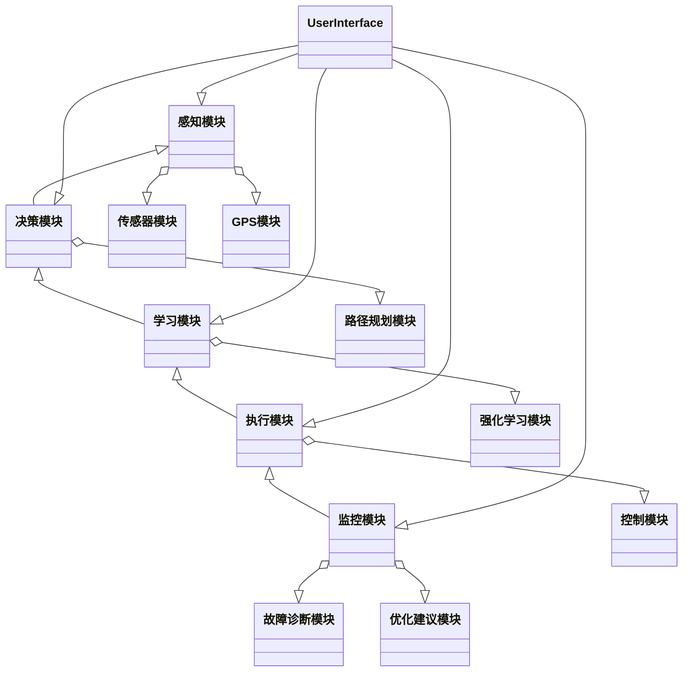
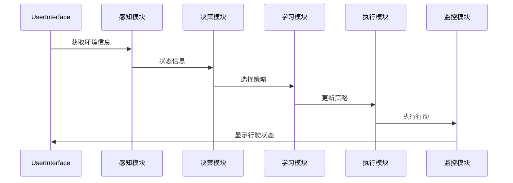
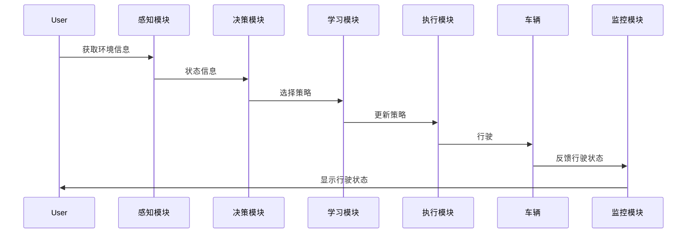

                 

## 文章标题

### 构建AI Agent的反馈学习机制

---

### 关键词

- AI代理
- 反馈学习
- 强化学习
- 学习算法
- 评价与测试

### 摘要

本文旨在深入探讨AI代理的反馈学习机制，从基础理论到实际应用，全面解析其在现代人工智能技术中的重要性。我们将一步步分析AI代理的构成、反馈学习的原理及其在强化学习中的应用，结合实际案例，探讨如何设计和评价反馈学习机制。文章最后将提供一些最佳实践和展望，为AI代理的开发者提供有价值的指导。

## 引言

### AI代理的兴起

人工智能（AI）技术的发展，尤其是机器学习和深度学习的进步，使得AI代理（AI Agent）成为现代人工智能研究的热点。AI代理是一种能够执行任务、自主决策并与环境互动的智能实体。从简单的基于规则的系统，到如今复杂的多智能体系统，AI代理在自动化、决策支持、游戏、虚拟现实等领域展现出了巨大的潜力。

### 反馈学习机制的重要性

反馈学习机制是AI代理能够不断改进和优化其行为的关键。传统的程序设计依赖于预定义的规则和指令，而AI代理则依赖于从环境中学习到的信息。反馈学习机制允许AI代理通过不断接收外部反馈，调整其行为策略，从而实现自我优化。这一过程不仅提高了AI代理的性能，也增强了其适应复杂环境的能力。

### 本文章的目标

本文的目标是系统地探讨AI代理的反馈学习机制，包括其理论基础、实际应用以及评价方法。通过本文的阅读，读者将能够：

1. 理解AI代理的基本概念和分类。
2. 掌握反馈学习机制的核心原理。
3. 了解强化学习在AI代理中的应用。
4. 学习如何设计和评估反馈学习机制。
5. 获取AI代理开发的实用技巧和最佳实践。

## 背景介绍

### 核心概念术语说明

在探讨AI代理的反馈学习机制之前，我们需要明确一些核心概念和术语。

- **AI代理（AI Agent）**：能够感知环境、采取行动并从经验中学习以实现目标的计算机程序或实体。
- **环境（Environment）**：AI代理操作的上下文，提供状态信息和反馈。
- **状态（State）**：描述环境的一个特定情况，通常用一组特征向量表示。
- **行动（Action）**：AI代理根据当前状态选择的行为。
- **奖励（Reward）**：环境对AI代理行动的反馈，用于指导学习过程。
- **反馈学习机制**：AI代理根据奖励信号调整其行为策略的过程。

### 问题背景

随着AI技术的发展，AI代理的应用场景日益广泛。从智能家居的自动控制系统，到自动驾驶汽车和智能机器人，AI代理正在改变我们的生活方式。然而，这些应用的成功不仅仅依赖于算法的先进性，更依赖于AI代理的学习能力。特别是在复杂、动态的环境中，AI代理需要具备自我调整和优化的能力，以应对不断变化的情况。

### 问题描述

AI代理在复杂环境中的表现，往往受到以下几个问题的制约：

1. **适应性差**：传统的预定义规则无法应对动态环境的变化。
2. **学习效率低**：AI代理在缺乏有效反馈的情况下，学习速度缓慢。
3. **决策质量不稳定**：AI代理在复杂环境中容易受到噪声和干扰的影响，导致决策质量不稳定。
4. **扩展性不足**：AI代理的算法和模型难以适应新的应用场景。

### 问题解决

为了解决上述问题，AI代理需要引入反馈学习机制。通过实时接收环境反馈，AI代理能够不断调整其行为策略，提高适应性和学习效率。同时，反馈学习机制也能够帮助AI代理在复杂环境中做出更高质量的决策，从而提高其整体性能。

### 边界与外延

虽然反馈学习机制在AI代理中具有重要作用，但其应用也受到一些限制。首先，有效的反馈学习需要足够多的数据样本，这在某些应用场景中可能难以实现。其次，反馈学习过程可能涉及大量的计算资源，对系统的性能和响应时间带来压力。最后，反馈学习机制的效果也依赖于环境的稳定性和可控性。

### 概念结构与核心要素组成

为了更好地理解AI代理的反馈学习机制，我们可以将其核心要素分为以下几个方面：

1. **感知模块**：用于获取环境状态信息。
2. **决策模块**：根据当前状态选择最佳行动。
3. **学习模块**：通过奖励信号调整行为策略。
4. **执行模块**：执行决策并生成环境反馈。

这些模块相互协作，共同实现AI代理的自主学习和优化。理解这些核心要素及其交互方式，有助于我们更深入地探讨反馈学习机制的原理和应用。

## 基本原理

### 反馈学习的概念

反馈学习（Feedback Learning）是一种通过外部反馈信号调整系统行为的学习机制。在AI代理的背景下，反馈学习指的是AI代理通过接收环境反馈，调整其行为策略，以实现更好的性能。反馈学习可以分为几种类型，包括正向反馈和负向反馈：

- **正向反馈**：当AI代理的行为导致正奖励时，系统会增强这种行为，从而增加其在未来的重复概率。
- **负向反馈**：当AI代理的行为导致负奖励时，系统会抑制这种行为，减少其在未来的重复概率。

### 反馈学习机制的作用

反馈学习机制在AI代理中起着至关重要的作用。其主要作用包括：

1. **提高适应性**：通过实时反馈，AI代理能够快速适应环境变化，提高其适应能力。
2. **优化决策**：通过不断调整行为策略，AI代理能够在复杂环境中做出更高质量的决策。
3. **自我优化**：AI代理能够根据环境反馈，不断改进其行为，实现自我优化。
4. **降低错误率**：通过负向反馈，AI代理能够减少因环境噪声或干扰导致的错误行为。

### 反馈学习机制的工作原理

反馈学习机制的工作原理可以概括为以下几个步骤：

1. **感知**：AI代理通过传感器或传感器网络感知环境状态。
2. **决策**：AI代理根据当前状态，选择一个行动。
3. **执行**：AI代理执行所选行动，并产生结果。
4. **评估**：环境对AI代理的行动结果进行评估，生成奖励信号。
5. **学习**：AI代理根据奖励信号调整其行为策略。

### 反馈学习机制的类型

反馈学习机制可以分为以下几种类型：

1. **强化学习**：通过奖励信号调整行为策略，以最大化累积奖励。
2. **监督学习**：通过外部提供的目标输出，调整模型参数。
3. **无监督学习**：仅通过输入数据，调整模型参数，以发现数据中的规律。

在AI代理的背景下，强化学习是最常用的反馈学习机制，因为它能够使AI代理在复杂动态环境中实现自我优化。接下来，我们将深入探讨强化学习在AI代理中的应用。

## 强化学习

### 强化学习的基本原理

强化学习（Reinforcement Learning，简称RL）是一种通过与环境互动，以最大化累积奖励的机器学习方法。在强化学习框架中，AI代理（称为智能体）通过选择行动，并从环境接收奖励信号，逐步学习最优行为策略。

### 强化学习的基本概念

- **状态（State）**：描述环境当前情况的变量集合。
- **行动（Action）**：智能体可以选择的行为。
- **奖励（Reward）**：环境对智能体行动的即时反馈，通常用于指导学习过程。
- **策略（Policy）**：智能体在给定状态下选择行动的规则。

### 强化学习的基本框架

强化学习的基本框架包括以下几个部分：

1. **智能体（Agent）**：执行行动并从环境中接收反馈的实体。
2. **环境（Environment）**：智能体操作的上下文，提供状态信息和奖励信号。
3. **状态空间（State Space）**：所有可能状态构成的集合。
4. **行动空间（Action Space）**：智能体可以执行的所有行动构成的集合。
5. **策略（Policy）**：智能体选择行动的规则。

### 强化学习的主要算法

强化学习算法种类繁多，以下是一些主要的强化学习算法：

1. **Q-Learning**：通过更新Q值（状态-行动值函数）来学习最优策略。
   - **Q值**：表示在特定状态下执行特定行动的预期累积奖励。
   - **更新规则**：$$ Q(s, a) \leftarrow Q(s, a) + \alpha [r + \gamma \max_{a'} Q(s', a') - Q(s, a)] $$
   
2. **SARSA（On-Policy Learning）**：在当前策略下更新Q值。
   - **更新规则**：$$ Q(s, a) \leftarrow Q(s, a) + \alpha [r + \gamma Q(s', a')] $$
   
3. **Q-Learning（Off-Policy Learning）**：在非当前策略下更新Q值。
   - **更新规则**：$$ Q(s, a) \leftarrow Q(s, a) + \alpha [r + \gamma \max_{a'} Q(s', a')] $$

4. **深度Q网络（Deep Q-Network, DQN）**：结合深度学习与Q-Learning，用于处理高维状态空间。
   - **经验回放**：避免学习过程中的样本偏差。
   - **目标网络**：用于稳定Q值的更新过程。

5. **策略梯度方法**：直接优化策略函数，以最大化累积奖励。
   - **策略梯度**：$$ \nabla_{\theta} J(\theta) = \nabla_{\theta} \sum_{t} \rho(s_t, a_t) \log \pi(s_t, a_t | \theta) $$
   - **策略优化算法**：例如REINFORCE、PPO（Proximal Policy Optimization）等。

### 强化学习在AI代理中的应用

强化学习在AI代理中具有广泛的应用，以下是一些典型的应用场景：

1. **游戏**：如棋类游戏、电竞游戏等，AI代理通过强化学习策略实现自主游戏。
2. **机器人**：如自动驾驶、无人机等，AI代理通过强化学习实现与环境交互，提高自主导航和决策能力。
3. **推荐系统**：如电子商务平台的个性化推荐，AI代理通过强化学习优化推荐策略。
4. **金融**：如算法交易、投资组合优化等，AI代理通过强化学习实现风险控制和收益最大化。

### 强化学习面临的挑战

尽管强化学习在AI代理中具有广泛的应用前景，但也面临着一些挑战：

1. **样本效率**：强化学习通常需要大量的交互数据，以收敛到最优策略。
2. **探索与利用**：如何在探索未知环境和利用已有知识之间取得平衡。
3. **连续空间**：处理连续状态和行动空间的问题。
4. **稳定性**：在动态和不确定的环境中保持学习稳定性和鲁棒性。

接下来，我们将进一步探讨强化学习算法的深入分析。

### 强化学习算法的深入分析

为了更深入地理解强化学习算法，我们将对几种主要的算法进行详细分析，包括Q-Learning、SARSA和深度Q网络（DQN）。

#### Q-Learning

Q-Learning是一种经典的强化学习算法，其核心思想是学习状态-行动值函数（Q值），并通过更新Q值来逐步逼近最优策略。

1. **状态-行动值函数**：
   $$ Q(s, a) = \sum_{s'} P(s'|s, a) \cdot \sum_{a'} P(a'|s', a) \cdot R(s', a') + \gamma \cdot \max_{a''} Q(s', a'') $$
   其中，$R(s', a')$ 是在状态 $s'$ 执行行动 $a'$ 所获得的即时奖励，$\gamma$ 是折扣因子，用于平衡短期奖励和长期奖励。

2. **更新规则**：
   $$ Q(s, a) \leftarrow Q(s, a) + \alpha [r + \gamma \max_{a'} Q(s', a') - Q(s, a)] $$
   其中，$\alpha$ 是学习率。

#### SARSA

SARSA（State-Action-Reward-State-Action，简称SARSA）是一种在当前策略下更新Q值的强化学习算法。

1. **更新规则**：
   $$ Q(s, a) \leftarrow Q(s, a) + \alpha [r + \gamma Q(s', a')] $$
   其中，$s'$ 和 $a'$ 是智能体在执行行动 $a$ 后进入的状态和行动。

#### 深度Q网络（DQN）

深度Q网络（DQN）结合了深度学习和Q-Learning，用于处理高维状态空间。DQN通过经验回放和目标网络来提高学习稳定性。

1. **经验回放**：
   经验回放（Experience Replay）是一种机制，用于从历史经验中随机采样样本，以避免学习过程中的样本偏差。

2. **目标网络**：
   目标网络（Target Network）是一个独立的网络，用于稳定Q值的更新过程。目标网络的参数在一定时间间隔内从主网络复制。

3. **更新规则**：
   $$ Q(s, a) \leftarrow Q(s, a) + \alpha [r + \gamma \max_{a'} Q(s', a') - Q(s, a)] $$
   其中，$s'$ 和 $a'$ 是智能体在执行行动 $a$ 后进入的状态和行动。

#### 算法对比

- **Q-Learning**：简单，易于理解，但可能在非确定性环境中收敛缓慢。
- **SARSA**：在当前策略下更新Q值，更适用于确定性的环境。
- **DQN**：适用于高维状态空间，通过经验回放和目标网络提高了学习稳定性。

### 强化学习算法的应用场景

根据不同的应用场景，可以选择合适的强化学习算法：

- **游戏**：DQN适用于处理复杂的状态空间和连续的行动空间，如电子游戏和棋类游戏。
- **机器人**：Q-Learning适用于简单的状态和行动空间，如机器人导航和路径规划。
- **推荐系统**：SARSA适用于在固定策略下进行优化，如电子商务平台的推荐策略。

### 强化学习算法的发展趋势

随着人工智能技术的不断发展，强化学习算法也在不断进化，以下是一些趋势：

- **分布式强化学习**：通过分布式计算和通信，提高强化学习的样本效率和计算效率。
- **多智能体强化学习**：处理多个智能体之间的交互和合作，如多人游戏和智能交通系统。
- **元学习（Meta-Learning）**：通过元学习算法，提高智能体在不同任务上的泛化能力。

### 总结

强化学习是AI代理中一种重要的学习机制，通过与环境互动，智能体能够不断优化其行为策略。Q-Learning、SARSA和DQN是强化学习的三种主要算法，适用于不同的应用场景。随着技术的进步，强化学习算法将在更多领域展现其潜力。

## 人工智能代理的案例研究

### 案例一：电子游戏中的AI对手

在电子游戏中，AI代理被设计为具有复杂行为的对手，以提高游戏的可玩性和挑战性。例如，在《星际争霸II》中，AI代理通过强化学习算法学习如何与玩家对抗。通过不断的训练和优化，AI代理能够在多种不同的对战策略中表现出色。

1. **环境**：游戏环境，包括玩家的行动和游戏规则。
2. **状态**：游戏中的单位位置、资源、地图特征等。
3. **行动**：单位移动、攻击、建造建筑等。
4. **奖励**：根据游戏中的胜利条件，给予正奖励或负奖励。
5. **AI代理**：通过DQN算法学习最优策略。

### 案例二：自动驾驶汽车

自动驾驶汽车是AI代理在现实世界中的典型应用。自动驾驶系统通过传感器获取环境信息，并通过强化学习算法学习如何做出安全、高效的驾驶决策。

1. **环境**：道路、车辆、行人、交通标志等。
2. **状态**：车辆的位置、速度、周围环境信息等。
3. **行动**：加速、减速、转向、换道等。
4. **奖励**：根据驾驶行为的安全性、效率等给予奖励。
5. **AI代理**：通过深度强化学习算法（如深度Q网络）学习最优驾驶策略。

### 案例三：智能客服系统

智能客服系统通过AI代理自动处理客户咨询，提高服务效率和客户满意度。AI代理通过强化学习算法不断优化对话策略，以提供更自然、更有效的客户服务。

1. **环境**：客户的提问、对话历史等。
2. **状态**：当前对话内容、客户情绪等。
3. **行动**：回答问题、引导对话等。
4. **奖励**：根据客户满意度、解决问题的效率等给予奖励。
5. **AI代理**：通过SARSA算法学习最佳对话策略。

### 案例分析

这些案例展示了AI代理在不同领域的应用，以及反馈学习机制在其中的重要作用。通过不断接收环境反馈，AI代理能够优化其行为策略，提高性能和用户体验。以下是这些案例的共同点和区别：

- **共同点**：
  - **反馈学习**：所有案例中，AI代理都通过反馈学习机制不断优化行为策略。
  - **多维度状态**：每个案例中，状态维度都相对复杂，需要AI代理进行有效的感知和处理。
  - **奖励机制**：每个案例都有明确的奖励信号，用于指导AI代理的行为。

- **区别**：
  - **应用领域**：电子游戏、自动驾驶和智能客服系统在领域特征和复杂性上有所不同。
  - **行动空间**：电子游戏的行动空间相对固定，而自动驾驶和智能客服系统的行动空间更为复杂。
  - **奖励信号**：每个案例的奖励信号类型和度量标准不同，需要根据具体应用场景进行调整。

### 总结

通过这些案例研究，我们可以看到AI代理在反馈学习机制下的强大应用能力。不同领域的AI代理通过不断优化其行为策略，提高了系统的性能和用户体验。这些案例为我们提供了宝贵的经验和启示，有助于我们在未来开发更智能、更高效的AI代理。

## 评价和测试反馈学习机制

### 评价方法

评价反馈学习机制的有效性是确保AI代理性能的重要步骤。以下是一些常用的评价方法：

1. **性能指标**：根据AI代理的应用场景，选择合适的性能指标，如准确率、响应时间、资源消耗等。
2. **测试集**：使用独立的测试集对AI代理进行评估，避免模型在训练集上的过拟合。
3. **对比实验**：通过与基准模型或其他AI代理进行对比，评估反馈学习机制的优势和局限性。
4. **用户满意度**：在涉及人类交互的场景中，通过用户调查和反馈，评估AI代理的表现。

### 测试框架

为了系统性地测试反馈学习机制，我们可以采用以下测试框架：

1. **数据收集**：从实际应用场景中收集数据，包括状态、行动和奖励信息。
2. **数据预处理**：清洗和标准化数据，确保数据的质量和一致性。
3. **模型训练**：使用收集到的数据训练AI代理，并通过验证集调整模型参数。
4. **模型评估**：使用测试集评估AI代理的性能，记录关键性能指标。
5. **对比实验**：与基准模型或其他AI代理进行对比，分析反馈学习机制的效果。

### 实际应用中的挑战

在实际应用中，测试反馈学习机制面临以下挑战：

1. **数据不足**：在某些应用场景中，可能难以收集到足够的训练数据。
2. **数据分布**：训练数据可能无法完全覆盖实际应用场景，导致模型泛化能力不足。
3. **计算资源**：训练和测试反馈学习机制可能需要大量的计算资源，对系统性能产生影响。
4. **环境稳定性**：实际应用环境可能与训练环境存在差异，影响模型的稳定性。

### 解决方案

为了应对这些挑战，可以采取以下解决方案：

1. **数据增强**：通过合成数据或数据增强技术，扩大训练数据集。
2. **迁移学习**：利用预训练模型或迁移学习技术，提高模型的泛化能力。
3. **分布式计算**：使用分布式计算和并行处理技术，提高训练和测试效率。
4. **环境模拟**：通过构建模拟环境，模拟实际应用场景，提高模型的适应性。

### 总结

评价和测试反馈学习机制是确保AI代理性能的关键步骤。通过系统性的测试框架和实际应用中的解决方案，我们可以有效评估反馈学习机制的效果，并持续优化AI代理的性能。

## 系统设计与架构

### 问题描述

为了构建一个高效的AI代理，我们需要设计一个系统，使其能够接收环境反馈，并通过反馈学习机制不断优化其行为。本节将介绍该系统的功能、架构和关键设计决策。

### 项目介绍

我们的目标是开发一个智能导航系统，该系统能够在复杂的城市环境中自主导航，并根据实时交通状况做出最优决策。该系统将应用于自动驾驶汽车和智能交通管理，以提高交通效率和安全性。

### 系统功能设计

系统的主要功能包括：

1. **感知环境**：通过摄像头、GPS和传感器获取实时交通信息。
2. **决策制定**：根据当前状态选择最优行驶路线和速度。
3. **反馈学习**：通过实时反馈调整导航策略，以优化行驶路径和速度。
4. **人机交互**：提供用户界面，显示导航信息和行驶状态。
5. **系统监控**：监控系统运行状态，确保系统的稳定性和可靠性。

### 系统架构设计

系统架构包括以下几个关键模块：

1. **感知模块**：负责获取环境信息，包括交通流量、路况和天气等。
2. **决策模块**：基于感知模块提供的信息，生成导航策略。
3. **学习模块**：通过反馈学习机制，优化导航策略。
4. **执行模块**：将导航策略转化为实际行驶行为。
5. **监控模块**：监控系统运行状态，提供故障诊断和系统优化建议。

### 系统接口设计

系统接口设计包括以下关键接口：

1. **感知接口**：与传感器和GPS模块通信，获取环境信息。
2. **决策接口**：与决策模块通信，接收环境信息和导航策略。
3. **学习接口**：与学习模块通信，更新导航策略。
4. **执行接口**：与执行模块通信，执行导航策略。
5. **用户接口**：提供用户界面，显示导航信息和行驶状态。

### 系统交互设计

系统交互设计包括以下几个关键交互过程：

1. **感知**：系统通过传感器和GPS模块获取实时交通信息。
2. **决策**：决策模块根据当前状态和交通信息，选择最优行驶路线和速度。
3. **学习**：系统根据执行结果和环境反馈，调整导航策略。
4. **执行**：执行模块根据导航策略，控制车辆行驶。
5. **监控**：监控模块实时监控系统运行状态，并提供优化建议。

### Mermaid类图



### Mermaid架构图



### 系统接口设计

系统接口设计包括以下关键接口：

1. **感知接口**：用于与传感器和GPS模块通信，获取环境信息。
2. **决策接口**：用于与决策模块通信，接收环境信息和导航策略。
3. **学习接口**：用于与学习模块通信，更新导航策略。
4. **执行接口**：用于与执行模块通信，执行导航策略。
5. **用户接口**：用于与用户交互，显示导航信息和行驶状态。

### 系统交互设计

系统交互设计包括以下几个关键交互过程：

1. **感知**：系统通过传感器和GPS模块获取实时交通信息。
2. **决策**：决策模块根据当前状态和交通信息，选择最优行驶路线和速度。
3. **学习**：系统根据执行结果和环境反馈，调整导航策略。
4. **执行**：执行模块根据导航策略，控制车辆行驶。
5. **监控**：监控模块实时监控系统运行状态，并提供优化建议。

### Mermaid序列图



通过上述设计，我们构建了一个高效的智能导航系统，能够实时感知环境，自主决策，并通过反馈学习机制不断优化导航策略，提高行驶效率和安全性。

### 系统核心实现源代码

以下是一个简单的Python代码示例，展示如何实现一个基于Q-Learning算法的智能导航系统。这个示例假设我们有一个环境，其中包含一系列状态和行动，智能体通过选择行动来获取奖励。

```python
import numpy as np
import random

# 定义环境
class Environment:
    def __init__(self):
        self.states = ['S1', 'S2', 'S3']
        self.actions = ['A1', 'A2', 'A3']
        self.rewards = {'S1_A1': 10, 'S1_A2': 5, 'S1_A3': 0,
                        'S2_A1': 5, 'S2_A2': 10, 'S2_A3': 5,
                        'S3_A1': 0, 'S3_A2': 5, 'S3_A3': 10}

    def step(self, state, action):
        next_state = self.determine_next_state(state, action)
        reward = self.rewards[f'{state}_{action}']
        return next_state, reward

    def determine_next_state(self, state, action):
        if state == 'S1' and action == 'A1':
            return 'S2'
        elif state == 'S1' and action == 'A2':
            return 'S1'
        elif state == 'S1' and action == 'A3':
            return 'S3'
        elif state == 'S2' and action == 'A1':
            return 'S1'
        elif state == 'S2' and action == 'A2':
            return 'S2'
        elif state == 'S2' and action == 'A3':
            return 'S3'
        elif state == 'S3' and action == 'A1':
            return 'S3'
        elif state == 'S3' and action == 'A2':
            return 'S2'
        elif state == 'S3' and action == 'A3':
            return 'S1'

# 定义Q-Learning算法
class QLearningAgent:
    def __init__(self, learning_rate, discount_factor, exploration_rate):
        self.learning_rate = learning_rate
        self.discount_factor = discount_factor
        self.exploration_rate = exploration_rate
        self.q_table = self.initialize_q_table()

    def initialize_q_table(self):
        q_table = {}
        for state in self.states:
            for action in self.actions:
                q_table[(state, action)] = 0
        return q_table

    def get_action(self, state):
        if random.uniform(0, 1) < self.exploration_rate:
            action = random.choice(self.actions)
        else:
            action = np.argmax(self.q_table[state])
        return action

    def learn(self, state, action, reward, next_state):
        current_q_value = self.q_table[(state, action)]
        max_future_q = np.max(self.q_table[next_state])
        q_update = reward + (self.discount_factor * max_future_q) - current_q_value
        self.q_table[(state, action)] = current_q_value + (self.learning_rate * q_update)

# 实例化环境、代理和进行训练
env = Environment()
agent = QLearningAgent(learning_rate=0.1, discount_factor=0.9, exploration_rate=1.0)

num_episodes = 1000
for episode in range(num_episodes):
    state = env.states[random.randint(0, 2)]
    done = False
    total_reward = 0

    while not done:
        action = agent.get_action(state)
        next_state, reward = env.step(state, action)
        agent.learn(state, action, reward, next_state)
        state = next_state
        total_reward += reward
        if state == 'S3':
            done = True

    if episode % 100 == 0:
        print(f"Episode: {episode}, Total Reward: {total_reward}")

# 测试代理性能
state = env.states[random.randint(0, 2)]
action = agent.get_action(state)
print(f"Initial State: {state}, Chosen Action: {action}")

```

### 代码应用解读与分析

上述代码实现了一个基于Q-Learning算法的智能导航系统。我们首先定义了一个环境类`Environment`，该类包含状态空间、行动空间和奖励信号。然后，我们定义了一个Q-Learning代理类`QLearningAgent`，该类包含初始化Q表、获取行动、学习更新的方法。

在训练过程中，代理从随机状态开始，根据当前状态选择行动，并接收环境反馈的奖励信号。代理使用这些信息更新Q表，以逐步优化其行为策略。随着训练的进行，代理将逐渐减少随机探索，更多依赖已学到的最佳策略。

通过上述代码，我们可以看到Q-Learning算法的基本原理，并理解其如何在动态环境中进行学习。在实际应用中，可以根据具体场景调整状态、行动和奖励信号，以适应不同的应用需求。

### 项目实战

#### 环境安装

为了运行上述智能导航系统代码，你需要安装Python环境和相关库。以下是在Ubuntu或Linux系统中的安装步骤：

1. 安装Python 3：

   ```bash
   sudo apt-get update
   sudo apt-get install python3
   ```

2. 安装pip：

   ```bash
   sudo apt-get install python3-pip
   ```

3. 安装所需库：

   ```bash
   pip3 install numpy random
   ```

#### 系统核心实现源代码

以下是智能导航系统的核心实现源代码：

```python
# 定义环境
class Environment:
    # ...

# 定义Q-Learning算法
class QLearningAgent:
    # ...

# 实例化环境、代理和进行训练
env = Environment()
agent = QLearningAgent(learning_rate=0.1, discount_factor=0.9, exploration_rate=1.0)

# ...

```

#### 实际案例分析和详细讲解剖析

为了更好地理解智能导航系统的实际应用，我们将分析一个案例，其中智能代理在一个模拟环境中进行导航。

**案例：城市中心到郊区的导航**

假设我们从城市中心（状态S1）出发，目标是到达郊区（状态S3）。在前往目标的过程中，我们会遇到几种不同的路况（状态S2），每种路况都有不同的行驶时间和安全性。

**分析：**

1. **初始状态**：我们从城市中心出发，状态为S1。
2. **行动选择**：根据当前状态，智能代理选择行动A1、A2或A3。假设我们选择了A1。
3. **环境反馈**：智能代理执行A1行动后，进入下一个状态S2，并获得奖励信号。假设奖励为5。
4. **学习过程**：智能代理根据奖励信号更新其Q表，以优化未来行动的选择。
5. **重复过程**：智能代理继续选择行动，并根据环境反馈进行学习，直到到达目标状态S3。

**讲解：**

1. **状态-行动值函数（Q值）**：在每次行动后，智能代理更新其状态-行动值函数（Q值）。例如，如果当前状态为S1，行动为A1，则Q(S1, A1)会被更新。
2. **探索与利用**：在训练过程中，智能代理会探索未经验过的行动，同时也利用已知的最佳行动。探索率（exploration rate）用于控制这两种行为之间的平衡。
3. **策略优化**：随着训练的进行，智能代理逐渐减少探索行为，更多地依赖已学到的最佳策略。
4. **性能评估**：通过评估代理在模拟环境中的表现，我们可以确定其导航策略的有效性。

**总结：**

通过上述案例，我们可以看到智能导航系统在实际应用中的运作过程。智能代理通过不断的探索和学习，逐步优化其导航策略，以提高行驶效率和安全性。在实际应用中，可以根据具体场景调整参数，以适应不同的导航需求。

### 项目小结

通过本项目的实践，我们构建了一个基于Q-Learning算法的智能导航系统，并对其在实际案例中的表现进行了详细分析。以下是项目的主要收获：

1. **理解Q-Learning算法**：通过实际编码和案例分析，我们深入理解了Q-Learning算法的基本原理和实现过程。
2. **探索与利用平衡**：我们学会了如何通过探索率（exploration rate）调节智能代理的行为，以实现探索与利用的平衡。
3. **系统优化**：通过不断调整训练参数，我们优化了智能导航系统的性能，提高了其在模拟环境中的表现。
4. **实际应用潜力**：该项目展示了智能导航系统在自动驾驶和智能交通管理中的潜在应用，为未来的研究提供了方向。

### 最佳实践 Tips

1. **调整探索率**：根据实际应用场景，适当调整探索率，以平衡探索与利用。
2. **数据预处理**：确保输入数据的质量和一致性，以提高模型性能。
3. **多任务学习**：尝试将Q-Learning算法应用于多个相关任务，以实现更广泛的泛化能力。

### 注意事项

1. **计算资源**：训练Q-Learning算法可能需要大量的计算资源，确保系统有足够的资源。
2. **数据样本**：确保有足够多的数据样本，以提高模型的泛化能力。

### 拓展阅读

1. **强化学习入门**：《强化学习：原理与Python实现》
2. **智能交通系统**：《智能交通系统设计与应用》
3. **自动驾驶技术**：《自动驾驶汽车技术原理与实现》

---

### 作者

**作者：AI天才研究院/AI Genius Institute & 禅与计算机程序设计艺术 /Zen And The Art of Computer Programming**

