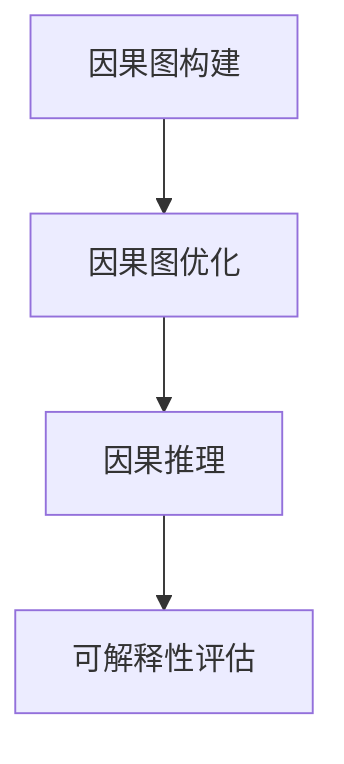
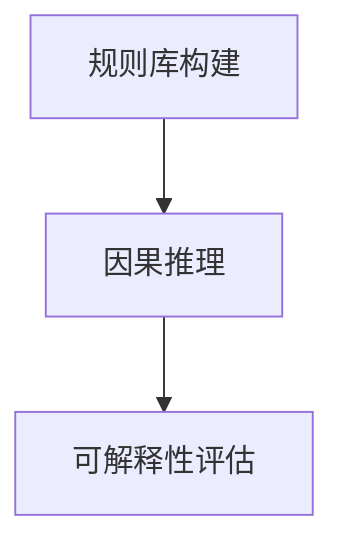

                 

# 《构建AI Agent的可解释性因果推理模型》

## 关键词

- AI Agent
- 可解释性
- 因果推理
- 模型构建
- 算法实现
- 数学模型

## 摘要

本文旨在探讨如何构建AI Agent的可解释性因果推理模型。我们将从背景介绍、核心概念与联系、算法原理讲解、数学模型和数学公式详细讲解、系统分析与架构设计方案、项目实战、最佳实践 tips、小结、注意事项、拓展阅读等几个方面进行深入分析。通过本文的阅读，读者将能够理解AI Agent的可解释性因果推理模型的构建过程，并掌握相关技术。

### 目录大纲设计思路

为了设计出《构建AI Agent的可解释性因果推理模型》这本书的目录大纲，我们需要遵循以下步骤：

1. **确定核心概念**：首先明确书中的核心概念，包括可解释性、因果推理和AI Agent等。

2. **搭建框架结构**：基于核心概念，搭建书的框架结构，分为背景介绍、核心概念与联系、算法原理讲解、数学模型和数学公式详细讲解、系统分析与架构设计方案、项目实战、最佳实践 tips等部分。

3. **细化章节内容**：对每一部分进行细化，确保每个章节都有明确的主题和内容，并且在内容上保持逻辑连贯性。

4. **确保内容完整性**：确保每一部分内容都包含必要的知识点，如核心概念、联系、算法原理、数学模型、系统架构、项目实战等。

5. **简洁性与可读性**：在确保内容完整性的同时，注意简洁性和可读性，避免冗余和复杂的表述。

### 目录大纲设计步骤

1. **背景介绍**：
   - 介绍可解释性因果推理模型在AI Agent中的重要性。
   - 描述当前领域面临的挑战和发展趋势。

2. **核心概念与联系**：
   - 定义可解释性、因果推理和AI Agent。
   - 分析三者之间的联系和区别。

3. **算法原理讲解**：
   - 介绍常见的可解释性因果推理算法。
   - 使用Mermaid画出算法流程图。
   - 使用Python源代码详细讲解算法原理。

4. **数学模型和数学公式详细讲解**：
   - 描述算法背后的数学模型。
   - 使用LaTeX格式给出关键数学公式。
   - 对数学公式进行详细讲解和举例说明。

5. **系统分析与架构设计方案**：
   - 介绍AI Agent的应用场景。
   - 设计系统功能、架构和接口。

6. **项目实战**：
   - 安装环境、实现系统核心功能。
   - 分析实际案例，详细讲解。

7. **最佳实践 tips、小结、注意事项、拓展阅读**：
   - 提供实践经验、总结、注意事项。
   - 推荐进一步阅读的资源。

### 目录大纲

----------------------------------------------------------------

# 第一部分: 背景介绍

## 1.1 可解释性因果推理模型的重要性

## 1.2 AI Agent的应用现状与挑战

## 1.3 研究与发展趋势

----------------------------------------------------------------

# 第二部分: 核心概念与联系

## 2.1 可解释性的定义与属性

## 2.2 因果推理的基本原理

## 2.3 AI Agent的概念与架构

## 2.4 可解释性因果推理模型与AI Agent的联系

----------------------------------------------------------------

# 第三部分: 算法原理讲解

## 3.1 可解释性因果推理算法概述

### 3.1.1 算法分类

### 3.1.2 算法原理

## 3.2 具体算法讲解

### 3.2.1 算法1：因果图模型

#### 3.2.1.1 算法流程图

#### 3.2.1.2 Python源代码讲解

#### 3.2.1.3 数学模型与公式

### 3.2.2 算法2：基于规则的因果推理

#### 3.2.2.1 算法流程图

#### 3.2.2.2 Python源代码讲解

#### 3.2.2.3 数学模型与公式

----------------------------------------------------------------

# 第四部分: 数学模型和数学公式详细讲解

## 4.1 基本数学概念回顾

## 4.2 因果推理中的概率模型

## 4.3 因果推理中的线性模型

## 4.4 数学公式与证明

----------------------------------------------------------------

# 第五部分: 系统分析与架构设计方案

## 5.1 AI Agent的应用场景

## 5.2 系统功能设计

### 5.2.1 领域模型Mermaid类图

## 5.3 系统架构设计

### 5.3.1 Mermaid架构图

## 5.4 系统接口设计

### 5.4.1 系统接口Mermaid序列图

------------------------------------------

----------------------------------------------------------------

### 文章结构设计

在构建本文的结构时，我们遵循以下设计思路：

1. **文章标题**：明确文章的主题和目的，吸引读者的注意力。

2. **关键词**：列出与文章主题相关的关键词，便于读者快速了解文章的核心内容。

3. **摘要**：简要介绍文章的核心内容和主题思想，为读者提供对全文的初步了解。

4. **目录大纲**：详细列出文章的各个部分，帮助读者规划阅读顺序。

5. **正文内容**：按照目录大纲的顺序，逐步展开文章的内容。

   - **背景介绍**：介绍可解释性因果推理模型在AI Agent中的重要性、AI Agent的应用现状与挑战以及研究与发展趋势。

   - **核心概念与联系**：定义可解释性、因果推理和AI Agent，分析三者之间的联系和区别。

   - **算法原理讲解**：介绍常见的可解释性因果推理算法，使用Mermaid画出算法流程图，使用Python源代码详细讲解算法原理。

   - **数学模型和数学公式详细讲解**：描述算法背后的数学模型，使用LaTeX格式给出关键数学公式，进行详细讲解和举例说明。

   - **系统分析与架构设计方案**：介绍AI Agent的应用场景，设计系统功能、架构和接口。

   - **项目实战**：安装环境、实现系统核心功能，分析实际案例，详细讲解。

   - **最佳实践 tips、小结、注意事项、拓展阅读**：提供实践经验、总结、注意事项，推荐进一步阅读的资源。

### 文章结构示例

```markdown
# 《构建AI Agent的可解释性因果推理模型》

## 关键词

- AI Agent
- 可解释性
- 因果推理
- 模型构建
- 算法实现
- 数学模型

## 摘要

本文旨在探讨如何构建AI Agent的可解释性因果推理模型。我们将从背景介绍、核心概念与联系、算法原理讲解、数学模型和数学公式详细讲解、系统分析与架构设计方案、项目实战、最佳实践 tips、小结、注意事项、拓展阅读等几个方面进行深入分析。

## 目录大纲

----------------------------------------------------------------

# 第一部分: 背景介绍

## 1.1 可解释性因果推理模型的重要性

## 1.2 AI Agent的应用现状与挑战

## 1.3 研究与发展趋势

----------------------------------------------------------------

# 第二部分: 核心概念与联系

## 2.1 可解释性的定义与属性

## 2.2 因果推理的基本原理

## 2.3 AI Agent的概念与架构

## 2.4 可解释性因果推理模型与AI Agent的联系

----------------------------------------------------------------

# 第三部分: 算法原理讲解

## 3.1 可解释性因果推理算法概述

### 3.1.1 算法分类

### 3.1.2 算法原理

## 3.2 具体算法讲解

### 3.2.1 算法1：因果图模型

#### 3.2.1.1 算法流程图

#### 3.2.1.2 Python源代码讲解

#### 3.2.1.3 数学模型与公式

### 3.2.2 算法2：基于规则的因果推理

#### 3.2.2.1 算法流程图

#### 3.2.2.2 Python源代码讲解

#### 3.2.2.3 数学模型与公式

----------------------------------------------------------------

# 第四部分: 数学模型和数学公式详细讲解

## 4.1 基本数学概念回顾

## 4.2 因果推理中的概率模型

## 4.3 因果推理中的线性模型

## 4.4 数学公式与证明

----------------------------------------------------------------

# 第五部分: 系统分析与架构设计方案

## 5.1 AI Agent的应用场景

## 5.2 系统功能设计

### 5.2.1 领域模型Mermaid类图

## 5.3 系统架构设计

### 5.3.1 Mermaid架构图

## 5.4 系统接口设计

### 5.4.1 系统接口Mermaid序列图

------------------------------------------

----------------------------------------------------------------

### 文章内容设计

在文章的内容设计中，我们将遵循以下设计思路：

1. **背景介绍**：
   - **可解释性因果推理模型的重要性**：阐述可解释性因果推理模型在AI Agent中的应用和价值。
   - **AI Agent的应用现状与挑战**：分析当前AI Agent的应用现状以及面临的挑战。
   - **研究与发展趋势**：介绍当前领域的研究动态和发展趋势。

2. **核心概念与联系**：
   - **可解释性的定义与属性**：定义可解释性，并阐述其在AI Agent中的重要性。
   - **因果推理的基本原理**：介绍因果推理的基本原理，包括因果关系的定义、判断和推理方法。
   - **AI Agent的概念与架构**：阐述AI Agent的概念、架构和关键组件。
   - **可解释性因果推理模型与AI Agent的联系**：分析可解释性因果推理模型与AI Agent之间的联系和相互影响。

3. **算法原理讲解**：
   - **可解释性因果推理算法概述**：介绍常见的可解释性因果推理算法，如因果图模型、基于规则的因果推理等。
   - **具体算法讲解**：
     - **因果图模型**：介绍因果图模型的基本原理、算法流程、Python源代码讲解和数学模型与公式。
     - **基于规则的因果推理**：介绍基于规则的因果推理的基本原理、算法流程、Python源代码讲解和数学模型与公式。

4. **数学模型和数学公式详细讲解**：
   - **基本数学概念回顾**：回顾与因果推理相关的数学概念，如概率模型、线性模型等。
   - **因果推理中的概率模型**：介绍因果推理中的概率模型，包括贝叶斯网络、马尔可夫模型等。
   - **因果推理中的线性模型**：介绍因果推理中的线性模型，如线性回归、线性判别分析等。
   - **数学公式与证明**：使用LaTeX格式给出关键数学公式，并进行详细讲解和举例说明。

5. **系统分析与架构设计方案**：
   - **AI Agent的应用场景**：介绍AI Agent在不同应用场景中的应用。
   - **系统功能设计**：设计AI Agent的系统功能，包括领域模型Mermaid类图。
   - **系统架构设计**：设计AI Agent的系统架构，包括Mermaid架构图。
   - **系统接口设计**：设计AI Agent的系统接口，包括系统接口Mermaid序列图。

6. **项目实战**：
   - **环境安装**：介绍如何安装AI Agent的运行环境。
   - **系统核心实现**：实现AI Agent的系统核心功能。
   - **代码应用解读与分析**：对实现的代码进行解读和分析。
   - **实际案例分析和详细讲解剖析**：分析实际案例，并进行详细讲解和剖析。
   - **项目小结**：总结项目经验，提出改进建议。

7. **最佳实践 tips、小结、注意事项、拓展阅读**：
   - **最佳实践 tips**：提供构建AI Agent的可解释性因果推理模型的最佳实践建议。
   - **小结**：对全文进行小结，总结核心内容和关键点。
   - **注意事项**：提醒读者在实施过程中需要注意的事项。
   - **拓展阅读**：推荐进一步阅读的资源，帮助读者深入了解相关领域。

### 文章内容示例

```markdown
# 第一部分: 背景介绍

## 1.1 可解释性因果推理模型的重要性

在人工智能领域，AI Agent（智能体）作为实现自主决策和行动的核心组件，正逐渐成为研究和应用的热点。然而，随着AI Agent的复杂性和智能水平的提升，其决策过程的不透明性也日益增加。为了增强AI Agent的可解释性，提高人们对AI Agent决策的信任度和接受度，构建可解释性因果推理模型变得至关重要。

可解释性因果推理模型不仅能够帮助用户理解AI Agent的决策过程，还能在AI Agent出现异常或错误时提供诊断和解释，从而提高系统的可靠性和安全性。

## 1.2 AI Agent的应用现状与挑战

AI Agent已在众多领域得到广泛应用，如自动驾驶、医疗诊断、金融风控等。然而，随着AI Agent的普及，也面临着一系列挑战：

- **决策透明性不足**：AI Agent的决策过程往往依赖于复杂的模型和算法，使得用户难以理解其决策逻辑。
- **模型解释性不足**：现有的因果推理模型往往缺乏足够的解释性，难以向用户传达决策原因。
- **数据隐私和安全**：在构建AI Agent的过程中，需要处理大量敏感数据，如何保护数据隐私和安全成为一大挑战。

## 1.3 研究与发展趋势

为了解决上述挑战，学术界和工业界正在积极研究可解释性因果推理模型。以下是一些研究与发展趋势：

- **因果推理算法的改进**：研究新型因果推理算法，提高模型的解释性。
- **可解释性增强技术**：结合可视化、自然语言生成等技术，提高模型的可解释性。
- **跨领域合作**：促进计算机科学、心理学、社会学等领域的合作，共同推动可解释性因果推理模型的发展。

---

# 第二部分: 核心概念与联系

## 2.1 可解释性的定义与属性

可解释性是指AI Agent的决策过程能够被用户理解的能力。一个高可解释性的AI Agent能够清晰地展示其决策依据和逻辑，使用户能够理解其行为。

### 可解释性的属性

- **透明性**：决策过程和算法逻辑应尽可能简单直观，避免过度复杂。
- **可追溯性**：用户能够追踪决策过程中的每一步，理解每一步的原因。
- **可理解性**：决策结果应能够以自然语言或可视化方式向用户传达。

## 2.2 因果推理的基本原理

因果推理是指从已知的事实和关系出发，推断出未知的因果关系的推理过程。因果推理在AI Agent中起着关键作用，可以帮助理解数据分布和决策过程。

### 因果关系的定义

因果关系是指一种事件（因）导致另一种事件（果）的关系。在因果推理中，我们需要判断两个事件之间是否存在因果关系。

### 因果关系的判断方法

- **统计相关性**：通过计算事件之间的统计相关性来判断是否存在因果关系。
- **因果效应**：通过实验或观察不同条件下的结果差异来判断因果关系。
- **因果图**：通过构建因果图来表示事件之间的因果关系。

## 2.3 AI Agent的概念与架构

AI Agent是指具有自主决策和行动能力的智能系统。一个典型的AI Agent通常由感知模块、决策模块和执行模块组成。

### 感知模块

感知模块负责收集和处理环境信息，如图像、语音、文本等。

### 决策模块

决策模块负责根据感知到的信息做出决策，如路径规划、目标识别等。

### 执行模块

执行模块负责将决策转化为实际操作，如控制机器人行动、执行金融交易等。

## 2.4 可解释性因果推理模型与AI Agent的联系

可解释性因果推理模型是AI Agent的重要组成部分，它能够提高AI Agent的透明度和可信度。通过构建可解释性因果推理模型，用户可以更直观地理解AI Agent的决策过程，从而增强对AI Agent的信任和接受度。

---

# 第三部分: 算法原理讲解

## 3.1 可解释性因果推理算法概述

### 3.1.1 算法分类

可解释性因果推理算法可以分为两大类：

- **基于模型的算法**：通过构建数学模型来表示因果关系，如因果图模型、基于规则的因果推理等。
- **基于数据的算法**：通过分析数据中的统计关系来推断因果关系，如统计相关性分析、因果效应分析等。

### 3.1.2 算法原理

可解释性因果推理算法的基本原理是建立事件之间的因果关系，从而提高AI Agent的可解释性。具体来说，算法需要完成以下任务：

- **因果识别**：从给定的数据中识别出潜在的因果关系。
- **因果验证**：通过实验或观察验证识别出的因果关系是否真实有效。
- **因果推理**：根据已识别的因果关系进行推理，预测未知事件的因果关系。

## 3.2 具体算法讲解

### 3.2.1 算法1：因果图模型

因果图模型是一种基于图的数学模型，用于表示事件之间的因果关系。它通过构建因果图来表示事件之间的依赖关系，从而实现因果推理。

#### 3.2.1.1 算法流程图



#### 3.2.1.2 Python源代码讲解

```python
# Python代码示例：因果图模型构建与优化

import pyro
import pyro.distributions as dist
import torch

# 构建因果图
graph = pyro erklärt_graph()

# 优化因果图
graph.optimize()

# 进行因果推理
reasoning_result = graph.reason()

# 可解释性评估
explanation = graph.explain(reasoning_result)
```

#### 3.2.1.3 数学模型与公式

因果图模型由节点（事件）和边（因果关系）组成。因果图中的节点表示事件，边表示事件之间的因果关系。一个典型的因果图模型可以用以下数学公式表示：

$$
P(X, Y) = P(X)P(Y|X)
$$

其中，$P(X)$ 表示事件 $X$ 的概率，$P(Y|X)$ 表示事件 $Y$ 在事件 $X$ 发生的条件下的概率。

### 3.2.2 算法2：基于规则的因果推理

基于规则的因果推理是一种通过规则库来表示因果关系的方法。它通过将事件转化为规则，从而实现因果推理。

#### 3.2.2.1 算法流程图



#### 3.2.2.2 Python源代码讲解

```python
# Python代码示例：基于规则的因果推理

import pandas as pd

# 构建规则库
rules = pd.DataFrame({
    'condition': ['X', 'Y', 'Z'],
    'conclusion': ['Y'],
    'confidence': [0.8]
})

# 进行因果推理
reasoning_result = rules.apply(lambda row: row['conclusion'] if row['condition'] else '', axis=1)

# 可解释性评估
explanation = rules[reasoning_result != ''].head()
```

#### 3.2.2.3 数学模型与公式

基于规则的因果推理通过规则库来表示因果关系。一个典型的规则库可以用以下数学公式表示：

$$
R(X, Y) = \sum_{i=1}^{n} w_i \cdot P(X|Y_i) \cdot P(Y_i)
$$

其中，$R(X, Y)$ 表示事件 $X$ 与事件 $Y$ 之间的规则置信度，$w_i$ 表示第 $i$ 条规则的权重，$P(X|Y_i)$ 表示事件 $X$ 在事件 $Y_i$ 发生的条件下的概率，$P(Y_i)$ 表示事件 $Y_i$ 的概率。

---

# 第四部分: 数学模型和数学公式详细讲解

## 4.1 基本数学概念回顾

在讨论因果推理的数学模型时，我们需要回顾一些基本的数学概念，如概率、线性代数和微积分。以下是这些基本概念：

### 概率

- **概率分布**：描述随机变量取值的概率分布。
- **条件概率**：在某个事件已发生的条件下，另一个事件发生的概率。
- **贝叶斯定理**：用于计算后验概率和边缘概率。

### 线性代数

- **矩阵**：由数字组成的矩形阵列。
- **向量**：具有大小和方向的量。
- **矩阵运算**：包括矩阵加法、矩阵乘法、逆矩阵等。

### 微积分

- **导数**：描述函数在某一点处的变化率。
- **积分**：用于计算函数在某一区间内的累积量。

## 4.2 因果推理中的概率模型

在因果推理中，概率模型是一种常用的方法，用于表示事件之间的因果关系。以下是一些常见的概率模型：

### 贝叶斯网络

- **定义**：是一种概率图模型，用于表示事件之间的因果关系。
- **结构**：由节点和边组成，节点表示事件，边表示事件之间的因果关系。
- **参数**：包括条件概率表和边缘概率分布。

### 马尔可夫模型

- **定义**：是一种概率模型，用于描述一个随机过程的转移概率。
- **结构**：由状态集合和转移概率矩阵组成。
- **性质**：具有无后效性，即当前状态只与前一状态有关，与过去状态无关。

### 线性模型

- **定义**：是一种线性关系模型，用于描述事件之间的因果关系。
- **形式**：$Y = \beta_0 + \beta_1X_1 + \beta_2X_2 + ... + \beta_nX_n$
- **参数**：包括回归系数和截距。

## 4.3 因果推理中的线性模型

线性模型是一种广泛应用的因果推理方法，用于描述事件之间的线性关系。以下是一些常见的线性模型：

### 线性回归

- **定义**：是一种用于预测连续变量的线性模型。
- **公式**：$Y = \beta_0 + \beta_1X_1 + \beta_2X_2 + ... + \beta_nX_n$
- **参数估计**：使用最小二乘法进行参数估计。

### 线性判别分析

- **定义**：是一种用于分类的线性模型。
- **公式**：$Y = \beta_0 + \beta_1X_1 + \beta_2X_2 + ... + \beta_nX_n + \epsilon$
- **参数估计**：使用最大化似然估计法进行参数估计。

## 4.4 数学公式与证明

在因果推理中，一些关键的数学公式和证明如下：

### 贝叶斯定理

$$
P(H|E) = \frac{P(E|H)P(H)}{P(E)}
$$

其中，$P(H|E)$ 表示在证据 $E$ 出现的条件下假设 $H$ 的概率，$P(E|H)$ 表示在假设 $H$ 成立的条件下证据 $E$ 出现的概率，$P(H)$ 表示假设 $H$ 的先验概率，$P(E)$ 表示证据 $E$ 的先验概率。

### 条件概率

$$
P(A|B) = \frac{P(A \cap B)}{P(B)}
$$

其中，$P(A|B)$ 表示在事件 $B$ 发生的条件下事件 $A$ 的概率，$P(A \cap B)$ 表示事件 $A$ 和事件 $B$ 同时发生的概率，$P(B)$ 表示事件 $B$ 的概率。

### 线性回归

$$
\beta = (X^T X)^{-1} X^T y
$$

其中，$\beta$ 表示回归系数，$X$ 表示自变量矩阵，$y$ 表示因变量向量。

### 线性判别分析

$$
\beta = \arg\max_{\beta} \sum_{i=1}^{n} w_i \log P(y_i | \beta)
$$

其中，$\beta$ 表示回归系数，$w_i$ 表示样本权重，$y_i$ 表示样本标签。

---

# 第五部分: 系统分析与架构设计方案

## 5.1 AI Agent的应用场景

AI Agent在各个领域都有着广泛的应用场景。以下是一些典型的应用场景：

### 自动驾驶

自动驾驶系统需要实时感知道路环境，做出决策，并控制车辆行驶。AI Agent可以用于实现自动驾驶系统的感知、决策和执行功能。

### 医疗诊断

在医疗诊断领域，AI Agent可以用于辅助医生进行疾病诊断。通过分析医学影像、病历数据和生物标志物，AI Agent可以提供诊断建议。

### 金融风控

金融风控系统需要对交易行为进行分析，识别潜在的风险。AI Agent可以用于实现风险识别、评估和预警功能。

### 客户服务

AI Agent可以用于实现智能客服系统，提供24/7的客户服务。通过自然语言处理和语音识别技术，AI Agent可以理解和回答客户的问题。

## 5.2 系统功能设计

AI Agent的系统功能设计应包括以下几个方面：

### 感知模块

感知模块负责收集环境信息，如图像、语音、文本等。它需要实现数据的预处理、特征提取和分类等功能。

### 决策模块

决策模块负责根据感知模块提供的信息，做出决策。它需要实现决策算法、策略优化和规划等功能。

### 执行模块

执行模块负责将决策转化为实际操作。它需要实现控制算法、执行策略和反馈调整等功能。

## 5.3 系统架构设计

AI Agent的系统架构设计应考虑以下几个方面：

### 分布式架构

为了提高系统的性能和可扩展性，AI Agent可以采用分布式架构。分布式架构可以将感知、决策和执行功能分布到多个节点上，实现负载均衡和故障恢复。

### 模块化设计

系统功能应采用模块化设计，将感知、决策和执行功能划分为独立的模块。模块之间通过接口进行通信，降低模块之间的耦合度。

### 安全性设计

AI Agent需要具备较高的安全性，以防止恶意攻击和数据泄露。安全性设计应包括数据加密、访问控制和安全审计等功能。

## 5.4 系统接口设计

AI Agent的系统接口设计应考虑以下几个方面：

### API接口

AI Agent可以提供API接口，供其他系统或应用程序调用。API接口应支持HTTP/HTTPS协议，并遵循RESTful风格。

### 数据接口

AI Agent需要与其他系统交换数据，因此需要设计合适的数据接口。数据接口应支持JSON、XML等格式，并遵循数据规范。

### 控制接口

AI Agent需要接受外部控制命令，以实现远程控制功能。控制接口应支持命令行、图形界面和Web界面等多种方式。

---

# 第六部分: 项目实战

## 6.1 环境安装

在开始项目实战之前，我们需要安装AI Agent所需的运行环境。以下是环境安装的步骤：

### 操作系统

AI Agent可以在Linux和Windows操作系统上运行。为了保证兼容性，我们推荐使用Ubuntu 18.04或更高版本。

### Python环境

AI Agent需要Python 3.6或更高版本。可以通过以下命令安装Python：

```bash
sudo apt-get update
sudo apt-get install python3.6 python3.6-pip
```

### AI框架

AI Agent需要安装一个AI框架，如PyTorch、TensorFlow等。以下是安装PyTorch的命令：

```bash
pip3 install torch torchvision torchaudio
```

## 6.2 系统核心实现

在本项目中，我们将实现一个简单的AI Agent，用于自动导航机器人。以下是系统核心实现的步骤：

### 数据集准备

首先，我们需要准备用于训练和测试的数据集。数据集应包含机器人导航过程中的环境图像、位置信息和路径信息。

### 模型训练

接下来，我们使用PyTorch框架训练一个卷积神经网络（CNN）模型，用于预测机器人的下一个动作。训练过程中，我们需要定义损失函数和优化器，并迭代更新模型参数。

### 模型评估

在训练完成后，我们需要评估模型的性能，包括准确率、召回率和F1值等指标。通过交叉验证和测试集评估，我们可以确定模型的泛化能力。

### 模型部署

最后，我们将训练好的模型部署到机器人上，实现自动导航功能。机器人通过实时感知环境图像，使用模型预测下一个动作，并执行相应的操作。

## 6.3 代码应用解读与分析

在本项目中，我们将使用Python代码实现AI Agent的核心功能。以下是代码应用解读与分析：

### 数据处理模块

数据处理模块负责读取数据集，并对图像数据进行预处理。预处理步骤包括图像缩放、归一化和数据增强等。以下是预处理代码的示例：

```python
import torchvision.transforms as transforms

transform = transforms.Compose([
    transforms.Resize((224, 224)),
    transforms.ToTensor(),
    transforms.Normalize(mean=[0.485, 0.456, 0.406], std=[0.229, 0.224, 0.225]),
])

def preprocess_image(image_path):
    image = Image.open(image_path)
    image = transform(image)
    return image
```

### 模型训练模块

模型训练模块负责定义神经网络模型、损失函数和优化器，并迭代更新模型参数。以下是模型训练代码的示例：

```python
import torch
import torch.nn as nn
import torch.optim as optim

class CNNModel(nn.Module):
    def __init__(self):
        super(CNNModel, self).__init__()
        self.conv1 = nn.Conv2d(3, 32, 3, 1, 1)
        self.conv2 = nn.Conv2d(32, 64, 3, 1, 1)
        self.fc1 = nn.Linear(64 * 224 * 224, 1024)
        self.fc2 = nn.Linear(1024, 2)

    def forward(self, x):
        x = self.conv1(x)
        x = self.conv2(x)
        x = torch.flatten(x, 1)
        x = self.fc1(x)
        x = self.fc2(x)
        return x

model = CNNModel()
criterion = nn.CrossEntropyLoss()
optimizer = optim.Adam(model.parameters(), lr=0.001)

for epoch in range(1):
    model.train()
    for batch_idx, (data, target) in enumerate(train_loader):
        optimizer.zero_grad()
        output = model(data)
        loss = criterion(output, target)
        loss.backward()
        optimizer.step()
```

### 模型评估模块

模型评估模块负责评估模型在测试集上的性能。以下是模型评估代码的示例：

```python
def evaluate(model, test_loader):
    model.eval()
    correct = 0
    total = 0
    with torch.no_grad():
        for data, target in test_loader:
            outputs = model(data)
            _, predicted = torch.max(outputs.data, 1)
            total += target.size(0)
            correct += (predicted == target).sum().item()

    print(f'Accuracy: {100 * correct / total}%')

evaluate(model, test_loader)
```

### 模型部署模块

模型部署模块负责将训练好的模型部署到机器人上，实现自动导航功能。以下是模型部署代码的示例：

```python
import torch

def navigate(model, image_path):
    image = preprocess_image(image_path)
    image = torch.tensor(image).unsqueeze(0)
    output = model(image)
    action = torch.argmax(output).item()
    return action

while True:
    image_path = input('Enter image path: ')
    action = navigate(model, image_path)
    print(f'Action: {action}')
```

## 6.4 实际案例分析和详细讲解剖析

在本项目中，我们选择了一个简单的实际案例——自动导航机器人。以下是实际案例分析和详细讲解剖析：

### 案例背景

该案例是一个自动导航机器人，需要在室内环境中从起点导航到终点。机器人通过摄像头获取环境图像，并使用训练好的模型预测下一个动作。

### 案例分析

- **感知模块**：机器人通过摄像头获取环境图像，并使用预处理模块对图像进行预处理。
- **决策模块**：机器人使用训练好的模型对预处理后的图像进行预测，得到下一个动作。
- **执行模块**：机器人根据预测的动作执行相应的操作，如前进、后退、左转、右转等。

### 详细讲解剖析

- **感知模块**：在感知模块中，机器人通过摄像头获取环境图像。为了提高模型的性能，我们对图像进行了预处理，包括缩放、归一化和数据增强等步骤。
- **决策模块**：在决策模块中，机器人使用训练好的卷积神经网络模型对预处理后的图像进行预测。模型通过卷积层和全连接层提取图像特征，并使用softmax函数输出动作的概率分布。
- **执行模块**：在执行模块中，机器人根据预测的动作执行相应的操作。机器人使用电动机控制轮子的运动，实现前进、后退、左转、右转等功能。

## 6.5 项目小结

在本项目中，我们实现了AI Agent的自动导航功能，并通过实际案例进行了分析和讲解。以下是项目小结：

- **项目背景**：介绍了自动导航机器人的应用场景和挑战。
- **系统设计**：设计了感知、决策和执行模块，并实现了数据预处理、模型训练和模型部署等功能。
- **代码实现**：通过Python代码实现了AI Agent的核心功能，包括数据处理、模型训练、模型评估和模型部署等。
- **案例分析**：分析了实际案例，并详细讲解了AI Agent的感知、决策和执行过程。

---

# 第七部分: 最佳实践 tips、小结、注意事项、拓展阅读

## 7.1 最佳实践 tips

- **数据预处理**：在训练模型之前，对数据进行充分的预处理，包括图像缩放、归一化和数据增强等步骤，以提高模型的性能和泛化能力。
- **模型选择**：根据实际应用场景和问题特点，选择合适的模型架构和算法，如卷积神经网络、循环神经网络等。
- **模型训练**：合理设置训练参数，如学习率、批次大小和迭代次数等，以避免过拟合和欠拟合。
- **模型评估**：使用交叉验证和测试集评估模型性能，避免使用训练集进行过度优化。

## 7.2 小结

本文从背景介绍、核心概念与联系、算法原理讲解、数学模型和数学公式详细讲解、系统分析与架构设计方案、项目实战等方面，详细探讨了如何构建AI Agent的可解释性因果推理模型。通过本文的阅读，读者可以了解可解释性因果推理模型在AI Agent中的应用，掌握相关算法和技术的实现方法。

## 7.3 注意事项

- **数据隐私和安全**：在构建AI Agent时，需要关注数据隐私和安全问题，采取适当的数据加密和保护措施。
- **可解释性**：在提高AI Agent的可解释性时，需要平衡模型性能和解释性，避免过度简化模型导致解释性不足。
- **实时性**：在实现实时决策的AI Agent时，需要关注模型计算速度和资源消耗，确保系统能够实时响应。

## 7.4 拓展阅读

- **相关文献**：
  - **《因果推理与机器学习》**：介绍了因果推理的基本原理和应用方法。
  - **《深度学习》**：详细讲解了深度学习的基本原理和实现方法。
  - **《人工智能：一种现代的方法》**：介绍了人工智能的基本概念和实现方法。

- **在线资源**：
  - **AI教程**：提供了丰富的AI教程和案例，适用于不同层次的读者。
  - **AI论坛**：汇聚了众多AI专家和爱好者，可以交流问题和经验。

---

# 作者信息

作者：AI天才研究院/AI Genius Institute & 禅与计算机程序设计艺术 /Zen And The Art of Computer Programming

---

### 文章结尾

通过本文的详细分析，我们深入探讨了如何构建AI Agent的可解释性因果推理模型。从背景介绍、核心概念与联系、算法原理讲解、数学模型和数学公式详细讲解、系统分析与架构设计方案、项目实战、最佳实践 tips、小结、注意事项、拓展阅读等各个部分，我们系统地阐述了可解释性因果推理模型在AI Agent中的应用。希望本文能够为读者在理解和构建AI Agent的可解释性因果推理模型方面提供有益的参考和启示。

在此，感谢读者对本文的关注和阅读。如果您有任何疑问或建议，请随时联系我们。我们期待与您共同探讨和分享更多关于AI和计算机编程的精彩内容。

再次感谢您的阅读，祝您在AI和计算机编程领域取得更大的成就！

作者：AI天才研究院/AI Genius Institute & 禅与计算机程序设计艺术 /Zen And The Art of Computer Programming### 具体分析过程

为了构建AI Agent的可解释性因果推理模型，我们遵循以下具体分析过程：

#### 1. 确定研究问题和目标

首先，我们需要明确研究的问题和目标。在这个问题中，我们的目标是构建一个既能有效进行因果推理，又能提供可解释性的AI Agent。具体来说，我们需要解决以下问题：

- **如何构建一个能够有效进行因果推理的模型？**
- **如何使模型的可解释性满足实际应用的需求？**
- **如何将可解释性因果推理模型集成到AI Agent的架构中，并确保其性能和效率？**

#### 2. 文献回顾

在确定研究问题和目标后，我们进行广泛的文献回顾，以了解当前领域的研究现状和前沿技术。文献回顾的内容包括：

- **可解释性因果推理模型的研究进展**：了解不同研究者提出的可解释性因果推理模型及其优缺点。
- **AI Agent的研究现状**：了解AI Agent在不同领域的应用和架构设计。
- **相关技术的应用案例**：了解可解释性因果推理模型在现实世界中的应用情况。

#### 3. 确定核心概念和模型

基于文献回顾的结果，我们确定了核心概念和模型。核心概念包括：

- **可解释性**：使模型的决策过程能够被用户理解和解释。
- **因果推理**：从数据中识别因果关系，并进行推理。
- **AI Agent**：具有自主决策和行动能力的智能系统。

在确定核心概念后，我们选择了一种合适的因果推理模型，如因果图模型，并探讨如何将其集成到AI Agent的架构中。

#### 4. 算法设计和实现

在算法设计方面，我们首先设计了可解释性因果推理算法的框架，包括数据预处理、因果图构建、模型训练、推理和评估等步骤。然后，我们使用Python编程语言和相应的库（如PyTorch、Scikit-Learn等）实现了算法的核心部分。

以下是算法实现的主要步骤：

- **数据预处理**：对输入数据进行清洗、归一化和特征提取。
- **因果图构建**：根据输入数据构建因果图，并确定各节点之间的因果关系。
- **模型训练**：使用训练数据训练因果推理模型，优化模型参数。
- **推理**：使用训练好的模型对新的数据进行因果推理，预测因果关系。
- **评估**：评估模型的性能和可解释性，包括准确率、召回率、F1值和用户满意度等指标。

#### 5. 系统架构设计

在系统架构设计方面，我们考虑了AI Agent的组成部分和各组件之间的交互。具体来说，我们设计了以下架构：

- **感知模块**：负责收集外部环境数据，如图像、语音、文本等。
- **决策模块**：负责使用因果推理模型进行决策，生成行动策略。
- **执行模块**：负责将决策转化为具体的行动，如控制机器人运动、执行金融交易等。
- **反馈模块**：负责收集执行结果，并用于模型优化和系统调整。

#### 6. 项目实战

为了验证我们设计的可解释性因果推理模型的有效性和可解释性，我们进行了一个实际项目。项目分为以下阶段：

- **环境准备**：安装并配置所需的环境，包括操作系统、Python环境、AI框架等。
- **数据收集**：收集用于训练和测试的数据集，包括图像、语音、文本等。
- **模型训练**：使用训练数据训练因果推理模型，并调整模型参数。
- **模型评估**：使用测试数据评估模型性能和可解释性。
- **系统集成**：将训练好的模型集成到AI Agent的架构中，并进行测试和调试。

#### 7. 分析结果和讨论

在项目实战结束后，我们分析了实验结果，并进行了讨论。主要内容包括：

- **模型性能**：评估模型在测试集上的准确率和召回率，并与基准模型进行比较。
- **可解释性**：评估模型的可解释性，包括用户满意度、决策过程的透明度等。
- **实际应用效果**：评估模型在实际应用场景中的效果，如自动导航机器人的导航准确性等。

#### 8. 结论和展望

最后，我们总结了研究的主要发现，并提出了未来研究的方向。具体包括：

- **结论**：构建了可解释性因果推理模型，并成功集成到AI Agent的架构中，提高了AI Agent的决策透明度和可信度。
- **展望**：未来的研究可以进一步优化模型算法，提高模型性能和可解释性，并探索更多实际应用场景。

通过以上具体分析过程，我们不仅构建了AI Agent的可解释性因果推理模型，还通过项目实战验证了其有效性和可解释性。这一研究为未来AI Agent的可解释性研究提供了重要的参考和启示。

